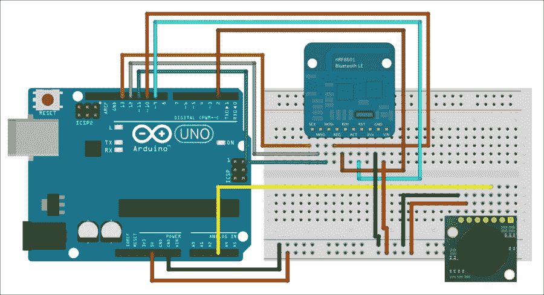

# 第九章. 蓝牙低功耗移动机器人

在本章中，我们将使用本书中学到的几乎所有概念，通过 Android 应用程序控制移动机器人。机器人将有两个我们可以控制的电机，还有一个前方的超声波传感器，以便它可以检测障碍物。机器人还将有一个 BLE 芯片，以便它可以接收来自 Android 应用程序的命令。

应用程序将包含以下基本命令，您需要这些命令来控制机器人：

+   向前移动

+   向后移动

+   向左转

+   向右转

+   显示与机器人的连接状态

本章的主要收获如下：

+   基于 Arduino 平台的移动机器人构建

+   将 BLE 模块连接到 Arduino 机器人

+   构建 Android 应用程序以远程控制机器人

# 硬件和软件要求

让我们先看看这个项目需要什么。

当然，这个项目的基座当然是机器人本身。对于这个项目，我们使用了 DFRobot miniQ 两轮机器人底盘。它包含一个圆形机器人底盘、两个直流电机、两个轮子和一些螺丝和螺栓，以便您可以在其上安装多个 Arduino 板。您基本上可以使用任何等效的机器人底盘，它有两个轮子，配有两个直流电机，并且可以在其上安装 Arduino 兼容板。

为了控制机器人，我们实际上将使用三个不同的 Arduino 板。机器人的“大脑”将是一个简单的 Arduino Uno 板。在其之上，我们将使用 DFRobot 电机盾板来控制机器人的两个直流电机。然后在这两个板子上，我们将放置一个原型板，以便我们可以将不同的模块连接到机器人上。

要远程控制机器人，我们再次使用 BLE。为了给机器人提供 BLE 连接，我们使用了 Adafruit nRF8001 扩展板。

为了让机器人能够检测其前方的东西，我们在项目中添加了一个 URM37 超声波传感器。正如我们将看到的，这个传感器与 Arduino 接口非常简单。

最后，您还需要一些跳线，以便在机器人、传感器和蓝牙模块之间建立不同的连接。

以下是需要为此项目准备的硬件列表，以及这些部件在网上的链接：

+   Arduino Uno 板（[`www.dfrobot.com/index.php?route=product/product&search=uno&description=true&product_id=838`](http://www.dfrobot.com/index.php?route=product/product&search=uno&description=true&product_id=838)）

+   Arduino 电机盾板（[`www.dfrobot.com/index.php?route=product/product&path=35_39&product_id=59`](http://www.dfrobot.com/index.php?route=product/product&path=35_39&product_id=59)）

+   Arduino 原型板（[`www.dfrobot.com/index.php?route=product/product&product_id=55`](http://www.dfrobot.com/index.php?route=product/product&product_id=55)）

+   nRF8001 扩展板（[`www.adafruit.com/products/1697`](https://www.adafruit.com/products/1697)）

+   超声波距离传感器 ([`www.dfrobot.com/index.php?route=product/product&search=ultrasonic&description=true&page=1&product_id=53`](http://www.dfrobot.com/index.php?route=product/product&search=ultrasonic&description=true&page=1&product_id=53))

+   超声波传感器安装套件 ([`www.dfrobot.com/index.php?route=product/product&product_id=322`](http://www.dfrobot.com/index.php?route=product/product&product_id=322))

+   DFRobot miniQ 底盘 ([`www.dfrobot.com/index.php?route=product/product&search=miniq&description=true&product_id=367`](http://www.dfrobot.com/index.php?route=product/product&search=miniq&description=true&product_id=367))

+   7.4 V 电池 ([`www.dfrobot.com/index.php?route=product/product&product_id=489`](http://www.dfrobot.com/index.php?route=product/product&product_id=489))

+   跳线 ([`www.adafruit.com/products/1957`](https://www.adafruit.com/products/1957))

在软件方面，你当然需要 Arduino IDE。你还需要以下内容：

+   用于 nRF8001 芯片的库 ([`github.com/adafruit/Adafruit_nRF8001`](https://github.com/adafruit/Adafruit_nRF8001))

+   用于向机器人发送命令的 aREST 库 ([`github.com/marcoschwartz/aREST`](https://github.com/marcoschwartz/aREST))

## 配置硬件

我们首先将组装机器人本身，然后看看如何连接蓝牙模块和超声波传感器。为了给你一个你最终应该得到的概念，以下是一个完全组装好的机器人的正面视图：


以下图像显示了完全组装好的机器人的背面：


第一步是组装机器人底盘。为此，你可以观看 DFRobot 组装指南 [`www.youtube.com/watch?v=tKakeyL_8Fg`](https://www.youtube.com/watch?v=tKakeyL_8Fg)。

然后，你需要将不同的 Arduino 板和屏蔽板连接到机器人上。使用机器人底盘套件中找到的垫圈首先安装 Arduino Uno 板。然后，将 Arduino 电机屏蔽板放在上面。此时，使用螺丝端子连接两个直流电机到电机屏蔽板上。此时应该看起来是这样的：


最后，将原型板安装在电机板上。

我们现在将连接 BLE 模块和超声波传感器到 Arduino 原型板上。以下是一个示意图，显示了 Arduino Uno 板（在我们的案例中是通过原型板完成的）和组件之间的连接：



现在执行以下步骤：

1.  首先，我们现在将连接 BLE 模块。

1.  将模块放置在原型板上。

1.  按照以下方式连接模块的电源：**GND** 连接到原型板上的 **GND** 引脚，**VIN** 连接到原型板上的 +5V。

1.  之后，您需要连接负责 SPI 接口的不同电线：**SCK**连接到 Arduino 引脚**13**，**MISO**连接到 Arduino 引脚**12**，**MOSI**连接到 Arduino 引脚**11**。

1.  然后将**REQ**引脚连接到 Arduino 引脚**10**。

1.  最后，将**RDY**引脚连接到 Arduino 引脚**2**，将**RST**引脚连接到 Arduino 引脚**9**。

1.  对于 URM37 模块，将模块的**VCC**引脚连接到 Arduino +5V，**GND**连接到**GND**，**PWM**引脚连接到 Arduino **A3**引脚。

    ### 注意

    要查看 URM37 模块上的引脚顺序，您可以检查 DFRobot 官方文档[`www.dfrobot.com/wiki/index.php?title=URM37_V3.2_Ultrasonic_Sensor_(SKU:SEN0001)`](http://www.dfrobot.com/wiki/index.php?title=URM37_V3.2_Ultrasonic_Sensor_(SKU:SEN0001))。

    以下是与 BLE 模块连接的印刷电路板的特写图像：

    

1.  最后，将 7.4V 电池连接到 Arduino Uno 板的电源插孔。电池只需放在 Arduino Uno 板下面。

## 测试机器人

现在，我们将编写一个草图来测试机器人的不同功能，首先不使用蓝牙。由于草图相当长，我们将逐部分查看代码。在您继续之前，请确保电池始终插入到机器人中。现在执行以下步骤：

1.  草图首先包含我们将用于通过串行命令控制机器人的 aREST 库：

    ```java
    #include <aREST.h>
    ```

1.  现在我们声明电机连接到的引脚：

    ```java
    int speed_motor1 = 6;  
    int speed_motor2 = 5;
    int direction_motor1 = 7;
    int direction_motor2 = 4;
    ```

1.  我们还声明超声波传感器连接到的引脚：

    ```java
    int distance_sensor = A3;
    ```

1.  然后，我们创建 aREST 库的一个实例：

    ```java
    aREST rest = aREST();
    ```

1.  为了存储超声波传感器测量的距离数据，我们声明一个距离变量：

    ```java
    int distance;
    ```

1.  在草图的`setup()`函数中，我们首先初始化我们将用于与机器人通信的串行通信：

    ```java
    Serial.begin(115200);
    ```

1.  我们还将距离变量暴露给 REST API，这样我们就可以轻松访问它：

    ```java
    rest.variable("distance",&distance);
    ```

1.  为了控制机器人，我们将声明一组函数来执行基本操作：前进、后退、自身转向（左或右）和停止。我们将在稍后看到这些函数的详细信息；现在，我们只需要将它们暴露给 API：

    ```java
    rest.function("forward",forward);
    rest.function("backward",backward);
    rest.function("left",left);
    rest.function("right",right);
    rest.function("stop",stop);
    ```

1.  我们还为机器人分配一个 ID 和名称：

    ```java
    rest.set_id("001");
    rest.set_name("mobile_robot");
    ```

1.  在草图的`loop()`函数中，我们首先测量传感器距离：

    ```java
    distance = measure_distance(distance_sensor);
    ```

1.  我们然后使用 aREST 库处理请求：

    ```java
    rest.handle(Serial);  
    ```

1.  现在，我们将查看控制电机的函数。它们都是基于控制单个电机的函数，其中我们需要设置电机引脚、速度和电机的方向：

    ```java
    void send_motor_command(int speed_pin, int direction_pin, int pwm, boolean dir)
    {
      analogWrite(speed_pin, pwm); // Set PWM control, 0 for stop, and 255 for maximum speed
      digitalWrite(direction_pin, dir); // Dir set the rotation direction of the motor (true or false means forward or reverse)
    }
    ```

1.  基于此函数，我们现在可以定义不同的函数来移动机器人，例如`forward`：

    ```java
    int forward(String command) {

      send_motor_command(speed_motor1,direction_motor1,100,1);
      send_motor_command(speed_motor2,direction_motor2,100,1);
      return 1;
    }
    ```

1.  我们还定义了一个`backward`函数，简单地反转两个电机的方向：

    ```java
    int backward(String command) {
      send_motor_command(speed_motor1,direction_motor1,100,0);
      send_motor_command(speed_motor2,direction_motor2,100,0);
      return 1;
    }
    ```

1.  要使机器人向左转，我们只需使电机以相反的方向旋转：

    ```java
    int left(String command) {
      send_motor_command(speed_motor1,direction_motor1,75,0);
      send_motor_command(speed_motor2,direction_motor2,75,1);
      return 1;
    }
    ```

1.  我们还有一个停止机器人的函数：

    ```java
    int stop(String command) {
      send_motor_command(speed_motor1,direction_motor1,0,1);
      send_motor_command(speed_motor2,direction_motor2,0,1);
      return 1;
    }
    ```

还有一个使机器人向右转的函数，这里没有详细说明。请注意，本章中使用的所有代码都可以在本书的 GitHub 仓库[`github.com/marcoschwartz/arduino-android-blueprints`](https://github.com/marcoschwartz/arduino-android-blueprints)中找到。

现在我们将测试机器人。在你做任何事情之前，确保电池始终插入到机器人中。这将确保电机不会试图从你的计算机 USB 端口获取电力，这可能会损坏它。

还在机器人的底部放置一些小支撑，这样车轮就不会接触地面。这将确保你可以测试机器人的所有命令，而机器人不会离你的计算机太远，因为它仍然通过 USB 电缆连接。

现在，你可以将草图上传到你的 Arduino Uno 板。打开串行监视器并输入以下内容：

```java
/forward

```

这应该会使机器人的两个车轮朝同一方向转动。你也可以尝试其他命令来移动机器人，以确保它们都能正常工作。然后，通过输入以下内容来测试超声波距离传感器：

```java
/distance

```

你应该会得到传感器前方的距离（以厘米为单位）：

```java
{"distance": 24, "id": "001", "name": "mobile_robot", "connected": true}

```

尝试通过将手放在传感器前并再次输入命令来改变距离。

# 编写 Arduino 草图

现在我们已经确认机器人工作正常，我们可以编写最终的草图，该草图将通过蓝牙接收命令。由于草图与测试草图有很多相似之处，我们只将看到与测试草图相比增加了什么。我们首先需要包含更多的库：

```java
#include <SPI.h>
#include "Adafruit_BLE_UART.h"
#include <aREST.h>
```

我们还定义了 BLE 模块连接的引脚：

```java
#define ADAFRUITBLE_REQ 10
#define ADAFRUITBLE_RDY 2     // This should be an interrupt pin, on Uno thats #2 or #3
#define ADAFRUITBLE_RST 9
```

我们必须创建 BLE 模块的一个实例：

```java
Adafruit_BLE_UART BTLEserial = Adafruit_BLE_UART(ADAFRUITBLE_REQ, ADAFRUITBLE_RDY, ADAFRUITBLE_RST);
```

在草图中的`setup()`函数中，我们初始化 BLE 芯片：

```java
BTLEserial.begin();
```

在`loop()`函数中，我们检查 BLE 芯片的状态并将其存储在一个变量中：

```java
BTLEserial.pollACI();
aci_evt_opcode_t status = BTLEserial.getState();
```

如果我们检测到设备连接到芯片，我们将使用 aREST 库处理传入的请求，这将允许我们使用与之前相同的命令来控制机器人：

```java
if (status == ACI_EVT_CONNECTED) {
  rest.handle(BTLEserial);
}
```

现在，你可以通过确保电池通过电源插头连接到 Arduino Uno 板来上传代码。现在你可以继续开发用于控制机器人的 Android 应用程序。

## 设置 Android 应用程序

我们将要创建的 Android 应用程序将使我们能够通过 BLE 从物理 Android 设备控制机器人。该应用程序将具有五个基本控制功能，即**前进**、**后退**、**左转**、**右转**和**停止**。此外，它还将显示 BLE 连接状态，并且将有一个**刷新**按钮，允许我们刷新蓝牙回调。

我们将假设您已经在您的首选项中开启了`自动导入`功能。如果没有，请通过访问**自动导入**首选项并选择所有可用选项来激活它。**自动导入**首选项在 Mac 和 Windows 上的位置如下：

+   在 Mac 上，导航到**Android Studio** > **首选项** > **编辑器** > **自动导入**

+   在 Windows 上，导航到**文件** > **设置** > **编辑器** > **自动导入**

在所有必要的设置就绪后，我们将开始创建一个新的项目，在**新建项目**设置向导中，我们将选择以下内容：

+   **名称**：`移动机器人`

+   **最小 SDK**：`18`

+   **项目**：`空白活动`

+   **活动名称**：`RobotControlActivity`

+   **域名**：`arduinoandroid.com`

## 布局 Android 用户界面和设置权限

为了使这个项目工作，我们首先需要转到 Android 的`Manifest`文件，该文件位于`app` > `src` > `main` > `AndroidManifest.xml`。

由于这个 Android 应用程序使用 BLE 将 Android 物理设备连接到机器人，我们需要将以下权限添加到 Android 的`Manifest`文件中。这些权限将允许应用程序连接到已发现的配对蓝牙设备：

```java
<uses-permission android:name="android.permission.BLUETOOTH"/>
<uses-permission android:name="android.permission.BLUETOOTH_ADMIN"/>
```

下一步，我们将设置一个非常基本的 Android 布局文件，以便我们可以实现应用程序的功能并允许用户激活语音识别意图。

在我们的项目中，我们将导航到主布局文件，该文件可以通过`app` > `src` > `res` > `layout` > `activity_robot_control.xml`访问。

Android 用户界面设计中有多种布局格式，在这种情况下，我们将使用一个水平线性布局，其中包含一个垂直线性布局作为子布局。牢记这些概念，我们将用以下代码行替换当前代码：

```java
<LinearLayout
    android:orientation="vertical"
    android:layout_width="fill_parent"
    android:layout_height="fill_parent"
    >

    <Button
        android:layout_width="wrap_content"
        android:layout_height="wrap_content"
        android:text="Connect"
        android:id="@+id/connectBtn"
        android:layout_gravity="center_horizontal"
        />

    <Button
        style="?android:attr/buttonStyleSmall"
        android:layout_width="wrap_content"
        android:layout_height="wrap_content"
        android:text="Forward"
        android:id="@+id/fwdBtn"
        android:layout_gravity="center_horizontal"
        />

    <LinearLayout
        android:orientation="horizontal"
        android:layout_width="fill_parent"
        android:layout_height="57dp">

        <Button
            style="?android:attr/buttonStyleSmall"
            android:layout_width="wrap_content"
            android:layout_height="wrap_content"
            android:text="Left"
            android:id="@+id/leftBtn"
            android:layout_weight="1"
            />

        <Button
            android:layout_width="wrap_content"
            android:layout_height="wrap_content"
            android:text="Stop"
            android:id="@+id/stopBtn"
            android:layout_gravity="center_horizontal"
            android:layout_weight="1"
            />

        <Button
            style="?android:attr/buttonStyleSmall"
            android:layout_width="wrap_content"
            android:layout_height="wrap_content"
            android:text="Right"
            android:id="@+id/rightBtn"
            android:layout_weight="1"
            />

    </LinearLayout>

    <Button
        android:layout_width="wrap_content"
        android:layout_height="wrap_content"
        android:text="Backward"
        android:id="@+id/backwardBtn"
        
		android:layout_gravity="center_horizontal"
        />

    <TextView
        android:layout_width="wrap_content"
        android:layout_height="wrap_content"
        android:text="Connection Status View"
        android:id="@+id/connectionStsView"
        android:layout_gravity="center_horizontal"
        />

</LinearLayout>
```

在这一点上，您应该得到以下截图所示的内容。这是基于 LG Nexus 5：


## 编写应用程序的内部代码

在这一点上，我们想要开始将我们刚刚设计的 Android 用户界面连接到主要的 Android 代码，我们将通过打开`RobotControlActivity.java`文件来开始这个过程，该文件位于`app` > `src` > `main` > `java` > `包名` > `RobotControlActivity.java`。

我们将首先声明用户界面元素变量以及主要变量，我们可以使用它进行日志记录，如下所示：

```java
//User Interface Elements
    Button fwdBtn;
    Button leftBtn;
    Button rightBtn;
    Button backBtn;
    Button stopBtn;
    Button connectBtn;
    TextView connectionSts;

    //Logging Variables
    private final String LOG_TAG = RobotControlActivity.class.getSimpleName();
```

我们将为`BluetoothCallback`变量声明所有必要的变量，其中我们将主要声明与我们的特定 BLE 模块相关的 UUID，然后是蓝牙适配器变量和特性：

```java
    // UUIDs for UAT service and associated characteristics.
    public static UUID UART_UUID = UUID.fromString("6E400001-B5A3-F393-E0A9-E50E24DCCA9E");
    public static UUID TX_UUID = UUID.fromString("6E400002-B5A3-F393-E0A9-E50E24DCCA9E");
    public static UUID RX_UUID = UUID.fromString("6E400003-B5A3-F393-E0A9-E50E24DCCA9E");

    // UUID for the BTLE client characteristic which is necessary for notifications.
    public static UUID CLIENT_UUID = UUID.fromString("00002902-0000-1000-8000-00805f9b34fb");

    // BTLE states
    private BluetoothAdapter adapter;
    private BluetoothGatt gatt;
    private BluetoothGattCharacteristic tx;
    private BluetoothGattCharacteristic rx;
```

然后，我们将继续到`onCreate()`方法，并将不同的用户界面元素连接到代码中：

```java
        fwdBtn = (Button) findViewById(R.id.fwdBtn);
        leftBtn = (Button) findViewById(R.id.leftBtn);
        rightBtn = (Button) findViewById(R.id.rightBtn);
        backBtn = (Button) findViewById(R.id.backwardBtn);
        stopBtn = (Button) findViewById(R.id.stopBtn);
        connectBtn = (Button) findViewById(R.id.connectBtn);

        connectionSts = (TextView)findViewById(R.id.connectionStsView);
```

在这个项目中，我们希望在用户点击按钮时向我们的机器人发送特定的 BLE 消息，在这个部分，我们将为之前连接的按钮添加`onClickListeners`以发送我们需要与机器人接口的消息：

```java
fwdBtn.setOnClickListener(new View.OnClickListener() {
            @Override
            public void onClick(View view) {
                String setOutputMessage = "/forward /";
                tx.setValue(setOutputMessage.getBytes(Charset.forName("UTF-8")));
                if (gatt.writeCharacteristic(tx)) {
                    writeConnectionData("Sent: " + setOutputMessage);
                } else {
                    writeConnectionData("Couldn't write TX characteristic!");
                }
            }
        });

        leftBtn.setOnClickListener(new View.OnClickListener() {
            @Override
            public void onClick(View view) {
                String setOutputMessage = "/left /";
                tx.setValue(setOutputMessage.getBytes(Charset.forName("UTF-8")));
                if (gatt.writeCharacteristic(tx)) {
                    writeConnectionData("Sent: " + setOutputMessage);
                } else {
                    writeConnectionData("Couldn't write TX characteristic!");
                }
            }
        });

        rightBtn.setOnClickListener(new View.OnClickListener() {
            @Override
            public void onClick(View view) {
                String setOutputMessage = "/right /";
                tx.setValue(setOutputMessage.getBytes(Charset.forName("UTF-8")));
                if (gatt.writeCharacteristic(tx)) {
                    writeConnectionData("Sent: " + setOutputMessage);
                } else {
                    writeConnectionData("Couldn't write TX characteristic!");
                }
            }
        });
        backBtn.setOnClickListener(new View.OnClickListener() {
            @Override
            public void onClick(View view) {
                String setOutputMessage = "/backward /";
                tx.setValue(setOutputMessage.getBytes(Charset.forName("UTF-8")));
                if (gatt.writeCharacteristic(tx)) {
                    writeConnectionData("Sent: " + setOutputMessage);
                } else {
                    writeConnectionData("Couldn't write TX characteristic!");
                }
            }
        });
        stopBtn.setOnClickListener(new View.OnClickListener() {
            @Override
            public void onClick(View view) {
                String setOutputMessage = "/stop /";
                tx.setValue(setOutputMessage.getBytes(Charset.forName("UTF-8")));
                if (gatt.writeCharacteristic(tx)) {
                    writeConnectionData("Sent: " + setOutputMessage);
                } else {
                    writeConnectionData("Couldn't write TX characteristic!");
                }
            }
        });

        connectBtn.setOnClickListener(new View.OnClickListener() {
            @Override
            public void onClick(View view) {

                restartScan();
            }
        });
```

在下一节中，我们需要声明一个新的方法，我们将将其命名为`writeConnectionData`。其主要作用是将蓝牙回调的状态写入连接状态文本视图：

```java
private void writeConnectionData(final CharSequence text) {
        Log.e(LOG_TAG, text.toString());
        connectionSts.setText(text.toString());
    }
```

以下代码是所有必要的蓝牙回调，这些回调需要在 Android 物理设备和机器人上的 BLE 模块之间建立连接：

```java
private BluetoothGattCallback bluetoothGattCallback = new BluetoothGattCallback() {
        // Called whenever the device connection state changes, i.e. from disconnected to connected.
        @Override
        public void onConnectionStateChange(BluetoothGatt gatt, int status, int newState) {
            super.onConnectionStateChange(gatt, status, newState);
            if (newState == BluetoothGatt.STATE_CONNECTED) {
                writeConnectionData("Connected!");
                // Discover services.
                if (!gatt.discoverServices()) {
                    writeConnectionData("Failed to start discovering services!");
                }
            } else if (newState == BluetoothGatt.STATE_DISCONNECTED) {
                writeConnectionData("Disconnected!");
            } else {
                writeConnectionData("Connection state changed.  New state: " + newState);
            }
        }

        // Called when services have been discovered on the remote device.
        // It seems to be necessary to wait for this discovery to occur before
        // manipulating any services or characteristics.
        public void onServicesDiscovered(BluetoothGatt gatt, int status) {
            super.onServicesDiscovered(gatt, status);
            if (status == BluetoothGatt.GATT_SUCCESS) {
                writeConnectionData("Service discovery completed!");
            } else {
                writeConnectionData("Service discovery failed with status: " + status);
            }
            // Save reference to each characteristic.
            tx = gatt.getService(UART_UUID).getCharacteristic(TX_UUID);
            rx = gatt.getService(UART_UUID).getCharacteristic(RX_UUID);

            // Setup notifications on RX characteristic changes (i.e. data received).
            // First call setCharacteristicNotification to enable notification.
            if (!gatt.setCharacteristicNotification(rx, true)) {
                writeConnectionData("Couldn't set notifications for RX characteristic!");
            }

            // Next update the RX characteristic's client descriptor to enable notifications.
            if (rx.getDescriptor(CLIENT_UUID) != null) {
                BluetoothGattDescriptor desc = rx.getDescriptor(CLIENT_UUID);
                desc.setValue(BluetoothGattDescriptor.ENABLE_NOTIFICATION_VALUE);
                if (!gatt.writeDescriptor(desc)) {
                    writeConnectionData("Couldn't write RX client descriptor value!");
                }
            } else {
                writeConnectionData("Couldn't get RX client descriptor!");
            }
            areServicesAccessible = true;
        }
    };
```

安卓应用程序的生命周期使我们能够添加可以在生命周期不同部分激活的方法。以下`onStart()`和`onStop()`方法，分别在启动和退出应用程序时被调用，使我们能够节省设备的能量和内存资源：

```java
protected void onStart() {
        Log.d(LOG_TAG,"onStart has been called");
        super.onStart();
        // / Scan for all BTLE devices.
        // The first one with the UART service will be chosen--see the code in the scanCallback.
        adapter = BluetoothAdapter.getDefaultAdapter();
        startScan();
    }

    //When this Activity isn't visible anymore
    protected void onStop() {
        Log.d(LOG_TAG,"onStop has been called");
        //disconnect and close Bluetooth Connection for better reliability
        if (gatt != null) {
            gatt.disconnect();
            gatt.close();
            gatt = null;
            tx = null;
            rx = null;
        }
        super.onStop();
    }
```

为了允许启动、停止和重新启动蓝牙扫描，我们需要声明执行这些特定操作的方法，这正是以下代码的目的：

```java
private void startScan() {
        if (!adapter.isEnabled()) {
            adapter.enable();
        }
        if (!adapter.isDiscovering()) {
            adapter.startDiscovery();
        }
        writeConnectionData("Scanning for devices...");
        adapter.startLeScan(scanCallback);
    }

    private void stopScan() {
        if (adapter.isDiscovering()) {
            adapter.cancelDiscovery();
        }
        writeConnectionData("Stopping scan");
        adapter.stopLeScan(scanCallback);
    }

    private void restartScan() {
        stopScan();
        startScan();
    }
```

蓝牙回调最重要的部分是连接到正确的 BLE 设备，以下代码帮助用户实现这一点：

```java
private BluetoothAdapter.LeScanCallback scanCallback = new BluetoothAdapter.LeScanCallback() {
        // Called when a device is found.
        @Override
        public void onLeScan(BluetoothDevice bluetoothDevice, int i, byte[] bytes) {
            Log.d(LOG_TAG, bluetoothDevice.getAddress());

            writeConnectionData("Found device: " + bluetoothDevice.getAddress());

            // Check if the device has the UART service.
            if (BluetoothUtils.parseUUIDs(bytes).contains(UART_UUID)) {
                // Found a device, stop the scan.
                adapter.stopLeScan(scanCallback);
                writeConnectionData("Found UART service!");
                // Connect to the device.
                // Control flow will now go to the bluetoothGattCallback functions when BTLE events occur.
                gatt = bluetoothDevice.connectGatt(getApplicationContext(), false, bluetoothGattCallback);
            }
        }
    };
```

与前几章不同，UUID 解析已被移动到`utility`类中，以便重构代码并使其更易于阅读。为了创建一个`utility`类，我们首先需要右键单击我们的包名，创建一个新的名为`Bluetooth`的包。

之后，我们将右键单击新包，选择**新建** > **Java 类**，并将新类命名为`BluetoothUtils`。

在前两个步骤之后，我们将用以下代码替换类中的代码：

```java
public class BluetoothUtils {

    // Filtering by custom UUID is broken in Android 4.3 and 4.4, see:
    //   http://stackoverflow.com/questions/18019161/startlescan-with-128-bit-uuids-doesnt-work-on-native-android-ble-implementation?noredirect=1#comment27879874_18019161
    // This is a workaround function from the SO thread to manually parse advertisement data.
    public static List<UUID> parseUUIDs(final byte[] advertisedData) {
        List<UUID> uuids = new ArrayList<UUID>();

        int offset = 0;
        while (offset < (advertisedData.length - 2)) {
            int len = advertisedData[offset++];
            if (len == 0)
                break;

            int type = advertisedData[offset++];
            switch (type) {
                case 0x02: // Partial list of 16-bit UUIDs
                case 0x03: // Complete list of 16-bit UUIDs
                    while (len > 1) {
                        int uuid16 = advertisedData[offset++];
                        uuid16 += (advertisedData[offset++] << 8);
                        len -= 2;
                        uuids.add(UUID.fromString(String.format("%08x-0000-1000-8000-00805f9b34fb", uuid16)));
                    }
                    break;
                case 0x06:// Partial list of 128-bit UUIDs
                case 0x07:// Complete list of 128-bit UUIDs
                    // Loop through the advertised 128-bit UUID's.
                    while (len >= 16) {
                        try {
                            // Wrap the advertised bits and order them.
                            ByteBuffer buffer = ByteBuffer.wrap(advertisedData, offset++, 16).order(ByteOrder.LITTLE_ENDIAN);
                            long mostSignificantBit = buffer.getLong();
                            long leastSignificantBit = buffer.getLong();
                            uuids.add(new UUID(leastSignificantBit,
                                    mostSignificantBit));
                        } catch (IndexOutOfBoundsException e) {
                            // Defensive programming.
                            //Log.e(LOG_TAG, e.toString());
                            continue;
                        } finally {
                            // Move the offset to read the next uuid.
                            offset += 15;
                            len -= 16;
                        }
                    }
                    break;
                default:
                    offset += (len - 1);
                    break;
            }
        }
        return uuids;
    }
}
```

到目前为止，你可以继续构建并运行项目，在一个运行 Android 4.3 且蓝牙已开启的安卓物理设备上。

# 进一步增强用户界面

一旦我们成功完成了代码，并确保用户界面包含了控制机器人所需的所有基本功能，我们就可以继续改进我们的用户界面。

我们将通过两个主要动作来改进用户界面：

+   添加新的应用图标

+   设计用户界面按钮样式

## 添加新的应用图标

首先，我们将下载图像资源。它可以在 GitHub 仓库中找到，也可以在[`bit.ly/mobileroboticon`](http://bit.ly/mobileroboticon)作为公开下载。

你应该导航到项目树，然后右键单击**app**。

当你右键单击**app**时，通过**新建** > **图像资源**创建一个新的图像资源。

然后您将看到一个**Asset Studio**弹出窗口，它将允许您选择您自己的图像文件。出于优化的目的，我们建议您选择一个 144 像素乘以 144 像素分辨率的`.png`文件。Android Studio 会自动进行所有调整大小和资源创建，以适应不同屏幕的图形。

一旦您选择了我们提供的`ic_launcher`图像文件，您将看到一个显示不同尺寸图标的屏幕。点击**下一步**，您将看到不同尺寸的启动器图标屏幕。

此屏幕警告您将覆盖以前的文件，并再次以多种分辨率显示图像启动器文件。点击**完成**。然后编译应用程序，在您的物理设备上启动它，您应该在应用程序托盘和应用程序的操作栏中看到一些令人愉快的东西。

## 用户界面按钮的样式

我们将要采取的最终步骤是修改我们的按钮并给文本添加一些颜色。

在创建新按钮时，需要执行两个步骤：

1.  在`res`文件夹内创建一个名为`button.xml`的新 XML 可绘制文件。

1.  然后将可绘制资源文件连接到主 Android 布局文件。

通过右键单击`res`文件夹创建`Drawable`文件夹，该文件夹位于`App` > `src` > `main` > `res`。

在`res`文件夹内创建`Drawable`文件夹后，我们需要再次右键单击新的`drawable`文件夹，并导航到**新建** > **可绘制资源文件**。

将文件命名为`buttonshape`，将根元素类型设置为`shape`，然后点击**确定**。

在`button.xml`文件中，将当前代码替换为以下内容：

```java
<shape >
    <corners
        android:radius="30dp"/>
    <solid
        android:color="#FFFFFF"/>
    <padding
        android:left="10dp"
        android:top="10dp"
        android:right="10dp"
        android:bottom="10dp"/>
    <stroke
        android:width="2dp"
        android:color="#4A90E2"/>
</shape>
```

到目前为止，按钮尚未修改，因此我们将转到机器人控制活动布局文件，该文件位于`app` > `main` > `res` > `layout` > `activity_robot_control.xml`。

在此文件中，我们还将把`buttonshape.xml`文件中的更改连接到主布局文件，并为按钮添加`margin`，以便在按钮之间有足够的间距，以形成一个可展示的布局。

我们将向所有按钮元素添加以下代码，以赋予它们`buttonshape`样式：

```java
android:background="@drawable/buttonshape"
```

之后，我们将通过在**连接**、**后退**和**前进**按钮中添加以下代码来添加边距：

```java
android:layout_margin="10dp"
```

对于左右按钮，由于它们位于不同类型的布局中，我们将添加以下代码：

```java
android:layout_marginLeft="10dp"
android:layout_marginRight="10dp"
```

到目前为止，您应该有一个布局，看起来像以下截图中的 Nexus 4，这对用户来说更吸引人，更易于展示：


## 如何进一步操作

可以通过添加更精细的控制来进一步改进 Android 应用程序，这些控制可以量化您希望机器人向左或向右转的确切角度。我们还可以从超声波传感器中提取数据，并在 Android 应用程序中显示，以获取关于障碍物接近程度的数据。

此外，Android 应用程序将肯定从添加一个**连接**对话框中受益，该对话框显示用户所有可用的 BLE 设备，用户可以选择连接到机器人的 BLE 芯片。这将增强用户体验，同时提供与机器人更稳定的连接，尤其是在您在一个周围有其他 BLE 发射器的环境中工作时。

最后但同样重要的是，读者还可以进一步修改用户界面和布局，使应用程序更具吸引力和可展示性。我们的主要建议是遵循[`developer.android.com`](http://developer.android.com)上可用的设计指南。

# 摘要

在本章中，我们成功创建了自己的移动机器人，并附带了一个 Android 应用程序，我们可以使用它来控制我们的机器人。

我们通过设置一个 Arduino 启用的机器人和编写配套的 Android 应用程序逐步实现了这一点。它使用运行在 Android 4.3 或更高版本的 Android 物理设备的 BLE 软件和硬件。

在最后一章中，我们将考虑一种更直接的用户交互形式，通过使用 Android、Arduino 和特定传感器来测量我们的脉搏率。
