# 第二章：蓝牙宠物门锁

这个项目是关于一个宠物门控制器，通过测量外部光照和温度，锁定或解锁你的房屋宠物门。通过 iOS 设备，你可以检查门的状态（锁定或解锁）并手动覆盖 Arduino 上实现的逻辑以手动锁定门。

在这个项目中，你将学习如何与模拟传感器、开关、1-Wire 传感器（用于测量温度）以及连接到 Arduino 的伺服电机进行交互。此外，你还将为 Arduino 连接一个蓝牙 4.0 板，以便与你的 iOS 设备通信。

然后，你将学习如何编写一个蓝牙 iOS 应用程序，用于从 Arduino 发送和接收数据。

在本章的结尾，我们将讨论不同类型的传感器及其与 Arduino 的通信协议，以便学习如何管理最常用的测量技术。

这个项目需要一些 DIY 技能，以便将锁具安装到宠物门上，并将其连接到伺服电机。

本章分为以下部分：

+   **门锁要求**：我们将简要回顾项目要求

+   **硬件**：我们将描述项目所需的硬件和电子电路

+   **Arduino 代码**：我们将为 Arduino 编写代码以控制闩锁并与 iOS 设备通信

+   **iOS 代码**：我们将为 iOS 设备编写代码

+   **如何进一步发展**：更多改进项目和学习的想法

+   **不同类型的传感器**：对模拟和数字传感器、低级通信协议及其优缺点的快速概述

# 门锁要求

我们将构建一个自动系统，允许你在以下不同场景下锁定宠物门：

+   在夜间，当外部光照低于预定义的阈值时

+   当外部温度对于你心爱的宠物来说过低或过高时，即当温度低于预定义的阈值或高于预定义的阈值时

此外，我们还需要在 iOS 设备上查看外部温度，了解宠物门是否锁定或解锁，并手动覆盖自动行为，手动锁定门。

# 硬件

在这个项目中，我们必须构建一个基于闩锁和伺服电机的机电装置，用于锁定/解锁宠物门。此外，我们还需要构建一个简单的电子电路来读取传感器。

## 必备材料和电子元件

要构建锁具，你需要少量硬件，这些硬件可以在你当地的五金店找到：

+   一个小门闩，最好是平的且没有凹槽。由于它必须由伺服电机操作，因此它必须滑动非常顺畅。

+   一些螺母和螺栓，用于将闩锁安装到门上。

+   几厘米的金属线（直径约 2 毫米）。

其他必备元件包括：

+   5V 供电的微型伺服电机。

+   通常闭合的磁开关和一个小磁铁。

+   一个光敏电阻。

+   电阻：2 × 10K，1 × 4.7K。

+   一个数字 DS18B20 温度传感器。它比模拟传感器（如 TMP 35）贵，但精度更高，读数几乎不受电压波动和电噪声的影响。

+   Adafruit Bluefruit LE nRF8001 开发板 ([`www.adafruit.com/product/1697`](http://www.adafruit.com/product/1697))。

## 组装闩锁和伺服电机

要组装闩锁，可以参考以下图片。

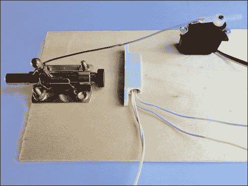

小磁铁被粘贴在闩锁上，因此当它完全缩回时，磁开关是打开的。

光敏电阻和温度传感器必须放置在室外，并连接到 Arduino。它们需要防止湿气和灰尘，因此最好将它们放在一个小塑料盒内。盒子必须钻孔，以便空气可以自由流通，帮助温度传感器正确测量。此外，光敏电阻不应暴露在直射光下，以免失明。一个小塑料管可以完成这项工作。

## 电子电路

以下图片显示了项目所需的电子电路的电原理图：

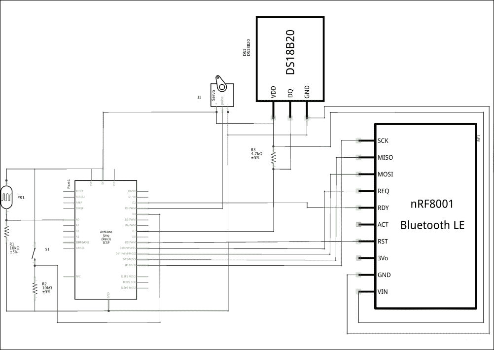

以下图片显示了如何在面包板上安装电路：

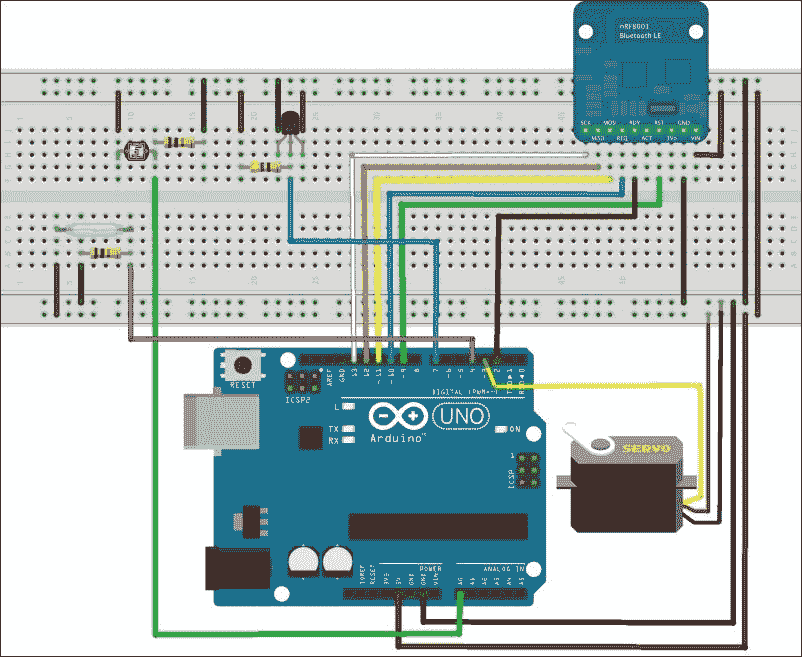

为了快速参考，以下列表总结了 **nRF8001** 的接线：

+   SCK 连接到数字引脚 13

+   MISO 连接到数字引脚 12

+   MOSI 连接到数字引脚 11

+   REQ 连接到数字引脚 10

+   RST 连接到数字引脚 9

+   RDY 连接到数字引脚 2

如果你使用的是 **Arduino MEGA** 而不是 **UNO**，则 **nRF8001** 板的接线必须按以下方式更改：

+   SCK 连接到数字引脚 52

+   MISO 连接到数字引脚 50

+   MOSI 连接到数字引脚 51

+   REQ 连接到数字引脚 10

+   RST 连接到数字引脚 9

+   RDY 连接到数字引脚 2

光线是通过光敏电阻和 Arduino 的模拟输入（A0）测量的。光敏电阻是一种电阻随入射光强度增加而减小的器件。在电路中，光敏电阻与 R1 串联。如果光敏电阻上的光增加，R1 上的电压也会增加，并通过 Arduino 的模拟引脚 A0 进行测量。

### 注意

当光敏电阻未受光照且其电阻非常高时，R1 会强制将 Arduino 输入接地。

在 Arduino 代码中，你可以使用 `analogRead` 函数获取模拟引脚上的电压值。它返回一个在 0-1023 范围内的值，该值与施加到模拟引脚上的电压成正比。

闩锁位置是通过磁开关和 Arduino 的数字输入（D4）确定的。当闩锁上的磁铁靠近时，磁开关关闭。开关与 R2 串联。当开关关闭时，R2 上的电压几乎为 5V，而当开关打开时，约为 0V。

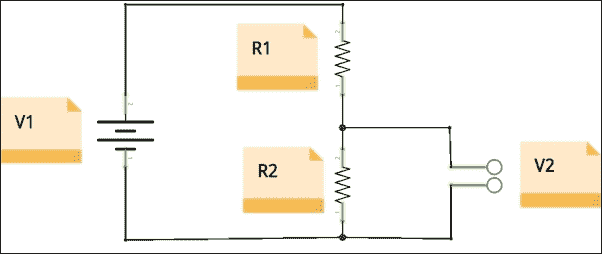

分压器

### 小贴士

分压器是由两个电阻组成的简单电路。假设电路外部的电流可以忽略不计，V2 约等于 *V1*R2/(R1+R2)*。

使用 Arduino 数字输入，你可以确定开关是打开还是关闭。

### 注意

在 Arduino 代码中，你可以使用`digitalRead`函数获取数字引脚的值。

温度传感器是一个使用 1-Wire 协议的数字传感器，它通过数字引脚读取。

### 注意

要读取温度传感器的值，你必须使用`OneWire`库和`DallasTemperature`库，通过这些库，一个函数可以直接返回摄氏度的温度。

伺服电机需要 PWM 信号来控制。脉冲宽度调制是一种使用数字手段获得模拟结果的技术。它是一个周期为 2 毫秒的方波。正脉冲的宽度决定了伺服电机的旋转（例如，1.5 毫秒的脉冲将使电机旋转到 90 度位置）。幸运的是，伺服库（已包含在 IDE 中）隐藏了复杂性，我们只需调用一个带有期望电机位置的函数即可移动电机。

# Arduino 代码

本项目的完整代码可以从这里下载：

[`www.packtpub.com/books/content/support`](https://www.packtpub.com/books/content/support)

为了更好地理解下一段落的解释，你应该在阅读时打开下载的代码。

每个 Arduino 程序几乎总是具有以下结构。

```swift
#include <library_1.h>
#include <library_2.h>

#define SOMETHING A_VALUE

// Function prototypes

void callback_1();

// Global variables

boolean  var_1;

// Called only once at power on or reset

void setup() {

...
}

// Called over and over again

void loop() {
...
}

// Callbacks 

void callback_1() {
...
}

// Additional functions

void function_1() {
...
}
```

指令`#include <library_1.h>`告诉编译器使用一个库，而指令`#define SOMETHING A_VALUE`告诉编译器在程序中所有地方用`A_VALUE`替换`SOMETHING`。如果你使用定义的值，那么更改会更简单。如果你需要将`A_VALUE`替换为其他内容，你可以在一个地方而不是在代码的所有实例中这样做。

函数原型通常用于在代码中使用但将主体放在程序源代码末尾的函数。全局变量是那些需要在程序执行期间保留其值的变量。`setup`函数用于初始化库和变量；它只在板子上电或复位时调用一次。相反，`loop`函数会反复调用。在`loop`函数中定义的变量在调用之间会丢失其值；这就是为什么我们需要全局变量的原因。回调函数是在库中发生事件或数据可用于处理时被调用的。相反，从`loop`中调用的函数有助于使代码更容易阅读、维护和调试。

## 安装额外的必需库

对于这个项目，我们需要一些库。其中一些已经在 Arduino IDE 中可用，而其他则需要添加（例如，`OneWire`、`DallasTemperature`和`Adafruit_BLE_UART`）。

要添加它们，请遵循以下简单步骤：

1.  选择菜单项**Sketch** | **Include Library** | **Manage Libraries**。

1.  在搜索框中输入`OneWire`。

1.  选择带有**OneWire**的行并点击**安装**（见下图）。

1.  在搜索框中输入`DallasTemp`，点击**MAX31850**然后**安装**。

1.  在搜索框中输入`nRF8001`，点击**Adafruit nRF8001**然后**安装**。安装额外的必需库

## 初始化全局变量和库

温度传感器使用 1-Wire 协议与 Arduino 通信，因此我们需要`OneWire`库。幸运的是，另一个库（`DallasTemperature`）使得温度读数变得非常简单。我们需要为这两个库创建全局变量：

```swift
OneWire oneWire(ONE_WIRE_BUS);
DallasTemperature sensors(&oneWire);
```

以及一个用于存储传感器地址：

```swift
DeviceAddress temperatureSensorAddress;
```

nRF8001 库的全局变量在一行中：

```swift
Adafruit_BLE_UART uart = Adafruit_BLE_UART(ADAFRUITBLE_REQ, ADAFRUITBLE_RDY, ADAFRUITBLE_RST);
```

### 注意

如果你更改上一行中使用的引脚，你必须在电路布线中也进行更改。

要控制伺服电机，我们需要另一个全局变量：

```swift
Servo myservo;
```

我们还需要两个额外的全局布尔变量：

```swift
boolean  iOSConnected;
boolean  manuallyLocked;
```

第一个变量在 iOS 设备连接到 Arduino 时为真，第二个变量在用户需要无论光照和温度值如何都保持宠物门关闭时为真。

## 设置代码

我们开始设置串行通信库：

```swift
Serial.begin(9600);
while (!Serial); // Leonardo/Micro should wait for serial init
```

这不是严格必要的，但它是写入控制台所必需的，这可能对调试很有用。

然后我们初始化传感器库：

```swift
sensors.begin();
```

我们还读取设备编号 0（我们电路中唯一的设备）的地址：

```swift
if (!sensors.getAddress(temperatureSensorAddress, 0)) 
    Serial.println("Unable to find address for Device 0");
```

### 小贴士

**1-Wire 地址**

每个 1-Wire 设备在制造时都有自己的地址定义，并且不能更改。要对设备执行任何操作，你必须知道其地址。`getAddress`和`search`库函数可以帮助你找到设备的地址。

传感器可以提供不同精度的读数，但我们需要更高的精度时，设备响应就会越慢。就我们的目的而言，我们不需要高精度，因此可以将精度设置为 9 位：

```swift
sensors.setResolution(temperatureSensorAddress, 9);
```

库必须知道伺服电机连接的引脚：

```swift
myservo.attach(SERVOPIN);
```

用于光敏电阻和开关的引脚都需要配置为输入：

```swift
pinMode(PHOTORESISTORPIN, INPUT);
pinMode(SWITCHPIN, INPUT);
```

为了与 nRF8001 板通信，我们需要设置几个回调函数；一个，以知道 iOS 设备何时连接或断开：

```swift
uart.setACIcallback(aciCallback);
```

另一个回调函数用于接收由 iOS 设备发送的数据：

```swift
uart.setRXcallback(rxCallback);
```

当 iOS 设备的数据可用于处理时，nRF8001 库会调用`rxCallback`。

现在我们准备查看代码的主要部分，它实现了控制宠物门和 iOS 通信的算法。

## 主程序

从项目需求中，我们得出结论，Arduino 程序必须实现一个简单的逻辑：

+   读取光强度

+   读取温度

+   如果光强度高于`LIGHT_THRESHOLD`，在`LOW_TEMPERATURE_THRESHOLD`和`HIGH_TEMPERATURE_THRESHOLD`之间的温度下，伺服电机必须移动到`UNLOCK_POSITION`（180 度），否则移动到`LOCK_POSITION`（65 度）

此外，当 iOS 设备连接时，它必须接收有关锁存位置（打开或关闭）和外部的温度信息。

在主循环函数中，我们使用以下方法读取光强度：

```swift
unsigned int light = analogRead(PHOTORESISTORPIN);
```

使用以下方法读取温度：

```swift
boolean lacthIsOpened = digitalRead(SWITCHPIN);
```

并且使用以下方法获取锁存位置：

```swift
sensors.requestTemperatures();
float temperature = sensors.getTempC(temperatureSensorAddress);
```

光是一个在 0-1023（2¹⁰）范围内的值，与光强度成正比，如果锁存器打开，则`latchIsOpened`的值为 true（1），`temperature`是传感器测量的温度。

### 提示

**模拟引脚上的电压**：

Arduino 内部的**模数转换器（ADC**），连接到模拟引脚，使用 10 位将引脚上的电压转换为整数值，这是一个在 0-1023（2¹⁰ 个值）范围内的整数值。

由于模拟引脚上的电压可以在 0V 和 5V（电源电压）之间，因此每个位都有一个值，该值为 5/1024，然后你可以使用此公式计算模拟引脚上的电压：

*电压 = analogRead(<模拟引脚>) * 5/1024*

如果你通过电脑的 USB 端口给 Arduino 供电，电源电压永远不会正好是 5V，通常会更低。为了获得更好的读数，你应该使用数字万用表测量电源电压，并在之前的公式中将 5 替换为实际的电源电压。

在循环函数中，必须调用`pollACI`函数，以便通信库可以接管控制以处理从 iOS 连接的设备接收到的数据。

### 提示

**poolACI**

如果你有一个长而复杂的程序，你可能需要在代码中添加许多`poolACI`调用，以便频繁地允许库接管控制以处理通信。否则，你可能会遇到数据丢失。

核心算法在以下几行中：

```swift
if (!manuallyLocked) {

    if (aboveThreshold(light, LIGHT_THRESHOLD, 30) && betweenThresholds(temperature, LOW_TEMPERATURE_THRESHOLD, HIGH_TEMPERATURE_THRESHOLD)) {
      Serial.println("Unlocked");
      myservo.write(UNLOCKED_POSITION);
    }  

    if (belowThreshold(light, LIGHT_THRESHOLD, 30) || !betweenThresholds(temperature, LOW_TEMPERATURE_THRESHOLD, HIGH_TEMPERATURE_THRESHOLD)) {
      Serial.println("Locked");
      myservo.write(LOCKED_POSITION);
    }

  }
```

如果门没有被手动锁定，灯光强度高于`LIGHT_THRESHOLD`，温度在`LOW_TEMPERATURE_THRESHOLD`和`HIGH_TEMPERATURE_THRESHOLD`之间，可以使用以下指令将伺服电机移动到`UNLOCKED_POSITION`：

```swift
myservo.write(UNLOCKED_POSITION);
```

否则，它将被移动到`LOCKED_POSITION`：

```swift
myservo.write(LOCKED_POSITION);
```

### 提示

**德摩根定理**

这个定理在用任何编程语言编写 if-then-else 语句时非常有用。永远不要忘记它！

not (A or B) = not A and not B

或者

not (A and B) = not A or not B

"A 或 B"的对立条件是"非 A **且** 非 B"，"A 和 B"的对立条件是"非 A **或** 非 B"。

以下两个函数相当直观：

+   `aboveThreshold`(…)

+   `betweenThresholds`(….)

查看下载的代码以获取更多详细信息。

如果`manuallyLocked`为真，则忽略光和温度读数。此变量在`rxCallback`函数中通过从 iOS 设备接收到的消息设置：

```swift
void rxCallback(uint8_t *buffer, uint8_t len) {

  if (len > 0) {

    // Data received from the iOS device
    // Received only one byte which has value 48 (character 0) or 49 (character 1)

    manuallyLocked = buffer[0] - '0';
    if (manuallyLocked) {
      Serial.println("Manual Lock");
      myservo.write(LOCKED_POSITION);
    }

  }
}
```

记住，nRF8001 库在从 iOS 设备发送的数据准备好处理时自动调用 `rxCallback` 函数。

如果门需要上锁，iOS 设备将发送带有 ASCII 字符 1 的一个字节，否则发送 ASCII 字符 0。

ASCII 字符 0 的代码是 48，因此要将它转换为布尔值 false（0），你需要减去 48（或字符'0'，它们是相同的）。从 ASCII 字符 1 减去 48，我们得到布尔值 true（1）。

返回主函数。如果 `iOSConnected` 为真，iOS 设备已连接到 Arduino，并且需要向其传输一些数据。

数据以以下格式发送到 iOS：

```swift
s:latch_position;t:temperature
```

在这里，`latch_position` 通知 iOS 设备闩锁是开启还是关闭，而 `temperature` 是外部温度。

要将数据发送到 iOS，我们使用以下代码：

```swift
if (iOSConnected) {

    // When the iOS device is connected some data are transferred to it

    char buffer[32];
    char tempBuffer[6];

    // Data sent to iOS
    // s:latch_position;t:temperature

    dtostrf(temperature, 0, 2, tempBuffer);

    snprintf(buffer, 32, "s:%d;t:%s", lacthIsOpened, tempBuffer);
    uart.write((uint8_t *)buffer, strlen(buffer));
  }
```

函数 `snprintf` 创建一个按需格式化的缓冲区，然后通过函数 `uart.write((uint8_t *)buffer, strlen(buffer))` 发送到 iOS。

### 提示

**snprintf**

此函数永远不会写入比第二个参数指示的更多字符。这对于编写安全代码非常重要。实际上，如果你写入的字符多于缓冲区大小，很可能会在用于其他目的的内存位置写入，导致微处理器崩溃。崩溃后，微处理器将从 `setup` 函数重新启动程序执行。更多详情请访问 [`bit.ly/1E021no`](http://bit.ly/1E021no) 和 [`bit.ly/1LijDx5`](http://bit.ly/1LijDx5)。

**dtostrf**

不幸的是，在 Arduino 上，`snprintf` 无法处理浮点数，因此我们需要使用 `dtostrf` 将温度（一个浮点数）转换为字符串，然后再在 `snprintf` 中使用它。`dtostrf` 的第二个参数是转换中使用的十进制位数。更多详情请访问：[`bit.ly/1fmj9HV`](http://bit.ly/1fmj9HV)。

我们最后要编写的代码是管理 iOS 设备的连接和断开。这是在 `aciCallback` 函数中完成的。nRF8001 库在以下事件发生时调用此函数：设备开始广播以被其他蓝牙设备发现，外部设备连接，或连接的设备断开。

```swift
void aciCallback(aci_evt_opcode_t event) {

  if (event == ACI_EVT_DEVICE_STARTED)
    Serial.println(F("Advertising started"));

  if (event == ACI_EVT_CONNECTED) {

    iOSConnected = true;

    char buffer[16];
    snprintf(buffer, 16, "m:%d", manuallyLocked);
    uart.write((uint8_t *)buffer, strlen(buffer));
  }

  if (event == ACI_EVT_DISCONNECTED) {
    iOSConnected = false;
  }
}
```

## 测试和调整 Arduino 端

一旦将代码上传到 Arduino（更多详情：[`bit.ly/1JPNAn3`](http://bit.ly/1JPNAn3) 或 [`bit.ly/1KsUhqv`](http://bit.ly/1KsUhqv)），你就可以开始测试它了。

如果足够的光线到达光敏电阻，并且温度在 2 摄氏度到 33 摄氏度之间，伺服应该移动到开启位置，并且闩锁应该完全缩回。

然后，当你覆盖光敏电阻时，闩锁应该关闭。为了测试温度传感器，你可以使用吹风机将温度提高到 3 摄氏度以上，或者使用冰袋将其降低到 2 摄氏度以下。在这两种情况下，闩锁都应该关闭。

你可以通过更改这些定义轻松更改温度阈值：

```swift
#define LOW_TEMPERATURE_THRESHOLD    2
#define HIGH_TEMPERATURE_THRESHOLD   33
```

光阈值可能需要更多的调整，因为光敏电阻读取的值高度依赖于光敏电阻的特性、安装定位和方向。无论如何，更改：

```swift
#define LIGHT_THRESHOLD             700
```

你应该能够找到适合你需求的值。

你可能还需要根据你组装的方式调整伺服电机的开合位置。为了调整位置，你可以更改：

```swift
#define LOCKED_POSITION             180
#define UNLOCKED_POSITION            65
```

这表示电机的位置角度。

# iOS 代码

在本章中，我们将编写 iOS 应用程序，通过该应用程序我们可以连接到 Arduino，了解宠物门是否锁定，读取外部温度，并最终手动锁定它。

本项目的完整代码可以从这里下载：

[`www.packtpub.com/books/content/support`](https://www.packtpub.com/books/content/support)

为了更好地理解下一段落的解释，你应该在阅读时打开下载的代码。

编写应用程序的主要工具是苹果公司提供的 Xcode。我们可以从 Launchpad 启动它，或者在 Finder 中的**应用程序**文件夹中打开它。

### 小贴士

**今天开始开发 iOS 应用程序**

苹果公司提供的 iOS 开发的有用指南可以在以下链接中找到：[`apple.co/MtP2Aq`](http://apple.co/MtP2Aq)。

**Objective-C**

开发 iOS 应用程序使用的语言是 Objective-C。它与 C++类似，你可以在以下链接中找到该语言的介绍：[`apple.co/19FWxfQ`](http://apple.co/19FWxfQ)。

## 创建 Xcode 项目

第一步是创建一个新项目。Xcode 提供了许多不同的项目模板；我们将使用 Tabbed Application，它有两个标签。我们将使用第一个标签作为主应用程序面板，第二个用于扫描 nRF8001 设备。此操作仅在应用程序首次启动时进行一次。

### 小贴士

**Xcode 概述**

你可以在以下链接中找到所有与 Xcode 相关的工作所需信息：[`apple.co/1UQnMtS`](http://apple.co/1UQnMtS)。

要创建新项目，我们可以按照以下步骤进行（见以下截图）：

1.  前往**文件** | **新建** | **项目 …**。

1.  在左侧面板中，选择**iOS** | **应用程序**。

1.  在右侧面板中，选择**Tabbed Application**，然后点击**下一步**。

1.  在下一屏中，输入所需信息：

    +   **产品名称**: `PetDoorLocker`

    +   **组织名称**: `Your Name`

    +   **组织标识符**: `yourname`（此信息仅与将应用程序发布到 iTunes Store 并销售有关。可以忽略）

    +   **语言**：**Objective-C**

    +   **设备**：**通用**（我们将创建一个可以在 iPhone 和 iPad 上运行的应用程序）

    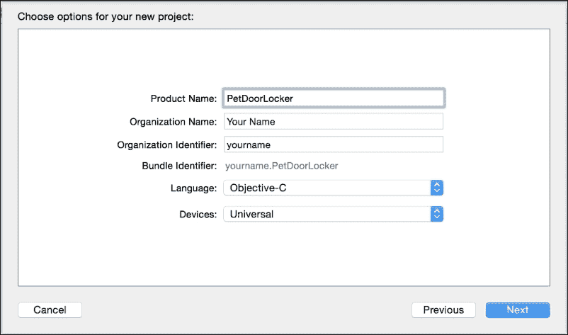

1.  点击**下一步**按钮。

1.  选择您想要存储项目的文件夹（取消选中源代码控制）。

就这些了！

我们现在可以开始编写新的应用程序了。首先要做的是重命名两个视图控制器（FirstViewController 和 SecondViewController）。

1.  在左侧面板中选择`FirstViewController.h`，这将打开右侧面板中的文件。

1.  在行`@interface FirstViewController : UIViewController`中选择`FirstViewController`，通过双击`FirstViewController`。

1.  右键单击并选择**重构** | **重命名 …**。

1.  输入视图控制器的新的名称：`PetDoorLockerViewController`。

1.  点击预览然后保存。

1.  选择`SecondViewController.h`，按照相同的步骤将其重命名为`BLEConnectionViewController`。

什么是视图控制器？苹果文档说：

> *视图控制器是应用程序数据与其视觉外观之间的重要联系。每当 iOS 应用程序显示用户界面时，显示的内容都由视图控制器或一组相互协调的视图控制器管理。因此，视图控制器提供了构建应用程序的骨骼框架。*

### 小贴士

**设计模式**

在继续之前，我们建议您阅读以下链接上的信息：[`apple.co/1hkUDbU`](http://apple.co/1hkUDbU)。

现在我们已经准备好设计新应用程序的 GUI。

## 为 BLEConnectionViewController 设计应用程序用户界面

要设计应用程序用户界面，让我们打开`Main.storyboard`。此文件包含有关 GUI 的所有内容。一旦打开，您应该看到以下截图所示的内容：

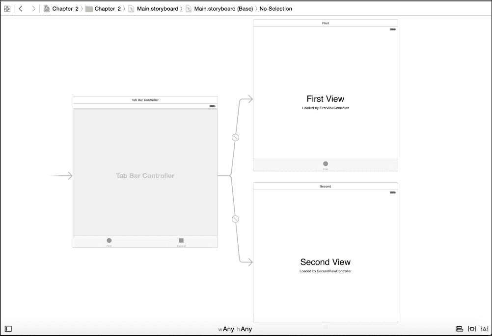

让我们从`BLEConnectionViewController`开始，它将被用于扫描 nRF8001 设备。

1.  双击视图控制器以选择它。

1.  点击**第二视图**标签并删除它，然后选择**由 SecondViewController 加载**并删除它。

1.  在右侧打开实用工具面板：**视图** | **实用工具** | **显示实用工具**。（要打开此面板，您也可以使用以下截图中的绿色圆形图标）。

1.  在工具导航器中选择**Label**并将其拖放到空白区域（见以下截图）。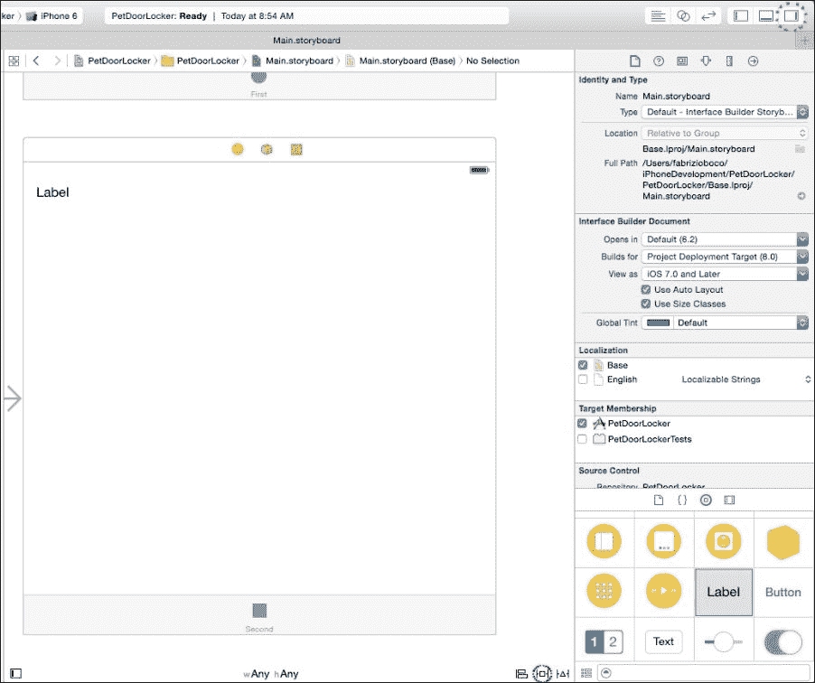

1.  通过双击**Label**并输入`Device`来重命名标签。

1.  现在我们必须设置将锁定标签在所需位置的自动布局约束：

    1.  点击自动布局固定图标（在之前的截图中以红色圆形标记）。

    1.  在“从父视图的 Leading 空间”中输入`20`，在“到父视图的 Top 空间”中输入`30`，如以下截图所示。

    1.  输入`53`作为**宽度**。

    1.  点击**添加 3 个约束**。

    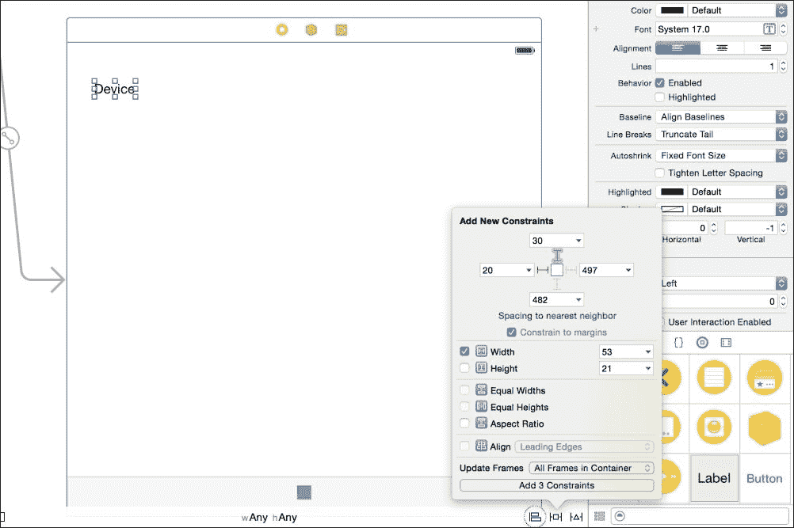

1.  在上一个标签旁边放置一个新的**标签**实例，并为其添加自动布局约束：

    1.  选择两个标签（按下**命令**按钮点击它们）。

    1.  点击对齐图标（在之前的截图中被圈出绿色）。

    1.  选择**垂直居中**然后**添加 1 个约束**。

    1.  仅选择新的标签并点击自动布局固定点。

    1.  将**前导空间**和**尾随空间**都输入为`20`。

    1.  对于**更新框架**，选择**容器中的所有框架**。

    1.  点击**添加 2 个约束**。

    1.  再次选择新的标签，并选择**视图** | **实用工具** | **显示属性检查器**（或点击下一张截图中圈出的红色图标）。

    1.  将字体大小更改为`13`并将**对齐**设置为居中（见下一张截图中圈出的绿色区域）。

    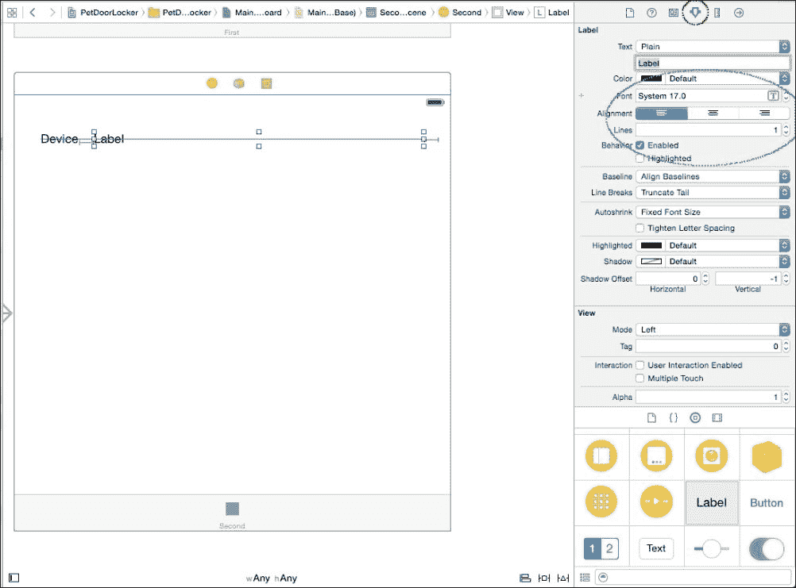

    新标签将显示检测到的 nRF8001 的 UUID。现在我们必须添加一个按钮来开始扫描附近的 nRF8001 设备。

1.  将按钮拖入容器中，双击它，并输入`Scan`：

    1.  选择按钮并点击自动布局固定点。

    1.  将**到空间**输入为`45`并点击**添加 1 个约束**。

    1.  选择按钮，点击对齐图标，在容器中选择水平居中，对于**更新框架**，选择**容器中的所有框架**，然后点击**添加 1 个约束**。

    现在我们必须将 GUI 组件与代码链接起来，以便程序化地操作它们。

1.  选择**BLEConnectionViewController**。

1.  点击**视图** | **辅助编辑器**。一个新的面板打开，显示`BLEConnectionViewController.h`。

1.  关闭实用工具面板以获得更多空间（点击**视图** | **实用工具** | **隐藏实用工具**）。

1.  确保在下一张截图的红色圈出区域中，你看到的是**BLEConnectionViewController.m**，如果不是，请点击它并更改为所需的文件。

1.  选择标签**标签**，保持**命令**按钮按下，将标签拖到右侧的代码中，在`@interface BLEConnectionViewController ()`和`@end`之间（见下图画）。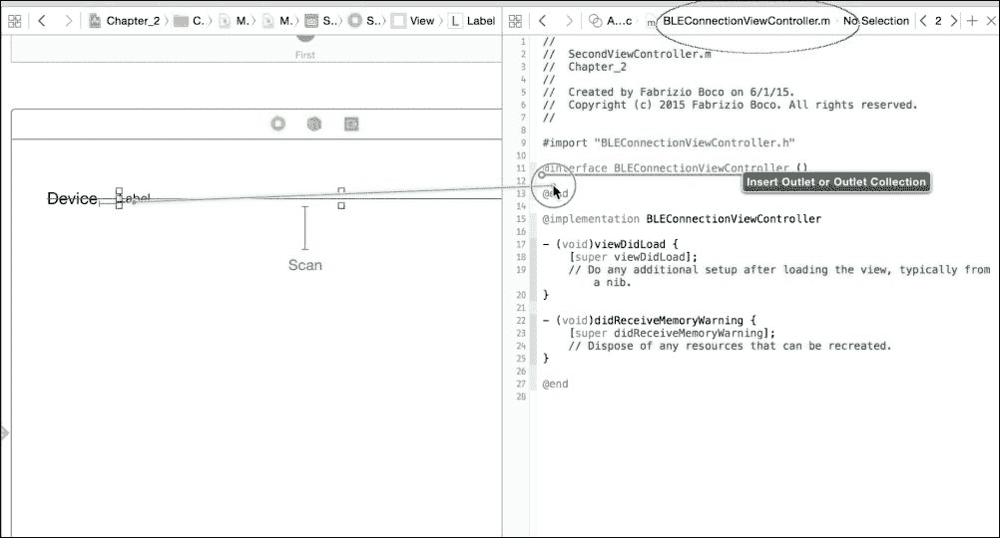

1.  当出现对话框时，将**名称**输入为`deviceUUIDLabel`（见下图画）然后点击**连接**。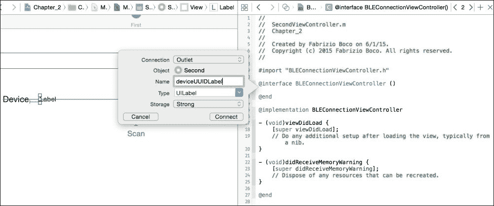

    这将创建一个属性（`deviceUUIDLabel`），可以用来更改标签属性，例如其文本。

    ### 小贴士

    **ARC 和强与弱**

    `strong`属性指示编译器，与属性关联的内存必须保留分配，直到定义它的类被分配。未定义为强引用（而是弱引用）的属性将在它们定义的代码块完成后自动释放。简而言之，只要有一个强引用指针指向对象，该对象就不会被释放。自引入**自动引用计数（ARC**）以来，iOS 下的内存管理已经简化，但仍对大多数人来说是一个问题。一篇好的介绍可以在以下链接找到：[`apple.co/1MvuNgw`](http://apple.co/1MvuNgw)。它是为 Swift（苹果最新推出的编程语言）编写的，但值得一读。

    ### 小贴士

    **原子与非原子**

    `atomic`属性将确保从 getter 或 setter 返回的整个值始终是完整的，无论其他线程上的 setter 活动如何。也就是说，如果线程 A 正在 getter 的中间，而线程 B 调用 setter，线程 A 将返回一个实际有效的值给调用者。

    苹果文档指出：“属性的原子性并不等同于对象的线程安全性”。

    访问强属性比访问非原子属性要慢。更多详情请参阅：[`apple.co/1JeBIdb`](http://apple.co/1JeBIdb)。

    我们现在将**扫描**按钮链接到一个当按钮被点击时调用的方法：

1.  选择**扫描**按钮，并按住**控制**键，将其拖到右侧面板。

1.  将名称输入为`startScanning`，并将**类型**选择为**UIButton**（见下图）。这创建了一个新方法，当按钮被按下时会被调用。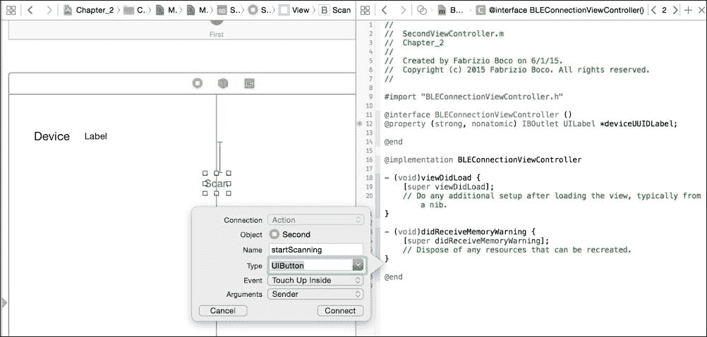

    为了完成设计，我们必须设置视图控制器的名称，该名称将出现在工具栏中：

1.  再次打开工具导航器（**视图** | **实用工具** | **显示实用工具**）。

1.  选择容器底部的图标（一个带有第二个标签的小正方形）。

1.  显示属性检查器（**视图** | **实用工具** | **属性检查器**）。

1.  在**标题**字段中，输入`Configuration`。

### 注意

您还可以从图像列表框中选择一个图标。为此，您应该将图标添加到项目中，将其拖到左侧面板中的“支持文件”组。图标应为 32 × 32 像素。

最后，您的视图控制器应该看起来像下一张图片。

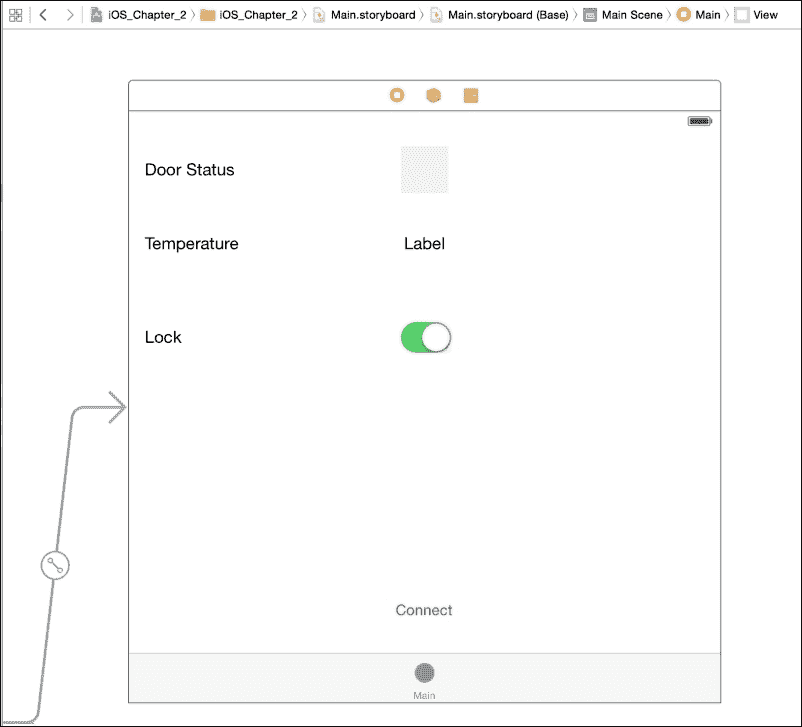

## 为 PetDoorLockerViewController 设计应用程序用户界面

在本节中，我们将设计第一个视图控制器（PetDoorLockerViewController）的界面。我们只会描述如何添加前一章中没有显示的组件。请参考下一张图片以查看视图的全局布局。

1.  添加一个标签，将其重命名为`Door Status`，并添加自动布局约束。

1.  在右侧面板的搜索字段中输入`UIView`，并将视图拖到标签附近。你可以通过拖动视图边框上的小白色方块来调整视图大小。在属性检查器中，选择浅灰色作为背景颜色。

1.  选择标签和视图，然后点击对齐图标。选择**垂直居中**，然后点击**添加 1 个约束**。

1.  选择视图并点击对齐图标。在**容器**中选择**水平居中**，然后点击**添加 1 个约束**。

1.  选择固定图标，输入`48`作为高度和宽度，对于**更新框架**，选择**容器中的所有框架**，然后点击**添加 2 个约束**。

1.  添加一个新的标签`温度`，并将自动布局约束添加到它上面。

1.  在**温度**附近添加另一个标签，并将自动布局约束添加到它上面，以使其垂直居中对齐**温度**，并在容器视图中水平居中。

1.  然后添加一个标签`锁`，并添加自动布局约束。

1.  在**锁**附近添加一个开关，并添加自动布局约束以使其垂直居中对齐**锁**，并在容器视图中水平居中。

1.  在容器的底部添加一个按钮（称为**连接**），并添加自动布局约束以使其垂直居中对齐**锁**，并在容器视图中水平居中。

你应该结束于以下图片所示的内容。**连接**按钮在失去与 nRF8001 设备的连接时很有用，你需要手动重新连接到它。


一旦添加了所有组件，你可以通过以下方式将它们链接到代码：

```swift
@interface PetDoorLockerViewController ()

@property (strong, nonatomic) IBOutlet UIView       *doorStatus;
@property (strong, nonatomic) IBOutlet UILabel      *temperature;
@property (strong, nonatomic) IBOutlet UISwitch     *manualLockSwitch;

@end
```

并使用`reconnect`函数来拦截当**连接**按钮被点击时。

如果有疑问，可以使用下载的代码作为参考。

我们最终准备好为两个视图控制器编写代码。

## 为 BLEConnectionViewController 编写代码

这个控制器的作用是获取 nRF8001 设备的唯一标识符，以便它可以按需连接到该设备。

要处理与蓝牙 4.0 设备的通信，我们需要使用我们添加到视图控制器接口中的类`CBCentralManager`：

```swift
@interface BLEConnectionViewController ()

@property (strong, nonatomic) IBOutlet UILabel  *deviceUUIDLabel;

@property (strong, nonatomic) CBCentralManager  *centralManager;

@end
```

### 小贴士

**Xcode 类参考**

如果你需要了解更多关于一个类的信息，你可以按*Option* + 点击类名以直接访问文档。相反，*Command* + 点击将带你到源文件。

类的实例化在`viewDidAppear`方法中，每当与视图控制器关联的视图在设备屏幕上显示时都会调用。

```swift
-(void)viewDidAppear:(BOOL)animated {

    _centralManager = [[CBCentralManager alloc] initWithDelegate:self queue:nil];
}
```

要与`CBCentralManager`一起工作，我们需要实现一些代理方法，但首先我们必须通知控制器这一点；我们打开`BLEConnectionViewController.h`文件，并按以下方式更改它：

```swift
#import <UIKit/UIKit.h>
#import <CoreBluetooth/CoreBluetooth.h>

@interface BLEConnectionViewController : UIViewController <CBCentralManagerDelegate>

@end
```

然后我们准备好编写两个代理方法：

+   `centralManagerDidUpdateState`: 当 iOS 蓝牙子系统的状态发生变化时调用此方法。在此视图控制器中，此方法仅具有信息性目的，但在需要监控蓝牙子系统状态的更复杂项目中非常有用。查看下载的代码以获取有关此方法的更多详细信息。

+   `didDiscoverPeripheral`: 当发现新的外设时调用此方法：

    ```swift
    - (void)centralManager:(CBCentralManager *)central didDiscoverPeripheral:(CBPeripheral *)peripheral advertisementData:(NSDictionary *)advertisementData RSSI:(NSNumber *)RSSI {

        [_scanningTimer invalidate];
        _deviceUUIDLabel.text = peripheral.identifier.UUIDString;

        NSUserDefaults *userDefaults = [NSUserDefaults standardUserDefaults];

        [userDefaults setObject:peripheral.identifier.UUIDString
                         forKey:@"PetDoorLockerDevice"];

        [userDefaults synchronize];
    }
    ```

每次发现新的蓝牙外设（在我们的例子中是 nRF8001 板连接到 Arduino）时，都会调用该方法，提供有关外设的信息。我们将在屏幕上显示外设的标识符：

```swift
_deviceUUIDLabel.text = peripheral.identifier.UUIDString;
```

并将其存储在`userDefaults`中，键为`PetDoorLockerDevice`，以便在需要时检索它。

### 小贴士

**用户偏好设置**

预设是您存储的持久信息，用于配置您的应用程序。您可以使用`NSUserDefaults`类访问它们。更多详细信息请参阅[此处](http://apple.co/1qRYb3o)。

之后，我们将回到解释：

```swift
[_scanningTimer invalidate];
```

**扫描**按钮在用户需要检测可用设备时激活`startScanning`方法。

```swift
- (IBAction)startScanning:(UIButton *)sender {

    if (_centralManager.state != CBCentralManagerStatePoweredOn)
        return;

     [_centralManager scanForPeripheralsWithServices:@[[CBUUID UUIDWithString:NRF8001BB_SERVICE_UUID]] options:nil];

    _deviceUUIDLabel.text = @"Scanning...";

    _scanningTimer = [NSTimer scheduledTimerWithTimeInterval:(float)5.0 target:self selector:@selector(scanningTimedOut:) userInfo:nil repeats:NO];
}
```

如果`centralManager`的状态不是`CBCentralManagerStatePoweredOn`，则无法执行任何操作。否则，通过调用`scanForPeripheralsWithServices`开始扫描。

每个蓝牙 4.0 设备都有一个或多个唯一标识的服务；我们寻找 nRF8001 板的服务标识符（NRF8001BB_SERVICE_UUID）。

### 小贴士

**nRF8001 服务和特征**

一个蓝牙外设可以提供更多服务，并且对于每个服务，用户都可以读取和/或写入更多特征。nRF8001 板只有一个服务（UUID：6E400001-B5A3-F393-E0A9-E50E24DCCA9E），一个用于接收数据的特征（UUID：6E400002-B5A3-F393-E0A9-E50E24DCCA9E）和一个用于发送数据的特征（UUID：6E400003-B5A3-F393-E0A9-E50E24DCCA9E）。

NRF8001BB_SERVICE_UUID 的值在视图控制器代码的开头定义：`#define NRF8001BB_SERVICE_UUID @"6E400001-B5A3-F393-E0A9-E50E24DCCA9E"`。

一旦找到具有该服务的服务器，iOS 将调用`didDiscoverPeripheral`，iOS 设备停止扫描。不幸的是，扫描过程会一直运行，直到找到设备。因此，如果外设未找到，iOS 设备会持续消耗电量。为了克服这个问题，我们需要一个计时器。它定义在视图控制器接口中：

```swift
@interface BLEConnectionViewController ()

@property (strong, nonatomic) IBOutlet UILabel      *deviceUUIDLabel;

@property (strong, nonatomic) CBCentralManager      *centralManager;
@property (strong, nonatomic) NSTimer               *scanningTimer;

@end
```

并通过以下方式实例化：

```swift
_scanningTimer = [NSTimer scheduledTimerWithTimeInterval:(float)5.0 target:self selector:@selector(scanningTimedOut:) userInfo:nil repeats:NO];
```

如果没有停止，计时器将在 5 秒后调用`scanningTimedOut`方法。在此方法中，我们可以停止`centralManager`的扫描和耗电：

```swift
-(void) scanningTimedOut:(NSTimer *)timer {

    [_centralManager stopScan];
    _deviceUUIDLabel.text = @"No device in range";
}
```

如果找到具有所需服务的外设，iOS 将调用`didDiscoverPeripheral`方法：

```swift
- (void)centralManager:(CBCentralManager *)central didDiscoverPeripheral:(CBPeripheral *)peripheral advertisementData:(NSDictionary *)advertisementData RSSI:(NSNumber *)RSSI {

    [_scanningTimer invalidate];
    _deviceUUIDLabel.text = peripheral.identifier.UUIDString;

    NSUserDefaults *userDefaults = [NSUserDefaults standardUserDefaults];

    [userDefaults setObject:peripheral.identifier.UUIDString
                     forKey:@"PetDoorLockerDevice"];

    [userDefaults synchronize];
}
```

我们必须停止`scanningTimer`，这是此行`[_scanningTimer invalidate];`的目的，并将外设的 UUID 保存到用户默认设置中。

现在是时候在你的设备上运行应用程序了。

### 小贴士

**运行您的应用程序**

您可以在以下位置找到运行应用程序所需的所有信息，无论是在模拟器上还是在物理设备上：[`developer.apple.com/library/ios/documentation/IDEs/Conceptual/AppDistributionGuide/LaunchingYourApponDevices/LaunchingYourApponDevices.html`](https://developer.apple.com/library/ios/documentation/IDEs/Conceptual/AppDistributionGuide/LaunchingYourApponDevices/LaunchingYourApponDevices.html)。

打开 Arduino 板电源并启动应用程序，然后点击配置标签，然后点击**扫描**按钮。几秒钟后，您应该在设备标签附近看到一个由字母和数字组成的长字符串。这就是 nRF8001 设备的 UUID。设置配置已完成！

如果出现问题，将显示消息**没有设备在范围内**。在这种情况下，请仔细检查以下内容：

1.  nRF8001 已正确连接到 Arduino。

1.  您已将正确的代码上传到 Arduino。

1.  Arduino 板已上电。

1.  IDE 控制台显示消息**设置完成**和**开始广播**。

1.  在您的 iOS 设备上激活了蓝牙（轻触设置，然后蓝牙以激活它）。

## 编写 PetDoorLockerViewController 的代码

在本节中，我们将编写应用程序的主体部分，该部分允许您监控宠物门是否锁定或解锁，读取外部温度，并在需要时锁定宠物门。

### 注意

由于此视图控制器的代码较为复杂，并且我们希望为其他主题节省空间，因此我们将解释整个代码，但不会逐步指导您编写它。请参阅下载的代码以查看代码的完整内容。

我们需要在视图控制器接口中添加三个定义和一些额外的属性：

```swift
#define NRF8001BB_SERVICE_UUID                      @"6E400001-B5A3-F393-E0A9-E50E24DCCA9E"
#define NRF8001BB_CHAR_TX_UUID                      @"6E400002-B5A3-F393-E0A9-E50E24DCCA9E"
#define NRF8001BB_CHAR_RX_UUID                      @"6E400003-B5A3-F393-E0A9-E50E24DCCA9E"

@interface PetDoorLockerViewController ()

…

@property (strong, nonatomic) CBCentralManager      *centralManager;
@property (strong, nonatomic) CBPeripheral          *arduinoDevice;
@property (strong, nonatomic) CBCharacteristic      *sendCharacteristic;

@end
```

我们还需要在`PetDoorLockerViewController.h`中添加一个代理`@interface PetDoorLockerViewController : UIViewController <CBCentralManagerDelegate, CBPeripheralDelegate>`。

设置`CBCentralManager`实例与我们在上一个控制器中所做的方式完全相同。

方法`centralManagerDidUpdateState`相当不同：

```swift
- (void)centralManagerDidUpdateState:(CBCentralManager *)central {

    NSLog(@"Status of CoreBluetooth central manager changed %ld (%s)", central.state, [self centralManagerStateToString:central.state]);

    if (central.state == CBCentralManagerStatePoweredOn) {

        [self connect];
    }
}
```

一旦蓝牙子系统准备就绪（其状态为`CBCentralManagerStatePoweredOn`），应用程序开始尝试连接到 nRF8001 板，调用`[self connect]`，这是一个我们很快就会向您展示的方法。

每次视图控制器在屏幕上显示时，连接都是从`viewDidAppear`开始的：

```swift
-(void)viewDidAppear:(BOOL)animated {

    [super viewDidAppear:animated];

    [self connect];
}
```

一旦视图从屏幕消失，连接就会关闭，以减少电池的消耗：

```swift
-(void)viewDidDisappear:(BOOL)animated {

    [super viewDidDisappear:animated];

    [self disconnect];
}
```

现在，让我们更详细地看看连接方法。

```swift
-(void)connect {

    if (_arduinoDevice == nil) {

        // We need to retrieve the Arduino peripheral

        NSString *deviceIdentifier = [[NSUserDefaults standardUserDefaults] objectForKey:@"PetDoorLockerDevice"];

        if (deviceIdentifier!=nil) {

            NSArray *devices = [_centralManager retrievePeripheralsWithIdentifiers:@[[CBUUID UUIDWithString:deviceIdentifier]]];
            _arduinoDevice = devices[0];
 _arduinoDevice.delegate = self;
        }
        else {

            …
            …

            return;
        }
    }

    [_centralManager connectPeripheral:_arduinoDevice options:nil];
}
```

如果`arduinoDevice`未初始化，我们将使用在扫描阶段存储在用户偏好设置中的 UUID 检索它。外围代理委托的设置很重要，因为我们必须发现外围设备的特征，它们通过代理方法返回。`connectPeripheral`方法实际上连接到外围设备。如果连接成功，将调用代理方法`didConnectPeripheral`，然后我们可以开始发现设备提供的服务：

```swift
- (void)centralManager:(CBCentralManager *)central didConnectPeripheral:(CBPeripheral *)peripheral {

    [peripheral discoverServices:@[[CBUUID UUIDWithString:NRF8001BB_SERVICE_UUID]]];

}
```

### 小贴士

**发现所有服务**

在某些情况下，您可能需要发现外围设备提供的所有服务。为此，您使用：`[peripheral discoverServices:nil];`。

一旦 iOS 发现外围设备的服务，它将调用`didDiscoverServices`方法，然后我们可以开始发现服务的特征：

```swift
- (void)peripheral:(CBPeripheral *)peripheral didDiscoverServices:(NSError *)error {

    …

    for (int i=0; i < peripheral.services.count; i++) {

        CBService *s = [peripheral.services objectAtIndex:i];
        [peripheral discoverCharacteristics:nil forService:s];
    }
}
```

对于每个提供的服务，iOS 会调用`didDiscoverCharacteristicsForService`方法（请参阅下载的代码）。在这个方法中，我们将发送数据到 nRF8001 设备的特征存储在属性`sendCharacteristic`中，并调用此方法：

```swift
[peripheral setNotifyValue:YES forCharacteristic:characteristic];
```

现在，我们将使用接收数据的特征作为参数。现在每次特征发生变化（从 nRF80001 设备发送数据）时，都会调用`didUpdateValueForCharacteristic`方法，并接收可用数据（请参阅下载的代码）。

当有可用数据时，会调用`dataReceived`方法，并处理接收到的数据：

```swift
-(void)dataReceived:(NSString *)content {

    // Messages has the following formats:
    //
    //  1) m:0|1
    //
    //  2) s:0|1;t:temperature

    NSArray *messages = [content componentsSeparatedByString:@";"];

    for (int i=0; i<messages.count; i++) {

        NSArray *components = [messages[i] componentsSeparatedByString:@":"];

        NSString *command = components[0];
        NSString *value   = components[1];

        if ([command isEqualToString:@"m"]) {
            _manualLockSwitch.on = [value boolValue];
        }

        if ([command isEqualToString:@"s"]) {

            BOOL doorUnlocked = [value boolValue];

            if (doorUnlocked) {

                _doorStatus.backgroundColor = [UIColor greenColor];
            }
            else {

                _doorStatus.backgroundColor = [UIColor redColor];
            }
        }

        if ([command isEqualToString:@"t"]) {
            _temperature.text = value;
        }
    }
}
```

我们可以接收两种类型的消息：

+   m:0|1

+   s:0|1; t:temperature

当 iOS 设备连接到 Arduino 时，它会接收到第一条消息，告知您门是否已被手动锁定（m:1）或未锁定（m:0）。有了这个信息，我们可以设置手动开关的位置：

```swift
_manualLockSwitch.on = [value boolValue];
```

第二条消息包含两种类型的信息：如果闩锁是打开的（s:1）或关闭的（s:0）以及外部温度。第一种用于更改`doorStatus`视图的背景颜色：

```swift
BOOL doorUnlocked = [value boolValue];

if (doorUnlocked) {

    _doorStatus.backgroundColor = [UIColor greenColor];
}
else {

    _doorStatus.backgroundColor = [UIColor redColor];
}
```

温度信息用于设置`temperature`标签的值：

```swift
if ([command isEqualToString:@"t"]) {
    _temperature.text = value;
}
```

当按下`manualLockSwitch`开关时，会调用`switchChanged`方法，在那里我们可以向 Arduino 传输数据：

```swift
- (IBAction)switchChanged:(UISwitch *)sender {

    NSData* data;

    if (sender.on)
        data=[@"1" dataUsingEncoding:NSUTF8StringEncoding];
    else
        data=[@"0" dataUsingEncoding:NSUTF8StringEncoding];

    [_arduinoDevice writeValue:data forCharacteristic:_sendCharacteristic type:CBCharacteristicWriteWithoutResponse];

}
```

要向蓝牙设备发送数据，我们使用`writeValue`方法写入适当的特征。由于它接受`NSData`值，我们必须使用`dataUsingEncoding`方法将字符串`"0"`或`"1"`转换为`NSData`。

我们几乎完成了应用程序。一旦 iOS 应用程序连接到 Arduino，我们需要它在发送到后台时断开连接（以节省电池）。当它再次被带到前台时，它会自动重新连接到 Arduino。

为了做到这一点，我们使`connect`方法公开，并编写一个新的公开`disconnect`方法。为了使方法公开，我们在`PetDoorLockerViewController.h`中添加了几行代码：

```swift
-(void)connect;
-(void)disconnect;
```

`disconnect`方法非常简单：

```swift
-(void)disconnect {

    if (_arduinoDevice != nil) {
        [_centralManager cancelPeripheralConnection:_arduinoDevice];
        _doorStatus.backgroundColor = [UIColor lightGrayColor];
    }
}
```

将`doorStatus`视图的背景颜色设置为浅灰色，我们可以直观地知道 iOS 是否已连接到 Arduino。

我们必须编写的最后一个方法是`reconnect`，它不需要任何解释：

```swift
- (IBAction)reconnect:(UIButton *)sender {

    [self disconnect];
    [self connect];
}
```

在`AppDelegate.m`文件中，有两个方法，分别是在应用程序进入后台或返回前台时调用的：

+   `applicationDidEnterBackground`

+   `applicationWillEnterForeground`

在这些方法中，我们需要一个对`PetDoorLockerViewController`的引用。我们可以通过主应用程序窗口来获取它。

```swift
- (void)applicationDidEnterBackground:(UIApplication *)application {

    UITabBarController *tabController = (UITabBarController *)_window.rootViewController;
    PetDoorLockerViewController *petDorLockerController = tabController.viewControllers[0];

    [petDorLockerController disconnect];
}

- (void)applicationWillEnterForeground:(UIApplication *)application {

    UITabBarController *tabController = (UITabBarController *)_window.rootViewController;
    PetDoorLockerViewController *petDorLockerController = tabController.viewControllers[0];

    [petDorLockerController connect];
}
```

## 测试 iOS 应用程序

现在应用程序已经完成，我们可以在 iOS 设备上再次运行它。一旦启动，它应该连接到 Arduino，如果门是锁着的，门状态指示器应该变成红色，如果门是开着的，应该变成绿色，你应该看到从 Arduino 传感器测量的温度。

当你点击锁开关时，门应该立即关闭并忽略光和温度。

# 如何更进一步

我们开发的应用程序可以通过许多方式改进；以下是一些你可以尝试的建议改进：

+   通过计算门的开闭次数和方向来检查你的宠物是否在家。一对磁开关应该能够检测宠物门的开启方向。

+   通过在宠物的项圈上附加 RFID 标签来检测你的宠物，以避免其他宠物进入你的房子。

+   使用滑块（UISliderView）直接从 iOS 设备设置光阈值和温度阈值。

+   将温度的数字指示替换为更吸引人的图形指示器，如仪表或温度计。

+   当你的宠物通过宠物门时通知你。

+   显示摄氏度和华氏度温度。

# 不同的传感器类型

在结束本章之前，我们想概述一下现有的传感器类型，它们与 Arduino 的通信协议，以及使用它们的优缺点。

传感器可以根据它们提供的信号类型分为两大类（模拟和数字）。模拟传感器通常提供电压，该电压与其测量的量成正比。这个电压必须通过 ADC 转换成数字。Arduino 提供了六个模拟引脚，每个引脚都有自己的 ADC。我们在项目中使用的光敏电阻是一个典型的模拟传感器。相反，数字传感器直接提供测量量的数值表示，可以直接使用。我们在本项目中使用的温度传感器就是一个数字传感器的例子。

模拟传感器更容易使用且更便宜，但它们对电源电压波动和电路中的电气噪声非常敏感。因此，读数会有很大变化，通常需要在代码中实现数字滤波器来平滑读数。

数字传感器提供非常稳定的读数，并且通常更精确。不幸的是，它们使用不同的低级协议与微处理器通信，这些协议更复杂。在大多数情况下，协议的复杂性被针对每种类型传感器的专用软件库所隐藏，但这使得编码更加复杂，库通常会导致更大的内存消耗，这在微处理器上是一个非常宝贵的资源。

最常用的低级协议是**串行外设接口**（**SPI**）和**集成电路间接口**（**I2C**）。另一个广泛用于温度传感器的低级协议是 1-Wire，该项目已经采用了这种协议。

这些协议的完整比较超出了本项目的范围，但你可以通过参考以下表格来了解它们。

| 协议 | 架构 | 所需信号 | 多主 | 数据速率 | 全双工 |
| --- | --- | --- | --- | --- | --- |
| SPI | 两个共享的单向数据信号和共享时钟 | SCK、MISO、MOSI 和板上每个设备的 CS | 可能，但不是标准 | 1 Mbps | 是 |
| I2C | 共享数据信号和共享时钟信号 | SDA 和 SCL | 是 | 100 kbps、400 kbps 和 3.2 Mbps | 否 |
| 1-Wire | 一个数据信号 | 数据 | 否 | 15 kbps | 否 |

# 摘要

干得好！你已经到达了本章的结尾，并且从头开始构建了一个项目！

你已经构建了硬件，包括电子电路，并为 Arduino 和 iOS 编写了软件。

在 Arduino 上，你学习了如何使用模拟和数字传感器（1-Wire），如何编写读取它们的代码，如何控制伺服电机，以及如何处理与 iOS 设备的通信。

在 iOS 上，你学习了如何编写一个具有简单用户界面的应用程序，以及该应用程序通过蓝牙 4.0 与 Arduino 进行通信。

我们最终讨论了模拟和数字传感器以及与 Arduino 交换数据时最常用的低级通信协议。

在下一章中，我们将构建另一个项目，该项目使用 Wi-Fi 而不是蓝牙来传输数据。在那个项目中，Arduino 将接受不同的命令并对之做出反应。iOS 应用将有一个表格视图，这是 UIKit 提供的最有用的组件之一。
