# 第六章. 工具

在上一章中，您学习了谷歌提供的有用服务，开发者可以使用这些服务来改进他们的应用程序。现在，您将了解 Android Studio 中可用的工具，这些工具可以让您的生活更轻松。您是否想过如何管理 Android 平台？您是否希望您的项目有清晰的文档？您是否作为一组开发者工作，并需要与 Android Studio 集成的版本控制管理器？

本章介绍了 Android Studio 中提供的最重要的附加工具：Android SDK 工具、Javadoc 和版本控制集成。首先，您将了解 Android Studio 中的 SDK 管理器，您可以通过它检查、更新和安装我们项目的不同组件。接下来，我们将回顾**Android 虚拟设备**（**AVD**）管理器，在那里我们可以编辑我们将用于测试项目的虚拟设备。您还将学习如何使用 Javadoc 工具获得完整的文档，如何使用 Android Studio 中可用的系统进行版本控制，以及如何处理您的项目任务。

本章我们将涵盖以下主题：

+   SDK 管理器

+   AVD 管理器

+   Javadoc

+   版本控制

+   任务和上下文

# 软件开发工具包管理器

SDK 管理器是 Android Studio 中的一个工具，可用于控制我们的 Android SDK 安装。从这个工具中，我们可以检查系统中安装的 Android 平台，更新它们，安装新平台，或者安装其他组件，如 Google Play 服务或 Android 支持库。

要从 Android Studio 打开 SDK 管理器，请导航到**工具** | **Android** | **SDK 管理器**。您也可以从工具栏中单击快捷方式。SDK 管理器是一个独立的 Android 工具，它已集成在 Android Studio 默认设置中的**外观和行为** | **系统设置** | **Android SDK**，如下一张截图所示：

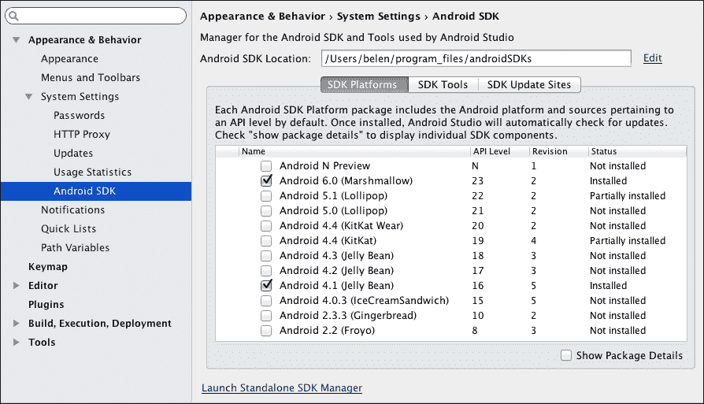

Android Studio 中配置的 SDK 路径显示在管理器的顶部。您可以通过单击**编辑**按钮来更改其路径。SDK 管理器显示具有以下属性的可用**SDK 平台**包列表：

+   **名称**：这是聚合相关包的容器名称。在包列表下勾选**显示包详细信息**复选框，以查看容器的详细信息。

+   **API 级别**：这是包添加时的 API 编号。

+   **修订版**：这是包修订版或版本。

+   **状态**：这是软件包在您系统中的状态。状态可以是**未安装**、**已安装**、**有更新可用**、**不兼容**或**过时**。如果未勾选**显示软件包详细信息**复选框，状态还可以是**部分安装**。当**SDK 平台**和**Android SDK 源**软件包都安装时，未勾选**显示软件包详细信息**的情况下，容器软件包被视为**已安装**。如果只有其中之一安装，容器软件包的状态为**部分安装**。

在**SDK 工具**选项卡中，您可以管理可用的 SDK 开发者工具，例如**Android SDK 平台工具**、**Android 支持库**或**Google Play 服务**，这些将在第七章中解释，*Google Play 服务*。

在**SDK 更新站点**选项卡中，我们可以检查提供附加组件和额外软件包的官方站点列表。我们可以使用列表底部的**添加**按钮添加自定义外部站点。

点击屏幕底部的**启动独立 SDK 管理器**按钮以打开独立的 SDK 管理器。在 Android Studio 的旧版本中，这是唯一可用的选项。从独立的 SDK 管理器中，SDK 平台和工具的列表与集成 SDK 管理器中的列表类似，但我们还可以找到一些更多选项来过滤和选择软件包。

您可以使用列表下方的复选框根据其状态过滤软件包。这些选项也可以从顶部的**软件包**菜单中访问。

在软件包名称旁边有一个复选框，用于选择我们想要安装、更新或删除的软件包。如图所示，在系统中已安装且也有更新可用的软件包默认勾选：

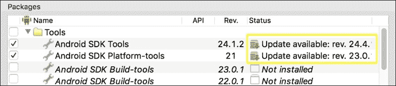

如果有未安装的新 Android 平台版本，其软件包也将被检查，如下面的截图所示：

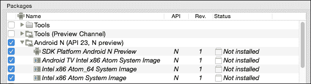

要安装或更新的所选软件包总数在对话框底部的按钮文本中指示。其下的按钮指示要删除的所选软件包总数。您可以删除已弃用或不再需要的软件包。

勾选需要更新的软件包，并勾选最后一个 Android 平台。此外，您还应该勾选我们应用程序支持的最小平台（Android 4.1.2，API 16），以便能够使用此版本在虚拟设备上测试我们的应用程序。点击**安装**按钮。

在下一个对话框中，我们必须接受软件包许可协议。勾选**接受许可**单选按钮，然后点击**安装**按钮。软件包的安装或更新将开始显示其进度。首先，管理器下载软件包，然后解压缩它们，最后安装它们。

记得定期检查 SDK 管理器以获取更新。

# AVD 管理器

**AVD 管理器**是 Android Studio 中可访问的 Android 工具，用于管理将在 Android 模拟器中执行的手机虚拟设备。

要从 Android Studio 打开 AVD 管理器，请导航到**工具** | **Android** | **AVD 管理器**。您也可以从工具栏中点击快捷方式。AVD 管理器显示现有虚拟设备的列表。由于我们尚未创建任何虚拟设备，列表最初将是空的。要创建我们的第一个虚拟设备，请单击**创建虚拟设备**按钮以打开配置对话框。

第一步是选择虚拟设备的硬件配置。设备定义列在窗口的左侧。设备定义可以分为以下类别之一：**手机**、**平板**、**穿戴**或**电视**。在**手机**类别中选择一个，例如 Nexus 6，以查看右侧的详细信息，如下面的截图所示：

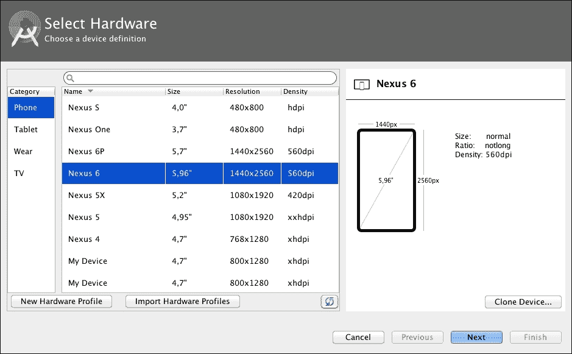

我们还可以从 AVD 管理器配置自己的硬件设备定义。我们可以使用**新建硬件配置文件**按钮创建一个新的定义。**克隆设备…**按钮创建现有设备的副本。

单击**新建硬件配置文件**按钮以检查现有配置参数。定义设备的参数包括：

+   **设备名称**：这是设备的名称。

+   **设备类型**：这是设备类型，可以是**手机/平板**、**Android Wear**或**Android TV**。

+   **屏幕尺寸**：这是屏幕尺寸，以英寸为单位。此值决定了设备的尺寸类别。输入`4.0`的值，注意右侧的**尺寸**值（尺寸）变为**正常**，如下面的截图所示：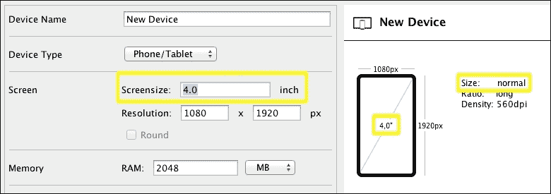

    现在，输入`7.0`的值，**尺寸**字段将更改其值到**大**，如下面的截图所示：

    

    此参数，连同屏幕分辨率，也决定了**密度**类别。

+   **分辨率**：这是屏幕分辨率，以像素为单位。此值决定了设备的密度类别。对于 4.0 英寸的屏幕尺寸，输入`768 x 1280`的值，并注意**密度**值变为**360 dpi**。将屏幕尺寸更改为`6.0`英寸，**密度**值将更改为**hdpi**。现在，将分辨率更改为`480 x 800`，**密度**值将是**mdpi**。

+   **RAM**：这是设备的 RAM 内存大小。

+   **输入**：这配置软件和硬件输入。**有硬件按钮**复选框表示设备的**返回**、**主页**或**菜单**按钮是否通过软件或硬件可用。**有硬件键盘**复选框表示键盘是否通过软件或硬件可用。**导航样式**选择器通过方向垫（**D-Pad**）、**轨迹球**或**滚轮**启用导航控件。

+   **支持的设备状态**：这检查允许的状态，即**纵向**和**横向**。

+   **摄像头**：这检查设备是否有**前置摄像头**或**后置摄像头**。

+   **传感器**：这些是设备中可用的传感器。它们是**加速度计**、**陀螺仪**、**GPS**和**接近传感器**。

+   **默认皮肤**：这选择额外的硬件控件。

创建一个屏幕大小为 5.5 英寸，分辨率为 1080 x 1920，RAM 值为 2048 MiB，软件按钮（留空输入框未勾选），并启用横竖屏两种状态的设备。命名为`My Device`。然后，点击**完成**按钮。硬件定义已添加到配置列表中。如果您右键单击新的硬件配置文件，您可以编辑它、克隆它、导出它或删除它。硬件配置文件使用 XML 格式导出。

点击**下一步**按钮继续创建新的虚拟设备。下一步是选择虚拟设备系统镜像和目标 Android 平台。每个平台都有自己的架构。系统镜像列在左侧面板上，所选系统镜像的详细信息显示在右侧面板上。如果详细面板中显示**推荐**消息，如下一张截图所示，请遵循推荐并选择不同的镜像。

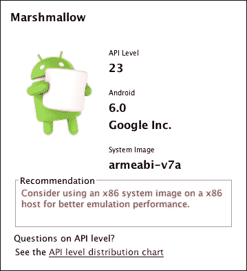

除了系统镜像的**发布名称**外，还有一个**下载**按钮。选择 Marshmallow（API 级别 23）发布中带有 Google API 的**推荐**镜像之一，然后点击**下载**按钮。等待安装完成，然后点击**下一步**按钮。

最后一步是验证虚拟设备的配置。在**AVD 名称**字段中输入 AVD 的名称。给虚拟设备一个有意义的名称以便于识别，例如`AVD_nexus6_api23`。点击**显示高级设置**按钮。我们可以为虚拟设备配置的设置如下：

+   **启动大小和方向**：选择屏幕大小和设备的初始方向。我们建议选择**自动**缩放。

+   **摄像头**：如果模拟器有前置摄像头或后置摄像头，请选择此选项。摄像头可以是**模拟的**（模拟设备实际上使用摄像头录制视频）或真实（通过计算机上的**网络摄像头**）。

+   **网络**：选择模拟网络的速率和处理网络数据延迟。这对于测试低连接或缺失响应的应用程序很有用。

+   **模拟性能**：选择设备中图形的渲染方式。它们可以使用你的计算机的图形（**硬件**）或通过软件模拟（**软件**）。我们建议选择**自动**选项。

+   **内存和存储**：选择虚拟设备的内存参数。保留默认值不变，但如果显示警告信息，请遵循该信息的说明。例如，选择**1536M**作为**RAM**内存，**64**作为**VM Heap**。**内部存储**选项也可以配置，例如，**200 MiB**。选择**SD 卡**的大小或选择一个文件作为 SD 卡使用。

+   **设备框架**：如果模拟器中显示额外的硬件控制，请选择此选项。

+   **键盘**：如果模拟器中显示硬件键盘，请选择此选项。

点击**完成**。新的虚拟设备现在列在 AVD 管理器中。在最近创建的虚拟设备的**操作**部分，你可以找到以下操作：

+   **启动**图标：这将运行虚拟设备。

+   **编辑**图标：这将编辑虚拟设备的配置。

+   **复制**：这将创建一个新的设备配置，显示创建过程的最后一步。你可以更改其配置参数，然后验证新的设备。

+   **擦除数据**：这将从虚拟设备中删除用户文件。

+   **显示在磁盘上**：这将打开系统中的虚拟设备目录。

+   **查看详情**：这将打开一个对话框，详细说明虚拟设备的特性。

+   **删除**：这将删除虚拟设备。

+   **停止**：这将停止虚拟设备。

**操作**部分中，如下一张截图所示，有一个**下载**按钮，表示该 AVD 的系统镜像缺失。点击**下载**按钮将其安装到你的系统中：

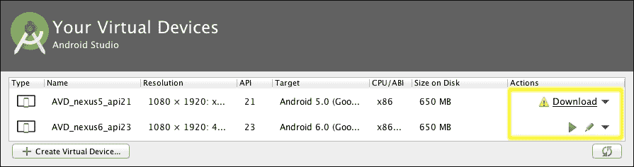

最近创建的 AVD 也会列在布局图形编辑器的设备选择器中。在 Android Studio 中，使用图形编辑器打开主布局，并点击设备列表。如图所示，我们的自定义设备定义出现，我们可以选择它来预览布局：

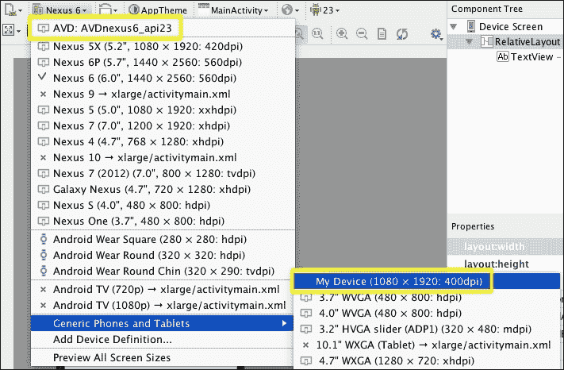

## Android 模拟器

现在我们已经在 AVD 管理器中创建了一个 AVD，我们可以在 Android 模拟器上运行它。打开 AVD 管理器并点击 AVD 的**启动**按钮。模拟器将打开，如下一张截图所示。等待它完全加载后，你就可以尝试使用了。

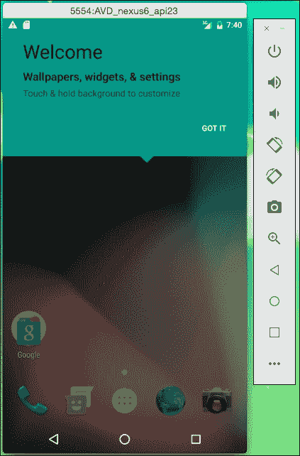

在模拟器旁边，在其右侧，有一个包含操作的条：电源按钮、音量加减、左右旋转、截图、缩放、后退按钮、主页按钮、概览按钮和扩展控制。

点击**更多**选项以打开下一组扩展控制：

+   **位置**: 这通过设置纬度、经度和海拔来模拟设备的地理位置。您还可以模拟一系列的位置变化。遗憾的是，没有提供地图以便轻松选择位置，但您可以使用 Google Maps 获取您想要模拟的位置的纬度和经度。如果您的应用显示地图或依赖于用户的位置来触发特定操作，此机制非常有用。要尝试此功能，请在虚拟设备上打开 Google Maps 应用。在**扩展控制**中输入一些坐标，然后点击**发送**。观察 Google Maps 如何绘制您输入的位置，如下截图所示：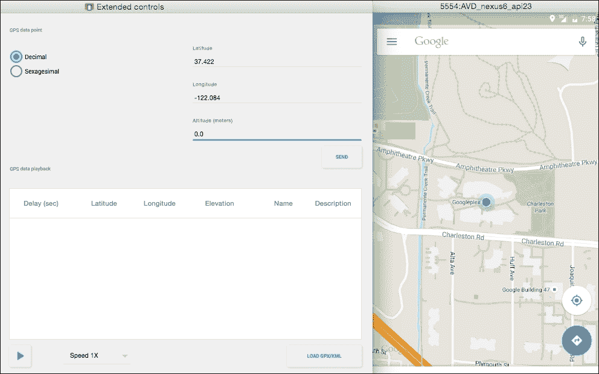

+   **蜂窝网络**: 这模拟网络的速率（**全速**、**HSDPA**、**UMTS**等）。这还模拟**数据状态**和**语音状态**。如果您的应用依赖于外部数据，此机制非常有用，可以检查它如何与慢速网络连接一起工作。通过将**网络类型**更改为**EDGE**来尝试此功能，并注意在模拟器中的变化：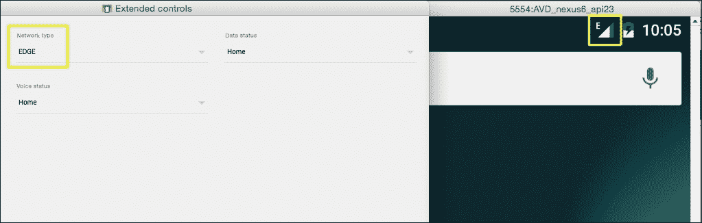

+   **电池**: 这模拟电池的充电水平，如果设备连接到充电器，则模拟电池健康状态或电池状态。如果您的应用根据电池状态改变其行为，此机制非常有用。例如，如果电池电量低，您可以避免不必要的网络请求以减少电池消耗。如果您将**充电水平**更改为**10%**并将**充电器连接**设置为**无**，模拟器将显示低电量通知：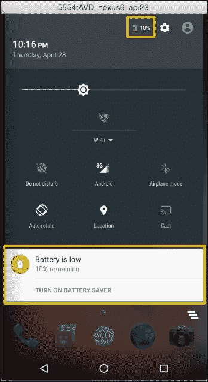

+   **电话**: 这模拟电话通话或短信消息。例如，要检查您的应用如何从中断中恢复，此机制非常有用。要尝试此功能，请点击**呼叫设备**按钮，并观察设备如何接收通话，如下截图所示：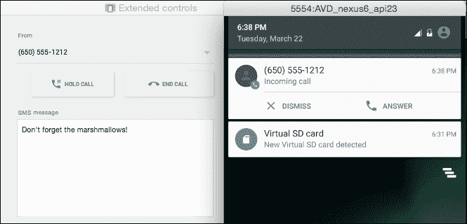

+   **方向键**: 这模拟了一个方向键。

+   **指纹**: 这模拟手指触摸指纹传感器。如果您的应用具有指纹安全步骤，例如进行支付，此机制非常有用。要尝试此功能，请在虚拟设备上打开 Android **设置**，进入**安全**，然后点击**指纹**。按照以下截图所示的步骤添加指纹。您将到达需要将手指放在传感器上的步骤：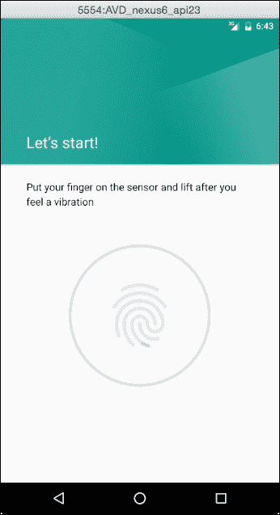

    从**扩展控制**中点击**触摸传感器**按钮。指纹将按以下截图所示添加：

    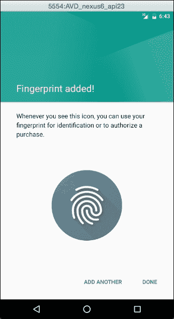

    点击电源按钮以锁定设备，然后再次点击以解锁它。随后需要指纹验证。使用相同的指纹点击**触摸传感器**按钮，设备将被解锁。

+   **设置**：这些是模拟器的设置。例如，您可以更改保存截图的文件夹，或者如果您想发送崩溃报告。

+   **帮助**：这包含**键盘快捷键**、**模拟器帮助**和**关于**。

最后，如果您在创建设备定义时选择了模拟摄像头，您可以通过在模拟器中打开摄像头应用程序来测试它。打开它，并注意随机视频如何像摄像头正在捕获它一样出现：

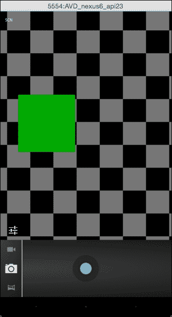

# 生成 Javadoc

Javadoc 是一个用于以 HTML 格式文档化 Java 代码的实用程序。Javadoc 文档是从添加到 Java 类或方法的注释和标签生成的。注释以`/**`字符串开始，以`*/`结束。在这些注释内部，可以添加标签。以下标签，按应添加的顺序排列，在 Javadoc 中可用：

+   `@author`：这表示代码的作者或作者。

+   `@version`：这表示类或方法的版本。用于类和接口。

+   `@param`：这描述了方法参数。仅在方法和构造函数中使用。

+   `@return`：这描述了方法的返回对象。仅在不需要返回`void`的方法中使用。

+   `@throws`：这描述了方法可能抛出的异常。等同于`@exception`。

+   `@see`：这表示一个引用，可以是 URL、文档中的另一个元素或只是一些文本。

+   `@serial`：这表示字段是否可序列化。

+   `@deprecated`：这表示一个方法已过时，并有一个替代方案。

在 Android Studio 中，Javadoc 的使用是集成的。我们可以在输入 Javadoc 注释时使用代码补全。Javadoc 文档将显示在代码元素的弹出工具提示中。

要生成完整的 Javadoc，我们必须编写关于我们的类和方法的 Javadoc 注释。打开我们项目的 MainActivity，将 Javadoc 注释添加到我们在第五章中创建的`onAcceptClick`方法。在方法声明之前的行上放置光标，输入`/**`，然后按*Enter*。Javadoc 注释将自动插入，包含来自方法声明的可用信息：参数和返回类型。在这种情况下，没有返回类型，因此自动生成的 Javadoc 如下所示：

```java
/**
 * 
 * @param v
 */
```

文档注释的第一行是方法描述。然后，它解释每个参数和返回类型。现在，方法应看起来像这样：

```java
/**
 * Method executed when the user clicks on the Accept button.
 * Change the greeting message to include the name introduced by the user in the editText box.
 *
 * @param v View the user clicked
 */
public void onAcceptClick(View v) { ... }
```

此方法的信息现在将作为其文档显示在出现的对话框中。以下截图显示了应出现在方法上方的对话框：

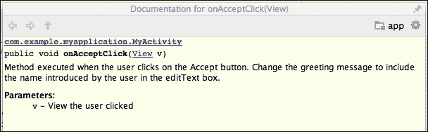

要生成 Javadoc 文档，请转到**工具** | **生成 Javadoc...**。将打开显示 Javadoc 选项的对话框。我们可以选择范围，如果我们想包括测试或库源，输出目录以及包含元素的可见性。关于文档格式，如果需要，我们可以创建层次结构树、导航栏和索引。

将**当前文件**作为范围以生成我们主活动的文档。从您的系统中选择一个输出目录。将可见性降低到**公共**并点击**确定**按钮。HTML 格式的 Javadoc 文档已创建在输出目录中。`index.html`文件是起点。打开`index.html`文件并浏览文档以打开`MyActivity`类，如下面的截图所示。请注意，由于我们将生成的 Javadoc 的可见性降低到**公共**元素，因此`onCreate`方法（其可见性为受保护的）没有显示。

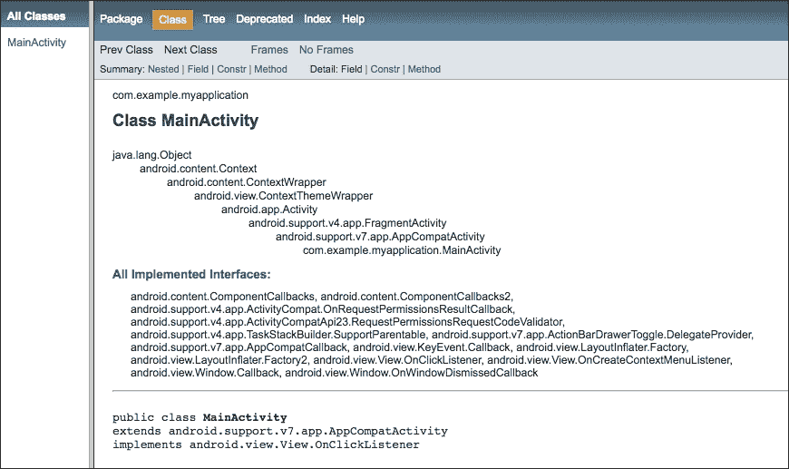

# 任务和上下文

Android Studio 集成了多个问题跟踪系统。问题跟踪系统是一种管理问题列表的软件工具。Android Studio 支持的一些问题跟踪系统包括：Jira、YouTrack、Lighthouse、Mantis、Trello 或 Bugzilla。

要使用 Android Studio 将其中一个跟踪系统集成到您的项目中，请转到**工具** | **任务与上下文** | **配置服务器...**。点击**添加**按钮并选择一个可用的系统。您需要输入服务器 URL、身份验证值以及根据系统类型的一些附加参数。

在**任务与上下文**菜单中，您可以找到管理任务的操作，例如在任务之间切换、创建新任务、关闭当前任务或编辑当前任务。

任务通过其名称识别，通常与您问题跟踪系统中的一个问题相关联。任务还可以与上下文相关联，它定义了当您在此任务上工作时将在编辑器中打开的一组文件。您可以从**任务与上下文**菜单创建、加载或清除上下文。

让我们创建一个任务。转到**工具** | **任务与上下文** | **+ 打开任务...**。输入名称，例如，`我的第一个任务`，然后点击**创建新任务 '我的第一个任务'**。创建对话框将显示如下截图：

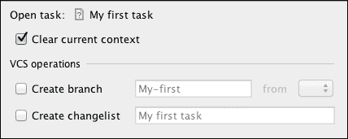

当您创建新任务时，您可以清除上下文并在您的 VCS 中创建一个新的分支。点击**确定**完成创建。如果您选中**清除当前上下文**选项，则现在编辑器中打开的所有文件都将关闭。

在 Android Studio 的工具栏中有一个新项目，一个包含您任务的下拉列表。如图所示，我们的当前任务是最近创建的**我的第一个任务**。请注意存在一个先前任务，**默认任务**：

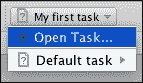

当你准备好关闭任务时，请导航到 **工具** | **任务与上下文** | **关闭活动任务...**。在关闭任务对话框中，你可以提交更改并合并当前分支。

# 版本控制系统

Android Studio 集成了一些 **版本控制系统**（**VCS**）：GitHub、CVS、Git、Google Cloud、Mercurial 和 Subversion。要启用版本控制集成，请导航到 **VCS** | **启用版本控制集成...** 并选择系统类型。现在，一些更多选项将被添加到 **VCS** 菜单中：

+   要更新整个项目，请导航到 **VCS** | **更新项目...**

+   要提交项目中的所有更改，请导航到 **VCS** | **提交更改...**

第一步是从版本控制系统进行检出。导航到 **VCS** | **从版本控制检出**，点击添加图标，并输入存储库 URL 或存储库配置。

版本控制操作也可以应用于单个文件。在项目的任何文件上右键单击，然后选择 **Subversion** 部分。从出现的菜单中，我们可以将文件添加到存储库，将其添加到忽略列表，浏览更改，撤销更改或锁定它。

使用 **本地历史记录** 选项是控制文件版本的一个更简单的方法。在编辑器中打开主活动文件，然后导航到 **VCS** | **本地历史记录** | **显示历史记录**。文件历史记录对话框将被打开。在对话框的左侧，列出了文件的可用版本。选择一个较旧的版本，以将其与文件的当前版本进行比较。较旧版本与当前版本之间的差异会被突出显示。灰色用于表示已删除的代码块，蓝色用于突出显示已更改的文本，绿色用于表示新插入的文本。从顶部的图标中，我们可以撤销更改并配置空白可视化。以下截图显示了我们的主活动两个版本的比较。我们可以观察到我们最近添加的方法——`onAcceptClick` 方法——以绿色突出显示：

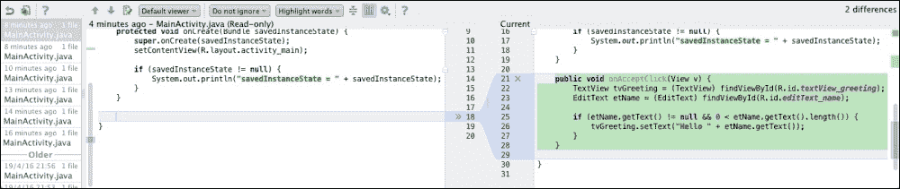

我们还可以检查特定代码块的本地区历史记录。关闭对话框，从编辑器中选择一些代码行，然后导航到 **VCS** | **本地历史记录** | **显示选择的历史记录**。将打开相同的历史记录对话框，但这次它显示所选代码的版本。

# 摘要

到本章结束时，你将拥有使用 Android SDK 管理器工具安装、更新或检查项目可用平台所需的知识。你可以在需要时创建新的 AVD 并对其进行编辑。使用 Javadoc 为我们的项目创建完整的文档应该不再成为问题，我们还应该能够与集成在 Android Studio 中的版本控制系统（VCS）一起工作。

在下一章中，你将了解可用的 Google Play 服务以及如何使用 Android Studio 将它们集成到你的项目中。我们还将探讨如何安装和集成与 Google 技术一起提供的不同库，例如 Google Maps、Google Cloud Messaging 以及更多。
