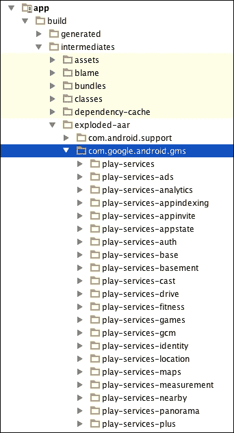
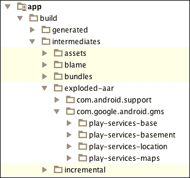
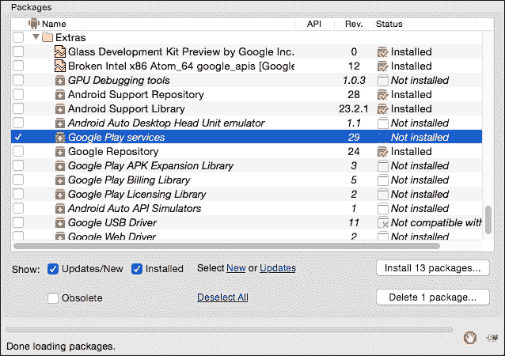
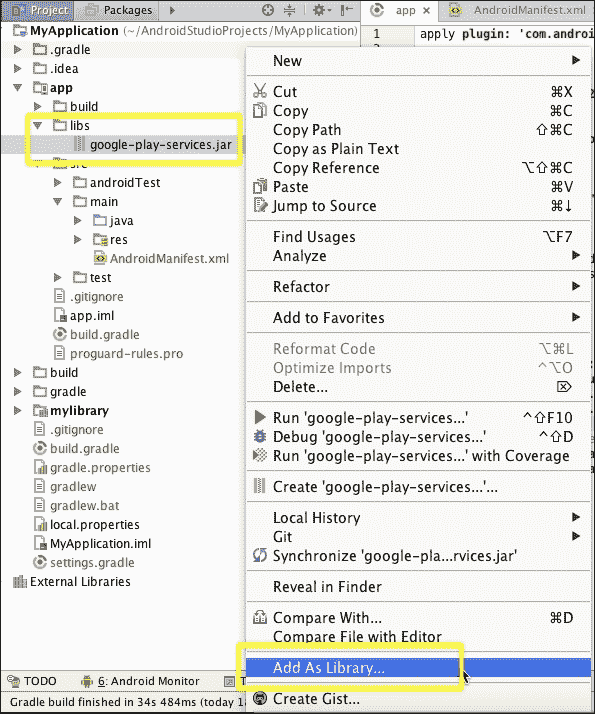
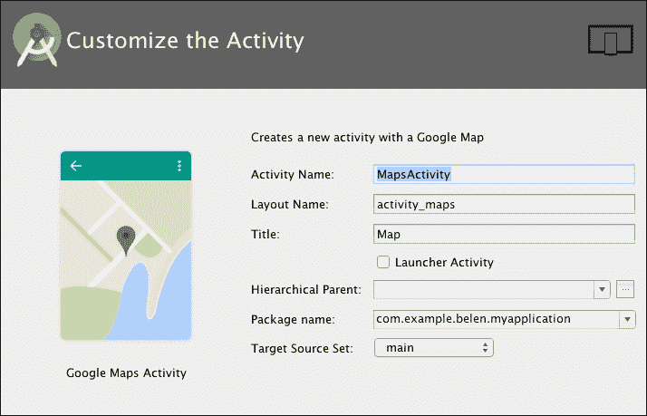
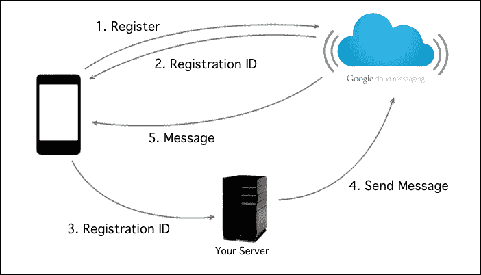

# 第七章. Google Play 服务

现在我们已经熟悉了在布局中使用组件的使用，是时候开始考虑额外的功能了。Google Play 服务为你提供了诸如 Google Maps、Google+等特性，以吸引用户。所有可用的功能有哪些？你如何将这些功能添加到你的应用程序中？使用 Google Play 服务需要满足哪些 Android 版本要求？

本章重点介绍使用 Android Studio 创建、集成和使用 Google Play 服务。你将了解可用的 Google 服务。你还将了解提供安全方式授予和接收访问令牌的标准授权 API。然后，你将了解这些服务的限制以及使用它们的优点。

这些是我们将在本章中讨论的主题：

+   现有的 Google 服务

+   从 IDE 中添加 Google Play 服务

+   在你的应用程序中集成 Google Play 服务

+   理解自动更新

+   在你的应用程序中使用 Google 服务

# Google Play 服务的工作原理

当 Google 在 2012 年的 Google I/O 上预览 Google Play 服务时，它表示该平台“由在设备上运行的组件和一个与你的应用程序打包的轻量级客户端库组成”([`developers.google.com/events/io/2012/`](https://developers.google.com/events/io/2012/))。

这意味着 Google Play 服务得益于两个主要组件：

+   **Google Play 服务客户端库**：Google Play 服务客户端库包含了你的应用程序使用的每个 Google 服务的接口。当你打包应用程序时，库会被包含在内，并允许你的用户使用他们的凭证通过这些服务授权应用程序。Google 会定期升级客户端库，增加新功能和服务。你可以通过更新应用程序来升级库中的库，尽管如果你没有包含任何新功能，这并不是必需的。

+   **Google Play 服务 APK**：Google Play 服务的 APK 在 Android 操作系统中作为后台服务运行。使用客户端库，你的应用程序可以访问此服务，在运行时执行操作。该 APK 并不保证在所有设备上都已安装。如果设备没有预装该 APK，你可以从 Google Play 商店获取。

通过这种方式，Google 能够将他们服务的运行时与开发者所实施的实现分离，因此你不需要在 Google Play 服务升级时每次都更新你的应用程序。

Google Play 服务的 APK 文件会自动通过 Google Play 商店进行更新。任何运行 Android 2.3 或更高版本的 Android 设备都可以安装使用 Google Play 服务的任何应用程序。

# 可用服务

Google Play 服务让您能够轻松地为各种设备添加更多功能，同时使用由 Google 提供支持的知名功能。使用这些服务，您可以添加新的收入来源，管理应用的分发，访问统计数据，了解您的应用用户习惯，并通过易于实现的 Google 功能（如地图或 Google 的社会网络 Google+）来改进您的应用。以下是一些服务的说明：

+   **Google+**：使用 Android 的 Google+平台，您可以验证您的应用用户。一旦验证成功，您还可以访问他们的公共资料和社交图谱，以及其他操作。

+   **Google Analytics**：通过集成此服务，您可以让您的应用向 Google Analytics 发送信息。这是一个收集您应用指标的工具。指标可以帮助您通过跟踪事件（如按钮点击次数）或跟踪屏幕和组件的可视化来了解用户如何使用您的应用。

+   **Google App Indexing**：通过集成此服务，您可以让您的应用内容对 Google 应用索引可用。这将使您的应用更容易被用户找到。

+   **Google Cast**：通过集成此服务，您可以让您的应用与 Google Cast 设备（如 Chromecast 或 Android TV）交互。

+   **Google Cloud Messaging**：使用 Android 上的**Google Cloud Messaging**（**GCM**），您可以在运行在基于 Android 的设备中的应用程序和您的服务器之间交换数据。使用 GCM，您的服务器可以开始与您的应用程序通信，从而可以向用户生成推送通知。

+   **Google Drive**：使用 Google Drive API，您可以让您的应用程序访问和管理用户存储在 Google Drive 账户中的文件。

+   **Google Fit**：使用 Google Fit API，您可以与**蓝牙低功耗**（**BLE**）设备（如心率监测器、骑行传感器或计步器）交互，访问数据或管理 Google Fit 中的用户活动。

+   **Google In-app Billing**：使用 Google Play In-app Billing，您可以从您的应用中销售数字内容。您可以使用此服务销售一次性收费或时间订阅的高级服务和功能。

+   **Google Location**：通过集成位置 API，您可以让您的应用程序具备位置感知能力。

+   **Google Maps**：通过集成 Google Maps API，您可以在您的应用中使用 Google 提供的地图，并对其进行自定义。

+   **Google Mobile Ads**：使用 Google Mobile Ads API，您可以在您的应用中添加 AdMob 横幅广告。

+   **Google Nearby**：通过集成 Google Nearby 服务，您可以让您的应用与附近的设备交互，并根据距离执行操作。

+   **Google Panorama Viewer**：通过集成此服务，您可以让用户查看 360 度全景图片。

+   **Google Places**：通过集成 Google Places API，您可以在您的应用中使用 Google 提供的位置信息。

+   **Google Play 游戏服务**：使用 Google Play 游戏服务，你可以通过更社交化的体验来提升你的游戏体验，例如成就、排行榜、游戏礼物或玩家统计数据。

+   **Google 登录**：通过集成 Google 登录，用户可以使用他们的 Google 账户安全地注册到你的应用中。

+   **Google 钱包**：通过集成 Google 钱包，你可以在云中存储诸如礼品卡或忠诚度计划等对象，并使用它们在商店或在线支付。

# 将 Google Play 服务添加到 Android Studio

我们首先需要知道我们需要添加到 Android Studio 中的内容。你已经了解到 APK 在 Google Play 商店中可用，它是服务的实际运行时。作为开发者，我们在调试应用程序时只需要这个包在测试设备上。我们需要添加到 Android Studio 中的是 Google Play 服务客户端库。

这个库必须作为依赖项声明在你的应用程序中，因此请执行以下步骤：

1.  打开你的应用程序模块的`build.gradle`文件（`/app/build.gradle`）。

1.  在`dependencies`块中输入以下行以向你的应用程序构建添加新的依赖项：

    ```java
    dependencies {
       …
       compile 'com.google.android.gms:play-services:8.4.0'
    }
    ```

    最新版本的 Google Play 服务是 8.4（2015 年 12 月）。当库的新更新发布时，你需要在`build.gradle`文件中更新版本号。

1.  导航到**工具** | **Android** | **与 Gradle 文件同步项目**以将新的 Google Play 服务依赖项同步到你的项目。

1.  最后，在应用程序的 manifest 文件中的应用程序块中添加它：

    ```java
    <meta-data android:name="com.google.android.gms.version"
      android:value="@integer/google_play_services_version" />
    ```

    你应该在应用程序项目的`app/build/intermediates/exploded-aar/com.google.android.gms/`的`build`文件夹中找到这个库，如下一截图所示：

    

正如你可以在之前的截图和你的项目中注意到的那样，所有 Google Play 服务都已包含：`play-services-ads`、`play-services-analytics`、`play-services-appindexing`等等。如果你只需要一些服务而不想包含所有服务，这可能是完全不必要的。自 Google Play 服务版本 6.5 起，你可以独立添加服务。

例如，如果你只想添加 Google Maps 和 Google Places API，将`build.gradle`文件中之前的依赖项替换为以下两个依赖项：

```java
dependencies {
   …
   compile 'com.google.android.gms:play-services-maps:8.4.0'
 compile 'com.google.android.gms:play-services-location:8.4.0'
}
```

导航到**工具** | **Android** | **与 Gradle 文件同步项目**以同步你的项目。现在你可以在应用程序项目的`app/build/intermediates/exploded-aar/com.google.android.gms/`的`build`文件夹中找到 Google Maps 和 Google Places API，如下一张截图所示：



如果你仍然有所有的`play-services`文件夹，通过导航到**构建** | **清理项目**来清理项目。

虽然我们推荐使用 Gradle 依赖项将 Google Play 服务包含到您的应用程序中，但还有另一种方法在您的应用程序中使用它们。您可以从我们的系统中下载并安装 Google Play 服务库。此库通过 Android SDK 管理器进行分发。现在，执行以下步骤：

1.  导航到**工具** | **Android** | **SDK 管理器**。打开独立的 SDK 管理器。我们可以在`Extras`文件夹下的包列表中找到 Google Play 服务。

1.  选择**Google Play services**复选框，然后点击**安装 1 个包...**按钮：

    执行这些操作将把库项目添加到我们的 SDK 安装文件夹的位置，`/sdk/extras/google/google_play_services/`。您可以通过将鼠标悬停在 SDK 管理器中的**Google Play services**行上并查看工具提示来检查确切路径。

1.  导航到文件夹以检查其内容。`samples`文件夹包含一些示例项目，例如 Google Analytics（`analytics/`）、身份验证服务（`auth/`）、Google Cast（`cast/`）、Google Drive（`drive/`）、Google Maps（`maps/`）、Google Panorama（`panorama/`）或 Google Wallet（`wallet/`）的项目。`libproject/`文件夹包含 Google Play 服务库项目。`google-play-services.jar`文件放置在此文件夹的`libproject/google-play-services_lib/libs/google-play-services.jar`中。`docs/`文件夹包含文档。

1.  通过将 JAR 文件拖入`libs/`文件夹，简单地将此 JAR 文件添加到您的项目中。

1.  选择 JAR 文件，然后右键单击它。

1.  选择**添加为库...**选项，如下一张截图所示：

    在**创建库**对话框中选择您的应用程序模块，然后点击**确定**。现在您可以在项目的`libs/`文件夹下找到可用的`google-play-services.jar`，您现在将能够从您的代码中引用 Google Play 服务。

1.  最后，您需要将库添加到您的 Gradle 构建文件中。为此，只需编辑`MyApplication/`下的`build.gradle`文件，并在`dependencies`部分添加以下行：

    ```java
    dependencies {
       …
      compile files('libs/google-play-services.jar')
    }
    ```

# Google Maps Android API

Google Maps Android API 允许您的应用程序用户通过 Google 服务探索可用的地图。它提供了诸如 3D 地图、室内和卫星地图、基于矢量的高效缓存和绘图技术，以及通过地图的动画过渡等功能。将以下依赖项添加到您的 Gradle 构建文件中，以将 Google Maps API 包包含到您的应用程序中：

```java
compile 'com.google.android.gms:play-services-maps:8.4.0'
```

让我们创建一个新的活动，**Google Maps Activity**，来检查最重要的生成类。导航到 **文件** | **新建** | **活动** | **图库...**。在 **添加活动到移动** 对话框中，选择 **Google Maps Activity** 并点击 **下一步**。在 **自定义活动** 步骤中，保留默认值，如截图所示：`MapsActivity` 作为 **活动名称**，`activity_maps` 作为 **布局名称**，`Map` 作为 **标题**：



点击 **完成**。创建了三个新文件：活动 `MapsActivity.java`（位于 `src/main/java`），布局 `activity_maps.xml`（位于 `src/main/res/layout`），以及一个资源文件，`google_maps_api.xml`（位于 `/src/debug/res/values` 和 `/src/release/res/values`）。此资源文件包含您需要使用 Google Maps API 的 Google Maps API 密钥。打开资源文件中提供的链接，并按照说明操作。一旦您创建了密钥，将其粘贴到资源文件中，替换 `YOUR_KEY_HERE` 文本。

在 `src/main/java/` 下打开 `MapsActivity` 类。检查活动中的 `import` 语句，注意 `com.google.android.gms.maps` 包包含 Google Maps Android API 类。活动有一个 `private` 类型的 `GoogleMap` 变量，这是 API 的主要类，也是所有与地图相关方法的入口点。您可以根据应用程序风格更改地图的主题颜色和图标。您还可以通过向其添加标记来自定义地图。要添加一个简单的标记，您可以使用 `GoogleMap` 类的 `addMarker` 方法。检查 `MapsActivity` 中的 `onMapReady` 方法，以查看以下代码：

```java
LatLng sydney = new LatLng(-34, 151);
mMap.addMarker(new MarkerOptions().position(sydney).title("Marker in Sydney"));
```

`addMarker` 方法接受一个 `MarkerOptions` 对象作为参数。使用 `position` 方法，我们指定地图上标记的坐标，并使用 `title` 方法，我们可以添加一个自定义字符串，使其显示在标记上。

要将地图添加到布局中，我们可以使用扩展了 `View` 类并显示地图的 `MapView` 类。然而，将地图放置在应用程序中最简单的方法是使用 `MapFragment` 对象。`fragment` 代表用户界面或行为的一部分，可以嵌入到活动中。`fragment` 是一个可重用的模块。

`MapFragment` 类封装了一个地图视图，以自动处理组件所需的生命周期要求。要查看此代码的使用情况，请打开与 `MapsActivity` 类关联的布局。这是位于 `/res/layout/` 下的 `activity_maps.xml` 文件。`MapFragment` 类扩展了 `Fragment` 类，因此可以通过添加以下 XML 代码将其添加到布局中：

```java
<fragment
    android:id="@+id/map"
	android:name="com.google.android.gms.maps.SupportMapFragment"
    android:layout_width="match_parent"
    android:layout_height="match_parent" />
```

最后，我们需要代码来从片段中获取 `GoogleMap` 对象。我们可以使用 `findFragmentById` 方法找到 `Fragment` 地图，然后使用 `getMap` 方法从 `Fragment` 获取地图：

```java
MapFragment mapFragment = (MapFragment)  
   getFragmentManager().findFragmentById(R.id.map);
```

您可以在 `MapsActivity` 类的 `onCreate` 方法中看到此代码的示例。

最后一个重要的类是 `GoogleMapOptions` 类，如果您以编程方式创建地图，则可以使用它。它定义了地图的配置。您还可以通过编辑布局 XML 代码或使用活动代码中的地图设置器方法来修改地图的初始状态。以下是一些可用的有趣选项：

+   `mapType`：这指定了地图的类型。其值可以是 `none`、`normal`、`hybrid`、`satellite` 或 `terrain`。

+   `compassEnabled`：这定义了是否启用或禁用指南针控件。

+   `zoomControlsEnabled`：这定义了是否启用或禁用缩放控件。

+   `rotateGesturesEnabled`：这定义了是否启用或禁用旋转手势。

在 Google Map 的 GitHub 上有一些示例演示：[`github.com/googlemaps/android-samples`](https://github.com/googlemaps/android-samples)。

# Google Places

使用 Google Places API，您的应用可以访问 Google 的地点数据库。这个数据库包含有关商业和本地地点的信息：名称、地址、照片、电话号码、评分、类型、坐标、网站或价格水平。在您的 Gradle 构建文件中添加以下依赖项以将 Google Places API 包包含到您的应用中：

```java
compile 'com.google.android.gms:play-services-location:8.4.0'
```

要使用 Google Places API，需要一个 API 密钥。这个密钥与您用于 Google Maps API 的密钥相同。一旦您有了它，请将其添加到您的应用清单文件中的 `application` 元素内，使用以下代码：

```java
<meta-data android:name="com.google.android.geo.API_KEY"
android:value="YOUR_API_KEY_HERE"/>
```

使用 `GoogleApiClient` 类来访问 API。通过指示两个可用的地点 API 密钥之一，在 `Build` 方法中将 Google Places API 添加到 `Build` 方法中：

+   **Geo Data API**：此 API 提供对 Google 数据库的访问，该数据库包含有关本地地点和商业的信息。此 API 的密钥是 `Places.GEO_DATA_API`。

+   **地点检测 API**：此 API 获取设备位置并检测附近的地点。此 API 的密钥是 `Places.PLACE_DETECTION_API`。

您也可以添加它们两个。以下代码是您活动 `onCreate` 方法的示例：

```java
GoogleApiClient gac = new GoogleApiClient
        .Builder(this)
        .addApi(Places.GEO_DATA_API)
        .addApi(Places.PLACE_DETECTION_API)
        .addConnectionCallbacks(this)
        .addOnConnectionFailedListener(this)
        .build();
```

除了这两个 API 之外，还有一个默认对话框，您的应用可以显示它，让用户在地图中选择地点——**地点选择 UI**。使用此元素，您不需要实现自己的自定义对话框。使用 `PlacePicker` 类的 `IntentBuilder` 方法创建一个 `Intent` 并启动活动，如下面的代码所示：

```java
PlacePicker.IntentBuilder builder = 
   new PlacePicker.IntentBuilder();
startActivityForResult(builder.build(this), PLACE_PICKER_REQUEST);
```

活动的结果将返回用户选择的地点，您可以使用 `PlacePicker` 类的 `getPlace` 方法获取：

```java
@Override
public void onActivityResult(int requestCode, int resultCode, Intenta data) {
   if (requestCode == PLACE_PICKER_REQUEST) {
      if (resultCode == Activity.RESULT_OK) {
         Place place = PlacePicker.getPlace(data, getActivity());
      }
   }
}
```

## Geo Data API

使用与 Google 数据库相连的 Geo Data API，您可以通过标识符或查询找到地点，您可以获取地点的照片，或者您可以添加新的地点。这些是 `GeoDataApi` 接口中的主要方法：

+   `addPlace`: 此方法允许您将新地点添加到谷歌数据库中。该地点将对您的应用可用，但在添加到谷歌数据库之前需要经过审核。关于新地点的信息包含在`AddPlaceRequest`对象中。

+   `getAutocompletePredictions`: 此方法根据查询返回地点列表，该查询查找地点的名称和地址。除了搜索字符串外，您还可以添加更多过滤器，例如纬度和经度限制或仅返回企业的标志。

+   `getPlaceById`: 此方法返回具有指定地点 ID 的`Place`对象列表。

+   `getPlacePhotos`: 此方法返回最多 10 张指定 ID 的地点照片。

## 地点检测 API

要获取用户所在位置的估计，您需要使用地点检测 API。`PlaceDetectionApi`接口提供了`getCurrentPlace`方法，该方法返回一个包含候选地点列表及其用户位于这些地点的可能性（`PlaceLikelihood`对象）的缓冲区（`PlaceLikelihoodBuffer`对象）。`PlaceLikelihood`对象有两个公共方法：

+   `getLikelihood`: 此方法返回一个`float`值，表示可能性，其值从 0.0 到 1.0。值越高，用户位于候选地点的置信度就越高。

+   `getPlace`: 此方法返回包含候选地点所有信息的`Place`对象。

`getCurrentPlace`方法可以接收一个过滤器以细化结果（`PlaceFilter`对象）。您可以过滤当前是否开放的地点，以及可以按特定地点标识符进行过滤。

### 小贴士

要查看更多代码和示例，请查看谷歌 GitHub 上的示例演示：[`github.com/googlesamples/android-play-places`](https://github.com/googlesamples/android-play-places)。

# Google Sign-In

Google Sign-In for Android 允许开发人员使用用户在谷歌上使用的相同凭据进行用户身份验证。用户将能够使用他们的谷歌凭据登录您的应用。在您的 Gradle 构建文件中添加以下依赖项以将 Google Sign-In 包包含到您的应用中：

```java
compile 'com.google.android.gms:play-services-auth:8.4.0'
```

这些是您需要了解的主要 Google Sign-In API 类：

+   `SignInButton`: 这是默认的 Google Sign-In 按钮。您需要在您的应用中添加默认按钮或自定义按钮，以便用户可以触发登录流程。您可以使用以下代码在布局文件中添加默认按钮：

    ```java
    <com.google.android.gms.common.SignInButton
     android:id="@+id/sign_in_button"
     android:layout_width="wrap_content"
     android:layout_height="wrap_content" />
    ```

    此默认按钮可以根据范围进行自定义，包括大小和颜色。例如，您可以选择以下这些大小值，您可以在下一张截图中进行比较：`SignInButton.SIZE_ICON_ONLY`、`SignInButton.SIZE_STANDARD`或`SignInButton.SIZE_WIDE`。

    

+   `GoogleSignInOptions`: 这个类配置 Google Sign-In API 选项。您可以使用`GoogleSignInOptions.DEFAULT_SIGN_IN`选项请求用户的 ID 和基本资料。您还可以构建一个新的选项来请求额外的信息，例如使用以下代码请求用户的电子邮件：

    ```java
    GoogleSignInOptions gsio = new
      GoogleSignInOptions.Builder(
          GoogleSignInOptions.DEFAULT_SIGN_IN)
      .requestEmail()
      .build();
    ```

+   `GoogleApiClient`: 这个类用于访问 API。在`Build`方法中通过指定`Auth.GOOGLE_SIGN_IN_API`密钥添加 Google Sign-In API。构建方法还会接收一个`GoogleSignInOptions`对象。您可以将以下代码添加到活动的`onCreate`方法中，以获取`GoogleApiClient`对象：

    ```java
    GoogleApiClient gac = new GoogleApiClient.Builder(this)
        .enableAutoManage(this, this)
        .addApi(Auth.GOOGLE_SIGN_IN_API, gsio)
        .build();
    ```

要查看更多代码和示例，请查看 Google 的 GitHub 上的示例演示：[`github.com/googlesamples/google-services/tree/master/android/signin`](https://github.com/googlesamples/google-services/tree/master/android/signin)。

# Android 的 Google+平台

Android 的 Google+平台现在已成为 Google Sign-In 的一部分。您需要将 Google Sign-In 添加到您的应用中以使用 Google+。这使您能够通过用户名欢迎用户，显示他们的图片或与朋友连接，以使用公共资料和社交图谱。

创建一个`GoogleApiClient`对象以访问 API 并使用登录功能。通过指定密钥`Plus.API`和这两个作用域：`Scopes.PLUS_LOGIN`和`Scopes.PLUS_ME`，添加 Google+ API，如下面的代码所示：

```java
GoogleApiClient gac = new GoogleApiClient.Builder(this)
        .enableAutoManage(this, this)
        .addApi(Plus.API)
        .addScope(Scopes.PLUS_LOGIN)
        .addScope(Scopes.PLUS_ME)
        .build();
```

`PlusShare`类包括在 Google+上共享的帖子中的资源。`PlusOneButton`类实现了一个**+1**按钮，用于在 Google+上推荐 URL。**+1**按钮的可用尺寸有小型、中型、大型或标准型。您可以使用以下代码将其添加到布局中：

```java
<com.google.android.gms.plus.PlusOneButton
  android:layout_width="wrap_content"
  android:layout_height="wrap_content"
  plus:size="standard" />
```

要查看更多代码和示例，请查看 Google 的 GitHub 上的示例演示：[`github.com/googleplus/gplus-haiku-client-android`](https://github.com/googleplus/gplus-haiku-client-android)。

# Google Play 应用内计费

应用内计费允许您从您的应用中销售虚拟内容。这种虚拟内容可以是付费内容，一次计费或通过订阅或费用进行时间折扣。使用这项服务，您可以对额外功能和访问高级内容进行收费。

任何在 Google Play 商店发布的应用都可以实现应用内计费 API，因为它只需要与发布应用相同的资产：一个 Google Play 开发者控制台账户和一个 Google Wallet 商户账户。

使用 Google Play 开发者控制台，您可以定义您的产品，包括类型、识别码（SKU）、价格、描述等。一旦您定义了您的产品，您就可以从该应用程序访问这些内容。当用户想要购买此内容时，您的应用内计费应用程序和 Google Play 之间将发生以下购买流程：

1.  您的应用调用`isBillingSupported()`到 Google Play 以检查您使用的应用内计费版本是否受支持。

1.  如果支持 In-app Billing API 版本，你可以使用`getPurchases()`来获取已购买项目的 SKU 列表。这个列表将返回在一个`Bundle`对象中。

1.  你可能想要通知用户可用的应用内购买。为此，你的应用可以发送一个`getSkuDetails()`请求，这将生成一个包含价格、标题、描述以及更多关于所提供项目的信息的列表。

要查看更多代码和示例，请查看 Google 的 GitHub 上的示例演示：[`github.com/googlesamples/android-play-billing`](https://github.com/googlesamples/android-play-billing)。

# Google Cloud Messaging

**Google Cloud Messaging**（**GCM**）为 Android 提供了服务器和你的应用之间通过异步消息进行通信的功能。你需要在你的 Android 应用中实现客户端实现，同时也需要在服务器端实现以发送消息并存储客户端数据。你不需要担心处理此通信的低级方面，如队列和消息构建。使用此服务，你可以轻松地为你的应用实现一个通知系统。

以下图像显示了 GCM 的工作原理。这个过程涉及三个元素：你的应用、你的服务器和 GCM 服务器。

1.  你的应用首先需要在 GCM 中进行注册以获取一个注册 ID，这个 ID 用于在特定设备上标识你的应用。

1.  你的应用必须将注册 ID 发送到你的服务器以便保存。这一步是必要的，因为你的服务器需要知道用户设备的注册 ID，以便在该设备上向你的应用发送消息。

1.  当你的服务器想要发送消息时，它将消息发送到 GCM 服务器，并指示消息信息和将接收消息的设备的注册 ID。

1.  最后，GCM 将消息发送到那些设备上的你的应用。

使用 GCM 时，你有两种选择：

+   服务器可以在有新数据可供从服务器获取时通知你的应用，然后应用获取这些数据。

+   服务器可以直接在消息中发送数据。消息有效载荷可以达到 4 KB。这允许你的应用一次性访问数据并相应地采取行动。

在你的 Gradle 构建文件中添加以下依赖项，以将 Google Maps API 包包含到你的应用中：

```java
compile 'com.google.android.gms:play-services-gcm:8.4.0'
```

为了从你的应用（客户端）发送或接收消息，你需要获取一个注册 ID。这个 ID 标识了设备和应用的组合。为了允许你的应用使用 GCM 服务，你需要在你的项目清单文件中添加以下行：

```java
<uses-permission android:name="com.google.android.c2dm.permission.RECEIVE"/>
```

你还必须在清单文件中添加以下三个类的声明：

+   **GCM 接收器**：这个类管理你的应用中接收到的消息。这个接收器已经属于 GCM API，你不需要创建它。使用以下代码将其添加到你的清单文件中：

    ```java
    <receiver 
    android:name="com.google.android.gms.gcm.GcmReceiver"
    android:exported="true" android:permission="com.google.android.c2dm.permission.SEND">
       <intent-filter>
          <action
          android:name="com.google.android.c2dm.intent.RECEIVE" />
          <category android:name="com.example.gcm" />
       </intent-filter>
    </receiver>
    ```

+   **GCM 监听服务**: 这个服务类，您需要在您的应用中创建，应该扩展 `GcmListenerService` 类。通过实现这个服务子类，您可以在其 `onMessageReceived` 方法中处理消息。使用以下代码将其添加到您的清单文件中：

    ```java
    <service
    android:name="com.example.MyGcmListenerService"
    android:exported="false" >
       <intent-filter>
          <action
          android:name="com.google.android.c2dm.intent.RECEIVE" />
       </intent-filter>
    </service>
    ```

+   **实例 ID 监听服务**: 这个服务类，您需要在您的应用中创建，应该扩展 `InstanceIDListenerService` 类。通过实现这个服务子类，您可以处理注册 ID。使用以下代码将其添加到您的清单文件中：

    ```java
    <service
    android:name="com.example.MyInstanceIDListenerService"
    android:exported="false">
       <intent-filter>
          <action
          android:name="com.google.android.gms.iid.InstanceID" />
       </intent-filter>
    </service>
    ```

要查看更多代码和示例，请检查 Google 的 GitHub 上的示例演示：[`github.com/googlesamples/google-services/tree/master/android/gcm`](https://github.com/googlesamples/google-services/tree/master/android/gcm).

# 更多示例应用

如果您对 Google Play 服务感兴趣，Google 的 GitHub 上有可用的示例应用。以下是它们的链接：

+   Google+: [`github.com/googleplus/gplus-haiku-client-android`](https://github.com/googleplus/gplus-haiku-client-android).

+   Google 分析: [`github.com/googlesamples/google-services/tree/master/android/analytics`](https://github.com/googlesamples/google-services/tree/master/android/analytics).

+   Google 应用索引: [`github.com/google/search-samples/tree/master/app-indexing`](https://github.com/google/search-samples/tree/master/app-indexing).

+   Google Cast: [`github.com/googlecast/CastVideos-android`](https://github.com/googlecast/CastVideos-android) 或 [`github.com/googlecast/GameManagerSamples`](https://github.com/googlecast/GameManagerSamples).

+   Google 云消息传递: [`github.com/googlesamples/google-services/tree/master/android/gcm`](https://github.com/googlesamples/google-services/tree/master/android/gcm).

+   Google Drive: [`github.com/googledrive/android-demos`](https://github.com/googledrive/android-demos).

+   Google Fit: [`github.com/googlesamples/android-fit`](https://github.com/googlesamples/android-fit).

+   Google 应用内计费: [`github.com/googlesamples/android-play-billing`](https://github.com/googlesamples/android-play-billing).

+   Google 地理位置服务: [`github.com/googlesamples/android-play-location/`](https://github.com/googlesamples/android-play-location/).

+   Google 地图: [`github.com/googlemaps/android-samples`](https://github.com/googlemaps/android-samples).

+   Google 移动广告: [`github.com/googleads/googleads-mobile-android-examples`](https://github.com/googleads/googleads-mobile-android-examples).

+   Google 附近: [`github.com/googlesamples/android-nearby`](https://github.com/googlesamples/android-nearby).

+   Google 地点: [`github.com/googlesamples/android-play-places`](https://github.com/googlesamples/android-play-places).

+   Google Play 游戏服务: [`github.com/playgameservices/android-basic-samples`](https://github.com/playgameservices/android-basic-samples).

+   Google 登录：[`github.com/googlesamples/google-services/tree/master/android/signin`](https://github.com/googlesamples/google-services/tree/master/android/signin)。

+   Google 钱包：[`github.com/android-pay/androidpay-quickstart`](https://github.com/android-pay/androidpay-quickstart)。

# 摘要

在本章中，我们讨论了可用的 Google Play 服务。你学习了如何通过其客户端库和 Android 包使用 Google Play 服务来改进我们的应用程序。你应该已经使用 SDK 管理器成功安装了 Google Play 服务客户端库，并且现在应该能够使用库功能构建应用程序。你还了解了一些关于 Google Maps v2、Google+ 平台 Android 身份验证、Google Play 内部计费和 GCM 的技巧。

在下一章中，你将了解 Android Studio 中可用的某些有用工具。我们将经常使用 SDK 管理器来安装不同的包。你还将了解 AVD 管理器，用于测试我们的应用程序的不同虚拟设备。我们将使用 Javadoc 工具为我们的项目生成 Javadoc 文档，你还将了解 Android Studio 中可用的版本控制系统。
