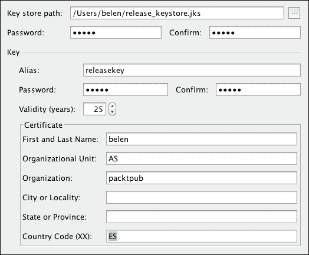
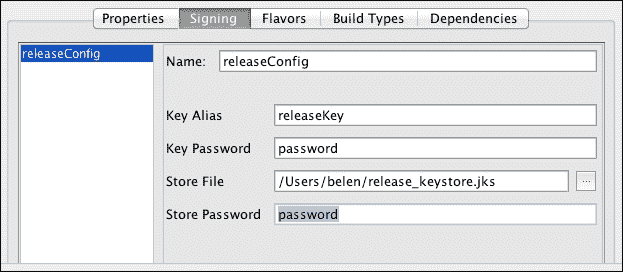
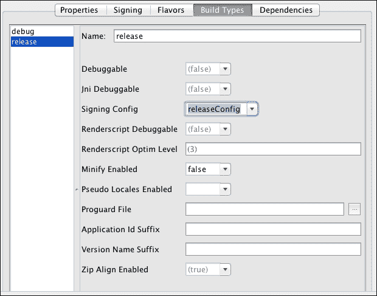
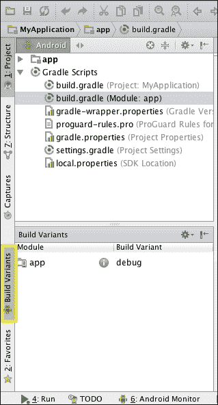
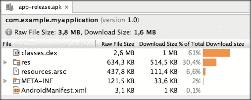
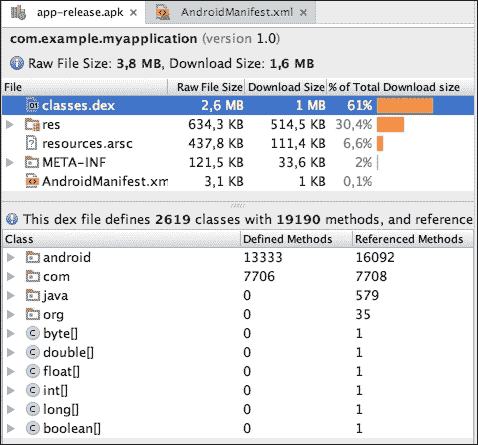

# 第九章。准备发布

在上一章中，你已经学到了足够多的知识来测试和调试你的应用程序。为了准备你的应用程序发布，你需要做什么？你如何使用 Android Studio 来做到这一点？

本章描述了使用 Android Studio 准备应用程序发布所需的必要步骤。首先，你将了解**应用程序包**（**APK**）文件——这是安卓应用程序打包的 JAR 文件的一种变体。然后，你将学习在完全测试应用程序后需要如何更改你的应用程序。最后，我们将对 APK 文件进行签名，使其准备好上传到 Google Play。

本章我们将讨论以下主题：

+   APK 文件

+   构建类型

+   准备发布

+   生成已签名的 APK

+   在发布模式下签名

# 理解 APK 文件

安卓应用程序打包在一个以 `.apk` 扩展名的文件中。这些文件仅仅是压缩的 ZIP 文件，因此其内容可以轻松地被探索。APK 文件通常包含以下内容：

+   `assets/`：这是一个包含应用程序资产文件的文件夹。这是与我们的项目相同的 `assets` 文件夹。

+   `META-INF/`：这是一个包含我们的证书的文件夹。

+   `lib/`：这是一个包含编译代码的文件夹，以防需要为处理器使用。

+   `res/`：这是一个包含应用程序资源，如图片、字符串等的文件夹。

+   `AndroidManifest.xml`：这是应用程序的清单文件。

+   `classes.dex`：这是一个包含应用程序编译代码的文件。

+   `resources.arsc`：这是一个包含一些预编译资源的文件，例如二进制 XML 文件。

拥有 APK 文件可以让应用程序在安卓操作系统中进行分发和安装。安卓应用程序可以按照你的喜好进行分发：通过应用市场，如 Google Play、Amazon App store 或 Opera Mobile Store；通过你的个人网站；甚至通过电子邮件发送给你的用户。如果你选择后两种选项之一，请考虑安卓默认情况下会阻止从 Google Play 以外的位置安装应用程序。你应该通知你的用户，他们需要在他们的设备中禁用此限制才能安装你的应用程序。他们必须通过在安卓设备中导航到**设置** | **安全**来检查**未知来源**选项。

# 构建类型

应用程序在构建时必须使用私钥进行签名。如果一个应用程序没有签名，它就不能在设备上安装，甚至不能在模拟器中安装。为了构建我们的应用程序，有两种类型：**调试**和**发布**。两个 APK 版本包含相同的文件夹和编译文件；区别在于用于签名的密钥。两种模式如下解释：

+   **调试**：在我们之前章节中运行和测试我们的应用程序时，我们处于调试模式，但我们没有密钥，也没有对应用程序进行签名。Android SDK 工具会自动创建一个调试密钥、别名及其密码来签名 APK。这个过程在我们使用 Android Studio 运行或调试应用程序时发生，而我们并没有意识到。我们不能发布由 SDK 工具创建的调试密钥签名的 APK。

+   **发布**：当我们分发我们的应用程序时，我们必须构建一个发布版本。Google Play 要求 APK 文件必须使用证书签名，开发者保留私钥。在这种情况下，我们需要我们自己的私钥、别名和密码，并将它们提供给构建工具。证书标识应用程序的开发者，可以是自签名证书。不需要证书颁发机构签名证书。

将包含你的证书的密钥库保存在安全的地方。为了升级你的应用程序，你必须使用相同的密钥来上传新版本。如果你丢失了密钥库，你将无法更新你的应用程序。你将不得不创建一个新的应用程序，并使用不同的包名。

# 发布应用程序之前的步骤

在生成 APK 文件之前，你需要准备你的应用程序以在发布模式下构建。执行以下步骤：

1.  首先，确保你已经完全测试了你的应用程序。我们建议以下几种方式来测试你的应用程序：

    +   在使用最低要求平台的设备上

    +   在使用目标平台的设备上

    +   在使用最新可用平台的设备上

    +   在真实设备上，而不仅仅是模拟器上

    +   在各种屏幕分辨率和尺寸的设备上

    +   如果你的应用程序支持，在平板电脑上

    +   如果你允许，在移动设备和平板电脑上切换到横幅模式

    +   在不同的网络条件下，例如没有互联网连接或覆盖范围低的情况下

    +   当你的设备上的 GPS 或其他位置服务未激活时（如果你的应用程序使用 GPS 或任何位置服务）

    +   当按下返回按钮时

1.  其次，我们必须检查从我们的应用程序打印出的日志消息。打印某些日志消息可能被视为安全漏洞。Android 系统生成的日志可以被捕获和分析，因此我们应该避免显示关于应用程序内部工作的重要信息。你还应该从应用程序清单文件中移除`android:debuggable`属性。你也可以将此属性设置为`false`。

1.  第三，如果你的应用程序与服务器通信，请检查配置的 URL 是否为生产 URL。在调试阶段，你可能会引用一个预发布环境中的服务器 URL。

1.  最后，从应用程序清单文件中设置`android:versionCode`和`android:versionName`属性的正确值。版本代码是一个表示应用程序版本的数字（整数）。新版本应该有更大的版本代码。此代码用于确定设备上安装的应用程序是否为最新版本，或者是否有更新的版本。

版本名称是一个表示应用程序版本的字符串。与版本代码不同，版本名称对用户可见，并出现在应用程序的公共信息中。它只是对用户的信息性版本名称，不用于任何内部目的。

为版本代码指定`1`的值，为版本名称指定`1.0`的值。`manifest`标签应如下所示：

```java
<manifest 
    package="com.example.myapplication"
    android:versionCode="1"
    android:versionName="1.0" >
```

我们应用程序的新版本将版本代码的值为`2`，版本名称可能为`1.1`：

```java
<manifest 
    package="com.example.myapplication"
    android:versionCode="2"
    android:versionName="1.1" >
```

# 生成签名 APK

要生成签名 APK，导航到**构建** | **生成签名 APK**。选择**app**模块并点击**下一步**按钮。在生成签名 APK 的对话框中，我们被要求提供证书。APK 由此证书签名，表示它属于我们。

如果这是我们第一个应用程序，我们可能没有任何证书。点击**创建新...**按钮打开**新密钥库**对话框。现在，填写以下信息：

+   **密钥库路径**：这是您系统中创建密钥库的路径。密钥库是一个具有`.jks`扩展名的文件，例如，`release_keystore.jks`。

+   **密码**：这是密钥库密码。您必须确认它。

+   **别名**：这是您的证书别名，是一对公钥和私钥。让我们命名为`releasekey`。

+   **密码**：这是证书密码。您必须确认它。

+   **有效期（年）**：这是将在有效期到期时有效的证书。建议使用 25 年或更长的值。

+   **证书**：这是证书中包含的个人信息的。输入您的名字和姓氏、组织单位、组织、城市或地区、州或省和国家代码；例如，将**组织单位**设置为`AS`，将**组织**设置为`packtpub`，将**国家代码**设置为`ES`。

您可以在下一张截图中看到**新密钥库**对话框：



点击**确定**。创建签名 APK 的对话框现在已加载密钥库数据。下次我们创建签名 APK 时，我们已经有证书，所以我们将选择**选择现有**按钮。点击**下一步**按钮。在下一步中，选择 APK 文件的保存路径，选择发布构建类型，然后点击**完成**。当 APK 完全生成时，您将通过 Android Studio 底部栏的消息和 Android Studio 顶部部分的以下通知得到通知：


我们应该在所选路径中创建 APK 文件。现在您有了准备发布的 APK 文件，建议在分发之前在设备上再次测试它。

# 在发布模式下自动签名

在调试模式下运行时，应用会自动签名，因为调试密钥是自动生成的。如果我们尝试在发布模式下运行我们的应用，将显示以下错误，因为 Android Studio 不知道如何为我们签名：*错误：您当前选择的变体（app-release-unsigned.apk）未签名。请为此变体指定签名配置（发布）*。

如果我们想在发布模式下运行我们的应用，我们需要配置我们的构建设置。

通过导航到**文件** | **项目结构...**打开**项目结构**设置。在**模块**部分选择您的应用，并打开**签名**选项卡。点击加号创建一个新的签名配置。重命名配置并输入您的密钥库数据，如图所示：



切换到**构建类型**选项卡，其中列出了默认的两个构建类型：调试和发布。选择**发布**，并在**签名配置**选择器中选择最近创建的配置（**releaseConfig**）：



点击**确定**完成配置。现在，您的应用将自动使用您的发布密钥在发布模式下进行签名。

实际上，这个签名配置已经修改了您的应用模块的`build.gradle`文件。打开此文件以观察更改：

+   使用以下代码添加了新的签名配置：

    ```java
    signingConfigs {
       releaseConfig {
          keyAlias 'releaseKey'
          keyPassword 'password'
          storeFile
             file('/Users/belen/release_keystore.jks')
          storePassword 'password'
       }
    }
    ```

+   发布构建类型现在指向之前的签名配置：

    ```java
    buildTypes {
       release {
          minifyEnabled false
          proguardFiles 
             getDefaultProguardFile('proguard-android.txt'),
             'proguard-rules.pro'
          signingConfig signingConfigs.releaseConfig
       }
    }
    ```

如果您不想在`build.gradle`文件中暴露您的密码，有一些替代方案，例如，将您的密码保存在一个`properties`文件中，您可以从`build.gradle`文件中读取它。

## 在发布模式下运行您的应用

现在由于我们的应用将自动进行发布签名，我们可以使用发布模式运行和测试我们的应用程序。要在发布模式下运行应用程序，打开位于 Android Studio 左侧栏中的**构建变体**面板，如图所示：



您的应用模块显示在**构建变体**面板中，包括当前构建变体，默认为**调试**。将构建变体值更改为**发布**后，您的应用即可在发布模式下运行。

## APK 分析器

Android Studio 2.2 引入了一个新功能——**APK 分析器**。此工具分析所选 APK 文件的内容。您可以查看组件的大小、最终的`AndroidManifest.xml`文件和编译的资源。

导航到**构建** | **APK 分析器**并选择您的 APK 文件。将打开一个新标签页，显示 APK 文件详情，如图所示：



APK 中的所有文件及其文件大小都会列出：**原始文件大小**和**下载大小**。下载大小是用户下载 APK 时文件大小的估计。

当您选择一个文件时，您可以在底部部分看到其详细信息。选择`classes.dex`文件以查看 APK 文件中所有类的列表，如下面的截图所示：



对于每个类，都会显示其方法数量并提供一个摘要。这些信息有助于避免 64k 引用方法限制问题。在**Dalvik 可执行文件**（**dex**）字节码文件中可以引用的方法总数有限制：65536。使用 APK 分析器，您可以跟踪您的 APK 中方法的数量。

如果您的应用程序超过了限制，重构或代码清理不够，您可以为您的应用程序启用多 dex 配置。多 dex 配置将创建不同的`dex`文件。在您的`build.gradle`文件的`defaultConfig`中添加以下行以启用多 dex：

```java
multiDexEnabled true
```

您还需要在清单文件中添加`MultiDexApplication`类：

```java
android:name="android.support.multidex.MultiDexApplication"
```

# 摘要

您学习了如何制作 APK 文件以及如何修改您的应用程序以便发布。您还学习了如何使用开发者证书对应用程序进行签名。到本章结束时，您应该已经生成了一个准备发布的已签名 APK。

在附录中，您将学习如何使用 Android Studio 获取帮助。我们将访问 Android Studio 的在线文档并浏览帮助主题。最后，您将了解如何使用内置的更新功能保持您的 Android Studio 实例更新。
