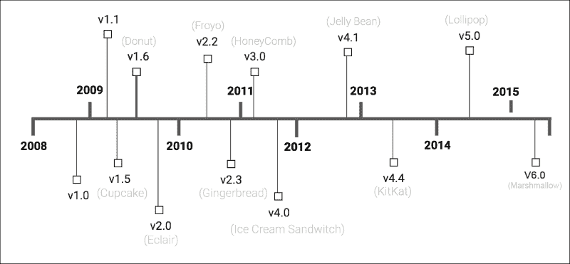
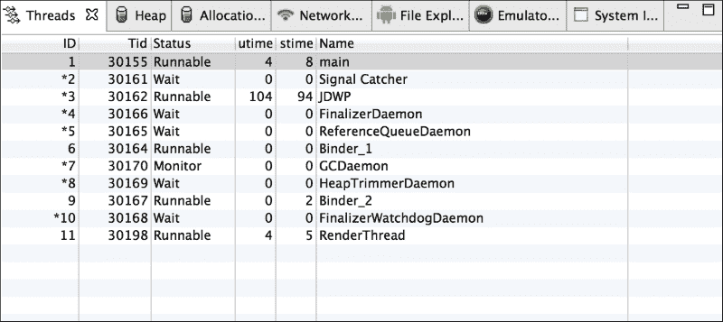
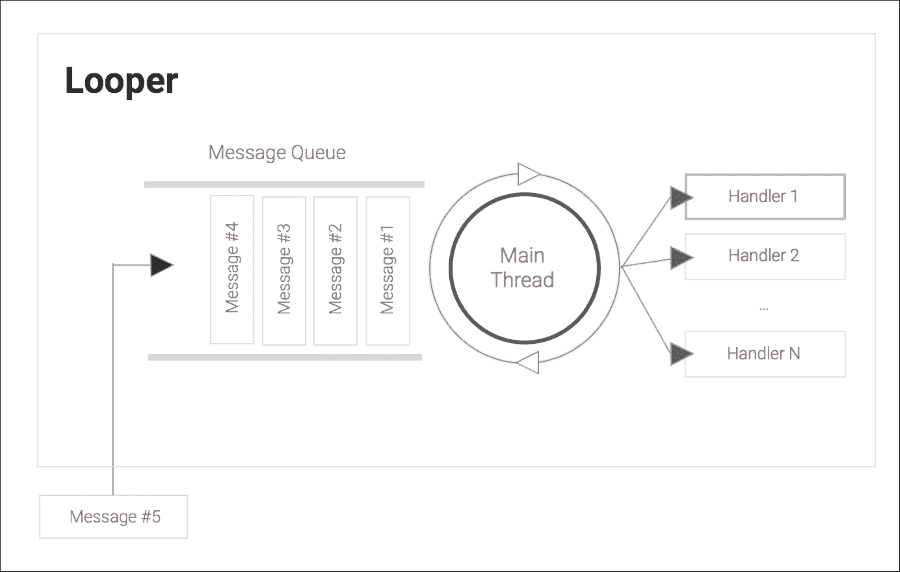
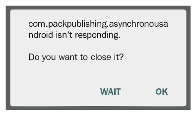
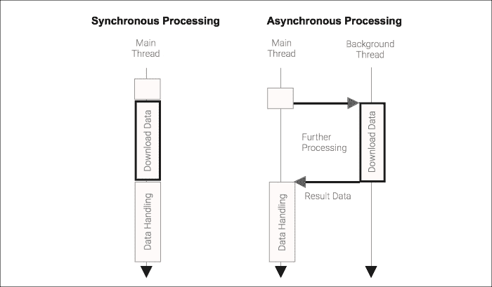

# 第一章. Android 中的异步编程

在过去几年中，异步编程已经成为一个重要的讨论话题，尤其是在使用最新移动硬件上可用的并发处理能力时。

近年来，CPU 上可用的独立处理单元（核心）数量有所增加，为了利用这种新的处理能力，出现了一种新的编程模型，称为异步编程，以协调设备上几个独立硬件处理单元之间的工作。异步编程应运而生，以解决可能由此新处理范式引发的问题。

Android 应用程序，由于它们主要运行在拥有多个处理单元的设备上，应该利用异步编程来在阻塞操作和需要 CPU 密集型任务时进行扩展和提升应用性能。

Android 是一个基于 Linux 内核的开源操作系统（OS），由 Andy Rubin、Nick Sears、Chris White 和 Rick Miner 于 2003 年设计，并于 2005 年 7 月被谷歌收购。

Android 操作系统，实际上由谷歌和开放手机联盟维护，是为了为计算、内存和能源资源有限的设备提供一个开放的移动设备平台而创建的。

该平台已经纳入了高级移动设备标准，如 NFC 和蓝牙低功耗（LE），其范围已从纯智能手机平台扩展到更广泛的软件平台，包括智能手表、电视、平板电脑和游戏机。

自从首次发布以来，维护者一直在定期更新平台，带来了许多新特性和对次要和主要版本的改进。

下图显示了 Android 版本随时间的变化：



# Android 软件栈

Android 软件栈（C 库和 Java 框架），由 Android 运行时（Dalvik VM，最近还有 ART）编排，围绕 Linux 内核创建，旨在在经过充分验证的一组技术之上提供高度交互的用户体验。

在每个新的操作系统版本中，都会为开发者提供一个明确的应用程序接口（API），以便围绕发布时引入的新特性和标准创建应用程序。

Android 应用程序的编译代码（字节码），通常是 Java 编译代码，在基于 Dalvik 或 ART 的虚拟机上运行。

## Dalvik 运行时

由**丹·博斯坦**创建的**Dalvik 虚拟机**（**DVM**）运行时是平台上的第一个运行时，它是一个基于寄存器的虚拟机，旨在在有限的运行时、有限的电源处理、RAM 和电力下有效地运行 Java 代码。

Dalvik 的创造者声称，DVM 平均比标准 Java VM（Oracle）高效约 30%。根据 Bornstein 的说法，它需要 30% fewer instructions 和 35% fewer coding units。

显然，谷歌已经竭尽全力从每一款移动设备中榨取性能，以帮助开发者构建响应式应用程序。

虚拟机在 Linux 进程中运行，具有自己的内存空间和文件描述符，并管理自己的线程组。它还管理自己的线程组。

在更高级的架构中，Android 应用程序可能在单独的进程中运行服务并通过 IPC 机制进行通信，但大多数时候，它在一个自包含的进程中运行。

dex 文件和应用程序资源由 AAPT 打包成**Android 应用程序包**（**APK**），最终在终端用户的设备上通过 Google Play 安装。

### 注意

自 2007 年苹果 iPhone 发布以来，应用程序商店的分布模式在移动平台上变得极为流行。

自 Android 2.2 以来，DVM 自带基于跟踪的**即时编译**（**JIT**）功能，该功能在应用程序运行频繁使用的字节码段（称为跟踪）时进行主动优化。

生成的机器代码在应用程序执行和某些密集型 CPU 任务上提供了显著的性能改进，并因此降低了电池消耗。

## ART 运行时

ART 运行时是 DVM 的新版本，旨在提高运行时性能和内存消耗。新的运行时在 Android 4.4 KitKat 中作为实验性运行时引入，自 Android 5.0 Lollipop 以来，它已成为主要的 Android 运行时。

这种新的运行时利用**预编译**（**AOT**）编译，在启动时间和应用程序执行上带来了新的性能优化。与 DVM JIT（即时）相反，AOT 在安装时使用设备上的 dex2oat 工具编译 dex 文件。由 dex2oat 工具生成的编译代码为目标设备生成系统依赖代码，并消除了每次应用程序执行时 JIT 编译引入的延迟。

AOT 编译器还减少了应用程序使用的处理器周期数，因为它消除了 JIT 编译器将代码转换为机器代码所花费的时间，并且使用更少的电池电量来运行应用程序。

AOT 编译的一个缺点是与 DVM 使用的 JIT 相比，内存占用更大。

新的运行时还在内存分配和**垃圾回收**（**GC**）方面引入了一些改进，从而实现了更响应的 UI 和更好的应用程序体验。

## 内存共享和 Zygote

基本上，该平台为每个应用程序运行一个 DVM/ART 实例，但平台的大规模优化是通过创建和管理新的 DVM 实例的方式实现的。

当安卓设备首次启动时，会启动一个称为 Zygote 的特殊进程（动物繁殖中的第一个生命细胞）——所有安卓应用程序都是基于此进程的。

Zygote 启动一个虚拟机，预加载核心库，并初始化各种共享结构。然后它通过监听套接字等待指令。

当一个新的安卓应用程序启动时，Zygote 接收一个命令来创建一个虚拟机以运行该应用程序。它是通过复制其预热好的 VM 进程并创建一个新的子进程来实现的，该子进程与父进程共享一些内存部分，使用的技术称为**写时复制**（**COW**）。

可在大多数 Unix 系统上使用的 COW 技术仅在进程尝试更改从父进程克隆的内存时才在子进程中分配新内存。

这种技术有一些非常显著的好处，如下所示：

+   首先，虚拟机和核心库已经加载到内存中。无需从文件系统读取这块重要数据来初始化虚拟机，这极大地减少了启动开销。

+   其次，这些核心库和常见结构所在的内存由 Zygote 与其他所有应用程序共享，当用户运行多个应用程序时，这可以节省大量内存。

# 安卓进程模型

安卓是一个多用户、多任务系统，可以并行运行多个应用程序，其中所有应用程序都试图获取 CPU 时间来执行其任务。

每个应用程序都在一个独立的 Linux 进程中独立运行，该进程是从 Zygote 进程克隆出来的，并且默认情况下，所有安卓组件都在与应用程序包中指定的相同名称的进程中运行，该名称在**安卓应用程序清单**（**AAM**）中指定。

Linux 内核将为应用程序执行分配少量 CPU 时间，称为 CPU 时间片。这种时间片方法意味着即使单处理器设备也能同时看起来在多个应用程序中积极工作，而实际上，每个应用程序都在 CPU 上轮流执行非常短暂的时间。

## 进程优先级

安卓操作系统试图尽可能长时间地保持应用程序运行，但当可用内存低时，它将通过首先终止重要性较低的过程来尝试通过释放系统资源。

这就是进程优先级发挥作用的时候；安卓进程按照以下五个类别从高优先级到低优先级进行排序：

+   **前台进程**：这是一个托管用户当前与之交互的活动或服务的进程：在前台启动的服务或正在运行其生命周期回调的服务

+   **可见进程**：这是一个托管暂停活动或与可见活动绑定的服务的进程

+   **服务进程**：这是一个托管未绑定到可见活动的服务的进程

+   **后台进程**：这是一个承载非可见活动的进程；所有后台进程都按**最近最少使用**（**LRU**）列表排序，因此，最近使用的进程是当它们具有相同排名时最后被杀死的进程。

+   **空进程**：这是一个用于缓存不活跃的 Android 组件并提高任何组件启动时间的进程。

当系统达到需要释放资源的状态时，可被杀死的进程将按进程排名、最后使用进程和运行的组件等因素进行排序。

## 进程沙箱化

Android 应用程序始终在安装应用程序期间分配给应用程序的唯一**Linux** **用户 ID**（**UID**）下运行，以便进程在沙箱环境中运行，默认情况下，将隔离您的数据和代码执行与其他应用程序。

在某些情况下，可能需要用户明确地与其他应用程序共享 UID 以访问其数据：

```java
USER     PID   PPID  VSIZE  RSS  PC  NAME
root            319   1     1537236 31324 S zygote
….
u0_a221   5993  319   1731636 41504 S com.whatsapp
u0_a96    3018  319   1640252 29540 S com.dropbox.android
u0_a255   4892  319   1583828 34552 S com.accuweather.android…
```

在 Android SDK Table 计算机上运行`adb shell ps`命令生成的先前表格是 Android 运行进程的列表。

第一列显示了在安装时分配的**用户标识符**（**UID**），第二列是**进程 ID**（**PID**），第三列显示了**父进程 ID**（**PPID**），对于 Android 应用来说，这是 Zygote 进程，最后一列显示了应用程序包。

从这个列表中，我们可以确认 WhatsApp 应用程序正在用户 ID `u0_a221`下运行，进程 ID 为`5993`，父进程是 Zygote 进程，PID 为`319`。

# Android 线程模型

在 Android 进程中，可能有多个执行线程。每个线程都是整体程序中的一个独立的顺序控制流——它按顺序执行其指令，一个接一个，它们还共享由操作系统任务调度器管理的分配的 CPU 时间片。

当系统启动应用程序进程并阻止其直接干扰其他进程的内存地址空间中的数据时，线程可能由应用程序代码启动，并且可以与同一进程内的其他线程进行通信和共享数据。除了在同一进程中共享的所有线程共享的数据外，一个线程可以使用其自己的内存缓存来存储其数据在自己的内存空间中。

## 主线程

当应用程序进程启动时，除了 DVM 维护线程外，系统还会创建一个名为`main`的执行线程。这个线程，正如其名所解释的，在应用程序生命周期中扮演着至关重要的角色，因为它是与 Android UI 组件交互、更新设备屏幕上状态和外观的线程。

此外，默认情况下，所有 Android 应用程序组件（`Activity`、`Service`、`ContentProvider`和`BroadcastsReceiver`）也是通过主线程执行线执行的。以下图像显示了应用程序进程内运行的线程列表，其中主线程位于列表顶部，并分配了一个系统指定的唯一**线程 ID**（**TID**）：



主线程，也称为 UI 线程，是处理 UI 事件发生的线程，因此为了尽可能保持应用程序的响应性，你应该：

+   避免任何可能长时间阻塞处理的长执行任务，例如可能无限期阻塞处理的**输入/输出**（**I/O**）任务

+   避免可能导致此线程长时间占用的 CPU 密集型任务

以下图表显示了`Looper`执行线程中的主要交互和组件：



**UI/Main**线程，它附加了一个`Looper`设施，持有要按顺序执行的一些工作单元的消息队列（`MessageQueue`）。

当队列中有消息准备好被处理时，**Looper 线程**从队列中弹出消息并将其同步地转发到消息上指定的目标处理器。

当目标`Handler`完成当前消息的处理后，`Looper`线程将准备好处理队列中可用的下一个消息。因此，如果`Handler`花费了显著的时间处理消息，它将阻止`Looper`处理其他挂起的消息。

例如，当我们在一个`Activity`类的`onCreate()`方法中编写代码时，它将在主线程上执行。同样，当我们向用户界面组件附加监听器以处理点击和其他用户输入手势时，监听器回调将在主线程上执行。

对于执行少量 I/O 或处理的应用程序，例如不进行复杂数学计算的应用程序，不使用网络实现功能，也不使用文件系统资源的应用程序，这种单线程模型是可行的。然而，如果我们需要执行 CPU 密集型计算，从持久存储中读取或写入文件，或与网络服务通信，那么在我们完成这项工作期间到达的任何进一步的事件都将被阻塞。

### 注意

自 Android 5.0（Lollipop）以来，引入了一个名为**RenderThread**的新重要线程，以保持 UI 动画的平滑，即使主线程正忙于执行任务。

## 应用程序无响应（ANR）对话框

如你所想，如果主线程正忙于进行繁重的计算或从网络套接字读取数据，它无法立即响应用户输入，如点击或滑动。

一个对用户交互反应不快的应用程序会感觉不响应——超过几百毫秒的延迟都是可以察觉的。这是一个非常有害的问题，Android 平台通过保护用户免受在主线程上执行过多操作的应用程序的侵害来解决这个问题。

### 注意

如果一个应用程序在五秒内没有响应用户输入，用户将看到**应用程序无响应**（**ANR**）对话框，并可以选择退出应用程序。

以下截图显示了典型的 Android ANR 对话框：



Android 努力同步用户界面重绘与硬件刷新率。这意味着它旨在以每秒 60 帧的速率重绘——即每帧 16.67 毫秒。如果我们主线程上的工作需要接近 16 毫秒，我们就有可能影响帧率，导致卡顿——动画卡顿、滚动不流畅等等。

当然，理想情况下，我们不想丢掉任何一帧。卡顿、不响应，尤其是 ANR，提供了一个非常糟糕的用户体验，这转化为差评和不受欢迎的应用程序。在构建 Android 应用程序时遵循的一个规则是：不要阻塞主线程！

### 注意

Android 在每个设备上的**开发者选项**中提供了一个有用的严格模式设置，当应用程序在主线程上执行长时间运行的操作时，它会在屏幕上闪烁。

在 Honeycomb（API 级别 11）中，平台增加了额外的保护措施，引入了一个新的`Exception`类，`NetworkOnMainThreadException`，它是`RuntimeException`的子类，当系统检测到在主线程上发起的网络活动时会被抛出。

## 维护响应性

那么，理想情况下，我们可能希望将任何长时间运行的操作从主线程卸载，以便它们可以在后台由另一个线程处理，而主线程可以继续平滑地处理用户界面更新，并及时响应用户交互。

应该在后台线程中处理的典型耗时任务包括以下内容：

+   网络通信

+   本地文件系统上的输入和输出文件操作

+   图像和视频处理

+   复杂的数学计算

+   文本处理

+   数据编码和解码

为了使其有用，我们必须能够协调工作并安全地在协作线程之间传递数据——特别是在后台线程和主线程之间，这正是异步编程被用来解决这个问题的原因。

让我们从同步与异步的对比图开始：



以下示例直观地显示了两种处理模型之间的主要区别。在左侧，数据下载任务在主线程上执行，直到下载数据完成，使线程保持忙碌。因此，如果用户与 UI 交互并生成一个事件，例如触摸事件，如果下载任务需要大量时间才能完成，应用程序将出现延迟或无响应。

在右侧，异步模型会将下载数据任务交给另一个后台线程，保持主线程可用以处理来自 UI 交互的任何事件。当下载的数据可用时，后台任务可以将结果发布到主线程，如果数据处理需要更新任何 UI 状态。

当我们使用异步模型来编程我们的应用程序时，Android 操作系统也会利用最新设备中可用的额外 CPU 核心同时执行多个后台线程，从而提高应用程序的电源效率。

### 注意

这种可能相互交互的独立代码路径的并行执行称为**并发**。

将工作子单元并行执行以完成一个工作单元的操作称为**并行性**。

# Android 中的并发

如前所述，为了在多核设备环境中实现可扩展的应用程序，Android 开发者应该能够创建并发执行行，这些执行行从多个资源中组合和汇总数据。

Android SDK，因为它基于 Java SDK 的一个子集，源自 Apache Harmony 项目，提供了对低级并发构造的访问，例如`java.lang.Thread`、`java.lang.Runnable`以及`synchronized`和`volatile`关键字。

这些构造是实现并发和并行性的最基本构建块，所有高级异步构造都是围绕这些构建块创建的。

最基本的一个是`java.lang.Thread`，这是最常使用的类，也是创建 Java 程序中新的独立执行线的构造。

```java
public class MyThread extends Thread {
    public void run() {
        Log.d("Generic", "My Android Thread is running ...");
    }
}
```

在前面的代码中，我们继承了`java.lang.Thread`以创建我们自己的独立执行线。当`Thread`启动时，将自动调用 run 方法，并在 Android 日志上打印消息。

```java
MyThread myThread = new MyThread();
myTread.start();
```

在此时，我们将创建我们的`MyThread`实例，并在第二行启动它时，系统将在进程内部创建一个线程并执行`run()`方法。

其他有用的线程相关方法包括以下内容：

+   `Thread.currentThread()`：这检索当前运行的线程实例。

+   `Thread.sleep(time)`：这将在给定时间段内暂停当前线程的执行。

+   `Thread.getName()`和`Thread.getId()`：这些分别获取名称和 TID，以便它们在调试目的上是有用的。

+   `Thread.isAlive()`: 这检查线程是否目前正在运行，或者它是否已经完成了其工作。

+   `Thread.join()`: 这将阻塞当前线程，直到被访问的线程完成其执行或死亡。

`Runnable` 接口，这是来自 Java API 的另一个构建块，是一个定义了用于指定和封装旨在由 Java 线程实例或任何其他处理此 `Runnable` 的类执行的代码的接口：

```java
package java.lang;

public interface Runnable {   
    public abstract void run();
}
```

在以下代码中，我们基本上创建了 `Runnable` 子类，以便它实现 `run()` 方法，可以被线程传递并执行：

```java
public class MyRunnable implements Runnable {

    public void run(){
        Log.d("Generic","Running in the Thread " +
                        Thread.currentThread().getId());
	// Do your work here
	...
    }
}
```

现在，我们的 `Runnable` 子类可以被传递给 `Thread`，并在并发执行行中独立执行：

```java
Thread thread = new Thread(new MyRunnable());
thread.start();
```

虽然启动新线程很容易，但并发实际上是一个非常困难的事情。并发软件面临许多问题，可以分为两大类：正确性（产生一致和正确的结果）和活性（向完成迈进）。`Thread` 创建也可能导致一些性能开销，过多的线程可能会降低性能，因为操作系统将在这些执行行之间切换。

## 并发程序中的正确性问题

正确性问题的一个常见例子是当两个线程需要根据其当前值修改相同变量的值时。让我们考虑我们有一个 `myInt` 整数变量，其当前值为 2。

为了增加 `myInt` 的值，我们首先需要读取它的当前值，然后将其加 1。在单线程世界中，这两个增加操作将按严格的顺序发生——我们将读取初始值 2，将其加 1，然后将新值设置回变量，并重复此过程。在两次增加之后，`myInt` 保持值为 4。

在多线程环境中，我们将遇到潜在的时间问题。可能两个尝试增加变量的线程都会读取相同的初始值 2，将其加 1，并将结果（在两种情况下都是 3）设置回变量：

```java
int myInt = 2;
...
public class MyThread extends Thread {

    public void run() {
         super.run();
         myInt++;
   }
}
...
Thread t1 = new MyThread();
Thread t2 = new MyThread();
t1.start();
t2.start();
```

两个线程在其局部世界的视角中表现正确，但在整体程序方面，我们显然会存在一个正确性问题；2 + 2 不应该等于 3！这种时间问题被称为竞态条件。

解决如竞态条件等正确性问题的常见方法是互斥——防止多个线程同时访问某些资源。通常，这是通过确保线程在读取或更新共享数据之前获取独占锁来实现的。

为了实现这种正确性，我们可以使用 `synchronized` 构造来在以下代码片段上解决正确性问题：

```java
Object lock = new Object();
public class MyThread extends Thread {
    public void run() {
        super.run();
        synchronized(lock) {
            myInt++;
        }
    }
}
```

在前面的代码中，我们使用了每个 Java 对象中可用的内建锁来创建一个互斥代码区域，这将确保增量语句能够正确工作，并且不会像之前解释的那样出现正确性问题。当一个线程获得对受保护区域的访问时，我们说该线程获得了锁，当线程离开受保护区域后，它释放了可以被另一个线程获得的锁。

创建互斥作用域的另一种方法是创建一个带有同步方法的函数：

```java
int myInt = 2;
synchronized void increment(){
    myInt++;
}
...
public class IncrementThread extends Thread {
    public void run() {
        super.run();
        increment();
    }
}
```

同步方法将使用对象内建的锁，其中`myInt`被定义为创建一个互斥区域，这样`IncrementThread`通过`increment()`方法增加`myInt`将防止任何线程干扰和内存一致性错误。

## 并发程序中的活性问题

活性可以理解为应用程序执行有用工作并朝着目标前进的能力。活性问题往往是解决正确性问题时的不幸副作用。

在适当的并发程序中，应同时实现这两个属性，尽管正确性关注的是防止程序在进展中发生死锁、活锁或饥饿，而正确性关注的是产生一致和正确的结果。

### 注意

死锁是一种情况，其中两个或更多线程无法继续前进，因为每个线程都在等待其他线程做某事。活锁是一种情况，其中两个或更多线程在响应其他线程状态的变化时不断改变自己的状态，但没有做任何有用的工作。

通过锁定对数据或系统资源的访问，可能会创建瓶颈，其中许多线程都在争夺访问单个锁，导致潜在的显著延迟。

更糟糕的是，当使用多个锁时，可能会出现一种情况，即没有任何线程可以继续前进，因为每个线程都需要对另一个线程当前拥有的锁进行独占访问——这种情况被称为死锁。

## 线程协调

线程协调是并发编程中的一个重要主题，尤其是在我们想要执行以下任务时：

+   同步线程对共享资源或共享内存的访问：

    +   共享数据库、文件、系统服务、实例/类变量或队列

+   在一组线程内协调工作和执行：

    +   并行执行、流水线执行、相互依赖的任务等

当我们想要协调线程的努力以实现目标时，我们应该尽量避免等待或轮询机制，这些机制在等待另一个线程中的事件时会让 CPU 保持忙碌。

以下示例展示了一个小循环，我们将在此循环中持续占用 CPU，同时等待某个状态变化发生：

```java
while(!readyToProcess) {
  // do nothing .. busy waiting wastes processor time.
}
```

为了克服协调问题并实现我们自己的结构，我们应该使用一些低级信号或消息机制在线程之间进行通信并协调交互。

在 Java 中，每个对象都有`wait()`、`notify()`和`notifyAll()`方法，这些方法提供了低级机制在多个线程之间发送信号并将线程置于等待状态，直到满足条件。

这种机制，也称为*监控器*或*守卫*，是在其他语言中常用的一种设计模式，它确保在任何给定时间只有一个线程可以进入代码的特定部分，并且能够等待直到条件发生。

与我们之前的示例相比，这种设计模式在等待另一个线程发生特定情况时，提供了更好的和高效的 CPU 周期管理，并且通常用于需要在不同执行线路之间协调工作的情况。

在下面的代码示例中，我们将解释如何使用这个结构创建一个基本的具有 10 个线程的多线程`Logger`，这些线程将在监控区域等待，直到其他线程在应用程序中推送（条件）消息。

负责记录输出的`Logger`有一个最多 20 个位置的队列来存储新的日志文本消息：

```java
public class Logger {
    LinkedList<String> queue = new LinkedList<String>();
    private final int MAX_QUEUE_SIZE = 20;
    private final int MAX_THREAD_COUNT = 10;
```

在接下来的代码中，我们将创建一个无限运行的`Runnable`工作单元，从队列中检索消息并在 Android 日志上打印消息。

之后，我们将创建并启动 10 个线程，这些线程将执行`Runnable`工作单元`task`：

```java
public void start() {
    // Creates the Loop as a Runnable
    Runnable task = new Runnable() {
        @Override
        public void run() {
            while(true) {
                String message = pullMessage();
                Log.d(Thread.currentThread().
                         getName(),message);
		     // Do another processing
             }
         }
     };
    // Create a Group of Threads for processing
    for(int i=0; i< MAX_THREAD_COUNT; i++){
         new Thread(task).start();
    }
 }
```

`pullMessage()`，这是一个`synchorized`方法，当它达到`wait()`方法时运行互斥并将线程置于等待状态。所有创建的线程都将保持这种状态，直到另一个线程调用`notifyAll()`：

```java
// Pulls a message from the queue
// Only returns when a new message is retrieves
// from the queue.
private synchronized String pullMessage(){
    while (queue.isEmpty()) {
        try {
            wait();
        } catch (InterruptedException e) { ... }
    }
    return queue.pop();
}
// Push a new message to the tail of the queue if
// the queue has available positions
public synchronized void pushMessage(String logMsg) {
    if ( queue.size()< MAX_QUEUE_SIZE ) {
        queue.push(logMsg);      
        notifyAll();
    }
}
```

当任何线程处于等待状态时，它会暂时释放锁，给其他线程一个进入互斥区域以推送新消息或进入等待状态的机会。

在下面的代码片段中，我们首先创建`Logger`实例，然后调用 start 方法来启动工作线程，并将 10 条消息推入待处理的工作队列。

当调用`pushMessage()`方法时，一个新的日志消息会被插入到队列的末尾，并且调用`notifyAll()`来通知所有可用的线程。

由于`pullMessage()`方法在互斥（同步）区域运行，只有一个线程会被唤醒并从`pull`方法返回。一旦`pullMessage()`返回，日志消息就会被打印：

```java
Logger logger =new Logger();
logger.start();
for ( int i=0; i< 10 ; i++) {
    ...
    logger.pushMessage(date+" : "+"Log Message #"+i);
}
```

在下面的控制台输出中，我们有一个这个代码将生成的输出示例，并且日志消息是由任何可用的线程以有序的方式处理的：

```java
D/Thread-108(23915): <Date>: Log Message #0
D/Thread-109(23915): ...: Log Message #1
D/Thread-110(23915): ...: Log Message #2
D/Thread-111(23915): ...: Log Message #3

```

这种低级结构也可以用来控制共享资源（轮询）以管理后台执行（并行性）和控制线程池。

## 并发包结构

由`java.util.concurrent`提供的其他 Java 并发结构，在 Android SDK 中也可用，如下所示：

+   **锁对象**（`java.util.concurrent`）：它们通过更高级别的惯用语实现锁定行为。

+   **Executors**：这些是用于启动和管理一组线程执行的高级 API（`ThreadPool`等）。

+   **并发集合**：这些是更改集合的方法受到同步问题保护的集合。

+   **同步器**：这些是高级结构，用于协调和控制线程执行（信号量、循环屏障等）。

+   **原子变量**（`java.util.concurrent.atomic`）：这些是提供对单个变量线程安全操作的类。一个例子是`AtomicInteger`，可以在我们的示例中用来解决正确性问题。

一些 Android 特定的结构将这些类用作基本构建块来实现它们的并发行为，尽管开发者也可以使用这些类来构建自定义并发结构以解决特定用例。

### Executor 框架

`Executor`框架是`java.util.concurrent`上可用的另一个框架，它提供了一个提交`Runnable`任务的接口，将任务提交与任务运行方式解耦：

```java
public interface Executor {
  void execute(Runnable command);
}
```

每个`Executor`，它实现了我们之前定义的接口，可以通过多种方式管理异步资源，如线程创建、销毁和缓存，以及任务排队，以实现针对特定用例的完美行为。

`java.util.concurrent`提供了一组开箱即用的实现，涵盖了大多数通用用例，如下所示：

+   `Executors.newCachedThreadPool()`: 这是一个可以增长和重用先前创建的线程的线程池

+   `Executors.newFixedThreadPool`（`nThreads`）：这是一个具有固定线程数和用于存储工作的消息队列的线程池

+   `Executors.newSingleThreadPool()`: 这与`newFixedThreadPool`类似，但只有一个工作线程

要在`Executor`上运行任务，开发者必须通过传递`Runnable`作为参数来调用`execute()`：

```java
public class MyRunnable implements Runnable {
    public void run() {
        Log.d("Generic", "Running From Thread " +
              Thread.currentThread().getId());   
	 // Your Long Running Computation Task
    }
}
public void startWorking(){
    Executor executor = Executors.newFixedThreadPool(5);
    for ( int i=0; i < 20; i++ ) {
        executor.execute(new MyRunnable());
    }
}
```

在前面的代码中，我们使用固定数量的五个线程的工厂方法创建了`ThreadPool`，以便处理工作。

在创建`ExecutorService`实例后，新的`Runnable`任务被提交以进行异步处理。

当提交新的工作单元时，选择一个空闲的线程来处理任务；但当所有线程都忙碌时，`Runnable`将在本地队列中等待，直到有线程准备好工作。

# Android 主要构建块

一个典型的 Android 应用程序由以下四个主要构建块组成：

+   `android.app.Activity`

+   `android.app.Service`

+   `android.content.BroadcastReceiver`

+   `android.content.ContentProvider`

活动、服务和`BroadcastReceiver`可以通过异步消息`Intent`显式或隐式地激活。

这些构建块各自都有自己的生命周期，因此如果使用异步架构从主线程卸载工作，它们可能会遇到不同的并发问题。

## 活动并发问题

Activity 构建块与表示层有紧密的联系，因为它管理着在定义的片段和视图树上的 UI 视图，这些视图显示信息并响应用户交互。

Android 应用程序通常由一个或多个`android.app.Activity`的子类组成。Activity 实例有一个非常明确的生命周期，系统通过执行生命周期方法回调来管理它，所有这些回调都是在主线程上执行的。

为了保持应用程序的响应性和反应性，以及活动转换的平滑，开发者应该了解每个 Activity 生命周期回调的本质。

Activity 生命周期中最重要的回调如下：

+   `onCreate()`: 在此状态下，Activity 不可见，但所有私有 Activity 资源（视图和数据）都是在这里创建的。为了减少用户在 Activity 转换期间得不到视觉反馈的时间，应异步执行长时间和密集的计算。

+   `onStart()`: 当 UI 可见但无法在屏幕上交互时，会调用此回调。任何在此处产生的触摸事件都会被系统错过，这可能会让用户感到愤怒。

+   `onResume()`: 当 Activity 即将进入前台并处于可交互状态时，会调用此回调。

+   `onPause()`: 当 Activity 即将进入后台且不可见时，会调用此回调。计算应该迅速结束，因为下一个 Activity 不会在当前方法结束之前恢复。

+   `onStop()`: 当 Activity 不再可见但可以重新启动时，会调用此回调。

+   `onDestroy()`: 当 Activity 实例即将在后台被销毁时，会调用此回调。属于此实例的所有资源和引用都必须被释放。

完成的 Activity 实例应该有资格进行垃圾回收，但引用 Activity 或其视图层次结构一部分的后台线程可以防止垃圾回收并造成内存泄漏。

同样，如果结果永远不会显示，因为 Activity 已完成，继续进行后台工作很容易浪费 CPU 周期（以及电池寿命）。

最后，Android 平台可以在任何时间自由地杀死不是用户当前焦点的进程。这意味着如果我们有长时间运行的操作需要完成，我们需要某种方式让系统知道不要杀死我们的进程。

所有这些都使得“不要阻塞主线程”规则变得更加复杂，因为我们需要及时取消后台工作或在适当的时候将其与 Activity 生命周期解耦。

## 操作用户界面

另一个 Android 特有的问题不在于您可以使用 UI 线程做什么，而在于您不能做什么。

### 注意

您不能从除主线程以外的任何线程操作用户界面。

这是因为用户界面工具包不是线程安全的，也就是说，从多个线程访问它可能会导致正确性问题。实际上，用户界面工具包通过积极拒绝从创建这些组件以外的线程访问用户界面组件来保护自己免受潜在问题的侵害。

如果系统检测到这一点，它将通过抛出`CalledFromWrongThreadException`立即通知应用程序。

最终的挑战在于安全地同步后台线程与主线程，以便主线程可以使用后台工作的结果更新用户界面。

如果开发者可以访问`Activity`实例，可以使用`runOnUiThread`实例方法从后台线程更新 UI。

该方法接受一个`Runnable`对象，就像用于创建线程执行任务的执行任务一样：

```java
public final void runOnUiThread (Runnable)
```

在以下示例中，我们将使用这个设施来发布由后台线程处理的同义词搜索的结果。

为了在`OnCreate`活动回调期间实现目标，我们将设置`onClickListener`在创建的线程上运行`searchTask`：

```java
// Get the Views references
Button search = (Button) findViewById(R.id.searchBut);
final EditText word = (EditText) findViewById(R.id.wordEt);

// When the User clicks on the search button 
// it searches for a synonym
search.setOnClickListener(new View.OnClickListener() {
    @Override
    public void onClick(View v) {
        // Runnable that Searchs for the synonym and
        // and updates the UI.
        Runnable searchTask = new Runnable() {
            @Override
            public void run() {
                // Retrieves the synonym for the word
                String result = searchSynomim(
                   word.getText().toString());
                // Runs the Runnable SetSynonymResult
                // to publish the result on the UI Thread
                runOnUiThread(new SetSynonymResult(result));
            }
        };
        // Executes the search synonym an independent thread
        Thread thread = new Thread(searchTask);
        Thread.start();
    }
});
```

当用户点击**搜索**按钮时，我们将创建一个用于搜索在`R.id.wordEt EditText`中输入的单词的`Runnable`匿名类，并启动线程来执行`Runnable`。

当搜索完成后，我们将创建一个`Runnable`实例`SetSynonymResult`，在 UI 线程上发布结果到同义词`TextView`：

```java
class SetSynonymResult implements Runnable {
    final String synonym;

    SetSynonymResult(String synonym){
      this.synonym = synonym;
    }
    public void run() {
      TextView tv = (TextView)findViewById(R.id.synonymTv);
      tv.setText(this.synonym);
    }
};
```

这种技术有时并不是最方便的，尤其是在我们没有访问 Activity 实例的情况下；因此，在接下来的章节中，我们将讨论更简单、更干净的从后台计算任务更新 UI 的技术。

## 服务并发问题

这些是在后台运行的 Android 实体，通常在不需要任何用户交互的`name`应用程序中执行任务。

默认情况下，`Service`在应用程序进程的主线程中运行。它不会创建自己的线程，因此如果您的`Service`要进行任何阻塞操作，例如下载图片、播放视频或访问网络 API，用户应该设计一种策略将工作的时间从主线程卸载到另一个线程。

由于`Service`可以有自己的并发策略，它还应该考虑到，就像 Activity 一样，它应该通过主线程更新 UI，因此从后台将结果回传到主循环的策略是必不可少的。

在 Android 服务领域，启动服务的方式将`Service`的性质分为以下两组：

+   **已启动服务**：这是通过`startService()`启动的服务，即使启动它的组件被销毁，它也可以持续运行。已启动的服务不会直接与启动它的组件交互。

+   **绑定服务**：此服务在至少有一个 Android 组件通过调用`bindService()`绑定到它时存在。它为组件之间的通信提供了一个双向（客户端-服务器）通信通道。

## 已启动服务问题

当我们实现已启动服务时，任何应用程序组件都可以在调用`startService(Intent)`方法时启动它。一旦系统收到`startService(Intent)`并且服务尚未启动，系统会调用`onCreate()`然后调用`onStartCommand()`，并将封装在 Intent 对象上的参数传递给它们。如果`Service`已经存在，则只调用`onStartCommand()`。

已启动服务使用的回调如下：

```java
// Called every time a component starts the Service
// The service arguments are passed over the intent
int onStartCommand(Intent intent, int flags, int startId)

// Used to initialize your Service resources
void onCreate()

// Used to release your Service resources
void onDestroy()
```

在`onStartCommand()`回调中，一旦需要处理服务请求的长时间计算任务，应明确实现并协调向后台线程的移交，以避免不希望的 ANR：

```java
int onStartCommand (Intent intent, int flags, int startId){
    // Hand over the request processing to your
    // background tasks
...
}
```

当服务完成时，并且需要将结果发布到 UI，应使用适当的技巧与主线程进行通信。

## 绑定服务问题

绑定服务通常在需要 Android 组件与服务之间强交互时使用。

当服务在同一个进程中运行时，Android 组件（客户端）与绑定服务（服务器）之间的交互始终由`onBind()`返回的`Binder`类提供。有了`Binder`实例，客户端可以访问服务公开的方法，因此当任何组件调用绑定服务的公共方法时，该组件应该意识到以下内容：

+   当预期在方法调用期间发生长时间运行的操作时，调用必须在单独的线程中发生

+   如果方法在分离的线程中调用，并且服务想要更新 UI，服务必须在主线程上运行更新：

    ```java
    public class MyService extends Service {

        // Binder given to clients
        private final IBinder mBinder = new MyBinder();

         public class MyBinder extends Binder {
             MyService getService() {
                 // Return this instance of MyService
                 // so clients can call public methods
                 return MyService.this;
            }
        }
        @Override

        public IBinder onBind(Intent intent) {
            return mBinder;
        }

         /** Method for clients */
        public int myPublicMethod() {
          //
        }
    ...
    ```

# 在单独的进程中提供服务

当 Android 服务在其自己的进程中运行时，它在一个独立的进程中运行，有自己的地址空间，这使得与主进程 UI 线程的通信更难实现以下内容：

```java
<service
  android:name="SynonymService"
  android:process=":my_synonnym_search_proc"
  android:icon="@drawable/icon"
  android:label="@string/service_name"
  >
</service>
```

要在不同的进程中实现服务，我们需要使用**进程间通信**（**IPC**）技术来在您的应用程序和服务之间发送消息。

### 注意

IPC（进程间通信）是在多个进程之间共享数据的活动，通常使用一个定义良好的通信协议。它通常包括一个充当客户端的进程和一个充当服务器的进程。

Android SDK 中提供了两种技术来实现这一点，如下所示：

+   **AIDL（Android 接口定义语言**）：这允许你在一系列原始类型上定义一个接口。它允许你创建多线程处理服务，但也会给你的实现增加其他复杂度。这仅推荐给高级程序员。

+   **信使（Messenger）**：这是一个简单的接口，在服务端为你创建一个工作队列。它会在一个由`Handler`管理的单线程上顺序执行所有任务。

我们还没有对这些技术给出更多细节；然而，这个结构的一个示例将在更高级的章节中展示，其中涉及的所有概念都更加成熟。

## 广播接收器并发问题

这个构建块是一个订阅系统和应用事件的组件，当这些事件在系统上发生时，它会收到通知。广播接收器在应用程序清单中静态定义，或者通过`Context.registerReceiver()`动态定义。

广播接收器通过`onReceive()`回调激活，此方法在主线程上运行，如果我们尝试执行耗时任务，会阻塞另一个 Android 组件的运行。

一旦`onReceive()`方法执行完毕，系统会认为该对象不再活跃，可以释放与该实例关联的资源，并回收整个对象。这种行为对我们内部能做什么有着巨大的影响，因为如果我们将一些处理任务交给一个并发线程，属于`BroadcastReceiver`的资源可能会被回收，从而不再可用，或者在极端情况下，如果没有在它上面运行重要组件，进程可能会被终止。

### 小贴士

Android 11 版本在广播接收器中引入了`goAsync()`方法，以便在从`onReceive()`函数返回后保持广播活跃。

## Android 并发结构

好消息是，Android 平台提供了特定的结构来解决并发一般问题和解决 Android 提出的特定问题。

存在一些结构允许我们将任务推迟到稍后主线程上运行，便于协作线程之间的通信，并将工作分配给管理的工作线程池，并将结果重新集成到主线程中。

有解决方案可以解决 Activity 生命周期的限制，无论是涉及用户界面的中期操作，还是即使用户离开应用程序也必须完成的长久期工作。

虽然其中一些结构仅在新版本的 Android 平台上引入，但它们可以通过支持库使用，并且除了少数例外，本书中的示例针对的是运行 API 级别 8（Android 2.2）及更高版本的设备。

# 摘要

在本章中，我们详细探讨了可用的 Android 运行时、Android 进程和线程模型。

然后，我们介绍了在尝试实现健壮的并发程序时可能会遇到的并发问题。

最后，我们列出了 SDK 上可用的基本并发构建块，以设计并发程序。

在下一章中，我们将探讨一些特定于 Android 的低级构建块，其他并发机制都是基于这些构建块构建的：`Handler`、`Looper`和`LooperThread`。
