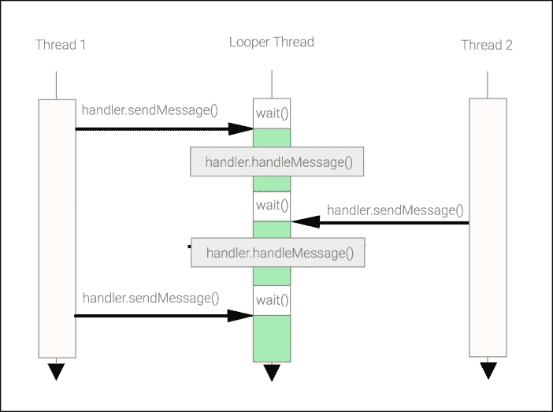

# 第二章：使用 Looper、Handler 和 HandlerThread 执行工作

在前一章中，你被介绍到开发响应式和并发 Android 应用程序时开发者可能遇到的最基本的并发问题。由于最可交互的项目运行在主线程上，协调后台代码以处理工作而不产生任何影响用户体验的 UI 卡顿至关重要。

在本章中，我们将遇到在 Android 系统中执行任务和调度主线程或开发者创建的普通后台线程以执行和调度长时间运行操作的一些最基本构造。

我们将涵盖以下主题：

+   理解 Looper

+   理解 Handler

+   将工作发送到 Looper

+   使用 post 调度工作

+   使用 Handler 延迟工作

+   泄露隐式引用

+   泄露显式引用

+   使用 Handler 更新 UI

+   取消挂起的消息

+   使用 Handler 和 HandlerThread 进行多线程处理

+   Handler 和 HandlerThread 的应用

# 理解 Looper

在我们理解`Looper`之前，我们需要了解其名称的来源。

### 注意

循环是一组不断重复执行的指令，直到满足终止条件。

根据这个定义，Android 的`Looper`在一个具有`MessageQueue`的线程上执行，执行连续循环等待工作，并在没有挂起工作的情况下阻塞。当工作提交到其队列时，它将派发到在`Message`对象上显式定义的目标`Handler`。

### 注意

消息是一个包含描述和任意数据对象的通告对象，可以发送到 Handler。

Android 中的 Looper 是实现了一个常见的 UI 编程概念，称为事件循环。稍后，在处理序列的末尾，`Handler`将处理`Message`并执行你的领域逻辑，以解决应用程序用户问题。

Android 中的`Looper`序列遵循以下步骤：

1.  等待从其消息队列中检索到消息

1.  如果启用了日志记录，请打印派发信息

1.  将消息发送到目标处理器

1.  回收消息

1.  转到步骤 1

如前一章所述，主线程隐式创建自己的`Looper`，以顺序处理保持应用程序运行所需的所有内容，并管理应用程序组件之间的交互。

要访问主线程的 Looper，你需要访问主线程的`Looper`实例，使用静态方法`getMainLooper()`：

```java
Looper mainLooper = Looper.getMainLooper();
```

要设置我们自己的`Looper`线程，我们需要在线程内部调用`Looper`的两个静态方法——`prepare`和`loop`——它们将处理连续循环。以下是一个简单的示例：

```java
class SimpleLooper extends Thread {

       public void run() {
        // Attach a Looper to the current Thread
           Looper.prepare();
        // Start the message processing
           Looper.loop();
       }
}
```

在代码片段中，当通过调用 `start()` 方法创建并启动 `SimpleLopper` 对象时，在当前应用程序进程中创建了一个新线程，并且 `run()` 方法在新线程中自动被调用。当调用 `run()` 方法时，我们在调用静态 `Looper.prepare()` 方法时将一个 `Looper` 绑定到当前线程。随后，当调用 `loop()` 时，我们开始处理消息。`prepare()` 方法负责初始化 `MessageQueue` 并将其作为 `ThreadLocal` 参数绑定到当前线程。

当调用 `loop()` 时，`run()` 方法将阻塞，直到循环器被中断以处理添加到队列中的新消息。

### 注意

`Looper.prepare()` 必须在同一线程中只调用一次；否则，将抛出一个 `RuntimeException`，表示每个线程只能创建一个循环器。

当我们想要停止连续的 `Looper` 执行时，我们可以通过调用其成员函数 `quit()` 来停止它，而无需处理队列中剩余的消息，或者调用 `quitSafely()` 来处理队列中剩余的工作然后停止。

## 理解 Handler

与 `Looper` 一起，`Handler` 类是 Android 应用程序基础设施的基本组成部分。它支撑着主线程所做的所有事情——包括调用 `Activity` 生命周期方法。

当 `Looper` 在其消息循环线程上处理工作的时候，`Handler` 扮演两个角色：提供一个接口将消息提交到其 `Looper` 队列，并在消息被 `Looper` 分发时实现处理这些消息的回调。

还很重要的一点是，每个 `Handler` 都绑定到一个单一的 `Looper`，进而绑定到一个线程及其 `Looper` 的 `MessageQueue`。

为了绑定到当前线程的 `Looper`，我们需要在通过调用 `prepare` 方法初始化 `Looper` 之后，使用默认的 `Handler()` 构造函数来实例化它。由于我们在 `SimpleLooper` 线程中通过默认构造函数 `Handler()` 创建我们的处理器，因此 `myHandler` 将绑定到当前线程的 `Looper` 而不是主线程的 `Looper`：

```java
public class SimpleLooper extends Thread{

    private Handler myHandler;

    @Override
    public void run() {
        Looper.prepare();
        myHandler  =  new MyHandler();
        Looper.loop();
    }

    public Handler getHandler(){
        return myHandler;
    }
}
```

除了提供一个接口将工作提交给 `Looper` 线程外，`Handler` 还定义了处理提交的消息的代码。在下面的代码中，`MyHandler` 类重写了超类（`Handler`）的 `handleMessage` 成员方法来定义我们的消息处理代码：

```java
public class MyHandler extends Handler {

    @Override
    public void handleMessage(Message msg) {
        // Add here your message handling
       // processing
    }
}
```

一旦启动，`Looper` 线程将在 `Looper.loop()` 内部等待，直到有消息添加到其队列中。

当另一个线程使用 `submit` 方法将 `Message` 添加到队列中时，等待的线程将调用处理器的 `handleMessage()` 方法，将消息分发到我们的目标 `MyHandler`。

拥有`Handler`对象引用后，我们能够从任何线程向`Handler`发送消息，因此，消息总是被调度到`Looper`线程并由正确的`Handler`处理，如下面的图示所示：



图 2.1：将工作发布到其他线程

我们已经看到我们可以创建自己的`Looper`线程，但如前所述，主线程也是一个`Looper`线程。为了更清楚地说明，我们将创建一个打印当前线程堆栈跟踪的`StackTraceHandler`：

```java
public class StackTraceHandler extends Handler {

    @Override
    public void handleMessage(Message msg) {
       // Prints the Stack Trace on the Android Log
       Thread.currentThread().dumpStack();
    }
}
```

由于活动的`onCreate()`函数在主线程上运行，我们将创建我们处理器的实例，它隐式地调用处理器的超构造函数，该构造函数将处理器绑定到当前线程的`Looper`。

### 注意

如果当前线程没有`Looper`，并且我们尝试在超构造函数中创建处理器，则会抛出一个带有消息**Can't create handler inside thread that has not called Looper.prepare()**的运行时异常。

创建了`Handler`实例后，我们通过调用处理器的`obtainMessage`方法从其回收的消息池中检索消息，并将一个空消息发布到主线程的`Looper`。通过`obtainMessage`获取的消息将被缓存，并将处理器设置为目标的`Handler`对象：

```java
public void onCreate(Bundle savedInstanceState) {
    super.onCreate(savedInstanceState);
    ...
    Handler handler = new StackTraceHandler();
    Message msg = handler.obtainMessage();
    handler.sendMessage(msg);
}
```

如前所述，当我们的`handleMessage()`被调度时，它打印出`handleMessage()`执行时的活动堆栈帧，正如我们可以在下面的堆栈跟踪中看到的那样：

```java
.....StackTraceHandler.handleMessage(StackTraceHandler.java:18)
android.os.Handler.dispatchMessage(Handler.java:99)
android.os.Looper.loop(Looper.java:137)
android.app.ActivityThread.main(ActivityThread.java:4424)
java.lang.reflect.Method.invokeNative(Native Method)
java.lang.reflect.Method.invoke(Method.java:511)
```

没错，`handleMesage()`是在由主`Looper`调用的`dispatchMessage()`调用中运行的，并且它被调度到主线程的执行行。

## 向 Looper 发送工作

在之前，`StackTraceHandler`隐式地绑定到当前主线程的`Looper`，因此为了使其更灵活，让我们再迈出一步，使其可以附加到任何`Looper`。

在下面的代码中，我们将重写默认的`Handler`构造函数并定义一个接受将要进入队列的`Looper`的构造函数，然后我们将处理和调度消息：

```java
public class StackTraceHandler extends Handler {

    StackTraceHandler(Looper looper){
        super(looper);
    }
```

我们的新构造函数基本上是将处理器（Handler）附加到作为参数传递的`Looper`，使得`StackTraceHandler`可以附加到任何`Looper`，而不是当前线程的`Looper`。

我们的`SimpleLooper`也被扩展以提供`getter`方法来检索与其线程关联的`Looper`对象：

```java
public class SimpleLooper extends Thread{
    // start condition
    boolean started = false;
    Object startMonitor =  new Object();
    Looper threadLooper = null;

    @Override
    public void run() {
        Looper.prepare();
        threadLooper = Looper.myLooper();
        synchronized (startMonitor){
            started = true;
            startMonitor.notifyAll();
        }
        Looper.loop();
    }

    Looper getLooper(){
        return threadLooper;
    }
    // Threads could wait here for the Looper start
    void waitforStart(){
         synchronized (startMonitor){
             while (!started){
                 try {
                    startMonitor.wait(10);
                 } catch (InterruptedException e) {
                    ...
                 }
             }
          }
     }
```

现在，从主线程开始，我们启动`SimpleLooper`及其自己的线程，当它启动时，我们获取`Looper`实例以将我们的`Handler`绑定到`SimpleLooper`线程和`Looper`：

```java
SimpleLooper looper = new SimpleLooper();
looper.start();
looper.waitforStart();
Handler handler = new StackTraceHandler(looper.getLooper());
```

现在，我们将像上一个示例中那样，从活动的`onCreate()`回调中发送消息，该回调在主线程中运行：

```java
Message msg = handler.obtainMessage();
handler.sendMessage(msg);
```

如以下堆栈跟踪所示，堆栈底部的线程堆栈帧指向 `SimpleLooper.run()`，而在堆栈顶部，我们有我们的 `Handler` 回调，`StackTraceHandler.handleMessage`：

```java
at...activity.StackTraceHandler.handleMessage(StackTraceHandler.java:18)
at android.os.Handler.dispatchMessage(Handler.java:99)
at android.os.Looper.loop(Looper.java:137)
at ...activity.SimpleLooper.run(SimpleLooper.java:23)
```

这里有趣的是，我们可以从主线程向由 `SimpleLooper` 管理的后台线程（甚至从后台线程向主线程）发送消息，并且在这个过程中，将后台线程的工作交给主线程——例如，用后台处理的结果更新用户界面。

## 使用 `post` 安排工作

如前一段所述，我们可以通过将 `Looper` 实例的引用传递给 `Handler` 构造函数来将工作提交给主线程或后台线程。

我们所说的“工作”可以通过 `java.lang.Runnable` 的子类或 `android.os.Message` 的实例来描述。我们可以将 `Runnable` 发布到 `Handler` 实例或向其发送消息，它将它们添加到相关 `Looper` 实例的 `MessageQueue` 中。

我们可以很容易地将工作发布到 `Handler`，例如，通过创建一个匿名内部 `Runnable`：

```java
final TextView myTextView = (TextView) findViewById(R.id.myTv);
// Get the main thread Looper by calling the Context
// function getMainLooper
Handler handler = new Handler(getMainLooper());

handler.post(new Runnable(){
    public void run() {
        String result = processSomething();
        myTextView.setText(result);
    }
});
```

绑定 `Handler` 的 `Looper` 实例会遍历队列，尽可能快地执行每个 `Runnable`。使用 `post` 方法简单地在队列末尾添加一个新的 `Runnable`。

如果我们想让我们的 `Runnable` 在队列中的任何现有工作之上具有优先级，我们可以将其发布到队列的前面，在现有工作之前：

```java
handler.postAtFrontOfQueue(new Runnable(){
public void run() {
      ...
   }
});
```

在单线程应用程序中，可能看起来通过将工作发布到主线程并没有获得太多好处，但将事情分解成可以交错和可能重新排序的小任务对于保持响应性非常有用。

此外，通过将工作封装成更细粒度的工作单元，我们鼓励组件的重用，提高代码的可测试性，并增加工作组合的能力：


图 2.2：`Runnable` 组合

## 使用 `Handler` 延迟工作

当我们使用正常的 `post` 工作函数时，工作会在所有之前的单元工作在 `Looper` 上处理完毕后立即处理——但如果我们想在 10 秒后安排一些工作，会发生什么呢？

使用 `Thread.sleep` 来阻塞主线程 10 秒意味着我们阻止主线程执行其他工作，并且我们保证会得到一个 ANR 对话框。另一种选择是使用提供延迟功能的处理程序函数：

```java
public class MyRunnable implements Runnable {

    @Override
    public void run() {
        // do some work
    }
};
// Defer work in the main Thread
// by 10 seconds time
   handler.postDelayed(new MyRunnable(), TimeUnit.SECONDS.toMillis(10));
```

我们仍然可以在同时发布其他工作以供执行，并且我们的延迟 `Runnable` 实例将在指定的延迟后执行。注意，我们正在使用 `java.lang.concurrent` 包中的 `TimeUnit` 类将秒转换为毫秒。

发布工作的一个进一步调度选项是`postAtTime`，它将`Runnable`调度到相对于系统运行时间的特定时间（自系统启动以来经过的时间）执行：

```java
// Work to be run at a specific time
handler.postAtTime(new MyRunnable(),
                   SystemClock. uptimeMillis() +
                   TimeUnit.SECONDS.toMillis(10));
```

由于`postAtTime()`是通过从`SystemClock`的运行时间偏移量实现的，因此调度可能会受到一些延迟问题的影响，尤其是在设备最近进入某些深度睡眠状态时。考虑到这一点，并且当需要时间精度时，通常最好使用`handler.postDelayed`来延迟工作。

## 漏露隐式引用

使用`Handler`和匿名或非静态嵌套类延迟工作需要小心，以避免潜在的资源泄漏。在这些情况下，提交给处理器的对象通常创建了对它定义或创建的类的引用。由于 Looper 消息队列将保持`Runnable`对象在计划时间内的活动状态，对原始 Android 组件的间接引用可能会阻止整个组件及其对象被垃圾回收。

让我们通过以下示例来分析这个问题：

```java
public class MyActivity extends Activity {
  // non-static inner class
  public class MyRunnable implements Runnable {

   @Override
   public void run() {
     // do some work
   }
  }

  @Override
  public void onCreate(Bundle savedInstanceState) {
        ...
    // Post Inner class instance Runnable
    handler.postDelayed(new MyRunnable(),
                         TimeUnit.MINUTES.toMillis(10));

    // Post an Anonymous class instance
    handler.postDelayed(new Runnable() {
     @Override
     public void run() {
     // do some work
     }
    }, TimeUnit.MINUTES.toMillis(20));
    ...
    }
   }
```

两个对象，即通过默认构造函数创建的`MyRunnable`对象和在第二个`handler.postDelayed`中创建的匿名`Runnable`类，都持有`Activity`对象的引用。

通过在活动内部声明一个匿名内部`Runnable`，我们已经对该包含`Activity`实例创建了隐式引用。然后我们向处理器发送了`Runnable`，并告诉它在 10 分钟后执行。

如果活动在 10 分钟内完成，它还不能被垃圾回收，因为我们的`Runnable`中的隐式引用意味着活动仍然可以通过活动对象访问。

因此，尽管这只是一个简洁的例子，但在实践中将非静态的 Runnables 发布到主线程的`Handler`队列（尤其是使用`postDelayed`或`postAtTime`）并不是一个好主意，除非我们非常小心地清理所有不活跃活动的引用。

如果`MyActivity`对象在 10 分钟内没有被垃圾回收，所有活动视图和资源将导致内存消耗增加，直到达到每个应用程序可用的最大堆空间。更糟糕的是，如果用户在应用程序中导航时创建了多个此活动实例，应用程序将瞬间耗尽内存。

### 注意

每个应用程序可用的堆大小限制因设备而异。当应用程序达到这个限制时，系统将抛出`OutOfMemoryError`异常。

减少这种问题的一种方法是在创建延迟的`Runnable`工作任务时，使用静态嵌套类或顶级类（它们自己的文件中的直接成员）来移除对原始`Activity`对象的引用。这意味着引用必须是显式的，这使得它们更容易被发现和置空：

```java
public class MyActivity extends Activity {
    // static inner class
    public static class MyRunnable implements Runnable {
```

## 漏露显式引用

如果我们要与用户界面交互，我们至少需要一个指向`View`层次结构中对象的引用，我们可能将其传递到我们的静态或顶级可运行对象的构造函数中：

```java
static class MyRunnable implements Runnable {
       private View view;
       public MyRunnable(View view) {
           this.view = view;
       }
       public void run() {
           // ... do something with the view.
       }
}
```

然而，由于我们保持了对`View`的强引用，如果我们的`Runnable`比`View`存活时间更长，我们再次面临潜在的内存泄漏问题；例如，如果我们的`Runnable`执行之前，代码的某个其他部分已经将这个`View`从显示中移除。

解决这个问题的方法之一是使用弱引用并在使用引用的`View`之前检查`null`：

```java
static class MyRunnable implements Runnable {

    private WeakReference<View> view;

 public MyRunnable(View view) {
   this.view = new WeakReference<View>(view);
 }
 public void run() {
  View v = view.get(); // might return null
  if (v != null) {
    // ... do something with the view.
    }
  }
}
```

如果你之前没有使用过`WeakReference`，它为我们提供了一种方式，即只有当其他活动对象对它的引用更强（例如，一个普通的属性引用）时，我们才能引用一个对象（例如，一个普通的属性引用）。

当所有强引用都被垃圾回收时，我们的`WeakReference`也会失去对`View`的引用，`get()`将返回`null`，`View`将被垃圾回收。

这解决了资源泄漏问题，但我们必须在使用返回的对象之前始终检查`null`，以避免潜在的`NullPointerException`实例。

如果我们向`Handler`发送消息并期望它更新用户界面，它也需要一个指向视图层次结构的引用。一种很好的管理方式是在`onResume`和`onPause`中附加和分离`Handler`：

```java
private static class MyHandler extends Handler {
    private TextView view;
    public void attach(TextView view) {
        this.view = view;
    }
    public void detach() {
        view = null;
    }
    @Override
    public void handleMessage(Message msg) {
      // handle message
    }
}

@Override
protected void onResume() {
  super.onResume();
  myHandler.attach(myTextView);
}

@Override
  protected void onPause() {
    super.onPause();
    myHandler.detach();
}
```

## 使用 Handler 更新 UI

由于我们在主线程中实例化了我们的 handler，因此提交给它的所有工作都在主线程上执行。这意味着我们不应该向这个特定的 handler 提交长时间运行的操作，但我们可以安全地与用户界面交互：

```java
handler.post(new Runnable(){
  public void run() {
    TextView text = (TextView) findViewById(R.id.text);
    text.setText("updated on the UI thread");
  }
});
```

这适用于无论哪个线程提交`Runnable`，这使得`Handler`成为将其他线程执行的工作结果发送到主线程的理想方式：

```java
public void onCreate(Bundle savedInstanceState) {
    ...
    // Handler bound to the main Thread
    final Handler handler = new Handler();

    // Creates an assync line of execution
    Thread thread = new Thread() {
        public void run() {
            final String result = searchSynomym("build");
            handler.post(new Runnable() {
                public void run() {
                    TextView text = (TextView)
                          findViewById(R.id.text);
                    text.setText(result);
                }
            });
        }
    };
    // Start the background thread with a lower priority
    thread.setPriority(Thread.MIN_PRIORITY);
    thread.start();
```

### 注意

如果你为后台工作启动自己的线程，请确保将其优先级设置为`Thread.MIN_PRIORITY`，以避免耗尽主线程的 CPU 时间。系统 CPU 调度器会给优先级更高的线程更多的 CPU 周期时间。

`Handler`如此基本，以至于其 API 已经集成到`View`类的成员函数中：

+   `View.post(Runnable)`。

+   `View.postDelayed(action,delayMillis)`。

因此，我们可以将之前的示例重写如下：

```java
final TextView text = (TextView) findViewById(R.id.text);
Thread thread = new Thread(){
  public void run(){
   final String result = searchSynonym("build"); 
   // Using the view post capabilities             
   text.post(new Runnable(){
     public void run() {
       text.setText(result);
       }
      });
    }
   };
thread.setPriority(Thread.MIN_PRIORITY);
thread.start();
```

当在`Activity`类中编写代码时，可以使用`Activity`的`runOnUiThread(Runnable)`方法提交主线程上的`Runnable`，正如前一章所解释的。如果当前线程是 UI 线程，则操作会立即执行。如果当前线程不是 UI 线程，则操作会被发送到主 UI 线程的事件队列。

## 取消挂起的 Runnable

在你的应用程序执行过程中，你可能会有想要取消已发布`Runnable`的情况，例如，当你在一个活动的`onCreate()`中提交一个延迟任务，并且当你执行`onDestroy()`时想要取消它，因为活动将被销毁。`Handler`函数`removeCallbacks()`可以通过从工作队列中移除已发布的`Runnable`任务来取消挂起的操作：

```java
final Runnable runnable = new Runnable(){
  public void run() {
    // ... do some work
  }
};
handler.postDelayed(runnable, TimeUnit.SECONDS.toMillis(10));
Button cancel = (Button) findViewById(R.id.cancel);
cancel.setOnClickListener(new OnClickListener(){
  public void onClick(View v) {
  handler.removeCallbacks(runnable);
 }
});
```

注意，为了能够指定要移除的内容，我们必须保留对`Runnable`实例的引用，并且取消操作仅适用于挂起的任务——它不会尝试停止正在执行中的`Runnable`。

### 备注

请记住，如果您多次发布同一个对象，`removeCallbacks()`将移除所有引用该对象的非运行条目。

## 使用发送进行工作调度

当我们发布一个`Runnable`时，我们可以像前例中看到的那样，在局部或成员范围内使用匿名`Runnable`定义工作。因此，`Handler`事先不知道可能被要求执行哪种类型的工作。

如果我们经常需要从不同的范围执行相同的工作，我们可以定义一个静态或顶级`Runnable`类，我们可以在应用程序的生命周期中的任何地方实例化它。

或者，我们可以通过向`Handler`发送消息并定义`Handler`以适当地对不同消息做出反应来颠倒这种做法。

以一个简单的例子来说明，假设我们想让我们的`Handler`根据接收到的消息类型显示`hello`或`goodbye`。为了做到这一点，我们将扩展`Handler`并重写其`handleMessage()`方法：

```java
public static class SpeakHandler extends Handler {

    public static final int SAY_HELLO = 0;
    public static final int SAY_BYE = 1;

    @Override
    public void handleMessage(Message msg) {
        switch (msg.what) {
            case SAY_HELLO:
                sayWord("hello");
                break;
            case SAY_BYE:
                sayWord("goodbye");
                break;
            default:
                super.handleMessage(msg);
        }
    }
    private void sayWord(String word) {
        // Say word
    }
}
```

在这里，我们实现了`handleMessage()`方法，以期望具有两个不同`what`值的消息，并相应地做出反应。除了用于标识消息内容的`what`属性外，消息对象还提供了三个额外的整数字段`arg`、`arg2`和`obj`，可以用来标识和指定你的消息。

### 备注

如果你仔细查看前面解释的`Speak`处理器类示例，你会注意到我们将其定义为静态类。`Handler`的子类应始终声明为顶级或静态内部类，以避免意外的内存泄漏！

要将我们的`Handler`实例绑定到主线程，我们只需从任何在主线程上运行的方法中实例化它，例如`Activity onCreate()`回调：

```java
private Handler handler;
protected void onCreate(Bundle savedInstanceState) {
    super.onCreate(savedInstanceState);
    handler = new SpeakHandler();
    ...
}
```

记住，我们可以从任何线程向这个`Handler`发送消息，它们将由主线程处理。我们向我们的`Handler`发送消息，如下所示：

```java
  handler.sendEmptyMessage(SpeakHandler.SAY_HELLO);
  ...
  handler.sendEmptyMessage(SpeakHandler.SAY_BYE);
```

当我们通过之前的方法发布消息时，`Handler`会为我们创建一个消息，将消息的`what`属性填充为传入的整数，并将消息发布到处理器的`Looper`队列。当我们需要向处理器发送基本命令时，这种结构可能非常有用，尽管当我们需要更复杂的消息时，我们需要使用其他消息属性，如`arg1`、`arg2`和`obj`，来携带更多关于我们请求的信息。

由于消息可能携带一个对象有效负载作为消息执行的上下文，让我们扩展我们的示例，允许我们的`Handler`说出消息发送者想要说的任何词：

```java
public static class SpeakHandler extends Handler {
    public static final int SAY_HELLO = 0;
    public static final int SAY_BYE = 1;
    public static final int SAY_WORD = 2;
    @Override
    public void handleMessage(Message msg) {
       switch(msg.what) {
           case SAY_HELLO:
               sayWord("hello"); break;
           case SAY_BYE:
               sayWord("goodbye"); break;
           case SAY_WORD:
                //  Get an Object
               sayWord((String)msg.obj); break;
           default:
               super.handleMessage(msg);
        }
    }
    private void sayWord(String word) { ... }
}
```

在我们的`handleMessage`方法中，我们可以通过访问公共的`obj`属性直接访问消息的有效负载。`Message`有效负载可以通过替代的静态`obtain`方法轻松设置：

```java
Message msg =  Message.obtain(handler,
               SpeakHandler.SAY_WORD, "Welcome!");
handler.sendMessage(msg);
```

在上一个示例中，我们基本上创建了一条消息，其中`what`属性是`SAY_WORD`，而`obj`属性是`Welcome!`。

虽然这段代码的功能应该相当清晰，但你可能想知道为什么我们没有通过调用其构造函数来创建一个新的`Message`实例，而是调用了它的静态方法`obtain`。

原因是效率。消息仅被短暂使用——我们实例化、分发、处理，然后丢弃它们。因此，如果我们每次都创建新的实例，我们就是在为垃圾回收器创造工作。

垃圾回收是昂贵的，Android 平台会尽力在可能的情况下最小化对象分配。虽然我们可以根据需要实例化一个新的`Message`对象，但推荐的方法是获取一个从池中重用`Message`实例的实例，从而减少垃圾回收的开销。通过减少内存占用，可以回收 fewer 对象，从而实现更快和更频繁的垃圾回收。

### 注意

在你可以使用低成本整数参数构建消息的情况下，你应该使用它们，而不是像`obj`或`data`这样的复杂参数，这些参数总是为 GC 创造额外的工作。

正如我们可以使用`post`方法的变体来安排可运行对象一样，我们也可以使用`send`方法的变体来安排消息：

```java
handler.sendMessageAtFrontOfQueue(msg);
handler.sendMessageAtTime(msg, time);
handler.sendMessageDelayed(msg, delay);
```

为了方便起见，也存在空消息变体，当我们没有有效负载时：

```java
handler.sendEmptyMessageAtTime(what, time);
handler.sendEmptyMessageDelayed(what, delay);
```

## 取消挂起的消息

取消已发送的消息也是可能的，实际上比取消已发布的可运行对象更容易，因为我们不需要保留我们可能想要取消的消息的引用——相反，我们可以通过它们的`what`值或`what`值和对象引用来取消消息：

```java
String myWord = "Do it now!";
handler.removeMessages(SpeakHandler.SAY_BYE);
handler.removeMessages(SpeakHandler.SAY_WORD, myWord);
```

注意，就像已发布的可运行对象一样，消息取消仅从队列中移除挂起的操作——它不会尝试停止正在执行的操作。

除了取消功能之外，handler 还提供了验证队列中是否有挂起消息的功能。有了 handler 对象，我们可以通过消息的`what`值（`hasMessages(what)`）和`hasMethods(what,object)`消息对象值来查询 handler。让我们结合之前的例子来放一些例子：

```java
handler.hasMessages(SpeakHandler.SAY_BYE)
handler.hasMessages(SpeakHandler.SAY_WORD, myWord)
```

第一个例子将验证是否存在任何`what`代码为`SAY_BYE`的消息，第二个例子将验证是否存在任何`what`代码为`SAY_WORD`且对象指向与`myWord`相同引用的消息。

真的非常重要，要记住，带有对象参数的`removeMessages`和`hasMessages`方法将会在队列中搜索，通过`==`引用比较而不是对象值比较（如`(equals())`）来比较对象。这里有一个简单的例子来解释这种情况：

```java
String stringRef1 = new String("Welcome!");
String stringRef2 = new String("Welcome Home!");
Message msg1 =  Message.obtain(handler,
                    SpeakHandler.SAY_WORD,stringRef1);
Message msg2 =  Message.obtain(handler,
                    SpeakHandler.SAY_WORD, stringRef2);

// Enqueue the messages to be processed later
handler.sendMessageDelayed(msg1,600000);
handler.sendMessageDelayed(msg2,600000);

// try to remove the messages
handler.removeMessages(SpeakHandler.SAY_WORD,
                       stringRef1);
handler.removeMessages(SpeakHandler.SAY_WORD,
                       new String("Welcome Home!"));
// Create a Print Writer to Process StandardOutput
PrintWriterPrinter out =
     new PrintWriterPrinter(new PrintWriter(System.out,true));

// Dump the Looper State
handler.getLooper().dump(out,">> Looper Dump ");
```

如前所述，第二次`remove`调用不会移除之前添加的消息，因为`stringRef1`引用与传入的新引用不同，尽管字符串内容相同。

这里是 looper 转储的输出，其中包含未成功取消的消息：

```java
>> Looper Dump Looper (main, tid 1) {a15844a}
>> Looper Dump Message 0: { when=+10m0s0ms
        what=2       
        obj=Welcome Home! target=...SpeakHandler }
>> Looper Dump (Total messages: 1,
        polling=false, quitting=false)
```

## 组合与继承

到目前为止，我们已经通过重写`Handler`的`handleMessage`方法来子类化`Handler`，但这并不是我们的唯一选择。我们可以在构造`Handler`时通过传递`Handler.Callback`的实例来优先考虑组合而不是继承：

```java
boolean handleMessage(Message msg)
```

假设我们想要扩展我们的演讲者而不改变原始的`Handler`，并且我们想在`Handler.Callback`类上添加新的操作：

```java
public class Speaker implements Handler.Callback {

    public static final int SAY_WELCOME = 2;
    public static final int SAY_YES = 3;
    public static final int SAY_NO = 4;

    @Override
    public boolean handleMessage(Message msg) {
        switch(msg.what) {
            case SAY_WELCOME:
                sayWord("welcome"); break;
            case SAY_YES:
                sayWord("yes"); break;
            case SAY_NO:
                sayWord("no"); break;
            default:
                return false;
        }
        return true;
    }
    private void sayWord(String word) {  }
}
```

注意，这里的`handleMessage`签名略有不同——我们必须返回一个`boolean`值，表示是否处理了`Message`。要创建使用我们扩展的`Handler`，我们只需在构造`Handler`时传递`Handler.Callback`实现：

```java
Handler handler = new SpeakHandler(new Speaker());
```

如果我们从回调的`handleMessage`方法返回`false`，Handler 将调用它自己的`handleMessage`方法，因此我们可以选择使用继承和组合的组合来实现`Handler`子类中的默认行为，并通过传递`Handler.Callback`的实例来混合特殊行为。

在上述代码中，我们使用组合来处理`SAY_HELLO`消息，使用继承来处理`SAY_YES`消息：

```java
// will be handled by SpeakHandler Handler
handler.sendEmptyMessage(SAY_HELLO);
// will be handled by Speaker Handler.Callback
handler.sendEmptyMessage(SAY_YES);
```

### 注意

**继承**应该只在子类与超类之间的关系是永久且强烈，并且不能解耦时使用。另一方面，**组合**提供了更多增强和测试的灵活性。

## 使用 Handler 和 ThreadHandler 进行多线程

在典型的 Android 异步应用程序中，UI 线程将长时间计算操作交给后台线程，该线程随后执行任务并将结果回传到主线程。

到目前为止，我们只是使用`Handler`向主线程发送消息，所以下一步自然的步骤是设计一个多线程场景，其中`interthread`通信由`Handler`结构管理。

让我们扩展我们之前的示例，创建一个天气预报检索器。

想象一下这个场景：当我们点击 UI 按钮时，主线程将请求我们的后台线程检索天气预报，当收到天气预报响应时，后台线程将请求主线程展示收到的天气预报。

我们将首先创建`WeatherRetriever`，它负责接收天气预测请求，然后检索预测句子并将结果回传给`mainHandler`对象。

在场景组装过程中，`WeatherRetriever`处理器通过第一个构造函数参数附加到后台`Looper`上，以便在主线程之外单独的执行线上执行。第二个构造函数参数用于设置处理器以发布结果。

在`handleMessage`方法中，处理器能够处理当前日的预测消息请求（`GET_TODAY_FORECAST`）或下一日的请求（`GET_TOMORROW_FORECAST`），最终调用长时间计算的`getForecast()`操作。

长时间计算的`getForecast()`可能会长时间阻塞线程执行，但这个问题现在不再是问题，因为我们将在一个优先级较低的背景线程中运行它，这样就不会阻塞 UI 及时渲染，从而防止 ANR 错误的发生，并使应用程序对用户交互更加响应：

```java
public class WeatherRetriever extends Handler {

    private final Handler mainHandler;

    public static final int GET_TODAY_FORECAST = 1;

    public WeatherRetriever(Looper looper,Handler mainHandler){
        super(looper);
        this.mainHandler = mainHandler;
    }    
    // Long Computing Operation 
    String getForecast(){ ... }

    @Override
    public void handleMessage(Message msg) {
        switch(msg.what) {
            case GET_TODAY_FORECAST:
                ...
                final String sentence = getForecast();
                Message resultMsg =
                    mainHandler.obtainMessage(
                        WeatherPresenter.TODAY_FORECAST,sentence);
                this.mainHandler.sendMessage(resultMsg);
                break;
        }
    }
};
```

其次，我们将构建`WeatherPresenter`，它将处理来自后台操作的结果，在主线程上向用户展示：

```java
public class WeatherPresenter extends Handler {
  public static final int TODAY_FORECAST = 1;

  @Override
  public void handleMessage(Message msg) {
    switch(msg.what) {
    case TODAY_FORECAST:
      readTodayWeather((String) msg.obj); break;
      ...
    }
  }
  private void readTodayWeather(String word) {
   // Present the weather forecast on the UI
   ...
 }
};
```

我们在本章前面详细描述了使用`SimpleLooper`类设置`Looper`线程的一种方法，但还有一种更简单的方法，使用 SDK 提供的专门为此目的而设计的类：`android.os.HandlerThread`。

当我们创建一个`HandlerThread`时，我们指定两件事：线程的名称，这在调试时可能很有帮助，以及其优先级，这必须从`android.os.Process`类的静态值集中选择：

```java
HandlerThread thread = new HandlerThread("background",    Process.THREAD_PRIORITY_BACKGROUND);
```

### 小贴士

Android 中的线程优先级映射到 Linux 的 nice 级别，这决定了线程运行频率。`-20`的 niceness 是最高优先级，而`19`是最低优先级。默认的 niceness 级别是`0`。除了优先级之外，Android 还使用 Linux cgroups 限制 CPU 资源。具有后台优先级的线程会被移动到`bg_non_interactive` cgroup 中，如果其他组的线程忙碌，则该 cgroup 仅限于可用 CPU 的 5%。

在配置`HandlerThread`时添加`THREAD_PRIORITY_MORE_FAVORABLE`到`THREAD_PRIORITY_BACKGROUND`会将线程移动到默认的 cgroup，但始终考虑这是否真的必要——通常并不是！

在下一个表中，详细说明了从 Android 线程优先级到 Linux nice 级别的映射；然而，在常规应用程序中不建议使用低于**-2**的 nice 级别：

| Java 优先级 | 线程优先级 | Nice 级别 |
| --- | --- | --- |
|   | THREAD_PRIORITY_URGENT_AUDIO | -19 |
|   | THREAD_PRIORITY_AUDIO | -16 |
| MAX_PRIORITY | THREAD_PRIORITY_URGENT_DISPLAY | -8 |
|   | THREAD_PRIORITY_DISPLAY | -4 |
|   | THREAD_PRIORITY_FOREGROUND | -2 |
| NORM_PRIORITY | THREAD_PRIORITY_DEFAULT | 0 |
|   | THREAD_PRIORITY_BACKGROUND | 10 |
| MIN_PRIORITY | THREAD_PRIORITY_LOWEST | 19 |

`HandlerThread`扩展了`java.lang.Thread`，我们必须在它实际开始处理其队列之前使用`start()`启动它：

```java
thread.start();
```

现在，从一个`Activity`回调中，我们将详细说明如何提升我们的场景，构建提交和处理请求所需的所有实例和对象：

```java
// Background Thread    
private HandlerThread thread;

protected void onCreate(Bundle savedInstanceState) {
   ...
   WeatherPresenter presHandler = new WeatherPresenter();

   // Creates a Thread with a looper attached
   handlerThread = new HandlerThread("background",
             Process.THREAD_PRIORITY_BACKGROUND);
   // start The Thread and waits for work
   handlerThread.start();

   // Creates the Handler to submit requests
   final WeatherRetriever retHandler =
       new WeatherRetriever(handlerThread.getLooper(),presHandler);
```

正如我们之前看到的，检索器处理程序正在使用`HandlerThread`的`Looper`而不是主线程的`Looper`，因此它在后台线程上处理预测请求，允许我们在`WeatherRetriever`上运行长时间计算操作。

我们手中持有`WeatherRetriever`对象（`retHandler`）引用，能够通过发送带有`WeatherRetriever`处理器的消息将新的预测请求入队到后台线程。在下一个示例中，我们监听 UI 的`today`按钮的点击以启动预测请求：

```java
todayBut.setOnClickListener(new View.OnClickListener() {
  @Override
  public void onClick(View v) {     
    retHandler.sendEmptyMessage(WeatherRetriever.
                                GET_TODAY_FORECAST);
  }
}
```

当通过`WeatherRetriever`回调的背景线程处理预测时，会通过`WeatherPresenter`引用将消息发送到主`Looper`，并在主线程上调用`readTodayWeather(String)`以向用户展示预测。

如以下跟踪输出所示，预测检索器在低优先级的背景线程上运行，TID 为`120`，而预测结果则在 TID 为`1`的主 UI 线程上展示：

```java
I/MTHandler(17666): Retrieving Today Forecast at Thread[background,120]
I/MTHandler(17666): Presenting Today Forecast at Thread[main,1]
```

如果我们创建一个`HandlerThread`为特定的`Activity`执行后台工作，我们希望将`HandlerThread`实例的生命周期紧密绑定到活动上，以防止资源泄漏。

可以通过调用`quit()`来关闭`HandlerThread`，这将停止`HandlerThread`处理其队列中的任何更多工作。API 级别 18 添加了`quitSafely`方法，它会导致`HandlerThread`在关闭前处理所有剩余的任务。一旦`HandlerThread`被告知关闭，它将不接受任何进一步的任务：

```java
protected void onPause() {
  super.onPause();
  if (( handlerThread != null) && (isFinishing()))
    handlerThread.quit();
}
```

### Looper 消息分发调试

当你想跟踪消息的分发和处理时，当你的任何消息被 `Looper` 路由，以及处理器完成处理时，在 Android 日志中打印一条消息可能很有用。`Looper` 对象为我们提供了一个设置消息分发调试打印工具的方法，因此，从我们的 `HandlerThread` 中，我们能够设置它并启用跟踪我们的请求所需的额外日志：

```java
    ...
// Creates a Print writer to standard output
PrintWriterPrinter out= new PrintWriterPrinter(
   new PrintWriter(System.out,true)
);
handlerThread.getLooper().setMessageLogging(out);
    ...
reqHandler.sendEmptyMessageDelayed (
    WeatherRetriever.GET_TODAY_FORECAST,
    10000
);
```

以下是一个示例，展示了当我们的预测请求被 `Looper` 处理时打印的调试信息：

```java
>>>>> Dispatching to Handler (…WeatherRetriever) {a15844a} null: 1
<<<<< Finished to Handler (...WeatherRetriever) {a15844a} null
```

分发调试信息的格式为 `(<目标 _Handler>) {回调对象} : <内容>`。

在我们的简单示例中，我们打印了进程的标准输出流（`java.io.OutputStream`）的消息，但在更复杂的情况下，我们可以打印到任何类型的 `OutputStream` 子类（文件、网络等）。

## 发送消息与发布可运行对象

值得花几分钟时间考虑发布可运行对象和发送消息之间的区别。

运行时差异主要在于效率。每次我们想让我们的处理器做些什么时，都创建新的 `Runnable` 实例会增加垃圾收集开销，而发送消息则重用 `Message` 实例，这些实例来自应用程序范围内的池。

对于原型设计和小型一次性任务，发布可运行对象既快又简单，而发送消息的优点往往随着应用程序规模的增加而增加。

应该说，消息发送更符合 Android 的方式，并且在整个平台上用于将垃圾收集量降到最低，使应用程序运行顺畅。

## Handler 和 HandlerThread 的应用

`Handler` 类非常灵活，这使得其应用范围非常广泛。

到目前为止，我们已经在 `Activity` 生命周期的背景下探讨了 `Handler` 和 `HandlerThread`，这限制了此结构可能被使用的应用类型——理想情况下，我们在这个上下文中根本不想执行长时间运行的操作（超过一秒钟）。

考虑到这个限制，合适的用途包括执行计算、字符串处理、在文件系统中读取和写入小文件，以及使用后台 `HandlerThread` 读取或写入本地数据库。

# 概述

在本章中，我们学习了如何使用 `Handler` 为主线程排队工作，以及如何使用 `Looper` 为我们的 `Thread` 构建排队基础设施。

我们看到了使用 `Handler` 定义工作的不同方式：在调用点使用 `Runnable` 定义的任意工作，或者在 `Handler` 本身中实现并触发消息发送的预定义工作。

同时，我们学习了如何正确地推迟工作，而不会在过程中泄漏内存。

我们学习了如何在多线程应用程序中使用`Handler`，以便在协作线程之间传递工作和结果，在普通后台线程上执行阻塞操作，并将结果返回到主线程以更新用户界面。

在下一章中，我们将通过应用`AsyncTask`实例来构建响应式应用程序，通过使用线程池在后台执行工作，并将进度更新和结果返回到主线程。
