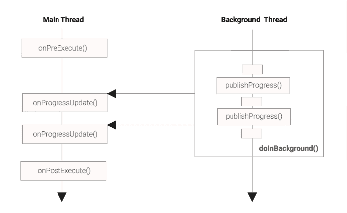
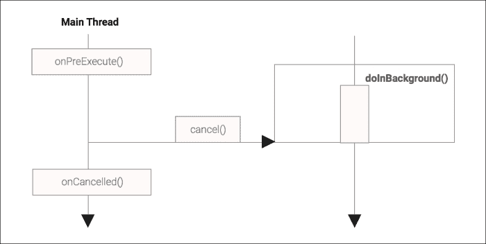
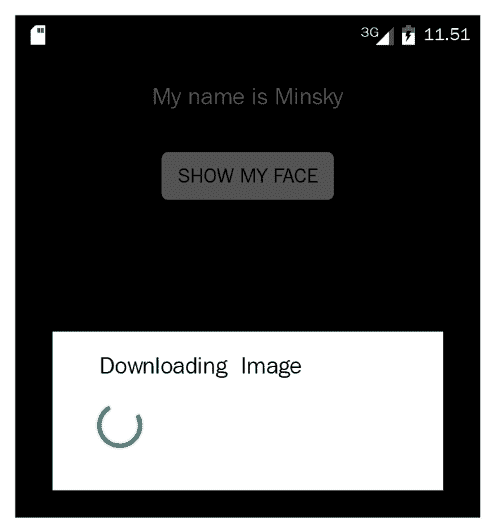
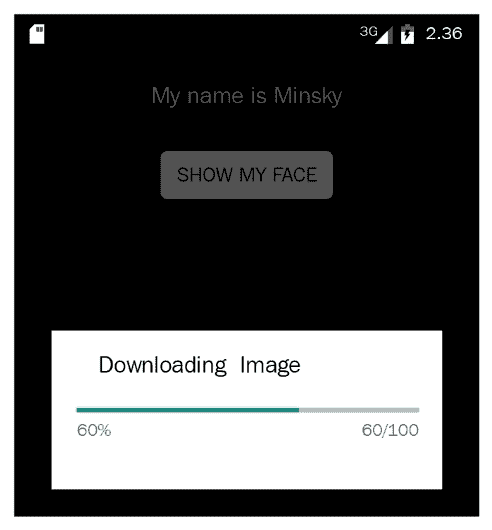
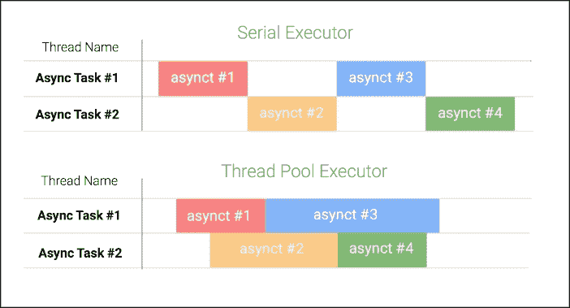

# 第三章。探索 `AsyncTask`

在 第二章 中，*使用 Looper、Handler 和 HandlerThread 执行工作*，我们熟悉了 Android 平台上最基本的后台和并发结构：`Handler` 和 `Looper`。这些结构支撑了主线程用于渲染 UI 和运行 Android 组件生命周期的几乎所有事件和顺序处理。

在本章中，我们将探讨 `android.os.AsyncTask`，这是一个高级结构，它为我们提供了一个整洁且精简的接口来执行后台工作，并将结果发布回主线程，而无需管理线程创建和处理器的操作。

在本章中，我们将涵盖以下主题：

+   介绍 `AsyncTask`

+   声明 `AsyncTask` 类型

+   执行 `AsyncTasks`

+   提供不确定的进度反馈

+   提供确定的进度反馈

+   取消 `AsyncTask`

+   处理异常

+   控制并发级别

+   常见的 `AsyncTask` 问题

+   `AsyncTask` 的应用

# 介绍 `AsyncTask`

`AsyncTask` 是在 Android 平台的 Android Cupcake（API 级别 3）中引入的，其明确目的是帮助开发者避免阻塞主线程。这个类名中的 Async 部分来自异步这个词，字面上意味着阻塞的任务不是在我们调用它的时候发生的。

`AsyncTask` 将后台线程的创建、与主线程的同步以及执行进度的发布封装在一个结构中。

与 `Handler` 和 `Looper` 结构相比，`AsyncTask` 使开发者免于管理低级组件、线程创建和同步。

`AsyncTask` 是一个抽象类，因此必须进行子类化才能使用。我们的子类至少必须为抽象的 `doInBackground` 方法提供一个实现，该方法定义了我们想要在主线程之外完成的工作。

```java
protected Result doInBackground(Params... params)
```

`doInBackground` 将在当前进程中以 `THREAD_PRIORITY_BACKGROUND`（友好级别 10）的优先级在一个并行线程中执行，并且名称遵循以下格式 `AsyncTask #<N>`。

除了 `doInBackground` 方法之外，该结构还提供了开发者可以在子类中实现的不同方法，用于设置任务、发布进度和将最终结果发布到主线程。

`AsyncTask` 有五种其他方法，我们可以选择重写：

```java
   protected void onPreExecute()
   protected void onProgressUpdate(Progress... values)
   protected void onPostExecute(Result result)
   protected void onCancelled(Result result)
   protected void onCancelled()
```

尽管我们可以重写这五个方法中的一个或多个，但我们不会直接从自己的代码中调用它们。这些是回调方法，意味着它们将在 `AsyncTask` 生命周期的适当时间为我们调用（回调）。

`doInBackground()` 和其他四个方法之间的关键区别是它们执行的线程。

在任何后台工作开始之前，`onPreExecute()`将被调用，并且当我们调用 execute (Params…)方法时，它将在主线程上同步运行到完成。

在`onPreExecute()`方法中，我们可以设置任务或任何进度对话框在 UI 上，以向用户指示任务刚刚开始。

一旦`onPreExecute()`完成，`doInBackground()`将被安排，并将在后台线程上开始工作。

在后台工作期间，开发者可以从`doInBackground()`发布进度更新，这会触发主线程执行我们提供的进度值的`onProgressUpdate`。内部，`AsyncTask`使用绑定到主线程`Looper`的`Handler`来在主线程上发布结果，如第二章中所述，*使用 Looper、Handler 和 HandlerThread 执行工作*。

通过在主线程上调用此方法，`AsyncTask`使我们能够轻松地更新用户界面以显示进度（记住我们只能从主线程更新用户界面）。

当后台工作成功完成时，`doInBackground()`可能返回一个结果。这个结果传递给`onPostExecute()`，它将在主线程上为我们调用。在`onPostExecute()`接收到结果后，我们可以使用后台处理的结果更新用户界面：

### 注意

这种从一条线程向另一条线程传递数据的方式非常重要，因为它允许我们将密集和长时间的任务从关键的主线程中移开。这种结构简化了主线程中的通信，并为在后台线程上执行异步工作提供了一个高级 API。

我们的`AsyncTask`可以操作封装的 Activity 类的字段，但那时我们必须采取额外的预防措施，例如添加同步来防止竞态条件和确保更新的可见性。



图 3.1：AsyncTask 回调执行函数

前面的图显示了`AsyncTask`执行的方法调用序列，说明了哪些方法在主线程上运行，哪些在`AsyncTask`后台线程上运行。

### 注意

由于`onPreExecute()`、`onProgressUpdate()`、`onPostExecute()`和`onCancelled()`方法是在主线程上调用的，因此在这些方法中我们不应执行长时间运行/阻塞的操作。

在`doInBackground()`完成之前，通过`AsyncTask`引用调用`cancel`方法，`onPostExecute()`将不会被调用。相反，替代的`onCancelled()`回调方法将在 UI 线程上被调用，这样我们就可以为成功完成和取消完成实现不同的行为：



图 3.2：AsyncTask 取消任务执行序列

前面的图显示了在 `doInBackground()` 完成之前取消任务时的方法调用序列。就像我们在前面的图中所示，`cancel()` 可能由主线程或从任何可以访问 `AsyncTask` 对象引用的其他线程调用。

# 声明 AsyncTask 类型

`AsyncTask` 是一个泛型类，它公开了三个泛型类型参数：

```java
abstract class AsyncTask<Params, Progress, Result>
```

为了使用泛型类型，我们必须为泛型类型中声明的每个类型参数提供一个类型参数。

### 注意

泛型类型类提供了一种方法，可以针对不同的输入类型重用相同的泛型算法。一个泛型类型可以有一个或多个类型参数。

当我们声明 `AsyncTask` 子类时，我们将指定 Params、Progress 和 Result 的类型；例如，如果我们想将 `String` 参数传递给 `doInBackground`，以 `Float` 报告进度，并返回 `Boolean` 结果，我们就会声明我们的 `AsyncTask` 子类如下：

```java
    public class MyTask extends AsyncTask<String, Float, Boolean>
```

如果我们不需要传递任何参数，或者不想报告进度，对于这些参数使用 `java.lang.Void` 是一个好的选择，因为这可以清楚地表达我们的意图，因为 `Void` 是一个不可实例化的类，代表 void 关键字。

只能使用引用类型作为泛型类型的类型参数。这包括类、接口、枚举类型、嵌套和内部类型，以及数组类型。不允许使用原始类型作为类型参数。以下声明在泛型类型类定义中被认为是非法的：

```java
   // Error
   public class MyTask extends AsyncTask<String, float, boolean>
```

让我们看看我们的第一个例子，在后台执行昂贵的图像下载并将结果报告到当前 UI：

```java
public class DownloadImageTask
  extends AsyncTask<URL, Integer, Bitmap> {

  // Weak reference to the UI View to update
  private final WeakReference<ImageView> imageViewRef;

  public DownloadImageTask(ImageView imageView) {
    this.imageViewRef = new WeakReference<ImageView>(imageView);
  }

  // Retrieves the image from a URL
  private Bitmap downloadBitmap(URL url) {
    // elided for brevity ...
    ...
  }

  @Override
  protected Bitmap doInBackground(URL... params) {
    URL url = params[0];
    // The IO operation invoked will take a significant ammount
    // to complete
    return downloadBitmap(url);
  }
  ...

  @Override
  protected void onPostExecute(Bitmap bitmap) {
    ImageView imageView = this.imageViewRef.get();
    if (imageView != null) {
      imageView.setImageBitmap(bitmap);
    }
  }
}
```

在这里，`DownloadImageTask` 扩展了 `AsyncTask`，指定 Params 类型为 URL，以便我们可以根据其 URL 获取图像，Progress 为 Integer，Result 类型为 Bitmap。

我们将 `ImageView` 传递给构造函数，这样 `DownloadImageTask` 就有一个弱引用到它应该在其完成后更新的用户界面。

我们实现了 `doInBackground` 以在后台下载图像，其中 url 是一个带有图像资源位置的 URL 参数。

在 `onPostExecute` 中，当视图弱引用不为 null 时，我们只需将位图加载到我们在构造函数中存储的视图中。

`WeakReference` 在创建视图的活动不再活跃时，不会阻止视图被垃圾回收。

# 执行 AsyncTask

在实现了 `doInBackground` 和 `onPostExecute` 之后，我们希望让我们的任务运行。我们可以使用两种方法来实现这一点，每种方法都提供了不同级别的控制，以控制任务执行的并发程度。让我们先看看两种方法中较简单的一种：

```java
  public final AsyncTask<Params, Progress, Result> execute(Params...
  params)
```

返回类型是 `AsyncTask` 子类的类型，这只是为了方便，这样我们就可以使用方法链在一个单行中实例化和启动一个任务，同时仍然记录实例的引用：

```java
   class MyTask implements AsyncTask<String,Void,String>{ ... }
   MyTask task = new MyTask().execute("hello");
```

`Params... params` 参数与我们在类声明中使用的 Params 类型相同，因为我们提供给 execute 方法的值稍后会被传递给我们的 `doInBackground` 方法作为其 Params... params 参数。请注意，它是一个可变参数（variable number of parameters）参数，这意味着我们可以传递任何数量的该类型参数（包括零个）。

### 注意

每个 `AsyncTask` 实例都是一个单次使用的对象——一旦我们启动了一个 `AsyncTask`，它就永远不能再次启动，即使我们取消它或等待它完成。

这是一个安全特性，旨在保护我们免受并发问题，如竞态条件的影响。

执行 `DownloadImageTask` 是直接的——我们需要 `Activity`，它使用一个视图来构建 `DownloadImageTask` 的实例，然后我们使用适合 URL 的值调用 `execute` 方法：

```java
  public class ShowMyPuppyActivity extends Activity {

    @Override
 public void onCreate(Bundle savedInstanceState) {
  super.onCreate(savedInstanceState);
  setContentView(R.layout.show_my_puppy);

  // Get the show button reference
  Button showBut = (Button) findViewById(R.id.showImageBut);
  showBut.setOnClickListener(new View.OnClickListener() {

    @Override
    public void onClick(View v) {
      ...
      // My Puppie Image URL
      URL url = new URL("http://img.allw.mn/" +
                    "content/www/2009/03/april1.jpg");  
      // Get the Reference to Photo UI Image View               
      ImageView iv = (ImageView) findViewById(R.id.photo);
        // Download the Image in background and
        // load the image on the view
        new DownloadImageTask(iv).execute(url);
        ...
      }
  });
}
```

一旦我们点击 UI 显示按钮，就会创建一个新的 `DownloadAsyncTask` 并将其附加到一个 `imageView` 上，然后我们调用 `execute()` 方法以在后台启动异步任务。当我们对任务调用 `execute()` 方法时，这将导致调用 `onPreExecute()` 方法，然后调用 `doInBackground()` 方法。

正如我们之前解释的，一旦下载完成，就会调用 `onPostExecute()` 来在图像视图中加载下载的图像（`Bitmap`）。

### 提示

您可以从您在 [`www.packtpub.com`](http://www.packtpub.com) 的账户中下载您购买的所有 Packt Publishing 书籍的示例代码文件。如果您在其他地方购买了这本书，您可以访问 [`www.packtpub.com/support`](http://www.packtpub.com/support) 并注册以将文件直接通过电子邮件发送给您。

# 提供不确定进度反馈

既然我们已经启动了一个可能需要很长时间才能完成的任务，我们可能想让用户知道正在发生某些事情。有很多种方法可以做到这一点，但一种常见的方法是显示一个显示相关消息的对话框。

在 `AsyncTask` 的 `onPreExecute()` 方法中展示我们的对话框是一个好地方，因为 `AsyncTask` 在主线程上执行，因此允许与用户界面交互。

修改后的 `DownloadImageTask` 需要一个 `Context` 的引用，以便它可以准备一个 `ProgressDialog`，它将在 `onPreExecute()` 中显示并在 `onPostExecute()` 中取消显示。由于 `doInBackground()` 没有改变，为了简洁起见，以下代码中没有显示：

```java
public class DownloadImageTask
  extends AsyncTask<URL, Integer, Bitmap> {
  ...
 private final WeakReference<Context> ctx;
 private ProgressDialog progress;
  ...
  public DownloadImageTask(Context ctx, ImageView imageView) {
    this.imageView = new WeakReference<ImageView>(imageView);
    this.ctx = new WeakReference<Context>(ctx);
  }

 @Override
 protected void onPreExecute() {
 if ( ctx !=null && ctx.get()!= null ) {
 progress = new ProgressDialog(ctx.get());
 progress.setTitle(R.string.downloading_image);
 progress.setIndeterminate(true);
 progress.setCancelable(false);
 progress.show();
 }
 }

  // ... doInBackground elided for brevity ...
  @Override
  protected void onPostExecute(Bitmap bitmap) {
    ...
 if ( progress != null ) { progress.dismiss(); }
 ...
  }
}
```

剩下的只是将一个 `Context` 传递给修改后的 `DownloadImageTask` 的构造函数。由于 `Activity` 是 `Context` 的子类，我们可以简单地传递主机 `Activity` 的引用：

```java
showBut.setOnClickListener(new View.OnClickListener() {

  @Override
  public void onClick(View v) {
      ...
      // Pass in the Context and the image view to load
      // the image
      new DownloadImageTask(
        ShowMyPuppyActivity.this, iv).execute(url);
         ...   
  }
});
```



图 3.3：不确定进度对话框

一旦异步任务开始，`onPreExecute()`回调将创建一个不确定性的进度对话框，并如图 3.3 所示显示它。这个不可取消的对话框将以不透明的层覆盖在 UI 屏幕上，并显示标题。我们所说的“不确定”是指在此之前，我们无法估计任务完成还需要等待多长时间。

直到下载完成，对话框在`onPostExecute()`中被关闭，用户无法与应用程序交互，对话框将保持在前景。

### 注意

在你能够向你的应用程序 UI 展示内容之前，需要执行任何长时间的计算时，你必须向用户显示一个指示，表明后台正在发生某些操作，而用户正在等待。

# 提供确定性的进度反馈

知道正在发生某些事情对用户来说是一种极大的安慰，但他们可能会变得不耐烦，想知道他们还需要等待多长时间。让我们通过向我们的对话框添加进度条来向他们展示我们的进度。

记住，我们不允许直接从`doInBackground()`更新用户界面，因为我们不在主线程上。那么，我们如何告诉主线程为我们执行这些更新呢？

`AsyncTask`提供了一个方便的回调方法来完成这个任务，我们在本章开头看到了它的签名：

```java
protected void onProgressUpdate(Progress... values)
```

我们可以重写`onProgressUpdate()`来从主线程更新用户界面，但它在何时被调用，以及它从哪里获取`Progress...值`？`doInBackground()`和`onProgressUpdate()`之间的粘合剂是 AsyncTask 的另一个方法：

```java
   protected final void publishProgress(Progress... values)
```

为了更新用户界面以反映我们的进度，我们只需通过在`doInBackground()`中调用`publishProgress()`从后台线程发布进度更新。每次我们调用`publishProgress()`时，主线程都会被安排调用`onProgressUpdate()`，并带上这些进度值。

对我们的运行示例进行修改以显示确定性进度条非常简单。由于我们已经将`DownloadImageTask`的 Progress 类型定义为 Integer，现在，我们必须将设置进度值从 0（`setProgress`）到 100（`setMax`）的范围，并设置进度条的样式和边界。我们可以在`onPreExecute()`中通过以下添加来实现：

```java
@Override
protected void onPreExecute() {
    ...
    // Sets the progress bar style
    progress.setProgressStyle(
        ProgressDialog.STYLE_HORIZONTAL);
    progress.setIndeterminate(false);
    progress.setProgress(0);
    progress.setMax(100);
    progress.setCancelable(false);
    progress.show(); 
}
```

我们还需要实现`onProgressUpdate`回调，以便从主线程更新进度条：

```java
@Override
protected void onProgressUpdate(Integer... values) {
  progress.setProgress(values[0]);
  }
```

最后的修改是在`for`循环的每次迭代中计算进度，并调用`publishProgress()`，以便主线程知道调用`onProgressUpdate()`：

```java
private Bitmap downloadBitmap(URL url) {
  InputStream is = null;
  ...
  // Before Download starts
  publishProgress(0);
  downloadedBytes = 0;
  // Creates a Connection to the image URL
  HttpURLConnection conn = (HttpURLConnection) url.
                             openConnection();
  ...
  // Retrieves the image total length
  totalBytes = conn.getContentLength();
    ...
  BufferedInputStream bif = new BufferedInputStream(is) {

    int progress = 0;

      public int read(byte[] buffer, int byteOffset,
                      int byteCount) throws IOException {      
        // The number of bytes read in each stream read
      int readBytes = super.read(buffer, byteOffset,
                                 byteCount);
      ..
      // Actual number of bytes read from the file
      downloadedBytes += readBytes;
      // Percent of work done
      int percent = (int)((downloadedBytes * 100f) /
                      totalBytes);
      // Publish the progress to the main thread
      if (percent > progress) {
        publishProgress(percent);
        progress = percent;
      }     
  ...
}
```

重要的是要理解，调用`publishProgress()`并不会直接调用主线程，而是将一个任务添加到主线程的队列中，这个任务将在不久的将来由主线程处理。

注意，我们非常小心地只在百分比实际改变时发布进度，以避免任何不必要的开销：

### 注意

重要的是要知道，每次你在后台线程上调用`publishProgress()`，在`downloadBitmat()`中，都会自动发送一个新的 Handler 消息，将进度推送到主线程。



图 3.4：确定性进度对话框显示任务进度

如图 3.4 所示，在`onPreExecute()`中创建的确定性对话框在`doInBackground()`中会持续更新，显示任务的当前进度。进度是按比例计算的，如下面的除法所示：

对于本例以及任何没有太多 UI 工作要处理的程序，发布进度和看到用户界面更新之间的延迟将非常短。进度条将根据黄金法则平滑更新，即不阻塞主线程的任何代码，因为我们只在百分比变化时派发进度更新。

# 取消`AsyncTask`

我们可以为用户提供另一个很好的可用性功能，即在任务完成之前取消任务——例如，如果用户在执行开始后不再对操作结果感兴趣。`AsyncTask`通过`cancel`方法提供取消支持。

```java
public final boolean cancel(boolean mayInterruptIfRunning)
```

`mayInterruptIfRunning`参数允许我们指定处于可中断状态的`AsyncTask`线程是否可以被实际中断——例如，如果我们的`doInBackground`代码正在执行一个阻塞的可中断函数，如`Object.wait()`。当我们设置`mayInterruptIfRunning`为`false`时，`AsyncTask`不会中断当前的阻塞可中断操作，并且`AsyncTask`的后台处理将仅在阻塞操作终止后完成。

### 注意

在行为良好的可中断阻塞函数中，例如`Thread.sleep()`、`Thread.join()`或`Object.wait()`，当线程被`Thread.interrupt()`中断时，执行会立即停止，并抛出`InterruptedException`。应该适当地处理`InterruptedException`，并且只有当你知道后台线程即将退出时才应该吞没它。

简单地调用取消并不足以使我们的任务提前完成。我们需要通过定期检查`isCancelled`返回的值，并在`doInBackground`中适当地做出反应来积极支持取消。

首先，让我们设置我们的`ProgressDialog`，通过在`onPreExecute`中添加几行代码来触发`AsyncTask`的`cancel`方法：

```java
@Override
protected void onPreExecute() {
 ...
 progress.setCancelable(true);
 progress.setOnCancelListener(
 new DialogInterface.OnCancelListener() {
 public void onCancel(DialogInterface dialog) {
 DownloadImageTask.this.cancel(false);
 }
 });
 ...
}
```

现在，我们可以通过触摸进度对话框外部或按设备上的返回按钮来触发取消操作，当对话框可见时。

我们将使用`false`调用`cancel`，因为我们不希望在执行网络读取或检查`Thread.interrupted()`函数的返回值时立即挂起当前的 IO 操作。我们仍然需要在`doInBackground`中检查取消操作，因此我们将对其进行如下修改：

```java
private Bitmap downloadBitmap(URL url) {
  Bitmap bitmap = null;
  BufferedInputStream bif = new BufferedInputStream(is) {
    ...

    public int read(byte[] buffer, int byteOffset,
                    int byteCount) throws IOException {

      // Read the bytes from the Connection
      int readBytes = super.read(buffer, byteOffset, byteCount);

      // Verify if the download was cancelled
      if ( isCancelled() ) {
        // Returning -1 means that there is
        // no more data and the stream has just ended
        return -1;
      }
      ...
    }
  }
  // If the download is cancelled the Bitmap is null
  if ( !isCancelled() ) {
    bitmap = BitmapFactory.decodeStream(bif);
  }
  return bitmap;
  }
```

在上面的代码中，在我们的 `BufferInputStream` 匿名子类中，我们能够拦截连接上发生的每次读取操作。当这个拦截机制到位后，一旦我们取消 AsyncTask，我们就可以通过简单地返回读取调用的结果为 -1（流结束）来停止数据流。一旦 `BitmapFactory.decodeStream` 接收到流结束信号，它将立即返回，并且我们将 `downloadBitmap` 调用的结果返回为 null。

被取消的 `AsyncTask` 不会收到 `onPostExecute` 回调。相反，我们可以通过实现 `onCancelled` 来实现取消执行的不同行为。这个回调方法有两种变体：

```java
protected void onCancelled(Result result);
protected void onCancelled();
```

参数化的 `onCancelled`(Result result) 方法的默认实现是在完成之后委托给 `onCancelled()` 方法。

如果 AsyncTask 无法提供部分结果（例如部分图像数据）或没有任何结果，那么我们可能需要重写无参数的 `onCancelled()` 方法。

另一方面，如果我们正在 `syncTask` 中执行增量计算，并且部分结果对应用程序有实际意义时，我们可能会选择重写 `onCancelled(Result result)` 版本。

在这两种情况下，由于在取消的 `AsyncTask` 上不会调用 `onPostExecute()`，我们想要确保我们的 `onCancelled()` 回调适当地更新用户界面——在我们的例子中，这包括关闭我们在 `onPreExecute()` 中打开的进度对话框，并使用应用程序包中可用的默认图像更新图像视图。

在我们的例子中，当任务被取消时，`doInBackground()` 的结果是 null 对象，因此我们将重写无参数的 `onCancelled()` 函数来添加之前描述的行为：

```java
@Override
protected void onCancelled() {
  if ( imageView !=null && imageView.get() != null &&
       ctx !=null && ctx.get() != null ) {

   // Load the Bitmap from the application resources
    Bitmap bitmap = BitmapFactory.decodeResource(
                      ctx.get().getResources(),
                      R.drawable.default_photo
                    );
    // Set the image bitmap on the image view
    this.imageView.get().setImageBitmap(bitmap);
  }
  // Remove the dialog from the screen
  progress.dismiss();
}
```

另一个需要注意的情况是当我们取消尚未开始 `doInBackground()` 方法的 AsyncTask 时。如果发生这种情况，`doInBackground()` 将不会被调用，尽管 `onCancelled()` 仍然会在主线程上被调用。

## AsyncTask 执行状态

`execute()` 方法可能以取消状态或完成状态结束，然而如果用户尝试第二次调用 `execute()`，任务将失败并抛出 `IllegalStateException` 异常，表示：

*无法执行任务，任务只能执行一次/任务已经在运行*

拥有 `AsyncTask` 对象的引用后，我们可以通过 `getStatus()` 方法确定任务的状态，并根据状态结果做出反应。让我们看一下下一个代码片段：

```java
// Create a download task object
DownloadImageTask task  = new DownloadImageTask(
                            ShowMyPuppyActivity.this, iv);
...
if ( task.getStatus() == AsyncTask.Status.PENDING ) {
  // DownloadImageTask has not started yet so
  // we can can invoke execute()
} else if (task.getStatus() == AsyncTask.Status.RUNNING) {
  // DownloadImageTask is currently running in
  // doInBackground()
} else if (task.getStatus() == AsyncTask.Status.FINISHED
           && task.isCancelled()) {
  // DownloadImageTask is done OnCancelled was called
} else {
  // DownloadImageTask is done onPostExecute was called
}
```

通过使用 `AsyncTask` 提供的 `getStatus()` 实例方法，我们可以跟踪后台任务的执行情况，并确切知道后台工作的当前状态。

### 注意

如果你想要重复后台操作，你必须实例化一个新的任务并再次调用 `execute()` 方法。

# 异常处理

由`AsyncTask`定义的回调方法规定我们无法抛出受检异常，因此我们必须将任何抛出受检异常的代码用 try/catch 块包裹起来。从`AsyncTask`的方法中传播出来的未检查异常会导致我们的应用程序崩溃，因此我们必须仔细测试并在必要时处理这些异常。

对于在主线程上运行的回调方法——`onPreExecute()`、`onProgressUpdate()`、`onPostExecute()`和`onCancelled()`——我们可以在方法中捕获异常并直接更新用户界面以提醒用户。

当然，异常也可能出现在我们的`doInBackground()`方法中，因为`AsyncTask`的大部分工作都是在那里完成的，但不幸的是，我们无法从`doInBackground()`更新用户界面。一个简单的解决方案是让`doInBackground()`返回一个可能包含结果或异常的对象。首先，我们将创建一个用于存储操作结果的泛型类和一个用于存储异常的成员：

```java
public class Result<T> {
    public T result;
    public Throwable error;
}
```

在下一步中，我们将创建一个新的下载`AsyncTask`，称为`SafeDownloadImageTask`，它负责异常处理，并有一个类型为`Result<Bitmap>`的结果，而不是`Bitmap`：

```java
public class SafeDownloadImageTask extends
  AsyncTask<URL, Integer, Result<Bitmap>> {

   // Method executed on the Background Thread
   protected Result<Bitmap> doInBackground(URL... params) {
     Result<Bitmap> result = new Result<Bitmap>();
     try {
           // elided for brevity ...
          ...
       result.result = bitmap;
     } catch (Throwable e) {
       result.error = e;
     } ...     
   }
   return result;
}
```

现在，我们可以在`onPostExecute`中检查`Result`对象中是否存在`Exception`。如果有，我们可以处理它，例如通过提醒用户；否则，我们只需像平常一样使用实际的结果，并使用结果中的位图：

```java
@Override
protected final void onPostExecute(Result<Bitmap> result) {
  ...
  if ( result.error!= null) {
    // ... alert the user ...
    ...
    Log.e("SafeDownloadImageTask",
          "Failed to download image ",result.exception);
    loadDefaultImage(imageView);
  } else {
    // ... success, continue as normal ...
    imageView.setImageBitmap(result.actual);
  }
}
```

使用上述安全实现，后台线程上抛出的任何错误都会安全地转发到主线程，并且不会影响`AsyncTask`的正常生命周期。让我们尝试检索一个不存在的图像，看看异常是否被正确处理：

```java
URL url = new URL("http://img.allw.mn" +
                  "/content/www/2009/03/notfound.jpg");
new SafeDownloadImageTask(ShowMyPuppyActivity.this, iv)
.execute(url);
```

如预期的那样，错误被捕获，封装在一个`Result`对象中，并在 Android 日志中打印出来，堆栈跟踪指向`SafeDownloadImageTask.doInBrackground`方法：

```java
...downloadBitmap(SafeDownloadImageTask.java:85)
...doInBackground(SafeDownloadImageTask.java:60)
...

84: if (responseCode != HttpURLConnection.HTTP_OK){
85:      throw new Exception(...);
86: }
```

# 控制并发级别

到目前为止，我们已小心翼翼地避免过于具体地说明当我们调用`AsyncTask`的 execute 方法时会发生什么。我们知道`doInBackground()`将在主线程之外执行，但那究竟意味着什么呢？

`AsyncTask`的原始目标是帮助开发者避免阻塞主线程。在其 API 级别 3 的初始形式中，`AsyncTask`被排队并按顺序（即一个接一个）在一个单独的后台线程上执行，保证了它们会按照启动的顺序完成。

这在 API 级别 4 中发生了变化，使用最多 128 个线程的线程池来并发执行多个`AsyncTask`——并发级别高达 128。乍一看，这似乎是个好事，因为`AsyncTask`的一个常见用途是执行阻塞 I/O，其中线程的大部分时间都在空闲地等待数据。

然而，正如我们在第一章中看到的，*构建响应式 Android 应用程序*，在并发编程中经常会出现许多问题，实际上，Android 团队意识到，通过默认并发执行`AsyncTask`s，他们使开发者暴露于潜在的编程问题（例如，当并发执行时，没有保证`AsyncTask`s 将按它们启动的顺序完成）。

因此，在 API 级别 11 上进行了进一步的更改，默认切换回串行执行，并引入了一个新的方法，将并发控制权交回给应用开发者：

```java
   public final AsyncTask<Params, Progress, Result>
       executeOnExecutor(Executor exec, Params... params)
```

从 API 级别 11 开始，我们可以使用`executeOnExecutor`启动 AsyncTasks，并且通过提供 Executor 对象，我们可以自己选择并发的级别。

执行器是 JDK 中`java.util.concurrent`包的一个接口，如第一章中更详细地描述的，*构建响应式 Android 应用程序*。它的目的是提供一个提交任务以供执行的方式，而无需精确说明执行将如何或何时进行。`Executor`的实现可能使用单个线程顺序运行任务，使用有限线程池来控制并发级别，或者甚至为每个任务直接创建一个新线程。

`AsyncTask`类提供了两个执行器实例，允许你选择本节之前描述的并发级别：

+   `SERIAL_EXECUTOR`: 这个执行器将任务排队，并确保任务按提交的顺序由`AsyncTask`线程池顺序执行。

+   `THREAD_POOL_EXECUTOR`: 这个`Executor`通过使用线程池来运行任务以提高效率（启动新线程会带来一些开销，这些开销可以通过池化和重用来避免）。`THREAD_POOL_EXECUTOR`是 JDK 类`ThreadPoolExecutor`的一个实例，它使用一个线程池，该线程池根据需求增长和缩减。在`AsyncTask`的情况下，线程池被配置为至少维护五个线程，并扩展到 128 个线程。在 Android Lollipop 5.0（API 级别 21）中，线程的最大数量减少到 CPU 核心数乘以 2 再加 1，并且`ThreadPool`的全局入队容量增加了。

要使用特定的执行器执行`AsyncTask`，我们调用`executeOnExecutor`方法，提供我们想要使用的执行器的引用，例如：

```java
task.executeOnExecutor(AsyncTask.THREAD_POOL_EXECUTOR,
                       params);
```

由于 API 级别 11 以来执行默认行为是在单个后台线程上串行运行 AsyncTasks，以下两个语句是等价的：

```java
   task.execute(params);
   task.executeOnExecutor(AsyncTask.SERIAL_EXECUTOR, params);
```

在下一张图中，我们将展示串行执行器和线程池在处理按顺序入队的`AsyncTask`组时的区别：

```java
new SleepAsyncTask(1).execute(1000);
...
new SleepAsyncTask(4).execute(1000);
```



如前图所示，串行执行器使用`AsyncTask`线程池中的可用线程，但它们只有在之前的`AsyncTask`完成时才会处理下一个`AsyncTask`。或者，`ThreadPoolExecutor`将立即开始处理下一个任务，只要它有可用的线程来完成工作，而不保证它们会按照启动的顺序完成：

### 注意

重要的是要提到，系统中的所有`AsyncTasks`都将共享同一个静态执行器`AsyncTask.THREAD_POOL_EXECUTOR`。对于`SerialExecutor`来说，情况更糟，因为如果一个`AsyncTask`长时间占用单个执行器，那么下一个任务将等待在队列中以便处理。

除了`AsyncTask`提供的默认执行器和`java.util.concurrent`中可用的执行器之外，我们还可以选择创建自己的。例如，我们可能希望通过操作一小批线程来允许一些并发性，并且当所有线程都忙碌时允许许多任务排队。

这可以通过将我们的`ThreadPoolExecutor`实例配置为我们的某个类（例如我们的`Activity`类）的静态成员来轻松实现。以下是如何配置一个具有四到八线程池和有效无限队列的执行器的方法：

```java
  private static final Queue<Runnable> QUEUE =
     new LinkedBlockingQueue<Runnable>();
   public static final Executor MY_EXECUTOR =
     new ThreadPoolExecutor(4, 8, 1, TimeUnit.MINUTES, QUEUE);
```

构造函数的参数表示核心池大小（4），最大池大小（8），空闲额外线程在池中被移除之前可以存活的时间（1），时间单位（分钟），以及当池线程忙碌时附加工作的队列。

使用我们自己的 Executor 就像如下调用我们的`AsyncTask`一样简单：

```java
task.executeOnExecutor(MY_EXECUTOR, params);
```

# 常见的`AsyncTask`问题

就像任何强大的编程抽象一样，`AsyncTask`并非完全没有问题和妥协。在接下来的几节中，我们将列出我们在应用中使用此结构时可能遇到的一些陷阱。

## 碎片化问题

在“控制并发级别”部分，我们看到了`AsyncTask`如何随着 Android 平台的新版本发布而发展，导致任务运行设备的平台行为各异，这是碎片化更广泛问题的一部分。

事实上，如果我们针对广泛的 API 级别，我们的`AsyncTask`的执行特性——因此，我们应用的行为——在不同设备上可能会有很大的差异。那么我们如何减少由于碎片化而遇到`AsyncTask`问题的可能性？

最明显的方法是故意针对至少运行 Honeycomb 的设备，通过在 AndroidManifest 文件中设置`minSdkVersion`为 11。这巧妙地将我们归类到默认情况下以串行方式执行`AsyncTasks`的设备类别，因此行为更加可预测。

到 2015 年 10 月写作时，只有 4%的安卓设备运行在 API 级别 4 和 10 之间的危险区域，因此将你的应用程序定位到 11 级不会显著减少你的市场覆盖范围。

当使用`ThreadPoolExecutor`作为执行器时，Lollipop（API 级别 21）引入的变化也可能导致与旧版本（API 级别>10）相关的行为漂移。现代`AsyncTask`的`ThreadPoolExecutor`限制为设备的 CPU 核心数乘以 2 加 1 个并发线程，还有一个额外的 128 个任务的队列来排队工作。

第二种选择是精心设计我们的代码，并在一系列设备上彻底测试——当然，这是值得赞扬的做法，但正如我们所看到的，在没有碎片化增加复杂性的情况下，并发编程就已经足够困难了，而且不可避免地，微小的错误仍然会存在。

安卓开发社区提出的第三种解决方案是在自己的项目中重新实现`AsyncTask`，然后在 SDK 版本之外扩展自己的`AsyncTask`类。这样，你就不再受用户设备平台的摆布，可以重新控制你的`AsyncTasks`。由于`AsyncTask`的源代码很容易获得，这并不难做到。

## 内存泄漏

在我们保留对`Activity`或`View`的引用的情况下，我们可以在活动被销毁时防止整个对象树被垃圾回收。开发者需要确保取消任务并移除对已销毁活动或视图的引用。

## 活动生命周期问题

我们故意将任何长时间运行的任务从主线程移除，这使得我们的应用程序变得非常响应——主线程可以快速响应用户的任何交互。

不幸的是，我们也为自己创造了一个潜在的问题，因为主线程能够在我们的后台任务完成之前完成 Activity。Activity 可能因为多种原因而结束，包括用户旋转设备导致的配置更改（Activity 被销毁并再次创建，带有新的内存地址），用户将设备连接到坞站，或任何其他类型的上下文更改。

如果我们在活动结束后继续处理后台任务，我们可能正在进行不必要的操作，因此浪费 CPU 和其他资源（包括电池寿命），这些资源本可以用于更好的用途。

在设备旋转后的某些情况下，`AsyncTask`仍然有意义，并且有有效的内容要交付，然而，它引用了一个已销毁的活动或视图，因此不再能够更新 UI 并完成其工作以及交付其结果。

此外，`AsyncTask`持有的任何对象引用在任务明确 null 化这些引用或完成并自身符合**GC**（**垃圾回收**）条件之前，都不符合垃圾收集的资格。由于我们的`AsyncTask`可能引用了活动或视图层次结构的一部分，我们很容易以这种方式泄露大量的内存。

`AsyncTask`的常见用法是将它声明为主活动的一个匿名内部类，这会创建对活动的隐式引用，并导致更大的内存泄漏。

防止这些资源浪费问题有两种方法。

### 使用早期取消处理生命周期问题

首先，我们可以通过在活动结束时取消正在运行的任务来同步我们的`AsyncTask`生命周期与活动。

当一个`Activity`结束时，其生命周期回调方法会在主线程上被调用。我们可以检查生命周期方法被调用的原因，如果活动正在结束，则取消后台任务。最适合此目的的`Activity`生命周期方法是`onPause`，它在活动结束时一定会被调用：

```java
   protected void onPause() {
     super.onPause();
     if ((task != null) && (isFinishing()))
       task.cancel(false);
   }
```

如果`Activity`没有结束——比如说，因为它启动了另一个`Activity`并且仍然在后台栈上——我们可能简单地允许我们的后台任务继续完成。

这个解决方案简单明了，但远非理想，因为你可能会在不了解你可能已经有一个有效结果或你的`AsyncTask`仍在运行的情况下，再次启动后台工作，从而浪费宝贵的资源。

此外，当你启动多个`AsyncTasks`，并在设备旋转时再次启动它们时，浪费会大幅增加，因为我们不得不再次取消并启动相同数量的任务。

### 使用保留的无头`Fragments`处理生命周期问题

如果`Activit`y 因为配置更改而结束，仍然可能有用的是使用后台任务的结果并在重新启动的`Activit`y 中显示它们。实现这一点的模式之一是通过使用保留的`Fragments`。

`Fragments`是在 Android API 级别 11 中引入的，但可以通过支持库提供给针对更早 API 级别的应用程序。所有可下载的示例都使用支持库，并针对 API 级别 7 到 23。要使用`Fragment`，我们的`Activity`必须扩展`FragmentActivity`类。

`Fragment`的生命周期与宿主`Activit`y 的生命周期紧密相连，并且当活动重新启动时，`Fragment`通常会销毁。然而，我们可以通过在`Fragment`上调用`setRetainInstance(true)`来显式地防止这种情况，使其能够在活动重新启动后继续存在。

通常，一个`Fragment`将负责创建和管理`Activity`用户界面的一部分，但这不是强制性的。不管理自身视图的`Fragment`被称为无头`Fragment`。由于它们没有与之相关的 UI，因此当用户旋转设备时，它们不需要被销毁和重新创建。

将我们的`AsyncTask`隔离在保留的无头`Fragment`中，使得我们意外泄露对诸如`View`层次结构等对象的引用的可能性降低，因为`AsyncTask`将不再直接与用户界面交互。为了演示这一点，我们首先定义一个我们的`Activity`将实现的接口：

```java
public interface AsyncListener {
    void onPreExecute();
    void onProgressUpdate(Integer... progress);
    void onPostExecute(Bitmap result);
    void onCancelled(Bitmap result);
}
```

接下来，我们将创建一个保留的无头`Fragment`，它封装了我们的`AsyncTask`。为了简洁，省略了`doInBackground`，因为它与前面的示例没有变化——请参阅可下载的示例以获取完整的代码。

```java
public class DownloadImageHeadlessFragment extends Fragment {

  // Reference to the activity that receives the
  // async task callbacks
  private AsyncListener listener;   
  private DownloadImageTask task;

  // Function to create new instances
  public static DownloadImageHeadlessFragment
    newInstance(String url) {
    DownloadImageHeadlessFragment myFragment = new
                   DownloadImageHeadlessFragment();
    Bundle args = new Bundle();
    args.putString("url", url);
    myFragment.setArguments(args);
    return myFragment;
  }
  // Called to do initial creation of fragment
  public void onCreate(Bundle savedInstanceState) {
    super.onCreate(savedInstanceState);
    setRetainInstance(true);
    task = new DownloadImageTask();
    url = new URL(getArguments().getString("url"));
    task.execute(url);
  }
  // Called when an activity is attached
  public void onAttach(Activity activity) {
    super.onAttach(activity);
  listener = (AsyncListener)activity;
}

public void onDetach() {
    super.onDetach();
    listener = null;
}
// Cancel the download
public void cancel() {
  if (task != null) {
      task.cancel(false);
  }
}

private class DownloadImageTask extends AsyncTask<URL, Integer, Bitmap> {

   // ... doInBackground elided for brevity ...        }

}
```

如你所知，一个片段的生命周期与其自身的`Activity`紧密相连，因此回调函数会按照当前活动生命周期事件的顺序有序调用。例如，当活动停止时，所有附加到该活动的片段都将被分离并通知`Activity`状态变化。

在我们的示例中，我们使用`Fragment`生命周期方法（`onAttach`和`onDetach`）在保留片段中保存或删除当前的`Activity`引用。

当`Activity`附加到我们的片段时，会调用`onCreate`方法来创建私有的`DownloadImageTask`对象，然后调用`execute`方法在后台开始下载。

`newInstance`静态方法用于初始化和设置一个新的片段，无需调用其构造函数和 URL 设置器。一旦我们创建了片段对象实例，我们就会使用`setArguments`函数将图像 URL 保存到由片段参数成员存储的 bundle 对象中。如果 Android 系统恢复我们的片段，它将调用不带参数的默认构造函数，并且还可以利用旧的 bundle 来重新创建片段。

在配置更改期间，每当活动被销毁和重新创建时，`setRetainInstance(true)`强制片段在活动回收过渡期间存活。正如你所感知的，这种技术在某些情况下可能非常有用，在这些情况下我们不希望重建那些难以重新创建的对象，或者当活动通过配置更改被销毁时具有独立生命周期的对象。

### 注意

重要的是要知道，`retainInstance()`只能与不在返回栈中的片段一起使用。在保留片段上，当活动重新附加到新的`Activity`时，`onCreate()`和`onDestroy()`不会被调用。

接下来，我们的`Fragment`必须管理和执行一个`DownloadImageTask`，该任务通过`AsyncListener`接口代理进度更新和结果回传到`Activity`：

```java
private class DownloadImageTask extends AsyncTask<URL, Integer, Bitmap> {
  ...
  protected void onPreExecute() {
    if (listener != null)
      listener.onPreExecute();
  }
  protected void onProgressUpdate(Integer... values) {
    if (listener != null)
      listener.onProgressUpdate(values);
  }
  protected void onPostExecute(Bitmap result) {
    if (listener != null)
      listener.onPostExecute(result);
  }
  protected void onCancelled(Bitmap result) {
    if (listener != null)
      listener.onCancelled(result);
  }
}
```

如前所述，`AsyncListener` 是负责使用从我们的后台任务中获取的结果更新 UI 的实体。

现在，我们只需要一个实现了 `AsyncListener` 并使用 `DownloadImageHeadlessFragment` 来实现其长时间运行任务的主 Activity。完整的源代码可以从 Packt Publishing 网站下载，所以我们将只关注亮点：

```java
public class ShowMyPuppyHeadlessActivity
    extends FragmentActivity implements     
    DownloadImageHeadlessFragment.AsyncListener {

  private static final String DOWNLOAD_PHOTO_FRAG =        
                         "download_photo_as_fragment";
   ..
  @Override
  protected void onCreate(Bundle savedInstanceState) {
    ...
    FragmentManager fm = getSupportFragmentManager();
    downloadFragment = (DownloadImageHeadlessFragment)
       fm.findFragmentByTag(DOWNLOAD_PHOTO_FRAG);

    // If the Fragment is non-null, then it is currently being
    // retained across a configuration change.
    if (downloadFragment == null) {
     downloadFragment = DownloadImageHeadlessFragment.
          newInstance("http://img.allw.mn/content" +
                      "/www/2009/03/april1.jpg");
           fm.beginTransaction().add(downloadFragment,    
       DOWNLOAD_PHOTO_FRAG).
     commit();     
    }
  }
```

首先，当活动在 `onCreate` 回调中创建时，我们检查 Fragment 是否已存在于 `FragmentManager` 中，并且只有在它缺失时才创建其实例。

当 Fragment 创建时，我们通过 `newInstance` 方法构建一个 Fragment 实例，然后将 Fragment 推送到 `FragmentManager`，该实体将存储并执行转换。

如果我们的 `Activity` 已经被重新启动，当接收到进度更新回调时，它需要重新显示进度对话框，因此我们在更新进度条之前检查并显示它（如果需要的话）：

```java
@Override
public void onProgressUpdate(Integer... value) {
  if (progress == null)
    prepareProgressDialog();

  progress.setProgress(value[0]);
}
```

最后，`Activity` 需要实现 `AsyncListener` 定义的 `onPostExecute` 和 `onCancelled` 回调。`onPostExecute` 将更新 `resultView`，就像之前的示例一样，两者都会进行一些清理工作——关闭对话框并移除 Fragment，因为其工作已经完成：

```java
@Override
public void onPostExecute(Bitmap result) {
  if (result != null) {
    ImageView iv = (ImageView) findViewById(
                     R.id.downloadedImage);
    iv.setImageBitmap(result);
  }
  cleanUp();
}

// When the task is cancelled the dialog is dimissed
@Override
public void onCancelled(Bitmap result) {
  cleanUp();
}

// Dismiss the progress dialog and remove the
// the fragment from the fragment manager
private void cleanUp() {
  if (progress != null) {
    progress.dismiss();
    progress = null;
  }
  FragmentManager fm = getSupportFragmentManager();
  Fragment frag = fm.findFragmentByTag(DOWNLOAD_PHOTO_FRAG);
  fm.beginTransaction().remove(frag).commit();
}
```

这种技术，在 Android 开发社区中广为人知，被称为无头 `Fragment`，简单且一致，因为它在每次配置更改发生时将重新创建的活动附加到无头 `Fragment` 上。在 Fragment 上维护一个活动引用，并在 Fragment 附加（活动创建）和分离（活动销毁）时更新。

利用这种模式，`AsyncTask` 永远不必跟随配置更改的不可预测发生，或者担心在完成工作后进行 UI 更新，因为它将生命周期回调转发到当前的 `Activity`。

# `AsyncTask` 的应用

现在我们已经看到了如何使用 `AsyncTask`，我们可能会问自己何时应该使用它。

适用于 `AsyncTask` 的良好候选应用通常是相对短暂的操作（最多一秒或两秒），这些操作直接关联到特定的 `Fragment` 或 `Activity`，并需要更新其用户界面。

`AsyncTask` 对于运行短时间、CPU 密集型任务（如数值计算或在大文本字符串中搜索单词）非常理想，这样可以将其从主线程移除，以便保持对输入的响应性并维持高帧率。

阻塞 I/O 操作，如读取和写入文本文件，或使用 `BitmapFactory` 从本地文件加载图像，也是 `AsyncTask` 的良好用例。

当然，对于 `AsyncTask` 来说不太适合的场景也存在。对于任何需要超过一秒或两秒的操作，如果用户旋转设备，或者在不同应用或活动之间切换，或者发生我们无法控制的其他情况，我们应该权衡重复执行此操作的成本。

考虑到这些因素，以及我们在尝试处理它们时复杂性的增加速度（例如，保留的无头片段！），`AsyncTask` 在处理长时间操作时开始失去其光泽。

`AsyncTask` 通常用于从远程网络服务器获取数据，但这可能会遇到我们之前探讨的活动生命周期问题。最终用户可能在使用不稳定的 3G 或 HSDPA 连接，其中网络延迟和带宽可能差异很大，一个完整的 HTTP 请求-响应周期可能轻易跨越数秒。当我们上传大量数据时，例如图像，这一点尤为重要，因为可用带宽通常是不对称的。

虽然我们必须在主线程之外执行网络 I/O，但 `AsyncTask` 并不一定是最理想的选择——正如我们稍后将会看到的；还有更多适合从主线程卸载此类工作的结构。

当我们想要在 `AsyncTasks` 上组合或链式处理后台处理时，我们可能会陷入一个难以管理回调和协调工作的情况，因此 `AsyncTask` 在这里不会帮到你。

在下一章中，我们将介绍并详细说明其他技术，以清晰的方式处理这些类型的问题。

# 摘要

在本章中，我们详细探讨了 `AsyncTask` 及其如何用于编写响应式应用程序，这些应用程序可以在不阻塞主线程的情况下执行操作。

我们看到了如何让用户了解进度，甚至允许他们提前取消操作。我们还学习了如何处理当活动生命周期与我们后台任务作对时可能出现的问题。

最后，我们考虑了何时使用 `AsyncTask`，以及何时可能不合适。

在下一章中，我们将学习关于 Loader 的内容——这是一个旨在简化 Android 平台上异步加载数据的结构。
