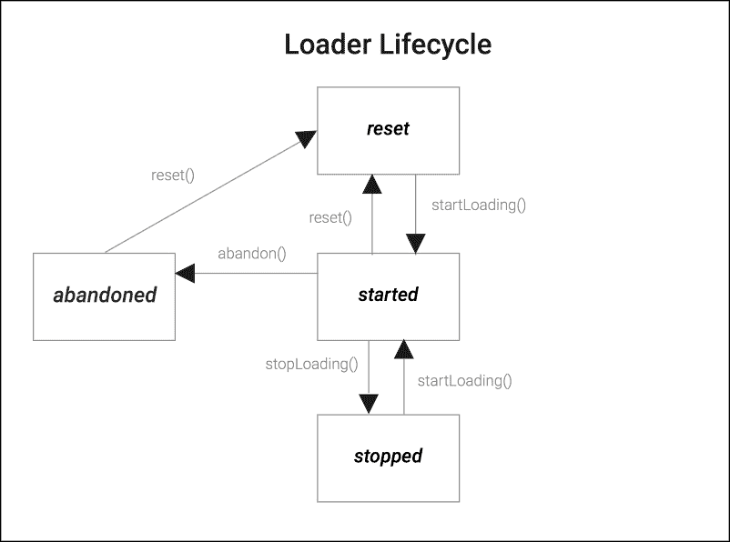
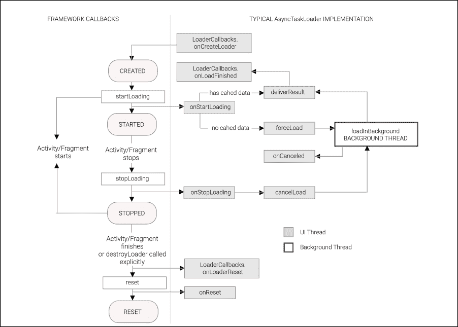

# 第四章：探索 Loader

在上一章中，我们熟悉了最简单和高级的、特定于 Android 的异步构造；即`android.os.AsyncTask`。`AsyncTask`是一个轻量级构造，用于创建后台工作，它提供了一个简单的接口来发布结果并将进度发送到主线程。在本章中，我们将把重点转移到`android.content.Loader`上，这是一个高级的、特定于 Android 的模式，用于通过工作线程异步从内容提供者或数据源加载数据，并具有内容变更能力和组件生命周期意识。

在本章中，我们将涵盖以下主题：

+   介绍 loaders

+   Loader API

+   Loader 生命周期

+   使用 Loader 加载数据

+   使用 AsyncTaskLoader 构建响应式应用

+   使用 CursorLoader 构建响应式应用

+   组合 loaders

+   Loaders 的应用

# 介绍 Loaders

如其名所示，`Loader`的工作是代表应用的其他部分加载数据，并使该数据在相同进程内的活动（Activity）和片段（Fragment）之间可用。Loader 框架被创建出来是为了解决与 Activity 和 Fragment 中异步加载相关的一些问题：

+   **后台处理**：繁重的工作自动在后台线程上执行，并在完成后安全地将结果引入主线程。

+   **结果缓存**：加载的数据可以被缓存，并在重复调用时重新发送以提高速度和效率。

+   **生命周期意识**：该框架让我们能够控制 Loader 实例何时被销毁，并允许 Loader 在`Activity`生命周期之外存活，使得它们的数据可以在整个应用和`Activity`重启之间可用。

+   **数据变更管理**：Loaders 监控其底层数据源，并在必要时在后台重新加载数据。框架包括生命周期回调，允许我们正确地处理 Loader 持有的任何昂贵资源。

## Loader API

`Loader` API 是在 API 级别 11 引入到 Android 平台的，但通过支持库向后兼容。本章中的示例使用支持库针对 API 级别 7 到 23。

框架定义了接口、抽象类和 loader 实现，以创建适用于您应用的 Android 一级数据加载器。

Loaders 能够监控内容并传递新的变更，并且能够在活动过渡或由配置更改触发的替换活动之间存活。此框架提供的 API 类和接口包括：

+   `android.content.Loader<DataType>`：非功能性（抽象）基类，定义了基本方法

+   `android.app.LoaderManager`：管理 Activity 和 Fragment 中的 loader

+   `android.app.LoaderManager.LoaderCallbacks`：用于监听 Loader 事件的回调

+   `android.content.AsyncTaskLoader<DataType>`：执行加载操作的`Loader`子类

+   `android.content.CursorLoader`：用于处理 Android 内部数据库和内容提供者数据源的加载器实现

最后两个类是非抽象子类，我们将在本章的下一节通过示例详细说明。

### Loader

`Loader` 是一个泛型类型类，它本身不实现任何异步行为，并公开一个泛型类型参数：

```java
public class Loader<DataType>
```

`<DataType>` 泛型类型定义了 `Loader` 将要提供的结果类型，并且应该由实现特定领域 `Loader` 的任何子类定义。

当你创建自己的加载器时，`Loader` 有五种方法我们必须实现以创建一个完全功能的加载器：

```java
protected void onStartLoading()
protected void onStopLoading()
protected void onForceLoad()
protected void onReset()
protected void onCancelLoad()
```

`onStartLoading()` 方法是子类必须实现的方法，用于开始加载数据，`onStopLoading()` 是一个用于实现当请求停止加载因为相关联的活动或片段停止时的行为的方法。在此状态下，`Loader` 可能会继续处理，但不应在再次调用 `onStartLoading()` 之前向 `Activity` 提供更新。

`onForceLoad()` 是一个你应该实现的方法，用于忽略之前加载的数据集并加载一个新的数据集，就像清除缓存一样，而 `onReset()` 方法是 LoaderManager 自动调用以释放任何未再次调用的加载器的资源的方法。

`onCancelLoad()` 是在主线程上调用，用于实现调用 `Loader.cancelLoad()` 后取消加载时的行为。

虽然我们可以直接扩展 `Loader`，但更常见的是根据我们的需求使用提供的两个子类之一，`AsyncTaskLoader` 或 `CursorLoader`。

`AsyncTaskLoader` 是一个通用目的的 `Loader`，当我们想要从任何类型的源加载几乎任何类型的数据，并且希望在主线程之外完成时，我们可以从它派生子类。

`CursorLoader` 扩展了 `AsyncTaskLoader`，专门用于高效地从本地数据库获取数据并正确管理相关的数据库 `Cursor`。

### Loader Manager

当我们使用加载器时，我们不会孤立地使用它们，因为它们是小型框架的一部分。加载器是管理对象，由 `LoaderManager` 负责管理，它负责协调加载器生命周期事件与 `Fragment` 和 `Activity` 生命周期，并在整个应用程序中使 `Loader` 实例对客户端代码可用。在 `android.support.v4.content.LoaderManager` 和 `android.app.LoaderManager` 中定义的 `LoaderManager` 抽象类可以通过所有活动和片段的成员函数 `getLoaderManager` 访问：

```java
LoaderManager getLoaderManager()
// android.support.v4
LoaderManager getSupportLoaderManager();
```

LoaderManager 提供了一个 API，客户端（活动或片段）可以使用它来设置、初始化、重新启动和销毁加载器，而无需绑定到客户端生命周期。当你检索客户端管理的 LoaderManager 实例时，Loader Manager 的最相关的方法是：

```java
Loader<D> initLoader(int id, Bundle args,
                     LoaderManager.LoaderCallbacks<D> callback)

Loader<D> restartLoader(int id,Bundle args, 
                        LoaderManager.LoaderCallbacks<D> callback)
Loader<D> getLoader(int id);
void destroyLoader(int id);
```

在 `LoaderManager` 定义的 所有方法中，`id` 参数用于标识客户端上下文中的 Loader，并且还用于所有 `LoaderManager` API 中以触发特定 Loader 的任何操作。

`initLoader` 方法用于初始化特定的 Loader，但如果 `LoaderManager` 中已经存在具有相同 ID 的 Loader，则不会创建新的 Loader。

`restartLoader` 方法启动或重新启动一个 Loader，但如果传入 ID 的 Loader 已经存在，则当它完成工作后，旧 Loader 将被销毁。

`destroyLoader` 方法停止并从 `LoaderManager` 中显式移除由参数 `id` 指定的 `Loader`。

### LoaderManager.LoaderCallbacks

要与 `LoaderManager` 交互，客户端需要实现 `LoaderCallbacks<D>` 接口并接收事件以创建具有给定 ID 的新 `Loader`、接收 Loader 结果或重置 Loader：

```java
Loader<D> onCreateLoader(int id, Bundle args)
void onLoadFinished(Loader<D> loader, D data)
void onLoaderReset(Loader<D> loader)
```

如我们之前详细说明的，`D` 泛型类型指定了 Loader 返回的数据类型，并且当 Loader 的生命周期达到特定状态时，由 LoaderManager 调用这些回调：

+   `onCreateLoader`: 这是一个创建方法，用于为指定的 ID 和给定的 Bundle 对象启动一个 Loader。Bundle 对象用于传递 Loader 创建的参数。当客户端调用 `initLoader` 而且 LoaderManager 中不存在具有该 ID 的 Loader 时，将调用此方法。

+   `onLoadFinished`: 当 Loader 获取到结果时，将调用此方法；回调将使用结果和检索结果的 Loader 引用被调用。当 Loader 检测到请求的数据内容发生变化时，它将报告新的结果，因此此方法可能会被多次调用。此方法通常用于使用加载的数据更新 UI。

+   `onLoaderReset`: 当给定 ID 的 Loader 即将被销毁时，将调用此方法。这是释放与指定 ID 关联的一些资源和引用的最佳位置。

## Loader 生命周期

由 `LoaderManager` 管理的任何 Loader 对象都可以处于六个不同的标志中，这些标志定义了 Loader 的状态：

+   **重置**: 当你创建 `Loaders` 实例时，将设置此标志。如果调用 `reset()` 方法，标志将结束于此。当重置移动到此状态时，将调用 `onReset()`，开发者必须使用此方法释放 Loader 上分配的资源以及重置任何缓存结果。

+   **启动**: 当调用你的 `loader` 的 `startLoading()` 方法时，将设置此标志。在 Loader 进入此状态后，`onStartLoading` 方法会被调用以设置加载资源。如果 Loader 已经提供了结果，你可以调用 `forceLoad()` 来重新启动新的加载。你的 Loader 应该在标志处于开启状态时才提供结果。

+   **停止**：当加载器停止且无法提供新结果或内容更改的交付时，会设置此标志。在此状态下，加载器可以存储结果以在加载器重新启动时交付。为了实现加载器具有此状态时的行为，开发者必须实现 `onStopLoading` 并释放为加载结果分配的所有资源。

+   **废弃**：这是一个可选的中间标志，用于确定 `Loader` 是否被废弃。与其他方法一样，子类必须实现 `onAbandon()` 以在客户端不再对来自加载器的新数据更新感兴趣时实现行为。在此状态下，在重置之前，加载器不得报告任何新的更新，但它可以保留在加载器重新启动时交付的结果。

+   **内容更改**：这是一个用于通知 `Loader` 内容已更改的标志。当检测到 Load 上的内容更改时，会调用 `onContentChanged` 回调。

+   **处理更改**：这是一个用于通知 `Loader` 内容正在处理其内容更改的标志。以下函数 `takeContentChanged()`、`commitContentChanged()` 和 `rollbackContentChanged()` 用于管理数据内容更改及其处理状态。

    图 4.1：Loader 生命周期

# 使用 Loader 加载数据

到目前为止，我们只描述了理论实体和 API 上可用的类，因此现在是时候通过一个简单的示例来展示这些概念了。

在我们的示例中，我们将向您展示如何使用 `LoaderManager`、`LoaderCallback` 和一个 `Loader` 来展示一个列出当前在线用户名称的 `Activity`，适用于聊天应用程序。

首先，我们将创建一个 Activity，它将充当 `LoaderManager` 的客户端，并将有三个按钮，**初始化**、**重启** 和 **销毁**；分别用于初始化加载器、重启加载器和销毁加载器。Activity 将直接接收 `LoaderCallbacks` 回调，因为它实现了该接口作为成员函数：

```java
public class WhoIsOnlineActivity extends FragmentActivity
  implements LoaderCallbacks<List<String>> {
  public static final int WHO_IS_ONLINE_LOADER_ID = 1;

  @Override
  protected void onCreate(Bundle savedInstanceState) {
   ...
    final LoaderManager lm =  getSupportLoaderManager();
    final Bundle bundle =new Bundle();
    bundle.putString("chatRoom", "Developers");
    initButton.setOnClickListener(new View.OnClickListener() {
      @Override
      public void onClick(View v) {
 lm.initLoader(WHO_IS_ONLINE_LOADER_ID, bundle,
 WhoIsOnlineActivity.this);
      }
    });
    restartButton.setOnClickListener(new View.OnClickListener() {
      @Override
      public void onClick(View v) {
 lm.restartLoader(WHO_IS_ONLINE_LOADER_ID, bundle,
 WhoIsOnlineActivity.this);
      }
    });
    destroyButton.setOnClickListener(new View.OnClickListener() {
      @Override
      public void onClick(View v) {
 lm.destroyLoader(WHO_IS_ONLINE_LOADER_ID);
      }
    });
 }
}
```

点击 **初始化** 按钮将使用指定的 ID 和一个包含我们用于传递到 `Loader` 的参数的 bundle 对象初始化 `Loader`，正如之前所说的，**重启** 按钮将销毁一个已存在的加载器并创建一个新的加载器，而 **销毁** 按钮将销毁具有给定 ID 的加载器（如果它已经在 `LoaderManager` 中存在）。这些按钮在这里仅用于帮助我们解释 `LoaderManager` 和 `Loader` 之间的交互和流程。

在这个特定的用例中，我们将加载聊天室开发者的在线用户列表。

现在让我们看看 `LoaderCallback` 函数，并在我们的 `Activity` 上实现该接口。

从 `onCreateLoader` 开始，这个 `LoaderCallback` 回调只有在加载器之前不存在或通过调用 `LoaderManager.restartLoader()` 重新启动加载器时才会被调用。

当我们通过 `LoaderManager` 的 `initLoader` 方法初始化 `WhosOnlineLoader` 时，它将返回具有给定 ID (`LOADER_ID`) 的现有 Loader，或者如果没有具有该 ID 的 `Loader`，它将调用第一个 `LoaderCallbacks` 方法——`onCreateLoader`。

这意味着此方法不会在配置更改时被调用，因为已经有一个具有此 ID 的先前加载器可用并已初始化。

```java
@Override
public Loader<List<String>> onCreateLoader(int id, Bundle args) {
  Loader res = null;
  switch (id) {
    case WHO_IS_ONLINE_LOADER_ID:
      res = new WhosOnlineLoader(this,
                                 args.getString("chatRoom"));
      break;
  }
  return res;
}
```

此方法通过调用 `WhosOnlineLoader` 构造函数并传递我们试图加载的聊天组名称来创建 Loader 实例。

下一个实现的 `LoaderCallback` 函数回调是 `onLoadFinished`；此回调在加载器获得新结果、数据更改或配置更改已存在于 `LoaderManager` 中的 `Loader` 时被调用。

```java
@Override
public void onLoadFinished(Loader<List<String>> loader,
                  List<String> users) {
     switch (loader.getId()) {
       case WHO_IS_ONLINE_LOADER_ID:
      ListView listView = (ListView) findViewById(R.id.list);
      ArrayAdapter<String> adapter = new ArrayAdapter<String>(this,
        android.R.layout.simple_list_item_1,
        android.R.id.text1,
        users);
      listView.setAdapter(adapter);
      break;
    }
  }
```

在我们的例子中，当 `onLoadFinished` 被调用时，我们使用从加载器接收到的用户列表更新 `ListView` 适配器。

`OnLoaderReset`，我们最后的 `LoaderCallback` 函数回调，在加载器被销毁时被调用，在我们的例子中，它只是在其适配器中清理列表视图数据：

```java
@Override
public void onLoaderReset(Loader<List<String>> loader) {
  ...
  ListView listView = (ListView)findViewById(R.id.list);
  listView.setAdapter(null);
}
```

当调用 `LoaderManager.destroyLoader(id)` 或当 `Activity` 被销毁时，将调用加载器重置。如前所述，加载器重置不会销毁加载器，而是告诉加载器不要发布进一步的更新。因此，它可以跨越多个 Activity。

这个蛋糕的最后一块是我们的自定义 Loader，即 `WhosOnlineLoader`，用于检索在线用户列表。我们的 `WhosOnlineLoader` 不会加载任何异步结果，因为 `Loader` 子类不管理用于加载结果的后台线程。因此，这个 Loader 应仅用于示例目的，并解释 `LoaderManager` 和自定义 Loader 的交互特性。

为了调试目的，方法 `onStartLoading`、`onStopLoading`、`onReset` 和 `onForceLoad` 在每次进入函数时都会打印一条日志消息。`deliverResult()`，即向已注册的监听器传递加载结果的 Loader 函数，也会将包含在线用户信息的消息打印到 Android 日志中。

```java
public class WhosOnlineLoader extends Loader<List<String>> {

  private final String mChatRoom;
  private List<String> mResult = null;

  public WhosOnlineLoader(Context context, String chatRoom) {
    super(context);
    this.mChatRoom = chatRoom;
  }
  @Override
  protected void onStartLoading() {
    Log.i("WhoIsOnlineLoader", "onStarting WhoIsOnlineLoader["
          + Integer.toHexString(hashCode()) + "]");
    ...
    forceLoad();   
  }
  // Elided for brevity
  @Override
  public void deliverResult(List<String> data) {
    Log.i("WhoIsOnlineLoader", "DeliverResult WhoIsOnlineLoader["
          + Integer.toHexString(hashCode()) + "]");
    ...
    super.deliverResult(data);   
  }
  @Override
  protected void onReset() {
    Log.i("WhoIsOnlineLoader", "onReset WhoIsOnlineLoader["
          + Integer.toHexString(hashCode()) + "]");
    onStopLoading();
    ...
  }

}
```

故意省略了 `WhosOnlineLoader` 代码的部分内容，尽管 `WhosOnlineLoader` 的源代码可以从 Packt Publishing 网站下载。

### 注意

一切准备就绪后，如果我们启动 Activity，在线用户列表将为空，尽管点击 **初始化** 按钮会导致 `LoaderManager.init` 调用。

由于我们在每个 `Loader` 生命周期开始处有一些跟踪消息，我们可以跟踪加载器回调调用：

```java
I ... LoaderManager.init [1]
I ... LoaderCallbacks.onCreateLoader[1]
I ... Loader.new[ee07113]
I ... Loader.onStarting[ee07113]
I ... Loader.onForceload[ee07113]
I ... Loader.deliverResult[ee07113]
I ... LoaderCallbacks.onLoadFinished[1]
```

如日志输出所示，当我们调用 `LoaderManager.init` 函数并且在此期间调用 `onCreateLoader` 时，将创建一个新的 `Loader` 对象实例，其 `hashCode` 为 `ee07113`。之后，加载器开始运行，并在 `onLoadFinished` 回调中加载结果，传递用户列表。

由于现在具有该 ID 的 `Loader` 已经存在于 `LoaderManager` 中，让我们检查当我们点击 **重启** 按钮时会发生什么：

```java
I ... LoaderManager.restart [1]
I ... LoaderCallbacks.onCreateLoader[1]
I ... Loader.new[fb61f50]
I ... Loader.onStarting[fb61f50]
I ... Loader.onForceload[fb61f50]
I ... Loader.deliverResult[fb61f50]
I ... LoaderCallbacks.onLoadFinished[1]
I ... Loader.onReset[ee07113]
I ... Loader.onStopping[ee07113]

```

由于之前创建了 `Loader ee07113`，它将被停止并重置，并且将创建并启动一个新的加载器实例，就像在 `init` 中做的那样。

现在我们将点击 **销毁** 按钮并检查结果：

```java
I ... LoaderManager.destroy [1]
I ... LoaderCallbacks.onLoaderReset[1]
I ... Loader.onAbandon[fb61f50]
I ... Loader.onReset[fb61f50]
I ... Loader.onStopping[fb61f50]

```

如预期，`LoaderManager.destroy` 被调用，之后调用了 `onAbandon`、`onReset` 和 `onStopping Loader` 成员方法来停止发送结果，释放加载器资源，并停止加载数据。当加载器停止时，我们必须取消任何加载，但它仍然可以监控数据源的变化。

另一个非常重要的情况需要解释的是配置更改。在这种情况下，`LoaderManager` 将继续接收结果并将它们保存在本地缓存中。一旦新的活动变得可见，缓存的结果将通过 `LoaderCallbacks.onLoadFinished` 方法传递。

在没有涉及配置更改的典型 `Activity` 转换中，`LoaderManager` 会自动重置 `Loader`，导致调用加载器停止和重置功能。

既然我们现在已经了解了如何使用 `LoaderManager` 来管理活动中的加载器，现在我们可以集中精力研究如何使用子类 `AsyncTaskLoader` 和 `LoaderCursor` 来创建异步加载器。

# 使用 `AsyncTaskLoader` 构建响应式应用

`AsyncTaskLoader` 是一个使用 `AsyncTasks` 来执行其后台工作的加载器实现，尽管当我们实现自己的子类时，这部分对我们来说是隐藏的。

我们不需要担心 `AsyncTasks`——它们被 `AsyncTaskLoader` 完全隐藏——但根据我们之前关于 `AsyncTask` 的了解，值得注意的是，任务默认情况下是使用 `AsyncTask.executeOnExecutor(AsyncTask.THREAD_POOL_EXECUTOR)` 执行的，以确保在多个加载器使用时具有高度的并发性。

### 注意

兼容包中的 `AsyncTaskLoader` (`android.support.v4.content`) 并不依赖于平台中的公共 `AsyncTask`。相反，兼容包使用一个内部的 `ModernAsyncTask` 实现来避免 Android 的碎片化。`ModernAsyncTask` 会创建名为 `ModernAsyncTask #<N>` 的线程。

在下一节中，我们将使用 `AsyncTaskLoader` 在后台加载货币到比特币的汇率，并在我们的 `BitcoinExchangeRateActivity` 中使用 `LoaderManager` 显示更新的汇率。

将会使用 `onContentChanged()` 加载器方法持续刷新汇率，这个方法在此情况下用于在后台强制进行新的汇率更新。

加载器是泛型类型，因此当我们实现它时，需要指定它将加载的对象类型——在我们的例子中是 `Double`：

```java
public class BitcoinExchangeRateLoader extends
  AsyncTaskLoader<Double> {
  // ...
}
```

Loader 抽象类要求在构造函数中传递一个 Context，因此我们必须将 Context 传递到链中。我们还需要知道要检索哪种货币汇率以及刷新时间间隔，因此我们还将传递一个用于标识货币的字符串和一个表示间隔（毫秒）的整数：

```java
private Double       mExchangeRate = null;
private final long   mRefreshinterval;
private final String mCurrency;

BitcoinExchangeRateLoader(Context ctx,
                          String currency,
                          int refreshinterval) {
  super(ctx);
  this.mRefreshinterval = refreshinterval;
  this.mCurrency = currency;
}
```

我们不需要保留自己的 `Context` 对象引用——`Loader` 提供了一个 `getContext()` 方法，我们可以在类的任何可能需要 Context 的地方调用它。

### 注意

我们可以安全地将 Activity 实例的引用作为 Context 参数传递，但不应期望 `getContext()` 返回相同的对象！Loader 可能比单个 Activity 存活时间更长，因此 Loader 类的父类只保留对应用程序 Context 的引用，这是一个与应用程序关联的 Context，以防止内存泄漏。

我们需要覆盖几个方法，我们将逐个处理。最重要的是 `loadInBackground`——我们的 `AsyncTaskLoader` 的主要工作马，并且是唯一不在主线程上运行的方法：

```java
@Override
public Double loadInBackground() {
  //...
}
```

`AsyncTaskLoader` 是基于 `AsyncTask` 的 Loader 子类。在底层，它在一个 AsyncTask 的后台线程中调用 `loadInBackground` 函数。

我们将从互联网上获取实时比特币汇率，更确切地说，从 blockchain.info 网站上获取，以建立连接的延迟，在设备与远程端点之间传输数据以及由接入网络暴露的一些延迟。由于延迟可以从毫秒到秒不等，这项任务是一个很好的候选任务，可以在主线程之外执行。

下图显示了 `Loader` 的生命周期，显示了由 `LoaderManager` 触发的回调以及典型的 `AsyncTaskLoader` 实现：



由于从网络加载汇率涉及到由于从网络进行阻塞 I/O 读取而导致的延迟，并且远程网站可能还没有足够的资源来发送响应，因此，作为不想生成令人烦恼的 Android ANR 的有意识的开发者，我们必须将这些操作转移到由系统后台线程执行的 `AsyncTaskLoader.loadInBackground` 方法中。

在我们收到包含汇率的响应后，我们需要解码 HTTP 响应中包含的 JSON 响应，因此这也是我们肯定希望在主线程之外执行的操作！

```java
public Double loadInBackground() {
  Double result = null;
  StringBuilder builder = new StringBuilder();
  URL url = new URL("https://blockchain.info/ticker");

  // Create a Connection to the remote Website
  HttpURLConnection conn = (HttpURLConnection)
                           url.openConnection();
  ...
  conn.setRequestMethod("GET");
  conn.setDoInput(true); 
  conn.connect();
  // ! Read the response with the exchange rate to a String
  ...
  // Decode the Response Received by Blockchain Website
  JSONObject obj = new JSONObject(builder.toString());
  result = obj.getJSONObject(mCurrency)
                      .getDouble("last");
  return result;
}
```

在前面的代码中，我们执行了之前建议的阻塞操作，因此我们返回了在 `Loader` 构造中指定的货币的汇率。

我们将想要缓存我们传递的 Double 对象的引用，以便任何未来的调用都可以立即返回相同的 Double。我们将通过覆盖在主线程上调用的 `deliverResult` 方法来实现这一点：

```java
@Override
public void deliverResult(Double result) {
  this.mExchangeRate = result;
  super.deliverResult(result);
}
```

要使我们的`Loader`真正工作，我们仍然需要重写由`Loader`基类定义的一些生命周期方法。最重要的是`onStartLoading`：

```java
@Override
protected void onStartLoading() {

  if (mExchangeRate != null) {
    // If we currently have a result available, deliver it
    // immediately.
    deliverResult(mExchangeRate);
  }
  if (takeContentChanged() || mExchangeRate == null) {
    // If the exchange rate has changed since the last time
    // it was  loaded or is not currently available, start a load.
    forceLoad();
  }
}
```

在这里，我们检查我们的缓存（`mExchangeRate`）以查看我们是否有之前加载的结果，我们可以通过`deliverResult`立即交付。如果内容数据最近已更改，`contentChanged`标志为真，并且我们没有缓存的结果，我们将强制进行后台加载——否则我们的`Loader`将永远不会加载任何内容。如前所述，此回调在主线程上运行，加载将在后台线程上的`loadInBackground()`中触发新的加载。

现在，我们有一个最小的工作`Loader`实现，但如果我们想让`Loader`与框架良好协作，还需要做一些维护工作。

首先，我们需要确保在`Loader`被丢弃时清理汇率。`Loader`提供了一个用于此特定目的的回调——`onReset`。

```java
@Override
protected void onReset() {
  // Ensure the loader is stopped
  onStopLoading();
  mExchangeRate = null; 
}
```

框架将确保在`Loader`被丢弃时调用`onReset`，这将在应用退出或通过`LoaderManager`显式丢弃`Loader`实例时发生。

还有另外两个生命周期方法，如果我们想使我们的应用尽可能响应，则必须正确实现：`onStopLoading`和`onCanceled`（请注意`onCanceled`在这里的拼写与大多数地方的`onCancelled`不同）。

框架将通过调用`onStopLoading`回调来告诉我们它不想浪费周期加载数据。尽管如此，它可能仍然需要我们已加载的数据，并且它可能告诉我们再次开始加载，因此我们不应清理资源。在`AsyncTaskLoader`中，我们希望如果可能的话取消后台工作，所以我们只需调用超类`cancelLoad`方法：

```java
@Override
protected void onStopLoading() {
  // Attempt to cancel the current load task.
  cancelLoad();
}
```

当`Loader`被取消时，我们不会停止当前汇率加载；尽管如此，在其他类型的用例中，我们可能在`loadInBackground()`上有一个取消行为，通过检查`isAbandoned()`成员函数来停止当前加载。

最后，我们需要实现`onCancelled`来清理在取消发出后可能在后台加载的任何数据：

```java
@Override
public void onCanceled(Double data) {
   // For our data there is nothing to release, at this method
   // we should release the resources associated with 'data'.
}
```

根据 Loader 产生的数据类型，我们可能不需要担心清理取消工作的结果——普通的 Java 对象将在它们不再被引用时由垃圾收集器清理。

到目前为止，我们已经实现了异步汇率加载，现在我们必须实现刷新功能，以便持续从 blockchain.info 网站获取值。为了为当前汇率加载新值，我们应该强制加载器再次运行`loadInBackground`并检索当前汇率值。`Loader`抽象类为我们提供了`onContentChanged()`方法，该方法将强制在`Loader`处于启动状态时进行新的加载。

在我们的示例中，一旦使用`startLoading()`启动 Loader，我们必须连续调用`onContentChanged`来模拟值变化并强制重新加载。我们将通过使用 handler 和发布一个简单地调用我们的`Loader`上的`onContentChange`的`Runnable`来实现这一点。

1.  首先，我们将创建`Runnable`并在我们的 Loader 中创建 handler：

    ```java
    public class BitcoinExchangeRateLoader extends
                 AsyncTaskLoader<Double> { 

      private Handler mHandler;

     // Use to force a exchange rate value change
      private final Runnable refreshRunnable = new Runnable() {
        @Override
        public void run() { onContentChanged(); }
      };

      BitcoinExchangeRateLoader(Context ctx,
                                String currency,
                                int refreshinterval) {
        ...
        this.mHandler = new Handler();   
      }
    }
    ```

1.  第二，我们需要提交一个延迟任务来强制下一次重新加载，每次调用`forceLoad()`时。当`Loader`被重置时，我们不提交下一次重新加载：

    ```java
    @Override
    protected void onForceLoad() {
      mHandler.removeCallbacks(refreshRunnable);

      if (!isReset())
        mHandler.postDelayed(refreshRunnable, mRefreshinterval);
    }
    ```

1.  第三，为了在 Loader 被取消并在之后重新启动任务时强制重新加载，`onCanceled()`通过调用`onContentChanged()`来设置`ContentChange`标志：

    ```java
      @Override
        public void onCanceled(Double data) {
           ...
           onContentChanged();
        }
    ```

1.  最后，我们必须在 Loader 停止或取消时取消下一次重新加载：

    ```java
    @Override
    protected void onReset() {
      ...
      mHandler.removeCallbacks(refreshRunnable);
    }
    ```

到目前为止一切顺利——我们有一个`Loader`。现在我们需要将其连接到客户端 Activity 或 Fragment。由于在之前的示例中我们将 Loader 附加到了 Activity 上，这次我们将使用不同的`LoaderManager`客户端并将 Loader 连接到 Fragment 对象。

我们由`BitcoinExchangeRateActivity`加载的`Fragment`将初始化 Loader 并在片段 UI 上显示 Loader 的结果。让我们首先处理这些简单的部分：

```java
public class BitcoinExchangeRateFragment extends Fragment 
implements LoaderManager.LoaderCallbacks<Double> {

  @Override
  public void onActivityCreated(Bundle savedInstanceState) {
    super.onActivityCreated(savedInstanceState);
    LoaderManager lm = getActivity().getSupportLoaderManager();
    Bundle bundle = new Bundle();
    bundle.putString(CURRENNCY_KEY, "EUR");
    bundle.putInt(REFRESH_INTERNAL, 5000);
    lm.initLoader(BITCOIN_EXRATE_LOADER_ID, bundle,
                   BitcoinExchangeRateFragment.this);
  }
  ...
}
```

在前面的代码中，我们主要加载用于在屏幕上显示汇率的 UI 布局，并在`onActivityCreated`成员函数上实现我们的 loader 初始化。`onActivityCreated`成员类回调在活动被创建或配置更改后活动被重新创建时调用。

正如我们在前面的章节中解释的，我们调用`initLoader`，传递一个`int`标识符作为第一个参数，一个包含值`Bundle`的第二个参数来配置我们希望在屏幕上显示的货币汇率，以及`onContextChange`调用之间的刷新率间隔。第三个参数是实现`LoaderCallbacks`的对象，在这种情况下，是我们的`BitcoinExchangeRateFragment`实例，我们在片段上直接实现 loader 回调。

我们在 Fragment 上实现的`onCreateLoader`回调方法与我们在之前的`WhoIsOnlineActivity` Loader 上创建的方法类似，因此它基本上使用传递给`Bundle`对象的参数创建一个新的`BitcoinExchangeRateLoader`实例。

```java
public Loader<Double> onCreateLoader(int id, Bundle args) {
  Loader res = null;
  switch (id) {
  case BITCOIN_EXRATE_LOADER_ID:
    res = new BitcoinExchangeRateLoader(getActivity(),
          args.getString(CURRENNCY_KEY),
          args.getInt(REFRESH_INTERNAL));
    break;
  }
  return res;
}
```

`onLoadFinished`的实现必须获取加载的汇率并在`TextView`中显示：

```java
@Override
public void onLoadFinished(Loader<Double> loader, Double data) {
  switch (loader.getId()) {
  case BITCOIN_EXRATE_LOADER_ID:
    TextView tv  = (TextView) getView().
                   findViewById(R.id.temperature);
    tv.setText(data.toString());
    break;
  }
}
```

为了简洁，我们省略了`LoaderCallbacks.onLoaderReset`，因为该方法体为空。此方法应用于释放与 Loader 生命周期直接绑定的任何资源。

### 小贴士

完整的源代码，包括活动和`android.xml`布局，可在 Packt Publishing 网站上找到。

与`AsyncTask`相比，这里的情况更复杂——我们不得不编写更多的代码并处理更多的类，但回报是数据被缓存以供`Activity`重启使用，并且可以从其他 Fragment 或 Activity 中使用。

在我们的`BitcoinExchangeRateLoader`中，连续的汇率更新由我们的刷新率间隔控制；然而，在其他类型的`AsyncTaskLoaders`中，内容变更发生的速率可能会导致大量的`onLoadFinished`调用，从而可能用 UI 更新主导 UI 线程执行，并降低 UI 响应性。

为了克服这个问题，`AsyncTaskLoader`提供了一个名为`setUpdateThrottle`的成员函数，用于控制连续数据交付之间的最小间隔，从而调整连续`onLoadFinished`调用的间隔：

```java
public void setUpdateThrottle(long delayMS)
```

当你觉得你的 loader 内容变更率可能会超载 UI 并影响应用程序的流畅性时，必须调用此方法。如果你的数据不需要更高的更新频率，开发者可以利用此功能来减少 Loader 内容变更的交付频率。

在下一节中，我们将详细概述 Android SDK 中随盒提供的最后一个 Loader 子类类型，即`CursorLoader`。

# 使用 CursorLoader 构建响应式应用程序

`CursorLoader`是`AsyncTaskLoader`的一个特殊子类，它使用其生命周期方法来正确管理与数据库`Cursor`相关的资源。

数据库中的`Cursor`有点像迭代器，因为它允许你滚动浏览数据集，而无需担心数据集的确切来源或它所属的数据结构。

我们将使用`CursorLoader`查询 Android 设备上可用的音乐专辑列表。因为`CursorLoader`已经实现了正确处理与数据库`Cursor`相关的所有细节，所以我们不需要对其子类化。我们可以简单地实例化它，传递给它需要的信息，以便它为我们管理`Cursor`。我们可以在`onCreateLoader`回调中这样做：

```java
@Override
public Loader<Cursor> onCreateLoader(int id, Bundle args) {
  String[] columns = new String[] {
    MediaStore.Audio.Albums._ID,
    MediaStore.Audio.Albums.ARTIST,
    MediaStore.Audio.Albums.ALBUM
  };
  return new CursorLoader(this, 
    MediaStore.Audio.Albums.EXTERNAL_CONTENT_URI,
    columns, // projection
    null, // selection
    null, // selectionArgs
    null // sortOrder
  );
}
```

正如先前的示例一样，我们将在我们的`Activity`子类中实现回调。我们将使用`GridView`来显示我们的专辑列表，因此我们将实现一个`Adapter`接口来为其单元格提供视图，并将`Adapter`连接到由我们的`Loader`创建的`Cursor`：

```java
public class AlbumListActivitySimple extends FragmentActivity
  implements LoaderCallbacks<Cursor> {

  public static final int ALBUM_LIST_LOADER = "album_list".
                                                 hashCode();
  private SimpleCursorAdapter mAdapter;

  @Override
  protected void onCreate(Bundle savedInstanceState) {
    super.onCreate(savedInstanceState);
    setContentView(R.layout.phone_list_layout);
    GridView grid = (GridView) findViewById(R.id.album_grid);
    mAdapter = new AlbumCursorAdapter(getApplicationContext());
    grid.setAdapter(mAdapter);

    // Prepare the loader. 
    // Either re-connect with an existing one, or start a new one.
    getSupportLoaderManager().
      initLoader(ALBUM_LIST_LOADER,
                 null,
                 AlbumListActivitySimple.this);
  }

  @Override
  public void onLoadFinished(Loader<Cursor> loader, Cursor data) {
    // Swap the new cursor in.  (The framework will take
    //  care of closing the old cursor once we return.)
    mAdapter.changeCursor(data);
  }

  @Override
  public void onLoaderReset(Loader<Cursor> loader) {
    // This is called when the last Cursor provided to
    // onLoadFinished() above is about to be closed. 
    //  We need to make sure we are no longer using it.
    mAdapter.changeCursor(null);
  }
}
```

请看前面代码中加粗的部分。我们创建了一个`AlbumCursorAdapter`，并将其传递给`GridView`，然后初始化我们的`CursorLoader`。当加载完成时，我们将加载的 Cursor 传递给 Adapter，任务就完成了。

需要实现的是`AlbumCursorAdapter`，它将从一个非常简单的类开始。我们的`CursorAdapter`的工作只是将`Cursor`中的数据行映射到单个行`View`中的每个`View`。

Android SDK 提供了非常方便的`SimpleCursorAdapter`类，它正好符合我们的需求；将数据库数据行映射到专辑项视图中。所以现在我们只需继承它，并通过构造函数参数指定每个单元格的布局填充以及映射到该布局中每个`View`的`Cursor`字段：

```java
public static class AlbumCursorAdapter extends SimpleCursorAdapter {
  private static String[] FIELDS = new String[] {
    MediaStore.Audio.Albums.ARTIST,
    MediaStore.Audio.Albums.ALBUM
  };
  private static int[] VIEWS = new int[] {
    R.id.album_artist, R.id.album_name
  };

  public AlbumCursorAdapter(Context context) {
    super(context, R.layout.album_item,
          null, FIELDS, VIEWS, 0);
  }
}
```

布局文件和源代码可在附带的网站上找到。当你运行此`Activity`时，你会看到一个网格列表，其中每个单元格包含每张专辑的艺术作品、专辑艺术家和专辑名称。

滚动到列表的中间位置，然后旋转你的设备，你会注意到 Activity 立即重新启动并立即重新显示网格，而不会丢失位置——这是因为`CursorLoader`在重启中幸存下来，并且仍然持有具有相同行的`Cursor`对象。

从技术上讲，这一切都非常有趣，但看起来并不怎么样。在下一节中，我们将结合我们的两个`Loaders`来实现一个可滚动的网格，显示每张专辑的艺术作品。

# 结合加载器

在前面的章节中，我们开发了一个`CursorLoader`，用于加载系统上所有可用的音乐专辑列表，以及一个`AsynTaskLoader`，它在后台执行阻塞 IO 操作。现在我们将使用我们之前的`CursorLoader`与`AsyncTaskLoader`结合，从专辑 ID 加载缩略图，以创建一个应用，将设备上所有音乐专辑的艺术作品以可滚动的网格形式平铺，所有加载都在后台进行。

多亏了我们的`CursorLoader`，我们已经可以访问需要加载的专辑 ID——我们只显示专辑名称和专辑艺术家——所以我们只需将这些 ID 传递给我们的`AlbumArtworkLoader`，让它为我们异步加载图像。

我们的`AlbumArtworkLoader`可以在构造函数或之后接收专辑 ID，以加载特定`albumId`的图像：

```java
public class AlbumArtworkLoader extends AsyncTaskLoader<Bitmap> {

  private int mAlbumId = -1; // The album Identifier
  Bitmap mData = null;

  public AlbumArtworkLoader(Context context, int albumId) {
    super(context);
    this.mAlbumId = albumId;
  }
```

我们将通过设置一个新的`albumId`来使`AlbumArtworkLoader`加载新的图像而不是当前的图像。由于位图已缓存（`mData`），仅设置新的 ID 是不够的——我们还需要通过使用`Loader.onContentChanged`来触发重新加载：

```java
  public void setAlbumId(int newAlbumId) {

    if (  isDifferentMedia(newAlbumId) || mData == null ) {

      // Album Id change will force the artwork reload
      this.mAlbumId = newAlbumId;
      onContentChanged();     

    } else if (!isDifferentMedia(newAlbumId) ) {
      // we already have the Bitmap for this album
      deliverResult(mData);
    }
  }
```

如前所述，`onContentChanged`是抽象`Loader`超类的一个方法，如果我们的`Loader`当前处于启动状态，它将强制执行后台加载。如果我们当前处于停止状态，将设置一个标志，并在下次`Loader`启动时触发后台加载。无论如何，当后台加载完成后，`onLoadFinished`将触发并带有新数据。

我们需要实现`onStartLoading`方法，以正确处理在调用`onContentChanged`时我们处于`stopped`状态的情况。让我们回顾一下它曾经的样子：

```java
@Override
protected void onStartLoading() {

  if (mData != null) {
    deliverResult(mData);
  }
  if (takeContentChanged() || mData == null) {
    forceLoad();
  }
}
```

`onStartLoading`方法再次立即提供其数据（如果有的话）。

然后它调用 `takeContentChanged` 来查看我们是否需要丢弃缓存的 `Bitmap` 并加载一个新的。如果 `takeContentChanged` 返回 true，我们调用 `forceLoad` 来触发后台加载和重新发送。

现在，我们可以让我们的 `AlbumArtworkLoader` 加载和缓存不同的图像，但单个 `AlbumArtworkLoader` 只能一次加载和缓存一个图像，所以我们需要多个活动实例。

让我们来看看修改 `AlbumCursorAdapter` 的过程，以便为 `GridView` 中的每个单元格初始化一个 `AlbumCursorAdapter`，并使用这些 `Loader` 异步加载专辑艺术作品并显示它们：

```java
public class AlbumCursorAdapter extends CursorAdapter {

    Context ctx;
    private LayoutInflater inf;
    private LoaderManager mgr;
    private List<Integer> ids;
    private int count;

    public AlbumCursorAdapter(Context ctx, LoaderManager mgr) {
        super(ctx.getApplicationContext(), null, true);
        this.ctx = ctx;
        this.mgr = mgr;
        inf = (LayoutInflater) ctx.
                getSystemService(Context.LAYOUT_INFLATER_SERVICE);
        ids = new ArrayList<Integer>();
    }

    @Override
    public View newView(Context context, Cursor cursor, ViewGroup parent) {
      ..
    }

    @Override
    public void bindView(View view, Context context, Cursor cursor) {
      ...
    }
```

我们有两种实现方法——`newView` 和 `bindView`。`GridView` 将会调用 `newView` 直到它有足够的 View 对象来填充所有可见的单元格，然后它将回收这些相同的 View 对象，通过将它们传递给 `bindView` 来为不同的单元格异步加载数据，随着网格的滚动。当一个视图滚动出视野时，它就变得可以重新绑定。

这对我们来说意味着我们有一个方便的方法来初始化我们的 `AlbumArtworkLoaders`——`newView`，还有一个方便的方法来重新分配 `Loader` 以加载一个新的缩略图——`bindView`。

`newView` 首先为行填充专辑项布局并将其传递给父视图，一个基于适配器类 `hashcode()` 方法生成的 ID 和基于当前加载器数量的唯一 ID。

之后，唯一的 ID 和 `imageView` 被传递给一个 `ArtworkLoaderCallbacks` 类，我们稍后会遇到它。`ArtworkLoaderCallbacks` 然后用于初始化一个新的 `Loader`，它共享父 View 的 ID。这样我们就在网格中的每一行初始化了一个新的 `Loader`：

```java
@Override
public View newView(Context context, Cursor cursor,
                    ViewGroup parent) {

  View view = (View) inf.inflate(R.layout.album_item,
                                 parent, false);
  ImageView imageView = (ImageView) view.
                                    findViewById(R.id.album_art);
        ...
  int viewId = AlbumCursorAdapter.class.hashCode() + count++;
  view.setId(viewId);
  mgr.initLoader(viewId, null,
                 new ArtworkLoaderCallbacks(ctx, imageView));
  ids.add(viewId);
  return view;
}
```

在 `bindView` 中，我们正在回收每个现有的 `View` 以更新显示的图像、专辑名称和专辑艺术家。所以我们首先清除旧的 `Bitmap`。

接下来，我们通过 ID 查找正确的 `Loader`，从 `Cursor` 中提取下一个要加载的图像的 ID，并通过将 ID 传递给 `AlbumArtworkLoader` 的方法——`setAlbumId` 来加载它：

```java
@Override
public void bindView(View view, Context context, Cursor cursor) {
  ImageView imageView = (ImageView) view.
                           findViewById(R.id.album_art);
  imageView.setImageBitmap(null);

  Loader<?> loader = mgr.getLoader(view.getId());
  AlbumArtworkLoader artworkLoader = (AlbumArtworkLoader) loader;
  int albumId = cursor.getInt(
     cursor.getColumnIndex(MediaStore.Audio.Albums._ID));
  ...
  // Sets the album id bound to this imageView,
  // this could force the loader to retrieve a new image
  artworkLoader.setAlbumId(albumId);

}
```

我们需要向我们的 `Adapter` 添加一个额外的方法，以便在我们不再需要它们时清理 `AlbumArtworkLoaders`。当我们不再需要这些 `Loaders` 时——例如，当我们的 `Activity` 正在结束时——我们将自己调用这些方法：

```java
 public void destroyLoaders() {
   for (Integer id : ids) {
     mgr.destroyLoader(id);
   }
 }
```

那就是我们的完成后的 `Adapter`。接下来，让我们看看 `ArtworkLoaderCallbacks`，正如你可能猜到的，它只是 `LoaderCallbacks` 的一个实现：

```java
public static class ArtworkLoaderCallbacks implements
  LoaderManager.LoaderCallbacks<Bitmap> {

  private Context context;
  private ImageView image;

  public ArtworkLoaderCallbacks(Context context,
                                ImageView image) {
    this.context = context.getApplicationContext();
    this.image = image;
  }

  @Override
  public Loader<Bitmap> onCreateLoader(int i, Bundle bundle) {
    return new AlbumArtworkLoader(context);
  }

  @Override
  public void onLoadFinished(Loader<Bitmap> loader, Bitmap b) {
    image.setImageBitmap(b);
  }

  @Override
  public void onLoaderReset(Loader<Bitmap> loader) {}
}
```

`ArtworkLoaderCallbacks` 唯一有趣的事情是创建一个 `AlbumArtworkLoader` 的实例，并将加载的 Bitmap 设置到其 `ImageView` 中。

我们的 `Activity` 几乎没有变化——我们需要在实例化 `AlbumCursorAdapter` 时传递一个额外的参数，为了避免泄漏它创建的 `Loaders`，我们需要在 `onPause` 或 `onStop` 中调用 `AlbumCursorAdapter` 的 `destroyLoaders` 方法，如果 `Activity` 正在结束时：

```java
@Override
protected void onStop() {
  super.onStop();
  if (isFinishing()) {
    // Destroy the main album list Loader
    getSupportLoaderManager().destroyLoader(ALBUM_LIST_LOADER);
    // Destroy album artwork loaders
    mAdapter.destroyLoaders();
  }
}
```

完整的源代码可在 Packt Publishing 网站上找到。查看完整的源代码，以欣赏实际上有多么简洁，并在设备上运行它，以了解`Loaders`只需相对较少的努力就能提供多少功能！

# `Loader`的应用

显而易见的用途包括从设备本地的文件或数据库中读取任何类型的数据，或者从 Android 内容提供者中读取，正如我们在本章的示例中所做的那样。

与直接使用`AsyncTask`相比，`Loaders`的一个显著优势是它们的生命周期在`Activity`和`Fragment`生命周期方面非常灵活。我们无需额外努力就能处理配置更改，例如方向变化。

我们甚至可以在一个`Activity`中开始加载数据，在应用中导航，并在一个完全独立的`Activity`中收集结果，如果这对我们的应用有意义的话。

在某些方面，这种从`Activity`生命周期中解耦使得`Loader`比`AsyncTask`更适合执行网络传输，如 HTTP 下载；然而，它们需要更多的代码，并且仍然不是完美的选择。

该框架在管理异步数据加载方面非常强大；然而，它不提供显示加载进度的机制，正如我们在`AsyncTask`框架中所做的那样，也没有错误处理回调函数来管理加载错误或异常。

为了克服这些问题，开发者必须扩展基本的`Loader`框架类并实现这些模式以匹配他的需求。

# 概述

Android 中的`Loader`框架在使后台加载数据变得容易并将数据在准备好时传递到主线程方面做得非常出色。

在本章中，我们学习了所有`Loader`的基本特征——后台加载、加载数据的缓存以及管理生命周期。

我们详细探讨了`AsyncTaskLoader`作为执行任意后台加载的手段，以及`CursorLoader`用于从本地数据库游标异步加载。

我们看到`Loader`可以让我们摆脱`Activity`生命周期强加的一些限制，并利用这一点在`Activity`重启时继续在后台工作。

在下一章中，我们将完全摆脱`Activity`生命周期的限制，并使用`Service`执行后台操作，即使我们的应用不再处于前台。
