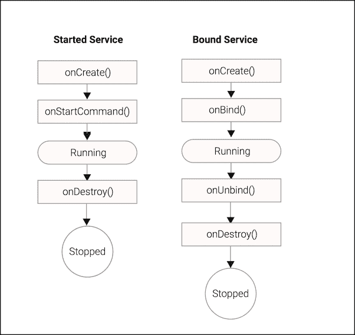
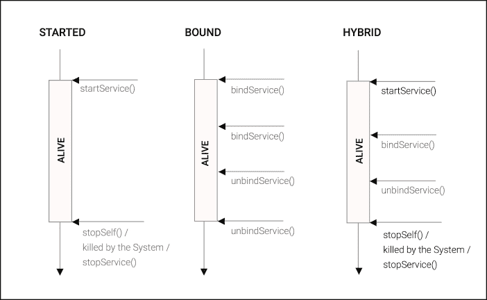
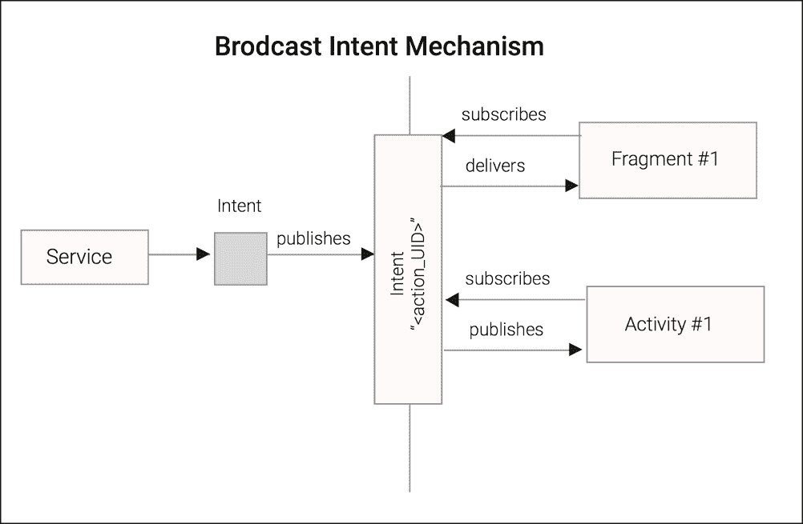

# 第五章。与服务交互

在前面的章节中，我们关注了基本的、高级的、Android 特定的结构，用于在独立的执行线（后台线程）上异步加载数据；`android.os.AsyncTask`和`android.content.Loader`。

如果我们想要提供一个通用的操作集，这些操作在集中化的单一实体上实现任何类型的业务逻辑，该实体可以被不同的客户端重用，并且其生命周期不绑定到客户端生命周期，那会怎样？在 Android 中，我们指的是任何类型的 UI 实体，如`Activity`或`Fragment`对象、`BroadcastReceiver`或任何想要执行业务逻辑的对象。

Android 中这种模式的解决方案以`android.app.Service`的形式提供。

在 Android 中，Service 编程模式，在企业架构中广为人知，并不一定意味着后台工作，因此为了避免任何类型的 UI 响应性下降，我们应该尽量保持 Service 的主线程执行尽可能简洁。

因此，我们必须使用异步技术来协调主线程和其他线程之间的`Service`工作，这些线程有助于实现`Service`目标，以保持响应性在相当不错的水平并提供结果给 Service 请求。

在本章中，我们将涵盖以下主题：

+   介绍 Service

+   启动服务

+   使用 IntentService 构建响应式应用

+   使用待定意图发布结果

+   在通知抽屉中报告进度

+   IntentService 的应用

+   绑定服务

+   与本地服务通信

+   使用意图广播结果

+   服务应用

# 介绍 Service

如前所述，Android 中的`Service`是一个没有用户界面、可以用来执行应用在执行期间所需的任何类型业务逻辑的实体。

如果可见应用的基本单元是`Activity`，那么非可见组件的等效单元是`Service`。就像活动一样，服务必须在 AndroidManifest 文件中声明，以便系统了解它们并为我们管理它们：

```java
<service android:name=".MyService"/>
```

Service 具有与 Activity 类似的生命周期回调方法，这些方法始终在应用程序的主线程上调用。以下是用户在通过扩展 Service 基类创建服务时必须定义的最重要回调：

```java
void onCreate();
void onDestroy()
void onStartCommand(Intent intent, int flags, int startId)  
IBinder onBind(Intent intent)   
boolean onUnbind(Intent intent)
```

`onCreate()`是在服务创建时调用的生命周期回调，可能用于分配 Service 资源。

`onDestroy()`是在服务即将被销毁时调用的生命周期回调，可能用于释放 Service 资源。

`onStartCommand()`是在使用`startService()`命令显式启动已启动的服务时调用的生命周期回调。

`onBind()`是在服务绑定到 Service 客户端时调用的生命周期回调，即`bindService()`。

当服务从客户端取消绑定时，会调用`onUnbind()`回调 - `unbindService()`：



此外，就像`Activity`一样，`Service`不会自动涉及单独的后台线程或进程，因此，在`Service`回调方法中执行密集型或阻塞操作可能会导致令人烦恼的 ANR 对话框。

然而，服务与活动不同，以下列出了这些不同之处：

+   服务不提供用户界面。

+   在一个应用程序中可以同时存在多个活动服务。

+   即使托管它的应用程序不是当前的前台应用程序，服务也可以保持活动状态，这意味着可以有多个应用程序的服务同时处于活动状态。

+   因为系统知道进程内运行的服务，它可以避免在绝对必要时杀死这些进程，从而允许后台工作继续。服务比非活动或不可见活动具有更高的优先级。

根据客户端如何与之交互，Android 中的服务可以根据以下形式进行分类：

+   **已启动服务**：这是一种在系统上的任何对象调用`startService()`时明确启动的服务，它将一直运行，直到通过调用`stopSelf()`或通过`stopService()`显式销毁它而停止。

+   **绑定服务**：这是一种在第一个客户端绑定到它时启动的服务，并且它将一直运行，直到所有客户端连接。服务客户端通过调用`bindService()`附加到服务，当所有客户端取消绑定并调用`unbindService()`时，服务将被销毁。

+   **混合服务**：当系统上的对象调用`startService()`时启动此服务，在其生命周期内可能连接到它的一些客户端，通过调用`bindService()`。就像已启动的服务一样，它无限期地运行，直到服务停止，自行停止或被系统杀死。

服务也可以根据其边界进行分类，以下列出了这些形式：

+   **本地服务**（**LS**）：服务与其他 Android 组件在同一个进程中运行，因此可以使用共享内存来在客户端和服务器之间发送 Java 对象。

+   **内部远程服务**（**IRS**）：服务在单独的进程中运行，但它只能由定义它的应用程序的组件使用。要访问它，需要使用 IPC 技术（信使或 AIDL）与远程进程交互。

+   **全局服务**（**GS**）：服务在单独的进程中运行，并且可以被其他应用程序访问。例如，使用 IRS，客户端必须使用 IPC 通信技术来访问它。

# 已启动服务

如前所述，启动的服务是在任何实体调用 `Context` 方法的 `startService()` 时启动的，这些实体可以访问上下文对象或本身就是上下文，例如 Activity：

```java
         ComponentName startService(Intent service)
```

### 注意

意图（Intent）是一个可以携带数据（动作、类别、额外信息等）的消息对象，你可以用它来请求另一个 Android 组件执行动作。

`startService()` 函数基本上是使用意图启动一个服务，并返回给用户一个组件名称，该名称可用于验证是否正确解析并调用了服务。

为了简化服务解析，我们传递一个由当前上下文和需要启动的服务类创建的意图：

```java
     startService(new Intent(this,MyStartedService.class));
```

当系统接收到第一个 `startService(intent)` 请求时，它会通过调用 `onCreate()` 来构建服务，并将第一个 `startService` 和随后的意图转发到 `onStartCommand` 函数进行处理，按照 `startService` 调用的顺序：

```java
  int onStartCommand(Intent intent, int flags, int startId)
```

`onStartCommand` 应返回一个 `int` 值，该值定义了系统在杀死服务以释放资源时应用的 Service 重新启动行为。如前所述，系统维护一个按等级排序的 Android 运行实体列表，一旦可用系统资源低，它将首先销毁等级较低的实体以释放资源。

最常见的重新启动 `int` 值由以下服务静态字段定义：

+   `START_STICKY`：如果服务进程被系统终止，服务将被重新启动，并且不会将已处理的意图发送到 `onStartCommand` 函数。当没有待处理的启动意图要发送时，将一个空意图传递给 `onStartCommand` 函数。如果启动请求在系统杀死服务之前没有返回，则将启动请求再次提交到重新启动的服务，并在 `onStartCommand` 的第二个参数上传递 `START_FLAG_RETRY`。

+   `START_NOT_STICKY`：如果服务被系统终止，服务只有在至少有一个待处理的启动请求要发送时才会重新启动。

+   `START_REDELIVER_INTENT`：如果服务被系统终止，服务将被重新启动，并重新发送最后发送的启动意图和任何挂起的请求。这种服务类似于 `START_STICKY`，但不是在启动命令中发送一个空意图，而是发送最后成功发送的意图。当启动请求被重新发送时，`onStartCommand` 的第二个参数会传递 `START_FLAG_REDELIVERY` 标志。

在主 `Thread` 上执行的 `onStartCommand` 是服务的入口点，因此在你需要在 `Service` 上执行长时间运行的操作时，将操作卸载到后台线程是强制性的，以保持应用程序的响应性在可忍受的水平。

在下一个代码片段中，我们将创建一个基本的`Service`，将`Intent`处理卸载到后台线程。`SaveMyLocationService`服务子类将接收一个字符串形式的地址位置，并在可能占用 CPU 长时间的操作中消耗它。首先，我们将创建一个后台线程，该线程将从队列中检索位置并消耗它们，直到它收到停止信号：

```java
public class SaveMyLocationService extends Service {
  boolean shouldStop = false;
  Queue<String> jobs = new LinkedList<String>();

  Thread thread = new Thread() {
    @Override
    public void run() {
      while (!shouldStop) {
        String location = takeLocation();
        if (location != null) {
          consumeLocation(location);
        }
      }
    }
  };

  @Override
  public void onCreate() {
    super.onCreate();
    thread.start();
}

String takeLocation() {
  String location = null;
  synchronized (jobs) {
    if (jobs.isEmpty()) {
      try {
       jobs.wait();
      } catch (InterruptedException e) {
       Thread.currentThread().interrupt();
       return null;
      }
     }
     location = jobs.poll();
    }
    return location;
  }
void consumeLocation(String location) {...}
}
```

在前面的代码中，我们基本上构建了异步处理的基础。当在主`Thread`上调用服务的`onCreate()`回调时启动的单个线程，将监控作业队列以查找新的位置请求。线程将高效地在后台等待，使用 Java 监视器，直到它通过`notify()`被通知有新的位置提交。

当我们的后台线程在队列中找到新的位置时，等待在 Java 监视器上的`takeLocation()`返回，并将新的请求转发到`consumeLocation()`以执行请求的业务逻辑。作业将按插入顺序顺序处理。

一旦将`shouldStop`设置为 true，`run()`函数将返回，线程将被终止。

我们需要在 AndroidManifest 文件中注册服务，使用以下`<service>`元素：

```java
   <service android:name=".chapter5.SaveMyLocationService"/>
```

在下一步中，我们将实现`onStartCommand`，该函数将首先接收来自系统的请求并将其转发到我们的线程以在后台进行处理：

```java
@Override
public int onStartCommand(Intent intent, int flags, int startId) {
  super.onStartCommand(intent, flags, startId);
  String location = intent.getStringExtra(LOCATION_KEY);
  synchronized (jobs) {
    jobs.add(location);
    jobs.notify();
  }
  return START_STICKY;
    }
```

在`onStartCommand`中，我们从系统接收了 intent 对象和 Intent 附加信息中传递的字符串形式的地址。接下来，我们将其推送到我们的作业队列中，该队列用于按顺序存储作业。稍后，我们返回`START_STICKY`标志，这意味着我们希望在系统关闭我们的应用程序和传递挂起的 intent 后，系统关闭系统以释放资源时重新启动服务。

最后，我们必须实现回调函数以停止我们的后台处理基础设施。当系统强制服务终止或任何组件发送`stop`命令时，将调用此函数：

```java
@Override
public void onDestroy() { 
  super.onDestroy();
  synchronized (jobs) {
    shouldStop = true;
    jobs.notify();
  }
}
```

在`onDestroy()`函数中，我们主要要求我们的线程终止，将`shouldStop`设置为 true，并通过通知线程完成`run()`函数。如果你在`onCreate()`函数中分配了对象，则应使用此回调来释放在服务生命周期中创建的任何资源。

现在，我们将创建一个简单的 Activity，该 Activity 能够启动服务并停止服务：

```java
public class SaveMyLocationActivity extends Activity {

  ...

  void onStartServiceClick() {
    Intent intent = new Intent(this, SaveMyLocationService.class);
    intent.putExtra(SaveMyLocationService.LOCATION_KEY,
                    getCurrentLocation());
    startService(intent);
  }

  void onStopServiceClick() {
    Intent intent = new Intent(this,SaveMyLocationService.class);
    stopService(intent);
  }
}
```

在我们的 Activity 中，我们创建了一个启动按钮，该按钮调用`onStartServiceClick()`，以及一个停止按钮，该按钮调用`onStopServiceClick()`，但为了简洁，我们省略了代码。

一旦点击**开始**按钮，我们的 Activity 将通过调用`startService()`将一个新的保存位置请求提交给我们的服务，其中当前位置是通过`getCurrentLocation()`函数检索的。

点击**停止**按钮将导致`stopService()`，这会向我们的服务发送停止请求，导致我们的服务调用`onDestroy()`。

必须提到的是，如果服务被停止和重复启动，将会创建一个新的线程来替换旧的线程。如前所述，线程创建是一个昂贵的操作，因此为了减少线程创建的负担，开发者应该让服务尽可能长时间地运行。

我们的自定义服务能够很好地异步处理`onStartCommand()`，但在下一节中，我们将关注`IntentService`类，这是 Android SDK 中的一个特殊用途的`Service`子类，它使得实现任务队列以在单个后台线程上处理工作变得非常容易。

## 使用 IntentService 构建响应式应用

`IntentService`类是一个特殊的`Service`子类，它使用单个`HandlerThread`实现后台工作队列。当工作被提交给`IntentService`时，它将在单个`HandlerThread`上排队等待处理，并在`onHandleIntent`函数中按提交顺序处理。

```java
abstract void onHandleIntent(Intent intent);
```

如果用户在队列中的工作完全处理之前退出应用程序，`IntentService`将继续在后台工作。当`IntentService`的队列中没有更多工作可处理时，它将自行停止以避免消耗不必要的资源。

### 注意

如果系统确实需要（为了回收足够的内存来运行当前的前台进程），它仍然可以杀死具有活动`IntentService`的后台应用程序，但它将首先杀死优先级较低的进程，例如，没有活动服务的其他非前台应用程序。

`IntentService`类的名称来源于我们通过调用带有 Intent 的`startService`来提交工作给它的方式：

```java
startService(new Intent(context, MyIntentService.class));
```

正如我们在先前的示例中所做的那样，我们可以像我们喜欢的那样多次调用`startService`，这将启动`IntentService`（如果它尚未运行），或者如果已经有一个正在运行的实例，则简单地将其工作入队。

如果我们想要向`Service`传递一些数据，我们可以通过提供数据 URI 或通过 Intent 提供额外的数据字段来实现：

```java
Intent intent = new Intent(context, MyIntentService.class);
intent.setData(uri); intent.putExtra("param", "some value");
startService(intent);
```

我们可以通过扩展`android.app.IntentService`并实现抽象的`onHandleIntent`方法来创建`IntentService`的子类。

我们必须使用一个名称来调用单参数构造函数，为它的后台线程命名（命名线程使得调试和性能分析变得容易得多）。

```java
public class MyIntentService extends IntentService {

  public MyIntentService() {
    super("myIntentService");
  }
  protected void onHandleIntent(Intent intent) {
    // executes on the background HandlerThread.
  }
}
```

我们需要在 AndroidManifest 文件中注册`IntentService`，使用以下方式使用`<service>`元素：

```java
   <service android:name=".chapter5.MyIntentService"/>
```

如果我们希望我们的`IntentService`只被我们自己的应用程序的组件使用，我们可以通过一个额外的属性来指定它不是公开的：

```java
   <service android:name=".chapter5.MyIntentService"
            android:exported="false"/>
```

让我们从实现一个用于从特定手机号码检索收件箱中短信数量的 `IntentService` 开始：

```java
public class CountMsgsIntentService extends IntentService {

public static final String NUMBER_KEY = "number";

public CountMsgsIntentService() {
    super("CountThread");
  }

@Override
protected void onHandleIntent(Intent intent) {
  String phoneNumber = intent.getStringExtra(NUMBER_KEY);
  Cursor cursor = getMsgsFrom(phoneNumber);
  int numberOfMsgs = cursor.getCount();
    // Return will be adressed later
    ...
  }
  // Retrieve the number of messages in the inbox for a
  // specific number
  private Cursor getMsgsFrom(String phoneNumber) {
    String[] select = {
      Telephony.Sms._ID,
      Telephony.Sms.ADDRESS,
      Telephony.Sms.BODY,
    };
  String whereClause =
    Telephony.Sms.ADDRESS + " = '" + phoneNumber + "'";
    Uri quri = Uri.parse("content://sms/inbox");
    return getContentResolver().query(
        quri,
        select, // Columns to select
        whereClause, // Clause to filter results
        null, // Arguments for the whereClause
        null);
  }
}
```

一旦在 `IntentService` 上收到请求，该请求就会被推送到内部 `Looper` 队列，一旦有机会处理它，`IntenService` 就会调用 `onHandleIntent` 方法，该方法带有我们在 `startService()` 方法中传递的 Intent。

接下来，我们使用接收到的 `phoneNumber` 查询短信收件箱内容提供者，然后统计检索到的记录数。

注意，我们正在声明一个公共静态常量名称作为参数，只是为了使任何想要调用服务的客户端 `Activity` 能够轻松地使用正确的名称。

我们现在可以按以下方式调用此 `IntentService`：

```java
void triggerIntentService(String phone) {
    Intent intent = new Intent(this,
                               CountMsgsIntentService.class);
    intent.putExtra(CountMsgsIntentService.NUMBER_KEY, phone);
    startService(intent);
}
```

上述代码接收 `phoneNumber` 作为参数，并向 `IntentService` 提交一个新的启动请求，以便按提交顺序顺序处理。

到目前为止一切顺利，但你可能已经注意到我们没有对检索到的结果做任何事情。在下一节中，我们将探讨一些从服务向活动或片段发送结果的方法。

## 处理结果

任何 `Service`（包括 `IntentService` 的子类）都可以用来启动后台工作，而原始的 `Fragment` 或 `Activity` 不期望得到响应。

然而，通常需要返回结果或将后台工作的结果显示给用户。我们为此有几种选择：

+   从原始 `Activity` 向 `Service` 发送 `PendingIntent`，允许 `Service` 通过其 `onActivityResult` 方法回调到 `Activity`。

+   发布系统通知，让用户知道后台工作已完成，即使应用程序不再处于前台。

+   使用 `Messenger` 向原始 `Activity` 中的 `Handler` 发送消息。

+   以 `Intent` 的形式广播结果，允许任何 `Fragment` 或 `Activity`（包括原始调用者）接收后台处理的结果。

我们将在稍后学习 `BroadcastReceiver` 和使用 `Service` 的长时间运行任务，但现在我们将使用 `PendingIntent` 返回结果，并通过系统通知提醒用户。

## 使用 `PendingIntent` 发布结果。

当我们调用 `IntentService` 时，它并没有自动有任何方式来响应调用 `Activity`；因此，如果 `Activity` 想要接收结果，它必须为 `IntentService` 提供一些回复的方式。

毫无疑问，最简单的方法是使用 `PendingIntent`，这对于任何使用过 `startActivityForResult` 和 `onActivityResult` 方法的 Android 开发者来说都很熟悉，因为模式本质上是一样的。

### 备注

`PendingIntent` 是你提供给外部应用程序组件（服务、广播接收器或其他应用程序）的令牌，它允许外部实体使用你的应用程序的权限来执行预定义的代码。

首先，我们将在`CountMsgsIntentService`中添加一些静态成员，以确保我们在它和调用`Activity`之间使用一致的价值：

```java
    public static final String PENDING_RESULT = "pending_result";
    public static final String RESULT = "result";
    public static final int RESULT_CODE = "countMsgs".hashCode();
```

我们还需要在我们的`Activity`中定义一个用于`REQUEST_CODE`常量的静态成员，我们可以使用它来正确地识别返回给我们的`onActivityResult`方法的结果：

```java
private static final int REQUEST_CODE = 0;
```

现在，当我们想要从我们的`Activity`调用`CountMsgsIntentService`时，我们将为当前的`Activity`创建一个`PendingIntent`，它将作为回调来调用 Activity 的`onActivityResult`方法。

我们可以使用`Activity`的`createPendingResult`方法创建一个`PendingIntent`，它接受三个参数：一个`int`结果代码，一个用作默认结果的 Intent，以及一个`int`，它编码了一些用于如何使用`PendingIntent`的标志（例如，是否可以多次使用）：

```java
 PendingIntent pending = createPendingResult(REQUEST_CODE,
                                             new Intent(), 0);
```

我们通过将`PendingIntent`添加为我们启动`IntentService`的 Intent 的额外内容来将其传递给`IntentService`：

```java
private void triggerIntentService(String phone) {
    PendingIntent pending = createPendingResult(
                              REQUEST_CODE, new Intent(), 0);
    Intent intent = new Intent(this,CountMsgsIntentService.class);
    intent.putExtra(CountMsgsIntentService.NUMBER_KEY, phone);
    intent.putExtra(CountMsgsIntentService.PENDING_RESULT, 
                   pending);
    startService(intent);
}
```

为了处理在调用此`PendingIntent`时返回的结果，我们需要在`Activity`中实现`onActivityResult`，并检查结果代码：

```java
protected void onActivityResult(int req, int res, Intent data) {

    if (req == REQUEST_CODE &&
        res == CountMsgsIntentService.RESULT_CODE) {

     // Retrieve the count from result Intent
      int result = data.getIntExtra(
                  CountMsgsIntentService.RESULT, -1);

     // Update UI View with the result
       TextView msgCountBut = (TextView) findViewById(
                               R.id.msgCountTv);
  msgCountBut.setText(Integer.toString(result));
    }
    super.onActivityResult(req, res, data);
}
```

`IntentService`现在可以通过调用适当的请求代码的`PendingIntent`发送方法之一来回复调用`Activity`。我们的更新后的`onHandleIntent`方法如下所示：

```java
@Override
protected void onHandleIntent(Intent intent) {

  String phoneNumber = intent.getStringExtra(NUMBER_KEY);
  Cursor cursor = countMsgsFrom(phoneNumber);
  int numberOfMsgs = cursor.getCount();

  try {
 Intent result = new Intent();
 result.putExtra(RESULT, numberOfMsgs);
 PendingIntent reply = intent.getParcelableExtra(
                           PENDING_RESULT);
    reply.send(this, RESULT_CODE, result);
  } catch (PendingIntent.CanceledException exc) {
 Log.e("CountMsgsIntentService", "reply cancelled", exc);
  }
}
```

附加的代码创建了一个新的 Intent 对象，并用从游标中检索到的计数结果填充它，然后使用接收到的`PendingIntent`将结果发送回调用`Activity`。此外，我们还处理了`CanceledException`，以防调用`Activity`决定不再对结果感兴趣并取消了`PendingIntent`。

这就是全部内容——当`IntentService`完成其工作后，我们的`Activity`将通过其`onActivityResult`方法被调用。作为额外的好处，即使`Activity`已经重新启动，例如由于设备旋转等配置更改，我们也会收到结果。

如果用户在后台工作正在进行时离开了`Activity`（甚至离开了应用程序），会怎样呢？在下一节中，我们将使用通知来提供反馈，而不会打断用户的当前上下文。

## 发布结果作为系统通知

系统通知最初在通知区域以图标的形式出现，通常在设备屏幕的顶部。一旦通知，用户就可以打开通知抽屉来查看更多详细信息。

通知是通知用户服务结果或状态更新的理想方式，尤其是当操作可能需要很长时间才能完成，并且用户在此期间可能在做其他事情时。

让我们将消息计数器的结果作为通知发布，消息中包含用户打开通知抽屉时可以阅读的结果。我们将使用支持库来确保广泛的 API 级别兼容性，并在`CountMsgsIntentService`中添加一个方法，如下所示：

```java
private void notifyUser(String phoneNumber, int msgsCount) {

  String msg = String.format(
    "Found %d from the phone number %s", msgsCount, phoneNumber);

  NotificationCompat.Builder builder =
    new NotificationCompat.Builder(this)
      .setSmallIcon(R.drawable.ic_sms_counter_not)
      .setContentTitle("Inbox Counter")
      .setContentText(msg);

  // Gets an instance of the NotificationManager service
  NotificationManager nm = (NotificationManager) getSystemService(
                             Context.NOTIFICATION_SERVICE);
  // Sets an unique ID for this notification
  nm.notify(phoneNumber.hashCode(), builder.build());
}
```

每个通知都有一个标识符，我们可以用它来控制是否发布新的通知或重用现有通知。标识符是一个 `int`，是 `notify` 方法的第一个参数。由于我们的 `countMsgsFrom` 值是一个 `int`，并且我们希望能够发布多个通知，因此使用 `phoneNumber` 作为我们通知的 ID 是有意义的，这样每个不同的请求都可以产生其自己的单独通知。

要发布包含我们的服务请求结果的提示，我们只需更新 `onHandleIntent` 以调用 `notifyUser` 方法：

```java
@Override
protected void onHandleIntent(Intent intent) {

  String phoneNumber = intent.getStringExtra(NUMBER_KEY);
  Cursor cursor = countMsgsFrom(phoneNumber);
  int numberOfMsgs = cursor.getCount();
  notifyUser(phoneNumber,numberOfMsgs);
  ...
}
```

现在我们已经学习了使用 `IntentService` 的基础知识，让我们考虑一些实际应用。

## IntentService 的应用

`IntentService` 的理想应用包括几乎所有长时间运行的任务，其中工作并不特别依赖于 `Fragment` 或 `Activity` 的行为，尤其是当任务必须完成其处理，无论用户是否退出应用程序时。

然而，`IntentService` 只适合于只需要一个工作线程来处理工作负载的情况，因为其工作是由一个 `HandlerThread` 按提交顺序顺序处理的，并且我们不能启动同一 `IntentService` 子类的多个实例。

一个非常适合使用 `IntentService` 的用例是单次执行、长时间运行的任务，这些任务可以在后台处理而无需用户干预：

+   将数据上传到远程服务器

+   数据库或数据备份

+   耗时的文件数据处理

+   与 Web 服务资源（WSDL 或 REST）的通信

+   定期的时间操作，如闹钟处理、日历事件处理等

`IntentService` 适合用于上传数据到远程服务器的用例，因为：

+   上传通常必须完成，即使用户离开了应用程序

+   一次只上传一个文件通常能更好地利用可用连接，因为带宽往往是不对称的（上传的带宽比下载小得多）

+   一次只上传一个文件，给我们更好的机会在丢失数据连接之前完成每个单独的上传

让我们看看如何实现一个非常简单的 `IntentService`，通过 HTTP POST 将图片上传到简单的 Web 服务。

### 使用 IntentService 进行 HTTP 上传

对于这个例子，我们将创建一个新的 `Activity`，`UploadArtworkActivity`，允许用户选择要上传的专辑封面。我们将从 第四章 中创建的 `AlbumListActivity` 代码开始，*探索 Loader*。

我们的新 `UploadArtworkActivity` 只需要稍作修改，为图像的 `GridView` 添加一个 `OnItemClickListener` 接口，以便点击图像触发其上传。我们可以在 `onCreate` 中添加监听器，如下所示：

```java
grid.setOnItemClickListener(new AdapterView.OnItemClickListener() {
  @Override
  public void onItemClick(AdapterView<?> parent, View view,
                          int position, long id) {
    Cursor cursor = (Cursor) mAdapter.getItem(position);
    int albumId = cursor.getInt( 
      cursor.getColumnIndex(MediaStore.Audio.Albums._ID));
    Uri sArtworkUri = Uri.parse(
      "content://media/external/audio/albumart");
    Uri albumArtUri = ContentUris.
                        withAppendedId(sArtworkUri, albumId);
    Intent intent = new Intent(UploadArtworkActivity.this,
                               UploadArtworkIntentService.class);
    intent.setData(albumArtUri);
    startService(intent);
  }
});
```

这看起来像是一段相当密集的代码，但它实际上只是使用被点击的缩略图的当前位置将`Cursor`移动到其结果集的正确行，提取被点击的相册的 ID，为其艺术作品文件创建一个`Uri`，然后使用包含该 Uri 的 Intent 启动`UploadArtworkIntentService`。

我们将上传的详细信息提取到一个单独的类中，因此`UploadArtworkIntentService`本身只是一个相当稀疏的`IntentService`实现。在`onCreate`中，我们将设置我们的`ImageUploader`类的一个实例，该实例将用于处理在此服务生命周期内添加到队列的所有上传：

```java
public void onCreate() {
  super.onCreate();
  mImageUploader = new ImageUploader(getContentResolver());
}
```

`ImageUploader`的实现本身并不那么有趣——我们只是使用 Java 的`HTTPURLConnection`类将图像数据发送到服务器。完整的源代码可在 Packt Publishing 网站上找到，所以我们只列出两个关键方法——上传和泵送——并省略其他维护工作：

```java
public boolean upload(Uri data, ProgressCallack callback) {
  HttpURLConnection conn = null;
  try {
    int len = getContentLength(data);
    URL destination = new URL(UPLOAD_URL);
    conn = (HttpURLConnection) destination.openConnection();
    conn.setRequestMethod("POST");
    ...
    OutputStream out = null;
    try {
      pump(in = mContentResolver.openInputStream(data),
           out = conn.getOutputStream(),
           callback, len);
    } finally {
      if (in != null )
        in.close();
      if (out != null )
        out.close();
      int responseCode = conn.getResponseCode();
      return (( responseCode >= 200) &&
              (responseCode < 400));
    }
  } catch (IOException e) {
    Log.e("Upload Service", "upload failed", e);
    return false;
  } finally {
    conn.disconnect();
  }
}
```

`pump`方法只是将 1 KB 的数据块从`InputStream`复制到`OutputStream`，将数据泵送到服务器，并调用进度回调函数，如下所示：

```java
private void pump(InputStream in, OutputStream out,
                  ProgressCallack callback, int len)
throws IOException {

  int length, i = 0, size = 1024;
  byte[] buffer = new byte[size]; // 1kb buffer
  while ((length = in.read(buffer)) > -1) {   
    out.write(buffer, 0, length);
    out.flush();
    if (callback != null)
      callback.onProgress(len, ++i * size);
  }
}
```

每当 1 KB 的数据块被推送到`OutputStream`时，我们就会调用`ProgressCallback`方法，我们将在下一节中使用该方法向用户报告进度。

### 报告进度

对于长时间运行的过程，报告进度非常有用，这样用户就可以安心地知道实际上有事情在进行。

要从`IntentService`报告进度，我们可以使用发送结果时使用的相同机制——例如，发送包含进度信息的`PendingIntents`，或者发布带有进度更新的系统通知。

我们还可以使用本章后面将要介绍的其他技术，向已注册的接收器广播意图。

### 注意

无论我们采取何种方法来报告进度，我们都应该小心不要过于频繁地报告进度，否则我们会在完成工作本身的同时浪费资源更新进度条！

让我们来看一个例子，该例子在抽屉中的通知上显示进度条——这是 Android 开发团队预见到的情况，因此通过`NotificationCompat.Builder`的`setProgress`方法使我们能够轻松实现：

```java
Builder setProgress(int max, int progress, boolean indeterminate);
```

在这里，max 设置我们的工作将完成的靶值，progress 是我们已经到达的位置，而 indeterminate 控制显示哪种类型的进度条。当 indeterminate 为 true 时，通知显示一个进度条，指示有事情在进行，但没有指定操作进行到哪一步，而 false 显示我们需要的那种进度条——显示我们已经完成的工作量以及剩余的工作量。

我们需要计算进度并在适当的时间间隔内发送通知，我们已经通过我们的 `ProgressCallback` 类实现了这一点。现在我们需要实现 `ProgressCallback` 并将其连接到 `UploadArtworkIntentService`：

```java
private class ProgressNotificationCallback
  implements ImageUploader.ProgressCallack {
  private NotificationCompat.Builder builder;
  private NotificationManager nm;
  private int id, prev;

  public ProgressNotificationCallback(
    Context ctx, int id, String msg) {
    this.id = id;
    prev = 0;
    builder = new NotificationCompat.Builder(ctx)
      .setSmallIcon(android.R.drawable.stat_sys_upload_done)
      .setContentTitle("Uploading Artwork")
      .setContentText(msg)
      .setProgress(100, 0, false);
    nm = (NotificationManager)
         getSystemService(Context.NOTIFICATION_SERVICE);
    nm.notify(id, builder.build());
  }

  public void onProgress(int max, int progress) {
    int percent = (int) ((100f * progress) / max);
    if (percent > (prev + 5)) {
      builder.setProgress(100, percent, false);
      nm.notify(id, builder.build());
      prev = percent;
    }
  }

  public void onComplete(String msg) {
    builder.setProgress(0, 0, false);
    builder.setContentText(msg);
    nm.notify(id, builder.build());
  }
}
```

`ProgressNotificationCallback` 构造函数包含用于发布带有进度条的通知的熟悉代码。

`onProgress` 方法限制了发送通知的速率，以确保我们只在总数据上传增加额外的 5% 时发布更新，以免系统被通知更新淹没。

`onComplete` 方法发布一个通知，将整数进度参数设置为零，从而移除进度条。

为了完成代码，我们实现 `onHandleIntent` 以显示通知抽屉并传递上传结果：

```java
@Override
protected void onHandleIntent(Intent intent) {
  Uri data = intent.getData();

  // Unique id per upload, so each has its own notification
  int id = Integer.parseInt(data.getLastPathSegment());
  String msg = String.format("Uploading %s.jpg", id);

  ProgressNotificationCallback progress =
    new ProgressNotificationCallback(this, id, msg);

  // On Upload sucess
  if (mImageUploader.upload(data, progress)) {
    progress.onComplete(
      String.format("Upload finished for %s.jpg", id)); 
  // On Upload Failure
  } else {
    progress.onComplete(
      String.format("Upload failed %s.jpg", id));
  }
}
```

点击艺术品图像开始上传，你会看到一个通知出现。滑动打开通知抽屉，并观察进度条随着你的图像上传而跳动。

我们已经完成了启动服务，现在应该转向另一种类型的服务，即绑定服务。

# 绑定服务

绑定服务是一个定义客户端接口的 Android 服务，它允许通过调用 `bindService()` 并创建与每个订单之间的联系，从而方便与请求-响应模型进行交互的多个实体绑定它：

当第一个客户端尝试连接到服务时，将创建 `Service` 实例，并且它将一直存活，直到最后一个客户端使用 `unbindService()` 函数断开连接。

为了在客户端和服务器之间建立连接，服务必须实现 `onBind()` 函数并返回一个实现轻量级远程过程调用机制的 `IBinder` 对象，以执行进程内或跨进程调用：

```java
IBinder onBind(Intent intent)
```

当所有客户端从服务断开连接并调用 `unbindService()` 时，将调用服务的 `onUnbind()` 成员方法：

```java
boolean onUnbind (Intent intent)
```

绑定服务可能位于同一进程（LS）、属于应用程序的不同进程（LIS）或另一个应用程序进程（GS）中，因此与该服务通信的技术和返回的 `IBinder` 类型完全取决于服务进程的位置，如前所述。

在下一节中，我们将解释如何与本地服务进行交互和绑定，以在服务上启动异步操作。

使用 AIDL 或使用信使进行远程绑定是其他在需要进程间通信的高级用例中使用的技巧，尽管在这本书中我们不会涉及它。

为了顺利启动，我们首先将介绍本地 `Service` 绑定：

## 与本地服务通信

本地绑定的服务是最常见的绑定 `service` 类型，鉴于服务器和客户端在同一个进程中运行，因此不需要使用 **进程间通信** （**IPC**） 技术在它们之间发送请求和接收响应。此外，服务客户端和服务器在进程内部共享相同的地址内存空间，这使得使用 Java 对象交换请求和响应变得相当容易。

由于我们处于同一个进程中，`onBind()` `Service` 方法返回的 `Binder` 对象可能定义了一个方法来返回 `Service` 类实例对象。这样，我们可以使用公共的 `Service` 类函数以与调用常规对象方法相同的方式向同一 `Service` 提交新请求。

让我们用一个例子来演示这一点，创建一个绑定的服务，该服务可以从我们在 UI `EditText`中输入的字符串生成 SHA1 加密摘要。

主要的，我们将从实现自己的 `Binder` 开始：

```java
public class Sha1HashService extends Service {

  // Instance Binder given to clients
  private final IBinder mBinder = new LocalBinder();

  public class LocalBinder extends Binder {
    Sha1HashService getService() {
      // Return this instance of LocalService
      // so clients can call public methods
      return Sha1HashService.this;
    }
  }
  @Override
  public IBinder onBind(Intent intent) {
    return mBinder;
  }
}
```

我们的绑定器 `LocalBinder` 从 `Binder` 类扩展，并提供一个 `getService()` 方法来检索我们的 `Service` 实例。然后，当任何客户端连接到我们的 `Service` 时，`onBind()` 函数将返回我们的 `LocalBinder` 实例对象。

想要直接与这个 `Service` 交互的 `Activity` 或 `Fragment` 首先需要使用 `bindService` 方法将其绑定，然后提供 `ServiceConnection` 来处理 `onServiceConnected()`/`onServiceDisconnected()` 回调。

`ServiceConnection` 实现简单地将接收到的 `IBinder` 强制转换为 `Service` 定义的具体系列类，获取 `Service` 的引用，并将其记录在 `Activity` 的成员变量中：

```java
public class Sha1Activity extends Activity {

  Sha1HashService mService;
  boolean mBound = false;

  // Defines callbacks for service binding,
  // passed to bindService()
  private ServiceConnection mConnection = new ServiceConnection()   
  {
    @Override
    public void onServiceConnected(ComponentName name,
                                   IBinder service) {

      // We've bound to LocalService,
      // cast the IBinder and get LocalService instance
      Sha1HashService.LocalBinder binder =
        (Sha1HashService.LocalBinder) service;
      mService = binder.getService();
      mBound = true;

      // After this the Activity can invoke the Service methods
    }

    @Override
    public void onServiceDisconnected(ComponentName arg0) {
      mBound = false;
      mService = null;
    }
  };
}
```

当我们意外地与服务失去连接，由于服务崩溃或 Android 系统中的意外错误时，`onServiceDisconnected` 被调用以通知客户端认为与服务的连接已丢失。

我们可以在 `Activity` 的 `onStart()` 和 `onStop()` 生命周期方法中绑定和解绑 `Activity`，因为我们只需要在 `Activity` 在屏幕上可见时与服务交互。我们应该尽量避免在 `onResume()` 和 `onPause()` `Activity` 回调中进行绑定和解绑，以减少应用程序生命周期中的连接和断开连接转换次数：

```java
@Override
protected void onStart() {
    super.onStart();
    // Bind to LocalService
    Intent intent = new Intent(this, Sha1HashService.class);
    bindService(intent, mConnection, Context.BIND_AUTO_CREATE);
}

@Override
protected void onStop() {
    super.onStop();
    // Unbind from the service
    if (mBound) {
        unbindService(mConnection);
        mBound = false;
    }
}
```

一旦 `Activity` 开始，我们调用 `Context.bindService()`，传递一个 Intent，该 Intent 明确定义了我们想要绑定的 `Service` 类，我们的 `ServiceConnection` 实例，以及可选的标志 `Context.BIND_AUTO_CREATE`，这意味着只要这个绑定存在，系统就会保持 `Service` 运行。

在混合服务（绑定/启动）中，在我们绑定到服务之后，我们可以通过调用 `startService(Intent)` 来访问服务，并在 `onStartCommand(Intent, int, int)` 中处理服务调用。

这很棒——一旦建立了绑定，我们就有了对`Service`实例的直接引用，可以调用其方法！然而，我们还没有在我们的`Service`中实现任何方法，所以目前它是无用的。

让我们在`Sha1HashService`上创建一个方法，在后台计算摘要并将结果返回给`Activity`。

首先，为了在后台执行此任务，我们需要设置执行引擎，为此我们将基于`java.util.concurrent`中提供的`ThreadPool`类设置自己的`Executor`。执行器将支持从两个到四个并发线程的并发性，以及最多 32 个排队任务：

```java
public class Sha1HashService extends Service {

  private static final int CORE_POOL_SIZE = 2;
  private static final int MAXIMUM_POOL_SIZE = 4;
  private static final int MAX_QUEUE_SIZE = 32;
  private static final BlockingQueue<Runnable> sPoolWorkQueue =
    new LinkedBlockingQueue<Runnable>(MAX_QUEUE_SIZE);

  private ThreadPoolExecutor mExecutor;

  // Factory to set the Thread Names
  private static final ThreadFactory sThreadFactory =
  new ThreadFactory() {
    private final AtomicInteger mCount = new AtomicInteger(1);
    public Thread newThread(Runnable r) {
      Thread t = new Thread(r, "SHA1HashService #" +
                                mCount.getAndIncrement());
      t.setPriority(Thread.MIN_PRIORITY);
      return t;
    }
  };

  @Override
  public void onCreate() {
    super.onCreate();
    mExecutor = new ThreadPoolExecutor(CORE_POOL_SIZE,
                                       MAXIMUM_POOL_SIZE, 1,
                                       TimeUnit.SECONDS, 
                                       sPoolWorkQueue,
                                       sThreadFactory);
    mExecutor.prestartAllCoreThreads();
  }
```

当服务创建后，在第一次绑定之后，立即启动`ThreadPool`，并使用`prestartAllCoreThreads`启动核心线程（2 个），以便在服务中请求到达时立即处理。如果客户端以这样的速度提交请求，以至于核心线程无法处理，线程池将增加池中的工作线程数量，直到达到四个线程。

现在我们已经有了执行器，我们将创建一个公共方法来接收对摘要`String`的请求：

```java
void getSha1Digest(final String text) {

  Runnable runnable = new Runnable() {
    @Override
    public void run() {
     try {
        // Execute the Long Running Computation
        final String digest = SHA1(text);
      } catch (Exception e) {
        Log.e("Sha1HashService", "Hash failed for "+ text, e);
      }
    }
  };
  // Submit the Runnable on the ThreadPool
  mExecutor.execute(runnable);
}

private String SHA1(String text) throws Exception {
  MessageDigest md = MessageDigest.getInstance("SHA-1");
  md.update(text.getBytes("iso-8859-1"), 0, text.length());
  byte[] sha1hash = md.digest();
  return convertToHex(sha1hash);
}
private String convertToHex(byte[] data) {
   ...
}
```

由于`Sha1Activity`对`Sha1HashService`有直接的对象引用，我们现在可以直接调用其`getSha1Digest`方法——当然要确保首先绑定`Service`：

```java
// Invoke the Sha1Hash Service to calculate the digest
//  when the hash button is pressed
queryButton.setOnClickListener(new View.OnClickListener() {
  @Override
  public void onClick(View v) {
    EditText et = (EditText)findViewById(R.id.text);
    if (mService != null) {
      mService.getSha1Digest(et.getText().toString());
    }
  }
});
```

从我们的`EditText`视图中检索到的文本，我们调用我们的`Service`的`getSha1Digest`来计算输入文本的摘要。这是一种非常方便且高效地向`Service`提交工作的方式——不需要在 Intent 中打包请求，因此不需要额外的对象创建或通信开销。

由于`getSha1Digest`是异步的，我们不能直接从方法调用中返回结果，并且`Sha1HashService`本身没有用户界面，所以我们如何向用户展示结果？

一种可能性是将回调传递给`Sha1HashService`，这样我们就可以在后台工作完成后调用我们的`Activity`的方法。让我们为活动定义一个通用的回调接口：

```java
public interface ResultCallback<T> {
    void onResult(T data);
}
```

存在一个严重风险，即通过传递`Activity`到`Service`，我们将暴露自己于内存泄漏。`Service`和`Activity`的生命周期不一致，因此`Service`对`Activity`的强引用可能会阻止它及时被垃圾回收。

防止此类内存泄漏最简单的方法是确保`Sha1HashService`只保留对调用`Activity`的弱引用，这样当其生命周期结束时，`Activity`可以被垃圾回收，即使服务中正在进行计算。

真的非常重要，每次我们在`ResultCallback.onResult`期间更新 UI 时，我们必须在 UI 线程中执行；因此，创建一个带有结果的`Runnable`对象并将其发布在主`Looper`上是非常必要的。

修改后的 `Sha1HashService` 在以下代码中展示：

```java
private void postResultOnUI(final String result,
  final WeakReference<ResultCallback<String>> refCallback) {

  // Retrieve the main Thread Looper
  Looper mainLooper = Looper.getMainLooper();
  final Handler handler = new Handler(mainLooper);
  handler.post(new Runnable() {
    @Override
    public void run() {
      if ( refCallback.get() != null ) {
        refCallback.get().onResult(result);
      }
    }
  });
}

public void getSha1Digest(final String text, 
                          ResultCallback<String> callback) {

  final WeakReference<ResultCallback<String>> ref =
    new WeakReference<ResultCallback<String>>(callback);

  Runnable runnable = new Runnable() {
    @Override
    public void run() {
      try {
        // Execute the Long Running Computation
        final String digest = SHA1(text);     
        // Execute the Runnable on UI Thread
        postResultOnUI(digest, ref);
      } catch (Exception e) {
        Log.e("Sha1HashService", "Hash failed", e);
      }
    }
  };
  // Submit the Runnable on the ThreadPool
  mExecutor.execute(runnable);
}
```

我们使用 `postResultOnUI` 在主线程上调用回调，这样 `Sha1Activity` 就可以直接在回调方法中与用户界面交互。我们可以将回调实现为 `Sha1Activity` 的一个方法：

```java
public class Sha1Activity extends Activity
  implements ResultCallback<String> {

   @Override
    public void onResult(String data) {
        // Updates the result view with the digest string
        TextView et = (TextView)findViewById(R.id.hashResult);
        et.setText(data);
    }
   }
```

现在，我们可以直接调用 `Sha1HashService` 中的方法，并通过传递 `Activity` 本身作为回调，通过 `Sha1Activity` 的回调方法返回结果：

```java
if ( mService != null ) {
  mService.getSha1Digest(et.getText().toString(),
                         Sha1Activity.this);
}
```

我们的服务使用它们的本地 `ThreadPool` 执行者以异步方式处理请求，尽管我们可能已经使用了 `AsyncTask` 的公共静态执行者：`SERIAL_EXECUTOR` 以序列化方式执行我们的摘要计算，或 `THREAD_POOL_EXECUTOR` 以并发和独立地计算摘要：

```java
void getSha1Digest(final String text,
                   ResultCallback<String> callback) {

  AsyncTask.SERIAL_EXECUTOR.execute(runnable);
  // or
  AsyncTask.THREAD_POOL_EXECUTOR.execute(runnable);
}
```

注意，`AsyncTask` 执行者是系统共享资源，是一个共享的线程组，由系统中的所有 `AsyncTasks` 使用；因此，当所有执行者线程都忙于工作时，我们的处理可能会延迟。在大多数用例中，没有必要创建我们自己的自定义工作线程组，而应该使用 `AsyncTask` 执行者。

`Sha1Activity` 和 `Sha1HashService` 之间的这种直接通信非常高效且易于处理。然而，也存在一个缺点：如果 `Activity` 由于配置更改（如设备旋转）而重新启动，回调的 `WeakReference` 将被垃圾回收，`Sha1HashService` 就无法发送结果。

在下一节中，我们将探讨一种机制，即使配置更改后，也能将结果发送回 Activity 或应用程序的其他部分——广播 Intent。

## 使用意图广播结果

广播 `Intent` 是将结果发送给任何注册接收它们的人的一种方式。如果我们选择的话，这甚至可以包括在单独进程中的其他应用程序；但如果 `Activity` 和 `Service` 是同一进程的一部分，广播最好使用本地广播来完成，因为这更高效且更安全：



我们可以通过添加几行额外的代码来更新 `Sha1HashService`，使其能够广播其结果。首先，让我们定义两个常量，以便轻松注册广播接收器并从广播 Intent 对象中提取结果：

```java
    public static final String DIGEST_BROADCAST =
            "asynchronousandroid.chapter5.DIGEST_BROADCAST";
    public static final String RESULT = "digest";
```

现在，我们可以实现一个方法，使用 `LocalBroadcastManager` 发送包含计算结果的 Intent 对象，来完成大部分工作。我们在这里使用支持库类 `LocalBroadcastManager` 以提高效率和安全性——本地发送的广播不会产生进程间通信的开销，并且不能泄露到我们的应用程序之外：

```java
    private void broadcastResult(String digest) {
        Intent intent = new Intent(DIGEST_BROADCAST);
        intent.putExtra(RESULT, digest);
        LocalBroadcastManager.getInstance(this).
          sendBroadcast(intent);
    }
```

`sendBroadcast` 方法是异步的，将立即返回，而无需等待消息被广播并由接收者处理。最后，我们从 `getSha1Digest` 中调用我们新的 `broadcastResult` 方法：

```java
void getSha1Digest(final String text) {
  Runnable runnable = new Runnable() {
    @Override
    public void run() {
      try {
        // Execute the Long Running Computation
        final String digest = SHA1(text);
        // Broadcast Result to Subscribers
        broadcastResult(digest);       
  ...
}
```

太好了！我们正在广播后台计算的成果。现在我们需要在 `Sha1Activity` 中注册一个接收器来处理结果。以下是我们可能定义的 `BroadcastReceiver` 子类：

```java
private static class DigestReceiver extends BroadcastReceiver {

  private TextView view;

  @Override
  public void onReceive(Context context, Intent intent) {
    if (view != null) {
      String result = intent.getStringExtra(
                        Sha1HashService.RESULT);
      view.setText(result);
    } else {
      Log.i("Sha1HashService", " ignoring - we're detached");
    }
  }

  public void attach(TextView view) {
    this.view = view;
  }
  public void detach() {
    this.view = null;
  }
};
```

这个 `DigestReceiver` 实现相当简单——它只是从接收到的 Intent 中提取并显示结果——基本上完成了我们在上一节中使用的 Handler 的角色。

我们只想在这个 `BroadcastReceiver` 监听结果，当我们的 `Activity` 在堆栈顶部并且可见时，因此我们将在 `onStart()` 和 `onStop()` 生命周期方法中注册和注销它。与之前使用的 `Handler` 一样，我们还将应用 attach/detach 模式以确保不会泄漏 View 对象：

```java
@Override
protected void onStart() {
  super.onStart();
     ...
  mReceiver.attach((TextView) findViewById(R.id.hashResult));
  IntentFilter filter =
    new IntentFilter(Sha1HashService.DIGEST_BROADCAST);
  LocalBroadcastManager.getInstance(this).
  registerReceiver(mReceiver, filter);
}

@Override
protected void onStop() {
  ...
  LocalBroadcastManager.getInstance(this).
  unregisterReceiver(mReceiver);
  mReceiver.detach();
}
```

当然，如果用户移动到应用程序的另一个部分而没有注册 `BroadcastReceiver`，或者如果我们完全退出应用程序，他们将看不到计算的结果。

如果我们的服务能够检测到未处理的广播，我们可以修改它以通过系统通知来提醒用户。我们将在下一节中看到如何做到这一点。

## 检测未处理的广播

在前面的章节中，我们使用系统通知将结果发布到通知抽屉——当用户在后台工作完成之前导航离开我们的应用程序时，这是一个很好的解决方案。然而，我们不想在应用程序仍在前台并且可以直接显示结果时通过发布通知来打扰用户。

理想情况下，如果应用程序仍在前台，我们将显示结果，否则发送通知。如果我们正在广播结果，`Service` 需要知道是否有人处理了广播，如果没有，则发送通知。

做这件事的一种方法是通过使用 `sendBroadcastSync` 同步广播方法并利用我们正在广播的 `Intent` 对象是可变的事实（任何接收器都可以修改它）。首先，我们将在 `Sha1HashService` 中添加一个额外的常量：

```java
public static final String HANDLED = "intent_handled";
```

接下来，修改 `broadcastResult` 以使用同步广播方法并返回 Intent 中布尔额外属性的值；从 Intent 中获取 `HANDLED`：

```java
void broadcastResult(final String text) { 
  Intent intent = new Intent(DIGEST_BROADCAST);
  intent.putExtra(RESULT, digest);              
  // Synchronous Broadcast
 LocalBroadcastManager.getInstance(Sha1HashService.this).
 sendBroadcastSync(intent);
  boolean handled = intent.getBooleanExtra(HANDLED, false);
}
```

因为 `sendBroadcastSync` 是同步的，所以所有注册的 `BroadcastReceivers` 都会在 `sendBroadcastSync` 返回之前处理广播。这意味着如果任何接收器将布尔额外属性 `HANDLED` 设置为 `true`，则 `broadcastResult` 将返回 `true`。

在我们的 `BroadcastReceiver` 中，我们将通过添加一个布尔属性来更新 `Intent` 对象，以指示我们已经处理了它：

```java
@Override
public void onReceive(Context context, Intent intent) {
  if (view != null) {
    String result = intent.getStringExtra(
                      Sha1HashBroadCastUnhService.RESULT);
    intent.putExtra(Sha1HashBroadCastUnhService.HANDLED, true);
    view.setText(result);
  } else {
    Log.i("Sha1HashService", " ignoring - we're detached");
  }
}
```

现在，如果 `Sha1Activity` 仍在运行，它的 `BroadcastReceiver` 已注册并接收 `Intent` 对象，并将额外布尔属性 `HANDLED` 设置为 `true`。

然而，如果 `Sha1Activity` 已经完成，`BroadcastReceiver` 将不再注册，`Sha1HashService` 将从其 `broadcastResult` 方法返回 `false`。

### 注意

最后一个复杂问题是：与始终在主线程上调用`BroadcastReceivers`的`sendBroadcast`不同，`sendBroadcastSync`使用调用它的线程。

我们的`BroadcastReceiver`直接与用户界面交互，因此我们必须在主线程上调用它。为了在主线程上同步广播 intent，我们创建一个匿名 Runnable 来执行广播：

```java
private void broadcastResult(final String text,
                             final String digest) {

  Looper mainLooper = Looper.getMainLooper();
  Handler handler = new Handler(mainLooper);
  handler.post(new Runnable() {
    @Override
    public void run() {
      Intent intent = new Intent(DIGEST_BROADCAST);
      intent.putExtra(RESULT, digest);
      LocalBroadcastManager.getInstance(Sha1HashService.this).
      sendBroadcastSync(intent);
      boolean handled = intent.getBooleanExtra(HANDLED,
                                               false);
      if (!handled) {
        notifyUser(text, digest);
      }
    }
  });
}
```

现在我们已经有了广播功能，我们可以在`getSha1Digest`中调用它，当 intent 没有被`Receiver`处理时，生成 Android 通知：

```java
void getSha1Digest(final String text) {
  ...
  final String digest = SHA1(text);
  // Execute the Runnable on UI Thread
  broadcastResult(text, digest);
  ...
}
```

这正是我们想要的——如果我们的`BroadcastReceiver`处理了消息，我们不会发布通知；否则，我们将这样做，以确保用户得到他们的结果。

到目前为止，我们一直绑定在同一个进程内运行的 Service，客户端与 Service 共享内存地址空间。在下一节中，我们将详细介绍如何使用 Android IPC 特定技术来与在远程进程中运行的 Service 进行交互。

# Service 的应用

通过一点工作，`Services`为我们提供了执行长时间运行的后台任务的方法，并使我们摆脱了`Activity`生命周期的束缚。与`IntentService`不同，直接子类化`Service`也使我们能够控制并发级别。

能够运行我们需要的任何数量的任务，并且可以花费必要的时间来完成这些任务，这打开了一个全新的可能性世界。

我们对如何以及何时使用`Services`的唯一真正限制来自于需要将结果传达给用户界面组件，如`Fragment`或`Activity`，以及这所涉及到的复杂性。

`Services`的理想用例通常具有以下特征：

+   长时间运行（几百毫秒以上）：

+   不特定于单个 Activity 或 Fragment 类

+   即使用户离开了应用程序也必须完成

+   完成不需要用户干预

+   需要在不同调用之间保持状态的操作

+   需要的并发级别比`IntentService`提供的多，或者需要控制并发级别

有许多应用程序表现出这些特征，但最突出的例子当然是处理来自网络服务的并发下载。

为了充分利用可用的下载带宽并限制网络延迟的影响，我们希望能够同时运行多个下载（但不要太多）。我们也不想因为未能完全下载文件而需要稍后重新下载，从而浪费不必要的带宽。因此，理想情况下，一旦开始下载，就应该运行到完成，即使用户离开了应用程序。

# 摘要

在本章中，我们探讨了非常强大的`Service`组件，将其用于执行带有或没有可配置并发级别的长时间运行的后台任务。

我们探讨了极其有用的`IntentService`——这是一个理想的构造，用于在主线程之外执行长时间运行的后台任务，其生命周期远远超出启动它的`Activity`，甚至在应用不再处于前台时继续执行有用的工作。

我们学习了如何使用参数化`Intent`将工作发送到`IntentService`，如何通过实现`onHandleIntent`在后台处理这项工作，以及如何使用`PendingIntent`将结果发送回原始的`Activity`。

对于应用不再处于前台或操作特别耗时的情况，我们展示了如何向通知抽屉发送通知，包括进度更新。

我们还看到了广泛的可用于将结果发送回用户的通信机制：直接调用本地`Service`方法；使用`BroadcastReceiver`向已注册方广播结果；如果用户已经离开应用，则引发系统通知。

在下一章中，我们将向我们的武器库中添加一项新能力：通过使用`AlarmManager`安排闹钟，在特定时间运行后台任务——即使设备处于睡眠状态。
