# 第五章. 场景和菜单

在本章中，我们将涵盖以下主题：

+   切换场景

+   场景之间的转换

+   使用 CCLayerMultiplex

+   使用 CCLabel

+   使用 CCMenu

+   创建带阴影的菜单标签

+   UIKit 警告对话框

+   包装 UIKit

+   创建可拖拽的菜单窗口

+   创建水平可滚动菜单

+   创建垂直滑动菜单网格

+   带指示器的加载屏幕创建

+   创建缩略图

# 简介

所有游戏都有辅助的**图形用户界面(GUI)**需求，如**菜单**和游戏中的**抬头显示(HUD)**。在本章中，我们将解释创建这些元素的技术以及如何将它们整合到场景的基本结构中。

# 切换场景

**场景**是基本的高级`CCNode`对象。所有其他节点都被视为场景的子节点。一次只能运行一个场景。场景使用**堆栈**数据结构进行管理。在本菜谱中，我们将看到如何**推入**和**弹出**场景到堆栈上。

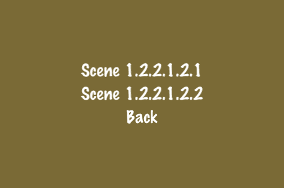

## 准备工作

请参考项目 *RecipeCollection02* 以获取此菜谱的完整工作代码。

## 如何做到这一点...

执行以下代码：

```swift
// TreeSceneMenu
// The node for our binary tree of scenes
@interface TreeSceneMenu : CCLayer {
NSString *name;
}
+(id) sceneWithString:(NSString*)str;
-(id) initWithString:(NSString*)str;
-(void) goToScene1:(id)sender;
-(void) goToScene2:(id)sender;
-(void) back:(id)sender;
@end
@implementation TreeSceneMenu
+(id) sceneWithString:(NSString*)str {
//Initialize our scene
CCScene *s = [CCScene node];
TreeSceneMenu *node = [[TreeSceneMenu alloc] initWithString:str];
[s addChild:node z:0 tag:0];
return s;
}
-(id) initWithString:(NSString*)str {
if( (self=[super init] )) {
//Set scene name
name = [NSString stringWithFormat:@"%@",str];
[name retain];
/* CODE OMITTED */
//Buttons to push new scenes onto the stack
CCMenuItemFont *scene1Item = [CCMenuItemFont itemFromString:[NSString stringWithFormat:@"Scene %@.1",name] target:self selector:@selector(goToScene1:)];
CCMenuItemFont *scene2Item = [CCMenuItemFont itemFromString:[NSString stringWithFormat:@"Scene %@.2",name] target:self selector:@selector(goToScene2:)];
//If we are at the root we "Quit" instead of going "Back"
NSString *backStr = @"Back";
if([str isEqualToString:@"1"]){
backStr = @"Quit";
}
CCMenuItemFont *backItem = [CCMenuItemFont itemFromString:backStr target:self selector:@selector(back:)];
//Add menu items
CCMenu *menu = [CCMenu menuWithItems: scene1Item, scene2Item, backItem, nil];
[menu alignItemsVertically];
[self addChild:menu];
}
return self;
}
//Push scene 1
-(void) goToScene1:(id)sender {
[[CCDirector sharedDirector] pushScene:[TreeSceneMenu sceneWithString:[NSString stringWithFormat:@"%@.1",name]]];
}
//Push scene 2
-(void) goToScene2:(id)sender {
[[CCDirector sharedDirector] pushScene:[TreeSceneMenu sceneWithString:[NSString stringWithFormat:@"%@.2",name]]];
}
//Pop scene
-(void) back:(id)sender {
[[CCDirector sharedDirector] popScene];
}
@end
//Our Base Recipe
@interface Ch5_SwitchingScenes : Recipe{}
-(CCLayer*) runRecipe;
-(void) goToScene1:(id)sender;
@end
@implementation Ch5_SwitchingScenes
-(CCLayer*) runRecipe {
[super runRecipe];
//Go to our initial scene
CCMenuItemFont *goToScene1 = [CCMenuItemFont itemFromString:@"Go To Scene 1" target:self selector:@selector(goToScene1:)];
CCMenu *menu = [CCMenu menuWithItems: goToScene1, nil];
[menu alignItemsVertically];
[self addChild:menu];
return self;
}
scenesswitching//Push initial scene
-(void) goToScene1:(id)sender {
[[CCDirector sharedDirector] pushScene:[TreeSceneMenu sceneWithString:@"1"]];
}
@end

```

## 它是如何工作的...

在 Cocos2d 中，常见的做法是在创建简单场景时对`CCLayer`进行子类化。这允许我们仅使用一个类将我们的单个`CCScene`与`CCLayer`耦合。这个类继承自`CCLayer`，但它有一个返回自身包装在`CCScene`中的类方法：

```swift
+(id) sceneWithString:(NSString*)str {
//Initialize our scene
CCScene *s = [CCScene node];
TreeSceneMenu *node = [[TreeSceneMenu alloc] initWithString:str];
[s addChild:node z:0 tag:0];
return s;
}

```

在这个例子中，我们的类名为`TreeSceneMenu`。通过按下其两个按钮之一，可以将另一个场景推入堆栈，并带有适当的子字符串名称。这创建了一个可能的场景组合的二叉树。弹出根场景将把你带回主菜谱选择场景。

+   层与场景：

    层/场景的区别主要是一个形式上的区别。场景将游戏的最基本部分分离出来，并被视为这样。例如，在场景之间切换时可以使用多种过渡效果（见下一个菜谱）。另一方面，层被设计为是唯一直接添加到场景中的节点。层是所有动作发生的地方。其他节点附着在其上，并实现`TouchEventsDelegate`协议以处理输入。场景和层之间的唯一区别是，当场景被推入堆栈时，场景需要更多的内存和处理器的开销。因此，在任何时候堆栈上的场景越少，越好。

# 场景之间的转换

如前一个菜谱中提到的，场景是根 CCNodes，一次只能运行一个。在场景之间切换时，我们可以应用过渡效果，使场景变化更加明确和时尚。在这个菜谱中，你可以演示所有内置的场景过渡效果。

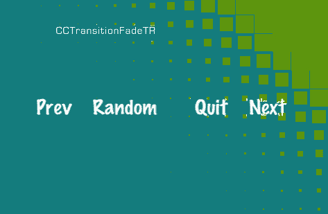

## 准备工作

请参考项目 *RecipeCollection02* 以获取此菜谱的完整工作代码。

## 如何做到这一点...

执行以下代码：

```swift
@implementation TransSceneMenu
+(id) sceneWithString:(NSString*)str withCurrentTransition:(int)ct {
//Create scene
CCScene *s = [CCScene node];
TransSceneMenu *node = [[TransSceneMenu alloc] initWithString:str withCurrentTransition:ct];
[s addChild:node z:0 tag:0];
return s;
}
-(id) initWithString:(NSString*)str withCurrentTransition:(int)ct {
if( (self=[super init] )) {
name = str;
currentTransition = ct;
/* CODE OMITTED */
}
return self;
}
-(void) prevScene:(id)sender {
currentTransition--;
if(currentTransition < 0){
currentTransition = numTransitionTypes-1;
}
[self loadNewScene];
}
-(void) nextScene:(id)sender {
currentTransition++;
if(currentTransition >= numTransitionTypes){
currentTransition = 0;
}
[self loadNewScene];
}
-(void) randomScene:(id)sender {
currentTransition = arc4random()%numTransitionTypes;
[self loadNewScene];
}
-(void) loadNewScene {
[[CCDirector sharedDirector] popScene];
NSString *className = [NSString stringWithFormat:@"%@",transitionTypes[currentTransition]];
Class clazz = NSClassFromString (className);
[[CCDirector sharedDirector] pushScene: [clazz transitionWithDuration:1.2f scene:[TransSceneMenu sceneWithString:className withCurrentTransition:currentTransition]]];
}
-(void) quit:(id)sender {
[[CCDirector sharedDirector] popScene];
}
@end
//Our Base Recipe
@interface Ch5_SceneTransitions : Recipe{}
-(CCLayer*) runRecipe;
-(void) viewTransitions:(id)sender;
@end
@implementation Ch5_SceneTransitions
-(CCLayer*) runRecipe {
[super runRecipe];
CCMenuItemFont *viewTransitions = [CCMenuItemFont itemFromString:@"View Transitions" target:self selector:@selector(viewTransitions:)];
CCMenu *menu = [CCMenu menuWithItems: viewTransitions, nil];
[menu alignItemsVertically];
[self addChild:menu];
return self;
}
-(void) viewTransitions:(id)sender {
[[CCDirector sharedDirector] pushScene:[TransSceneMenu sceneWithString:@"" withCurrentTransition:0]];
}
@end

```

## 它是如何工作的...

当使用常规的 `CCScene` 实例化 `CCTransitionScene` 类并立即将其推入场景栈时，它将创建一个过渡效果。这是通过以下行完成的：

```swift
[[CCDirector sharedDirector] pushScene: [CCTransitionFade transitionWithDuration:1.2f scene:[MyScene scene] withColor:ccWHITE]];

```

在这个例子中，我们在加载 `MyScene` 场景时使用了一个“淡入白色”的过渡效果。以下是内置的 Cocos2d 过渡类列表：

`CCTransitionFadeTR, CCTransitionJumpZoom, CCTransitionMoveInL, CCTransitionSplitCols, CCTransitionSceneOriented, CCTransitionPageTurn, CCTransitionRadialCCW, CCTransitionFade, CCTransitionRotoZoom, CCTransitionShrinkGrow, CCTransitionSlideInL`，以及 `CCTransitionTurnOffTiles`

## 还有更多...

除了使用过渡效果推送场景外，你还可以通过向 `CCDirector` 类添加以下方法来使用过渡效果弹出场景：

```swift
//CCDirector.h
- (void) popSceneWithTransition: (Class)transitionClass duration:(ccTime)t;
//CCDirector.m
-(void) popSceneWithTransition: (Class)transitionClass duration:(ccTime)t {
NSAssert( runningScene_ != nil, @"A running Scene is needed");
[scenesStack_ removeLastObject];
NSUInteger c = [scenesStack_ count];
if( c == 0 ) {
[self end];
} else {
CCScene* scene = [transitionClass transitionWithDuration:t scene:[scenesStack_ objectAtIndex:c-1]];
[scenesStack_ replaceObjectAtIndex:c-1 withObject:scene];
nextScene_ = scene;
}
}

```

这将以一个漂亮的过渡效果弹出场景。

# 使用 CCLayerMultiplex

`CCLayerMultiplex` 类提供了在多个层之间无缝切换的功能。在这个例子中，我们有三层相似的层分配给一个复用层。每个层显示用于切换到其他任何层的按钮。

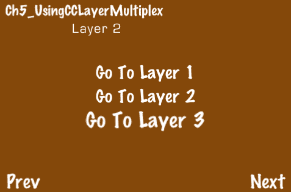

## 准备中

请参考项目 *RecipeCollection02* 以获取此菜谱的完整工作代码。

## 如何操作...

执行以下代码：

```swift
@interface MultiplexLayerMenu : CCLayer {}
+(id) layerWithLayerNumber:(int)layerNumber;
-(id) initWithLayerNumber:(int)layerNumber;
-(void) goToLayer:(id)sender;
@end
@implementation MultiplexLayerMenu
+(id) layerWithLayerNumber:(int)layerNumber {
return [[[MultiplexLayerMenu alloc] initWithLayerNumber:layerNumber] autorelease];
}
CCLayerMultiplexusing-(id) initWithLayerNumber:(int)layerNumber {
if( (self=[super init] )) {
//Random background color
CCSprite *bg = [CCSprite spriteWithFile:@"blank.png"];
bg.position = ccp(240,160);
[bg setTextureRect:CGRectMake(0,0,480,320)];
[bg setColor:ccc3(arc4random()%150,arc4random()%150,arc4random()%150)];
[self addChild:bg];
//Layer number as message
CCLabelBMFont *message = [CCLabelBMFont labelWithString:[NSString stringWithFormat:@"Layer %i",layerNumber+1] fntFile:@"eurostile_30.fnt"];
message.position = ccp(160,270);
message.scale = 0.75f;
[message setColor:ccc3(255,255,255)];
[self addChild:message z:10];
//Buttons to go to different layers
CCMenuItemFont *goToLayer1 = [CCMenuItemFont itemFromString:@"Go To Layer 1" target:self selector:@selector(goToLayer:)];
CCMenuItemFont *goToLayer2 = [CCMenuItemFont itemFromString:@"Go To Layer 2" target:self selector:@selector(goToLayer:)];
CCMenuItemFont *goToLayer3 = [CCMenuItemFont itemFromString:@"Go To Layer 3" target:self selector:@selector(goToLayer:)];
goToLayer1.tag = 0; goToLayer2.tag = 1; goToLayer3.tag = 2;
//Add menu items
CCMenu *menu = [CCMenu menuWithItems: goToLayer1, goToLayer2, goToLayer3, nil];
[menu alignItemsVertically];
[self addChild:menu];
}
return self;
}
//Switch to a different layer
-(void) goToLayer:(id)sender {
CCMenuItemFont *item = (CCMenuItemFont*)sender;
[(CCLayerMultiplex*)parent_ switchTo:item.tag];
}
@end
@interface Ch5_UsingCCLayerMultiplex : Recipe{}
-(CCLayer*) runRecipe;
@end
@implementation Ch5_UsingCCLayerMultiplex
-(CCLayer*) runRecipe {
[super runRecipe];
//Create our multiplex layer with three MultiplexLayerMenu objects
CCLayerMultiplex *layer = [CCLayerMultiplex layerWithLayers: [MultiplexLayerMenu layerWithLayerNumber:0], [MultiplexLayerMenu layerWithLayerNumber:1],
[MultiplexLayerMenu layerWithLayerNumber:2], nil];
[self addChild: layer z:0];
return self;
}
@end

```

## 它是如何工作的...

这种技术提供了一种不同于场景切换之间的控制流风格的替代方式。它允许实例化多个层，并动态地激活和挂起这些层。通过以下类方法创建复用层：

```swift
+(id) layerWithLayers: (CCLayer*) layer, ... NS_REQUIRES_NIL_TERMINATION;

```

有许多方法可以利用这项技术。它提供了一个平铺的替代方案，用于分层堆叠场景。

# 使用 CCLabel

在整本书中，我们一直在使用多种不同的标签类型。在这个菜谱中，我们将简要解释三个常用的标签类：`CCLabelAtlas, CCLabelBMFont,` 和 `CCLabelTTF`。

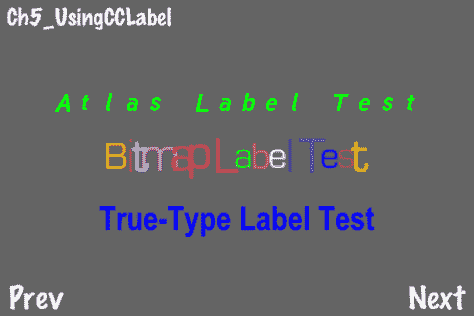

## 准备中

请参考项目 *RecipeCollection02* 以获取此菜谱的完整工作代码。

## 如何操作...

执行以下代码：

```swift
@implementation Ch5_UsingCCLabel
-(CCLayer*) runRecipe {
[super runRecipe];
//CCLabelAtlas for fixed-width bitmap fonts
CCLabelAtlas *labelAtlas = [CCLabelAtlas labelWithString:@"Atlas Label Test" charMapFile:@"tuffy_bold_italic-charmap.png" itemWidth:48 itemHeight:65 startCharMap:' '];
[self addChild:labelAtlas z:0];
labelAtlas.anchorPoint = ccp(0.5f,0.5f);
labelAtlas.scale = 0.5f;
labelAtlas.position = ccp(240,220);
[labelAtlas setColor:ccc3(0,255,0)];
[labelAtlas runAction:[CCRepeatForever actionWithAction: [CCSequence actions: [CCScaleTo actionWithDuration:1.0f scale:0.5f], [CCScaleTo actionWithDuration:1.0f scale:0.25f], nil]]];
//CCLabelBMFont for variable-width bitmap fonts using FNT files
CCLabelBMFont *labelBMFont = [CCLabelBMFont labelWithString:@"Bitmap Label Test" fntFile:@"eurostile_30.fnt"];
[self addChild:labelBMFont z:0];
labelBMFont.position = ccp(240,160);
for(id c in labelBMFont.children){
CCSprite *child = (CCSprite*)c;
[child setColor:ccc3(arc4random()%255,arc4random()%255,arc4random()%255)];
[child runAction:[CCRepeatForever actionWithAction:
[CCSequence actions: [CCScaleTo actionWithDuration:arc4random()%2+1 scale:1.75f], [CCScaleTo actionWithDuration:arc4random()%2+1 scale:0.75f], nil]
]];
}
//CCLabelTTF for true-type fonts
CCLabelTTF *labelTTF = [CCLabelTTF labelWithString:@"True-Type Label Test" fontName:@"arial_narrow.otf" fontSize:32];
[self addChild:labelTTF z:0];
labelTTF.position = ccp(240,100);
[labelTTF runAction:[CCRepeatForever actionWithAction: [CCSequence actions: [CCScaleTo actionWithDuration:2.0f scale:1.5f], [CCScaleTo actionWithDuration:2.0f scale:0.5f], nil]]];
[labelTTF setColor:ccc3(0,0,255)];
return self;
}
@end

```

## 它是如何工作的...

每种标签类型都有其优缺点。

+   `CCLabelAtlas:`

    在屏幕上绘制文本的最简单方法是使用 `CCLabelAtlas` 类。这允许你绘制固定宽度的位图字体。这是一个低技术解决方案，本质上是通过标准 ASCII 值顺序索引纹理文件。提供的唯一元信息是字符大小和地图中的第一个字符。

+   `CCLabelBMFont:`

    `CCLabelBMFont` 类具有位图字体绘制的速度优势，以及许多其他功能。它使用 FNT 文件格式来存储非固定宽度位图字体。这些字体可以使用包括 **Hiero** 在内的多个编辑器创建，Hiero 可以在以下网址找到：[`www.n4te.com/hiero/hiero.jnlp`](http://www.n4te.com/hiero/hiero.jnlp)。`CCLabelBMFont` 将每个字符视为 CCSprite 子节点。这允许我们单独操作它们。

+   `CCLabelTTF:`

    最后，`CCLabelTTF` 类允许绘制 **TrueType** 字体。这允许使用内置系统字体以及其他您指定的 TrueType 字体。必须注意，TrueType 字体的渲染速度较慢，应仅用于静态文本。对于将频繁更新的文本（如得分显示）应使用位图字体。

# 使用 CCMenu

Cocos2d 提供的菜单工具使得创建简单菜单的过程变得非常简单。在这个例子中，我们将看到如何创建简单菜单，调整菜单对齐，启用/禁用菜单项，等等。

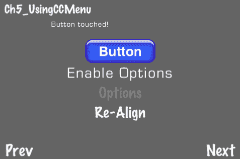

## 准备工作

请参考项目 *RecipeCollection02* 以获取此菜谱的完整工作代码。

## 如何操作...

执行以下代码：

```swift
@implementation OptionsMenu
+(id) scene {
//Create a scene
CCScene *s = [CCScene node];
OptionsMenu *node = [OptionsMenu node];
[s addChild:node z:0 tag:0];
return s;
}
-(id) init {
if( (self=[super init] )) {
/* CODE OMITTED */
//Disabled title label for Sound option
CCMenuItemFont *title1 = [CCMenuItemFont itemFromString:@"Sound"];
[title1 setIsEnabled:NO];
title1.color = ccc3(0,0,0);
//Toggleable item for Sound option
CCMenuItemToggle *item1 = [CCMenuItemToggle itemWithTarget:self selector:@selector(soundToggle:) items:
[CCMenuItemFont itemFromString: @"On"], [CCMenuItemFont itemFromString: @"Off"], nil];
CCMenuusing//Disabled title label for Difficulty option
CCMenuItemFont *title2 = [CCMenuItemFont itemFromString:@"Difficulty"];
[title2 setIsEnabled:NO];
title2.color = ccc3(0,0,0);
//Toggleable item for Difficulty option
CCMenuItemToggle *item2 = [CCMenuItemToggle itemWithTarget:self selector:@selector(difficultyToggle:) items:
[CCMenuItemFont itemFromString: @"Easy"], [CCMenuItemFont itemFromString: @"Medium"],
[CCMenuItemFont itemFromString: @"Hard"], [CCMenuItemFont itemFromString: @"Insane"], nil];
//Back button
CCMenuItemFont *back = [CCMenuItemFont itemFromString:@"Back" target:self selector:@selector(back:)];
//Finally, create our menu
CCMenu *menu = [CCMenu menuWithItems:
title1, title2,
item1, item2,
back, nil]; // 5 items.
//Align items in columns
[menu alignItemsInColumns:
[NSNumber numberWithUnsignedInt:2],
[NSNumber numberWithUnsignedInt:2],
[NSNumber numberWithUnsignedInt:1],
nil
];
[self addChild:menu];
}
return self;
}
-(void) back:(id)sender {
[[CCDirector sharedDirector] popScene];
}
//Use the 'selectedIndex' variable to identify the touched item
-(void) soundToggle: (id) sender {
CCMenuItem *item = (CCMenuItem*)sender;
[message setString:[NSString stringWithFormat:@"Selected Sound Index:%d", [item selectedIndex]]];
}
-(void) difficultyToggle: (id) sender {
CCMenuItem *item = (CCMenuItem*)sender;
[message setString:[NSString stringWithFormat:@"Selected Difficulty Index:%d", [item selectedIndex]]];
}
@end
CCMenuusing@implementation Ch5_UsingCCMenu
-(CCLayer*) runRecipe {
[super runRecipe];
//Set font size/name
[CCMenuItemFont setFontSize:30];
[CCMenuItemFont setFontName:@"Marker Felt"];
//Image Button
CCMenuItemSprite *imageButton = [CCMenuItemSprite itemFromNormalSprite:[CCSprite spriteWithFile:@"button_unselected.png"]
selectedSprite:[CCSprite spriteWithFile:@"button_selected.png"] disabledSprite:[CCSprite spriteWithFile:@"button_disabled.png"]
target:self selector:@selector(buttonTouched:)];
//Enable Options Label
CCLabelBMFont *enableOptionsLabel = [CCLabelBMFont labelWithString:@"Enable Options" fntFile:@"eurostile_30.fnt"];
CCMenuItemLabel *enableOptions = [CCMenuItemLabel itemWithLabel:enableOptionsLabel target:self selector:@selector(enableOptions:)];
//Options Label
optionsItem = [CCMenuItemFont itemFromString:@"Options" target:self selector:@selector(options:)];
optionsItem.isEnabled = NO;
//Re-Align Label
CCMenuItemFont *reAlign = [CCMenuItemFont itemFromString:@"Re-Align" target:self selector:@selector(reAlign:)];
//Add menu items
menu = [CCMenu menuWithItems: imageButton, enableOptions, optionsItem, reAlign, nil];
[menu alignItemsVertically];
[self addChild:menu];
return self;
}
-(void) buttonTouched:(id)sender {
[message setString:@"Button touched!"];
}
-(void) options:(id)sender {
[[CCDirector sharedDirector] pushScene:[OptionsMenu scene]];
}
-(void) enableOptions:(id)sender {
optionsItem.isEnabled = !optionsItem.isEnabled;
}
//Randomly re-align our menu
-(void) reAlign:(id)sender {
int n = arc4random()%6;
if(n == 0){
[menu alignItemsVertically];
}else if(n == 1){
[menu alignItemsHorizontally];
}else if(n == 2){
[menu alignItemsHorizontallyWithPadding:arc4random()%30];
}else if(n == 3){
[menu alignItemsVerticallyWithPadding:arc4random()%30];
}else if(n == 4){
[menu alignItemsInColumns: [NSNumber numberWithUnsignedInt:2], [NSNumber numberWithUnsignedInt:2], nil];
}else if(n == 5){
[menu alignItemsInRows: [NSNumber numberWithUnsignedInt:2], [NSNumber numberWithUnsignedInt:2], nil];
}
}
@end

```

## 工作原理...

`CCMenu` 类充当一个容器，其中包含可配置的 `CCMenuItem` 对象列表：

+   `CCMenuItemFont:`

    `CCMenuItemFont` 类是一个辅助类，旨在通过类方法快速创建使用 TrueType 字体的 `CCMenuItemLabel` 对象。它提供了作为创建菜单项标签过程快捷方式的类方法。字体名称和大小通过类方法设置：

    ```swift
    [CCMenuItemFont setFontSize:30];
    [CCMenuItemFont setFontName:@"Marker Felt"];

    ```

    然后通过类方法创建一个 `CCMenuItemFont` 对象：

    ```swift
    CCMenuItemFont *reAlign = [CCMenuItemFont itemFromString:@"Re-Align" target:self selector:@selector(reAlign:)];

    ```

    这个类在整本书中用于创建菜单项标签。

+   `CCMenuItemLabel:`

    为了对菜单项标签有更多控制，您可以直接使用 `CCMenuItemLabel`：

    ```swift
    CCLabelBMFont *enableOptionsLabel = [CCLabelBMFont labelWithString:@"Enable Options" fntFile:@"eurostile_30.fnt"];
    CCMenuItemLabel *enableOptions = [CCMenuItemLabel itemWithLabel:enableOptionsLabel target:self selector:@selector(enableOptions:)];

    ```

    这允许您使用 `CCLabelBMFont` 和 `CCLabelAtlas` 添加位图字体。

+   `CCMenuItemSprite:`

    `CCMenuItemSprite` 类创建一个可触摸的按钮作为菜单项，而不是文本标签：

    ```swift
    CCMenuItemSprite *imageButton = [CCMenuItemSprite itemFromNormalSprite:[CCSprite spriteWithFile:@"button_unselected.png"] selectedSprite:[CCSprite spriteWithFile:@"button_selected.png"] disabledSprite:[CCSprite spriteWithFile:@"button_disabled.png"] target:self selector:@selector(buttonTouched:)];

    ```

    建议使用两个或三个精灵来创建引人注目的按钮效果。

+   `CCMenuItemToggle:` 可切换的菜单项包含一个要迭代的菜单项列表：

    ```swift
    CCMenuItemToggle *item1 = [CCMenuItemToggle itemWithTarget:self selector:@selector(soundToggle:) items: [CCMenuItemFont itemFromString: @"On"], [CCMenuItemFont itemFromString: @"Off"], nil];

    ```

    可以通过菜单项上的 `selectedIndex` 属性识别当前状态。这通常在项的回调方法中处理。

+   自动对齐菜单项：

    通过使用以下方法，可以水平或垂直对齐 `CCMenu` 对象的项：

    ```swift
    -(void) alignItemsVertically;
    -(void) alignItemsVerticallyWithPadding:(float) padding;
    -(void) alignItemsHorizontally;
    -(void) alignItemsHorizontallyWithPadding: (float) padding;

    ```

    菜单也可以按列或行对齐：

    ```swift
    [menu alignItemsInColumns: [NSNumber numberWithUnsignedInt:2], [NSNumber numberWithUnsignedInt:2], nil];
    [menu alignItemsInRows: [NSNumber numberWithUnsignedInt:2], [NSNumber numberWithUnsignedInt:2], nil];

    ```

    `NSNumber` 对象的列表总数必须等于附加到菜单的菜单项数量，以便正确处理对齐。

+   手动对齐菜单项：

    菜单项也可以像任何其他 `CCNode` 对象一样使用 `position` 属性手动定位。

+   启用/禁用菜单项：

    所有菜单项都可以被禁用，以便它们忽略触摸。标签可以将它们的 `disabledColor` 属性设置为指示这一点，而 `CCMenuItemSprite` 的实例有一个特定的精灵来指示这一点。

# 创建阴影菜单标签

常常在背景中有一个动态的色彩漩涡，标签有时在屏幕上难以识别。为了解决这个问题，我们可以创建带有暗阴影的标签。在这个菜谱中，我们将创建几个这样的标签。

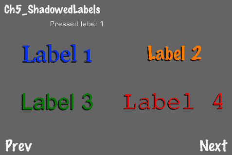

## 准备工作

请参阅项目 *RecipeCollection02* 以获取此菜谱的完整工作代码。

## 如何做到这一点...

执行以下代码：

```swift
#import "ShadowLabel.h"
@implementation Ch5_ShadowedLabels
-(CCLayer*) runRecipe {
[super runRecipe];
/* Draw four different shadowed labels using 4 different fonts */
[CCMenuItemFont setFontSize:47];
[CCMenuItemFont setFontName:@"Georgia"];
[self label:@"Label 1" at:ccp(-120,50) color:ccc3(0,50,255) activeColor:ccc3(0,200,255) selector:@selector(labelTouched:) tag:1];
[CCMenuItemFont setFontSize:40];
[CCMenuItemFont setFontName:@"Marker Felt"];
[self label:@"Label 2" at:ccp(120,50) color:ccc3(255,128,0) activeColor:ccc3(255,255,0) selector:@selector(labelTouched:) tag:2];
[CCMenuItemFont setFontSize:45];
[CCMenuItemFont setFontName:@"Arial"];
[self label:@"Label 3" at:ccp(-120,-50) color:ccc3(0,128,0) activeColor:ccc3(0,255,0) selector:@selector(labelTouched:) tag:3];
[CCMenuItemFont setFontSize:50];
[CCMenuItemFont setFontName:@"Courier New"];
[self label:@"Label 4" at:ccp(120,-50) color:ccc3(255,0,0) activeColor:ccc3(255,255,0) selector:@selector(labelTouched:) tag:4];
return self;
}
//Label creation helper method
-(void) label:(NSString*)s at:(CGPoint)p color:(ccColor3B)col activeColor:(ccColor3B)activeCol selector:(SEL)sel tag:(int)tag {
ShadowLabel *label = [ShadowLabel labelFromString:s target:self selector:sel];
label.position = p;
label.color = col;
label.activeColor = activeCol;
label.tag = tag;
CCMenu *menu = [CCMenu menuWithItems: label.shadow, label, nil];
[self addChild:menu];
}
//Label touch callback
-(void) labelTouched:(id)sender {
ShadowLabel *label = (ShadowLabel*)sender;
[self showMessage:[NSString stringWithFormat:@"Pressed label %d",label.tag]];
}
@end

```

## 它是如何工作的...

`ShadowLabel` 类创建了一个位于其父对象后面并稍微偏向一侧的子 `CCMenuItemLabel` 对象。方法被覆盖，因此两个标签是同步的。

+   注意事项：

    这种方法的唯一缺点是，使用此类的菜单无法自动对齐，因为“阴影”标签也必须作为菜单项添加。

## 更多内容...

在这个例子中，我们为每个 `ShadowLabel` 设置了 `tag` 属性，以便在回调期间正确识别。这与我们过去使用的相同的 `tag` 属性；只是它被重新用于这个角色。

+   在字体编辑器中添加阴影：

    作为之前使用技术的替代方案，可以使用字体编辑器将阴影添加到 TrueType 字体中。这里的权衡是代码更少，渲染时间更快。但是，您必须首先花时间在编辑器中将阴影添加到字体中。

# UIKit 警告对话框

在接下来的两个菜谱中，我们将尝试将 **UIKit** 元素集成到 Cocos2d 游戏中的黑色艺术。在这个例子中，我们看到一个带有选择和关联回调方法的 UIKit **警告** 对话框。

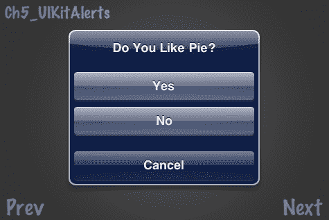

## 准备工作

请参阅项目 *RecipeCollection02* 以获取此菜谱的完整工作代码。

## 如何做到这一点...

执行以下代码：

```swift
@interface Ch5_UIKitAlerts : Recipe <UIAlertViewDelegate>{}
-(CCLayer*) runRecipe;
-(void)showPieAlert;
-(void)alertView:(UIAlertView*)actionSheet clickedButtonAtIndex:(NSInteger)buttonIndex;
@end
@implementation Ch5_UIKitAlerts
-(CCLayer*) runRecipe {
[super runRecipe];
[self showPieAlert];
return self;
}
//Shows a UIAlertView
-(void)showPieAlert {
UIAlertView *alert = [[UIAlertView alloc] initWithTitle:@"Do You Like Pie?" message:@"" delegate:self cancelButtonTitle:@"Cancel" otherButtonTitles:@"Yes",@"No",nil];
[alert show];
[alert release];
UIKit alert dialogsabout}
//AlertView callback
-(void)alertView:(UIAlertView *)actionSheet clickedButtonAtIndex:(NSInteger)buttonIndex {
if(buttonIndex == 0) {
[self showMessage:@"You remain tight lipped on\nthe 'pie' question."];
}else if(buttonIndex == 1){
[self showMessage:@"Ah yes, another lover of pie."];
}else if(buttonIndex == 2){
[self showMessage:@"You don't like pie?\nWhat's wrong with you?"];
}
}
@end

```

## 它是如何工作的...

显示一个警告信息相对直接。我们创建一个包含一些基本信息 `UIAlertView` 对象，然后调用 `show` 方法。这会启动我们的警告。

+   使用 `UIAlertViewDelegate`：

    `UIAlertViewDelegate` 协议规定我们处理以下方法：

    ```swift
    -(void)alertView:(UIAlertView *)actionSheet clickedButtonAtIndex:(NSInteger)buttonIndex;

    ```

    这允许我们通过检查返回的 `buttonIndex` 变量来处理警告响应。

# 包装 UIKit

其他 UIKit 类提供了一系列经过时间考验的 UI 功能。Cocos2d 需要使用 UIKit 包装器将 UIKit 对象转换为 `CCNode` 对象，以便正确操作。在这个例子中，我们将包装两个不同的类并在屏幕上操作它们。

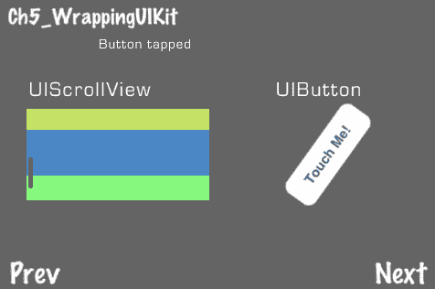

## 准备工作

请参阅项目 *RecipeCollection02* 以获取此菜谱的完整工作代码。

## 如何做到这一点...

执行以下代码：

```swift
#import "CCUIViewWrapper.h"
@implementation Ch5_WrappingUIKit
-(CCLayer*) runRecipe {
[super runRecipe];
[self addSpinningButton];
[self addScrollView];
return self;
}
-(void) addSpinningButton {
//Label
CCLabelBMFont *label = [CCLabelBMFont labelWithString:@"UIButton" fntFile:@"eurostile_30.fnt"];
label.position = ccp(350,220);
label.scale = 0.75f;
[label setColor:ccc3(255,255,255)];
[self addChild:label z:10];
//Our UIButton example
UIButton *button = [UIButton buttonWithType:UIButtonTypeRoundedRect];
[button addTarget:self action:@selector(buttonTapped:) forControlEvents:UIControlEventTouchDown];
[button setTitle:@"Touch Me!" forState:UIControlStateNormal];
button.frame = CGRectMake(0.0, 0.0, 120.0, 40.0);
//Wrap the UIButton using CCUIViewWrapper
CCUIViewWrapper *wrapper = [CCUIViewWrapper wrapperForUIView:button];
[self addChild:wrapper];
wrapper.position = ccp(90,140);
[wrapper runAction:[CCRepeatForever actionWithAction:[CCRotateBy actionWithDuration:5.0f angle:360]]];
}
-(void) addScrollView {
//Label
CCLabelBMFont *label = [CCLabelBMFont labelWithString:@"UIScrollView" fntFile:@"eurostile_30.fnt"];
label.position = ccp(100,220);
label.scale = 0.75f;
[label setColor:ccc3(255,255,255)];
[self addChild:label z:10];
//Create a simple UIScrollView with colored UIViews
CGPoint viewSize = ccp(200.0f,100.0f);
CGPoint nodeSize = ccp(200.0f,50.0f);
int nodeCount = 10;
//Init scrollview
UIScrollView *scrollview = [[UIScrollView alloc] initWithFrame: CGRectMake(0, 0, viewSize.x, viewSize.y)];
//Add nodes
for (int i = 0; i <nodeCount; i++){
CGFloat y = i * nodeSize.y;
UIView *view = [[UIView alloc] initWithFrame:CGRectMake(0, y, nodeSize.x, nodeSize.y)];
view.backgroundColor = [UIColor colorWithRed:(CGFloat)random()/(CGFloat)RAND_MAX green:(CGFloat)random()/(CGFloat)RAND_MAX blue:(CGFloat)random()/(CGFloat)RAND_MAX alpha:1.0];
[scrollview addSubview:view];
[view release];
}
scrollview.contentSize = CGSizeMake(viewSize.x, viewSize.y * nodeCount/2);
//Wrap the UIScrollView object using CCUIViewWrapper
CCUIViewWrapper *wrapper = [CCUIViewWrapper wrapperForUIView:scrollview];
[self addChild:wrapper];
wrapper.rotation = -90;
wrapper.position = ccp(50,400);
}
-(void) buttonTapped:(id)sender {
[self showMessage:@"Button tapped"];
}
@end

```

## 它是如何工作的...

`CCUIViewWrapper` 在其主创建类方法中接受任何 `UIView` 对象：

```swift
CCUIViewWrapper *wrapper = [CCUIViewWrapper wrapperForUIView:button];

```

这个对象可以被像正常的 `CCSprite` 对象一样操作。

+   `UIButton:`

    使用 UIKit 类的优点有很多。`UIButton` 类允许创建带有文本的巧妙按钮。

+   `UIScrollView:`

    在我们的另一个示例中，我们创建了一个更复杂的 `UIScrollView` 对象。尽管语法比使用内置的 Cocos2d 类要混乱一些，但这个 UIKit 视图提供的流畅功能很难复制。

+   混合动作：

    如果你滚动 `UIScrollView` 对象，你会看到右侧的 `UIButton` 停止旋转。一些 UIKit 动作比异步 Cocos2d 动作具有优先级。

+   自动旋转和 UIKit 包装器：

    这个包装器的一个限制是它目前不能与 Cocos2d 自动旋转一起工作。如果你在使用这个配方时旋转设备，你会看到屏幕上的元素并没有随着屏幕一起旋转。建议你在 `GameConfig.h` 文件中使用以下行：

    ```swift
    #define GAME_AUTOROTATION kGameAutorotationNone

    ```

    这将禁用自动旋转。

+   UIKit 的力量：

    最好将此包装器作为实验 UIKit 类的起点。Cocos2d 和 UIKit 并不总是相处融洽，但能够利用像 UIKit 这样的强大 UI 库可以帮助创建更复杂的菜单，而无需编写和测试自己的 UI 代码。

# 创建可拖拽的菜单窗口

Cocos2d 通常被认为是一个游戏开发库，在这本书的大部分内容中都被这样对待。然而，Cocos2d 是任何 2D 应用程序的强大解决方案。话虽如此，可拖拽窗口是许多应用程序中的常见元素。在这个示例中，我们将创建可移动、可折叠的菜单窗口。

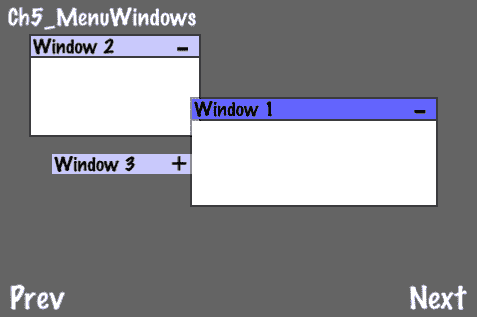

## 准备工作

请参考项目 *RecipeCollection02* 以获取此配方的完整工作代码。

## 如何做到这一点...

执行以下代码：

```swift
#import "GameMenuWindow.h"
@implementation Ch5_MenuWindows
-(CCLayer*) runRecipe {
[super runRecipe];
//Initialization
windows = [[[NSMutableArray alloc] init] autorelease];
CCNode *windowContainer = [[CCNode alloc] init];
/* Create three menu windows with randomized positions */
GameMenuWindow *window1 = [GameMenuWindow windowWithTitle:@"Window 1" size:CGSizeMake(arc4random()%200+120,arc4random()%100+50)];
window1.position = ccp(arc4random()%100+150,arc4random()%140+100);
[windowContainer addChild:window1 z:1];
[windows addObject:window1];
/* CODE OMITTED */
//Sort our window array by zOrder
//This allows ordered touching
NSSortDescriptor *sorter = [[NSSortDescriptor alloc] initWithKey:@"self.zOrder" ascending:NO];
[windows sortUsingDescriptors:[NSArray arrayWithObject:sorter]];
//Add window container node
[self addChild:windowContainer];
return self;
}
-(void) ccTouchesBegan:(NSSet *)touches withEvent:(UIEvent *)event {
UITouch *touch = [touches anyObject];
CGPoint point = [touch locationInView: [touch view]];
point = [[CCDirector sharedDirector] convertToGL: point];
//Sort our window array before we process a touch
NSSortDescriptor *sorter = [[NSSortDescriptor alloc] initWithKey:@"self.zOrder" ascending:NO];
[windows sortUsingDescriptors:[NSArray arrayWithObject:sorter]];
//Grab the window by touching the top bar. Otherwise, merely bring the window to the front
for(GameMenuWindow* w in windows){
if(pointIsInRect(point, [w titleBarRect])){
[w ccTouchesBegan:touches withEvent:event];
return;
}else if(pointIsInRect(point, [w rect])){
[w bringToFront];
return;
}
}
}
-(void) ccTouchesMoved:(NSSet *)touches withEvent:(UIEvent *)event {
/* CODE OMITTED */
//If we touched a window them we can drag it
for(GameMenuWindow* w in windows){
if(w.isTouched){
[w ccTouchesMoved:touches withEvent:event];
}
}
}
-(void) ccTouchesEnded:(NSSet *)touches withEvent:(UIEvent *)event {
/* CODE OMITTED */
//End a touch if neccessary
for(GameMenuWindow* w in windows){
if(w.isTouched){
[w ccTouchesEnded:touches withEvent:event];
}
}
}
@end

```

## 它是如何工作的...

之前显示的窗口可以通过触摸标题栏然后拖动来移动。按下加减符号可以展开或折叠窗口内容。

+   创建标题栏：

    每个窗口的标题栏和其他部分都是使用彩色 `blank.png` 精灵技术创建的。标题栏中使用的标签锚定在左侧，以实现文本左对齐。

+   向窗口添加内容：

    可以将节点添加到 `content` 精灵中，以添加窗口内容。这可以包括文本、图像、动态内容等等。请注意，在这个示例中，添加到 `content` 精灵中的节点不会被裁剪，并且可以根据节点位置出现在窗口之外。

+   排序窗口：

    在我们能够正确地与窗口交互之前，它们必须按照它们的 `zOrder` 属性进行排序：

    ```swift
    NSSortDescriptor *sorter = [[NSSortDescriptor alloc] initWithKey:@"self.zOrder" ascending:NO];
    [windows sortUsingDescriptors:[NSArray arrayWithObject:sorter]];

    ```

    `NSSortDescriptor` 类允许您根据排序对象的公共属性对 `NSArray` 容器进行排序。我们指定键 `"self.zOrder"`。这将根据 `Order`z 属性重新排序数组。现在，当我们遍历数组寻找被触摸的窗口时，我们找到的第一个窗口将是出现在顶部的窗口。

# 创建一个水平可滚动菜单

Cocos2d 提供了相当平凡的 `CCMenuItemToggle` 类来遍历多个 `CCMenuItem` 选择。在这个例子中，我们将使用模仿 iPod Touch 专辑艺术随机播放视觉技术的 `LoopingMenu` 类来增加一些趣味。

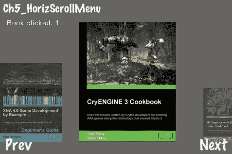

## 准备工作

请参考项目 *RecipeCollection02* 以获取此菜谱的完整工作代码。

## 如何操作...

执行以下代码：

```swift
#import "LoopingMenu.h"
@implementation Ch5_HorizScrollMenu
-(CCLayer*) runRecipe {
[super runRecipe];
message.position = ccp(70,270);
/* Create 5 default sprites and 'selected' sprites */
CCSprite *book1 = [CCSprite spriteWithFile:@"book1.jpg"];
CCSprite *book2 = [CCSprite spriteWithFile:@"book2.jpg"];
/* CODE OMITTED */
CCSprite *book1_selected = [CCSprite spriteWithFile:@"book1.jpg"]; book1_selected.color = ccc3(128,128,180); [book1_selected setBlendFunc: (ccBlendFunc) { GL_ONE, GL_ONE }];
CCSprite *book2_selected = [CCSprite spriteWithFile:@"book2.jpg"]; book2_selected.color = ccc3(128,128,180); [book2_selected setBlendFunc: (ccBlendFunc) { GL_ONE, GL_ONE }];
/* CODE OMITTED */
/* Create CCMenuItemSprites */
CCMenuItemSprite* item1 = [CCMenuItemSprite itemFromNormalSprite:book1 selectedSprite:book1_selected target:self selector:@selector(bookClicked:)];
item1.tag = 1;
CCMenuItemSprite* item2 = [CCMenuItemSprite itemFromNormalSprite:book2 selectedSprite:book2_selected target:self selector:@selector(bookClicked:)];
item2.tag = 2;
/* CODE OMITTED */
//Initialize LoopingMenu and add menu items
LoopingMenu *menu = [LoopingMenu menuWithItems:item1, item2, item3, item4, item5, nil];
menu.position = ccp(240, 150);
[menu alignItemsHorizontallyWithPadding:0];
//Add LoopingMenu to scene
[self addChild:menu];
return self;
}
//Book clicked callback
-(void) bookClicked:(id)sender {
CCMenuItemSprite *sprite = (CCMenuItemSprite*)sender;
[self showMessage:[NSString stringWithFormat:@"Book clicked: %d", sprite.tag]];
}
@end

```

## 它是如何工作的...

`LoopingMenu` 类继承自 `CCMenu` 类。它使用相同的基本创建方法：

```swift
LoopingMenu *menu = [LoopingMenu menuWithItems:item1, item2, item3, item4, item5, nil];

```

这通过使用提供的 `CCMenuItem` 对象创建一个无限滚动的菜单。在这种情况下，我们使用 `CCMenuItemSprite` 对象。

+   注意事项：

    这种技术的缺点是 `CCMenuItem` 对象会不断缩放。因此，在将菜单项添加到 `LoopingMenu` 实例之前，不能对菜单项进行缩放。必须使用完整图像或标签的大小。

# 创建一个垂直滑动菜单网格

有时，你希望在屏幕上同时显示大量菜单选项。在这个例子中，我们看到 `SlidingMenuGrid` 类在行动。

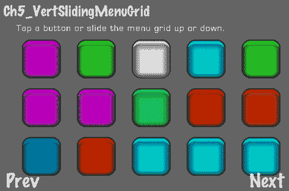

## 准备工作

请参考项目 *RecipeCollection02* 以获取此菜谱的完整工作代码。

## 如何操作...

执行以下代码：

```swift
#import "SlidingMenuGrid.h"
@implementation Ch5_VertSlidingMenuGrid
-(CCLayer*) runRecipe {
[super runRecipe];
message.position = ccp(200,270);
[self showMessage:@"Tap a button or slide the menu grid up or down."];
//Init item array
NSMutableArray* allItems = [[[NSMutableArray alloc] init] autorelease];
/* Create 45 CCMenuItemSprite objects with tags, callback methods and randomized colors */
for (int i = 1; i <= 45; ++i) {
CCSprite* normalSprite = [CCSprite spriteWithFile:@"sliding_menu_button_0.png"];
CCSprite* selectedSprite = [CCSprite spriteWithFile:@"sliding_menu_button_1.png"];
ccColor3B color = [self randomColor];
normalSprite.color = color;
selectedSprite.color = color;
CCMenuItemSprite* item = [CCMenuItemSprite itemFromNormalSprite:normalSprite selectedSprite:selectedSprite target:self selector:@selector(buttonClicked:)];
item.tag = i;
//Add each item to array
[allItems addObject:item];
}
//Init SlidingMenuGrid object with array and some other information
SlidingMenuGrid* menuGrid = [SlidingMenuGrid menuWithArray:allItems cols:5 rows:3 position:ccp(70.f,220.f) padding:ccp(90.f,80.f) verticalPages:true];
[self addChild:menuGrid z:1];
return self;
}
//Button clicked callback
-(void) buttonClicked:(id)sender {
CCMenuItemSprite *sprite = (CCMenuItemSprite*)sender;
[self showMessage:[NSString stringWithFormat:@"Button clicked: %d", sprite.tag]];
}
//Random base color method
-(ccColor3B) randomColor {
/* CODE OMITTED */
}
@end

```

## 它是如何工作的...

主要受超受欢迎的 iOS 游戏 Angry Birds 的启发，`SlidingMenuGrid` 类接受一个 `CCMenuItem` 对象数组，并将它们按指定的行和列排列：

```swift
SlidingMenuGrid* menuGrid = [SlidingMenuGrid menuWithArray:allItems cols:5 rows:3 position:ccp(70.f,220.f) padding:ccp(90.f,80.f) verticalPages:true];

```

根据数量和它们在屏幕上的布局，菜单项被分成页面。

+   从一个页面切换到另一个页面：

    垂直滑动菜单将从一个页面切换到另一个页面。

+   调整 `SlidingMenuGrid`: 

    如果你检查 `SlidingMenuGrid.h` 和 `SlidingMenuGrid.mm`，你可以看到许多变量，这些变量决定了菜单网格的行为，包括需要多少距离来“翻页”菜单以及翻页动画速度。

# 创建带有指示器的加载屏幕

大型关卡的游戏往往需要较长的加载时间。如果关卡元素可以异步加载，那么我们可以给用户一些令人放心的反馈，表明游戏仍在加载，并未崩溃。

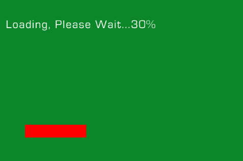

## 准备工作

请参考项目 *RecipeCollection02* 以获取此菜谱的完整工作代码。

## 如何操作...

执行以下代码：

```swift
/* The actual 'game' class where we display the textures we loaded asynchronously */
@implementation GameScene
+(id) sceneWithLevel:(NSString*)str {
//Create our scene
CCScene *s = [CCScene node];
GameScene *node = [[GameScene alloc] initWithLevel:str];
[s addChild:node z:0 tag:0];
return s;
}
-(id) initWithLevel:(NSString*)str {
if( (self=[super init] )) {
//Load our level
[self loadLevel:str];
/* CODE OMITTED */
//Create a label to indicate that this is the loaded level
CCLabelBMFont *label = [CCLabelBMFont labelWithString:@"The Loaded Level:" fntFile:@"eurostile_30.fnt"];
/* CODE OMITTED */
//Quit button
CCMenuItemFont *quitItem = [CCMenuItemFont itemFromString:@"Quit" target:self selector:@selector(quit:)];
CCMenu *menu = [CCMenu menuWithItems: quitItem, nil];
menu.position = ccp(430,300);
[self addChild:menu z:10];
}
return self;
}
//Quit callback
-(void) quit:(id)sender {
[[CCDirector sharedDirector] popScene];
//Clear all loaded textures (including ones from other recipes)
[[CCTextureCache sharedTextureCache] removeAllTextures];
}
//Load level file and process sprites
-(void) loadLevel:(NSString*)str {
NSString *jsonString = [[NSString alloc] initWithContentsOfFile:getActualPath(str) encoding:NSUTF8StringEncoding error:nil];
NSData *jsonData = [jsonString dataUsingEncoding:NSUTF32BigEndianStringEncoding];
NSDictionary *dict = [[CJSONDeserializer deserializer] deserializeAsDictionary:jsonData error:nil];
NSArray *nodes = [dict objectForKey:@"nodes"];
for (id node in nodes) {
if([[node objectForKey:@"type"] isEqualToString:@"spriteFile"]){
[self processSpriteFile:node];
}
}
}
-(void) processSpriteFile:(NSDictionary*)node {
//Init the sprite
NSString *file = [node objectForKey:@"file"];
CCSprite *sprite = [CCSprite spriteWithFile:file];
//Set sprite position
sprite.position = ccp(arc4random()%480, arc4random()%200);
//Each numeric value is an NSString or NSNumber that must be cast into a float
sprite.scale = [[node objectForKey:@"scale"] floatValue];
//Set the anchor point so objects are positioned from the bottom-up
sprite.anchorPoint = ccp(0.5,0);
//Finally, add the sprite
[self addChild:sprite z:2];
}
@end
@implementation LoadingScene
+(id) sceneWithLevel:(NSString*)str {
//Create our scene
CCScene *s = [CCScene node];
LoadingScene *node = [[LoadingScene alloc] initWithLevel:str];
[s addChild:node z:0 tag:0];
return s;
}
-(id) initWithLevel:(NSString*)str {
if( (self=[super init] )) {
//Set levelStr
levelStr = str;
[levelStr retain];
/* CODE OMITTED */
//Set the initial loading message
loadingMessage = [CCLabelBMFont labelWithString:@"Loading, Please Wait...0%" fntFile:@"eurostile_30.fnt"];
/* CODE OMITTED */
//Create an initial '0%' loading bar
loadingBar = [CCSprite spriteWithFile:@"blank.png"];
loadingBar.color = ccc3(255,0,0);
[loadingBar setTextureRect:CGRectMake(0,0,10,25)];
loadingBar.position = ccp(50,50);
loadingBar.anchorPoint = ccp(0,0);
[self addChild:loadingBar z:10];
//Start level pre-load
[self preloadLevel];
}
return self;
}
//Asynchronously load all required textures
-(void) preloadLevel {
nodesLoaded = 0;
NSString *jsonString = [[NSString alloc] initWithContentsOfFile:getActualPath(levelStr) encoding:NSUTF8StringEncoding error:nil];
NSData *jsonData = [jsonString dataUsingEncoding:NSUTF32BigEndianStringEncoding];
NSDictionary *dict = [[CJSONDeserializer deserializer] deserializeAsDictionary:jsonData error:nil];
NSArray *nodes = [dict objectForKey:@"nodes"];
nodesToLoad = [nodes count];
for (id node in nodes) {
if([[node objectForKey:@"type"] isEqualToString:@"spriteFile"]){
[self preloadSpriteFile:node];
}
}
}
//Asynchronously load a texture and call the specified callback when finished
-(void) preloadSpriteFile:(NSDictionary*)node {
NSString *file = [node objectForKey:@"file"];
[[CCTextureCache sharedTextureCache] addImageAsync:file target:self selector:@selector(nodeLoaded:)];
}
//The loading callback
//This increments nodesLoaded and reloads the indicators accordingly
-(void) nodeLoaded:(id)sender {
nodesLoaded++;
float percentComplete = 100.0f * (nodesLoaded / nodesToLoad);
[loadingMessage setString:[NSString stringWithFormat:@"Loading, Please Wait...%d%@", (int)percentComplete, @"%"]];
//When we are 100% complete we run the game
if(percentComplete >= 100.0f){
[self runAction:[CCSequence actions: [CCDelayTime actionWithDuration:0.25f], [CCCallFunc actionWithTarget:self selector:@selector(runGame:)], nil]];
}
//Grow the loading bar
[loadingBar setTextureRect:CGRectMake(0,0,percentComplete*4,25)];
}
//First pop this scene then load the game scene
-(void) runGame:(id)sender {
[[CCDirector sharedDirector] popScene];
[[CCDirector sharedDirector] pushScene:[GameScene sceneWithLevel:@"level1.json"]];
}
@end
@implementation Ch5_LoadingScreen
-(CCLayer*) runRecipe {
[super runRecipe];
//The load level button
CCMenuItemFont *loadLevelItem = [CCMenuItemFont itemFromString:@"Load Level" target:self selector:@selector(loadLevel:)];
CCMenu *menu = [CCMenu menuWithItems: loadLevelItem, nil];
menu.position = ccp(240,160);
[self addChild:menu];
return self;
}
//Callback to load the level
-(void) loadLevel:(id)sender {
[[CCDirector sharedDirector] pushScene:[LoadingScene sceneWithLevel:@"level1.json"]];
}
@end

```

## 它是如何工作的...

此菜谱读取 JSON 文件并加载指定的图像。有关从 JSON 文件加载数据的更多信息，请参阅位于 第三章、*文件和数据* 的菜谱 *Reading JSON data files*。在这里，总共加载了 10 张图像，总大小约为 6 兆字节。加载时间取决于应用程序运行的设备（模拟器、iPhone 4、iPad 等）。

+   异步纹理加载：

    我们可以创建这个加载屏幕，因为我们有使用以下方法调用来异步加载纹理的能力：

    ```swift
    [[CCTextureCache sharedTextureCache] addImageAsync:file target:self selector:@selector(nodeLoaded:)];

    ```

    每当 nodeLoaded 回调触发时，我们增加一个计数器以跟踪已加载的文件。尽管这忽略了正在加载的文件大小的变化，但这给我们提供了一个粗略的估计，了解我们在加载过程中的进度。以条形图的形式图形化显示，给用户一些基本的视觉反馈，而不需要过多细节。

+   切换到游戏场景：

    一旦所有图像异步加载完成，我们就弹出加载场景并切换到主游戏场景。JSON 文件名被传递过去，以便进行第二次遍历，实际上在屏幕上显示图像。因为这些图像已经预先加载，所以场景立即显示。

+   卸载纹理：

    当我们完成游戏后，我们卸载所有已加载的纹理：

    ```swift
    [[CCTextureCache sharedTextureCache] removeAllTextures];

    ```

    这将卸载所有已加载的纹理，包括在应用程序的任何其他地方加载的纹理。也可以通过在要删除的纹理上调用 `release` 方法，然后调用 `sharedTextureCache` 单例的 `removeUnusedTextures` 方法来手动删除纹理。请注意，`removeUnusedTextures` 也会删除添加到 `CCTextureCache` 的纹理。可能更安全的是使用以下方法之一逐个删除纹理：

    ```swift
    -(void) removeTexture: (CCTexture2D*) tex;
    -(void) removeTextureForKey: (NSString*) textureKeyName;

    ```

## 创建最小地图

一个引人入胜且信息丰富的游戏内 HUD 是大多数游戏的关键部分。特别是移动游戏，由于屏幕空间有限，通常会将用户输入与抬头显示信息结合起来。在这个例子中，我们将创建一个 **最小地图** 来帮助玩家导航上一章中的等距游戏演示中的地形。

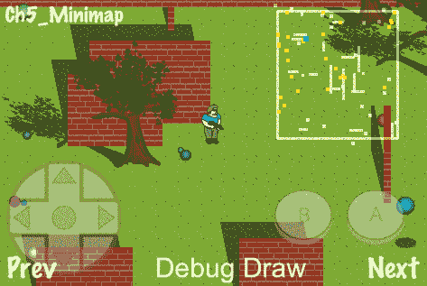

### 准备工作

请参阅项目 *RecipeCollection02* 以获取此菜谱的完整工作代码。

### 如何操作...

执行以下代码：

```swift
#import "Minimap.h"
@implementation Ch5_Minimap
-(CCLayer*) runRecipe {
//Initialize the Minimap object
minimap = [[[Minimap alloc] init] autorelease];
minimap.position = ccp(300,140);
[self addChild:minimap z:10];
//Run our top-down isometric game recipe
[super runRecipe];
//Add trees as static objects
for(id t in trees){
GameObject *tree = (GameObject*)t;
[minimap addStaticObject:ccp(tree.body->GetPosition().x, tree.body->GetPosition().y)];
}
return self;
}
-(void) step:(ccTime)delta {
[super step:delta];
//Set the actor position
[minimap setActor: ccp(gunman.body->GetPosition().x, gunman.body->GetPosition().y)];
//Set individual projectile positions
for(id b in balls){
GameObject *ball = (GameObject*)b;
[minimap setProjectile:ccp(ball.body->GetPosition().x, ball.body->GetPosition().y) withKey:[NSString stringWithFormat:@"%d", ball.tag]];
}
}
//We override this method to automatically add walls to the minimap
-(void) addBrickWallFrom:(CGPoint)p1 to:(CGPoint)p2 height:(float)height {
//Convert wall vertex positions to the properly scaled Box2D coordinates
CGPoint vert1 = ccp(p1.x/PTM_RATIO,p1.y/PTM_RATIO/PERSPECTIVE_RATIO);
CGPoint vert2 = ccp(p2.x/PTM_RATIO,p2.y/PTM_RATIO/PERSPECTIVE_RATIO);
//Add both wall vertices
[minimap addWallWithVertex1:vert1 withVertex2:vert2];
[super addBrickWallFrom:p1 to:p2 height:height];
}
@end

```

### 它是如何工作的...

本例中所示的最小地图基本上是 Box2D 世界的一个简单图形表示，类似于 Box2D 调试绘图例程。在这种情况下，我们调整了 OpenGL 绘图代码以适应我们的需求。

+   最小地图的泛化：

    `Minimap` 类将物理元素泛化成多种类型，然后使用特定的颜色绘制这些类型。这包括墙壁、投射物、静态物体和中心演员。

+   墙：

    墙的顶点存储在两个 `NSMutableArray` 对象中。这些对象被设计为初始设置后不再更新。

+   投射物：

    弹道坐标存储在一个单独的 `NSMutableDictionary` 对象中。这使得我们可以通过使用字典中的 `tag` 属性作为键来重复更新所有弹道。这意味着弹道处于持续运动的状态。

+   静态对象：

    本例中的静态对象是树木。它们代表地图上的静态点，不会移动。它们用与墙壁相同的颜色绘制。大小信息没有存储，因为假设静态对象不是很大。

+   中心角色：

    最后，中心角色的位置以一个大的蓝色点表示。

+   自定义 `Minimap` 类：

    `Minimap` 类代表一个通用的模板，可以针对任何游戏类型或情况进行自定义。通过更改 `scale` 属性、位置信息和绘制程序，`Minimap` 可以
