# 第一章. 使用 Corona SDK 入门

> 在我们直接开始编写一些简单的游戏代码之前，我们需要安装和运行使我们的应用程序变得生动的必要程序。**Corona SDK**主要是一个 2D 开发引擎。如果你有 iOS 或 Android 开发的经验，你会发现使用 Corona SDK 的感觉很清新，使用起来也很简单。很快，你就能创建出可以在 iPhone App Store 和 Google Play Store 上分发的成品。

在本章中，我们将：

+   在 Mac OS X 和 Windows 上设置 Corona SDK

+   为 Mac OS X 安装 Xcode

+   用两行代码创建一个 Hello World 程序

+   在 iOS 配置文件门户中添加设备

+   将应用程序加载到 iOS 设备上

+   将应用程序加载到 Android 设备上

# 下载和安装 Corona

你可以选择在 Mac OS X 或 Microsoft Windows 操作系统上开发。请记住运行程序所需的以下系统要求。

如果你正在为 Mac OS X 安装 Corona，请确保你的系统如下：

+   Mac OS^® X 10.6 或更高版本

+   运行 Snow Leopard 或 Lion 的基于 Intel 的系统

+   64 位 CPU（Core 2 Duo）

+   OpenGL 1.4 或更高版本的图形系统

如果你正在运行 Microsoft Windows，请确保你的系统如下：

+   Windows 7、Vista 或 XP 操作系统

+   推荐的 1 GHz 处理器

+   至少 38MB 的磁盘空间

+   至少 1GB 的 RAM

+   OpenGL 1.3 或更高版本的图形系统（大多数现代 Windows 系统都可用）

# 行动时间——在 Mac OS X 上设置和激活 Corona

让我们从在桌面设置 Corona SDK 开始。

1.  如果你还没有下载 SDK，请在此下载：[`www.anscamobile.com/corona/`](http://www.anscamobile.com/corona/)。在你可以访问 SDK 之前，你必须注册为用户。

1.  任何 Mac 程序的文件扩展名应以`.dmg`结尾，也称为**Apple 磁盘映像**。一旦你下载了磁盘映像，双击磁盘映像文件以挂载它。名称应类似于`CoronaSDK.dmg`。

    一旦加载，你应该会看到如下截图所示的挂载的磁盘映像文件夹：

    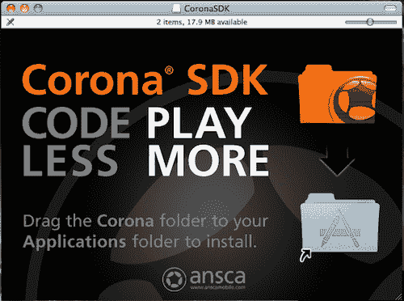

1.  接下来，将`CoronaSDK`文件夹拖到`Applications`文件夹中。这将把 Corona 文件夹的内容复制到`/Applications`。如果你不是账户的主要管理员，你将被提示输入管理员密码。一旦成功安装，你将在`/Applications`中看到`CoronaSDK`文件夹。

    为了方便访问文件夹内容，通过将`CoronaSDK`文件夹拖到 Mac 桌面上的 Dock 创建一个别名。

    

    第一次使用 Corona SDK 的用户在可以访问之前必须执行一个快速且简单的一次性授权过程。

    ### 注意

    你必须连接到互联网才能完成授权过程。

1.  在 SDK 文件夹中启动 Corona 模拟器。

1.  假设这是您第一次使用，您将看到一个最终用户许可协议（EULA）。一旦您接受协议，输入您用于注册 Corona 的电子邮件和密码以激活 SDK。否则，点击**注册**以创建账户。

    ### Note

    如果您以试用用户身份注册 Corona，在 iOS 和/或 Android 设备上进行开发无需付费。希望将应用程序发布到 App Store 或 Google Play 的开发者需要在网站上购买 Corona SDK 订阅，具体操作如下：[`www.anscamobile.com/corona/`](http://www.anscamobile.com/corona/)。

    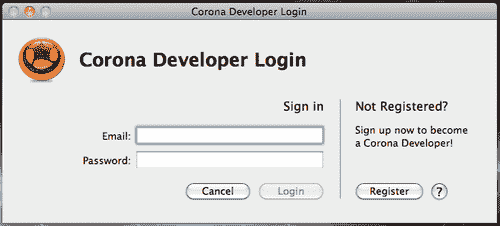

1.  登录成功后，您将看到一个确认对话框，显示 SDK 已准备好使用，如下截图所示：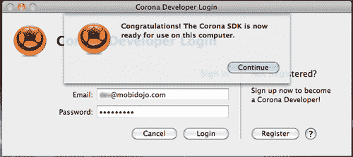

1.  点击**继续**按钮，您将看到**欢迎使用 Corona**屏幕，如下截图所示：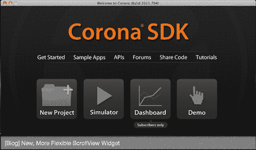

## 刚才发生了什么？

在您的 Mac 操作系统上设置 Corona SDK 与安装任何其他专用 Mac 程序一样简单。在您的机器上授权 SDK 并使用电子邮件和密码登录后，它将准备好使用。从现在开始，每次您启动 Corona 时，它将自动登录到您的账户。您会注意到，当这种情况发生时，您会看到一个**Corona SDK**屏幕。

# Time for action—setting up and activating Corona on Windows

让我们在桌面上设置 Corona SDK。

1.  从以下 URL 下载 Corona SDK：[`www.anscamobile.com/corona/`](http://www.anscamobile.com/corona/)。在您能够访问 SDK 之前，您必须注册为用户。

1.  Corona 的 Windows 版本文件扩展名应以`.msi`结尾，也称为**Windows Installer**，这是微软为安装程序而制作的 Windows 组件。双击该文件。文件名应类似于`CoronaSDK.msi`。

1.  按照屏幕上的安装说明进行操作。

1.  Corona 默认会直接安装到您的`Programs`文件夹中。在 Microsoft Windows 上，从**开始**菜单中选择**Corona**程序列表中的**Corona**，或在桌面上双击 Corona 图标。激活成功后，您应该会看到以下屏幕：

    ### Note

    一旦您第一次启动 Corona，激活 SDK 的过程应该与 Mac 操作过程相同。

    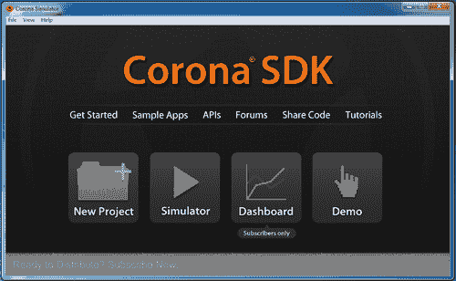

    ### Tip

    如果您遇到图像无法正确显示的问题，请检查您是否使用的是 1.3 或更高版本的最新 OpenGL 图形驱动程序。

    ### Note

    注意，Windows 上的 Corona SDK 只能为 Android 设备构建，不能为 iOS 设备（iPhone、iPad 或 iPod Touch）构建。Mac 可以在 Corona 中为 iOS 设备构建，也可以为 Android 构建应用程序。

1.  要创建设备构建，需要在你的 PC 上安装 Java 6 SDK。你需要访问 JDK 下载页面：[`jdk6.java.net/download.html`](http://jdk6.java.net/download.html)并点击**Java SE 6**选项下的**下载**按钮。

1.  在下一页，选择**接受许可协议**单选按钮，然后点击**Windows x86**链接下载安装程序。如果你还没有，你将被要求在 Oracle 网站上登录或创建一个用户账户。

1.  一旦下载了 JDK，就运行安装程序。安装完成后，你将能够在你的 PC 上创建 Android 的设备构建。

## 刚才发生了什么？

在 Windows 上安装 SDK 的设置与 Mac OS X 不同。在执行安装文件时，Windows 将自动提供一个指定的位置来安装应用程序，例如`Programs`文件夹，这样你就不必手动选择目的地。安装成功后，你将在桌面上看到 Corona SDK 图标，方便访问，或者在**开始**菜单的**程序**列表中突出显示，假设你是第一次访问。当你授权 Corona 在你的机器上，并使用登录信息登录时，它就准备好供你使用了，并且每次启动时都会自动登录。

# 在 Mac 和 Windows 上使用模拟器

在 Mac OS X 上，通过从“应用程序目录”中选择`Corona Terminal`或`Corona Simulator`来启动 Corona SDK。这两个选择都将访问 SDK。`Corona Simulator`只会打开模拟器。`Corona Terminal`将打开模拟器和终端窗口。终端有助于调试你的程序，并显示模拟器错误/警告和`print()`消息。

在 Microsoft Windows 上，选择`Corona SDK`文件夹，然后从你的**开始**菜单中的**程序**列表中选择**Corona Simulator**，或者在桌面上双击 Corona 图标。（如果你使用 Windows，模拟器和终端总是同时打开）。

让我们来看看`Corona SDK`文件夹中包含的有用内容（位于 Mac 上的`Applications/Corona SDK`和 Windows 上的`Start/All Programs/Corona SDK`）：

+   **调试器**（Mac）/**Corona Debugger**（Windows）—用于查找和隔离代码中的问题的工具。

+   **Corona Simulator**—用于测试你的应用程序的环境。它模拟你在本地计算机上开发的移动设备。（在 Windows 上，它将打开模拟器和终端）。

+   **Corona Terminal**—启动**Corona Simulator**并打开一个**终端**窗口来显示错误/警告消息和`print()`语句。这对于调试你的代码非常有帮助（仅在 Mac 上）。

+   **模拟器**——具有与`Corona Terminal`相同的属性，但仅在 Mac 上从命令行调用。

+   **SampleCode**——一组示例应用程序，帮助你开始使用 Corona。包含与代码和艺术资源一起工作的代码。

当你启动模拟器时，**Corona SDK**窗口默认打开。你可以在模拟器中打开一个 Corona 项目，创建用于测试或分发的设备构建，并查看一些示例游戏和应用，以便熟悉 SDK。

# 行动时间——在模拟器中查看示例项目

让我们来看看模拟器中的`HelloPhysics`示例项目：

1.  在**Corona SDK**窗口中点击**模拟器**。

1.  在出现的**打开**对话框中，导航到`Applications/CoronaSDK/SampleCode/Physics/HelloPhysics`（Mac）或`C:\Program Files\Ansca\Corona SDK\Sample Code\Physics\HelloPhysics`（Windows）。在 Mac 上，点击**打开**，它将自动打开`main.lua`。在 Windows 上，双击`main.lua`以打开文件。`HelloPhysics`应用程序在**模拟器**中打开并运行。

## 刚才发生了什么？

通过`Corona Terminal`或`Corona Simulator`访问 SDK 取决于你的操作偏好。许多 Mac 用户更喜欢使用`Corona Terminal`，这样他们可以跟踪终端输出的消息，特别是用于调试目的。当你通过`Corona Simulator`启动 SDK 时，模拟器会显示，但不会显示终端窗口。当 Windows 用户启动**Corona Simulator**时，它将显示模拟器和终端窗口。当你想尝试 Corona 提供的任何示例应用程序时，这是一个很好的选择。

`main.lua`文件是一个特殊的文件名，它告诉 Corona 在项目文件夹中的起始位置。此文件还可以加载其他代码文件或其他程序资源，如声音或图形。

当你在 Corona 中启动`HelloPhysics`应用程序时，你会在模拟器中观察到从屏幕顶部落下的盒子对象与地面对象发生碰撞。从启动`main.lua`文件到在模拟器中查看结果的过程几乎是即时的。

## 尝试不同的设备外壳

当你开始熟悉`Corona Simulator`时，无论是在 Windows 还是 Mac OSX 上，当你启动一个应用程序时，总是使用默认设备。Windows 使用 Droid 作为默认设备，而 Mac OS X 使用标准的 iPhone。尝试在不同的设备外壳上启动示例代码，以查看模拟器提供的所有设备上的屏幕分辨率差异。

当将构建移植到多个平台时，你必须考虑 iOS 和 Android 设备上的各种屏幕分辨率。**构建**是所有源代码编译成的一个文件。将你的游戏构建配置为多个平台可以扩大你应用程序的受众范围。

# 选择文本编辑器

Corona 没有指定的程序编辑器来编写代码，因此您需要找到适合您需求的编辑器。

对于 Mac OS，**TextWrangler**是一个不错的选择，而且也是免费的！你可以在[`www.barebones.com/products/textwrangler/download.html`](http://www.barebones.com/products/textwrangler/download.html)下载它。其他文本编辑器，如[`www.barebones.com/thedeck`](http://www.barebones.com/thedeck)的**BBEdit**和[`macromates.com/`](http://macromates.com/)的**TextMate**也非常好，但使用这些编辑器需要购买。TextMate 还兼容 Corona TextMate Bundle：[`www.ludicroussoftware.com/corona-textmate-bundle/index.html`](http://www.ludicroussoftware.com/corona-textmate-bundle/index.html)。

对于 Microsoft Windows，推荐使用**Notepad++**，可以在[`notepad-plus-plus.org/`](http://notepad-plus-plus.org/)或[`www.crimsoneditor.com/`](http://www.crimsoneditor.com/)下载**Crimson Editor**。这两个编辑器都是免费的。

任何操作系统已经包含的文本编辑器，如 Mac 的 TextEdit 或 Windows 的 Notepad，都可以使用，但使用专为编程设计的编辑器会更容易。对于 Corona，使用支持 Lua 语法高亮的编辑器在编码时效果最佳。语法高亮通过为关键字和标点符号添加格式属性，使读者更容易区分代码和文本。

# 在设备上开发

如果你只想使用 Corona 模拟器，不需要下载 Apple 的**Xcode**或**Android SDK**。为了在 iOS 设备（iPhone、iPod Touch 和 iPad）上构建和测试你的代码，你需要注册为 Apple 开发者并创建和下载配置文件。如果你想开发 Android 应用，除非你想使用 ADB 工具来帮助安装构建和查看调试信息，否则不需要下载 Android SDK。

Corona 模拟器的试用版允许构建 Adhoc（用于 iOS）和调试构建（Android）以在您的设备上进行测试。当应用在设备上运行时，构建将包含一个**试用用户**消息框。如果您想为 Apple 的 App Store 或 Android 的 Google Play Store 构建，则需要购买 Corona 订阅。Corona 订阅者还可以享受仅订阅者可用的功能，如访问每日构建、Corona 论坛上的**仅订阅者**区域和 LaunchPad。

# 行动时间——下载和安装 Xcode

为了开发任何 iOS 应用，你需要注册 Apple 开发者计划，每年费用为 99 美元，并在 Apple 网站上[`developer.apple.com/programs/ios/`](http://developer.apple.com/programs/ios/)创建账户。

1.  点击**立即注册**按钮，按照 Apple 的说明完成流程。

1.  当你完成注册后，点击标记为**Dev Centers**部分下的 iOS 链接。

1.  如果您使用的是 Snow Leopard，请向下滚动到**下载**部分并下载当前的 Xcode。如果您使用的是 Lion，您可以在 Mac App Store 中下载 Xcode。

1.  一旦您完全下载了 Xcode，双击`.mpkg`安装包（图标是一个打开的棕色盒子）。默认情况下，Xcode 将安装到`/Developer`文件夹中。您将被要求以管理员用户身份进行身份验证。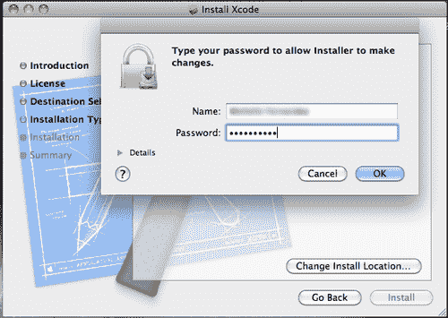

1.  在您输入凭证后，点击**确定**按钮以完成安装。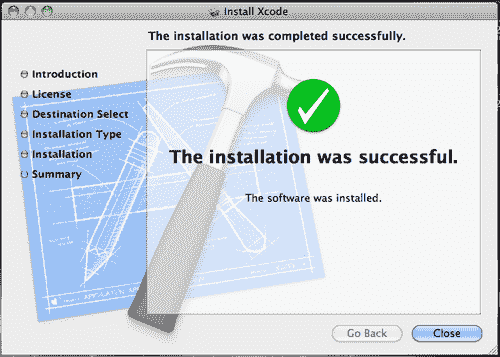

1.  当您安装了 Xcode 开发者工具后，可以通过启动 Xcode 并选择**帮助**菜单中的任何项目来访问文档。Xcode 和 Instruments 等开发者应用程序安装在`/Developer/Applications`中。您可以将以下应用程序图标拖到 Dock 中以方便访问。

## 刚才发生了什么？

我们刚刚介绍了如何在 Mac OS X 上安装 Xcode 的步骤。通过加入 Apple 开发者计划，您将能够访问网站上的最新开发工具。请记住，为了继续成为 Apple 开发者，您必须每年支付 99 美元的费用以保持您的订阅。

Xcode 文件相当大，所以下载所需的时间取决于您的互联网连接速度。当您的安装完成时，Xcode 将准备好使用。

# 行动时间——用两行代码创建 Hello World 应用程序

现在我们已经设置了模拟器和文本编辑器，让我们开始编写我们的第一个 Corona 程序！我们将要编写的第一个程序叫做**Hello World**。这是一个许多人在开始学习一门新编程语言时都会学习的传统程序。

1.  打开您首选的文本编辑器并输入以下行：

    ```java
    textObject = display.newText( "Hello World!", 50, 40, native.systemFont, 36 )
    textObject:setTextColor( 255,255,255)

    ```

1.  接下来，在您的桌面上创建一个名为`Hello World`的文件夹。将前面的文本保存为名为`main.lua`的文件到您的项目文件夹位置。

1.  启动 Corona。您将看到**Corona SDK**界面。点击**模拟器**并导航到您刚刚创建的`Hello World`文件夹。您应该在这个文件夹中看到您的`main.lua`文件，如下面的截图所示：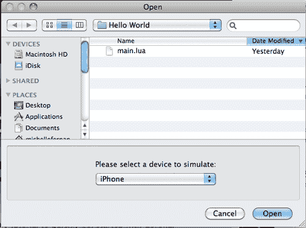

1.  在 Mac 上，点击**打开**按钮。在 Windows 上，选择`main.lua`文件并点击**打开**按钮。您将看到您的新程序在 Corona 模拟器中运行：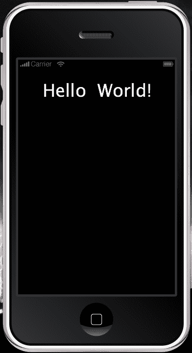

# 行动时间——修改我们的应用程序

在我们深入研究更复杂的示例之前，让我们修改一下您程序中的某些小细节。

1.  让我们修改`main.lua`的第二行，使其显示如下：

    ```java
    textObject = display.newText( "Hello World!", 50, 40, native.systemFont, 36 )
    textObject:setTextColor( 124,252,0 ) 

    ```

1.  保存你的文件，然后回到**Corona 模拟器**。模拟器会检测到文件的变化，并自动重新启动以应用新的更改。如果你在保存文件后模拟器没有自动重新启动，请按*Command + R*（Mac）/*Ctrl + R*（Windows）。

    ### 注意

    随着你继续学习更多的 Corona 函数，你会发现一些文本值将是可选的。在这种情况下，我们需要使用所有五个值。

# 动手实践—给你的应用程序应用一个新的字体名称

现在我们来尝试一下字体名称。

1.  将第一行更改为以下代码：

    ```java
    textObject = display.newText( "Hello World!", 50, 40, "Times New Roman", 36 )

    ```

1.  在进行任何更改后，务必保存你的`main.lua`文件，然后在 Corona 中按*Command+R*（Mac）/*Ctrl+R*（Windows）重新启动模拟器以查看新的字体。如果你使用的是 Mac，通常在保存文件后模拟器会自动重新启动，或者它可能会询问你是否想要重新启动程序。

## 刚才发生了什么？

现在你已经制作了你的第一个完整的移动应用程序！更令人惊讶的是，这是一个完成的 iPhone、iPad 和 Android 应用程序。如果你创建一个构建，这个两行程序实际上会安装并在你的 iOS/Android 设备上运行。你现在已经看到了 Corona 的基本工作流程是什么样的。

如果你查看`main.lua`文件中的第 2 行，你会注意到`setTextColor`改变了`Hello World!`的文本颜色。

颜色由三组**RGB**数字组成，表示颜色中包含的红、绿和蓝色的量。它们以三个从 0 到 255 的数值显示。例如，黑色是(0,0,0)，蓝色是(0,0,255)，白色是(255,255,255)。

继续尝试不同的颜色值，看看不同的结果。当你保存`main.lua`文件并重新启动 Corona 时，你可以在模拟器中看到代码的更改。

当你查看`main.lua`文件的第一行时，你会注意到`newText()`是通过`textObject`调用的，这是一个随后用来引用显示文本的名称。`newText()`函数返回一个对象，它将代表屏幕上的文本。`newText`是显示库的一部分。

当你想访问`newText`的显示属性时，输入`display.newText`。在`Hello World!`后面的两个数字控制文本在屏幕上的水平和垂直位置，单位是像素。下一项指定了字体。我们使用了`native.systemFont`这个名字，它默认指的是当前设备上的标准字体。例如，iPhone 的默认字体是 Helvetica。你可以使用任何标准字体名称，例如`Times New Roman`（在先前的例子中使用过）。最后一个数字是字体大小。

## 尝试一下英雄—添加更多的文本对象

现在你开始对编码有所体会，尝试在你的当前项目文件中应用以下内容：

+   使用不同的字体和文本颜色创建一个新的显示对象。将其显示在“Hello World!”文本下方。提示：确保你的新文本对象有一个不同的对象名称。

+   继续更改当前显示对象`textObject`的值。改变 x 和 y 坐标，字符串文本，字体名称，甚至字体大小。

+   当对象`setTextColor(r,g,b)`设置文本颜色时，你可以添加一个可选参数来控制文本的不透明度。尝试使用对象`setTextColor(r, g, b [, a])`。`a`的值范围也在 0 到 255 之间（255 是不透明的，这是默认值）。观察你的文本颜色的结果。

# 在 iOS 设备上测试我们的应用程序

如果你只想在 Android 设备上测试应用程序，请跳过本章的“在 Android 设备上测试我们的应用程序”部分。在我们能够将第一个 Hello World 应用程序上传到 iOS 设备之前，我们需要登录到我们的 Apple 开发者账户，以便在我们的开发机器上创建和安装我们的签名证书。如果你还没有创建开发者账户，请访问[`developer.apple.com/programs/ios/`](http://developer.apple.com/programs/ios/)进行创建。请记住，成为苹果开发者每年需要支付 99 美元的费用。

### 注意

Apple 开发者账户仅适用于在 Mac OS X 上开发的用户。确保你的 Xcode 版本与你的手机上的操作系统版本相同或更高。例如，如果你安装了 iPhone OS 的 5.0 版本，你需要 Xcode，它包含 iOS SDK 的 5.0 或更高版本。

# 行动时间——获取 iOS 开发者证书

确保你已经注册了开发者计划；你需要使用位于`/Applications/Utilities`的**密钥链访问**工具来创建证书请求。一个有效的证书必须在 iOS 应用程序运行在苹果设备上进行任何类型的测试之前对其进行签名。

1.  打开**密钥链访问** | **证书助手** | **从证书颁发机构请求证书**。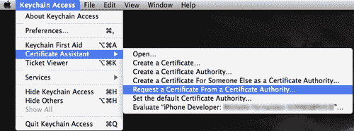

1.  在**用户电子邮件地址**字段中，输入您注册为 iOS 开发者时使用的电子邮件地址。对于**通用名称**，输入您的姓名或团队名称。确保输入的名称与您注册为 iOS 开发者时提交的信息相匹配。**CA 电子邮件地址**字段无需填写，因此您可以将其留空。我们不会将证书通过电子邮件发送给证书颁发机构（CA）。勾选**保存到磁盘**和**让我指定密钥对信息**。当您点击**继续**时，您将被要求选择保存位置。将您的文件保存在您容易找到的位置，例如桌面。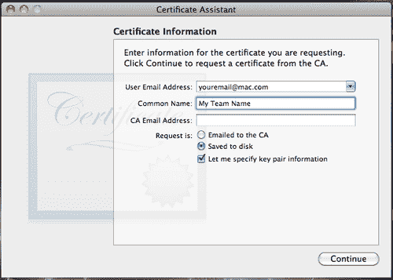

1.  在以下窗口中，确保选择**2048 位**作为**密钥大小**，以及**RSA**作为**算法**，然后点击**继续**。这将生成密钥并将其保存到您指定的位置。在下一个窗口中点击**完成**。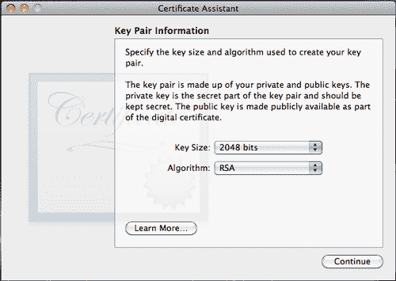

1.  接下来，访问 Apple 开发者网站：[`developer.apple.com/`](http://developer.apple.com/)，点击**iOS 开发中心**，并登录您的开发者账户。选择**iOS 配置文件门户**选项卡，并在左侧列中导航到**证书**。如果尚未选择，请点击**开发**选项卡，然后点击页面右侧的**添加证书**按钮。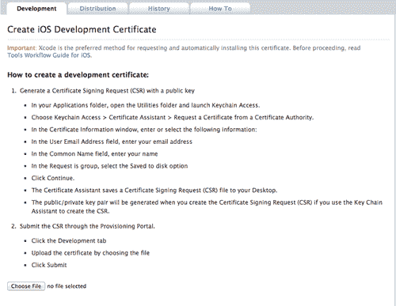

1.  点击**选择文件**按钮，找到您保存在桌面的证书文件，然后点击**提交**按钮。

1.  在按下**提交**按钮后，您将收到从密钥链访问中指定的**证书颁发机构（CA）**请求表单的电子邮件通知。创建证书的人将收到此电子邮件，并可以通过点击**批准**按钮来批准请求。一旦批准，您就可以下载证书。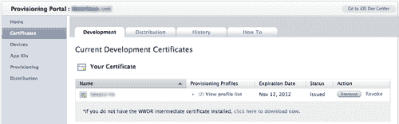

1.  点击**下载**按钮，并将证书保存到易于找到的位置。完成此操作后，双击文件，您将看到以下对话框：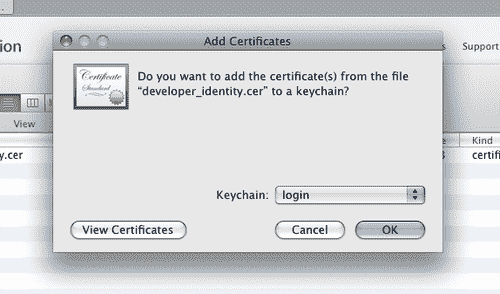

1.  点击**确定**。这将安装您的 iPhone 开发证书到您的密钥链中。

## 刚才发生了什么？

现在我们有了有效的 iOS 设备证书。iOS 开发证书仅用于开发目的，有效期为大约一年。密钥对由您的公钥和私钥组成。私钥是允许 Xcode 为 iOS 应用程序签名的关键。私钥仅对密钥对创建者可用，并存储在创建者的机器的系统密钥链中。以下是一些您可以参考以创建有效证书的网站：

+   在 Ansca 网站上为设备构建：[`developer.anscamobile.com/content/building-devices-iphoneipad`](http://developer.anscamobile.com/content/building-devices-iphoneipad)

+   iPhone 配置设置和 App Store 提交（由 Ansca 工程师创建）：[`www.authorstream.com/Presentation/anscamobile-509082-iphone-provisioning-setup-and-app-store-submission/`](http://www.authorstream.com/Presentation/anscamobile-509082-iphone-provisioning-setup-and-app-store-submission/)

+   AppCode 博客：[`www.theappcodeblog.com/2011/04/28/getting-an-apple-developer-certificate/`](http://www.theappcodeblog.com/2011/04/28/getting-an-apple-developer-certificate/)

## 添加 iOS 设备

在 iPhone 开发者计划中，您可以为开发和测试目的分配多达 100 台设备。要注册设备，您需要**唯一设备标识符（UDID）**号码。您可以在 iTunes 和 Xcode 中找到它。

### Xcode

要找出您的设备 UDID，将您的设备连接到您的 Mac 并打开 Xcode。在 Xcode 中，导航到菜单栏并选择**窗口**，然后点击**组织者**。在**标识符**字段中的 40 个十六进制字符字符串是您的设备 UDID。一旦**组织者**窗口打开，您应该在左侧的**设备**列表中看到您的设备名称。点击它，并用鼠标选择标识符，将其复制到剪贴板：

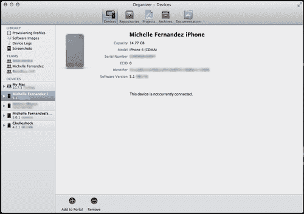

通常，当您第一次将设备连接到**组织者**时，您会收到一个按钮通知，提示**用于开发**。选择它，Xcode 将在 iOS 配置文件门户中为您设备完成大部分配置工作。

### iTunes

将您的设备连接后，打开**iTunes**并点击设备列表中的您的设备。选择**摘要**选项卡。单击**序列号**标签以显示**标识符**字段和 40 个字符的 UDID。按*Command + C*将 UDID 复制到您的剪贴板。

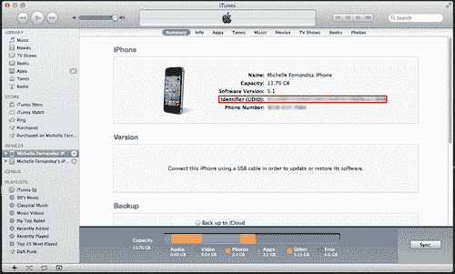

# 行动时间——添加/注册您的 iOS 设备

要添加用于开发和测试的设备：

1.  在 iOS 配置文件门户中选择**设备**，然后点击**添加设备**。

1.  在**设备名称**字段中为您的设备创建一个名称，并通过按*Command* + *V*粘贴您已保存到剪贴板上的 UDID 到**设备 ID**。

1.  完成后，点击**提交**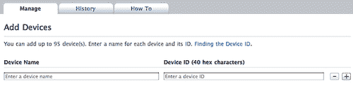

# 行动时间——创建 App ID

现在您已将设备添加到门户，您需要创建一个**App ID**。App ID 有一个由 Apple 生成的唯一 10 字符**包种子 ID**前缀和一个由配置文件门户中的团队管理员创建的**包标识符**后缀。App ID 可能看起来类似于以下示例：`7R456G1254.com.companyname.YourApplication`。要创建新的 App ID，请按照以下步骤操作：

1.  在门户的**App ID**部分点击**新建 App ID**按钮。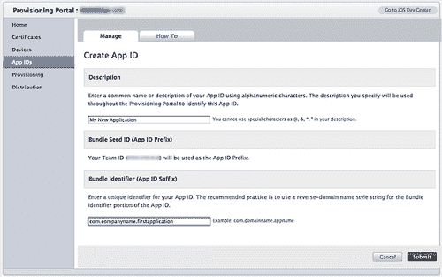

1.  在**描述**字段中填写您的应用程序名称。

1.  您已经分配了一个包种子 ID（也称为**团队 ID**）。

1.  在**包标识符（App ID 后缀）**字段中，指定您应用程序的唯一标识符。您可以根据自己的意愿来识别您的应用程序，但建议您使用反向域名风格的字符串，即`com.domainname.appname`。

    ### 注意

    您可以在**包标识符**中创建一个通配符字符，您可以在使用相同密钥链访问权限的一组应用程序之间共享。为此，只需创建一个以星号(*)结尾的单个 App ID。您可以将此放在**包标识符**字段中，无论是单独使用还是放在字符串的末尾：`com.domainname.*`。有关此主题的更多信息，请参阅 iOS 配置文件门户的 App IDs 部分：[`developer.apple.com/ios/manage/bundles/howto.action`](https://developer.apple.com/ios/manage/bundles/howto.action)。

## 刚才发生了什么？

每个设备的 UDID 都是唯一的，我们可以在 Xcode 和 iTunes 中找到它们。当我们在 iOS 配置文件门户中添加设备时，我们取了 UDID，它由 40 个十六进制字符组成，并确保我们创建了一个设备名称，这样我们就可以识别我们用于开发的内容。

我们现在有一个用于在设备上安装的应用程序的 App ID。**App ID**是一个 iOS 用来允许您的应用程序连接到 Apple 推送通知服务、在应用程序之间共享密钥链数据以及与您希望将 iOS 应用程序与其配对的任何外部硬件配件进行通信的唯一标识符。

## 配置文件

**配置文件**是一组数字实体，它将开发者和设备与授权的 iOS 开发团队唯一关联，并允许设备用于测试。这些配置文件将您的设备与您的开发团队关联起来，用于测试和分发。

# 操作时间——创建配置文件

要创建**配置文件**，请转到 iOS 配置文件门户的**配置**部分，并在**开发**选项卡上点击**新建配置文件**。

1.  为配置文件输入一个名称。它可以与您的应用程序名称相同。

1.  在**证书**旁边的框中勾选。

1.  在下拉菜单中选择为您的应用程序创建的**App ID**。

1.  检查您希望为此配置文件授权的设备。

1.  完成后点击**提交**按钮。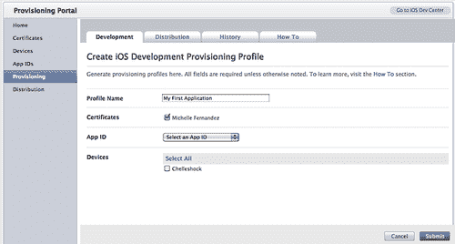

1.  您将被返回到**开发**选项卡，状态可能显示为**挂起**。在您的浏览器上点击**刷新**，它应该显示您的配置文件状态为**活动**。

1.  点击**下载**按钮。当文件正在下载时，如果 Xcode 还未打开，请启动它，并在键盘上按*Shift* + *Command* + *2*以打开**组织者**。

1.  在**库**下，选择**配置文件**部分。将下载的`.mobileprovision`文件拖放到**组织者**窗口。这将自动将`.mobileprovision`文件复制到正确的目录。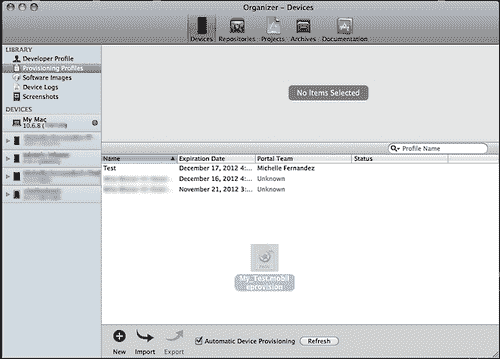

## 刚才发生了什么？

在**配置文件**中拥有权限的设备可以用于测试，只要证书包含在配置文件中。一个设备可以安装多个配置文件。

## 应用程序图标

目前我们的应用程序没有图标图像在设备上显示。默认情况下，如果没有为应用程序设置图标图像，则在构建加载到您的设备后，您将看到一个浅灰色框以及下面的应用程序名称。因此，启动您首选的创意开发工具，让我们创建一个简单的图像。

iPhone/iTouch 的应用程序图标应为 57 x 57 PNG 图像文件或 72 x 72 的 iPad。图像应始终保存为`Icon.png`，并且必须位于您的当前项目文件夹中。对于支持**Retina**显示的 iPhone / iPod touch 设备，我们还需要一个额外的 114 x 114 的高分辨率图标，命名为`Icon@2x.png`。

您当前项目文件夹的内容将如下所示：

```java
Hello World/ name of your project folder
Icon.png required for iPhone/iPod/iPad
Icon@2x.png required for iPhone/iPod with Retina display
main.lua

```

为了分发您的应用程序，App Store 需要一个 512 x 512 像素的图标版本。最好首先以更高的分辨率创建您的图标。请参阅**Apple iOS 人机界面指南**以获取最新的官方 App Store 要求：

[`developer.apple.com/library/ios/#documentation/userexperience/conceptual/mobilehig/Introduction/Introduction.html`](http://developer.apple.com/library/ios/#documentation/userexperience/conceptual/mobilehig/Introduction/Introduction.html)

创建应用程序图标是您应用程序名称的视觉表示。一旦您将构建编译在一起，您就能在设备上查看该图标。该图标也是启动您应用程序的图像。

# 创建 iOS 的 Hello World 构建

我们现在准备为我们的设备构建“Hello World”应用程序。由于我们已经设置了配置文件，因此从现在开始的构建过程相当简单。在创建设备构建之前，请确保您已连接到互联网。您可以在**Xcode 模拟器**或设备上测试构建您的应用程序。

# 创建 iOS 构建的行动时间

按照以下步骤在 Corona SDK 中创建新的 iOS 构建：

1.  打开 Corona 模拟器并选择**模拟器**。

1.  导航到您的“Hello World”应用程序并选择您的`main.lua`文件。

1.  一旦在模拟器上启动应用程序，请转到 Corona 模拟器的菜单栏，并选择**文件** | **构建** | **iOS**，或在键盘上按*Command* + *B*。将出现以下对话框：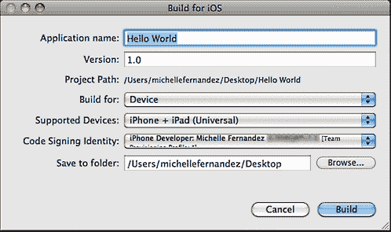

1.  在**应用程序名称**字段中为您的应用创建一个名称。我们可以保持相同的名称**Hello World**。在**版本**字段中，保持数字为**1.0**。为了在 Xcode 模拟器中测试应用程序，从**构建目标**下拉菜单中选择**Xcode 模拟器**。如果您想为设备构建，请选择**设备**以构建应用程序包。接下来，从**支持设备**下拉菜单中选择目标设备（iPhone 或 iPad）。在**代码签名标识**下拉菜单下，选择为构建指定的设备创建的配置文件。它与 Apple 开发者网站上 iOS 配置门户中的**配置文件名称**相同。在**保存到文件夹**部分，点击**浏览**并选择您希望应用程序保存的位置。

1.  如果所有信息已在对话框中确认，请点击**构建**按钮。

    ### 小贴士

    将您的应用程序设置为保存在`桌面`上会更方便；这样更容易找到。

## 刚才发生了什么？

恭喜！您现在已成功创建了第一个 iOS 应用程序文件，可以上传到您的设备。随着您开始为分发开发应用程序，您将想要创建应用程序的新版本，以便您可以跟踪每次构建中的更改。您的**配置文件**中的所有信息都是在 iOS 配置门户中创建的，并应用于构建。一旦 Corona 完成编译构建，应用程序应位于您保存它的首选文件夹中。

# 操作时间——在您的 iOS 设备上加载应用

选择您创建的 Hello World 构建，并选择以下任一选项来将您的应用加载到 iOS 设备上。可以使用 iTunes、Xcode 或 iPhone 配置实用程序来传输应用程序文件。

如果使用 iTunes，将您的构建拖入 iTunes 库，然后正常同步您的设备。

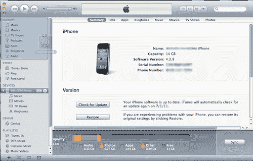

将您的应用安装到设备上的另一种方法是使用 Xcode，因为它提供了方便的方法来安装 iOS 设备应用。

1.  连接设备后，从菜单栏打开 Xcode 的**组织者**，**窗口** | **组织者**，然后在左侧的**设备**列表下导航到您的连接设备。

1.  如果建立了正确的连接，您将看到一个绿色的指示器。如果几分钟后它变成黄色，尝试关闭并重新启动设备或断开连接并再次连接。这通常会建立正确的连接。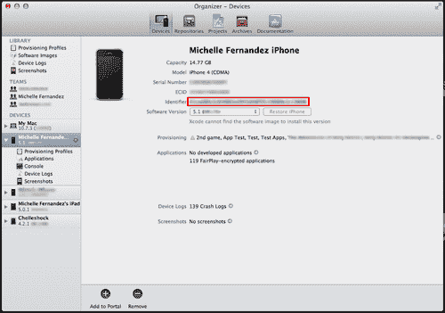

1.  简单地将您的构建文件拖放到**组织者**窗口的**应用程序**区域，它将自动安装到您的设备上。

    最后，您可以使用从 Apple 网站**支持**标签页下作为单独下载的 iPhone 配置实用程序：[`www.apple.com/support/iphone/enterprise/`](http://www.apple.com/support/iphone/enterprise/)。它允许您管理配置配置文件，跟踪和安装配置文件和授权应用程序，并捕获包括控制台日志在内的设备信息。

1.  点击**下载**按钮，按照如何安装程序的说明进行操作。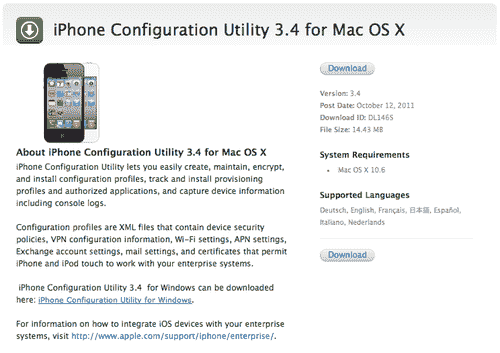

1.  确保您的设备连接到您的计算机，启动 iPhone 配置实用程序，然后点击窗口左上角的**添加**按钮。导航到您桌面上的 Hello World 构建或您保存它的任何位置，然后点击**打开**。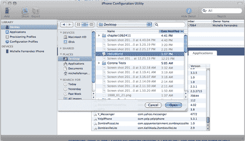

1.  当您的设备被识别后，在**设备**部分下选择您的设备。您将看到当前已安装或尚未安装的应用程序列表。点击您添加到实用程序中的 Hello World 应用程序旁边的**安装**按钮。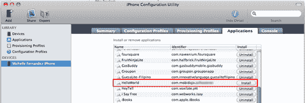

    ### 小贴士

    如果您正在重复测试相同版本号的应用程序，确保在新的安装之前从设备中删除应用程序的先前版本，以删除任何缓存的或相关数据。或者在使用构建选项时使用不同的版本号。

## 刚才发生了什么？

我们刚刚学习了三种不同的方法，使用 iTunes、Xcode 和 iPhone 配置实用程序将应用程序构建加载到 iOS 设备上。

使用 iTunes 提供简单地将构建拖放到您的**库**中的功能，然后允许您在设备同步的情况下传输构建。

Xcode 方法可能是最简单且最常见的方法来将构建加载到设备上。只要您的设备连接正确且准备在**组织者**中使用，将构建拖放到**应用程序**中，它就会自动加载。

最后，iPhone 配置实用程序是一个逐步的工具，您可以通过它轻松区分哪些应用程序已安装到您的设备上。当您在主**库**中加载您的构建时，**设备**区域将列出您想要安装或卸载的应用程序。找到您的构建后，您只需点击**安装**按钮，文件就会被加载。

# 在 Android 设备上测试我们的应用程序

在 Android 设备上创建和测试我们的构建不需要像苹果对 iOS 设备那样需要一个开发者账户。您只需要为 Android 构建所需的工具是一个 PC 或 Mac、Corona SDK、JDK6 安装和一个 Android 设备。如果您计划将应用程序提交到 Google Play 商店，您需要在[`play.google.com/apps/publish`](http://play.google.com/apps/publish)注册为 Google Play 开发者。如果您想在 Google Play 商店发布软件，您需要支付一次性的 25 美元注册费。

# 创建 Android 的 Hello World 构建

由于我们不需要为调试构建创建唯一的**密钥库**或**密钥别名**，因此构建我们的 Hello World 应用程序相当简单。当您准备好将应用程序提交到 Google Play 商店时，您需要创建一个发布构建并生成您自己的私钥来签名您的应用程序。我们将在本书的后面部分更详细地讨论发布构建和私钥。

# 创建 Android 构建的行动时间

按照以下步骤在 Corona SDK 中创建新的 Android 构建：

1.  启动 Corona 模拟器并选择**模拟器**。

1.  导航到您的 Hello World 应用程序并选择您的`main.lua`文件。

1.  一旦您的应用程序在模拟器上运行，请转到**Corona 模拟器**菜单栏，选择**文件** | **构建为** | **Android**（Windows）/*Shift + Command + B*（Mac）。将出现以下对话框：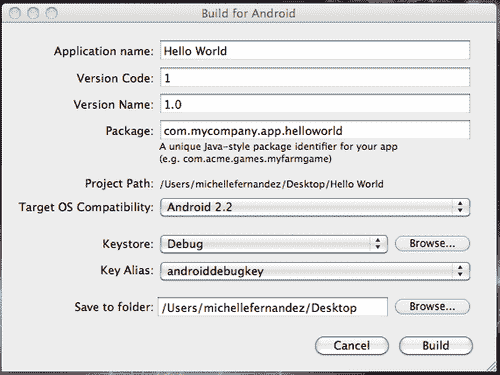

1.  在**应用程序名称**字段中为您的应用程序创建一个名称。我们可以保持相同的名称`Hello World`。在**版本代码**字段中，如果默认值不是数字`1`，请将其设置为`1`。这个特定的字段必须始终是整数，并且对用户不可见。在**版本名称**字段中，保持数字为`1.0`。此属性是显示给用户的字符串。在**包**字段中，您需要指定一个使用传统 Java 方案的名称，这基本上是您域名名称的反向格式。例如，`com.mycompany.app.helloworld`可以作为包名。**项目路径**显示了您的项目文件夹的位置。**目标操作系统兼容性**目前支持运行 ArmV7 处理器的 Android 2.2 及更高版本设备。在**密钥库**字段中，您将使用 Corona 中已提供的`Debug`密钥库对构建进行签名。在**密钥别名**字段中，如果未选择，请从下拉菜单中选择`androiddebugkey`。在**保存到文件夹**部分，点击**浏览**并选择您希望应用程序保存的位置。

1.  如果对话框中所有信息都已确认，请点击**构建**按钮。

    ### 注意

    有关 Java 包名的更多信息，请参阅 Java 文档中关于**唯一包名**的部分：[`java.sun.com/docs/books/jls/third_edition/html/packages.html#40169`](http://java.sun.com/docs/books/jls/third_edition/html/packages.html#40169)。

## 刚才发生了什么？

您已经创建了您的第一个 Android 构建！看看这有多简单？由于 Corona SDK 已经在引擎中提供了`Debug`密钥库和`androiddebugkey`密钥别名，因此大部分签名工作已经为您完成。您唯一需要做的就是填写应用程序的构建信息，然后点击**构建**按钮以创建调试构建。您的 Hello World 应用程序将保存为`.apk`文件，位置为指定的位置。文件名将显示为`Hello World.apk`。

# 操作时间——在您的 Android 设备上加载应用程序

有几种方法可以将您的 Hello World 构建加载到 Android 设备上，而无需下载 Android SDK。以下是一些简单的方法：

将`.apk`文件上传到设备的最基本方法是通过 USB 接口将其传输到 SD 卡。如果您的设备没有某种文件管理器应用程序，您可以从 Google Play Store 下载一个很好的应用程序，即 ASTRO 文件管理器，网址为：[`play.google.com/store/apps/details?id=com.metago.astro`](http://https://play.google.com/store/apps/details?id=com.metago.astro)。还有许多其他安装程序，如 AppInstaller，网址为：[`play.google.com/store/apps/details?id=com.funtrigger.appinstaller`](http://https://play.google.com/store/apps/details?id=com.funtrigger.appinstaller)。AppInstaller 允许您从 SD 卡安装`.apk`文件。您始终可以在设备上的 Google Play Store 应用程序中搜索前面的应用程序。

1.  在您的设备**设置**中，选择**应用程序**然后选择**开发**。如果该模式未激活，请触摸**USB 调试**。

1.  返回几屏到**应用程序**部分。如果尚未激活，请启用**未知来源**。这将允许您安装任何非市场应用程序（即调试构建）。完成后，在您的设备上按主页按钮。

1.  使用 USB 电缆将设备连接到您的计算机。您将看到一个新通知，表明已连接到您的 PC 或 Mac 的新驱动器。访问 SD 驱动器并创建一个新文件夹。为文件夹命名，以便您能够轻松识别您的 Android 构建。将`Hello World.apk`文件从桌面拖放到文件夹中。

1.  将驱动器从您的桌面弹出，并从 USB 电缆断开您的设备。启动 ASTRO 文件管理器或 AppInstaller，无论您决定从 Google Play Store 下载哪个应用程序。在 ASTRO 中，选择**文件管理器**，搜索您在 SD 卡上添加的文件夹并选择它。在 AppInstaller 中，搜索您新命名的文件夹并选择它。在这两个应用程序中，您都会看到您的`Hello World.apk`文件。选择文件，将出现一个提示要求您安装它。选择**安装**按钮，您应该会在设备的**应用**文件夹中看到 Hello World 应用程序。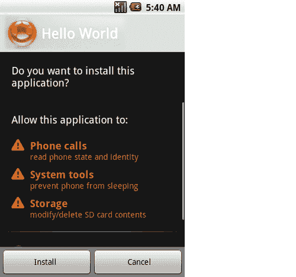

    通过 Dropbox 是一种方便的方法。您可以在：[`www.dropbox.com/`](https://www.dropbox.com/) 创建账户。Dropbox 是一项免费服务，允许您在 PC/Mac 和移动设备上上传/下载文件。

1.  下载 Dropbox 安装程序并在您的计算机上安装它。同时，从 Google Play 商店（也是免费的）下载移动应用程序到您的设备并安装它。

1.  在您的计算机和移动设备上登录 Dropbox 账户。从您的计算机上传 `Hello World.apk` 文件。

1.  一旦上传完成，请前往您设备上的 Dropbox 应用并选择您的 `Hello World.apk` 文件。您将看到一个屏幕，它会询问您是否想要安装应用程序。选择**安装**按钮。假设安装正确，另一个屏幕将出现，显示**应用程序已安装**，您可以通过按下可用的**打开**按钮来启动您的 Hello World 应用程序。

    其中一种最简单的方法是通过 Gmail。如果您还没有 Gmail 账户，请在此处创建一个：[`mail.google.com/`](https://mail.google.com/)。

1.  登录您的账户，编写一封新电子邮件并将您的 `Hello World.apk` 文件附加到消息中。

1.  将消息的收件人地址设为您自己的电子邮件地址并发送。

1.  在您的 Android 设备上，确保您已经将电子邮件账户链接到那里。一旦收到消息，打开电子邮件，您将有一个选项将应用程序安装到您的设备上。将显示一个**安装**按钮或类似按钮。

## 刚才发生了什么？

我们刚刚学习了如何将 `.apk` 文件加载到 Android 设备上的几种方法。前面提到的方法是一些快速加载应用程序且不会遇到任何问题的最简单方法。

使用文件管理器方法允许您轻松访问 `.apk` 文件，无需任何运营商数据或 Wi-Fi 连接。通过使用与您的设备兼容的 USB 线缆并将其连接到计算机，这是一个简单的拖放过程。

Dropbox 方法是在您的计算机和移动设备上设置后最方便的方法之一。您所要做的就是将 `.apk` 文件拖放到您的账户文件夹中，它将立即对安装了 Dropbox 应用的任何设备可访问。您还可以通过下载链接共享您的文件——这是 Dropbox 提供的另一个出色功能。

如果您不想在您的设备或计算机上下载任何文件管理器和其他程序，设置 Gmail 账户并将您的 `.apk` 文件作为附件发送给自己是一个简单的过程。您唯一需要记住的是，在 Gmail 中，您不能发送超过 25 MB 大小的附件。

## 快速问答——理解 Corona

1.  当使用 Corona 时，以下哪个陈述是正确的？

    +   a. 您需要一个 `main.lua` 文件来启动您的应用程序。

    +   b. Corona SDK 只在 Mac OSX 上运行。

    +   c. Corona 终端不会启动模拟器。

    +   d. 以上都不是。

1.  在 iPhone 开发者计划中，您可以使用多少个 iOS 设备进行开发？

    +   a. 50。

    +   b. 75。

    +   c. 5.

    +   d. 100.

1.  在 Corona SDK 中为 Android 构建时，版本代码应该是什么？

    +   a. 一个字符串。

    +   b. 一个整数。

    +   c. 必须遵循 Java 方案格式。

    +   d. 以上皆非。

# 摘要

在本章中，我们介绍了开始为 Corona SDK 开发应用程序所需的必要工具。无论您是在 Mac OS X 还是 Microsoft Windows 上工作，您都会注意到在两个操作系统上工作的相似性，以及运行 Corona SDK 的简单性。

为了更好地熟悉 Corona，尝试以下操作：

+   抽时间查看 Corona 提供的示例代码，以查看 SDK 的功能。

+   随意修改任何示例代码，以适应您的喜好，从而更好地理解 Lua 编程。

+   无论您是在 iOS 上工作（如果您是注册的 Apple 开发者）还是 Android，尝试将任何示例代码安装到您的设备上，以查看应用程序在模拟器环境之外的运行情况。

+   查看 Ansca 论坛[`developer.anscamobile.com/forum/`](http://developer.anscamobile.com/forum/)，浏览由 Corona SDK 开发者和员工发起的最新关于 Corona 开发的讨论。

既然您已经了解了在 Corona 中显示对象的过程，我们将深入探讨其他有助于创建可运行移动游戏的功能。

在下一章中，我们将更深入地探讨 Lua 编程语言，并学习与 Corona 中示例代码类似的简单编码技巧。您将更好地理解 Lua 语法，并注意到与其他编程语言相比，学习 Lua 的速度和容易程度。
