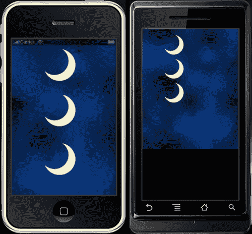
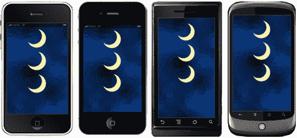
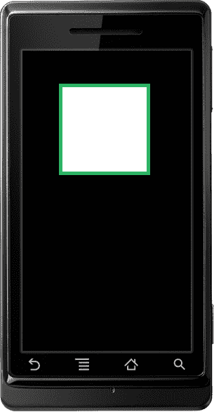
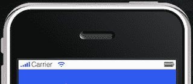
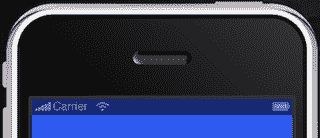
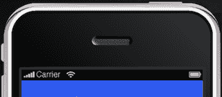

# 第二章：Lua 快速入门和 Corona 框架

> **Lua** 是开发 Corona SDK 所使用的编程语言。到目前为止，我们已经学习了如何使用主要资源来运行 SDK 和其他开发工具来创建移动设备的应用程序。现在我们已经尝试编写了一些使程序工作的代码行，让我们深入了解 Lua 的基本功能，这将让您更好地理解 Lua 的能力。

在本章中，您将学习如何：

+   将变量应用于脚本

+   使用数据结构来形成表

+   与显示对象一起工作

+   使用对象方法和参数实现函数

+   优化你的工作流程

所以让我们直接进入正题。

# Lua 来帮忙

Lua 是游戏编程的行业标准。它与 JavaScript 和 Flash 的 ActionScript 类似。任何在这些语言中编写过脚本的人都会很快过渡到 Lua。

Lua 在创建各种应用程序和游戏中非常有用。许多游戏程序员发现 Lua 是一种方便的脚本语言，因为它易于嵌入、执行速度快，学习曲线平缓。它在《魔兽世界》中无处不在。它也被电子艺界、Rovio、ngmoco 和 Tapulous 等公司用于愤怒的小鸟、Tap Tap Revenge、Diner Dash 等游戏。

如需了解更多关于 Lua 的信息，请参阅 [`www.lua.org`](http://www.lua.org)。

# 有价值的变量

就像在许多脚本语言中一样，Lua 有变量。您可以将它视为存储值的东西。当您将值应用于变量时，您可以使用相同的变量来引用它。

一个应用程序由语句和变量组成。**语句**提供关于需要执行的操作和计算指令。**变量**存储这些计算的结果。将值赋给变量称为**赋值**。

Lua 使用三种类型的变量：**全局、局部**和**表字段**。

## 全局变量

**全局变量**可以在任何范围内访问，并且可以从任何地方修改。术语范围用于描述一组变量存在的区域。您不必声明全局变量。一旦您给它赋值，它就会创建。

```java
myVariable = 10
print( myVariable ) -- prints the number 10

```

## 局部变量

**局部变量**是从局部范围访问的，通常是从**函数**或代码块中调用。当我们创建一个块时，我们正在创建一个变量可以存在或一系列按顺序执行的语句的范围。当引用变量时，Lua 必须找到该变量。局部化变量有助于加快查找过程并提高代码的性能。通过使用局部语句，它声明了一个局部变量。

```java
local i = 5 -- local variable

```

以下是如何在块中声明局部变量的方法：

```java
x = 10 -- global 'x' variable
local i = 1
while i <= 10 do
local x = i * 2 -- a local 'x' variable for the while block
print( x ) -- 2, 4, 6, 8, 10 ... 20
i = i + 1
end
print( x ) -- prints 10 from global x

```

## 表字段（属性）

表字段是表本身的部分。数组可以用数字、字符串或任何与 Lua 相关的值（除了 nil）来索引。您可以使用整数索引到数组以将值分配给字段。当索引是一个字符串时，该字段被称为**属性**。所有属性都可以使用点操作符（`x.y`）或字符串（`x["y"]`）来索引到表。结果是相同的。

```java
x = { y="Monday" } -- create table
print( x.y ) -- "Monday"
z = "Tuesday" -- assign a new value to property "Tuesday"
print( z ) -- "Tuesday"
x.z = 20 -- create a new property
print( x.z ) -- 20
print( x["z"] ) -- 20

```

更多有关表的信息将在名为*Tables*的部分中讨论。

你可能已经注意到了前面示例中某些代码行的附加文本。那些就是所谓的注释。注释可以从任何位置开始，使用双破折号`--`，除了字符串内部。它们一直运行到行尾。还有块注释。注释一个块的一个常见技巧是将其包围在`--[[`。

这里是如何注释一行：

```java
a = 2
--print(a) -- 2 

```

以下是一个块注释：

```java
--[[
k = 50
print(k) -- 50
]]--

```

## 赋值约定

变量名有一些规则。变量以字母或下划线开头。它不能包含除了字母、下划线或数字之外的其他任何内容。它也不能是 Lua 保留的以下单词之一：

+   `which`

+   `are`

+   `and`

+   `break`

+   `do`

+   `else`

+   `elseif`

+   `end`

+   `false`

+   `for`

+   `function`

+   `if`

+   `in`

+   `local`

+   `nil`

+   `not`

+   `or`

+   `repeat`

+   `return`

+   `then`

+   `true`

+   `until`

+   `while`

以下变量是有效的：

+   `x`

+   `X`

+   `ABC`

+   `_abc`

+   `test_01`

+   `myGroup`

以下是不合法的变量：

+   `function`

+   `my-variable`

+   `123`

### 注意

*Lua 也是一种区分大小写的语言*。例如，使用`else`是一个保留字，但*Else*和*ELSE*是两个不同的、有效的名称。

# 值的类型

Lua 是一种动态类型语言。语言中没有定义的类型。每个值都携带自己的类型。

正如你所注意到的，值可以存储在变量中。它们可以被操作以给出任何类型的值。这也允许你将参数传递给其他函数，并作为结果返回。

你将处理的基本值类型如下：

+   `nil`——它是唯一一个值是`nil`的类型。任何未初始化的变量都有`nil`作为其值。像全局变量一样，它默认是`nil`，并且可以将`nil`赋给它来删除它。

+   `Boolean`——布尔类型有两个值，`false`和`true`。你会注意到，条件表达式将`false`和`nil`视为假，将其他任何内容视为真。

+   `Numbers`——表示实数（双精度浮点数）。

+   `String`——字符串是一系列字符。允许 8 位字符和嵌入的零。

+   `Tables`——Lua 中的数据结构。它通过关联数组实现，这是一种不仅可以使用数字索引，还可以使用字符串或任何其他值（除了`nil`）索引的数组。（我们将在本章后面的*Tables*部分中进一步讨论这一点）。 

+   `Functions`——称为 Lua 的第一类值。通常，函数可以存储在变量中，作为参数传递给其他函数，并作为结果返回。

# 行动时间——使用块打印值

让我们试一试，看看 Lua 语言有多强大。我们开始了解变量是如何工作的，以及当你给它赋值时会发生什么。如果你有一个具有多个值的变量怎么办？Lua 如何区分它们？我们将使用`Corona Terminal`，这样我们就可以在终端框中看到输出的值。在这个过程中，你将随着本节的进展学习其他编程技巧。我们还将在这个练习中引用代码块。Lua 的执行单元被称为**代码块**。代码块是一系列语句，它们按顺序执行。

如果你记得上一章的内容，我们学习了如何为 Hello World 应用程序创建自己的项目文件夹和`main.lua`文件。

1.  在你的桌面上创建一个新的项目文件夹，并将其命名为`Variables`。

1.  打开你喜欢的文本编辑器，并将其保存为`Variables`项目文件夹中的`main.lua`。

1.  创建以下变量：

    ```java
    local x = 10 -- Local to the chunk
    local i = 1 -- Local to the chunk

    ```

1.  在`while`循环中，添加以下代码：

    ```java
    while i<=x do
    local x = i -- Local to the "do" body
    print(x) -- Will print out numbers 1 through 10
    i = i + 1
    end

    ```

1.  创建一个`if`语句来表示另一个局部体：

    ```java
    if i < 20 then
    local x -- Local to the "then" body
    x = 20
    print(x + 5) -- 25
    else
    print(x) -- This line will never execute since the above "then" body is already true
    end
    print(x) -- 10

    ```

1.  保存你的脚本。

1.  启动`Corona Terminal`。确保你看到**Corona SDK**屏幕和一个终端窗口弹出。

1.  导航到你的`Variables`项目文件夹，并在模拟器中打开你的`main.lua`文件。你会注意到模拟器中的设备是空的，但如果你查看你的终端窗口，你会看到一些代码打印出的结果如下：

    ```java
    1
    2
    3
    4
    5
    6
    7
    8
    9
    10
    25
    10

    ```

## 刚才发生了什么？

创建的前两个变量在每个代码块外部都是局部的。注意在`while`循环的开始，`i <= x`指的是第 1 行和第 2 行的变量。`while`循环内部的`local x = i`语句仅限于`do`体的局部，并且与`local x = 10`不同。`while`循环运行十次，每次递增 1 打印出一个值。

`if`语句比较`i < 20`，其中`i`等于 1，并使用另一个局部于`then`体的`local x`。由于该语句为真，`x`等于 20，并打印出`x + 5`的值，即 25。

最后一条语句`print(x)`没有连接到`while`循环或`if`语句中的任何代码块。因此，它指的是`local x = 10`，并在终端窗口中打印出`10`的值。这可能会让人感到困惑，但了解 Lua 中局部和全局变量如何工作是很重要的。

# 表达式

**表达式**是具有值的某种东西。它可以包括数值常数、引号字符串、变量名、一元和二元运算以及函数调用。

## 算术运算符

`+, -, *, /, %`和`^`被称为**算术运算符**。

以下是一个使用*二进制算术*运算符的示例：

```java
t = 2*(2-5.5)/13+26
print(t) -- 25.461538461538

```

以下是一个使用*模数*（除法余数）运算符的示例：

```java
m = 18%4
print(m) -- 2

```

以下是一个使用*幂*运算符的示例：

```java
n = 7²
print(n) --49

```

## 关系运算符

**关系运算符**总是返回`false`或`true`，并询问是或否的问题。

`<, >, <=, >=, ==`, 和 `~=` 是一些关系运算符。

运算符 `==` 检查相等性，而运算符 `~=` 是相等性的否定。如果值类型不同，则结果为假。否则，Lua 会比较值及其类型。数字和字符串按常规方式比较。表和函数通过引用比较，只要两个这样的值被认为是相等的，只有当它们是同一个对象时。

以下是一些关系运算符的示例。它将显示一个 `布尔` 结果，并且不能与字符串连接：

```java
print(0 > 1) --false
print(4 > 2) --true
print(1 >= 1) --true
print(1 >= 1.5) --false
print(0 == 0) --true
print(3 == 2) --false
print(2 ~= 2) --false
print(0 ~= 2) --true

```

## 逻辑运算符

Lua 中的 **逻辑运算符** 是 `and, or`, 和 `not`。所有逻辑运算符都将 `false` 和 `nil` 视为假，将其他任何内容视为真。

运算符 `and` 如果其值是 `false` 或 `nil`，则返回其第一个参数；否则返回其第二个参数。运算符 `or` 如果其值不同于 `nil` 和 `false`，则返回其第一个参数；否则返回其第二个参数。`and` 和 `or` 都使用短路评估，这意味着第二个操作数只有在必要时才会被评估。

```java
print(10 and 20) -- 20
print(nil and 1) -- nil
print(false and 1) -- false
print(10 or 20) -- 10
print(false or 1) -- 1

```

运算符 `not` 总是返回 `true` 或 `false`：

```java
print(not nil) -- true
print(not true) -- false
print(not 2) -- false

```

## 连接

Lua 中的 **字符串连接运算符** 用两个点 `...` 表示。它接受两个字符串作为操作数并将它们拼接在一起。如果其操作数中包含数字，则它们也会被转换为字符串。

```java
print("Hello " .. "World") -- Hello World
myString = "Hello"
print(myString .. " World") -- Hello World

```

## 长度运算符

**长度运算符** `#` 测量字符串的长度。字符串的长度简单地是其字符数。一个字符被视为 1 字节。

```java
print(#"*") --1
print(#"\n") --1
print(#"hello") --5
myName = "Jane Doe"
print(#myName) --8

```

## 优先级

Lua 中的运算符优先级如下，从高到低优先级：

+   `^`

+   `not # -` (一元)

+   `* /`

+   `+ -`

+   `..`

+   `< > <= >= ~= ==`

+   `and`

+   `or`

所有二元运算符都是左结合的，除了 `^` 幂运算和 `..` 连接，它们是右结合的。您可以使用括号来改变表达式的优先级。

在两个具有相同优先级的操作数竞争操作数的情况下，操作数属于左侧的运算符：

```java
print(5 + 4 - 2) -- This returns the number 7

```

前面的表达式显示了加法和减法运算符，它们具有相同的优先级。第二个元素（数字 4）属于加法运算符，因此表达式按照以下方式进行数学评估：

```java
print((5 + 4) - 2) -- This returns the number 7

```

让我们关注基于优先级的运算符优先级规则。例如：

```java
print (7 + 3 * 9) -- This returns the number 34

```

一个缺乏经验的程序员可能会认为前面示例的值是 90，如果从左到右进行评估的话。正确值是 34，因为乘法比加法有更高的优先级，所以它首先执行。在相同的表达式中添加括号会使它更容易阅读：

```java
print (7 + (3 * 9)) -- This returns the number 34

```

# 字符串

在本章前面，你看到了一些使用字符序列的代码示例。这些字符序列被称为**字符串**。字符串可以包含任何数值的字符，包括嵌入的零。这也意味着二进制数据可以存储在字符串中。

## 引用字符串

有三种方式来引用字符串：使用双引号、使用单引号和使用方括号。

### 小贴士

当引用字符串时，确保你的代码中只使用直上直下的引号字符，否则代码将无法编译。

使用双引号`"`标记字符串的开始和结束。例如：

```java
print("This is my string.") -- This is my string.

```

你也可以使用单引号`'`来引用字符串。单引号与双引号的作用相同，只是单引号字符串可以包含双引号。

```java
print('This is another string.') -- This is another string.
print('She said, "Hello!" ') -- She said, "Hello!"

```

最后，使用一对方括号也可以引用字符串。它们主要用于字符串，当双引号或单引号不能使用时。这种情况很少发生，但它们可以完成这项工作。

```java
print([[Is it 'this' or "that?"]]) -- Is it 'this' or "that?"

```

# 是时候动手实践，让我们充分了解字符串

我们开始熟悉几个代码块及其相互之间的交互。让我们看看当我们添加一些使用字符串的表达式时会发生什么，以及它们与在终端中打印的普通字符串相比有何不同。

1.  在你的桌面创建一个新的项目文件夹，并将其命名为`Working With Strings`。

1.  在你的文本编辑器中创建一个新的`main.lua`文件，并将其保存在你的文件夹中。

1.  输入以下行（代码中不要包含行号，它仅用于行参考）：

    ```java
    1 print("This is a string!") -- This is a string!
    2 print("15" + 1) -- Returns the value 16

    ```

1.  添加以下变量。注意它使用了相同的变量名：

    ```java
    3 myVar = 28
    4 print(myVar) -- Returns 28
    5 myVar = "twenty-eight"
    6 print(myVar) -- Returns twenty-eight

    ```

1.  让我们添加一些具有字符串值的变量，并使用不同的运算符进行比较。

    ```java
    7 Name1, Phone = "John Doe", "123-456-7890"
    8 Name2 = "John Doe"
    9 print(Name1, Phone) -- John Doe 123-456-7890
    10 print(Name1 == Phone) -- false
    11 print(Name1 <= Phone) -- false
    12 print(Name1 == Name2) -- true

    ```

1.  保存你的脚本并在 Corona 中启动你的项目。在终端窗口中观察结果。

    ```java
    This is a string!
    16
    28
    twenty-eight
    John Doe 123-456-7890
    false
    false
    true

    ```

## 刚才发生了什么？

你可以看到，第 1 行只是一个普通的字符串，其中打印了字符。在第 2 行中，注意数字 15 位于字符串内部，然后与字符串外部的数字 1 相加。Lua 在运行时提供数字和字符串之间的自动转换。对字符串应用的数值操作会尝试将字符串转换为数字。

当处理变量时，你可以使用同一个变量，并在不同时间让它包含字符串和数字，就像第 3 行和第 5 行所示（`myVar = 28` 和 `myVar = "twenty-eight"`）。

在代码的最后一段（第 7-12 行），我们使用了关系运算符比较不同的变量名。首先，我们打印了`Name1`和`Phone`的字符串。接下来的几行是关于`Name1, Name2`和`Phone`之间的比较。当两个字符串具有完全相同的字符顺序时，它们被认为是相同的字符串，彼此相等。当你查看`print(Name1 == Phone)`和`print(Name1 <= Phone)`时，字符之间没有关联，因此返回`false`。在`print(Name1 == Name2)`中，两个变量包含相同的字符，因此返回`true`。

## 尝试英雄——拉一些更多的字符串

字符串处理起来相当简单，因为它们只是字符序列。尝试使用以下修改与前面的示例类似地创建自己的表达式：

+   创建一些具有数值的变量和另一组具有数值字符串的变量。使用关系运算符比较值，然后打印出结果。

+   使用连接运算符将几个字符串或数字组合在一起，并均匀地间隔它们。在终端窗口中打印出结果。

# 表格

**表格**是 Lua 中的专用数据结构。它们代表数组、列表、集合、记录、图等。Lua 中的表格类似于关联数组。关联数组可以用任何类型的值索引，而不仅仅是数字。表格有效地实现了所有这些结构。例如，可以通过用整数索引表格来实现数组。数组没有固定的大小，而是根据需要增长。当初始化数组时，其大小是间接定义的。

以下是如何构建表格的示例：

```java
1 a = {} -- create a table with reference to "a"
2 b = "y"
3 a[b] = 10 -- new entry, with key="b" and value=10
4 a[20] = "Monday" -- new entry, with key=20 and value="Monday"
5 print(a["y"]) -- 10
6 b = 20
7 print(a[b]) -- "Monday"
8 c = "hello" -- new value assigned to "hello" property
9 print( c ) -- "hello"

```

你会在第 5 行注意到`a["y"]`是从第 3 行索引的值。在第 7 行，`a[b]`使用变量`b`的新值，并将 20 的值索引到字符串`"Monday"`。最后一行，`c`与前面的变量不同，它的唯一值是字符串`"hello"`。

## 将表格作为数组传递

表格的键可以是连续的整数，从 1 开始。它们可以被转换成数组（或列表）。

```java
colors = {
[1] = "Green",
[2] = "Blue",
[3] = "Yellow",
[4] ="Orange",
[5] = "Red"
}
print(colors[4]) -- Orange

```

另一种编写表格构造函数以更快、更方便地构建数组的方法，而不需要写出每个整数键，如下所示：

```java
colors = {"Green", "Blue", "Yellow", "Orange", "Red"}
print(colors[4]) -- Orange

```

## 修改表格内容

当与表格一起工作时，你可以修改或删除其中的值，也可以向其中添加新的值。这可以通过赋值语句来完成。以下示例创建了一个包含三个人和他们的最喜欢的饮料类型的表格。你可以通过赋值来更改一个人的饮料，向表格中添加一个新的个人-饮料对，以及删除现有的个人-饮料对。

```java
drinks = {Jim = "orange juice", Matt = "soda", Jackie = "milk"}
drinks.Jackie = "lemonade" -- A change.
drinks.Anne = "water" -- An addition.
drinks.Jim = nil -- A removal.
print(drinks.Jackie, drinks.Anne, drinks.Matt, drinks.Jim)
-- lemonade water soda nil

```

`drinks.Jackie = "lemonade"`覆盖了`drinks.Jackie = "milk"`的原始值。

`drinks.Anne = "water"`向表格中添加了一个新的键和值。在这行代码之前，`drinks.Anne`的值将是`nil`。

`drinks.Matt = "soda"`保持不变，因为它没有进行任何修改。

`drinks.Jim = nil`用`nil`覆盖了`drinks.Jim = "orange juice"`的原始值。它从表中移除了键`Jim`。

## 填充表

填充表的方法是从一个空表开始，逐个添加内容。我们将使用构造函数，它们是创建和初始化表的表达式。最简单的构造函数是空构造函数，`{}`。

```java
myNumbers = {} -- Empty table constructor
for i = 1, 5 do
myNumbers[i] = i
end
for i = 1, 5 do
print("This is number " .. myNumbers[i])
end

```

以下是从终端得到的结果：

```java
--This is number 1
--This is number 2
--This is number 3
--This is number 4
--This is number 5

```

上述示例显示`myNumbers = {}`是一个空表构造函数。创建了一个`for`循环，并从数字 1 开始调用`myNumbers[i]`五次。每次调用时，它增加 1，然后打印出来。

# 对象

表和函数是对象。变量实际上并不包含这些值，只包含对它们的引用。表也用于所谓的**面向对象编程**。处理特定类型值的函数是该值的一部分。这样的值被称为**对象**，其函数被称为**方法**。在 Corona 中，我们将更多地关注显示对象，因为它们对于游戏开发至关重要。

## 显示对象

任何绘制到屏幕上的内容都是由**显示对象**创建的。在 Corona 中，您在模拟器中看到的显示的资产都是显示对象的实例。您可能已经看到了形状、图像和文本，这些都是显示对象的形式。当您创建这些对象时，您将能够使它们动画化，将它们变成背景，使用触摸事件与它们交互，等等。

显示对象是通过调用一个称为**工厂函数**的函数来创建的。每种显示对象都有一个特定的工厂函数。例如，`display.newCircle()`创建一个矢量对象。

显示对象的实例的行为类似于 Lua 表。这使您可以在不与系统分配的属性和方法名称冲突的情况下向对象添加自己的属性。

## 显示属性

点操作符用于访问属性。显示对象共享以下属性：

+   `object.alpha`是对象的透明度。值为`0`是透明的，`1.0`是不透明的。默认值是`1.0.`

+   `object.height`在本地坐标系中。

+   `object.isVisible`控制对象是否在屏幕上可见。`true`表示可见，`false`表示不可见。默认值为`true.`

+   `object.isHitTestable`允许对象即使在不可见的情况下也能继续接收击中事件。如果`true`，对象将接收击中事件，无论其可见性如何；如果`false`，事件仅发送到可见对象。默认值为`false`。

+   `object.parent`是一个只读属性，它返回对象的父对象。

+   `object.rotation`是当前旋转角度（以度为单位）。可以是负数或正数。默认值为`0.`

+   `object.contentBounds` 是一个包含属性 `xMin, xMax, yMin` 和 `yMax` 的表格，这些属性在屏幕坐标系中。通常用于将组中的对象映射到屏幕坐标系。

+   `object.contentHeight` 是屏幕坐标系中的高度。

+   `object.contentWidth` 是屏幕坐标系中的宽度。

+   `object.width` 表示对象在局部坐标系中的宽度。

+   `object.x` 指定了对象相对于父对象的 x 位置（在局部坐标系中）——更确切地说，是父对象的坐标原点。它提供了对象参考点相对于父对象的 x 位置。更改此值将在 x 方向上移动对象。

+   `object.xOrigin` 指定了对象原点相对于父原点的 x 位置。它位于对象的局部坐标系中。更改此属性的值将在 x 方向上移动对象。

+   `object.xReference` 定义了参考点相对于对象局部原点的 x 位置。对于大多数显示对象，默认值为 0，意味着原点和参考点的 x 位置相同。

+   `object.xScale` 获取或设置 X 缩放因子。值为 0.5 将对象在 X 方向上缩放至 50%。缩放是围绕对象的参考点进行的。大多数显示对象的默认参考点是中心。

+   `object.y` 指定了对象相对于父对象的 y 位置（在局部坐标系中）——更确切地说，是父对象的坐标原点。

+   `object.yOrigin` 指定了对象原点相对于父原点的 y 位置。它位于对象的局部坐标系中。更改此属性的值将在 y 方向上移动对象。

+   `object.yReference` 定义了参考点相对于对象局部原点的 y 位置。对于大多数显示对象，默认值为 0，意味着原点和参考点的 y 位置相同。

+   `object.yScale` 获取或设置 Y 缩放因子。值为 0.5 将对象在 Y 方向上缩放至 50%。缩放是围绕对象的参考点进行的。大多数显示对象的默认参考点是中心。

## 对象方法

Corona 可以创建显示对象以将对象方法作为属性存储。这可以通过两种方式完成，点操作符（.）和冒号操作符（:）。两者都是创建对象方法的有效方式。

使用点操作符调用对象方法时，如果它是第一个参数，则传递给对象：

```java
object = display.newRect(110, 100, 50, 50)
object:setFillColor(255, 255, 255)
object.translate( object, 10, 10 )

```

冒号操作符方法只是一个简写，涉及更少的输入来创建函数：

```java
object = display.newRect(110, 100, 50, 50)
object:setFillColor(255, 255, 255)
object:translate( 10, 10 )

```

显示对象共享以下方法：

+   `object:rotate( deltaAngle )` 或 `object.rotate( object, deltaAngle )`——实际上是将 `deltaAngle`（以度为单位）添加到当前的旋转属性。

+   `object:scale( sx, sy )` 或 `object.scale(object, sx, sy )` — 分别将 `xScale` 和 `yScale` 属性乘以 `sx` 和 `sy`。如果当前的 `xScale` 和 `yScale` 值是 0.5，而 `sx` 和 `sy` 也是 0.5，则结果缩放将是 `xScale` 和 `yScale` 的 0.25。这将对象从原始大小的 50% 缩放到 25%。

+   `object:setReferencePoint( referencePoint )` 或 `object.setReferencePoint( object, referencePoint )` — 将参考点设置为对象的中心（默认）或对象边界框上的几个方便点之一。参数 `referencePoint` 应该是以下之一：

    +   `display.CenterReferencePoint`

    +   `display.TopLeftReferencePoint`

    +   `display.TopCenterReferencePoint`

    +   `display.TopRightReferencePoint`

    +   `display.CenterRightReferencePoint`

    +   `display.BottomRightReferencePoint`

    +   `display.BottomCenterReferencePoint`

    +   `display.BottomLeftReferencePoint`

    +   `display.CenterLeftReferencePoint`

+   `object:translate( deltaX, deltaY )` 或 `object.translate( object, deltaX, deltaY )` — 分别将 `deltaX` 和 `deltaY` 添加到 `x` 和 `y` 属性。这将移动对象到其当前位置。

+   `object:removeSelf( )` 或 `object.removeSelf( object )` — 删除显示对象并释放其内存，假设没有其他引用。这相当于在同一个显示对象上调用 `group:remove(IndexOrChild)`，但语法更简单。`removeSelf()` 语法也支持其他情况，例如在物理中删除物理关节。

# 图片

在 Corona 应用程序中使用的许多艺术资源都是图像集。您会注意到位图图像对象是显示对象的一种类型。

## 加载图片

使用 `display.newImage( filename [, baseDirectory] [, left, top] )`，将返回一个图像对象。图像数据从您指定的文件名加载到图像中，并查找 `system.ResourceDirectory` 中的该文件。支持的图像文件类型是 `.png`（仅 PNG-24 或更高版本）和 `.jpg` 文件。避免使用高 `.jpg` 压缩，因为它可能在设备上加载时间更长。`.png` 文件比 `.jpg` 文件质量更好，并用于显示透明图像。`.jpg` 文件不保存透明图像。

## 图片自动缩放

`display.newImage()` 函数的默认行为是自动缩放大型图片。这是为了节省纹理内存。然而，有时您可能不希望图片自动缩放，参数列表中有一个可选的布尔标志可以手动控制这一点。

要覆盖自动缩放并以全分辨率显示图片，请使用可选的 `isFullResolution` 参数。默认情况下，它是 `false`，但如果您指定 `true`，则新图像将以全分辨率加载：

```java
display.newImage( [parentGroup,] filename [, baseDirectory] [, x, y] [,isFullResolution] )

```

以下是一些限制和已知问题：

+   索引 PNG 图像文件不受支持。

+   当前不支持灰度图像；图像必须是 RGB。

+   如果图像的大小大于设备的最大纹理尺寸，则图像仍会自动缩放。这通常为 1024x1024（iPhone 3G）或 2048x2048（iPhone 3GS 和 iPad）。

+   如果你多次重新加载同一张图片，后续对 `display.newImage` 的调用将忽略 `isFullResolution` 参数，并采用第一次传递的值。换句话说，你第一次加载图像文件的方式会影响下一次加载同一文件时的自动缩放设置。这是因为 Corona 通过自动重用已加载的纹理来节省纹理内存。因此，你可以多次使用相同的图像而不会消耗额外的纹理内存。

关于 Corona SDK 文档的更多信息可以在 Ansca 的网站上找到：[`www.anscamobile.com`](http://www.anscamobile.com)。

# 开始行动时间——在屏幕上放置图像

我们终于开始添加图像显示对象，使本章的视觉效果变得吸引人。现在我们不需要参考终端窗口。所以让我们专注于模拟器屏幕。我们将首先创建一个背景图像和一些艺术资源。

1.  首先，在你的桌面上创建一个新的项目文件夹，并将其命名为 `Display Objects`。

1.  在 `Chapter 2 Resources` 文件夹中，将 `glassbg.png` 和 `moon.png` 图像文件复制到你的 `Display Objects` 项目文件夹中。你可以从 Packt 网站下载本书附带的项目文件。

1.  启动你的文本编辑器，为你的当前项目创建一个新的 `main.lua` 文件。

1.  输出以下代码行：

    ```java
    local background = display.newImage( "glassbg.png", true )
    local image01 = display.newImage( "moon.png", 110, 30 )
    local image02 = display.newImage( "moon.png" )
    image02.x = 160; image02.y = 200
    image03 = display.newImage( "moon.png" )
    image03.x = 160; image03.y = 320

    ```

    你的背景变量显示对象应包含项目文件夹中背景图像的文件名。例如，如果背景图像的文件名是 `glassbg.png`，则你会按以下方式显示图像：

    ```java
    local background = display.newImage( "glassbg.png", true )

    ```

    使用 `image02.x = 160; image02.y = 200` 与以下方式相同：

    ```java
    image02.x = 160
    image02.y = 200

    ```

    分号 (;) 表示语句的结束，是可选的。它使得在一行中分隔两个或多个语句变得更容易，并且可以节省在代码中添加额外行的时间。

1.  保存你的脚本并在模拟器中启动你的项目。

    ### 注意

    如果你使用的是 Mac OSX 上的 Corona SDK，默认设备是 iPhone。如果你使用的是 Windows，默认设备是 Droid。

1.  你应该会看到一个背景图像和三个其他与以下截图所示的图像相同的显示对象。显示结果将取决于你用于模拟的设备。

变量 `image01, image02` 和 `image03` 的显示对象应包含 `moon.png` 文件名。你代码中的文件名是区分大小写的，所以请确保你按照在项目文件夹中显示的格式准确书写。

## 刚才发生了什么？

目前，`background`设置为全分辨率，因为我们已在显示对象中指定了`true`。我们还使图像围绕其局部原点居中，因为没有应用`top`或`left`坐标。

当你在模拟器中观察`image01, image02`和`image03`的放置时，它们在垂直方向上实际上是对齐的，尽管`image01`与`image02/image03`的脚本风格书写不同。这是因为`image01`的坐标是基于显示对象的`(left, top)`。你可以选择指定图像的左上角位于坐标`(left, top)`；如果你不提供两个坐标，图像将围绕其局部原点居中。

`image02`和`image03`的放置是从显示对象的局部原点指定的，并通过设备屏幕 x 和 y 属性的局部值定位。局部原点是图像的中心；参考点初始化于此点。由于我们没有对`image02`和`image03`应用`(left, top)`值，因此进一步访问 x 或 y 属性将参照图像的中心。

现在，你可能已经注意到 iPhone 3G 的输出看起来很好，但 Droid 的输出显示显示对象没有居中，背景图像甚至没有填满整个屏幕。我们看到我们指定的所有对象都在那里，但缩放不正确。这是因为每个 iOS 和 Android 设备的屏幕分辨率都不同。iPhone 3G 的屏幕分辨率为 320 x 480 像素，Droid 的屏幕分辨率为 480 x 854 像素。在一种类型的设备上看起来很好的内容，在另一种设备上可能不会完全相同。不用担心，我们可以通过使用将在下一节讨论的`config.lua`文件来简单地解决这个问题。

## 尝试一下英雄般的操作——调整显示对象属性

现在你已经知道如何将图像添加到设备屏幕上，尝试测试其他显示属性。尝试以下任何一项：

+   更改`image01, image02`和`image03`显示对象的所有 x 和 y 坐标

+   选择任何显示对象并更改其旋转

+   更改单个显示对象的可见性

如果你对如何进行前面的调整不确定，请参考本章前面提到的显示属性。

# 运行时配置

所有项目文件不仅包含一个`main.lua`文件，还包括根据项目需要的其他`.lua`和相关资源。一些 Corona 项目使用`config.lua`文件进行配置，该文件编译到项目中并在运行时访问。这允许你同时指定动态内容缩放、动态内容对齐、动态图像分辨率、帧率控制和抗锯齿，以便在每种类型的设备上显示的输出相似。

## 动态内容缩放

您可以指定 Corona 您的内容的原始屏幕大小。然后允许它缩放您的应用程序以在具有与原始屏幕大小不同的设备上运行。

应使用以下值来缩放内容：

+   `width` (数字)—原始目标设备的屏幕分辨率宽度（在纵向方向）

+   `height`（数字）—原始目标设备的屏幕分辨率高度（在纵向方向）

+   `scale`（字符串）—以下自动缩放类型之一：

    +   `none`—关闭动态内容缩放

    +   `letterbox`—尽可能均匀地放大内容

    +   `zoomEven`—均匀放大内容以填充屏幕，同时保持宽高比

    +   `zoomStretch`—非均匀地放大内容以填充屏幕，并可能垂直或水平拉伸

    ### 注意

    `zoomStretch` 与 Android 设备缩放配合良好，因为许多设备具有不同的屏幕分辨率。

## 动态内容对齐

动态缩放的内容默认情况下已经居中。您可能会遇到不需要内容居中的情况。例如，iPhone 3G 和 Droid 这样的设备具有完全不同的屏幕分辨率。为了使 Droid 上显示的内容与 iPhone 3G 匹配，需要对齐进行调整，以便内容填充整个屏幕，不留任何空白的黑色屏幕空间。

`xAlign:` 一个指定 x 方向对齐的字符串。以下值可以使用：

+   `left`

+   `center`（默认）

+   `right`

`yAlign:` 一个指定 y 方向对齐的字符串。以下值可以使用：

+   `top`

+   `center`（默认）

+   `bottom`

## 动态图像分辨率

Corona 允许您在不更改布局代码的情况下，将更高分辨率的图像版本交换到更高分辨率的设备上。如果您正在为具有不同屏幕分辨率的多个设备构建，这是一个需要考虑的案例。

在您想要显示高分辨率图像的例子中，比如在分辨率为 640 x 960 像素的 iPhone 4 上。这个分辨率是早期 iOS 设备（如 iPod Touch 2G 或 iPhone 3GS）的两倍，这些设备的分辨率都是 320 x 480 像素。将 iPhone 3GS 的内容放大以适应 iPhone 4 的屏幕是可行的，但图像将不会那么清晰，设备上看起来会有些模糊。

通过在文件名末尾添加 `@2x` 后缀，可以为 iPhone 4 交换更高分辨率的图像。例如，如果您的图像文件名为 `myImage.png`，则更高分辨率的文件名应该是 `myImage@2x.png`。

在您的 `config.lua` 文件中，需要添加一个名为 `imageSuffix` 的表来使图像命名约定和图像分辨率生效。`config.lua` 文件位于您的项目文件夹中，其中包含您所有的其他 `.lua` 文件和图像文件。请参考以下示例：

```java
application =
{
content =
{
width = 320,
height = 480,
scale = "letterbox",
imageSuffix =
{
["@2x"] = 2,
},
},
}

```

当调用您的显示对象时，请使用 `display.newImageRect( [parentGroup,] filename [, baseDirectory] w, h )` 而不是 `display.newImage()`。目标高度和宽度需要设置为您的基图尺寸。

## 帧率控制和抗锯齿

默认帧率为 30 fps（每秒帧数）。FPS 指的是图像在游戏中刷新的速度。30 fps 是移动游戏的标准，尤其是对于旧设备。当添加 fps 键时，您可以将其设置为 60 fps。使用 60 fps 可以使您的应用程序运行得更平滑。当涉及到运行动画或碰撞检测时，您可以在运动中轻松检测到逼真的流畅性。

Corona 为矢量对象使用软件抗锯齿。默认情况下，它是关闭的，以提高矢量对象的表现性能。您可以通过将 `antialias` 键设置为 `true` 来开启它。

请看以下示例：

```java
application =
{
content =
{
fps = 60,
antialias = true,
},
}

```

# 操作时间——在多个设备上缩放显示对象

在我们的 `Display Objects` 项目中，我们在模拟器中省略了显示背景图像和三个类似的显示对象。当在不同的设备上运行项目时，坐标和分辨率大小与 iPhone 最为兼容。当在 iOS 和 Android 平台的多设备上构建应用程序时，我们可以使用一个编译到项目中并在运行时访问的 `config.lua` 文件来配置它。所以，让我们开始吧！

1.  在您的文本编辑器中，创建一个新文件并写下以下行：

    ```java
    application =
    {
    content =
    {
    width = 320,
    height = 480,
    scale = "letterbox",
    xAlign = "left",
    yAlign = "top"
    },
    }

    ```

1.  将您的脚本保存为 `config.lua` 到您的 `Display Objects` 项目文件夹中。

1.  Mac 用户，在 Corona 中模拟 iPhone 设备运行您的应用程序。一旦完成，在 **Corona Simulator** 菜单栏中，选择 **Window** | **View As** | **iPhone 4**。您会注意到显示对象完美地适应屏幕，并且没有显示任何空白的黑色区域。

1.  Windows 用户，在 Corona 中模拟 Droid 设备运行您的应用程序。您会注意到所有内容都进行了适当的缩放和对齐。在 **Corona Simulator** 菜单栏中，选择 **Window** | **View As** | **NexusOne**。观察内容放置与 Droid 的相似性。从左到右：iPhone 3G、iPhone 4、Droid 和 NexusOne。

## 刚才发生了什么？

我们现在已经学会了一种方法，可以在 iOS 和 Android 的多种设备上轻松配置显示我们的内容。内容缩放功能对多屏开发很有用。如果您查看我们创建的 `config.lua` 文件，内容 `width = 320` 和 `height = 480`。这是内容最初编写的分辨率大小。在这种情况下，是 iPhone 3G。由于我们使用了 `scale = "letterbox"`，它使得内容尽可能均匀地缩放，同时仍然在屏幕上显示所有内容。

我们还设置了`xAlign = "left"`和`yAlign = "top"`。这填充了在 Droid 上显示的空白黑色屏幕空间。内容缩放默认在中心，因此通过将内容对齐到屏幕的左上角，将移除额外的屏幕空间。

## 动态分辨率图像

之前，我们提到了动态图像分辨率。iOS 设备是这种情况下的一个完美例子。Corona 具有使用基础图像（用于 3GS 及以下设备）和双倍分辨率图像（用于具有**视网膜显示屏**的 iPhone 4）的能力，所有这些都在同一个项目文件中。您可以将任何双倍分辨率图像交换到高端 iOS 设备，而无需更改您的代码。这将使您的构建与旧设备保持一致，并让您处理更复杂的多屏幕部署情况。您会注意到动态图像分辨率与动态内容缩放协同工作。

使用以下行`display.newImageRect( [parentGroup,] filename [, baseDirectory] w, h )`将调用您的动态分辨率图像。

`w`代表图像的内容**宽度**，而`h`代表图像的内容**高度**。

例如：

```java
myImage = display.newImageRect( "image.png", 128, 128 )

```

请记住，这两个值代表基础图像大小，**不是**图像在屏幕上的位置。您必须在代码中定义基础大小，以便 Corona 知道如何渲染更高分辨率的替代图像。您的项目文件夹内容将设置如下：

```java
My New Project/ name of your project folder
Icon.png required for iPhone/iPod/iPad
Icon@2x.png required for iPhone/iPod with Retina display
main.lua
config.lua
myImage.png Base image (Ex. Resolution 128 x 128 pixels)
myImage@2x.png Double resolution image (Ex. Resolution 256 x 256 pixels)

```

在创建您的双倍分辨率图像时，请确保其大小是基础图像的两倍。在创建显示资源时，最好从双倍分辨率图像开始。Corona 允许您选择自己的图像命名模式。`@2x`约定是一个可以使用的示例，但您可以根据个人喜好选择命名后缀。目前，我们将使用`@2x`后缀，因为它可以区分双倍分辨率参考。当您创建双倍分辨率图像时，请包含`@2x`后缀对其进行命名。将相同的图像调整到原始大小的 50%，然后使用不带`@2x`的相同文件名。

命名后缀的其他示例可以是：

+   `@2`

+   `-2`

+   `-two`

如本章前面所述，您必须在`config.lua`文件中的`imageSuffix`表中定义您的双倍分辨率图像的后缀。您设置的内容缩放将允许 Corona 确定当前屏幕与基础内容尺寸之间的比例。以下示例使用后缀`@2x`来定义双倍分辨率图像：

```java
application =
{
content =
{
width = 320,
height = 480,
scale = "letterbox",
imageSuffix =
{
["@2x"] = 2,
},
},
}

```

# 是时候来一些形状了

创建显示对象的另一种方法是使用**矢量对象**。您可以使用矢量对象创建形状，例如矩形、圆角矩形和圆形，方法如下：

+   `display.newRect( [parentGroup,] left, top, width, height )`使用`width`乘以`height`创建一个矩形。位置从设备屏幕的左上角开始，使用`left`和`top`作为您的放置坐标。

+   `display.newRoundedRect( [parentGroup,] left, top, width, height, cornerRadius )`使用`width`乘以`height`创建一个圆角矩形。位置从设备屏幕的左上角开始，使用`left`和`top`作为您的放置坐标。通过`cornerRadius`进行圆角处理。

+   `display.newCircle( [parentGroup,] xCenter, yCenter, radius )`使用`radius`创建一个以`xCenter, yCenter`为中心的圆。

## 应用笔触宽度、填充颜色和笔触颜色

所有矢量对象都可以使用笔触进行轮廓绘制。您可以设置笔触宽度、填充颜色和笔触颜色。

+   `object.strokeWidth`—以像素为单位创建笔触宽度。

+   `object:setFillColor( r, g, b [, a] )`—使用介于 0 到 255 之间的`r,g,b`代码。`a`表示**透明度**，是可选的，默认为 255。

+   `object:setStrokeColor( r, g, b [, a] )`—使用介于 0 到 255 之间的`r,g,b`代码。`a`表示透明度，是可选的，默认为 255。

以下是一个使用笔触显示矢量对象的示例：

```java
local rect = display.newRect(110, 100, 250, 250)
rect:setFillColor(255, 255, 255)
rect:setStrokeColor(45, 180, 100)
rect.strokeWidth = 10

```



## 文本，文本，文本

在第一章，*使用 Corona SDK 入门*中，我们使用文本显示对象创建了 Hello World 应用程序。让我们详细了解一下如何在屏幕上实现文本。

`display.newText( [parentGroup,] string, x, y, font, size )`使用`x`和`y`值创建一个文本对象。默认情况下没有文本颜色。在`font`参数中，应用库中的任何字体名称。`size`参数显示文本的大小。如果您不想应用字体名称，可以使用一些默认常量：

+   `native.systemFont`

+   `native.systemFontBold`

## 应用颜色和字符串值

文本显示对象中的大小、颜色和文本字段可以设置或检索。

+   `object.size`—文本的大小

+   `object:setTextColor( r, g, b [, a] )`—使用介于 0 到 255 之间的`r,g,b`代码。`a`表示透明度，是可选的，默认为 255

+   `object.text`—包含文本字段的文本。它允许您更新测试对象的字符串值

# 函数可以执行一个过程或计算并返回值。我们可以将函数调用作为一个语句，或者我们可以将其用作表达式。我们已经了解到函数可以是变量。一个表可以使用这些变量将它们作为属性存储。

函数可以执行一个过程或计算并返回值。我们可以将函数调用作为一个语句，或者我们可以将其用作表达式。我们已经了解到函数可以是变量。一个表可以使用这些变量将它们作为属性存储。

函数是 Lua 中最重要的抽象手段。我们使用过很多次的函数之一是：`print`。在以下示例中，`print`函数被指示执行一个数据片段——字符串`"My favorite number is 8"`：

```java
print("My favorite number is 8") -- My favorite number is 8

```

另一种说法是，`print` 函数被调用时带有一个参数。`print` 是 Lua 所拥有的许多内置函数之一，但您编写的几乎任何程序都将涉及您定义自己的函数。

## 定义函数

当尝试定义一个函数时，您必须给它一个名称，这样当您想要返回一个值时可以调用它。然后您必须创建一个关于该值将输出的声明，并在完成定义后应用 `end` 到您的函数上。例如：

```java
function myName()
print("My name is Jane.")
end
myName() -- My name is Jane.

```

注意，函数名为 `myName`，并用于调用函数定义 `print("My name is Jane.")` 内部的内容。

定义函数的另一种方法是：

```java
function myName(Name)
print("My name is " .. Name .. ".")
end
myName("Jane") -- My name is Jane.
myName("Cory") -- My name is Cory.
myName("Diane") -- My name is Diane.

```

新的 `myName` 函数使用变量 `Name` 作为参数。字符串 `"My name is "` 与 `Name` 连接，然后加上一个句号作为打印结果。当函数被调用时，我们使用了三个不同的名称作为参数，并且每个行都打印了一个新的自定义名称。

## 更多显示功能

在 Corona 中，您可以更改设备上状态栏的外观。这是您代码中的一行设置，一旦启动应用程序就会生效。

`display.setStatusBar(mode)`——在 iOS 设备（iPad、iPhone 和 iPod Touch）和 Android 2.x 设备上隐藏或更改状态栏的外观。Android 3.x 设备不受支持。

参数 `mode` 应该是以下之一：

+   `display.HiddenStatusBar:` 要隐藏状态栏，您可以在代码开头使用以下行：

    ```java
    display.setStatusBar( display.HiddenStatusBar )

    ```

    

+   `display.DefaultStatusBar:` 要显示默认状态栏，您可以在代码开头使用以下行：

    ```java
    display.setStatusBar(display.DefaultStatusBar)

    ```

    

+   `display.TranslucentStatusBar:` 要显示半透明状态栏，您可以在代码开头使用以下行：

    ```java
    display.setStatusBar(display.TranslucentStatusBar)

    ```

    

+   `display.DarkStatusBar:` 要显示深色状态栏，您可以在代码开头使用以下行：

    ```java
    display.setStatusBar(display.DarkStatusBar)

    ```

    

## 内容大小属性

当您想获取设备上的显示信息时，可以使用内容大小属性来返回值。

+   `display.contentWidth`——返回内容的原始宽度（以像素为单位）。默认情况下，这将是屏幕宽度。

+   `display.contentHeight`——返回内容的原始高度（以像素为单位）。默认情况下，这将是屏幕高度。

+   `display.viewableContentWidth`——一个只读属性，包含原始内容坐标系中可查看屏幕区域的宽度（以像素为单位）。访问此属性将显示内容是如何被查看的，无论您是在纵向还是横向模式下。例如：

    ```java
    print( display.viewableContentWidth )

    ```

+   `display.viewableContentHeight`—一个只读属性，包含在原始内容坐标系中可查看屏幕区域的高度（以像素为单位）。访问此属性将显示内容是如何被查看的，无论您是在纵向还是横向模式。例如：

    ```java
    print( display.viewableContentHeight )

    ```

+   `display.statusBarHeight`—一个只读属性，表示状态栏的高度（以像素为单位）（仅在 iOS 设备上有效）。例如：

    ```java
    print(display.statusBarHeight)

    ```

# 优化你的工作流程

到目前为止，我们已经讨论了 Lua 编程和 Corona SDK 中使用的术语的基本要点。一旦你开始开发用于在 App Store 或 Google Play Store 销售的应用程序，你需要意识到你的设计选择以及它们如何影响你应用程序的性能。这意味着要考虑你的移动设备处理应用程序时使用的内存量。以下是一些如果你刚开始使用 Corona SDK 时应该注意的事项。

## 高效使用内存

在我们的一些早期示例中，我们在代码中使用了全局变量。这些情况是例外，因为示例中没有包含大量函数、循环调用或显示对象。一旦你开始构建一个与函数调用和众多显示对象高度相关的游戏，局部变量将提高你应用程序的性能，并将放置在栈上，这样 Lua 可以更快地与之交互。

以下代码会导致内存泄漏：

```java
-- myImage is a global variable
myImage = display.newImage( "image.png" ) 
myImage.x = 160; myImage.y = 240
-- A touch listener to remove object
local removeBody = function( event )
local t = event.target
local phase = event.phase
if "began" == phase then
-- variable "myImage" still exists even if it's not displayed
t:removeSelf() -- Destroy object
end
-- Stop further propagation of touch event
return true
end
myImage:addEventListener( "touch", removeBody )

```

上述代码在触摸后从显示层次结构中移除`myImage`。唯一的问题是`myImage`使用的内存泄漏，因为变量`myImage`仍然引用它。由于`myImage`是一个全局变量，即使`myImage`不在屏幕上显示，它引用的显示对象也不会被释放。

与全局变量不同，局部化变量有助于加快查找显示对象的过程。此外，它只存在于定义它的代码块或代码段中。在以下代码中使用局部变量将完全删除对象并释放内存：

```java
-- myImage is a local variable
local myImage = display.newImage( "image.png" ) 
myImage.x = 160; myImage.y = 240
-- A touch listener to remove object
local removeBody = function( event )
local t = event.target
local phase = event.phase
if "began" == phase then
t:removeSelf() -- Destroy object
end
-- Stop further propagation of touch event
return true
end
myImage:addEventListener( "touch", removeBody )

```

## 优化你的显示图像

优化你的图像文件大小非常重要。使用全屏图像可能会影响你应用程序的性能。它们在设备上加载需要更多时间，并且消耗大量的纹理内存。当应用程序消耗大量内存时，在大多数情况下，它将被强制退出。

iOS 设备的可用内存因设备而异：

+   iPhone 3G, iTouch 2G—128 MB RAM

+   iPhone 3GS, iPad, iTouch 3G/4G—256 MB RAM

+   iPhone 4/4S, iPad 2—512 MB RAM

例如，iPhone 3GS 上的纹理内存应该在性能问题开始出现之前保持在 25 MB 以下，这些问题可能包括减慢你的应用程序或甚至强制它退出。iPad 2 由于有更多的可用内存，可以进一步降低这个界限。

有关为 iOS 设备应用内存警告的信息，请参阅以下链接：[`developer.anscamobile.com/reference/index/memorywarning-ios`](http://developer.anscamobile.com/reference/index/memorywarning-ios)。

对于 Android 设备，大约有 24 MB 的内存限制。因此，了解您的场景中有多少显示对象以及如何管理它们在应用程序中不再需要时非常重要。

在您不再需要在屏幕上显示图像的情况下，使用以下代码：

```java
image.parent:remove( image ) -- remove image from hierarchy
-- or --
image:removeSelf( ) -- same as above

```

如果您想在应用程序的生命周期内完全从场景中删除一个图像，请在您的 `image.parent:remove( image )` 或 `image:removeSelf()` 代码之后包含以下行：

```java
image = nil

```

在您的应用程序中保持低内存使用量可以防止崩溃并提高性能。有关优化的更多信息，请访问以下 URL：[`developer.anscamobile.com/content/performance-and-optimization`](http://developer.anscamobile.com/content/performance-and-optimization)。

## 快速问答——Lua 的基础知识

1.  以下哪些是值？

    +   a. 数字

    +   b. 空值

    +   c. 字符串

    +   d. 以上所有

1.  哪个关系运算符是错误的？

    +   a. `print(0 == 0)`

    +   b. `print(3 >= 2)`

    +   c. `print(2 ~= 2)`

    +   d. `print(0 ~= 2)`

1.  正确的缩放对象 x 方向的方法是什么？

    +   a. `object.scaleX`

    +   b. `object.xscale`

    +   c. `object.Xscale`

    +   d. `object.xScale`

# 摘要

本章讨论了 Lua 编程的某些部分，这将帮助您开始创建自己的 Corona 应用程序。随着您继续使用 Lua，您将更好地理解术语。最终，您会发现新的编程解决方案，这将有助于您的开发过程。

以下是一些您已经学到的技能：

+   创建变量并将值分配给它们

+   使用运算符建立表达式

+   如何使用 Corona 终端输出或打印结果

+   使用表格来构建列表、数组、集合等

+   在模拟器中添加显示对象

+   配置您的应用程序构建以在不同的移动设备上工作

+   实现动态分辨率图像

+   创建函数以运行代码块

在本节中确实有很多东西要学习。关于 Lua 的信息还有一些我们没有触及，但您已经学到了足够的知识来开始。有关 Lua 编程的更多信息，您可以参考 [`www.lua.org/pil/index.html`](http://www.lua.org/pil/index.html) 或 Corona 网站上的资源部分 [`www.anscamobile.com/resources/`](http://www.anscamobile.com/resources/)。

在下一章中，我们将开始制作我们的第一个游戏，名为 Breakout！您将在 Corona 中创建游戏框架并获得一些实际操作经验，并将所有必要的资源应用到移动游戏开发中。您会对创建一个游戏如此之快和简单感到惊讶。
