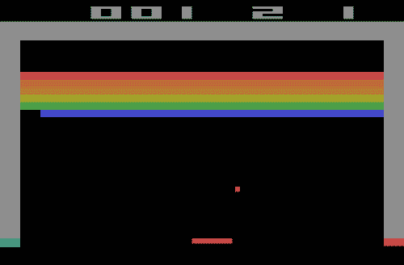
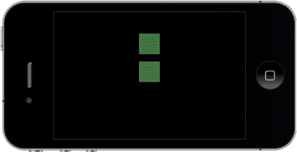
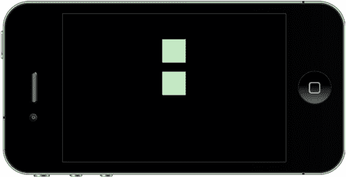
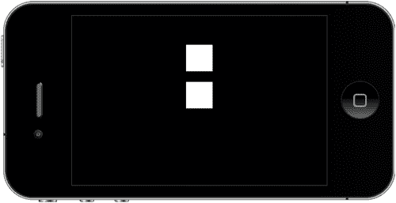
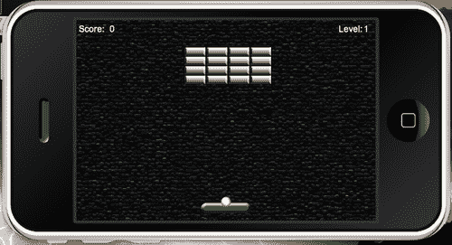

# 第三章. 构建我们的第一个游戏：Breakout

> 到目前为止，我们已经了解了 Lua 编程的一些重要基础知识，并在 Corona 模拟器中应用了一些代码。了解术语只是学习如何制作应用程序的一部分。我们需要更进一步，亲身体验从开始到结束构建项目的感觉。我们将通过从头开始创建我们的第一个游戏来实现这一点。这将帮助你更深入地理解代码块，并应用一些游戏逻辑来制作一个功能性的游戏。

到本章结束时，你将理解以下内容：

+   在 Corona 项目中组织游戏文件

+   为游戏创建变量

+   将游戏对象添加到屏幕上

+   创建一个警告消息

+   显示得分和关卡编号

让乐趣开始吧！

# Breakout——重温经典游戏

你可能在过去几十年中看到过许多形式的 Breakout 游戏，尤其是在雅达利时代。为了给你一个关于游戏内容的良好印象，这里有一篇 Big Fish Games 关于 Breakout 历史的简要评论：[`www.bigfishgames.com/blog/the-history-of-breakout/`](http://www.bigfishgames.com/blog/the-history-of-breakout/)。



在游戏屏幕上，有几列和几行砖块放置在屏幕顶部附近。一个球在屏幕上滚动，反弹到屏幕的顶部和侧面墙壁。当球击中砖块时，球会弹开，砖块被摧毁。当球触碰到屏幕底部时，玩家就会输掉这一轮。为了防止这种情况发生，玩家有一个可移动的球拍来将球弹回上方，保持游戏进行。

我们将创建一个克隆版本，使用触摸事件和加速度计来控制球拍移动，这将由玩家控制。我们将为球添加一些物理属性，使其可以在整个屏幕上弹跳。

在下一章中，我们将添加游戏对象的移动、碰撞检测、得分和胜负条件。现在，我们将专注于如何设置 Breakout 的游戏模板。

# 理解 Corona 物理 API

Corona 使得向游戏中添加物理属性变得方便，尤其是如果你之前从未接触过。该引擎使用**Box2D**，将其集成到应用程序中只需几行代码，比通常设置它所需的时间要少。

在 Corona 中使用物理引擎相对简单。你使用显示对象并在代码中将它们设置为物理体。图像、精灵和矢量形状可以被转换成物理对象。这有助于可视化你希望对象在创建的环境中如何反应。你可以立即看到结果，而不是猜测它们在物理世界中的行为。

## 设置物理世界

在你的应用中使物理引擎可用需要以下行：

`local physics = require "physics"`

### 开始、暂停和停止物理效果

有三个主要函数会影响物理模拟：

+   `physics.start():` 这将启动或恢复物理环境。通常在应用程序开始时激活，以便物理物体生效。

+   `physics.pause():` 这将暂时停止物理引擎。

+   `physics.stop():` 这基本上会完全摧毁物理世界。

### physics.setGravity

此函数返回全局重力向量的 x 和 y 参数，单位为每秒平方米（加速度单位）。默认值为 (0, 9.8) 以模拟标准地球重力，指向 y 轴的下方。例如，

语法：`physics.setGravity(gx, gy)`

```java
physics.setGravity( 0, 9.8 ): Standard Earth gravity

```

### physics.getGravity

此函数返回全局重力向量的 x 和 y 参数，单位为每秒平方米（加速度单位）。

语法：`gx, gy = physics.getGravity()`

### 基于倾斜的重力

当你应用了 physics.setGravity(gx, gy) 和加速度计 API，实现基于倾斜的动态重力变得简单。以下是一个创建基于倾斜函数的示例：

```java
function movePaddle(event)
paddle.x = display.contentCenterX - (display.contentCenterX * (event.yGravity*3))
end
Runtime:addEventListener( "accelerometer", movePaddle )

```

加速度计在 Corona 模拟器中不存在；必须创建设备构建才能看到效果。

### physics.setScale

此函数设置用于在屏幕 Corona 坐标和模拟物理坐标之间转换的内部像素每米比率。这应该在实例化任何物理对象之前完成。

默认缩放值是 30。对于分辨率更高的设备，如 iPad、Android 或 iPhone 4，你可能希望将此值增加到 60 或更多。

语法：`physics.setScale( value )`

```java
physics.setScale( 60 )

```

### physics.setDrawMode

物理引擎有三个渲染模式。这可以在任何时候进行更改。

语法：`physics.setDrawMode( mode )`

+   `physics.setDrawMode( "debug" ):` 此模式仅显示碰撞引擎轮廓

+   `physics.setDrawMode( "hybrid" ):` 此模式在正常 Corona 对象上叠加碰撞轮廓

+   `physics.setDrawMode( "normal" ):` 此模式是默认的 Corona 渲染器，没有碰撞轮廓

物理数据使用彩色矢量图形显示，反映了不同对象类型和属性：

+   **橙色**——动态物理物体（默认物体类型）

+   **深蓝色**——运动学物理物体

+   **绿色**——静态物理物体，如地面或墙壁

+   **灰色**——由于缺乏活动而处于**休眠状态**的物体

+   **浅蓝色**——关节

### physics.setPositionIterations

此函数设置引擎位置计算的精度。默认值为 `8`，意味着引擎将每帧迭代八个位置近似值，每个对象，但会增加处理器占用，因此应谨慎处理，因为它可能会减慢应用程序的运行速度。

语法：`physics.setPositionIterations( value )`

```java
physics.setPositionIterations( 16 )

```

### physics.setVelocityIterations

此函数设置引擎速度计算的精度。默认值是 `3`，这意味着引擎将为每个对象在每个帧中迭代三个速度近似值，但这会增加处理器的占用，因此应该小心处理，因为它可能会减慢应用程序的运行速度。

语法：`physics.setVelocityIterations( value )`

```java
physics.setVelocityIterations( 6 )

```

# 配置应用程序

本教程适用于 iOS 和 Android 设备。图形已被设计以适应这两个平台的屏幕尺寸变化。

## 构建配置

默认情况下，所有设备屏幕上显示的所有项目都以竖屏模式显示。我们将专门在横屏模式下创建这款游戏，因此我们需要修改一些构建设置并配置屏幕上所有项目的显示方式。在横屏模式下玩游戏实际上会增加玩家的交互性，因为挡板将有更多的屏幕空间移动，而球体将拥有更少的时间在空中。

# 行动时间——添加 build.settings 文件

构建时属性可以通过可选的 `build.settings` 文件提供，该文件使用 Lua 语法。`build.settings` 文件用于设置应用程序的方向和自动旋转行为，以及各种平台特定的构建参数。

1.  在您的桌面上创建一个新的项目文件夹，命名为 `Breakout`。

1.  在您首选的文本编辑器中，创建一个名为 `build.settings` 的新文件，并将其保存到您的项目文件夹中。

1.  输入以下行：

    ```java
    settings =
    {
    orientation =
    {
    default = "landscapeRight",
    }
    }

    ```

1.  保存并关闭。`build.settings` 文件已完成。

## 刚才发生了什么？

默认方向设置决定了设备上的初始启动方向，以及 Corona 模拟器的初始方向。

默认方向不会影响 Android 设备。方向初始化为设备的实际方向（除非只指定了一个方向）。此外，唯一支持的旋转方向是 `landscapeRight` 和竖屏。在设备上，您可以切换到 `landscapeRight` 或 `landscapeLeft`，但操作系统只会报告一种横屏，Corona 的方向事件选择 `landscapeRight`。

我们已创建此应用程序以支持横屏方向，支持 `landscapeRight`。我们已将其设置为默认方向，因此它不会切换到 `landscapeLeft` 或任何竖屏模式。当在 iOS 设备上工作时，如果在启动应用程序之前未设置 `build.settings`，它将进入默认的竖屏模式。

## 运行时配置

目前我们的项目尚未缩放以均匀显示跨平台开发。内容仍将在设备上显示，但很可能会不在正确的宽高比中。

例如，iPhone 项目是为 320 像素宽的屏幕设计的，可以升级到 480 像素宽的屏幕以适应 Android 设备。这使得移植变得更容易，因为代码和艺术资源不需要修改。

Corona 可以针对为 iPhone 4 和其他当前 iOS 设备制作的构建，这些设备显示双倍分辨率的艺术资源，同时保持 iOS 3.0 兼容性。这意味着 iPhone 4 之前的旧内容将不再自动放大到更大的 iPhone 4 屏幕分辨率。随着 iOS 开发的进步，内容缩放通常在新 iPhone 应用中是必需的，以兼容 iPhone 3GS 和更低的设备。

# 动手实践——添加 config.lua 文件

如果未指定内容大小，则返回的内容宽度和高度将与设备的物理屏幕宽度和高度相同。如果您在`config.lua`中指定不同的内容宽度和高度，则内容宽度和高度将采用这些值。

1.  在您的文本编辑器中，创建一个名为`config.lua`的新文件，并将其保存到您的项目文件夹中。

1.  输入以下行：

    ```java
    application =
    {
    content =
    {
    width = 320,
    height = 480,
    scale = "letterbox",
    fps = 60,
    },
    }

    ```

1.  保存并关闭你的文件。

## 刚才发生了什么？

内容宽度和高度允许您选择一个虚拟屏幕大小，该大小独立于物理设备屏幕大小。我们已将大小设置为针对原始 iPhone，因为它在 iOS 和 Android 平台上所有设备中显示的最小尺寸。原始 iPhone 的尺寸为 320 x 480。使用此配置，它仍然会均匀缩放到 iPad，其尺寸为 768 x 1024。

在此应用中使用的缩放比例设置为`letterbox`。它将尽可能均匀地放大内容，同时仍然在屏幕上显示所有内容。这将创建一个宽屏外观，与屏幕比 iPhone 3GS 更长的 Droid 兼容。

我们将`fps`设置为`60`。默认情况下，帧率为 30 fps。在此应用中，这将使球的移动看起来更快，并允许我们方便地提高速度。我们可以将帧率扩展到 Corona 允许的最大 60 fps。

# 构建应用

现在我们已经将应用配置为横幅模式，并将显示内容设置为在多台设备上缩放，我们准备开始设计游戏。在我们开始编写游戏代码之前，我们需要添加一些将在屏幕上显示的艺术资源。您可以在`第三章资源`文件夹中找到它们。您可以从 Packt 网站下载本书附带的项目文件。以下是需要添加到您的`Breakout`项目文件夹中的文件如下：

+   alertBox.png

+   bg.png

+   mmScreen.png

+   ball.png

+   paddle.png

+   brick.png

+   playbtn.png

## 显示组

在这个游戏中，我们将介绍一个重要的函数 `display.newGroup()`。组允许您添加和删除子显示对象。最初，组中没有子对象。局部原点位于父对象的原点；参考点初始化为此局部原点。您可以轻松地将显示对象组织到不同的组中，并通过它们的组名来引用它们。例如，在 Breakout 中，我们将菜单项（如**标题**屏幕和**播放**按钮）组合到一个名为 `menuScreenGroup` 的组中。每次我们访问 `menuScreenGroup` 时，任何由组名定义的显示对象都将被调用。

### display.newGroup()

此函数创建一个组，您可以在其中添加和删除子显示对象。

语法：`display.newGroup()`

示例：

```java
local rect = display.newRect(0, 0, 150, 150)
rect:setFillColor(255, 255, 255)
local myGroup = display.newGroup()
myGroup:insert( rect )

```

## 使用系统函数

在本章中我们将要介绍的系统函数将返回有关系统（获取设备信息、当前方向）和控制系统函数（启用多点触控、控制空闲时间、加速度计、GPS）的信息。我们将使用以下系统函数来返回应用程序运行的环境信息以及加速度计事件的响应频率。

### system.getInfo()

此函数返回有关应用程序运行在的系统信息。

语法：`system.getInfo( param )`

```java
print( system.getInfo( "name" ) ) -- display the deviceID

```

参数的有效值如下：

+   `"name"`—返回名称。例如，在 iTouch 上，这将是在 iTunes 中显示的电话名称，*Pat 的 iTouch*。

+   `"model"`—返回设备类型。这些包括：

    +   "iPhone"

    +   "iPad"

    +   "iPhone Simulator"

    +   "Nexus One"

    +   "Droid"

    +   "myTouch"

    +   "Galaxy Tab"

+   `"deviceID"`—返回设备的唯一 ID。

+   `"environment"`—返回应用程序运行的环境。这些包括：

    +   `"simulator"`：Corona 模拟器

    +   `"device"`：iOS、Android 设备和 Xcode 模拟器

+   `"platformName"`—返回平台名称（操作系统名称），即以下之一：

    +   Mac OS X（Mac 上的 Corona 模拟器）

    +   Win（Windows 上的 Corona 模拟器）

    +   iPhone OS（所有 iOS 设备）

    +   Android（所有 Android 设备）

+   `"platformVersion"`—返回平台版本的字符串表示。

+   `"version"`—返回使用的 Corona 版本。

+   `"build"`—返回 Corona 构建字符串。

+   `"textureMemoryUsed"`—以字节为单位返回纹理内存使用情况。

+   `"maxTextureSize"`—返回设备支持的纹理最大宽度或高度。

+   `"architectureInfo"`—返回描述您正在运行的设备底层 CPU 架构的字符串。

### system.setAccelerometerInterval()

此函数设置加速度计事件的频率。iPhone 上的最小频率是 10 Hz，最大频率是 100 Hz。加速度计事件对电池的消耗很大；因此，只有在需要更快响应的游戏中才增加频率。始终尽可能降低频率以节省电池寿命。

语法：`system.setAccelerometerInterval( frequency )`

```java
system.setAccelerometerInterval( 75 )

```

函数设置样本间隔（赫兹）。赫兹是每秒的周期数，每秒要进行的测量次数。如果你将频率设置为 75，则系统将每秒进行 75 次测量。

在你将第三章资源文件夹中的资产添加到你的项目文件夹后，让我们开始编写一些代码！

# 行动时间——为游戏创建变量

要启动任何应用程序，我们需要创建一个`main.lua`文件。这在上一章中已经讨论过，当时我们使用了一些示例代码并在模拟器中运行它。

当游戏完成时，代码将根据你的`main.lua`文件进行相应地结构化：

`必要的类`（例如：物理或 ui）

`变量和常量`

`主函数`

`对象方法`

`调用主函数`（这总是必须调用，否则你的应用程序将无法运行）

格式化你的代码以使其看起来像前面的结构是保持事物组织良好并高效运行应用程序的良好实践。

在本节中，我们将介绍将显示主菜单屏幕和一个用户可以与之交互以进入主游戏屏幕的**Play**按钮的显示组。所有游戏元素，如桨、球、砖块对象和抬头显示元素，都在玩家点击**Play**按钮后跟随。我们还将介绍将被称为`alertDisplayGroup`的赢和输条件。所有这些游戏元素将在我们代码的开始部分初始化。

1.  在你的文本编辑器中创建一个新的`main.lua`文件并将其保存到你的项目文件夹中。

1.  我们将隐藏状态栏（特别是针对 iOS 设备）并加载物理引擎。Corona 使用已内置到 SDK 中的 Box2D 引擎。

    ```java
    display.setStatusBar(display.HiddenStatusBar)
    local physics = require "physics"
    physics.start()
    physics.setGravity(0, 0)
    system.setAccelerometerInterval( 100 )

    ```

    ### 注意

    更多关于 Corona 物理 API 的信息可以在 Corona 网站上找到：[`developer.anscamobile.com/content/game-edition-box2d-physics-engine`](http://developer.anscamobile.com/content/game-edition-box2d-physics-engine)。

    在 Corona SDK 中使用的 Box2D 物理引擎是由暴雪娱乐的 Erin Catto 编写的。更多关于 Box2D 的信息可以在[`box2d.org/manual.pdf`](http://box2d.org/manual.pdf)找到。

1.  添加菜单屏幕对象。

    ```java
    local menuScreenGroup -- display.newGroup()
    local mmScreen
    local playBtn

    ```

1.  添加游戏屏幕对象。

    ```java
    local background
    local paddle
    local brick
    local ball

    ```

1.  添加分数和等级的 HUD 元素。

    ```java
    local scoreText
    local scoreNum
    local levelText
    local levelNum

    ```

    ### 注意

    HUD 也称为抬头显示。它是一种在游戏屏幕上视觉表示角色信息的方法。

1.  接下来，我们将添加用于赢/输条件的警告显示组。

    ```java
    local alertDisplayGroup -- display.newGroup()
    local alertBox
    local conditionDisplay
    local messageText

    ```

1.  以下变量包含砖块显示组、分数、球的速度和在游戏事件中的值。

    ```java
    local _W = display.contentWidth / 2
    local _H = display.contentHeight / 2
    local bricks = display.newGroup()
    local brickWidth = 35
    local brickHeight = 15
    local row
    local column
    local score = 0
    local scoreIncrease = 100
    local currentLevel
    local vx = 3
    local vy = -3
    local gameEvent = ""

    ```

1.  加速度计事件只能在设备上测试，因此我们将通过调用`"simulator"`环境为挡板添加一个触摸事件变量。这样我们就可以在 Corona 模拟器中测试挡板移动。如果你要在设备上测试应用程序，挡板上的触摸和加速度计事件监听器不会冲突。

    ```java
    local isSimulator = "simulator" == system.getInfo("environment")

    ```

1.  最后，添加`main()`函数。这将启动我们的应用程序。

    ```java
    function main()
    end
    --[[
    This empty space will hold other functions and methods to run the application
    ]]--
    main()

    ```

## 刚才发生了什么？

`display.setStatusBar(display.HiddenStatusBar)`仅适用于 iOS 设备。它隐藏了状态栏的显示。

我们为这个游戏添加了一个新的 Corona API，即物理引擎。我们将为主要的游戏对象（挡板、球和砖块）添加物理参数以进行碰撞检测。设置`setGravity(0,0)`将允许球在游戏场地上自由弹跳。

`local menuScreenGroup`、`local alertDisplayGroup`和`local bricks`都是我们可以分离和组织显示对象的显示组形式。例如，`local menuScreenGroup`是为显示在**主菜单**屏幕上的对象指定的；这样它们就可以作为一个组而不是单个对象被移除。

已经添加的一些变量已经有了应用于某些游戏对象的值。球已经使用`local vx = 3`和`local vy = -3`设置了速度。x 和 y 速度决定了球在游戏屏幕上的移动方式。根据球与对象的碰撞位置，球将沿着连续的路径移动。`brickWidth`和`brickHeight`有一个值将在整个应用程序中保持不变，这样我们就可以在屏幕上均匀地排列砖块对象。

`local gameEvent = " "`将存储游戏事件，如`"win"`、`"lose"`和`"finished"`。当函数检查任何这些事件的任何游戏状态时，它将在屏幕上显示正确的条件。

我们还添加了一些系统函数。我们创建了`local isSimulator = "simulator" == system.getInfo("environment")`，以便它返回有关应用程序运行系统的信息。这将用于挡板触摸事件，以便我们可以在模拟器中测试应用程序。如果构建要移植到设备上，你将只能使用加速度计来移动挡板。模拟器无法测试加速度计事件。另一个系统函数是`system.setAccelerometerInterval( 100 )`。它设置加速度计事件的频率。在 iPhone 上，最小频率是 10 Hz，最大频率是 100 Hz。

空函数`main()`集合将开始显示层次结构。把它想象成一个剧本。你首先看到的是介绍，然后中间发生一些动作，告诉你主要内容。在这种情况下，主要内容是游戏玩法。最后你看到的是某种结局或闭合，以将整个故事串联起来。结局是在关卡结束时显示胜负条件。

# 理解事件和监听器

事件被发送到监听器。函数或对象可以是事件监听器。当事件发生时，监听器通过表示事件的表被调用。所有事件都将有一个属性名称来标识事件的类型。

## 注册事件

显示对象和全局 Runtime 对象可以是事件监听器。您可以使用以下对象方法添加和删除事件监听器：

+   `object:addEventListener( )`：它向对象的监听器列表中添加一个监听器。当发生命名事件时，监听器将被调用，并带有表示事件的表作为参数。

+   `object:removeEventListener( )`：它从对象的监听器列表中删除指定的监听器，因此它不再会收到与指定事件对应的任何事件通知。

在以下示例中，一个图像显示对象注册以接收触摸事件。触摸事件不会全局广播。注册了事件并位于其下方的显示对象将是接收触摸的候选对象。

```java
local playBtn = display.newImage("playbtn.png")
playBtn.name = "playbutton"
local function listener(event)
if event.target.name == "playbutton" then
print("The button was touched.")
end
end
playBtn:addEventListener("touch", listener )

```

运行时事件由系统发送。它们向所有监听器广播。以下是为 `enterFrame` 事件注册的示例：

```java
local playBtn = display.newImage("playbtn.png")
local function listener(event)
print("The button appeared.")
end
Runtime:addEventListener("enterFrame", listener )

```

## 运行时事件

我们正在创建的应用程序使用运行时事件。运行时事件没有特定的目标，并且只发送到全局 Runtime。它们向所有已注册的监听器广播。以下所有事件都具有字符串名称，并将应用于 Breakout 游戏：

### enterFrame

`enterFrame` 事件发生在应用程序的帧间隔中。它们只发送到全局 Runtime 对象。例如，如果帧率为 30fps，那么它将每秒大约发生 30 次。

此事件中可用属性：

+   `event.name` 是字符串 `"enterFrame"`。

+   `event.time` 是自应用程序开始以来的时间（以毫秒为单位）。

### 加速度计

加速度计事件允许您检测运动并确定设备相对于重力的方向。这些事件仅发送到支持加速度计的设备。它们只发送到全局 Runtime 对象。

此事件有以下属性可用：

+   `event.name` 是字符串 `"accelerometer"`。

+   `event.xGravity` 是 x 方向的重力加速度。

+   `event.yGravity` 是 y 方向的重力加速度。

+   `event.zGravity` 是 z 方向的重力加速度。

+   `event.xInstant` 是 x 方向的瞬时加速度。

+   `event.yInstant` 是 y 方向的瞬时加速度。

+   `event.zInstant` 是 z 方向的瞬时加速度。

+   `event.isShake` 为真时，用户正在摇动设备。

## 触摸事件

当用户的指尖触摸屏幕时，会生成一个击中事件并将其派发到显示层次结构中的显示对象。只有与屏幕上指尖位置相交的对象才会接收到该事件。

### 触摸（单点触摸）

触摸事件是一种特殊类型的命中事件。当用户的指尖触摸屏幕时，他们开始了一系列的触摸事件，每个事件都有不同的阶段。

+   `event.name` 是字符串 `"touch"`。

+   `event.x` 是触摸在屏幕坐标中的 x 位置。

+   `event.y` 是触摸在屏幕坐标中的 y 位置。

+   `event.xStart` 是触摸从触摸序列的 `"began"` 阶段开始的 x 位置。

+   `event.yStart` 是触摸从触摸序列的 `"began"` 阶段开始的 y 位置。

+   `event.phase` 是一个字符串，用于标识事件在触摸序列中的位置：

    +   `"began"` 指的是手指触摸了屏幕。

    +   `"moved"` 指的是手指在屏幕上移动。

    +   `"ended"` 指的是手指从屏幕上抬起。

    +   `"cancelled"` 系统取消了触摸跟踪。

### 触摸

触摸在用户触摸屏幕时生成一个命中事件。事件被分发到显示层次结构中的显示对象。这与 `touch` 事件类似，除了事件回调中可用的是命中计数（触摸次数）。

+   `event.name` 是字符串 `"tap"`。

+   `event.numTaps` 返回屏幕上的触摸次数。

+   `event.x` 是触摸的 x 位置在屏幕坐标中。

+   `event.y` 是触摸的 y 位置在屏幕坐标中。

# 过渡

在本章中，我们将探讨 `transition.to()` 和 `transition.from()`。

+   `transition.to()`: 它使用 `easing` 过渡在一段时间内动画化显示对象的属性。

    语法：`handle = transition.to( target, params )`

+   `transition.from()`: 它与 `transition.to()` 类似，除了函数的参数表中指定了起始属性值，而最终值是调用之前目标中的相应属性值。

    语法：`handle = transition.from( target, params )`

    使用的参数包括：

    `target` - 将成为过渡目标的一个显示对象。

    `params` - 一个表，指定了将被动画化的显示对象的属性，以及一个或多个以下可选的非动画属性：

    +   `params.time:` 它指定了过渡的持续时间（以毫秒为单位）。默认情况下，持续时间是 500 毫秒（0.5 秒）。

    +   `params.transition:` 默认是 `easing.linear`。

    +   `params.delay:` 它指定了补间动画开始前的延迟时间（默认无延迟）。

    +   `params.delta:` 它是一个布尔值，指定非控制参数是否被解释为最终结束值或作为值的改变。默认是 `nil`，表示 false。

    +   `params.onStart:` 它是在补间动画开始前调用的函数或表监听器。

    +   `params.onComplete:` 它是在补间动画完成后调用的函数或表监听器。

例如：

```java
_W = display.contentWidth
_H = display.contentHeight
local square = display.newRect( 0, 0, 100, 100 )
square:setFillColor( 255,255,255 )
square.x = _W/2; square.y = _H/2
local square2 = display.newRect( 0, 0, 50, 50 )
square2:setFillColor( 255,255,255 )
square2.x = _W/2; square2.y = _H/2
transition.to( square, { time=1500, x=250, y=400 } )
transition.from( square2, { time=1500, x=275, y=0 } )

```

上述示例展示了两个显示对象如何在设备屏幕上的空间中过渡。`square`显示对象将从当前位置移动到 x = 250 和 y = 400 的新位置，耗时 1500 毫秒。`square2`显示对象将从 x = 275 和 y = 0 的位置过渡到其初始位置，耗时 1500 毫秒。

# 创建菜单屏幕

拥有菜单屏幕可以让玩家在不同的应用程序部分之间进行切换。通常，游戏开始时会显示一个带有交互式用户界面按钮的屏幕，按钮上标有**Play**或**Start**，以便玩家可以选择玩游戏。在任何移动应用程序中，在切换到主要内容之前都有一个菜单屏幕是标准的。

# 行动时间——添加主菜单屏幕

**主菜单**屏幕将是玩家在应用程序启动后与菜单系统交互的第一个东西。这是介绍游戏标题的好方法，同时也让玩家对应该期待的游戏环境有一个概念。我们不想让玩家在没有适当通知的情况下突然进入应用程序。当玩家启动应用程序时，让他们为即将发生的事情做好准备是很重要的。

1.  我们将创建一个名为`mainMenu()`的函数来介绍标题屏幕。所以，在`function main()`结束之后，添加以下行：

    ```java
    function mainMenu()
    end

    ```

1.  我们将在这个函数中添加一个显示组和两个显示对象。一个显示对象将代表**主菜单**屏幕的图像，另一个将是一个名为**Play**的 UI 按钮。在`function mainMenu()`内部添加它们。

    ```java
    menuScreenGroup = display.newGroup()
    mmScreen = display.newImage("mmScreen.png", 0, 0, true)
    mmScreen.x = _W
    mmScreen.y = _H
    playBtn = display.newImage("playbtn.png")
    playBtn:setReferencePoint(display.CenterReferencePoint)
    playBtn.x = _W; playBtn.y = _H + 50
    playBtn.name = "playbutton"
    menuScreenGroup:insert(mmScreen)
    menuScreenGroup:insert(playBtn)

    ```

1.  记得那个空的`main()`函数吗？我们需要在它里面调用`mainMenu()`。整个函数应该看起来像这样：

    ```java
    function main()
    mainMenu()
    end

    ```

1.  在`mainMenu()`函数之后，我们将创建另一个名为`loadGame()`的函数。它将启动从`playbtn`到主游戏屏幕的事件转换。该事件将`menuScreenGroup`的 alpha 值更改为`0`，使其在屏幕上不可见。通过调用`addGameScreen()`函数完成过渡（`addGameScreen()`将在本章的*添加游戏对象*部分中讨论）。

    ```java
    function loadGame(event)
    if event.target.name == "playbutton" then
    transition.to(menuScreenGroup,{time = 0, alpha=0, onComplete = addGameScreen})
    playBtn:removeEventListener("tap", loadGame)
    end
    end

    ```

1.  接下来，我们需要为`playBtn`添加一个事件监听器，以便在它被点击时，将调用`loadGame()`函数。在`mainMenu()`函数的最后一种方法之后添加以下行：

    ```java
    playBtn:addEventListener("tap", loadGame)

    ```

1.  在模拟器中运行项目。你应该会看到**主菜单**屏幕显示**Breakout**和**Play**按钮。

## 刚才发生了什么？

创建一个**主菜单**屏幕只需要几块代码。对于`loadGame(event)`，我们设置了一个名为`event`的参数。当调用`if`语句时，它将`playbutton`作为参数，该参数引用显示对象`playBtn`并检查它是否为真。由于它是真的，`menuScreenGroup`将从舞台中移除，并调用`addGameScreen()`函数。同时，`playBtn`的事件监听器也将从场景中移除。

## 尝试创建一个帮助屏幕

目前菜单系统的设计是这样的，它从**主菜单**屏幕开始，然后过渡到**游戏玩法**屏幕。你可以选择扩展菜单屏幕而不立即进入游戏。在**主菜单**屏幕之后，我们可以添加一个额外的**帮助菜单**屏幕，该屏幕将向玩家解释如何玩游戏。

在你喜欢的图像编辑程序中创建一个新图像，并写出如何玩游戏的步骤。然后创建一个名为**下一步**的新按钮，并将这两个艺术资源添加到你的项目文件夹中。在你的代码中，你需要创建一个新的函数和**下一步**按钮的事件监听器，以便过渡到游戏玩法屏幕。

# 创建游戏玩法场景

现在我们已经建立了菜单系统，我们可以开始构建应用程序的游戏玩法元素。我们将开始添加玩家将与之交互的所有主要游戏对象。在添加游戏对象时，需要考虑的是它们在屏幕上的位置。鉴于这款游戏将以横屏模式进行，我们必须记住在 x 方向上有足够的空间，而在 y 方向上空间较小。根据游戏的原设计，屏幕的底部墙壁会导致玩家在球落在该区域时失去关卡或转向。所以如果你要确定放置挡板对象的位置，我们不会将其设置在屏幕顶部。将挡板设置在屏幕底部更合理，这样可以更好地保护球。

# 行动时间——添加游戏对象

让我们添加玩家在游戏过程中将看到的显示对象。

1.  在`loadGame()`函数之后，我们将创建另一个函数，该函数将在屏幕上显示所有游戏对象。以下行将显示为这个教程创建的艺术资源：

    ```java
    function addGameScreen()
    background = display.newImage("bg.png", 0, 0, true )
    background.x = _W
    background.y = _H
    paddle = display.newImage("paddle.png")
    paddle.x = 240; paddle.y = 300
    paddle.name = "paddle"
    ball = display.newImage("ball.png")
    ball.x = 240; ball.y = 290
    ball.name = "ball"

    ```

1.  接下来，我们将添加在游戏过程中显示的分数和关卡编号的文本。

    ```java
    scoreText = display.newText("Score:", 5, 2, "Arial", 14)
    scoreText:setTextColor(255, 255, 255, 255)
    scoreNum = display.newText("0", 54, 2, "Arial", 14)
    scoreNum:setTextColor(255, 255, 255, 255)
    levelText = display.newText("Level:", 420, 2, "Arial", 14)
    levelText:setTextColor(255, 255, 255, 255)
    levelNum = display.newText("1", 460, 2, "Arial", 14)
    levelNum:setTextColor(255, 255, 255, 255)

    ```

1.  要构建第一个游戏关卡，我们需要调用`gameLevel1()`函数，这个函数将在本章后面进行解释。别忘了用`end`关闭`addGameScreen()`函数。

    ```java
    gameLevel1()
    end

    ```

## 刚才发生了什么？

`addGameScreen()`函数显示了游戏过程中显示的所有游戏对象。我们添加了本章提供的艺术资源中的`background`、`paddle`和`ball`。

我们已经在游戏屏幕顶部添加了分数和级别的文本。`scoreNum` 初始设置为 `0`。我们将在下一章讨论如何在砖块碰撞时更新分数数字。`levelNum` 从 `1` 开始，并在完成级别并进入下一个级别时更新。

我们通过调用 `gameLevel1()` 结束了函数，该函数将在下一节中实现，以开始第一级。

# 行动时间——构建砖块

砖块是我们需要添加到这个应用程序中的最后一个游戏对象。我们将为这个游戏创建两个不同的级别。每个级别都将具有与其他级别不同的砖块布局。

1.  我们将创建第一级的函数。让我们创建一个新的函数 `gameLevel1()`。我们还将设置 `currentLevel = 1`，因为应用程序从 **Level 1** 开始。然后我们将添加 `bricks` 显示组并将其设置为 `toFront()`，使其出现在游戏背景之前。

    ```java
    function gameLevel1()
    currentLevel = 1
    bricks:toFront()

    ```

    ### 注意

    方法 `object:toFront( )` 将目标对象移动到其父组（object.parent）的可视前端。在这种情况下，我们将 `bricks` 组设置为在游戏过程中显示为最前面的显示组，因此它出现在背景图像之前。

1.  接下来，添加一些局部变量，以显示将在屏幕上显示多少行和列的砖块以及每个砖块在游戏场中的放置位置。

    ```java
    local numOfRows = 4
    local numOfColumns = 4
    local brickPlacement = {x = (_W) - (brickWidth * numOfColumns ) / 2 + 20, y = 50}

    ```

1.  创建双重 `for` 循环，一个用于 `numOfRows`，另一个用于 `numOfColumns`。创建一个根据其宽度、高度和 `numOfRows` 和 `numOfColumns` 对应的数字放置的砖块实例。砖块显示对象的美术资源由本章提供。之后，使用 `end` 关闭函数。

    ```java
    for row = 0, numOfRows - 1 do
    for column = 0, numOfColumns - 1 do
    local brick = display.newImage("brick.png")
    brick.name = "brick"
    brick.x = brickPlacement.x + (column * brickWidth)
    brick.y = brickPlacement.y + (row * brickHeight)
    physics.addBody(brick, "static", {density = 1, friction = 0, bounce = 0})
    bricks.insert(bricks, brick)
    end
    end
    end

    ```

1.  **Level 2** 的设置与 **Level 1** 的排列方式相似。代码几乎相同，除了我们新的函数被命名为 `gameLevel2()`，`currentLevel = 2`，以及 `numOfRows` 和 `numOfColumns` 的值不同。在 `gameLevel1()` 函数之后添加此块。

    ```java
    function gameLevel2()
    currentLevel = 2
    bricks:toFront()
    local numOfRows = 5
    local numOfColumns = 8
    local brickPlacement = {x = (_W) - (brickWidth * numOfColumns ) / 2 + 20, y = 50}
    for row = 0, numOfRows - 1 do
    for column = 0, numOfColumns - 1 do
    -- Create a brick
    local brick = display.newImage("brick.png")
    brick.name = "brick"
    brick.x = brickPlacement.x + (column * brickWidth)
    brick.y = brickPlacement.y + (row * brickHeight)
    physics.addBody(brick, "static", {density = 1, friction = 0, bounce = 0})
    bricks.insert(bricks, brick)
    end
    end
    end

    ```

1.  保存您的文件并重新启动模拟器。您将能够与 **Play** 按钮交互，并看到从 **主菜单** 屏幕到游戏屏幕的过渡。您将在屏幕上看到 **Level 1** 的游戏布局。

## 刚才发生了什么？

`bricks` 显示组被设置为 `bricks:toFront()`。这意味着除了 `background`、`paddle` 和 `ball` 显示对象外，该组将始终位于显示层次结构的前面。

`gameLevel1()` 为游戏场中显示的砖块对象数量设置了值。它们将根据设备外壳的 `contentWidth` 居中，并在 y 方向上设置为 50。砖块组通过 `brickPlacement` 放置在右上角附近，占据屏幕中间，并减去所有砖块对象总宽度的一半。然后我们在 x 方向上再添加 20 个像素，使其与桨居中对齐。

我们为`numOfRows`和`numOfColumns`创建了双重`for`循环，从屏幕的左上角开始创建砖块对象。

注意，`brick`显示对象被命名为`"brick"`。只需记住，当调用对象时`"brick"`不能像`brick`那样使用。`"brick"`是`brick`的一个实例。它仅在被调用事件参数时用作字符串。例如：

```java
if event.other.name == "brick" and ball.x + ball.width * 0.5 event.other.x + event.other.width * 0.5 then
vx = -vx
elseif event.other.name == "brick" and ball.x + ball.width * 0.5 >= event.other.x + event.other.width * 0.5 then
vx = vx
end

```

`brick`的物理体被设置为`"static"`，因此它不受重力下拉的影响。然后它被添加到`bricks`组下的`bricks.insert(bricks, brick)`。

## 尝试一下英雄—专注的平台游戏

完成这一章和下一章后，您可以自由地重新设计显示图像，以专注于特定的平台。例如，您可以轻松地将代码转换为与所有 iOS 设备兼容。这可以通过将显示对象转换为`display.newImageRect( [parentGroup,] filename [, baseDirectory] w, h )`来实现，这样您就可以在具有视网膜显示屏的设备上替换更高分辨率的图像（即 iPhone 4/iPod Touch 4G）。请记住，您必须调整配置设置以应用更改。这涉及到在`config.lua`文件中添加`@2x`图像后缀（或您首选的命名约定）。

# 红色警报！

在每一场游戏中，都有些消息告诉你主要行动结束后你的进度状态。对于这个应用程序，我们需要一种方式让玩家知道他们是否赢得或输掉了一轮，他们如何再次玩游戏，或者游戏何时正式结束。

# 行动时间—显示游戏消息

让我们设置一些胜负通知，以便我们可以在游戏中显示这些事件发生：

1.  创建一个名为`alertScreen()`的新函数，并传递两个名为`title`和`message`的参数。添加一个新的显示对象`alertbox`，并使用`easing.outExpo`将其从`xScale`和`yScale`的 0.5 过渡。

    ```java
    function alertScreen(title, message)
    alertBox = display.newImage("alertBox.png")
    alertBox.x = 240; alertBox.y = 160
    transition.from(alertBox, {time = 500, xScale = 0.5, yScale = 0.5, transition = easing.outExpo})

    ```

1.  将`title`参数存储在名为`conditionDisplay`的文本对象中。

    ```java
    conditionDisplay = display.newText(title, 0, 0, "Arial", 38)
    conditionDisplay:setTextColor(255,255,255,255)
    conditionDisplay.xScale = 0.5
    conditionDisplay.yScale = 0.5
    conditionDisplay:setReferencePoint(display.CenterReferencePoint)
    conditionDisplay.x = display.contentCenterX
    conditionDisplay.y = display.contentCenterY - 15

    ```

1.  将`message`参数存储在名为`messageText`的文本对象中。

    ```java
    messageText = display.newText(message, 0, 0, "Arial", 24)
    messageText:setTextColor(255,255,255,255)
    messageText.xScale = 0.5
    messageText.yScale = 0.5
    messageText:setReferencePoint(display.CenterReferencePoint)
    messageText.x = display.contentCenterX
    messageText.y = display.contentCenterY + 15

    ```

1.  创建一个新的显示组`alertDisplayGroup`，并将所有对象插入到该组中。关闭函数。

    ```java
    alertDisplayGroup = display.newGroup()
    alertDisplayGroup:insert(alertBox)
    alertDisplayGroup:insert(conditionDisplay)
    alertDisplayGroup:insert(messageText)
    end

    ```

1.  保存你的文件并在模拟器中运行项目。**播放**按钮的功能仍然会跳转到**第 1 级**的游戏屏幕。目前没有任何对象有移动。我们将在下一章中添加触摸事件、球体移动和碰撞。所有游戏对象都应该像以下截图所示排列：

## 刚才发生了什么？

我们已经设置了游戏警报系统，但目前尚未启用，直到我们添加更多游戏功能来设置游戏对象。下一章将演示`alertScreen()`函数传递两个参数，`title`和`message`。当条件发生时，`alertBox`显示对象作为警报文本的背景出现。当`alertBox`弹出时，它从`xScale`和`yScale`的 0.5 过渡到完整的图像缩放，这基本上相当于半秒。

`conditionDisplay` 对象传递了 `title` 参数。这将是要显示的文本，**你赢了**或**你输了**。

`messageText` 对象传递了 `message` 参数。带有此参数的文本会在条件满足后显示消息，例如**再玩一次**或**继续**。

此函数中的所有对象随后被插入到`alertDisplayGroup = display.newGroup()`中。当它出现在舞台上或消失时，将作为一个整体而不是单个对象。

在模拟器中运行代码时；如果你的终端窗口中出现错误，请确保检查导致错误的行。有时一个简单的大小写错误，甚至是一个缺失的逗号或引号，都可能使你的应用程序在模拟器中无法运行。确保你了解这些常见的错误。它们很容易被忽视。

你可以参考`Chapter 3`文件夹中的`Breakout - Part 1`文件夹，看看这个教程代码的前半部分是如何设置的。

## 快速问答——构建游戏

1.  当你在代码中添加物理引擎时，哪些函数是有效的，可以添加到你的应用程序中？

    +   a. `physics.start()`

    +   b. `physics.pause()`

    +   c. `physics.stop()`

    +   d. 以上皆非

1.  添加事件监听器时，哪个是正确的？

    +   a. `button:addeventlistener("touch", listener )`

    +   b. `button:AddEventListener("touch", listener )`

    +   c. `button:addEventListener(touch, listener )`

    +   d. `button:addEventListener("touch", listener )`

1.  正确的方式是将以下显示对象过渡到 x = 300, y = 150，alpha 变为 0.5，需要 2 秒吗？

    ```java
    local square = display.newRect( 0, 0, 50, 50 )
    square:setFillColor( 255,255,255 )
    square.x = 100 square2.y = 300

    ```

    +   a. `transition.to( square, { time=2000, x=300, y=150, alpha=0.5 } )`

    +   b. `transition.from( square, { time=2000, x=300, y=150, alpha=0.5 } )`

    +   c. `transition.to( square, { time=2, x=300, y=150, alpha=0.5 } )`

    +   d. 以上皆非

# 摘要

我们已经完成了这个游戏教程的前半部分。正确地构建 Corona 项目结构可以使你的代码组织更清晰，更好地跟踪你的资源。我们已经体验了与涉及游戏逻辑的小块代码一起工作的感觉，这是允许应用程序运行所必需的。

到目前为止我们有：

+   指定了在显示 Android 和 iOS 设备内容时的构建配置。

+   介绍了将在应用程序中运行的变量和常量。

+   实例化了物理引擎，并开始将其应用于需要物理体的游戏对象。

+   创建了菜单与游戏屏幕之间的过渡

+   向屏幕添加了显示对象和游戏信息

到目前为止，我们已经取得了很多成就，包括在编写应用程序的过程中学习了一些新的 API。在游戏完全功能化之前，我们还有很多东西要添加。在游戏完全功能化之前，我们还有很多东西要添加。

在下一章中，我们将完成这个游戏教程的最后半部分。我们将处理挡板、球、砖块和墙壁对象的碰撞检测。此外，我们还将学习如何在场景中移除砖块时更新分数，并激活我们的胜负条件。我们已经进入冲刺阶段。让我们继续前进！
