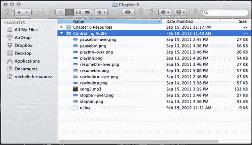

# 第六章. 播放声音和音乐

> 我们在日常接触的几乎所有类型的媒体中都能听到声音效果和音乐。许多著名的游戏，如 PAC-MAN、愤怒的小鸟和水果忍者，仅凭其主题曲或声音效果就可以被识别。除了我们在游戏中看到的外观图像外，声音有助于影响故事情节和/或游戏过程中的氛围。与您的游戏主题相关的优质声音效果和音乐有助于让您的观众感受到真实的体验。

在本章中，您将学习如何应用可以添加到您应用程序中的声音效果和音乐。我们已经在创建 Breakout 和 Panda Star Catcher 的前几章中实现了视觉吸引力。现在让我们通过耳朵来增强感官体验！

我们将要讨论的主要要点是：

+   加载、播放和循环音频

+   了解如何播放、暂停、继续、倒带和停止

+   内存管理（释放音频）

+   音量控制

+   性能和编码技巧

让我们再创造一些奇迹！

# 冠状音频系统

Corona 音频系统具有先进的 **OpenAL (Open Audio Library**) 功能。OpenAL 是为高效渲染多通道三维定位音频而设计的。OpenAL 的一般功能编码在源对象、音频缓冲区和单个听者中。源对象包含指向缓冲区的指针、声音的速度、位置和方向以及声音的强度。缓冲区包含以 PCM 格式的音频数据，可以是 8 位或 16 位，可以是单声道或立体声格式。听者对象包含听者的速度、位置和方向以及应用于所有声音的一般增益。

### 注意

如需了解有关 Corona 音频系统的更多信息，请访问：[`developer.anscamobile.com/partner/audionotes`](http://developer.anscamobile.com/partner/audionotes)。有关 OpenAL 的一般信息可在：[`www.openal.com.`](http://www.openal.com) 找到。

## 声音格式

以下是与 iOS 和 Android 平台兼容的声音格式：

+   所有平台都支持 16 位、小端、线性、`.wav` 文件

+   iOS 和 Mac 模拟器支持 `.mp3, .caf` 和 `.aac`

+   Windows 模拟器支持 `.mp3` 和 `.wav`

+   Android 支持 `.mp3` 和 `.ogg` 格式

## Android 上声音文件名的限制

在 Android 中构建时，文件扩展名会被忽略，因此无论扩展名如何，文件都被视为相同。暂时解决方法是更改文件名以区分文件扩展名。以下是一些示例：

+   `tap_aac.aac`

+   `tap_aif.aif`

+   `tap_caf.caf`

+   `tap_mp3.mp3`

+   `tap_ogg.ogg`

## 单声道声音的最佳效果

使用单声道声音比立体声音耗内存少一半。由于 Corona 音频系统使用 OpenAL，它只会将空间化/3D 效果应用于单声道声音。OpenAL 不会将 3D 效果应用于立体声样本。

## 最大同时通道数

可以运行的最大通道数是 32。这允许同时播放多达 32 个不同的声音。在您的代码中查看结果通道数的 API 是：

```java
audio.totalChannels

```

# 播放时间

音频可以以两种不同的方式加载，如下所示：

+   `loadSound()` 预加载整个声音到内存

+   `loadStream()` 通过分批读取小部分数据来准备播放声音，以节省内存

## audio.loadSound()

完全将整个文件加载到内存中，并返回音频数据的引用。完全加载到内存中的文件可以被重用、播放和共享，可以在多个通道上同时使用，因此您只需要加载文件的一个实例。您在游戏中用作音效的声音适合这一类别。

语法：

```java
audio.loadSound(audiofileName [, baseDir ])

```

参数：

+   `audiofileName` - 指定要加载的音频文件名称。支持的文件格式取决于您在哪个平台上运行音频文件。

+   `baseDir` - 默认情况下，预期声音文件位于应用程序资源目录中。如果声音文件位于应用程序文档目录中，请使用 `system.DocumentsDirectory`。

示例：

+   `tapSound = audio.loadSound("tap.wav")`

+   `smokeSound = audio.loadSound("smoke.mp3")`

## audio.loadStream()

这将加载一个文件作为流来读取。流式文件将分批读取小部分数据，以最小化内存使用。大型且持续时间长的文件适用于此。这些文件不能在多个通道上同时共享。如果需要，您必须加载文件的多实例。

语法：

```java
audio.loadStream(audioFileName [, baseDir ])

```

参数：

+   `audiofileName` - 指定要加载的音频文件名称。支持的文件格式取决于您在哪个平台上运行音频文件。

+   `baseDir` - 默认情况下，预期声音文件位于应用程序资源目录中。如果声音文件位于应用程序文档目录中，请使用 `system.DocumentsDirectory`。

示例：

+   `music1 = audio.loadStream("song1.mp3")`

+   `music2 = audio.loadStream("song2.wav")`

## audio.play()

在指定通道上播放由音频句柄指定的音频。如果没有指定通道，系统将自动为您选择一个可用通道。

语法：

```java
audio.play(audioHandle [, {[channel=c] [, loops=l] [, duration=d] [, fadein=f] [, onComplete=o]}])

```

参数：

+   `audioHandle` - 这是您想要播放的音频数据。

+   `channel` - 您想要播放的通道号。通道号从 1 到最大通道数（32），都是有效的通道。指定 0 或省略此参数，系统将自动为您选择一个通道。

+   `loops` - 您想要音频循环的次数。0 表示音频将循环 0 次，这意味着声音将播放一次而不循环。传递 -1 将告诉系统无限循环样本。

+   `duration` - 以毫秒为单位，这将导致系统播放指定时间的音频。

+   `fadein` - 以毫秒为单位，这将从最小通道音量开始播放声音，并在指定的毫秒数内过渡到正常通道音量。

+   `onComplete` - 当播放结束时想要调用的回调函数。`onComplete` 回调函数传递回一个事件参数。

示例：

```java
backgroundMusic = audio.loadStream("backgroundMusic.mp3")
backgroundMusicChannel = audio.play( backgroundMusic, { channel=1, loops=-1, fadein=5000 })
-- play the background music on channel 1, loop infinitely, and fadein over 5 seconds

```

## 循环

高度压缩的格式，如 mp3、aac、ogg vorbis，可能会在音频样本的末尾删除样本，并可能破坏正确循环的剪辑。如果你在循环播放中遇到间隙，请尝试使用 WAV（兼容 iOS 和 Android），并确保你的起始点和结束点是干净的。

## 同时播放

通过 `loadSound()` 加载的音频可以在多个通道上同时回放。例如，你可以这样加载一个声音效果：

```java
bellSound = audio.loadSound("bell.wav")

```

如果你想要为多个对象制作各种铃声，你可以做到。音频引擎高度优化以处理这种情况。使用相同的句柄多次调用 `audio.play()`（最多可达通道数上限）。

```java
audio.play(bellSound)
audio.play(bellSound)
audio.play(bellSound)

```

# 行动时间——播放音频

我们将倾听在 Corona 中如何实现声音效果和音乐，以了解它实际上是如何工作的：

1.  在你的桌面创建一个名为 `Playing Audio` 的新项目文件夹。

1.  在 `Chapter 6 Resources` 文件夹中，将 `ring.wav` 和 `song1.mp3` 音频文件复制到你的项目文件夹中，并创建一个新的 `main.lua` 文件。你可以从 Packt 网站下载本书的配套项目文件。

1.  使用 `loadSound()` 和 `loadStream()` 预加载以下音频：

    ```java
    ringSound = audio.loadSound("ring.wav")
    backgroundSound = audio.loadStream("song1.mp3")

    ```

1.  通过将 `backgroundSound` 设置为通道 1，无限循环，并在 3 秒后淡入来播放 `backgroundSound`：

    ```java
    mySong = audio.play(backgroundSound, {channel=1, loops=-1, fadein=3000})

    ```

1.  添加 `ringSound` 并播放一次：

    ```java
    myRingSound = audio.play(ringSound)

    ```

1.  在 Corona 模拟器中保存并运行项目以听取结果。

## 发生了什么？

对于仅仅是短声音效果的音频，我们使用了 `audio.loadSound()` 来准备声音。对于大尺寸或长时间段的音频，使用 `audio.loadStream()`。

`backgroundSound` 文件设置为通道 1，在开始播放时淡入 3 秒。`loops = -1` 表示文件从头到尾无限循环。

## 英雄尝试——带延迟重复音频

如你所见，加载和播放音频非常简单。播放一个简单的声音只需要 2 行代码。让我们看看你能否提高一个档次。

使用 `ring.wav` 文件并通过 `loadSound()` 加载它。创建一个播放音频的函数。每隔 2 秒播放声音五次。

# 控制时间

现在我们可以控制我们的声音了，因为它们可以在模拟器中播放。如果你回想起磁带播放机的日子，它们有使用暂停、停止和倒带等功能的能力。Corona 的音频 API 库可以做到这一点。

## audio.stop()

在通道上停止播放并清除通道，以便可以再次播放。

语法：

```java
audio.stop([channel])

```

或者：

```java
audio.stop([{channel = c}])

```

参数：

+   没有参数将停止所有活动通道。

+   `channel` - 要停止的通道。指定 0 停止所有通道。

## audio.pause()

这将在通道上暂停播放，对未播放的通道没有影响。

语法：

```java
audio.pause([channel])

```

或者：

```java
audio.pause([{channel = c}])

```

参数：

+   没有参数将暂停所有活动通道。

+   `channel` - 要暂停的通道。指定 0 暂停所有通道。

## audio.resume()

这将在暂停的通道上恢复播放。对未暂停的通道没有影响。

语法：

```java
audio.pause([channel])

```

或者：

```java
audio.pause([{channel = c}])

```

参数：

+   没有参数将恢复所有暂停的通道。

+   `channel` - 要恢复的通道。指定 0 恢复所有通道。

## audio.rewind()

这将音频回退到活动通道或音频句柄的起始位置。

语法：

```java
audio.rewind([, audioHandle ] [, {channel=c} ])

```

参数：

+   `audioHandle` - 你想要回退的数据的音频句柄。最适合使用 `audio.loadStream()` 加载的音频。不要在同一调用中尝试与通道参数一起使用此参数。

+   `channel` - 要应用回退操作的通道。最适合使用 `audio.loadSound()` 加载的音频。不要在同一调用中与 `audioHandle` 参数一起使用此参数。

# 操作时间——控制音频

让我们通过创建控制音频调用的用户界面按钮来模拟我们自己的小型音乐播放器：

1.  在 `第六章` 文件夹中，将 `Controlling Audio` 项目文件夹复制到你的桌面。你将注意到其中包含几个艺术资产、一个 `ui.lua` 库和一个 `song2.mp3` 文件。你可以从 Packt 网站下载本书的配套项目文件：

1.  在同一个项目文件夹中，创建一个全新的 `main.lua` 文件。

1.  通过 `loadStream()` 加载音频文件，命名为 `backgroundSound`，并调用 UI 库。还添加一个名为 `myMusic:` 的局部变量：

    ```java
    local ui = require("ui")
    local backgroundSound = audio.loadStream("song2.mp3")
    local myMusic

    ```

1.  创建一个名为 `onPlayTouch()` 的局部函数，并带有事件参数以播放音频文件。添加一个包含 `event.phase == "release"` 的 `if` 语句，以便在按钮释放时开始播放音乐。将 `playBtn` 显示对象应用为新 UI 按钮：

    ```java
    local onPlayTouch = function( event )
    if event.phase == "release" then
    myMusic = audio.play(backgroundSound, {channel=1, loops=-1})
    end
    end
    playBtn = ui.newButton{
    defaultSrc = "playbtn.png",
    defaultX = 100,
    defaultY = 50,
    overSrc = "playbtn-over.png",
    overX = 100,
    overY = 50,
    onEvent = onPlayTouch,
    id = "PlayButton",
    text = "",
    font = "Helvetica",
    textColor = {255, 255, 255, 255},
    size = 16,
    emboss = false
    }
    playBtn.x = 160; playBtn.y = 100

    ```

1.  创建一个名为 `onPauseTouch()` 的局部函数，并带有事件参数以暂停音频文件。当 `event.phase == "release"` 时添加一个 `if` 语句，以便音乐暂停。将 `pauseBtn` 显示对象应用为新 UI 按钮：

    ```java
    local onPauseTouch = function(event)
    if event.phase == "release" then
    myMusic = audio.pause(backgroundSound)
    print("pause")
    end
    end
    pauseBtn = ui.newButton{
    defaultSrc = "pausebtn.png",
    defaultX = 100,
    defaultY = 50,
    overSrc = "pausebtn-over.png",
    overX = 100,
    overY = 50,
    onEvent = onPauseTouch,
    id = "PauseButton",
    text = "",
    font = "Helvetica",
    textColor = {255, 255, 255, 255},
    size = 16,
    emboss = false
    }
    pauseBtn.x = 160; pauseBtn.y = 160

    ```

1.  添加一个名为 `onResumeTouch()` 的局部函数，并带有事件参数以恢复音频文件。当 `event.phase == "release"` 时添加一个 `if` 语句，以便音乐恢复播放。将 `resumeBtn` 显示对象应用为新 UI 按钮：

    ```java
    local onResumeTouch = function(event)
    if event.phase == "release" then
    myMusic = audio.resume(backgroundSound)
    print("resume")
    end
    end
    resumeBtn = ui.newButton{
    defaultSrc = "resumebtn.png",
    defaultX = 100,
    defaultY = 50,
    overSrc = "resumebtn-over.png",
    overX = 100,
    overY = 50,
    onEvent = onResumeTouch,
    id = "ResumeButton",
    text = "",
    font = "Helvetica",
    textColor = {255, 255, 255, 255},
    size = 16,
    emboss = false
    }
    resumeBtn.x = 160; resumeBtn.y = 220

    ```

1.  添加一个名为 `onStopTouch()` 的局部函数，并带有事件参数以停止音频文件。当 `event.phase == "release"` 时创建一个 `if` 语句，以便音乐停止。将 `stopBtn` 显示对象应用为新 UI 按钮：

    ```java
    local onStopTouch = function(event)
    if event.phase == "release" then
    myMusic = audio.stop(backgroundSound)
    print("stop")
    end
    end
    stopBtn = ui.newButton{
    defaultSrc = "stopbtn.png",
    defaultX = 100,
    defaultY = 50,
    overSrc = "stopbtn-over.png",
    overX = 100,
    overY = 50,
    onEvent = onStopTouch,
    id = "StopButton",
    text = "",
    font = "Helvetica",
    textColor = { 255, 255, 255, 255 },
    size = 16,
    emboss = false
    }
    stopBtn.x = 160; stopBtn.y = 280

    ```

1.  添加一个名为 `onRewindTouch()` 的局部函数，并带有 `event` 参数以回退音频文件。当 `event.phase == "release"` 时创建一个 `if` 语句，以便音乐回退到曲目开头。将 `rewindBtn` 显示对象应用为新 UI 按钮：

    ```java
    local onRewindTouch = function(event)
    if event.phase == "release" then
    myMusic = audio.rewind(backgroundSound)
    print("rewind")
    end
    end
    rewindBtn = ui.newButton{
    defaultSrc = "rewindbtn.png",
    defaultX = 100,
    defaultY = 50,
    overSrc = "rewindbtn-over.png",
    overX = 100,
    overY = 50,
    onEvent = onRewindTouch,
    id = "RewindButton",
    text = "",
    font = "Helvetica",
    textColor = { 255, 255, 255, 255 },
    size = 16,
    emboss = false
    }
    rewindBtn.x = 160; rewindBtn.y = 340

    ```

1.  保存你的项目并在模拟器中运行它。你现在已经创建了一个功能齐全的媒体播放器！！操作时间——控制音频

## 发生了什么？

我们通过调用`require("ui")`为用户界面按钮添加了一个 UI 库。当按钮被按下时，它会产生“按下”的外观。

创建了各种函数来运行每个按钮：

+   当用户按下按钮触发事件时，`onPlayTouch()`调用`myMusic = audio.play(backgroundSound, {channel=1, loops=-1})`

+   `onPauseTouch()`调用`myMusic = audio.pause(backgroundSound)`以在按钮按下时暂停歌曲

+   `onResumeTouch()`调用`myMusic = audio.resume(backgroundSound)`以恢复已暂停的歌曲

+   如果歌曲正在播放，`onStopTouch()`将调用`myMusic = audio.stop(backgroundSound)`并停止音频

+   `onRewindTouch()`调用`myMusic = audio.rewind(backgroundSound)`将歌曲倒回轨道开头

    ### 注意：

    当歌曲暂停时，只有通过按下**恢复**按钮才能继续播放。当按下**暂停**按钮时，**播放**按钮将没有任何效果。

# 内存管理

当您完全完成音频文件时，重要的一步是调用`audio.dispose()`。这样做可以回收内存。

## audio.dispose()

释放与句柄关联的音频内存。

语法：

```java
audio.dispose(audioHandle)

```

参数：

`audioHandle` - 由`audio.loadSound()`或`audio.loadStream()`函数返回的您想要释放的句柄。

### 小贴士

内存释放后，您不得再使用句柄。当您尝试释放它时，音频不应在任何通道上播放或暂停。

示例：

```java
mySound = audio.loadSound("sound1.wav")
myMusic = audio.loadStream("music.mp3")
audio.dispose(mySound)
audio.dispose(myMusic)
mySound = nil
myMusic = nil

```

## 尝试一下英雄——销毁音频

您已经学会了如何正确处理音频文件以回收应用程序中的内存。尝试以下操作：

1.  加载您的音频文件，并在设定的时间内播放。创建一个函数，当调用`onComplete`命令时，将销毁文件。

1.  在`Controlling Audio`项目文件中，在`onStopTouch()`函数中处理音频。

# 音频更改

音频系统还具有在您的应用程序中需要时更改音频音量最小和最大状态以及音频淡入淡出的能力。

## 音量控制

音频音量可以用 0 到 1.0 的值设置。此设置可以在扩展声音播放之前或期间进行调整。

### audio.setVolume()

语法：

```java
audio.setVolume( volume [, {[channel=c]} ] )

```

参数：

+   `volume` - 您想要应用的新音量级别。有效数字范围从 0.0 到 1.0，其中 1.0 是最大音量值。默认音量基于您的设备铃声音量，可能会有所不同。

+   `channel` - 您想要设置音量的通道号。通道号从 1 到最大通道数。指定 0 将音量应用于所有通道。完全省略此参数将设置主音量，这与通道音量不同。

示例：

+   `audio.setVolume(0.75) -- 设置主音量`

+   `audio.setVolume(0.5, {channel=2}) -- 在通道 2 上设置音量`

### audio.setMinVolume()

将最小音量限制在设置值。任何低于最小音量的音量将以最小音量级别播放。

语法：

```java
audio.setMinVolume(volume, {channel=c})

```

参数：

+   `volume` - 你想要应用的新最小音量级别。有效数字范围从 0.0 到 1.0，其中 1.0 是最大音量值。

+   `channel` - 你想要设置最小音量的通道号。通道号 1 到最小通道数都是有效的通道。指定 0 将应用最小音量到所有通道。

示例：

```java
audio.setMinVolume(0.10, {channel=1}) -- set the min volume on channel 1

```

### audio.setMaxVolume()

将最大音量限制在设置值。任何超过最大音量的音量将以最大音量级别播放。

语法：

```java
audio.setMaxVolume(volume, {channel=c})

```

参数：

+   `volume` - 你想要应用的新最大音量级别。有效数字范围从 0.0 到 1.0，其中 1.0 是最大值。

+   `channel` - 你想要设置最大音量的通道号。1 到最大通道数都是有效的通道。指定 0 将应用最大音量到所有通道。

示例：

```java
audio.setMaxVolume(0.90, {channel=1}) -- set the max volume on channel 1

```

### audio.getVolume()

这将获取特定通道的音量或获取主音量。

语法：

```java
audio.getVolume([{[channel=c]}])

```

参数：

`channel` - 你想要获取音量的通道号。最多可以有 32 个有效的通道。指定 0 将返回所有通道的平均音量。完全省略此参数将获取主音量，这与通道音量不同。

示例：

+   `masterVolume = audio.getVolume() -- 获取主音量`

+   `channel1Volume = audio.getVolume({channel=1}) -- 获取 1 通道的音量`

### audio.getMinVolume()

这将获取特定通道的最小音量。

语法：

```java
audio.getMinVolume({channel=c})

```

参数：

`channel` - 你想要获取最小音量的通道号。最多可以有 32 个有效的通道。指定 0 将返回所有通道的平均最小音量。

示例：

```java
channel1MinVolume = audio.getMinVolume({channel=1}) -- get the min volume on channel 1

```

### audio.getMaxVolume()

这将获取特定通道的最大音量。

语法：

```java
audio.getMaxVolume({channel=c})

```

参数：

`channel` - 你想要获取最大音量的通道号。最多可以有 32 个有效的通道。指定 0 将返回所有通道的平均音量。

示例：

```java
channel1MaxVolume = audio.getMaxVolume({channel=1}) -- get the max volume on channel 1

```

## 淡入音频

你可以在任何音频开始播放时淡入音量，但还有其他控制它的方法。

### audio.fade()

这将在指定的量将播放的声音淡入到指定的音量。淡入完成后，音频将继续播放。

语法：

```java
audio.fade([{ [channel=c] [, time=t] [, volume=v] }])

```

参数：

+   `channel` - 你想要淡入的通道号。1 到最大通道数都是有效的通道。指定 0 将应用淡入到所有通道。

+   `time` - 你想要音频淡入并停止的时间。省略此参数将调用默认的淡入时间，为 1000 毫秒。

+   `volume` - 你想要更改淡入的音量目标。有效数字是 0.0 到 1.0，其中 1.0 是最大音量。如果省略此参数，默认值是 0.0。

示例：

```java
audio.fade({channel=1, time=3000, volume=0.5})

```

### audio.fadeOut()

这将在指定的时间内停止播放声音并淡至最小音量。音频将在时间结束时停止，并且通道将被释放。

语法：

```java
audio.fadeOut([{ [channel=c] [, time=t] }])

```

参数：

+   `channel` - 你想要淡出的通道号。1 到最大通道数都是有效的通道。指定 0 将`fadeOut`应用于所有通道。

+   `time` - 从现在开始，你希望音频淡出并停止的时间量。省略此参数将调用默认的淡出时间，为 1000 毫秒。

示例：

```java
audio.fadeOut({ channel=1, time=5000 })

```

# 性能技巧

在为你的游戏创建高质量音频时，以下是一些有用的提示。

## 预加载阶段

在你的应用程序启动时最好预加载所有文件。虽然`loadStream()`通常很快，但`loadSound()`可能需要一段时间，因为它必须立即加载和解码整个文件。通常，你不想在用户期望事件发生时调用`loadSound()`的部分，例如在游戏过程中。

## audioPlayFrequency

在你的`config.lua`文件中，你可以指定一个名为`audioPlayFrequency`的字段。

```java
application =
{
content =
{
width = 320,
height = 480,
scale = "letterbox",
audioPlayFrequency = 22050
},
}

```

这告诉 OpenAL 系统在混音和回放时使用什么采样率。为了获得最佳效果，请将其设置为您实际需要的最高值。所以如果您不需要超过 22050 Hz 的回放，请将其设置为 22050。它产生高质量的语音录音或中等质量的音乐录音。如果您确实需要高质量，请将其设置为 44100 以在回放时产生音频 CD 质量。

当你设置此选项时，最好将所有音频文件编码在同一频率下。支持的值有 11025、22050 和 44100。

## 专利和版税

对于高度压缩的格式，如 MP3 和 AAC，AAC 是更好的选择。AAC 是 MPEG 小组对 MP3 的官方继任者。MP3 有专利和版税问题，如果你分发任何内容，你可能需要关注这些问题。你可能需要咨询你的律师以获得指导。当 AAC 被批准时，达成协议，分发时不需要版税。如果你更喜欢使用 AAC 而不是 MP3，苹果网站上有一篇关于如何将 MP3 转换为 AAC 或任何你偏好的文件格式的教程：[`support.apple.com/kb/ht1550`](http://support.apple.com/kb/ht1550)。

**Ogg Vorbis** 是一种无版税和无专利的格式。然而，此格式在 iOS 设备上不受支持。

### 注意

更多关于音频格式的信息可以在：[`www.nch.com.au/acm/formats.html`](http://www.nch.com.au/acm/formats.html)。移动开发者 Ray Wenderlich 也提供了一篇基于音频文件和数据格式的教程：[`www.raywenderlich.com/204/audio-101-for-iphone-developers-file-and-data-formats`](http://www.raywenderlich.com/204/audio-101-for-iphone-developers-file-and-data-formats)。

## 音频知识小测验

1.  清除音频文件从内存中的正确方法是什么？

    +   a. `audio.pause()`

    +   b. `audio.stop()`

    +   c. `audio.dispose()`

    +   d. `audio.fadeOut()`

1.  在应用程序中可以同时播放多少个音频通道？

    +   a. 10

    +   b. 18

    +   c. 25

    +   d. 32

1.  你如何使你的音频文件无限循环？

    +   a. loops = -1

    +   b. loops = 0

    +   c. loops = 1

    +   d. 以上皆非

# 摘要

现在我们已经了解了在 Corona SDK 中使用音频文件的重要方面。现在你可以去添加自己的音效和音乐到你的游戏中，甚至可以将它们添加到我们在前几章中制作的任何示例中。这样做，你为用户体验添加了另一层，这将吸引玩家进入你创建的环境。

到目前为止，你已经学习了如何：

+   使用`loadSound()`和`loadStream()`预加载并播放音效和音乐

+   在音频系统 API 下控制暂停、恢复、停止和倒退音乐轨道的音频功能

+   当音频不再使用时，从内存中释放音频

+   调整音频文件中的音量

在下一章中，我们将把迄今为止所学的一切结合起来，创建本书中的最终游戏。我们还将介绍其他实现物理对象和碰撞机制的方法，这些方法在目前市场上的移动游戏中很受欢迎。更多激动人心的信息等待我们去学习。让我们全力以赴吧！
