# 第十一章。实现应用内购买

> 应用内购买是一个可选功能，开发者可以使用它将商店直接嵌入到应用中。有时你可能想扩展你当前游戏中的更多功能，以保持消费者对游戏的兴趣。这是你的机会，也许还能让你的口袋里多些收入！
> 
> 本章仅涉及 iOS 平台的 Apple iTunes Store 中的应用内购买。如果你是付费的 Corona SDK 订阅者，从构建 2012.760 开始，Daily Builds 页面提供了通过 Google Play Store（Kindle Fire 和 Nook 上不可用）的 Android 应用内购买支持。Daily Builds 可以在以下网址找到：[`developer.anscamobile.com/downloads/daily-builds`](http://developer.anscamobile.com/downloads/daily-builds)。希望在自己的应用中实现应用内购买的 Android 开发者可以使用这个作为替代方案。

本章我们将涵盖以下内容：

+   可消耗、不可消耗和订阅购买

+   进行交易

+   恢复已购买的项目

+   初始化 Corona 的商店模块

+   在设备上创建和测试应用内购买

准备，设置，出发！

# 应用内购买的奇妙之处

实现应用内购买的目的是在应用内添加支付功能，以收集增强功能或可用于游戏的额外内容的费用。以下是将此功能整合的选项：

+   提供新关卡包以供在默认内容之外游玩的游戏

+   一款允许你在游戏过程中购买虚拟货币以创建/构建新资产的免费增值游戏

+   添加额外的角色或特殊能力提升游戏元素

这些是一些可以使用应用内购买完成的事例。

应用内购买允许用户在应用程序内购买额外内容。App Store 仅管理交易信息。开发者不能使用 App Store 来交付内容。因此，你可以在发布应用时将内容捆绑到应用中，等待购买解锁，或者如果你希望交付内容，你必须制定自己的系统来下载数据。

## 应用内购买类型

你可以在你的应用中应用几种不同的应用内购买类型。具体如下：

+   **可消耗的：** 这些是每次用户需要该物品时都必须购买的产品。它们通常是单次服务，例如在应用中需要付费购买用于建造结构的材料。

+   **不可消耗的：** 这些是用户只需购买一次的产品。这可能是游戏中额外的关卡包。

+   **自动续订订阅：** 这些是允许用户购买设定时间段的内嵌内容的商品。自动续订订阅的一个例子是利用 iOS 中内置的自动续订功能订阅的杂志或报纸。

+   **免费订阅**：这些用于将免费订阅内容放入新闻亭。一旦用户注册免费订阅，它将在与用户的 Apple ID 关联的所有设备上可用。请注意，免费订阅不会过期，并且只能在启用了新闻亭的应用中提供。

+   **非续订订阅**：类似于自动续订订阅，这是一种非续订订阅，每次订阅到期时都需要用户续订。您的应用程序必须包含代码以识别何时发生到期。它还必须提示用户购买新的订阅。自动续订订阅消除了这些步骤。

# Corona 的 store 模块

在您的应用程序中应用内购可能是一个有点令人困惑且繁琐的过程。与 Corona 集成需要调用`store`模块：

```java
store = require("store")

```

`store`模块已经集成到 Corona API 中，类似于 Facebook 和游戏网络。您可以在以下 URL 中找到有关 Corona 的`store`模块的更多信息：[`developer.anscamobile.com/reference/in-app-purchases`](http://developer.anscamobile.com/reference/in-app-purchases)。

## `store.init()`

在处理商店交易到您的应用程序时必须调用此方法。它激活内购，并允许您通过指定的监听器函数接收回调。

语法：

```java
store.init( listener )

```

参数：

`listener`—将处理交易回调事件的函数。

示例：

以下块确定在应用内购买过程中可能发生的交易状态。四种不同的状态是：已购买、已恢复、已取消和失败。

```java
function transactionCallback( event )
local transaction = event.transaction
if transaction.state == "purchased" then 
print("Transaction successful!")
print("productIdentifier", transaction.productIdentifier)
print("receipt", transaction.receipt)
print("transactionIdentifier", transaction.identifier)
print("date", transaction.date)
elseif transaction.state == "restored" then
print("Transaction restored (from previous session)")
print("productIdentifier", transaction.productIdentifier)
print("receipt", transaction.receipt)
print("transactionIdentifier", transaction.identifier)
print("date", transaction.date)
print("originalReceipt", transaction.originalReceipt)
print("originalTransactionIdentifier", transaction.originalIdentifier)
print("originalDate", transaction.originalDate)
elseif transaction.state == "cancelled" then
print("User cancelled transaction")
elseif transaction.state == "failed" then
print("Transaction failed, type:", transaction.errorType, transaction.errorString)
else
store module, Corona APIstore module, Corona APIstore.init()print("unknown event")
end
-- Once we are done with a transaction, call this to tell the store
-- we are done with the transaction.
-- If you are providing downloadable content, wait to call this until
-- after the download completes.
store.finishTransaction( transaction )
end
store.init( transactionCallback )

```

### `event.transaction`

包含交易的对象。

交易对象支持以下只读属性：

+   `state`—包含交易状态的字符串。有效值是`"purchased"`、`"restored"`、`"cancelled"`和`"failed"`。

+   `productIdentifier`—与交易关联的产品标识符。

+   `receipt`—从商店返回的唯一收据。它以十六进制字符串的形式返回。

+   `identifier`—从商店返回的唯一交易标识符。它是一个字符串。

+   `date`—交易发生的日期。

+   `originalReceipt`—从原始购买尝试中从商店返回的唯一收据。这在恢复情况下尤为重要。它以十六进制字符串的形式返回。

+   `originalIdentifier`—从原始购买尝试中从商店返回的唯一交易标识符。这在恢复情况下尤为重要。它是一个字符串。

+   `originalDate`—原始交易发生的日期。这在恢复情况下尤为重要。

+   `errorType`—在状态为`"failed"`时发生的错误类型（一个字符串）。

+   `errorString`—在`"failed"`情况下描述错误的错误消息。

## `store.loadProducts()`

此方法检索有关可供销售的商品的信息。这包括每个商品的价格、名称和描述。

语法：

```java
store.loadProducts( arrayOfProductIdentifiers, listener )

```

参数：

+   `arrayOfProductIdentifiers`—包含您想要了解的 In-App 产品 Product ID 字符串的数组的数组。

+   `listener`—当商店完成检索产品信息时被调用的回调函数。

示例：

下面的代码块显示了应用中可用的产品列表。可以通过`loadProductsCallback()`函数检索产品的信息，并确定其是否有效或无效。

```java
-- Contains your Product ID's set in iTunes Connect
local listOfProducts =
{
"com.mycompany.InAppPurchaseExample.Consumable",
"com.mycompany.InAppPurchaseExample.NonConsumable",
"com.mycompany.InAppPurchaseExample.Subscription",
}
function loadProductsCallback ( event )
print("showing valid products", #event.products)
for i=1, #event.products do
print(event.products[i].title)
print(event.products[i].description)
print(event.products[i].price)
print(event.products[i].productIdentifier)
end
print("showing invalidProducts", #event.invalidProducts)
for i=1, #event.invalidProducts do
print(event.invalidProducts[i])
end
end
store.loadProducts( listOfProducts, loadProductsCallback )

```

### event.products

当`store.loadProducts()`返回其请求的产品列表时，您可以通过`event.products`属性访问产品信息数组。

标题、描述、价格和产品标识符等信息包含在一个表中。

语法：

```java
event.products

```

`event.products`数组中的每个条目支持以下字段：

+   `title`—项目的本地化名称

+   `description`—项目的本地化描述

+   `price`—项目的价格（作为数字）

+   `productIdentifier`—产品标识符

### event.invalidProducts

当`store.loadProducts()`返回其请求的产品列表时，任何您请求但不可销售的产品将以数组形式返回。通过`event.invalidProducts`属性访问无效产品的数组。

这是一个 Lua 数组，包含从`store.loadProducts()`请求的产品标识符字符串。

语法：

```java
event.invalidProducts

```

## store.canMakePurchases

如果允许购买，则返回 true，否则返回 false。Corona 的 API 可以检查是否可以进行购买。iOS 设备提供一项禁用购买的设置。这可以用来避免意外购买应用。

示例：

```java
if store.canMakePurchases then
store.purchase( listOfProducts )
else
print("Store purchases are not available")
end

```

## store.purchase()

`store.purchase()` 在提供的产品列表上启动购买交易。

此函数将向商店发送购买请求。当商店完成处理交易时，指定的`store.init()`中的监听器将被调用。

语法：

```java
store.purchase( arrayOfProducts )

```

参数：

`arrayOfProducts`—指定您想要购买的产品数组的数组。

示例：

```java
store.purchase{ "com.mycompany.InAppPurchaseExample.Consumable"
}

```

## store.finishTransaction()

此方法通知 App Store 交易已完成。

在处理完交易后，您必须在交易对象上调用`store.finishTransaction()`。如果您不这样做，App Store 会认为您的交易被中断，并在下一次应用启动时尝试恢复它。

语法：

```java
store.finishTransaction( transaction )

```

参数：

`transaction` - 您想要标记为完成的交易所属的交易对象。

示例：

```java
store.finishTransaction( transaction )

```

## store.restore()

任何已从设备中清除或升级到新设备的先前购买的项目可以在用户的账户中恢复，而无需再次为产品付费。`store.restore()` API 启动此过程。可以通过`transactionCallback`监听器恢复交易，该监听器与`store.init()`注册。交易状态将为`"restored"`，然后您的应用可以使用交易对象的`"originalReceipt"`、`"originalIdentifier"`和`"originalDate"`字段。

语法：

```java
store.restore()

```

示例：

块将运行 `transactionCallback()` 函数，并确定应用程序是否之前已购买过产品。如果结果是 true，`store.restore()` 将启动一个过程，无需再次要求用户付费即可检索产品。

```java
function transactionCallback( event )
local transaction = event.transaction
if transaction.state == "purchased" then
print("Transaction successful!")
print("productIdentifier", transaction.productIdentifier)
print("receipt", transaction.receipt)
print("transactionIdentifier", transaction.identifier)
print("date", transaction.date)
elseif transaction.state == "restored" then
print("Transaction restored (from previous session)")
print("productIdentifier", transaction.productIdentifier)
print("receipt", transaction.receipt)
print("transactionIdentifier", transaction.identifier)
store.restore()store.restore()exampleprint("date", transaction.date)
print("originalReceipt", transaction.originalReceipt)
print("originalTransactionIdentifier", transaction.originalIdentifier)
print("originalDate", transaction.originalDate)
elseif transaction.state == "cancelled" then
print("User cancelled transaction")
elseif transaction.state == "failed" then
print("Transaction failed, type:", transaction.errorType, transaction.errorString)
else
print("unknown event")
end
-- Once we are done with a transaction, call this to tell the store
-- we are done with the transaction.
-- If you are providing downloadable content, wait to call this until
-- after the download completes.
store.finishTransaction( transaction )
end
store.init( transactionCallback )
store.restore()

```

# 创建 In-App Purchase

在继续阅读之前，请确保您知道如何从 iOS Provisioning Portal 创建 App ID 和分发配置文件。同时，请确保您已经知道如何在 iTunes Connect 中管理新应用程序。如果您不确定，请参阅第十章，*优化、测试和发布您的游戏*，以获取更多信息。在创建 In-App Purchase 之前，您的应用程序需要准备以下事项：

+   为您的应用程序已制作的分发证书。

+   为您的应用程序显式指定的 App ID，即 `com.companyname.appname`。不要使用通配符（星号 *）。**包标识符**需要完全唯一才能使用内购功能。

+   用于测试 In-App Purchases 的临时分发配置文件（ad-hoc Distribution Provisioning Profile）。当您准备好提交带有 In-App Purchase 的应用程序时，需要一个 App Store 分发配置文件。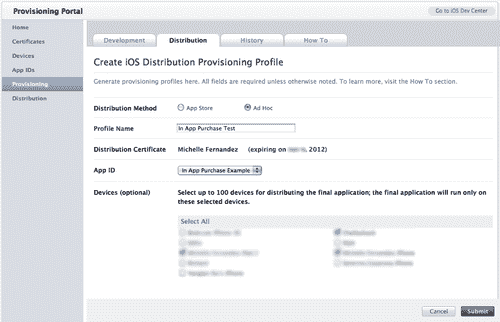

+   在 iTunes Connect 中设置您的应用程序信息。您不需要上传二进制文件来创建或测试 In-App Purchases。

+   确保您已经与苹果公司签订了有效的 iOS 付费应用程序合同。如果没有，您需要在 iTunes Connect 主页上的**合同、税务和银行**部分请求一个。为了在您的应用程序中提供 In-App Purchases，您需要提供您的银行和税务信息。

# 创建 In-App Purchase 的操作时间——在 iTunes Connect 中创建

我们将通过 iTunes Connect 实现内购，并在示例应用程序中创建一个将调用交易的场景。让我们创建将在我们的 In-App Purchase 中使用的 Product ID。

1.  登录到 iTunes Connect。在主页上，选择**管理您的应用程序**。选择您计划添加 In-App Purchase 的应用程序。

1.  一旦您在应用程序摘要页面上，点击**管理内购**按钮，然后点击左上角的**创建新**按钮。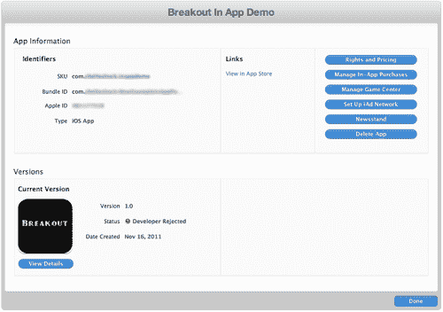

1.  您将被带到一页，显示您可以创建的 In-App Purchases 类型摘要。在这个例子中，**不可消耗**被选中。我们将创建一个只需购买一次的产品。

1.  在下一页是您填写产品信息的区域。这些信息适用于消耗性、非消耗性和非续订订阅 In-App Purchase。填写您产品的 **参考名称** 和 **产品 ID**。**产品 ID** 需要是一个唯一的标识符，可以是任何字母数字序列（即，`com.companyname.appname.productid`)。

    ### 注意

    自动续订订阅需要您生成一个共享密钥。如果您要在您的应用中使用自动续订订阅，那么在 **管理 In-App Purchase** 页面上，点击 **查看或生成共享密钥** 链接。您将被带到生成共享密钥的页面。点击 **生成** 按钮。共享密钥将显示一串 32 个随机生成的字母数字字符。当您选择自动续订订阅时，与其他 In-App Purchase 类型不同的是，您必须选择您产品的自动续订间隔。有关自动续订订阅的更多信息，请访问：[`itunesconnect.apple.com/docs/iTunesConnect_DeveloperGuide.pdf`](http://https://itunesconnect.apple.com/docs/iTunesConnect_DeveloperGuide.pdf)。

    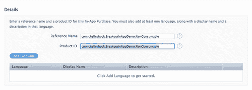

1.  点击 **添加语言** 按钮。选择用于 In-App Purchase 的语言。为您的产品添加一个 **显示名称** 和简短描述。完成后，点击 **保存** 按钮。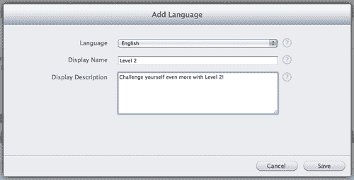

1.  在 **定价和可用性** 中，确保 **已批准销售** 处选择 **是**。在 **价格层级** 下拉菜单中，选择您计划销售的 In-App Purchase 的价格。在本例中，**层级 1** 被选中。在 **审核截图** 中，您需要上传您的 In-App Purchase 的截图。如果您正在对 ad-hoc 构建进行测试，则不需要截图。一旦您准备好分发，截图是必需的，以便在提交时对 In-App Purchase 进行审核。完成后，点击 **保存** 按钮。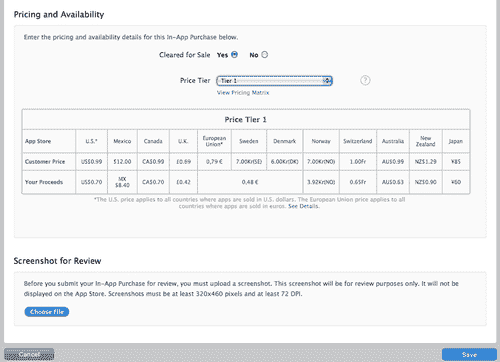

1.  您将在下一页看到您创建的 In-App Purchase 的摘要。如果所有信息看起来都正确，请点击 **完成** 按钮。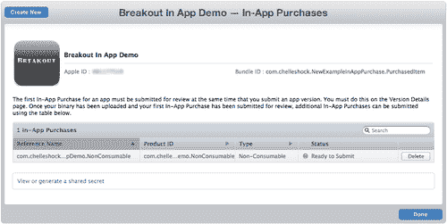

## 刚才发生了什么？

添加新的 In-App Purchase 是一个相对简单的过程。**产品 ID** 中包含的信息将在交易期间被调用。管理 In-App Purchase 的类型完全取决于您想在游戏中销售哪种类型的产品。本例演示了选择代表购买/解锁游戏新级别的非消耗性产品的目的。这是用户想要销售关卡包的常见场景。

您的应用程序不必完成即可测试 In-App Purchases。所需的所有内容是将您的应用程序信息设置在 iTunes Connect 中，以便您可以管理 In-App Purchase 功能。

# 行动时间——使用 Corona 商店模块创建 In-App Purchase

现在我们已经在 iTunes Connect 中设置了我们的 In-App Purchase 产品 ID，我们可以将其实现到我们的应用程序中，以购买我们打算出售的产品。一个名为 **Breakout** 的示例菜单应用程序被创建来演示如何在应用程序内购买级别。该应用程序在级别选择屏幕中有两个级别。第一个默认可用，第二个被锁定，并且只能通过购买它来解锁，价格为 $0.99。我们将创建一个级别选择屏幕，使其以这种方式运行。

1.  在 `Chapter 11` 文件夹中，将 `Breakout In-App Purchase Demo` 项目文件夹复制到您的桌面上。您可以从 Packt 网站下载本书附带的项目文件。您会注意到所需的配置、库、资源和 `.lua` 文件都已包含在内。

1.  创建一个新的 `levelselect.lua` 文件并将其保存到项目文件夹中。

1.  使用以下变量和保存/加载函数设置场景。最重要的变量是 `local store = require("store")`，它调用 In-App Purchases 的 `store` 模块。

    ```java
    local storyboard = require( "storyboard" )
    local scene = storyboard.newScene()
    local ui = require("ui")
    local movieclip = require( "movieclip" )
    local store = require("store")
    ---------------------------------------------------------------------------------
    -- BEGINNING OF YOUR IMPLEMENTATION
    ---------------------------------------------------------------------------------
    local menuTimer
    -- AUDIO
    local tapSound = audio.loadSound( "tapsound.wav" )
    --***************************************************
    -- saveValue() --> used for saving high score, etc.
    --***************************************************
    local saveValue = function( strFilename, strValue )
    -- will save specified value to specified file
    local theFile = strFilename
    local theValue = strValue
    local path = system.pathForFile( theFile, system.DocumentsDirectory )
    -- io.open opens a file at path. returns nil if no file found
    local file = io.open( path, "w+" )
    if file then
    -- write game score to the text file
    file:write( theValue )
    io.close( file )
    end
    end
    --***************************************************
    -- loadValue() --> load saved value from file (returns loaded value as string)
    --***************************************************
    local loadValue = function( strFilename )
    -- will load specified file, or create new file if it doesn't exist
    local theFile = strFilename
    local path = system.pathForFile( theFile, system.DocumentsDirectory )
    -- io.open opens a file at path. returns nil if no file found
    local file = io.open( path, "r" )
    if file then
    -- read all contents of file into a string
    local contents = file:read( "*a" )
    io.close( file )
    return contents
    else
    -- create file b/c it doesn't exist yet
    file = io.open( path, "w" )
    file:write( "0" )
    io.close( file )
    return "0"
    end
    end
    -- DATA SAVING
    local level2Unlocked = 1
    local level2Filename = "level2.data"
    local loadedLevel2Unlocked = loadValue( level2Filename )

    ```

1.  创建 `createScene()` 事件并删除 `"mainmenu"`、`"level1"` 和 `"level2"` 场景。

    ```java
    -- Called when the scene's view does not exist:
    function scene:createScene( event )
    local screenGroup = self.view
    -- completely remove maingame and options
    storyboard.removeScene( "mainmenu" )
    storyboard.removeScene( "level1" )
    storyboard.removeScene( "level2" )
    print( "\nlevelselect: createScene event" )
    end

    ```

1.  接下来，创建 `enterScene()` 事件和一个包含在 iTunes Connect 中设置为 In-App Purchase 的 **产品 ID** 字符串的数组。

    ```java
    function scene:enterScene( event )
    local screenGroup = self.view
    print( "levelselect: enterScene event" )
    local listOfProducts =
    {
    -- These Product IDs must already be set up in your store
    -- Replace Product ID with a valid one from iTunes Connect
    "com.companyname.appname.NonConsumable", -- Non Consumable In-App Purchase
    }

    ```

1.  添加一个名为 `validProducts` 的本地空表和 `invalidProducts`。创建一个名为 `unpackValidProducts()` 的本地函数，用于检查有效的和无效的产品 ID。

    ```java
    local validProducts = {}
    local invalidProducts = {}
    local unpackValidProducts = function()
    print ("Loading product list")
    if not validProducts then
    native.showAlert( "In-App features not available", "initStore() failed", { "OK" } )
    else
    print( "Found " .. #validProducts .. " valid items ")
    for i=1, #invalidProducts do
    -- Debug: display the product info
    native.showAlert( "Item " .. invalidProducts[i] .. " is invalid.",{ "OK" } )
    print("Item " .. invalidProducts[i] .. " is invalid.")
    end
    end
    end

    ```

1.  创建一个名为 `loadProductsCallback()` 的本地函数，带有 `event` 参数。设置处理程序以使用 `print` 语句接收产品信息。

    ```java
    local loadProductsCallback = function( event )
    -- Debug info for testing
    print("loadProductsCallback()")
    print("event, event.name", event, event.name)
    print(event.products)
    print("#event.products", #event.products)
    validProducts = event.products
    invalidProducts = event.invalidProducts
    unpackValidProducts ()
    end

    ```

1.  创建一个名为 `transactionCallback()` 的本地函数，带有 `event` 参数。添加几个针对每个 `transaction.state` 应该发生的结果的案例。当商店完成交易后，在函数结束前调用 `store.finishTransaction(event.transaction)`。设置另一个名为 `setUpStore()` 的本地函数，带有 `event` 参数，以调用 `store.loadProducts(listOfProducts, loadProductsCallback)`。

    ```java
    local transactionCallback = function( event )
    if event.transaction.state == "purchased" then
    print("Transaction successful!")
    saveValue( level2Filename, tostring(level2Unlocked) )
    elseif event.transcation.state == "restored" then
    print("productIdentifier", event.transaction.productIdentifier)
    print("receipt", event.transaction.receipt)
    print("transactionIdentifier", event.transaction.transactionIdentifier)
    print("date", event.transaction.date)
    print("originalReceipt", event.transaction.originalReceipt)
    elseif event.transaction.state == "cancelled" then
    print("Transaction cancelled by user.")
    elseif event.transaction.state == "failed" then
    print("Transaction failed, type: ", event.transaction.errorType, event.transaction.errorString)
    local alert = native.showAlert("Failed ", infoString,{ "OK" })
    else
    print("Unknown event")
    local alert = native.showAlert("Unknown ", infoString,{ "OK" })
    end
    -- Tell the store we are done with the transaction.
    store.finishTransaction( event.transaction )
    end
    local setupMyStore = function(event)
    store.loadProducts( listOfProducts, loadProductsCallback )
    print ("After store.loadProducts(), waiting for callback")
    end

    ```

1.  设置背景和第 1 级别按钮的显示对象。

    ```java
    local backgroundImage = display.newImageRect( "levelSelectScreen.png", 480, 320 )
    backgroundImage.x = 240; backgroundImage.y = 160
    screenGroup:insert( backgroundImage )
    local level1Btn = movieclip.newAnim({"level1btn.png"}, 200, 60)
    level1Btn.x = 240; level1Btn.y = 100
    screenGroup:insert( level1Btn )
    local function level1touch( event )
    if event.phase == "ended" then
    audio.play( tapSound )
    storyboard.gotoScene( "loadlevel1", "fade", 300 )
    end
    end
    level1Btn:addEventListener( "touch", level1touch )
    level1Btn:stopAtFrame(1)

    ```

1.  设置第 2 级别按钮的位置。

    ```java
    -- LEVEL 2
    local level2Btn = movieclip.newAnim({"levelLocked.png","level2btn.png"}, 200, 60)
    level2Btn.x = 240; level2Btn.y = 180
    screenGroup:insert( level2Btn )

    ```

1.  使用本地的 `onBuyLevel2Touch(event)` 函数并创建一个 `if` 语句来检查当 `event.phase == ended and level2Unlocked ~= tonumber(loadedLevel2Unlocked)` 时，场景将变为 `mainmenu.lua`。

    ```java
    local onBuyLevel2Touch = function( event )
    if event.phase == "ended" and level2Unlocked ~= tonumber(loadedLevel2Unlocked) then
    audio.play( tapSound )
    storyboard.gotoScene( "mainmenu", "fade", 300 )

    ```

1.  在相同的 `if` 语句中，创建一个名为 `buyLevel2()` 的本地函数，带有 `product` 参数，以调用 `store.purchase()` 函数。

    ```java
    local buyLevel2 = function ( product )
    print ("Congrats! Purchasing " ..product)
    -- Purchase the item
    if store.canMakePurchases then
    store.purchase( {validProducts[1]} )
    else
    native.showAlert("Store purchases are not available, please try again later", { "OK" } ) Will occur only due to phone setting/account restrictions
    end
    end
    -- Enter your product ID here
    -- Replace Product ID with a valid one from iTunes Connect
    buyLevel2("com.companyname.appname.NonConsumable")

    ```

1.  在交易完成后，添加一个 `elseif` 语句来检查是否已购买并解锁了第 2 级别。

    ```java
    elseif event.phase == "ended" and level2Unlocked == tonumber(loadedLevel2Unlocked) then
    audio.play( tapSound )
    storyboard.gotoScene( "loadlevel2", "fade", 300 )
    end
    end
    level2Btn:addEventListener( "touch", onBuyLevel2Touch )
    if level2Unlocked == tonumber(loadedLevel2Unlocked) then
    level2Btn:stopAtFrame(2)
    end

    ```

1.  使用 `store.init()` 激活内购，并将 `transactionCallback()` 作为参数调用。同时，使用 500 毫秒的计时器调用 `setupMyStore()`。

    ```java
    store.init(transactionCallback)
    timer.performWithDelay (500, setupMyStore)

    ```

1.  创建关闭 UI 按钮，并创建一个带有事件参数的本地函数 `onCloseTouch()`。在释放关闭按钮时，将函数过渡场景设置为 `loadmainmenu.lua`。使用 `end` 关闭 `enterScene()` 事件。

    ```java
    local closeBtn
    local onCloseTouch = function( event )
    if event.phase == "release" then
    audio.play( tapSound )
    storyboard.gotoScene( "loadmainmenu", "fade", 300 )
    end
    end
    closeBtn = ui.newButton{
    defaultSrc = "closebtn.png",
    defaultX = 100,
    defaultY = 30,
    overSrc = "closebtn.png",
    overX = 105,
    overY = 35,
    onEvent = onCloseTouch,
    id = "CloseButton",
    text = "",
    font = "Helvetica",
    textColor = { 255, 255, 255, 255 },
    size = 16,
    emboss = false
    }
    closeBtn.x = 80; closeBtn.y = 280
    closeBtn.isVisible = false
    screenGroup:insert( closeBtn )
    menuTimer = timer.performWithDelay( 200, function() closeBtn.isVisible = true; end, 1 )
    end

    ```

1.  创建 `exitScene()` 和 `destroyScene()` 事件。在 `exitScene()` 事件中，取消 `menuTimer` 计时器。将所有事件监听器添加到场景事件中，并 `return scene`。

    ```java
    -- Called when scene is about to move offscreen:
    function scene:exitScene()
    if menuTimer then timer.cancel( menuTimer ); end
    print( "levelselect: exitScene event" )
    end
    -- Called prior to the removal of scene's "view" (display group)
    function scene:destroyScene( event )
    print( "((destroying levelselect's view))" )
    end
    -- "createScene" event is dispatched if scene's view does not exist
    scene:addEventListener( "createScene", scene )
    -- "enterScene" event is dispatched whenever scene transition has finished
    scene:addEventListener( "enterScene", scene )
    -- "exitScene" event is dispatched before next scene's transition begins
    scene:addEventListener( "exitScene", scene )
    -- "destroyScene" event is dispatched before view is unloaded, which can be
    scene:addEventListener( "destroyScene", scene )
    return scene

    ```

1.  保存文件并在 Corona 模拟器中运行项目。当您选择 **播放** 按钮时，您将在关卡选择屏幕上注意到一个 **1** 按钮和一个 **锁定** 按钮。通过按下 **锁定** 按钮来调用商店进行交易。您将在终端中注意到一个 `print` 语句，显示正在购买的产品 **Product ID**。在模拟器中无法测试完整的内购功能。您必须创建一个分发构建并将其上传到 iOS 设备上，以在商店中引发购买。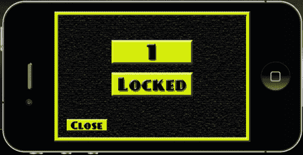

## 刚才发生了什么？

在此示例中，我们使用了 `BeebeGames` 类中的 `saveValue()` 和 `loadValue()` 函数来实现如何使用电影剪辑作为按钮，将我们的锁定级别从锁定状态转换为解锁状态。`local listOfProducts` 中的数组以字符串格式显示产品 ID。在此示例中，**Product ID** 需要是一个不可消耗的内购类型，并且必须在 iTunes Connect 中存在。

`unpackValidProducts()` 函数检查内购中有多少有效和无效的项目。`loadProductsCallback()` 函数接收存储中的产品信息。`transactionCallback(event)` 函数检查每个状态——`"purchased"`、"restored"`、"cancelled"` 和 `"failed"`。当在内购中达到 `"purchased"` 状态时，将调用 `saveValue()` 函数来更改 `level2.data` 的值。当交易完成时，需要调用 `store.finishTransaction(event.transaction)` 来告诉商店您已完成购买。

`setupMyStore(event)` 函数调用 `store.loadProducts(listOfProducts, loadProductsCallback)` 并检查应用程序中可用的产品 ID。一旦 `store.init(transactionCallback)` 初始化并调用 `setupMyStore()`，事件就会被处理。

`onBuyLevel2Touch(event)` 函数允许我们检查已为锁定级别进行了内购操作。当用户能够购买并接受内购时，交易将被处理，`level2Unlocked` 的值将与 `tonumber(loadedLevel2Unlocked)` 相匹配。一旦产品 ID 返回有效，`buyLevel2(product)` 函数将使用 `store.purchase()` 验证购买的商品。

在 In-App Purchase 之后，屏幕切换到主菜单，以便将 **锁定** 按钮更改为 **2** 级按钮。一旦按钮切换到帧 2，就可以访问第二级。

## 尝试处理多个产品 ID 的英雄——处理多个产品 ID

现在您已经知道如何为单个产品创建 In-App Purchase，尝试在同一个应用程序中添加多个。场景是开放的。

您可以添加以下内容：

+   购买更多级别

+   用户可以扮演的新角色，如果您的游戏有用户角色功能。

+   为您的应用程序添加新的背景场景

您如何处理商店中的新产品完全取决于您。

# 测试 In-App Purchase

您想确保购买操作正确无误。Apple 提供了一个沙盒环境，允许您测试您的应用程序的 In-App Purchase。沙盒环境使用与 App Store 相同的模型，但不处理实际支付。交易返回时，就像支付已成功处理一样。在将 In-App Purchase 提交给 Apple 审查之前，必须在沙盒环境中测试 In-App Purchase 是一项要求。

在沙盒环境中进行测试时，您需要创建一个与您当前的 iTunes Connect 账户不同的单独用户测试账户。不允许使用当前账户在沙盒中测试您的商店。

## 用户测试账户

登录您的 iTunes Connect 账户后，您需要从主页选择 **管理用户** 链接。在 **选择用户类型** 页面上选择 **测试用户**。添加新用户，并确保测试账户使用的是与任何其他 Apple 账户不相关的电子邮件地址。所有测试账户应在测试 In-App Purchase 时仅在测试环境中使用。当所有信息填写完毕后，点击 **保存** 按钮。

一旦创建了用户测试账户，您需要确保在设备的 **商店** 设置中注销您的 Apple 账户。这将防止在测试 In-App Purchase 时使用非测试账户。您只能在 In-App Purchase 沙盒测试您的应用程序时被提示时登录用户测试账户。在应用程序启动之前不要登录测试账户。这将防止测试账户无效。

# 行动时间——使用 Breakout In-App Purchase 示例测试 In-App Purchase

在您可以在 iOS 设备上测试 In-App Purchase 之前，请确保您已经在 iTunes Connect 中创建了一个测试用户账户。此外，请确保您使用针对测试 In-App Purchase 功能的应用程序创建了使用 ad-hoc 分发配置文件的发行版构建。如果您遵循了本章中此前的所有步骤，通过商店进行的购买测试将相应地工作。

1.  在 Corona 模拟器中，创建 Breakout In-App Purchase 示例的发行版构建。一旦构建编译完成，请将构建上传到您的 iOS 设备。

1.  保持您的设备连接到您的计算机，并启动 Xcode。在工具栏中，选择**窗口** | **组织者**。一旦进入**组织者**，在**设备**部分选择连接的设备，然后选择**控制台**。这将允许您检查设备的控制台输出，以捕获代码中的调试消息（即`print`语句）和任何应用程序崩溃。

1.  在启动应用程序之前，您需要在您的设备上选择**设置**图标。向上滚动，直到您看到**商店**图标，然后选择它。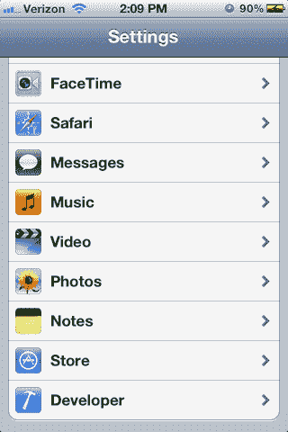

1.  如果您已登录到 iTunes Store 账户，请先退出，以便您可以在沙盒环境中测试内购功能。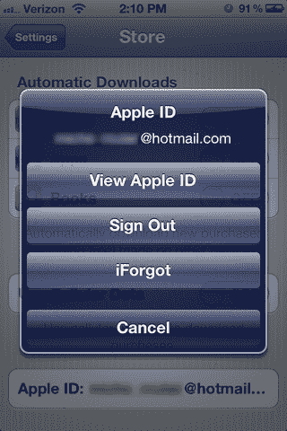

1.  从您的设备启动 Breakout 内购演示。选择**播放**按钮，然后选择**锁定**按钮。屏幕将切换回主菜单，并弹出一个窗口以确认您的内购。点击**确定**继续购买。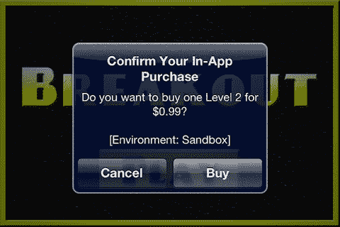

1.  接下来，您将看到一个窗口，要求您使用 Apple ID 登录。这是您将使用在 iTunes Connect 中创建的测试用户账户登录的地方。不要使用您用于登录 iTunes Connect 的实际 Apple 账户 ID。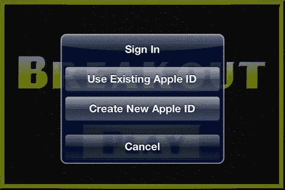

1.  登录后，再次选择**播放**按钮。您会注意到**2**按钮已被解锁。选择它后，您将可以访问该场景。

1.  退出应用程序并查看控制台。您会注意到设备输出的输出以及我们代码中的一些熟悉的`print`语句。控制台日志显示用于内购的**产品 ID**，并告知您它是否有效以及交易是否成功。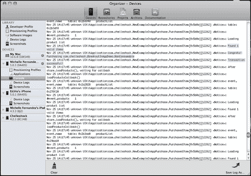

1.  如果您想确保内购确实已成功，请从您的设备中删除应用程序并退出您的用户测试账户。将相同的构建上传到您的设备。无需创建新的。启动应用程序并再次运行内购。使用相同的用户测试账户登录。您应该会收到一个弹出窗口，提示您已购买该产品，并询问您是否想要免费重新下载。收到通知意味着您的内购已成功！！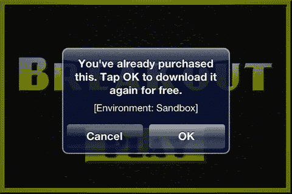

## 刚才发生了什么？

严格按照应用内购买测试步骤进行非常重要。为了确保你在沙盒环境中得到准确的结果，从**商店**设置中注销您的 Apple 账户是整个过程中的关键。

一旦您启动应用程序并通过点击**锁定**按钮调用 store 函数，您将注意到应用内购买的显示名称和价格。如果您正确实现，它应该与您在 iTunes Connect 中创建的相匹配。

当您使用在 iTunes Connect 中创建的测试用户账户登录时，如果没有苹果服务器端的问题或设备上的连接问题，交易应该没有错误地完成。关卡选择屏幕上的**Level 2**将被解锁并可供访问。恭喜！你已经创建了一个应用内购买！

## 尝试一下英雄——使用其他应用内购买类型

在 Breakout 应用内购买演示中，我们更关注不可消耗的应用内购买。尝试将可消耗、自动续订的订阅或非续订订阅集成到您自己的应用中。

具有可消耗产品的应用是那些在免费游玩环境中需要货币来购买或建造东西的游戏。订阅产品可以针对那些永不结束且不断更新新关卡或可能需要在线服务器以在多人环境中交互的游戏。看看你能想出什么！

## 快速问答——关于应用内购买

1.  什么是不可消耗的购买？

    +   a. 用户只需购买一次的产品。

    +   b. 每次用户需要物品时都需要购买的产品。

    +   c. 允许用户购买一定时长内容的商品。

    +   d. 每次到期时都需要用户续订的订阅。

1.  关于测试应用内购买，以下哪个说法是正确的？

    +   a. 您需要始终登录您的账户。

    +   b. 您的 Apple 账户用于测试应用内购买。

    +   c. 在应用内购买沙盒中提示时登录您的用户测试账户。

    +   d. 以上都不是。

1.  测试应用内购买需要使用哪种类型的配置文件？

    +   a. 开发配置文件。

    +   b. 临时分配配置文件。

    +   c. 应用商店分配配置文件。

    +   d. 以上都不是。

# 摘要

我们终于看到了隧道尽头的曙光。到现在为止，你应该已经对如何在游戏中实现应用内购买有了想法。在组织、设置代码以及在沙盒环境中测试准确的购买是一个非常漫长的过程。

本章讨论了以下内容：

+   在 iTunes Connect 中设置应用内购买的产品 ID

+   使用 Corona 的`store`模块实现购买项

+   在 iTunes Connect 中添加测试用户账户

+   在设备上测试应用内购买

理解应用内购买的概念可能需要一些时间。最好研究示例代码并回顾与 Corona 的`store`模块相关的功能。

请查看 Apple 的 In-App Purchase Programming Guide，网址为：[`developer.apple.com/library/ios/documentation/NetworkingInternet/Conceptual/StoreKitGuide/StoreKitGuide.pdf`](https://developer.apple.com/library/ios/documentation/NetworkingInternet/Conceptual/StoreKitGuide/StoreKitGuide.pdf)，以及 Anscamobile 网站 API 参考部分的 In-App Purchases，网址为：[`developer.anscamobile.com/reference/index/app-purchases`](http://developer.anscamobile.com/reference/index/app-purchases)，以获取更多与此主题相关的参考资料。

经过 11 章的学习，我们已到达这本书的结尾。你现在已经拥有了足够的知识来创建自己的应用并在 App Store 或 Google Play Store 上销售。希望你所获得的所有信息都对你有所帮助。我期待着听到你使用 Corona SDK 开发的游戏！
