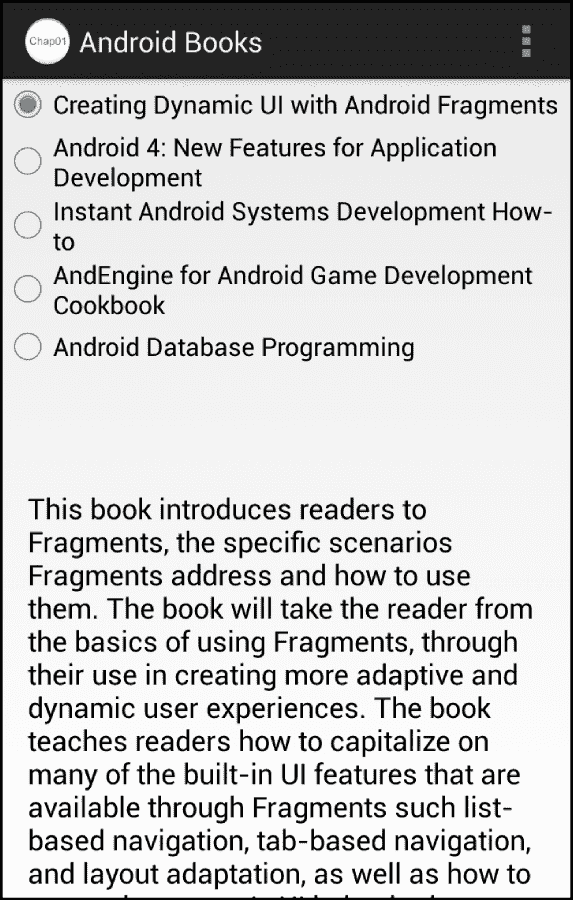

# 第一章：碎片和用户界面模块化

本章将介绍碎片、用户界面模块化以及碎片在开发模块化用户界面中所扮演的角色。本章将演示如何创建简单的碎片，并在活动中静态使用碎片。

让我们看看将要讨论的主题：

+   对用户界面模块化的需求

+   碎片是模块化的基础

+   对跨 Android 版本的碎片支持

+   创建碎片

到本章结束时，我们将能够在静态活动布局中创建和使用碎片。

# 对 UI 创建新方法的需求

你成为 Android 开发者后，可能学的第一个类就是`Activity`类。毕竟，`Activity`类为你的应用程序提供了用户界面。通过将用户界面组件组织到活动中，活动就成为了你绘制应用程序杰作的地方。

在 Android 早期，直接在活动中构建应用程序的用户界面还是相当可行的。早期的多数应用程序用户界面相对简单，而且不同的 Android 设备形态也较少。在大多数情况下，借助一些布局资源，单个活动就能很好地适应不同的设备形态。

现在，Android 设备具有各种各样的形态，其尺寸和形状的差异性令人惊叹。结合现代 Android 应用程序丰富的、高度交互的用户界面，创建一个能够有效管理跨如此多样形态因子的用户界面的单一活动变得极其困难。

一个可能的解决方案是定义一个活动，以为一部分设备形态因子提供用户体验，例如智能手机。然后再为另一部分形态因子，如平板电脑，定义另一个活动。这种做法的问题是，活动往往需要负责很多除了渲染用户界面之外的任务。当多个活动实质上执行相同的任务时，我们必须在每个活动中复制逻辑，或者通过找到在活动间共享逻辑的方法来增加程序的复杂性。为不同形态因子使用不同活动的方法也会大大增加程序中的活动数量，容易将所需的活动数量翻倍甚至三倍。

我们需要更好的解决方案。我们需要一个能够将应用程序用户界面模块化为可以在活动中按需排列的区域的解决方案。碎片就是这样的解决方案。

Android 碎片允许我们将用户界面划分为功能性用户界面组件和逻辑的分组。活动可以根据给定的设备形态因子按需加载和排列碎片。碎片负责处理形态因子的细节，而活动则管理整体的用户界面问题。

## 片段的广泛平台支持

`Fragment`类在 API 级别 11（Android 3.0）时被添加到 Android 中。这是第一个正式支持平板电脑的 Android 版本。平板电脑支持的增加加剧了一个已经困难的问题；由于 Android 设备形态因素的多样性，开发 Android 应用程序变得越来越困难。

幸运的是，片段为我们提供了一个解决问题的方案。通过片段，我们可以更容易地创建支持各种形态因素的应用程序，因为我们能够将用户界面划分为有效的组件组合及其相关的逻辑。

片段有一个问题。直到最近，大多数 Android 设备的 API 级别都在 11 以下，因此不支持片段。幸运的是，谷歌发布了 Android 支持库，可以在[`developer.android.com/tools/extras/support-library.html`](http://developer.android.com/tools/extras/support-library.html)获取，这使得任何运行 API 级别 4（Android 1.6）或更高版本的设备都能使用片段。通过 Android 支持库，片段现在几乎可以在所有正在使用的 Android 设备上使用。

### 注意

使用 Android Studio 创建的应用程序会自动包含 Android 支持库，因此几乎在所有使用的 SDK 版本上都支持片段。如果你将使用除 Android Studio 以外的开发工具来创建针对运行在 SDK 级别 11 以下设备的应用程序，请访问[`android-developers.blogspot.com/2011/03/fragments-for-all.html`](http://android-developers.blogspot.com/2011/03/fragments-for-all.html)，查看 Android 开发者博客文章《*Fragments For All*》，了解如何手动将 Android 支持库添加到你的项目中。

## 片段简化了常见的 Android 任务

片段不仅简化了我们创建应用程序用户界面的方式，还简化了许多内置的 Android 用户界面任务。诸如标签显示、列表显示和对话框等用户界面概念，在历史上都有明显不同的处理方法。然而，当我们深入思考时，它们实际上都是将用户界面组件和逻辑组合成一个功能组的共同概念的变体。片段正式化了这一概念，因此允许我们以前对这些不同的任务采取一致的处理方法。我们将在本书后面详细讨论这些问题以及一些专门的片段类，如`DialogFragment`类和`ListFragment`类。

## 片段与活动之间的关系

片段并不替代活动，而是对其进行补充。一个片段总是存在于一个活动中。一个活动实例可以包含任意数量的片段，但给定的片段实例只能存在于一个单一活动中。一个片段与其所在的活动紧密相关，该片段的生命周期与其包含活动的生命周期紧密耦合。我们将在第三章，*片段生命周期和专业化*中更多地讨论片段的生命周期与其包含活动的紧密关系。

我们不想犯的一个常见错误是过度使用片段。通常当有人了解到片段时，他们会假设每个活动都必须包含片段，但这并非总是如此。

在阅读本书的过程中，我们将讨论片段的功能和特性以及它们在各种场景中的优势。在构建应用程序时，我们始终要牢记这些。在片段能增加价值的情况下，我们当然希望使用它们。然而，同样重要的是，我们应避免在片段不能提供价值的情况下使用片段，以免使应用程序复杂化。

# 转向使用片段

尽管片段是一个非常强大的工具，但它们本质上做的事情非常简单。片段将用户界面组件及其相关逻辑分组。为与片段相关的用户界面创建部分与为活动创建非常相似。在大多数情况下，特定片段的视图层次结构是从一个布局资源创建的；尽管如此，与活动一样，视图层次结构也可以编程生成。

为片段创建布局资源遵循与为活动创建相同的规则和技术。关键的区别在于，在使用片段时，我们正在寻找将用户界面布局划分为可管理的子部分的机会。

我们通过将传统的以活动为中心的用户界面转换为使用片段来开始使用片段是最简单的方法。

## 旧的思维方式——以活动为中心

首先，让我们看看我们要转换的应用程序的外观和结构。这个应用程序包含一个单一活动，运行时看起来如下截图所示：



活动在活动顶部显示五个书名的列表。当用户选择这些书名中的一个时，所选书籍的描述将出现在活动的底部。

### 定义活动的外观

活动的显示外观在名为`activity_main.xml`的布局资源文件中定义，该文件包含以下布局描述：

```java
<LinearLayout

    android:orientation="vertical"
    android:layout_width="match_parent"
    android:layout_height="match_parent">

  <!-- List of Book Titles -->
  <ScrollView
      android:layout_width="match_parent"
      android:layout_height="0dp"
      android:id="@+id/scrollTitles"
      android:layout_weight="1">
    <RadioGroup
        android:id="@+id/bookSelectGroup"
        android:layout_height="wrap_content"
        android:layout_width="wrap_content"
    >
      <RadioButton
          android:id="@+id/dynamicUiBook"
          android:layout_height="wrap_content"
          android:layout_width="wrap_content"
          android:text="@string/dynamicUiTitle"
          android:checked="true" />
      <RadioButton
          android:id="@+id/android4NewBook"
          android:layout_height="wrap_content"
          android:layout_width="wrap_content"
          android:text="@string/android4NewTitle" />

      <!-- Other RadioButtons elided for clarify -->

    </RadioGroup>
  </ScrollView>

  <!-- Description of selected book -->
  <ScrollView
      android:layout_width="match_parent"
      android:layout_height="0dp"
      android:id="@+id/scrollDescription"
      android:layout_weight="1">

    <TextView
        android:layout_width="wrap_content"
        android:layout_height="wrap_content"
        android:textAppearance="?android:attr/textAppearanceMedium"
        android:text="@string/dynamicUiDescription"
        android:id="@+id/textView"
        android:paddingLeft="@dimen/activity_horizontal_margin"
        android:paddingRight="@dimen/activity_horizontal_margin"
        android:gravity="fill_horizontal"/>
  </ScrollView>
</LinearLayout>
```

### 提示

**下载示例代码**

您可以从您的账户 [`www.packtpub.com`](http://www.packtpub.com) 下载您购买的所有 Packt 书籍的示例代码文件。如果您在别处购买了这本书，可以访问 [`www.packtpub.com/support`](http://www.packtpub.com/support) 注册，我们会将文件直接通过电子邮件发送给您。

这个布局资源相对简单，以下是其解释：

+   整体布局是在一个垂直方向的 `LinearLayout` 元素中定义的，其中包含两个 `ScrollView` 元素。

+   两个 `ScrollView` 元素都有一个 `layout_weight` 值为 `1`，这使得顶级 `LinearLayout` 元素能够在两个 `ScrollView` 元素之间平均分配屏幕。

+   顶部的 `ScrollView` 元素，其 `id` 值为 `scrollTitles`，包装了一个包含一系列 `RadioButton` 元素的 `RadioGroup` 元素，每个书籍对应一个。

+   底部的 `ScrollView` 元素，其 `id` 值为 `scrollDescription`，包含一个 `TextView` 元素，用于显示所选书籍的描述

### 显示活动用户界面

应用程序的活动类 `MainActivity` 直接继承自 `android.app.Activity` 类。为了显示活动的用户界面，我们重写 `onCreate` 方法并调用 `setContentView` 方法，传递 `R.layout.activity_main` 布局资源 ID。

```java
public class MainActivity extends Activity {

  @Override
  protected void onCreate(Bundle savedInstanceState) {
    super.onCreate(savedInstanceState);
    // load the activity_main layout resource
    setContentView(R.layout.activity_main);
  }

  // Other methods elided for clarity
}
```

## 新的思考方式——面向片段

我们目前的活动导向型用户界面在所有 Android 设备具有相同形态因数的情况下是没问题的。正如我们所讨论的，情况并非如此。

我们需要将应用程序用户界面进行分区，这样我们就可以转向面向片段的方法。通过适当的分区，我们可以准备对我们的应用程序进行一些简单的增强，以帮助它适应设备差异。

让我们看看我们可以进行的一些简单更改，这些更改会将我们的用户界面分区。

### 创建片段布局资源

向面向片段的用户界面转变的第一步是识别现有用户界面中的自然分区。在这个应用程序的案例中，自然分区相对容易识别。书名列表是一个很好的候选者，书籍描述是另一个。我们将它们各自做成一个独立的片段。

#### 将布局定义为可重用的列表

对于书名列表，我们可以选择定义一个包含最靠近顶部的 `ScrollView` 元素（其 `id` 值为 `scrollTitles`）的片段，或者只包含该 `ScrollView` 元素内的 `RadioGroup` 元素。创建片段时，我们希望构建它，以便片段最容易复用。尽管我们只需要 `RadioGroup` 元素来显示标题列表，但似乎我们总是希望用户在必要时能够滚动标题列表。在这种情况下，将 `ScrollView` 元素包含在此片段中是有意义的。

为了创建书籍列表的片段，我们定义了一个名为`fragment_book_list.xml`的新布局资源文件。我们从`activity_main.xml`资源文件中复制顶部的`ScrollView`元素及其内容到`fragment_book_list.xml`资源文件中。结果`fragment_book_list.xml`资源文件如下：

```java
<!-- List of Book Titles -->
<ScrollView
    android:layout_width="match_parent"
    android:layout_height="0dp"
    android:id="@+id/scrollTitles"
    android:layout_weight="1">
  <RadioGroup
      android:id="@+id/bookSelectGroup "
      android:layout_height="wrap_content"
      android:layout_width="wrap_content" >
    <RadioButton
        android:id="@+id/dynamicUiBook"
        android:layout_height="wrap_content"
        android:layout_width="wrap_content"
        android:text="@string/dynamicUiTitle"
        android:checked="true"   />
    <RadioButton
        android:id="@+id/android4NewBook"
        android:layout_height="wrap_content"
        android:layout_width="wrap_content"
        android:text="@string/android4NewTitle"    />

    <!-- Other RadioButtons elided for clarify -->

  </RadioGroup>
</ScrollView>
```

这让我们得到了一个与用户界面中书名部分一致的活动布局资源。这是一个良好的开始。

#### 最小化假设

一个有效的以片段为导向的用户界面是由最小化关于片段如何以及在哪里使用的假设的布局资源构建的。我们对片段使用的假设越少，片段的可重用性就越高。

当前我们在`fragment_book_list.xml`资源文件中的布局非常受限，因为它包含了很多假设。例如，根`ScrollView`元素包含一个`layout_height`属性，其值为`0`。这假设了片段将被放置在计算片段高度的布局中。

当我们使用`layout_height`属性值为`0`的片段时，在需要`ScrollView`元素指定有意义的高度的许多布局中，`ScrollView`元素无法正确渲染。即使将片段放入水平方向的`LinearLayout`元素中这样简单的操作，`layout_height`属性值为`0`也会导致片段无法正确渲染。`layout_weight`属性也存在类似问题。

通常，一个好的实践是设计片段以完全占据其所在的任何空间。这样，使用该片段的布局就能最大程度地控制片段的位置和大小。

为此，我们将从`ScrollView`元素中移除`layout_weight`属性，并将`layout_height`属性值更改为`match_parent`。因为现在`ScrollView`元素是布局资源的根节点，我们还需要添加`android`命名空间前缀声明。

下面的代码片段展示了更新后的`ScrollView`元素：

```java
<ScrollView

    android:layout_width="match_parent"
    android:layout_height="match_parent"
    android:id="@+id/scrollTitles">

  <!—RadioGroup and RadioButton elements elided for clarity -->

</ScrollView>
```

使用更新后的`ScrollView`元素，片段布局现在可以适应几乎任何引用它的布局。

#### 封装显示布局

对于书籍描述，我们将定义一个名为`fragment_book_desc.xml`的布局资源文件。片段布局包括活动布局资源底部`ScrollView`元素的内容（其`id`值为`scrollDescription`）。就像在书籍列表片段中一样，我们将移除`layout_weight`属性，将`layout_height`属性设置为`match_parent`，并添加`android`命名空间前缀声明。

`fragment_book_desc.xml`布局资源文件如下所示：

```java
<!-- Description of selected book -->
<ScrollView

    android:layout_width="match_parent"
    android:layout_height="match_parent"
    android:id="@+id/scrollDescription">
  <TextView
      android:layout_width="wrap_content"
      android:layout_height="wrap_content"
      android:textAppearance="?android:attr/textAppearanceMedium"
      android:text="@string/dynamicUiDescription"
      android:id="@+id/textView"
      android:paddingLeft="@dimen/activity_horizontal_margin"
      android:paddingRight="@dimen/activity_horizontal_margin"
      android:gravity="fill_horizontal"/>
</ScrollView>
```

### 创建片段类

与创建活动时一样，我们的片段不仅需要简单的布局定义；还需要一个类。

#### 在片段中包装列表

所有片段类必须直接或间接扩展 `android.app.Fragment` 类。

### 注意

对于依赖 Android 支持库为 API 级别 11（Android 3.0）之前的设备提供片段支持的项目，请使用 `android.support.v4.app.Fragment` 类代替 `android.app.Fragment` 类。

我们将管理书籍列表的片段类称为 `BookListFragment`。这个类将直接扩展 `Fragment` 类，如下所示：

```java
Import android.app.Ftragment;
public class BookListFragment extends Fragment { … }
```

在创建片段时，Android 框架会调用片段上的许多方法。其中最重要的方法之一是 `onCreateView`。`onCreateView` 方法负责返回由片段表示的视图层次结构。Android 框架将返回的片段视图层次结构附加到活动的整体视图层次结构中的适当位置。

在像 `BookListFragment` 类这样的情况中，如果 `Fragment` 类直接从 `Fragment` 类继承，我们必须重写 `onCreateView` 方法并执行构造视图层次结构所需的工作。

`onCreateView` 方法接收三个参数。现在我们重点关注前两个：

+   `inflater`：这是对 `LayoutInflater` 实例的引用，它能够在包含活动的上下文中读取和扩展布局资源。

+   `container`：这是对活动布局中 `ViewGroup` 实例的引用，片段的视图层次结构将附加到该位置。

`LayoutInflater` 类提供了一个名为 `inflate` 的方法，该方法处理将布局资源转换为相应的视图层次结构并返回该层次结构的根视图的引用。使用 `LayoutInflater.inflate` 方法，我们可以实现 `BookListFragment` 类的 `onCreateView` 方法，以构造并返回与 `R.layout.fragment_book_list` 布局资源对应的视图层次结构，如下面的代码所示：

```java
@Override
public View onCreateView(LayoutInflater inflater, ViewGroup container, Bundle savedInstanceState) {
    View viewHierarchy = 
    inflater.inflate(R.layout.fragment_book_list, 
    container, false);
    return viewHierarchy;
}
```

你会注意到在前面的代码中，我们在调用 `inflate` 方法时包含了 `container` 引用和一个布尔值 `false`。`container` 引用为 `inflate` 方法提供了必要的布局参数，以便正确格式化新的视图层次结构。参数值 `false` 表示 `container` 只用于布局参数。如果这个值是 true，`inflate` 方法还会将新的视图层次结构附加到 `container` 视图组。我们不想在 `onCreateView` 方法中将新的视图层次结构附加到 `container` 视图组，因为活动会处理这个问题。

#### 提供显示片段

对于书籍描述片段，我们将定义一个名为 `BookDescFragment` 的类。这个类与 `BookListFragment` 类相同，不同之处在于 `BookDescFragment` 类使用 `R.layout.fragment_book_desc` 布局资源，如下所示：

```java
public class BookDescFragment extends Fragment {
  @Override
  public View onCreateView(LayoutInflater inflater, ViewGroup container, Bundle savedInstanceState) {
    View viewHierarchy = inflater.inflate(R.layout.fragment_book_desc, container, false);
    return viewHierarchy;
  }
}
```

### 将活动转换为使用片段

定义了片段之后，我们现在可以更新活动以使用它们。首先，我们将从 `activity_main.xml` 布局资源文件中删除所有书籍标题和描述布局信息。现在该文件只包含顶级 `LinearLayout` 元素和注释，以显示书籍标题和描述应该放置的位置，如下所示：

```java
<LinearLayout
    android:orientation="vertical"
    android:layout_width="match_parent"
    android:layout_height="match_parent"
    >

  <!--  List of Book Titles  -->

  <!--  Description of selected book  -->

</LinearLayout>
```

使用 `fragment` 元素，我们可以通过引用片段类的类名来将片段添加到布局中，使用 `name` 属性。例如，以下是我们如何引用书籍列表片段类 `BookListFragment`：

```java
<fragment
    android:name="com.jwhh.fragments.BookListFragment"
    android:id="@+id/fragmentTitles"/>
```

我们希望使用片段时，活动的用户界面看起来与转换前一样。为此，我们在片段元素上添加与原始布局中 `ScrollView` 元素相同的 `layout_width`、`layout_height` 和 `layout_weight` 属性值。

这样，活动的完整布局资源文件 `activity_main.xml` 现在如下所示：

```java
<LinearLayout
    android:orientation="vertical"
    android:layout_width="match_parent"
    android:layout_height="match_parent"
    >

  <!-- List of Book Titles -->
  <fragment
      android:layout_width="match_parent"
      android:layout_height="0dp"
      android:layout_weight="1"
      android:name="com.jwhh.fragments.BookListFragment"
      android:id="@+id/fragmentTitles"/>

  <!-- Description of selected book -->
  <fragment
      android:layout_width="match_parent"
      android:layout_height="0dp"
      android:layout_weight="1"
      android:name="com.jwhh.fragments.BookDescFragment"
      android:id="@+id/fragmentDescription"/>
</LinearLayout> 
```

### 注意

如果你在使用 Android Studio，你可能会在 `fragment` 元素上发现一个 `tools:layout` 属性。这个属性由 Android Studio 使用，以便在图形设计器中提供布局预览。当应用程序运行时，它对应用程序的外观没有任何影响。

当应用程序运行时，用户界面现在将完全按照在活动中定义时的样子出现。如果我们针对的是运行 API 级别 11（Android 3.0）或更高版本的 Android 设备，那么无需对 `Activity` 类进行任何更改，因为此时 `Activity` 类只是加载并显示布局资源。

#### 活动和向后兼容性

当使用 Android 支持库来提供 API 级别 11（Android 3.0）之前的片段支持时，我们还需要多做一步。在这种情况下，我们必须对活动进行一个小但重要的更改。我们必须将 `MainActivity` 类的基础类从 `Activity` 类更改为 `android.support.v4.app.FragmentActivity` 类。因为 API 级别 11 之前的 `Activity` 类不理解片段，所以我们使用 Android 支持库中的 `FragmentActivity` 类来为 `MainActivity` 类添加片段支持。

# 总结

从以活动为导向的旧思维转向以片段为导向的新思维，为我们的应用程序开启了丰富的可能性。片段使我们能更好地组织用户界面的外观以及用于管理它的代码。借助片段，我们应用程序的用户界面采用了更加模块化的方法，使我们摆脱了特定设备功能的限制，为应对当今丰富多样的设备以及未来可能出现的新设备做好了准备。

在下一章中，我们将基于用片段创建的模块化用户界面继续构建，以使我们的应用程序能够自动适应各种设备形态的差异，而只需对我们的应用程序进行最小的更改。
