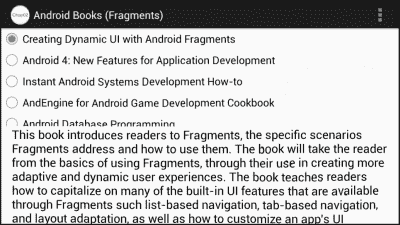
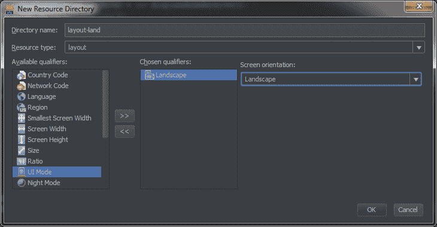
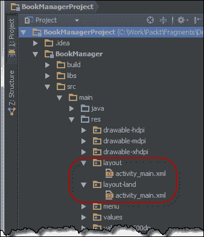
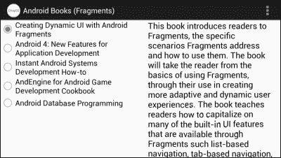
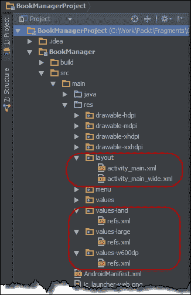
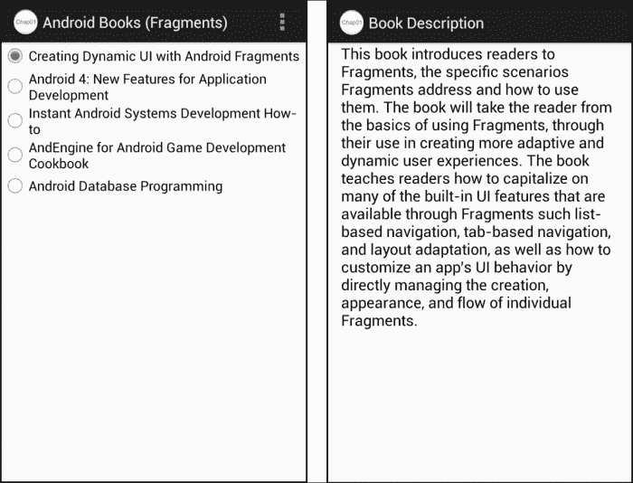

# 第二章：片段与用户界面的灵活性

本章在上一章的基础上，提供了针对设备布局差异的具体解决方案。本章介绍了如何使用自适应 Activity 布局定义来创建应用，这些应用可以自动根据设备形态差异调整用户界面。通过自适应 Activity 布局定义，应用只需使用少数几个精心设计的片段，就能支持各种类型的设备。

在本章中，我们将涵盖以下主题：

+   简化支持设备差异的挑战

+   动态资源选择

+   协调片段内容

+   `FragmentManager`的角色

+   支持跨活动的片段

到本章结束时，我们将能够实现一个用户界面，它使用片段来自动适应设备布局的差异，并协调涉及片段中的用户操作。

# 创建用户界面的灵活性

在用户界面设计中使用片段为我们创建能够更容易适应设备差异的应用提供了一个良好的基础，但我们还必须更进一步，以创建真正灵活的用户界面。我们必须设计应用程序，使得构成用户界面的片段能够根据应用当前运行的设备的特性轻松重新排列。

为此，我们必须使用一些技术来动态地根据当前设备的特性改变单个片段的布局。一旦我们采用了这种技术，我们必须确保我们实现的每个片段都能在布局变化中有效地独立运作，这些变化可能会影响活动中其他片段的行为甚至存在。

## 动态片段布局选择

如我们在上一节提到的，创建灵活的用户界面需要片段在活动中的布局和定位能够根据设备特性的差异进行改变。我们可以在应用中包含代码，以动态响应设备形态因素来排列片段，但在大多数情况下，这样做不仅不必要，而且也不可取。用户界面与代码之间的依赖关系越深，维护和增强应用程序就越困难。尽管用户界面和应用程序代码之间总会有一定程度的依赖，但我们希望尽可能减少这种依赖，并在布局资源中尽可能完成与用户界面布局相关的所有工作。

使我们的应用程序用户界面具有灵活性的最简单方法是利用 Android 资源系统内置的设备适应性。Android 允许我们为应用程序设计不同的布局相关资源，每种资源都针对一组特定的设备特性进行了优化和关联。在运行时，Android 资源系统会自动选择并加载适合当前设备的适当资源。尽管此功能可用于动态修改任何活动的布局，但我们会发现当与片段结合使用时，它特别有效。

为了看到 Android 资源选择的效果，让我们继续上一章的应用程序。你会记得，我们活动的布局在`activity_main.xml`资源文件中，看起来像这样：

```java
<LinearLayout
    android:orientation=""vertical""
    android:layout_width=""match_parent""
    android:layout_height=""match_parent""
    ">

  <!-- List of Book Titles -->
  <fragment
      android:layout_width=""match_parent""
      android:layout_height=""0dp""
      android:layout_weight=""1""
      android:name=""com.jwhh.fragments.BookListFragment""
      android:id=""@+id/fragmentTitles""/>

  <!-- Description of selected book -->
  <fragment
      android:layout_width=""match_parent""
      android:layout_height=""0dp""
      android:layout_weight=""1""
      android:name=""com.jwhh.fragments.BookDescFragment""
      android:id=""@+id/fragmentDescription""/>
</LinearLayout>
```

这个布局将我们的片段`BookListFragment`和`BookDescFragment`堆叠在一起。尽管这种布局在竖直握持智能手机的肖像方向上渲染良好，但是将手机旋转到水平握持的横屏方向时，会出现像这里一样不太吸引人的外观：



当前布局显然没有充分利用这种方向下的可用屏幕空间。当手机以横屏方向定位时，如果我们将两个片段并排放置，应用程序看起来会更好。

### 添加一个备用布局资源

我们可以通过创建一个适当排列片段的新资源文件，为我们的应用程序添加对备用布局的支持。要创建资源文件，我们首先在项目树的`res`文件夹下添加另一个名为`layout-land`的文件夹。

### 注意

资源文件夹名称建立了资源文件与设备特性之间的关联，而不是 Android Studio 的任何特殊行为。

要在 Android Studio 中创建新文件夹，请执行以下步骤：

1.  在项目浏览器窗口中展开**src**文件夹。

1.  展开位于**src**下的**main**文件夹。

1.  在**main**下的**res**文件夹上右键点击。

1.  选择**新建**。

1.  选择**Android 资源目录**以打开**新资源目录**对话框。

1.  选择**布局**作为**资源类型：**。

1.  高亮**可用限定符：**下的**方向**，并点击**>>**按钮将其移到**选定限定符：**。

1.  在**屏幕方向：**下选择**横屏**。

将会出现类似于以下截图的**新资源目录**对话框：



现在，将**layout**资源文件夹中的`activity_main.xml`资源文件复制到**layout-land**资源文件夹中。我们在以下截图中可以看到现在有两个`activity_main.xml`资源文件：



现在，我们可以修改位于`layout-land`文件夹中的`activity_main.xml`资源文件，以便当手机处于横屏方向时，正确地排列碎片。首先，我们将`LinearLayout`元素的垂直方向改为水平方向。然后，将每个碎片的`layout_width`改为`0dp`，`layout_height`改为`match_parent`。我们可以将每个碎片的`layout_weight`值设置为`1`，这样`LinearLayout`就会将它们从左到右均匀分布。

更新的资源文件如下所示：

```java
<LinearLayout
    android:orientation=""horozontal""
    android:layout_width=""match_parent""
    android:layout_height=""match_parent""
    ">

  <!-- List of Book Titles -->
  <fragment
      android:layout_width=""0dp""
      android:layout_height="" match_parent""
      android:layout_weight=""1""
      android:name=""com.jwhh.fragments.BookListFragment""
      android:id=""@+id/fragmentTitles""/>

  <!-- Description of selected book -->
  <fragment
      android:layout_width=""0dp""
      android:layout_height=""match_parent""
      android:layout_weight=""1""
      android:name=""com.jwhh.fragments.BookDescFragment""
      android:id=""@+id/fragmentDescription""/>
</LinearLayout>
```

仅仅是将这个简单的资源文件添加到我们的项目中，应用程序现在就可以在横屏模式下运行时，在设备上并排显示标题列表和书籍描述，如下面的截图所示：



在运行时，当`MainActivity`类加载`R.layout.activity_main`资源时，Android 资源系统会返回适合该方向版本的`activity_main.xml`资源文件。当用户将设备旋转到不同的方向时，Android 会自动重新创建活动，并加载适合新方向的相关资源。

Android 环境检测到各种设备形态因数的特性。通过利用碎片，我们可以创建一个应用程序，只需提供不同的布局资源文件，就可以轻松地适应设备差异，这些文件可以像拼图一样调整我们的碎片位置。

如果没有碎片（Fragments），我们就需要为活动（Activity）提供完整的布局，包括单选按钮、文本视图等，在两个布局文件中都要包含。这样我们就会发现自己需要维护两个复杂且几乎相同的文件。通过使用碎片，各个独立的部分是自包含且不重复的。碎片以一种简单的方式修改布局，并简化我们的应用程序维护工作。

### 根据屏幕大小管理碎片布局

我们用来适应设备方向差异的相同技术可以进一步应用，以处理屏幕尺寸的差异。Android 资源系统具有对设备屏幕尺寸的认知，因此支持创建相应的资源文件夹。资源选择可以基于一般的屏幕尺寸组或特定的屏幕尺寸限制。

设备屏幕尺寸的差异是使用布局资源管理碎片的最常见原因之一。在这种情况下，了解如何使用布局资源处理屏幕尺寸的差异对于有效地使用碎片至关重要。

#### 资源屏幕尺寸组

每个 Android 设备的配置信息包括该设备所属的屏幕尺寸组。四个屏幕尺寸组分别是小型、正常、大型和特大。

### 注意

有关每组屏幕尺寸的具体信息，请参见[Android 文档](http://developer.android.com/guide/practices/screens_support.html#range)中的*支持屏幕范围*部分。

正如我们为横屏方向创建了一个特定的布局资源文件，我们也可以创建一个针对特定屏幕尺寸组的布局资源文件。通过将资源文件放置在适当命名的资源文件夹中，我们将资源文件与所需的屏幕尺寸组关联起来。例如，我们将为大型屏幕尺寸组设计的布局资源文件放置在`layout-large`资源文件夹中。

屏幕尺寸组的划分可追溯到 Android 早期时代，当时在处理现在存在的各种设备形态因素方面实际经验很少。随着时间的推移，Android 设备形态因素的数量增长，文件尺寸组被证明是一个不太理想的解决方案。屏幕尺寸组的问题源于两个主要问题：

1.  组的大小范围并不一致应用，导致组内的大小范围相互重叠。一个 7 英寸屏幕的设备可能被归类为大型，而另一个同样尺寸屏幕的设备可能被归类为 xlarge。

1.  有时尺寸组过于宽泛。例如，大型组包括了 5 英寸屏幕的设备和 7 英寸屏幕的设备。这些屏幕尺寸往往有非常不同的布局要求。5 英寸屏幕的设备更适合使用类似智能手机的手持式布局，而 7 英寸屏幕的设备更适合使用平板式布局。

尺寸组仍然在使用中，因为它们是处理 API 级别 13 之前设备屏幕尺寸差异的最佳选择。幸运的是，目前使用的 Android 设备中不到一半是 API 级别 13 之前的，这一比例正在迅速缩小。

### 注意

要了解按 API 级别或屏幕尺寸组划分的设备分布情况，请参见[Android 开发者](http://developer.android.com/about/dashboards)提供的*Dashboards*。

#### 资源屏幕尺寸限定符

在 API 级别 13（Android 3.2）中，Android 引入了比屏幕尺寸组更实质性的改进，即资源屏幕尺寸限定符。资源屏幕尺寸限定符允许我们将资源与特定的屏幕尺寸要求相关联。使用屏幕尺寸限定符，我们可以非常详细地控制与每种设备形态因素关联的布局资源。

为了避免处理各种屏幕像素密度和物理屏幕尺寸带来的复杂性，Android 在管理屏幕大小时使用了一个标准化的度量单位，称为**密度独立像素**（**dp**）。如果你已经在 Android 领域工作了一段时间，你可能已经很熟悉密度独立像素，因为它们是在 Android 用户界面内定位和调整视图大小时的首选度量单位。

`dp` 总是等同于 160 dpi 设备上像素的物理尺寸，因此提供了一个与设备物理像素大小无关的恒定度量单位。例如，一个 7 英寸显示设备可能有 1280x720 的物理像素计数，而另一个 7 英寸显示设备有 1920x1080 的物理像素计数，但这两个设备的 dp 计数大约都是 1000x600。Android 平台负责处理密度独立像素与设备物理像素之间的映射细节。

Android 提供了三种屏幕尺寸限定符：最小宽度、可用屏幕宽度和可用屏幕高度：

+   **最小宽度屏幕尺寸限定符：**这在 Android Studio 的新目录资源对话框中被称为最小屏幕宽度。它对应于屏幕最窄点的设备独立像素数，与设备方向无关。改变设备方向不会改变设备的最小宽度。我们通过添加 `sw`，然后是所需的屏幕尺寸（以设备独立像素为单位），再加上 `dp` 来指定基于设备最小宽度的资源文件夹名称。例如，至少有 600 dp 最小宽度的设备所包含的布局资源文件夹名为 `layout-sw600dp`。

+   **可用宽度屏幕尺寸限定符：**这在 Android Studio 的新目录资源对话框中被称为屏幕宽度。它对应于设备当前方向上从左到右测量的设备独立像素数。改变设备方向会改变可用宽度。我们通过添加 `w`，然后是密度独立像素的宽度，再加上 `dp` 来指定基于可用宽度的资源文件夹名称。一个包含至少 600 dp 可用宽度的设备所使用的布局资源文件夹名为 `layout-w600dp`。

+   **可用高度屏幕尺寸限定符：**这在 Android Studio 的新目录资源对话框中被称为屏幕高度。它对应于从上到下测量的设备独立像素数，但除此之外，其行为与可用宽度屏幕尺寸限定符完全相同，并遵循相同的命名模式，只是使用 `h` 而不是 `w`。一个包含至少 600 dp 可用高度的设备所使用的布局资源文件夹名为 `layout-h600dp`。

### 消除冗余

随着我们的应用程序目标形态因素数量的增长，由于我们可能希望为不同的限定符使用相同的布局资源文件，不同布局资源文件夹内的资源文件管理可能会变得有些复杂。为了演示这个问题，让我们更新我们的应用程序，在其他设备上使用我们目前在横屏设备上使用的`activity_main.xml`资源文件版本。我们将对大型屏幕尺寸组和当前宽度为 600 dp 或更大的设备使用相同的资源文件。

首先，我们在`res`文件夹下创建两个额外的文件夹：`layout-large`和`layout-w600dp`。然后，我们将`layout-land`文件夹中的`activity_main.xml`文件复制到我们刚才创建的两个文件夹中。这样做足够简单，但现在我们面临维护的麻烦。每次我们更改该布局时，都必须确保在所有三个文件夹中都进行更改。

为了避免这种资源文件的重复，我们可以使用布局别名。

#### 布局别名

布局别名功能让我们只需保留每个布局资源文件的单一副本。然后我们可以向资源系统提供信息，告知每种形态因素应选择哪个文件。

首先，我们将`layout-land`资源文件夹中的`activity_main.xml`资源文件重命名为`activity_main_wide.xml`。然后，我们将文件移动到`layout`资源文件夹，并删除`layout-land`文件夹。

我们现在在`res`文件夹下创建一个名为`values-land`的新资源文件夹。在 Android Studio 中创建此文件夹，步骤与之前创建`layout-land`文件夹相同，但需将**资源类型**设置为**values**，而不是**layout**。

在此文件夹内，我们创建一个新的资源文件，文件名无关紧要，但通常包含别名值的文件命名为`refs.xml`，因为它包含了对其他资源的引用列表，所以我们也将这样做。使用 Android Studio 创建文件，请执行以下步骤：

1.  右键点击**values-land**资源文件夹。

1.  选择**新建**。

1.  选择**values**资源文件。

1.  指定`refs.xml`作为文件名。

在`refs.xml`文件中，请确保已经有一个名为`resources`的根元素。在此元素内，添加一个`item`元素，其`type`属性值为`layout`。这表示我们正在为布局资源提供一个别名条目。我们将`name`属性的值设置为默认布局资源的名称，在我们的例子中是`activity_main`。然后，我们将`item`元素的值设置为`@layout/activity_main_wide`。现在完整的`refs.xml`资源文件如下所示：

```java
<resources>
  <item type=""layout"" name=""activity_main"">
    @layout/activity_main_wide
  </item>
</resources>
```

当这个文件存在时，任何调用加载布局资源`R.layout.activity_main`的地方，在应用程序在横屏方向运行时，将改为加载`R.layout.activity_main_wide`。

为了在大屏幕组和当前宽度至少为 600 dp 的设备上添加支持，我们只需创建两个额外的资源文件夹，`values-large` 和 `values-w600dp`，并将 `values-land` 文件夹中的 `refs.xml` 文件复制到这两个文件夹中。现在，`layout` 和 `values` 资源文件夹如下截图所示：



目前我们已经支持所有期望的形态因子，且没有不必要的布局资源文件重复。我们确实重复了 `refs.xml` 文件，但它比 `layout` 资源文件简单得多，且更不可能发生变化。

### 注意

请查看 Android *提供资源* 指南中的 *表 2*，了解 Android 在执行布局别名时的优先顺序，可在 [`developer.android.com/guide/topics/resources/providing-resources.html`](http://developer.android.com/guide/topics/resources/providing-resources.html) 查阅。

## 设计灵活的片段

当我们的用户界面良好分割且具有适应性时，我们需要确保每个片段都能有效地工作，因为布局差异会导致活动内其他片段的行为甚至存在发生变化。当应用程序用户界面被划分为片段时，片段很少完全独立于彼此存在。通常一个用户与一个片段的交互会对同一活动内的其他片段产生影响。在我们的应用程序中，当用户在 `BookListFragment` 中选择一本书时，就会出现这个问题。响应用户的选择，应用程序负责在 `BookDescFragment` 中显示相应的描述。

### 避免紧密耦合

协调片段内容的一个可能解决方案是允许片段直接相互通信。为了在我们的应用程序内协调内容，我们可以在首次创建活动时将 `BookDescFragment` 引用传递给 `BookListFragment`。在 `BookListFragment` 中对每个用户选择的响应中，`BookListFragment` 将直接更新 `BookDescFragment` 中包含的 `TextView`。

尽管这个解决方案易于实施，但它有问题，因为它将两个 `Fragment` 类紧密耦合在一起。`BookListFragment` 片段只能在同时包含 `BookDescFragment` 片段的活动中使用，而且对 `BookDescFragment` 布局进行更改可能会潜在地破坏 `BookListFragment`。我们始终要记住，使用片段的一个关键目标是要做到良好分割和适应性。

### 抽象片段关系

我们可以利用接口提供的抽象，而不是直接创建片段之间的关系。通过定义一个简单的回调接口来表示用户选择书籍的行为，我们可以完全消除片段之间的紧密耦合。`BookListFragment`类可以编写为通过接口提供用户选择的通知。通过在活动中实现该接口，活动可以处理协调`BookListFragment`中的用户选择与更新`BookDeskFragment`中显示的描述。

#### 定义回调接口

回调接口应包括任何与包含片段的活动可能有意义的交互方法。同时，接口不应让活动负担不必要的细节。接口应专注于应用程序级别的动作，如选择一本书，而不是实现级别的动作，如点击一个单选按钮。实现级别的细节应该被隔离在片段内部。我们还应确保在设计接口时不要有任何预定的想法，即活动将如何处理通知。

在`BookListFragment`的案例中，活动唯一感兴趣的动作是用户选择一本书。这告诉我们接口只需要一个方法；我们将这个接口方法称为`onSelectedBookChanged`。我们知道在这个应用程序的案例中，目标是显示所选书籍的描述，因此一个可能性是让`onSelectedBookChanged`方法包含一个书籍描述的参数。传递书籍描述的问题是这样做将限制`BookListFragment`仅用于这一个用例，即显示书籍描述。相反，通过传递书籍的标识符，`BookListFragment`可以用于任何用户选择书籍的用例。为了简单起见，在我们的示例中，我们将使用数组索引作为标识符；在真实场景中，标识符更可能是一个用于在数据存储或服务中定位书籍信息的关键。

我们将新的接口称为`OnSelectedBookChangeListener`。接口如下所示：

```java
public interface OnSelectedBookChangeListener {
  void onSelectedBookChanged(int bookIndex);
}
```

#### 使片段自包含

`BookListFragment`类需要隐藏用户选择的细节，而是将每个选择转换为书籍标识符，在我们的案例中是一个数组索引。首先，我们需要更新`BookListFragment`类以处理单选按钮的选择，实现`RadioGroup.OnCheckedChangeListener`接口如下：

```java
public class BookListFragment extends Fragment
    implements RadioGroup.OnCheckedChangeListener {

  @Override
  public void onCheckedChanged(RadioGroup radioGroup, int id)  {

  }

  // Other members elided for clarity

}
```

在`BookListFragment`类的`onCreateView`方法中，我们将单选组的点击监听器设置为`BookListFragment`类，如下所示：

```java
public View onCreateView(LayoutInflater inflater,
    ViewGroup container, Bundle savedInstanceState) {
  View viewHierarchy = inflater.inflate(
      R.layout.fragment_book_list, container, false);

  // Connect the listener to the radio group
  RadioGroup group = (RadioGroup)
  viewHierarchy.findViewById(R.id.bookSelectGroup);
  group.setOnCheckedChangeListener(this);

  return viewHierarchy;
}
```

确定与选中单选按钮对应的书籍索引有多种方法，如在每个单选按钮上设置标签值或使用查找表。为了简单起见，我们将创建一个包含 switch 语句的简单方法，如下代码所示：

```java
  int translateIdToIndex(int id) {
    int index = -1;
    switch (id) {
      case R.id.dynamicUiBook:
        index = 0 ;
        break;
      case R.id.android4NewBook:
        index = 1 ;
        break;
      case R.id.androidSysDevBook:
        index = 2 ;
        break;
      case R.id.androidEngineBook:
        index = 3 ;
        break;
      case R.id.androidDbProgBook:
        index = 4 ;
        break;
    }

    return index;
  }
```

#### 片段通知

片段总是可以通过 `getActivity` 方法访问放置它的活动。在 `BookListFragment` 类的 `onClick` 方法中，我们可以使用 `getActivity` 方法访问活动，将其转换为 `OnSelectedBookChangeListener` 接口，然后调用 `onSelectedBookChanged` 方法，并传递选中单选按钮的书籍索引，如下代码所示：

```java
public void onCheckedChanged(RadioGroup radioGroup, int id) {
  // Translate radio button to book index    
  int bookIndex = translateIdToIndex(id);

  // Get parent Activity and send notification
  OnSelectedBookChangeListener listener =
      (OnSelectedBookChangeListener) getActivity();
  listener.onSelectedBookChanged(bookIndex);
}
```

现在 `BookListFragment` 类完全负责通知父活动关于用户书籍选择的每次更改。

### 封装片段操作

在 `BookDescFragment` 类中，我们希望封装有关如何更新用户界面的任何细节。我们将通过提供一个接受书籍索引并处理查找和显示书籍描述的简单方法来实现这一点。在实现该方法之前，我们首先需要更新 `BookDescFragment` 类的 `onCreateView` 方法，以获取书籍描述列表，获取到 `TextView` 的引用，该 `TextView` 由 `R.id.bookDescription` 标识，并将两者分配给类级字段，如下所示：

```java
public class BookDescFragment extends Fragment {

  String[] mBookDescriptions;
  TextView mBookDescriptionTextView;

  @Override
  public View onCreateView(LayoutInflater inflater,
    ViewGroup container, Bundle savedInstanceState) {
    View viewHierarchy = inflater.inflate(
        R.layout.fragment_book_desc, container, false);

    // Load array of book descriptions
    mBookDescriptions = getResources().
        getStringArray(R.array.bookDescriptions);
    // Get reference to book description text view
    mBookDescriptionTextView = (TextView)
        viewHierarchy.findViewById(R.id.bookDescription);

    return viewHierarchy;
  }
}
```

我们现在可以添加一个接受书籍索引的 `setBook` 方法，访问适当的书籍描述，并更新 `mBookDescriptionTextView`。`setBook` 方法如下所示：

```java
public void setBook(int bookIndex) {
  // Lookup the book description
  String bookDescription = mBookDescriptions[bookIndex];

  // Display it
  mBookDescriptionTextView.setText(bookDescription);
}
```

### 松散地连接各个部分

合理使用接口和封装可以大大简化任何组件的使用，片段也不例外。通过对 `BookListFragment` 和 `BookDescFragment` 类所做的努力，我们的活动现在可以通过以下三个简单步骤在 `BookListFragment` 中协调用户交互，通过更新 `BookDescFragment`：

1.  实现 `OnSelectedBookChangeListener` 接口。

1.  获取对 `BookDescFragment` 类的引用。

1.  调用 `BookDescFragment` 类的 `setBook` 方法。

首先看第二步。与处理视图不同，活动不能直接引用其包含的片段。相反，片段处理被委托给 `FragmentManager` 类。

每个活动都有 `FragmentManager` 类的唯一实例。`FragmentManager` 类负责访问和管理该活动中的所有片段。活动通过 `getFragmentManager` 方法访问其 `FragmentManager` 实例。

### 注意

在使用 Android Support Library 时，应使用 `FragmentActivity` 类的 `getSupportFragmentManager` 方法，代替标准 `Activity` 类的 `getFragmentManager` 方法来访问当前的 `FragmentManager` 实例。

使用 `FragmentManager`，活动可以通过调用 `FragmentManager.findFragmentById` 方法并传递布局资源中所需片段的 id 值来访问包含的片段。

### 注意

`FragmentManager`是一个重要的类，具有许多强大的功能。我们将在第四章《使用片段事务》中更详细地讨论`FragmentManager`。

通过使用`FragmentManager`访问`BookDescFragment`，我们可以在活动中实现`BookListFragment.OnSelectedBookChangeListener`接口，以更新`BookListFragment`中每个用户选择的显示描述。

```java
public class MainActivity extends Activity
    implements OnSelectedBookChangeListener{

  @Override
  public void onSelectedBookChanged(int bookIndex) {
    // Access the FragmentManager
    FragmentManager fragmentManager = getFragmentManager();
    // Get the book description fragment
    BookDescFragment bookDescFragment = (BookDescFragment)   
        fragmentManager.findFragmentById(R.id.fragmentDescription);
    // Display the book title
    if(bookDescFragment != null)
      bookDescFragment.setBook(bookIndex);
  }

  // other members elided for clarity
}
```

# 片段保护免受预期之外的影响

用户界面灵活性的真正考验是在遇到意外的变更请求时，设计和实现能否经受住考验。一个设计良好的基于片段的用户界面可以让我们创建出能够以最小的影响力和代码变化而进化和改变的令人难以置信的动态用户界面。举个例子，让我们对应用程序进行可能是一个重大设计更改。

目前，该应用总是在同一个活动中显示书籍列表和描述。唯一的区别是片段是相对于彼此垂直还是水平放置。设想我们收到了用户的反馈，他们不喜欢在竖屏手机上查看应用时的显示方式。在竖屏手机上查看时，他们希望列表和描述出现在不同的活动中。在其他所有情况下，他们希望应用继续同时并排显示列表和描述。

## 演进布局资源文件

首先，我们在`layout`资源文件夹中创建`activity_main.xml`资源文件的副本，并将其命名为`activity_book_desc.xml`。在 Android Studio 中执行以下步骤来完成此操作：

1.  在项目资源管理器窗口中右键点击`activity_main.xml`文件并选择**复制**。

1.  右键点击`layout`文件夹并选择**复制**。

1.  将文件名更改为`activity_book_desc.xml`。

从`activity_book_desc.xml`文件中移除`BookListFragment`的片段元素，使其现在只显示`BookDescFragment`，如下代码所示：

```java
<LinearLayout
    "
    android:orientation=""vertical""
    android:layout_width=""match_parent""
    android:layout_height=""match_parent""
    ">

  <!--  Description of selected book  -->
  <fragment
      android:layout_width=""match_parent""
      android:layout_height=""0dp""
      android:layout_weight=""1""
      android:name=""com.jwhh.fragments_after.BookDescFragment""
      android:id=""@+id/fragmentDescription""
      tools:layout=""@layout/fragment_book_desc""/>

</LinearLayout>
```

在`activity_main.xml`资源文件中，移除`BookDescFragment`，现在它看起来如下所示：

```java
<LinearLayout
    "
    android:orientation=""vertical""
    android:layout_width=""match_parent""
    android:layout_height=""match_parent""
    ">

  <!--    List of Book Titles  -->
  <fragment
      android:layout_width=""match_parent""
      android:layout_height=""0dp""
      android:layout_weight=""1""
      android:name=""com.jwhh.fragments_after.BookListFragment""
      android:id=""@+id/fragmentTitles""
      tools:layout=""@layout/fragment_book_list""/>

</LinearLayout>
```

现在我们为每个活动都有了布局资源。请记住，这些更改不会影响使用`activity_main_wide.xml`资源文件的场景下的应用外观。

## 创建书籍描述活动

为了显示书籍描述，我们添加了一个名为`BookDescActivity`的简单活动，它使用`activity_book_desc.xml`布局资源。该活动依赖于“Intent extra”传递书籍索引。由于`BookDescFragment`包含了显示书籍描述所需的所有逻辑，我们可以简单地获取对`BookDescFragment`的引用，并像在`MainActivity`类中一样设置书籍索引，如下所示：

```java
public class BookDescActivity extends Activity {
  @Override
  protected void onCreate(Bundle savedInstanceState) {
    super.onCreate(savedInstanceState);
    setContentView(R.layout.activity_book_desc);

    // Retrieve the book index from the Activity Intent
    Intent intent = getIntent();
    int bookIndex = intent.getIntExtra(""bookIndex"", -1);

    if (bookIndex != -1) {
      // Use FragmentManager to access BookDescFragment
      FragmentManager fm = getFragmentManager();
      BookDescFragment bookDescFragment = (BookDescFragment)
          fm.findFragmentById(R.id.fragmentDescription);
      // Display the book title
      bookDescFragment.setBook(bookIndex);
    }
  }
}
```

## 让`MainActivity`类具有适应性

`MainActivity`类现在需要做一些额外的工作，因为其中包含的特定片段会有所变化。在至少 600 dp 宽的屏幕设备上运行或在大型屏幕设备组中运行时，`MainActivity`类总是包含`BookDescFragment`的实例。另一方面，在其他设备上运行时，`BookDescFragment`的存在将取决于设备的当前方向。我们可以在`MainActivity`类中添加代码以测试所有这些不同的场景，或者我们可以采取更简单的方法，即检查活动是否包含`BookDescFragment`类的实例。

使用这种方法，我们让`MainActivity`类的`onSelectedBookChanged`方法来检查`FragmentManager`返回的`BookDescFragment`的有效性。如果`FragmentManager`返回有效引用，方法可以像之前一样在`BookDescFragment`上调用`setBook`。如果返回的引用无效，`onSelectedBookChanged`方法会调用带有`Intent`实例的`startActivity`，该实例包含显示`BookDescActivity`所需的信息，其中包括作为额外参数的`bookIndex`，如下代码所示：

```java
public void onSelectedBookChanged(int bookIndex) {
  // Access the FragmentManager
  FragmentManager fm = getFragmentManager();
  // Get the book description fragment
  BookDescFragment bookDescFragment = (BookDescFragment)
      fm.findFragmentById(R.id.fragmentDescription);

  // Check validity of fragment reference
  if(bookDescFragment == null || !bookDescFragment.isVisible()){
    // Use activity to display description
    Intent intent = new Intent(this, BookDescActivity.class);
    intent.putExtra(""bookIndex"", bookIndex);
    startActivity(intent);
  }
  else {
    // Use contained fragment to display description
    bookDescFragment.setBook(bookIndex);
  }
}
```

注意到`if`语句检查`bookDescFragment`的有效性。在大多数情况下，仅需要简单检查引用是否为空。唯一的例外是在手持设备上，用户在横屏模式下查看应用程序后，将设备旋转为竖屏。在这种情况下，`BookDescFragment`实例不可见，但活动的`FragmentManager`实例可能会缓存来自横屏布局的不可见实例的引用。因此，我们同时检查引用是否为空和是否可见。我们将在接下来的两章中讨论片段的生命周期、创建和缓存的细节。

现在我们的应用程序已经内置了适应性。使用`activity_main_wide.xml`资源文件的场景看起来一如既往。在竖屏手持设备上，我们的应用程序为用户提供两个独立的界面：一个用于书籍列表，另一个用于书籍描述。应用程序现在在竖屏手持设备上的显示如下所示：



# 总结

片段为我们应用程序提供了难以通过其他方式实现的用户界面灵活性。通过适当设计我们的应用程序以使用片段，并将片段资源与适当的设备特性相关联，我们能够构建出能够自动适应各种 Android 设备形态的应用程序，同时只需编写最少的代码量。

在下一章中，我们将深入研究片段的生命周期，并探讨如何利用片段生命周期来创建更具响应性的用户界面，以及利用专门的`Fragment`类。
