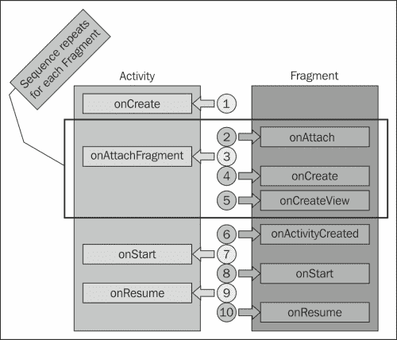
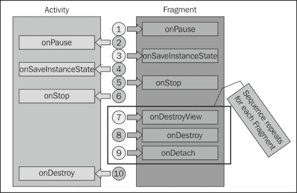
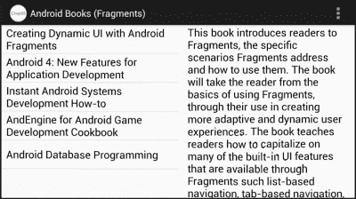
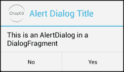

# 第三章：片段生命周期与专业化

本章讨论了片段的生命周期与活动生命周期的关系，并在生命周期的各个阶段演示了适当的编程操作。引入了特殊用途的片段类`ListFragment`和`DialogFragment`，涵盖了它们的使用以及它们在活动生命周期中的行为与标准片段的不同之处。

本章节涵盖了以下主题：

+   片段设置/显示事件序列

+   片段拆卸/隐藏事件序列

+   使用`ListFragment`类

+   使用`DialogFragment`类

+   作为传统的`Dialog`类与`DialogFragment`类交互

+   将现有的`Dialog`类包装在`DialogFragment`类中

到本章末，我们将能够协调片段在它们宿主活动中的设置和拆卸，并能够有效地利用`ListFragment`和`DialogFragment`类。

# 理解片段生命周期

开发 Android 应用程序的挑战之一是确保我们的应用程序能够有效地处理应用程序活动的生命周期。在应用程序的生命周期中，一个给定的活动可能会被创建、销毁和重新创建多次。例如，用户将设备从纵向旋转到横向，或者相反，通常会导致可见活动完全销毁并使用适合新方向资源的活动重新创建。那些不能与这一自然生命周期有效协作的应用程序经常会崩溃或表现出其他不良行为。

众所周知，每个片段实例只存在于单一活动中；因此，该片段必须以某种方式与活动生命周期协作。实际上，片段不仅与活动生命周期协作，而且与之紧密相连。

在设置和显示阶段以及隐藏和拆卸阶段，片段提供了与活动许多相同的与生命周期相关的回调方法。此外，片段还提供了与包含活动的片段关系相关的其他生命周期相关的回调方法。

随着我们的应用程序变得更加复杂，我们使用更多专业化的片段类实现，理解片段类的生命周期及其与活动生命周期的关系是至关重要的。

### 注意

如果你对 Android 活动生命周期回调方法的基础知识不熟悉，请参阅*Android Activity*文档中的*Activity Lifecycle*部分，链接为：[`developer.android.com/reference/android/app/Activity.html#ActivityLifecycle`](http://developer.android.com/reference/android/app/Activity.html#ActivityLifecycle)。

## 理解片段的设置和显示

片段的设置和显示是一个多阶段的过程，涉及片段与活动的关联、片段的创建以及将活动移动到运行状态（也称为恢复或活动状态）的标准生命周期事件。理解生命周期事件的行为和相关回调方法对于有效使用片段至关重要。一旦我们了解了生命周期事件和回调方法，我们就会研究事件回调方法是如何被使用的。

下图展示了在设置和显示期间，片段和活动上发生的生命周期相关回调方法的调用顺序：



如你所料，在大多数情况下，片段的设置和显示第一步发生在活动的`onCreate`方法中。在大多数情况下，活动在其`onCreate`回调方法中调用`setContentView`方法，这会加载布局资源并触发活动与包含片段的关联。

注意接下来发生的事情。在片段被创建之前，该片段就已经与活动关联。首先，片段会通过`onAttach`回调方法得知这一关联，并获得对活动的引用。然后活动得到通知，并通过`onAttachFragment`回调方法获得对片段的引用。

尽管在创建片段之前将片段与活动关联可能看起来有些意外，但这样做是有用的。在许多情况下，片段在创建过程中需要访问活动，因为活动通常包含片段将显示或对片段创建过程重要的信息。

片段与活动关联后，片段在`onCreate`方法中进行一般的创建工作，然后在`onCreateView`方法中构建包含的视图层次结构。

当一个活动包含多个片段时，Android 会为一个片段连续调用四个方法：`Fragment.onAttach`、`Activity.onAttachFragment`、`Fragment.onCreate`和`Fragment.onCreateView`，然后再对下一个片段调用这些方法。这使得每个片段在下一个片段开始该过程之前，可以完成关联和创建的过程。

调用这四个方法的一系列操作完成所有片段后，其余的设置和显示回调方法会依次为每个片段单独调用。

活动执行完其`onCreate`方法后，Android 会调用每个片段的`onActivityCreated`方法。`onActivityCreated`方法表明，由活动布局资源创建的所有视图和片段现在已完全构建，可以安全访问。

在这一点上，片段在活动的同名方法各自被调用之后，紧接着会收到标准的生命周期回调，即`onStart`和`onResume`方法。在片段的`onStart`和`onResume`方法中执行的工作与在活动内对应方法中执行的工作非常相似。

对于许多片段来说，它们生命周期这部分唯一被重写的方法是`onCreate`和`onCreateView`方法，正如我们在前面章节的例子中所看到的那样。

### 避免方法名称混淆

活动和片段类有许多名称常见的方法回调，这些常见名称的方法大多数具有共同的目的。一个重要的例外是`onCreateView`方法。这个方法对于每个类的目的都大不相同。

如前所述，Android 调用`Fragment`类的`onCreateView`方法，让片段有机会创建并返回其包含的视图层次结构。这个方法通常在片段内部被重写。

在`Activity`类中同名的方法在膨胀布局资源的过程中会被`LayoutInflater`类多次调用。大多数活动实现并不重写这个方法。

## 理解片段的隐藏和销毁

正如片段在设置和显示阶段与活动表现相似一样，在隐藏和销毁阶段，它们的行为也类似，如下图所示：



在隐藏和销毁的初期，片段的行为与活动类似。当用户切换到另一个活动时，每个片段的`onPause`、`onSaveInstanceState`和`onStop`方法会被调用。对于每个方法，首先调用片段的实现，然后调用活动的实现。

在调用`onStop`方法之后，片段的行为开始与活动略有不同。与将片段创建与片段视图层次创建分离一致，片段视图层次的销毁也是与片段销毁分离的。在调用活动的`onStop`方法之后，会调用片段的`onDestroyView`方法，表示由片段的`onCreateView`方法返回的视图层次正在被销毁。然后调用片段的`onDestroy`方法，接着是片段的`onDetach`方法。此时，片段与活动没有任何关联，任何对`getActivity`方法的调用都将返回 null。

对于包含多个片段的活动，在开始调用下一个片段的三个方法序列之前，Android 会为一个单独的片段调用`onDestroyView`、`onDestroy`和`onDetach`这三个方法的序列。这类似于 Android 将附加和创建每个片段的过程分组在一起的方式，对销毁和分离每个片段的过程进行分组。当所有片段的这个序列完成后，Android 然后调用活动的`onDestroy`方法。

## 最大化可用资源

在大多数情况下，片段的生命周期管理与活动非常相似。然而，有一个重要的例外：片段创建和销毁的两阶段性质。片段将片段的创建和销毁与其包含的视图层次结构分离。这是因为片段有能力在不存在片段视图层次结构的情况下与活动存在并关联。

在许多场景中，活动可能包含多个片段，但在任何时刻只显示这些片段的一个子集。在这种情况下，包含的片段都可以调用其`onAttach`和`onCreate`方法。但是，直到应用程序需要使该片段的内容可见时，才会调用每个片段的`onCreateView`方法。同样，当需要隐藏片段内容时，只调用片段的`onDestroyView`方法，而不是`onDestroy`和`onDetach`方法。

当在活动中动态管理片段时，这种行为便发挥作用。这种行为允许将片段与活动关联的开销以及初始化片段状态的过程只发生一次，同时能够轻松地改变片段视图层次结构的可见性。当我们使用`FragmentTransaction`类明确管理片段的可见性，以及在某些管理片段的操作栏特性中，这一点非常重要。我们将在接下来的两章中讨论这些问题。

### 管理片段状态

对于许多片段实现来说，生命周期序列中最重要的回调方法是`onSaveInstanceState`。与活动一样，这个回调方法为片段在销毁之前提供了持久化任何状态的机会，例如当用户移动到另一个活动或当用户将设备旋转到不同的方向时。在这两种情况下，活动和包含的片段可能会被完全拆除并重新创建。通过在`onSaveInstanceState`方法中持久化片段状态，该状态后来会在`onCreate`和`onCreateView`方法中传递回片段。

在管理片段的状态时，你需要确保将那些与片段整体存在相关的通用工作与特定于设置视图层次结构的工作分开。任何与片段存在相关的昂贵初始化工作，如连接数据源、复杂计算或资源分配，都应该在`onCreate`方法中而不是`onCreateView`方法中进行。这样，如果只是片段的视图层次结构被销毁而片段本身保持完整，你就可以避免不必要地重复昂贵的初始化工作。

# 特定目的片段类

既然我们已经理解了片段的生命周期，我们可以看看`Fragment`类的几种特殊版本。在了解这些特殊类时，请记住，它们最终都继承自`Fragment`类，因此具有相同生命周期行为。这些特殊类中的许多都会影响在生命周期的各个阶段可以安全执行的操作，有些类甚至还会添加自己的生命周期方法。为了有效地使用这些类，理解每个类及其与片段生命周期的交互是至关重要的。

## 列表片段

最简单且最有用的片段派生类之一是`ListFragment`类。`ListFragment`类提供了一个封装了`ListView`的片段，顾名思义，它非常适合用于显示数据列表。

### 将数据与列表关联

与基础的`Fragment`类不同，我们不需要为`ListFragment`类重写`onCreateView`回调方法。`ListFragment`类提供了一个标准的外观，并且我们只需要关联一些数据。`ListFragment`类完成了创建视图层次结构并显示数据的所有工作。

我们通过调用`ListFragment`类的`setListAdapter`方法并将实现了`ListAdapter`接口的对象引用传递给该方法，来与`ListFragment`类关联数据。Android 提供了许多实现此接口的类，如`ArrayAdapter`、`SimpleAdapter`和`SimpleCursorAdapter`。你使用的具体类将取决于你的源数据存储方式。如果标准的 Android 类不能满足你的特定需求，你可以相对容易地创建一个自定义实现。

### 注意

要讨论创建自定义列表适配器，请参阅 Android 教程《*显示快速联系人徽章*》在[`developer.android.com/training/contacts-provider/display-contact-badge.html`](http://developer.android.com/training/contacts-provider/display-contact-badge.html)。

调用`setListAdapter`要求`ListFragment`的视图层次结构必须完全构建完成。因此，我们通常不会在`onActivityCreated`回调方法之前调用`setListAdapter`方法。

`ListFragment`类包装了一个`ListView`类的实例，通过`getListView`方法可以访问到它。在大多数情况下，我们可以直接与包含的`ListView`实例交互，并利用`ListView`类提供的任何功能。一个非常重要的例外是在我们设置`ListAdapter`实例时。`ListFragment`和`ListView`类都公开了一个`setListAdapter`方法，但我们必须确保使用`ListFragment`版本的方法。

`ListFragment`类依赖于在`ListFragment.setListAdapter`方法中发生的某些初始化行为；因此，直接在包含的`ListView`实例上调用`setListAdapter`方法会绕过此初始化行为，可能导致应用程序变得不稳定。

### 将数据与显示分离

迄今为止，我们的应用程序使用一组固定的`RadioButton`视图来显示书籍列表。使用固定布局来显示这类选项通常不是一个好的选择，因为书籍列表的任何更改都需要我们进入并直接修改片段布局。实际上，我们更愿意有一个与特定标题无关的布局。我们可以编写代码动态生成`RadioButton`视图，但有一种更简单的方法。我们可以使用`ListFragment`类。

通过将我们的应用程序切换到使用`ListFragment`类，我们可以简单地将书名列表存储在数组资源中，并将该数组资源的内容与`ListFragment`实例关联。在添加更多标题或需要更改其中一个标题时，我们只需修改数组资源文件。我们没有必要对实际的片段布局进行任何更改。

我们的应用程序已经将所有书名作为单独的字符串资源存储，因此我们只需要为它们添加一个数组资源。我们将在`values`资源文件夹中的`arrays.xml`资源文件中添加书名数组，该文件夹中我们已经有了一个定义用来保存书籍描述列表的数组资源。

在`arrays.xml`资源文件的`resources`根元素中，添加一个带有`name`属性值为`bookTitles`的`string-array`元素。在`string-array`元素内，为每个书名添加一个引用每个标题字符串资源的`item`。我们要确保书籍标题数组条目的列出顺序与`bookDescription`数组条目相同，因为当通知活动用户选择的书籍时，我们使用数组索引作为每本书的 ID 值。书名和描述数组的数组资源条目如下所示：

```java
<resources>
  <!-- Book Titles -->
  <string-array name="bookTitles">
    <item>@string/dynamicUiTitle</item>
    <item>@string/android4NewTitle</item>
    <item>@string/androidSysDevTitle</item>
    <item>@string/androidEngineTitle</item>
    <item>@string/androidDbProgTitle</item>
  </string-array>

  <!-- Book Descriptions -->
  <string-array name="bookDescriptions">
    <item>@string/dynamicUiDescription</item>
    <item>@string/android4NewDescription</item>
    <item>@string/androidSysDevDescription</item>
    <item>@string/androidEngineDescription</item>
    <item>@string/androidDbProgDescription</item>
  </string-array>
</resources>
```

将标题存储为数组资源后，我们现在可以轻松创建一个`ListFragment`派生类来显示书名。

#### 创建`ListFragment`派生类

第一步是为我们的项目添加一个新类。为此，我们将创建一个名为 `BookListFragment2` 的新类，该类继承自 `ListFragment` 类，如下面的代码行所示：

```java
class BookListFragment2 extends ListFragment {  }
```

接下来，我们重写 `onActivityCreated` 方法，如下所示：

```java
public void onActivityCreated(Bundle savedInstanceState) {
  super.onActivityCreated(savedInstanceState);

  String[] bookTitles = 
      getResources().getStringArray(R.array.bookTitles);
  ArrayAdapter<String> bookTitlesAdapter = 
      new ArrayAdapter<String>(getActivity(),
      android.R.layout.simple_list_item_1, bookTitles);

  setListAdapter(bookTitlesAdapter);
}
```

在 `onActivityCreated` 方法中，我们首先调用所有扩展 `ListFragment` 的类所需的基类实现。然后加载 `bookTitles` 数组资源，并将其与名为 `bookTitlesAdapter` 的 `ArrayAdapter` 类实例关联。数组适配器将上下文作为第一个参数，我们通过访问活动来获取它，将数组作为第三个参数。第二个参数是用于布局列表中每个条目的资源的 ID。这个资源可以是自定义资源或 Android 内置资源之一。在我们的例子中，我们使用的是内置的 Android 布局资源 `android.R.layout.simple_list_item_1`，它为 `ListView` 中的每一行显示一个字符串值。最后一步是调用 `setListAdapter` 方法，并传递 `bookTitlesAdapter`。

### 注意

为 `ListFragment` 类创建一个自定义布局资源与为 `ListView` 类创建类似，这在 Android 开发者文档中有详细讨论：[`developer.android.com/reference/android/app/ListFragment.html.`](http://developer.android.com/reference/android/app/ListFragment.html.)

#### 处理 `ListFragment` 项目选择的操作

为了使我们的应用程序正常工作，每次用户选择其中一个标题时，我们需要通知活动。由于我们使用接口来将片段与活动松散耦合，因此这个任务相当简单。

我们首先重写 `ListFragment` 类的 `onListItemClick` 方法。当用户在 `ListFragment` 实例中选择一个条目时，`ListFragment` 类会调用 `onListItemClick` 方法。`onListItemClick` 方法接收几个与选择相关的参数，包括基于零的选择位置。我们的 `ListFragment` 从数组中加载，因此这个位置值对应于所选标题的数组索引。

由于 `position` 参数值直接对应于数组索引，我们只需获取对活动的引用，将其转换为我们的 `OnSelectionChangeListener` 接口，并调用接口的 `onSelectedBookChanged` 方法，传递 `position` 参数值，如下面的代码所示：

```java
public void onListItemClick(ListView l, View v, int position, long id) {
  // Access the Activity and cast to the inteface
  OnSelectedBookChangeListener listener =(OnSelectedBookChangeListener) 
      getActivity();

  // Notify the Activity of the selection
  listener.onSelectedBookChanged(position);
}
```

我们应用程序中所有将使用 `BookListFragment2` 类的活动类已经实现了 `OnSelectionChangeListener` 接口，因此无需更改活动类。

#### 更新布局资源

现在，我们更新 `activity_main.xml` 资源文件，使用 `BookListFragment2` 类替代原来的 `BookListFragment` 类，如下面的代码所示：

```java
<LinearLayout
    android:orientation="vertical"
    android:layout_width="match_parent"
    android:layout_height="match_parent"
    >

  <!-- List of Book Titles ** using the ListFragment **-->
  <fragment
      android:layout_width="match_parent"
      android:layout_height="0dp"
      android:layout_weight="1"
      android:name="com.jwhh.fragments.BookListFragment2"
      android:id="@+id/fragmentTitles"/>

  <!-- Description of selected book -->
  <fragment
      android:layout_width="match_parent"
      android:layout_height="0dp"
      android:layout_weight="1"
      android:name="com.jwhh.fragments.BookDescFragment"
      android:id="@+id/fragmentDescription"/>
</LinearLayout>
```

我们需要在 `activity_main_wide.xml` 文件中进行相同的更改。

我们现在完全使用 `ListFragment` 类使程序功能完整，如下所示：



我们现在需要做的任何标题更改都可以在资源文件中完成，不需要更改用户界面代码。

## DialogFragment

到目前为止，我们一直在将片段看作是一种将应用程序用户界面划分为可用显示区域子部分的新方法。尽管片段是新的，但将应用程序用户界面的一部分作为可用显示区域的子部分的概念并不是新的。每当应用程序显示一个对话框时，它实际上就是在这样做。

从历史上看，使用对话框的挑战在于，尽管它们在概念上只是应用程序内的另一个窗口，但我们必须以不同于应用程序用户界面其他方面的处理方式来处理与对话框相关的许多任务。像处理按钮点击这样简单的事情就需要一个特定的对话框接口，`DialogInterface.OnClickListener`，而不是我们在处理非对话框相关部分用户界面代码中的 `click` 事件时使用的 `View.OnClickListener` 接口。更复杂的问题是设备方向改变。对话框会响应方向改变而自动关闭，因此如果用户在对话框可见时改变设备方向，可能会导致应用程序行为不一致。

`DialogFragment` 类消除了与对话框相关的许多特殊处理。使用 `DialogFragment` 类，显示和管理对话框与其他应用程序用户界面方面的处理更为一致。

### 样式

当应用程序显示 `DialogFragment` 类的实例时，`DialogFragment` 实例的窗口最多有三个部分：布局区域、标题和边框。`DialogFragment` 实例总是包含布局区域，但我们可以通过使用 `setStyle` 方法设置 `DialogFragment` 类的样式来控制它是否包括标题和边框。`DialogFragment` 类支持四种样式，每个 `DialogFragment` 类的实例只能应用一种样式。下表展示了四种可用的样式：

| 样式 | 显示标题 | 显示边框 | 接收输入 |
| --- | --- | --- | --- |
| `STYLE_NORMAL` | 是 | 是 | 是 |
| `STYLE_NO_TITLE` | 否 | 是 | 是 |
| `STYLE_NO_FRAME` | 否 | 否 | 是 |
| `STYLE_NO_INPUT` | 否 | 否 | 否 |

请注意，样式会累积移除功能。例如，`STYLE_NO_TITLE` 表示没有标题，而 `STYLE_NO_FRAME` 表示没有边框和标题。如果我们不调用 `setStyle` 方法，Android 会使用 `STYLE_NORMAL` 样式创建 `DialogFragment` 实例。

样式会影响 `DialogFragment` 类的其余行为，因此必须在 `onCreate` 回调方法中设置样式。如果在生命周期中的更晚阶段尝试设置 `DialogFragment` 类的样式，则会被忽略。

如果你希望为对话框提供一种特殊的主题，可以将主题的资源 ID 传递给 `setStyle` 方法。为了允许 Android 根据样式选择一个合适的主题，只需将 0 作为主题资源 ID 传递。以下代码设置 `DialogFragment` 实例不显示标题，并使用该样式的 Android 选择的主题：

```java
class MyDialogFragment extends DialogFragment {
  public void onCreate(Bundle savedInstanceState) {
    super.onCreate(savedInstanceState);

    setStyle(DialogFragment.STYLE_NO_TITLE, 0);
  }
}
```

### 布局

填充 `DialogFragment` 类实例的布局与标准片段派生类的布局一样。我们只需重写 `onCreateView` 方法并充气布局资源。

```java
public View onCreateView(LayoutInflater inflater, 
    ViewGroup container, Bundle savedInstanceState) {
  View theView = inflater.inflate(R.layout.fragment_my_dialog, 
      container, false);
  return theView;
}
```

为 `DialogFragment` 派生类创建一个布局资源与为任何其他片段派生类创建布局资源完全一样。为了使我们的 `DialogFragment` 实例显示一行文本和两个按钮，我们定义了如下所示的 `fragment_my_dialog.xml` 布局资源：

```java
<LinearLayout 

    android:orientation="vertical"
    android:layout_width="match_parent"
    android:layout_height="match_parent">

  <!-- Text -->
  <TextView
      android:layout_width="fill_parent"
      android:layout_height="0px"
      android:layout_weight="1"
      android:text="@string/dialogSimpleFragmentPrompt"
      android:layout_margin="16dp"/>

  <!-- Two buttons side-by-side -->
  <LinearLayout
      android:layout_width="fill_parent"
      android:layout_height="0px"
      android:orientation="horizontal"
      android:layout_weight="3">
    <Button
        android:id="@+id/btnYes"
        android:layout_width="0px"
        android:layout_height="wrap_content"
        android:layout_weight="1"
        android:text="@string/text_yes"
        android:layout_margin="16dp"/>
    <Button
        android:id="@+id/btnNo"
        android:layout_width="0px"
        android:layout_height="wrap_content"
        android:layout_weight="1"
        android:text="@string/text_no"
        android:layout_margin="16dp"/>
  </LinearLayout>
</LinearLayout>
```

### `DialogFragment` 显示

显示我们的 `DialogFragment` 派生类主要是创建类实例并调用 `show` 方法的问题。但是我们需要记住，尽管我们的 `DialogFragment` 实例显示时看起来像一个标准的对话框，但实际上它是一个片段。像所有片段一样，它由包含活动的 `FragmentManager` 实例管理。因此，在调用 `DialogFragment` 类的 `show` 方法时，我们需要传递对活动 `FragmentManager` 实例的引用，就像以下代码中所做的那样：

```java
MyDialogFragment theDialog = new MyDialogFragment();
theDialog.show(getFragmentManager(), null);
```

通过设置我们派生的 `DialogFragment` 类的风格为 `STYLE_NO_TITLE`，并使用前面展示的 `fragment_my_dialog.xml` 布局资源文件，之前的代码将显示如下内容：


### 事件处理

`DialogFragment` 类的一个关键价值在于，它提供了比使用传统的 `Dialog` 类时更一致的代码。使用 `DialogFragment` 类的大部分方面与其他片段的工作方式相同。显示对话框不必再像处理应用程序用户界面其他方面那样区别对待。例如，无需特殊处理来应对方向变化。在事件处理方面，这种更高的一致性也显而易见，因为我们的按钮点击事件处理可以使用标准的视图类事件接口。

为了处理按钮点击事件，我们派生的 `DialogFragment` 类只需实现 `View.OnClickListener` 接口。以下代码展示了在类的 `onCreateView` 回调方法中，设置“是”和“否”按钮点击事件，以回调到我们的 `DialogFragment` 派生类：

```java
public View onCreateView(LayoutInflater inflater, 
    ViewGroup container, Bundle savedInstanceState) {
  View theView = inflater.inflate(
      R.layout.fragment_my_dialog, container, false);

  // Connect the Yes button click event and request focus
  View yesButton = theView.findViewById(R.id.btnYes);
  yesButton.setOnClickListener(this);
  yesButton.requestFocus();

  // Connect the No button click event
  View noButton = theView.findViewById(R.id.btnNo);
  noButton.setOnClickListener(this);

  return theView;
}
```

请注意，我们设置按钮点击处理的方式与在任何其他片段内工作或直接在活动中工作时的处理方式相同。

我们也可以以与其他片段相同的方式一致地处理通知活动用户与 `DialogFragment` 派生类的交互。就像我们在前一章中所做的那样，我们的 `DialogFragment` 派生类只需提供一个接口，以通知活动用户选择了哪个可用的按钮，如下代码所示：

```java
public class MyDialogFragment extends DialogFragment 
    implements View.OnClickListener {

  // Interface Activity implements for notification
  public interface OnButtonClickListener {
    void onButtonClick(int buttonId);
  }
  // Other members elided for clarity
}
```

只要活动实现了接口，我们的 `DialogFragment` 派生类就可以通知活动用户点击了哪个按钮。

在按钮点击事件的处理程序中，我们将遵循前一章中的相同模式。我们访问包含的活动，将其转换为预期的接口，并调用接口方法，如下代码所示：

```java
public void onClick(View view) {
  int buttonId = view.getId();

  // Notify the Activity of the button selection  
  OnButtonClickListener parentActivity = 
      (OnButtonClickListener) getActivity();
  parentActivity.onButtonClick(buttonId);

  // Close the dialog fragment
  dismiss();
}
```

注意，在前面方法中有一种特殊处理。就像传统的 `Dialog` 类一样，当不再希望显示 `DialogFragment` 派生类时，我们必须在其上调用 `dismiss` 方法。

### 对话框身份识别

尽管我们将 `DialogFragment` 派生类视为另一个片段，但它仍然有一部分身份与传统 `Dialog` 类相关联。实际上，Android 会将我们的 `DialogFragment` 派生类包装在传统的 `Dialog` 实例中。这发生在特定于 `DialogFragment` 类的回调方法 `onCreateDialog` 中，Android 在调用 `onCreateView` 回调方法之前立即调用它。

`onCreateDialog` 方法返回的 `Dialog` 实例是最终展示给用户的窗口。我们在 `DialogFragment` 派生类中创建的布局只是被包装在 `Dialog` 窗口内。我们可以在生命周期后期访问该 `Dialog` 实例，以访问与 `Dialog` 相关的行为，甚至可以重写方法以提供我们自己的 `Dialog` 实例。

#### 访问与 Dialog 相关的行为

访问我们的 `DialogFragment` 派生类的 `Dialog` 相关行为需要引用在 `onCreateDialog` 方法中创建的 `Dialog` 实例。我们通过调用 `getDialog` 方法来获取该引用。一旦我们有了对 `Dialog` 实例的引用，我们就可以访问类的对话框身份的其他不可用的方面。

当我们创建一个将样式设置为 `STYLE_NORMAL` 的 `DialogFragment` 派生类时，显示的对话框在布局区域上方包括一个标题区域。标题的值只能通过调用包装我们的 `DialogFragment` 实例的 `Dialog` 实例上的 `setTitle` 方法来设置。在处理对话框取消行为时也会出现类似的问题。默认情况下，用户可以通过点击对话框背后的活动来取消对话框。在许多情况下，这可能无法接受，因为我们需要用户在对话框内确认一个选择。以下代码在设置按钮点击处理之后设置了这些与 `Dialog` 相关的行为：

```java
public View onCreateView(LayoutInflater inflater, 
    ViewGroup container, Bundle savedInstanceState) {
  View theView = inflater.inflate(R.layout.fragment_my_dialog, container, false);

  View yesButton = theView.findViewById(R.id.btnYes);
  yesButton.setOnClickListener(this);
  yesButton.requestFocus();

  View noButton = theView.findViewById(R.id.btnNo);
  noButton.setOnClickListener(this);

  // Set the dialog aspects of the dialog fragment
  Dialog dialog = getDialog();
  dialog.setTitle(getString(R.string.myDialogFragmentTitle));
  dialog.setCanceledOnTouchOutside(false);

  return theView;
}
```

代码首先设置对话框标题，然后设置选项以防止用户通过点击活动窗口来关闭对话框。为了使`setTitle`方法的调用生效，我们需要在`onCreate`回调方法中更改对`setStyle`方法的调用，将样式设置为`STYLE_NORMAL`，这样对话框才会具有标题区域。

#### 在片段中包装现有的对话框

有时我们喜欢`DialogFragment`类提供的编程一致性，但同时也想利用从传统的`Dialog`类派生的类所提供的特性。通过重写`DialogFragment`类的`onCreateDialog`方法，我们可以做到这一点。重写`onCreateDialog`方法允许我们用自己创建的`Dialog`实例替换`DialogFragment`类的默认`Dialog`实例。一个典型的使用场景是利用 Android 的`AlertDialog`类。

`AlertDialog`类提供了各种默认行为，允许我们显示文本、图标和按钮，而无需创建布局资源。当我们利用从传统`Dialog`类继承的类时，我们必须记住一点。尽管与我们的类的交互与其他`DialogFragment`派生类一致，但在我们的`DialogFragment`派生类中发生的与传统`Dialog`类的任何交互都将按照传统的`Dialog`类的方式进行。例如，要创建一个利用`AlertDialog`类的`DialogFragment`派生类，需要我们的类实现`Dialog`类处理点击事件的方式，即实现`DialogInterface.OnClickListener`接口，如下面的代码所示：

```java
public class AlertDialogFragment extends DialogFragment 
    implements DialogInterface.OnClickListener{  }
```

在我们类的`onCreateDialog`方法中，我们使用`AlertDialog.Builder`类创建`AlertDialog`实例，就像我们直接显示`AlertDialog`实例一样。在`onCreateDialog`方法中，我们设置`AlertDialog.Builder`实例上的所有选项，包括标题、消息、图标和按钮。但是请注意，我们从不对`AlertDialog.Builder`类的`show`方法进行调用，而是调用其`create`方法。然后我们获取对新创建的`AlertDialog`实例的引用，并从`onCreateDialog`方法中返回它。以下代码展示了所有这些步骤：

```java
public Dialog onCreateDialog(Bundle savedInstanceState) {
  // Create the Builder for the AlertDialog 
  AlertDialog.Builder builder = 
      new AlertDialog.Builder(getActivity());

  // Set the AlertDialog options
  builder.setTitle(R.string.alert_dialog_title)
      .setMessage(R.string.alert_dialog_message)
      .setIcon(R.drawable.ic_launcher)
      .setCancelable(false)
      .setPositiveButton(R.string.text_yes, this)
      .setNegativeButton(R.string.text_no, this);

  // Create and return the AlertDialog
  AlertDialog alertDialog = builder.create();
  return alertDialog;
}
```

我们创建的`Dialog`实例现在作为`DialogFragment`实例的一部分进行管理。我们对`AlertDialogFragment`类执行的其余操作将与我们对创建的其他`DialogFragment`派生类的操作一样。

当我们的应用显示`AlertDialogFragment`类时，它看起来如下面的截图所示：



请注意，我们不需要重写`onCreateView`回调方法，因为我们在`onCreateDialog`回调方法中创建的`Dialog`实例提供了所需的显示特性。

重写`DialogFragment`类的`onCreateDialog`回调方法是一种强大的技术，它让我们在享受`DialogFragment`类的好处的同时，还能利用我们可能在传统`Dialog`类上已有的投资，无论是内置的如`AlertDialog`类，还是我们自己的代码库中可能拥有的某些自定义`Dialog`类。

# 概述

理解碎片生命周期使我们能够利用碎片的创建和销毁阶段，更有效地管理碎片及其相关数据。通过遵循这个自然生命周期工作，我们可以利用专门的碎片类来创建丰富的用户体验，同时遵循比以前更一致的编程模型。

在下一章中，我们将基于对碎片生命周期理解的基础上，更直接地控制碎片，以便在单个活动中动态地添加和删除它们。
