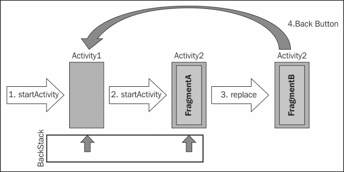
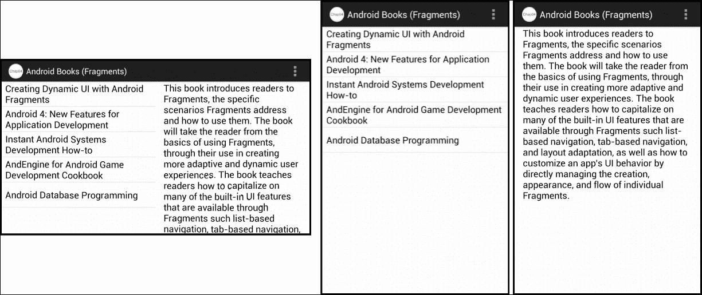

# 第四章：使用片段事务

本章介绍如何在活动中动态管理片段，实现返回按钮的行为，以及监控用户与返回按钮的交互。

让我们看看涵盖的主题：

+   理解`FragmentTransactions`

+   动态添加和移除片段

+   管理与活动关系独立的片段 UI

+   为`FragmentTransactions`添加返回按钮支持

到本章结束时，我们将能够创建使用片段来动态响应用户操作改变屏幕外观的交互式 UI。

# 有意进行屏幕管理

到目前为止，我们认为每个活动总是对应于我们应用程序中的一个单独屏幕。我们只使用片段来表示每个屏幕内的子部分。例如，回想一下我们构建书籍浏览应用程序的方式。在宽屏设备的情况下，我们的应用程序使用一个包含两个片段的单个活动。一个片段显示书籍标题列表，另一个片段显示当前选定书籍的描述。因为这两个片段同时出现在屏幕上，所以我们从单个活动中显示和管理它们。在竖屏手机的情况下，我们选择在单独的屏幕上显示书籍列表和书籍描述。因为这两个片段不会同时出现在屏幕上，所以我们分别在单独的活动中进行管理。

有趣的是，我们的应用程序在两种情况下执行的任务是相同的。唯一的区别是我们能够在屏幕上一次显示多少信息。这个细节让我们不得不在应用程序中添加一个额外的活动。我们还增加了应用程序的复杂性，因为启动新活动的代码比我们在同一活动中简单更新片段的代码要复杂得多。而且，我们的活动中有重复的代码，因为它们都与书籍描述片段交互。

如你所忆，当我们开始在第一章，*片段和 UI 模块化*中讨论片段时，我们提到片段的一个关键价值是它们有助于减少不必要的复杂性、活动的扩散和逻辑的重复。然而，按照目前编写的应用程序来看，我们正在经历所有这些问题。

我们需要进一步发展关于 UI 设计的思路。我们的应用程序中的活动不应只是对恰好适合设备物理显示的信息做出反应，而应该专注于有意管理应用程序中的屏幕与相应活动之间的关系。

对用户来说，进入新屏幕的体验仅仅意味着他们正在查看的视图布局被另一个不同的视图布局所替换。从历史上看，我们倾向于设计我们的应用程序，使得每个活动都有相对固定的布局。因此，将用户移动到新屏幕需要显示一个新活动，但片段为我们提供了另一种选择。

除了使用片段来管理屏幕的逻辑子部分，我们还可以使用它们来管理整个屏幕的逻辑分组。然后我们可以动态管理活动内的片段，以从一个片段更改为另一个片段。这给用户带来了从一个屏幕移动到下一个屏幕的体验，同时也为我们提供了在单个活动中管理通用用户界面元素的便利。

# 动态管理片段

动态管理片段的过程通常涉及多个步骤。这些步骤可能很简单，比如移除一个片段并添加另一个，或者可能更复杂，涉及移除和添加多个片段。在任何情况下，我们需要确保在活动中对片段的所有动态更改，这些更改构成了从应用程序的一个屏幕切换到下一个屏幕，作为一个工作单元一起发生。Android 通过使用`FragmentTransaction`类将步骤分组到事务中来实现这一点。

从概念上讲，`FragmentTransaction`类与其他事务模型的行为一致：开始事务，确定所需的更改，并在识别出该工作单元内的所有更改后提交事务。

当我们准备进行更改时，通过在活动的`FragmentManager`实例上调用`beginTransaction`方法来启动新的`FragmentTransaction`实例，该方法返回对`FragmentTransaction`实例的引用。然后我们使用新的`FragmentTransaction`实例来确定活动内显示的片段列表所需的更改。在我们处于事务中时，这些更改会被排队但尚未应用。最后，当我们确定了所有所需的更改后，我们调用`FragmentTransaction`类的`commit`方法。

一旦事务中的所有更改被应用，我们的应用程序显示就会更新以反映这些更改，给用户一种进入应用程序新屏幕的感觉。尽管在我们的应用程序中发生了许多步骤，但从用户的角度来看，一切就像我们显示了一个新的活动一样。

## 延迟执行事务变更

调用`commit`方法并不会立即应用更改。

当我们使用`FragmentTransaction`类时，我们并不是直接在应用程序用户界面上操作。相反，我们正在构建一个待办事项列表，以在将来对用户界面进行操作。我们在`FragmentTransaction`实例上调用的每个方法都会向列表中添加另一个待办事项。当我们完成待办事项的添加并调用`commit`方法时，这些指令会被打包并发送到主 UI 线程的消息队列中。UI 线程然后遍历这个列表，代表`FragmentTransaction`实例执行实际的用户界面工作。

在大多数情况下，`FragmentTransaction`实例内的工作延迟执行是有效的。然而，如果我们的应用程序代码需要立即在调用`commit`方法后找到一个片段或与由片段添加的视图进行交互，它可能会造成问题。尽管这样的需求通常不是必须的，但有时确实会出现。

如果我们有这样的需求，可以在调用`FragmentTransaction`实例的`commit`方法之后，通过调用`FragmentManager`类的`executePendingTransactions`方法，立即执行`FragmentTransaction`实例的工作。当调用`executePendingTransactions`方法返回时，我们知道所有提交的`FragmentTransaction`工作都已完成。

我们需要小心，只在主 UI 线程上调用`executePendingTransactions`方法；这个方法会导致挂起的前端工作被执行，从而触发与用户界面的直接交互。

## 添加和移除片段

`FragmentTransaction`类上有许多方法可用于操作活动内的片段，但最基本的是`add`和`remove`方法。

`add`方法允许我们将新创建的片段实例放置在活动的特定视图组中，如下所示：

```java
// Begin the transaction
FragmentManager fm = getFragmentManager();
FragmentTransaction ft = fm.beginTransaction();

// Create the Fragment and add
BookListFragment2 listFragment = new BookListFragment2();
ft.add(R.id.layoutRoot, listFragment, "bookList");

// Commit the changes
ft.commit();
```

我们首先使用活动的`FragmentManager`实例创建一个新的`FragmentTransaction`实例。然后创建`BookListFragment2`类的新实例，并将其作为`LinearLayout`视图组的子项附加到活动中，该视图组由`R.id.layoutRoot` ID 值标识。最后，我们提交`FragmentTransaction`实例，表示我们已经完成更改。

我们传递给`add`方法的第三个参数，字符串值`"bookList"`，仅仅是一个标签值。我们可以使用这个标签值，在之后定位片段实例，这与我们使用 id 值的方式类似。当动态添加片段时，我们使用标签作为标识符，而不是 id 值，因为无法将 id 值与动态添加的片段相关联。

当我们准备显示不同的片段时，标签值就派上用场了，因为我们需要有对现有片段的引用，以便传递给`remove`方法，这样我们可以在添加新片段之前移除它。以下代码展示了我们如何更新显示，用`BookDescFragment`类替换之前代码中添加的`BookListFragment2`类：

```java
FragmentManager fm = getFragmentManager();
Fragment listFragment = fm.findFragmentByTag("bookList");
BookDescFragment bookDescFragment = new BookDescFragment();
FragmentTransaction ft = fm.beginTransaction();
ft.remove(listFragment);
ft.add(R.id.layoutRoot, bookDescFragment, "bookDescription");
ft.commit();
```

我们首先使用标签值通过`FragmentManager`类的`findFragmentByTag`方法找到现有的`BookListFragment2`实例。然后我们创建我们想要添加的新片段的实例。现在我们有了要移除的片段和要添加的片段的引用，我们开始片段事务。在事务中，我们通过将引用传递给`FragmentTransaction`类的`remove`方法来移除`BookListFragment2`实例，然后使用`add`方法添加新片段，就像我们之前所做的那样。最后，我们调用`commit`方法以允许进行更改。

这种在特定视图组下移除片段实例并添加另一个来替代的过程经常发生，以至于`FragmentTransaction`类包含了一个名为`replace`的便捷方法。`replace`方法允许我们简单地标识我们想要添加的片段的信息。它处理了移除目标视图组中可能存在的任何其他片段的细节。使用`replace`方法，移除`BookListFragment2`实例并添加`BookDescFragment`实例的代码可以如下编写：

```java
FragmentManager fm = getFragmentManager();
bookDescFragment = new BookDescFragment();
FragmentTransaction ft = fm.beginTransaction();
ft.replace(R.id.layoutRoot, bookDescFragment, "bookDescription");
ft.commit();
```

请注意，这段代码除了方法名之外，与简单添加一个片段的情况完全相同。我们创建自己的片段实例，然后在`FragmentTransaction`调用中，`replace`方法传递目标视图组的 id、片段实例和标签。`replace`方法处理了移除当前可能在`R.id.layoutRoot`视图组中的任何片段的细节。然后它将`BookDescFragment`实例添加到视图组中。

## 支持后退按钮

当我们转向这种将应用屏幕作为片段来管理的模型时，我们需要确保我们为用户提供的是符合他们预期的体验。需要特别关注的一个区域是应用对后退按钮的处理。

当用户与设备上的应用进行交互时，他们会自然地通过不同的应用屏幕向前移动。正常的行为是用户可以通过点击后退按钮随时返回到上一个屏幕。这之所以有效，是因为每次应用显示新的活动时，Android 都会自动将这个活动添加到 Android 后退栈中。这就导致了用户每次点击后退按钮都会返回到上一个活动的预期行为。

这种行为基于一个假设：一个活动等于一个应用程序屏幕；这个假设已不再正确。当我们使用 `FragmentTransaction` 类将用户从一应用程序屏幕过渡到另一屏幕时，应用程序继续显示同一活动，而后退栈对我们的应用程序新屏幕一无所知。这导致应用程序在用户点击后退按钮时似乎会跳过多个屏幕，因为后退栈直接将用户返回到上一个活动，忽略了当前活动所做的任何中间更改。

下图演示了这个问题：



1.  应用程序最初调用 `startActivity` 方法以显示 `Activity1` 的实例。`Activity1` 会被自动添加到后退栈，并且当前位于栈顶。

1.  `Activity1` 通过调用 `startActivity` 方法来展示 `Activity2`，后者使用 `FragmentTransaction.add` 方法添加 `FragmentA`。`Activity2` 会被自动添加到后退栈的顶部。

1.  接下来，`Activity2` 使用 `FragmentTransaction.replace` 方法将 `FragmentB` 替换 `FragmentA` 进行展示。对用户来说，应用程序正在显示一个新屏幕，显示 `FragmentB` 的内容。问题是后退栈保持不变。

1.  当用户现在点击后退按钮时，他的预期是应用程序应该显示上一个屏幕 `FragmentA`，但相反，当 Android 弹出后退栈时，它遇到的下一个屏幕是 `Activity1`。

我们通过在显示 `FragmentB` 的 `FragmentTransaction` 实例中调用 `FragmentTransaction` 类的 `addToBackStack` 方法来解决此问题。`addToBackStack` 方法会将事务内的更改添加到后退栈的顶部。这使得用户可以使用后退按钮通过 `FragmentTransaction` 实例创建的应用程序屏幕，就像使用活动显示的屏幕一样。

我们可以在调用 `commit` 方法之前的事务过程中的任何时间点调用 `addToBackStack` 方法。`addToBackStack` 方法可选地接受一个字符串参数，可用于命名后退栈中的位置。如果你希望稍后以编程方式操作后退栈，这很有用，但在大多数情况下，此参数值可以传递为 null。我们很快就会看到 `addToBackStack` 方法的实际应用，因为我们将修改我们的应用程序以使用更自适应的布局。

# 创建自适应应用程序布局

让我们通过更新应用程序使其只使用一个活动来实践动态片段管理讨论。这个单一活动将处理两种场景：宽屏设备上两个片段并排显示，以及竖屏手机上片段显示为两个独立屏幕。提醒一下，在每种场景中，应用程序的外观如下面的屏幕截图所示：



在我们的应用程序中，我们将保留宽屏方面的程序不变，因为静态布局管理在那里工作得很好。我们的工作是在应用程序的竖屏手机方面。对于这些设备，我们将更新应用程序的主活动，以动态切换显示包含书籍列表的片段和显示选定书籍描述的片段。

## 更新布局以支持动态片段

在我们编写任何代码来动态管理应用程序中的片段之前，我们首先需要修改针对竖屏手机设备的活动布局资源。该资源包含在`activity_main.xml`布局资源文件中，目前如下所示：

```java
<LinearLayout

    android:orientation="vertical"
    android:layout_width="match_parent"
    android:layout_height="match_parent"
    >
  <!--    List of Book Titles  -->
  <fragment
      android:layout_width="match_parent"
      android:layout_height="0dp"
      android:layout_weight="1"
      android:name="com.jwhh.fragments.BookListFragment2"
      android:id="@+id/fragmentTitles"
      tools:layout="@layout/fragment_book_list"/>
</LinearLayout>
```

我们需要对布局资源进行两项更改。第一项是向`LinearLayout`视图组添加一个 id 属性，这样我们可以在代码中轻松找到它。另一个更改是完全移除`fragment`元素。更新后的布局资源现在只包含带有 id 属性值`@+id/layoutRoot`的`LinearLayout`视图组。布局资源现在如下所示：

```java
<LinearLayout

    android:id="@+id/layoutRoot"
    android:orientation="vertical"
    android:layout_width="match_parent"
    android:layout_height="match_parent"
    >
</LinearLayout>
```

我们仍然希望应用程序最初显示书籍列表片段，因此移除`fragment`元素可能看起来很奇怪，但这样做对于我们动态管理片段是必要的。最终，我们需要移除书籍列表片段以替换为书籍描述片段。如果我们留下书籍列表片段在布局资源中，我们之后尝试动态移除它会默默失败。

### 注意

只有动态添加的片段才能被动态移除。尝试动态移除使用布局资源中的`fragment`元素静态添加的片段将会默默失败。

## 适应设备差异

当我们的应用程序在竖屏手机设备上运行时，活动需要以编程方式加载包含书籍列表的片段。这是我们之前使用`activity_main.xml`布局资源文件中的`fragment`元素加载的同一`Fragment`类，`BookListFragment2`。在我们加载书籍列表片段之前，我们首先需要确定是否正在运行需要动态片段管理的设备上。记住，对于宽屏设备，我们将保留静态片段管理。

在我们的代码中有几个地方，根据我们使用的布局，我们需要采取不同的逻辑路径，因此我们需要在活动中添加一个`boolean`类级别字段，以便我们可以存储我们是使用动态还是静态片段管理。

```java
boolean mIsDynamic;
```

我们可以查询设备的特定特性，如屏幕大小和方向。但请记住，我们之前的大部分工作是为了配置我们的应用程序，利用 Android 资源系统根据设备特性自动加载适当的布局资源。与其在代码中重复这些特性检查，我们反而可以简单地包含确定已加载哪个布局资源的代码。我们之前为宽显示设备创建的布局资源`activity_main_wide.xml`静态加载了书籍列表片段和书籍描述片段。我们可以在活动的`onCreate`方法中包含以下代码，以确定已加载的布局资源是否包含这些片段之一：

```java
public class MainActivity extends Activity
    implements BookListFragment.OnSelectedBookChangeListener {

  protected void onCreate(Bundle savedInstanceState) {
    super.onCreate(savedInstanceState);
    setContentView(R.layout.activity_main_dynamic);

    // Get the book description fragment
    FragmentManager fm = getFragmentManager();
    Fragment bookDescFragment = 
        fm.findFragmentById(R.id.fragmentDescription);

    // If not found than we're doing dynamic mgmt
    mIsDynamic = bookDescFragment == null || 
        !bookDescFragment.isInLayout();
  }

  // Other members elided for clarity
}
```

当`setContentView`方法的调用返回时，我们知道当前设备已加载了适当的布局资源。然后我们使用`FragmentManager`实例查找包含在宽显示设备布局资源中但不在竖屏手机布局资源中的 id 值为`R.id.fragmentDescription`的片段。返回值为`null`表示片段未被加载，因此我们处于需要动态管理片段的设备上。除了对 null 的测试，我们还包含了对`isInLayout`方法的调用，以防止一种特殊情况的发生。

在设备从横屏布局旋转到竖屏的情况下，即使当前方向的活动没有使用片段，标识为`R.id.fragmentDescription`的片段的缓存实例可能仍然存在。通过调用`isInLayout`方法，我们可以确定返回的引用是否是当前加载布局的一部分。这样，我们设置`mIsDynamic`成员变量的测试有效地表明，当找不到（等于`null`）`R.id.fragmentDescription`片段或找到了但不是当前加载布局的一部分（`!bookDescFragment.isInLayout`）时，我们将`mIsDynamic`设置为 true。

## 动态加载启动时的片段

既然我们能够确定是否需要动态加载书籍列表片段，我们就可以将相应代码添加到我们的`onCreate`方法中，如下所示： 

```java
protected void onCreate(Bundle savedInstanceState) {
  super.onCreate(savedInstanceState);
  setContentView(R.layout.activity_main_dynamic);

  // Get the book description fragment
  FragmentManager fm = getFragmentManager();
  Fragment bookDescFragment = 
      fm.findFragmentById(R.id.fragmentDescription);

  // If not found than we're doing dynamic mgmt
  mIsDynamic = bookDescFragment == null || 
      !bookDescFragment.isInLayout();

  // Load the list fragment if necessary
  if (mIsDynamic) {
    // Begin transaction
    FragmentTransaction ft = fm.beginTransaction();

    // Create the Fragment and add
    BookListFragment2 listFragment = new BookListFragment2();
    ft.add(R.id.layoutRoot, listFragment, "bookList");

    // Commit the changes
    ft.commit();
  }
}
```

在检查是否处于需要动态管理片段的设备之后，我们包含`FragmentTransaction`，将`BookListFragment2`类的一个实例添加到由 id 值`R.id.layoutRoot`标识的`LinearLayout`视图组中的活动作为子项。这段代码利用了我们之前对`activity_main.xml`资源文件所做的更改，即移除了`fragment`元素并在`LinearLayout`视图组上包含了 id 值。

既然我们已经动态加载了书籍列表，我们就可以准备删除其他活动了。

## 在片段之间进行转换

如你所知，当用户在`BookListFragment2`类中选择书名时，片段通过传递所选书籍的索引来调用`onSelectedBookChanged`方法，通知主活动。当前的`onSelectedBookChanged`方法如下所示：

```java
public void onSelectedBookChanged(int bookIndex) {
  FragmentManager fm = getFragmentManager();
  // Get the book description fragment
  BookDescFragment bookDescFragment = (BookDescFragment)
      fm.findFragmentById(R.id.fragmentDescription);

  // Check validity of fragment reference
  if(bookDescFragment == null || !bookDescFragment.isVisible()){
    // Use activity to display description
    Intent intent = new Intent(this, BookDescActivity.class);
    intent.putExtra("bookIndex", bookIndex);
    startActivity(intent);
  }
  else {
    // Use contained fragment to display description
    bookDescFragment.setBook(bookIndex);
  }
}
```

在当前实现中，我们使用与在`onCreate`方法中确定加载哪个布局的类似技术；我们尝试在当前已加载的布局中查找书籍描述片段。如果我们找到了，我们就知道当前布局包括该片段，因此可以直接在片段上设置书籍描述。如果我们没有找到，我们就调用`startActivity`方法来显示包含书籍描述片段的活动。

在此场景中，将操作转交给另一个活动并不算太糟糕，因为我们只传递了一个简单的整数值给另一个活动。然而实际上，需要将数据传递给另一个活动的需求可能会变得复杂。特别是如果有一大堆值，或者其中一些值是对象类型，没有额外的编码就不能直接在`Intent`实例中传递。既然我们已经有了在当前活动中与片段交互所需的所有处理，我们更愿意在所有情况下都一致地处理它。

### 消除冗余处理

为了开始，我们可以删除当前实现中处理启动活动的任何代码。我们还可以避免重复检查书籍描述片段，因为我们在`onCreate`方法中已经执行了该检查。相反，我们现在可以检查`mIsDynamic`类级字段以确定适当的处理。考虑到这一点，我们可以最初修改`onSelectedBookChanged`方法，使其现在看起来如下代码所示：

```java
public void onSelectedBookChanged(int bookIndex) {
  BookDescFragment bookDescFragment;
  FragmentManager fm = getFragmentManager();

  // Check validity of fragment reference
  if(mIsDynamic)
    // Handle dynamic switch to description fragment
  else {
    // Use the already visible description fragment
    bookDescFragment = (BookDescFragment)
        fm.findFragmentById(R.id.fragmentDescription);
    bookDescFragment.setBook(bookIndex);
  }
}
```

我们现在检查`mIsDynamic`成员字段以确定适当的代码路径。如果它为真，我们还有一些工作要做，但如果为假，我们可以简单地获取对当前布局中包含的书籍描述片段的引用，并在其上设置书籍索引，就像我们之前所做的那样。

### 动态创建片段

在`mIsDynamic`字段为真时，我们可以通过简单地用书籍描述片段替换我们在`onCreate`方法中添加的书籍列表片段来显示书籍描述片段，代码如下所示：

```java
FragmentTransaction ft = fm.beginTransaction();
bookDescFragment = new BookDescFragment();
ft.replace(R.id.layoutRoot, bookDescFragment, "bookDescription");
ft.addToBackStack(null);
ft.setCustomAnimations(
    android.R.animator.fade_in, android.R.animator.fade_out);
ft.commit();
```

在`FragmentTransaction`中，我们创建了一个`BookDescFragment`类的实例，并调用了`replace`方法，传递了包含我们在`onCreate`方法中添加的`BookListFragment2`实例的同一视图组的 id。我们包含了对`addToBackStack`方法的调用，以便后退按钮可以正确工作，允许用户点击后退按钮返回到书籍列表。

### 注意

代码中包含了对`FragmentTransaction`类的`setCustomAnimations`方法的调用，该方法在用户从一个片段切换到另一个片段时创建了一个淡入淡出效果。

### 管理异步创建

我们还有一个最后的挑战，即设置动态添加的书籍描述片段上的书籍索引。我们最初的想法可能是在创建`BookDescFragment`实例后简单地调用`BookDescFragment`类的`setBook`方法，但首先让我们看一下下面出现的当前`setBook`方法的实现：

```java
public void setBook(int bookIndex) {
  // Lookup the book description
  String bookDescription = mBookDescriptions[bookIndex]; 

  // Display it
  mBookDescriptionTextView.setText(bookDescription);
}
```

方法中的最后一行试图在片段内设置`mBookDescriptionTextView`的值，这是一个问题。记住，我们在`FragmentTransaction`类中所做的工作并不会立即应用到用户界面，而是要在我们调用`commit`方法之后才会执行。因此，`BookDescFragment`实例的`onCreate`和`onCreateView`方法尚未被调用。所以，与`BookDescFragment`实例关联的任何视图都尚未创建。尝试在`mBookDescriptionTextView`实例上调用`setText`方法将导致空引用异常。

一种可能的解决方案是将`setBook`方法修改为能够识别片段的当前状态。在这种情况下，`setBook`方法将检查`BookDescFragment`实例是否已完全创建。如果没有，它将在类级别字段中存储书籍索引值，并在创建过程中稍后自动设置`mBookDescriptionTextView`的值。尽管可能有一些情况需要这种复杂的解决方案，但片段为我们提供了更简单的选择。

`Fragment`基类中包含一个名为`setArguments`的方法。通过`setArguments`方法，我们可以将数据值（也称为参数）附加到片段上，稍后可以在片段的生命周期中使用`getArguments`方法访问这些值。类似于我们将额外数据与`Intent`实例关联时，一个好的实践是在目标类上定义常量来命名参数值。对于非空类型（如整数）的参数默认值，提供常量也是一个好的编程实践，如下所示：

```java
public class BookDescFragment extends Fragment {
  // Book index argument name
  public static final String BOOK_INDEX = "book index";
  // Book index default value
  private static final int BOOK_INDEX_NOT_SET = -1;

  // Other members elided for clarity
}
```

我们将使用`BOOK_INDEX`常量来获取和设置书籍索引值，以及使用`BOOK_INDEX_NOT_SET`常量来指示是否已设置书籍索引参数。

我们现在可以更新`BookDescFragment`类的`onCreateView`方法，以查找可能附加到片段的参数。在我们对`onCreateView`方法进行任何更改之前，先来看看当前的实现方式：

```java
public View onCreateView(LayoutInflater inflater, 
    ViewGroup container, Bundle savedInstanceState) {
  View viewHierarchy = inflater.inflate(
      R.layout.fragment_book_desc, container, false);

  // Load array of book descriptions
  mBookDescriptions = 
      getResources().getStringArray(R.array.bookDescriptions);
  // Get reference to book description text view
  mBookDescriptionTextView = (TextView) 
      viewHierarchy.findViewById(R.id.bookDescription);

  return viewHierarchy;
}
```

由于`onCreateView`方法当前的实现，它只是简单地充气布局资源，加载包含书籍描述的数组，并缓存对加载书籍描述的`TextView`实例的引用。

我们现在可以更新该方法，以查找并使用可能作为参数附加的书籍索引。更新后的方法如下所示：

```java
public View onCreateView(LayoutInflater inflater, 
    ViewGroup container, Bundle savedInstanceState) {
  View viewHierarchy = inflater.inflate(
      R.layout.fragment_book_desc, container, false);

  // Load array of book descriptions
  mBookDescriptions = 
      getResources().getStringArray(R.array.bookDescriptions);
  // Get reference to book description text view
  mBookDescriptionTextView = (TextView) 
      viewHierarchy.findViewById(R.id.bookDescription);

  // Retrieve the book index if attached
  Bundle args = getArguments();
  int bookIndex = args != null ? 
      args.getInt(BOOK_INDEX, BOOK_INDEX_NOT_SET) : 
      BOOK_INDEX_NOT_SET;

  // If we find the book index, use it
  if (bookIndex != BOOK_INDEX_NOT_SET) 
    setBook(bookIndex);

  return viewHierarchy;
}
```

在我们返回片段的视图层次结构之前，我们调用`getArguments`方法以检索可能附加的任何参数。参数作为`Bundle`类的一个实例返回。如果`Bundle`实例非空，我们调用`Bundle`类的`getInt`方法来检索书籍索引并将其分配给`bookIndex`局部变量。`getInt`方法的第二个参数`BOOK_INDEX_NOT_SET`将在片段恰好有附加的参数但不包括书籍索引时返回。虽然这通常不应该发生，但为任何此类意外情况做好准备是个好主意。最后，我们检查`bookIndex`变量的值。如果它包含一个书籍索引，我们调用片段的`setBook`方法来显示它。

### 将其全部放在一起

随着`BookDescFragment`类现在包括支持将书籍索引作为参数附加，我们现在准备完全实现主活动的`onSelectedBookChanged`方法，以包括切换到`BookDescFragment`实例并将书籍索引作为参数附加。现在的方法如下所示：

```java
public void onSelectedBookChanged(int bookIndex) {
  BookDescFragment bookDescFragment;
  FragmentManager fm = getFragmentManager();

  // Check validity of fragment reference
  if(mIsDynamic){
    // Handle dynamic switch to description fragment
    FragmentTransaction ft = fm.beginTransaction();

    // Create the fragment and attach book index
    bookDescFragment = new BookDescFragment();
    Bundle args = new Bundle();
    args.putInt(BookDescFragment.BOOK_INDEX, bookIndex);
    bookDescFragment.setArguments(args);

    // Replace the book list with the description
    ft.replace(R.id.layoutRoot, 
        bookDescFragment, "bookDescription");
    ft.addToBackStack(null);
    ft.setCustomAnimations(
        android.R.animator.fade_in, android.R.animator.fade_out);
    ft.commit();
  }
  else {
    // Use the already visible description fragment
    bookDescFragment = (BookDescFragment)
        fm.findFragmentById(R.id.fragmentDescription);
    bookDescFragment.setBook(bookIndex);
  }
}
```

与之前一样，我们从检查是否进行动态片段管理开始。一旦确定我们在进行，就开始`FragmentTransaction`实例并创建`BookDescFragment`实例。然后我们创建一个新的`Bundle`实例，将书籍索引存储到其中，并使用`setArguments`方法将其附加到`BookDescFragment`实例。最后，我们将`BookDescFragment`实例作为当前片段放置到位，处理回退栈，启用动画，并完成交易。

现在一切就绪。当用户从列表中选择书名时，将调用`onSelectedBookChanged`方法。`onSelectedBookChanged`方法然后创建并显示带有适当书籍索引作为参数的`BookDescFragment`实例。当最终创建`BookDescFragment`实例时，其`onCreateView`方法将然后从参数中检索书籍索引并显示适当的描述。

# 概述

有意识地管理屏幕，使我们摆脱了将每个应用屏幕绑定到单个活动的负担。使用`FragmentTransaction`类，我们能够在活动内动态地在各个片段之间切换，无需为应用中的每个屏幕创建单独的活动类。这有助于防止不必要活动类的增多，更好地组织我们的应用程序，并避免由此产生的复杂性增加。

我们将在下一章看到，这种在一个活动中动态管理多个屏幕的能力，为我们的 Android 应用程序在界面外观和导航行为上提供了更大的灵活性和丰富性。
