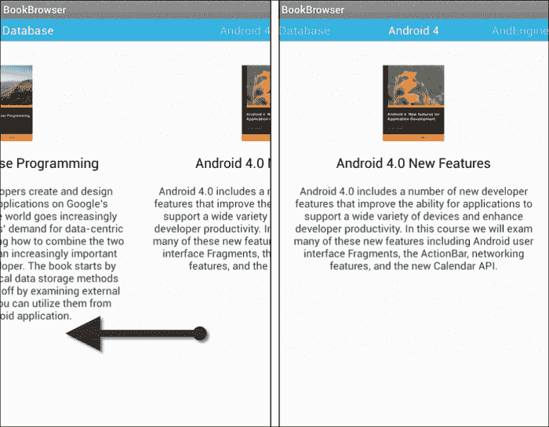
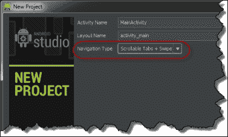
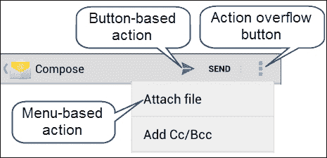
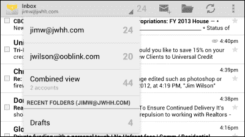

# 第五章：使用片段创建丰富的导航

本章展示了片段在创建丰富的用户界面导航体验中的作用。

本章节将涵盖以下主题：

+   滑动导航

+   安卓操作栏的角色

+   操作栏与片段之间紧密的关系

+   将菜单与片段关联

+   列表导航

+   标签导航

在本章结束时，我们将能够实现利用片段提供丰富用户导航的解决方案，包括滑动导航、标签导航和下拉列表导航。

# 一个勇敢的新世界

正如我们所见，片段为我们提供了紧密控制和管理工作应用程序用户界面的能力。通过使用`FragmentTransaction`类，我们可以让用户通过简单地切换不同的片段，体验到从一个屏幕移动到另一个屏幕的感觉。这让我们进入了一个全新的思考方式：一个勇敢的应用设计新世界。

当我们以这种方式创建用户界面时，活动充当了一种屏幕管理器的角色，而片段实现了屏幕本身。这种将应用程序的各个屏幕作为活动内的片段进行管理的方法非常强大，它已经成为 Android 平台一些最引人注目的导航功能的基础。

安卓提供了与这种设计模式合作的类，使我们能够以简单的方式创建丰富的导航和屏幕管理体验。这些类提供了各种功能，包括过渡效果以及一些熟悉用户界面隐喻。

# 通过滑动使导航变得有趣

许多应用程序包含用户可能想要浏览或翻阅的多个数据屏幕，以查看每个屏幕。例如，考虑一个列出书籍目录的应用程序，目录中的每本书出现在一个单独的屏幕上。书籍的屏幕包含图像、标题和描述，如下面的截图所示：


为了查看每本书的信息，用户需要移动到每个屏幕。我们可以在屏幕上放置一个下一个按钮和一个上一个按钮，但更自然的操作是用户使用他们的拇指或手指从显示的一侧滑动到另一侧，下一个包含书籍信息的屏幕就会像下面的截图所示那样滑入视野：



这创造了一个非常自然的导航体验，老实说，这比使用按钮更是一种有趣的浏览应用程序的方式。

## 实现滑动导航

实现滑动导航非常简单，碎片是其核心。每个屏幕都作为碎片派生类实现。每个屏幕可以是完全不同的碎片派生类，或者屏幕可以是具有不同数据的相同碎片派生类的实例。为了创建如前所示截图中的书籍浏览器应用，我们可以使用一个简单的碎片派生类，设置书籍图片、标题和描述。

关于碎片派生类（fragment derived class）有一点比较特别。在撰写本文时，管理滑动导航的类相对较新，仅在`android.support.v4.app`包中可用。因此，即使我们的应用目标是本地支持碎片的 Android 版本，我们创建的碎片派生类也必须继承自支持包版本的`Fragment`类，即`android.support.v4.app.Fragment`。碎片类的定义将类似于以下代码：

```java
import android.support.v4.app.Fragment;
public class BookFragment extends Fragment {
  // members elided for clarity
}
```

### 管理滑动碎片

展现代表应用屏幕的各个碎片需要一个适配器来管理每个碎片的创建和传递。Android 支持库包括两个提供此功能的类：`FragmentPagerAdapter`和`FragmentStatePagerAdapter`。

`FragmentPagerAdapter`类适用于只有少量碎片（fragments）的场景。一旦创建了给定碎片实例，它会被直接存储在`FragmentManager`类中，并且每次显示该碎片的页面时都会重新使用这个实例。当用户切换到另一个不同碎片时，会调用碎片的`onDestroyView`方法，但不会调用`onDestroy`方法。重要的是，我们只在碎片数量相对较少的情况下使用`FragmentPagerAdapter`类，因为我们应该假定一旦创建了碎片，只要`FragmentPagerAdapter`类存在，它就会一直存在。

`FragmentStatePagerAdapter`类适用于有大量碎片的情况，因为当碎片不再可见时，它们可能会被销毁。由`FragmentStatePagerAdapter`管理的碎片将始终调用其`onDestroyView`方法，并且也可能调用其`onDestroy`方法。调用`onDestroy`方法不一定会立即在用户滑动到另一个碎片时发生，它可能会根据设备可用资源的情况在稍后发生。`FragmentStatePagerAdapter`类让碎片有机会通过平台调用`onSaveInstanceState`方法来保存其状态。

`FragmentStatePagerAdapter`类能够丢弃和重新创建包含的片段，这使得它也适用于显示的片段列表可能发生变化的情况。实现可更新的`FragmentStatePagerAdapter`实例的细节超出了本书的范围，但可以在[`bit.ly/UpdateFragmentStatePagerAdapter`](http://bit.ly/UpdateFragmentStatePagerAdapter)找到一个示例。

要创建如前截图所示的书籍浏览器应用，我们将扩展`FragmentPagerAdapter`类，因为我们只会显示几本书。我们将我们的类命名为`BookPagerAdapter`，其声明如下面的代码所示：

```java
public class BookPagerAdapter extends FragmentPagerAdapter {
  // members elided for clarity
}
```

要实现我们的`BookPagerAdapter`类，我们只需要覆盖几个方法。主要的方法`getItem`负责返回每个片段实例。我们的`getItem`方法如下所示：

```java
public Fragment getItem(int idx) {

  // Store the argument values for this fragment
  Bundle arguments = new Bundle();
  arguments.putString(
      BookFragment.BOOK_TITLE, mCourseTitles[idx]);
  arguments.putString(
      BookFragment.BOOK_DESCRIPTIONS, mCourseDescriptions[idx]);
  arguments.putInt(
      BookFragment.TOP_IMAGE, mTopImageResourceIds[idx]);

  // Create the fragment instance and pass the arguments
  BookFragment bookFragment = new BookFragment();
  bookFragment.setArguments(arguments);

  // return the fragment instance
  return bookFragment;
}
```

当应用首次显示特定书籍的页面时，会调用`getItem`方法，并以名为`idx`的参数传递页面索引。在创建片段之前，我们从包含这些值的数组中检索书籍标题、描述和图像资源 ID，并将它们存储在`Bundle`实例中。然后，我们创建`BookFragment`类的实例，并将其与参数`Bundle`实例关联。最后，我们返回`BookFragment`的引用。当我们的`BookFragment`实例被显示时，它将访问参数`Bundle`实例中的值并将其显示出来。

我们现在必须覆盖另外两个方法：`getPageTitle`和`getCount`。`getPageTitle`方法返回在每片段上方的细条中可见的字符串。与`getItem`方法一样，`getPageTitle`方法接收正在显示的页面的索引。`getPageTitle`方法仅从包含页面标题简短版本的数组中返回一个值，如下面的代码所示：

```java
  public CharSequence getPageTitle(int idx) {
    return mCourseTitlesShort[idx];
  }
```

`getCount`方法负责返回我们将要显示的屏幕数量。我们可以简单地返回在`getPageTitle`方法中使用的数组的长度，如下面的代码所示：

```java
public int getCount() {
  return mCourseTitlesShort.length;
}
```

实现我们的`BookPagerAdapter`类处理了管理我们片段的代码。现在，我们只需要在我们的活动中放置适当的布局，并将其与适配器连接起来。

### 实现滑动用户界面

滑动用户界面行为和效果来自两个 Android 类：`ViewPager`和`PagerTitleStrip`。`ViewPager`类是主要的类。它管理用户交互，提供滑动动画效果，并与提供每个屏幕片段的适配器类合作。`PagerTitleStrip`类处理在每个片段上方的细标题栏的显示。从我们的`BookPagerAdapter`类的`getPageTitle`方法返回的字符串值显示在`PagerTitleStrip`实例中。

我们将为应用程序的活动创建一个名为`activity_main.xml`的布局资源文件，其中包含`ViewPager`和`PagerTitleStrip`类，如下面的 XML 布局所示：

```java
<android.support.v4.view.ViewPager

    android:id="@+id/pager"
    android:layout_width="match_parent"
    android:layout_height="match_parent">

  <android.support.v4.view.PagerTitleStrip
      android:id="@+id/pager_title_strip"
      android:layout_width="match_parent"
      android:layout_height="wrap_content"
      android:layout_gravity="top"
      android:background="#33b5e5"
      android:paddingBottom="4dp"
      android:paddingTop="4dp"
      android:textColor="#fff"/>

</android.support.v4.view.ViewPager>
```

我们的布局资源文件以`ViewPager`作为根节点，并设置为占据整个活动。`ViewPager`类的 ID 值为`pager`。`PagerTitleStrip`类被设置为填充`ViewPager`的整个宽度，并位于顶部。另外，我们也可以将`layout_gravity`属性设置为`bottom`，以将`PagerTitleStrip`定位在`ViewPager`类显示区域的底部。尽管技术上`layout_gravity`属性的其他值是有效的，但它们往往会出现问题。通常，我们希望将`layout_gravity`属性的选择限制为`top`或`bottom`。

我们已经完成了布局设计，并已经创建了管理应用内片段的适配器。现在我们准备声明我们的活动类，我们将其命名为`MainActivity`。类的声明如下所示：

```java
import android.support.v4.app.FragmentActivity;
import android.support.v4.view.ViewPager;

public class MainActivity extends FragmentActivity {
  BookPagerAdapter mBookPagerAdapter;
  ViewPager mViewPager;

  // other members elided for clarity
}
```

请注意，我们从支持库类`FragmentActvity`继承，而不是常规的`Activity`类。这是我们声明`BookFragment`类时讨论的同样问题。提供滑动行为的类在支持库中；因此，它们期望所有与片段相关的类都来自该库。我们的活动类包括`BookPagerAdapter`和`ViewPager`类的成员变量。

我们需要做的最后一件事是将我们的`BookPagerAdapter`类连接到`ViewPager`类。我们将在`onCreate`方法中这样做，如下所示：

```java
protected void onCreate(Bundle savedInstanceState) {
  super.onCreate(savedInstanceState);
  setContentView(R.layout.activity_main);

  mBookPagerAdapter = new BookPagerAdapter(
      getSupportFragmentManager(), this);

  mViewPager = (ViewPager) findViewById(R.id.pager);
  mViewPager.setAdapter(mBookPagerAdapter);
}
```

如我们所见，这里的工作相当简单。我们调用`setContentView`方法，并传入我们刚刚创建的`R.layout.activity_main`资源。当`setContentView`方法返回后，我们创建`BookPagerAdapter`实例，传入活动的`FragmentManager`实例和活动的`this`指针，以便我们的`BookPagerAdapter`可以使用它作为上下文。创建`BookPagerAdapter`后，我们使用活动类的`findViewById`方法获取我们用布局资源文件创建的`ViewPager`类的引用。最后，我们调用`ViewPager`实例的`setAdapter`方法，将`BookPagerAdapter`实例连接到我们的`ViewPager`实例。

现在我们已经准备好了一切。我们的书籍浏览器已经可以使用滑动导航让用户浏览我们的书籍列表。

### Android Studio 和滑动导航

如果我们使用 Android Studio，那么开始构建带有滑动导航的应用程序是很容易的。在**新建项目**向导中，在设置活动和布局名称的对话框里，选择**可滚动标签 + 滑动**作为**导航类型**，如下面的截图所示：



生成的项目将包括一个布局资源文件，其中包含 `ViewPager` 和 `PagerTitleStrip`，以及 `FragmentPagerAdapter`、`Fragment` 和 `Activity` 派生类的存根代码。

# 使用 ActionBar 改进导航

从 API 级别 11（Android 3.0）开始，Android 从使用传统的菜单转而使用 ActionBar。ActionBar 提供的操作项是直接出现在 ActionBar 上的基于按钮的操作和当用户点击操作溢出按钮时出现在下拉列表中的基于菜单的操作的组合。以下屏幕截图显示了可用的 ActionBar 操作：



许多开发者没有意识到，基于按钮和菜单的操作只是 ActionBar 实际功能的冰山一角。现在，ActionBar 已成为许多与导航相关行为的核心点。其中两种行为直接与片段相关：标签导航和下拉导航。

### 注意事项

若要在针对 API 级别低于 11 的 Android 版本的应用程序中包含 ActionBar，请使用 Android 支持库中提供的 `ActionBarCompat` 类。有关 `ActionBarCompat` 类的更多信息，请访问 [`bit.ly/ActionBarCompat`](http://bit.ly/ActionBarCompat)。

## 通过标签随机导航

标签是一种有效的导航模型。它们被用户广泛理解，并使应用程序内屏幕之间的移动变得简单。与需要用户按顺序通过屏幕的滑动导航不同，标签导航允许用户按照自己喜欢的任何顺序从一个屏幕移动到另一个屏幕。自 Android 平台最初发布以来，就支持标签导航。历史上，实现标签导航的挑战在于它与其他导航模型无关，需要使用特殊的活动类和其他特定于标签的类。现在有了 ActionBar，这一切都改变了。现在，标签导航只是通用片段编程模型的另一种用途。

ActionBar 允许我们将一个片段派生类的实例与每个标签关联。以下屏幕截图显示了两个不同设备屏幕顶部的部分，ActionBar 显示了标签：


请注意，ActionBar 会根据可用的屏幕空间自动调整标签的显示方式。在较窄的设备上，ActionBar 将标签放置在 ActionBar 的主体下方，而在具有更多水平屏幕空间的较宽设备上，标签直接出现在 ActionBar 的主体上。

### 管理标签选择

当涉及到实现标签导航时，ActionBar 处理所有繁重的工作。它绘制标签，指示当前选定的标签，甚至负责开始并提交片段事务。所有我们需要做的就是根据当前选定的标签处理哪个片段可见。为此，我们为每个标签提供了一个`ActionBar.TabListener`接口的实现。以下代码展示了实现该接口的类的声明：

```java
public class SimpleTabListener implements ActionBar.TabListener {
  boolean mFirstSelect = true;
  Fragment mFragment;

  public SimpleTabListener(Fragment fragment) {
    mFragment = fragment;
  }

  // Other members elided for clarity
}
```

我们的`TabListener`实现有两个成员变量。布尔成员变量`mFirstSelect`用于控制第一次由我们的`SimpleTabListener`类管理的片段被选定时的特殊处理。另一个成员变量`mFragment`保存了由`TabListener`实例管理的片段的引用，在`SimpleTabListener`构造函数中设置。

我们将实现的首个`TabListener`接口方法是`onTabSelected`方法。顾名思义，每次与此`TabListener`实例关联的标签被选定时，都会调用`onTabSelected`方法。如下代码所示实现了`onTabSelected`方法：

```java
public void onTabSelected(
    ActionBar.Tab tab, FragmentTransaction fragmentTransaction) {
  if (mFirstSelect) {
    fragmentTransaction.add(android.R.id.content, mFragment);
    mFirstSelect = false;
  }
  else
    fragmentTransaction.attach(mFragment);
}
```

`onTabSelected`方法接收两个参数。第一个参数是与我们的`TabListener`实现相关联的标签实例的引用。第二个参数是由 ActionBar 管理的`FragmentTransaction`实例。ActionBar 开始这个事务，并在`onTabSelected`返回后提交事务。

当`onTabSelected`方法首次被调用时，我们使用传递进来的`FragmentTransaction`实例，通过`add`方法将我们的片段添加到显示中。正如在前一章中讨论的，`add`方法的第一参数是我们希望放置片段的视图组 ID。就像我们自己管理`FragmentsTransaction`时一样，这可以是活动布局中的任何有效视图组。在之前的代码中，我们使用的是 Android 预定义的特殊 ID 值，`android.R.id.content`。`android.R.id.content` ID 值表示我们希望片段占据活动的整个内容区域，而不是放在活动内的特定视图组中。

我们只在标签首次选定时使用`add`方法；之后每次，我们都使用`FragmentTransaction`类的`attach`方法。我们稍后会进一步讨论这个问题。

我们将实现的下一个`TabListener`接口方法是`onTabUnselected`方法，如下代码所示：

```java
public void onTabUnselected(
    ActionBar.Tab tab, FragmentTransaction fragmentTransaction) {
  fragmentTransaction.detach(mFragment);
}
```

`onTabUnselected`方法接收与`onTabSelected`方法相同的参数。我们这个方法的实现很简单，只有一行代码，我们调用了`FragmentTransaction`类的`detach`方法。

`onTabUnselected`方法中的`detach`方法调用与`onTabSelected`方法中的`attach`方法调用协同工作。一旦碎片最初被添加到活动中，就像第一次显示碎片时在`onTabSelected`方法中所做的那样，我们可以随后调用`detach`方法来拆除碎片视图层次结构，但让碎片与活动关联。当我们再次在`onTabSelected`方法中调用`attach`方法时，下次用户选择该碎片的标签时，将在活动中原始添加碎片的位置重新构建碎片的视图层次结构。

这种调用`detach`和`attach`方法的技术使我们能够更有效地管理碎片。当我们调用`detach`方法时，会调用碎片的`onDestroyView`方法，但不会调用`onDestroy`方法。稍后当我们调用`attach`方法时，会调用碎片的`onCreateView`方法，但不会调用`onCreate`方法，因为不需要完全重新创建碎片，只需重新创建其视图层次结构即可。

我们需要注意一些可能导致混淆的方法名称。当碎片实例传递给`FragmentTransaction`类的`detach`方法时，并不会调用`Fragment`类的`onDetach`方法。这是因为`detach`方法拆除了碎片的视图层次结构，但让碎片与活动关联；碎片仍然处于附着状态。同样，当碎片实例传递给`FragmentTransaction`类的`attach`方法时，不会调用`Fragment`类的`onAttach`方法，因为碎片已经与活动关联。这确实有些令人困惑，但最终这归咎于 API 设计者选择了糟糕的方法名称，而不是技术上的不一致性。

`TabListener`接口的最后一个方法`onTabReselected`，在用户点击已经选中的标签的场景下被调用；换句话说，就是用户重新选择了同一个标签。在大多数情况下，这个方法可以留空，如下面的代码所示：

```java
public void onTabReselected(
  ActionBar.Tab tab, FragmentTransaction fragmentTransaction) { }
```

### 将碎片连接到标签

由于我们已经有了`TabListener`的实现，现在可以将碎片连接到标签。我们将在活动的`onCreate`方法中这样做，具体代码如下所示：

```java
protected void onCreate(Bundle savedInstanceState) {
  super.onCreate(savedInstanceState);

  // Put ActionBar in Tab mode
  ActionBar actionBar = getActionBar();
  actionBar.setNavigationMode(ActionBar.NAVIGATION_MODE_TABS);

  // Create the first tab
  Fragment firstFragment = new FirstFragment();
  ActionBar.TabListener firstListener =
      new SimpleTabListener(firstFragment);
  ActionBar.Tab firstTab = actionBar.newTab()
      .setText("First")
      .setTabListener(firstListener);
  actionBar.addTab(firstTab);

  // Create the second tab
  Fragment secondFragment = new SecondFragment();
  ActionBar.TabListener secondListener =
      new SimpleTabListener(secondFragment);
  ActionBar.Tab secondTab = actionBar.newTab()
      .setText("Second")
      .setTabListener(secondListener);
  actionBar.addTab(secondTab);
}
```

在我们的`onCreate`实现中，首先获取对 ActionBar 的引用，并将 ActionBar 设置为标签导航模式。这一步是必不可少的；如果没有这一步，我们添加的标签将永远不会显示。

对于第一个标签，我们创建将作为标签主体的片段。这可以是几乎任何从片段派生的类。然后我们将`TabListener`实现与片段关联。在片段和`TabListener`实现就位后，我们通过调用`newTab`方法创建一个新的`ActionBar.Tab`实例，然后设置将在标签中显示的文本，并将我们的`TabListener`实例与标签关联。最后，我们使用`addTab`方法将`ActionBar.Tab`实例添加到 ActionBar 中。然后我们对第二个标签重复这些步骤。

这样，我们的应用程序现在实现了标签导航。使用这种技术，我们能够利用片段的所有功能，并以与其他使用片段的方式一致的方式实现基于标签的导航。

我们`onCreate`方法实现中可能看起来不太寻常的一点是缺少了对`setContentView`方法的调用。在这种情况下，我们不需要将布局资源与活动关联，因为当我们在`onTabSelected`实现中调用`add`方法时，使用了特殊用途的`android.R.id.content`资源 ID。正如我们之前提到的，资源 ID `android.R.id.content`表示片段占据了整个内容区域。如果我们希望标签控制某个视图组内片段的显示，我们会用包含所需布局的资源调用`setContentView`。然后，我们会在调用`add`方法时使用该布局中视图组的 ID。

## 通过下拉列表导航提供直接访问

当应用只有少数可预测的屏幕时，标签导航工作得很好，但如果屏幕数量很多，它会很快变得杂乱。对于那些屏幕数量很多的应用，或者可能屏幕数量随时间变化的情况，下拉列表导航提供了一个比标签更好的解决方案。下拉列表导航在 ActionBar 上放置一个包含可用屏幕名称列表的下拉列表。当用户从列表中选择一个屏幕名称时，应用会立即显示相应的屏幕。

在 Android 上，这种导航模型最熟悉的用途可能是 Android 电子邮件应用，如下面的截图所示：



在 Android 电子邮件应用中，不同的电子邮件文件夹屏幕列表显示在下拉列表中。点击 ActionBar 会显示列表，然后从列表中选择屏幕名称会立即显示该屏幕。

在我们的应用中整合下拉列表导航非常简单。

### 管理片段选择

与标签导航不同，在 ActionBar 在管理从一个片段到另一个片段的过渡中扮演非常活跃的角色，而在下拉列表导航中，ActionBar 采取了更为放手的方法。基本上，ActionBar 只是通知应用选择已更改，而将切换片段的细节留给应用处理。为了处理这个通知，我们需要提供一个`ActionBar.OnNavigationListener`接口的实现。实现声明如下面的代码所示：

```java
public class SimpleNavigationListener
    implements ActionBar.OnNavigationListener {
  FragmentManager mFragmentManager;

  public SimpleNavigationListener(FragmentManager fm) {
    mFragmentManager = fm;
  }

  // Other members elided for clarity
}
```

我们的`ActionBar.OnNavigationListener`实现有一个成员变量`mFragmentManager`，用于保存对 activity 的`FragmentManager`实例的引用。`FragmentManager`引用在构造函数中传递给我们的类。

与标签导航中每个标签实例都由一个单独的`TabListener`实例管理不同，在下拉列表导航中，一个单独的`OnNavigationListener`实现处理所有选择。每次选择更改时都会调用`OnNavigationListener`接口的唯一方法`onNavigationItemSelected`，并负责处理显示适当的片段，如下面的实现所示：

```java
public boolean onNavigationItemSelected(
    int itemPosition, long itemId) {
  Fragment fragment = null;

  // Create an instance of the appropriate Fragment
  switch (itemPosition) {
    case 0:
      fragment = new FirstFragment();
      break;
    case 1:
      fragment = new SecondFragment();
      break;
    case 2:
      fragment = new ThirdFragment();
      break;
  }

  // Replace the currently visible fragment with the new one
  if (fragment != null) {
    FragmentTransaction ft = mFragmentManager.beginTransaction();
    ft.replace(android.R.id.content, fragment);
    ft.commit();
  }

  return true;
}
```

我们接收基于零的选中项索引作为第一个参数`itemPosition`。我们将从一个简单的`String`数组中填充屏幕名称列表，所以第二个参数`itemId`对我们没有价值。如果我们使用更结构化的数据源，`itemId`参数将包含选中项的 ID。

使用`switch`语句，我们创建适当的片段派生类的实例。一旦我们有了片段实例，我们就会用刚刚创建的片段替换当前可见的片段。我们再次使用布局资源 ID `android.R.id.content`，表示片段占据了 activity 整个内容区域。如果我们愿意，也可以使用 activity 布局中视图组的 ID 值，就像标签导航一样。

请注意，在我们的代码中，我们显式地创建并提交了`FragmentTransaction`实例。这是与标签导航管理方式的另一个重要区别；我们需要负责所有细节。检查局部变量`fragment`不为 null 只是一个健全性检查。只要我们为用户显示的选择不超过三个值，`fragment`变量就永远不会为 null。

返回`true`的方法值仅表示我们已经处理了该事件。

### 提供导航选择

我们现在需要向 ActionBar 提供显示导航选择列表所需的信息。我们是在 activity 的`onCreate`方法中完成这一操作，如下面的代码所示：

```java
protected void onCreate(Bundle savedInstanceState) {
  super.onCreate(savedInstanceState);

  // Put the ActionBar in the right mode and clear any clutter
  ActionBar actionBar = getActionBar();
  actionBar.setNavigationMode(ActionBar.NAVIGATION_MODE_LIST);
  actionBar.setDisplayShowTitleEnabled(false);

  // Get the list of display values and wrap in an adapter
  String[] screenNames =getResources().getStringArray(R.array.screen_names);
  ArrayAdapter<String> adapter = new ArrayAdapter<String>(this,android.R.layout.simple_list_item_1, screenNames);

  // Create the Listener and associate with the ActionBar
  ActionBar.OnNavigationListener listener =new SimpleNavigationListener(getFragmentManager());
  actionBar.setListNavigationCallbacks(adapter, listener);
}
```

设置下拉列表导航的第一步是使用`setNavigationMode`方法的调用将 ActionBar 设置为列表导航模式。包含屏幕选择的下拉列表直接出现在 ActionBar 上，如果 ActionBar 试图同时显示下拉列表和活动标题文本，这可能会出现问题。为了给列表腾出空间，我们使用`setDisplayShowTitleEnabled`方法并传递`false`值，这样标题就不会显示。

我们从数组资源中检索显示值列表，这是一个常规的`String`数组。我们将`String`数组包装在`ArrayAdapter`类的一个实例中，就像我们计划将`String`数组与在活动布局定义中出现的标准`ListView`实例关联一样。`String`数组资源定义如下面的 XML 代码所示：

```java
<string-array name="screen_names">
  <item>First View</item>
  <item>Second View</item>
  <item>Third View</item>
</string-array>
```

然后，我们创建了一个之前定义的`SimpleNavigationListener`实例。最后，我们通过调用`setListNavigationCallbacks`方法来设置显示的屏幕名称列表和屏幕选择处理程序，从而将`ArrayAdapter`和`SimpleNavigationListener`实现与`ActionBar`关联。

这样我们就完成了下拉导航的完全实现。运行应用程序时，屏幕选择列表将如下截图所示出现。ActionBar 最初如下截图左侧所示，显示当前选定屏幕的名称。当用户点击当前选定的屏幕名称时，列表将展开，如下截图右侧所示，显示可用的屏幕名称列表。列表展开后，用户只需点击列表中想要跳转的屏幕名称，就可以轻松直接跳转到任何可用的屏幕。


### Android Studio 和下拉列表导航

如果我们使用的是 Android Studio，可以通过**新建项目**向导直接创建一个支持下拉列表导航的项目，方法是选择**Dropdown**作为**导航类型**，这与我们创建带有滑动导航的项目的方式类似。生成的项目将包含一个`ActionBar.OnNavigationListener`实现的存根以及活动中的代码，以将 ActionBar 设置为下拉列表导航模式，并将`ActionBar.OnNavigationListener`实现与 ActionBar 关联。

# 总结

片段是现代 Android 应用开发的基础，它允许我们在单个活动中显示多个应用程序屏幕。由于片段提供的灵活性，我们现在可以相对容易地将丰富的导航功能集成到我们的应用程序中。使用这些丰富的导航功能，我们可以创建更加动态的用户界面体验，使我们的应用程序更具吸引力，用户也会觉得使用起来更有趣。
