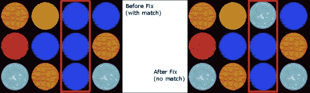
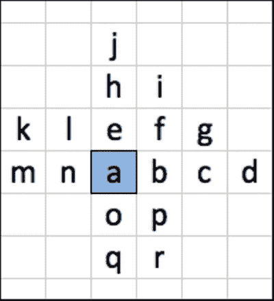
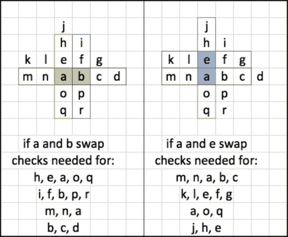

# 第二章。三合一和递归方法

我们现在将转向一款现代经典游戏，这款游戏具有上瘾的游戏玩法、预测编码和人工随机性。我们还将使用递归方法——这些方法是反复调用自身的。

在本章中，我们将涵盖以下内容：

+   基本状态机

+   检测匹配

+   预测逻辑

+   人工随机性

# 项目是……

在本章中，我们将构建一个三合一游戏。这款游戏受到了该类型中几个非常受欢迎的游戏的极大影响，但我们将坚持在本章中遵循核心机制。被省略了什么？虽然这些匹配仍然会被计分，但我们不会包括匹配四个或五个宝石的特殊模式。我们将探索使用预测逻辑和人工随机性避免“没有更多移动”情况的一种方法。我们假设你已经熟悉了第一章中的基本结构概念，即《感谢记忆游戏》，因此我们将直接进入三合一特定的代码。

### 注意

在整本书中，我们将使用诸如`MAMenuLayer`、`MAPlayfieldLayer`、`MAMenuScene`和`MAPlayfieldScene`之类的类名。每个游戏的前两个字母前缀将不同（`MT`用于第一章，《感谢记忆游戏》，`MA`用于本章，等等），但每个类扮演的角色将是相同的。这种结构是我们的基础命名法，因此我们应该假设在每个项目中都有以这种方式命名的类。

# 基本宝石交互

在这款游戏中，我们实际上只有一种类型的对象可以玩耍——我们将这些游戏棋子称为宝石，因为在三合一游戏中，这是最常用的图像。我们将查看`MAGem`类的内部结构，然后继续探讨在处理更复杂的逻辑之前，我们实际上是如何处理宝石的。

## MAGem 头文件

我们首先查看`MAGem`类的头文件，它是`CCSprite`的子类。这里有几个新事物。我们使用`@class`语句来告诉这个类存在另一个名为`MAPlayfieldLayer`的类，但我们不想在这里导入该类。`MAGem`将由`MAPlayfieldLayer`导入，我们不希望陷入无限“导入”循环。

**文件名**：`MAGem.h`

```swift
@class MAPlayfieldLayer;

typedef enum {
    kGemAnyType = 0,
    kGem1,
    kGem2,
    kGem3,
    kGem4,
    kGem5,
    kGem6,
    kGem7
} GemType;

typedef enum {
    kGemIdle = 100,
    kGemMoving,
    kGemScoring,
    kGemNew
} GemState;

@interface MAGem : CCSprite {
    NSInteger _rowNum; // Row number for this gem
    NSInteger _colNum; // Column number for this gem
    GemType _gemType; // The enum value of the gem
    GemState _gemState; // The current state of the gem
    MAPlayfieldLayer *gameLayer; // The game layer
}

@property (nonatomic, assign) NSInteger rowNum;
@property (nonatomic, assign) NSInteger colNum;
@property (nonatomic, assign) GemType gemType;
@property (nonatomic, assign) GemState gemState;
@property (nonatomic, assign) MAPlayfieldLayer *gameLayer;

-(BOOL) isGemSameAs:(MAGem*)otherGem;
-(BOOL) isGemInSameRow:(MAGem*)otherGem;
-(BOOL) isGemInSameColumn:(MAGem*)otherGem;
-(BOOL) isGemBeside:(MAGem*)otherGem;

-(void) highlightGem;
-(void) stopHighlightGem;

- (BOOL) containsTouchLocation:(CGPoint)pos;
@end
```

你会注意到我们以两个`typedef enum`部分开始这个类。这是一个 C 语言结构，基本上是一个整数常量。在大括号内是一个以逗号分隔的列表，列出了我们想要使用的所有命名元素，在大括号关闭后，我们给这个枚举值起一个名字。在第一个`typedef`语句中，我们建立了一个新的对象类型`GemType`。这个类型的有效值有`kGemAnyType`、`kGem1`、`kGem2`等等。你也会注意到第一个值被分配给一个整数`0`。如果你省略了这个分配，命名值将自动被分配唯一的整数值。因为我们明确声明第一个值是`0`，编译器将自动将增量整数分配给剩余的值。这让我们窥见了这些值的灵活性。尽管我们使用命名值，但在需要的情况下我们也可以将它们视为整数。例如，`kGem1`和整数值`1`是相同的，可以互换使用。

一旦我们构建了这些`typedef`部分，我们就可以像使用任何其他有效数据类型一样使用`GemType`和`GemState`类型，就像我们在变量声明中所做的那样。这些也可以在导入`MAGem`类的任何其他类中使用。

我们添加到`MAGem`类中的一个重要特性是原始状态机。我们使用`gemState`变量来保存宝石的当前状态。宝石一次只能处于一个状态。可能的状态有`kGemNew`、`kGemIdle`、`kGemScoring`和`kGemMoving`（如第二个`typedef enum`语句中定义的）。这些也可以通过为每个状态使用一系列`BOOL`变量来处理，但这会很快变得混乱。由于状态是互斥的，使用单个状态变量是处理这种状态的首选方式。

## `MAGem`类

现在我们将注意力转向`MAGem.m`文件。因为`MAGem`是`CCSprite`的子类，所以我们有意避免了重写任何方法。尽管重写`init`方法是常见的做法，但在这里我们采取了不同的方法。所有实例变量都将由调用方法设置，而不是由`init`方法设置。这说明了任何情况下都没有唯一的正确答案。这种方法实际上导致代码行数略有减少，因为宝石只会在我们的`MAPlayfieldLayer`类中的单个方法中创建。在功能上，在自定义`init`方法中设置这些值与这里采取的方法之间没有区别。

**文件名**：`MAGem.m`

```swift
@implementation MAGem

@synthesize rowNum = _rowNum;
@synthesize colNum = _colNum;
@synthesize gemType = _gemType;
@synthesize gemState = _gemState;

@synthesize gameLayer;

-(BOOL) isGemSameAs:(MAGem*)otherGem {
    // Is the gem the same type as the other Gem?
    return (self.gemType == otherGem.gemType);
}

-(BOOL) isGemInSameRow:(MAGem*)otherGem {
    // Is the gem in the same row as the other Gem?
    return (self.rowNum == otherGem.rowNum);
}

-(BOOL) isGemInSameColumn:(MAGem*)otherGem {
    // Is the gem in the same column as the other gem?
    return (self.colNum == otherGem.colNum);
}
```

在这个类中，我们有一些辅助方法将使匹配逻辑更容易。看看这个类中的 `isGemSameAs` 方法。由于这个方法在 `MAGem` 类中，我们可以传递另一个 `MAGem` 实例作为参数，并比较 `gemType` 变量以确定它们是否是相同类型的宝石。如果是相同的，我们返回 `YES`。如果它们不同，我们返回 `NO`。我们遵循相同的模式为 `isGemInSameRow` 和 `isGemInSameColumn` 方法。这些方法中的代码非常简单，但将使我们能够简化与宝石的交互方式。

**文件名**：`MAGem.m`

```swift
-(BOOL) isGemBeside:(MAGem*)otherGem {
    // If the row is the same, and the other gem is 
    // +/- 1 column, they are neighbors
    if ([self isGemInSameRow:otherGem] && 
        ((self.colNum == otherGem.colNum - 1) || 
        (self.colNum == otherGem.colNum + 1))
        ) {
        return YES;
    }
    // If the column is the same, and the other gem is 
    // +/- 1 row, they are neighbors
    else if ([self isGemInSameColumn:otherGem] && 
                 ((self.rowNum == otherGem.rowNum - 1) || 
                  (self.rowNum == otherGem.rowNum + 1))
                 ) {
        return YES;
    } else {
        return NO;
    }
}
```

`isGemBeside` 方法稍微复杂一些。我们首先检查两个相关的宝石（当前宝石和 `otherGem`）是否在同一行，使用我们刚刚看到的方法。我们还检查 `otherGem` 对象的 `colNum` 变量是否比当前宝石大或小一。如果是这样，我们返回 `YES`。然后我们检查 `otherGem` 是否在同一列，并且它们是否在相邻的行，以同样的方式。这个方法（以及其他 `isGem` 方法）将使宝石之间的比较在以后实现时变得非常简单。

**文件名**：`MAGem.m`

```swift
-(void) highlightGem {
    // Build a simple repeating "wobbly" animation
    CCMoveBy *moveUp = [CCMoveBy actionWithDuration:0.1
                        position:ccp(0,3)];
    CCMoveBy *moveDown = [CCMoveBy actionWithDuration:0.1
                        position:ccp(0,-3)];
    CCSequence *moveAround = [CCSequence actions:moveUp,
                        moveDown, nil];
    CCRepeatForever *gemHop = [CCRepeatForever
                        actionWithAction:moveAround];

    [self runAction:gemHop];
}

-(void) stopHighlightGem {
    // Stop all actions (the wobbly) on the gem
    [self stopAllActions];

    // We call to the gameLayer itself to make sure we 
    // haven't left the gem a little off-base
    // (from the highlightGem movements)
    [gameLayer performSelector:@selector(resetGemPosition:)
                    withObject:self];
}
```

在前面的代码中，我们可以看到 `highlightGem` 和 `stopHighlightGem` 方法。这些方法将在玩家触摸宝石时使用。当宝石被选中时，它会上下跳动。`stopHighlightGem` 方法会调用 `GameLayer` 类中的 `resetGemPosition` 方法。我们这样做是因为宝石本身并不知道它应该在屏幕上的位置。我们可以将定位代码迁移到 `MAGem` 类中以避免这种跨类调用，但这样做效果很好，所以我们将保持这种方式。

## 生成宝石

我们将构建一个新的子类 `CCLayer`，命名为 `MAPlayfieldLayer`，并设置几个方法来控制所有宝石的创建。

**文件名**：`MAPlayfieldLayer.m`

```swift
-(MAGem*) generateGemForRow:(NSInteger)rowNum
    andColumn:(NSInteger)colNum ofType:(GemType)newType {
    GemType gemNum;

    if (newType == kGemAnyType) {
        // If we passed a kGemAnyType, randomize the gem
        gemNum = (arc4random() % totalGemsAvailable) + 1;
    } else {
        // If we passed another value, use that gem type
        gemNum = newType;
    }

    // Generate the sprite name
    NSString *spritename = [NSString stringWithFormat:
                            @"gem%i.png", gemNum];

    // Build the MAGem, which is just an enhanced CCSprite
    MAGem *thisGem = [MAGem
                    spriteWithSpriteFrameName:spritename];

    // Set the gem's vars
    [thisGem setRowNum:rowNum];
    [thisGem setColNum:colNum];
    [thisGem setGemType:(GemType)gemNum];
    [thisGem setGemState:kGemNew];
    [thisGem setGameLayer:self];

    // Set the position for this gem
    [thisGem setPosition:[self positionForRow:rowNum
                                    andColumn:colNum]];

    // Add the gem to the array
    [gemsInPlay addObject:thisGem];

    // We return the newly created gem, which is already
    // added to the gemsInPlay array
    // It has NOT been added to the layer yet.
    return thisGem;
}

-(void) addGemForRow:(NSInteger)rowNum
           andColumn:(NSInteger)colNum
              ofType:(GemType)newType {

    // Add a replacement gem
    MAGem *thisGem = [self generateGemForRow:rowNum
                    andColumn:colNum ofType:newType];

    // We reset the gem above the screen
    [thisGem setPosition:ccpAdd(thisGem.position,
                                ccp(0,size.height))];

    // Add the gem to the scene
    [self addChild:thisGem];

    // Drop it to the correct position
    [self moveToNewSlotForGem:thisGem];
}
```

这两个方法共同负责创建一个新的宝石，分配所有变量（包括我们从 `MAGem` 类引用层所使用的 `GameLayer` 变量），并将宝石放入游戏中。为什么有两个方法？`addGemForRow:` 方法控制添加的三个方面：将宝石添加到层中，设置位置高于屏幕，并调用将宝石掉落到正确位置的方法。`generateGemsForRow:` 方法做所有的事情，除了将宝石放入游戏中。我们这样做是因为有些情况下我们想要创建一个宝石而不使其可见，例如当我们构建初始棋盘时。

由于我们在 `MAGem` 类内部（在 `generate` 方法中的 `setGameLayer:` 行）保留了对游戏区域层的引用，我们需要注意内存使用，并在宝石的 `dealloc` 方法运行时将该属性设置为 `nil`。

**文件名**：`MAGem.m`

```swift
-(void) dealloc {
    [self setGameLayer:nil];

    [super dealloc];
}
```

# 构建游戏区域

基本游戏区域的创建与第一章[“Thanks for the Memory Game”]中记忆游戏的设置非常相似，有一些细微的差别。我们不希望游戏区域以三子连珠的匹配开始，因此我们想要检查匹配情况并改变宝石的位置，以确保游戏开始时棋盘是“干净”的。

**文件名**: `MAPlayfieldLayer.m`

```swift
-(void) generatePlayfield {
    // Randomly select gems and place on the board
    // Iterate through all rows and columns
    for (int row = 1; row <= boardRows; row++) {
        for (int col = 1; col <= boardColumns; col++) {
            // Generate a gem for this slot
            [self generateGemForRow:row andColumn:col
                             ofType:kGemAnyType];
        }
    }

    // We check for matches now, and remove any gems 
    // from starting in the scoring position
    [self fixStartingMatches];

    // Add the gems to the layer
    for (MAGem *aGem in gemsInPlay) {
        [aGem setGemState:kGemIdle];
        [matchsheet addChild:aGem];
    }
}
```

在这个方法中，我们遍历所有位置，并对棋盘上的每个槽位调用 `generateGemForRow:` 方法。如您所回忆的，`generateGemForRow:` 方法不会将宝石添加到层中，因此我们可以在将其介绍给玩家之前操纵棋盘。我们调用 `fixStartingMatches` 方法来纠正任何三子连珠的起始情况，然后遍历 `gemsInPlay` 数组中的所有宝石并将它们添加到棋盘上。（您可能会注意到，当宝石首次添加时，它被设置为状态 `kGemNew`，而当它被添加到棋盘上时，它被更改为 `kGemIdle`。这是为了避免在创建新宝石但尚未可见时发生任何意外匹配。当我们将其添加到棋盘上时，它已经准备好游戏，所以 `kGemIdle` 是当时正确的状态。）现在我们需要看看 `fixStartingMatches` 方法是如何工作的。

**文件名**: `MAPlayfieldLayer.m`

```swift
-(void) fixStartingMatches {
    // This method checks for any possible matches
    // and will remove those gems. After fixing the gems,
    // we call this method again (from itself) until we
    // have a clean result
    [self checkForMatchesOfType:kGemNew];
    if ([gemMatches count] > 0) {

        // get the first matching gem
        MAGem *aGem = [gemMatches objectAtIndex:0];

        // Build a replacement gem
        [self generateGemForRow:[aGem rowNum] andColumn:
                    [aGem colNum] ofType:kGemAnyType];

        // Destroy the original gem
        [gemsInPlay removeObject:aGem];
        [gemMatches removeObject:aGem];

        // We recurse so we can see if the board is clean
        // When we have no gemMatches, we stop recursion
        [self fixStartingMatches];
    }
}
```

这个方法从 `checkForMatchesOfType` 方法开始，我们将在稍后介绍。现在，我们只需要知道它会审查 `gemsInPlay` 数组中的所有宝石以及任何三子连珠匹配的宝石，并将它们添加到 `gemMatches` 数组中。这个方法调用那个检查，如果有任何宝石在 `gemMatches` 数组中，它将销毁 `gemMatches` 数组中的第一个宝石并创建一个新的替代品。在替换了这 *一个* 宝石之后，它调用自身，以便再次检查整个棋盘。为什么不一次性修复所有这些呢？`gemMatches` 数组包含 *所有* 匹配，这意味着如果棋盘上只有一个三子连珠匹配，数组中有三个宝石。我们只需要替换这些宝石中的一个来“修复”棋盘上的这个匹配，所以那个匹配中的其他两个宝石将保持不变。为了帮助直观地解释这一点，请看以下比较：



当棋盘首次生成时，它创建了一个即时匹配，如左图中的红色框所示。在运行 `fixStartingMatches` 方法后，它替换了匹配中的第一个宝石（在这种情况下是上面的一个），并用一个新随机生成的宝石替换了它。不再有三子连珠的匹配，所以我们完成了。`fixStartingMatches` 方法将在更改这个宝石之后再次运行，只是为了确保我们不会出现另一个匹配情况。以这种方式纠正所有三子连珠的匹配条件后，游戏设置可以继续。

### 注意

在本书的剩余部分，我们将关注实现（`.m`）文件。除了一些例外，我们不会花费时间详细说明头文件，所以如果你对这里使用的变量或属性不确定，请查阅本书的代码包。我们的主要目标是理解各种方法和对象如何驱动游戏，而大多数重要细节都在实现文件中。

# 检查匹配

剩下唯一的方法是查看初始棋盘的构建。`checkForMatchesOfType`方法接受一个`desiredGemState`值作为参数。我们这样做是因为，在初始棋盘设置期间，我们只想检查处于`kGemNew`状态的宝石。稍后，在实际游戏过程中，我们只想在宝石处于`kGemIdle`状态时检查匹配。 （在游戏过程中，`kGemNew`状态的宝石在它们被投放到屏幕上之前将位于可见屏幕之外，我们绝对不希望在它们落入位置之前将它们包括在匹配中。）现在让我们分两部分来看这个方法：

**文件名**：`MAPlayfieldLayer.m` (`checkForMatchesOfType`，第一部分)

```swift
-(void) checkForMatchesOfType:(GemType)desiredGemState {
  // Let's look for horizontal matches    
  for (MAGem *aGem in gemsInPlay) {
    // Let's grab the first gem
    if (aGem.gemState == desiredGemState) {
      // If it is the desired state, let's look
      // for a matching neighbor gem
      for (MAGem *bGem in gemsInPlay) {
        // If the gem is the same type and state,
        // in the same row, and to the right
        if ([aGem isGemSameAs:bGem] &&
          [aGem isGemInSameRow:bGem] &&
            aGem.colNum == bGem.colNum - 1 &&
            bGem.gemState == desiredGemState) {
            // Now we loop through again,
            // looking for a 3rd in a row
            for (MAGem *cGem in gemsInPlay) {
              // If this is the 3rd gem in a row
              // in the desired state
              if (aGem.colNum == cGem.colNum - 2 &&
                  cGem.gemState == desiredGemState) {
                   // Is the gem the same type
                   // and in the same row?
                   if ([aGem isGemSameAs:cGem] &&
                 [aGem isGemInSameRow:cGem]) {
                         // Add gems to match array
                  [self addGemToMatch:aGem];
                   [self addGemToMatch:bGem];
                  [self addGemToMatch:cGem];
                          break;
                   }
              }
           }  
        } 
     }
  }
```

这个方法看起来有点令人畏惧，所以让我们将其拆解。我们有两个主要部分，一个用于水平匹配，一个用于垂直匹配。在先前的代码中我们看到的是水平匹配检查。外部的`for`循环遍历`gemsInPlay`数组中的所有宝石，将这个宝石命名为`aGem`。我们立即检查以确保`aGem`具有我们正在寻找的`desiredGemState`值。如果不是，则跳过本节剩余部分。如果`gemState`具有`desiredGemState`值，我们开始在同一个`gemsInPlay`数组上启动第二个`for`循环，这次将正在评估的宝石称为`bGem`。我们检查以下条件是否成立：

+   `aGem`与`bGem`类型相同（使用`isGemSameAs`方法）

+   `aGem`与`bGem`在同一行

+   `aGem`的`colNum`等于`bGem`的`colNum`减 1

+   `bGem`处于`desiredGemState`状态

如果所有这些条件都成立，这意味着正在评估的`aGem`右侧有一个相同的宝石。因此，我们有一个两连珠的情况。现在我们开始使用`gemsInPlay`数组启动第三个`for`循环，就像其他两个循环一样。在第三个循环中，我们将条件分成两个单独的`if`语句：

+   `aGem`的`colNum`等于`cGem`的`colNum`减 2

+   `cGem`的宝石状态等于`desiredGemState`

在第二个`if`语句中，我们检查以下这些陈述：

+   `aGem`与`cGem`类型相同

+   `aGem`与`cGem`在同一行

如果所有这些条件都成立，我们就完成了一个三连珠匹配。所有参与匹配的三个宝石随后被添加到`gemMatches`数组中。我们不是直接将宝石添加到数组中，而是使用`addGemToMatch`方法。

**文件名**：`MAPlayfieldLayer.m`

```swift
-(void) addGemToMatch:(MAGem*)thisGem {
    // Only adds it to the array if it isn't already there
    if ([gemMatches indexOfObject:thisGem] == NSNotFound) {
        [gemMatches addObject:thisGem];
    }
}
```

由于我们要检查整个板子，我们经常发现涉及相同宝石的多个匹配。由于我们只想让每个匹配的宝石被表示一次，`addGemToMatch`方法在添加宝石之前会检查宝石是否已经在数组中。

现在，我们可以看看这个方法的下半部分：

**文件名**: `MAPlayfieldLayer.m` (`checkForMatchesOfType`, 第二部分)

```swift
 // Let's look for vertical matches
  for (MAGem *aGem in gemsInPlay) {
    // Let's grab the first gem
    if (aGem.gemState == desiredGemState) {
       // If it is the desired state, let's look for a
      // matching neighbor gem
      for (MAGem *bGem in gemsInPlay) {
        // If the gem is the same type and state,
      // in the same column, and above
        if ([aGem isGemSameAs:bGem] &&
          [aGem isGemInSameColumn:bGem] &&
            aGem.rowNum == bGem.rowNum - 1 &&
            bGem.gemState == desiredGemState) {
              // Now we looking for a 3rd in the column
              for (MAGem *cGem in gemsInPlay) {
                 // If this is the 3rd gem in a row
                 if (bGem.rowNum == cGem.rowNum - 1 &&
                     cGem.gemState == desiredGemState) {
                       // Is the gem the same type and
                 // in the same column?
                      if ([bGem isGemSameAs:cGem] &&
                          [bGem isGemInSameColumn:cGem]) {
                            // Add gems to match array
                            [self addGemToMatch:aGem];
                     [self addGemToMatch:bGem];
                      [self addGemToMatch:cGem];
                            break;

                      } 
                   }
                }
             }
          } 
       }
    }
  }
}
```

这个方法的下半部分检查垂直匹配。你会注意到代码看起来与我们在详细审查中刚刚审查的水平检查非常相似。垂直检查几乎与水平检查相同，只是所有关于行和列的引用都被反转了。其他所有内容都处于相同的结构中。

## 收集触摸

现在我们已经搭建好了板子，我们需要添加一些机械装置来移动宝石，以便我们能够进行匹配。让我们看看触摸处理程序，从`ccTouchBegan`方法开始：

**文件名**: `MAPlayfieldLayer.m`

```swift
-(BOOL) ccTouchBegan:(UITouch *)touch withEvent:(UIEvent *)event {

    CGPoint location = [touch locationInView:[touch view]];
    CGPoint convLoc = [[CCDirector sharedDirector]
                       convertToGL:location];

    // If we reached game over, any touch returns to menu
    if (isGameOver) {
        [[CCDirector sharedDirector]
                replaceScene:[MAMenuScene scene]];
        return YES;
    }

    // If the back button was pressed, we exit
    if (CGRectContainsPoint([backButton boundingBox],
                            convLoc)) {
        [[CCDirector sharedDirector]
         replaceScene:[MAMenuScene node]];
        return YES;
    }

    // If we have only 0 or 1 gem in gemsTouched, track
    if ([gemsTouched count] < 2) {
        // Check each gem
        for (MAGem *aGem in gemsInPlay) {
            // If the gem was touched AND the gem is idle,
            // return YES to track the touch
            if ([aGem containsTouchLocation:convLoc] &&
                            aGem.gemState == kGemIdle) {
                return YES;
            }
        }
    }

    // If we failed to find any good touch, return
    return NO;
}
```

`ccTouchBegan`方法控制我们是否跟踪特定的触摸。如果我们达到了“游戏结束”的条件（由`gameOver`变量指示），我们就回到菜单。如果触摸了`backButton`，我们也会触发相同的`replaceScene`方法。我们在`ccTouchBegan`中处理这些情况，这样我们就可以覆盖可能正在进行的任何其他逻辑，并且可以在我们想要的时候离开游戏。

这是我们第一次遇到`gemsTouched`数组，所以我们将在这里解释它。当玩家触摸任何宝石时，我们将该宝石添加到`gemsTouched`数组中。当我们有两个宝石在`gemsTouched`数组中时，我们交换宝石的位置并检查是否有匹配。如果数组中有两个宝石，我们知道游戏中正在发生其他事情（交换宝石、检查匹配、移动宝石等），所以我们停止跟踪触摸。如果我们数组中的宝石少于两个，我们遍历`gemsInPlay`数组以确定是否触摸了任何（如果有）宝石。当我们找到时，我们返回`YES`以允许跟踪触摸。

现在我们正在跟踪一个触摸，处理程序继续执行`ccTouchMoved`方法。

**文件名**: `MAPlayfieldLayer.m`

```swift
-(void) ccTouchMoved:(UITouch *)touch withEvent:(UIEvent *)event {
    // Swipes are handled here.
    [self touchHelper:touch withEvent:event];
}
```

这里没有太多内容。这个方法将所有内容都传递给我们的`touchHelper`方法。

**文件名**: `MAPlayfieldLayer.m`

```swift
-(void) touchHelper:(UITouch *)touch withEvent:(UIEvent *)event {
    // If we're already checking for a match, ignore
    if ([gemsTouched count] >= 2 || gemsMoving == YES) {
        return;
    }

    CGPoint location = [touch locationInView:[touch view]];
    CGPoint convLoc = [[CCDirector sharedDirector]
                       convertToGL:location];

    // Let's figure out which gem was touched (if any)
    for (MAGem *aGem in gemsInPlay) {
        if ([aGem containsTouchLocation:convLoc] &&
            aGem.gemState == kGemIdle) {
            // We can't add the same gem twice
            if ([gemsTouched containsObject:aGem] == NO) {
                // Add the gem to the array
                [self playDing];
                [gemsTouched addObject:aGem];
                [aGem highlightGem];
            }
        }
    }

    // We now have touched 2 gems.  Let's swap them.
    if ([gemsTouched count] >= 2) {
        MAGem *aGem = [gemsTouched objectAtIndex:0];
        MAGem *bGem = [gemsTouched objectAtIndex:1];

        // If the gems are adjacent, we can swap
        if ([aGem isGemBeside:bGem]) {
            [self swapGem:aGem withGem:bGem];
        } else {
            // They're not adjacent, so let's drop
            // the first gem
            [aGem stopHighlightGem];
            [gemsTouched removeObject:aGem];
        }
    }
}
```

当玩家在板上滑动手指时，`ccTouchMoved`会不断被触发，这反过来又会反复调用`touchHelper`方法。第一次检查是确保我们已经在`gemsTouched`数组中有两个对象（与`ccTouchBegan`中的相同“保护”），并确保我们没有任何正在移动的宝石（`gemsMoving`变量为`YES`）。如果有，我们调用`return`来停止跟踪这个触摸。

如果触摸接触到宝石，并且宝石尚未在 `gemsTouched` 数组中，我们将播放声音，将其添加到 `gemsTouched` 数组中，并发送消息给宝石以运行 `highlightGem` 方法。由于此代码是从 `ccTouchMoved` 方法中调用的，因此当我们滑动多个宝石时，每颗宝石都将添加到数组中（最多达到声明的两个）。我们有了滑动检测，而无需任何手势检测代码。

最后的 *if* 语句是检查我们是否在 `gemsTouched` 数组中收集到了两颗宝石。如果有，我们首先检查确保宝石是相邻的（使用 `isGemBeside` 方法）。如果它们是相邻的，我们调用 `swapGem` 并将两颗宝石传递给该方法。如果不是，我们停止突出显示数组中的第一颗宝石，并将其从 `gemsTouched` 数组中删除，这样第二次触摸现在就是 `gemsTouched` 数组中唯一的宝石。

现在，让我们看看最终的触摸处理方法，`ccTouchEnded`。

**文件名**：`MAPlayfieldLayer.m`

```swift
-(void) ccTouchEnded:(UITouch *)touch withEvent:(UIEvent *)event {
    // Taps are handled here.    
    [self touchHelper:touch withEvent:event];
}
```

这里发生了什么？在 `ccTouchEnded` 方法中我们需要进行的检查与我们在 `ccTouchMoved` 方法中使用的检查完全相同，因此我们可以调用相同的代码，而不是将所有代码复制到两个方法中；这就是我们创建 `touchHelper` 方法的原因。同时查看 `ccTouchMoved` 和 `ccTouchEnded` 方法，我们能够灵活地通过滑动或轻触宝石来选择它们。`ccTouchMoved` 只在触摸移动时（即滑动）被调用，所以简单的点击不会激活该方法中的代码。`ccTouchEnded` 方法只在触摸结束时（即手指从屏幕上抬起）被调用。通过在两个地方触发相同的代码，我们可以覆盖两种玩家交互方式。

## 移动宝石

让我们简要看看我们用来处理宝石移动的方法：

**文件名**：`MAPlayfieldLayer.m`

```swift
-(void)swapGem:(MAGem*)aGem withGem:(MAGem*)bGem {
    NSInteger tempRowNumA;
    NSInteger tempColNumA;

    // Stop the highlight
    [aGem stopHighlightGem];
    [bGem stopHighlightGem];

    // Grab the temp location of aGem
    tempRowNumA = [aGem rowNum];
    tempColNumA = [aGem colNum];

    // Set the aGem to the values from bGem
    [aGem setRowNum:[bGem rowNum]];
    [aGem setColNum:[bGem colNum]];

    // Set the bGem to the values from the aGem temp vars
    [bGem setRowNum:tempRowNumA];
    [bGem setColNum:tempColNumA];
    // Move the gems
    [self moveToNewSlotForGem:aGem];
    [self moveToNewSlotForGem:bGem];
}
```

`swapGem` 方法非常基础。我们使用临时变量来帮助交换传递给该方法的两颗宝石的 `rowNum` 和 `colNum` 值。在它们改变之后，我们在两颗宝石上调用 `moveToNewSlotForGem` 方法。

**文件名**：`MAPlayfieldLayer.m`

```swift
-(void) moveToNewSlotForGem:(MAGem*)aGem {
    // Set the gem's state to moving
    [aGem setGemState:kGemMoving];

    // Move the gem, play sound, let it rest
    CCMoveTo *moveIt = [CCMoveTo
            actionWithDuration:0.2
            position:[self positionForRow:[aGem rowNum]
                                andColumn:[aGem colNum]]];
    CCCallFunc *playSound = [CCCallFunc
            actionWithTarget:self
                    selector:@selector(playSwoosh)];
    CCCallFuncND *gemAtRest = [CCCallFuncND
            actionWithTarget:self
            selector:@selector(gemIsAtRest:) data:aGem];
    [aGem runAction:[CCSequence actions:moveIt,
                     playSound, gemAtRest, nil]];
}
```

`moveToNewSlotForGem` 方法首先将宝石的状态设置为 `kGemMoving`，因此在这颗宝石移动时，它将不会参与任何匹配逻辑。然后，我们使用 `CCMoveTo` 动作将宝石移动到它应该去的位置（基于我们刚刚分配给它的新的 `rowNum` 和 `colNum` 变量），播放音效，然后调用 `gemIsAtRest` 方法。

**文件名**：`MAPlayfieldLayer.m`

```swift
-(void) gemIsAtRest:(MAGem*)aGem {
    // Reset the gem's state to Idle
    [aGem setGemState:kGemIdle];

    // Identify that we need to check for matches
    checkMatches = YES;
}
```

`gemIsAtRest` 方法重置宝石的状态，因此现在它是 `kGemIdle`。这意味着它现在将允许参与在板上进行的任何匹配检查。我们还设置了 `checkMatches` 变量为 `YES`。这是我们用来识别板现在足够稳定，可以检查潜在匹配的触发器。

# 检查移动

我们即将完成一个基本的匹配 3 游戏。让我们看看我们还需要完成游戏的几个方法。

**文件名**：`MAPlayfieldLayer.m`

```swift
-(void) checkMove {
    // A move was made, so check for potential matches
    [self checkForMatchesOfType:kGemIdle];

    // Did we have any matches?
    if ([gemMatches count] > 0) {
        // Iterate through all matched gems
        for (MAGem *aGem in gemMatches) {
            // If the gem is not already in scoring state
            if (aGem.gemState != kGemScoring) {
                // Trigger the scoring & removal of gem
                [self animateGemRemoval:aGem]; 
            }
        }
        // All matches processed.  Clear the array.
        [gemMatches removeAllObjects];
    // If we have any selected/touched gems, we must
    // have made an incorrect move
    } else if ([gemsTouched count] > 0) {
        // If there was only one gem, grab it
        MAGem *aGem = [gemsTouched objectAtIndex:0];

        // If we had 2 gems in the touched array
        if ([gemsTouched count] == 2) {
            // Grab the second gem
            MAGem *bGem = [gemsTouched objectAtIndex:1];
            // Swap them back to their original slots
            [self swapGem:aGem withGem:bGem];
        } else {
            // If we only had 1 gem, stop highlighting it
            [aGem stopHighlightGem];
        }
    }
    // Touches were processed.  Clear the touched array.
    [gemsTouched removeAllObjects];
}
```

到现在为止，你应该已经足够熟悉在这段代码中处理宝石数组的方式，因此你应该觉得这个方法相当简单。首先，我们调用`checkForMatchesOfType`方法，用匹配的宝石（如果找到的话）填充`gemMatches`数组。如果我们找到任何匹配项，所有匹配的宝石都会被发送到`animateGemRemoval`方法。一旦这个循环完成，我们就从`gemMatches`数组中移除所有宝石。如果我们有宝石在`gemsTouched`数组中，我们会调用它们上的`stopHighlightGem`。如果数组中有两个宝石，这意味着我们有一个没有匹配的移动，所以我们会调用`swapGem`将它们移回到起始位置。在那之后，我们清除`gemsTouched`数组。到这个方法结束时，两个临时数组都是空的，所有匹配项都已解决。

## 移除宝石

现在我们来看看用于从棋盘上移除宝石的方法：

**文件名**：`MAPlayfieldLayer.m`

```swift
-(void) animateGemRemoval:(MAGem*)aGem {
    // We swap the image to "boom", and animate it out
    CCCallFuncND *changeImage = [CCCallFuncND
            actionWithTarget:self
            selector:@selector(changeGemFace:) data:aGem];
    CCCallFunc *updateScore = [CCCallFunc
            actionWithTarget:self
            selector:@selector(incrementScore)];
    CCCallFunc *addTime = [CCCallFunc
            actionWithTarget:self
            selector:@selector(addTimeToTimer)];
    CCMoveBy *moveUp = [CCMoveBy actionWithDuration:0.3
            position:ccp(0,5)];
    CCFadeOut *fade = [CCFadeOut actionWithDuration:0.2];
    CCCallFuncND *removeGem = [CCCallFuncND
            actionWithTarget:self
            selector:@selector(removeGem:) data:aGem];

    [aGem runAction:[CCSequence actions:changeImage,
            updateScore, addTime, moveUp, fade,
            removeGem, nil]];
}
```

```swift
-(void) changeGemFace:(MAGem*)aGem {
    // Swap the gem texture to the "boom" image
    [aGem setDisplayFrame:[[CCSpriteFrameCache
                        sharedSpriteFrameCache]
                        spriteFrameByName:@"boom.png"]];
}
```

```swift
-(void) removeGem:(MAGem*)aGem {
    // Clean up after ourselves and get rid of this gem
    [gemsInPlay removeObject:aGem];
    [aGem setGemState:kGemScoring];
    [self fillHolesFromGem:aGem];
    [aGem removeFromParentAndCleanup:YES];
    checkMatches = YES;
} 
```

这三个方法结合起来，处理了我们为了整洁地动画匹配宝石所需的所有内容。`changeGemFace`使用了一个我们之前没有见过的方法。由于我们所有的图像都是同一个`CCSpriteBatchNode`的一部分，我们能够使用`setDisplayFrame`方法在运行时更改精灵的图像。在这里，我们用“爆炸”图像替换宝石的图像。我们将其向上移动屏幕并淡出，使其从棋盘上整洁地消失。（我们也会更新分数并给计时器加时，但在这里我们不会讨论这些游戏功能。如果你不使用分数或计时器，你可以轻松地移除这些动作。）有一个重要的方法是从`removeGem`方法中调用的，叫做`fillHolesFromGem`。让我们看看它做了什么：

**文件名**：`MAPlayfieldLayer.m`

```swift
-(void) fillHolesFromGem:(MAGem*)aGem {
    // aGem passed is one that is being scored.
    // We know we will need to fill in the holes, so 
    // this method takes care of that.

    for (MAGem *thisGem in gemsInPlay) {
        // If thisGem is in the same column and ABOVE
        // the current matching gem, we reset the
        // position down, so we can fill the hole
        if (aGem.colNum == thisGem.colNum && 
            aGem.rowNum < thisGem.rowNum) {
            // Set thisGem to drop down one row
            [thisGem setRowNum:thisGem.rowNum - 1];            
            [self moveToNewSlotForGem:thisGem];
        }
    }

    // Call the smart fill method.
    [self smartFill];
}
```

这个方法寻找任何与传递的宝石`aGem`在同一列的宝石。我们遍历`gemsInPlay`数组，寻找任何在`aGem`上方一行的宝石，将它们的`rowNum`变量重置为低一排，然后触发`moveToNewSlotForGem`方法。这将有效地填充棋盘上的任何间隙。它不会在棋盘上添加任何新的宝石，但将它们全部向下折叠，使任何剩余的空位都在棋盘顶部。（`smartFill`方法在本章的*预测逻辑*部分有所介绍。）

## 更新方法

我们现在将注意力转向`update`方法，它将把所有这些内容串联起来。

**文件名**：`MAPlayfieldLayer.m`

```swift
-(void) update:(ccTime)dt {

    gemsMoving = NO;

    // See if we have any gems currently moving
    for (MAGem *aGem in gemsInPlay) {
        if (aGem.gemState == kGemMoving) {
            gemsMoving = YES;
            break;
        }
    }

    // If we flagged that we need to check the board
    if (checkMatches) {
        [self checkMove];
        [self checkMovesRemaining];
        checkMatches = NO;
    }

    // Too few gems left.  Let's fill it up.
    // This will avoid any holes if our smartFill left
    // gaps, which is common on 4 and 5 gem matches.
    if ([gemsInPlay count] < boardRows * boardColumns &&
        gemsMoving == NO) {
        [self addGemsToFillBoard];
    }

    // Update the timer value & display

    // Game Over / Time's Up

    }
} 
```

现在我们将代码中的几个松散的结尾串联起来。我们从一个在触摸处理程序中使用的`gemsMoving` `BOOL`开始。我们在`update`方法中通过遍历所有宝石来确定是否有任何宝石处于`kGemMoving`状态。如果有任何宝石在移动，`gemsMoving`会被设置为`YES`。

接下来是 `BOOL` 类型的 `checkMatches`。如果这个变量被设置为 `YES`，我们运行 `checkMove` 方法。正如我们之前看到的，这个方法负责处理所有匹配逻辑和移除匹配的宝石。在这个 `if` 语句的末尾，我们将 `checkMatches` 变量重置为 `NO` 以指示匹配已解决。（我们将在下一节讨论 `checkMovesRemaining`。）

核心的 `update` 方法的最后一部分检查棋盘上是否宝石不足且没有任何移动。如果这两个条件都成立，我们调用 `addGemsToFillBoard` 方法来填充任何缺失的宝石。（在游戏结束时的计时器更新和游戏结束检查也有。我们在这里不会讨论这些，所以省略了代码细节。请参阅附带的代码以了解更新方法的这些部分。）

**文件名**：`MAPlayfieldLayer.m`

```swift
-(void) addGemsToFillBoard {
    // Loop through all positions, see if we have a gem
    for (int i = 1; i <= boardRows; i++) {
        for (int j = 1; j <= boardColumns; j++) {

            BOOL missing = YES;

            // Look for a missing gem in each slot
            for (MAGem *aGem in gemsInPlay) {
                if (aGem.rowNum == i && aGem.colNum == j
                    && aGem.gemState != kGemScoring) {
                    // Found a gem, not missing
                    missing = NO;
                }
            }
            // We didn't find anything in this slot.
            if (missing) {
                [self addGemForRow:i andColumn:j
                            ofType:kGemAnyType];
            }
        }
    }
    // We possibly changed the board, trigger match check
    checkMatches = YES;
}
```

我们遍历棋盘上的所有空间，然后遍历 `gemsInPlay` 数组中的所有宝石。如果我们在这个槽位中找到一个宝石，我们将 `missing` 变量设置为 `NO`。如果我们没有在给定的槽位中找到一个宝石（即 `missing = YES`），我们将调用 `addGemForRow` 方法来添加一个新的随机宝石以填充该槽位。

# 预测逻辑

到目前为止，我们主要介绍了处理基本游戏机制的直接代码。然而，有一个问题。游戏可能会生成一个无法进行移动的棋盘。更糟糕的是，我们无法知道是否还有剩余的移动。我们的目标是现在纠正这个缺陷，采用一种称为 `checkMovesRemaining` 的密集方法。首先，我们应该了解如何实现这一基本概念。

如果你还记得，我们之前审查的 `checkForMatchesOfType` 方法在找到棋盘上的任何实际匹配方面做得很好。我们可以用那种风格编写这个预测方法，但由于需要能够确定最多五个连续宝石的匹配，以获得剩余移动的准确计数，这会很快变得混乱。在这里，我们通过将 `gemType` 值写入一个“C 样式”数组来采取另一种方法，这样我们可以轻松地获得整个棋盘的单个视图，而无需使用大量的嵌套循环。

挑战在于确定玩家可以合法移动宝石的所有可能方式以及移动后棋盘的形状。我们从左下角的所有位置开始遍历，我们将测试如果宝石向右移动会发生什么，以及如果宝石向上移动会发生什么。尽管玩家也可以向左和向下移动，但这些已经被处理了，因为向下交换一个宝石等同于向上交换下面的宝石。

我们通过创建一个表示棋盘区域的“字母映射”来开始我们的测试场景，其中字母“a”代表正在评估的棋盘槽位，如下所示：



我们将使用这个字母映射并分配变量来表示数组中每个指定位置的价值。例如，变量`f`位于相对于字母*a*的`row+1`和`col+1`位置。从那里，我们将测试映射的“变形”版本，首先交换*a*和*b*的位置，然后测试*a*和*e*交换。从那里，我们计算单次移动可以形成的所有匹配，并将这个值设置为`movesRemaining`变量。（这段代码相当长，但在这里没有很好的分割方式。）

**文件名**：`MAPlayfieldLayer.m`

```swift
-(void) checkMovesRemaining {

    NSInteger matchesFound = 0;
    NSInteger gemsInAction = 0;

    // Create a temporary C-style array
    NSInteger map[12][12];

    // Make sure it is cleared
    for (int i = 1; i< 12; i++) {
        for (int j = 1; j < 12; j++) {
            map[i][j] = 0;
        }
    }

    // Load all gem types into it
    for (MAGem *aGem in gemsInPlay) {
        if (aGem.gemState != kGemIdle) {
            // If gem is moving or scoring, fill with zero
            map[aGem.rowNum][aGem.colNum] = 0;
            gemsInAction++;
        } else {            
            map[aGem.rowNum][aGem.colNum] = aGem.gemType;
        }
    }

    // Loop through all slots on the board
    for (int row = 1; row <= boardRows; row++) {
        for (int col = 1; col <= boardColumns; col++) {

            // Grid variables look like:
            //
            //        j
            //        h i
            //    k l e f g 
            //    m n a b c d
            //        o p
            //        q r

            // where "a" is the root gem we're testing
            // The swaps we test are a/b and a/e
            // So we need to identify all possible matches
            // that those swaps could cause
            GemType a = map[row][col];
            GemType b = map[row][col+1];
            GemType c = map[row][col+2];
            GemType d = map[row][col+3];
            GemType e = map[row+1][col];
            GemType f = map[row+1][col+1];
            GemType g = map[row+1][col+2];
            GemType h = map[row+2][col];
            GemType i = map[row+2][col+1];
            GemType j = map[row+3][col];
            GemType k = map[row+1][col-2];
            GemType l = map[row+1][col-1];
            GemType m = map[row][col-2];
            GemType n = map[row][col-1];
            GemType o = map[row-1][col];
            GemType p = map[row-1][col+1];
            GemType q = map[row-2][col];
            GemType r = map[row-2][col+1];

            // deform the board-swap of a and b, test
            GemType newA = b;
            GemType newB = a;

            matchesFound = matchesFound +
                [self findMatcheswithA:h andB:e
                            andC:newA andD:o andE:q];
            matchesFound = matchesFound + 
                [self findMatcheswithA:i andB:f
                            andC:newB andD:p andE:r];
            matchesFound = matchesFound +
                [self findMatcheswithA:m andB:n
                            andC:newA andD:0 andE:0];
            matchesFound = matchesFound +
                [self findMatcheswithA:newB andB:c
                            andC:d andD:0 andE:0];

            // Now we swap a and e, then test
            newA = e;
            GemType newE = a;
            matchesFound = matchesFound +
                [self findMatcheswithA:m andB:n
                            andC:newA andD:b andE:c];
            matchesFound = matchesFound +
                [self findMatcheswithA:k andB:l
                            andC:newE andD:f andE:g];
            matchesFound = matchesFound +
                [self findMatcheswithA:newA andB:o
                            andC:q andD:0 andE:0];
            matchesFound = matchesFound +
                [self findMatcheswithA:newE andB:h
                            andC:j andD:0 andE:0];
        }
    }

    // See if we have gems in motion on the board
    // Set the BOOL so other methods don't try to fix 
    // any "problems" with a moving board
    gemsMoving = (gemsInAction > 0);

    movesRemaining = matchesFound;
}
```

为了保持定位清晰，你可以看到我们将字母映射的文本版本放入了代码中。这是一个便利之处，因为试图从代码本身读取模式相当繁琐且具有挑战性。当我们查看变形后的棋盘上的可能匹配时，对于每种变形，我们有四种可能的匹配方式，如图所示：



为了协助这项检查，我们添加了一个辅助方法。

**文件名**：`MAPlayfieldLayer.m`

```swift
-(NSInteger) findMatcheswithA:(NSInteger)a
                         andB:(NSInteger)b
                         andC:(NSInteger)c
                         andD:(NSInteger)d
                         andE:(NSInteger)e {
    NSInteger matches = 0;

    if (a == b && b == c && c == d && d == e &&
                            a + b + c + d + e != 0) {
        // 5 match
        matches++;        
    } else if (a == b && b == c && c == d  &&
                            a + b + c + d != 0) {
        // 4 match (left)
        matches++;
    } else if (b == c && c == d && d == e &&
                            b + c + d + e != 0) {
        // 4 match (right)
        matches++;
    } else if (a == b && b == c && a + b + c != 0) {
        // 3 match (left)
        matches++;
    } else if (b == c && c == d && b + c + d != 0) {
        // 3 match (mid)
        matches++;
    } else if (c == d && d == e && c + d + e != 0) {
        // 3 match (right)
        matches++;
    }
    return matches;
}
```

五种宝石的任何组合都可能导致三、四或五连珠匹配。我们将五颗连珠传递给这个方法，它首先检查五连珠，然后是四连珠，接着是三连珠。这是一个`if…else-if`结构，因为五连珠匹配也会触发四连珠和三连珠匹配，所以我们让它像瀑布一样作用，以避免重复计数匹配。你也会注意到我们确保其中一个变量不是`0`。正如我们在`checkMovesRemaining`方法本身所看到的，我们只为处于`kGemIdle`状态的宝石记录宝石类型。所有其他宝石状态（`kGemMoving`、`kGemScoring`和`kGemNew`），以及棋盘外的位置，在地图中都将表示为`0`。

# 人工随机性

现在，我们可以评估棋盘以查看所有可能的走法。然后呢？我们可以在`update`方法中添加一个触发器，显示“没有更多走法”的消息并导致游戏结束，但这没有乐趣，对吧？我们的目标是制作一个可以永远进行下去的游戏。这就是我们最终准备好找出之前在代码中看到的`smartFill`方法细节的时候。这是一个非常长的方法，完整列出。这是过程中的一个关键方法，所以请耐心等待。

**文件名**：`MAPlayfieldLayer.m`

```swift
 -(void) smartFill {
    // In case we were scheduled, unschedule it first
    [self unschedule:@selector(smartFill)];

    // If anything is moving, we don't want to fill yet
    if (gemsMoving) {
        // We reschedule so we retry when gems not moving
        [self schedule:@selector(smartFill) interval:0.05];
        return;
    }

    // If we have plenty of matches, use a random fill
    if (movesRemaining >= 6) {
        [self addGemsToFillBoard];
        return;
    }

    // Create a temporary C-style array
    // We make it bigger than the playfield on purpose
    // This way we can evaluate past the edges
    NSInteger map[12][12];

    // Make sure it is cleared
    for (int i = 1; i< boardRows + 5; i++) {
        for (int j = 1; j < boardColumns + 5; j++) {
            if (i > boardRows || j > boardColumns) {
                // If row or column is bigger than board,
                // assign a -1 value
                map[i][j] = -1;
            } else {
                // If it is on the board, zero it
                map[i][j] = 0;
            }
        }
    }

    // Load all gem types into it
    for (MAGem *aGem in gemsInPlay) {
        // We don't want to include scoring gems
        if (aGem.gemState == kGemScoring) {
            map[aGem.rowNum][aGem.colNum] = 0;
        } else {
            // Assign the gemType to the array slot
            map[aGem.rowNum][aGem.colNum] = aGem.gemType;
        }
    }

    // Parse through the map, looking for zeroes
    for (int row = 1; row <= boardRows; row++) {
        for (int col = 1; col <= boardColumns; col++) {

            // We use "intelligent randomness" to fill 
            // holes when close to running out of matches

            // Grid variables look like:
            //        
            //        h
            //        e   g 
            //      n a b c 
            //      s o p t
            //    

            // where "a" is the root gem we're testing

            GemType a = map[row][col];
            GemType b = map[row][col+1];
            GemType c = map[row][col+2];
            GemType e = map[row+1][col];
            GemType g = map[row+1][col+2];
            GemType h = map[row+2][col];
            GemType n = map[row][col-1];
            GemType o = map[row-1][col];
            GemType p = map[row-1][col+1];
            GemType s = map[row-1][col-1];
            GemType t = map[row-1][col+2];

            // Vertical hole, 3 high
            if (a == 0 && e == 0 && h == 0) {
                if ((int)p >= 1) {
                    [self addGemForRow:row andColumn:col
                                ofType:p];
                    [self addGemForRow:row+1 andColumn:col
                                ofType:p];
                    [self addGemForRow:row+2 andColumn:col
                                ofType:kGemAnyType];
                    [self checkMovesRemaining];
                    [self smartFill];
                    return;
                }

                if ((int)s >= 1) {
                    [self addGemForRow:row andColumn:col
                                ofType:s];
                    [self addGemForRow:row+1 andColumn:col
                                ofType:s];
                    [self addGemForRow:row+2 andColumn:col
                                ofType:kGemAnyType];
                    [self checkMovesRemaining];
                    [self smartFill];
                    return;
                }

                if ((int)n >= 1) {
                    [self addGemForRow:row andColumn:col
                                ofType:kGemAnyType];
                    [self addGemForRow:row+1 andColumn:col
                                ofType:n];
                    [self addGemForRow:row+2 andColumn:col
                                ofType:n];
                    [self checkMovesRemaining];
                    [self smartFill];
                    return;
                }

                if ((int)b >= 1) {
                    [self addGemForRow:row andColumn:col
                                ofType:kGemAnyType];
                    [self addGemForRow:row+1 andColumn:col
                                ofType:b];
                    [self addGemForRow:row+2 andColumn:col
                                ofType:b];
                    [self checkMovesRemaining];
                    [self smartFill];
                    return;
                }
            }

            // Horizontal hole, 3 high
            if (a == 0 && b == 0 && c == 0) {
                if ((int)o >= 1) {
                    [self addGemForRow:row andColumn:col
                                ofType:kGemAnyType];
                    [self addGemForRow:row andColumn:col+1
                                ofType:o];
                    [self addGemForRow:row andColumn:col+2
                                ofType:o];
                    [self checkMovesRemaining];
                    [self smartFill];
                    return;
                }

                if ((int)t >= 1) {
                    [self addGemForRow:row andColumn:col
                                ofType:t];
                    [self addGemForRow:row andColumn:col+1
                                ofType:t];
                    [self addGemForRow:row andColumn:col+2
                                ofType:kGemAnyType];
                    [self checkMovesRemaining];
                    [self smartFill];
                    return;
                }

                if ((int)e >= 1) {
                    [self addGemForRow:row andColumn:col
                                ofType:kGemAnyType];
                    [self addGemForRow:row andColumn:col+1
                                ofType:e];
                    [self addGemForRow:row andColumn:col+2
                                ofType:e];
                    [self checkMovesRemaining];
                    [self smartFill];
                    return;
                }
                if ((int)g >= 1) {
                    [self addGemForRow:row andColumn:col
                                ofType:g];
                    [self addGemForRow:row andColumn:col+1
                                ofType:g];
                    [self addGemForRow:row andColumn:col+2
                                ofType:kGemAnyType];
                    [self checkMovesRemaining];
                    [self smartFill];
                    return;
                }
            }
        }
    }
}
```

这段代码的结构应该对你来说很熟悉，因为它使用了与 `checkMovesRemaining` 方法相同的设计结构。它使用了相同的“地图”数组概念，尽管这个方法需要的变量较少。代码的上部有两个细微的差异。第一个是，如果 `gemsMoving` 变量是 `YES`，我们将 `smartFill` 方法安排在 `0.05` 的时间间隔后执行，并立即退出方法（使用 `return` 语句）。实际上，这个方法的第一件事就是如果它已经被安排，就取消安排自己。这导致 `smartFill` 方法等待棋盘稳定下来，没有任何东西在移动。这允许我们始终检查一个静态的棋盘，而不用担心空槽和带有移动宝石的槽之间的差异。

方法的顶部第二个有趣的片段是检查 `movesRemaining` 是否大于或等于六。如果是这样，我们就有很多剩余的移动，所以之前看到的 `addGemsToFillBoard` 方法将被调用，这将生成随机宝石来填充棋盘。为什么是六？理想情况下，我们希望只在只剩下一个或两个移动时启动这个 `smartFill` 方法，但由于单个移动有可能消除其他几个移动（通过移动棋盘或使用也可能是另一个匹配的一部分的宝石），测试表明六是一个避免棋盘死锁的安全数字。

在填充地图的方式上，我们也有一些不同。在这种情况下，我们会检查是否有任何位置超出了实际棋盘区域，并分配一个值为 `-1`。如果是一个“棋盘上的洞”，它将被分配 `0`。这样，我们可以确保我们只填充棋盘本身，而不是棋盘外的区域。（这些外部的 `-1` 值有时被称为 **哨兵值**，因为它们守护着棋盘的边缘。）

这里是我们为 `smartFill` 方法准备的填充地图：


目标是用可以用于制作匹配的东西填充棋盘上的洞。我们通过复制附近的宝石来实现这一点，这样我们可以保证匹配。然而，根据洞在棋盘上的位置，我们并不能总是保证有一个可以复制的单个宝石（相对于洞），所以我们迭代几个可能的位置，直到找到一个，然后再次调用 `smartFill` 方法来处理任何进一步的洞。你会注意到，在所有情况下，我们都复制两个宝石，并留下第三个宝石设置为 `kGemAnyType`——随机化。这给我们带来了一定程度的随机性，即使在向玩家提供可行的棋盘时，也能增加一些趣味性。

这个`smartFill`方法本身并不能完成完整的工作；如果存在四连或五连匹配，它可能会留下小的 1-或 2 颗宝石的空隙。剩余的空隙将在更新循环中调用`addGemsToFillBoard`方法时被填充。这是有意为之，因为我们不想为处理 4 颗和 5 颗宝石的空隙添加更多的代码来处理人工随机性。所需的额外计算并不必要，因为我们不希望为了保持游戏进行而添加更多代码。作为最后的说明，如果你想要移除所有的“人工随机性”，你只需要在`fillHolesFromGem`方法末尾注释掉对`smartFill`方法的调用。当然，那么你将需要添加一个“没有更多移动”的处理程序来应对这种情况。

# 摘要

在短时间内，我们覆盖了大量的内容，并且对于这个游戏向我们提出的某些挑战，我们探讨了不止一种方法。我们学习了如何通过重力（换句话说，填充空隙）来控制宝石网格，我们学习了如何使用嵌套的*for*循环进行匹配。我们还学习了如何检查匹配，以及如何使用“C 风格”数组检查预测性匹配，而不必在代码中强制使用 C 风格数组。最后，我们讨论了人工随机性的概念，以给玩家提供持续的游戏体验，同时避免“没有更多移动”的情况。

本章的代码包包括评分和进度计时器，我们在之前的讨论中提到了这些功能的痕迹，但并未深入探讨。实现方式非常简单，所以我们留给读者自行探索这些功能。包含在 cocos2d 下载示例项目中的“测试”示例是一个很好的资源，特别是对于像`CCProgressTimer`这样的不太为人所知的类。

在下一章中，我们将解决一个经典的敲击地鼠游戏，并学习如何欺骗玩家的眼睛。
