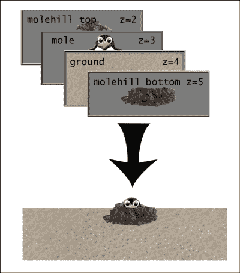
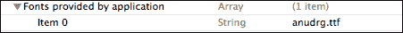
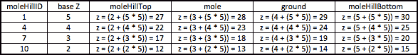
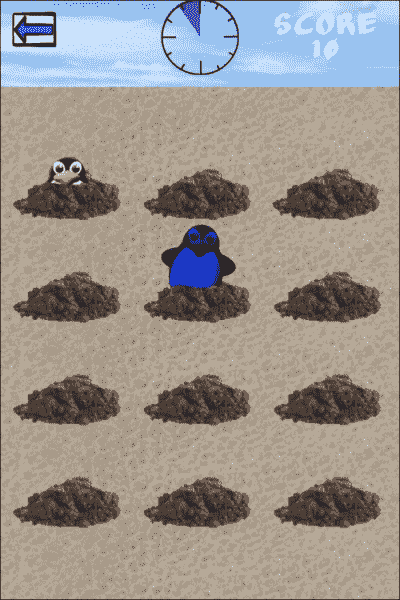

# 第三章. 欢乐地敲打地鼠

在本章中，我们将继续探索经典的游戏玩法风格。我们将简要讨论本章中解决设计挑战的不同方法。在游戏编程中，总是有解决同一问题的多种方法，没有唯一的正确答案。

在本章中，我们将涵盖：

+   使用 Z 排序欺骗眼睛

+   重复使用对象

+   检测精灵部分的触摸

+   动画和动作

+   随机对象

# 该项目是……

在本章中，我们将构建一个敲打地鼠游戏。受过去机械游戏的启发，我们将在屏幕上构建地鼠丘，并随机让动画地鼠伸出头来。玩家点击它们来得分。概念简单，但在这个看似简单的游戏中有一些具有挑战性的设计考虑。为了让这个游戏有点不同，我们将使用企鹅而不是地鼠作为图形，但我们将继续在整个过程中使用地鼠术语，因为地鼠丘比企鹅丘更容易考虑。

## 设计方法

在深入代码之前，让我们先讨论一下游戏的设计。首先，我们需要在屏幕上有地鼠丘。为了美观，地鼠丘将排列成 3 x 4 的网格。另一种方法可能是使用随机的地鼠丘位置，但在 iPhone 有限的屏幕空间上这并不真正有效。地鼠将从地鼠丘中随机出现。每个地鼠都会升起，暂停，然后落下。我们需要触摸处理来检测何时触摸到地鼠，并且那个地鼠需要增加玩家的分数然后消失。

我们如何让地鼠从地下升起？如果我们假设地面是一个大精灵，地鼠丘画在上面，我们就需要确定从哪个“槽”让地鼠出现，并且以某种方式在地鼠低于那个槽时使其消失。一种方法是调整地鼠显示帧的大小，通过裁剪图像的底部，使地面以下的部分不可见。这需要作为每个更新周期中每个地鼠在整个游戏中的部分来完成。从编程的角度来看，这将有效，但你可能会遇到性能问题。另一个考虑因素是，如果我们用直线裁剪精灵，这通常意味着地鼠丘的洞将始终看起来是一个直边洞，这缺乏我们希望在这款游戏中拥有的有机感。

我们将采取的方法是使用 Z 排序来欺骗眼睛，使其看到当所有内容实际上都在交错 Z 排序时，我们看到的是一个平坦的游乐场。我们将创建一个“阶梯”板，每行地鼠丘上都有多个“三明治”式的图形。



对于“阶梯”的每一个“步骤”，我们按照 Z 排序的元素顺序，从后往前有一个三明治，包括：土丘顶部、鼹鼠、地面和土丘底部。我们需要确保一切对齐，以便土丘顶部的图形与下一个“步骤”的地面在屏幕顶部进一步重叠。这样在视觉上就能包含鼹鼠，使其看起来是从土丘内部出现的。

我们故意跳过了 Z 值为 1，以提供额外的扩展空间，以防我们以后决定需要“三明治”中的另一个元素。如果我们在增强设计时担心改变一切，留下这样的小洞更容易。因此，在我们的布局中，我们将它视为五个 Z 值的“三明治”，尽管我们只使用了四个元素。

正如我们所说的，我们需要这是一个“阶梯”板。因此，对于每一排土丘，从屏幕顶部到底部，我们需要增加层之间的 Z 排序以完成这种错觉。这是必要的，以便每个鼹鼠实际上会穿过屏幕顶部更靠近的地面层，但在它自己的层“三明治”中会完全隐藏在地面层后面。

## 设计生成

这涵盖了游戏的物理设计，但还有一个额外的设计方面我们需要讨论：鼹鼠的生成。我们需要在需要将鼹鼠放入游戏时生成鼹鼠。正如我们之前回顾了两种解决隐藏鼹鼠问题的方法，我们也会涉及到两种鼹鼠生成的方法。

第一种方法（也是最常见的方法）是在每次需要鼹鼠时从头开始创建一个新的鼹鼠。当你用完它后，你销毁它。这对于对象数量较少或更有限复杂性的游戏来说效果很好，但在短时间内创建和销毁大量对象会有性能损失。严格来说，我们的鼹鼠敲击游戏可能会用这种方法工作得很好。尽管我们将会不断地创建和销毁很多鼹鼠，但我们只有十二个可能的鼹鼠，而不是数百个。

另一种方法是创建一个生成池。这基本上是在启动时创建的一定数量的对象。当你需要鼹鼠时，在我们的例子中，你向池请求一个未使用的“空白鼹鼠”，设置所需的任何参数，并使用它。当你用完它后，你将其重置回“空白鼹鼠”状态，然后它回到池中。

对于我们的游戏，生成池可能比所需的编码更复杂，因为我们怀疑我们不会在这个相对简单的游戏中遇到任何性能问题。尽管如此，如果你愿意像我们这样构建额外的代码，它确实为以后添加更多性能密集型效果提供了一个坚实的基础。

为了阐明我们的设计方法，我们将实际实现传统孵化池的一种变体。而不是一个普通的地鼠池，我们将构建“空白地鼠”对象，并将它们附加到它们的小山丘上。一个更传统的孵化池可能有六个“空白地鼠”在池中，当需要时分配给小山丘。这两种方法都是完全有效的。

## 竖屏模式

cocos2d 支持的默认方向是横屏模式，这在游戏中更常用。然而，我们希望我们的游戏在竖屏模式下。要实现这一点，更改非常简单。如果你在 **项目导航器** 窗格（所有文件都列在这里）中单击一次项目名称（蓝色图标），然后单击 **TARGETS** 下的你的游戏名称，你会看到 **摘要** 窗格。在 **支持的界面方向** 下，选择 **竖屏**，并取消选择 **横屏左** 和 **横屏右**。这将使你的项目变为竖屏。我们需要对 cocos2d 模板代码进行的一个调整是在 `IntroLayer.m` 中。在它将背景设置为 `Default.png` 之后，有一个旋转背景的命令。删除或注释掉这一行，一切都会正常工作。

## 自定义 TTF 字体

在这个项目中，我们将使用自定义的 TTF 字体。在 cocos2d 1.x 中，你可以简单地添加字体到你的项目中并使用它。在使用的 cocos2d 2.0 中，我们必须采取稍微不同的方法。我们将字体添加到我们的项目中（我们使用 `anudrg.ttf`）。然后我们编辑项目的 `Info.plist`，并向列表中添加一个新的键，如下所示：



这告诉项目我们需要了解这个字体。要实际使用这个字体，我们需要用字体的正确名称来调用它，而不是文件名。要找出这个名称，在 **Finder** 中选择文件并选择 **文件信息**。在信息框中，有一个 **全名** 的条目。在我们的例子中，文件名是 `AnuDaw`。每次我们用 `CCLabelTTF` 创建标签时，我们只需将这个名称用作字体名称，一切就会完美工作。

# 定义小山丘

我们已经创建了一个 `CCNode` 的新子类来表示 `MXMoleHill` 对象。是的，我们将使用 `CCNode` 的子类，而不是 `CCSprite` 的子类。尽管我们最初会考虑地鼠丘是一个精灵，但回顾我们的设计，它实际上由 *两个* 精灵组成，一个用于山丘的顶部，一个用于底部。我们将使用 `CCNode` 作为容器，然后在这个 `MXMoleHill` 类中作为变量包含两个 `CCSprite` 对象。

**文件名:** `MXMoleHill.h`

```swift
@interface MXMoleHill : CCNode {

  NSInteger moleHillID;
  CCSprite *moleHillTop;
  CCSprite *moleHillBottom;
  NSInteger moleHillBaseZ;
  MXMole *hillMole;
  BOOL isOccupied;
}

@property (nonatomic, assign) NSInteger moleHillID;
@property (nonatomic, retain) CCSprite *moleHillTop;
@property (nonatomic, retain) CCSprite *moleHillBottom;
@property (nonatomic, assign) NSInteger moleHillBaseZ;
@property (nonatomic, retain) MXMole *hillMole;
@property (nonatomic, assign) BOOL isOccupied;

@end
```

如果这对你来说似乎相当稀疏，它确实是。因为我们将使用它作为定义小山丘的所有内容的容器，所以我们不需要覆盖标准 `CCNode` 类的任何方法。同样，`@implementation` 文件只包含这些变量的 `@synthesize` 语句。

值得指出的是，我们本可以使用 `CCSprite` 对象作为 `hillTop` 精灵，将 `hillBottom` 对象作为该精灵的子对象，达到相同的效果。然而，我们更喜欢保持对象结构的统一性，因此我们选择了之前提到的结构。这允许我们以完全相同的方式引用这两个精灵，因为它们都是同一个父对象的子对象。

## 构建地鼠

当我们开始构建游戏场时，我们将为每个山创建“空白地鼠”对象，因此在我们构建游戏场之前需要查看 `MXMole` 类。遵循与 `MXMoleHill` 类相同的决策，`MXMole` 类也是一个 `CCNode` 的子类。

**文件名：** `MXMole.h`

```swift
#import <Foundation/Foundation.h>
#import "cocos2d.h"
#import "MXDefinitions.h"
#import "SimpleAudioEngine.h"

// Forward declaration, since we don't want to import it here
@class MXMoleHill;

@interface MXMole : CCNode <CCTargetedTouchDelegate> {
  CCSprite *moleSprite;  // The sprite for the mole
    MXMoleHill *parentHill;  // The hill for this mole
  float moleGroundY;  // Where "ground" is
    MoleState _moleState; // Current state of the mole
    BOOL isSpecial; // Is this a "special" mole?
}

@property (nonatomic, retain) MXMoleHill *parentHill;
@property (nonatomic, retain) CCSprite *moleSprite;
@property (nonatomic, assign) float moleGroundY;
@property (nonatomic, assign) MoleState moleState;
@property (nonatomic, assign) BOOL isSpecial;

-(void) destroyTouchDelegate;

@end
```

我们在这里看到了一个前置声明（`@class` 语句）。使用前置声明可以避免创建循环，因为 `MXMoleHill.h` 文件需要导入 `MXMole.h`。在我们的情况下，`MXMole` 需要知道存在一个名为 `MXMoleHill` 的有效类，因此我们可以在 `parentHill` 实例变量中存储一个 `MXMoleHill` 对象的引用，但实际上我们不需要导入该类。`@class` 声明是给编译器的一个指令，表明存在一个名为 `MXMoleHill` 的有效类，但在编译 `MXMole` 类时并不实际导入头文件。如果我们需要在 `MXMole` 类中调用 `MXMoleHill` 的方法，我们可以在 `MXMole.m` 文件中放置实际的 `#import "MXMoleHill.h"` 行。对于我们的当前项目，我们只需要知道类的存在，因此我们不需要在 `MXMole.m` 文件中添加那额外的行。

我们为 `MoleState` 构建了一个简单的状态机。现在我们已经审查了 `MXMole.h` 文件，我们对地鼠的构成有一个基本的了解。它跟踪地鼠的状态（死亡、活着等），它保留对其父山的引用，并且它有一个 `CCSprite` 作为子对象，实际的地鼠精灵变量将保存在那里。还有一些其他变量（`moleGroundY` 和 `isSpecial`），但我们稍后再处理这些。

**文件名：** `MXDefinitions.h`

```swift
typedef enum {
    kMoleDead = 0,
    kMoleHidden,
    kMoleMoving,
    kMoleHit,
    kMoleAlive
} MoleState;

#define SND_MOLE_NORMAL @"penguin_call.caf"
#define SND_MOLE_SPECIAL @"penguin_call_echo.caf"
#define SND_BUTTON @"button.caf"
```

与上一章不同，我们在这个头文件中没有使用 `typedef enum` 来定义 `MoleState` 类型。我们已经将定义移动到了 `MXDefinitions.h` 文件中，这有助于保持代码的略微整洁。您可以将这些“通用”定义存储在一个单独的头文件中，并在需要它们的任何 `.h` 或 `.m` 文件中包含该头文件，而无需仅为了访问这些定义而导入类。`MXDefinitions.h` 文件只包含定义；没有 `@interface` 或 `@implementation` 部分，也没有相关的 `.m` 文件。

# 制作地鼠山

我们已经有了地鼠山类，我们也看到了地鼠类，现在我们可以看看在 `MXPlayfieldLayer` 类中我们是如何实际构建地鼠山的：

**文件名：** `MXPlayfieldLayer.m`

```swift
-(void) drawHills {
    NSInteger hillCounter = 0;
    NSInteger newHillZ = 6;

    // We want to draw a grid of 12 hills
    for (NSInteger row = 1; row <= 4; row++) {
        // Each row reduces the Z order
        newHillZ--;
        for (NSInteger col = 1; col <= 3; col++) {
            hillCounter++;

            // Build a new MXMoleHill
            MXMoleHill *newHill = [[MXMoleHill alloc] init];
            [newHill setPosition:[self
                hillPositionForRow:row andColumn:col]];
            [newHill setMoleHillBaseZ:newHillZ];
            [newHill setMoleHillTop:[CCSprite
                spriteWithSpriteFrameName:@"pileTop.png"]];
            [newHill setMoleHillBottom:[CCSprite
                spriteWithSpriteFrameName:@"pileBottom.png"]];
            [newHill setMoleHillID:hillCounter];

            // We position the two moleHill sprites so 
            // the "seam" is at the edge.  We use the
            // size of the top to position both, 
            // because the bottom image
            // has some overlap to add texture
            [[newHill moleHillTop] setPosition:
                ccp(newHill.position.x, newHill.position.y +
                [newHill moleHillTop].contentSize.height
                    / 2)];
            [[newHill moleHillBottom] setPosition:
                ccp(newHill.position.x, newHill.position.y - 
                [newHill moleHillTop].contentSize.height
                    / 2)];

            //Add the sprites to the batch node
            [molesheet addChild:[newHill moleHillTop]
                              z:(2 + (newHillZ * 5))];
            [molesheet addChild:[newHill moleHillBottom]
                              z:(5 + (newHillZ * 5))];

            //Set up a mole in the hill
            MXMole *newMole = [[MXMole alloc] init];
            [newHill setHillMole:newMole]; 
            [[newHill hillMole] setParentHill:newHill]; 
            [newMole release];

            // This flatlines the values for the new mole
            [self resetMole:newHill];

            [moleHillsInPlay addObject:newHill];
            [newHill release];
        }
    }
}
```

这是一个相当密集的方法，所以我们将分部分进行讲解。我们首先创建两个嵌套的`for`循环，以便我们可以遍历每个可能的行和列位置。为了清晰起见，我们给循环变量命名为`row`和`column`，这样我们就可以知道每个代表什么。如果您还记得设计，我们决定使用一个 3x4 的网格，因此我们将有三个列和四个行的土丘。我们使用`alloc`/`init`创建一个新的土丘，然后开始填充变量。我们设置一个 ID 号码（1 到 12），并构建`CCSprite`对象来填充`moleHillTop`和`moleHillBottom`变量。

**文件名:** `MXPlayfieldLayer.m`

```swift
-(CGPoint) hillPositionForRow:(NSInteger)row
                    andColumn:(NSInteger)col {
    float rowPos = row * 82;
    float colPos = 54 + ((col - 1) * 104);
    return ccp(colPos,rowPos); 
}
```

我们还使用辅助方法`hillPositionForRow:andColumn:`设置位置，该方法为每个土丘返回一个`CGPoint`。重要的是要记住，`ccp`是 cocos2d 对`CGPoint`的简写术语，它们在您的代码中可以互换使用。这些计算是基于对布局的实验，以创建既易于绘制又具有视觉吸引力的网格。

需要额外解释的一个变量是`moleHillBaseZ`。这表示这个土丘属于 Z 顺序阶梯设计的哪个“步骤”。我们使用这个变量来帮助计算整个游戏场上的正确 Z 顺序。如果您还记得，我们在元素堆叠的插图中使用从 2 到 5 的 Z 顺序。当我们把`moleHillTop`和`moleHillBottom`作为`moleSheet`（我们的`CCSpriteBatchNode`）的子节点添加时，我们将三明治部分的 Z 顺序加到“基础 Z”乘以 5。我们将使用 5 作为屏幕底部的堆叠的基础 Z，并在屏幕顶部使用 2 作为基础 Z。如果我们查看以下图表，这将更容易理解原因，该图表显示了我们对每行土丘使用的计算：



当我们在屏幕底部开始构建我们的土丘时，我们首先从较高的 Z 顺序开始。在先前的图表中，您将看到第 4 个洞中的土丘（从底部数起的第二行土丘）将有一个 Z 顺序为 23。这将使其位于自己的地面层之后，该地面层的 Z 顺序为 24，但位于屏幕上更高的地面之前，其 Z 顺序为 19。

值得注意的是，由于我们的设计中有一个土丘网格，因此同一行中的所有土丘的 Z 顺序都将相同。这就是为什么`baseHillZ`变量的递减只在我们遍历新行时发生。

如果我们回顾一下`drawHills`方法本身，我们也会看到对`moleHillTop`和`moleHillBottom`精灵实际位置的巨大计算。我们希望这两个精灵之间的“接缝”位于它们堆叠的地面图像的顶部边缘，所以我们根据`MXMoleHill`对象的位置设置`y`位置。一开始可能看起来像是一个错误，因为两个`setPosition`语句都使用了`moleHillTop`精灵的`contentSize`作为计算的一部分。这是故意的，因为我们在这两个精灵之间有一点锯齿状的重叠，以使其感觉更加自然。

总结`drawHills`方法，我们分配一个新的`MXMole`对象，将其分配给刚刚创建的土丘，并在对象本身中设置交叉引用的`hillMole`和`parentHill`变量。我们将土丘添加到我们的`moleHillsInPlay`数组中，并通过释放`newHill`和`newMole`对象来清理一切。因为数组保留了对土丘的引用，而土丘保留了对蚯蚓的引用，所以我们可以在这个方法中安全地释放`newHill`和`newMole`对象。

## 绘制地面

现在我们已经了解了 Z 排序的“技巧”，我们应该看看`drawGround`方法，看看我们如何以类似的方式完成 Z 排序：

**文件名：** `MXPlayfieldLayer.m`

```swift
-(void) drawGround {
    // Randomly select a ground image
    NSString *groundName;
    NSInteger groundPick = CCRANDOM_0_1() * 2;

    switch (groundPick) {
        case 1:
            groundName = @"ground1.png";
            break;
        default: // Case 2 also falls through here
            groundName = @"ground2.png";
            break;
    }

    // Build the strips of ground from the selected image
    for (int i = 0; i < 5; i++) {
        CCSprite *groundStrip1 = [CCSprite
                spriteWithSpriteFrameName:groundName];
        [groundStrip1 setAnchorPoint:ccp(0.5,0)];
        [groundStrip1 setPosition:ccp(size.width/2,i*82)];
        [molesheet addChild:groundStrip1 z:4+((5-i) * 5)];
    }

    // Build a skybox
    skybox = [CCSprite
              spriteWithSpriteFrameName:@"skybox1.png"];
    [skybox setPosition:ccp(size.width/2,5*82)];
    [skybox setAnchorPoint:ccp(0.5,0)];
    [molesheet addChild:skybox z:1];
}
```

这种格式应该对你来说很熟悉。我们为地面的五条条纹创建五个`CCSprite`对象，从屏幕底部到顶部进行平铺，并将 Z 排序设置为`z:4+((5-i) * 5)`。我们包括了一个随机化器，使用两种不同的背景图像，并在屏幕顶部包括一个天空盒图像，因为我们想在蚯蚓敲击区域上方有一种地平线的感觉。

我们在第一章中简要地看到了`anchorPoints`，*感谢记忆游戏*，但我们应该在这里重新审视它们，因为它们将在后续的项目中变得更加重要。`anchorPoint`是基本上是精灵的“中心”的点。可接受的值是介于 0 和 1 之间的浮点数。对于 x 轴，`anchorPoint`为 0 是左边缘，1 是右边缘（0.5 是居中）。对于 y 轴，`anchorPoint`为 0 是底部边缘，1 是顶部边缘。这个`anchorPoint`在这里很重要，因为那个`anchorPoint`是对象上`setPosition`方法将引用的点。所以在我们的代码中，第一个创建的`groundStrip1`将锚定在底部中心。当我们调用`setPosition`时，传递给`setPosition`的坐标需要与那个`anchorPoint`相关联；设置的位置将是精灵的底部中心。如果你对此仍然感到模糊，改变你自己的`CCSprite`对象的`anchorPoint`是一个很好的练习，看看屏幕上会发生什么。

# 蚯蚓生成

我们还没有详细看到“三明治”元素中的唯一部分就是蚯蚓本身，所以让我们看看蚯蚓生成方法，看看蚯蚓是如何与我们的设计相适应的：

**文件名：** `MXPlayfieldLayer.m`

```swift
-(void) spawnMole:(id)sender {
  // Spawn a new mole from a random, unoccupied hill
  NSInteger newMoleHill;
  BOOL isApprovedHole = FALSE;
  NSInteger rand;
  if (molesInPlay == [moleHillsInPlay count] ||
        molesInPlay == maxMoles) {
    // Holes full, cannot spawn a new mole
  } else {
    // Loop until we pick a hill that isn't occupied
    do {
      rand = CCRANDOM_0_1() * maxHills;

      if (rand > maxHills) { rand = maxHills; }

            MXMoleHill *testHill = [moleHillsInPlay
                                    objectAtIndex:rand];

            // Look for an unoccupied hill
      if ([testHill isOccupied] == NO) {
        newMoleHill = rand;
        isApprovedHole = YES;
        [testHill setIsOccupied:YES];
      }
    } while (isApprovedHole == NO);

    // Mark that we have a new mole in play
    molesInPlay++;

    // Grab a handle on the mole Hill 
    MXMoleHill *thisHill = [moleHillsInPlay
                        objectAtIndex:newMoleHill];

    NSInteger hillZ = [thisHill moleHillBaseZ];

    // Set up the mole for this hill
    CCSprite *newMoleSprite = [CCSprite
             spriteWithSpriteFrameName:@"penguin_forward.png"];

    [[thisHill hillMole] setMoleSprite:newMoleSprite];		
    [[thisHill hillMole] setMoleState:kMoleAlive];

    // We keep track of where the ground level is
    [[thisHill hillMole] setMoleGroundY:
                                thisHill.position.y];

    // Set the position of the mole based on the hill
    float newMolePosX = thisHill.position.x;
    float newMolePosY = thisHill.position.y - 
        (newMoleSprite.contentSize.height/2);

    [newMoleSprite setPosition:ccp(newMolePosX,
                                       newMolePosY)];

    // See if we need this to be a "special" mole
    NSInteger moleRandomizer = CCRANDOM_0_1() * 100;

    // If we randomized under 5, make this special
    if (moleRandomizer < 5) {
            [[thisHill hillMole] setIsSpecial:YES];
    }

    //Trigger the new mole to raise
    [molesheet addChild:newMoleSprite
                          z:(3 + (hillZ * 5))];
    [self raiseMole:thisHill];
  }
}
```

我们首先检查确保每个地鼠坑中都没有活跃的地鼠，并且我们没有达到我们希望在屏幕上同时显示的最大地鼠数量（`maxMoles`变量）。如果我们有足够的地鼠，我们就跳过循环的其余部分。如果我们需要一个新地鼠，我们进入一个`do…while`循环，该循环将随机选择一个地鼠坑并检查它是否将`isOccupied`变量设置为`NO`（即，这个地鼠坑中没有活跃的地鼠）。如果随机数生成器选择了一个已经被占据的地鼠坑，`do…while`循环将选择另一个地鼠坑并再次尝试。当我们找到一个未被占据的地鼠坑时，代码将跳出循环并开始设置地鼠。

如我们之前所见，每个地鼠坑已经附有一个“空白地鼠”。在这个阶段，我们构建一个新的精灵并将其附加到`MXMole`的`moleSprite`变量上，将`moleState`更改为`kMoleAlive`，并设置地鼠开始的位置坐标。我们希望地鼠从地下（被地面图像隐藏）开始，因此我们将地鼠的`y`位置设置为地鼠坑的位置减去地鼠的高度。

一旦我们设置了地鼠，我们就为这个地鼠分配我们计算出的 Z 顺序（基于我们之前为每个地鼠坑存储的`moleHillBaseZ`变量），并调用`raiseMole`方法，该方法控制地鼠的动画和移动。

## 特殊地鼠

我们已经看到了两次对`MXMole`类中的`isSpecial`变量的引用，因此现在是解释其使用方法的好时机。为了打破游戏的重复性，我们增加了一个“特殊地鼠”功能。当请求在`spawnMole`方法中生成新的地鼠时，我们生成一个介于 1 到 100 之间的随机数。如果得到的数字小于五，则将该地鼠的`isSpecial`标志设置为 true。这意味着大约 5%的时间玩家将获得一个特殊地鼠。我们的特殊地鼠使用与标准地鼠相同的图形，但当我们玩游戏时，我们会让它们闪烁彩虹般的多彩颜色。这是一个小小的不同，但足以设置计分系统，为“特殊地鼠”提供额外积分。为了实现这个特殊地鼠，我们只需要调整三个逻辑区域的编码：

+   当`raiseMole`设置地鼠的动作（使其变得闪亮）

+   当我们击中地鼠（播放不同的音效）

+   当我们得分（获得更多积分）

这是一个非常小的任务，但正是游戏中的这些小变化会吸引玩家进一步参与。让我们看看游戏中带有特殊地鼠的场景：



## 移动地鼠

当我们调用`raiseMole`方法时，我们构建了所有鼹鼠的行为。我们需要的绝对最小行为是将鼹鼠从山上抬起来，然后再放下来。对于我们的游戏，我们希望给行为添加一点随机性，这样我们就不至于每次看到鼹鼠都做完全相同的动作。我们通过结合预制的动画和动作来实现我们的结果。因为我们之前没有使用过任何`CCAnimate`调用，所以我们首先来谈谈它们。

## 动画缓存

Cocos2d 有许多有用的缓存来存储频繁使用的数据。当我们使用`CCSpriteBatchNode`时，我们通过名称使用`CCSpriteFrameCache`来存储我们需要的所有精灵。同样有用的是`CCAnimationCache`。它使用起来很简单。你将动画构建为一个`CCAnimation`，然后以你喜欢的任何名称将其加载到`CCAnimationCache`中。

当你想使用你的命名动画时，你可以创建一个直接从`CCAnimationCache`加载的`CCAnimate`动作。唯一的注意事项是，如果你将两个具有相同名称的动画加载到缓存中，它们将在缓存中发生冲突，第二个将替换第一个。

对于我们的项目，我们在`init`方法中通过调用`buildAnimations`方法预加载动画。这里我们只使用一个动画，但你可以在缓存中提前预加载你需要的任意多个。

**文件名：** `MXPlayfieldLayer.m`

```swift
-(void) buildAnimations {
    // Load the Animation to the CCSpriteFrameCache
    NSMutableArray *frameArray = [NSMutableArray array];

    // Load the frames
    [frameArray addObject:[[CCSpriteFrameCache
            sharedSpriteFrameCache]
            spriteFrameByName:@"penguin_forward.png"]];
    [frameArray addObject:[[CCSpriteFrameCache
            sharedSpriteFrameCache]
            spriteFrameByName:@"penguin_left.png"]];
    [frameArray addObject:[[CCSpriteFrameCache
            sharedSpriteFrameCache]
            spriteFrameByName:@"penguin_forward.png"]];
    [frameArray addObject:[[CCSpriteFrameCache
            sharedSpriteFrameCache]
            spriteFrameByName:@"penguin_right.png"]];
    [frameArray addObject:[[CCSpriteFrameCache
            sharedSpriteFrameCache]
            spriteFrameByName:@"penguin_forward.png"]];
    [frameArray addObject:[[CCSpriteFrameCache
            sharedSpriteFrameCache]
            spriteFrameByName:@"penguin_forward.png"]];

    // Build the animation
    CCAnimation *newAnim = [CCAnimation
            animationWithSpriteFrames:frameArray delay:0.4];

    // Store it in the cache
    [[CCAnimationCache sharedAnimationCache]
            addAnimation:newAnim name:@"penguinAnim"];
}
```

我们只有三帧独特的动画，但我们将它们多次加载到`frameArray`中，以适应我们想要的动画。我们从`frameArray`创建一个`CCAnimation`对象，然后将其以名称`penguinAnim`提交到`CCAnimationCache`中。现在我们已经将其加载到缓存中，我们可以在任何需要的地方通过请求`CCAnimationCache`来引用它，就像这样：

```swift
[[CCAnimationCache sharedAnimationCache]
                  animationByName:@"penguinAnim"]]
```

# 结合动作和动画

对于鼹鼠的行为，我们将同时结合动作和动画，以给游戏增添更多的生命力。总的来说，我们为普通鼹鼠定义了六种行为，以及一种特殊鼹鼠的特定行为。

**文件名：** `MXPlayfieldLayer.m`

```swift
-(void) raiseMole:(MXMoleHill*)aHill {
  // Grab the mole sprite
  CCSprite *aMole = [[aHill hillMole] moleSprite];

    float moleHeight = aMole.contentSize.height;

  // Define the hole wobble/jiggle
  CCMoveBy *wobbleHillLeft = [CCMoveBy
            actionWithDuration:.1 position:ccp(-3,0)];
  CCMoveBy *wobbleHillRight =[CCMoveBy
            actionWithDuration:.1 position:ccp(3,0)];
  // Run the actions for the hill
  [[aHill moleHillBottom] runAction:
            [CCSequence actions:wobbleHillLeft,
             wobbleHillRight, wobbleHillLeft,
             wobbleHillRight, nil]];

  // Define some mole actions.
    // We will only use some of them on each mole
  CCMoveBy *moveUp = [CCMoveBy
            actionWithDuration:moleRaiseTime
            position:ccp(0,moleHeight*.8)];
  CCMoveBy *moveUpHalf = [CCMoveBy
            actionWithDuration:moleRaiseTime
            position:ccp(0,moleHeight*.4)];
  CCDelayTime *moleDelay = [CCDelayTime
            actionWithDuration:moleDelayTime];
  CCMoveBy *moveDown = [CCMoveBy
            actionWithDuration:moleDownTime
            position:ccp(0,-moleHeight*.8)];
  CCCallFuncND *delMole = [CCCallFuncND
            actionWithTarget:self
            selector:@selector(deleteMole:data:)
            data:(MXMoleHill*)aHill];
    CCAnimate *anim = [CCAnimate
            actionWithAnimation:[[CCAnimationCache
            sharedAnimationCache]
            animationByName:@"penguinAnim"]];
    CCRotateBy *rot1 = [CCRotateBy
            actionWithDuration:moleDelayTime/3 angle:-20];
    CCRotateBy *rot2 = [CCRotateBy
            actionWithDuration:moleDelayTime/3 angle:40];
    CCRotateBy *rot3 = [CCRotateBy
            actionWithDuration:moleDelayTime/3 angle:-20];

    // We have 6 behaviors to choose from. Randomize.
    NSInteger behaviorPick = CCRANDOM_0_1() * 6;

    // If this is a special mole, let's control him better
    if ([aHill hillMole].isSpecial) {

        // Build some more actions for specials
        CCTintTo *tintR = [CCTintTo actionWithDuration:0.2
                        red:255.0 green:0.2 blue:0.2];
        CCTintTo *tintB = [CCTintTo actionWithDuration:0.2
                        red:0.2 green:0.2 blue:255.0];
        CCTintTo *tintG = [CCTintTo actionWithDuration:0.2
                        red:0.2 green:255.0 blue:0.2];

        // Set a color flashing behavior
        [aMole runAction:[CCRepeatForever
                actionWithAction:[CCSequence actions:
                tintR, tintB, tintG, nil]]];
        // Move up and down and rotate/wobble
        [aMole runAction:[CCSequence actions:moveUp, rot1,
                rot2, rot3, rot1, rot2, rot3, moveDown,
                delMole, nil]];
    } else {
        switch (behaviorPick) {
            case 1:
                // Move up and down and rotate/wobble
                [aMole runAction:[CCSequence actions:
                    moveUp, rot1, rot2, rot3, moveDown,
                    delMole, nil]];
                break;
            case 2:
                // Move up and then down without pausing
                [aMole runAction:[CCSequence actions:
                    moveUp, moveDown, delMole, nil]];
                break;
            case 3:
                // Move up halfway and then down
                [aMole runAction:[CCSequence actions:
                    moveUpHalf, moleDelay, moveDown,
                    delMole, nil]];
                break;
            case 4:
                // Move up halfway and then down, no pause
                [aMole runAction:[CCSequence actions:
                    moveUpHalf, moveDown, delMole, nil]];
                break;
            case 5:
                // Move up halfway, look around, then down
                [aMole runAction:[CCSequence actions:
                    moveUpHalf, anim, moveDown, delMole,
                    nil]];
                break;
            default:
                // Play the look around animation
                [aMole runAction:anim];
                // Move up and down
                [aMole runAction:[CCSequence actions:
                    moveUp, moleDelay, moveDown, delMole,
                    nil]];
                break;
        }
    }
}
```

这种方法通过一个大的捷径来避免重复代码。我们为标准鼹鼠定义了九个独立的行为，尽管我们不会在同一个鼹鼠上使用它们全部。我们这样做是因为不同的行为之间有很多重叠，我们不希望重复相同的代码行。如果我们只看其中的两个动作，`moveUp`和`moveUpHalf`，一半的鼹鼠行为使用第一个，另一半使用第二个。而不是我们这里采取的路径，另一种选择是在这个方法中包含七个单独的`CCMoveBy`定义来适应六个正常的鼹鼠向上移动行为加上特殊鼹鼠行为。表面上这并不是一个大问题，但如果我们要改变鼹鼠从`moveUp`动作中抬升的距离的行为，我们就必须在这四个地方进行更改。如果我们只在行为确定后定义必要的动作，这意味着我们需要维护 31 行代码，而不是我们当前的 9 行。如果性能没有负面影响，始终采取可维护的方法是一个好主意。

我们也在这种方法中定义了特殊的鼹鼠行为。如果设置了`isSpecial`标志，我们将使用一组行为，分为两个不同的动作。`CCRepeatForever`动作会循环我们的着色，将鼹鼠染成红色，然后蓝色，接着绿色。同时，我们也在运行`CCSequence`的`moveUp`动作，左右旋转几次，然后再将其向下移动。

对于标准鼹鼠，我们在`switch`语句的默认部分使用类似的并行动作。我们播放动画（命名为`anim`），这不会影响由第二个`runAction`执行的上下移动。

## 同时动作

这种同时运行多个动作的做法会让新开发者感到困惑。有些动作不能以这种方式并行运行。例如，同时尝试运行`CCMoveTo`和`CCMoveBy`只会运行第二个运行的动作。为什么？它们都在影响精灵的位置，因此是不兼容的。最后一个运行的动作“获胜”，前面的动作被丢弃。之前我们能够在运行`CCTintTo`的同时运行一个完整的`CCSequence`动作和旋转动作。这些其他命令都没有影响精灵的颜色，因此它们可以并行运行。

在开发更复杂的动作集时，重要的是评估期望的结果以及哪些动作可能会冲突。一个很好的经验法则是，你不能在同一时间在同一精灵上运行两个“相同”的动作。例如，如果你需要使用两个`CCMoveBy`语句，你可能需要用`CCSequence`将它们链接起来，以便它们按顺序运行，或者你需要修改你的逻辑以合并参数，这样你就可以创建一个整合了两个参数的单个`CCMoveBy`动作。

### 注意

最复杂的最终级别将是放弃动作以实现该行为，而是手动在您的 `update` 方法中更改位置。这很强大，但我们目前不需要深入研究。

## 删除地鼠

在所有地鼠动作结束时，调用了名为 `delMole` 的 `CCCallFuncND` 动作。`CCCallFuncND` 是一个非常强大的动作，同时它也非常简单。此动作用于调用任何选择器并向其传递任何数据对象。在我们的情况下，我们调用 `deleteMole:data:` 方法，并传递一个指向当前 `MXMoleHill` 的指针。使用 `CCCallFuncND`（及其类似兄弟 `CCCallFunc` 和 `CCCallFuncN`），您可以将其他方法集成到动作序列中。

**文件名:** `MXPlayfieldLayer.m`

```swift
-(void)deleteMole:(id)sender data:(MXMoleHill*)moleHill {
  molesInPlay--;
  [self resetMole:moleHill];
}
```

由于我们将“空白地鼠”模型实施到设计中，我们实际上并没有删除地鼠。我们减少计数器 `molesInPlay` 并调用方法将地鼠重置为“空白地鼠”。这就是我们在最初创建“空白地鼠”时调用的相同 `resetMole` 方法。

**文件名:** `MXPlayfieldLayer.m`

```swift
-(void) resetMole:(MXMoleHill*)moleHill {
  // Reset all mole-related values.
  // This allows us to keep reusing moles in the hills
  [[moleHill hillMole] stopAllActions];
  [[[moleHill hillMole] moleSprite]
                        removeFromParentAndCleanup:NO];
  [[moleHill hillMole] setMoleGroundY:0.0f];	  
  [[moleHill hillMole] setMoleState:kMoleDead];
  [[moleHill hillMole] setIsSpecial:NO];
  [moleHill setIsOccupied:NO];
}
```

当我们准备好将地鼠变成“空白地鼠”时，完全清理地鼠只需这样做。我们将所有内容重置为默认值，并移除附加到其上的精灵。

# 触摸地鼠

到目前为止，我们有了可以生成、动画化和重置的地鼠。那么真正的乐趣，地鼠的敲击呢？为此，我们查看 `MXMole.m` 文件，其中包含了所有地鼠触摸处理代码：

**文件名:** `MXMole.m`

```swift
#import "MXMole.h"

@implementation MXMole

@synthesize parentHill;
@synthesize moleSprite;
@synthesize moleGroundY;
@synthesize moleState = _moleState;
@synthesize isSpecial;

-(id) init {
    if(self = [super init]) {
            self.moleState = kMoleDead;
            [[[CCDirector sharedDirector] touchDispatcher]
                    addTargetedDelegate:self priority:0
                    swallowsTouches:NO];
    }
  return self;  
}

- (BOOL)ccTouchBegan:(UITouch *)touch withEvent:(UIEvent *)event {
    CGPoint location = [touch locationInView:[touch view]];
    CGPoint convLoc = [[CCDirector sharedDirector]
                       convertToGL:location];

    if (self.moleState == kMoleDead) {
        return NO;
    } else if (self.moleSprite.position.y +
               (self.moleSprite.contentSize.height/2)
               <= moleGroundY) {
    self.moleState = kMoleHidden;
    return NO;
  } else  {
        // Verify touch was on this mole and above ground
        if (CGRectContainsPoint(self.moleSprite.boundingBox,
                                convLoc) &&
            convLoc.y >= moleGroundY)
        {
            // Set the mole's state
            self.moleState = kMoleHit;

            // Play the "hit" sound
            if (isSpecial) {
                [[SimpleAudioEngine sharedEngine]
                        playEffect:SND_MOLE_SPECIAL];
            } else {
                [[SimpleAudioEngine sharedEngine]
                        playEffect:SND_MOLE_NORMAL];
            }
        }
        return YES;
    }
}

-(void) destroyTouchDelegate {
    [[[CCDirector sharedDirector] touchDispatcher]
                        removeDelegate:self];
}

@end
```

我们已将 `MXMole` 类注册为 `CCTouchDispatcher` 的目标代理。这意味着地鼠将单独通知每个触摸。由于我们正在寻找每个地鼠的单个触摸，这对我们的需求来说非常完美。我们在 `init` 方法中注册了它，并构建了匹配的 `destroyTouchDelgate` 方法，该方法在 `MXPlayfieldLayer` 的 `dealloc` 方法中被调用。如果我们不移除代理，地鼠将成为泄漏对象，并导致内存问题。

在本章开头对游戏设计进行审查时，我们讨论了使用 Z-顺序“技巧”使地鼠在进入地面图像后面消失的方法。如果我们就这样留下，将会有一个严重的游戏玩法缺陷。正常的触摸处理也会在地鼠被触摸在地面以下时接受触摸。我们如何解决这个问题？

修复这个问题是我们创建`moleGroundY`变量的原因。当我们生成一个新的鼹鼠时，我们将这个变量设置为与鼹鼠丘的`y`位置相匹配。由于我们还在放置鼹鼠丘图形时使用鼹鼠丘的`y`值，这代表了鼹鼠从地面出现的确切`y`位置。在我们的`MXMole`类中的`ccTouchBegan`方法内，我们只接受当鼹鼠被触摸且触摸的`y`值大于或等于`moleGroundY`位置时的触摸。这将有效地限制被触摸的鼹鼠部分仅限于地面以上的部分。（这不是像素级的完美，因为`moleHillBottom`精灵在“地平线”线以上有少量像素，但这种坐标变化非常小，不会影响游戏的可玩性）。

当触摸鼹鼠时，它将`moleState`变量更改为`kMoleHit`的值并播放声音。

# 综合起来

剩下只有两个重要的方法需要审查以将这些内容综合起来。首先是`update`方法。让我们看看`update`方法的相关部分（我们留下了`update`方法其他部分的占位符，但那些内容在这里不会讨论。请参考本书的代码包以查看这些细节）：

**文件名:** `MXPlayfieldLayer.m`

```swift
-(void)update:(ccTime)dt {

  for (MXMoleHill *aHill in moleHillsInPlay) {

    if (aHill.hillMole.moleState == kMoleHit) {
            [[aHill hillMole] setMoleState:kMoleMoving];
      [self scoreMole:[aHill hillMole]];
    }
  }

    if (molesInPlay < maxMoles && spawnRest > 10) {
        [self spawnMole:self];
        spawnRest = 0;
    } else {
        spawnRest++;
    }

    // Update the timer value & display
    // Protection against overfilling the timer

    // Update the timer visual

    // Game Over / Time's Up
}
```

在`update`方法的每次循环中，我们遍历`moleHillsInPlay`数组。我们检查每个鼹鼠，看是否有处于`kMoleHit`状态的鼹鼠。如果找到一个被击中的鼹鼠，我们将该鼹鼠的状态更改为`kMoleMoving`，并调用`scoreMole`方法。由于我们只在触摸处理程序中将`moleState`设置为`kMoleHit`，然后立即在我们第一次在这个循环中捕获它时将其更改为`kMoleMoving`，我们可以确保这是我们第一次（也是唯一一次）看到这个特定的计分事件。如果我们没有在这里更改`moleState`，那么每次`update`方法运行时都会触发`scoreMole`，游戏将陷入停滞。

`update`方法的第二部分控制新鼹鼠的生成。由于我们希望在创建新鼹鼠之间有一定的延迟，我们使用`spawnRest`变量作为计时器，在调用`spawnMole`之间至少留下 10 个更新循环。我们还确保在游戏中没有达到期望的最大鼹鼠数量。这两个简单的检查结合起来，提供了非常自然的生成感觉。玩家在等待鼹鼠生成时永远不会感到无聊，而且鼹鼠本身不会以任何同步的模式出现。

## 计分鼹鼠

我们没有讨论计分系统的细节，因为它非常简单。有一个名为`playerScore`的变量和一个显示该得分的标签。（有关计分的详细信息，请参阅本书的代码包。）在这个游戏中，“计分鼹鼠”更有趣的方面是我们展示计分的视觉方式。

**文件名:** `MXPlayfieldLayer.m`

```swift
-(void) scoreMole:(MXMole*)aMole {
  // Make sure we don't have a dead mole
  if (aMole.moleState == kMoleDead) {
    return;
  }

  // Get the hill
  MXMoleHill *aHill = [aMole parentHill];

    // Add the score
    if (aMole.isSpecial) {
        // Specials score more points
        playerScore = playerScore + 5;
        // You get 5 extra seconds, too
        [self addTimeToTimer:5];
    } else {
        // Normal mole.  Add 1 point.
        playerScore++;
    }

    // Update the score display
    [self updateScore];

    // Set up the mole's move to the score
    CCMoveTo *moveMole = [CCMoveTo actionWithDuration:0.2f
            position:[self scorePosition]];
    CCScaleTo *shrinkMole = [CCScaleTo
            actionWithDuration:0.2f scale:0.5f];
    CCSpawn *shrinkAndScore = [CCSpawn
            actionOne:shrinkMole two:moveMole];
    CCCallFuncND *delMole = [CCCallFuncND
            actionWithTarget:self
            selector:@selector(deleteMole:data:)
            data:(MXMoleHill*)aHill];

    [aHill.hillMole.moleSprite stopAllActions];
    [aHill.hillMole.moleSprite runAction:[CCSequence
            actions: shrinkAndScore, delMole,  nil]];
}
```

到现在为止，大部分代码应该看起来都很熟悉了。在进行“安全网”检查以防止获得无效的分数后，我们增加分数本身。在更新分数之后，我们构建一些新的动作来将鼹鼠移动到得分位置，将其缩小，并在完成后删除它。

在这里，我们看到一种之前未曾涉及的动作类型：`CCSpawn`。尽管名字如此，它与我们在游戏中构建的鼹鼠繁殖完全无关。相反，`CCSpawn`动作允许同时对同一目标执行两个动作。这与`CCSequence`的行为不同，后者会逐个运行动作。对于我们的用途，我们希望精灵同时移动并缩小 50%。`CCSpawn`有几个限制。第一个是它必须是一个有限间隔的动作。例如，不能在`CCSpawn`中使用`CCRepeatForever`动作。另一个限制是`CCSpawn`动作中的两个动作应该具有相同的持续时间。如果它们的持续时间不同，它将运行直到两个动作中较长的那个完成。考虑到这一点，我们将`CCMoveTo`和`CCScaleTo`动作的持续时间都设置为`0.2f`，以便移动和缩放既快又愉快。

# 摘要

我们已经克服了鼹鼠敲击游戏的挑战，并且完好无损地生存下来。在这一章中，我们介绍了一些有趣的概念。我们学习了如何使用 Z 排序来欺骗眼睛。我们创建了可重复使用的持久对象（鼹鼠）。我们还处理了使用`CCNode`实例作为其他对象的容器，无论是鼹鼠丘还是鼹鼠。我们花了相当多的时间讨论动作和动画，这两者都是成功 cocos2d 游戏设计的关键。

在下一章中，我们将探索一个蛇形游戏。从蛇吃老鼠到调整难度级别，这一章将涵盖一些熟悉的领域和一些新的领域。
