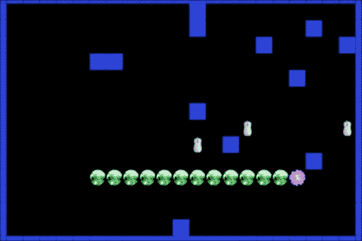

# 第四章：给蛇一份小吃……

游戏面向对象设计的一个挑战是如何构建完全统一的对象，使其能够满足游戏的需求。我们将带着这个重点来构建这个项目。玩家的主要类将尽可能自给自足。

在本章中，我们将涵盖：

+   覆盖方法

+   自包含的类

+   难度级别

+   级别进度的缩放

+   对象生命周期控制

# 该项目是……

本章将探讨一个经常被复制的游戏，它几乎出现在了所有可能的计算平台上，从早期的手机到当前的游戏机：蛇游戏。在各种各样的名称下有许多变体，但机制通常是相同的。你控制着一条始终向前移动的蛇。你可以将蛇向右或向左（仅限于直角）转动，避开墙壁并吃掉老鼠（或其他食物）。每次你吃掉东西，你的蛇就会变长。你可以继续吃（并成长），直到撞到墙壁或自己的尾巴。

## 设计方法

在蛇游戏中处理蛇的移动的“经典”方式是在蛇移动的方向上绘制一个新的身体段，并擦除末尾的一个。虽然这种方法可行，但我们希望在设计中使用更面向对象的方法。

我们将专注于让蛇尽可能自主。我们希望有一个`snake`类，我们可以简单地指示它移动，而`snake`对象将处理移动本身。`snake`类还将能够处理当我们传递“向左转”或“向右转”的消息时应该做什么。

级别应该生成带有可变数量的墙壁的游乐场内部，以及绘制屏幕边缘的外墙。最后，我们需要在游乐场上出现老鼠作为食物。这些老鼠应该有一个有限的生命周期，所以如果它们在给定时间内没有被吃掉，它们就会消失。当老鼠被吃掉或耗尽生命时，我们将用另一个来替换它。让我们看看它应该是什么样子：



我们还将建立三个难度级别，并为每个难度级别增加游戏关卡。由于游戏主要基于随机元素，我们需要在设置游戏中的变量元素（例如，高等级更快，有更多老鼠和更多墙壁）以及蛇的移动速度时使用难度和等级数字。这听起来并不太难，对吧？

# 打造更好的蛇

我们需要记住的第一件事是蛇的长度是可变的。蛇的长度可以从一个段到 100 个段（理论上——在我们的游戏中我们不会那么长）。正如我们在设计期间所说，蛇应该尽可能自主。考虑到这一点，让我们看看`SNSnake.h`文件，看看我们需要什么。

**文件名**：`FileSNSnake.h`

```swift
#import "SNSnakeSegment.h"

@class SNPlayfieldLayer;

@interface SNSnake : CCNode {

    SNPlayfieldLayer *parentLayer; // Parent layer
    NSMutableArray *snakebody; // Contains the snake
    NSInteger headRow; // Starting row for snake head
    NSInteger headColumn; // Starting col for snake head

    SnakeHeading _snakeDirection;  // Direction facing
    float _snakeSpeed; // Current rate of movement
}

@property (nonatomic, retain) NSMutableArray *snakebody;
@property (nonatomic, assign) SnakeHeading snakeDirection;
@property (nonatomic, assign) float snakeSpeed;

+(id) createWithLayer:(SNPlayfieldLayer*)myLayer
           withLength:(NSInteger)startLength;

-(void) addSegment;
-(void) move;
-(void) turnLeft;
-(void) turnRight;
-(void) deathFlash;

@end
```

我们需要跟踪蛇应该移动多快（`snakeSpeed`）以及它移动的方向（`snakeDirection`）。但这个`SnakeHeading`变量类型是什么？我们再次将我们的公共定义放在一个单独的定义文件中，`SNDefinitions.h`。尽管我们没有在这个头文件中导入该文件，但它被导入到`SNSnakeSegment.h`文件中，然后又在这里导入，因此我们可以自由使用它。`SnakeHeading`的定义如下：

**文件名**：`SNDefinitions.h`

```swift
typedef enum {
    kUp = 1,
    kRight,
    kLeft,
    kDown
} SnakeHeading;
```

`SnakeHeading`类型使用这四个方向值（实际上是整数）来跟踪蛇相对于游戏区域面向哪个方向。这比记住一个代表“向上”要容易得多。

整个蛇的身体，包括头部，将存储在`NSMutableArray` `snakeBody`中。这个数组将包含类型为`SNSnakeSegment`的对象，但我们不需要在头文件中提供这些具体信息。

值得指出的一点是，我们将一些变量声明为属性。为什么只声明一些，而不是全部呢？当你声明一个属性时，它可以从类外部访问。没有属性声明的变量只能在定义它的类内部使用。因此，在这里，我们知道我们希望主游戏区域能够使用`snakeSpeed`、`snakeDirection`和`snakeBody`，所以我们把这些声明为属性。

`headRow`和`headColumn`是方便的变量，用于跟踪蛇头在游戏网格中的起始位置。这些变量完全可以被删除，并直接硬编码起始值，但这样做允许我们轻松地重新定位蛇的起始位置，而无需在代码中查找要更改的值。

我们将在类内部处理所有段落的创建（使用`addSegment`方法），因此我们需要保留游戏层的引用。这个引用存储在`parentLayer`变量中，其类型为`SNPlayfieldLayer`。正如我们在第三章中讨论的那样，*有趣的敲击土拨鼠*，头文件顶部的`@class`声明告诉编译器“我们有一个名为`SNPlayfieldLayer`的类，但你现在只需要知道这些”。与我们在第三章中使用的前向声明不同，我们需要从该类中调用一个方法，因此我们将添加一行`#import "SNPlayfieldLayer.h"`到`SNSnake.m`文件中。

我们还在头文件中提供了几个公开的方法。这些都应该相当容易理解。我们需要指出一个类方法，`createWithLayer: withLength:`。在早期章节中，我们经常采用使用默认的 `init` 结构，并在对象实例化后填充变量。虽然这确实可行，但通常更干净的做法是构建自己的类方法，以确保不会遗漏任何必需的参数。这种方法还允许我们追求在这个游戏中使蛇尽可能自包含的目标。

## 蛇段的解剖结构

在我们深入 `SNSnake` 的实现之前，让我们将注意力转向 `SNSnakeSegment`。这是将代表蛇的每个部分（包括头部和身体）的对象。这个类是 `CCSprite` 的一个基本未修改的子类，但我们将对其行为进行一个小而重要的修改。

**文件名**：`SNSnakeSegment.h`

```swift
@interface SNSnakeSegment : CCSprite {
    CGPoint _priorPosition; 
    SNSnakeSegment *_parentSegment; 
}

@property (nonatomic, assign) CGPoint priorPosition;
@property (nonatomic, assign) SNSnakeSegment *parentSegment;

@end
```

我们创建了一个名为 `priorPosition` 的属性，这是这个精灵在最后一次移动之前的所在位置。我们还保留了一个 `parentSegment` 属性。`parentSegment` 是位于当前段前面的蛇的段。这样，每个蛇段都与它前面的段有直接的联系。

**文件名**：`SNSnakeSegment.m`

```swift
@implementation SNSnakeSegment

@synthesize priorPosition = _priorPosition;
@synthesize parentSegment = _parentSegment;

-(void) setPosition:(CGPoint)position {
    // override the method to let us keep the prior position
    self.priorPosition = self.position;
    [super setPosition:position];
}

@end
```

这节课非常简短，但会使我们的游戏构建变得更加容易。在大多数情况下，它将表现得像一个正常的 `CCSprite`，除了当使用 `setPosition` 方法时。我们正在重写 `setPosition` 以提供新的行为。首先，我们将当前的位置存储在 `priorPosition` 变量中，然后调用 `super setPosition` 方法，该方法实际上调用标准的 `CCSprite` `setPosition` 方法。总的来说，这会表现得像标准的 `setPosition`，但它在移动之前会悄悄地存储其最后位置的坐标。要理解原因，我们需要查看蛇的实现。

## 解剖蛇

让我们从 `createWithLayer:withLength:` 类方法和相关的 `initWithLayer:withLength:` 实例方法开始。

**文件名**：`SNSnake.m`

```swift
+(id) createWithLayer:(SNPlayfieldLayer*)myLayer
           withLength:(NSInteger)startLength {
    return [[[self alloc] initWithLayer:myLayer
            withLength:startLength] autorelease];
}

-(id) initWithLayer:(SNPlayfieldLayer*)myLayer
                withLength:(NSInteger)startLength {
    if (self = [super init]) {

        // Keep a reference to the parent, so we can use
        // the parent layer's positioning method
        parentLayer = myLayer;

        // Set up the snakebody array
        snakebody = [[NSMutableArray alloc]
                     initWithCapacity:30];

        // Set the starting defaults
        headRow = 2;
        headColumn = 2;
        self.snakeSpeed = 0.3;
        self.snakeDirection = kUp;

        // Add the head
        [self addHead];

        // Add the requested number of body segments
        for (int i = 1; i < startLength; i++) {
            [self addSegment];
        }
    }
    return self;
}
```

我们保留传递的层引用（作为 `parentLayer`），初始化 `NSMutableArray snakeBody`，并为其他变量设置一些默认值。然后我们调用 `addHead` 来添加蛇的头部。这必须在调用 `addSegment` 之前完成，因为我们需要头部成为数组中的第一个元素。然后我们使用 `startLength` 变量来确定需要调用 `addSegment` 方法多少次。请注意，`addSegment` 循环将比传递的 `startLength` 少迭代一次。我们这样做是因为头部也算作蛇的一部分长度，所以如果我们请求的 `snakeLength` 是五，我们只需要生成四个身体段。

## 构建头部

现在我们来看看 `addHead` 方法。

**文件名**：`SNSnake.m`

```swift
-(void) addHead {
    // Create the snake head
    SNSnakeSegment *newSeg = [SNSnakeSegment
            spriteWithSpriteFrameName:@"snakehead.png"];

    // We use the parent layer's positioning method, so we 
    // will still be in lockstep with the other objects
    CGPoint newPos = [parentLayer positionForRow:headRow
                                andColumn:headColumn];

    // Set up the snake's initial head position
    [newSeg setPosition:newPos];
    [newSeg setPriorPosition:newSeg.position];

    // The head has no parent segment
    [newSeg setParentSegment:nil];

    // Add the head to the array and parent
    [snakebody addObject:newSeg];
    [parentLayer addChild:newSeg z:100];
}
```

我们开始这个方法时，使用标准的`CCSprite` `spriteWithSpriteFrameName`便利方法来创建精灵。接下来我们看到我们保留对`parentLayer`引用的一个原因。为了设置`CGPoint newPos`的值，我们直接从父层调用`positionForRow:andColumn:`方法。从父层调用该方法确保我们在所有对象位置计算中使用相同的网格公式，而无需在不同的类中维护多个相同的`positionForRow:`方法的多个版本。这是唯一使用`headRow`和`headColumn`变量的代码片段，因此如果我们想使代码更加紧凑，我们可以避免这些变量并将值直接嵌入到这个方法调用中。我们将`newSeg`的位置设置为`newPos`的值，然后我们将`priorPosition`的值设置为相同的值。

下一条是头部和身体部分之间唯一的真正实质性区别：我们将`parentSegment`设置为 nil。如果一个部分没有`parentSegment`，我们可以确信它是头部部分。

在将蛇头添加到`snakeBody`数组之后，我们将头作为`parentLayer`的子项添加。注意我们使用`Z`顺序为 100。当我们创建蛇时，我们希望头部与下一个身体部分重叠，因此我们为头部开始使用一个高的`Z`值。

## 构建身体部分

我们现在将注意力转向`addSegment`方法，该方法向蛇添加一个单独的身体部分。

**文件名**: `SNSnake.m`

```swift
-(void) addSegment {
    // Create a new segment
    SNSnakeSegment *newSeg = [SNSnakeSegment
            spriteWithSpriteFrameName:@"snakebody.png"];

    // Get a reference to the last segment of the snake
    SNSnakeSegment *priorSeg = [snakebody objectAtIndex:
                                ([snakebody count] - 1)];

    // The new segment is positioned at the prior
    // position as stored in priorSeg
    [newSeg setPosition:[priorSeg position]];

    // We start with same position for both variables
    [newSeg setPriorPosition:[newSeg position]];
    // Connect this segment to the one in front of it
    [newSeg setParentSegment:priorSeg];
    // Add the segment to the array and layer
    [snakebody addObject:newSeg];
    [parentLayer addChild:newSeg z:100-[snakebody count]];
}
```

初看之下，这似乎与`addHead`方法非常相似。让我们仔细看看。我们为身体部分使用不同的图像。然后我们在`snakeBody`数组中查找最后一个部分。在这里，我们使用先前部分的位置作为新部分的位置。我们还设置`parentSegment`变量指向先前部分。因此，每个部分现在都与前面的部分相连，并识别自己的位置为位于父部分的前一个位置。（对于蛇的初始构建，这些都将共享相同的坐标，但当我们游戏过程中调用此方法时，这种设计将是必不可少的。）

我们将这个部分添加到`snakeBody`数组中，然后将这个部分添加到`parentLayer`中。你会注意到我们分配的`Z`顺序为`100 – [snakeBody count]`。这实际上会将每个部分滑到前面部分的下面，因为较高的`Z`顺序会覆盖较低的`Z`顺序。

# 移动蛇

我们现在关注的是移动蛇的方式。由于我们希望尽可能多的蛇的控制权在蛇对象内部，我们将生成自己的`move`方法，而不是使用`setPosition`。

**文件名**: `SNDefinition.h`

```swift
#define gridSize 22
```

在 `SNDefinitions.h` 文件中，我们创建了一个 `gridSize` 定义，它与本项目定义的图形配合得很好。拥有集中化的 `gridSize` 定义允许我们在一个地方改变游戏场的尺寸。带着这个定义清晰地记在心中，让我们看看 `move` 方法。

**文件名**: `SNSnake.m`

```swift
-(void) move {
    CGPoint moveByCoords;
    // Based on the direction, set the coordinate change
    switch (self.snakeDirection) {
        case kUp:
            moveByCoords = ccp(0,gridSize);
            break;
        case kLeft:
            moveByCoords = ccp(-gridSize,0);
            break;
        case kDown:
            moveByCoords = ccp(0,-gridSize);
            break;
        case kRight:
            moveByCoords = ccp(gridSize,0);
            break;
        default:
            moveByCoords = ccp(0,0);
            break;
    }

    // Iterate through each segment and move it
    for (SNSnakeSegment *aSeg in snakebody) {
        if (aSeg.parentSegment == nil) {
            // Move the head by the specified amount
            [aSeg setPosition:ccpAdd(aSeg.position,
                                     moveByCoords)];
        } else {
            // Body segments move to the prior position 
            // of the segment ahead of it
            [aSeg setPosition:
                    aSeg.parentSegment.priorPosition];
        }
    }
}
```

我们使用 `snakeDirection` 变量和定义的 `gridSize` 来确定蛇头的移动位置。蛇的所有移动都将被限制在网格内。如果我们允许自由移动，那么撞到墙壁边缘会变得极其容易。通过将蛇的移动限制在网格内，我们允许蛇在接近墙壁时“擦肩而过”而不死亡，因为它们只差一像素。

然后，我们遍历 `snakeBody` 数组的所有成员。如果一个片段没有定义 `parentSegment`，那么它就是头部。我们使用 `ccpAdd` 函数将新的 `moveByCoords` 添加到头部的当前位置。`ccpAdd` 函数接受两个 `ccp` 坐标作为参数，并将它们相加成一个新的 `ccp` 值。最终结果是头部片段的新位置，向期望的方向移动。

如果定义了 `parentSegment`，那么它是一个正常的身体片段。在这里，我们利用了添加到 `SNSnakeSegment` 类中的额外变量。我们将片段的位置设置为它们父片段的前一个位置。这意味着对于每个片段，它将移动到前面片段刚刚空出的相同位置。通过这种方式，蛇的身体将遵循与头部相同的路径，即使是通过多个转弯。

## 蛇的转身

现在我们已经解决了蛇的移动问题，我们需要让它能够转身。正如我们在 `move` 方法中看到的，移动完全由 `snakeDirection` 变量驱动。我们只需要调整这个变量，蛇就会向新的方向移动。

**文件名**: `SNSnake.m`

```swift
-(void) turnLeft {
    switch (self.snakeDirection) {
        case kUp:
            self.snakeDirection = kLeft;
            break;
        case kLeft:
            self.snakeDirection = kDown;
            break;
        case kDown:
            self.snakeDirection = kRight;
            break;
        case kRight:
            self.snakeDirection = kUp;
            break;
        default:
            break;
    } 
}
```

如果蛇接收到 `turnLeft` 的消息，并且蛇当前面向上方，新的方向将是面向左侧。我们检查四个移动方向中的每一个，并相应地改变蛇的方向。由于 `switch` 语句使用的是 `SnakeHeading` 类背后的整数值，因此代码非常高效且轻量级。我们在 `turnRight` 命令中重复相同的结构，只是将 `snakeDirection` 改变为正确的“向右转”方向。（如果您需要查看 `turnRight` 与 `turnLeft` 的区别，请参阅代码包。）

## 蛇的死亡

还有一个方法需要完成蛇的功能。在某个时刻，玩家可能会做出不幸的事情，撞到墙壁（或自己的尾巴）。蛇死亡，游戏结束。我们在蛇类中包含了视觉上的“死亡”效果。

**文件名**: `SNSnake.m`

```swift
-(void) deathFlash {
    // Establish a flashing/swelling animation of head
    CCTintTo *flashA = [CCTintTo actionWithDuration:0.2
                        red:255.0 green:0.0 blue:0.0];
    CCTintTo *flashB = [CCTintTo actionWithDuration:0.2
                        red:255.0 green:255.0 blue:255.0];
    CCScaleBy *scaleA = [CCScaleBy actionWithDuration:0.3
                        scale:2.0];
    CCScaleBy *scaleB = [CCScaleBy actionWithDuration:0.3
                        scale:0.5];

    SNSnakeSegment *head = [snakebody objectAtIndex:0];

    [head runAction:[CCRepeatForever actionWithAction:
            [CCSequence actions:flashA, flashB, nil]]];
    [head runAction:[CCRepeatForever actionWithAction:
            [CCSequence actions:scaleA, scaleB, nil]]];
}
```

我们利用`cocos2d`动作来给出一个漂亮的死亡序列。我们设置了两个分别运行的`CCRepeatForever`序列，这两个序列同时作用于蛇的头。我们使它闪烁红色，然后恢复到正常的精灵颜色（将颜色设置为纯白色给出原始精灵着色）。我们还放大头部到其两倍大小，然后恢复到正常。我们设置这些动作的持续时间略有不同，所以这两个行为不会同步进行。共同作用，这些提供了很好的搏动痛感外观，非常适合蛇的死亡。

# 构建环境

蛇的功能现在已经完整，因此我们将注意力转向为蛇构建一个有趣的生活环境。我们所有的游戏对象都使用我们在设计蛇时看到的相同定位方法。

**文件名**：`SNPlayfieldLayer.m`

```swift
-(CGPoint) positionForRow:(NSInteger)rowNum
                andColumn:(NSInteger)colNum {
    float newX = (colNum * gridSize) - 2;
    float newY = (rowNum * gridSize) - 4;
    return ccp(newX, newY);
}
```

此方法将指定的行和列值乘以`gridSize`。额外的修正值（-2 和-4）用于更好地对齐墙壁，以便屏幕外部边缘有相等大小的部分墙壁。这是因为`gridSize`值为`22`并不完全符合 iPhone 屏幕的尺寸。通过这种轻微的调整，在添加外围墙壁后，它看起来在视觉上居中。

## 外围墙壁

首先要构建的环境部分是外围墙壁，因为蛇需要被限制在屏幕内。让我们看看那个方法。

**文件名**：`SNPlayfieldLayer.m`

```swift
-(void) createOuterWalls {
    // Left and Right edges of screen
    for (int row = 0; row <= size.height/gridSize+1; row++) {
        // Build a new wall on the left edge
        CGPoint newPosLeft = [self positionForRow:row
                                    andColumn:0];
        CCSprite *newWallLeft = [CCSprite
                spriteWithSpriteFrameName:@"wall.png"];
        [newWallLeft setPosition:newPosLeft];
        [self addChild:newWallLeft];
        [wallsOnField addObject:newWallLeft];

        // Build a new wall on the right edge
        CGPoint newPosRight = [self positionForRow:row
                andColumn:(size.width/gridSize)+1];
        CCSprite *newWallRight = [CCSprite
                spriteWithSpriteFrameName:@"wall.png"];
        [newWallRight setPosition:newPosRight];
        [self addChild:newWallRight];
        [wallsOnField addObject:newWallRight];
    }
    // Top and Bottom edges of screen
    for (int col = 1; col < size.width/gridSize; col++) {
        // Build a new wall at bottom edge of screen
        CGPoint newPosBott = [self positionForRow:0
                                    andColumn:col];
        CCSprite *newWallBottom = [CCSprite
                spriteWithSpriteFrameName:@"wall.png"];
        [newWallBottom setPosition:newPosBott];
        [self addChild:newWallBottom];
        [wallsOnField addObject:newWallBottom];

        // Build a new wall at the top edge of screen
        CGPoint newPosTop = [self positionForRow:
                (size.height/gridSize)+1 andColumn:col];
        CCSprite *newWallTop = [CCSprite
                spriteWithSpriteFrameName:@"wall.png"];
        [newWallTop setPosition:newPosTop];
        [self addChild:newWallTop];
        [wallsOnField addObject:newWallTop];
    }
}
```

我们有两个独立的循环，一个用于屏幕上每一对边缘。左右边缘的循环与上下边缘的循环相同。我们从这个边缘的屏幕最小网格位置迭代到最大网格位置。我们基于屏幕大小除以`gridSize`来设置最大值，所以即使我们改变`gridSize`，我们也将始终位于外部边缘。

对于每个位置（和屏幕的侧面），我们创建一个新的`CCSprite`，设置其位置，并将其添加到层中。我们还将其添加到`wallsOnField`数组中。`wallsOnField`数组对于我们将要解决的碰撞处理程序至关重要。

## 内部墙壁

当我们转向构建内部墙壁时，我们需要考虑一些额外的细节。我们需要确保位置没有被其他对象占用。我们还想要确保不要在蛇的前方建造墙壁。

**文件名**：`SNPlayfieldLayer.m`

```swift
-(void) createWall {
    BOOL approvedSpot = YES;
    SNSnakeSegment *head = [[snake snakebody]
objectAtIndex:0];

    CGRect snakeline = CGRectMake(head.boundingBox.origin.x - 
        head.contentSize.width/2, 0,
        head.boundingBox.origin.x + head.contentSize.width/2, 
        size.height);

    // Randomly generate a position
    NSInteger newRow = CCRANDOM_0_1()*(size.height/gridSize);
    NSInteger newCol = CCRANDOM_0_1()*(size.width/gridSize);
    CGPoint newPos = [self positionForRow:newRow
                                andColumn:newCol];

    // Build a new wall, add it to the layer
    CCSprite *newWall = [CCSprite
                spriteWithSpriteFrameName:@"wall.png"];
    [newWall setPosition:newPos];
    [self addChild:newWall];

    // Check to make sure we aren't on top of the snake
    for (SNSnakeSegment *aSeg in [snake snakebody]) {
        if (CGRectIntersectsRect([newWall boundingBox],
                                 [aSeg boundingBox])) {
            approvedSpot = NO;
            break;
        }
    }
    // Checks for a clear path in front of the snake
    // Assumes the snake is facing up
    if (CGRectIntersectsRect([newWall boundingBox],
                             snakeline)) {
        approvedSpot = NO;
    }
    // Check to make sure there are no walls overlapping
    for (CCSprite *aWall in wallsOnField) {
        if (CGRectIntersectsRect([newWall boundingBox],
                                 [aWall boundingBox])) {
            approvedSpot = NO;
            break;
        }
    }
    // Check to make sure there are no mice in the way
    for (CCSprite *aMouse in miceOnField) {
        if (CGRectIntersectsRect([newWall boundingBox],
                                 [aMouse boundingBox])) {
            approvedSpot = NO;
            break;
        }
    }
    // If we passed everything, keep the wall
    if (approvedSpot) {
        [wallsOnField addObject:newWall];
    // If we detected an overlap, build a replacement
    } else {
        [self removeChild:newWall cleanup:YES];
        [self createWall];
        return;
    }
}
```

我们从这个方法开始创建一个`CGRect`，它直接位于蛇的前方。这个`CGRect`假设蛇面向上，这是我们已经在`SNSnake`类中建立的默认设置。我们的设计不允许在关卡中添加额外的墙壁，所以我们可以确信在构建环境时蛇是面向上的。

我们根据屏幕大小除以`gridSize`生成一个随机位置。然后我们继续构建一个新的墙壁并将其添加到层中。在这个时候，我们还不知道墙壁是否处于合适的位置，但我们仍然添加它。然后我们遍历所有的数组，看看我们刚刚创建的新墙壁是否与现有的对象重叠，这是通过调用`CGRectIntersectsRect`来实现的。我们还检查新墙壁是否在蛇的“视线”范围内。如果墙壁处于空位，我们就将其添加到`wallsOnField`数组中。如果它在不良（被占用）的位置，我们就从层中移除墙壁，然后再次调用`createWall`方法来构建替代品。

## 构建蛇的食物

我们只剩下一种对象来完成环境：可以吃的老鼠。如果你还记得我们的原始设计，我们希望老鼠在从游戏场消失之前有一个有限的生命周期。我们通过创建`SNMouse`，`CCSprite`的子类来实现这一点。

**文件名**：`SNMouse.m`

```swift
+(id) spriteWithSpriteFrameName:(NSString *)spriteFrameName {
    return [[[self alloc] initWithSpriteFrameName:
             spriteFrameName] autorelease];
}
-(id) initWithSpriteFrameName:(NSString*)spriteFrameName {
    if (self = [super initWithSpriteFrameName:spriteFrameName]) {
        // Lifespan is between 10 and 20
        lifespan = 10 + (CCRANDOM_0_1() * 10);
    }
    return self;
}
```

我们使用一个新的变量`lifespan`，并将其设置为 10 到 20 秒之间的随机值（这是以秒为单位的）。这是在老鼠实例化时定义的，所以每个老鼠都会不同。（注意，我们使用了一个类便利方法，它覆盖了`spriteWithSpriteFrameName`。在`cocos2d 2.0`中，这是必需的，因为在实例化期间不会调用`init`方法。）老鼠的实际创建几乎与`createWall`方法相同。

**文件名**：`SNPlayfieldLayer.m`

```swift
-(void) createMouse {
    BOOL approvedSpot = YES;

    // Randomly generate a position
    NSInteger newRow = CCRANDOM_0_1()*(size.height/gridSize);
    NSInteger newCol = CCRANDOM_0_1()*(size.width/gridSize);
    CGPoint newPos = [self positionForRow:newRow
                                andColumn:newCol];
    // Build a new mouse, add it to the layer
    SNMouse *newMouse = [SNMouse
                spriteWithSpriteFrameName:@"mouse.png"];
    [newMouse setPosition:newPos];
    [self addChild:newMouse];
    // Check to make sure we aren't on top of the snake
    for (SNSnakeSegment *aSeg in [snake snakebody]) {
        if (CGRectIntersectsRect([newMouse boundingBox],
                                 [aSeg boundingBox])) {
            approvedSpot = NO;
            break;
        }
    }
    // Check to make sure there are no walls here
    for (CCSprite *aWall in wallsOnField) {
        if (CGRectIntersectsRect([newMouse boundingBox],
                                 [aWall boundingBox])) {
            approvedSpot = NO;
            break;
        }
    }
    // Check to make sure there are no mice in the way
    for (SNMouse *aMouse in miceOnField) {
        if (CGRectIntersectsRect([newMouse boundingBox],
                                 [aMouse boundingBox])) {
            approvedSpot = NO;
            break;
        }
    }
    // If we passed everything, keep the mouse
    if (approvedSpot) {
        [miceOnField addObject:newMouse];
    // If we detected an overlap, build a replacement
    } else {
        [self removeChild:newMouse cleanup:YES];
        [self createMouse];
        return;
    }
}
```

与`createWall`方法相比，这个方法的唯一结构差异是我们不检查蛇的“视线”`CGRect`，因为将老鼠直接放在蛇的前面没有害处。这就是制作蛇的食物的全部内容。

# 碰撞和进食

现在我们已经将屏幕上的所有可见对象都准备好了，我们可以转向碰撞检测。实际上，碰撞检测是容易的部分。我们已经在`createWall`和`createMouse`方法中编写了看起来像碰撞检测的代码。我们执行的检查几乎相同，但我们只关心涉及蛇头的碰撞，因为它是蛇唯一可以与其他表面碰撞的部分。让我们看看`checkForCollisions`方法的两个部分。第一部分包含检查游戏结束的碰撞。

**文件名**：`SNPlayfieldLayer.m`（`checkForCollisions`，第一部分）

```swift
-(void) checkForCollisions {
    // Get the head
    SNSnakeSegment *head = [[snake snakebody]
                                        objectAtIndex:0];
    // Check for collisions with the snake's body
    for (SNSnakeSegment *bodySeg in [snake snakebody]) {
        if (CGRectIntersectsRect([head boundingBox],
            [bodySeg boundingBox]) && head != bodySeg) {
            [self snakeCrash];
            break;
        }
    }
    // Check for collisions with the walls
    for (CCSprite *aWall in wallsOnField) {
        if (CGRectIntersectsRect([aWall boundingBox],
                                 [head boundingBox])) {
            [self snakeCrash];
            break;
        }
    }
```

首先，我们获取头部段以用于所有的碰撞检测。我们将其与`snakebody`数组中的所有段进行比较。如果`CGRectIntersectsRect`为真（即，两个`CGRect`至少有一点重叠），并且它正在测试的段不是头部，那么它已经撞到了自己的尾巴。第二个检查与之前我们对`wallsOnField`数组中所有墙壁进行的`boundingBox`检查相同。这些例程中的任何阳性碰撞都会导致调用`snakeCrash`方法。

第二部分是关于吃老鼠的。这稍微复杂一些，但仍然相当简单。

**文件名**：`SNPlayfieldLayer.m`（`checkForCollisions`部分 2）

```swift
    // Check for mice eaten
    CCSprite *mouseToEat;
    BOOL isMouseEaten = NO;
    for (CCSprite *aMouse in miceOnField) {
        if (CGRectIntersectsRect([head boundingBox],
                                 [aMouse boundingBox])) {
            isMouseEaten = YES;
            mouseToEat = aMouse;
            [[SimpleAudioEngine sharedEngine]
                                playEffect:SND_GULP];
            break;
        }
    }
    if (isMouseEaten) {
        // Replace the mouse, longer snake, score
        [mouseToEat removeFromParentAndCleanup:YES];
        [miceOnField removeObject:mouseToEat];
        [self createMouse];
        [snake addSegment];
        [self incrementScore];
    }
}
```

在这里，我们寻找蛇头与游戏场上的老鼠之间的碰撞。因为我们想要吃掉老鼠，而不是撞到它们，所以我们更关心哪只老鼠被吃掉。在这种情况下，我们在`mouseToEat`变量中保留刚刚被吃掉的老鼠。我们这样做是因为移除老鼠的过程的一部分会在遍历数组时导致数组突变，这会导致游戏崩溃。因此，我们将`mouseToEat`设置为引用相关老鼠，并将`isMouseEaten`布尔值设置为`YES`。

一旦我们安全地离开了`miceOnField`数组的循环，我们就可以从层中移除老鼠（`removeFromParentAndCleanup`），以及从`miceOnField`数组中移除它。然后我们触发创建一个新的老鼠。由于每吃掉一只老鼠蛇的长度应该增加一，所以我们调用蛇的`addSegment`方法。这是我们在蛇的初始构建中使用的相同方法。

# 级别和难度

你只能在同一级别上玩有限的时间，然后你的蛇变得如此长以至于无法继续。为了解决这个问题，我们将实现级别。此外，并不是每个人都愿意以相同的速度开始游戏，所以我们将添加难度或技能级别。我们通过为`SNPlayfieldLayer`类添加另一个自定义的`init`方法来满足这一需求，如下所示简化的形式：

**文件名**：`SNPlayfieldLayer.m`

```swift
+(id) initForLevel:(NSInteger)startLevel
     andDifficulty:(SNSkillLevel)skillLevel {
            return [[[self alloc]initForLevel:startLevel
                  andDifficulty:skillLevel] autorelease];
}

-(id) initForLevel:(NSInteger)startLevel
     andDifficulty:(SNSkillLevel)skillLevel {

    if (self = [super init]) {
      levelNum = startLevel;
        currentSkill = skillLevel;

  // See code bundle for complete initForLevel method
```

当我们创建场景（以及随后的层）时，我们将它传递给起始级别和技能级别。我们将这些传递的值存储在变量中：`levelNum`和`currentSkill`。我们希望基于级别和技能的参数都集中在一起，所以所有的级别控制值都在一个方法`createSnake`中设置。

**文件名**：`SNPlayfieldLayer.m`

```swift
-(void) createSnake {
    NSInteger snakeLength = 4 + currentSkill;
    snake = [[SNSnake createWithLayer:self
                        withLength:snakeLength] retain];
    snake.snakeSpeed = .3 -((levelNum+currentSkill)*0.02);

    wallCount = 3 + (levelNum * currentSkill);
    mouseCount = currentSkill;
}
```

在这里，我们看到我们是如何根据`levelNum`和`currentSkill`设置一些重要变量的。幕后的一部分是我们使用`currentSkill`进行数学运算。它属于`SNSkillLevel`类型，这是另一种自定义类型。

**文件名**：`SNDefinitions.h`

```swift
typedef enum {
    kSkillEasy = 1,
    kSkillMedium,
    kSkillHard
} SNSkillLevel;
```

从这里你可以看到，任何对`currentSkill`类型的引用实际上代表的是`1`、`2`或`3`的值。所以对于一个在`kSkillHard`和 10 级上的游戏，我们会创建`3 + (10 * 3) = 33`个墙壁。这使得游戏难度可以逐渐增加，技能级别不仅决定了级别 1 开始时稍微困难一些，而且实际难度在更难的技能级别上增长得更快。

蛇的速度需要稍作解释。速度实际上是移动之间的延迟。所以数字越低，它移动得越快。我们的计算从`.3`开始，并使用一个公式随着级别的增加而加速。所以之前提到的在级别 10 上的`kSkillHard`示例将导致蛇的速度为`0.3 – (13 * 0.02)`，这是一个相当快的值`0.04`。所有这些逻辑都集中在这个方法中，这样我们就可以在接近最佳游戏体验时调整参数。

# 主循环

剩余的大部分功能都集中在`update`方法中。循环中有三个不同的部分，我们将依次查看它们。第一部分处理移动更新。

**文件名**：`SNPlayfieldLayer.m` (`update`部分 1)

```swift
-(void)update:(ccTime)dt {
  stepTime += dt;
  if (stepTime > snake.snakeSpeed) {
        stepTime = 0;
      [snake move];
      [self checkForCollisions];
    }
```

我们使用标准的 delta 时间计数器来不断向`stepTime`变量中添加。在每次循环中，我们检查`stepTime`是否大于`snakeSpeed`变量。如果是，那么我们需要移动蛇。如前几节所述，我们只需要调用蛇的`move`方法。唯一需要检查碰撞的时间是在调用蛇的`move`方法之后，所以我们接下来调用该方法。

## 升级检查

**文件名**：`SNPlayfieldLayer.m` (`update`部分 2)

```swift
    if (playerScore >= 8) {
        [self showLevelComplete];
    }
```

在这里，我们硬编码了`8`作为每级升级前需要吃掉的总老鼠数。虽然我们没有在这里重现`showLevelComplete`方法，但它会取消更新，显示“完成级别”的提示，然后进行以下调用：

**文件名**：`SNPlayfieldLayer.m`

```swift
    [[CCDirector sharedDirector] replaceScene:
        [SNPlayfieldScene sceneForLevel:levelNum + 1
                          andDifficulty:currentSkill]];
```

我们调用`replaceScene`，请求将当前场景替换为一个全新的场景，除了级别高一级之外，其他都完全相同。在`createSnake`方法中我们看到的基于级别的变量会使下一级稍微难一些，并且升级过程可以持续进行，直到玩家能够跟上为止。

## 死老鼠

更新循环的第三和最后一部分处理我们讨论的老鼠的`lifespan`。每只老鼠已经有一个半随机的`lifespan`，但我们还没有对它做任何事情。

**文件名**：`SNPlayfieldLayer.m` (`update`部分 3)

```swift
  for (SNMouse *aMouse in miceOnField) {
        aMouse.lifespan = aMouse.lifespan - dt;

      if (aMouse.lifespan <= 0) {
            [deadMice addObject:aMouse];
            [aMouse removeFromParentAndCleanup:YES];
        }
    }
    [miceOnField removeObjectsInArray:deadMice];

    // Add new mice as replacements
    for (int i = 0; i < [deadMice count]; i++) {
        [self createMouse];
    }

    [deadMice removeAllObjects];
}
```

我们再次使用 delta 时间，但这次我们从场地上每只老鼠的`lifespan`中减去 delta。如果一个老鼠的`lifespan`达到零，它就因年老而死亡。我们将它添加到`deadMice`数组中，以便在循环外将其移除。我们在这个方法中使用数组，因为可能有不止一只老鼠在同一迭代中`lifespan`到期。我们从`miceOnField`数组中移除死老鼠，从层中清除它们，并在它们的位置创建新的老鼠。这确保了屏幕上始终有正确数量的老鼠。

# 但是……我们如何控制蛇呢？

所有最基本的问题至今仍未被完全忽略。我们处理了游戏内部的工作方式，但实际上却让玩家处于孤立无援的状态。正是因为我们在蛇及其环境中做了大量的“幕后”工作，才使得触摸处理显得平淡无奇。我们将专注于直接的用户交互。（还有一些处理游戏结束和本章范围之外的某些基本启动屏幕的额外代码。）

**文件名**: `SNPlayfieldLayer.m`

```swift
-(BOOL) ccTouchBegan:(UITouch *)touch
           withEvent:(UIEvent *)event {

    CGPoint location = [touch locationInView:[touch view]];
    CGPoint convLoc = [[CCDirector sharedDirector]
                       convertToGL:location];

    if (convLoc.x < size.width/2) {
        // Touched left half of the screen
        [snake turnLeft];
        return YES;
    } else {
        // Touched right half of the screen
        [snake turnRight];
        return YES;
    }

    // If we did not claim the touch.
    return NO;
}
```

我们首先使用标准的触摸转换到 OpenGL 坐标空间。我们评估转换后的触摸位置，并将其`x`值进行比较，以确定屏幕的哪一半被触摸。如果屏幕的左侧被触摸，我们指示蛇向左转。对于右侧，我们指示蛇向右转。你会注意到我们使用的是`ccTouchBegan`，而不是`ccTouchEnded`。我们希望在屏幕被触摸时立即响应，而不是依赖于玩家抬起手指或移动手指。如果他们想要转弯，我们希望尽可能快地响应，并且只触发一次。直到他们的手指抬起并再次轻触，触摸才不会再次触发。

# 摘要

在本章中，我们更多地关注内部结构，而不是复杂的游戏玩法。通过尽可能完全地设计每个对象，它隔离了层与对象之间的关系。例如，如果我们想改变蛇的运动处理方式，我们可以在`SNSnake`类中进行更改，而无需触及`SNPlayfieldLayer`。我们尝试了覆盖`setPosition`方法来控制蛇的蜿蜒运动。我们还实现了简单的碰撞检测。我们还构建了我们的第一个游戏，该游戏包含几个难度级别，可玩级别越来越难。最后，我们看到了如何添加一个变量就可以将`CCSprite`变成一个拥有自己生命的鼠标（以及如何摆脱那些死去的鼠标）。

在下一章中，我们将继续使用`Box2D`物理引擎进行砖块破碎游戏。我们将使用 plist 存储关卡数据，甚至构建一些简单的升级，这些升级可以在游戏运行时改变游戏的物理特性。
