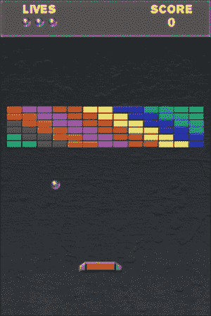
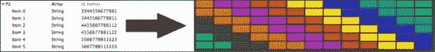

# 第五章. 使用 Box2D 的砖块破碎球

仅使用 cocos2d 本身，你可以做很多事情。然而，当你将其与真正的物理引擎（如 Box2D 或 Chipmunk）结合时，你可以做更多的事情。学习曲线很陡峭，所以本章将是一个新项目，也是对 Box2D 的入门级基本指南。

在本章中，我们将涵盖：

+   Box2D 基础

+   构建 Box2D 对象

+   使用鼠标关节

+   单例类

+   分离的 HUD 层

+   使用 plists 存储关卡数据

+   在游戏过程中更改游戏物理

# 项目状态…

在本章中，我们将讨论经典的砖块破碎游戏。追溯到雅达利游戏的早期，这款游戏是探索物理引擎的一个美妙方式，因为同时移动的物体并不多。如果你不熟悉这款游戏，解释起来相当简单。玩家控制屏幕底部的球拍，可以左右移动。屏幕顶部有固定位置的砖块。有一个小球在四处弹跳，玩家的任务是打破所有砖块，不让球穿过球拍。当然，球到处弹跳，所以实际上需要很多基于物理的计算才能使其工作。

让我们来看看最终的游戏：



# Box2D – 入门指南

在我们甚至开始考虑我们的项目之前，我们需要回顾 Box2D 的基本知识。Box2D 引擎有很多深度，在这本书中我们只会触及表面。本节旨在概述我们将需要与游戏交互的引擎部分。

## Box2D – 它是什么？

引用手册中的话，“Box2D 是一个用于游戏的 2D 刚体模拟库。程序员可以在他们的游戏中使用它来使物体以可信的方式移动，并使游戏世界更加互动。”这是对 Box2D 的相当直接描述，除了“刚体”这个术语。这是什么意思？刚体意味着 Box2D 被构建来模拟像球、墙壁、石头、金属等硬物体。Box2D 并不是为了模拟像枕头、果冻等“软体”物体。

我们在这里简要介绍 Box2D 环境的基本术语，当我们构建游戏时，我们将更详细地处理所有内容。Box2D 的官方文档可在[`box2d.org/documentation.html`](http://box2d.org/documentation.html)找到。

在这里需要指出 Box2D 的一个重要方面是它是用 C++编写的，所以当使用 Box2D 与主要用 Objective-C 编写的游戏结合时，会有一些语言翻译方面的问题。大部分情况下，两者配合得很好，但你将需要熟悉一些 C++符号，以便理解 Box2D 特定的代码。（如果 C++符号对你来说很陌生，我们建议咨询你最喜欢的搜索引擎来学习 C++的基础知识。）

### Box2D 的基本部分

Box2D 环境中最广泛使用的组件被称为**世界**。Box2D 中创建的所有对象都将包含在世界中。所有运动、碰撞等等都发生在这里。世界也是我们设置环境重力的地方。通常，一个给定的模拟只有一个 Box2D 世界。

接下来的对象被称为**身体**。身体代表世界中的某种事物。身体控制物体的位置，以及模拟所需的其它属性，例如身体类型。身体类型允许你识别它是一个静态（非移动）还是动态（可移动）的身体。身体并不直接“知道”它有多大，有多密集等等。

一个**形状**描述了物体的几何形状。Box2D 支持多种不同的形状。最常用的有圆形形状、多边形形状和边缘形状。有关支持的形状的完整列表，请参阅 Box2D 文档。

一个**固定装置**可以被认为是形状和身体之间的“胶水”。然而，它不仅仅是这样。固定装置还定义了物体的核心属性，如密度、摩擦和恢复（也称为弹性）。

Box2D 支持多种**关节**来连接物体。这些关节包括距离关节、滑轮关节、旋转关节等等。在本游戏中，我们只关心鼠标关节和棱柱关节，它们都用于控制拍子。

如你所想，还有一个碰撞处理器。我们使用的核心组件之一被称为**接触监听器**。这是一块非常复杂的软件，也是让我们深入 C++的原因之一。在本游戏中，我们只会用基本的碰撞处理器来触及表面。

一个非常重要的值是`PTM_RATIO`。这是点与米的比例。在内部，Box2D 将所有东西都表示为米。这个比例的默认值是 32，表示在模拟世界中 32 个点等于 1 米。对于大多数游戏来说，这将完美工作。在我们的代码中，当我们需要在 cocos2D 层和 Box2D 世界之间转换位置时，我们必须将这个`PTM_RATIO`应用到许多计算中。

# 接下来是游戏！

我们从 Cocos2D + Box2D 模板开始我们的游戏，因此它包含了我们需要的所有库。为了准备这个项目，我们仍然按照模板中的相同步骤进行，即删除`HelloWorldLayer.h/.mm`，并将`IntroLayer.mm`中的引用更改为我们的菜单类。模板中还有一些额外的类，`GLES-Render`和`PhysicsSprite`。我们将在稍后处理它们。我们还需要将支持的朝向更改为仅竖屏，就像我们在上一章中所做的那样。（别忘了在`IntroLayer.mm`文件中删除背景旋转行。）

在 Box2D 项目中，需要注意的是，我们所有的实现类都需要以`.mm`结尾而不是`.m`的名称。这告诉编译器我们将使用 Objective-C 和 C++的混合。你必须这样做，因为 Box2D 是用 C++编写的。那么我们该从哪里开始呢？

## 世界构建

我们将从构建 Box2D 世界本身开始。

**文件名：** `BRPlayfieldLayer.mm`

```swift
-(void) setupWorld {
    // Define the gravity vector.
    b2Vec2 gravity;
    gravity.Set(0.0f, 0.0f);

    // Construct a world object
    world = new b2World(gravity);

    world->SetAllowSleeping(true);
    world->SetContinuousPhysics(true);

    // Create contact listener
    contactListener = new BRContactListener();
    world->SetContactListener(contactListener);
}
```

如您所见，构建世界相当简单。在这里，我们将`重力`设置为零，因为我们不希望我们的球减速，也不希望我们的砖块从屏幕上掉落。然后我们设置了世界，它被分配给一个名为`world`的变量，这是一个`b2World`变量类型。当你设置`b2World`时，你为世界定义了重力。我们将允许物体进入休眠状态。休眠意味着静止的物体会“休眠”，因此模拟不会花费大量时间计算静止物体的运动。然而，如果其他物体与之交互（即，撞到它），该物体将立即醒来并做出适当的反应。我们将连续物理设置为`true`。这允许更精确的模拟，但需要更多的计算能力。我们还为这个世界建立了我们将使用的接触监听器。这里我们不会深入细节——我们将把那留给关于碰撞处理器的讨论。

如果你在这里对 C++语法感到困惑，了解以下信息可能会有所帮助：带有箭头（->）符号的行是从箭头左侧的对象调用函数。所以，如果 Box2D 是用 Objective-C 编写的，那么`world->SetContactListener(contactListener);`这一行将看起来像`[world setContactListener:contactListener];`。

### 注意

尽管有一些包装器允许你使用 Objective-C 语法使用 Box2D，但截至本文写作，没有哪个项目足够成熟可以在这里推荐。

## 在边缘

现在我们有了世界，我们可以开始定义要放入我们世界中的“东西”。让我们从屏幕的一些边缘开始：

**文件名：** `BRPlayfieldLayer.mm`

```swift
-(void) buildEdges {
    // Define the wall body
    b2BodyDef wallBodyDef;
    wallBodyDef.position.Set(0, 0);

    // Create a body for the walls
    wallBody = world->CreateBody(&wallBodyDef);

    // This defines where the bottom edge of the HUD is
    float maxY = 424;

    // Define the 4 corners of the playfield
    b2Vec2 bl(0.0f, 0.0f); // bottom left corner
    b2Vec2 br(size.width/PTM_RATIO,0); // bottom right
    b2Vec2 tl(0,maxY/PTM_RATIO); // top left corner
    b2Vec2 tr(size.width/PTM_RATIO,maxY/PTM_RATIO); // top right

    b2EdgeShape bottomEdge;
    b2EdgeShape leftEdge;
    b2EdgeShape rightEdge;
    b2EdgeShape topEdge;

    // Set the edges
    bottomEdge.Set(bl, br);
    leftEdge.Set(bl, tl);
    rightEdge.Set(br, tr);
    topEdge.Set(tl, tr);

    // Define the fixtures for the walls
    wallBody->CreateFixture(&topEdge,0);
    wallBody->CreateFixture(&leftEdge,0);
    wallBody->CreateFixture(&rightEdge,0);

    // Keep a reference to the bottom wall
    bottomGutter = wallBody->CreateFixture(&bottomEdge,0);
}
```

我们在这里编写了很多新的代码，所以让我们来分解一下。首先，我们定义了一个新的身体定义（`b2BodyDef`），称为`wallBodyDef`。这是一个极其简单的身体。然后我们告诉`world`使用我们刚刚创建的`b2BodyDef`来创建一个`body`，并保留对其的引用。我们的世界现在有一个无形无状的物体。

我们接下来解决“无形状”的问题。我们首先使用简写命名模式（即，bl = bottom left，br = bottom right 等）为游戏区域四个角的位置定义。这里有两件重要的事情需要指出。对于所有非零位置，我们将“正常”屏幕位置除以 `PTM_RATIO`。这是我们可以将我们通常使用的 `ccp` 值转换为 Box2D 友好坐标的标准方式。如您所回忆，PTM 代表 Points-To-Meters，所以 32 屏幕点等于模拟世界中的 1 米。进行这种转换可以保持我们的显示和 Box2D 模拟同步。您也可能注意到我们使用 `maxY` 值为 `424`，而不是屏幕的顶部。我们的游戏有一个覆盖屏幕顶部部分的抬头显示（Heads-Up Display），`y` 值为 424 将这个显示的顶部边缘放置在抬头显示的底部。我们真的不希望玩家在抬头显示下丢失他们的球，对吧？

我们首先创建了四个 `b2EdgeShape` 对象，分别对应屏幕的每一侧。我们使用我们的角变量来定义它们的位置，通过使用 `Set` 函数。然后我们指示 `wallBody` 为这些墙壁中的每一个创建一个固定装置。你会注意到我们将变量 `bottomGutter` 设置为 `CreateFixture` 命令返回的值。我们将在后面的碰撞处理程序中使用这个值来确定玩家何时失去了他的球。

## 拥有一个球

到目前为止，我们有一个带有墙壁的世界，但我们还没有任何移动部件。让我们构建一个球来四处弹跳：

**文件名:** `BRPlayfieldLayer.mm`

```swift
-(void) buildBallAtStartingPosition:(CGPoint)startPos
                 withInitialImpulse:(b2Vec2)impulse {
    // Create sprite and add it to layer
    PhysicsSprite *ball = [PhysicsSprite
                spriteWithSpriteFrameName:@"ball.png"];
    ball.position = startPos;
    ball.tag = kBall;
    [bricksheet addChild:ball z:50];

    // Create ball body
    b2BodyDef ballBodyDef;
    ballBodyDef.type = b2_dynamicBody;
    ballBodyDef.position.Set(startPos.x/PTM_RATIO, 
                             startPos.y/PTM_RATIO);
    ballBodyDef.userData = ball;
    b2Body *ballBody = world->CreateBody(&ballBodyDef);

    // Link the body to the sprite
    [ball setPhysicsBody:ballBody];

    //Create a circle shape
    b2CircleShape circle;
    circle.m_radius = 7.0/PTM_RATIO;

    //Create fixture definition and add to body
    b2FixtureDef ballFixtureDef;
    ballFixtureDef.shape = &circle;
    ballFixtureDef.density = 1.0f;
    ballFixtureDef.friction = 0.0f;
    ballFixtureDef.restitution = 1.0f;
    ballBody->CreateFixture(&ballFixtureDef);
    ballBody->ApplyLinearImpulse(impulse,
                                 ballBody->GetPosition());
    isBallInPlay = YES;
}
```

构建一个动态对象比构建边缘稍微复杂一些，但基本概念仍然适用。因为球将有一个与身体关联的可见精灵，我们首先构建一个 `PhysicsSprite` 对象。`PhysicsSprite` 是我们在创建项目时使用的 cocos2d + Box2D 模板中的一个类。它是 `CCSprite` 的一个子类，但包含了一些额外的函数，这些函数可以自动将精灵锁定在与其关联的物理身体的位置上。我们与一个正常的 `CCSprite` 不同之处仅在于调用 `setPhysicsBody`，这会将 Box2D 身体连接到精灵。最终结果是，我们不需要手动移动（或旋转）精灵。如果没有这个“辅助”类，我们就需要自己更新精灵的位置和旋转。

你还会注意到我们给球分配了一个 `tag` 值。这将在我们处理碰撞时很有用。（`tag` 定义包含在 `BRDefinitions.h` 文件中的 `typedef enum` 中。）

接下来，我们为球构建一个身体。我们将其分配为 `b2_dynamicBody` 类型，以便让 Box2D 知道这是一个可以移动的身体。我们将身体的位子设置与精灵的位置相对应。一个身体默认情况下锚定在中间，就像一个 `CCSprite`。我们可以使用相同的坐标来设置身体（除以 `PTM_RATIO`）。

`userData`是身体定义中的一个灵活部分；`userData`可以存储你想要存储的任何内容。`userData`通常用来存储代表演员的`CCSprite`对象（或在我们的情况下是`PhysicsSprite`对象）的引用。遵循这个约定使得从身体获取精灵变得非常简单。

在我们向世界指示使用这个定义来创建一个身体之后，我们定义了一个形状。由于我们使用的是一个圆形球体，所以`b2CircleShape`是完美的。我们通过取球体的半径（精灵宽度的一半）并除以`PTM_RATIO`来定义形状的半径。

然后我们构建一个固定装置来表示伴随身体的“内部结构”。我们分配了我们刚刚定义的圆形形状，然后设置了`密度`、`摩擦`和`恢复系数`。密度用于质量的计算。密度越高，物体越重。摩擦用于控制物体如何相互滑动。摩擦通常设置在 0 到 1 之间。较高的摩擦值会在物体相互滑动时减慢它们的速度。我们不希望球体有任何摩擦以保持其运动。这里的最后一个参数是`恢复系数`。

“恢复系数”这个术语不如其他两个熟悉，但你可以将其视为物体的弹跳性。零值表示物体根本不会弹跳。1 的值表示物体是完全弹性的，在撞击另一个物体时不会损失任何速度。我们不希望球体在碰撞时损失任何速度，因此我们为球体的恢复系数使用 1。

在我们定义了固定装置之后，我们使用`ballBody`创建它。作为最后的步骤，我们根据传递给这个方法的消息给球体添加一个线性冲量。冲量基本上是一个“踢”，冲量的强度和方向由`b2Vec2`参数控制，这里称为`impulse`。第二个参数`ballBody->GetPosition()`返回`ballBody`的中心。这将把冲量应用到身体的中心，因此我们得到冲量的直接应用。

现在我们需要一个`newBall`方法，它将始终从相同的位置开始球体，并给它一个合理的冲量以使其运动。

**文件名：** `BRPlayfieldLayer.mm`

```swift
-(void) newBall {
    [self buildBallAtStartingPosition:ccp(150,200)
                   withInitialImpulse:b2Vec2(0.2,-1.5)];
}
```

从`newBall`方法中我们可以看到，我们给球体一个非常轻微的“踢”作为初始冲量，向下并向右。

### 注意

`b2Vec2()`与`ccp()`等价，并使用相同的左下角原点。

# 将一切置于运动

到目前为止，我们有一个世界，我们有一些边缘来保持一切，我们有一个球体。现在我们需要让所有这些开始运动。正如你所期望的，我们在`update`方法中处理这个问题。

**文件名：** `BRPlayfieldLayer.mm`

```swift
-(void)update:(ccTime)dt {
    // Step the world forward
  world->Step(dt, 10, 10);

    // Iterate through all bodies in the world
    for(b2Body *b = world->GetBodyList(); b;b=b->GetNext()) {
    if (b->GetUserData() != NULL) {
            // Get the sprite for this body
      PhysicsSprite *sprite = 
(PhysicsSprite*)b->GetUserData();

            // Speed clamp for balls
            if (sprite.tag == kBall) {
        static int maxSpeed = 15;

        b2Vec2 velocity = b->GetLinearVelocity();
        float32 speed = velocity.Length();

        if (speed > maxSpeed) {
          b->SetLinearDamping(0.5);
        } else if (speed < maxSpeed) {
          b->SetLinearDamping(0.0);
        }
      }
    }
  }
}
```

这是我们最终`更新`方法的简化版，只实现了球体运动处理。我们首先指示世界在模拟中向前一步。发送给`Step`函数的三个参数依次是**时间步长**、**速度迭代**和**位置迭代**。在这个游戏中，我们使用可变时间步长（使用`dt`的增量值），在我们的情况下效果很好。更密集和详细的模拟更适合使用固定时间步长。（将您喜欢的搜索引擎指向该主题，了解更多关于如何实现固定时间步长的信息。）速度迭代和位置迭代控制模拟的详细程度。对于大多数项目来说，两个迭代值都为 10 是一个良好的起点。更高的值将导致更高的精度，但代价是计算模拟时的处理器负载更大。

现在我们已经为世界向前推进了一步，我们评估世界中的所有物体，以确定我们应该如何处理它们。我们使用`world->GetBodyList()`遍历世界中的物体，并通过`b->GetNext()`前进到下一个物体。对于找到的每个物体，我们检查`userData`是否不为空，以确定它是否附有精灵。当我们找到一个带有精灵的物体时，我们从该物体的`userData`中获取精灵引用。（我们已经有变量`b`来表示物体，来自`for`循环。）

因为球体在游戏中可能会加速，所以我们接下来加入了一个速度限制检查。如果精灵是球体，并且速度超过设定的 15，则对物体应用**线性阻尼**，这将影响球体在模拟下一步的速度。阻尼本质上是在对象上施加制动。我们使用 0.5 的值，这将减慢球体的速度，但不会完全停止它。这和汽车轻踩刹车一样，每次都会稍微减少前向速度。

您会注意到我们实际上并没有移动球体精灵。因为我们使用的是`PhysicsSprite`对象而不是`CCSprite`对象，它会自动为我们处理这一点。

## 碰撞处理

我们到目前为止审查的代码将使球体在屏幕上弹跳，但当球体碰到墙壁时，除了弹跳外不会发生任何有趣的事情。我们需要添加一种方式，当某些物体与其他物体碰撞时执行某些操作。我们通过实现一个接触监听器来完成这个任务。接触监听器有四个组件：`BeginContact`、`EndContact`、`PreSolve`和`PostSolve`。详细说明每个组件超出了本书的范围。对于我们的项目，我们只将实现一个简化的接触监听器，只包含`BeginContact`和`EndContact`的代码。让我们首先看看头文件：

**文件名：** `BRContactListener.h`

```swift
#import "Box2D.h"
#import <vector>
#import <algorithm>

struct BRContact {
  b2Fixture *fixtureA;
  b2Fixture *fixtureB;
  bool operator ==(const BRContact& other) const
  {
    return (fixtureA == other.fixtureA) &&
               (fixtureB == other.fixtureB);
  }
};

class BRContactListener : public b2ContactListener {

public:
  std::vector<BRContact>_contacts;

  BRContactListener();
  ~BRContactListener();

  virtual void BeginContact(b2Contact* contact);
  virtual void EndContact(b2Contact* contact);
  virtual void PreSolve(b2Contact* contact,
                        const b2Manifold* oldManifold);
  virtual void PostSolve(b2Contact* contact,
                        const b2ContactImpulse* impulse);
};
```

现在我们可以查看这个类的实现文件：

**文件名：** `BRContactListener.mm`

```swift
#import "BRContactListener.h"

BRContactListener::BRContactListener() : _contacts() {
}

BRContactListener::~BRContactListener() {
}

void BRContactListener::BeginContact(b2Contact* contact) {
  // We need to copy the data because b2Contact is reused.
  BRContact brContact = { contact->GetFixtureA(),
                            contact->GetFixtureB() };
  _contacts.push_back(brContact);
}

void BRContactListener::EndContact(b2Contact* contact) {
  BRContact brContact = { contact->GetFixtureA(),
                            contact->GetFixtureB() };
  std::vector<BRContact>::iterator pos;
  pos = std::find(_contacts.begin(), _contacts.end(),
                    brContact);
  if (pos != _contacts.end()) {
    _contacts.erase(pos);
  }
}

void BRContactListener::PreSolve(b2Contact* contact,
                    const b2Manifold* oldManifold) {
}

void BRContactListener::PostSolve(b2Contact* contact,
                    const b2ContactImpulse* impulse) {
}
```

这是作为 Ray Wenderlich 教程的一部分发布的简化版接触监听器（[`raywenderlich.com`](http://raywenderlich.com)），因此任何关于这种方法的赞誉都应归功于 Ray。这个接触监听器的基本设计是获取接触（即碰撞）的固定物，并将它们复制到`_contacts`中，这样我们就可以在我们的`BRPlayfieldLayer`中评估它们，而不是在这里。这种复制是在`BeginContact`中完成的。`EndContact`从`_contacts`中删除接触，这样我们就不会评估过时的接触。

这种方法的优点之一是接触监听器本身足够通用，可以直接用于许多项目。如果你对 C++不太熟悉，像这样的样板代码总是有帮助的。

## 丢失你的球

在这一点上，我们预计当球到达屏幕底部边缘时，球会丢失。但相反，球会简单地弹起，因为我们没有为球和屏幕底部固定物相撞时定义任何自定义行为。如果你还记得，当我们定义边缘时，我们保留了一个变量，`bottomGutter`，用于此目的。

我们将在`update`方法中处理碰撞，直接在之前的`for`循环之后，在那个循环中我们控制了球的速度。

**文件名：** `BRPlayfieldLayer.mm`

```swift
  std::vector<b2Body *>toDestroy;
  std::vector<BRContact>::iterator pos;
  for (pos = contactListener->_contacts.begin();
      pos != contactListener->_contacts.end(); pos++) {
        BRContact contact = *pos;

        // Get the bodies involved in this contact
        b2Body *bodyA = contact.fixtureA->GetBody();
        b2Body *bodyB = contact.fixtureB->GetBody();

        // Get the sprites attached to these bodies
        PhysicsSprite *spriteA =
                    (PhysicsSprite*)bodyA->GetUserData();
        PhysicsSprite *spriteB =
                    (PhysicsSprite*)bodyB->GetUserData();

        // Look for lost ball (off the bottom)
        if (spriteA.tag == kBall &&
            contact.fixtureB ==bottomGutter) {
            if (std::find(toDestroy.begin(),
                          toDestroy.end(), bodyA) ==
                          toDestroy.end()) {
                toDestroy.push_back(bodyA);
            }
        }
        // Look for lost ball (off the bottom)
        else if (contact.fixtureA == bottomGutter &&
                 spriteB.tag == kBall) {
            if (std::find(toDestroy.begin(),
                          toDestroy.end(), bodyB) ==
                          toDestroy.end()) {
                toDestroy.push_back(bodyB);
            }
        }
```

在这个代码块中，我们主要使用 C++结构，但概念很简单。我们首先定义了两个向量，这是一种动态数组的形式。`toDestroy`向量将存放需要销毁的任何对象。`pos`向量是一个迭代器，正如其名所示，用于遍历数据元素。然后我们进入一个`for`循环，该循环遍历在接触监听器中填充的`_contacts`变量的内容。在循环内部，我们使用变量`contact`来表示从`_contacts`中评估的当前接触/碰撞。

由于接触包含相互接触的固定物，我们使用固定物的`GetBody()`函数来获取涉及的两个身体，分别命名为`bodyA`和`bodyB`。我们需要从附加的`CCSprite`对象中获取标签，因此我们还创建了`spriteA`和`spriteB`来表示与这些身体关联的精灵。

目前，我们只需要处理一种类型的碰撞：球与`bottomGutter`固定装置的碰撞。我们根据精灵的标签`kBall`来识别球，而我们可以通过创建时存储的引用来识别`bottomGutter`固定装置。为了确定是否发生了碰撞，我们只需评估这两个物体，以确定一个是否是球，另一个是否是`bottomGutter`固定装置。您将从代码中看到我们评估了两次碰撞，一次是将"A"对象与球比较，将"B"与装置比较，然后再次评估，这次是交换"A"和"B"。我们这样做是因为接触监听器不会以任何特定的顺序提供"A"和 B 这两个装置。这次球可能是"A"，下次可能是"B"。唯一可靠地评估这种碰撞的方法是在每次碰撞中对此类进行两次检查。（您始终可以创建一个辅助函数来为您评估这两种方式，但这只会使代码略微更紧凑，但不一定会有更好的性能。）

在这两种情况下，如果我们识别到球与`bottomGutter`的碰撞，那么违规的物体就会被添加到`toDestroy`向量中。围绕它包裹的额外`if`语句是用来确保这个物体尚未在`toDestroy`向量中，因为我们不能两次销毁同一个物体。

## 销毁

现在我们已经确定了要销毁的物体，但实际上还没有销毁任何东西。就像 Objective-C 一样，您不应该在遍历数组时尝试从数组中移除对象，C++向量也不例外。因此，在我们评估了所有的碰撞之后，我们在`update`方法的底部添加了一块额外的代码。

**文件名:** `BRPlayfieldLayer.mm`

```swift
    // Destroy any bodies & sprites we need to get rid of
    std::vector<b2Body *>::iterator pos2;
    for(pos2 = toDestroy.begin(); pos2 != toDestroy.end();
                                            ++pos2) {
        b2Body *body = *pos2;
        if (body->GetUserData() != NULL) {
            PhysicsSprite *sprite =
                    (PhysicsSprite*)body->GetUserData();
            [self spriteDestroy:sprite];
        }
        world->DestroyBody(body);
    }
```

我们使用类似的迭代器来遍历`toDestroy`向量。我们检索每个物体，检查它是否附有精灵（在`userData`中），如果有的话，就调用`spriteDestroy`方法。然后我们指示世界销毁这个物体的身体。`spriteDestroy`方法用于我们游戏中所有的精灵销毁。它的简略形式如下：

**文件名:** `BRPlayfieldLayer.mm`

```swift
-(void) spriteDestroy:(PhysicsSprite*)sprite {
    switch (sprite.tag) {
        case kBall:
            [[SimpleAudioEngine sharedEngine]
                                playEffect:SND_LOSEBALL];
            [sprite removeFromParentAndCleanup:YES];
            [self loseLife];
            break;
  }
}
```

我们在这里使用精灵标签，这样我们就可以为每种类型的对象提供自定义的销毁行为。我们本可以将这些嵌入到`update`方法中，但到游戏结束时，它将会变得相当长。将销毁代码分离出来也使得我们的 Objective-C 和 C++代码在代码中保持更好的分离。

# 挡板运动

现在我们已经有了基本的游戏世界，有墙壁，还有一个会从屏幕底部掉落的球。我们需要将注意力转向用户直接控制的唯一游戏部件：挡板。让我们看看它是如何构建的：

**文件名:** `BRPlayfieldLayer.mm`

```swift
-(void) buildPaddleAtStartingPosition:(CGPoint)startPos {
    // Create the paddle
    paddle = [PhysicsSprite spriteWithSpriteFrameName:
                                        @"paddle.png"];
    paddle.position = startPos;
    paddle.tag = kPaddle;
    [bricksheet addChild: paddle];

    // Create paddle body
    b2BodyDef paddleBodyDef;
    paddleBodyDef.type = b2_dynamicBody;
    paddleBodyDef.position.Set(startPos.x/PTM_RATIO, 
                               startPos.y/PTM_RATIO);
    paddleBodyDef.userData = paddle;
    paddleBody = world->CreateBody(&paddleBodyDef);

    // Connect the body to the sprite
    [paddle setPhysicsBody:paddleBody];

    // Build normal size fixure
    [self buildPaddleFixtureNormal];

    // Restrict paddle along the x axis
    b2PrismaticJointDef jointDef;
    b2Vec2 worldAxis(1.0f, 0.0f);
    jointDef.collideConnected = true;
    jointDef.Initialize(paddleBody, wallBody,
            paddleBody->GetWorldCenter(), worldAxis);
    world->CreateJoint(&jointDef);
}
```

这与构建球时的许多步骤相同。我们首先创建`PhysicsSprite`。然后我们在相同的位置定义身体，并将精灵附加到身体上。您会注意到，我们在这里不是构建夹具，而是调用另一个方法来定义夹具。这是因为当我们探索增强功能时，我们将为桨使用不同的夹具。我们将在稍后详细说明夹具构建。

我们需要构建的一个新项目是为桨创建一个棱柱关节，它将`paddleBody`与`wallBody`连接起来。棱柱关节允许一个物体只沿着特定轴移动。在我们的例子中，我们定义`worldAxis`为仅约束沿 x 轴的运动，基于我们定义的坐标。我们为桨设置的一个重要标志是`collideConnected`设置为`true`。这允许检测通过关节连接的物体之间的碰撞。由于我们正在创建桨和`wallBody`之间的关节，我们需要将其设置为允许桨与侧墙发生碰撞。如果没有这个设置，桨将穿过游戏场的侧面并离开游戏。就像其他 Box2D 元素一样，我们通过将`CreateJoint`请求传递给世界本身来创建关节。

## 桨夹具

我们将在稍后实现一些可以改变桨大小的增强功能。因此，我们需要能够改变桨的大小。正如我们之前讨论的，夹具处理身体的几何形状和物理属性，因此我们将这个夹具定义移动到它自己的方法中：

**文件名:** `BRPlayfieldLayer.mm`

```swift
-(void) buildPaddleFixtureNormal {
    // Define the paddle shape
    b2PolygonShape paddleShape;
    int num = 8;
    b2Vec2 verts[] = {
        b2Vec2(31.5f / PTM_RATIO, -7.5f / PTM_RATIO),
        b2Vec2(31.5f / PTM_RATIO, -0.5f / PTM_RATIO),
        b2Vec2(30.5f / PTM_RATIO, 0.5f / PTM_RATIO),
        b2Vec2(22.5f / PTM_RATIO, 6.5f / PTM_RATIO),
        b2Vec2(-24.5f / PTM_RATIO, 6.5f / PTM_RATIO),
        b2Vec2(-31.5f / PTM_RATIO, 1.5f / PTM_RATIO),
        b2Vec2(-32.5f / PTM_RATIO, 0.5f / PTM_RATIO),
        b2Vec2(-32.5f / PTM_RATIO, -7.5f / PTM_RATIO),
    };
    paddleShape.Set(verts, num);

    // Build the fixture
    [self buildPaddleFixtureWithShape:paddleShape
                   andSpriteFrameName:@"paddle.png"];
}
```

要构建一个普通的桨，我们首先定义与桨匹配的`b2PolygonShape`。由于我们创建的桨不是一个简单的形状（圆形或正方形），我们必须定义定义形状边界的所有点。重要的是要记住，这些坐标是以点为单位，而不是像素。如果您只使用非 Retina 显示屏，这没有区别。由于我们的项目包括 Retina 和非 Retina 资源，这些坐标必须基于非 Retina 精灵来定义。有许多工具可以帮助您定义这些点应该是什么，但您也可以使用大多数图形编辑程序来识别定义形状“角落”的点。定义多边形的点时，必须按逆时针顺序。如果您以其他方向定义它们，程序将崩溃，通常是在 Box2D 计算形状面积时。

### 注意

Box2D 默认最多使用八个顶点来定义一个形状。如果您需要更多，您可以在`b2Settings.h`文件中轻松更改设置。这个最大值定义为`b2_maxPolygonVertices`。

形状定义完成后，我们调用另一种方法来实际构建夹具。

**文件名:** `BRPlayfieldLayer.mm`

```swift
-(void) buildPaddleFixtureWithShape:(b2PolygonShape)shape
                 andSpriteFrameName:(NSString*)frameName {
    if (paddleFixture != nil) {
        paddleBody->DestroyFixture(paddleFixture);
    }

    // Create the paddle shape definition and add it to the body
    b2FixtureDef paddleShapeDef;
    paddleShapeDef.shape = &shape;
    paddleShapeDef.density = 50.0f;
    paddleShapeDef.friction = 0.0f;
    paddleShapeDef.restitution = 0.0f;
    paddleFixture = paddleBody->CreateFixture(&paddleShapeDef);

    // Swap the sprite image to the normal paddle
    [paddle setDisplayFrame:[[CCSpriteFrameCache
                              sharedSpriteFrameCache]
                             spriteFrameByName:frameName]];
}
```

我们从这个方法开始，检查是否已经定义了一个 `paddleFixture` 对象。如果有，我们将其销毁。

大多数固定定义遵循我们在球定义中使用的相同模式。我们设置了 `density`、`friction` 和 `restitution`，并将形状附加到固定件和固定件附加到身体上。你会注意到我们将 `shape` 设置为我们传递给此方法的变量形状。此方法的最后一行是冗余且不必要的，第一次构建桨叶时。我们调用 `setDisplayFrame` 来更改附加到桨叶的精灵帧。这在我们添加增强功能时将很有用。

## 触摸桨叶

要与桨叶交互，我们需要创建一种新的关节类型：鼠标关节。鼠标关节试图使身体移动到为其设置的目标。在我们的例子中，目标将是我们的触摸点。这将允许我们在它仍然是 Box2D 世界的一部分时拖动桨叶。

使用鼠标关节的一种方法是在桨叶本身检测触摸，并允许玩家直接移动它。我们将采取另一种方法，并将屏幕底部任何触摸作为鼠标关节的目标。自然地，我们将从 `ccTouchesBegan` 方法开始：

**文件名：** `BRPlayfieldLayer.mm`

```swift
-(void)ccTouchesBegan:(NSSet *)touches
                    withEvent:(UIEvent *)event {
  if (mouseJoint != NULL) return;

  UITouch *myTouch = [touches anyObject];
  CGPoint location = [myTouch locationInView:[myTouch view]];
  location = [[CCDirector sharedDirector]
                                convertToGL:location];
  b2Vec2 locationWorld = b2Vec2(location.x/PTM_RATIO,
                                  location.y/PTM_RATIO);

  // We want any touches in the bottom part of the
  // screen to control the paddle
  if (location.y < 150) {
    b2MouseJointDef md;
    md.bodyA = wallBody;
    md.bodyB = paddleBody;
    md.target = locationWorld;
    md.collideConnected = true;
    md.maxForce = 1000.0f * paddleBody->GetMass();

    mouseJoint = (b2MouseJoint *)world->CreateJoint(&md);
    paddleBody->SetAwake(true);
  }
}
```

我们首先检查是否已经定义了一个 `mouseJoint`。如果有，这意味着已经有了一个触摸“正在进行”，我们不希望干扰当前的触摸。

下一个部分使用了从触摸到 OpenGL 坐标的相当标准的转换。然而，在这里我们还定义了 `locationWorld b2Vec2`，这是位置变量的 Box2D 版本。

然后，我们检查屏幕底部的触摸。如果那里有触摸，我们创建一个新的鼠标关节，并将其连接到 `wallBody` 和 `paddleBody`。连接到 `wallBody` 实际上是一个锚点，因为关节必须连接两个身体。只有 `paddleBody` 将会被这个关节移动。我们将 `maxForce` 变量设置为桨叶质量的 1,000 倍，这样玩家的移动将完全覆盖任何可能试图影响桨叶的其他力。我们创建了关节，并确保桨叶是激活的（以防它已经闲置足够长的时间而进入睡眠状态）。

现在我们已经实例化了鼠标关节，我们需要使鼠标关节跟踪用户的移动：

**文件名：** `BRPlayfieldLayer.mm`

```swift
-(void)ccTouchesMoved:(NSSet *)touches
                        withEvent:(UIEvent *)event {

  if (mouseJoint == NULL) return;

  if (isGameOver) return;

  UITouch *myTouch = [touches anyObject];
  CGPoint location = [myTouch locationInView:[myTouch view]];
  location = [[CCDirector sharedDirector]
                convertToGL:location];
  b2Vec2 locationWorld = b2Vec2(location.x/PTM_RATIO,
                                  location.y/PTM_RATIO);

  mouseJoint->SetTarget(locationWorld);
}
```

`ccTouchesMoved` 方法几乎是微不足道的。我们确定触摸的当前位置，并将其设置为鼠标关节的新目标。这就是移动桨叶的全部过程。然而，还有一个悬而未决的问题。触摸处理过程的最后一步是处理取消和结束事件。

**文件名：** `BRPlayfieldLayer.mm`

```swift
-(void)ccTouchesCancelled:(NSSet *)touches
                withEvent:(UIEvent *)event {
  if(mouseJoint) {
    world->DestroyJoint(mouseJoint);
    mouseJoint = NULL;
  }
}

-(void)ccTouchesEnded:(NSSet *)touches
            withEvent:(UIEvent *)event {
    if (mouseJoint) {
        world->DestroyJoint(mouseJoint);
        mouseJoint = NULL;
    }
}
```

如你所见，这两种方法都是相同的。因为触摸处理程序只关心使用鼠标关节移动挡板，所以我们结束（或取消）触摸所需要做的就是销毁鼠标关节。现在我们已经完成了触摸处理程序，游戏现在有足够的组件来移动挡板并反弹球。Box2D 将处理球和挡板之间的所有碰撞，而无需我们的代码进行任何自己的碰撞处理。

# 存储玩家数据

在多级游戏中，一个挑战是保持玩家信息在各个级别之间的连续性。有两种常见的方法。一种是将玩家数据（通常是一个玩家对象）通过场景的`init`方法从一个场景传递到下一个场景。（我们在第四章中的蛇游戏中使用了这种方法，*给蛇一份小吃*。）另一种方法是使用单例模式。

单例是一种设计模式，它允许一个类只有一个实例。Cocos2D 建立在`CCDirector`、`CCSpriteFrameCache`等单例的基础上。几乎任何引用“sharedSomething”（例如，`[CCDirector sharedManager]`）的地方都是一个单例。按照设计，在任何给定时间，单例类只有一个“存活”的版本。

我们将使用单例类来处理我们的游戏变量`currentLevel`、`currentLives`和`currentScore`。让我们看看：

**文件名:** `BRGameHandler.mm`

```swift
static BRGameHandler *gameHandler = nil;

@implementation BRGameHandler

@synthesize currentLevel;
@synthesize currentScore;
@synthesize currentLives;
@synthesize playfieldLayer;

+ (id)sharedManager
{
    // Use Grand Central Dispatch to create it
    static dispatch_once_t pred;
    dispatch_once(&pred, ^{
        gameHandler = [[super allocWithZone:NULL] init];
    });
    return gameHandler;
}

- (id)retain {
  return self;
}

- (unsigned)retainCount {	
  return NSUIntegerMax;
}

-(oneway void)release {
  //do nothing - the singleton is not allowed to release
}

- (id)autorelease {
  return self;
}
```

这些是我们将使用的一般单例方法。有几个方法在我们的游戏中没有直接调用，但它们足够通用，可以在许多项目中使用（除了`@synthesize`语句）。`sharedManager`类方法将检查是否已经实例化了`gameHandler`。如果有，它将返回现有实例。如果没有，它将创建一个新实例。我们在`sharedManager`方法中使用**Grand Central Dispatch**（**GCD**）。在这里详细讲解 GCD 超出了我们的范围，但这种方法与更传统的设计相比，非常轻量级且快速。（如果你想了解更多，可以在你喜欢的搜索引擎中搜索“Grand Central Dispatch Singleton”以获取进一步阅读。）第一次调用`[BRGameHandler sharedManager]`时，它将被创建。这个单例类将在游戏的生命周期内保持可用，因此你可以依赖它来保存任何需要贯穿整个游戏的变量。

接下来，我们看看我们在单例中包含的游戏特定方法：

**文件名:** `BRGameHandler.mm`

```swift
-(id) init {
    if (self == [super init]) {
        [self resetGame];
  }
  return self;
}

-(void) resetGame {
    // Start with the defaults
    currentLevel = 1;
    currentLives = 3;
    currentScore = 0;
}

-(void) addToScore:(NSInteger)newPoints {
    currentScore = currentScore + newPoints;
}

-(void) loseLife {
    currentLives--;
}
```

我们在这里有几个辅助方法，使我们的主要代码更简单。第一次实例化类时，它将调用`resetGame`来将`currentLevel`、`currentLives`和`currentScore`变量设置为它们的起始值。由于单例实例不会被释放，我们将变量初始化放在`resetGame`方法中。这样，对该方法的单个调用将完全将单例重置为“新鲜”状态，以开始新游戏。`addToScore`和`loseLife`方法是为了方便，这样我们就不必“麻烦”我们的主游戏场类去计算得分或失去生命时新值应该是什么。

## 显示玩家数据

我们现在有一个地方可以存储玩家数据，但我们也需要一种方式来向用户显示这些数据。对于这款游戏，我们遵循“最佳实践”，将**抬头显示**（**HUD**）层与主游戏场层分开。HUD 是一个标准层，包含一个背景框、一个用于显示分数的地方和一个显示剩余生命的地方。需要指出的一点是，在 HUD 界面中，我们定义了以下变量：

```swift
BRGameHandler *gh;
```

在 HUD 实现的`init`方法中，我们有配对的行：

```swift
gh = [BRGameHandler sharedManager];
```

从这个类开始，任何时候我们想要引用我们的`BRGameHandler`单例，我们只需使用变量`gh`。（注意：我们也在`BRPlayfieldLayer`类中定义了这个相同的变量。）

**文件名：** `BRHUD.mm`

```swift
-(void) addToScore:(NSInteger)newPoints {
    [gh addToScore:newPoints];

    NSString *currScore = [NSString
            stringWithFormat:@"%i", [gh currentScore]];

    [scoreDisplay setString:currScore];
}
```

HUD（抬头显示）在计分目的上充当了游戏场层和游戏处理器的“桥梁”。在`addToScore`方法中，我们首先调用游戏处理器来为当前分数添加分数，然后 HUD 调用`scoreDisplay`标签上的`setString`方法来更新显示的分数。通过使用这种方法，游戏场层只需向 HUD 传递一条消息，而它负责处理其余部分。

我们希望使剩余生命的显示更加精致，并使用代表每个剩余生命的球体`CCSprite`图像，我们希望在玩家失去生命时在 HUD 中有一个漂亮的动画。

**文件名：** `BRHUD.mm`

```swift
-(void) createLifeImages {
    for (int i = 1; i <= gh.currentLives; i++) {
        CCSprite *lifeToken = [CCSprite
                spriteWithSpriteFrameName:@"ball.png"];
        [lifeToken setPosition:ccp(20 + (20 * i), 446)];
        [self addChild:lifeToken z:10];
        [livesArray addObject:lifeToken];
    }
}
```

由于我们不希望为玩家的每个“生命精灵”创建一个变量，我们选择使用一个数组来保存这些精灵，称为`livesArray`。当我们调用`createLifeImages`方法时，它将生成正确数量的精灵，并在显示中均匀分布。它还将它们存储在数组中。

**文件名：** `BRHUD.mm`

```swift
-(void) loseLife {
    // Remove a life from the GameHandler variable
    [gh loseLife];

    CCSprite *lifeToRemove = [livesArray lastObject];

    CCScaleBy *scaleLife = [CCScaleBy actionWithDuration:0.5
                                    scale:2.0];
    CCFadeOut *fadeLife = [CCFadeOut actionWithDuration:0.5];
    CCSpawn *scaleAndFade = [CCSpawn actionOne:scaleLife
                                    two:fadeLife];
    CCCallFuncND *destroyLife = [CCCallFuncND
                        actionWithTarget:self
                        selector:@selector(destroyLife:)
                        data:lifeToRemove];
    CCSequence *seq = [CCSequence actions:scaleAndFade,
                       destroyLife, nil];
    [lifeToRemove runAction:seq];

    [livesArray removeLastObject];
}

-(void) destroyLife:(CCSprite*)lifeToRemove {
    [lifeToRemove removeFromParentAndCleanup:YES];
}
```

当玩家失去生命时，我们以处理分数更新的相同方式处理它。我们向游戏处理器发送消息（这将从`currentLives`变量中减去一个）。我们的下一步是添加对数组中最后一个精灵的引用到`lifeToRemove`变量。经过一小段动画后，我们使用`CCCallFuncND`触发`destroyLife:`方法，传递我们想要从游戏中移除的“生命精灵”的`CCSprite`实例。该方法只是将其移除并释放该内存。在`loseLife`方法的末尾，我们从`livesArray`中移除精灵。

通过将这些更新封装在 HUD 中，我们不必在我们的游戏场中充斥着与核心游戏无关的方法。如果我们要对 HUD 的外观和一般行为进行根本性的改变（假设`addToScore:`和`loseLife`仍然存在），游戏层代码将完全不会改变。这种设计还意味着我们可以使用与这个相同的 HUD 的完全不同的游戏场类。这就是我们在编码中追求的灵活性。

# 建筑砖块

我们的游戏缺少一个至关重要的部分：可破坏的砖块。我们希望我们的游戏足够灵活，以便我们可以在不深入研究源代码的情况下定义新关卡，因此我们将把我们的关卡存储为一个**属性列表**（**plist**）。

对于我们的游戏，我们希望有无限的游戏时间，所以我们将定义一组砖块图案，游戏将按顺序循环这些图案。当你到达终点时，它将回到第一个图案并重复循环。

我们在 plist 中定义的图案是一个名为`P#`格式的数组，因此图案将被命名为`P1`、`P2`、`P3`等等。每个数组内部包含代表每行砖块的字符串。行从底部开始，所以**项目 0**是最低的砖行，**项目 1**在上面，以此类推。

如果我们要为我们的游戏构建一个关卡编辑器，我们更有可能构建一个更健壮的 plist 结构。因为我们手动编写关卡设计，组织数据的最简单方法是使用字符串。对于每个图案的每一行，我们定义一个 13 位的字符串，每个数字代表一个砖块。（我们的屏幕大小只能容纳 13 个砖块宽。）我们将根据文件名中的编号（`brick1.png`、`brick2.png`等等）以及一个零来表示该位置没有砖块。

让我们看看 plist 中的一个图案，以及它将如何显示：



在这个显示图案**P2**的例子中，**项目 0**是最终网格中砖块的最低行，显示在右侧。你可以看到它是如何转换的：砖块编号 3 是绿色，4 是灰色，5 是橙色，以此类推。只要我们记住图案的“从底部开始”的特性，就很容易在数字中“看到”图案。

## 加载 plist

因此，我们现在有一个模式数据的 plist，我们如何加载它？我们选择使用`NSDictionary`作为我们想要在加载后存储 plist 数据的数据结构。我们在`BRGameHandler`中添加了一个 plist 加载器，因为它是一个更通用的方法，所以如果我们决定需要为游戏的某个其他部分加载 plist，我们可以将其集中管理。

**文件名:** `BRGameHandler.mm`

```swift
-(id) readPlist:(NSString*) fileName {
  NSData *plistData;
  NSString *error;
  NSPropertyListFormat format;
  id plist;

    // Assumes filename is part of the main bundle
  NSString *localizedPath = [[NSBundle mainBundle]
            pathForResource:fileName ofType:@"plist"];
  plistData = [NSData dataWithContentsOfFile:localizedPath];

  plist = [NSPropertyListSerialization
            propertyListFromData:plistData
            mutabilityOption:NSPropertyListImmutable
            format:&format errorDescription:&error];

  if (!plist) {
    NSLog(@"Error reading plist '%s', error '%s'",
        [localizedPath UTF8String], [error UTF8String]);
  }
  return plist;
}
```

这段代码基于几个假设。一个是传入的文件名将不带扩展名（也就是说，如果文件名是`patterns.plist`，我们传递的是"patterns"）。另一个假设是 plist 文件位于主应用程序包中。你会注意到这个方法返回一个`id`类型的值。由于它被构建为一个通用加载器，我们需要一个额外的辅助方法来轻松获取我们所需的数据`NSDictionary`。

**文件名:** `BRGameHandler.mm`

```swift
-(NSDictionary*)getDictionaryFromPlist:(NSString*)fileName {
    return (NSDictionary*)[self readPlist:fileName];
}
```

这只是将文件名传递给`readPlist`方法，并将返回值强制转换为`NSDictionary`。（我们也可以使用相同的`readPlist`方法返回`NSArray`，使用相同的强制转换方法。）

## 选择一个模式

现在我们知道了如何加载模式数据，让我们看看`BRPlayfieldLayer`的`init`方法中的代码，其中我们加载模式，并决定使用哪个模式：

**文件名:** `BRPlayfieldLayer.mm`（在`init`方法内部）

```swift
// Load the level patterns
patternDefs = [NSDictionary dictionaryWithDictionary:
[gh getDictionaryFromPlist:@"patterns"]];

// Load the brick pattern
NSInteger uniquePatterns = 4;
NSInteger newPattern =( [gh currentLevel] -1)
                                    % uniquePatterns;
[self buildBricksWithPattern:newPattern];
```

我们使用`dictionaryFromDictionary`方法将所有模式定义加载到`patternDefs`中。然后我们确定在文件中定义了多少个总模式。如果我们向 plist 添加新模式，这是实际代码中唯一需要修改的部分。

`newPattern`的计算使用模运算来给我们一个无限重复的模式序列。（我们从当前等级数减去一，因为我们从 Pattern P0 开始 Level 1。）

现在我们转向解释模式数据的方法：

**文件名:** `BRPlayfieldLayer.mm`

```swift
-(void) buildBricksWithPattern:(NSInteger)patternNum {
    // Load in the desired pattern
    NSString *pattID = [NSString stringWithFormat:
                        @"P%i",patternNum];
    NSArray *tmpPattern = [patternDefs objectForKey:pattID];

    // We start at row 1
    NSInteger rowNum = 1;

    // Build each row of bricks
    for (NSString *aRow in tmpPattern) {
        [self buildBricksForRow:rowNum withString:aRow];
        rowNum++;
    }
}
```

在这里，我们将当前选择的模式数组存储在变量`tmpPattern`中。由于每个模式都是一个字符串数组，因此我们遍历`tmpPattern`数组，并对数组中的每个字符串调用方法，使用这些数据构建下一行砖块：

**文件名:** `BRPlayfieldLayer.mm`

```swift
-(void) buildBricksForRow:(NSInteger)rowNum
                    withString:(NSString*)brickString {
    for(int i = 0; i < [brickString length]; i++) {
        // Create brick and add it to the layer
        NSRange rng = NSMakeRange(i, 1);
        NSInteger newID = [[brickString
                substringWithRange:rng] integerValue];

        if (newID > 0) {
            NSString *newBrickName = [NSString
                stringWithFormat:@"brick%i.png", newID];

            PhysicsSprite *brick = [PhysicsSprite
                spriteWithSpriteFrameName:newBrickName];
            CGPoint startPos = [self positionForBrick:brick
                forRow:rowNum andColumn:i];

            brick.position = startPos;
            brick.tag = kBrick;
            [bricksheet addChild:brick z:10];

            // Create brick body
            b2BodyDef brickBodyDef;
            brickBodyDef.type = b2_dynamicBody;
            brickBodyDef.position.Set(startPos.x/PTM_RATIO,
                                      startPos.y/PTM_RATIO);
            brickBodyDef.userData = brick;
            b2Body *brickBody =
                        world->CreateBody(&brickBodyDef);

            [brick setPhysicsBody:brickBody];

            // Create brick shape
            b2PolygonShape brickShape;
            brickShape.SetAsBox(
                brick.contentSize.width/PTM_RATIO/2,
                brick.contentSize.height/PTM_RATIO/2);

            //Create shape definition, add to body
            b2FixtureDef brickShapeDef;
            brickShapeDef.shape = &brickShape;
            brickShapeDef.density = 200.0;
            brickShapeDef.friction = 0.0;
            brickShapeDef.restitution = 1.0f;
            brickBody->CreateFixture(&brickShapeDef);
        }
    }
}
```

由于我们正在构建一整行砖块，我们对构建方法采取了一些不同的方法：

+   我们传递行号和表示这一行砖块的字符串

+   我们逐个遍历字符串中的所有字符

+   我们调用`NSMakeRange`来只获取字符串中的一个子串，并将该字符转换为整数值

+   如果值为零，该位置没有砖块，并且对该位置不采取任何进一步的操作

如果我们需要在这里放置砖块，我们就以与其他对象相同的方式构建它们。我们构建一个精灵、身体、形状和固定装置，并将它们连接在一起。当我们定义固定装置的形状时，我们使用`SetAsBox`函数，因此我们可以简单地提供精灵宽度的一半和高度的一半，Box2D 就会构建形状。

# 真正的打破砖块

现在我们已经定义了游戏的所有核心元素，我们需要为球击中砖块添加碰撞处理。如果我们在这里停下来，球会击中砖块，砖块会因冲击力而飞出去。我们真正想要的是销毁砖块，所以我们将重新审视在*失去你的球*部分中描述的`update`方法。在`update`方法中的`if…else`语句之后，我们添加了几个子句：

**文件名：** `BRPlayfieldLayer.mm`（在`init`方法中）

```swift
else if (spriteA != NULL && spriteB != NULL) {
  // Sprite A = ball, Sprite B = Block
  if (spriteA.tag == kBall && spriteB.tag == kBrick) {
   if (std::find(toDestroy.begin(), toDestroy.end(),
       bodyB) == toDestroy.end()) {
        toDestroy.push_back(bodyB);
   }
  }
  // Sprite B = block, Sprite A = ball
  else if (spriteA.tag == kBrick && spriteB.tag == kBall) {
    if (std::find(toDestroy.begin(), toDestroy.end(),
      bodyA) == toDestroy.end()) {
        toDestroy.push_back(bodyA);
   }
  }
}
```

外部子句确保我们有两个精灵分别对应于接触中的两个身体。然后我们检查两个精灵的`tag`值。如果一个精灵是砖块而另一个是球，那么我们将砖块添加到`toDestroy`向量中。如您所回忆的，这正是我们之前处理球与`bottomGutter`碰撞的方式。唯一的区别是我们这次比较的是两个精灵，并且我们销毁的是砖块，而不是球。

因为我们使用了一个通用的破坏路径来处理对象，所以我们不需要在`update`方法中添加任何其他内容来使这个过程工作。我们只需要在`spriteDestroy`方法中添加一个新的情况语句。让我们再次看看这个方法：

**文件名：** `BRPlayfieldLayer.mm`

```swift
-(void) spriteDestroy:(PhysicsSprite*)sprite {
    switch (sprite.tag) {
        case kBrick:
            [[SimpleAudioEngine sharedEngine]
                            playEffect:SND_BRICK];
            [self checkForRandomPowerupFromPosition:
                            sprite.position];
            [sprite removeFromParentAndCleanup:YES];
            [self addToScore:1];
            break;
        case kBall:
            [[SimpleAudioEngine sharedEngine]
                                playEffect:SND_LOSEBALL];
            [sprite removeFromParentAndCleanup:YES];
            [self loseLife];
            break;
}
}
```

如您所记，我们在`update`方法结束时实际上销毁了 Box2D 身体本身，因此我们在这里清理精灵并处理任何其他维护事项，例如增加分数、播放音效等等。

我们在`case kBrick`部分包含了一个方法，它引导我们进入这个游戏的下一个（也是最后一个）主题：实现加分道具。

# 加分道具，好与坏

加分道具的想法是现代砖块游戏体验的核心。对于我们的游戏，我们将实现三种类型的加分道具：挡板扩大、挡板缩小和多球。正如我们刚才看到的，当一个砖块被销毁时，会调用另一个方法来处理加分道具。

**文件名：** `BRPlayfieldLayer.mm`

```swift
-(void) checkForRandomPowerupFromPosition:(CGPoint)brickPos {
    NSInteger rnd = arc4random() % 100;

    if (rnd < 25) {  // 25 % CHANCE
        [self buildPowerupAtPosition:brickPos];
    }
}
```

在这个方法中，我们随机生成一个数字。如果这个数字低于 25%，我们就调用另一个方法来实际构建加分道具。重要的是要指出，在`spriteDestroy`方法中，我们必须在`removeFromParentAndCleanup`之前调用这个方法，因为我们需要使用这里被销毁的砖块的位置。这允许加分道具从“内部”刚刚被销毁的砖块中掉落。

随着我们沿着这个代码路径前进，我们现在到达了决定生成加分道具的点。这是一个 Box2D 启用的身体，所以让我们回顾一下加分道具的构建方法：

**文件名:** `BRPlayfieldLayer.mm`

```swift
-(void) buildPowerupAtPosition:(CGPoint)startPos {
    NSInteger powerupType = arc4random() % 3;
    NSString *powerupImageName;
    NSInteger newTag;

    switch (powerupType) {
        case 1:
            powerupImageName = @"powerup_contract.png";
            newTag = kPowerupContract;
            break;
        case 2:
            powerupImageName = @"powerup_multi.png";
            newTag = kPowerupMultiball;
            break;
        default:
            powerupImageName = @"powerup_expand.png";
            newTag = kPowerupExpand;
            break;
    }

    // Create sprite and add it to layer
    PhysicsSprite *powerup = [PhysicsSprite
            spriteWithSpriteFrameName:powerupImageName];
    powerup.position = startPos;
    powerup.tag = newTag;
    [bricksheet addChild:powerup z:50];

    // Create body
    b2BodyDef powerupBodyDef;
    powerupBodyDef.type = b2_dynamicBody;
    powerupBodyDef.position.Set(startPos.x/PTM_RATIO, 
                             startPos.y/PTM_RATIO);
    powerupBodyDef.userData = powerup;
    b2Body *powerupBody = world->CreateBody(&powerupBodyDef);

    // Connect the body to the sprite
    [powerup setPhysicsBody:powerupBody];

    // Define the fixture shape
    b2PolygonShape powerupShape;
    int num = 8;
    b2Vec2 verts[] = {
        b2Vec2(-5.6f / PTM_RATIO, 4.3f / PTM_RATIO),
        b2Vec2(-5.6f / PTM_RATIO, -4.6f / PTM_RATIO),
        b2Vec2(-4.3f / PTM_RATIO, -5.8f / PTM_RATIO),
        b2Vec2(4.5f / PTM_RATIO, -5.8f / PTM_RATIO),
        b2Vec2(5.5f / PTM_RATIO, -4.8f / PTM_RATIO),
        b2Vec2(5.5f / PTM_RATIO, 4.4f / PTM_RATIO),
        b2Vec2(4.5f / PTM_RATIO, 5.6f / PTM_RATIO),
        b2Vec2(-4.7f / PTM_RATIO, 5.6f / PTM_RATIO)
    };
    powerupShape.Set(verts, num);

    //Create shape definition and add to body
    b2FixtureDef powerupShapeDef;
    powerupShapeDef.shape = &powerupShape;
    powerupShapeDef.isSensor = YES;
    powerupBody->CreateFixture(&powerupShapeDef);

    b2Vec2 force = b2Vec2(0,-3);
    powerupBody->ApplyLinearImpulse(force,
                     powerupBodyDef.position);
}
```

当我们调用这个方法时，我们只知道我们需要生成一个增强效果，但我们还没有确定将生成三种可用增强效果中的哪一种。为此，我们使用 `arc4random()` 随机选择我们想要使用的增强效果。在这个构建方法中，唯一的区别是精灵文件名和精灵的 `tag` 属性的不同值。

### 注意

对于数学纯粹主义者来说，本书中使用的所有随机化方法都不是“真正的随机性”。生成的数字频率将存在一些小的不平衡。然而，这只是一个游戏，所以不太完美的随机性是完全可以接受的。

我们继续构建身体、形状和固定件，与构建球拍身体的方式非常相似，包括通过其八个点定义多边形形状。我们也可以使用矩形形状来完成任务，但我们希望增强效果块上的圆角达到“像素级”精确。

然而，固定件略有不同。我们不会为这个固定件设置 `密度`、`摩擦` 或 `恢复`。相反，我们使用一个新的属性，`isSensor`。传感器是一种可以参与碰撞但不会实际引起碰撞的固定件。传感器可以穿过另一个身体而不发生碰撞和反弹动作。然而，我们可以检测传感器和另一个固定件何时接触。在我们的案例中，增强效果将被球拍拾起，但它们不应该四处弹跳或被球或球拍击中。

我们通过在身体上施加向下的线性冲量来完成对增强效果的构建，这样它就会直接向下掉落。这模拟了重力的效果，尽管在我们的世界中重力为零。

## 拾取增强效果

现在我们需要处理增强效果与球拍之间的碰撞。我们已经拥有了实现这一功能的大部分组件。回到 `update` 方法，我们在砖块与球碰撞检查之后直接添加了一些额外的检查。我们需要在球拍和每种类型的增强效果之间进行三对额外的检查。（例如，我们只包括第一对——其他两对是相同的，只需更改增强效果的 `tag` 检查即可。）

**文件名:** `BRPlayfieldLayer.mm` (在 `update` 方法中)

```swift
  else if (spriteA.tag == kPowerupContract &&
           spriteB.tag == kPaddle) {
    if (std::find(toDestroy.begin(),toDestroy.end(),
               bodyA) == toDestroy.end()) {
          toDestroy.push_back(bodyA);
    }
  }          
  else if (spriteA.tag == kPaddle &&
          spriteB.tag == kPowerupContract) {
    if (std::find(toDestroy.begin(), toDestroy.end(),
               bodyB) == toDestroy.end()) {
          toDestroy.push_back(bodyB);
    }
  }
```

这几乎是从之前的碰撞检测中直接复制粘贴过来的。再次强调，当一个增强效果被“拾起”时，我们只是简单地将其添加到 `toDestroy` 向量中。正如你可能猜到的，我们将在 `spriteDestroy` 方法中处理增强效果的其余触发。在那个方法中，我们添加了三个额外的案例语句。

**文件名:** `BRPlayfieldLayer.mm` (在 `spriteDestroy` 方法中)

```swift
case kPowerupContract:
  [sprite removeFromParentAndCleanup:YES];
  [self buildPaddleFixtureShort];
  paddleTimer = 10; // Set the timer to 10 seconds
  isPaddleDeformed = YES;
  break;
case kPowerupExpand:
  [sprite removeFromParentAndCleanup:YES];
  [self buildPaddleFixtureLong];
  paddleTimer = 10; // Set the timer to 10 seconds
  isPaddleDeformed = YES;
  break;
case kPowerupMultiball:
  [sprite removeFromParentAndCleanup:YES];
  shouldStartMultiball = YES;
  break;  
```

对于收缩和扩展增强效果，我们移除精灵然后调用构建新的固定件。`paddleTimer` 和 `isPaddleDeformed` 变量将用于控制球拍何时恢复到正常大小。

对于多球模式，它有一些实质性的内容，所以我们在这里只是将标志 `shouldStartMultiball` 设置为 `YES`，这样我们就可以在下一个 `update` 循环中处理它。

## 桨片变形

当你回想起我们最初构建桨片时，我们是在一个单独的方法 `buildPaddleFixtureNormal` 中构建固定装置本身的。当玩家捕获收缩或扩展升级时，我们只需要销毁现有的固定装置并构建一个新的。让我们看看扩展的情况：

**文件名:** `BRPlayfieldLayer.mm`

```swift
-(void) buildPaddleFixtureLong {
    // Define the paddle shape
    b2PolygonShape paddleShape;
    int num = 6;
    b2Vec2 verts[] = {
        b2Vec2(64.0f / PTM_RATIO, -7.5f / PTM_RATIO),
        b2Vec2(64.0f / PTM_RATIO, -0.5f / PTM_RATIO),
        b2Vec2(45.0f / PTM_RATIO, 6.5f / PTM_RATIO),
        b2Vec2(-48.0f / PTM_RATIO, 6.5f / PTM_RATIO),
        b2Vec2(-65.0f / PTM_RATIO, 0.5f / PTM_RATIO),
        b2Vec2(-65.0f / PTM_RATIO, -7.5f / PTM_RATIO)
    };
    paddleShape.Set(verts, num);

    // Build the fixture
    [self buildPaddleFixtureWithShape:paddleShape
                   andSpriteFrameName:@"paddle_wide.png"];
}
```

在这里，我们可以看到为什么我们将桨片固定装置的构建分为两个方法。我们可以利用我们之前构建的 `buildPaddleFixtureWithShape: andSpriteFrameName:` 方法所做的所有设置。主要的不同之处在于我们设置了一个不同的 `spriteFrameName`，并且我们使用与 `paddle_wide.png` 精灵的几何形状相匹配的坐标来定义 `verts[]`。

`buildPaddleFixtureShort` 方法遵循相同的设计，使用显示帧 `paddle_short.png` 和一组不同的 `verts[]` 值。所有其他代码与“长”方法相同。

## 恢复桨片

现在我们已经扩展或收缩了桨片，我们如何回到正常状态？我们在 `spriteDestroy` 方法中设置了一个 10 秒的计时器值，但我们需要实际对它做些什么。在 `update` 方法的顶部，我们添加了一个简单的 `if` 子句，如下所示：

**文件名:** `BRPlayfieldLayer.mm` (在 `update` 方法内部)

```swift
    if (isPaddleDeformed) {
        paddleTimer = paddleTimer - dt;
        if (paddleTimer <= 0) {
            paddleTimer = 0;
            isPaddleDeformed = NO;
            [self buildPaddleFixtureNormal];
        }
    }
```

只有当 `isPaddleDeformed` 变量设置为 `YES` 时，我们才会进入这个子句。我们从 `paddleTimer` 中减去当前的增量，然后检查我们的时间是否已用完。如果时间已用完，我们将 `isPaddleDeformed` 设置为 `NO`，并调用 `buildPaddleFixtureNormal` 方法来恢复我们的原始桨片精灵和固定装置。因此，我们回到了正常游戏。

## 多球模式

之前我们看到与多球升级的碰撞只会将 `shouldStartMultiball` 变量设置为 `YES`，并不会采取任何进一步的操作。相反，我们在更新方法的末尾放置了实际的触发器。

**文件名:** `BRPlayfieldLayer.mm` (在 `update` 方法内部)

```swift
    if (shouldStartMultiball) {
        [self startMultiball];
        shouldStartMultiball = NO;
    }
```

为什么不直接调用 `startMutiball`？因为多球模式涉及到新实体的创建，我们希望确保这些实体的创建不会在我们遍历世界实体（我们在 `update` 方法的顶部这样做）时发生。为了避免这种冲突，我们更安全地设置触发器，就像我们做的那样，并在 `update` 方法的某个部分对其采取行动，在那里你可以确信自己是“安全的”。

**文件名:** `BRPlayfieldLayer.mm`

```swift
-(void) startMultiball {
    // Prevent triggering a multiball when the ball is lost
    if (!isBallInPlay) {
        return;
    }
    CGPoint startPos;
    for(b2Body *b = world->GetBodyList(); b;b=b->GetNext()) {
    if (b->GetUserData() != NULL) {
            // Get the sprite for this body
      CCSprite *sprite = (CCSprite *)b->GetUserData();

            if (sprite.tag == kBall) {
                startPos = sprite.position;

                // Build 2 new balls at the same position
                [self buildBallAtStartingPosition:startPos
                    withInitialImpulse:b2Vec2(0.2,1.5)];
                [self buildBallAtStartingPosition:startPos
                    withInitialImpulse:b2Vec2(-0.2,1.5)];

                multiballCounter = multiballCounter + 2;

                // We break out to avoid chain reactions
                break;
            }
        }
    }
}
```

此方法的核心是遍历世界中的实体，并寻找具有标签 `kBall` 的精灵。然后它调用我们用于“正常”球的相同 `buildBall` 方法，并在相同的位置创建两个新的球，但给它们不同的冲量。这组冲量产生了一种“爆米花”效果，因此两个新球稍微向上和向原球的两侧移动。

我们还有一些额外的代码来防止“不良行为”。检查`isBallInPlay`变量的目的是防止玩家在唯一的球在游戏中被摧毁时恰好接住一个多球的情况。如果精灵和身体在多球试图与之交互的同时被摧毁，这可能会导致崩溃。

我们还强制在有一个球被“多球化”后暂停。如果我们允许迭代器继续评估其他物体，那么在时间上的强烈可能性（取决于时机）是，这两个新创建的球也会被“多球化”（即，为它们中的每一个都创建两个新球），然后这些球也会被“多球化”，以此类推。屏幕会瞬间充满几十个球，游戏将无法进行。

最后，我们还会跟踪游戏中有多少“额外”的球，通过`multiballCounter`变量。这很重要，这样我们就不至于在玩家仍有球在游戏中时意外触发生命值减少。

## 多球化时失去生命值

同时有多个球在游戏中使得检测丢失的球变得更加复杂。让我们看一下最终的`loseLife`方法：

**文件名:** `BRPlayfieldLayer.mm`

```swift
-(void) loseLife {
    if (multiballCounter > 0) {
        multiballCounter--;
    } else {
        isBallInPlay = NO;

        [hudLayer loseLife];
        // Do we need another ball?
        if ([gh currentLives] > 0) {
            [self scheduleOnce:@selector(newBall) delay:1.0];
        } else {
            // Game over
            [self prepareForGameOver];
        }
    }
}
```

我们首先评估`multiballCounter`变量。如果有任何多球在游戏中，我们首先从该变量中减去，玩家的生命值不会受到影响。如果没有多球，那么我们就调用 HUD 来减少一个生命值。如您所回忆的那样，这会更新 HUD 以及更新`BRGameHandler`类中的`currentLives`变量。正因为如此，我们才能评估`[gh currentLives]`变量以确定玩家新的生命值数量。如果还有生命值，我们就会创建一个新的球，并继续游戏。否则，我们开始游戏结束序列。

# 摘要

我们在这里已经覆盖了很多（启用物理的）内容。我们讨论了 Box2D 的基础知识，并构建了一个相当不错的砖块破坏器。我们专注于物理世界的核心机制，以及如何将 Box2D 和 cocos2d 的位置（使用`PTM_RATIO`）进行转换。我们学习了如何在游戏过程中实现影响 Box2D 世界物理的加成，以及如何使用接触监听器，以及如何决定哪些碰撞会导致破坏。

在下一章中，我们将探讨两个玩家在同一设备上的面对面动作游戏，以及我们的第一个设备游戏。让我们开始吧！
