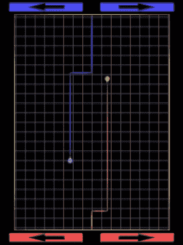
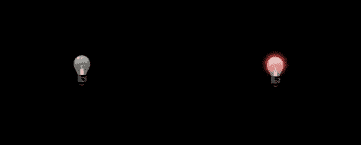
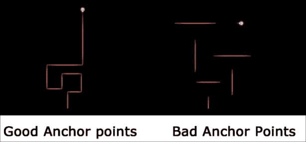
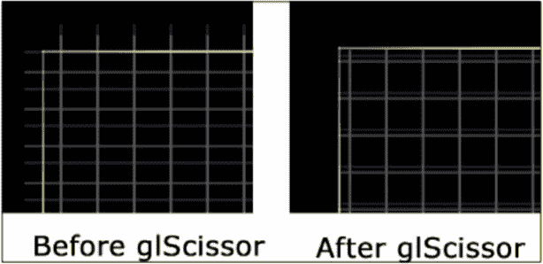
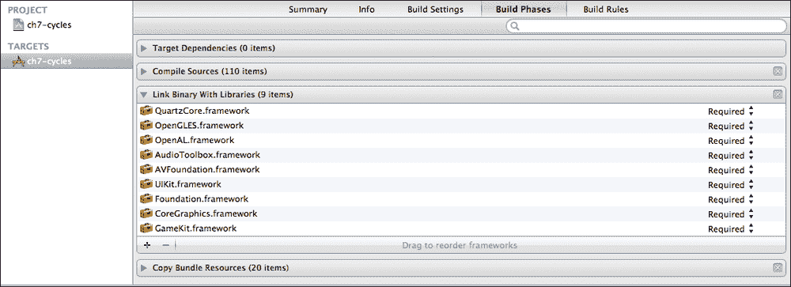
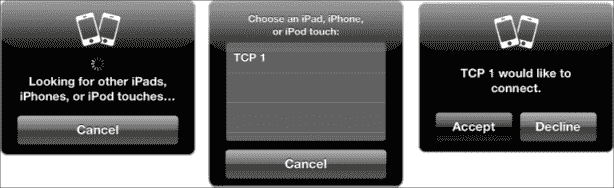

# 第六章。光之周期

在本章中，我们将转换方向，开发一个多人 iPad 游戏。这个游戏将包括在同一 iPad 上的两位玩家，以及使用 GameKit 的蓝牙连接进行真正的面对面战斗。

在本章中，我们将介绍以下内容：

+   不使用动作的 CCSprite 移动

+   动态精灵拉伸

+   图像的高效重用

+   使用 CCRenderTexture 绘制

+   使用 glScissor 来裁剪绘制区域

+   GameKit PeerPicker

+   蓝牙连接

+   发送和接收数据

# 游戏是…

在本章中，我们将向电子游戏黄金时代的“光之周期”游戏（TRON）致敬。每位玩家都有一辆在封闭游戏场地中驾驶的自行车。自行车具有固定的速度，并且只能以直角转弯。自行车在其后面留下墙壁作为痕迹。撞上自行车创建的墙壁是致命的。撞上外部墙壁也是致命的。为了给游戏增添自己的特色，我们的“自行车”将是灯泡，每个灯泡都有其适当的颜色“发光”。

这是一个仅限两人游玩的游戏。两位玩家可以在同一 iPad 上（位于相反两端）游玩，或者通过两个 iPad 之间的蓝牙连接进行游玩。游戏将在 Retina 和非 Retina iPad 之间同时完全可玩。

我们完成的游戏将看起来像以下截图：



# 设计评审

我们将首先讨论我们将用于设计的方案。我们为这款游戏的核心设计决策之一是尽可能少地使用图形文件，同时不牺牲游戏的外观和感觉。如果您查看源图形，我们只有四张图片：一个带有右箭头的白色按钮，一个灯泡，一个白色的“灯泡发光”图像，以及一个 1 x 1 点大小的白色方形图像。从这些图像中，我们将驱动整个游戏。

结构上，我们希望为自行车和按钮分别创建单独的类。自行车将处理它自己的所有移动，按钮类将直接向它所控制的自行车发送消息，因此与游戏层的直接交互非常少。墙壁将从白色方形图形生成，使用即时缩放拉伸自行车后面的墙壁。所有墙壁都将存储在游戏层内部，因为需要在自行车之间共享墙壁。

我们还将为游戏场地后面的“网格”图形使用一个单独的层，因为它确实是视觉上的“填充物”，与实际游戏场地没有任何交互。这个网格将有一些视觉效果，因此它永远不会是静态的。这个网格将完全由代码生成，使用 `CCRenderTexture` 类在游戏初始化时绘制它。

# 让我们构建一辆自行车

我们希望从游戏的基本元素开始，即 `CLBike` 类。我们将在这里详细查看这个类，但首先我们想看看 `CLDefinitions.h` 文件。

**文件名**：`CLDefinitions.h`

```swift
// Audio definitions
#define SND_BUTTON @"button.caf"
#define SND_TURN @"bike_turn.caf"

// Graphics definitions
#define IMG_BIKE @"lightbulb.png"
#define IMG_GLOW @"glow.png"
#define IMG_BUTTON @"rightarrow.png"
#define IMG_SPECK @"whitespeck.png"

typedef enum {
    kBluePlayer,
    kRedPlayer
} PlayerID;

typedef enum {
    kNoChange, // NoChange only used in bluetooth games
    kUp,
    kRight,
    kLeft,
    kDown
} Direction;
```

在这里，我们对我们的图形和声音资源进行了一些定义。集中定义使得更改文件名变得更加容易，而不是在代码中搜索所有引用。

我们还创建了两个`typedef` `enum`定义。`PlayerID`包含一个值，这使得确定哪个玩家被引用变得更容易。同样，我们定义了`Direction`，这样我们就可以使用方向而无需记录哪个数字代表哪个方向。正如我们之前提到的，这些`typedef` `enum`是“伪装成整数的整数”，因此如果我们需要（我们将会这样做），我们可以将这些作为整数传递。

## CLBike 头文件

现在，我们将查看`CLBike`类的完整头文件。

**文件名**：`CLBike.h`

```swift
#import <Foundation/Foundation.h>
#import "cocos2d.h"
#import "CLDefinitions.h"

@class CLPlayfieldLayer;

@interface CLBike : CCSprite {
    CGSize size; // Window size returned from CCDirector

    CLPlayfieldLayer *myPlayfield; // game layer

    PlayerID _thisPlayerID; // Player Number

    ccColor3B _wallColor; // Blue or green color

    float _bikeSpeed; // rate of travel for this bike
    Direction _bikeDirection; // facing which direction?

    CCSprite *glow; // The colored bulb glow sprite

    CCSprite *_currentWall; // Wall connected to bike
    CCSprite *_priorWall; // Wall created before current

    NSInteger wallWidth; // How wide the walls are

    BOOL isRemotePlayer; // Is this a non-local player?
    BOOL isCrashed; // Did this bike crash?
}

@property (nonatomic, assign) PlayerID thisPlayerID;
@property (nonatomic, assign) float bikeSpeed;
@property (nonatomic, assign) Direction bikeDirection;
@property (nonatomic, assign) ccColor3B wallColor;
@property (nonatomic, assign) BOOL isRemotePlayer;
@property (nonatomic, assign) BOOL isCrashed;
@property (nonatomic, retain) CCSprite *currentWall;
@property (nonatomic, retain) CCSprite *priorWall;

+(id) bikeForPlayer:(PlayerID)playerID 
           PlayerNo:(NSInteger)playerNo 
            onLayer:(CLPlayfieldLayer*)thisLayer
           isRemote:(BOOL)remotePlayer;

-(void) moveForDistance:(float)dist;
-(void) move;
-(void) turnRight;
-(void) turnLeft;
-(void) crash;

-(CGPoint) wallAnchorPoint;

@end
```

这些变量中的大多数将在解释`CLBike.m`文件时进行讨论，但这里有一些事项需要提及。我们保留了一个`myPlayfield`变量，这样自行车就能调用主`CLPlayfieldLayer`类的函数。你会注意到我们没有`#import`那个类，而是使用了一个`@class`行。如你从第三章，*为了乐趣而敲打土拨鼠*和第四章，*给蛇喂食……*中回忆起来，这是一个前置声明。它标识了一个名为该名称的类，但在头文件中并不知道其他信息。我们使用这种方法的原因是`CLPlayfieldLayer.m`文件将导入`CLBike.h`头文件，因此当两个类尝试互相导入时，我们会陷入循环。

我们这里还有一个名为“便捷”的方法类：

**文件名**：`FileCLBike.h`

```swift
+(id) bikeForPlayer:(PlayerID)playerID 
           PlayerNo:(NSInteger)playerNo 
            onLayer:(CLPlayfieldLayer*)thisLayer
           isRemote:(BOOL)remotePlayer;
```

尽管`CLBike`类是`CCSprite`的子类，但我们还需要设置该类的几个其他细节，因此我们选择了这个便捷方法。我们需要知道`playerID`（`kRedPlayer`或`kBluePlayer`）和`playerNo`变量，它定义了玩家处于哪个“控制位置”。玩家编号 1 位于 iPad 的“主页按钮”端，玩家编号 2 将在 iPad 的“顶部”进行游戏。我们还向自行车传递了父层。最后一个参数是布尔变量`isRemote`，它标识了这辆自行车是否将由不是“本地”于这个 iPad 的人控制（即在蓝牙游戏中）。

我们还在这个类中公开了许多变量和方法作为属性。这是因为我们希望其他类能够“询问”自行车很多信息。我们还需要能够完全从类外部控制自行车。如果你还记得我们的设计讨论，我们希望控制按钮能够直接向自行车发送消息，因此我们必须公开所有的控制方法。

## CLBike 实现

现在我们已经了解了`CLBike`头文件，我们将继续到实现文件。在这里，我们将逐步通过类的核心，稍后当我们讨论通过蓝牙进行游戏时，我们将再次访问它。

**文件名**：`CLBike.m`

```swift
#import "CLBike.h"
#import "CLPlayfieldLayer.h"
#import "SimpleAudioEngine.h"

@implementation CLBike

@synthesize thisPlayerID = _thisPlayerID;
@synthesize bikeSpeed = _bikeSpeed;
@synthesize bikeDirection = _bikeDirection;
@synthesize wallColor = _wallColor;
@synthesize currentWall = _currentWall;
@synthesize priorWall = _priorWall;
@synthesize isRemotePlayer;
@synthesize isCrashed;

+(id) bikeForPlayer:(PlayerID)playerID 
           PlayerNo:(NSInteger)playerNo 
            onLayer:(CLPlayfieldLayer*)thisLayer
           isRemote:(BOOL)remotePlayer
{
    return [[[self alloc] initForPlayer:playerID 
                               PlayerNo:playerNo 
                                onLayer:thisLayer
                               isRemote:remotePlayer] 
            autorelease];   
}
```

值得指出的是，我们确实在文件顶部有`#import "CLPlayfieldLayer.h"`这一语句。这是我们在头文件中使用的`@class`前向声明语句的“配对”。我们需要在这里使用`#import`行，因为我们将会需要`CLBike`类来访问`CLPlayfieldLayer`类的成员方法。

正如我们之前所说的，我们创建了一个用于创建新自行车的便利方法。为了符合便利方法的定义，我们执行了一个`alloc`，一个`init`，并将实例化的对象标记为`autorelease`对象。

**文件名**：`CLBike.m`（`initForPlayer`，第一部分）

```swift
-(id) initForPlayer:(PlayerID)playerID 
           PlayerNo:(NSInteger)playerNo 
            onLayer:(CLPlayfieldLayer*)thisLayer
           isRemote:(BOOL)remotePlayer {
    if(self = [super initWithSpriteFrameName:IMG_BIKE]) {
        myPlayfield = thisLayer;

        isRemotePlayer = remotePlayer;

        size = [[CCDirector sharedDirector] winSize];

        self.thisPlayerID = playerID;
        self.bikeSpeed = 3.0;
        self.bikeDirection = kUp;
        self.anchorPoint = ccp(0.5,0);
        self.scale = 0.25;
        self.isCrashed = NO;

        // Set the player's wall color
        switch (self.thisPlayerID) {
            case kRedPlayer:
                self.wallColor = ccc3(255, 75, 75);
                break;
            case kBluePlayer:
                self.wallColor = ccc3(75, 75, 255);
                break;
        }
```

在这里，我们开始`initForPlayer:`方法的实现。`CLBike`的“超类”是`CCSprite`，因此我们可以从超类中调用`initWithSpriteFrameName:`。这处理了我们类中标准的`CCSprite`方面的初始化。我们只需要关注我们类特有的`CLBike`初始化。

我们保留了传入的层引用（在`myPlayfield`中），`playerID`（在`self.thisPlayerID`中），以及`remotePlayer`变量的布尔值（在`isRemotePlayer`中）。`playerNo`值没有存储在变量中，因为它只会在构建玩家自行车时使用。

我们为自行车设置了默认值，使其面向上方（`kUp`），`bikeSpeed`为`3.0`，`scale`为`0.25`。我们还设置了`anchorPoint`为`ccp(0.5, 0)`，这是一个位于自行车后端的中心点。

由于我们想要优化我们的图形，我们需要知道玩家的颜色。我们根本不想设置精灵的颜色，因为这会使精灵看起来像是一个彩色的块，而不是一个灯泡。相反，我们使用`ccc3(r,g,b)`来构建我们想要的颜色，这些颜色略带纯红色和纯蓝色，然后将其存储在`wallColor`属性中。

**文件名**：`CLBike.m`（`initForPlayer`，第二部分）

```swift
switch (playerNo) {
            case 1:
                // Starts at bottom of screen
                [self setPosition:ccp(size.width/2,64)];
                break;
            case 2:
                // Starts at top of screen
                [self setPosition:ccp(size.width/2,960)];
                self.bikeDirection = kDown;
                break;
        }

        [self rotateBike];

        glow = [CCSprite spriteWithSpriteFrameName:IMG_GLOW];
        [glow setAnchorPoint:[self anchorPoint]];
        [glow setPosition:ccp(34,26)];
        [glow setColor:self.wallColor];
        [self addChild:glow z:-1];

        // Bike's wall init here
    }
    return self;
}
```

在这里，我们看到`CLBike`类中唯一使用`playerNo`值的代码。如果是玩家 1，那么自行车的起始位置将位于屏幕底部中央。玩家 2 将位于屏幕顶部中央，并且他们的方向将改为`kDown`。一旦我们改变了自行车的方向，我们就调用`rotateBike`方法，该方法将正确地旋转自行车图形（关于这个方法将在稍后讨论）。

然后我们添加了我们的“发光”图形。这使用了纯白色的发光图像，我们将其设置为存储为玩家`wallColor`的颜色。我们将位置设置为略偏离自行车的位置，以考虑到源图像尺寸的差异。我们使用与自行车相同的`anchorPoint`值来设置锚点，然后将发光作为自行车的子节点添加（在这个类中`self`指的是`CLBike`对象），Z 值为`-1`。这使发光位于灯泡精灵的后面。这让我们可以看到灯泡的细节，同时发光效果也可以通过灯泡图形的透明部分看到。

以下截图显示了添加发光效果前后的红色自行车：



我们稍后将在该方法末尾添加一些代码，但这对现在来说已经足够了。

## 自行车旋转

我们在这个类中看到了一个尚未处理的方法，它足够简单，现在可以处理。在我们定位自行车后，我们调用`rotateBike`方法。

**文件名**: `CLBike.m`

```swift
-(void) rotateBike {
    // Rotate the bike to match the direction
    switch (self.bikeDirection) {
        case kUp:
            self.rotation = 0;
            break;
        case kRight:
            self.rotation = 90;
            break;
        case kDown:
            self.rotation = 180;
            break;
        case kLeft:
            self.rotation = -90;
            break;
        default:
            break;
    }
}
```

我们在`self.bikeDirection`属性上使用了一个`switch`子句。然后我们检查自行车面向哪个方向。根据方向，我们为精灵设置旋转。选择的是简单的直角。所以如果自行车面向`kRight`方向，例如，我们将精灵旋转到 90 度。如果自行车面向左边，我们旋转到-90 度。移动将单独控制，所以这种图形旋转完全是装饰性的。如果我们选择了一个对称的玩家图形，我们可能根本不需要旋转。

## 转动自行车

自行车图形的旋转很好，但我们还需要能够改变自行车实际行驶的方向。我们构建了两个方法来控制这一点：`turnLeft`和`turnRight`。我们将在这里查看`turnRight`方法。

**文件名**: `CLBike.m`

```swift
-(void) turnRight {
    // Turn the bike to the right
    switch (self.bikeDirection) {
        case kUp:
            self.bikeDirection = kRight;
            break;
        case kRight:
            self.bikeDirection = kDown;
            break;
        case kDown:
            self.bikeDirection = kLeft;
            break;
        case kLeft:
            self.bikeDirection = kUp;
            break;
        default:
            break;
    }

    // Rotate the bike to the new direction
    [self rotateBike];

    // Play the turn sound
    [[SimpleAudioEngine sharedEngine] playEffect:SND_TURN];

    // Wall assignments

    // Remote game
}
```

当我们调用`turnRight`方法时，我们使用`switch`语句来确定当前的`bikeDirection`。然后我们设置适合这个转弯的新`bikeDirection`。所以，如果你正在`kUp`方向上行驶并转向右边，你的新方向是`kRight`。如果你正在`kRight`方向上行驶，新方向是`kDown`。设置新方向后，我们调用我们刚才讨论的`rotateBike`方法。我们播放一个简单的转弯音效，这就是我们现在需要做的所有事情。我们为稍后添加的两个额外的代码片段留有占位符（墙壁分配和远程游戏）。

`turnLeft`方法几乎相同，除了我们在`switch`语句中使用显然是不同的一组新方向，所以自行车可以正确地转向左边。稍后添加的远程游戏部分将有一些细微的差异。

我们可以将这两个方法压缩成一个，使用一个条件`if`语句来处理代码中不同的部分。在这种情况下，我们选择了可读性，因为重复的代码实际上并不难调试。

# 建造墙壁

接下来，我们将关注游戏墙壁的创建。我们需要处理两种类型的墙壁：由玩家自行车创建的墙壁和游戏网格周围的边界墙壁。我们将首先看看我们如何构建我们的边界墙壁。

## 边界墙壁

在我们查看代码之前，了解在`CLPlayfieldLayer`类的`init`方法中设置的两个项目是很重要的。首先，我们的`CCSpriteBatchNode`存储在变量`cyclesheet`中。其次，我们创建了一个名为`bikeWalls`的`NSMutableArray`，它将保存所有创建的墙壁的`CCSprite`对象（我们将在查看`CLPlayfieldLayer`类的`init`方法时看到这一点）。这个数组将用于我们的碰撞检测，因此我们需要将外侧墙壁包含在内。

**文件名**：`CLPlayfieldLayer.m`

```swift
-(void) createWallFrom:(CGPoint)orig to:(CGPoint)dest {
    CCSprite *aWall = [CCSprite 
                       spriteWithSpriteFrameName:IMG_SPECK];
    [aWall setColor:ccYELLOW];
    [aWall setPosition:orig];
    [aWall setAnchorPoint:ccp(0,0)];
    [aWall setScaleX:ABS(orig.x - dest.x) + 3];
    [aWall setScaleY:ABS(orig.y - dest.y) + 3];
    [cyclesheet addChild:aWall];

    [bikeWalls addObject:aWall]; 
}
```

我们需要的第一个方法是能够在两个指定点之间创建一个墙壁，这两个点`orig`和`dest`被传递给它。如果你还记得章节的开头，我们说我们的一个目标是优化图形的使用。在这里，我们看到这个想法的第一个“真正”的使用。我们使用定义为`IMG_SPECK`的图像，这是精灵表中`whitespeck.png`文件。这是一个 1 x 1 点的白色方形图像。我们使用这个微小的图像来创建墙壁精灵。我们将颜色设置为黄色，这在白色精灵上效果非常好。使用`setColor`的方式与大多数人预期的相反。它不是向精灵添加颜色，而是实际上减少适当的颜色寄存器以产生期望的效果。

### 注意

将精灵设置为白色（`ccWHITE`）实际上是将颜色设置为原始颜色。如果你在使用精灵颜色做任何有趣的事情，了解这种动态是很重要的。例如，如果你将精灵的颜色设置为蓝色，而蓝色寄存器中没有其他内容，精灵可能会变成黑色。正是这些意外的后果使得在游戏中想要着色精灵时使用白色精灵非常吸引人。

回到代码。我们将精灵的位置设置为传递给我们的`orig`值，并将锚点设置为左下角。我们这样做是为了与我们将要添加的背景保持一致。然后我们有几行奇怪的代码用于`setScaleX`和`setScaleY`。因为我们想使用这个例程绘制四面墙，我们不知道我们将朝哪个方向绘制。每一行中的公式都做同样的事情：从每个值中减去 x（或 y）值。取结果的绝对值（`ABS`）。这将把负值变成正值。然后我们添加 3 个点，所以我们最终得到一条粗线（并避免了“细”方向中的零缩放）。这将把简单的 1 x 1 点图形拉伸成我们请求的全长线条，厚度为 3 点。这种方法对于水平或垂直线条效果很好，但如果你使用的是非直线坐标，它将创建一个大矩形。我们的游戏只使用直线，所以这将完全符合我们的需求。

我们通过将墙壁作为`cyclesheet`的子项来封装这个方法，并将创建的墙壁添加到`bikeWalls`数组中。现在我们已经看到了如何构建墙壁，我们需要另一个方法来传递我们构建外墙壁所需的所有坐标。

**文件名**：`CLPlayfieldLayer.m`

```swift
-(void) createOuterWalls {
    // Bottom
    [self createWallFrom:ccp(59,62) to:ccp(709,62)];
    // Top
    [self createWallFrom:ccp(59,962) to:ccp(709,962)];
    // Left
    [self createWallFrom:ccp(59,62) to:ccp(59,962)];
    // Right
    [self createWallFrom:ccp(709,62) to:ccp(709,962)];
}
```

我们决定从左侧和右侧边缘的偏移量是 59 点。从顶部和底部的偏移量是 62 点。我们为四个边界墙壁中的每一个调用`createWallFrom`方法，我们的工作就完成了。

## 自行车墙壁

现在，我们来到了光循环体验的核心：自行车墙壁。每辆自行车都将从它后面的墙壁开始创建，墙壁会延伸直到自行车转弯。我们从那个点开始一个新的墙壁。

**文件名**：`CLPlayfieldLayer.m`

```swift
-(CCSprite*) createWallFromBike:(CLBike*)thisBike {

    CCSprite *aWall = [CCSprite 
                       spriteWithSpriteFrameName:IMG_SPECK];
    [aWall setColor:thisBike.wallColor];
    [aWall setAnchorPoint:[thisBike wallAnchorPoint]];
    [aWall setPosition:thisBike.position];

    [cyclesheet addChild:aWall];

    [bikeWalls addObject:aWall];

    return aWall;
}
```

这段代码与我们用于构建外墙壁的代码非常相似，但有几点值得注意。当调用此方法时，玩家的自行车`CLBike`实例将被传递给它。我们使用这个实例来获取构建墙壁所需的大部分参数。我们将墙壁的颜色设置为自行车的`wallColor`。我们将墙壁的位置设置为自行车占据的相同位置。我们还使用`CLBike`类中的`wallAnchorPoint`方法设置`anchorPoint`（我们稍后会看到它）。

我们在创建墙壁精灵时不会对其进行缩放，所以它是在自行车下方的单个点。我们将从自行车的移动代码中处理这些墙壁的缩放。

和其他方法一样，我们仍然将墙壁添加到`cyclesheet`和`bikeWalls`数组中。然而，我们还返回墙壁给调用者。这是因为自行车需要知道正在创建哪个墙壁。让我们跳转到`CLBike`类来看看那里发生了什么。

**文件名**：`CLBike.m`

```swift
-(CGPoint) wallAnchorPoint {
    // Calculate the anchor point, based on direction
    switch (self.bikeDirection) {
        case kUp:
            return ccp(0.5,0);
            break;
        case kRight:
            return ccp(0,0.5);
            break;
        case kDown:
            return ccp(0.5,1);
            break;
        case kLeft:
            return ccp(1,0.5);
            break;
        default:
            return ccp(0.5,0.5);
            break;
    }
}
```

这里我们有一个使用`bikeDirection`在`switch`语句中确定操作过程的方法。我们将锚点设置在自行车的中心后部。所以如果自行车当前正在向`kRight`方向行驶，那么锚点应该设置为`x`等于`0`（左侧边缘）和`y`等于`0.5`（居中）。我们返回一个`ccp()`作为所有可能的`bikeDirection`值的锚点。

你还会注意到我们直接将值返回给调用方法。这个方法只从我们刚刚审查的`createWallFromBike`方法中被调用。我们使用自行车来确定锚点的理由是我们希望墙壁无论朝哪个方向行驶都能附着在自行车的后端。这样，每次我们创建一辆自行车，墙壁都会正确锚定。如果你对游戏中错误锚定墙壁时的样子感到好奇，可以考虑以下截图：



这两个图像都使用了相同的代码，除了在“不良锚点”示例中没有使用`wallAnchorPoint`方法。

## 自行车集成

现在我们来看看将墙壁集成到`CLBike`中所需的代码更改。

文件名：`CLBike.m`（方法`initForPlayer`的末尾）

```swift
        // Bike's wall init here
        wallWidth = 5;

        self.priorWall = nil;
        self.currentWall = [myPlayfield 
                            createWallFromBike:self];
```

在这里，我们将`wallWidth`设置为`5`，并将`priorWall`设置为`nil`。然后我们将`createWallFromBike`返回的值存储在`self.currentWall`属性中。为了避免在转向时与之前的墙壁相撞，我们需要能够同时保留对当前墙壁和之前墙壁的引用。当然，在这里我们只是为了保险起见，将`priorWall`初始化为`nil`。

我们还需要在`CLBike`的`turnRight`和`turnLeft`方法中插入相同的代码。

**文件名**：`CLBike.m`（`turnRight`方法内部）

```swift
    // Wall assignments
    self.priorWall = self.currentWall;
    self.currentWall = [myPlayfield 
                        createWallFromBike:self];
```

两个转向方法都获得相同的“墙壁”代码。这与原始的`init`方法相同，只不过在这里我们首先将`priorWall`指向`currentWall`，然后再向`currentWall`属性生成一个新的墙壁。因为`currentWall`属性将在创建新墙壁之前先释放对旧墙壁的引用，这会使`priorWall`变量指向之前的墙壁，而`currentWall`现在连接到新实例化的墙壁。

# 自行车移动

我们现在将继续检查如何移动自行车。因为墙壁是自行车移动代码的核心，所以我们直到理解了墙壁后才进行移动。移动被分解为两个方法。

**文件名**：`CLBike.m`

```swift
-(void) move {
    // Move this bike (if local player)
    [self moveForDistance:self.bikeSpeed];

    // Remote game
}
```

这是简单的方法。现在看起来有点傻，但一旦我们稍后添加了“远程游戏”功能，它就会更有意义。目前，这只是一个将`bikeSpeed`参数传递给`moveForDistance`方法的中间过程。

**文件名**：`CLBike.m`

```swift
-(void)moveForDistance:(float)dist {
    // Update bike position and scales the currentWall
    switch (self.bikeDirection) {
        case kUp:
            [self setPosition:ccp(self.position.x,
                                  self.position.y + 
                                  dist)];
            [self.currentWall setScaleY:
             ABS(self.currentWall.position.y - 
                 self.position.y)];

            [self.currentWall setScaleX:wallWidth];

            break;
        case kDown:
            [self setPosition:ccp(self.position.x,
                                  self.position.y - 
                                  dist)];

            [self.currentWall setScaleY:
             ABS(self.currentWall.position.y
                 - self.position.y)];

            [self.currentWall setScaleX:wallWidth];

            break;
        case kLeft:
            [self setPosition:ccp(self.position.x - 
                                  dist,
                                  self.position.y)];

            [self.currentWall setScaleX:
             ABS(self.currentWall.position.x 
                 - self.position.x)];

            [self.currentWall setScaleY:wallWidth];

            break;
        case kRight:
            [self setPosition:ccp(self.position.x + 
                                  dist,
                                  self.position.y)];

            [self.currentWall setScaleX:
             ABS(self.currentWall.position.x 
                 - self.position.x)];

            [self.currentWall setScaleY:wallWidth];

            break;
        default:
            break;
    }
}
```

我们再次在`bikeDirection`上使用常见的`switch`语句。对于自行车行驶的每个方向，我们首先设置自行车的新位置。这个位置是将`dist`（我们传递的`bikeSpeed`）的值添加（或减去）到适当的 x 或 y 位置。例如，如果自行车在`kUp`方向上移动，我们将`dist`添加到`y`位置。要向下移动，我们从`y`值中减去`dist`。

在每种情况下接下来的两行代码都在调整`currentWall`的`scaleX`和`scaleY`。如果自行车在 y 方向（向上或向下）行驶，我们将`scaleX`设置为`wallWidth`的值。如果自行车在 x 方向（向左或向右）行驶，我们将`scaleY`设置为`wallWidth`的值。

对于自行车行驶方向的尺度，我们取`currentWall`位置与自行车当前位置的绝对值（`ABS`），这将有效地在每次移动中将墙壁从其原点拉伸到自行车。这正是我们在创建外墙壁时使用的墙壁拉伸类型，只不过这次是动态调整墙壁大小。

要使自行车移动，并使墙壁适当地增长，只需这样做即可。

# 控制按钮

现在自行车和墙壁都已经完善，我们将注意力转向控制按钮。正如我们之前提到的，我们正在优化我们的图形，所以我们实际上只有一个单色按钮用于所有控制按钮。让我们首先看看类头。

**文件名**：`CLButton.h`

```swift
#import <Foundation/Foundation.h>
#import "cocos2d.h"
#import "CLDefinitions.h"
#import "CLBike.h"

@interface CLButton : CCSprite <CCTargetedTouchDelegate> {
    BOOL isLeft; // Is this a left turn button?
    CLBike *parentBike; // Bike the button controls
    CLPlayfieldLayer *myPlayfield; // main game layer
}

+(id) buttonForBike:(CLBike*)thisBike
         asPlayerNo:(NSInteger)playerNo
             isLeft:(BOOL)isLeftButton
            onLayer:(CLPlayfieldLayer*)thisLayer;

@end
```

在这里，我们保留了`myPlayfield`和`parentBike`的引用。变量`myPlayfield`引用了我们游戏的主要游戏区域层。`parentBike`是将被此按钮控制的自行车。布尔变量`isLeft`用于确定这是否是左转按钮。如果设置为`NO`，则它是右转按钮。

我们还有一个便利方法来建立类，它接受这三个变量的值，以及一个`playerNo`变量。按钮需要知道这一点，原因和我们在`CLBike`类中使用它的原因相同；按钮需要知道它们应该在 iPad 的哪一端绘制。

**文件名**：`CLButton.m`

```swift
#import "CLButton.h"
#import "CLDefinitions.h"
#import "CLPlayfieldLayer.h"

@implementation CLButton

#pragma mark Initialization
+(id) buttonForBike:(CLBike*)thisBike 
         asPlayerNo:(NSInteger)playerNo 
             isLeft:(BOOL)isLeftButton
            onLayer:(CLPlayfieldLayer*)thisLayer {
    return [[[self alloc] initForBike:thisBike 
                           asPlayerNo:playerNo 
                               isLeft:isLeftButton
                              onLayer:thisLayer] 
            autorelease];   
}
```

我们在这里看到了实现的开始。我们完善了类方法，它遵循构建自动释放对象的便利方法。

**文件名**：`CLButton.m`

```swift
-(id) initForBike:(CLBike*)thisBike 
       asPlayerNo:(NSInteger)playerNo 
           isLeft:(BOOL)isLeftButton
            onLayer:(CLPlayfieldLayer*)thisLayer {   
    if( self = [super initWithSpriteFrameName:IMG_BUTTON]) {

        // Store whether this is a left button
        isLeft = isLeftButton;

        // Keep track of the parent bike
        parentBike = thisBike;

        // Keep track of the parent layer
        myPlayfield = thisLayer;

        // Set the tint of the button
        [self setColor:parentBike.wallColor];

        // Base values for positioning
        float newY = 30;
        float newX = [[CCDirector sharedDirector] 
                      winSize].width / 4;

        // Selective logic to position the buttons
        switch (playerNo) {
            case 1:
                if (isLeft) {
                    // Flip the image so it points left
                    [self setFlipX:YES];
                } else {
                    // Move it to the right
                    newX *= 3;
                } 
                break;
            case 2:
                // Player 2 is upside down at the top
                newY = 994;

                // Flip the buttons to face player
                [self setFlipY:YES];

                if (isLeft) {
                    // Move it to the right
                    newX *= 3;
                } else {
                    // Flip the image so it points left
                    [self setFlipX:YES];
                }
                break;
        }

        [self setPosition:ccp(newX, newY)];

    }
    return self;
}
```

在`initForBike`方法中，我们首先将标题中看到的三个变量设置为它们的传递值。然后我们调用`setColor`并将（以前是白色的）按钮着色为`parentBike`的`wallColor`。因此，现在我们将有一个红色或蓝色的按钮，反映出它控制的玩家。

我们将`newX`的“基础”值设置为屏幕宽度的 1/4，将`newY`设置为 30。然后我们有一个使用`playerNo`变量的 switch 语句来处理按钮的位置。对于玩家 1，我们检查这是否是左按钮（`isLeft`布尔值）。如果是，我们在 X 轴上翻转按钮。这是因为我们的源图形中箭头指向右边。如果是右按钮，我们将`newX`值乘以 3，这样我们就处于屏幕的 3/4 处。

对于玩家 2，逻辑稍微有些不同，因为我们需要在 iPad 顶部创建按钮，与玩家 1 相比，方向完全相反。我们将`newY`值重置为 994（1024 - 30）。我们还沿 Y 轴翻转按钮，使它们面向玩家。如果按钮是左按钮，我们需要将`newX`乘以 3，将其移动到屏幕的 3/4 处。这将使其相对于玩家位于左侧。如果是右按钮，我们在 X 轴上翻转它。注意`flipX`和`newX`与我们处理玩家 1 的方式正好相反。最后，我们将位置设置为`newX`，`newY`。

## 按钮触摸

如你所想，我们需要为按钮提供一个触摸处理程序。

**文件名**：`CLButton.m`

```swift
-(BOOL) ccTouchBegan:(UITouch *)touch withEvent:(UIEvent *)event {
    // Prevent touches if the layer not accepting touches
    if (myPlayfield.isTouchBlocked) {
        return NO;
    }

    CGPoint loc = [touch locationInView:[touch view]];
    CGPoint convLoc = [[CCDirector sharedDirector]
                       convertToGL:loc];

    // Create an expanded hit box for this class
    CGRect hitRect = CGRectInset(self.boundingBox, 0, -50.0);

    // If touched, send a turn msg to the parent bike
    if (CGRectContainsPoint(hitRect, convLoc)) {
        if (isLeft) {
            [self flashButton];
            [parentBike turnLeft];
        } else {
            [self flashButton];
            [parentBike turnRight];
        }
    }

    return YES;
}
```

我们首先确保`myPlayfield`没有将`isTouchBlocked`布尔值设置为`YES`。这在游戏结束例程中用于防止快速触摸屏幕导致游戏屏幕退出得太快。在这里，我们不想接受任何按钮上的触摸，如果游戏处于这种状态。

然后我们将触摸转换为 OpenGL 坐标，以便确定我们触摸了什么。现在我们定义`hitRect`，使用`CGRectInset`。`CGRectInset`用于转换`CGRect`。在这种情况下，我们正在改变评估的边界框。`CGRectInset`接受三个参数：一个`CGRect`，x 方向的缩进和 y 方向的缩进。使用正值将缩小`CGRect`。负值将扩展`CGRect`。在我们的例子中，我们扩展了 y 值，有效地将按钮的击中区域加倍。我们这样做是因为在测试中，我们发现按钮图形虽然视觉上令人满意，但在激动人心的游戏中击中效果略小。我们宁愿制作大按钮，也不愿简单地扩展击中区域。

然后我们检查`hitRect`是否包含触摸位置。如果是，我们就向`parentBike`发送`turnLeft`或`turnRight`消息。

## 使用块进行闪烁

我们还调用`flashButton`来给用户视觉反馈。

**文件名**：`CLButton.m`

```swift
-(void) flashButton {
    // Tint to the original white color
    CCTintTo *tintA = [CCTintTo actionWithDuration:0.1
                                               red:255 
                                             green:255 
                                              blue:255];
    // Tint back to the original color
    CCCallBlock *tintB = [CCCallBlock actionWithBlock:
                ^{[self setColor:parentBike.wallColor];}];
    // Run these two actions in sequence
    [self runAction:[CCSequence actions: tintA, 
                     tintB, nil]];
}
```

这里是`flashButton`方法的代码。我们使用`CCTintTo`动作将按钮设置为原始的白色颜色，然后立即使用`CCCallBlock`动作将其设置回原样。因为我们之前没有真正讨论过块，现在是讨论的好时机。

块是一个自包含的代码块，可以节省大量的“额外”代码，并且可以在内部使用变量。我们这里的例子非常简单，但语法可能看起来很陌生。块被包裹在以下这样的结构中：

```swift
 ^{
[self dosomething];
  }
```

块有很多用途，但在这里它确实让我们免于构建另一个方法来简单地调用一次`setColor`。（如果我们不想使用块，我们可以构建一个单独的方法，并用`CCCallFunc`调用它）。

值得注意的是，块仅在 iOS 4.0 或更高版本中可用，因此针对旧设备的代码不能使用它们。要了解如何使用块，我们建议查阅苹果关于该主题的文档，请参阅：[`developer.apple.com/library/ios/#documentation/cocoa/Conceptual/Blocks/Articles/00_Introduction.html`](http://developer.apple.com/library/ios/#documentation/cocoa/Conceptual/Blocks/Articles/00_Introduction.html)

## 完成按钮

如果我们不包括`CLButton`类的`onEnter`和`onExit`方法，那将是我们的疏忽。

**文件名**：`CLButton.m`

```swift
-(void)onEnter
{
    [[[CCDirector sharedDirector] touchDispatcher] 
     addTargetedDelegate:self 
     priority:0 
     swallowsTouches:NO];

    [super onEnter];
}
-(void)onExit
{
    parentBike = nil;
    myPlayfield = nil;

    [[[CCDirector sharedDirector] touchDispatcher] 
     removeDelegate:self];

    [super onExit];
}
```

我们在`onEnter`方法中将一个代理注册到触摸分发器中，并在`onExit`方法中移除该代理。我们还把`parentBike`和`myPlayfield`都设置为`nil`。自己清理是很重要的。如果我们没有移除代理，这个对象将永远不会被释放，从而导致内存泄漏。

# 构建背景网格

如果我们保持背景不变，游戏看起来会相当单调，背景是黑色的。一个选项是简单地插入一个背景图形来增强外观。这会有效，但我们想做一些更动态的事情来给游戏增添活力。我们将从使用`CCRenderTexture`构建一个带有网格图案的精灵开始。

可以将`CCRenderTexture`想象成第二张“空白纸”，我们可以在上面绘制原始形状（如线条），在上面绘制精灵，并在上面进行任何视觉操作。`CCRenderTexture`的强大之处在于你可以使用生成的图像作为精灵。对我们项目的一个主要好处是我们可以一次性在它上面绘制网格，并使用它。如果我们把`ccDrawLine`调用放入主层的`draw`方法中，它将每次刷新时从头开始绘制。在我们的情况下，我们只绘制一次线条，然后使用生成的纹理精灵，而不需要重新绘制线条的额外开销。

让我们先看看`init`方法。

**文件名**: `CLRenderGrid.m`

```swift
-(id) init {
    if(self = [super init]) {

        CGSize size = [[CCDirector sharedDirector] winSize];

        // create a blank render texture
        firstGrid = [[CCRenderTexture alloc] 
            initWithWidth:700 height:950 
            pixelFormat:kCCTexture2DPixelFormat_RGBA8888];

        // Draw the first grid in a render texture
        [self drawGrid];

        [[firstGrid sprite] setAnchorPoint:ccp(0.5,0.5)];
        [[firstGrid sprite] setPosition:ccp(size.width/2,
                                    size.height/2)];
        [[firstGrid sprite] setOpacity:50];

        // Override the default blend
        [[firstGrid sprite] setBlendFunc:
            (ccBlendFunc){GL_SRC_ALPHA,
             GL_ONE_MINUS_SRC_ALPHA}];

        [self addChild:firstGrid];

        // Second grid

        // Start grids moving

    }
    return self;
}
```

我们首先创建一个`firstGrid`作为`CCRenderTexture`，其尺寸为 700 x 950。这比可见区域稍大，但我们希望能够在之后移动它时不会看到边缘。我们现在暂时跳过`drawGrid`方法的调用。我们将锚点设置为中心，并将`firstGrid`精灵放置在层的中心。需要注意的是，要访问`CCRenderTexture`的精灵属性，你必须指定`[firstGrid sprite]`来获取它们。`CCRenderTexture`本身并没有这些属性。我们还设置了不透明度为`50`，因此生成的精灵将是半透明的。

下一个调用`setBlendFunc`在教程或代码示例中不常见。这里设置的值强制精灵使用“正常”的精灵混合函数。默认情况下，`CCRenderTexture`使用混合函数`GL_ONE, GL_ONE_MINUS_SRC_ALPHA`，这实际上抵消了任何使用的透明度设置。OpenGL 混合函数的教程超出了本次讨论的范围。关于这个主题的进一步阅读，一个好的起点是：[`www.khronos.org/opengles/sdk/docs/man/xhtml/glBlendFunc.xml`](http://www.khronos.org/opengles/sdk/docs/man/xhtml/glBlendFunc.xml)

我们通过将`firstGrid`添加到层中来结束这个过程。我们有两个占位符，稍后我们将添加代码。

## 绘制网格

现在我们将看到如何将内容绘制到渲染纹理上。

**文件名**: `CLRenderGrid.m`

```swift
-(void) drawGrid {
    // Start drawing on the Render Texture
    [firstGrid begin];

    glLineWidth( 3.0f * CC_CONTENT_SCALE_FACTOR() );
    ccDrawColor4F(1, 1, 1, 1);

    float left = 0;
    float right = firstGrid.sprite.textureRect.size.width;
    float top = firstGrid.sprite.textureRect.size.height;
    float bottom = 0;
    float gridSize = 40;

    // Draw the vertical lines
    for (float x = left; x <= right; x+=gridSize) {
        ccDrawLine(ccp(x, bottom), ccp(x, top));
    }

    // Draw the horizontal lines
    for (float y = bottom; y <= top; y+=gridSize) {
        ccDrawLine(ccp(left, y), ccp(right, y));
    }

    // Done drawing on the Render Texture
    [firstGrid end];

}
```

要开始在渲染纹理上绘制，我们调用`begin`。要停止绘制，我们调用`end`。中间的所有内容都是直接的 OpenGL 绘制命令。我们设置`glLineWidth`参数来设置绘制笔的宽度为 3 点。每次你使用 OpenGL 进行绘制时，你必须记住它没有直接了解点与像素缩放的知识，这是 cocos2d 为你转换的。一切都是以像素为单位。因此，为了绘制一个 3 点宽的线，我们需要将期望的点大小乘以`CC_CONTENT_SCALE_FACTOR()`，对于非 Retina 设备将是 1，对于 Retina 设备将是 2。这将给我们一个 3 点宽线的期望效果，无论设备的显示能力如何。通过使用这个比例因子“辅助工具”，这也意味着如果我们的设备具有 3 的比例因子（尽管它目前还不存在），代码也不会失败。然后我们使用`ccDrawColor4F()`设置绘制颜色。1,1,1 和 1 的值分别对应于 r, g, b 和 a 值，所有都是完全“开启”的。这是一种不透明的白色颜色。

我们设置浮点数以帮助我们的代码可读。我们将左和底设置为`0`，因为我们想用我们的绘制填充渲染纹理的空间。同样，我们将右和顶设置为渲染纹理画布的总宽度和高度（分别）。通过“询问”`firstGrid.sprite`纹理的大小，这意味着我们可以在`init`方法中更改渲染纹理的大小，而无需调整此代码。我们还设置了网格大小为`40`像素宽。这是一个相当随意的数字。较小的数字创建了一个更紧密的网格，较大的数字有更多的开放空间。

我们然后使用一个`for`循环来绘制垂直线。我们根据之前设置的浮点数从左到右遍历`x`值。这里的一个说明是，我们不是使用典型的`x++`作为增量器。相反，我们使用`x+=gridSize`作为增量器。这控制了迭代之间的“步长”大小。使用这种方式意味着第一次迭代将使用 0 的值，第二次将是 40，然后是 80，以此类推。这将完美地放置每条线。我们使用`ccDrawLine`函数从屏幕底部绘制到顶部，x 值保持恒定。这条线在循环的每一步都会绘制，因此它将以 40 像素的间隔填充我们需要的垂直线。

我们然后对水平线做完全相同的事情。这次我们遍历`y`值，并在恒定的 y 值从左到右绘制。到结束时，我们有一个完美绘制的正方形网格。

为了良好的内存管理，我们必须记住我们已经分配了`firstGrid`，因此我们需要适当地释放它。

**文件名**：`CLRenderGrid.m`

```swift
-(void) dealloc {
    [firstGrid release];

    [super dealloc];
}
```

总是释放你所保留的东西是很重要的。

## 第二个网格

我们实际上想要有两个网格以提供更多的视觉效果。我们可以在另一个渲染纹理上绘制网格，但这似乎有点愚蠢，因为我们已经按照我们想要的方式绘制了它。相反，我们将纹理克隆到一个新的精灵中。在“第二个网格”占位符处插入以下代码。

**文件名**：`CLRenderTexture.m`（在`init`方法内）

```swift
        // Second grid
        // Clone the grid as a separate sprite
        secondGrid = [CCSprite spriteWithTexture:
                      [[firstGrid sprite] texture]];
        [secondGrid setAnchorPoint:ccp(0.5,0.5)];
        [secondGrid setPosition:ccp(size.width/2,
                                    size.height/2)];
        [secondGrid setOpacity:60];
        [secondGrid setColor:ccWHITE];
        [self addChild:secondGrid];
```

这与`firstGrid`的设置非常相似，只是在实例化精灵时，我们使用`spriteWithTexture`，并传递`firstGrid`对象中包含的精灵纹理。这允许我们有一个与渲染纹理的精灵完全相同的第二个精灵，但它只会作为精灵行为。这意味着我们无法在`secondGrid`（精灵）上绘制更多内容，但可以在`firstGrid`（`CCRenderTexture`）上绘制更多内容。

## 移动网格

现在我们有两个重叠的相同网格。我们想要的是让它们都进入连续运动，最好是那种我们可以启动后就可以忘记的事情。我们将使用`CCRepeatForever`动作来实现这一点。

**文件名**：`CLRenderGrid.m`

```swift
-(void) moveFirstGrid {
    // Set up actions to shift the grid around
    CCMoveBy *left = [CCMoveBy actionWithDuration:1.0
                            position:ccp(-10,-10)];
    CCMoveBy *right = [CCMoveBy actionWithDuration:1.0
                            position:ccp(20,20)];
    CCMoveBy *back = [CCMoveBy actionWithDuration:1.0
                            position:ccp(-10,-10)];

    CCTintBy *tintA = [CCTintBy actionWithDuration:8.0
                        red:255 green:255 blue:0];
    CCTintBy *tintB = [CCTintBy actionWithDuration:4.0
                        red:0 green:255 blue:255];

    CCRepeatForever *repeater = [CCRepeatForever 
        actionWithAction:[CCSequence actions:
                          left,
                          right,
                          back, nil]];
    CCRepeatForever *repeater2 = [CCRepeatForever
                                  actionWithAction:
                                  [CCSequence actions:
                                   tintA, tintB, nil]];

    [[firstGrid sprite] runAction:repeater];
    [[firstGrid sprite] runAction:repeater2];    
}
```

在这里，我们设置了两组动作。第一组动作使网格在一个完美的重复模式中移动（在运行完三个动作后，坐标回到起点）。第二组动作使用`TintBy`动作以缓慢渐变的方式改变颜色。从持续时间来看，这一组颜色的完整周期需要 12 秒。然后我们将这两组动作都包裹在一个`CCSequence`中，并在一个`CCRepeatForever`动作内。因为这两组动作影响精灵的不同方面，它们可以同时运行。我们在`firstGrid`精灵上运行这两个动作。

在第二个网格上，我们几乎做了同样的事情，尽管我们以其他对角方向移动网格，并且从黑色渐变到白色，在一个 11 秒的周期内。我们在`secondGrid`上运行这个动作。（请参阅本书的代码包，以查看`secondGrid`精灵的运动代码。）

为了将这些内容串联起来，我们在“开始移动网格”占位符处将以下行插入到`init`方法中。

**文件名**：`CLRenderGrid.m`（在`init`方法内）

```swift
        // Start grids moving
        [self moveFirstGrid];
        [self moveSecondGrid];
```

## The glScissor

我们还有一个问题尚未解决。网格的大小大于我们想要在其中绘制的屏幕部分。理想情况下，我们希望网格可以移动，但只显示在黄色的外墙上。使用 OpenGL 的`glScissor`正是我们所需要的。正如其名称所暗示的，`glScissor`用于裁剪图像的可见性。在这里，我们想要修剪整个层的可见图形，直到黄色线。

以下截图显示了前后对比：



如您可能已经注意到的，`CLRenderGrid`是`CCLayer`的子类，因此我们对于层和主网格有相同的坐标空间。我们可以轻松地使用`glScissor`来解决这个问题。

**文件名**：`CLRenderGrid.m`

```swift
-(void) visit {
    // We use the glScissor to clip the edges
    // So we can shift stuff around in here, but not
    // go outside our boundaries
    glEnable(GL_SCISSOR_TEST);
    glScissor(59 * CC_CONTENT_SCALE_FACTOR(),
              62 * CC_CONTENT_SCALE_FACTOR(),
              650 * CC_CONTENT_SCALE_FACTOR(),
              900 * CC_CONTENT_SCALE_FACTOR());
    [super visit];
   glDisable(GL_SCISSOR_TEST);
}
```

在这里，我们使用与在主游戏场层绘制外墙时相同的坐标。正如我们之前所说的，OpenGL 并不知道设备的比例，所以我们通过乘以 `CC_CONTENT_SCALE_FACTOR()` 来调整每个值。这将使得在 Retina 和非 Retina 设备上具有相同的裁剪边界。

# 游戏场

我们已经组装了大部分“外部”组件，因此现在是时候将注意力转向 `CLPlayfieldLayer` 类本身了。让我们首先深入了解类的实例化和 `init` 方法。

**文件名**：`CLPlayfieldLayer.m`

```swift
+(id) gameWithRemoteGame:(BOOL)isRemoteGame {
    return [[[self alloc] initWithRemoteGame:isRemoteGame] autorelease];
}

-(id) initWithRemoteGame:(BOOL)isRemoteGame {
    if(self = [super init]) {

        size = [[CCDirector sharedDirector] winSize];

        // Load the spritesheet
        [[CCSpriteFrameCache sharedSpriteFrameCache]
           addSpriteFramesWithFile:@"cyclesheet.plist"];
        cyclesheet = [CCSpriteBatchNode
           batchNodeWithFile:@"cyclesheet.png"];

        // Add the batch node to the layer
        [self addChild:cyclesheet z:1];

        bikeWalls = [[NSMutableArray alloc] init];
        remoteGame = isRemoteGame;
        isGameOver = NO;
        isTouchBlocked = NO;
        // Build the background grid
        CCNode *grid = [CLRenderGrid node];
        [self addChild:grid z:-1];

        // Build the outer walls
        [self createOuterWalls];

    }
    return self;
}
```

我们在这里使用了一个便利的方法，这次只接受一个参数，`isRemoteGame`。对于仅本地游戏，这将设置为 `NO`，如果是蓝牙游戏，则设置为 `YES`。

`initWithRemoteGame` 方法相当基础。我们设置了我们的 `cyclesheet` 批处理节点，建立了 `bikeWalls` 数组，并设置了一些布尔值。我们还添加了我们的 `CLRenderGrid` 作为子节点，Z 轴顺序为 `-1`，以保持它在游戏其他部分之后。然后我们添加了外墙，这就完成了。

我们将实际的自行车构建调用放在 `onEnterTransitionDidFinish` 方法中。我们这样做是因为如果我们选择使用过渡来进入场景，我们不希望在过渡完成之前游戏就开始启动。

**文件名**：`CLPlayfieldLayer.m`

```swift
-(void) onEnterTransitionDidFinish {
    if (remoteGame) {
        // Remote Game
        [self findPeer:self];
    } else {
        // Initial Player Setup
        [self generateRedAsPlayerNo:1 isRemote:NO];
        [self generateBlueAsPlayerNo:2 isRemote:NO];
        [self scheduleUpdate]; 
    }
    [super onEnterTransitionDidFinish];
}
```

我们在这里留下了一小段远程游戏代码，这样你可以看到我们如何设置游戏开始的方式。对于仅本地游戏，我们设置了两个玩家，并安排了更新。接下来我们将查看“生成”方法。

## 生成自行车

在这里，将玩家自行车和按钮添加到游戏场是微不足道的，因为我们已经在 `CLBike` 和 `CLButton` 类中做了大部分工作。我们对红色和蓝色自行车使用几乎相同的方法，所以我们这里只包括一个。

**文件名**：`CLPlayfieldLayer.m`

```swift
-(void) generateRedAsPlayerNo:(NSInteger)playerNo
                     isRemote:(BOOL)remotePlayer {
    // Generate the red player's bike
    redBike = [CLBike bikeForPlayer:kRedPlayer 
                           PlayerNo:playerNo 
                            onLayer:self 
                           isRemote:remotePlayer];
    [cyclesheet addChild:redBike];

    // Only create buttons for the local player
    if (remotePlayer == NO) {

        CLButton *right = [CLButton 
                           buttonForBike:redBike
                           asPlayerNo:playerNo
                           isLeft:NO 
                           onLayer:self];
        [cyclesheet addChild:right];

        CLButton *left = [CLButton 
                          buttonForBike:redBike
                          asPlayerNo:playerNo
                          isLeft:YES
                          onLayer:self];
        [cyclesheet addChild:left];
    }
}
```

在这里，我们实例化了一个新的 `redBike`，指定它属于 `kRedPlayer`，并将其添加到表中。然后我们检查这是否是一个 `remotePlayer`。如果不是，那么我们还会为玩家构建左右按钮。（远程玩家不需要为这个设备绘制按钮）。你会注意到我们没有保留我们创建的按钮的引用。按钮需要了解层（正如我们之前看到的），并且需要了解它们控制的自行车，但层除了将按钮作为层的子节点添加之外，不需要对按钮做任何特殊处理。它们是自给自足的，因此我们可以构建它们并在这里忽略它们。

`generateBlueAsPlayerNo:isRemote:` 方法几乎相同，除了初始自行车创建实例化为 `blueBike`，参数为 `kBluePlayer`。正如我们在之前的 `CLBike` 类中讨论的，我们可能可以将这些合并为单个方法，但像这样的单独方法是更容易理解的。

## 碰撞处理

在碰撞处理方面，我们已经在游戏中放置了所有必要的组件，以便于检查碰撞。我们将所有墙壁存储在`bikeWalls`数组中。每辆自行车都跟踪由该自行车创建的`currentWall`和`priorWall`对象。这就是我们检查所有可能的碰撞所需做的所有事情。

**文件名：** `CLPlayfieldLayer.m`

```swift
-(void) checkForCollisions {
    for (CCSprite *aWall in bikeWalls) {
        // Compare wall to blue bike
        if (CGRectIntersectsRect([aWall boundingBox],
                                 [blueBike boundingBox]) 
            && aWall != blueBike.currentWall 
            && aWall != blueBike.priorWall) {
                  [self crashForBike:blueBike];
            break;
        }  
        //Compare wall to red bike
        if (CGRectIntersectsRect([aWall boundingBox], 
                                 [redBike boundingBox]) 
            && aWall != redBike.currentWall 
            && aWall != redBike.priorWall) {
                  [self crashForBike:redBike];
            break;
        }

    }
}
```

当我们检查碰撞时，我们会遍历`bikeWalls`数组中的所有墙壁精灵。我们首先检查`blueBike`。如果它的`boundingBox`与墙壁相交，并且墙壁不是`blueBike`的`currentWall`或`priorWall`，那么这辆自行车发生了碰撞。我们对`redBike`也进行同样的检查，这次确保它不是`redBike`的`currentWall`或`priorWall`。可能你正在想这个问题：为什么每辆自行车有两个墙壁？跟踪`currentWall`对象不是足够了吗？

当自行车转弯时，它会以一个突然的直角转弯。`priorWall`的结束点正好与新的`currentWall`的起点相同。在一个更新周期内，自行车就位于这个确切点上。如果我们不跟踪`priorWall`，那么自行车就会在那个点上发生碰撞。由于自行车不可能正确地撞到`priorWall`，我们可以安全地忽略与它的任何碰撞。

## 使其移动

我们使用一个非常简单的`update`方法，实际上是将大部分控制权交给了自行车本身。

**文件名：** `CLPlayfieldLayer.m`

```swift
-(void) update:(ccTime)dt {
    // We only use the move method if this is a local
    // player.  We move the opponent via the data 
    // connection
    if (![redBike isRemotePlayer]) {
        [redBike move];
    }

    if (![blueBike isRemotePlayer]) {
        [blueBike move];
    }

    [self checkForCollisions];
}
```

如果玩家不是远程玩家，我们告诉自行车移动，使用我们之前看到的`move`方法。（如果你想知道，我们将更明确地处理远程玩家的移动）。然后我们在每次移动后检查碰撞。

## 自行车碰撞

现在我们将观察当自行车发生碰撞时会发生什么。我们希望有一些视觉上的亮点，所以我们将实际的“碰撞”代码放在`CLBike`类中，但核心处理程序在`CLPlayfieldLayer`类中，因为整个游戏都需要知道关于碰撞的信息，而不仅仅是自行车。

**文件名：** `CLPlayfieldLayer.m`

```swift
-(void) crashForBike:(CLBike*)thisBike {
    [self unscheduleUpdate];

    // The bike crash sequence
    [thisBike crash];

    // Prevent all touches for now
    isTouchBlocked = YES;

    // Identify game over
    isGameOver = YES;

    // Game over sequence
    [self displayGameOver];
}
```

我们取消了`update`方法的调度，告诉自行车它发生了碰撞，并设置了一些布尔值。我们使用了`isTouchesBlocked`变量来防止玩家快速按按钮，在没有看到结果的情况下退出游戏。玩家需要一点时间来享受他们的胜利，或者思考他们的失败。我们不会在书中介绍`displayGameOver`方法。请查阅该方法的源代码。（它是一个相当基本的“红玩家获胜！”标签，没有更多内容。）

**文件名：** `CLBike.m`

```swift
-(void) crash {
    self.isCrashed = YES;

    [glow removeFromParentAndCleanup:NO];

    CCScaleTo *scale = [CCScaleTo actionWithDuration:0.5
                                               scale:2];
    CCFadeOut *fade = [CCFadeOut actionWithDuration:1.0];

    [self runAction:[CCSequence actions:scale, fade, nil]];
}
```

这里我们看到`crash`方法。我们移除发光图像，将精灵放大到非常大，然后快速淡出。我们还设置了`isCrashed`变量为`YES`，这在`displayGameOver`方法中用来确定谁赢了谁输了。

# 蓝牙多人游戏

现在我们有一个完整的双人对战游戏在同一 iPad 上。现在我们将注意力转向使用 GameKit 在两个 iPad 之间创建本地蓝牙游戏。在开始这个讨论之前，有一个警告：这在模拟器上不正确工作，所以您必须有两个 iPad（任何一代都可以）来测试这段代码。

为了让游戏准备好使用 GameKit，我们需要确保 `GameKit.framework` 已包含在我们的项目中。您可以通过选择您的目标项目，并选择“构建阶段”标题来检查这一点。然后，展开 **链接二进制与库** 选项卡，查看它是否列出。如果没有列出，请点击该部分底部的 **+** 按钮，并选择 `GameKit.framework`。

在 Xcode 中，它看起来如下截图所示：



我们还需要在 `CLPlayfieldLayer.h` 文件中添加一些内容以包含 GameKit。

**文件名**：`CLPlayfieldLayer.h`（部分）

```swift
#import <GameKit/GameKit.h>

@interface CLPlayfieldLayer : CCLayer <GKPeerPickerControllerDelegate, GKSessionDelegate> {
```

如您所见，我们使用“框架风格”的尖括号导入了 GameKit，并为我们的 `CLPlayfieldLayer` 类声明了两种代理类型。这将使我们能够接收来自 GameKit 的回调。

我们还需要在头文件中添加一些特定的变量。

**文件名**：`CLPlayfieldLayer.h`（部分）：

```swift
     // GameKit specific variables
    GKPeerPickerController *gkPicker; // Peer Picker
    GKSession *gkSession; // The session
    NSString *gamePeerId; // Identifier from peer
    NSInteger playerNumber; // To assign bike colors
    GKPeerConnectionState currentState;
```

前三个是 GameKit 本身需要的，`playerNumber` 是我们将用来处理哪个玩家得到哪种颜色自行车的变量。`currentState` 是我们自己的变量，我们将用它来处理拒绝的连接。

## Peer Picker

我们将使用 GameKit 随附的默认 Peer Picker。这是一个用于查找玩家和建立设备之间连接的全 GUI 界面。这个 GUI 被称为 **Peer Picker**。需要很多回调函数，所以不要因为即将看到的代码量而感到沮丧。其中大部分是样板代码，可以在其他项目中稍作修改后重复使用。

**文件名**：`CLPlayfieldLayer.m`

```swift
-(void) findPeer:(id)sender {
    //Initialize and show the picker
    gkPicker = [[GKPeerPickerController alloc] init];
    gkPicker.delegate = self;
    gkPicker.connectionTypesMask = 
                GKPeerPickerConnectionTypeNearby;
    [gkPicker show];

    playerNumber = 1;
}
```

我们首先创建 `GKPeerPickerController`，设置其代理，并指定连接掩码。`connectionTypesMask` 属性控制查找游戏时考虑的连接类型。我们指定的值 `GKPeerPickerConnectionTypeNearby` 将 Peer Picker 限制为仅本地蓝牙连接。我们还设置了起始的 `playerNumber` 为 1。对于这个游戏来说，玩家 1 是红色玩家，玩家 2 是蓝色玩家。

**文件名**：`CLPlayfieldLayer.m`

```swift
-(GKSession*) peerPickerController:(GKPeerPickerController*)picker 
sessionForConnectionType:(GKPeerPickerConnectionType)type {
     gkSession = [[GKSession alloc] 
             initWithSessionID:@"Ch6_Cycles"
             displayName:nil 
             sessionMode:GKSessionModePeer];
             gkSession.delegate = self;
             return gkSession;
}
```

在这里，我们建立了用于连接的 `GKSession`。通过指定 `SessionID` 进一步限制了可用的连接。在我们的例子中，它是 `"Ch6_Cycles"`，这是我们游戏识别自己的方式。这个 `SessionID` 必须在设备之间匹配，否则它们将无法“看到”彼此。这也意味着两个玩家必须同时运行游戏才能尝试相互连接。

我们还将`sessionMode`设置为`GKSessionModePeer`。有三种类型的会话：客户端、服务器和对等。一个**对等**本质上既是客户端也是服务器。这意味着它可以向服务器（或另一个对等方）发起连接，或者它可以接收来自客户端（或另一个对等方）的连接。在大多数情况下，您希望将其设置为对等，这样您就可以发送和接收连接请求。

**文件名**：`CLPlayfieldLayer.m`

```swift
-(void) peerPickerController:(GKPeerPickerController*)picker
              didConnectPeer:(NSString*)peerID 
                   toSession:(GKSession*)currSession {
    // Dismiss the peerPicker
    [gkSession setDataReceiveHandler:self
                         withContext:NULL];
    [gkPicker dismiss];
    gkPicker.delegate = nil;
    [gkPicker autorelease];

    //Set the other player's ID
    gamePeerId = peerID;
}
```

当与对等方建立连接时，将调用此回调。它将配置在前面方法中创建的`gkSession`，以识别数据接收者（在我们的例子中是 self）。我们还关闭了`gkPicker`，因为我们已经完成了对手的选择。最后，我们将`peerID`存储在`gamePeerId`变量中。这个`peerID`是设备识别自己的方式。我们存储它是因为当我们想要向另一名玩家发送消息时，我们需要它。

**文件名**：`CLPlayfieldLayer.m`

```swift
-(void) peerPickerControllerDidCancel: (GKPeerPickerController*)picker
{
    //User cancelled.  Release the delegate.
    picker.delegate = nil;
    [picker autorelease];

    // If there is a session, cancel it
    if(gkSession != nil) {
        [self invalidateSession:gkSession];
        gkSession = nil;
    }

    // Return to the main menu
    [self returnToMainMenu];
}
```

对于 Peer Picker，我们需要的最后一个回调方法是`peerPickerControllerDidCancel`。如果在 Peer Picker 活动期间，用户点击了**取消**，则会调用此方法。在这个方法中，我们释放代理并使会话无效（删除）创建的会话。`invalidateSession`方法将在稍后介绍。我们还添加了自己的行为，即调用`returnToMainMenu`方法。

**文件名**：`CLPlayfieldLayer.m`

```swift
-(void) returnToMainMenu {
    // If there is a GameKit Session, invalidate it
    if(gkSession != nil) {
        [self invalidateSession:gkSession];
        gkSession = nil;
    }

    [[CCDirector sharedDirector] 
             replaceScene:[CLMenuScene node]];
}
```

`returnToMainMenu`方法检查我们是否有`gkSession`，并在需要时使会话无效。然后我们调用`replaceScene`方法回到菜单场景。

以下截图展示了 Peer Picker GUI 的示例：



## 会话回调

现在我们将查看会话代理回调方法。这些回调将基于我们使用 Peer Picker 创建的`gkSession`的当前状态触发。我们将首先检查几个较小的方法。

**文件名**：`CLPlayfieldLayer.m`

```swift
-(void) session:(GKSession*)session 
didReceiveConnectionRequestFromPeer:(NSString*)peerI {
    //We are player 2 (blue)
    playerNumber = 2;
}
```

当游戏从对等方收到连接请求时，将调用此方法。这意味着另一名玩家正在扮演客户端的角色，当前设备被要求扮演服务器的角色。我们做出了设计决定，客户端始终是红色，服务器始终是蓝色。由于此请求使我们成为服务器，我们将`playerNumber`变量更改为 2，以将此设备识别为蓝色玩家。由于此方法只由两个设备之一调用，我们可以确定另一名玩家是红色。

**文件名**：`CLPlayfieldLayer.m`

```swift
-(void) session:(GKSession*)session 
     connectionWithPeerFailed:(NSString*)peerID 
                    withError:(NSError*)error {
    // Connection Failed
    [gkPicker dismiss];
    gkPicker.delegate = nil;
    [gkPicker autorelease];

    [self returnToMainMenu];
}

-(void) session:(GKSession*)session 
                didFailWithError:(NSError*)error {
    // Connection Failed
    [gkPicker dismiss];
    gkPicker.delegate = nil;
    [gkPicker autorelease];

    [self returnToMainMenu];
}
```

当出现连接错误时，将调用这两个方法。我们无法做任何事情，所以我们让两个方法关闭 Peer Picker，并将玩家返回到主菜单。

**文件名**：`CLPlayfieldLayer.m`

```swift
-(void) invalidateSession:(GKSession*)session {
    if(session != nil) {
        [session disconnectFromAllPeers];
        session.available = NO;
        [session setDataReceiveHandler: nil 
                           withContext: NULL];
        session.delegate = nil;
        [session autorelease];
        session = nil;
    }
}
```

当我们需要放弃会话时，这个方法会被调用。如我们之前看到的，这将在用户取消 Peer Picker 时被调用。如果会话存在，它将断开与所有对等体的连接，标记自己不可用，移除所有代理，并消除会话。

**文件名**：`CLPlayfieldLayer.m`

```swift
-(void) session:(GKSession*)session peer:(NSString*)peerID 
          didChangeState:(GKPeerConnectionState)state {
    if (currentState == GKPeerStateConnecting &&
        state != GKPeerStateConnected) {
          // Reset the player number
          playerNumber = 1;
    } else if(state == GKPeerStateConnected){
         //We have now connected to a peer
        if (playerNumber == 2) {
            // We are the server, blue player
            [self generateRedAsPlayerNo:2 isRemote:YES];
            [self generateBlueAsPlayerNo:1 isRemote:NO];
        } else {
            // We are the client, red player
            [self generateRedAsPlayerNo:1 isRemote:NO];
            [self generateBlueAsPlayerNo:2 isRemote:YES]; 
        }
        // Start the game
        [self scheduleUpdate];    
  } else if(state == GKPeerStateDisconnected) {
      // We were disconnected
      [self unscheduleUpdate];
      // User alert
      NSString *msg = [NSString stringWithFormat:
                         @"Lost device %@.", 
                    [session displayNameForPeer:peerID]];
      UIAlertView *alert = [[UIAlertView alloc] 
                        initWithTitle:@"Lost Connection" 
                        message:msg delegate:self 
                        cancelButtonTitle:@"Game Aborted" 
                        otherButtonTitles:nil];
      [alert show];
      [alert release];

      [self returnToMainMenu];
  }
    // Keep the current state
    currentState = state;
}
```

当会话状态改变时，这个方法会被调用。我们首先检查一个特定的条件。当 PeerPicker 收到请求时，将成为服务器的设备将面临接受或拒绝连接的选择。我们需要确定用户是否按下了“拒绝”按钮。我们检查 `currentState`（该状态在此方法的底部设置，现在持有上次调用此方法的值）是否为 `GKPeerStateConnecting`，以及新的状态（状态变量）不是 `GKPeerStateConnected`，然后重置 `playerNumber`。我们为什么要这样做？当连接请求首次收到时，调用了 `session:didReceiveConnectionRequestFromPeer:` 方法。如我们之前看到的，这会将 `playerNumber` 设置为 2。因为没有在按下“拒绝”按钮时收到回调，这是我们唯一能够捕捉这种情况的方法，因此我们可以“撤销”将 `playerNumber` 设置为 2。我们为什么要关心？如果我们没有设置这个陷阱，这里是一个可能发生的情况：

+   设备 1 请求连接到设备 2。（设备 2 现在是 PlayerNumber 2）

+   设备 2 拒绝了连接。

+   设备 2 请求连接到设备 1。（设备 1 现在是 PlayerNumber 2）

+   设备 1 接受了连接。

+   游戏开始，两位玩家都是蓝色，并认为他们的对手是红色。

通过捕捉“拒绝”条件，我们可以避免这种不希望的情况。

我们需要处理两种标准状态：`GKPeerStateConnected` 和 `GKPeerStateDisconnected`。如果游戏连接成功，我们会检查我们自己是哪个 `playerNumber`。如果是 `playerNumber` 2（服务器），我们将为游戏这一侧正确设置自行车。远程玩家是红色，从设备的顶部开始（记住，这就是 `AsPlayerNo:2` 所代表的），我们指定这是一个远程玩家，这意味着将不会创建控制按钮。本地玩家是蓝色，位于位置 1（iPad 的底部），并创建了控制按钮。

如果这是 `playerNumber` 1（客户端）那么我们做相反的事情。本地玩家是红色带有按钮，远程玩家是蓝色，没有按钮。

然后我们安排更新方法，游戏就开始了！

如果状态变为 `GKPeerStateDisconnected`，我们取消更新（以防游戏在断开连接时正在运行），并创建一个 `UIAlert` 对象来通知玩家他们失去了连接。

## 发送消息

因此，我们已经建立了连接。接下来是什么？我们需要能够向远程设备发送消息，并从远程设备接收消息。我们已经确定我们只需要发送两种类型的数据：移动距离和转向方向。我们永远不会同时发送“真实”数据，因此我们需要解析消息并采取适当的行动。让我们首先看看数据发送方法。

**文件名**: `CLPlayfieldLayer.m`

```swift
-(void) sendDataWithDirection:(Direction)dir 
                   orDistance:(float)dist {

    //Pack data
    NSMutableData *dataToSend = [[NSMutableData alloc] init];
    NSKeyedArchiver *archiver = [[NSKeyedArchiver alloc]
                initForWritingWithMutableData:dataToSend];

    [archiver encodeInt:dir forKey:@"direction"];
    [archiver encodeFloat:dist forKey:@"distance"];

    [archiver finishEncoding];

    // Send the data, reliably
        [gkSession sendData:dataToSend toPeers:
         [NSArray arrayWithObject:gamePeerId] 
               withDataMode:GKSendDataReliable
                      error:nil];

    [archiver release];
    [dataToSend release];
}
```

在这里，我们传递转向方向 `dir` 和行驶距离 `dist`。我们创建一个 `NSMutableData` 对象，并将其包装在一个 `NSKeyedArchiver` 中。我们使用显式命名的键对两个变量进行编码，并通过 `gkSession` 发送数据。在 `sendData` 方法中，你可以看到我们正在使用之前存储的 `gamePeerId`，并且我们还在一个称为 `GKSendDataReliable` 的模式下发送数据。当你发送数据时，你可以选择可靠地发送或不可靠地发送。区别在于可靠的数据包必须按顺序到达并被处理。不可靠的数据不保证何时交付，也不保证消息接收和处理的顺序。由于我们肯定需要我们的数据按顺序、准时到达，因此我们以可靠的方式发送。

## 接收数据

现在，让我们看看在接收到数据时如何接收和处理数据。

**文件名**: `CLPlayfieldLayer.m`

```swift
-(void) receiveData:(NSData*)data fromPeer:(NSString*)peer
          inSession:(GKSession*)session context:(void*)context {

    NSKeyedUnarchiver *unarchiver = [[NSKeyedUnarchiver 
                    alloc] initForReadingWithData:data];

    Direction dir = [unarchiver 
                     decodeIntForKey:@"direction"];
    NSInteger dist = [unarchiver 
                      decodeFloatForKey:@"distance"];

    // Determine which bike to use, hold in whichBike 
    CLBike *whichBike = ((playerNumber == 1)? blueBike:
                         redBike);

    // Process the data
    if (dir == kNoChange) {
        // This was a move forward packet
        [whichBike moveForDistance:dist];
    } else if (dir == kLeft) {
        // This is a turn left packet
        [whichBike turnLeft];
    } else if (dir == kRight) {
        // This is a turn right packet
        [whichBike turnRight];
    }
}
```

当我们接收到数据时，我们创建一个 `NSKeyedUnarchiver` 来与接收到的数据进行接口交互。我们解码两个变量，并将它们存储在局部变量 `dir` 和 `dist` 中（我们在两种方法中都使用相同的名称以避免混淆）。然后，我们检查哪个玩家是本地设备上的。如果本地玩家是编号 1，那么我们接收到的消息必须是蓝色自行车的。否则，它们将是红色自行车。我们创建 `whichBike`，它将指向我们确定应该移动的任何自行车。然后，我们检查方向是否为 `kNoChange`。如果是，那么这是一个移动数据包，因此我们调用 `whichBike` 的 `moveForDistance` 方法，并传递 `dist` 的值。这将明确地在本地游戏中移动远程玩家的自行车。然后，我们检查方向是否为 `kLeft` 或 `kRight`。对于每一个，根据需要调用自行车的 `turnLeft` 或 `turnRight` 方法。

## 升级我们的自行车

我们刚才审查的 `receiveData` 方法将处理我们在本地设备上移动远程自行车所需的所有内容。现在，我们需要升级我们的 `CLBike` 类，以便能够向远程设备发送适当的消息。

**文件名**: `CLBike.m`

```swift
-(void) sendPacketForMove:(float)distance {
    // We only send a packet if we are playing a remote
    // game, and this bike is the LOCAL player
    if (myPlayfield.remoteGame && self.isRemotePlayer == NO) {
        [myPlayfield sendDataWithDirection:kNoChange
                                orDistance:distance];
    }
}
```

在此方法中，我们检查确保我们正在玩远程游戏，并且这辆自行车不属于远程玩家。如果这两个条件都满足，我们将调用`CLPlayfieldLayer`中的`sendData`方法，并传递`distance`参数。我们还传递方向为`kNoChange`，这样我们就知道消息中不包含任何转向。那么谁调用这个方法呢？在`CLBike`类的`move`方法中，我们留下了一个“远程游戏”的占位符。现在让我们来填充它。

**文件名**: `CLBike.m`

```swift
-(void) move {
    // Move this bike (if local player)
    [self moveForDistance:self.bikeSpeed];

    // Remote game
    [self sendPacketForMove:self.bikeSpeed];
}
```

如您从`CLPlayfieldLayer`类中的`update`方法回忆的那样，我们只有在自行车是本地玩家时才调用`move`。因此，本地玩家的自行车会自己（本地）移动，然后发送消息给其他设备，让其他设备上的自行车移动。这就是为什么我们将`move`方法从`moveForDistance`方法中分离出来的原因。远程玩家的移动将通过`moveForDistance`方法直接处理，因此我们不会将远程玩家的移动重新发送回此玩家的设备。

对于转向命令，我们采用类似的方法。首先，我们为转向构建一个类似的发送方法。

**文件名**: `CLBike.m`

```swift
-(void) sendPacketForTurn:(Direction)turnDir {
    // We only send a packet if we are playing a remote
    // game, and this bike is the LOCAL player
    if (myPlayfield.remoteGame && self.isRemotePlayer == NO) {
        [myPlayfield sendDataWithDirection:turnDir
                                orDistance:0];
    }
}
```

正如我们之前对`sendPacketForMove`方法所做的那样，我们确保这是一个远程游戏，并且自行车不属于远程玩家。然后我们发送`turnDir`参数，距离为`0`。正如我们在`receiveData`方法中看到的那样，转向将首先被处理，所以实际上我们发送的距离值并不重要，但填写默认值以避免意外数据带来的不良后果是一个好主意。

要调用此方法，我们需要将代码插入到之前讨论过的`turnRight`和`turnLeft`方法的末尾。在这两个方法中，我们在“远程游戏”占位符处插入新代码。

**文件名**: `CLBike.m` (`turnRight`)

```swift
    // Remote game
    [self sendPacketForTurn:kRight];
```

**文件名**: `CLBike.m` (`turnLeft`):

```swift
    // Remote game
    [self sendPacketForTurn:kLeft];
```

现在，每次玩家转向时，我们都调用`sendPacketForTurn`方法，如果是本地玩家，我们将向远程设备发送适当的消息。

## 为什么发送移动？

对于这类游戏，一个自然的问题是我们为什么要发送移动，如果它是预定且恒定的速率呢？我们这样做的主要原因是为了避免如果消息延迟导致的游戏故障。

想象一个游戏，红色代表本地玩家，蓝色代表远程玩家。我们已经实现了这个游戏，所以我们只发送回合信息，而不是移动消息。因此，在每次更新时，本地设备将两个玩家向前移动 5 个点的距离。蓝色玩家轮到时，消息会有轻微的延迟，所以它会在两个更新周期后收到。在本地（红色玩家）的游戏中，蓝色玩家已经前进了 10 个点，然后转向。在远程（蓝色玩家）的游戏中，蓝色玩家已经转向，然后前进了 10 个点。这意味着两个设备对游戏板有不同的看法，我们无法将它们同步回来。所以蓝色玩家可能看起来在红色玩家的 iPad 上撞到了墙壁，但实际上他们还在他们不同的游戏版上玩游戏。避免这种游戏板突变的方法是像我们这样明确地发送每个动作给另一玩家。这样我们可以保证任何玩家看到的游戏板都是完全相同的。

# 摘要

在本章中，我们实现了我们的第一个 iPad 游戏，第一个同时双玩家游戏，以及第一个双玩家蓝牙游戏。我们花了一些时间学习如何优化我们的图像，以充分利用很少的图形资源。我们还看到了如何使用`CCRenderTexture`创建一个简单的动画背景，并使用`glScissor`将移动图像裁剪以适应非移动屏幕区域。

我们介绍了 GameKit 双玩家游戏的基础知识，并希望我们在过程中玩得开心。关于网络游戏的优化有很多东西要学习，而我们到目前为止只是触及了可能性的表面。当你扩展到包括基于互联网的多玩家游戏时，你还会面临整个其他连接和延迟问题。如果你对此感兴趣，我建议你阅读苹果的文档，并使用你喜欢的搜索引擎查找其他资源，因为网络通信代码本身就是一个专业领域。

在下一章中，我们将重新审视 Box2D 来构建一个老式的俯视式台球游戏。我们将实现一个规则系统，并尝试不同的控制机制。摆好姿势，让我们开始下一章吧！
