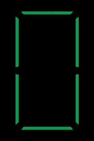
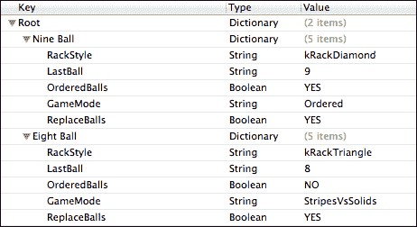
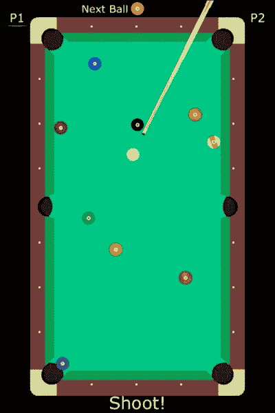

# 第七章。老式台球

在本章中，我们将使用 Box2D 物理引擎开发另一个项目。本章的重点将是如何轻松实现多种控制方法以及不同的规则集。

在本章中，我们将涵盖：

+   使用传感器

+   实现多种控制方案

+   设计规则引擎

# 游戏是…

本章中的游戏是一个老式、俯视的台球游戏。虽然我们的目标是实现合适的真实感动作，但我们的重点将放在一个有趣的街机风格游戏上。主要原因是在不使用完整的 3D 环境的情况下，无法准确模拟物理台球的物理特性。由于我们是在 2D 环境中工作，我们将没有诸如反旋转、给球施加“英文”等特性。我们还将使用我们在实现的游戏中采用“酒吧室”变体。我们做出这个选择是因为每个已建立的游戏实际上有成百上千种变体，所以我们选择“更多乐趣”而不是“官方规则”。游戏将是一个传递和玩的双人游戏。

# 整体设计

要制作一个 2D 台球游戏，实际上我们只需要在屏幕上渲染几个对象。台面将由边框和球洞组成。至于台面的其余部分，对我们来说，只是图形装饰。当然，我们需要构建 15 个编号的台球和母球。我们还需要一根球杆，我们将将其创建为一个精灵，但它不会是 Box2D 物理模拟中的物体。为什么不是呢？如果我们把台球杆作为一个启用了物理的物体来创建，那么我们就必须考虑台球杆“意外击中”桌上的其他（非母球）球的情况。虽然这可能在现实桌球桌上发生，但通常是不受欢迎的。相反，我们将使用台球杆作为计划击球的视觉“标记”，球与球之间的距离将作为我们衡量击球强度的标准。大多数台球桌上的交互将由 Box2D 模拟本身处理，所以这部分将是容易的。

在本章中，我们将更关注控制机制和规则引擎。我们将采用两种不同的基于触摸的控制机制，并构建一个可以玩“酒吧风格”八球和九球的规则引擎。正如我们在引言中所说，我们使用“酒吧规则”作为基线方法。请随意扩展规则引擎，以适应您玩台球的方式。

# 构建台面

我们当前的首要任务是构建台球桌。我们将从查看我们的定义开始，因为我们将在这章中广泛使用这些定义：

**文件名:** `OPDefinitions.h`

```swift
// Audio definitions
#define SND_BUTTON @"button.caf"

// Box2D definition
#define PTM_RATIO 32

// Define the pocket's tag
#define kPocket 500

typedef enum {
    kBallNone = -1,
    kBallCue = 0,
    kBallOne,
    kBallTwo,
    kBallThree,
    kBallFour,
    kBallFive,
    kBallSix,
    kBallSeven,
    kBallEight,
    kBallNine,
    kBallTen,
    kBallEleven,
    kBallTwelve,
    kBallThirteen,
    kBallFourteen,
    kBallFifteen
} BallID;

typedef enum {
    kRackTriangle = 50,
    kRackDiamond,
    kRackFailed
} RackLayoutType;

typedef enum {
    kStripes = 100,
    kSolids,
    kOrdered,
    kStripesVsSolids,
    kNone
} GameMode;
```

你现在应该熟悉`typedef`和`enum`语句。我们创建`BallID`类型来表示编号球，以简化表示。为了能够轻松地将`NSInteger`值转换为`BallID`值，我们将编号球设置为与球上的数字相等。球杆的编号为 0，我们还保留了对`kBallNone`的引用，即`-1`，这样我们就可以覆盖所有情况（当检测台面划痕时很有用）。我们定义了两种`RackLayoutType`类型，即菱形和三角形。我们还设置了`GameMode`为条纹、纯色、有序或条纹对纯色。我们使用最后一个值来识别在任何人 pocket 任何条纹或纯色之前（也称为台面“开放”）的游戏。我们还有一个`#define`语句来定义`kPocket`为`500`。我们将在碰撞检测中使用这个值来确定球何时击中口袋。最后，还有`PTM_RATIO`，你应该在第五章中熟悉它，*使用 Box2D 的砖块击球*，它定义了点对米的比例。

## Box2D 世界

对于任何 Box2D 模拟，我们需要为物体定义一个世界。如果你需要复习 Box2D 世界及其内部结构，请回到并重新阅读第五章中的*Box2D：入门*部分，*使用 Box2D 的砖块击球*。

**文件名:** `OPPlayfieldLayer.mm`

```swift
-(void) initWorld
{
  b2Vec2 gravity;
  gravity.Set(0.0f, 0.0f);
  world = new b2World(gravity);

  // Do we want to let bodies sleep?
  world->SetAllowSleeping(true);
  world->SetContinuousPhysics(true);

    // Create contact listener
    contactListener = new OPContactListener();
    world->SetContactListener(contactListener);
}
```

正如我们在第五章中所做的那样，我们使用零重力来定义我们的世界，因为我们不希望环境有任何向下的力。我们允许物体进入睡眠状态，并允许连续的物理运算，这将提高模拟的准确性。最后，我们建立了一个接触监听器。对于这个游戏，我们使用了一个与第五章中几乎相同的接触监听器，即*使用 Box2D 的砖块击球*。唯一的区别是我们将其中所有元素的名字从 BR…改为 OP…。这里我们不会重复代码，所以请随意参考那一章或这一章的源代码包。

## 构建轨道

轨道是台球桌上最常交互的元素之一，所以我们将首先构建它们。由于所有六个轨道的物理属性相同，我们将构建一个单独的方法来创建轨道，并通过传递参数到该方法来创建每个轨道。我们首先看看“核心代码”：

**文件名:** `OPPlayfieldLayer.mm`

```swift
-(void) createRailWithImage:(NSString*)img atPos:(CGPoint)pos withVerts:(b2Vec2*)verts {
    // Create the rail
    PhysicsSprite *rail = [PhysicsSprite
                 spriteWithSpriteFrameName:img];
    [rail setPosition:pos];
    [poolsheet addChild: rail];

    // Create rail body
    b2BodyDef railBodyDef;
    railBodyDef.type = b2_staticBody;
    railBodyDef.position.Set(pos.x/PTM_RATIO, 
                             pos.y/PTM_RATIO);
    railBodyDef.userData = rail;
    b2Body *railBody = world->CreateBody(&railBodyDef);

    // Store the body in the sprite
    [rail setPhysicsBody:railBody];

    // Build the fixture
    b2PolygonShape railShape;
    int num = 4;

    railShape.Set(verts, num);

    // Create the shape definition and add it to the body
    b2FixtureDef railShapeDef;
    railShapeDef.shape = &railShape;
    railShapeDef.density = 50.0f;
    railShapeDef.friction = 0.3f;
    railShapeDef.restitution = 0.5f;
    railBody->CreateFixture(&railShapeDef);  
}
```

此方法接受三个参数：精灵图像的名称、精灵和身体的定位，以及定义轨道形状的`verts`数组。轨道使用`PhysicsSprite`类定义，我们也在第五章，*使用 Box2D 的砖块破碎球*中看到过。如您所记得，`PhysicsSprite`对象就像一个普通的`CCSprite`，但它持有附加到其上的身体的引用。Cocos2d 将自动保持精灵的位置和旋转与底层的 Box2D 身体同步。

对于轨道，我们使用传递的图像名称构建精灵，然后构建相关的身体。在身体构建完成后，我们使用`setPhysicsBody`方法将身体附加到精灵上。接下来，我们定义轨道的形状。因为轨道形状非常简单，我们知道我们只需要四个`verts`来定义每条轨道。当我们定义固定装置时，我们设置相当高的密度`50.0f`，适中的摩擦`0.3f`，以及中间的恢复值`0.5f`。这些值在游戏测试中已经调整过，以给轨道带来良好的“弹性”，感觉更像真实的台面。

现在，我们可以看看我们如何调用此方法来定义桌子的六条轨道：

**文件名：** `OPPlayfieldLayer.mm`

```swift
-(void) createRails {
    // Top left rail
    CGPoint railPos1 = ccp(58,338);
    b2Vec2 vert1[] = {
        b2Vec2(5.5f / PTM_RATIO, -84.0f / PTM_RATIO),
        b2Vec2(4.5f / PTM_RATIO, 80.0f / PTM_RATIO),
        b2Vec2(-5.5f / PTM_RATIO, 87.0f / PTM_RATIO),
        b2Vec2(-5.5f / PTM_RATIO, -87.0f / PTM_RATIO)
    };
    [self createRailWithImage:@"rail1.png" atPos:railPos1 withVerts:vert1];

    // Bottom left rail
    CGPoint railPos2 = ccp(58,142);
    b2Vec2 vert2[] = {
        b2Vec2(5.5f / PTM_RATIO, 84.5f / PTM_RATIO),
        b2Vec2(-5.5f / PTM_RATIO, 86.5f / PTM_RATIO),
        b2Vec2(-5.5f / PTM_RATIO, -86.5f / PTM_RATIO),
        b2Vec2(5.5f / PTM_RATIO, -78.5f / PTM_RATIO)
    };
    [self createRailWithImage:@"rail2.png" atPos:railPos2 withVerts:vert2];

    // Bottom rail
    CGPoint railPos3 = ccp(160,44);
    b2Vec2 vert3[] = {
        b2Vec2(-88.5f / PTM_RATIO, -5.5f / PTM_RATIO),
        b2Vec2(88.5f / PTM_RATIO, -5.5f / PTM_RATIO),
        b2Vec2(81.5f / PTM_RATIO, 5.5f / PTM_RATIO),
        b2Vec2(-81.5f / PTM_RATIO, 5.5f / PTM_RATIO)
    };    
    [self createRailWithImage:@"rail3.png" atPos:railPos3 withVerts:vert3];

    // Bottom right rail
    CGPoint railPos4 = ccp(262,142);
    b2Vec2 vert4[] = {
        b2Vec2(5.5f / PTM_RATIO, -86.0f / PTM_RATIO),
        b2Vec2(5.5f / PTM_RATIO, 86.0f / PTM_RATIO),
        b2Vec2(-5.5f / PTM_RATIO, 85.0f / PTM_RATIO),
        b2Vec2(-5.5f / PTM_RATIO, -78.0f / PTM_RATIO)
    };    
    [self createRailWithImage:@"rail4.png" atPos:railPos4 withVerts:vert4];

    // Top right rail
    CGPoint railPos5 = ccp(262,338);
    b2Vec2 vert5[] = {
        b2Vec2(5.5f / PTM_RATIO, 86.5f / PTM_RATIO),
        b2Vec2(-5.5f / PTM_RATIO, 78.5f / PTM_RATIO),
        b2Vec2(-5.5f / PTM_RATIO, -85.5f / PTM_RATIO),
        b2Vec2(5.5f / PTM_RATIO, -86.5f / PTM_RATIO)
    };    
    [self createRailWithImage:@"rail5.png" atPos:railPos5 withVerts:vert5];

    // Top rail
    CGPoint railPos6 = ccp(160,436);
    b2Vec2 vert6[] = {
        b2Vec2(89.0f / PTM_RATIO, 6.0f / PTM_RATIO),
        b2Vec2(-89.0f / PTM_RATIO, 6.0f / PTM_RATIO),
        b2Vec2(-82.0f / PTM_RATIO, -5.0f / PTM_RATIO),
        b2Vec2(81.0f / PTM_RATIO, -5.0f / PTM_RATIO)
    };    
    [self createRailWithImage:@"rail6.png" atPos:railPos6 withVerts:vert6];
}
```

乍一看，这似乎需要很多代码，但实际上是重复了六次相同的模式，以适应每条轨道。

对于每条轨道，我们根据精灵的中心点定义位置，因为我们正在使用轨道的默认居中锚点。然后我们定义定义每条轨道四边的四个`verts`数组。您会注意到它们不是正方形，因为我们需要在口袋周围有锥形端部，以使每个口袋的“口”更平滑。最后，我们调用我们刚刚审查的`createRailWithImage`方法。现在我们有了轨道，它们看起来是这样的：



## 构建口袋

现在我们已经构建了轨道，我们需要添加桌子本身的唯一其他“交互”元素，即口袋。我们也将使用类似的两方法方法来构建它们，因为口袋的唯一区别是它们的位置。

**文件名：** `OPPlayfieldLayer.mm`

```swift
-(void) createPocketAtPos:(CGPoint)pos {
    // Create sprite and add it to layer
    CCSprite *pocket = [CCSprite
           spriteWithSpriteFrameName:@"whitespeck.png"];
    pocket.position = pos;
    pocket.tag = kPocket;
    [pocket setColor:ccBLACK];
    [self addChild:pocket z:0];

    // Create a pocket body
    b2BodyDef pocketBodyDef;
    pocketBodyDef.type = b2_dynamicBody;
    pocketBodyDef.position.Set(pos.x/PTM_RATIO, 
                             pos.y/PTM_RATIO);
    pocketBodyDef.userData = pocket;
    b2Body *pocketBody = world->CreateBody(&pocketBodyDef);

    //Create a circle shape
    b2CircleShape circle;
    circle.m_radius = 7.0/PTM_RATIO;

    //Create fixture definition and add to body
    b2FixtureDef pocketFixtureDef;
    pocketFixtureDef.shape = &circle;
    pocketFixtureDef.isSensor = YES;

    pocketBody->CreateFixture(&pocketFixtureDef);
}
```

在这里，我们遵循与轨道相同的基公式。我们构建一个精灵、身体、形状和固定装置。尽管在技术上我们不需要精灵来放置口袋，但我们仍将使用我们信任的`whitespeck.png`，我们在第六章，*光周期*中大量使用过。在这种情况下，我们将它染成黑色，使其消失在口袋中。（对于调试，将其改为更亮的颜色也有助于看到口袋的位置。）那么为什么还要使用它呢？我们在这里使用精灵是因为它允许我们向精灵添加一个标签，`kPocket`。这使得碰撞变得稍微简单一些，因为我们将能够使用精灵标签来处理所有我们关心的碰撞对象（口袋和球）。

你可能会注意到，与轨道不同，我们不需要这个是“物理启用”的，所以口袋精灵使用的是正常的 `CCSprite` 类而不是 `PhysicsSprite` 类。当我们定义口袋的形状时，我们使用半径为 `7.0` 的圆形。这是因为我们需要一个更大的目标来检测口袋中的球。我们使这些圆圈比桌子上实际物理尺寸的口袋略小，因为我们希望允许球挂在口袋的边缘，就像在真实桌球桌上一样。

最后，当我们定义 `pocketFixtureDef` 时，你会注意到我们没有使用任何通常的值，如 `density`、`friction` 或 `restitution`。这是因为我们不希望口袋参与物理模拟中的“反弹”。相反，我们只需将 `isSensor` 设置为 `YES`。传感器是一个在碰撞处理程序中注册的物理对象，但实际上在世界上没有任何物理“存在”。当某物接触传感器时，我们将注册一个接触点，但其他对象将能够穿过传感器。

现在我们可以看看用来驱动口袋传感器创建的第二个方法：

**文件名:** `OPPlayfieldLayer.mm`

```swift
-(void) createPockets {
    // Left top pocket
    [self createPocketAtPos:ccp(57,437)];

    // Left middle pocket
    [self createPocketAtPos:ccp(52,240)];

    // Left bottom pocket
    [self createPocketAtPos:ccp(57,43)];

    // Right top pocket
    [self createPocketAtPos:ccp(265,437)];

    // Right middle pocket
    [self createPocketAtPos:ccp(272,240)];

    // Right bottom pocket
    [self createPocketAtPos:ccp(265,43)];
}
```

与我们构建轨道的第二种方法所需的额外代码相比，这个方法真的很简单。我们有六个口袋，所以我们只需调用前面的方法并传递口袋的坐标，就完成了。

## 创建球杆

球杆纯粹是装饰性的。我们将通过编程控制“击打”球，球杆仅用作瞄准参考点。尽管如此，没有球杆，游戏就不会有“台球”的感觉。球杆仅在瞄准时出现在屏幕上，当我们击球时将淡出。因为球杆与控制构建方式紧密相连，所以我们将在本章后面讨论球杆的使用方法。现在，让我们看看我们是如何构建它的：

**文件名:** `OPPlayfieldLayer.mm`

```swift
-(void) createPoolCue {
    poolcue = [CCSprite
         spriteWithSpriteFrameName:@"cue_stick.png"];
    [poolcue setAnchorPoint:ccp(0.5,1)];
    [poolcue setVisible:NO];
    [poolsheet addChild:poolcue z:50];
}
```

由于它主要是装饰性的，我们使用一个正常的 `CCSprite`。我们将 `anchorPoint` 属性设置为球杆的尖端（位于顶部中央）。当我们旋转球杆时，这将允许它在尖端旋转。我们还设置了可见属性为 `NO`，因为球杆只有在需要时才会变得可见。

# 加载规则

不讨论规则引擎，我们无法取得更大的进展。游戏的一些配置，包括我们使用哪种球架来控制球，都是由规则控制的。我们将使用一个独立的“规则”类，`OPRulesBase`。让我们首先看看这个类的完整头文件：

**文件名:** `OPRulesBase.h`

```swift
#import <Foundation/Foundation.h>
#import "cocos2d.h"
#import "OPDefinitions.h"

@interface OPRulesBase : CCNode {
    RackLayoutType rackStyle;
    BallID lastBall;
    BOOL orderedBalls;
    GameMode gameMode;
    BOOL replaceBalls;
    BOOL isBreak;
    GameMode player1Goal;
    GameMode player2Goal;
    BallID nextOrderedBall; // Number of next ball
    NSInteger currentPlayer;
    BOOL isTableScratch;
}

@property (nonatomic, assign) RackLayoutType rackStyle;
@property (nonatomic, assign) BallID lastBall;
@property (nonatomic, assign) BOOL orderedBalls;
@property (nonatomic, assign) GameMode gameMode;
@property (nonatomic, assign) BOOL replaceBalls;
@property (nonatomic, assign) NSInteger currentPlayer;
@property (nonatomic, assign) BOOL isTableScratch;
@property (nonatomic, assign) GameMode player1Goal;
@property (nonatomic, assign) GameMode player2Goal;
@property (nonatomic, assign) BallID nextOrderedBall;

-(id) initWithRulesForGame:(NSString*)gameName;
-(BOOL) isLegalFirstHit:(BallID)firstBall;
-(BOOL) didSinkValidBall:(NSArray*)ballArray;
-(BOOL) didSinkLastBall:(NSArray*)ballArray;
-(BOOL) didSinkCueBall:(NSArray*)ballArray;
-(BOOL) isValidLastBall:(NSArray*)ballsSunk
           withBallsOnTable:(NSArray*)ballsOnTable;
-(void) findNextOrderedBall:(NSArray*)tableBalls;

@end
```

前五个变量都是我们需要定义游戏规则的参数。因为这些都将由 `OPPlayfieldLayer` 类使用，我们必须将它们全部定义为属性。其他变量将在我们使用它们时在讨论中解释。这个头文件中的类给你一点关于我们将在本章后面部分如何实现完整规则引擎的“预览”。正如你所见，大多数类都是“询问”方法，用来“询问”规则引擎关于各种条件的状态。这些方法将根据游戏类型而变化，这就是为什么这些“询问方法”是规则引擎的一部分。

当我们转向实现文件时，我们将首先查看我们将用于规则的定制 `init` 方法：

**文件名:** `OPRulesBase.mm`

```swift
-(id) initWithRulesForGame:(NSString*)gameName {
    if(self = [super init]) {
        // Load the rules for the game chosen
        [self loadRulesWith:gameName];

        isTableScratch = NO;
        isBreak = YES;
    }
    return self;
}
```

这是一个相当简单的 `init` 方法，它调用 `loadRulesWith:gameName` 方法，并为表格变量（`isTableScratch` 和 `isBreak`）设置了一些起始值。在我们到达 `loadRulesWith` 方法之前，我们还需要回顾其他一些方法：

**文件名:** `OPRulesBase.mm`

```swift
-(id) readPlist:(NSString*) fileName {
  NSData *plistData;
  NSString *error;
  NSPropertyListFormat format;
  id plist;

    // Assumes filename is part of the main bundle
  NSString *localizedPath = [[NSBundle mainBundle]
            pathForResource:fileName ofType:@"plist"];
  plistData = [NSData dataWithContentsOfFile:localizedPath];
  plist = [NSPropertyListSerialization
            propertyListFromData:plistData
            mutabilityOption:NSPropertyListImmutable
            format:&format errorDescription:&error];

  if (!plist) {
    NSLog(@"Error reading plist from file '%s', error '%s'",
            [localizedPath UTF8String], [error UTF8String]);
  }
  return plist;
}

-(NSDictionary*)getDictionaryFromPlist:(NSString*)fileName {
    return (NSDictionary*)[self readPlist:fileName];
}
```

我们之前见过的 `readPlist` 和 `getDictionaryFromPlist` 方法，也出现在第五章的*砖块击球*部分，即*使用 Box2D 的砖块击球*。`readPlist` 方法会将命名的 plist 载入内存，并以通用类型 `id` 返回。`getDictionaryFromPlist` 方法将 `readPlist` 的结果转换为 `NSDictionary`，并将其返回给调用方法。这就是将我们的 plist 转换为 `NSDictionary` 所需的全部操作。

## Rules.plist

在我们进一步探讨加载器之前，我们应该看看我们的规则 plist 实际上看起来是什么样子。这就是 plist 本身：



如你所见，结构中的第一层是命名游戏（**八球**，**九球**），在这些字典中有一组字符串和布尔值，定义了游戏的细节。因为我们选择将 `RackStyle` 和 `GameMode` 元素表示为字符串，所以我们需要将它们转换为引擎可以更方便使用的格式。

现在我们已经把所有部件拼在一起，可以理解 `loadRulesWith` 方法了。

**文件名:** `OPRulesBase.mm`

```swift
-(void) loadRulesWith:(NSString*)listKey {
    // Load the rules plist
    NSDictionary *ruleBook = [NSDictionary
                dictionaryWithDictionary:
                [self getDictionaryFromPlist:@"rules"]];
    NSDictionary *theseRules = [NSDictionary
                dictionaryWithDictionary:
                [ruleBook objectForKey:listKey]];
    self.rackStyle = [self convertRackType:
                [theseRules objectForKey:@"RackStyle"]];
    self.lastBall = (BallID)[[theseRules
                objectForKey:@"LastBall"] integerValue];
    self.orderedBalls = [[theseRules
                objectForKey:@"OrderedBalls"] boolValue];
    self.gameMode = [self convertGameMode:[theseRules
                objectForKey:@"GameMode"]];
    self.replaceBalls = [[theseRules
                objectForKey:@"ReplaceBalls"] boolValue];

    player1Goal = gameMode;
    player2Goal = gameMode;

    if (self.gameMode == kOrdered) {
        nextOrderedBall = kBallOne;
    }

    currentPlayer = 1;
}
```

我们首先使用`getDictionaryFromPlist`方法加载`rules.plist`。我们将规则加载到`ruleBook`字典中，然后创建另一个字典`theseRules`，它从我们的`ruleBook`字典中获取命名游戏字典。从那里开始，我们开始从那个"游戏级别"字典中填充我们的基本规则属性。由于`NSDictionary`只存储对象，我们不得不在将值插入属性之前将几个键的值进行转换。对于`LastBall`，我们将对象转换为对象的`integerValue`（存储为`NSNumber`）。你会注意到我们将它转换为整数，但在设置属性值时将其转换为`BallID`类型。这就是我们在`OPDefinitions.h`文件中的`typedef` `enum`中设置的数值表示派上用场的地方。因为例如，`kBallNine`在内部表示为整数`9`，我们可以自由地在这些数据类型之间进行转换。如果我们为`typedef` `enum`使用了其他值，我们就不得不进行一些更复杂的转换，可能需要扩展的`switch`语句。同样，我们获取`OrderedBalls`和`ReplaceBalls`键的`boolValue`，因此它们将“适合”到我们的布尔属性中。

另外两个规则属性需要特别考虑。因为我们选择将它们作为字符串存储在`rules.plist`中，我们必须进行字符串比较以将它们转换为游戏想要使用的值。现在让我们看看转换方法：

**文件名:** `OPRulesBase.mm`

```swift
-(RackLayoutType) convertRackType:(NSString*)rackStr {
    if ([rackStr isEqualToString:@"kRackDiamond"]) {
        return kRackDiamond;
    } else if ([rackStr isEqualToString:@"kRackTriangle"]) {
        return kRackTriangle;
    } else {
        NSLog(@"unknown rack type %@ in the plist.", rackStr);
    }
    return kRackFailed;
}

-(GameMode) convertGameMode:(NSString*)gameStr {
    if ([gameStr isEqualToString:@"Ordered"]) {
        return kOrdered;
    }
    else if ([gameStr isEqualToString:@"StripesVsSolids"]) {
        return kStripesVsSolids;
    }
    return kNone;
}
```

对于这两种方法，我们传递给它来自字典的字符串，并将字符串与我们的定义值进行比较。然后我们可以返回与所选选项对应的`typedef` `enum`值。我们本可以避免这样做，将托盘类型和游戏模式作为数字存储在 plist 中，但这会使人类阅读（和编写）plist 变得不那么容易理解。因为我们只在加载规则时执行这些比较，所以使用这种较慢的方法不会对性能产生负面影响。

在`loadRulesWith`方法的最后几行中，我们将当前加载的`gameMode`赋值给`player1Goal`和`player2Goal`属性。这为玩家确定了他们在游戏中的目标是什么。为什么是在玩家级别？这实际上归结于八球游戏固有的复杂性，其中一名玩家将瞄准条纹球，而另一名玩家将瞄准固体球。在任何一个球被击入之前，台面是“开放的”，因此所有射击（除了最后一球）都是合法的。所以在这种情况下，起始游戏是“条纹对固体”对两名玩家，直到游戏进展到某个点，其中一个被认为目标是“条纹”，而另一个是“固体”。

我们还检查`gameMode`是否为`kOrdered`。这意味着球将按数字顺序沉入。如果是这种情况，`nextOrderedBall`变量将被设置为`kBallOne`。如果游戏是其他任何东西，`nextOrderedBall`将被忽略。最后，`currentPlayer`始终从玩家 1 开始。

# 排列起来

现在我们知道了将要玩的游戏类型，我们就有足够的信息在桌子上构建台子了。首先我们需要知道如何构建球。

**文件名:** `OPPlayfieldLayer.mm`

```swift
-(void) createBall:(BallID)ballID AtPos:(CGPoint)startPos {
    // Create the filename
    NSString *ballImg = [NSString
                      stringWithFormat:@"ball_%i.png",ballID];

    // Create sprite and add it to layer
    OPBall *ball = [OPBall spriteWithSpriteFrameName:ballImg];
    ball.position = startPos;
    ball.tag = ballID;
    [self addChild:ball z:10];

    // Create ball body
    b2BodyDef ballBodyDef;
    ballBodyDef.type = b2_dynamicBody;
    ballBodyDef.position.Set(startPos.x/PTM_RATIO,
                             startPos.y/PTM_RATIO);
    ballBodyDef.userData = ball;
    b2Body *ballBody = world->CreateBody(&ballBodyDef);

    // Store the body in the sprite
    [ball setPhysicsBody:ballBody];

    //Create a circle shape
    b2CircleShape circle;
    circle.m_radius = 7.5/PTM_RATIO;  // 7.5 point radius

    //Create fixture definition and add to body
    b2FixtureDef ballFixtureDef;
    ballFixtureDef.shape = &circle;
    ballFixtureDef.density = 1.0f;
    ballFixtureDef.friction = 0.5f;
    ballFixtureDef.restitution = 0.9f;

    ballBody->CreateFixture(&ballFixtureDef);
    ballBody->SetFixedRotation(false);
    ballBody->SetLinearDamping(0.7f);
    ballBody->SetAngularDamping(0.5f);
    ballBody->SetBullet(TRUE);

    if (ballID == kBallCue) {
        cueBallBody = ballBody;
    }
}
```

这与用于创建轨道和袋子的构建器类似，但有几点例外。我们向这个方法传递了`BallID`和`startPos`变量，这样我们就能知道要构建哪个球，以及在哪里构建它。我们使用`OPBall`类，它是`PhysicsSprite`的子类，来表示球。`OPBall`类是`PhysicsSprite`的直接传递，没有添加任何功能。我们这样做是因为在碰撞处理程序中，我们可以使用`isMemberOfClass`方法来确定对象是否是球。如果我们设计不同的碰撞处理程序，我们可以用`PhysicsSprite`来代替球。

对于其余的球实例化，我们遵循构建身体、将其分配给精灵、创建固定装置并将其附加到身体上的模式。我们使用`密度`为`1.0f`、`摩擦`为`0.5f`和`恢复`为`0.9f`来给固定装置一个良好的“台球感觉”。然后我们使用一些之前没有真正使用过的身体对象的附加成员。我们关闭`SetFixedRotation`，这样球就能旋转，而不是保持原始旋转。我们将线性阻尼设置为`0.7f`，角阻尼设置为`0.5f`。这些共同将有助于模拟球在台布上滚动的效果。这是在这个游戏中我们“伪造”物理世界的一个地方，因为我们实际上并没有创建桌面对象。线性阻尼会减慢球的向前运动，角阻尼会帮助减慢球的旋转。与固定装置的设置一起，这些提供了对台球桌相当逼真的感觉。

## 构建台子

现在我们可以构建台子了。让我们看看代码：

**文件名:** `OPPlayfieldLayer.mm`

```swift
-(void) createRackWithLayout:(RackLayoutType)rack {
    // Define the standard ball positions
    CGPoint footSpot = ccp(160,335);
    CGPoint r1b1 = ccp(153,348);
    CGPoint r1b2 = ccp(167,348);
    CGPoint r2b1 = ccp(146,361);
    CGPoint r2b2 = ccp(160,361);
    CGPoint r2b3 = ccp(174,361);
    CGPoint r3b1 = ccp(139,374);
    CGPoint r3b2 = ccp(153,374);
    CGPoint r3b3 = ccp(167,374);
    CGPoint r3b4 = ccp(181,374);
    CGPoint r4b1 = ccp(132,388);
    CGPoint r4b2 = ccp(146,388);
    CGPoint r4b3 = ccp(160,388);
    CGPoint r4b4 = ccp(174,388);
    CGPoint r4b5 = ccp(188,388);

    switch (rack) {
        case kRackTriangle:
            // Build a standard triangle rack
            [self createBall:kBallNine AtPos:footSpot];
            [self createBall:kBallSeven AtPos:r1b1];
            [self createBall:kBallTwelve AtPos:r1b2];
            [self createBall:kBallFifteen AtPos:r2b1];
            [self createBall:kBallEight AtPos:r2b2];
            [self createBall:kBallOne AtPos:r2b3];
            [self createBall:kBallSix AtPos:r3b1];
            [self createBall:kBallTen AtPos:r3b2];
            [self createBall:kBallThree AtPos:r3b3];
            [self createBall:kBallFourteen AtPos:r3b4];
            [self createBall:kBallEleven AtPos:r4b1];
            [self createBall:kBallTwo AtPos:r4b2];
            [self createBall:kBallThirteen AtPos:r4b3];
            [self createBall:kBallFour AtPos:r4b4];
            [self createBall:kBallFive AtPos:r4b5];
            break;
        case kRackDiamond:
            // Build a diamond rack
            [self createBall:kBallOne AtPos:footSpot];
            [self createBall:kBallFive AtPos:r1b1];
            [self createBall:kBallSeven AtPos:r1b2];
            [self createBall:kBallEight AtPos:r2b1];
            [self createBall:kBallNine AtPos:r2b2];
            [self createBall:kBallThree AtPos:r2b3];
            [self createBall:kBallTwo AtPos:r3b2];
            [self createBall:kBallSix AtPos:r3b3];
            [self createBall:kBallFour AtPos:r4b3];
            break;
        default:
            break;
    }
}
```

在这个方法中，我们首先定义球将位于的位置。我们使用简写符号来表示大多数的`CGPoint`位置。缩写表示行和行中的球，所以`r1b1`是脚位（脚位是台球架的前“点”）之后第一行的最左边的球。我们首先定义所有位置，然后检查我们想要哪个台球架。如果我们调用三角形台球架（如八球），那么我们将填充每个位置上的球。如果我们需要一个三角形台球架（用于九球），那么我们只使用定义的 15 个位置中的 9 个。你会注意到，这些位置实际上非常接近。这是故意的，因为 Box2D 会稍微推动球，使它们都适合。最终结果是球都相互接触，这在台球中被称为“紧密排列”。

# 玩家 HUD

由于我们正在构建一个双玩家游戏，让我们快速看看我们是如何构建抬头显示器（Heads-Up Display）来为玩家提供反馈的：

**文件名:** `OPPlayfieldLayer.mm`

```swift
-(void) createPlayerScores {
    CCLabelTTF *player1 = [CCLabelTTF
                           labelWithString:@"P1"
                           fontName:@"Verdana"
                           fontSize:14];
    [player1 setPosition:ccp(20,460)];
    [self addChild:player1];

    CCLabelTTF *player2 = [CCLabelTTF
                           labelWithString:@"P2"
                           fontName:@"Verdana"
                           fontSize:14];
    [player2 setPosition:ccp(300,460)];
    [self addChild:player2];

    player1TargetLbl = [CCLabelTTF
                        labelWithString:@" "
                        fontName:@"Verdana" fontSize:8];
    [player1TargetLbl setPosition:ccp(20,440)];
    [self addChild:player1TargetLbl z:2];

    player2TargetLbl = [CCLabelTTF
                        labelWithString:@" "
                        fontName:@"Verdana" fontSize:8];
    [player2TargetLbl setPosition:ccp(300,440)];
    [self addChild:player2TargetLbl z:2];
    markPlayer = [CCSprite spriteWithSpriteFrameName:
                  @"whitespeck.png"];
    [markPlayer setColor:ccGREEN];
    [markPlayer setPosition:ccp(20,450)];
    [markPlayer setScaleX:10 * CC_CONTENT_SCALE_FACTOR()];
    [self addChild:markPlayer z:2];

    // Update the display
    if ([rules orderedBalls]) {
        CCLabelTTF *nextBallLbl = [CCLabelTTF
                            labelWithString:@"Next Ball"
                            fontName:@"Verdana"
                            fontSize:12];
        [nextBallLbl setPosition:ccp(122,470)];
        [self addChild:nextBallLbl z:100];
    }
}
```

我们构建简单的标签来识别玩家 1 和玩家 2，我们还创建了目标标签，我们将使用这些标签来识别玩家的“条纹”或“纯色”。我们再次使用我们的`whitespeck.png`图像，这次用来制作一条漂亮的绿色线，以标识哪个玩家的回合，使用`markPlayer`变量来保存这个精灵。最后，如果我们正在玩一个按顺序排列的球类游戏，我们还在显示的顶部添加了**下一球**的图例。因为我们已经讨论过目标几次，让我们看看它们是如何为玩家识别的：

**文件名:** `OPPlayfieldLayer.mm`

```swift
-(void) updatePlayerGoals {
    // Update the stripes/solids display for the players
    if ([rules player1Goal] == kStripes) {
        [player1TargetLbl setString:@"Stripes"];
        [player2TargetLbl setString:@"Solids"];
    } else if ([rules player1Goal] == kSolids) {
        [player1TargetLbl setString:@"Solids"];
        [player2TargetLbl setString:@"Stripes"];
    }

    // Update the display
    if ([rules orderedBalls]) {
        // Update the ordered ball goals, if applicable
        [rules findNextOrderedBall:
                    [self ballSpritesOnTable]];
        if (nextGoal != nil) {
            [nextGoal removeFromParentAndCleanup:YES];
        }
        // Create the filename
        NSString *ballImg = [NSString stringWithFormat:
                        @"ball_%i.png",
                        (BallID)[rules nextOrderedBall]];
        // Create sprite and add it to layer
        nextGoal = [CCSprite spriteWithSpriteFrameName:
                    ballImg];
        [nextGoal setPosition:ccp(160,470)];
        [self addChild:nextGoal]; 
    }
}
```

回顾我们在规则中关于玩家目标的讨论，这里我们简单地检查每个玩家的目标。根据它是否被设置为条纹或纯色，我们更新相应的目标标签以显示给用户他们要射击的目标。然后我们检查是否是按顺序排列的球类游戏。如果是，我们通过规则引擎检查桌面上最低编号的球是哪一个，并将该球的图片添加到显示的顶部，紧邻**下一球**标签。你会注意到我们调用了`ballSpritesOnTable`方法，所以现在我们应该去那里：

**文件名:** `OPPlayfieldLayer.mm`

```swift
-(NSArray*) ballSpritesOnTable {
    // Returns an array of all ball sprites on the table
    NSMutableArray *currentBalls = [[[NSMutableArray alloc]
                          initWithCapacity:16] autorelease];

    for(b2Body *b = world->GetBodyList(); b;b=b->GetNext()) {
        if (b->GetUserData() != nil) {
            OPBall *aBall = (OPBall*)b->GetUserData();
            if (aBall.tag < 100) {
                [currentBalls addObject:aBall];
            }
        }
    }
    return currentBalls;
}
```

在这里，我们遍历 Box2D 世界中的所有身体，并找到那些附加了精灵的身体。你会注意到我们检查确保`tag`小于`100`。这是因为口袋也有附加的精灵，但我们把`#define`的`kPocket`设置为`500`，所以我们不会意外地将口袋精灵添加到数组中。在所有球都被计算后，我们返回一个`NSArray`给调用方法。

我们剩下的唯一重要玩家方法是活动玩家更改：

**文件名:** `OPPlayfieldLayer.mm`

```swift
-(void) playerChange {
    if ([rules currentPlayer] == 1) {
        [self displayMessage:@"Player 2's turn" userDismiss:NO];
        [rules setCurrentPlayer:2];
        [markPlayer setPosition:ccp(300,450)];
    } else {
        [self displayMessage:@"Player 1's turn" userDismiss:NO];
        [rules setCurrentPlayer:1];
        [markPlayer setPosition:ccp(20,450)];
    }
}
```

这是一个简短而直接的方法。如果现在是玩家 1 的回合，我们将`currentPlayer`改为玩家 2，反之亦然。我们将`markPlayer`精灵移动到显示的适当一侧（在 P1 或 P2 标签下方），并调用`displayMessage`方法向玩家提供反馈。

## 显示消息

在整个游戏中，有许多时候我们需要向玩家显示消息。而不是反复构建相同的基本消息显示，我们将该功能合并到`displayMessage`和`dismissMessage`方法中。

**文件名:** `OPPlayfieldLayer.mm`

```swift
-(void) displayMessage:(NSString*)msg
             userDismiss:(BOOL)userDismiss {
    // If there is a current message, wait for it
    if (isDisplayingMsg) {
        CCDelayTime *del = [CCDelayTime
                            actionWithDuration:0.1];
        CCCallBlock *retry = [CCCallBlock
                              actionWithBlock:^{
          [self displayMessage:msg
                   userDismiss:userDismiss];
        }];
        [self runAction:[CCSequence actions:del,
                         retry, nil]];
        return;
    }
    isDisplayingMsg = YES;
    isUserDismissMsg = userDismiss;

    // Create the message label & display it
    message = [CCLabelTTF labelWithString:msg
                                 fontName:@"Verdana"
                                 fontSize:20];
    [message setPosition:ccp(size.width/2,
                             size.height/2)];
    [self addChild:message z:20];

    // If userDismiss is NO, set a 2 second destruct
    if (userDismiss == NO) {
        CCDelayTime *wait = [CCDelayTime
                             actionWithDuration:2.0f];
        CCCallFunc *dismiss = [CCCallFunc
                    actionWithTarget:self
                    selector:@selector(dismissMessage)];
        [self runAction:[CCSequence actions:wait,
                         dismiss, nil]];
    }
}
```

在这个方法中，我们首先检查确保我们还没有显示消息。如果我们正在显示（如`isDisplayingMsg`布尔变量所示），那么我们将等待`0.1`秒，并使用相同的参数再次调用它。如果没有消息正在显示，我们创建一个带有请求消息的标签，并将其显示在屏幕上。如果`userDismiss`是`NO`，那么我们将设置一个 2 秒定时器，然后调用`dismissMessage`。如果`userDismiss`是`YES`，那么消息将一直显示，直到用户触摸屏幕以取消它。

**文件名:** `OPPlayfieldLayer.mm`

```swift
-(void) dismissMessage {
    isDisplayingMsg = NO;
    [message removeFromParentAndCleanup:YES];
}
```

`dismissMessage`方法很简单。如果我们不需要用户取消选项，那么我们可以在`displayMessage`方法中轻松地将其嵌入`CCCallBlock`动作中，但在这里我们希望有更多的灵活性。

# 碰撞处理

在我们进入涵盖控制和规则引擎其余部分的最后阶段之前，我们现在对我们的游戏了解得足够多，可以实施碰撞检测，该检测使用的是我们在第五章中使用的相同接触监听器，即*使用 Box2D 的砖块破碎球*。我们将分步骤查看`update`方法，以便在过程中讨论它：

**文件名:** `OPPlayfieldLayer.mm` (`update`, 第一部分)

```swift
-(void) update: (ccTime) dt
{
  int32 velocityIterations = 30;
  int32 positionIterations = 30;

  // Instruct the world to perform a single step
  world->Step(dt, velocityIterations, positionIterations);	

    // Evaluate all contacts
    std::vector<b2Body *>toDestroy;
  std::vector<OPContact>::iterator pos;
  for (pos = contactListener->_contacts.begin();
     pos != contactListener->_contacts.end(); pos++) {
    OPContact contact = *pos;

        // Get the bodies involved in this contact
    b2Body *bodyA = contact.fixtureA->GetBody();
    b2Body *bodyB = contact.fixtureB->GetBody();

        // Get the sprites attached to these bodies
        CCSprite *spriteA = (CCSprite*)bodyA->GetUserData();
        CCSprite *spriteB = (CCSprite*)bodyB->GetUserData();
```

在这里首先要注意的重要一点是，我们确实增加了模拟在每一步中使用的迭代次数，以提高模拟的准确性。由于我们只有少数几个物体，这并不会对性能产生不利影响。

我们将世界向前推进，然后使用 C++向量遍历所有由接触监听器收集的接触。对于每个接触，我们获取相关的身体和它们的精灵，我们将它们存储在`bodyA`、`bodyB`、`spriteA`和`spriteB`中。我们保持精灵为`CCSprite`对象，因为我们无法确定该对象将是`CCSprite`的哪个子类。

**文件名:** `OPPlayfieldLayer.mm` (`update`, 第二部分)

```swift
        // Look for balls touching the pocket sensor
        if ([spriteA isMemberOfClass:[OPBall class]] &&
            spriteB.tag == kPocket) {
            if (std::find(toDestroy.begin(),
                          toDestroy.end(),
                          bodyA) == toDestroy.end()) {
                toDestroy.push_back(bodyA);
            }
        }
        // Check the same collision with opposite A/B
        else if (spriteA.tag == kPocket && [spriteB
                    isMemberOfClass:[OPBall class]]) {
            if (std::find(toDestroy.begin(),
                          toDestroy.end(),
                          bodyB) == toDestroy.end()) {
                toDestroy.push_back(bodyB);
            }
        }
        if ([spriteA isMemberOfClass:[OPBall class]] &&
            [spriteB isMemberOfClass:[OPBall class]]) {
            // Two balls collided
            // Let's store the FIRST collision
            if ((spriteA.tag == kBallCue ||
                 spriteB.tag == kBallCue) &&
                firstHit == kBallNone) {
                if (spriteA.tag == kBallCue) {
                    firstHit = (BallID)spriteB.tag;
                } else {
                    firstHit = (BallID)spriteA.tag;
                }
            }
        }
  }    
```

在本节中，我们比较`spriteA`和`spriteB`以确定其中之一是否是`OPBall`对象，而另一个具有`kPocket`标签。如果这是真的，那么一个球已经落入球洞，因此我们将球添加到`toDestroy`向量中以便稍后处理。你可能还记得第五章中的“使用 Box2D 的砖块破碎球”，我们无法保证身体报告给我们的顺序，因此我们必须以两种方式检查一切。

下一个检查是确定两个球是否相互碰撞。如果有两个球，那么我们检查其中一个是否是主球。如果是，并且这是主球自上次击打以来与另一个球接触的第一次接触，那么我们将对该标签的引用保存在变量`firstHit`中。我们为什么要这样做？台球有一个规则要求你在主球接触任何其他球之前先击打自己的球。通过在`firstHit`变量中存储第一个被接触的球，我们将能够正确跟踪主球首先击中了什么。我们将在稍后使用这个信息。

**文件名：** `OPPlayfieldLayer.mm` (`update`部分 3)

```swift
    // Destroy any bodies & sprites we need to get rid of
    std::vector<b2Body *>::iterator pos2;
    for(pos2 = toDestroy.begin(); pos2 != toDestroy.end();
                                                  ++pos2) {
        b2Body *body = *pos2;
        if (body->GetUserData() != NULL) {
            OPBall *sprite = (OPBall *) body->GetUserData();
            [self sinkBall:sprite];
        }        
        world->DestroyBody(body);
    }

    if ([self isTableMoving]) {
        self.isTouchBlocked = YES;
    } else {
        self.isTouchBlocked = NO;

        // Table is done.  Let's resolve the action.
        if (pendingTable) {
            [self checkTable];
            pendingTable = NO;
        }
    }
}
```

在`update`方法的最后一个部分，我们继续销毁添加到`toDestroy`向量中的任何身体（球），并将相应的精灵发送到`sinkBall`方法。

然后，我们检查桌子是否在移动，也就是说，是否有球仍在滚动。如果有，我们通过`isTouchBlocked`布尔变量阻止任何用户输入，然后调用`checkTable`方法查看发生了什么。我们使用`pendingTable`变量来允许我们仅在一切静止时检查桌子的状态。当我们击球时，我们将`pendingTable`设置为`YES`，本节将等待一切平静下来，然后检查桌子一次。

我们将在稍后了解`checkTable`方法，但现在让我们看看`sinkBall`和`isTableMoving`方法是如何工作的：

**文件名：** `OPPlayfieldLayer.mm`

```swift
-(void) sinkBall:(OPBall*)thisBall {

    // Keep the ball in the temp array
    [ballsSunk addObject:thisBall];

    // Destroy The Sprite
    [thisBall removeFromParentAndCleanup:YES];
}
```

如果我们想在沉没的球上做些花哨的事情，这里就是地方。对于我们的游戏，我们非常满足于简单地让球被添加到`ballsSunk`数组中，然后从层中移除球。

**文件名：** `OPPlayfieldLayer.mm`

```swift
-(BOOL) isTableMoving {
    for(b2Body *b = world->GetBodyList(); b;b=b->GetNext()) {
        // See if the body is still noticeably moving
        b2Vec2 vel = b->GetLinearVelocity();

        if (vel.Length() > 0.005f) {
            return YES;
        }
    }
    return NO;
}
```

要检查桌子是否在移动，我们可以简单地轮询以查看所有身体是否都在睡眠状态。这种方法的问题在于物理身体完全停止并进入睡眠状态需要一段时间。通过测试，我们确定这太长也太无聊了。因此，我们检查每个身体的速率长度。如果值大于`0.005f`，则球仍在明显移动。低于该速度，一切都在缓慢爬行，足以让我们继续检查桌子。

# 构建控制基础

我们现在已经到了可以构建玩家控制器的阶段。正如我们在介绍中所说，我们将构建两个控制方案。第一个是我们称之为“单触”的控制方案。这个控制器将从触摸被检测到的那一刻开始跟踪，直到它被释放。当触摸在屏幕上时，我们将更新球杆以跟随触摸，瞄准球杆。当触摸结束（手指抬起）时，我们将从球杆的位置进行射击，从球杆到球的位置将决定射击的强度。

第二个控制方案，我们称之为“双触”，在跟踪射击的方式上将与前者相似，但它不会在触摸抬起时自动射击。相反，一个写着**射击！**的按钮将出现在屏幕底部，触摸该按钮将进行射击。

两个控制方案共享一些代码，因此我们创建了`OPControlBase`类，然后我们将使用`OPControlOneTouch`和`OPControlTwoTouch`来创建这两个控制方案的子类，以处理这两个控制方案的具体细节。我们将首先查看`OPControlBase`类：

**文件名:** `OPControlBase.h`

```swift
@class OPPlayfieldLayer;

@interface OPControlBase : CCLayer {
    OPPlayfieldLayer *mp; // Main playfield
    float shotLength; // Length of the stroke
    CGPoint plannedHit; // Where the cue will hit
    CCLabelTTF *shootButton; // Only used by 2 touch
    CGPoint aimAtPoint; // Point the cue will aim at
    CCSprite *cueBallInHand; // For placing the cue ball
}

@property (nonatomic, assign) OPPlayfieldLayer *mp;
@property (nonatomic, assign) float shotLength;
@property (nonatomic, assign) CGPoint plannedHit;
@property (nonatomic, assign) CGPoint aimAtPoint;

-(void) updateCueAimFromLoc:(CGPoint)convLoc;
-(void) hideCue;

@end
```

在头文件中，我们可以看到我们需要跟踪的两个控制方案所需的变量。我们将保留对主游戏场层的引用，因为我们需要与之交互。我们跟踪`shotLength`变量（用作强度），`plannedHit`变量（我们将从该点击球），以及`aimAtPoint`变量，它将是球杆的位置。我们还有一个`cueBallInHand`精灵。当我们将球杆定位在桌面上时，我们将使用这个精灵，因为我们实际上不需要或想要一个实际的物理对象在玩家移动球杆时撞击其他球。

**文件名:** `OPControlBase.mm`

```swift
-(void) updateCueAimFromLoc:(CGPoint)convLoc {
    // Position the cue at the cue ball
    CGPoint offset = ccpSub(aimAtPoint,convLoc);
    CGPoint approach = ccpNormalize(offset);

    // Move the cue into the right angle
    [mp.poolcue setPosition:ccpSub(aimAtPoint, offset)];
    [mp.poolcue setVisible:YES];
    [mp.poolcue setRotation:
     (-1 * CC_RADIANS_TO_DEGREES(
                            ccpToAngle(approach))) + 90];

    // Calculate the power of the hit
    shotLength = sqrtf((offset.x* offset.x) +
                       (offset.y*offset.y)) - 4.5;

    // We limit how far away the cue can be
    if (shotLength > 75 || shotLength < 4) {
        // We reject this hit
        [self hideCue];
        return;
    } else {
        // Calculate the planned hit
        float hitPower = shotLength / 6;
        plannedHit = ccp(hitPower * approach.x,
                         hitPower * approach.y);
        mp.isHitReady = YES;
        shootButton.visible = YES;
    }
}
```

这是两个控制方案之间共享的主要方法。输入参数`convLoc`是从触摸处理程序转换的位置，我们将在将其转换为 OpenGL 空间后将其传递到这里。我们通过从`convLoc`位置（触摸位置）减去`aimAtPoint`位置（目标球）来确定`offset`。然后我们使用`ccpNormalize`函数将这个`offset`转换为表示所需角度的最小坐标。这将使我们能够自己控制击球的力量，而无需在计算中补偿距离。

使用`mp`变量作为对主游戏层的一个引用，我们继续将球杆移动到正确的位置，并使用`ccpToAngle`函数将`approach`变量转换为更有用的东西。这会创建一个以弧度为单位的值。我们使用`CC_RADIANS_TO_DEGREES()`将其转换为基于度的角度，并将其加到`90`（我们需要为此调整球杆的图形旋转），然后将整个值乘以`-1`。这给了我们正确的角度，使我们能够从当前触摸点使球杆指向球。

然后，我们使用一些简单的几何计算`shotLength`值。如果长度小于`4`（太靠近球）或大于`75`（太远以至于不合理），我们拒绝击球并隐藏球杆。否则，我们计算`hitPower`（`shotLength`除以`6`，使其成为一个更合理的功率级别），并使用它来确定计划中的击球。此方法实际上并不进行击球。相反，它更新视觉效果并生成我们准备击球所需的所有计算。细心的读者也会注意到我们正在将`shootButton`精灵设置为可见。这仅存在于我们的双触控制类中，所以在单触控制的情况下，这个调用将向一个`nil`对象发送消息，这将被完全忽略。

**文件名：** `OPControlBase.mm`

```swift
-(void) hideCue {
    // Hide the pool cue
    [mp.poolcue setPosition:CGPointZero];
    [mp.poolcue setVisible:NO];
    [mp.poolcue setOpacity:255];

    // There is not a valid hit
    // Reset all hit vars
    mp.isHitReady = NO;
    plannedHit = CGPointZero;
    shotLength = 0;

    // Hide the shoot button
    shootButton.visible = NO;
}
```

`hideCue`方法移除球杆并将所有变量重置为基线值，因为我们没有要打的球。这里这样做很重要，因为这不仅会在打出球后调用，还会在球无效时调用（球杆太远等）。我们再次调整`shootButton`精灵的可见性，如果按钮的精灵存在的话。如果不存在，则自动忽略此行。

## 单触控制

我们首先查看单触控制。类`OPControlOneTouch`是`OPControlBase`的子类，但没有需要添加的任何额外变量。

**文件名：** `OPControlOneTouch.mm`

```swift
-(BOOL) ccTouchBegan:(UITouch *)touch withEvent:(UIEvent *)event {
    // Reject touches for now
    if (mp.isTouchBlocked) {
        return NO;
    }
    if (mp.isUserDismissMsg) {
        [mp dismissMessage];
        [mp setIsUserDismissMsg:NO];
        return NO;
    }
    // The next touch returns to the menu
    if (mp.isGameOver) {
        [mp returnToMainMenu];
        return YES;
    }
    // Determine touch position
    CGPoint loc = [touch locationInView:[touch view]];
    CGPoint convLoc = [[CCDirector sharedDirector]
                       convertToGL:loc];
    // If there was a scratch, the cue is in hand
    if (mp.isBallInHand) {
        cueBallInHand = [CCSprite
             spriteWithSpriteFrameName:@"ball_0.png"];
        [cueBallInHand setPosition:convLoc];
        [mp addChild:cueBallInHand z:10];
        return YES;
    }
    // Check if the touch is on the table
    if (CGRectContainsPoint([[mp table] boundingBox],
             convLoc)) {
        // Store the point we are aiming at
        aimAtPoint = [mp getCueBallPos];

        // Update the cue position
        [self updateCueAimFromLoc:convLoc];
        return YES;
    }
    return NO;
}
```

我们从检查几个特殊情况开始`ccTouchBegan`方法。如果主游戏场上的`isTouchBlocked`是`YES`，则我们拒绝触摸。然后我们检查任何用户取消的消息，以查看是否需要清除这些消息。如果主游戏场设置了`isGameOver`标志，则下一次触摸将返回主菜单。我们现在使用标准坐标转换将触摸位置转换为`convLoc`变量。如果玩家应该在手中持有球（在擦球后），则触摸将创建一个新的`cueBallInHand`精灵。最后，如果触摸在桌子里，我们将`aimAtPoint`的位置设置为球的位置，并调用我们之前讨论过的`updateCueAimFromLoc`方法。

**文件名：** `OPPControlOneTouch.mm`

```swift
-(void)ccTouchMoved:(UITouch *)touch withEvent:(UIEvent *)event {
    // Determine touch position
    CGPoint loc = [touch locationInView:[touch view]];
    CGPoint convLoc = [[CCDirector sharedDirector]
                       convertToGL:loc];
    // If there was a scratch, the cue is in hand
    if (mp.isBallInHand) {
        [cueBallInHand setPosition:convLoc];
        return;
    }
    [self updateCueAimFromLoc:convLoc];
}
```

`ccTouchMoved`方法遵循与`ccTouchBegan`方法相同的做法。如果球在手中，那么触摸移动将使`cueBallInHand`精灵移动到触摸位置，这样球就会跟随触摸。如果球不在手中，那么我们再次调用`updateCueAimFromLoc`来更新球杆。

**文件名:** `OPControlTouchOne.mm`

```swift
-(void) ccTouchEnded:(UITouch *)touch withEvent:(UIEvent *)event {
    // If there was a scratch, the cue is in hand
    if (mp.isBallInHand) {
        [mp createBall:kBallCue AtPos:[cueBallInHand
                                            position]];
        [cueBallInHand removeFromParentAndCleanup:YES];
        mp.isBallInHand = NO;
    }
    // Only make the shot if it is in the legal range
    if (shotLength > 75 || shotLength < 4) {
        // Reject the shot
    }
    else {
        // Take the shot
        [mp makeTheShot];
    }
}
```

我们控制方法的最后一种是`ccTouchEnded`，当触摸抬起时进行击球。对于这个控制器，我们希望这能导致击球发生。与前面两种触摸方法一样，我们首先检查球是否在手中。如果是，那么我们调用主游戏场来在那个位置创建一个新的“真实”球，并丢弃我们用来表示它的`CCSprite`。在这里，我们也检查`shotLength`值以确保它不是太长，以避免用不可见的球杆进行击球。（如果没有这个检查，无论你是否能看到球杆，击球仍然会发生！）最后，我们调用主游戏场来实际进行击球。在我们继续查看两次触摸控制之前，让我们回到主游戏场，看看`makeTheShot`方法做了什么：

**文件名:** `OPPlayfieldLayer.mm`

```swift
-(void) makeTheShot {
    // Reset the "first hit" var
    firstHit = kBallNone;

    // The controller tells us where to aim
    CGPoint aimPoint = [contr aimAtPoint];

    // Set up the pool cue animation
    CCMoveTo *move = [CCMoveTo actionWithDuration:0.05
                                         position:aimPoint];
    CCCallBlock *hitIt = [CCCallBlock actionWithBlock:^{
        // Get ready to hit the ball
        b2Vec2 impulse = b2Vec2(contr.plannedHit.x,
                                contr.plannedHit.y);
        b2Vec2 aim = b2Vec2(aimPoint.x / PTM_RATIO,
                            aimPoint.y / PTM_RATIO);
        // Hit it
        cueBallBody->ApplyLinearImpulse(impulse, aim);
    }];
    CCDelayTime *wait = [CCDelayTime actionWithDuration:0.1];
    CCFadeOut *fadeCue = [CCFadeOut actionWithDuration:0.4];
    CCCallBlock *checkTbl = [CCCallBlock actionWithBlock:^{
        pendingTable = YES;
    }];
    CCCallFunc *hideCue = [CCCallFunc actionWithTarget:contr
                            selector:@selector(hideCue)];
    [poolcue runAction:[CCSequence actions:move, hitIt,
                     wait, fadeCue, hideCue, checkTbl,  nil]];
}
```

当我们进行击球时，我们将我们的`aimPoint`设置为与控制器的`aimAtPoint`（即球杆）相匹配。我们创建一系列动作来产生用球杆击球的错觉。首先，我们快速地将球杆移动到`aimPoint`，然后我们使用`CCCallBlock`动作对球施加线性冲量，然后逐渐消失球杆。正如我们之前所看到的，这里的`CCCallBlock`动作被有效地用来避免需要构建另一个方法。在序列中调用此块时，`^{ }`内的所有内容都将被执行。在这里，它只是将`pendingTable`变量设置为`YES`。

线性冲量是通过控制类中的`plannedHit`变量设置的，并直接应用于球杆的中心。（是的，台球纯主义者，我们知道击中球杆非中心位置的影响。对于这款游戏，我们选择不包含任何偏移控制。毕竟，这是街机台球，而不是真正的台球模拟器！）你会注意到，我们在球杆消失后添加了一个额外的`CCDelayTime`动作，然后设置`pendingTable`为`YES`。我们为什么要这样做？我们需要将`pendingTable`变量设置为`YES`，以便在桌子静止时`update`方法中的`checkTable`能正常工作。然而，如果我们在这个方法被调用时立即设置它，因为桌子在动作的前半秒左右仍然是“静止”的，所以桌子检查将在击球之前发生。由于我们需要在设置此变量之前让球移动，将此嵌入到动作序列中似乎是顺理成章的。

## 双触控制

我们的第二种控制方法将使用两次触摸，但大部分的“管道”与单次触摸控制器非常相似。让我们看看然后讨论：

**文件名:** `OPControlTwoTouch.mm`

```swift
-(id) init {
    if(self = [super init]) {
        shootButton = [CCLabelTTF labelWithString:@"Shoot!"
                 fontName:@"Verdana" fontSize:20];
        [shootButton setAnchorPoint:ccp(0.5,0)];
        [shootButton setPosition:ccp(160,0)];
        [shootButton setVisible:NO];
        [self addChild:shootButton z:10];
    }
    return self;
}
```

第一个不同之处在于我们为双触控制使用了自己的`init`方法。这个`init`，正如你所见，只是创建了一个**射击！**按钮，并将其放置在屏幕的底部中央，并将它的`visible`属性设置为`NO`。我们可以在需要时每次都重新创建它，但这样似乎很浪费，所以我们只创建一次，并在需要时切换可见属性。

实际操作中的双触控制方案如下：



**文件名:** `OPControlTwoTouch.mm`

```swift
-(BOOL) ccTouchBegan:(UITouch *)touch withEvent:(UIEvent *)event {
    // Reject touches for now
    if (mp.isTouchBlocked) {
        return NO;
    }
    if (mp.isUserDismissMsg) {
        [mp dismissMessage];
        [mp setIsUserDismissMsg:NO];
        return YES;
    }
    // If game over splash is finished, next touch
    // returns to the menu
    if (mp.isGameOver) {
        [mp returnToMainMenu];
        return YES;
    }
    // Determine touch position
    CGPoint loc = [touch locationInView:[touch view]];
    CGPoint convLoc = [[CCDirector sharedDirector]
                       convertToGL:loc];
    // If there was a scratch, the cue is in hand
    if (mp.isBallInHand) {
        cueBallInHand = [CCSprite
           spriteWithSpriteFrameName:@"ball_0.png"];
        [cueBallInHand setPosition:convLoc];
        [mp addChild:cueBallInHand z:10];
        return YES;
    }
    // If we are tracking the aim
    aimAtPoint = [mp getCueBallPos];
    // Check if the Shoot Button was touched
    if (CGRectContainsPoint([shootButton boundingBox],
                   convLoc)) {
        [mp makeTheShot];
        return YES;
    }
    // Check if the touch is on the table
    if (CGRectContainsPoint([[mp table] boundingBox],
                   convLoc)) {
        // Update the cue position
        [self updateCueAimFromLoc:convLoc];
        return YES;
    }
    return NO;
}
```

在`ccTouchBegan`中，我们遵循相同的代码结构，直到包括`isBallInHand`变量评估。在那之后，我们看到了差异。我们仍然将`aimAtPoint`变量设置为球的位置，但然后我们会检查是否触摸了射击按钮。如果是，那么我们调用`makeTheShot`。如果有任何其他触摸在桌子上，那么我们更新球杆的位置。

**文件名:** `OPControlTwoTouch.mm`

```swift
-(void)ccTouchMoved:(UITouch *)touch withEvent:(UIEvent *)event {
    // Determine touch position
    CGPoint loc = [touch locationInView:[touch view]];
    CGPoint convLoc = [[CCDirector sharedDirector]
                       convertToGL:loc];

    // If there was a scratch, the cue is in hand
    if (mp.isBallInHand) {
        [cueBallInHand setPosition:convLoc];
        return;
    }

    // If not ball in hand, control the cue
    [self updateCueAimFromLoc:convLoc];
}
```

这个方法与单触版本的此方法完全相同。它将跟踪触摸，并在触摸移动时不断更新球杆（以及所有力量和距离变量）。

**文件名:** `OPControlTwoTouch.mm`

```swift
-(void)ccTouchEnded:(UITouch *)touch withEvent:(UIEvent *)event {
    // If there was a scratch, the cue is in hand
    if (mp.isBallInHand) {
        [mp createBall:kBallCue AtPos:[cueBallInHand position]];
        [cueBallInHand removeFromParentAndCleanup:YES];
        mp.isBallInHand = NO;
    }
}
```

由于我们在你释放触摸时不会引发任何自动击球，因此在`ccTouchEnded`方法中我们需要的唯一处理就是处理`ballInHand`情况。

对于这两种控制方案，我们只需要做这么多。查看代码，有一些相似之处，如果可能的话，可以重构，使得双触类成为单触类的子类（或反之亦然），但我们希望保持它们分开，以便在以后更容易添加其他控制方案，而不会使代码过于混乱。

# 规则引擎

我们即将结束在台球厅的旅程。在我们的游戏中，仍有一个明显的缺陷：规则引擎的逻辑以及我们如何使用它。之前，我们看到了如何将规则加载到我们的`OPRulesBase`类中，并在`OPPlayfieldLayer`类中做了一些使用玩家目标来更新玩家显示的工作。我们将首先从较小的、更简单的方法开始深入研究规则引擎。

**文件名:** `OPRulesBase.mm`

```swift
-(GameMode) getCurrentPlayerGoal {
    if (currentPlayer == 1) {
        return player1Goal;
    } else {
        return player2Goal;
    }
}
```

由于台球游戏中每条规则都将取决于哪个玩家正在轮到他们（尤其是在八球的情况下），这是我们确定当前玩家真正目标的一个辅助方法。这将被本类中的其他几个方法使用。

**文件名:** `OPRulesBase.mm`

```swift
-(BOOL) didSinkLastBall:(NSArray*)ballArray {
    for (OPBall *aBall in ballArray) {
        if (aBall.tag == lastBall) {
            return YES;
        }
    }
    // Last ball not sunk
    return NO;
}
```

这是之前提到的“询问”方法中的第一个。我们向这个方法传递一个`ballArray`，并“询问”它是否包含在`rules.plist`中标识为`lastBall`的球。在八球中，这是编号为 8 的球。在九球中，这是编号为 9 的球。在你自己制作的其他游戏中，这可能是任何球。你可能会问，`ballArray`中具体是什么？当我们调用这个方法进行`checkTable`方法（我们很快就会看到）时，我们将传递`ballsSunk`数组给这个方法，这样它就知道在这个回合中击沉了哪些球。

**文件名：** `OPRulesBase.mm`

```swift
-(BOOL) didSinkCueBall:(NSArray*)ballArray {
    for (OPBall *aBall in ballArray) {
        if (aBall.tag == kBallCue) {
            return YES;
        }
    }
    // Cue ball not sunk
    return NO;
}
```

这与`didSinkLastBall`方法的想法相同，只不过这次我们严格检查主球是否被击沉，这是一个擦球。现在我们可以继续到稍微复杂一些的方法。

**文件名：** `OPRulesBase.mm`

```swift
-(BOOL) isLegalFirstHit:(BallID)firstBall {
    // Reset the value
    isTableScratch = NO;

    if (firstBall == kBallNone) {
        // Table scratch if nothing touched
        isTableScratch = YES;
        return NO;
    }
    GameMode currGoal = [self getCurrentPlayerGoal];

    switch (currGoal) {
        case kStripesVsSolids:
            // lastBall cannot be hit first
            return firstBall != kBallEight;
        case kStripes:
            // Striped ball hit first to be legal.
            return firstBall > kBallEight;
        case kSolids:
            // Solid ball hit first to be legal.
            return firstBall < kBallEight;
        case kOrdered:
            if (firstBall == nextOrderedBall || isBreak) {
                // The correct next number was hit first,
                // Or this was the break shot
                isBreak = NO;
                return YES;
            }
            break;
        default:
            // No goal set, all balls are legal
            return NO;
            break;
    }
    return NO;
}
```

在这里，我们传递这个方法`firstBall`变量，这个变量是在我们之前看到的`update`方法中识别为第一次击打的球。这是第一个撞击主球的球。如果`firstBall`变量设置为默认的`kBallNone`，这意味着主球没有撞击其他球，所以这是一个台球擦球。如果是这样，我们将它存储在`isTableScratch`变量中，以便以后使用。

我们接着对当前玩家的目标进行`switch`语句处理。如果游戏仍然是`kStripesVsSolids`（即桌子是开放的），那么除了编号为 8 的球之外，任何球都是合法的。如果目标是条纹球，球号必须大于 8。如果目标是实心球，球号必须小于 8。最后，如果游戏是按顺序进行的，那么第一球必须是`nextOrderedBall`或者`isBreak`必须为真（即这是开球，所以可以合法地击打任何球）。

**文件名：** `OPRulesBase.mm`

```swift
-(BOOL) didSinkValidBall:(NSArray*)ballArray {
    GameMode currGoal = [self getCurrentPlayerGoal];

    for (OPBall *aBall in ballArray) {
        switch (currGoal) {
            case kStripes:
                // Striped ball dropped to be legal.
                return aBall.tag > kBallEight;
            case kSolids:
                // Solid ball dropped to be legal.
                return aBall.tag < kBallEight;
            case kOrdered:
                // The correct next number must be sunk.
                return aBall.tag == nextOrderedBall;
            case kStripesVsSolids:
                // lastBall cannot be hit first
                // everything else is valid
                if (aBall.tag == lastBall) {
                    return NO;
                } else {
                    return YES;
                }
                break;
            default:
                // No goal set, all balls are legal
                return NO;
                break;
        }
    }
    return NO;
}
```

`didSinkValidBall`方法用于解析玩家是否击沉了有效的球。我们再次接收`ballsSunk`数组作为参数，并遍历数组中的所有球。我们通过`switch`语句确定他们的当前目标，并执行类似的检查以查看球是否有效。由于我们正在遍历整个击沉球数组，至少必须有一个球对玩家来说是有效的，以便向调用方法返回`YES`。一个主要的不同之处在于，这里我们还检查击沉的球是否与`lastBall`变量具有相同的值。除非我们试图击沉最后一个球，否则这不是一个有效的玩法，所以它会返回`NO`。

**文件名：** `OPRulesBase.mm`

```swift
-(BOOL) isValidLastBall:(NSArray*)ballsSunk
           withBallsOnTable:(NSArray*)ballsOnTable {
    // Are all other balls for this player sunk already?
    GameMode currGoal = [self getCurrentPlayerGoal];

    switch (currGoal) {
        case kSolids:
            for (OPBall *aBall in ballsOnTable) {
                if (aBall.tag < lastBall) {
                    // Solids left on table.  Illegal.
                    return NO;
                }
            }
            return YES;
            break;
        case kStripes:
            for (OPBall *aBall in ballsOnTable) {
                if (aBall.tag > lastBall && aBall.tag < 100) {
                    // Solids left on table.  Illegal.
                    return NO;
                }
            }
            return YES;
            break;
        case kOrdered:
            for (OPBall *aBall in ballsOnTable) {
               if (aBall.tag != lastBall && aBall.tag < 100) {
                    // Balls left on table.  Illegal.
                    return NO;
               }
            }
            return YES;
            break;
        default:
            return NO;
            break;
    }
    return NO;
}
```

这个类中的最后一个主要方法是`isValidLastBall:withBallsOnTable:`。这又遵循了我们已审查的其他类中类似的模式。在这种情况下，我们正在查看桌上仍然存在的球，而不是已经击落的球。这只有在`lastBall`被击落时才会评估，所以我们更关心桌上剩下的是什么。例如，如果我们正在玩八球，并且当前玩家正在玩固体球，那么桌上不能剩下任何编号低于`lastBall`的球。如果我们正在玩有序游戏，那么桌上所有的球都必须已经击落。

在`OPRulesBase`类中，只剩下一个非常小但非常有用的方法，在我们返回到 playfield 之前，让我们来看看它：

**文件名：** `OPRulesBase.mm`

```swift
-(void) findNextOrderedBall:(NSArray*)tableBalls {
    // Look for each ball, from lowest to highest
    for (int i = 1; i < 16; i++) {
        for (OPBall *aBall in tableBalls) {
            if (aBall.tag == i) {
                nextOrderedBall = (BallID)i;
                return;
            }
        }
    }
}
```

当你在玩有序的球类游戏，比如九球时，玩家必须始终瞄准编号最低的球。由于球可以按顺序击落，我们不能简单地按下一个球来递增球号。相反，我们从编号 1 开始，继续到 15，检查`tableBalls`数组以确定桌上实际编号最低的球是什么。当我们找到一个球时，我们将该值设置为`nextOrderedBall`变量，并将控制权返回给调用方法。

# 放回球

在我们将`checkTable`方法整合在一起之前，我们在 playfield 中还有一个方法要查看。由于我们定义了一个名为`ReplaceBalls`的规则，我们需要一种方法将非法击落的球放回桌上。这定义在 plist 中，因此你可以将其设置为你的首选规则。玩“酒吧风格”，这通常不是一个选项，因为投币式桌球桌不允许你在球击落之后取回球。

**文件名：** `OPPlayfieldLayer.m`

```swift
-(void)putBallsBackOnTable:(NSMutableArray*)ballArray {
    // We put the balls we need back on the table,
    // following racking positions, if the rules specify
    if ([rules replaceBalls]) {
        NSMutableArray *deleteArray = 
                 [[NSMutableArray alloc] init];

        // First we make sure the cue is NOT in the array
        for (OPBall *aBall in ballArray) {
            // If it is, we add it to the delete array
            if (aBall.tag == kBallCue) {
                [deleteArray addObject:aBall];
            }
        }

        // Delete any flagged balls from the array
        [ballArray removeObjectsInArray:deleteArray];
        [deleteArray release];
        CGPoint footSpot = ccp(160,335);

        CGPoint r1b1 = ccp(153,348);
        CGPoint r1b2 = ccp(167,348);

        CGPoint r2b1 = ccp(146,361);
        CGPoint r2b2 = ccp(160,361);
        CGPoint r2b3 = ccp(174,361);

        for (int i = 0; i < [ballArray count]; i++) {
            OPBall *thisBall = [ballArray objectAtIndex:i];
            BallID newBall = (BallID)thisBall.tag;

            switch (i) {
                case 0:
                    // foot spot
                    [self createBall:newBall AtPos:footSpot];
                    break;
                case 1:
                    // r1b1
                    [self createBall:newBall AtPos:r1b1];
                    break;
                case 2:
                    // r1b2
                    [self createBall:newBall AtPos:r1b2];
                    break;
                case 3:
                    // r2b1
                    [self createBall:newBall AtPos:r2b1];
                    break;
                case 4:
                    // r2b2
                    [self createBall:newBall AtPos:r2b2];
                    break;
                case 5:
                    // r2b3
                    [self createBall:newBall AtPos:r2b3];
                    break;
                default:
                    break;
            }
        }
    }
}
```

我们将`sunkBalls`数组作为参数传递给这个方法，参数名为`ballArray`。如果规则指定`replaceBalls` = `YES`，那么我们首先检查球以确保母球不在数组中。如果是，我们将其从`ballArray`中删除。然后我们遍历`ballArray`中的所有球，并按照我们最初构建球架时使用的相同定位将它们放回桌上。如果它们太靠近桌上其他球，它们将被 Box2D 推开。我们决定，同时需要替换六个或更多球的可能性非常小，所以我们把这个方法限制为只替换前六个球。实际上，我们见过的需要替换的球数最高是三个，这是一个罕见的情况。

# 检查桌面

我们终于到达了`checkTable`方法。如您所回忆的，在球击中后静止后，这是由`update`方法调用的。这就是游戏的其他部分与规则引擎交互的地方，因此我们将分步骤来分析这个方法。

**文件名：** `OPPlayfieldLayer.m` (`checkTable`，第一部分)

```swift
-(void) checkTable {
    NSInteger currPlayer = [rules currentPlayer];

    BOOL isValidFirst = NO;
    BOOL isValidSink = NO;
    BOOL isLastBall = NO;
    BOOL isTableScratch = NO;
    BOOL isScratch = NO;
    BOOL replaceBalls = NO;
    BOOL isPlayerChange = NO;
    BOOL isValidLastBall = NO;
    BOOL playerLoses = NO;

    isValidFirst = [rules isLegalFirstHit:firstHit];
    isValidSink = [rules didSinkValidBall:ballsSunk];
    isTableScratch = [rules isTableScratch];
    isLastBall = [rules didSinkLastBall:ballsSunk];
    isScratch = [rules didSinkCueBall:ballsSunk];
    isValidLastBall = [rules isValidLastBall:ballsSunk
           withBallsOnTable:[self ballSpritesOnTable]];
```

我们首先设置许多布尔变量来保存从规则引擎的方法调用中得到的“答案”。然后我们遍历规则引擎中的每个条件，并用那些方法返回的值填充布尔变量。

**文件名:** `OPPlayfieldLayer.mm` (`checkTable`，第二部分)

```swift
    if (isLastBall) {
        if (isValidLastBall) {
            if (isScratch) {
                // Player loses
                playerLoses = YES;
            } else {
                // Player wins
                isGameOver = YES;
                [self gameOverWithWinner:
                    [rules currentPlayer]];
                return;
            }
        } else {
            // player loses
            playerLoses = YES;
        }
    }
    if (playerLoses) {
        isGameOver = YES;
        [self displayMessage:@"Fail!" userDismiss:NO];
        [self gameOverWithLoser:[rules currentPlayer]];
        return;
    }
```

`checkTable`方法的全部内容必须按照特定的顺序排列，以确保首先处理最高优先级的事件。我们首先检查是否发生了`lastBall`入袋。如果是，我们接着检查`isValidLastBall`以确定这是否是合法的`lastBall`入袋。然后我们进一步检查球员是否同时犯规。如果这是一个有效的`lastBall`且球员没有犯规，那么游戏结束——当前球员获胜。否则，球员在游戏中过早地击入了`lastBall`，他们已经输了。如果球员输了，我们显示一条贬低的消息，并结束游戏，宣布他们的对手为赢家。

**文件名:** `OPPlayfieldLayer.mm` (`checkTable`，第三部分)

```swift
    if (isScratch) {
        [self displayMessage:@"Scratched" userDismiss:NO];
        [self displayMessage:@"Place the cue ball"
                   userDismiss:NO];
        replaceBalls = YES;
        isBallInHand = YES;
        isPlayerChange = YES;
    }
    else if (isTableScratch) {
        replaceBalls = YES;
        [self displayMessage:@"table scratch" userDismiss:NO];
        isPlayerChange = YES;
    }
    else if (isValidFirst == NO) {
        replaceBalls = YES;
        [self displayMessage:@"wrong first ball hit"
                 userDismiss:NO];
        isPlayerChange = YES;
    }
```

如果球员犯规（最后球没有入袋），我们让球员知道他们犯规了，现在球杆球由另一名球员控制。我们还确定需要`replaceBalls`（如果选项已设置），并且需要更换球员。

如果球员没有发生犯规（球杆球入袋），但发生了台边犯规（球杆球没有触及任何其他球），那么我们只需更换球员。你会注意到这一部分是一个`if…else`语句的链，因为这些条件都是互斥的，如果我们已经满足了一个早期的条件，我们就不需要检查剩余的条件。

接下来我们检查球员是否没有击中有效的第一球（他们先击中了对手的球），然后我们调用`replaceBalls`，显示一条消息，并指示更换球员。

**文件名:** `OPPlayfieldLayer.mm` (`checkTable`，第四部分)

```swift
    else if (isValidSink) {
        if (currPlayer == 1) {
            [p1BallsSunk addObjectsFromArray:ballsSunk];

            // If there is nothing set, choose
            if ([rules player1Goal] == kStripesVsSolids) {
                OPBall *aBall = [p1BallsSunk objectAtIndex:0];
                if (aBall.tag < 8) {
                    [rules setPlayer1Goal:kSolids];
                    [rules setPlayer2Goal:kStripes];
                } else {
                    [rules setPlayer1Goal:kStripes];
                    [rules setPlayer2Goal:kSolids];
                }
            }
        }
        else {
            [p2BallsSunk addObjectsFromArray:ballsSunk];

            // If there is nothing set, choose
            if ([rules player2Goal] == kStripesVsSolids) {
                OPBall *aBall = [p2BallsSunk objectAtIndex:0];
                if (aBall.tag < 8) {
                    [rules setPlayer2Goal:kSolids];
                    [rules setPlayer1Goal:kStripes];
                } else {
                    [rules setPlayer2Goal:kStripes];
                    [rules setPlayer1Goal:kSolids];
                }
            }
        }
    } else {
        // Nothing dropped, but the hit was OK.
        // Change players
        isPlayerChange = YES;
    }

    // If we need to put balls back on the table
    if (replaceBalls) {
        [self putBallsBackOnTable:ballsSunk];
    }

    if (isPlayerChange) {
        [self playerChange];
    }

    // Clear the array for the next turn
    [ballsSunk removeAllObjects];

    // Update goal displays as needed
    [self updatePlayerGoals];
}
```

在这段代码的最后一部分，如果`isValidSink`是`YES`，那么我们将球员击入的球添加到他们自己的`ballsSunk`数组中，如果他们的目标是`kStripesVsSolids`，那么我们就查看第一个击入的球，这将决定他们是条纹球还是固体球。

如果没有发生任何有趣的事情，我们只需更换球员。

此方法中剩余的检查是为了处理我们在方法中之前设置的`isPlayerChange`和`replaceBalls`条件，如果需要的话。有了这些，核心游戏玩法就完成了，我们就可以开始玩一些台球了！

# 播放场初始化方法

我们省略了一些小的代码区域，特别是那些与主菜单本身相关的部分。我们构建了方便的方法，以便使用指定的规则集和指定的控制方案启动游戏。（如果您想详细了解这些，请参阅本章的代码包。）我们之前章节中已经做过的，这里真的没有太多，但我们将简要回顾`OPPlayfieldLayer`类的`initWithControl:andRules:`方法，这样您就可以看到我们是如何构建游戏的初始化的：

**文件名：** `OPPlayfieldLayer.mm`

```swift
-(id) initWithControl:(NSString*)controls andRules:(NSString*)gameRules {
    if(self = [super init]) {
        size = [[CCDirector sharedDirector] winSize];

        // Load the spritesheet
        [[CCSpriteFrameCache sharedSpriteFrameCache]
             addSpriteFramesWithFile:@"poolsheet.plist"];
        poolsheet = [CCSpriteBatchNode
             batchNodeWithFile:@"poolsheet.png"];

        // Add the batch node to the layer
        [self addChild:poolsheet z:1];

        table = [CCSprite
           spriteWithSpriteFrameName:@"table.png"];
        [table setPosition:ccp(size.width/2, size.height/2)];
        [poolsheet addChild:table];

        isGameOver = NO;
        isTouchBlocked = NO;
        isHitReady = NO;
        firstHit = kBallNone;

        ballsSunk = [[NSMutableArray alloc] init];
        p1BallsSunk = [[NSMutableArray alloc] init];
        p2BallsSunk = [[NSMutableArray alloc] init];
        // Start up the interface control structure
        if ([controls isEqualToString:@"One Touch"]) {
            // Add the controls
            contr = [[OPControlOneTouch alloc] init];
        } else if ([controls isEqualToString:@"Two Touch"])  {
            // Add the controls
            contr = [[OPControlTwoTouch alloc] init];
        } else {
            [self displayMessage:@"Failed To Find Controls"
                        userDismiss:YES];
        }
        contr.mp = self;
        [self addChild:contr z:20];

        // Load the rules
        rules = [[OPRulesBase alloc]
                 initWithRulesForGame:gameRules];

        // Set up the Box2D world
        [self initWorld];

        // Build the table features
        [self createRails];
        [self createPockets];

        [self createPoolCue];
        [self createPlayerScores];

        // Cue ball setup
        [self displayMessage:@"Place the cue ball"
                     userDismiss:NO];
        isBallInHand = YES;

        // Build the variable elements
        [self createRackWithLayout:rules.rackStyle];

        // Update goal displays
        [self updatePlayerGoals];

        // Schedule the update method
        [self scheduleUpdate];
    }
    return self;
}
```

如您所见，我们使用控制名称和规则名称的`NSString`表示调用我们的自定义`init`方法。我们这样做是为了清晰，而不是为了紧凑的编程。正如我们在`rules.plist`设计回顾中讨论的那样，我们有时需要为了可读的代码而牺牲一些小的优化。知道我们想要的规则集是“八球”而不是游戏编号 1，不是更容易吗？如果这些检查在整个游戏中反复发生，我们永远不会做出这种性能权衡。然而，在所有使用这些字符串的情况下，代码在每场比赛中只运行一次，所以它所花费的微秒对性能没有任何影响。

# 摘要

好吧，在这一章中，我们涵盖了大量的代码。我们离开 Box2D 一段时间后又回到了它，并构建了一个相当有趣的台球游戏。在这个过程中，我们探索了不同的控制方案，如何在核心类中用最少的混乱代码运行具有不同游戏规则的同一引擎，并且希望学习到一些新的编码方法。我们构建了一个世界级的台球模拟器吗？绝对不是。我们构建了一个有趣的游戏，您，读者，可以在此基础上扩展并自行探索。您有很多种扩展这个游戏的方法。添加新的规则来按您的方式玩台球。我们保留了每个玩家沉没的球数组，但我们从未对它们做任何有趣的事情。（这是故意的。）也许您可以在屏幕上绘制这些数组中的球图像，以显示谁沉没了哪些球？可能性是存在的，到现在您应该准备好对代码进行修改和定制，使其成为您自己的。

在下一章中，我们将构建一个自上而下的射击游戏，使用瓦片地图和屏幕上的操纵杆。它还有一个奇怪的果实与蔬菜主题，只是为了好玩。那里见！
