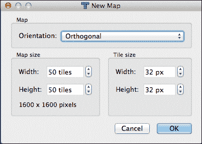
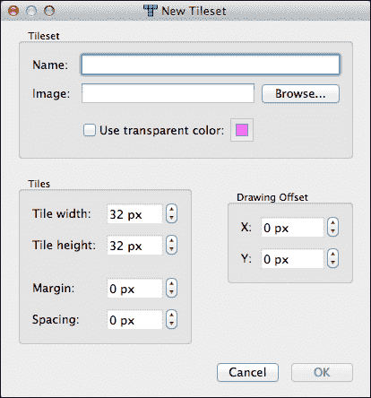
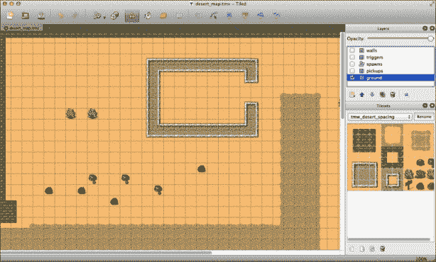
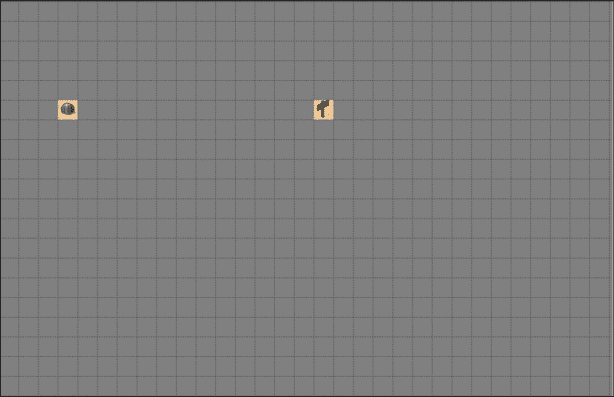
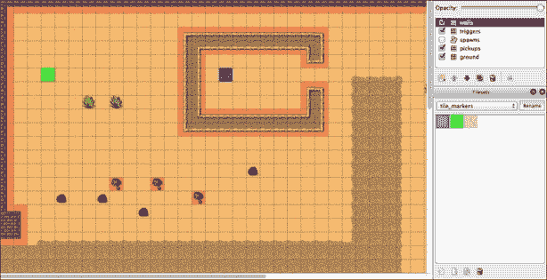
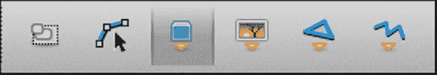
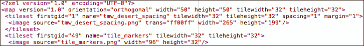
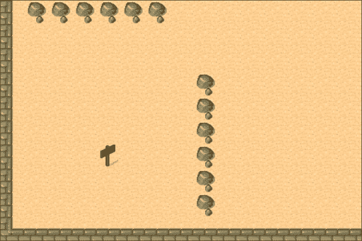
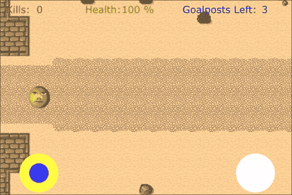
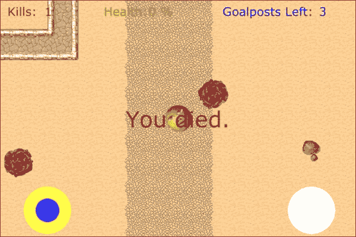

# 第八章. 射击，滚动，再射击

在本章中，我们将使用瓦片地图和屏幕上的摇杆创建一个游戏。我们将探讨如何使用免费的瓦片地图编辑器**Tiled**，以及如何实现 SneakyJoystick。作为一个挑战，我们还将使用一些高级路径查找代码来制作稍微聪明一点的敌人。

在本章中，我们将介绍以下内容：

+   Tiled

+   SneakyJoystick

+   倾斜控制

+   分离我们的游戏层

+   半智能敌人

# 游戏是…

在本章中，我们将构建一个自上而下的滚动射击游戏。听起来很简单，但我们将通过屏幕上的摇杆控制、敌人 AI 和一些更复杂的层设计来使其更具挑战性。传统上，这类游戏以军事主题为主，士兵们四处奔跑互相射击。对于我们的游戏，我们决定让水果和蔬菜在沙漠中战斗。我们并没有一个很好的背景故事来解释这一点。然而，如果数百万的移动游戏玩家接受鸟类和猪是宿敌，那么你当然可以发明一个同样不可能的故事情节来解释这种奇怪的配对。

# 设计回顾

本游戏的设计基于一个相当大的瓦片地图，宽度为 50 个瓦片，高度为 50 个瓦片。我们的基本瓦片大小（非 Retina）为 32 x 32 像素。我们将实现瓦片地图作为一个单独的滚动层，保持我们的英雄在屏幕中央（除了边缘附近，但我们会处理这一点）。英雄的目标是收集散布在地图上的三个目标“路标”。地图上还会有恢复英雄健康的健康提升物品。我们希望有两种类型的敌人。第一种将沿着直线向英雄移动。第二种类型会聪明一些。当它们遇到不可逾越的墙壁时，我们将使用`A*路径查找`算法找到绕过墙壁的方法，然后恢复到向英雄移动的同一直线逻辑。玩家将能够使用屏幕上的摇杆或倾斜控制来控制英雄。无论哪种方法，屏幕上都有一个射击按钮。我们将把游戏分成三个层以便于管理：地图层、抬头显示（HUD）层和控制层。这将使我们的代码更干净，并避免当瓦片地图移动时我们的控制滚动出屏幕的问题。我们开始吧？

# Tiled – 入门指南

Tiled 是一个开源的瓦片地图编辑器，可在[`mapeditor.org`](http://mapeditor.org)找到。它适用于 Mac、Windows 和 Linux。由于 Tiled 是一个开源程序，如果你想查看“内部结构”，你也可以下载源代码。我们正在使用 Tiled 版本 0.8.1，这是写作时的当前版本。

当你第一次打开 Tiled 时，你将创建一个新的地图。从菜单中选择**文件** | **新建**。在**新建地图**对话框中，按照以下方式配置你的地图：



对于我们的游戏，我们将使用非 Retina 资源构建我们的地图，并且稍后会“伪造”Retina 尺寸。通常，您会首先构建 Retina 版本，然后“缩小”地图以用于非 Retina 版本。这两种方法都使用相同的技巧，所以我们将留给您来决定。无论如何，大多数这些设置都是不言自明的，也许“方向”除外。**正交**是一个大多数人不太熟悉的概念。基本上，它意味着正常的正方形网格，与 x 轴和 y 轴对齐。

现在，您将看到一个空白的方格网格。我们需要一些瓦片来使用，因此我们使用菜单选项**地图** | **新建瓦片集…**，然后出现以下对话框：



对于我们的游戏，我们将使用与 Tiled 下载一起打包在`examples`文件夹下的瓦片地图文件`tmw_desert_spacing.png`。（此图像也包含在 cocos2D 可下载资源中，位于`Resources/TileMaps`目录下。）

我们在对话框中选择这张图像，然后需要调整窗口底部的参数。我们的瓦片是 32 x 32，因此我们将这些值设置为**瓦片宽度**和**瓦片高度**。如果您查看瓦片图像，您会看到瓦片并没有完全接触。存在黑色边界，强制网格以便您可以轻松地看到哪个是哪个。正因为如此，我们需要将**边距**设置为`1`和**间距**设置为`1`。您将知道这些设置是正确的，因为在**瓦片集**窗口（默认在显示窗口的左下角），您将看到瓦片整齐地排列，它们之间没有任何黑色网格线的痕迹。Tiled 使用白色分隔符显示瓦片，这是可以的。

## 绘制地面

要绘制您的地图，您只需从**瓦片集**面板中选择您想要使用的瓦片，并在网格上绘制。（如果**瓦片集**面板不可见，您可以在菜单中的**视图** | **瓦片集**下将其打开。）

Tiled 的一个优点是您可以在地图上定义多个层。这些层在**层**面板中可见，通常位于显示窗口的左上角。我们首先绘制我们的基本地面层，因此我们将默认层从**瓦片层 1**重命名为`ground`。在我们继续之前，让我们看看我们绘制的地面层的一部分：



当我们绘制地面层时，我们避免绘制任何可以从地图中拾取的内容。在我们的游戏中，我们将能够拾取生命值和我们的目标。我们避免在地面层上绘制这些内容的原因是，当我们拾取它们时，图像将从地图中移除。如果我们把拾取物放在地面层上，我们在拾取它们之后会在地图上留下一个空白区域。相反，我们创建一个新的层，命名为`pickups`，并绘制我们想要拾取的项目。以下截图显示了地图的同一区域，地面层已关闭，只显示拾取层：



正如你所见，目标标记（路标）将位于建筑物内，而健康（花状仙人掌）将位于左上角附近。仅仅添加图形是不够的。我们需要能够向地图中添加触发器，以便能够轻松解释地图。我们将通过在地图中构建我们所说的“逻辑层”来处理这个问题。这些层不会被用户看到，但将被用来在代码中触发事件。

## 逻辑层

为了确定哪些瓦片应该与某些逻辑相关联，我们需要一个新的瓦片集。我们构建了另一个名为`tile_markers.png`的瓦片集，需要加载。这个瓦片集只是三种不同颜色的半透明框。当你加载它时，重要的是将间距和边距更改为 0（我们在这个 PNG 文件中没有使用任何网格线。）此外，由于我们在图像文件中保存了透明度，请确保**使用透明颜色**框没有被勾选。如果是的话，那么加载的图像中的任何透明度都将被丢弃，我们的透明瓦片将变得不透明。

一旦加载了瓦片集，从**瓦片集**面板中选择它。你会看到三个瓦片：蓝色、绿色和红色。右键单击（或*Ctrl* + 点击）蓝色瓦片，选择**瓦片属性…**。双击**<新属性**>并命名为`Goal`。在**值**下，输入`Yes`。然后点击**确定**来存储属性。这将识别蓝色瓦片为目标瓦片。对绿色瓦片重复相同的步骤，除了将其命名为`Health`并设置值为`Yes`。最后，红色瓦片应该设置属性`Blocked`，值为`Yes`。

现在我们已经定义了逻辑瓦片，我们需要用它们来构建一些东西。创建一个新的层，命名为**触发器**。当选择**触发器**层时，在目标标记的位置绘制蓝色瓦片，并在我们的健康仙人掌上绘制绿色层。因为瓦片具有部分透明度，你可以透过彩色瓦片看到地面瓦片。

我们接下来需要的逻辑层是定义墙壁和其他不可通行瓦片。我们创建了一个新的层，命名为`walls`。（确保你在正确的层上绘制；当前活动的层将在**图层**面板中突出显示。）使用红色瓦片，我们在瓦片地图中的所有墙壁和岩石上绘制。

地图的同一区域现在看起来如下截图所示：



## 出生层

我们只需要再添加一层来完成瓦片地图。我们现在将一个**对象层**添加到地图中。对象是地图上的特征，它们不一定对应于瓦片。我们将使用这个层来识别英雄和敌人的出生点。让我们创建一个对象层，并将其命名为`spawns`。当选择出生层时，你会看到工具栏中的不同选项被选中。从工具栏中选择**插入对象**按钮。以下截图显示了它的样子：



现在，点击地图以在地图左侧墙壁的开口附近创建一个对象。它将显示为一个灰色方块。现在你可以右键单击（或 *Ctrl* + 点击）该方块以获取菜单。选择 **对象属性**。在窗口中，将其命名为 "playerSpawn"。这将是在英雄将被创建的位置。你会注意到既有 x 和 y 坐标，也有宽度和高度。对于我们的用途，我们不会使用宽度和高度。x 和 y 坐标看起来有点奇怪。这是因为这些是瓦片坐标。瓦片坐标与我们熟悉的 cocos2d 中的坐标类似，但 (0, 0) 坐标对应的是左上角，而不是左下角。当我们使用这些坐标时，我们将在这些坐标上进行一些转换，但我们会稍后处理这个问题。

现在，我们还需要在瓦片地图上创建一些更多的对象，最好让它们大多数都远离英雄的出生点。对于这些中的每一个，我们将使用递增的名称 `EnemySpawn1`、`EnemySpawn2` 等来命名。对于我们的游戏，我们选择了 11 个敌人出生点以增加一些多样性。一旦所有这些都被创建，让我们将地图保存为 `desert_map.tmx`。

## 理解 TMX 格式

现在，我们将继续添加我们的 `.tmx` 文件和两个 PNG 文件到我们的项目中。如果你在 Xcode 中选择 `.tmx` 文件，你可以在 Xcode 编辑器中直接读取和编辑它。接下来，查看 `desert_map.tmx`。它是一个普通的 XML 文件，所以理解大多数参数相对容易。现在，看看文件顶部 `<tileset>` 标签的位置。你需要确保源值中没有附加文件路径。文件的前几行应该看起来像以下截图：



在这里，你可以看到我们为地图和瓦片集在 Tiled 中设置的参数都表示为易于阅读和 *可更改* 的文本。这对于创建此地图的 Retina 版本非常重要。

## 创建高清地图

正如我们之前所说的，通常的做法是首先创建所有内容的高清版本，然后将其下采样到 SD 分辨率。因为我们开始时使用的是一个非 Retina 分辨率的瓦片集，所以我们选择首先构建这个版本，然后放大所有内容。

我们需要做的第一件事是将我们的两个瓦片集 PNG 图像转换为高清尺寸的资产。我们通过使用 Photoshop 完成了这项工作，将它们调整到 200% 的大小，然后保存为 -hd 文件。在调整大小（无论使用什么工具）时，确保它没有进行任何复杂的抗锯齿或其他类似操作。通过允许 Photoshop 使用其 **重采样图像** 选项，它会在所有瓦片上留下奇怪的边缘，将黑色分隔线羽化到瓦片本身中。我们只需要对这个操作进行像素的简单加倍。

现在是制作高清地图更容易的部分。将`desert_map.tmx`复制为一个新的文件，`desert_map-hd.tmx`。将这三个-hd 文件也添加到 Xcode 中，并编辑新的 TMX 文件。由于我们已经将所有瓦片大小加倍，我们需要在 TMX 文件中编辑大小。在`<map>`部分，将`tilewidth`和`tileheight`属性更改为`64`，因为这是我们的高清瓦片大小。同样更改两个`<tileset>`部分的参数。我们还需要将沙漠瓦片集的`spacing`和`margin`更改为`2`和`2`。最后，需要将两个`<image>`部分的宽度和高度从原来的值加倍。

作为最后一步，我们需要更改图像源值以反映-hd 文件名。这些应该是`tmw_desert_spacing-hd.png`和`tile_markers-hd.png`。

有一个值集将不会正确——这是对象位置。由于这些不是基于瓦片的，如果你将新的-hd 瓦片图重新加载到 Tiled 中，它们看起来会有些奇怪。你可以在代码中对此进行补偿，但我们的偏好是重新将-hd 瓦片图加载到 Tiled 中，并手动移动这些对象。这就是我们在这个游戏中采用的方法。

# 实现瓦片图

到目前为止，我们花费了相当多的时间而没有真正构建项目，所以现在让我们将注意力转向我们的 Xcode 项目。我们需要做的第一件事是将瓦片图加载到层中。我们需要持久化瓦片图，所以首先让我们看看头文件来查看我们的变量。

**文件名**: `TDPlayfieldLayer.h`（部分）

```swift
    CCTMXTiledMap *_tileMap;
    CCTMXLayer *_ground;
    CCTMXLayer *_triggers;
    CCTMXLayer *_pickups;
    CCTMXLayer *_walls;
    CCTMXObjectGroup *spawns;

    NSInteger tmw; // tilemap width
    NSInteger tmh; // tilemap height
    NSInteger tw; // tile width
    NSInteger th; // tile height
```

在这里，你可以看到我们保留了瓦片图，以及每个层的单个变量。我们还引入了一些`NSInteger`变量来存储几个重要数字的值，作为避免反复编写相对较长的代码的快捷方式。让我们看看`init`方法的相关部分。

**文件名**: `TDPlayfieldLayer.m`（部分）

```swift
        // Load the map
        self.tileMap = [CCTMXTiledMap tiledMapWithTMXFile:
                        @"desert_map.tmx"];
        self.ground = [_tileMap layerNamed:@"ground"];
        self.triggers = [_tileMap layerNamed:@"triggers"];
        self.pickups = [_tileMap layerNamed:@"pickups"];
        self.walls = [_tileMap layerNamed:@"walls"];
        self.triggers.visible = NO;
        self.walls.visible = NO;

        [self addChild:_tileMap z:-1];

        // Load the spawn object layer
        spawns = [_tileMap objectGroupNamed:@"spawns"];
        NSAssert(spawns != nil, @"'spawns' missing");
```

在一个层上加载瓦片图只需要做这么多。你会注意到我们将触发器和墙壁的可视属性都设置为`NO`。对于调试，你可以轻松地将这些设置为`YES`，这样地图看起来会更像在 Tiled 中的样子，带有触发瓦片上的彩色叠加。你也会注意到我们只添加了`_tileMap`到 self 中，而没有添加瓦片图内的层。这是因为 cocos2d 的 TMX 处理类是构建为假设瓦片图应该一起保留并一起使用。最后，我们以不同的方式加载`spawns`对象组，因为对象层在文件中的存储方式略有不同。

我们还进行了一组初始化，以便以后编写代码更容易。

**文件名**: `TDPlayfieldLayer.m`

```swift
        // Shorthand for tilemap sizes, with retina fix
        tmw = _tileMap.mapSize.width;
        tmh = _tileMap.mapSize.height;
        tw = _tileMap.tileSize.width /
                            CC_CONTENT_SCALE_FACTOR();
        th = _tileMap.tileSize.height /
                            CC_CONTENT_SCALE_FACTOR();
```

在这里，我们使用在头文件中确定的“简写”变量。这允许我们在引用这些值时编写更短的代码行。因为瓦片只以像素大小表示，所以我们通过除以`CC_CONTENT_SCALE_FACTOR()`来确保我们处理的是以点为单位的大小，而不是像素。

# 添加我们的英雄

现在我们有一个世界可以生活，我们需要添加我们的英雄。我们已经将英雄分解为一个单独的类，但首先让我们看看我们是如何确定英雄将在哪里生成的。正如你可能记得的，我们在地图上标记了**playerSpawn**的位置。现在，我们需要将这个位置转换成游戏坐标。

**文件名**: `TDPlayfieldLayer.m`

```swift
-(void) addHero {
    // Get the player spawn location
    NSMutableDictionary *playerSpawn =
                    [spawns objectNamed:@"playerSpawn"];
    NSAssert(playerSpawn != nil, @"playerSpawn missing");
    int x = [[playerSpawn valueForKey:@"x"] intValue];
    int y = [[playerSpawn valueForKey:@"y"] intValue];
    CGPoint heroPos = ccp(x / CC_CONTENT_SCALE_FACTOR(),
                          y / CC_CONTENT_SCALE_FACTOR());

    // Create the player
    hero = [TDHero heroAtPos:heroPos onLayer:self];
    [self addChild:hero];
}
```

你可以看到，我们从一个`playerSpawn`创建了一个`NSMutableDictionary`。数据以这种方式存储在 TMX 地图中，因为该格式允许我们向对象添加其他属性（在我们的情况下，我们只关心坐标）。我们提取`playerSpawn`对象的 x 和 y 坐标，但然后我们通过除以`CC_CONTENT_SCALE_FACTOR()`来改变坐标。为什么？记住，Tiled 生成的 TMX 文件格式不是 cocos2d 特定的格式，所以一切都是以像素表示的。我们通过除以`CC_CONTENT_SCALE_FACTOR()`来分割坐标，这将给我们正确的点坐标。然后我们调用我们的`TDHero`类的构造函数，并将英雄添加到层中。我们还将在`hero`变量中存储对英雄的引用。现在让我们看看`TDHero`是如何构建的。

**文件名**: `TDHero.h`

```swift
@class TDPlayfieldLayer;

@interface TDHero : CCNode {
    TDPlayfieldLayer *parentLayer;
    CCSprite *sprite; // sprite for the hero
}

@property (nonatomic, retain) CCSprite *sprite;

+(id) heroAtPos:(CGPoint)pos onLayer:(TDPlayfieldLayer*)layer;

-(void) shoot;
-(void) rotateToTarget:(CGPoint)target;

@end
```

英雄对象保持对`TDPlayfieldLayer`的引用（使用前向声明以避免导入循环），并且我们保持对精灵的引用。你会注意到我们将`TDHero`作为`CCNode`的子类，而不是`CCSprite`。我们这样做是为了使类与稍后我们将要查看的`TDEnemy`类更加统一。通过在`CCNode`子类内部将`CCSprite`作为变量，这使得使用具有不同图形的单个类变得更加容易。通过使这两个类更加统一，这使得记住如何编写碰撞和移动类变得更加容易。现在让我们看看实现：

**文件名**: `TDHero.m`

```swift
+(id) heroAtPos:(CGPoint)pos onLayer:(TDPlayfieldLayer*)layer {
    return [[[self alloc] initForHeroAtPos:pos onLayer:layer]
                                                 autorelease];
}

-(id) initForHeroAtPos:(CGPoint)pos onLayer:(TDPlayfieldLayer*)layer  {
    if((self = [super init])) {

        // Keep a reference to the layer
        parentLayer = layer;

        // Build the sprite
        self.sprite = [CCSprite
                    spriteWithSpriteFrameName:IMG_HERO];
        [sprite setPosition:pos];
        // Add the sprite to the layer
        [parentLayer addChild:sprite z:2];
    }
    return self;
}
```

这里有一个便利的构造函数和`init`方法。我们保持对父层的引用，构建一个精灵，设置其起始位置，并将精灵添加到父层。是的，我们已经在父层中添加了英雄（`TDHero`类）。这是一个我们需要保留以避免自动释放的`CCNode`的“句柄”。但这并没有将精灵添加到层中，所以我们单独添加它。我们希望我们的英雄能够朝着他前进的方向旋转，所以我们将添加一个旋转方法。

**文件名**: `TDHero.m`

```swift
-(void) rotateToTarget:(CGPoint)target {
    // Rotate toward player
    CGPoint diff = ccpSub(target,sprite.position);
    float angleRadians = atanf((float)diff.y /
                               (float)diff.x);
    float angleDegrees=CC_RADIANS_TO_DEGREES(angleRadians);
    float cocosAngle = -angleDegrees;
    if (diff.x < 0) {
        cocosAngle += 180;
    }
    sprite.rotation = cocosAngle;
}
```

这是一个相当标准的旋转方法，常用于示例项目中。它计算精灵和传递给它的目标坐标之间的角度。计算结果以弧度为单位，将其转换为度数，并设置新的旋转。

我们的英雄还需要能够射击。让我们看看这一点：

**文件名**：`TDHero.m`

```swift
-(void) shoot {
    // Create a projectile at hero's position
    TDBullet *bullet = [TDBullet
                   bulletFactoryForLayer:parentLayer];
    bullet.position = self.sprite.position;
    bullet.rotation = self.sprite.rotation;
    bullet.isEnemy = NO;

    // Add bullets to parentLayer's array
    [parentLayer addBullet:bullet];

    // Play a sound effect
    [[SimpleAudioEngine sharedEngine] playEffect:SND_SHOOT];
}
```

在这里，我们可以看到我们还将有一个 `TDBullet` 类作为新子弹的工厂。我们将在本章的后面更详细地了解子弹。现在，你可以看到我们将子弹设置在英雄相同的位子和旋转位置，并设置一个 `isEnemy` 标志，这样我们就可以使友军互射成为不可能。我们将子弹发送到父层以添加，并播放一个音效。

## 关注英雄

如果我们继续使用到目前为止的代码，我们会遇到一个小问题。英雄在屏幕上无处可寻，正如我们在以下截图中所看到的：



我们需要一种方法来聚焦视图在英雄上，但同时也需要确保我们永远不会看到地图之外的任何区域。Ray Wenderlich 在他的一篇教程中发布了一个非常紧凑的方法来做这件事，可以在 [`www.raywenderlich.com`](http://www.raywenderlich.com) 找到。

**文件名**：`TDPlayfieldLayer.m`

```swift
-(void)setViewpointCenter:(CGPoint) position {
    // Method written Ray Wenderlich
    // Posted at www.raywenderlich.com
    int x = MAX(position.x, size.width / 2);
    int y = MAX(position.y, size.height / 2);
    x = MIN(x, (_tileMap.mapSize.width *
                _tileMap.tileSize.width) - size.width / 2);
    y = MIN(y, (_tileMap.mapSize.height *
                _tileMap.tileSize.height) - size.height/2);
    CGPoint actualPosition = ccp(x, y);
    CGPoint centerOfView = ccp(size.width/2,
                               size.height/2);
    CGPoint viewPoint = ccpSub(centerOfView,
                               actualPosition);
    self.position = viewPoint;
}
```

第一个 `x` 和 `y` 赋值将获得屏幕中间或传递位置的 `MAX` 值。然后它取那个结果，并选择该值的最小值或地图右边缘减去半个屏幕的值。这种配对计算将给出英雄的坐标，除非他靠近屏幕边缘，在这种情况下，它将给出一个距离最近边缘正好半个屏幕的点坐标。然后我们从地图上的实际位置减去屏幕中心的大小，最终得到一个完美的屏幕坐标，适用于层的位置。你会注意到这实际上是通过重新定位层本身来实现的。在这里，我们只使用它来跟随英雄，但如果你想要将玩家的注意力吸引到地图的某个其他功能（例如显示目标）上，你可以通过传递不同的坐标来使用这个相同的方法。

# 使用 SneakyJoystick 控制英雄

现在，我们需要一种控制我们的英雄的方法。对于我们的游戏，我们将使用两种不同的控制方法：摇杆和倾斜。我们首先看看摇杆控制。

我们的摇杆控制将使用 `SneakyJoystick` 类，可在 [`github.com/sneakyness/SneakyInput`](https://github.com/sneakyness/SneakyInput) 找到。`SneakyInput`/`SneakyJoystick`。这可能是 cocos2d 社区中最常用的摇杆类。它有很多功能（例如用更好的图形对摇杆进行皮肤化），我们在这个项目中不会使用，但在你将创建的项目中绝对值得探索。

我们创建了一个新的层来处理控制，`TDControlLayer`。在一些项目中，你在层上如何组织对象并没有太大的区别。然而，当你使用滚动瓦片地图时，层之间的分离是至关重要的。如果你不将控制放在一个单独的层上，一旦滚动瓦片地图，控制就会滚动出屏幕。通过将它们保持为单独的层（这不是瓦片地图层的子层），控制将固定在您想要的屏幕位置，无论地图如何滚动。

**文件名**: `TDControlLayer.m`

```swift
-(void) addJoystick {
    SneakyJoystickSkinnedBase *leftJoy =
            [[[SneakyJoystickSkinnedBase alloc] init]
             autorelease];
    leftJoy.backgroundSprite = [ColoredCircleSprite
       circleWithColor:ccc4(255, 255, 0, 128) radius:32];
    leftJoy.thumbSprite = [ColoredCircleSprite
       circleWithColor:ccc4(0, 0, 255, 200) radius:16];
    leftJoy.joystick = [[[SneakyJoystick alloc]
       initWithRect:CGRectMake(0,0,64,64)] autorelease];
    leftJoystick = leftJoy.joystick;
    leftJoy.position = ccp(64,36);
    [self addChild:leftJoy z:30];
} 
```

这个方法的大部分内容都关注于用于精灵的图像的构建。我们使用一个简单的示例，用彩色圆圈来表示摇杆的基座和拇指。（“拇指”是摇杆的可移动部分，采用滚动条控制的术语。）我们构建摇杆，并将其添加到层中。

在我们的游戏中，我们还需要一个射击按钮，因此我们将使用`SneakyButton`类来实现它。

**文件名**: `TDControlLayer.m`

```swift
-(void) addFireButton {
    SneakyButtonSkinnedBase *rightBut =
            [[[SneakyButtonSkinnedBase alloc] init]
             autorelease];
    rightBut.position = ccp(420,36);
    rightBut.defaultSprite = [ColoredCircleSprite
      circleWithColor:ccc4(255, 255, 255, 128) radius:32];
    rightBut.activatedSprite = [ColoredCircleSprite
      circleWithColor:ccc4(255, 255, 255, 255) radius:32];
    rightBut.pressSprite = [ColoredCircleSprite
      circleWithColor:ccc4(255, 0, 0, 255) radius:32];
    rightBut.button = [[[SneakyButton alloc]
      initWithRect:CGRectMake(0, 0, 64, 64)] autorelease];
    rightButton = rightBut.button;
    rightButton.isToggleable = YES;
    [self addChild:rightBut];
}
```

`SneakyButton`的设置与`SneakyJoystick`非常相似，除了我们设置了按钮按下的替代图像。

现在我们已经构建了控制，让我们看看如何使用它们。我们在这一层上安排了一个`update`方法，`update`负责解析控制。

**文件名**: `TDControlLayer.m`

```swift
-(void)update:(ccTime)delta {
    // Do nothing if the touches are off
    if ([pf preventTouches]) {
        return;
    }
    if ([pf isGameOver]) {
        [[CCDirector sharedDirector] replaceScene:
                                [TDMenuScene node]];
    }
    if (isTiltControl) {
        // Tilt code here
    } else {
        // If the stick isn't centered, then we're moving
        if (CGPointEqualToPoint(leftJoystick.stickPosition,
                                CGPointZero) == NO) {
            // Pass the call to the playfield
            [pf applyJoystick:leftJoystick
                         toNode:pf.hero.sprite
                   forTimeDelta:delta];
        }
    }
    // If the button is active, let the playfield know
    if (rightButton.active) {
        [pf setHeroShooting:YES];
    } else {
        [pf setHeroShooting:NO];
    }
}
```

这里的内容是所有`update`方法的全部，除了倾斜控制部分，我们将在接下来的几分钟内讨论它。我们首先处理几个标准情况（`preventTouches`和`isGameOver`），然后检查摇杆。如果`stickPosition`等于`CGPointZero`，这意味着摇杆处于中心位置，所以我们实际上没有请求任何移动。如果不相等，那么我们需要向英雄发送移动的消息。我们通过向游戏场层发送调用（`pf`是它的引用）并传递一些参数来实现这一点。（当使用`SneakyJoystick`时，这个方法调用是一个相当标准的调用。这就是为什么方法调用中的术语与其他代码略有不同。）然后我们检查按钮是否设置了`active`属性。如果设置了，那么我们需要射击。我们再次将这个调用传递给游戏场层来设置一个布尔变量，`heroShooting`。这个类与`TDHero`类没有直接连接。调用路由是通过游戏场层完成的，它作为两个类之间的联络人。

## 倾斜控制

在我们的游戏中添加倾斜控制几乎是微不足道的。由于倾斜控制将仅替换摇杆，我们仍然需要使用按钮，因此将这两个控制方法放在同一个类中是有意义的。

**文件名**: `TDControlLayer.m`

```swift
-(void) addTiltControl {
    // Set up the accelerometer
    self.isAccelerometerEnabled = YES;

    [[UIAccelerometer sharedAccelerometer]
                  setUpdateInterval:1.0 / 60];
    [[UIAccelerometer sharedAccelerometer] setDelegate:self];
}

- (void)accelerometer:(UIAccelerometer *)accelerometer didAccelerate:(UIAcceleration *)acceleration {
    // Accelerometer values based on portrait mode, so
    // we reverse them for landscape
    accelX = acceleration.y * 7;
    accelY = -acceleration.x * 7;
}
```

使用这两个简单的方法，我们已经拥有了使倾斜控制功能化的大部分代码。在`addTiltControl`方法中，我们打开加速度计并将其代理设置为这个类。这个代理使用回调，即前面代码中列出的第二个方法。在指定的频率下，`accelerometer:didAccelerate:`方法将被调用。在每次调用中，我们将加速度值的修改版存储在我们的`accelX`和`accelY`变量中。因为我们的游戏是横屏的，而加速度计只报告基于竖屏的值，所以我们反转`x`和`y`值。我们将它们乘以`7`以提供更大的变化值。测试发现`7`是一个很好的乘数值。

最后，我们需要将一小段代码添加到我们的更新方法中。

**文件名**: `TDControlLayer.m`（在`Tilt Code here`下的`update`方法）:

```swift
        // Tilt code here
        CGPoint heroPos = [pf getHeroPos];
        CGPoint newHeroPos = ccp(heroPos.x + accelX,
                                 heroPos.y + accelY);

        [pf rotateHeroToward:newHeroPos];
        [pf setHeroPos:newHeroPos];
```

在这里，我们本可以像摇杆一样采取相同的方法，将一切传递给游戏场层，但我们想展示一种不同的控制方法。代码本身在这里或游戏场层（因为所有调用方法都在`pf`中）的性能没有区别。代码本身通过将`accelX`和`accelY`值加到坐标上来计算英雄的新位置。然后它调用旋转英雄，然后移动英雄。

为了总结控制部分，让我们看看构造函数和`init`方法。

**文件名**: `TDControlLayer.m`

```swift
+(id) controlsWithPlayfieldLayer:(TDPlayfieldLayer*)
                   playfieldLayer withTilt:(BOOL)isTilt {
    return [[[self alloc]
                   initWithPlayfieldLayer:playfieldLayer
                   withTilt:isTilt] autorelease];
}

-(id) initWithPlayfieldLayer:(TDPlayfieldLayer*)playfieldLayer
                                   withTilt:(BOOL)isTilt {
    if(self = [super init]) {
        pf = playfieldLayer;
        isTiltControl = isTilt;
        if (isTiltControl) {
            // Set up the tilt controls
            [self addTiltControl];
        } else {
            // Set up the joystick
            [self addJoystick];
        }

        // Add the fire button (all modes)
        [self addFireButton];

        [self scheduleUpdate];
    }
    return self;
}
```

我们将使用两个参数创建控制层：游戏场层和一个布尔值，表示我们是否想要倾斜控制。根据`isTilt`值，我们或者创建摇杆，或者从倾斜开始。这就是实现两种控制机制的全部内容。

## 解释控制

现在，我们将注意力转向`TDPlayfieldLayer`类，看看我们如何完全解释在控制层中调用的控制方法。我们将从摇杆控制开始：

**文件名**: `TDPlayfieldLayer.m`

```swift
-(void)applyJoystick:(SneakyJoystick*)joystick
              toNode:(CCSprite*)sprite
        forTimeDelta:(float)delta {

    // Scale up the joystick's reading to faster movement
    CGPoint scaledVelocity = ccpMult(joystick.velocity,
                                     200);

    // Apply the scaled velocity to the position
    float newPosX = hero.sprite.position.x +
                        scaledVelocity.x * delta;
    float newPosY = hero.sprite.position.y +
                        scaledVelocity.y * delta;
    CGPoint newPos = ccp(newPosX, newPosY);

    // Rotate the hero
    [hero rotateToTarget:newPos];

    // Set the new position
    [self setHeroPos:newPos];
}
```

我们首先创建一个`scaledVelocity`变量，它是摇杆数据乘以`200`的结果，以提供一个比摇杆读数更大的值。然后我们将这个值应用到英雄的位置上。你会注意到我们乘以了`scaledVelocity`和 delta 时间。我们这样做是为了允许可变更新时间，以便在有任何延迟的情况下，移动不会显得突然。然后我们告诉英雄转向新的位置，并将英雄的位置设置为新的值。

现在我们将查看`setHeroPos`方法的简略版。我们稍后会重新访问它以添加一些更多逻辑。现在，它非常简单。

**文件名**: `TDPlayfieldLayer.m`

```swift
-(void) setHeroPos:(CGPoint)pos {
    // Set the new position
    hero.sprite.position = pos;

    // Center the view on the hero
    [self setViewpointCenter:pos];
}
```

目前，`setHeroPos`方法只是设置英雄的位置，然后使视图居中在英雄上。没有什么花哨的，但能完成任务。在这个阶段，我们已经使用了一些小型传递方法，我们应该提到。

**文件名**: `TDPlayfieldLayer.m`

```swift
-(CGPoint) getHeroPos {
    return hero.sprite.position;
}

-(void) rotateHeroToward:(CGPoint)target {
    [hero rotateToTarget:target];
}
```

如我们之前提到的，我们希望游戏场是接触的中心点，因此这两个方法提供了易于数据传递的接口，可以从其他类中调用。这两个类都在控制层中使用，但它们实际上并没有做什么特别的事情，只是减少了直接相互连接的类的数量。

# 构建 HUD

我们需要构建一个第三层，即抬头显示层（HUD）。这个层实现起来主要是琐碎的，但它必须是一个独立的层，原因与我们在控制层讨论的原因相同。如果这个层在主层上，那么当我们从第一个视图移开时，HUD 就会滚动出屏幕。

**文件名**：`TDHUDLayer.m`

```swift
-(void) addDisplay {
    // Add the fixed text of the HUD
    CCLabelTTF *kills = [CCLabelTTF 
                      labelWithString:@"Kills:"
                      fontName:@"Verdana" fontSize:16];
    [kills setAnchorPoint:ccp(0,0.5)];
    [kills setPosition:ccp(10,305)];
    [kills setColor:ccRED];
    [self addChild:kills];

    CCLabelTTF *health = [CCLabelTTF
                      labelWithString:@"Health:"
                      fontName:@"Verdana" fontSize:16];
    [health setAnchorPoint:ccp(0,0.5)];
    [health setPosition:ccp(140,305)];
    [health setColor:ccGREEN];
    [self addChild:health];

    CCLabelTTF *goals = [CCLabelTTF
                      labelWithString:@"Goalposts Left:"
                      fontName:@"Verdana" fontSize:16];
    [goals setAnchorPoint:ccp(0,0.5)];
    [goals setPosition:ccp(300,305)];
    [goals setColor:ccBLUE];
    [self addChild:goals];

    // Add the kill counter
    lblKills = [CCLabelTTF labelWithString:@""
                       fontName:@"Verdana" fontSize:16];
    [lblKills setAnchorPoint:ccp(0,0.5)];
    [lblKills setPosition:ccp(60,305)];
    [lblKills setColor:ccRED];
    [self addChild:lblKills];

    // Add the health counter
    lblHeroHealth = [CCLabelTTF labelWithString:@""
                      fontName:@"Verdana" fontSize:16];
    [lblHeroHealth setAnchorPoint:ccp(0,0.5)];
    [lblHeroHealth setPosition:ccp(200,305)];
    [lblHeroHealth setColor:ccGREEN];
    [self addChild:lblHeroHealth];

    // Add the goal counter
    lblGoalsRemaining = [CCLabelTTF labelWithString:@""
                      fontName:@"Verdana" fontSize:16];
    [lblGoalsRemaining setAnchorPoint:ccp(0,0.5)];
    [lblGoalsRemaining setPosition:ccp(430,305)];
    [lblGoalsRemaining setColor:ccBLUE];
    [self addChild:lblGoalsRemaining];
}
```

到现在为止，这应该是一段容易阅读的代码。我们创建了三个标签，它们是展示的统计数据固定名称：击杀数、生命值和目标。然后我们为相应的值创建了三个计数标签。这处理了层的初始构建，但我们需要能够轻松地更新值，因此我们创建了三个辅助方法。

**文件名**：`TDHUDLayer.m`

```swift
-(void) changeHealthTo:(NSInteger)newHealth {
    NSString *newVal = [NSString stringWithFormat:@"%i %%",
                          newHealth];
    [lblHeroHealth setString:newVal];
}

-(void) changeGoalTo:(NSInteger)newGoal {
    NSString *newVal = [NSString stringWithFormat:@"%i",
                          newGoal];
    [lblGoalsRemaining setString:newVal];
}

-(void) changeKillsTo:(NSInteger)newKills {
    NSString *newVal = [NSString stringWithFormat:@"%i",
                         newKills];
    [lblKills setString:newVal];
}
```

现在我们有三个方法，允许我们根据需要轻松地更改计数标签的值。正如你可能已经猜到的，我们将直接从游戏场层调用这些方法。这里没有什么花哨的，只是能工作的代码。你总是可以通过添加一些动画来装饰这个代码，当值改变时，或者添加一些其他的图形效果。由于这段代码在其自己的层中是自包含的，你可以扩展它而不需要修改游戏场层。

# 场景构建

现在我们游戏有三个层，有些层需要了解其他层。由于滚动问题，没有任何东西可以是游戏场层的子层。这正是那种让我们倾向于场景和层文件分离的情况，与常见的模板格式（一个场景方法嵌入在`CCLayer`类中）不同。如果我们那样做，你会在哪个类中包含场景方法，因为实际上并没有一个父层？（有些人可能会争论 HUD 应该是主层，其他层作为其子层。技术上，这也行得通。但我们并不喜欢这种结构）。我们的解决方案在于构建`TDPlayfieldScene`类。

**文件名**：`TDPlayfieldScene.m`

```swift
@implementation TDPlayfieldScene

+(id) sceneWithTiltControls:(BOOL)isTilt {
    return [[[self alloc] initWithTiltControls:isTilt]
                                         autorelease];
}

-(id) initWithTiltControls:(BOOL)isTilt {
   if( (self=[super init])) {
        TDHUDLayer *hudLayer = [TDHUDLayer node];
        [self addChild:hudLayer z:5];

        TDPlayfieldLayer *pf = [TDPlayfieldLayer
                      layerWithHUDLayer:hudLayer];
        [self addChild: pf];

        TDControlLayer *controls = [TDControlLayer
                      controlsWithPlayfieldLayer:pf
                      withTilt:isTilt];
        [self addChild:controls z:10];

   }
   return self;
}

@end
```

这允许我们以正确的顺序构建所有三个层，所有层都是场景的子层。这样，没有任何层是彼此的子层。游戏场层可以用对 HUD 层的引用进行初始化，控制层可以用对游戏场层的引用进行初始化。一切正常，而且易于阅读。这种构建方式也使得确定场景和层的层次结构变得非常简单。下面的截图显示了包含所有层的游戏外观：



# 瓦片辅助方法

在使用瓦片地图时，我们面临的一个挑战是，我们至少有两种不同的坐标位置可以用来指代地图上的位置：瓦片地图上的像素和瓦片坐标。瓦片坐标与每个单独的瓦片相关，因此对于我们的 50x50 地图，左上角的瓦片是（0,0），右下角是（49,49）。我们需要一些辅助方法来轻松地在两者之间进行转换。

**文件名**: `TDPlayfieldLayer.m`

```swift
-(CGPoint)tileCoordForPos:(CGPoint)pos {
    // Convert map posiiton to tile coordinate
    NSInteger x = pos.x / tw;
    NSInteger y = ((tmh * th) - pos.y) / th;

    return ccp(x,y);
}
```

在这里，我们终于开始使用我们在`init`方法中看到的缩写变量。作为一个提醒，变量如下：

+   `tmw` = 瓦片地图宽度

+   `tmh` = 瓦片地图高度

+   `tw` = 瓦片宽度

+   `th` = 瓦片高度

因此，`x`值是位置除以瓦片宽度。对于`y`值，计算稍微长一些，因为瓦片地图的原点在左上角而不是左下角。通过将瓦片地图高度乘以瓦片高度，我们得到总地图高度。从那个值中减去位置，然后除以瓦片高度。这给了我们所需的反转`y`定位。此方法最终返回的`CGPoint`是给定位置的瓦片坐标。

**文件名**: `TDPlayfieldLayer.m`

```swift
- (CGPoint)posForTileCoord:(CGPoint)tileCoord {
    // Convert the tile coordinate to map position
    NSInteger x = (tileCoord.x * tw) + tw / 2;
    NSInteger y = (tmh * th)-(tileCoord.y * th)-th / 2;

    return ccp(x, y);
}
```

此方法反转了我们刚刚看到的相同计算。此方法的一个调用是每个公式的最后一位。公式的“核心”将导致瓦片的边缘被转换。通过添加瓦片宽度的一半（或减去瓦片高度的一半），最终结果是瓦片的中心，这正是我们想要的。

## 瓦片自我识别

我们需要一些方法来执行我们所说的自我识别。这是我们可以“询问”每个瓦片关于任何特殊属性的地方。

**文件名**: `TDPlayfieldLayer.m`

```swift
- (BOOL)isValidTileCoord:(CGPoint)tileCoord {
    if (tileCoord.x < 0 || tileCoord.y < 0 ||
        tileCoord.x >= tmw ||
        tileCoord.y >= tmh) {
        return FALSE;
    } else {
        return TRUE;
    }
}
```

这些方法中的第一个是`isValidTileCoord`方法，因此我们可以检查传入的瓦片坐标是否在地图上。对下限（零）和上限（瓦片地图宽度，瓦片地图高度）的简单检查将允许我们返回一个布尔值来识别这是否是一个有效的瓦片。

**文件名**: `TDPlayfieldLayer.m`

```swift
-(BOOL)isWallAtTileCoord:(CGPoint)tileCoord {
    // If it is invalid, act like it is a wall
    if ([self isValidTileCoord:tileCoord] == NO) {
        return YES;
    }

    int gid = [self.walls tileGIDAt:tileCoord];
    NSDictionary *properties = [_tileMap
                                   propertiesForGID:gid];

    return ([properties valueForKey:@"Blocked"] != nil);
} 
```

此方法使用`isValidTileCoord:`方法来确定瓦片是否有效。如果不是，则我们可以将其视为墙壁并返回`YES`。否则，我们获取墙壁层中指定瓦片坐标的瓦片的 GID。（**GID**是瓦片地图使用的**全局标识符**。）然后我们查询瓦片地图以获取与该瓦片相关的任何属性。我们返回`Blocked`键的值。如果您还记得我们在 Tiled 中构建地图时，我们给红色瓦片分配了`Blocked`属性，其值为`Yes`。这里就是我们得到瓦片地图好处的地方。通过这个简单的检查，我们可以“询问”地图是否有墙壁，并得到一个明确的答案。这有多简单？

我们遵循相同的基本逻辑来识别目标标记和健康增益。

**文件名**: `TDPlayfieldLayer.m`

```swift
-(BOOL)isGoalAtTileCoord:(CGPoint)tileCoord {
    int gid = [self.triggers tileGIDAt:tileCoord];
    NSDictionary *properties = [_tileMap
                                propertiesForGID:gid];

    return ([properties valueForKey:@"Goal"] != nil);
}

-(BOOL)isHealthAtTileCoord:(CGPoint)tileCoord {
    int gid = [self.triggers tileGIDAt:tileCoord];
    NSDictionary *properties = [_tileMap
                                propertiesForGID:gid];

    return ([properties valueForKey:@"Health"] != nil);
}
```

如您所见，这些方法之间的代码几乎完全相同。如果您愿意，可以推断出一个可以完成这两项任务的基础方法，但我们更喜欢在这种情况下使用显式的方法调用，主要是因为我们只有两种类型的触发器。

# 更聪明的英雄行走

到目前为止，我们的英雄将在没有任何对放置的特殊瓷砖的意识的情况下四处走动，所以他可以直接穿过墙壁。我们需要解决这个问题。现在我们已经添加了方法来使确定我们的特殊触发器位置变得相当简单，我们可以重新审视我们之前开始编写的`setHeroPos`方法。这是对之前方法的完全替换。

**文件名**：`TDPlayfieldLayer.m`

```swift
-(void) setHeroPos:(CGPoint)pos {
    // Get the tile coordinates
    CGPoint tileCoord = [self tileCoordForPos:pos];

    // Check if the new tile is blocked
    if ([self isWallAtTileCoord:tileCoord]) {
        // Return without allowing the move
        return;
    }

    // Check if the hero picked up health
    if ([self isHealthAtTileCoord:tileCoord]) {
        // Remove it from the map
        [_triggers removeTileAt:tileCoord];
        [_pickups removeTileAt:tileCoord];
        // Add health to the player
        [self heroGetsHealth];
    }

    // Check if the hero grabbed a goal
    if ([self isGoalAtTileCoord:tileCoord]) {
        // Remove it from the map
        [_triggers removeTileAt:tileCoord];
        [_pickups removeTileAt:tileCoord];
        // Add goal to the player
        [self heroGetsGoal];
    }

    // Set the new position
    hero.sprite.position = pos;

    // Center the view on the hero
    [self setViewpointCenter:pos];
}
```

我们从将新的英雄位置转换为瓷砖坐标开始这个方法。然后我们检查这实际上是否是一堵墙。如果所需的坐标是一个被阻挡的瓷砖，那么方法将返回而不移动英雄。这将有效地防止英雄在任何被阻挡的瓷砖上行走。然后我们检查健康提升或目标标记，使用我们的辅助方法。如果我们拾取了一个目标或健康，我们将相应的瓷砖从`_triggers`和`_pickups`层中移除。从`_pickups`层中移除它将移除可见的瓷砖，而从`_triggers`层中移除它将防止我们在玩家下次经过这个瓷砖时触发相同的事件。在这两种情况下，我们调用适当的手柄方法来对拾取的物品采取行动。在这段新代码之后，我们看到与之前相同的英雄定位和视点居中代码。让我们看看物品拾取处理方法。

**文件名**：`TDPlayfieldLayer.m`

```swift
-(void) heroGetsHealth {
    heroHealth = heroHealth + 40;
    [hudLayer changeHealthTo:heroHealth];
}
```

我们决定，当英雄拾取其中一个奇特的仙人掌物品时，他的健康应该增加 40 点。我们更新`heroHealth`变量，并通过调用`hudLayer`的`changeHealthTo`方法来更新 HUD，这是我们之前看到的。

**文件名**：`TDPlayfieldLayer.m`

```swift
-(void) heroGetsGoal {
    heroGoalsRemaining--;
    [hudLayer changeGoalTo:heroGoalsRemaining];

    if (heroGoalsRemaining <= 0) {
        // hero wins
        isGameOver = YES;
        preventTouches = YES;
    }
}
```

对于目标，我们调整`heroGoalsRemaining`变量并按类似方式更改 HUD。然而，由于目标是游戏的核心，我们需要检查是否所有目标都已达成（被拾取）。如果是这样，我们将`isGameOver`和`preventTouches`设置为`YES`，这样在下一次`update`循环运行时将结束游戏。

# 是时候发射子弹了

所有这些四处奔跑和撞墙的行为都很好，但我们确实需要能够射击，不是吗？如您从我们对`TDControlLayer`类的讨论中回忆起来，当按钮被按下时，我们只是将布尔变量`heroShooting`设置为`YES`。我们在`TDPlayfieldLayer`更新方法中处理这个值。

**文件名**：`TDPlayfieldLayer.m`

```swift
-(void) update:(ccTime) dt {
    // If the shoot button is pressed
    if (heroShooting) {
        // We limit the hero's shoot speed to avoid
        // massive "bullet rain" effect
        if (currHeroShootSpeed > 0) {
            currHeroShootSpeed -= dt;
        } else {
            // Ready to shoot
            [hero shoot];
            currHeroShootSpeed = shootSpeed;
        }
    } else {
        // Get ready to shoot next press
        currHeroShootSpeed = 0;
    }

    // Move the enemies

    // Move the bullets

    // Check collisions

    // Is the game over?
    if (isGameOver) {
        [self gameOver];
    }
}
```

我们在这里留下了一些空白，稍后填写，但这就是整个 `update` 方法的结构。当 `heroShooting` 变量为 `YES` 时，我们评估 `currHeroShootSpeed` 变量。如果它大于零，我们从它中减去时间差。如果它已经达到零，我们调用英雄的 `shoot` 方法。然后我们将 `currHeroShootSpeed` 重置为 `shootSpeed` 变量的值。这在 `init` 方法中设置，设置为 `0.2` 以避免子弹的疯狂扫射。这意味着您每 0.2 秒只能射击一次。这仍然很快，不是吗？如果英雄没有射击（即，没有按下射击按钮），那么我们将 `currHeroShootSpeed` 变量重置为 `0`。这允许英雄在按下按钮时立即射击，而无需这个“冷却”计时器延迟射击。

## TDBullet 类

现在我们已经知道了如何射击，我们需要知道我们要射击什么。

**文件名**: `TDBullet.m`

```swift
+(id) bulletFactoryForLayer:(TDPlayfieldLayer*)layer {
    return [[[self alloc] initForLayer:layer
               withSpriteFrameName:IMG_BULLET] autorelease];
}

-(id) initForLayer:(TDPlayfieldLayer*)layer
         withSpriteFrameName:(NSString*)spriteFrameName {
    if((self = [super
                initWithSpriteFrameName:spriteFrameName])) {

        parentLayer = layer;

        totalMoveDist = 200;
        thisMoveDist = 10;

        isDead = NO;

    }
    return self;
}
```

在这里，我们使用便利方法 `bulletFactoryForLayer` 来构建子弹。因为 `TDBullet` 是 `CCSprite` 的子类，我们可以使用调用 `super initWithSpriteFrameName` 来构建精灵。我们保留对父层的引用，并将 `totalMoveDist` 变量设置为子弹在过期前可以移动的最大距离。变量 `thisMoveDist` 用于确定每次更新子弹应该移动多远。这个类的大部分工作都是在 `update` 方法中完成的。

**文件名**: `TDBullet.m`

```swift
-(void) update:(ccTime)dt {

    if (isDead) {
        return;
    }
    // Calculate the movement
    CGFloat targetAngle =
            CC_DEGREES_TO_RADIANS(-self.rotation);
    CGPoint targetPoint = ccpMult(ccpForAngle(targetAngle),
                                  thisMoveDist);
    CGPoint finalTarget = ccpAdd(targetPoint, self.position);

    self.position = finalTarget;

    totalMoveDist = totalMoveDist - thisMoveDist;

    if (totalMoveDist <= 0) {
        [parentLayer removeBullet:self];
        return;
    }

    // Convert location to tile coords
    CGPoint tileCoord = [parentLayer tileCoordForPos:
                         self.position];

    // Check for walls.  Walls stop bullets.
    if ([parentLayer isWallAtTileCoord:tileCoord]) {
        [parentLayer removeBullet:self];
    }
}
```

我们从这个方法开始，检查确保这个子弹没有死亡。在丢弃子弹的过程中，可能调用 `update`，所以这将防止我们尝试移动正在解引用的对象。然后我们通过一段代码，获取当前旋转并计算一个在当前位置 `thisMoveDist` 远的方向上的目标。我们从 `totalMoveDist` 值中减去这个值，这样我们就可以跟踪子弹还剩下多远可以移动。如果 `totalMoveDist` 变量达到零，那么我们调用 `parentLayer` 对象来移除子弹。如果它不是零，我们使用 `parentLayer` 中的方法将子弹的当前位置转换为瓦片坐标。然后我们检查这个瓦片是否是墙壁。如果是，子弹将被移除，因为我们不希望子弹穿过墙壁。

在游戏场层中，我们还有两个处理子弹的方法。

**文件名**: `TDPlayfieldLayer.m`

```swift
-(void) addBullet:(TDBullet*)thisBullet {
    [self addChild:thisBullet z:5];
    [bulletArray addObject:thisBullet];
}

-(void) removeBullet:(TDBullet*)thisBullet {
    [thisBullet setIsDead:YES];
    [bulletArray removeObject:thisBullet];
    [thisBullet removeFromParentAndCleanup:YES];
}
```

如果您还记得我们之前对 `TDHero` 类的回顾，当调用 `shoot` 方法时，它会构建一个子弹，然后将该子弹传递给存储在 `parentLayer` 变量中的层的 `addBullet` 方法。在这里，您可以看到它做了什么。它将其添加到层中，然后将子弹添加到 `bulletArray` 数组中。当我们需要移除子弹时，我们首先将子弹的 `isDead` 属性设置为 `YES`，然后从数组和中移除子弹。

我们需要的子弹移动代码的最后部分在`TDPlayfieldLayer`的`update`方法中。我们需要在那里添加几行代码：

**文件名**: `TDPlayfieldLayer.m`（在`Move The Bullets`下的`update`方法）:

```swift
    for (int i = 0; i < [bulletArray count]; i++) {
        [[bulletArray objectAtIndex:i] update:dt];
    }
```

这段代码非常紧凑，正如我们所期望的那样。在这里，我们遍历`bulletArray`中的所有子弹，并调用每个子弹的`update`方法，使用当前的 delta 值。我们使用传统的`for`循环而不是快速枚举（即`for (TDBullet *aBullet in bulletArray)`)，因为我们可能在这个循环中调用某些子弹死亡。在快速枚举的同时修改数组会导致崩溃。你不相信我们？试试看，你自己就会看到。

# 构建敌人

现在我们有一个可以四处奔跑的世界和可以射击的子弹，但没有阻止我们达到目标的人。我们需要添加一些敌人来增加趣味性。当我们遍历敌人处理代码时，请记住我们是如何设置英雄的。你会看到很多相似之处，我们本可以将它们压缩到一个基类中，但为了清晰起见，我们选择没有这样做。

**文件名**: `TDEnemy.m`

```swift
+(id) enemyAtPos:(CGPoint)pos onLayer:(TDPlayfieldLayer*)layer {
    return [[[self alloc] initForEnemyAtPos:pos onLayer:layer]
                                                autorelease];
}

-(id) initForEnemyAtPos:(CGPoint)pos
                   onLayer:(TDPlayfieldLayer*)layer  {
    if((self = [super init])) {
        // Keep a reference to the layer
        parentLayer = layer;

        // Build the sprite
        [self buildEnemySpriteAtPos:pos];

        // Add the sprite to the layer
        [parentLayer addChild:sprite z:2];

        // Set the max shooting speed
        maxShootSpeed = 3;
    }
    return self;
}
```

这里是`TDEnemy`类的构造函数。我们保留了对`parentLayer`的引用，设置了`maxShootSpeed`变量，并调用了`buildEnemySpriteAtPos`方法。

**文件名**: `TDEnemy.m`

```swift
-(void) buildEnemySpriteAtPos:(CGPoint)pos {
    sprite = [CCSprite
                spriteWithSpriteFrameName:IMG_ENEMY];
    [sprite setPosition:pos];
}
```

为什么我们要将这个方法单独提取出来，而不是将其嵌入到`init`方法中？我们这样做是为了使`TDEnemy`类的子类化更加容易。因为我们将其独立出来，所以我们可以在`TDEnemy`的任何子类中重写这个方法，而不需要重写`init`方法。这允许我们不必为两个敌人类重复编写样板`init`方法，因为它们之间唯一的区别是使用的精灵。

**文件名**: `TDEnemy.m`

```swift
-(void) rotateToTarget:(CGPoint)target {
    // Rotate toward player
    CGPoint diff = ccpSub(target,sprite.position);
    float angleRadians = atanf((float)diff.y / (float)diff.x);
    float angleDegrees = CC_RADIANS_TO_DEGREES(angleRadians);
    float cocosAngle = -angleDegrees;
    if (diff.x < 0) {
        cocosAngle += 180;
    }
    sprite.rotation = cocosAngle;
} 
```

这个旋转方法与英雄类中的旋转方法工作方式相同。它确定指向指定目标的角度，并相应地旋转。

**文件名**: `TDEnemy.m`

```swift
-(void) moveToward:(CGPoint)target {
    // Rotate toward player
    [self rotateToTarget:target];

    // Move toward the player
    CGFloat targetAngle =
                CC_DEGREES_TO_RADIANS(-sprite.rotation);
    CGPoint targetPoint = ccpForAngle(targetAngle);
    CGPoint finalTarget = ccpAdd(targetPoint,
                                 sprite.position);
    CGPoint tileCoord = [parentLayer
                         tileCoordForPos:finalTarget];

    if ([parentLayer isWallAtTileCoord:tileCoord]) {
        // Cannot move - hit a wall
        return;
    }

    // Set the new position
    sprite.position = finalTarget;
}
```

这里我们使用了一些基本的移动代码。敌人将确定通往英雄的最直接路径，并尝试移动到那里。就像我们对英雄和子弹所做的那样，敌人无法穿过墙壁。我们没有为敌人设置任何特殊处理，以便在它们碰到墙壁时做不同的事情，所以它们会继续尝试移动到墙壁，只要墙壁在英雄和敌人之间。不是很聪明，但这是你的基本敌人小兵。不是很聪明。

**文件名**: `TDEnemy.m`

```swift
-(void) shoot {
    // Create a projectile at hero's position
    TDBullet *bullet = [TDBullet
                         bulletFactoryForLayer:parentLayer];
    bullet.position = self.sprite.position;
    bullet.rotation = self.sprite.rotation;
    bullet.isEnemy = YES;
    [bullet setColor:ccRED];

    // add bullets to parentLayer's array
    [parentLayer addBullet:bullet];

    // Play a sound effect
    [[SimpleAudioEngine sharedEngine] playEffect:SND_SHOOT];
}
```

这个方法几乎与英雄的`shoot`方法完全相同，有两个例外。第一个是我们将`isEnemy`变量设置为`YES`，以标识这是由敌人单位发射的子弹。第二个是我们将子弹的颜色设置为红色。我们使用的精灵是蓝色的，所以这给敌人一个“坏蛋射击红色”的效果。这个方法中的其他所有内容都是相同的。

**文件名**: `TDEnemy.m`

```swift
-(void) update:(ccTime)dt {
    currShootSpeed = currShootSpeed - dt;

    // Take a step
    [self moveToward:[parentLayer getHeroPos]];

    if (ccpDistance(sprite.position, 
                     [parentLayer getHeroPos]) < 250) {
        // Limit the shoot speed
        if (currShootSpeed <= 0) {
            // Ready to shoot
            [self shoot];
            currShootSpeed = maxShootSpeed;
        }
    }
}
```

在敌人的 `update` 方法中，我们每次更新时都向英雄的位置移动。我们还检查敌人到英雄的距离是否小于 `250` 点。如果是，那么敌人将尝试射击。由于他已经朝向英雄旋转，所以他总是会直接射击英雄。

就像子弹一样，我们需要在主层的 `update` 方法中添加一个小小的修改，以便让敌人移动。

**文件名**: `TDPlayfieldLayer.m` (更新方法，在 `Move The Enemies` 下):

```swift
    for (int i = 0; i < [enemyArray count]; i++) {
        [[enemyArray objectAtIndex:i] update:dt];
    }
```

这几乎与子弹的移动代码相同。对于每次更新，我们指示每个敌人移动自己。

## 添加敌人

现在我们已经知道了敌人类的构建方式和如何让它们移动，所以接下来我们需要将它们添加到游戏本身中。

**文件名**: `TDPlayfieldLayer.m`

```swift
-(void) addEnemyOfType:(EnemyType)enemyType {
    // Randomly pick a spawn point
    NSString *enemySpawnID = [NSString stringWithFormat:
                              @"EnemySpawn%i",
                              (arc4random() % 11) + 1];

    // Get the point
    NSMutableDictionary *enemySpawn = [spawns objectNamed:
                                       enemySpawnID];
    float x = [[enemySpawn valueForKey:@"x"] floatValue];
    float y = [[enemySpawn valueForKey:@"y"] floatValue];

    // Retina-ize the position (TMX files are in pixels)
    x /= CC_CONTENT_SCALE_FACTOR();
    y /= CC_CONTENT_SCALE_FACTOR();

    if (enemyType == kEnemyEasy) {
        // Create the enemy (will put itself on the layer)
        TDEnemy *enemy = [TDEnemy enemyAtPos:ccp(x,y)
                                     onLayer:self];

        // Add it to the array
        [enemyArray addObject:enemy];
    }
    else if (enemyType == kEnemyHard) {
        // Create the enemy (will put itself on the layer)
        TDEnemySmart *enemy = [TDEnemySmart
                               enemyAtPos:ccp(x,y)
                               onLayer:self];

        // Add it to the array
        [enemyArray addObject:enemy];
    }
}
```

如果你还记得我们构建瓦片图时，我们指定了地图上的对象，命名为 `EnemySpawn1`、`EnemySpawn2` 等等。现在我们终于可以使用这些出生点了。我们不希望敌人总是在同一个地方出生，所以我们使用 `arc4random()` 随机选择一个介于 `1` 和 `11` 之间的数字。我们使用这个数字构建一个与瓦片图的 `spawns` 层上的对象名称对应的字符串。我们不能直接使用这些值，因为存在点与像素的问题，所以我们将 `x` 和 `y` 坐标除以 `CC_CONTENT_SCALE_FACTOR()` 来获取正确的定位。

在这里，我们看到我们定义了两种类型的敌人：`kEnemyEasy` 和 `kEnemyHard`。我们为两者使用相同的构造函数，但困难敌人将使用 `TDEnemySmart` 类（我们稍后会介绍）。

现在，我们需要能够在游戏中构建两种类型的敌人。

**文件名**: `TDPlayfieldLayer.m`

```swift
-(void) addEnemies {
    // Add some enemies
    for (int i = 0; i < 5; i++) {
        [self addEnemyOfType:kEnemyEasy];
    }
    for (int i = 0; i < 3; i++) {
        [self addEnemyOfType:kEnemyHard];
    }
}
```

我们简单地通过两个 `for` 循环来添加每种类型指定的敌人数量。这些数字是任意选择的，你可以根据需要调整它们，以提供足够困难的挑战。

# 碰撞处理

到目前为止，我们已经拥有了所有需要的东西，除了让子弹击中英雄和敌人的方法。如果你不能击中任何东西，射击还有什么乐趣呢？

**文件名**: `TDPlayfieldLayer.m`

```swift
-(void) checkCollisions {
    NSMutableArray *bulletsToDelete = 
                         [[NSMutableArray alloc] init];

    for (TDBullet *aBullet in bulletArray) {
        if (CGRectIntersectsRect(aBullet.boundingBox,
                                 hero.sprite.boundingBox)
                                && aBullet.isEnemy) {
            // Hero got hit!
            [self heroGetsHit];
            [bulletsToDelete addObject:aBullet];
            [aBullet removeFromParentAndCleanup:YES];
            break;
        }
        // Iterate through enemies, see if they got hit
        for (TDEnemy *anEnemy in enemyArray) {
            if (CGRectIntersectsRect(aBullet.boundingBox,
                                anEnemy.sprite.boundingBox)
                            && aBullet.isEnemy == NO) {
                //Enemy got hit
                [self enemyGetsHit:anEnemy];
                [bulletsToDelete addObject:aBullet];
                [aBullet removeFromParentAndCleanup:YES];
                break;
            }
        }
    }
    // Remove the bullets
    for (int i = 0; i < [bulletsToDelete count]; i++) {
        [bulletArray removeObjectsInArray:bulletsToDelete];
    }

    [bulletsToDelete release];
} 
```

正如我们所见，游戏中的所有子弹都存储在单个数组`bulletArray`中。我们遍历这个数组，首先检查子弹是否击中了英雄。我们使用`CGRectIntersectsRect`来查看子弹和英雄的`boundingBox`对象是否有任何重叠。我们还检查子弹的`isEnemy`属性，确保它是一个敌人子弹。（记住，我们不想有任何友军火力！）如果子弹触碰到英雄，并且是由敌人发射的，我们记录碰撞。我们调用`heroGetsHit`方法，将子弹添加到`bulletsToDelete`数组中，并从层中移除子弹。为什么我们没有使用之前看到的`removeBullet`方法呢？我们不能使用那个方法，因为我们会在遍历数组的同时移除子弹，这会导致突变（导致崩溃）。因为我们需要在迭代完成后移除子弹，所以我们使用`bulletsToDelete`数组。

如果英雄没有被子弹击中，我们就遍历`enemyArray`中的所有敌人。我们对每个`boundingBox`进行类似的检查，确保它不是敌人发射的子弹。如果敌人被击中，我们调用`enemyGetsHit`方法，并传递被击中的敌人引用。

最后，我们在其他循环完成后从`bulletsToDelete`数组中移除所有子弹（以便安全地移除）。

我们在更新方法中触发碰撞检查，如下所示。

**文件名**：`TDPlayfieldLayer.m`（更新方法，在`检查碰撞`部分）：

```swift
    [self checkCollisions];
```

我们在每个更新结束时检查碰撞，这样我们就可以始终使用游戏场的当前状态。

## 每个人都被击中

现在，我们将查看当英雄或敌人被子弹击中时调用的方法。首先，我们将查看英雄。

**文件名**：`TDPlayfieldLayer.m`

```swift
-(void) heroGetsHit {
    // Decrease the hero's health
    heroHealth = heroHealth - 20;
    [hudLayer changeHealthTo:heroHealth];

    // Play the effect
    [[SimpleAudioEngine sharedEngine] playEffect:SND_HERO];

    if (heroHealth <= 0) {
        // Hero died.
        isGameOver = YES;
        preventTouches = YES;
    }
}
```

我们的英雄相当坚强，所以一枪不足以杀死他。相反，我们从他的生命值中减去`20`，并更新 HUD。如果他的生命值达到零，他就死了。我们将`isGameOver`变量设置为`YES`，这样它将在更新循环的末尾被处理。这就是为什么碰撞处理在移动之后进行，游戏结束检查在碰撞处理之后进行。

**文件名**：`TDPlayfieldLayer.m`

```swift
-(void) enemyGetsHit:(TDEnemy*) thisEnemy {
    // Get rid of the enemy
    [thisEnemy.sprite removeFromParentAndCleanup:YES];
    [enemyArray removeObject:thisEnemy];

    // Score the kill
    heroKills++;
    [hudLayer changeKillsTo:heroKills];

    // Play the effect
    [[SimpleAudioEngine sharedEngine] playEffect:SND_ENEMY];

    // Spawn a new enemy to replace this one
    [self addEnemyOfType:kEnemyEasy];
}
```

当敌人被击中时，他们会立即死亡。我们本可以给他们设置一个像英雄那样的生命值，但谁会想要真的强大的敌人呢？我们将敌人从层中移除，并从`enemyArray`中移除。因为我们想跟踪英雄的击杀数，所以我们增加他的击杀数，并调用`hudLayer`来更新显示。然后我们播放死亡声音，并生成一个新的敌人。按照目前的代码，当任何敌人死亡时，我们只会生成简单的敌人。这可以修改，如果你更喜欢随机选择一个新的敌人类型。我们决定困难敌人是指挥官，你不能像普通士兵那样轻易地替换指挥官。

# 游戏结束，伙计

我们已经看到了我们设置游戏结束条件的地方，那么让我们看看实际的游戏结束方法。它相当基础，但达到了目的。

**文件名**: `TDPlayfieldLayer.m`

```swift
-(void) gameOver {
    [self unscheduleUpdate];

    NSString *msg = @"You win!";

    if (heroHealth <= 0) {
        msg = @"You died.";
    }

    [hudLayer showGameOver:msg];

    CCDelayTime *delay = [CCDelayTime actionWithDuration:3.0];
    CCCallBlock *allowExit = [CCCallBlock actionWithBlock:^{
        preventTouches = NO;
    }];

    [self runAction:[CCSequence actions: delay, allowExit,
                     nil]];
}
```

游戏结束时我们做的第一件事是取消更新计划，这样敌人就会停止移动。你可能还记得，当我们设置`isGameOver`变量时，我们也在设置`preventTouches`为`YES`。这个标志将阻止任何输入被接受（正如我们在`TDControlLayer`类的`update`方法中看到的那样），所以这里我们只需要停止其他所有东西的移动。如果英雄的生命值耗尽，他就死了。否则，他们必须已经赢了，因为游戏结束的唯一两种方式是死亡或收集所有目标。我们调用`hudLayer`到`showGameOver`方法，然后在将`preventTouches`重置为`NO`之前设置一个`3.0`秒的延迟。一旦`preventTouches`在`CCCallBlock`动作内部重置为`NO`，那么`TDControlLayer`将接受下一个触摸，将玩家送回菜单。

你可能会问为什么我们把游戏结束消息放在`hudLayer`类中。这是为了方便，因为我们真的不希望将用户消息显示在与瓦片图相同的层上。我们本可以创建一个仅用于游戏结束消息的另一个层，但这似乎是不必要的额外代码。所以我们把它放在了`hudLayer`类中。

**文件名**: `TDHUDLayer.m`

```swift
-(void) showGameOver:(NSString*)msg {

    CGSize size = [[CCDirector sharedDirector] winSize];

    CCLabelTTF *gameOver = [CCLabelTTF labelWithString:msg
                     fontName:@"Verdana" fontSize:30];
    [gameOver setColor:ccRED];
    [gameOver setPosition:ccp(size.width/2,
                            size.height/2)];
    [self addChild:gameOver z:50];
}
```

我们显示传递给标签的内容作为消息，并将其居中显示在屏幕上。显然，这相当简单和基础，但它达到了目的。如果你愿意，可以随意装饰它，让它更加引人注目。现在，当你死亡时，你看到的是：



# 更聪明的敌人

到目前为止，我们有一个功能齐全的游戏，除了完善更聪明的敌人。经过相当多的实验，我们发现了一些不起作用的方法来改善敌人，以及一些我们可以做的来使它们变得更好的方法。我们尝试使用一个使用`A*路径查找`的敌人，这被认为是路径查找算法的“黄金标准”。然而，这对敌人来说并不是一个好的答案，因为它们会停下来并暂停以重新计算新的路线，这通常需要一秒钟或两秒钟，具体取决于它们离英雄有多远。如果你在游戏中同时有几个这样的敌人，整个系统会冻结一秒钟或两秒钟。这不好。

在尝试了不同的方法（以及不同的`A*`实现）之后，我们决定采用混合敌人路径查找。大多数时候它就像一个标准的敌人。区别在于当它撞到墙时，它会改为使用`A*路径查找`来绕过墙壁找到英雄的路线。一旦它到达那个目的地，它就会恢复到标准移动代码。

## 这里未涵盖的代码

我们决定，我们远非 `A* 路径查找` 的专家，我们将使用 Johann Fradj 编写的 `A*` 代码，并在 [`www.raywenderlich.com`](http://www.raywenderlich.com) 的教程中发布。我们已经在 Johann Fradj 和 Ray Wenderlich 的许可下将其包含在这个项目中。（感谢你们两位！）

我不会逐个方法地介绍这段代码，而是会向您推荐他的教程，这段代码就是从那里来的：

[`www.raywenderlich.com/4970/how-to-implement-a-pathfinding-with-cocos2d-tutorial`](http://www.raywenderlich.com/4970/how-to-implement-a-pathfinding-with-cocos2d-tutorial)

他解释得比我们更好，这是一个非常好的解释。我们不会在这里详细引用他的代码，而是会解释我们对他的代码的修改，以及我们这样做的原因。（我们可能错过了一些小的修改，但我们会尽量涵盖主要的修改。）

我们做的第一个主要修改是将类 `ShortestPathStep` 重命名为 `AStarNode`。这是因为名字更短，而且它最初是叠加在一个较早的代码库上的。实际上，这主要是因为我们想要一个更短的名字，这个名字对我们来说感觉像是一个更好的描述。

我们进入 `A*` 代码的入口是在 `TDEnemySmart` 类中的 `moveTowardWithPathfinding` 方法。我们在本类的开头执行 `rotateToTarget`，因此我们始终指向正确的方向。

我们对代码做的另一个主要修改是在代码中插入布尔变量 `isUsingPathfinding` 来控制 `A*` 代码何时会递归地调用自己。因为我们希望在通过障碍物后恢复到简单的路径查找，所以在 `popStepAndAnimate` 方法中的每个 `if` 语句中关闭了 `isUsingPathfinding`。

我们敦促您阅读 Johann 的精彩教程（以及从该教程链接的 *A* 路径查找简介*），以了解更多关于 `A* 路径查找` 的工作原理，以及查阅本章的源代码包，以了解我们的 `TDEnemySmart` 类是如何构建的。

# 摘要

在这里，我们覆盖了大量的熟悉而又新的材料。我们为这个项目利用了许多社区资源。我们使用 Tiled 构建了我们的瓦片地图。我们使用了 SneakyJoystick 而不是自己构建摇杆和按钮类。在 Johann Fradj 的帮助下，我们尝试了 `A*` 的水。我们保持我们的层分离成功能单元，这样我们可以保持我们的代码更干净、性能更高。不用说，我们还有机会思考为什么橙子会是生菜的致命敌人。

这款游戏故意设计得非常基础。一旦你掌握了我们在这里介绍的概念，利用这个项目来驱动一个更大（也许更合理）的游戏就变得轻而易举。使用瓦片地图创建游戏的一个优点是，从一款游戏到另一款游戏，有很多可以直接复用的代码。例如，`isValidTile`、`isWall`等方法很容易适应任何基于瓦片地图的项目。代码的可复用性是快速编写代码的关键。

如我们可能已经明确指出的，我们是开源工具和项目的忠实粉丝，不仅用于我们自己的开发，还从那些经验更丰富的人那里学习。

现在我们需要在着手进行本书的最终项目——无尽跑酷游戏之前深呼吸一下。
