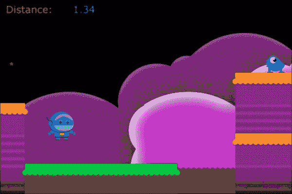
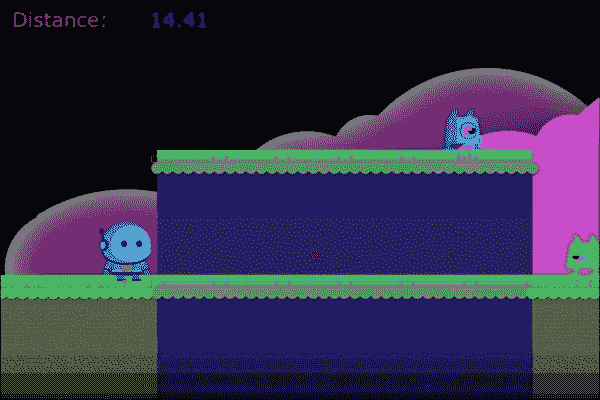
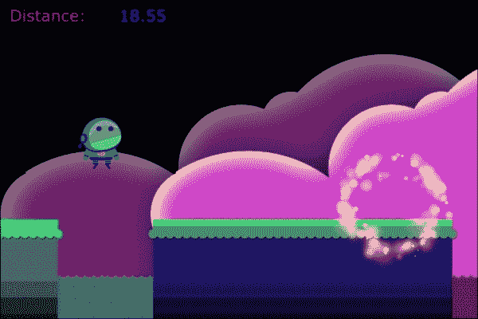

# 第九章。奔跑，奔跑，再奔跑...

在本章中，我们将探讨随机生成的景观，如何用很少的代码创建许多不同的敌人，透视滚动，以及使用粒子效果来增加视觉效果。我们已经多次涵盖了大量的细节，所以对于这个项目，我们将专注于新的、有趣的代码，而不是重新覆盖旧的内容。

在本章中，我们将涵盖以下内容：

+   随机化地形

+   无尽滚动透视背景

+   使用您自己的传感器

+   简化动画

+   粒子效果

# 这款游戏是...

这次我们将设计一个侧滚动无尽跑酷游戏。无尽跑酷游戏风格在移动游戏世界中已经非常流行，并且使用 Cocos2d 实现这种游戏风格非常有趣。基本游戏玩法将是一个简单的双触控控制方法：屏幕左侧的触摸使英雄跳跃，屏幕右侧的触摸将使英雄射击。游戏将连续滚动，不给玩家停下来休息的时间。随着游戏的进行，它将逐渐增加滚动速度，所以玩得越久就越难。对于我们的所有图形（除了背景图像），我们将使用由 James Macanufo 在[`tintanker.com`](http://tintanker.com)创建的 Planet-X 图形，这里使用的是创作者的许可。您可以在[`tintanker.com/makegameswithus`](http://tintanker.com/makegameswithus)找到他的原始图像。如果您喜欢这些图形，James 应得到全部的赞誉，因为这套图形既有趣又富有想象力。

# 设计回顾

当您设计一个侧滚动无尽跑酷游戏时，有两种主要的设计方法。有些人会使用物理引擎，如 Box2D 或 Chipmunk，来帮助控制所有对象之间的交互。我们将采取另一种方法，为游戏构建自己的轻量级物理引擎。我们所有的地面都将使用方形瓦片，这样我们就可以轻松地识别我们的英雄可以安全行走的表面。我们将在所有可通行表面的顶部构建传感器，以及在我们每个行走角色（英雄和敌人）的下方构建传感器。英雄将在屏幕上的固定 x 坐标处，而世界将滚动过英雄。我们将有两种类型的敌人：飞行和行走。两者都将有类似的行为，但行走的敌人将拥有我们提到的传感器，允许它们在其平台上来回行走。敌人不允许走出平台走向死亡。我们还将从头开始实现一个两级无尽透视背景。最后，我们希望在敌人（或英雄）死亡时有一些有趣的效果。我们将使用粒子效果，这些效果是通过 Particle Designer 构建的。我们只使用一个指标来衡量玩家在游戏中的成功：行走的距离。这基本上涵盖了设计的基本内容，所以让我们看看完成的游戏：



# 构建地面

我们将首先构建随机的地面瓦片。在我们的游戏中，我们有三种类型的地面，每种类型有三种地面图像，因此我们可以用它们构建堆叠。为了组织，具有渐变颜色（底部）的图像将被标识为`1`，中间的为`2`，顶部的（带有草地表面）为`3`。让我们看看构建地面的代码，分为两部分。

**文件名**：`ERPlayfieldLayer.m` (`addGround…`，第一部分)

```swift
-(void) addGroundTileswithEnemies:(BOOL)haveEnemies {
    // Randomize nearly everything about the ground
    NSInteger platformWidth = (arc4random() % 5) + 2;
    NSInteger platformHeight = (arc4random() % 4) + 1;
    NSInteger platformType = (arc4random() % 3) + 1;

    switch (platformHeight) {
        case 1:
            [platformStack addObject:[NSNumber
                                      numberWithInt:3]];
            break;
        case 2:
            [platformStack addObject:[NSNumber
                                      numberWithInt:1]];
            [platformStack addObject:[NSNumber
                                      numberWithInt:3]];
            break;
        case 3:
            [platformStack addObject:[NSNumber
                                      numberWithInt:1]];
            [platformStack addObject:[NSNumber
                                      numberWithInt:2]];
            [platformStack addObject:[NSNumber
                                      numberWithInt:3]];
            break;
        case 4:
            [platformStack addObject:[NSNumber
                                      numberWithInt:1]];
            [platformStack addObject:[NSNumber
                                      numberWithInt:3]];
            [platformStack addObject:[NSNumber
                                      numberWithInt:2]];
            [platformStack addObject:[NSNumber
                                      numberWithInt:3]];
            break;
    }
```

我们从这个方法开始，随机化平台宽度、高度和类型（图形集）。宽度和高度都是以我们将为这个平台使用的瓦片数量来表示的。你会注意到宽度在`arc4random()`调用的结果上增加了`2`。这是因为我们希望平台至少有 2 个瓦片宽。任何更小的平台一旦加入敌人，就太难以着陆了。然后我们进入一个大的`switch`语句，传递给它`platformHeight`变量。我们为不同的海拔设计了“堆叠”，以便游戏性更好。瓦片类型 3 是唯一可走的瓦片类型，因此我们需要确保顶部有一个可走的瓦片。这种预定义的堆叠方法确保我们将有一个看起来更愉快且可玩的东西。你会注意到案例 4 在堆叠中使用了两种瓦片类型 3（可走的瓦片）。这将给“堆叠”提供两个单独的平台供英雄行走。我们这样做是为了多样性，同时也是为了确保如果地形直接从海拔 1 到海拔 4，我们不会有一个不可能的排列。较低的地表给英雄提供了另一种着陆的地方。

**文件名**：`ERPlayfieldLayer.m` (`addGround…`，第二部分)

```swift
    for (int w = 0; w <= platformWidth; w++) {
        // Set the new X position for the tile
        maxTileX = maxTileX + tileSize;

        for (int i = 0; i < platformHeight; i++) {
            NSInteger currentTile = [[platformStack
                   objectAtIndex:i] integerValue];

            NSString *tileNm = [NSString stringWithFormat:@"w%i_%i.png", platformType, currentTile];
            ERTile *tile = [ERTile
                spriteWithSpriteFrameName:tileNm];

            // Determine where to position the tile
            [tile setAnchorPoint:ccp(0.5,0)];
            float newY = i * tileSize;

            // Identify if we need a walkable surface
            if (currentTile == 3) {
                [tile setIsTop:YES];

                // Do we want enemies to spawn here?
                if (haveEnemies) {
                    // Determine if we need an enemy here
                    if ((arc4random() % 13) < 1) {
                        // chance of an enemy walker
                        // Add it slightly above the ground
                        [self addWalkingEnemyAtPosition:
                         ccp(maxTileX, newY + tileSize)];
                    }
                }
            } else {
                [tile setIsTop:NO];
            }

            // Set the position (will also create sensor)
            [tile setPosition:ccp(maxTileX, newY)];

            [grndArray addObject:tile];
            [runnersheet addChild:tile z:currentTile];
        }
    }
    [platformStack removeAllObjects];
}
```

现在我们已经定义了一个栈，我们遍历所需的瓷砖宽度。`maxTileX`变量被填充了当前瓷砖栈所需的`x`位置。一旦更新了当前栈，我们就进入另一个基于`platformHeight`变量的循环。我们从`platformStack`数组中获取下一个瓷砖，并在`tileNm`变量中构建精灵名称。这是一个文件命名一致性 conventions 真正帮了大忙的情况。然后我们创建一个新的`ERTile`对象。`ERTile`是`CCSprite`类的一个子类，我们将在接下来的几分钟内查看它。我们将锚点设置为底部中心，这样我们就可以轻松地从屏幕底部构建瓷砖，并通过乘以我们在`init`方法中定义的`tileSize`变量（50，正方形瓷砖的点大小）来定义`y`值。然后我们检查瓷砖是否为类型 3。记住，瓷砖 3 是一个可通行表面。如果是可通行表面，我们将瓷砖的`isTop`值设置为`YES`。（我们也会尝试在可通行表面上生成一定比例的敌人。）最后，我们设置瓷砖的位置，将其添加到`grndArray`数组中，并将瓷砖作为`runnersheet`（我们包含所有前景图像的`CCSpriteBatchNode`）的子项。我们在这里做的最后一件事是从`platformStack`数组中移除所有对象，以便它为下一次添加地面做好准备。

## `ERTile`类

我们提到`ERTile`是`CCSprite`类的一个子类，但在大多数情况下它表现得像一个普通的精灵。让我们看一下实现文件，看看为什么我们需要它。

**文件名**: `ERTile.m`

```swift
-(void) defineSensors {
    topSensor = CGRectMake(self.boundingBox.origin.x,
                           self.boundingBox.origin.y +
                           self.boundingBox.size.height - 10,
                           self.boundingBox.size.width,
                           5);
}

-(void) setPosition:(CGPoint)position {
    // Override set position so we can keep the sensors
    // together with sprite
    [super setPosition:position];

    if (isTop) {
        [self defineSensors];
    }
}
```

这两个方法是`ERTile`类中包含的唯一方法。我们为`topSensor`和`isTop`定义变量和属性，但这个类就这些了。我们需要理解的主要部分是传感器。`topSensor`是我们相对于瓷砖的边界框定义的一个`CGRect`。正如你所见，这个`topSensor`是精灵的全宽，高 5 点，位于精灵顶部内部几点的位置。这是定义此瓷砖“地面”的水平。为了使用它，我们还重写了`setPosition`方法。当调用`setPosition`方法时，它向`super`版本的自身（即`CCSprite`类）发送相同的命令，如果`isTop`值为`YES`，则调用`defineSensors`方法。我们必须不断重新定义它，因为否则`CGRect`将保持在屏幕上你放置的位置，即使精灵本身移动。通过每次`setPosition`调用重新定义它，我们确保它正好位于我们需要的相对位置，相对于瓷砖。

我们还有其他方法可以实现相同的效果，包括在`ERTile`类下有不可见的子精灵。我们选择这种方法是因为`CGRect`比为每个瓷砖（和角色）定义另一个精灵要节省资源得多。就我们的目的而言，这种`CGRect`实现速度快、可靠，并且因为我们将其与重写的`setPosition`方法绑定，所以对任何操纵精灵的其他方法都是不可见的。

## 添加间隙瓷砖

我们不希望地面是连续的，因为我们需要我们的英雄有掉落到死亡的能力。我们以与地面瓷砖相同的方式构建这些间隙瓷砖，只是间隙瓷砖只有一砖高。

**文件名**: `ERPlayfieldLayer.m`

```swift
-(void) addGapTiles {
    // Add spaces between tiles
    // Size of gap depends on current speed
    NSInteger gapRnd = arc4random() % 5;

    // Only create a gap some of the time
    if (gapRnd > 1) {
        // Largest gap allowed is 5 tiles
        NSInteger gapSize = MIN(5, scrollSpeed);

        // Determine which gap/water image to use
        NSInteger gapType = (arc4random() % 2) + 1;

        for (int w = 0; w < gapSize; w++) {
            // We make the water slightly narrower
            maxTileX = maxTileX + tileSize - 2;

            NSString *tileNm = [NSString
                stringWithFormat:@"gap%i.png", gapType];
            ERTile *tile = [ERTile
               spriteWithSpriteFrameName:tileNm];

            [tile setAnchorPoint:ccp(0.5,0)];

            // Put tile at bottom of screen
            [tile setPosition:ccp(maxTileX, 0)];

            // Gap tiles are not walkable
            [tile setIsTop:NO];

            [grndArray addObject:tile];
            [runnersheet addChild:tile z:-1];
        }
    }

    // 10 % chance of spawning a flying enemy
    if (arc4random() % 10 == 1) {
        float newY = (arc4random() % 40) + 250;
        [self addFlyingEnemyAtPosition:ccp(maxTileX, newY)];
    }
    // Always add more tiles after the gap
    [self addGroundTileswithEnemies:YES];
}
```

这个方法的结构与地面瓷砖方法非常相似。我们首先使用随机化器来确定是否需要间隙。我们有五分之三的机会会构建一个间隙（如果`gapRnd`值大于`1`）。这让我们有一些地面到地面的通道，以增加多样性。我们以不同的方式控制间隙的宽度。我们取`scrollSpeed`变量的`MIN`值或`5`，所以当游戏滚动速度较慢时，间隙也会更小。但是当游戏速度加快时，我们不希望任何瓷砖间隙大于 5。这个方法中的循环与地面方法中的循环几乎相同，只是这些瓷砖永远不会被行走。我们还随机化在间隙上创建飞行敌人的过程。这个概率低于行走敌人，并且我们随机化它们的起始高度在`y`值 250 到 289 之间。最后，每次我们构建一个间隙时，我们立即调用构建地面瓷砖的方法。这确保了我们不必担心稍后调用哪个方法。我们只需调用`addGapTiles`方法，它就会处理这两个方法。

## 滚动瓷砖

在我们的游戏中，有很多需要更新的内容，因此我们将`update`方法分解为针对每种更新类型的独立方法。让我们看看我们是如何更新瓷砖的。

**文件名**: `ERPlayfieldLayer.m`

```swift
-(void) updateTiles {
    //Update the ground position, if scrolling
    if (isScrolling) {
        for (CCSprite *aTile in grndArray) {
            [aTile setPosition:ccpAdd(aTile.position, 
                                      ccp(-scrollSpeed,0))];
        }
        // Update HUD
        distanceTravelled = distanceTravelled + 
                                   (scrollSpeed / 100);
        [hudLayer changeDistanceTo:distanceTravelled];

        // Speed up the scroll slowly
        scrollSpeed = scrollSpeed + 0.001;
    }

    // Reset the maxTileX value
    maxTileX = 0;

    // Check all tiles
    for (ERTile *aTile in grndArray) {
        // Check for tiles scrolled away
        if (aTile.position.x < -100) {
            [grndToDelete addObject:aTile];
            [aTile removeFromParentAndCleanup:YES];
        }

        // Check for the rightmost tiles
        if (aTile.position.x > maxTileX) {
            maxTileX = aTile.position.x;
        }
    }

    // Remove off-screen tiles
    [grndArray removeObjectsInArray:grndToDelete];
    [grndToDelete removeAllObjects];

    // Check if we need to add new tiles
    if (maxTileX < (size.width * 1.1)) {
        // Add a gap first
        [self addGapTiles];
    }
}
```

这里第一个要注意的是，在我们的层中有一个名为`isScrolling`的变量，它控制世界是否滚动。它是一个简单的布尔变量，用于根据我们的需要开始或停止滚动。我们还有一个`scrollSpeed`变量，它控制滚动的速度。在我们的`init`方法中，我们将其初始化为`2.5f`。在这个方法中，我们遍历`grndArray`数组中的每个瓦片，并将`scrollSpeed`值的负数（为了将所有东西向左移动）加到每个瓦片的当前位置。然后我们更新我们的移动距离，并调用 HUD 来更新显示。（注意：我们在这里不会讨论 HUD 层。它的结构与我们如何在第八章中构建 HUD 相同，即“射击，滚动，再射击”，如果需要，请翻回那里进行复习）。我们还每次调用这个方法时稍微增加滚动速度，所以随着游戏的进行，速度会逐渐增加。

在我们将所有东西移动之后，我们需要做一些瓦片维护。我们寻找任何`x`值小于`-100`的瓦片，并将它们移除。同时，我们将`maxTileX`值重置为我们找到的最右侧瓦片的`x`位置。如果这个`maxTileX`值小于屏幕宽度的`1.1`倍，我们就调用`addGapTiles`方法来构建一些空隙和地面。这就是制作一个滚动、随机生成的地面的全部过程。

然而，这里有一个小问题。瓦片之间会有可见的缝隙。幸运的是，这个问题有一个简单的解决办法。在 cocos2d 源文件中，有一个名为`ccConfig.h`的文件。打开这个文件，找到看起来像这样的行（2.0 版本中的第 85 行）：

**文件名**: `ccConfig.h`

```swift
#define CC_FIX_ARTIFACTS_BY_STRECHING_TEXEL 0
```

将`0`的值改为`1`，缝隙就消失了。这有多简单？

# 视差背景

在我们转向我们的英雄之前，让我们将注意力转向游戏的另一个无尽元素：背景。我们希望有一个两层视差背景，可以无限滚动。视差背景简单来说就是有多个层，以不同的速度滚动，以模拟远处地形看起来比近处地形移动得慢的现象。我们通过调整背景每一层的滚动速度到相对速度来模拟这一点。让我们看看我们的背景类，看看它是如何工作的。

**文件名**: `ERBackground.h`

```swift
-(id) init {
    if(self = [super init]) {
        size = [[CCDirector sharedDirector] winSize];

        bg1 = [CCSprite spriteWithFile:@"bg_mtns.png"];
        [bg1 setAnchorPoint:ccp(0,0)];
        [bg1 setPosition:ccp(0, 0)];
        [self addChild:bg1];

        bg2 = [CCSprite spriteWithFile:@"bg_mtns.png"];
        [bg2 setAnchorPoint:ccp(0,0)];
        [bg2 setPosition:ccp(1001, 0)];
        [self addChild:bg2];

        [bg2 setFlipX:YES];
    }
    return self;
}
```

`ERBackground`类是`CCLayer`类的子类。在这里，我们只是使用`bg_mtns.png`图像在层中添加了两个精灵。你会注意到我们在这里没有使用精灵表。由于它是一个单独的图像，在这里使用精灵表几乎不会带来性能上的提升。我们将一个放在`(0,0)`，另一个放在`(1001,0)`。这个图像本身宽度为 1000 点，所以这将使它们一个接一个地放置。我们将第二个精灵翻转以增加景观的多样性，尽管我们在这里使用了相同的图像两次。

**文件名**: `ERBackground.m`

```swift
-(void) useDarkBG {
    // Tint for darker mountains
    [bg1 setColor:ccc3(150,150,150)];
    [bg2 setColor:ccc3(150,150,150)];
}
```

我们将使用相同的图像为两个透视层，所以我们要让一个看起来更远。当调用`useDarkBG`方法时，这个方法会将图像大约变暗一半。现在我们需要能够移动背景并使其无限循环。

**文件名**：`ERBackground.m`

```swift
-(void) update:(ccTime)dt {
    // Move the mountains by their scroll speed
    [bg1 setPosition:ccpAdd(bg1.position,
                            ccp(-bgScrollSpeed,0))];
    [bg2 setPosition:ccpAdd(bg2.position,
                            ccp(-bgScrollSpeed,0))];

    // If bg1 is completely off-screen, move after bg2
    if (bg1.position.x < (-1000 - initialOffset.x)) {
        [bg1 setPosition:ccpAdd(bg2.position,
                        ccp(1000 + initialOffset.x,0))];
    }

    // If bg2 is completely off-screen, move after bg1
    if (bg2.position.x < (-1000 - initialOffset.x)) {
        [bg2 setPosition:ccpAdd(bg1.position,
                        ccp(1000 + initialOffset.x,0))];
    }
}
```

当调用`update`方法时，我们将两个图像向左移动它们指定的`bgScrollSpeed`值。然后检查每个背景是否偏离屏幕 1000 个点。如果是，那么那个精灵将被重新定位到另一个精灵的右侧。这意味着每次一个精灵完全偏离屏幕左侧时，它就会被移动到最右边，这样它就会再次滚动。显然，我们有一些参数需要从类外设置。让我们看看我们是如何设置这个的。

**文件名**：`ERPlayfieldLayer.m`（在`init`内部）

```swift
        // Build the scrolling background layers
        background1 = [[ERBackground alloc] init];
        [background1 setAnchorPoint:ccp(0,0)];
        [background1 setPosition:ccp(0,0)];
        [background1 useDarkBG];
        [background1 setBgScrollSpeed:0.025];
        [self addChild:background1 z:-2];

        background2 = [[ERBackground alloc] init];
        [background2 setAnchorPoint:ccp(0,0)];
        [background2 setPosition:ccp(200,0)];
        [background2 setInitialOffset:ccp(200,0)];
        [background2 setBgScrollSpeed:0.1];
        [self addChild:background2 z:-3];
```

在这里，你可以看到`background1`对象调用了`useDarkBG`方法，并将`bgScrollSpeed`的值设置为`0.025`，这很好，速度很慢。这些是远处的山脉。另一层`background2`将其初始偏移设置为向右`200`（并设置了相应的位置），这样山脉就不会完全重叠。它还使用更快的滚动速度`0.1`。这就是建立山脉的全部内容。剩下要完成的是如何调用`update`方法。我们在`ERBackground`类中没有设置任何计划。相反，我们从游戏场的`update`方法中手动调用这个`update`方法：

**文件名**：`ERPlayfieldLayer.m`

```swift
-(void) update:(ccTime)dt {

    // Move the background layers
    [background1 update:dt];
    [background2 update:dt];
```

在游戏场的`update`方法的每次迭代中，它都会调用背景层，并且它们会自己处理，不需要其他操作。

# 我们的英雄

现在，我们可以把注意力转向我们的英雄，那个小太空人。让我们先看看`ERHero`类。

**文件名**：`ERHero.m`

```swift
+(id)spriteWithSpriteFrameName:(NSString *)spriteFrameName {
   return [[[self alloc] initWithSpriteFrameName:spriteFrameName] autorelease];
}

-(id) initWithSpriteFrameName:(NSString *)spriteFrameName {
    if(self = [super initWithSpriteFrameName:spriteFrameName]) { 
        _state = kHeroFalling;

        // Let the hero take 5 hits before death
        heroHealth = 5;

    }
    return self;
}
```

`ERHero`类是`CCSprite`类的子类。因为我们需要一个定制的`init`方法来处理精灵，所以我们重写了`spriteWithSpriteFrameName`类方法和相应的`init`方法。正如你可能从`_state`变量猜到的，英雄将作为一个简单的状态机运行。让我们看看哪些状态是有效的：

**文件名**：`ERDefinitions.m`

```swift
typedef enum {
    kHeroRunning = 1,
    kHeroJumping,
    kHeroInAir,
    kHeroFalling
} HeroState;
```

现在，我们可以看看英雄的状态是如何改变的。

**文件名**：`ERHero.m`

```swift
-(void) stateChangeTo:(HeroState)newState {
    // Make sure we are actually changing state
    if (newState == _state) {
        return;
    }
    // Stop old actions
    [self stopAllActions];
    // Reset the color if we were flashing
    if (isFlashing) {
        CCTintTo *normal = [CCTintTo actionWithDuration:
                            0.05 red:255 green:255 blue:255];
        CCCallBlock *done = [CCCallBlock actionWithBlock:^{
            isFlashing = NO;
        }];
        [self runAction:[CCSequence actions:normal,
                         done, nil]];
    }

    // Determine what to do now
    switch (newState) {
        case kHeroRunning:
            [self playRunAnim];
            break;
        case kHeroJumping:
            [self playJumpAnim];
            break;
        case kHeroFalling:
            [self playLandAnim];
            break;
        case kHeroInAir:
            // Leave the last frame
            break;
    }
    _state = newState;

    [self defineSensors];
}
```

我们首先检查确保我们不是试图将相同的值重新分配给同一个状态。如果是这样，我们就退出。然后我们停止所有动作，因为大多数动作都与动画相关，所以我们希望在运行新动画之前停止之前的动画。`isFlashing`检查与英雄被击中时的动作有关（他会短暂地变红）。我们将这个检查放在这里是为了查看当状态改变时英雄是否在闪烁。如果他正在闪烁，那么我们将英雄强制恢复到正常颜色。我们这样做是因为`stopAllActions`方法也会停止所有动作，包括“着色颜色”动作。最终结果是，如果没有这个条款，当英雄被击中时状态改变，他可能会卡在一个红色的着色中。

`stateChangeTo`方法的核心是底部的 switch 语句。它评估状态并调用适当的动画方法。最后，它定义传感器，以确保我们有当前传感器就位。

**文件名**：`ERHero.m`

```swift
-(void) defineSensors {

    footSensor = CGRectMake(self.boundingBox.origin.x+20,
                              self.boundingBox.origin.y,
                              self.boundingBox.size.width-40,
                              1);
    fallSensor = CGRectMake(self.boundingBox.origin.x+20,
                              self.boundingBox.origin.y-3,
                              self.boundingBox.size.width-40,
                              2);
}

-(void) setPosition:(CGPoint)position {
    // Override set position so we can keep the sensors
    // together with sprite
    [super setPosition:position];

    [self defineSensors];
}
```

这里我们看到与`ERTile`类中看到的相同类型的`defineSensors`方法。对于英雄来说，区别在于他有两个传感器：一个在他的脚下，一个在他的脚下方。`footSensor`变量将用于识别状态变化，而`fallSensor`变量将用于确定英雄是否应该坠落。我们也使用相同的`setPosition`覆盖方法，原因完全相同：在移动过程中保持传感器就位。让我们看看传感器可见时的游戏看起来如何：



## 动画加载

我们已经讨论了播放动画，但实际上我们还没有创建任何动画。我们将使用一个辅助方法来加载我们的动画。

**文件名**：`ERPlayfieldLayer.m`

```swift
-(void)buildCacheAnimation:(NSString*) AnimName
          forFrameNameRoot:(NSString*) root
             withExtension:(NSString*) ext
                frameCount:(NSInteger) count
                 withDelay:(float)delay {
  // This method goes through all the steps to load an
  // animation to the CCSpriteFrameCache
  NSMutableArray *frames = [NSMutableArray array];

  // Load the frames
  for(int i = 1; i <= count; i++) {
      CCSpriteFrame *newFrame = [[CCSpriteFrameCache
            sharedSpriteFrameCache] spriteFrameByName:
            [NSString stringWithFormat:@"%@%i%@",
            root, i, ext]];
      [frames addObject:newFrame];
  }
  // Build the animation
    CCAnimation *newAnim  =[CCAnimation
                        animationWithSpriteFrames:frames
                        delay:delay];
  // Store it in the cache
  [[CCAnimationCache sharedAnimationCache]
             addAnimation:newAnim name:AnimName];
}

-(CCAnimate*) getAnim:(NSString*)animNm {
    // Helper to avoid typing this long line repeaedly
    return [CCAnimate actionWithAnimation:
             [[CCAnimationCache sharedAnimationCache]
             animationByName:animNm]];
}
```

这里我们看到我们的两个辅助方法。第一个方法需要传递很多参数来构建动画。我们传递给它我们想要存储动画的名称，文件名的根，文件名的扩展名，动画的帧数，以及帧之间的时间延迟。这假设任何加载的动画都将有一个递增的数字在它们的文件名中。然后它通过加载每一帧并将其添加到帧数组中的过程。最后，它构建动画并将其存储在`CCAnimationCache`中，存储在指定的`AnimName`字符串下。一旦加载，你只需简单地从缓存中按名称请求动画即可。

从缓存中加载动画所需的代码是一行相当长的代码，因此我们还构建了一个辅助方法来帮助检索帧，`getAnim`。它将一个`CCAnimate`对象返回给调用者。如果我们不使用这个辅助方法，每次我们需要动画时，我们都必须重复该方法内部找到的相同代码行。这两个方法结合起来，使我们免于编写大量重复的代码。现在让我们回到我们的英雄身上。

**文件名**：`ERHero.m`

```swift
-(void) loadAnimations {
    [pf buildCacheAnimation:@"HeroRun"
           forFrameNameRoot:@"hero_run"
              withExtension:@".png"
                 frameCount:4 withDelay:0.1];
    [pf buildCacheAnimation:@"HeroJump"
           forFrameNameRoot:@"hero_jump"
              withExtension:@".png"
                 frameCount:3 withDelay:0.1];
    [pf buildCacheAnimation:@"HeroLand"
           forFrameNameRoot:@"hero_land"
              withExtension:@".png"
                 frameCount:3 withDelay:0.1];
}
```

这个方法是我们加载英雄动画所需的所有内容。我们在创建英雄后从游戏场景中调用这个方法，因为我们需要引用游戏场景来调用辅助方法（我们将其分配给变量`pf`）。

**文件名**: `ERHero.m`

```swift
-(void) playRunAnim {
    CCAnimate *idle = [pf getAnim:@"HeroRun"];
    CCRepeatForever *repeat = [CCRepeatForever
                         actionWithAction:idle];
    [self runAction:repeat];
}
```

在这里，我们看到了我们动画编码劳动的成果。当状态变为`kHeroRunning`时，这个方法会被调用。我们使用辅助方法来获取动画，并将其设置为无限重复。这将使他一直跑动，直到状态改变。

**文件名**: `ERHero.m`

```swift
-(void) playLandAnim {
    CCAnimate *land = [pf getAnim:@"HeroLand"];
    [self runAction:land];
}
```

着陆动画与此类似，只是我们只播放一次。

**文件名**: `ERHero.m`

```swift
-(void) playJumpAnim {
    CCAnimate *jump = [pf getAnim:@"HeroJump"];
    CCCallBlock *change = [CCCallBlock actionWithBlock:^{
        [self stateChangeTo:kHeroInAir];
    }];
    CCSequence *doIt = [CCSequence actions:jump, change, nil];

    [self runAction:doIt];

    // Play the sound effect
    [[SimpleAudioEngine sharedEngine]
                         playEffect:SND_HEROJUMP];
}
```

跳跃动画是三者中最复杂的。我们播放一次动画，然后状态改变`kHeroInAir`，并播放跳跃声音。状态`kHeroInAir`用于英雄在空中但没有任何特殊动画播放的时间。精灵将保持为上一动画的最后帧。

这就涵盖了英雄类中除与射击和被击中相关的方法之外的所有内容。当我们讨论子弹和碰撞时，我们将回到这些方法。

## 更新英雄

如我们之前在瓦片更新中看到的，我们还将英雄的更新操作拆分成了单独的方法，放置在游戏场景层中。让我们来看看这个方法。

**文件名**: `ERHero.m`

```swift
-(void) updateHero:(ccTime)dt {
    CGPoint newPos = hero.position;

    BOOL isFalling = YES;

    // The hero is going up
    if (hero.state == kHeroJumping ||
                   hero.state == kHeroInAir) {
        jumpTimer = jumpTimer - dt;

        if (jumpTimer <= 0) {
            // Jump ending, descend
            [hero stateChangeTo:kHeroFalling];
        } else {
            // Apply a force up for the hero
            newPos = ccpAdd(hero.position, ccp(0,3));
        }
    }

    // If hero is falling, apply our gravity
    if (hero.state == kHeroFalling) {
        newPos = ccpAdd(hero.position, ccp(0,-3));
    }

    // Check if the hero is touching the ground
    for (ERTile *aTile in grndArray) {
        if (CGRectIntersectsRect(hero.footSensor,
                                   aTile.topSensor)) {
            // push hero up 1 point if his feet hit the ground
            newPos = ccpAdd(hero.position, ccp(0,1));
            [hero stateChangeTo:kHeroRunning];
        }

        // See if the fall sensor detects anything below
        if (CGRectIntersectsRect(hero.fallSensor,
                                   aTile.topSensor)) {
            // Not falling
            isFalling = NO;
        }
    }
    // Check if hero should fall
    if (isFalling && hero.state == kHeroRunning) {
        [hero stateChangeTo:kHeroFalling];
    }

    // Move the hero
    [hero setPosition:newPos];

    // Check if hero has fallen off screen
    if (hero.position.y < -40) {
        [self gameOver];
    }
}
```

在这个方法中，我们解析所有可能需要触发或响应的不同状态。如果英雄在跳跃，我们将`jumpTimer`变量减去当前的 delta 值。`jumpTimer`变量控制英雄在单次跳跃中可以在空中停留多长时间。当计时器达到零时，英雄的状态将变为`kHeroIsFalling`。如果计时器仍然大于零，我们将英雄的`y`位置增加 3 点。（如您所回忆的，英雄总是在相同的`x`位置，所以我们只需要关注 y 轴）。如果英雄在下落，那么我们通过减少他的`y`位置来应用重力。

我们随后开始使用我们的传感器。我们检查英雄的`footSensor`是否接触到了任何瓦片的`topSensor`。如果是，我们将英雄向上推 1 点，并将他的状态改为`kHeroRunning`。我们还会检查每个瓦片，看英雄的`fallSensor`是否与瓦片的`topSensor`有接触。如果有与任何瓦片传感器的接触，那么本地的布尔变量`isFalling`将被设置为`NO`。如果没有与任何瓦片传感器的接触，那么`isFalling`变量将仍然保持我们最初赋予它的`YES`，因此我们知道英雄应该是在下落。然后我们检查英雄是否正在奔跑，以及`isFalling`变量是否为`YES`，如果是，我们将他的状态改为`kHeroFalling`。完成所有这些后，我们实际上将新的位置设置给英雄。最后的检查是看英雄是否已经掉出屏幕。如果他已经掉出，我们将调用`gameOver`方法。

# 触摸控制

现在我们有了可以控制的角色，我们需要看看控制方法。

**文件名**: `ERPlayfieldLayer.m`

```swift
-(BOOL) ccTouchBegan:(UITouch *)touch withEvent:(UIEvent *)event {
    if (preventTouches) {
        return YES;
    }

    if (isGameOver) {
        [[CCDirector sharedDirector] replaceScene:[ERMenuScene
                                               scene]];
        return YES;
    }

    CGPoint loc = [touch locationInView:[touch view]];
    CGPoint convLoc = [[CCDirector sharedDirector]
                       convertToGL:loc];

    if (convLoc.x < size.width/2) {
        // Jump if left side of screen
        if (hero.state == kHeroRunning) {
            // Jump from the ground
            [hero stateChangeTo:kHeroJumping];
            // Reset the jump timer
            jumpTimer = maxJumpTimer;
            // Allow hero to double-jump
            allowDoubleJump = YES;
        } else if (allowDoubleJump) {
            // Allow a second jump in the air
            [hero stateChangeTo:kHeroJumping];
            // Reset the jump timer
            jumpTimer = maxJumpTimer;
            // Prevent a third jump
            allowDoubleJump = NO;
        } else {
            return NO;
        }
    } else {
        // Shoot if right side of screen
        [hero shoot];
    }
    return YES;
}
```

在检查是否应该阻止触摸或是否满足游戏结束条件之后，我们将触摸的位置与屏幕的左侧或右侧进行比较。如果触摸在左侧且英雄当前正在奔跑，我们改变状态为 `kHeroJumping`。我们将 `jumpTimer` 变量设置为 `maxJumpTimer` 变量的值（在 `init` 方法中定义为 0.85），并且我们还设置了 `allowDoubleJump` 变量为 `YES`。这种状态改变将在我们刚才看到的 `updateHero` 方法中触发正确的移动行为（向上移动）。我们设置 `allowDoubleJump` 变量是为了给玩家提供一些额外的帮助。正如你所见，`allowDoubleJump` 变量只有在英雄当前不在 `kHeroRunning` 状态时才会被评估。大部分代码与 `if` 语句的第一个子句相同，只是我们将 `allowDoubleJump` 重置为 `NO`。结合这些，玩家可以在空中进行双跳，但会防止第三次空中跳跃。（如果你允许从空中无限跳跃，英雄实际上可以永远飞行！）

最后的 `else` 子句将捕获屏幕右侧的任何触摸，并将消息发送给英雄进行射击。

**文件名**: `ERPlayfieldLayer.m`

```swift
-(void) ccTouchEnded:(UITouch *)touch withEvent:(UIEvent *)event {
    if (isGameOver) {
        return;
    }

    CGPoint loc = [touch locationInView:[touch view]];
    CGPoint convLoc = [[CCDirector sharedDirector]
                       convertToGL:loc];

    // Release the jump
    if (convLoc.x < size.width/2) {
        // Jump if left side of screen
        [hero stateChangeTo:kHeroFalling];
    }
}
```

我们通过查看 `ccTouchEnded` 方法来完成触摸处理。在这里，我们必须首先检查我们是否不在游戏结束的状态。如果没有这个检查，如果英雄在触摸发生时死亡，游戏会在手指抬起时立即崩溃（因为英雄精灵已经死亡并消失）。

大部分内容都与跳跃有关，正如你可能想象的那样。如果触摸在左侧（跳跃侧），那么我们改变状态为 `kHeroFalling`，这样重力就可以接管了。

# 射击子弹

现在，我们将注意力转向子弹和允许我们的英雄进行射击。让我们看看简单的 `ERBullet` 类。

**文件名**: `ERBullet.h`

```swift
@interface ERBullet : CCSprite {
    BOOL isShootingRight;
    BOOL isHeroBullet;
}

@property (nonatomic, assign) BOOL isShootingRight;
@property (nonatomic, assign) BOOL isHeroBullet;

@end
ERBullet.m:
@implementation ERBullet

@synthesize isShootingRight;
@synthesize isHeroBullet;

@end
```

我们的 `ERBullet` 类不过是一个 `CCSprite` 类的子类，它包含一些额外的布尔变量用于跟踪。`isShootingRight` 布尔变量帮助我们跟踪子弹的移动方向。由于我们只为子弹设计平直的轨迹，我们实际上只需要知道它是向左还是向右移动。我们还使用 `isHeroBullet` 变量来跟踪这是谁的子弹，以便进行碰撞检测。我们不允许“友军火力”，所以敌人不会在这个游戏中杀死其他敌人。现在我们可以看看当英雄被指示射击时会发生什么。

**文件名**: `ERHero.m`

```swift
-(void) shoot {
    // Create a bullet at hero's position
    ERBullet *bullet = [ERBullet
                   spriteWithSpriteFrameName:IMG_BULLET];
    [bullet setColor:ccBLUE];
    [bullet setIsShootingRight:YES];
    [bullet setIsHeroBullet:YES];
    [bullet setPosition:self.position];

    // Tell the playfield to add the bullet
    [pf addBullet:bullet];

    // Play the sound effect
    [[SimpleAudioEngine sharedEngine]
                   playEffect:SND_HEROSHOOT];
}
```

我们在英雄的位置创建一颗新的子弹，给它一个漂亮的蓝色，并将我们的两个布尔变量设置为 `YES`。英雄只向右移动，因此子弹也只会向右移动。然后我们调用游戏场的 `addBullet` 方法。我们通过播放一个射击声音来结束这个过程。接下来让我们看看那个 `addBullet` 方法。

**文件名**: `ERPlayfieldLayer.m`

```swift
-(void) addBullet:(ERBullet*) thisBullet {
    [runnersheet addChild:thisBullet z:3];

    [bulletArray addObject:thisBullet];
}
```

这里也没有太多内容。我们将子弹添加到批处理节点中，并将子弹添加到`bulletArray`数组中。那么为什么我们在这里做这件事，而不是在英雄的`shoot`方法中做？一方面，我们将在添加敌人子弹时使用这个相同的方法。另一个原因是，我们不希望`bulletArray`数组在游戏场层外部可访问，因此使用这个方法将子弹插入数组要容易得多。

如你所想，也有一个单独的子弹更新方法。我们现在就来看看。

**文件名**：`ERPlayfieldLayer.m`

```swift
-(void) updateBullets {
    for (ERBullet *bullet in bulletArray) {
        if (bullet.isShootingRight) {
            // Move the bullet right
            bullet.position = ccpAdd(bullet.position,
                                      ccp(10,0));

            // Remove bullets that are off the screen
            if (bullet.position.x > size.width) {
                [bulletsToDelete addObject:bullet];
                [bullet removeFromParentAndCleanup:YES];
            }
        } else {
            // Move the bullet left
            bullet.position = ccpAdd(bullet.position, 
                                      ccp(-10,0));

            // Remove bullets that are off the screen
            if (bullet.position.x < 0) {
                [bulletsToDelete addObject:bullet];
                [bullet removeFromParentAndCleanup:YES];
            }
        }
    }

    // Remove deleted bullets from the array
    [bulletArray removeObjectsInArray:bulletsToDelete];
    [bulletsToDelete removeAllObjects];
}
```

这种方法风格现在应该很熟悉了。我们遍历`bulletArray`数组中的所有子弹，根据`isShootingRight`变量的值将每个子弹向左或向右移动。如果子弹飞出屏幕，它将被添加到`bulletsToDelete`数组中，然后在循环之后使用该数组从`bulletArray`中删除子弹。当然，在这个阶段，子弹不会与任何东西交互，但在处理碰撞之前，我们需要有一些敌人来射击。

# 到处都是敌人

我们想在游戏中拥有敌人。很多敌人。我们需要有飞行敌人以及行走的敌人。使用我们使用的奇妙 Planet-X 图形，设计师创建了六种颜色中的六种生物。我们使用了除一种生物类型（游泳生物不适合这个游戏）之外的所有类型，因此我们有 12 种飞行敌人类型和 18 种行走敌人类型。在我们的游戏中，生物的行为没有区别，但这确实给游戏增添了更多的视觉魅力。因为我们将在整个游戏中随机创建敌人，所以我们不想每次生成新的生物时都重新加载动画到缓存中，因此我们在加载游戏场时构建所有敌人动画。

**文件名**：`ERPlayfieldLayer.m`

```swift
-(void) loadEnemyAnimations {    
    // Build all walking enemy animations
    for (int i = 1; i <= 18; i++) {
        // Build the names for the image and animation
        NSString *root = [NSString stringWithFormat:
                          @"walk%i_", i];
        NSString *anim = [NSString stringWithFormat:
                          @"%@move", root];

        // Build the animation into the cache
        [self buildCacheAnimation:anim
                 forFrameNameRoot:root
                    withExtension:@".png"
                       frameCount:4 withDelay:0.1];
    }

    // Build all flying enemy animations
    for (int i = 1; i <= 12; i++) {
        // Build the names for the image and animation
        NSString *root = [NSString stringWithFormat:
                          @"fly%i_", i];
        NSString *anim = [NSString stringWithFormat:
                          @"%@move", root];

        // Build the animation into the cache
        [self buildCacheAnimation:anim
                 forFrameNameRoot:root
                    withExtension:@".png"
                       frameCount:4 withDelay:0.1];
    }
 }
```

因为我们保持了命名约定的一致性（即`walk1_1.png`、`walk1_2.png`等等），我们可以轻松地在循环中构建我们的名称。我们首先在循环中加载行走敌人，并使用两个字符串来帮助我们。`root`参数是文件名中增量帧号之前的第一部分。`anim`变量将在`root`名称的末尾添加单词"move"，以加载该名称下的动画。因此，第五个行走的动画将被命名为`walk5_move`。然后我们调用与英雄相同的辅助方法来加载所有行走的动画帧。方法的后半部分重复同样的过程，只是它加载的是飞行生物的动画。

现在我们可以开始查看`EREnemy`类了，它看起来非常熟悉。

**文件名**：`EREnemy.m`

```swift
-(void) defineSensors {
    fallSensor = CGRectMake(self.boundingBox.origin.x+20,
                            self.boundingBox.origin.y-10,
                            self.boundingBox.size.width-40,
                            10);
}
-(void) setPosition:(CGPoint)position {
    // Override set position so we can keep the sensors
    // together with sprite
    [super setPosition:position];

    [self defineSensors];
}
```

我们为敌人定义了一个`fallSensor`变量，使用与英雄相同的结构。我们还重写了这个类的`setPosition`方法，以便每次重新定位时都刷新`fallSensor`。

**文件名**：`EREnemy.m`

```swift
-(void) shoot {
    // Create a bullet at enemy's position
    ERBullet *bullet = [ERBullet
                          spriteWithSpriteFrameName:IMG_BULLET];
    [bullet setColor:ccRED];
    [bullet setIsShootingRight:self.isMovingRight];
    [bullet setPosition:self.position];
    [bullet setIsHeroBullet:NO];

    // Tell the playfield to add the bullet
    [pf addBullet:bullet];

    // Play the sound effect
    [[SimpleAudioEngine sharedEngine]
                              playEffect:SND_ENEMYSHOOT];
}
```

敌人的`shoot`方法与英雄的`shoot`方法非常相似。显然，这里的`isHeroBullet`布尔变量被设置为`NO`。此外，`isShootingRight`变量将自己设置为`EREnemy`类中包含的新变量之一。

**文件名**: `EREnemy.h`

```swift
    BOOL isMovingRight;
    BOOL isFlying;
    ccTime shootTimer;
```

这些变量帮助我们更好地跟踪敌人。`isFlying`和`isMovingRight`布尔变量是自解释的。敌人的`shootTimer`被保留在这个类中，而英雄的则作为游戏场层本身的一部分保留。现在我们已经看到了`EREnemy`类的所有内容（除了被击中），我们可以看看我们在游戏中是如何创建敌人的。

**文件名**: `ERPlayfieldLayer.m`

```swift
-(void) addWalkingEnemyAtPosition:(CGPoint)pos {
    // Randomly select a walking enemy
    NSInteger enemyNo = (arc4random() % 18) + 1;

    // Build the name of the enemy
    NSString *enemyNm = [NSString stringWithFormat:@"walk%i",
                            enemyNo];

    // Build the initial sprite frame name
    NSString *enemyFrame = [NSString
                      stringWithFormat:@"%@_1.png", enemyNm];
    EREnemy *enemy = [EREnemy
                      spriteWithSpriteFrameName:enemyFrame];
    [enemy setPosition:ccpAdd(pos, 
                      ccp(0, enemy.contentSize.height/2))];
    [enemy setIsMovingRight:NO];
    [enemy setFlipX:NO];
    [enemy setIsFlying:NO];
    [enemy setPf:self];

    // Add this enemy to the layer and the array
    [runnersheet addChild:enemy z:5];
    [enemyArray addObject:enemy];

    // Set the enemy in motion
    NSString *moveAnim = [NSString
                    stringWithFormat:@"%@_move", enemyNm];
    CCAnimate *idle = [self getAnim:moveAnim];
    CCRepeatForever *repeat = [CCRepeatForever
                    actionWithAction:idle];
    [enemy runAction:repeat];
}
```

正如我们在创建地面瓦片时所做的，我们随机选择`enemyNo`，并使用它来构建新`EREnemy`对象的正确初始帧名称。当我们设置位置时，我们将请求的位置（`pos`）加到敌人本身的内容大小的一半。我们这样做是因为敌人有一个默认的中心`anchorPoint`，而传递的位置是我们希望敌人站立在上的瓦片的顶部。因此，通过添加一半的高度，我们使敌人完美地站在下面的瓦片上。（我们不希望改变`anchorPoint`，因为那样我们就必须为所有由敌人发射的子弹进行此类调整。）所有敌人都会开始面向左侧，由于这些是行走的敌人，它们将`isFlying`设置为`NO`。在将敌人添加到批节点和`enemyArray`数组后，我们获取为这个特定敌人加载的动画，并将其设置为无限重复。这就是我们创建行走的敌人所需的所有内容。

**文件名**: `ERPlayfieldLayer.m`

```swift
-(void) addFlyingEnemyAtPosition:(CGPoint)pos {
    // Randomly select a walking enemy
    NSInteger enemyNo = (arc4random() % 12) + 1;

    // Build the name of the enemy
    NSString *enemyNm = [NSString stringWithFormat:@"fly%i",
                      enemyNo];

    // Build the initial sprite frame name
    NSString *enemyFrame = [NSString
                      stringWithFormat:@"%@_1.png", enemyNm];
    EREnemy *enemy = [EREnemy
                      spriteWithSpriteFrameName:enemyFrame];
    [enemy setPosition:pos];
    [enemy setIsMovingRight:NO];
    [enemy setFlipX:NO];
    [enemy setIsFlying:YES];
    [enemy setPf:self];

    // Add this enemy to the layer and the array
    [runnersheet addChild:enemy z:5];
    [enemyArray addObject:enemy];

    // Set the enemy in motion
    NSString *moveAnim = [NSString
                      stringWithFormat:@"%@_move", enemyNm];
    CCAnimate *idle = [self getAnim:moveAnim];
    CCRepeatForever *repeat = [CCRepeatForever
                      actionWithAction:idle];
    [enemy runAction:repeat];
}
```

当我们查看如何添加飞行敌人时，你会注意到这与行走的敌人有相同的基本代码结构。唯一的真正区别是精灵帧的名称以`fly`开头而不是`walk`，并且我们不需要更改飞行敌人的起始位置，因为它们根本不会与地面互动。现在我们可以转向敌人的`update`方法。

**文件名**: `ERPlayfieldLayer.m`

```swift
-(void) updateEnemies:(ccTime)dt {
    // Only update the enemies while scrolling
    if (isScrolling == NO) {
        return;
    }

    // Loop through all enemies
    for (EREnemy *anEnemy in enemyArray) {
        BOOL noGround = YES;

        // Check movement direction
        if (anEnemy.isMovingRight) {
            // Moving against the scroll
            [anEnemy setPosition:ccpAdd(anEnemy.position,
                             ccp(-scrollSpeed + 2,0))];
        } else {
            // Moving with the scroll
            [anEnemy setPosition:ccpAdd(anEnemy.position,
                             ccp(-scrollSpeed - 2,0))];
        }

        // Updates for walking enemies only
        if (anEnemy.isFlying == NO) {
            // Check if the enemy is touching the ground
            for (ERTile *aTile in grndArray) {
                // See if the sensor detects anything below
                if (CGRectIntersectsRect(anEnemy.fallSensor,
                                aTile.topSensor)) {
                    // Ground is under foot
                    noGround = NO;
                }
            }

            // If there is no ground underfoot, turn around
            if (noGround) {
                if (anEnemy.isMovingRight) {
                    [anEnemy setIsMovingRight:NO];
                    [anEnemy setFlipX:NO];
                } else {
                    [anEnemy setIsMovingRight:YES];
                    [anEnemy setFlipX:YES];
                }
            }
        }

        // Enemy can shoot, with time delay
        if (anEnemy.shootTimer <= 0) {
            [anEnemy shoot];
            anEnemy.shootTimer = 2.0;
        } else {
            anEnemy.shootTimer = anEnemy.shootTimer - dt;
        }

        // Check for enemies off screen
        if (anEnemy.position.x < -50) {
            // If off-screen to the left, add to delete
            [enemiesToDelete addObject:anEnemy];
            [anEnemy removeFromParentAndCleanup:YES];
        }
    }

    // Remove deleted enemies from the array
    [enemyArray removeObjectsInArray:enemiesToDelete];
    [enemiesToDelete removeAllObjects];
}
```

我们通过确保游戏场正在滚动来开始`updateEnemies`方法。如果没有，我们就退出，因为我们不希望敌人移动。然后我们遍历`enemyArray`中的所有敌人，根据它们的`isMovingRight`布尔变量是设置为向左还是向右移动。更新过程的中段仅关注行走的敌人。对于每个行走的敌人，我们遍历所有瓦片以查看它们的`fallSensor`是否接触到了任何瓦片。这与我们在`updateHero`方法中对英雄使用`isFalling`布尔变量所做的是完全相同的。如果没有地面，我们不会让敌人掉落，而是翻转图形以面向相反方向，并将`isMovingRight`布尔值更改为相反值。如果敌人到达了悬崖的边缘，这将使它转身。

接下来，我们为敌人有一个简单的`shootTimer`循环。每个敌人每 2 秒射击一次。因为我们有非智能敌人（它们来回移动，但从不追击玩家），所以对于敌人来说，这种盲射的形式是有意义的。

最后，我们检查是否有任何敌人出现在屏幕左侧之外，并按常规方式移除它们。现在我们的敌人可以移动，每个人都可以射击，我们需要一些碰撞检测。

# 碰撞处理

我们需要能够检查三种不同类型的碰撞。我们需要能够让子弹击中敌人。我们需要英雄被击中。我们还需要在英雄遇到敌人时做出反应。让我们看看这个方法，它分为两部分。

**文件名**：`ERPlayfieldLayer.m`（`checkCollisions`，第一部分）

```swift
-(void) checkCollisions {
    BOOL isHeroHit = NO;

    for (ERBullet *bullet in bulletArray) {
        // Enemy bullets
        if (bullet.isHeroBullet == NO) {
            if (CGRectIntersectsRect(hero.boundingBox,
                                bullet.boundingBox)) {
                // Hero got hit
                [bulletsToDelete addObject:bullet];
                [bullet removeFromParentAndCleanup:YES];
                isHeroHit = YES;
                break;
            }
        } else {
            // Hero bullets

            // Check all enemies to see if they got hit
            for (EREnemy *anEnemy in enemyArray) {
                if (CGRectIntersectsRect(anEnemy.boundingBox,
                                         bullet.boundingBox)) {
                    [bulletsToDelete addObject:bullet];
                    [bullet removeFromParentAndCleanup:YES];
                    [enemiesToDelete addObject:anEnemy];
                    [anEnemy gotShot];
                    break;
                }
            }
        } 
    }
```

我们首先遍历数组中的所有子弹。如果子弹是敌人的子弹（`isHeroBullet == NO`），那么我们检查子弹的`boundingBox`与英雄的`boundingBox`是否相交。如果它们相交，我们将子弹添加到`bulletsToDelete`数组中，移除子弹，并将`isHeroHit`布尔值设置为`YES`。在这里我们使用布尔变量来表示英雄被击中，因为我们将在该方法内进行另一个英雄碰撞检查。由于英雄的死亡会导致英雄被移除，如果英雄被射击并在同一时间遇到敌人，游戏将会崩溃。

如果子弹是“英雄子弹”，我们遍历所有敌人以确定子弹是否与敌人的`boundingBox`相交。如果是，我们将子弹添加到`bulletsToDelete`数组中，移除子弹，将敌人添加到`enemiesToDelete`数组中，并发送消息给敌人，告知它被击中。

**文件名**：`ERPlayfieldLayer.m`（`checkCollisions`，第二部分）

```swift
    // Check for enemy and hero collisions
    for (EREnemy *anEnemy in enemyArray) {
        if (CGRectIntersectsRect(anEnemy.boundingBox,
                         hero.boundingBox)) {
            // Trigger the enemy's hit
            [enemiesToDelete addObject:anEnemy];
            [anEnemy gotShot];
            // Trigger the hero's hit
            isHeroHit = YES;
            break;
        }
    }

    // We process this here because there could be
    // multiple collisions with the hero
    if (isHeroHit) {
        [hero gotShot];
    }

    // Remove deleted bullets from the array
    [bulletArray removeObjectsInArray:bulletsToDelete];
    [bulletsToDelete removeAllObjects];

    // Remove deleted enemies from the array
    [enemyArray removeObjectsInArray:enemiesToDelete];
    [enemiesToDelete removeAllObjects];
}
```

在这个方法的第二部分，我们首先遍历所有敌人。对于每个敌人，我们检查敌人的`boundingBox`是否与英雄的`boundingBox`相交。如果它们相交，我们以与子弹相同的方式为英雄和敌人注册碰撞。

在解决碰撞后，我们检查`isHeroHit`变量以查看英雄是否被击中。如果他被击中，我们向英雄发送`gotShot`消息。作为最后的清理工作，我们像往常一样处理`bulletsToDelete`和`enemiesToDelete`数组：我们使用它们从`bulletArray`和`EnemyArray`中移除被删除的对象，然后使用`removeAllObjects`方法清空删除数组。

## 被粒子击中

我们需要查看的最后未解决的代码片段是敌人和英雄的`gotShot`例程。敌人被击中一次后就会死亡，所以他们的方法是一个更简单的起点。

**文件名**：`EREnemy.m`

```swift
-(void) gotShot {
    CCParticleSystemQuad *emitter = [CCParticleSystemQuad
                      particleWithFile:@"enemydie.plist"];
    [emitter setPosition:self.position];
    [pf addChild:emitter z:50];

    [self removeFromParentAndCleanup:YES];

    // Play the sound effect
    [[SimpleAudioEngine sharedEngine]
                         playEffect:SND_ENEMYDEAD];
}
```

当敌人被击中时，我们首先创建一个粒子系统。粒子可以通过两种方式编码。第一种是手动设置粒子系统的所有参数，并通过测试和重试直到达到期望的效果。另一种方法（更广泛使用的方法）是使用一个商业工具，粒子设计师，可在[`particledesigner.71squared.com`](http://particledesigner.71squared.com)找到。粒子设计师允许您实时查看更改每个参数的结果，因此您可以实验直到达到期望的结果。一旦您得到想要的效果，您可以将其保存为`.plist`文件，并像我们这样使用它。我们使用 plist 文件创建了一个`CCParticleSystemQuad`对象，设置了位置，并将其添加到层中。这就是我们为这个一次性粒子需要做的所有事情。（如果您想知道使用粒子设计师避免了多少手动编码，请打开 Xcode 中的`enemydie.plist`文件，并查看其中存储的所有值。）

在触发粒子后，我们只需从其父节点中移除敌人，并播放一个美妙的死亡音效。让我们看看敌人被击中的后果：



## 英雄死亡

英雄被击中增加了复杂性，因为英雄在被击中五次之前才会死亡。如果他没死，我们希望他短暂地闪烁红色。

**文件名**：`ERHero.m`

```swift
-(void) gotShot {
    // Subtract one from hero health
    heroHealth--;

    // Determine if the hero is dead
    if (heroHealth <= 0) {
        // Spawn a death particle
        CCParticleSystemQuad *emitter = [CCParticleSystemQuad
                        particleWithFile:@"ExplodingRing.plist"];
        [emitter setPosition:self.position];
        [pf addChild:emitter z:50];

        // We don't clean up to avoid block failure
        [self removeFromParentAndCleanup:NO];

        // Play the sound effect for death
        [[SimpleAudioEngine sharedEngine]
                      playEffect:SND_HERODEATH];

        // Trigger game over
        [pf gameOver];
    } else if (isFlashing == NO) {
        // Flash the hero red briefly
        isFlashing = YES;
        CCTintTo *red = [CCTintTo actionWithDuration:0.05
                                   red:255 green:0 blue:0];
        CCTintTo *normal = [CCTintTo actionWithDuration:0.05
                                   red:255 green:255 blue:255];
        CCCallBlock *done = [CCCallBlock actionWithBlock:^{
            isFlashing = NO;
        }];
        [self runAction:[CCSequence actions: red, normal,
                             done, nil]];

        // Play the got hit sound effect
        [[SimpleAudioEngine sharedEngine]
                            playEffect:SND_HEROHIT];
    }
}
```

我们首先减少英雄的生命值一个单位。然后检查英雄是否应该死亡。如果他的生命值为零，我们在英雄中心生成一个新的粒子系统，移除英雄，播放死亡音效，然后调用`gameOver`方法。需要注意的是，我们这里使用的`ExplodingRing.plist`文件实际上是 Cocos2d 附带的一个粒子，用作粒子测试的一部分。

如果英雄没有死亡，我们就检查英雄的`isFlashing`变量的值。如果他没有正在闪烁，我们就构建一个小的动作序列，将英雄染成红色，持续时间为 0.05 秒，然后恢复到正常颜色（所有最大值将精灵颜色恢复到原始颜色）。然后我们播放一个音效，并完成操作。

# 摘要

我们在这个游戏中组合了许多有趣的元素。我们有动态地形、随机敌人、射击、跳跃、无限背景，并且在构建和游玩过程中（希望）有一些乐趣。您会注意到，还有一些不太有趣的细节我们没有深入探讨。请查阅代码包以探索游戏的其他部分，例如当英雄被飞船放下开始游戏时的“戏剧性入场”。在`ERPlayfieldLayer.m`文件的底部还有一些用于传感器的有用调试代码（已注释）。通过启用该代码，您可以在游戏播放时看到绘制的传感器框。

我们衷心希望这些项目能在您的追求中起到指导、娱乐，甚至可能激发灵感的作用。每一款游戏都采用了“骨架式”设计，为探索和扩展提供了充足的空间。如果您因为这些项目而受到启发，创作出了令人惊叹的作品，请告诉我们！我们期待着您的反馈。
