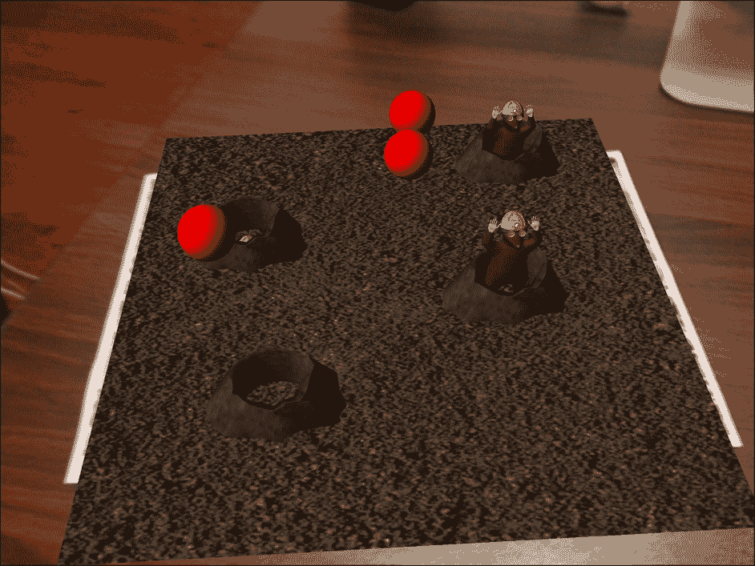
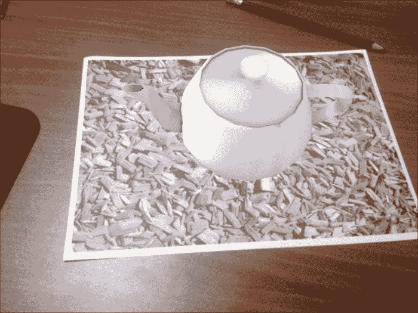
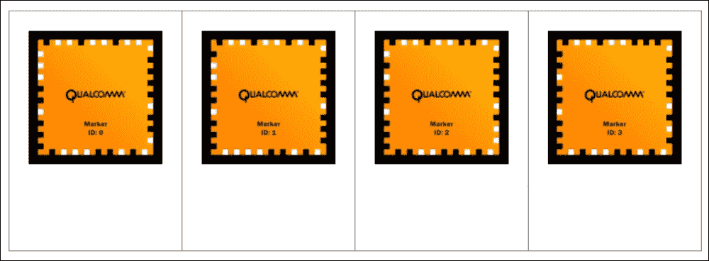
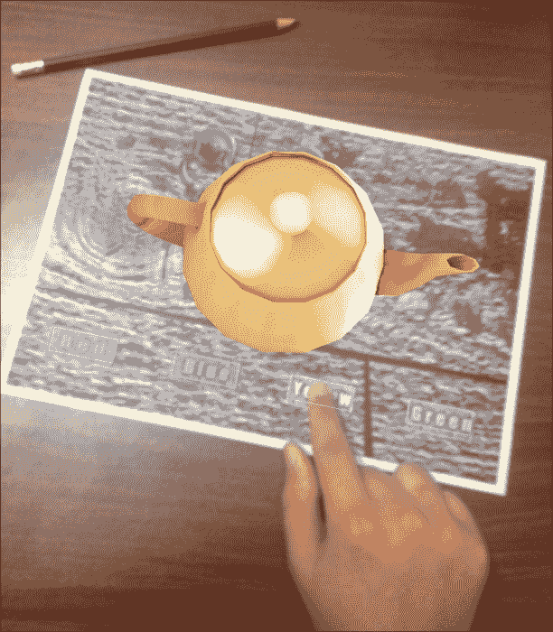
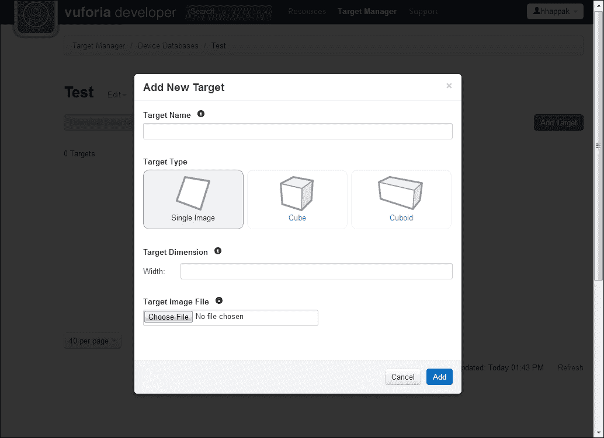
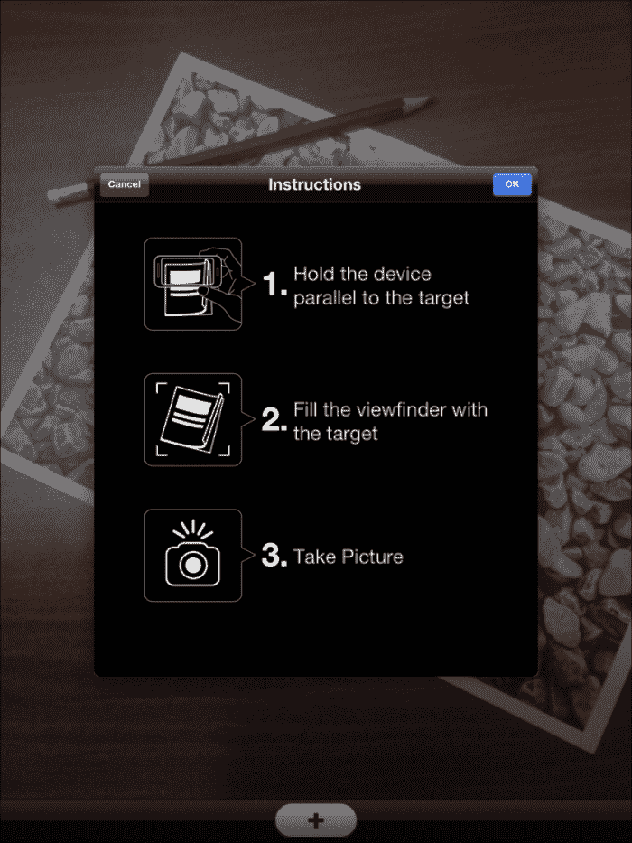
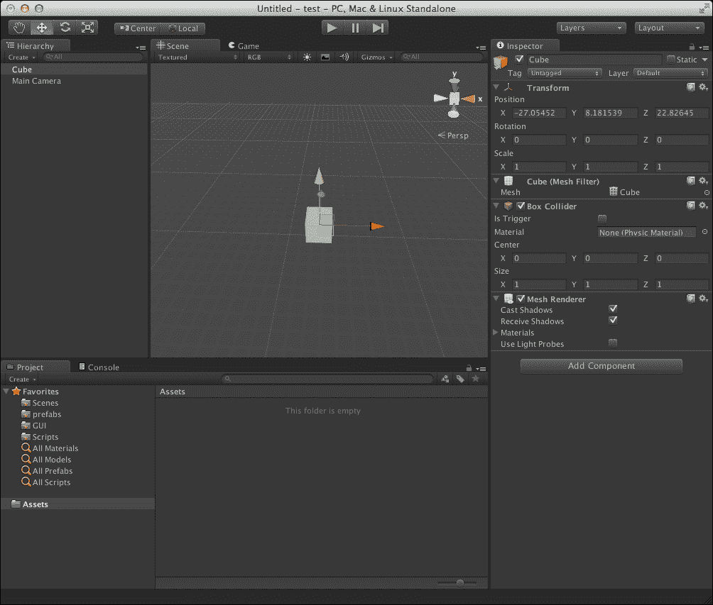

# 第一章：什么是增强现实？

在增强现实中，我们周围的现实世界被叠加了虚拟内容。无论是沉浸式的 3D 体验还是简单的文本和指示，虚拟现实都是一个古老的概念，也是一个新兴的新技术。在本章中，我们将探讨增强现实的概念及其多种形式，以拓宽我们对概念范围及其应用的认识。我们还将介绍帮助我们在这爆炸性增长的移动平台上，特别是 iOS 设备上实现这一概念的工具。以下图像展示了一个增强现实游戏：

# 增强现实（Augmented Reality）的定义

增强现实（**AR**）在其最广泛和最简单的定义中，是一种使虚拟内容能够添加到现实世界中的技术。这通常与将 3D 内容添加到摄像头实时画面中相关联，尽管这个术语本身具有更广泛的意义和用法。

可能是人们几十年来一直在使用的最简单的增强现实形态，就是十多年前在照相机中可用的那种。许多人都在使用它，但很少有人意识到所应用概念的本质。这是相机中称为“取景器”的部分，是你通过它观察通过相机看世界的那个小窗口。这个小小的窗口实际上是一种非常简单的增强现实。它本质上是通过镜头观察周围的世界，然后添加一层印在玻璃上的图层，以突出镜头的中心和要捕捉的图像的边缘。在这里所做的是所有形态的增强现实都力求做到的事情，即在现实世界之上叠加相对信息。

在移动平台上，增强现实遵循相同的原理，尽管方法略有不同。摄像头捕捉周围世界的实时画面，然后计算机视觉系统试图在可见的 3D 空间中获得方位，并以与周围世界无缝的方式显示增强现实。计算用户相对于周围现实世界的相对位置的过程，以便能够为用户正确增强内容，被称为跟踪（tracking）。

## 增强现实的形态

增强现实可以采取多种形式。它总是以某种形式依赖于一种计算相对于我们周围现实世界的相对 3D 空间的技术。它可以使用许多技术来实现这一点。例如，iPhone 上的陀螺仪可以用来跟踪手机在 3D 空间中的放置，如果应用了运动，可以用来跟踪相对于设备的世界。这通常在许多增强现实游戏中看到。这当然是一种 AR 形式，但在这本书中，我们将主要关注一种使用计算机视觉的跟踪形式。

计算机视觉跟踪可以分为两个部分：标记跟踪和无标记跟踪。在标记跟踪中，有一个物理实体，计算机视觉被训练去跟踪；它将摄像机的视角相对于它定位。所使用的物理对象通常被称为可跟踪对象。可跟踪对象通常被内部处理，作为原点和世界的中心，计算机视觉可以据此定位自己。有时，摄像头实时流被认为是世界的中心，可跟踪对象或可跟踪对象是围绕它旋转的物体，从某种意义上说。

无标记跟踪技术本质上与标记跟踪相似，因为它们都试图找到一个基准点来相对于现实进行增强。它们在寻找基准点的方式上有所不同，与标记跟踪不同，它们不需要使用预先定义的物理对象，计算机视觉只训练跟随该对象。在无标记跟踪中，计算机视觉主要被编程为跟随某些颜色和形状，具有一定的自由度。例如，计算机可以被训练去跟随某种色调的绿色物体，并用蓝色物体将其完全覆盖。在这种情况下，它只是跟踪颜色；如果它在摄像头输入中找到一个绿色区域，它就会用蓝色虚拟物体进行增强。计算机视觉甚至可以被训练去识别面部，例如所有那些在用户头部或面部周围添加动画效果的名人相机应用程序。无标记跟踪无疑更加灵活，但它提供的可靠性比标记跟踪要低。此外，无标记跟踪自然地更复杂，这促进了标记跟踪增强现实技术的流行。

在这本书中，我们将使用 Vuforia SDK，这是一个使用标记跟踪技术的 SDK。我们将使用它与 Unity 3D 引擎结合，在 iOS 设备上提供增强现实体验。在利用这两种技术的同时，我们将熟悉创建增强现实的工作流程。

# 智能手机与增强现实

正如我们已经确立的，增强现实的概念是一个古老的观念。它甚至被编织进我们所能记得的科幻电影中的流行文化中。作为一项技术，增强现实直到最近才达到主流。在过去，由于需要昂贵的设置才能运行，增强现实被认为是一个小众领域。在硬件方面，增强现实的要求很高。它需要一个摄像头来观察世界，计算能力来计算和渲染增强内容，以及用户与虚拟内容交互的方式。所有这些对于主流用户来说都难以实现。

现在，几乎每个人都随身携带非常强大的电脑，能够在很大程度上渲染逼真的图形内容。这些智能手机以史无前例的速度发展，每月都变得更加强大。而且最好的一点是，它们配备了精确的摄像头，满足了增强现实所需的三个条件。

并不非常不准确的是假设每个人都可以随意携带一个增强现实设备。仅此一点就消除了长久以来存在的可访问性障碍。现在，增强现实内容可以以前所未有的沉浸式体验触及数百万用户。

许多公司已经理解了行业趋势及其潜力的重要性。也许走在最前面的是全球最大的移动芯片制造商高通。高通意识到了手机中存在的 AR 的巨大潜力，并开发了免费的 SDK Vuforia。Vuforia 过去被称为 QCAR，是为了让开发者能够挖掘移动空间中的这一潜力而创建的。Vuforia 最初在 Android 平台上启动，后来扩展到包括 iOS 设备。高通始终在其芯片上包含微妙的优化，以进一步提高 AR 体验。这表明他们对技术未来的信心有多大。高通甚至投资于制作一个更适用于移动设备的 OpenCV SDK，称为 Easy CV。Easy CV 是用于图像处理和计算机视觉的工具，可以进一步增强 AR 的体验以及其他涉及计算机视觉的应用。

谷歌也通过其 Google Glass 项目大力投资于增强现实的概念。Google Glass 可能是目前开发中的最雄心勃勃的增强现实项目。它承诺以头戴式显示器和相机的方式为大众提供可穿戴电脑。设计旨在不引人注目，但同时又高效地显示基于现实世界输入的增强现实数据。交互将以语音命令的形式进行，并且能够访问互联网。该项目仍处于起步阶段，但谷歌投入了如此多的资源，显然表明了新兴 AR 技术的重要性。

随着增强现实硬件的可访问性、主要企业的支持以及巨大的市场，增强现实拥有其茁壮成长并长期存在的所有必要条件。这就是为什么了解这一概念及其潜力是重要的。

# 内容传递的沉浸因素

沉浸是用户对你呈现给他们的世界的全神贯注程度。世界越可信，用户就越沉浸其中，体验试图传达的信息就越成功。成功的开发者会努力实现尽可能高的沉浸水平。

人类的大脑总是会试图理解他们所看到的；这一点对所有人类互动都是适用的。对于虚拟交互来说，这一点尤其有趣，因为人类大脑试图理解的东西在物理上并不存在。谎言越复杂，大脑就越容易相信它。因此，沉浸的艺术就是向大脑讲述完美的谎言的艺术。正如所有优秀的骗子都会说，如果他们在那一刻诚实，讲述完美谎言的方法就是将其与真相混合。根据这个定义，增强现实是讲述谎言的完美方式。

通过将虚拟内容与真实世界混合，用户会感到与展示的内容紧密相连，这是其他大多数虚拟媒体所做不到的。第一次观看用户与增强现实内容互动总是很美妙。通常，我们可以看到用户会暂时忘记他们是通过设备的屏幕观看虚拟内容的，并试图用手去抓取它，好像要检查它是否真的不存在。这种情况几乎总是发生，并且肯定是潜意识中的。这表明用户在行动中沉浸得有多深。

除了沉浸感之外，用户与增强现实内容交互的方式也增加了沉浸感。用户可以从几乎所有的角度查看内容。他们可以围绕它走动，靠近它，也可以远离它。它与世界周围环境的一致性，保持了用户与内容之间的联系。如果这种体验与合适的音频和/或视频内容相结合，它可能会给用户带来笑容。

交互甚至可以以游戏结构的形式出现，允许用户直接影响显示的内容。这种类型的交互对用户来说可以非常有趣，也是一种全新的游戏玩法。

# Vuforia SDK 及其如何帮助提供 AR 体验

Vuforia 是高通公司提供的一项优秀产品，为增强现实行业提供了巨大的推动力。它拥有市场上最快的跟踪算法之一，这种算法不太容易受到可追踪遮挡的影响，甚至在低光条件下也是如此。这使得使用 SDK 创建的应用程序用户友好且易于使用。最好的是，Vuforia SDK 提供免费，使其被广泛使用，并在论坛上有一个活跃的社区，解决可能出现的多数问题。

SDK 对新接触这一概念的开发者也非常友好。它有一个流畅的工作流程，易于学习，而且合乎逻辑。使用这个 SDK 将允许开发者以极短的时间部署简单的 AR 应用程序，同时仍然允许他们开发强大且复杂的 AR 体验。

Vuforia 提供易于使用的组件，当它们相互作用时执行增强现实角色。例如，SDK 提供了 ARCamera 组件。ARCamera 组件将自动从设备获取视频摄像头流并将其显示出来供使用。它还将检测开发者为摄像头指定的可追踪对象。ARCamera 将主要对用户相对于可追踪对象的朝向做出响应，而无需开发者进行太多干预。这极大地简化了创建增强现实体验的过程。

Vuforia 还提供了一系列跟踪解决方案，覆盖了多种情况。SDK 中提供的组件列表如下：

+   **ARCamera**: 这实际上是用户通过应用程序进入现实世界的大门。它提供了设备的实时摄像头流，并提供了要检测的可追踪对象数量。

+   **图像目标**: 这是 Vuforia 提供的最常见的可追踪对象形式。使用此组件，应用程序可以检测它被训练来检测的任何合适的图像，并在其上方显示叠加的 AR 内容。只需将内容添加到此组件并设置需要跟踪的图像，AR 内容就会相对于现实世界中的可追踪图像出现。以下图像显示了带有 3D 对象的图像目标：

+   **帧标记**: 这是一个带有代码嵌入其内部边缘的方形标记。Vuforia 提供了 100 个编码的帧标记供您使用，应用程序可以通过它们的编码数字检测它们，并在其上方显示 AR 内容。帧标记可以比图像目标小，我们可以在它们的边界内添加任何类型的图像，而无需担心它们能否被很好地跟踪。它适用于游戏配件或扑克牌。在性能影响最小的情况下，许多帧标记可以同时被跟踪。以下图像显示了帧标记图像：

+   **多目标**: 多目标允许开发者从任何角度跟踪一个简单的物理盒子。盒子必须在其上具有适合的详细图像，并且必须是简单的形状。使用多目标甚至可以允许从物理对象遮挡 AR 内容。这意味着如果对象要围绕被跟踪的盒子旋转，它可以被开发成在通过被跟踪对象时 3D 内容被遮挡。

+   **虚拟按钮**：虚拟按钮是一种有趣的技术，可以为整个 AR 体验增添价值。这个组件的作用是允许用户触摸可跟踪图像的物理部分，应用会对其做出响应。图像目标上可以有多个虚拟按钮，并且可以分配不同的事件。以下截图显示了虚拟按钮如何影响渲染对象的颜色：

随着 Vuforia 提供的一系列选项，现在大多数智能手机上都可以实现完整且丰富的 AR 体验。

在这本书中，我们将重点关注最灵活且最受欢迎的跟踪技术——图像目标。使用图像目标，可以提供一种自然的用户体验，因为可跟踪的图像非常相关。例如，可跟踪的图像可以是一则带有信息的广告，但如果通过 AR 应用查看，它会在图像上显示叠加的视频播放，就像图像栩栩如生一样。

图像目标的跟踪数据存储在称为数据集的实体中。在数据集中，存储了图像的数据，如边缘和对比度区域，ARCamera 会持续处理实时视频流，寻找与数据集中任何图像匹配的区域。当这种情况发生时，可跟踪物被认为在现实世界中已被找到，AR 内容会叠加。应用可以同时激活多个数据集。每个数据集最多可以包含 100 张图像。这对于应用实时处理的数据量来说是非常大的，这也展示了 Vuforia 的强大之处。

使用 Vuforia **目标管理器** 创建图像目标的过程也非常简单，它可以从图像中创建数据集，甚至可以分配一个分数来衡量该图像跟踪效果的好坏。图像的可跟踪性取决于许多因素，主要是高对比度和清晰的边缘。以下图像展示了 Vuforia **目标管理器** 网站：

Vuforia 还提供了一系列图像目标行为的解决方案。它提供的一项服务是基于云的识别。高通提供的云识别服务使得应用能够同时拥有超过一百万个图像目标。它还允许更轻松地管理大量目标。这项服务非常适合需要经常更改的大型目标部署，例如为零售店创建 AR 购物体验。这项服务免费，但非商业用途限制在总共 1000 张图像，而商业用途则需要付费且无限制。

此外，Vuforia 允许用户在运行时从相机拍摄中创建一个用户定义的图像目标。这是一个非常通用的工具，它不会将用户绑定到可能不是每次都需要的目标图像。以下图片展示了 Vuforia 的用户定义目标示例应用：

我们可以使用 SDK 中提供的许多优秀工具。我们将尝试涵盖基础知识，以便创建一个用户能够产生共鸣的明确 AR 体验。

# Unity 3D 和它与 Vuforia 的兼容性

Unity 是由 Unity Technologies 开发的一个跨平台游戏引擎。该游戏引擎内置了 IDE 并具有部署到众多平台的能力。超过一百万的开发者正在使用 Unity，使其成为迄今为止行业中最受欢迎的游戏引擎。它旨在易于使用和高效生产。由于其相对容易的学习曲线以及它提供的免费版本，这促使一些学校将其作为游戏开发入门课程。

Unity 最大的优势是它能够轻松地将项目部署到大量平台，而无需对项目结构进行太多更改。Unity 的名字就来源于这种特定的优势。Unity 可以部署到 Windows、OS X、iOS、Android、Web 插件、Flash、Xbox 360、PlayStation 3 和 Wii U。这种广泛的覆盖范围在开发中使用 Unity 引擎时提供了很多机会。

Unity 允许您从三种语言中选择来编写脚本。可用的语言有 JavaScript、C# 或 Boo。Unity 随附一个定制的 MonoDevelop 版本，用于调试目的。在同一个项目中，可以使用这些语言中的任何一种来组合脚本，尽管建议在整个项目中只使用一种脚本语言，以避免任何冲突并使阅读和理解更加容易。在这本书中，我们将使用 C# 作为脚本语言。选择的原因是 Vuforia 使用 C# 编写脚本，这使得我们稍后将更容易与 Vuforia 脚本进行通信。此外，C# 是一种结构良好的语言，虽然它的学习曲线比 JavaScript 高，但它的鲁棒性更强，更不容易出错。它也是大多数专业工作室的首选语言。以下截图显示了 Unity 项目窗口：

对于初学者来说，前面的截图可能会令人望而生畏，但通过这本书，我们将介绍 Unity 引擎的许多基础知识。在书中，我们将介绍如何创建新项目以及部署到 iOS 设备所需的部署过程。我们还将通过制作简单的 AR 游戏，介绍一些游戏开发技术，并说明用户如何与 AR 内容进行交互。

尽管 Vuforia 提供了一个我们可以用来创建 AR 应用的 OpenGL SDK，而无需使用 Unity，但 Unity 提供了许多仅使用 OpenGL 就无法在短时间内创建的工具。Unity 是一个游戏引擎，提供了许多工具，可以使 3D 内容看起来非常出色和逼真。在 iTunes 市场上，一些看起来最好的 iPhone 和 iPad 游戏都是使用 Unity 引擎制作的。其中一些游戏是 Dead Trigger 和 Shadowgun，这两个游戏在平台上看起来都非常出色。

此外，Unity 通过其提供的强大结构极大地简化了游戏逻辑。它提供了一个窗口，让我们可以看到 3D 图形将如何精确地呈现，甚至交互将如何呈现。Unity 使用 Vuforia 可以利用摄像头检测可追踪对象，甚至显示 AR 内容在可追踪对象上的确切外观，而无需首先在设备上部署。这节省了大量时间，否则这些时间可能被浪费在设备上部署以发现 3D 内容在可追踪对象上看起来或表现不正确。

最近，Unity 放宽了他们的许可选项，允许任何人免费部署到 iOS 和 Android。我们不需要购买他们的许可证就能部署简单的 Vuforia 应用。尽管 Unity Pro 提供了许多强大的功能，但在我们这本书的课程中它们并不是必需的。

# 摘要

在本章中，我们介绍了增强现实的意义和可能性。这是一个非常激动人心的领域，本章对其进行了简要介绍。我们了解了增强现实的多种形式以及它如何以智能手机的形式在用户手中体现出来。我们还了解到增强现实在为用户提供沉浸式体验方面是多么强大。

我们介绍了 Vuforia，这是高通提供的免费 AR SDK。我们了解到它如何能够提高为用户创建 AR 应用的流程。通过处理 AR 的技术细节，它让我们能够专注于创造更好的体验。我们知道 Vuforia 提供了许多跟踪技术，以及每种技术可以提供不同的体验。这应该使我们能够在未来更好地利用它们。

我们介绍了 Unity，我们对这个引擎的强大功能有一个模糊的认识，或者它如何使我们作为开发者能够以我们希望的方式创造性地构建 AR 体验。在本书中，我们将进一步探索 Unity 的表面力量。虽然我们无法在本书中涵盖 Unity 的所有内容，但我们将看到一些简单的组件知识如何创建令人印象深刻的 AR 应用。

在下一章中，我们将介绍如何设置我们的环境以开始创建 AR 应用。我们将设置 Unity 和 Vuforia，以便更好地理解它们如何协同工作。我们还将部署 Vuforia 示例应用到设备上，以测试最终应用的外观。
