# 第二章 设置环境

在本章中，我们将介绍设置增强现实所需的环境，并部署我们的第一个工作增强现实应用。我们将了解最终产品的感觉以及如何部署它们。本章将简要介绍 Unity 平台设置和 Vuforia 预制件。然而，本章不会涵盖 iOS Apple 配置和 Xcode 管理，因为它们超出了本书的范围。

# 下载和安装 Unity 3D

在 Mac OS X 上下载和安装 Unity 的过程相当简单。只需访问其网站，下载 iOS 和 Android 的免费试用版，我们就可以在有限的时间内免费获得 Unity 大部分功能。要下载，请使用以下链接：[`unity3d.com/unity/download/`](http://unity3d.com/unity/download/)。请注意，iOS 只能在 Mac OS X 上部署。

以下图片显示了带有免费试用版的 Unity 网站：

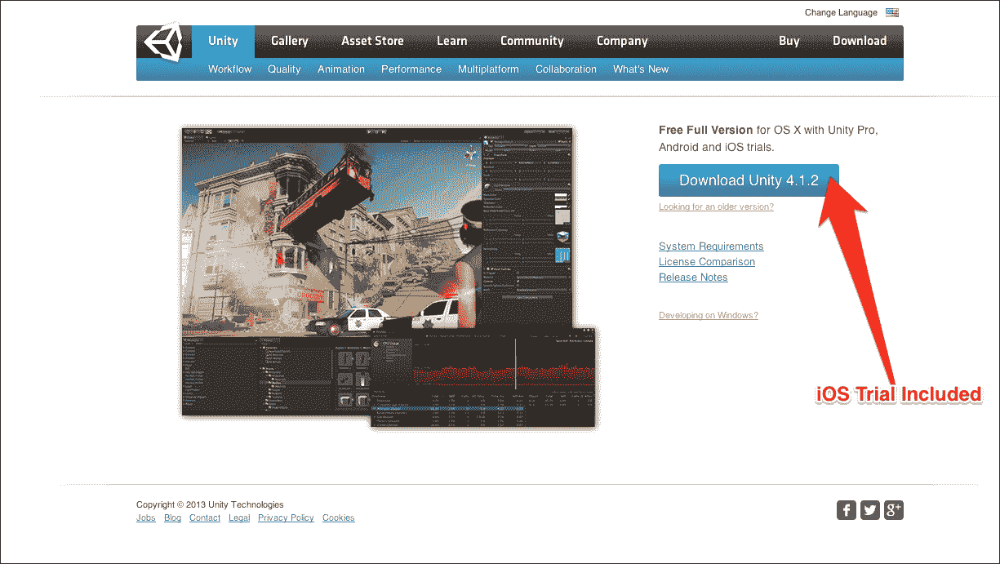

下载 Unity 后，安装过程相当直接。我们可以选择试用版来试用具有更多功能的 Unity Pro。免费版仍允许我们将应用部署到 Android 和 iOS，但 Pro 版本包括着色器和播放视频文件。有关 Pro 版本包含内容的更多信息，请查看 Unity 网站。

# 下载和安装 Vuforia

Vuforia 在简化 SDK 安装过程和简化其工作流程上做了很多努力，以便不会让新开发者感到害怕。我们将介绍在 Mac OS X 上安装 Vuforia SDK 的过程，为部署我们的第一个增强现实应用做准备。

Vuforia 提供了多种不同的 SDK 版本，一开始可能会让人感到困惑；因此，我们将介绍它们：

+   Android 原生 SDK，用于与 Eclipse 和 Ant 一起部署在 Android 设备上，无需使用 Unity

+   用于在 iOS 设备上使用 Xcode 部署，无需使用 Unity 的 iOS 原生 SDK

+   用于在 Android 或 iOS 上部署的 Unity 扩展，用于在 Android 或 iOS 上使用 Unity 的跨平台功能

本书将涵盖 Vuforia Unity 的扩展。要下载它，请访问以下链接：

[`developer.vuforia.com/resources/sdk/unity`](https://developer.vuforia.com/resources/sdk/unity)

在下载 SDK 之前，有一个简单的注册过程。以下截图显示了 Vuforia SDK Unity 扩展：

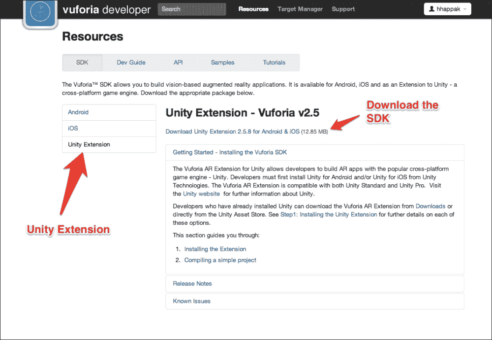

下载文件是一个 Unity 包文件，正如我们很快就会看到的，它非常容易添加到 Unity 项目中。SDK 不需要其他文件。有了这个，我们就有了开始开发 iOS AR 应用所需的一切。Unity，这个将帮助我们渲染 3D 对象和游戏逻辑的游戏引擎，Vuforia 将提供增强现实组件，而 Xcode 将最终在设备上部署应用。

# Vuforia 示例项目

Vuforia 为他们拥有的每个 SDK 版本提供了一个相当丰富多彩的示例项目，供用户了解 SDK 的使用方式。我们将利用这些示例项目作为我们了解一个完成的 Vuforia 项目的结构和如何在 iOS 和 Android 设备上部署它的入门点。

Vuforia 提供了他们的示例项目作为包。这个包包含了许多适用于 Vuforia SDK 的应用程序，但在这本书中我们将专注于图像目标。让我们从以下链接下载示例项目 [`developer.vuforia.com/resources/sample-apps`](https://developer.vuforia.com/resources/sample-apps)。

以下截图显示了 Vuforia 示例应用程序：

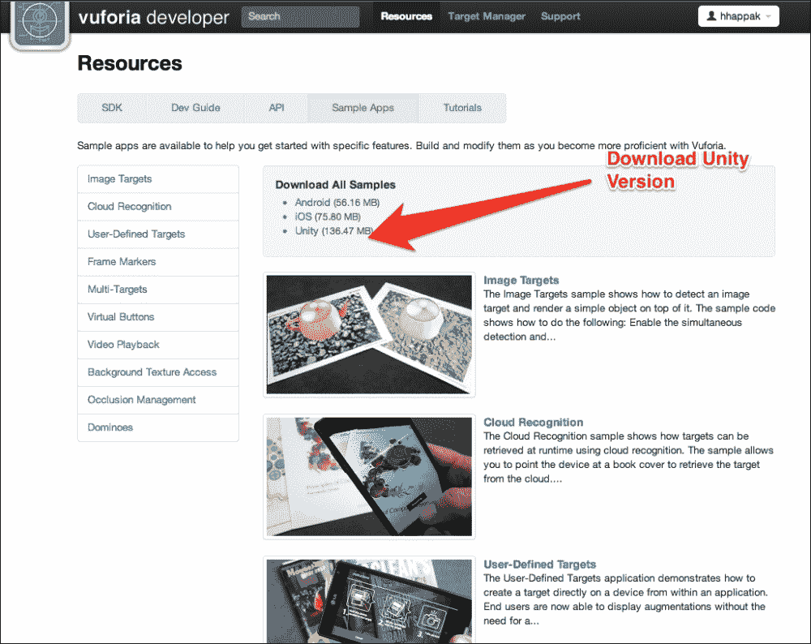

在下载压缩的项目样本后，解压缩文件夹并查看其内容。文件夹将包含许多名为 packages 的文件。这些文件基本上是 Unity 文件，可以轻松导入到 Unity 项目中。

# 开始一个 Unity 项目

现在我们已经下载了所有需要的文件，是时候开始一个 Unity 项目了。启动 Unity，从 **文件** 菜单中选择一个新项目。将项目放置在任何你想要的位置，但确保项目名称中不包含任何空格，以避免以后出现问题。你将看到 Unity 的项目窗口。这可能有点令人畏惧，如果你是第一次使用游戏引擎，可能会感觉有些陌生，但我们在构建项目的过程中会熟悉它。以下截图显示了 Unity 项目窗口。

## Unity 场景

以下截图显示了 Unity 场景：

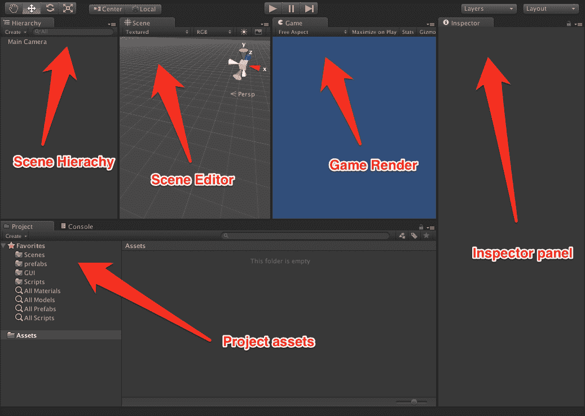

我们将首先熟悉的概念是场景。场景主要是游戏关卡，所有内容都是在这里构建的。它是运行时加载并呈现给用户的内容。它包含所有游戏对象，如菜单和 3D 模型。这是我们为用户创建的世界。我们可以有多个场景，就像游戏有多个关卡一样。

如前截图所示，**层次结构**（**场景层次结构**）表示场景中的对象及其相互之间的关系。例如，一个立方体对象可以是球体对象的父对象；这样，当立方体对象移动时，球体对象将跟随它。这对于构建复杂对象，例如汽车，特别有用，并且汽车部件会随着父对象一起移动，而不是单独移动。这个概念对于 Vuforia 在 Unity 中的工作方式非常重要和基本。

**游戏**（**游戏渲染**）窗口是 Unity 中一个相当有用的工具。它提供了游戏工作方式和外观的预览，无需部署，节省了大量时间。当点击顶部的播放按钮并“运行”游戏时，任何脚本或**场景**（**场景编辑器**）中的更改都会立即显示。这允许我们在不首先在设备上部署的情况下看到增强现实体验是如何进行的。

**项目**（**项目资源**）面板是所有项目资源所在的地方。这是将模型和纹理导入到项目中，甚至导入 Vuforia SDK 的地方。这也是存储所有应用程序脚本的地方。始终保持资源文件夹的有序性和遵循一定的约定至关重要。如果项目资源层次结构没有遵循，项目可能会变得更大，跟踪资源的位置可能会非常困难。

**检查器**（**检查器面板**）是调整组件和资源的地方。它显示项目层次结构中当前选定的场景对象的所有设置或来自**项目**（**项目资源**）面板的资源。检查器是一个多功能的工具，在构建项目时被广泛使用。

现在 Unity 的 GUI 已经不再神秘，我们可以查看从 Vuforia 下载的示例项目文件夹。它将包含代表项目的多个包文件。包文件对于 Unity 来说非常重要。在游戏开发中，从一个项目传输资源到另一个项目的情况并不少见。通常，项目之间会共享公共资源，因此 Unity 需要一种高效的方法来在项目之间传输资源。这就是为什么 Unity 包文件应运而生。

在 Unity 中，可以选择从资源商店中选取某些文件，甚至整个场景，将其导出为包文件。有时整个项目也可以导出为包文件。稍后，该文件可以被导入到 Unity 项目中并立即使用。

Vuforia 示例项目以 Unity 包的形式存在，必须导入到 Unity 项目中才能部署这些项目。值得一提的是，Vuforia 的 SDK 也以 Unity 包的形式提供，可以导入到任何项目中并利用其 AR 组件。

## Unity 中导入包

现在我们将示例项目导入到我们创建的 Unity 项目中。以下截图显示了 Unity 导入`ImageTarget`示例项目：

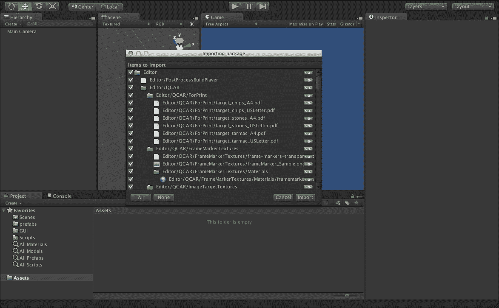

导入包是一个相当简单的过程。前往顶部的**资产**菜单，选择导入包，然后选择自定义包。导航到 Vuforia 的示例项目所在位置，选择图像目标文件。将显示一个类似于之前截图的窗口。

这个窗口非常重要，因为它显示了正在导入到项目中的信息。我们可以选择我们想要导入的文件和不想导入的文件。它还会显示文件是否是新的，即尚未在项目中，或者旧的，意味着它已经在我们的**资产**文件夹中并且正在更新。目前我们需要包文件中的所有文件，所以请继续点击**导入**。以下截图显示了导入`ImageTarget`后的 Unity 项目：

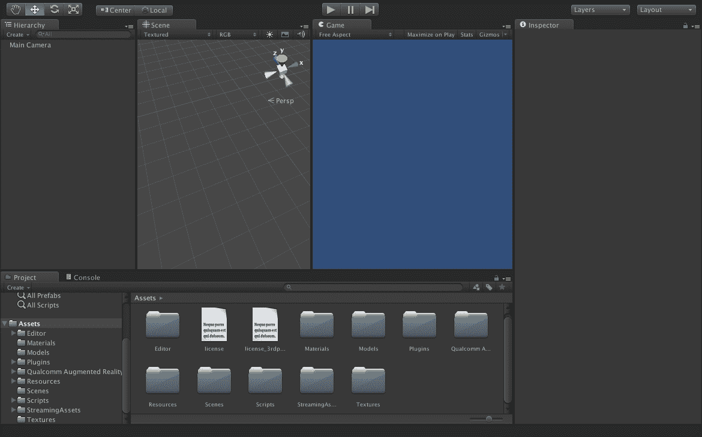

我们可以看到，许多文件已经导入到我们的**资产**文件夹中，包括一个**高通增强现实**文件夹，这是 Vuforia SDK。这是我们需要的所有可部署项目的文件，但场景层次结构仍然只包含一个**主相机**对象，而**游戏**面板仍然相当蓝色。这是因为我们已经加载了资产，但还没有加载场景文件。

### Unity 场景文件

场景文件基本上是 Unity 存储场景层次结构和组合的方式。场景文件包含了编辑器中创建的世界及其所有细节。这在加载不同时间点的不同场景文件以及在同一应用程序中创建多个相关或不相关的世界时非常有用。这就是 Unity 处理多个游戏关卡和区域的方式。

现在要选择高通为我们创建的项目场景文件，我们可以转到项目文件中的**场景**文件夹，并双击名为**Vuforia-4-ImageTargets**的文件。以下截图显示了**Vuforia-4-ImageTargets**场景处于活动状态：

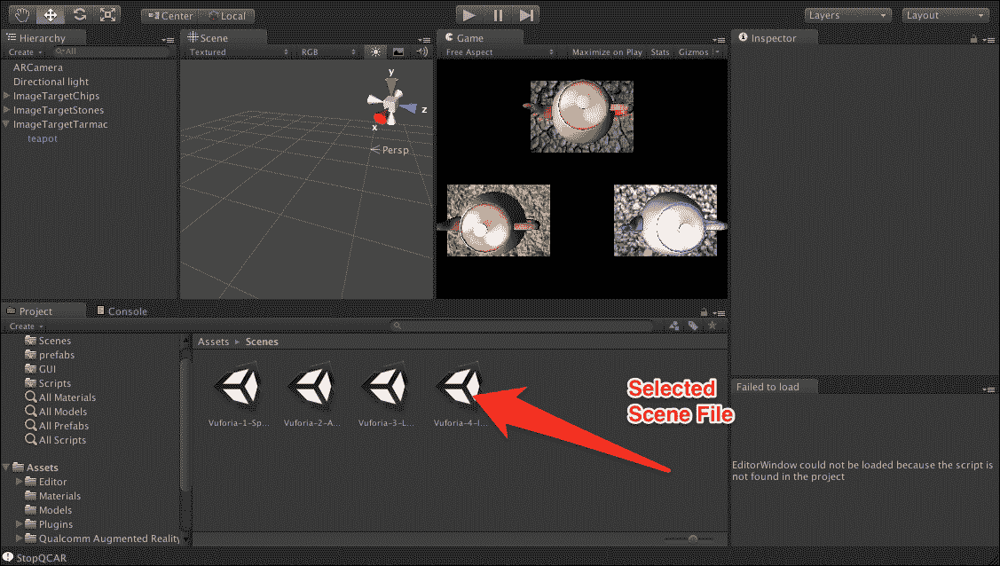

现在 Unity 项目视图看起来更加生动。在**游戏**面板中已经可以看到渲染好的 3D 茶壶，而**层次**面板显示了场景的组件。很可能会发现**场景**编辑器仍然看起来像前面的图示那样空空如也；我们现在将看到如何导航到**场景**编辑器视图来在世界中移动。

我们需要做的第一件事是关注场景中我们拥有的一个对象，将其作为原点。我们可以通过从**层次**面板中选择第一个图像目标对象来实现，即**ImageTargetChips**，然后将鼠标指针放在场景面板上并按下键盘上的*F*键。这将放大对象，使其成为编辑器视图的原点。重要的是要将鼠标指针放在**场景**面板上，否则缩放不会在对象上发生。以下截图显示了选中的对象：

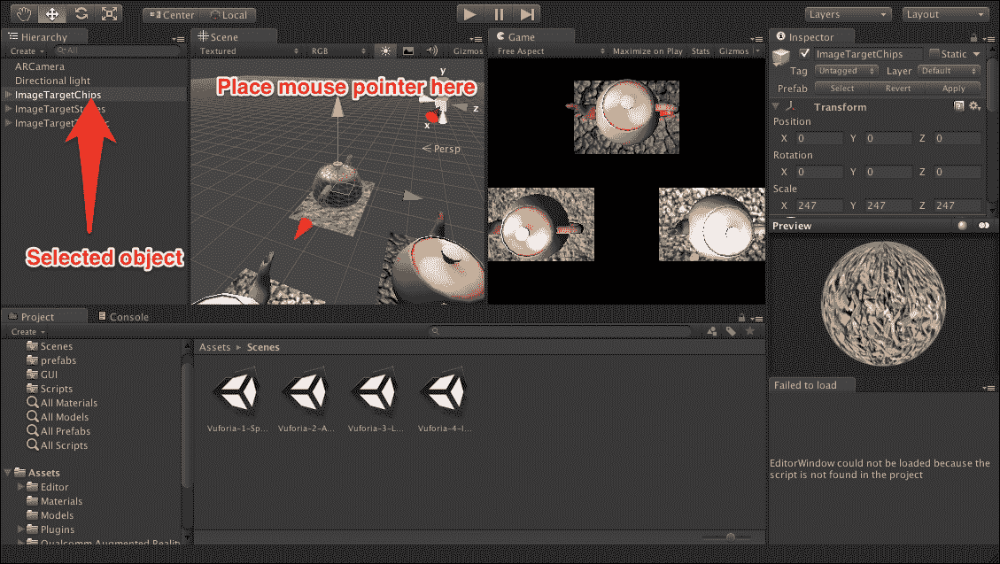

现在对象已经聚焦，我们可以让编辑器相机围绕它旋转以在游戏中查看场景。我们可以通过按住*Alt*键并在场景上拖动来定位编辑器相机到任何我们想要的位置。我们还可以使用鼠标滚轮来放大和缩小聚焦的对象。

如我们所见，场景由三个不同的茶壶组成，它们位于一个带有图像的平面上。这是样本项目中的 AR 场景，它将根据`ARCamera`检测到的图像目标显示其中一个茶壶。对象的缩放和变换将与**场景**编辑器中相对于茶壶所在图像目标当前可见的变换相匹配。这使得在构建过程中可视化 AR 体验的播放方式变得非常容易。

### 可追踪文件

在项目文件夹中，我们将找到本项目中使用的可追踪图像。我们需要将它们打印出来以测试 AR 体验。要访问它们，导航到**资产** | **编辑器** | **QCAR** | **ImageTargetEditor**。在里面将有两个文件夹，包含场景中使用的三个图像。要打开它们，在图像上右键单击并选择**在 Finder 中显示**以在 Mac OS X Finder 中打开文件。以下截图显示了项目中的目标图像位置：

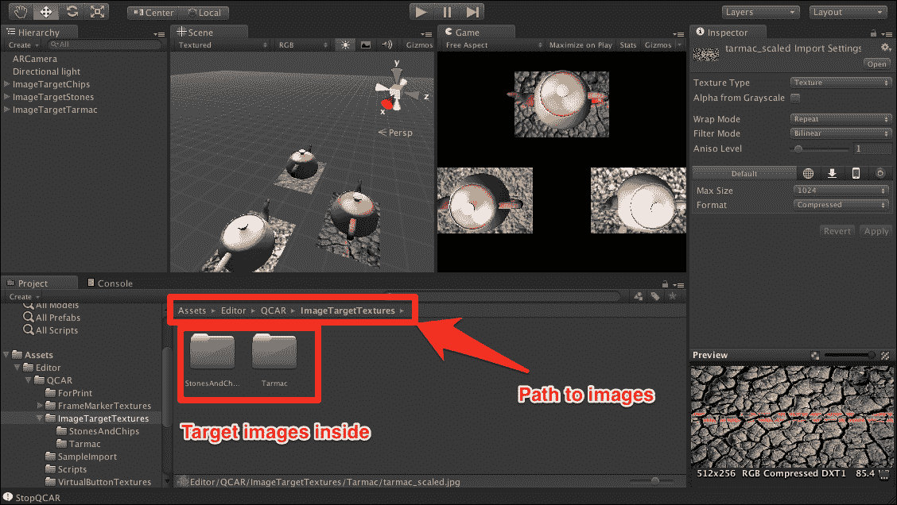

在打印图像时，确保它们填满整个页面，以获得最佳的 AR 体验效果。

Vuforia 有一个方便的功能，允许我们在不首先部署的情况下查看 AR 体验。这是通过在使用的 PC 上放置一个摄像头，Unity 利用摄像头的信息在游戏面板中显示体验的播放方式来实现的。这对于在不浪费部署周期的时间的情况下调试 AR 项目来说是必不可少的。

要利用此功能，只需单击 Unity 项目窗口顶部的**播放按钮**。以下截图显示了实时摄像头流的 AR：

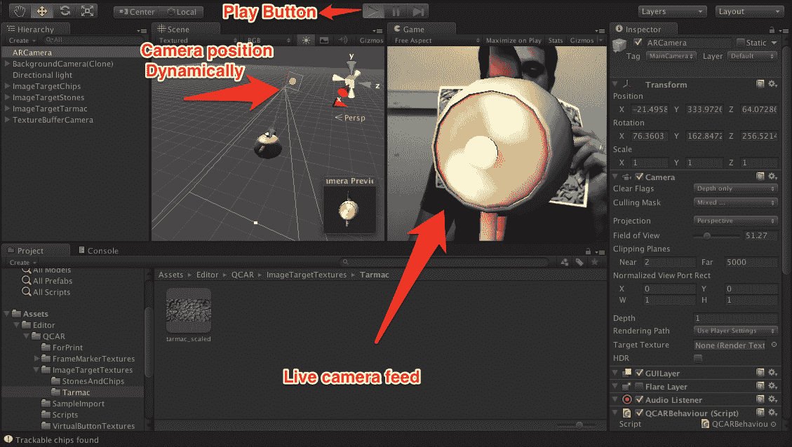

通过将目标图像放在相机前，Vuforia 将识别可追踪的图像，然后根据目标图像定位`ARCamera`对象并渲染 3D 内容。如果我们从**层次**面板中点击**ARCamera**组件，我们可以看到 ARCamera 随着目标图像在摄像头前移动而动态移动并相对于目标移动。

**ARCamera**实际上是通过用户可以查看我们在 Unity 内部创建的世界的窗口。通过将摄像头相对于目标图像移动，我们可以有效地模拟茶壶是真实世界的一部分。

尝试不同的目标，看看它们如何通过显示不同的茶壶以不同的方式响应。

当我们打开**场景**文件夹时，我们发现有很多场景。我们只选择了**主场景**，但现在我们需要了解其他场景的用途。

再次从**资产**文件夹中打开**场景**文件夹。这四个场景的命名如下

+   `Vuforia-1-SplashScreen`

+   `Vuforia-2-AboutScreen`

+   `Vuforia-3-LoadingScene`

+   `Vuforia-4-ImageTargets`

应用很少只有一个场景；通常它们是一系列场景的集合。对于这个示例项目，应用使用了四个场景。首先出现在用户面前的场景是`SplashScreen`场景。启动屏幕只会做它名字所暗示的事情；它将为用户显示启动屏幕两秒钟，然后它会自动加载下一个场景，即`AboutScreen`。

`AboutScreen`场景将显示关于应用的屏幕。它将有一个按钮来关闭关于屏幕并加载下一个场景，即`LoadingScene`。

加载场景执行一个简单的任务，即在后台加载主场景`ImageTarget`，并显示一个动画旋转器以指示正在加载。在加载大型场景时，这总是一个好主意。如果没有它，应用在加载下一个场景时似乎会冻结几秒钟；这可能会让用户认为应用崩溃或无响应。

如我们所见，四个场景的顺序构成了整个应用体验。您可以随意打开任何场景文件并点击播放按钮，以查看它们如何单独运行。但如果我们这样做，我们会注意到场景在动作完成后不会加载其后的任何场景；这是因为我们没有告诉 Unity 在应用启动时加载哪些场景文件。目前如果我们部署，设备上只会显示一个蓝色屏幕，因为没有加载任何场景。

# 构建设置

要标记应用中要加载的场景，我们需要访问构建设置窗口。为此，导航到**文件** | **构建设置**。以下截图显示了**构建设置**窗口：

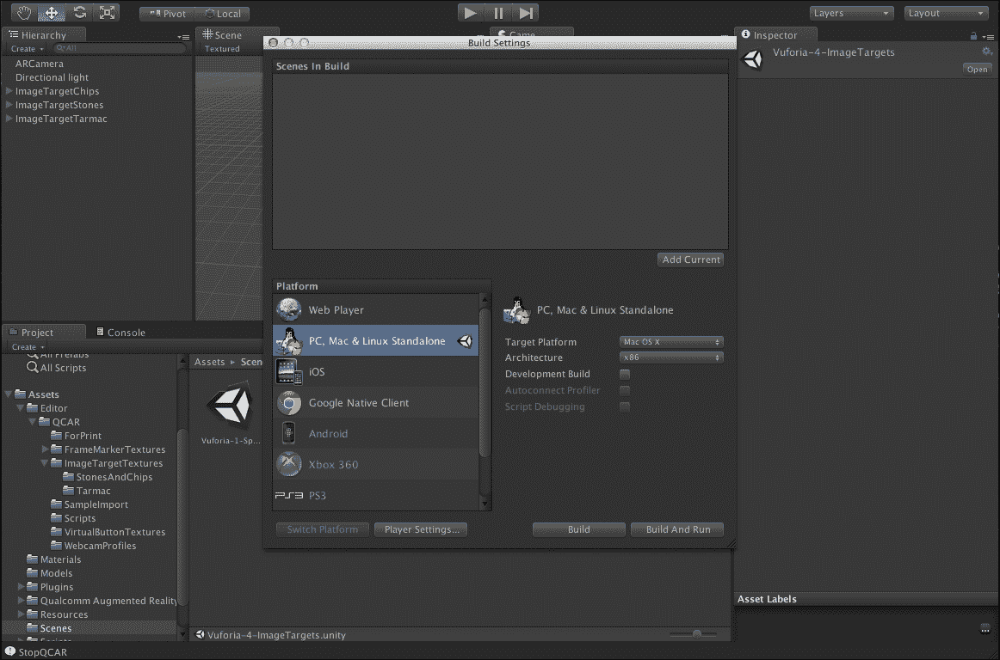

**构建设置**窗口在 Unity 中非常重要。从那里，我们可以控制我们正在部署的平台，要包含在部署中的场景，平台特定的设置，甚至可以直接从那里在平台上部署。

窗口顶部的框是标记场景以包含在应用中的地方。应用将使用的任何场景都必须在**构建设置**窗口中添加，以便在平台上工作。我们现在将添加我们的场景，但首先确保框中没有场景。如果没有指定场景，场景有时会自动添加。Unity 这样做是为了避免部署没有场景的构建。要删除任何场景，点击它并在键盘上按退格键。

非常重要的是要知道，窗口中的第一个场景将是应用首先打开的场景。这一点非常重要，否则应用流程将会出错。在我们的例子中，`SplashScreen`场景是第一个。它加载关于屏幕之后。这意味着我们需要首先添加`SplashScreen`场景，以便应用打开；之后场景的顺序并不重要，因为加载是通过项目中场景的名称来完成的。

要添加场景，只需将场景文件从场景文件夹拖动到窗口中。确保在添加任何其他场景之前先添加`SplashScreen`场景。添加所有四个场景。以下截图显示了**构建设置**：

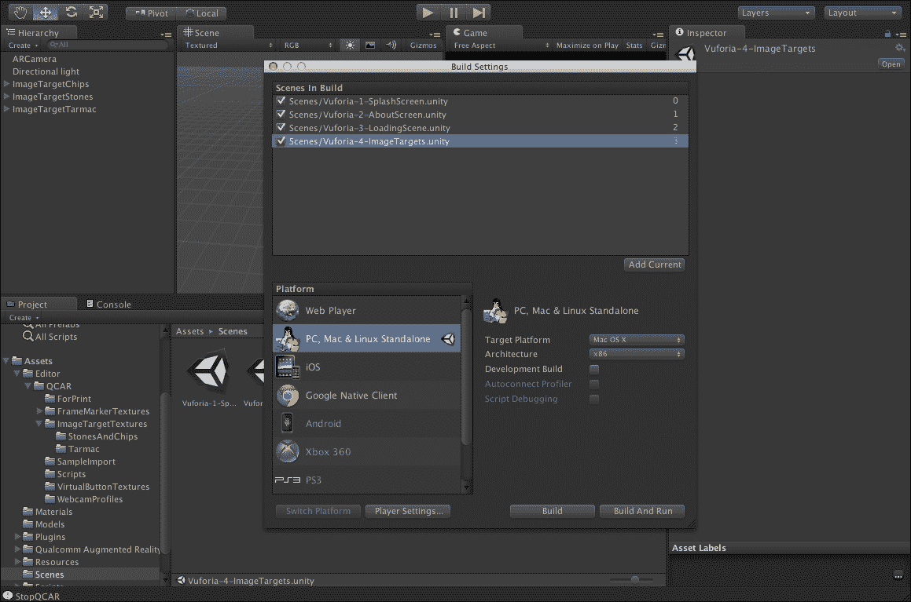

注意构建中场景旁边的数字；它们是场景的数值表示，可以用作加载场景而不是它们的名称。数字**0**代表应用将自动加载的第一个场景。

## 为 Android 部署

我们将在本节中为 Android 进行部署；如果出于任何原因您选择不在该平台上部署，您可以跳转到处理 iOS 的下一节。

现在我们已经将所有场景添加到构建中的场景中，我们继续进行其他设置，为部署做准备。在**构建中的场景**窗口下，有一个名为**平台**的有趣框，里面收集了多种知名平台。这些是 Unity 可以部署项目的平台。如果我们没有从 Unity 部署到它们的许可证，其中一些将变为灰色。默认情况下，PC、Mac 和 Linux 独立平台被选中。这显然不是我们的目标平台，所以我们继续更改它。

选择**Android**平台，然后点击左下角的**切换平台**按钮。这将启动自动将所有资产转换为适合我们刚刚选择的平台的进程。

一旦 Unity 完成处理资产，点击**玩家设置...**按钮。在**检查器**面板中，我们将找到类似于以下截图的内容：

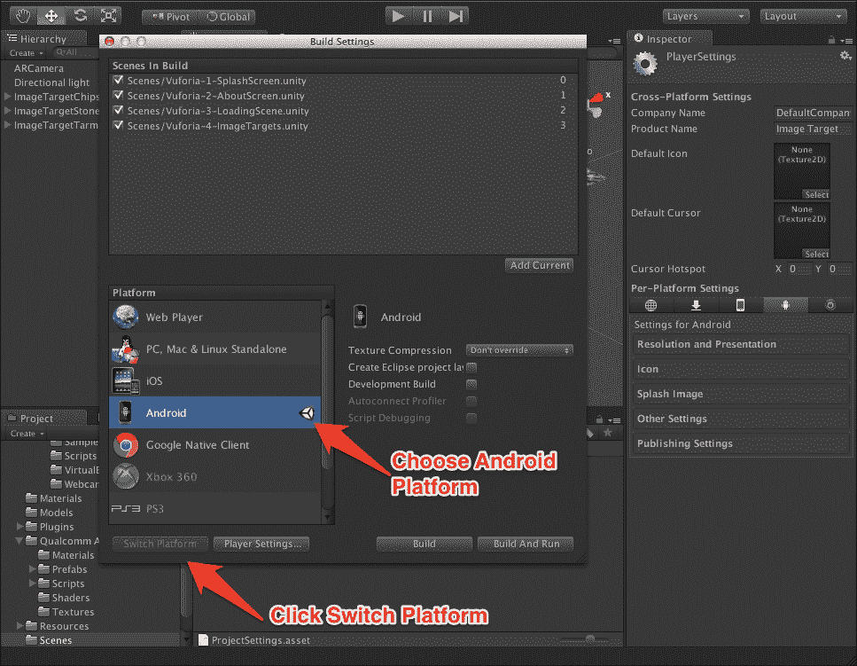

**玩家设置**揭示了特定于目标平台的设置，例如应用名称、启动画面、图标等。为每个我们部署的平台正确自定义设置非常重要，以实现更好的结果。

将**产品名称**字段中的应用名称更改为`Image Target`。我们现在不会自定义图标和启动画面图像，尽管知道您可以从这里进行自定义。

在面板中特别隐藏的最重要设置之一是应用的**标识**字段。我们知道这对于应用在市场上保持其身份很重要，并且记住正确设置它很重要。要到达该设置，请点击以下图示中的**其他设置**：

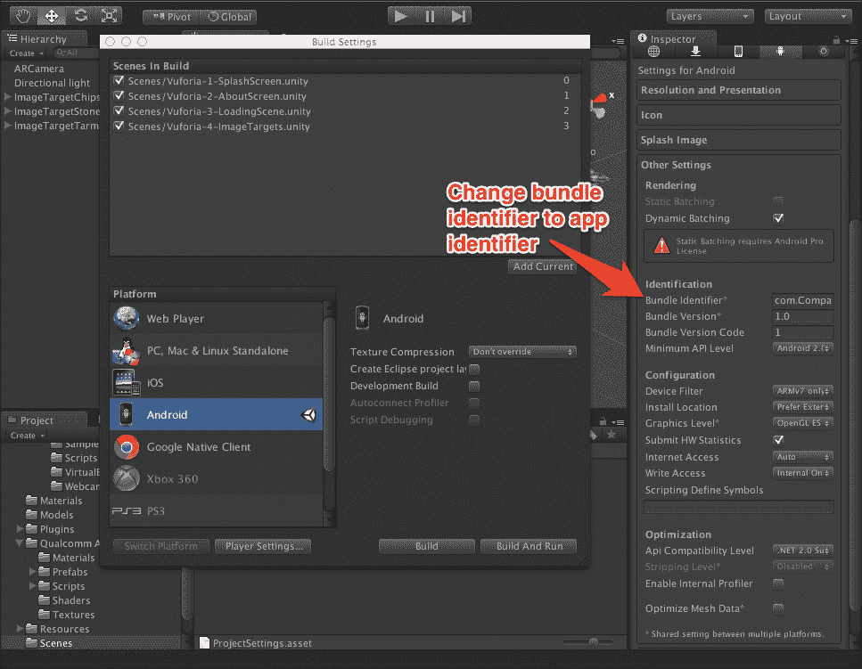

将**包标识符**更改为适合应用的名称。请注意，其他设置都处理与平台相关的非常低级别的设置，例如 API 级别和要使用的 OpenGL。我们可以暂时将其保留为默认设置，它将在大多数设备上工作，但了解将来如何到达这些设置是有益的。

如我们所知，Android 应用使用密钥库进行部署。Unity 使创建密钥库的过程变得稍微简单一些。要访问密钥库设置，请点击如下截图所示的 **发布设置**：

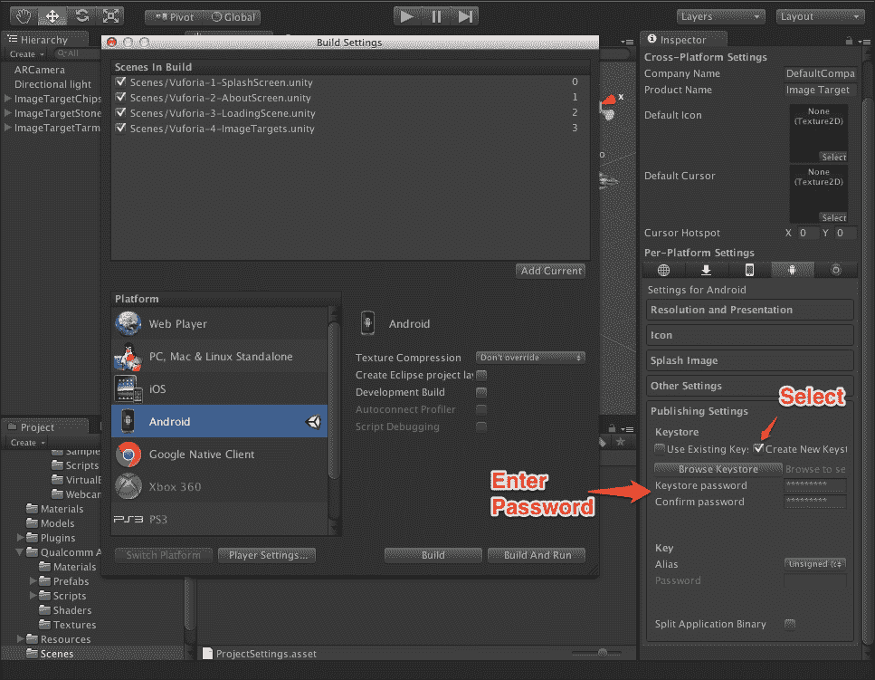

现在选择 **创建新密钥库**，然后在两个字段中输入任何密码，如前述截图所示。这将告诉 Unity 为我们创建一个新的密钥库并在部署时使用它。需要注意的是，Unity 不会为我们存储密码；如果我们重启 Unity，我们必须在此处重新输入密码，否则构建将失败。

现在一切准备就绪，我们只需点击 **构建和运行** 来部署应用。它将询问我们保存 APK 的位置；任何地方都可以。应用将通过 USB 连接到机器的 Android 设备进行部署，因此我们需要确保它已正确连接。

如果 Unity 无法识别连接的 Android 设备，请确保已正确安装特定设备的 USB 驱动程序。它们可以在制造商的网站上找到。

## 部署到 iOS

选择 iOS 平台，然后点击左下角的 **切换平台** 按钮。你会注意到 Unity 正在重新构建和重新导入某些资源。这个过程是为了匹配目标平台的压缩方案和设置。这是一个 Unity 自动处理得很好的自动过程。

当 Unity 完成所有资源的再次导入后，就是时候继续调整我们的设置，以便在设备上构建项目了。在底部，有一个名为 **Player Settings...** 的按钮。点击此按钮，你会看到如下截图所示的内容：

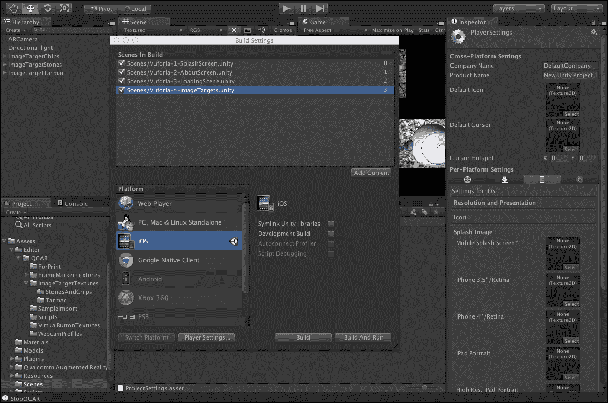

与 Android 一样，**PlayerSettings** 是所有预期平台特定设置的集中地。现在我们已经切换到 iOS 平台，它将包括任何特定于 iOS 的设置。

首先，让我们更改应用名称。在 **产品名称** 中，将其更改为 `Image Target`。我们现在将保留默认图标和启动画面。现在我们调整 **分辨率和展示** 设置。点击 **分辨率和展示** 栏以展开设置区域。

在 **默认方向** 部分，从下拉框中选择 **自动旋转** 选项。它将在其下方展开一个复选框列表。取消选中第一个复选框，即 **使用动画自动旋转**。以下截图显示了 **分辨率和展示** 部分：

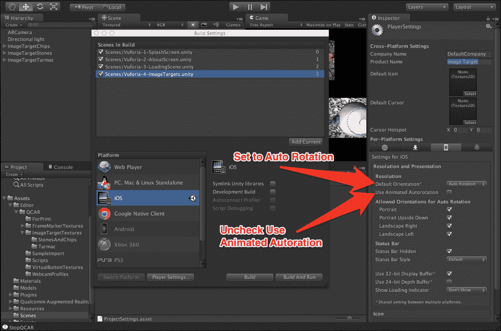

**分辨率和展示** 设置处理应用向用户展示的方式。它包括诸如支持设备方向和状态栏可见性等选项。我们刚刚为应用启用了自动旋转选项。我们还禁用了 **使用动画自动旋转**，因为这对于 AR 体验来说从来都不好看。这通常会让用户感到方向感混乱。

现在我们需要做的是设置应用的捆绑标识符。苹果开发者配置文件是按应用标识符发放的，其结构如下：

`com.公司.产品名称`

根据你的 Xcode 管理的配置文件公司名称，你需要在 Unity 设置中输入你的名称，以便通过 Xcode 进行部署。

要访问捆绑标识符设置，点击 **检查器** 区域底部最下面的另一个栏，并将 **捆绑标识符** 改为 Xcode 可以接受的正确名称。以下截图显示了 **捆绑标识符** 设置：

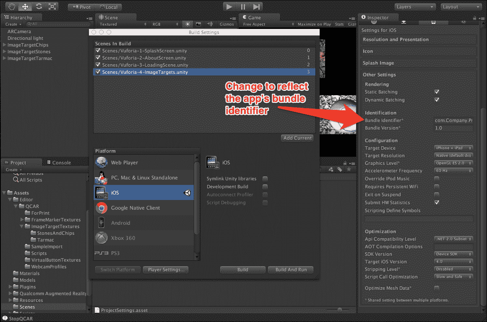

现在我们已经完成了所有必要的设置，是时候将应用部署到设备上了。由于 Unity 强大的跨平台能力，部署过程非常简单。这个过程主要是自动的，几乎不需要开发者的干预。

首先，将设备连接到电脑。现在我们点击 **构建和运行** 按钮，在 **构建设置** 窗口的右下角。它会询问你希望将构建文件夹放在哪里；将其放在 **Unity** 项目文件夹内即可，但不要放在 **Assets** 文件夹内。给它起任何你喜欢的名字；不过，按照 **Unity** 项目文件夹的名字命名是个好习惯。

Unity 将自动开始为 iOS 构建项目的进程。它也会自动打开 Xcode。请尽量在进程结束前不要干扰这个过程。从 Unity 打开 Xcode 的过程是通过一个脚本完成的，该脚本切换焦点窗口并在 Xcode 上执行某些步骤。因此，最好让 Unity 控制你的电脑直到完成，不要切换到任何其他窗口。

在 Xcode 将应用复制到设备后，我们应该在我们的设备上找到一个完美工作的 AR 应用。应用将按预期工作，并展示 Unity 和 Vuforia 组合的强大功能。

以下截图显示了 Image Target 应用的 **关于** 屏幕：

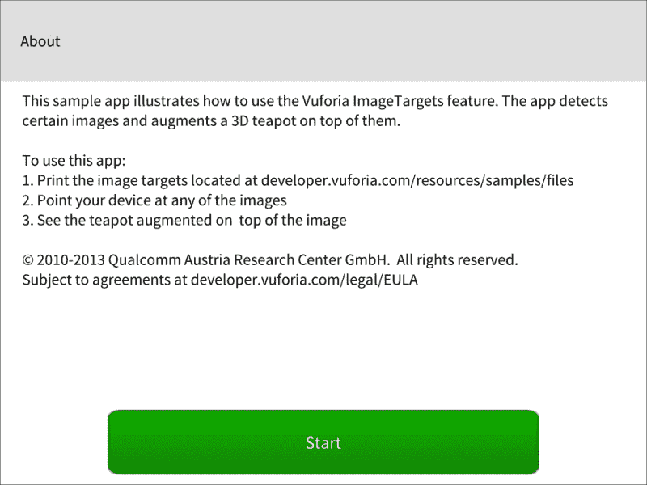

注意，当 Unity 部署到 Xcode 时，它会自动在打开的窗口之间切换并执行 Xcode 上的多个脚本。这就是为什么我们需要让 Unity 执行其常规操作，并让它控制桌面直到开始构建。如果我们强制阻止它自动切换到 Xcode，它将中断自动构建。注意，之后可以手动恢复。

# 摘要

在本章中，我们介绍了设置我们环境的过程。我们安装了 Unity 和 Vuforia。我们了解了 Unity 的 GUI 并开始了一个新项目。我们导入了 Vuforia 的示例应用，并看到了如何将其部署到我们的设备上。在这个过程中，我们介绍了与应用部署相关的许多 Unity 设置，以及一些 Vuforia 的基本功能。

通过这种方式，我们熟悉了部署的过程以及最终产品的样子。我们已经搭建了环境，能够使用 Vuforia 和 Unity 来构建 AR 应用，并看到了在目标设备上部署是多么简单。我们了解了 Unity 环境的简单设置，并为深入了解如何构建自己的场景和自己的 AR 体验奠定了基础。

在下一章中，我们将开始更熟悉 Vuforia，以及如何从头开始启动一个项目。
