# 第五章. 高级增强现实

在提供增强现实体验方面有很多可能性。在本章中，我们将讨论使用 Vuforia 与 Unity 结合时可用的大量高级功能。我们将通过开发一个小型街机增强现实游戏来实现这一点。这个游戏是一个经典的街机游戏，通过增强现实的变化使其感觉新鲜。我们将制作一个增强现实打地鼠游戏。

# 增强现实游戏

许多开发者误解了增强现实游戏的价值。许多人认为 AR 游戏由于大多数，如果不是所有 AR 游戏都无法病毒式传播且往往不畅销，因此无利可图且被边缘化。这可能是因为 AR 游戏往往需要动作、可追踪的物体，或者两者都需要，就像我们现在要制作的游戏一样。这些要求使得游戏不能在任何时候由用户玩，但很多人往往忽视的是，AR 游戏不病毒式传播是可以接受的。

AR 游戏，虽然不会产生下一个愤怒的小鸟，但可以为特定目的提供独特的体验。例如，AR 游戏可以非常有效地用于促销游戏。游戏可以在促销传单或杂志页面触发，然后产生一个竞争游戏，有机会赢得真实奖品，例如。这确保了用户以新鲜 AR 游戏的形式获得积极体验，同时，我们确信用户已经观看了促销并参与了比赛。AR 游戏也可以用于展览或商店的多种用途：促销或纯粹娱乐。

# Unity 作为游戏引擎

当然，Unity 使得制作 AR 应用更加容易，并且可以部署到多个平台，但这并不是它的真正力量所在。Unity 首先是一个非常强大的现代游戏引擎。它被用来驱动一些行业知名的游戏，无论是在移动设备还是 PC 上。不利用这种力量来提供非常新鲜的 AR 体验是不可原谅的，因为理解引擎的工作方式相当容易。

在本章中，我们将介绍 Unity 中的一些元素，这些元素允许制作简单的游戏。我们将介绍如何向游戏添加音效，如何动画化对象，如何设置世界的物理，如何控制粒子效果，以及如何考虑用户交互。希望这足以展示在 Unity 中构建 AR 游戏的有效性。

## 设置环境

现在，我们可以开始创建我们正在制作的 Whack-A-Mole 游戏的新 Unity 项目。就像我们在书中之前做的那样，我们为 AR 应用设置了 Unity 的环境。以下步骤再次说明：

1.  将 **Platform** 的值从 **File** 菜单下的 **Build Settings** 修改为 **IOS**。

1.  通过导航到 **Import Package** | **Assets** 导入 Vuforia Unity 包。

1.  导入之前在第三章中使用的`exampleDataset.unitypackage`文件，该文件包含可追踪数据的集，它们也包含在本章的资产中。

1.  从**Qualcomm 增强现实**预制件文件夹中添加**ARCamera**和**ImageTarget**预制件。

1.  将**ImageTarget**设置为使用我们导入的数据集，并在**检查器**中将其设置为使用**Chips**目标。

1.  将**ARCamera**设置为加载我们的数据集并激活它。

1.  将场景保存到**资产**文件夹中，并命名为`Level`。

以下截图显示了为我们的 Whack-A-Mole 游戏创建的项目：

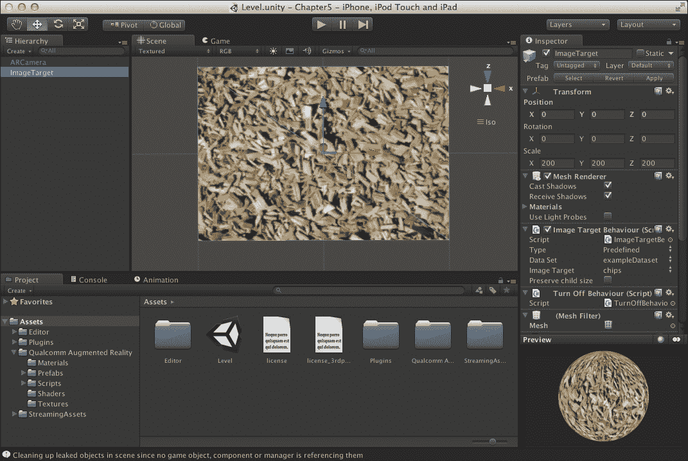

我们应该对环境有类似的设置，如前述截图所示。现在它已经准备好，我们可以开始添加构成我们游戏的各种元素了。

# Whack-A-Mole 游戏

在本节中，我们将讨论我们正在制作的游戏的架构。这是一个带有转折点的简单 Whack-A-Mole 游戏。在我们的目标上方，我们想要渲染一个充满地鼠洞的地面，地鼠会从这些洞中随机上下跳跃。用户将能够从设备向目标射击球，如果球击中地鼠，我们将通过音效使地鼠消失并产生粒子效果。

将不会有得分系统或清除关卡的方法。我们只是将这个游戏作为一个简单方式制作 AR 游戏的演示。本游戏中使用的所有资产都可在本章代码包的`Assets`文件夹中找到。

## 创建地鼠的地面

我们首先需要做的是创建一个基础层，这样地鼠就会从这个层中冒出来。我们需要创建一个平面，这个平面将直接覆盖在可追踪层上，并且附有一个地面纹理。

1.  让我们从**GameObject**菜单创建一个平面。选择**创建其他**并点击**Plane**。这将创建一个场景中的平面。确保我们创建的平面与可追踪层具有相同的位置；两者都应位于全局原点，即(0, 0, 0)。

1.  现在，通过点击左上角的工具栏上的**调整大小**按钮，像之前一样调整平面的尺寸。调整平面的宽度，使其正好覆盖可追踪层。平面的高度很可能比可追踪层大，但这没关系，只要可追踪层在场景中完全被覆盖即可。以下截图显示了 Z-缓冲区扭曲：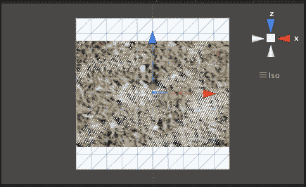

我们可能已经注意到，在可追踪对象和我们刚刚添加的平面之间发生的扭曲。这是因为可追踪对象和平面在 y 轴上的位置完全相同。引擎不知道应该渲染在另一个之上，因此发生了所谓的 **Z-Buffer 冲突**，其中引擎不断在要渲染的组件之间交替。解决方案是简单地调整平面的 y 轴位置，使其略微高于可追踪对象的位置。

1.  将平面命名为 `Ground`，并通过从 **Hierarchy** 列表拖动并放置到 **ImageTarget** 上来将其附加到可追踪对象上。

1.  现在地面平面已经就位，我们首先会想要去除平面上默认的纯白色纹理。我们希望它看起来像真正的地面，因此我们将为其创建一个材质。Unity 的材质是组件，它们携带有关对象纹理和用于渲染它的着色器的信息。它非常重要，并且几乎在场景中的每个对象上都得到了广泛的应用。

1.  首先，在 Unity 项目的 **Assets** 文件夹中创建两个文件夹。将其中一个命名为 `Textures`；这是我们将会保存材质纹理图像的地方，另一个命名为 `Materials`；这是我们将会创建材质的地方。

1.  现在，将名为 **Ground.jpg** 的文件拖动并放置到我们刚刚创建的 **Textures** 文件夹中。我们也可以通过 **Assets** 菜单添加资产，就像之前看到的那样。这只是在项目中添加了地面的纹理图像。

1.  现在，让我们创建材质；在刚刚创建的 **Materials** 文件夹中，从 **Assets** 菜单选择 **Material**。这会创建一个新的材质，我们将命名为 `Ground`。现在将我们创建的 **Ground** 材质附加到地面平面上。通过简单地拖动材质并将其放置在 **Hierarchy** 面板中的 **Ground** 平面上来完成此操作。

注意到平面保持白色，就像之前一样；这是因为我们还没有将纹理附加到材质上。为此，通过选择 **Ground** 平面并从 **Inspector** 中访问我们刚刚添加到 **Ground** 平面的材质；在这里我们将找到分配的 **Material**。在 **Material** 下有一个小的 **Texture** 属性，将我们之前添加的纹理拖动并放置到这个框中。以下截图显示了附加的 **Ground** 材质：

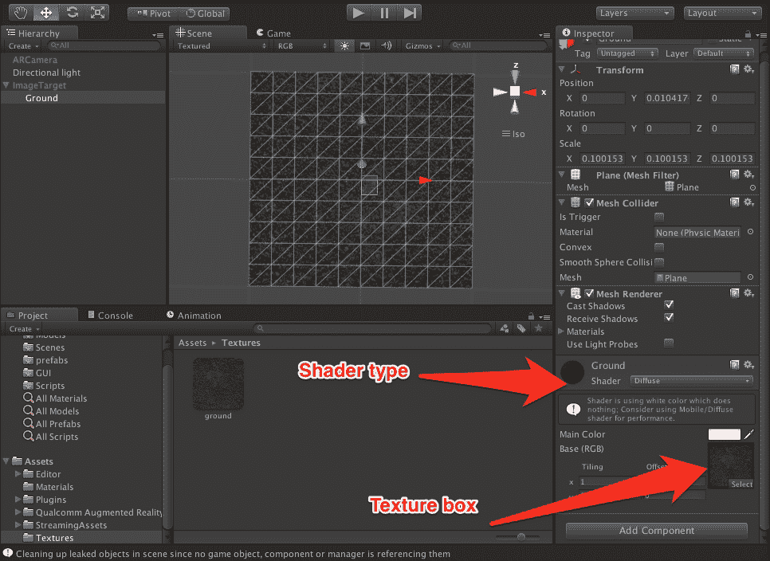

现在我们为我们的老鼠有了看起来不错的地面。请注意，该材质的着色器是 **Diffuse**。这种着色器适用于不透明材质，并且对于地面纹理来说效果非常好。稍后，我们可以为不同的材质使用不同的着色器以实现不同的效果，例如透明度或粒子着色器。

# Whack-A-Mole 模型

现在我们有了可以建造的地面，是时候将我们的鼹鼠模型添加到项目中了。只需在**Assets**文件夹中创建一个文件夹，并将其命名为`Models`。将章节资源中名为`WhackAMoleModel.fbx`的文件拖放到文件夹中。Unity 将自动将模型导入到项目中，并为我们创建一个预制体。

1.  就像我们之前做的那样，将为`WhackAMoleModel`创建的预制体拖放到我们的场景中。你可能不会自动看到模型被添加的位置；这主要是因为与地面平面相比，模型太小了。如果你通过按住*F*键来聚焦于模型，你会看到模型有多小。

    ### 小贴士

    要改变这一点，我们可以使用之前的方法缩放模型，即从编辑器中进行缩放，或者我们可以更改 FBX 转换器的设置。FBX 转换器设置处理模型如何通过许多针对模型特定的设置插入到我们的场景中。如果我们要在编辑器中缩放模型，它将自然地没有模型与世界的 1:1 比例。这是实时进行的，占用资源，并使脚本编写更加复杂和令人沮丧。建议从模型设置中缩放对象。

1.  在文件夹中单击模型的预制体，**Inspector**将显示**FBX Converter**设置。有一个**缩放因子**设置，默认设置为非常小的值，即**0.01**。这是模型相对于从 3D 建模应用程序中原始缩放的插入到场景中的大小。将此设置更改为**0.7**，然后单击**应用**。模型将在场景中自动调整大小，而不会改变场景本身的缩放变换。以下截图显示了缩放并定位在中间的`WhackAMoleModel`：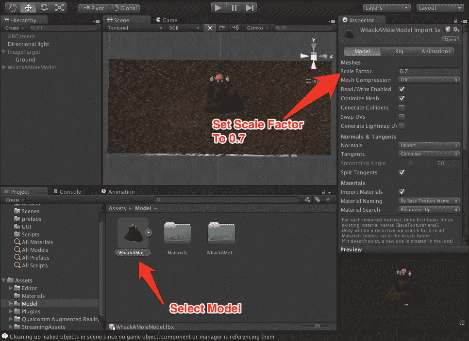

1.  将模型精确放置在地面的中心，并确保正确位于地面之上。之后，将**WhackAMoleModel**对象附加到**Hierarchy**中的**ImageTarget**，将其设置为父对象。

## 向场景添加碰撞器

Unity 为游戏中的对象模拟物理，但仅当我们指定要模拟的内容和方式时。这样做的原因是，在大多数游戏中，并非每个对象都由物理模拟。例如，并非每个游戏中的墙壁都是可破坏的。有一些静态对象只是在那里简单地违反物理定律，但对于游戏来说，这是完全可以接受的。

**Collider**是一个组件，我们可以将其附加到场景中的任何对象上，使该对象能够与其他可碰撞对象“碰撞”。例如，如果我们正在制作像*使命召唤*这样的射击游戏，如果我们没有将碰撞器附加到游戏中的所有墙上，游戏角色将能够简单地“穿过”墙壁。这当然是不希望的。

对于我们的游戏，我们需要能够“敲打”鼹鼠；如果鼹鼠上没有碰撞器，我们当然无法敲打它。此外，我们将要向鼹鼠射击的球体需要能够与地面碰撞，而不仅仅是穿过它。所有这些都可以通过碰撞器实现。

1.  首先，从场景中选择**WhackAMoleModel**，并将其展开以显示**MoleHill**和角色。这些是我们需要添加碰撞器的两个组件。首先，从场景中选择角色，然后通过导航到**Component** | **Physics**选择**Box Collider**。这将添加一个围绕角色的盒子形状的碰撞器。盒子不会完全包裹角色，但它对资源的消耗很小，在我们的情况下足以模拟与我们将要向鼹鼠发射的球体良好的碰撞。

1.  接下来，选择**MoleHill**；**MoleHill**的形状不规则，我们需要球体与它的碰撞效果比盒子碰撞器能做得更有效。这就是为什么我们需要使用网格碰撞器。从相同的先前菜单，现在选择将**Mesh Collider**添加到**MoleHill**模型中。**Mesh Collider**的作用是添加一个与顶部模型形状完全相同的碰撞器，因此它模拟的碰撞与模型完全相同。

以下截图显示了添加到**Mole**模型中的碰撞器：

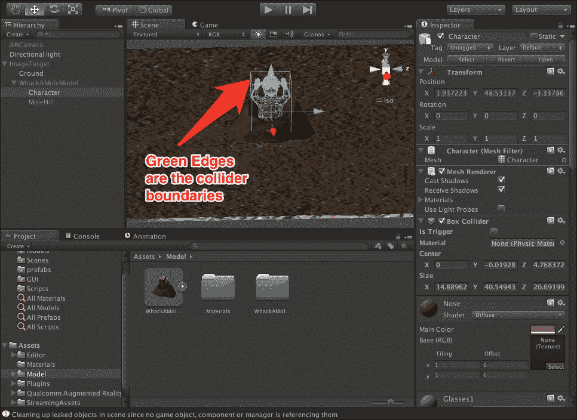

注意，地面已经添加了碰撞器。这是因为，默认情况下，在编辑器中创建的任何原始对象都附有一个碰撞器。

# 为球枪创建球体

现在我们对游戏的整体感觉已经设定，我们需要创建枪的投射物。可以理解的是，因为这是一把球枪，所以它只会射击球体，我们可以通过脚本创建球体。但在我们能够这样做之前，我们需要一个脚本的角色模型来克隆并在场景中创建。所以，接下来我们将要处理的是创建枪的投射物预制件的基础。

1.  从**层次**面板中选择**ARCamera**，然后从**GameObject**菜单导航到**Create** | **Other** | **Sphere**。这将创建一个球体，位于**ARCamera**的位置；然而，它不会将其作为子对象添加到相机中。这在创建位于其他对象位置的对象时特别有用。将我们刚刚创建的球体的名称更改为`Ball`。

1.  现在，主要想法是让投射物占据至少相机视野的一半，并位于其中心，以便在向鼹鼠射击球体时给用户带来沉浸感。这很容易实现。只需将球体直接放置在相机前方，并调整其大小，直到你觉得它的大小适合相机。我们可以通过在编辑器中的**Game**面板或选择相机时**场景**面板右下角的**Camera Preview**来查看它将看起来有多大。

1.  一旦位置和比例正确，在**材质**文件夹中创建一个材质，命名为`ball`。当选择这个材质时，在检查器中你会注意到一个默认设置为**白色**的颜色框。对于球体，我们不需要像地面那样的纹理，而只需要一种使其在环境中对比的颜色。所以，只需将颜色框设置为红色，然后将材质附加到球体上。以下截图显示了**球体**投射物在**场景**面板中的样子：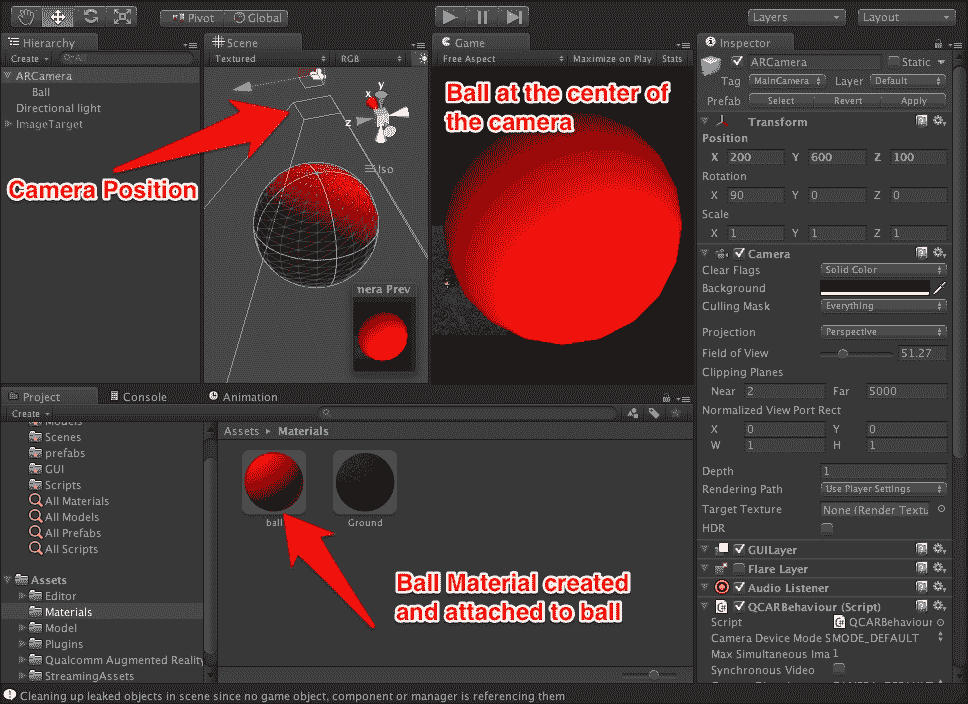

注意到球体默认已经有一个碰撞器，这在我们需要球体实际与地鼠和地面碰撞时将非常有用。

有一个基本的事情需要指出；给对象添加碰撞器并不会使其在引擎中被物理模拟，它只会使其与其他碰撞器发生碰撞。但当然，我们希望投射物像真实投射物一样行动，并对重力及力做出反应。我们希望投射物以自然的方式从地板和地鼠上弹跳。这很容易在 Unity 中模拟，但我们需要告诉 Unity 要模拟什么以及如何模拟。

从**层次**面板中选择**球体**对象，然后在**组件**菜单中，转到**物理**，并选择**刚体**。这将为球体添加一个刚体组件。刚体组件的作用是模拟它所附加对象上的物理，就像这个对象在现实世界中是一个刚体一样。它模拟重力、弹跳、外力以及所有你期望现实世界刚体会受到的影响，例如空气阻力。

默认情况下，刚体组件被设置为在对象上模拟重力。我们不需要在刚体中更改任何设置，因为它们现在都适合我们。只需点击播放按钮，我们就会立即看到球体在游戏世界中在重力作用下下落。

## 设置全局重力设置

我们可能已经注意到球体下落得太慢，以至于在游戏中感觉不自然。这主要是因为我们的比例不是 1:1 与游戏匹配。它实际上是 1:1 与现实世界匹配。这是因为它是一个增强现实应用，我们关心的是它与现实世界的交互感觉自然。然而，这却使得我们在使用增强现实游戏时，相对于游戏世界都变成了巨人。所以，并不是球体下落得太慢，而是有点爱因斯坦相对论的意味，相对于我们，球体下落了很长的距离。

为了解决这个问题，我们需要提高重力，以补偿我们所在巨人状态。如果重力更强，球体下落得更快，并给我们一种它在我们自己的真实世界中是自然的感受。幸运的是，在 Unity 项目中更改重力设置相当简单。

1.  从**Edit**菜单中，转到**Project**设置，并选择**Physics**。在**Inspector**中，我们将看到与物理工作方式相关的多个设置。我们可以更改任何一个，但现在我们只需要更改一个。第一个设置与重力相关。现实世界中的重力作用于 y 轴，其大小大约为-9.81。我们需要将其强度增加到 6 倍，所以将其更改为`-60.81`。

1.  点击运行按钮，观察球体下落得更快，方式也更自然。以下截图显示了项目的重力设置：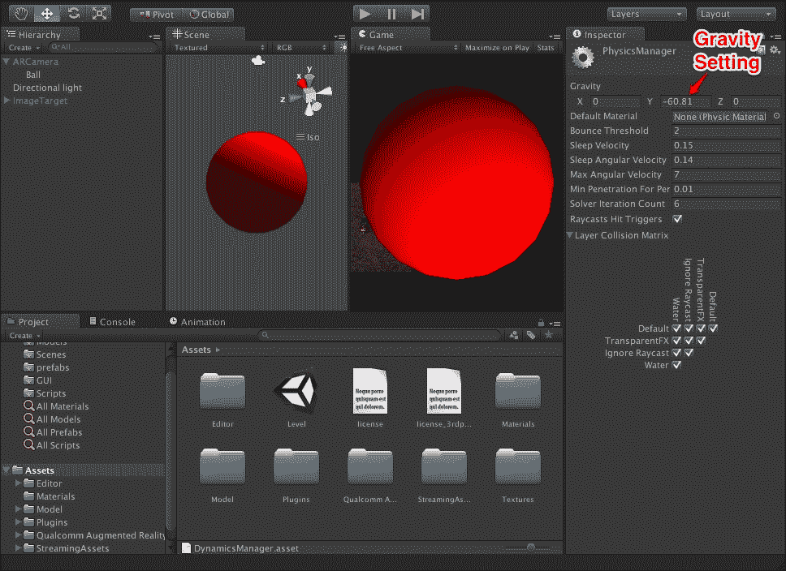

这应该会处理物理补偿值，并在真实世界的 AR 环境中自然工作。

# 添加音频源

现在，我们需要在场景中创建声音源来处理游戏的声音效果。**声音源**是可以放置在世界上用于 3D 位置声音或简单 2D 声音的音频源。为了在游戏中听到声音效果，需要音频源来产生声音，但我们还需要一个监听器来实际捕获创建的声音并呈现给用户。

默认情况下，**ARCamera**已经添加了一个监听器组件，所以我们只需要将音频源添加到它上面。

1.  在**Assets**文件夹中创建一个文件夹，并将其命名为`Audio`。将两个文件拖放到**Audio**文件夹中的章节资产中。这将导入名为`ballFire.wav`和`moleHit.wav`的两个音频文件。我们将第一个用于枪支发射球体的声音效果，第二个用于球体击中鼹鼠时。

    因为这是一个街机游戏，我们不需要 3D 声音位置；我们主要需要所有音频都是 2D 的，并且与声音源的距离远近无关。我们通过在检查器中更改我们刚刚导入的音频资源的设置来实现这一点。

1.  从**Audio**文件夹中选择音频文件，并在**Inspector**中取消勾选名为**3D Sound**的复选框。对两个文件都做同样的事情。以下截图显示了音频文件的音频设置：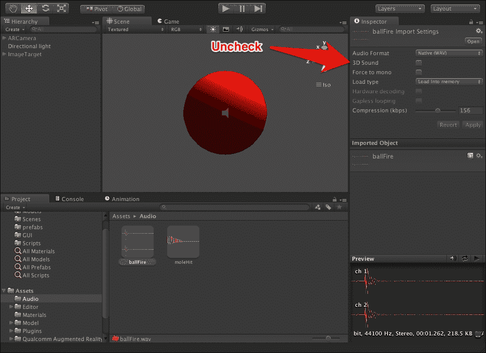

1.  现在，选择**ARCamera**，然后从**GameObject**菜单中选择**Create Empty**。这样做会在世界中创建一个空对象，并且靠近**ARCamera**。现在，将对象重命名为`ballFireAudio`。现在，选择我们刚刚创建的对象，从**Component**菜单导航到**Audio** | **Audio source**。重复相同的步骤来创建`moleHitAudio`。

1.  将**Audio**文件夹中的音频文件适当地拖放到我们刚刚创建的音频源组件中。这实际上在我们的场景中创建了声音源。只需取消勾选名为**Play on Awake**的复选框，因为我们需要通过代码来控制这个音频源。尽管这是一个在游戏面板中测试声音源如何播放的有用选项。以下截图显示了**ballFireAudio**的声音源设置：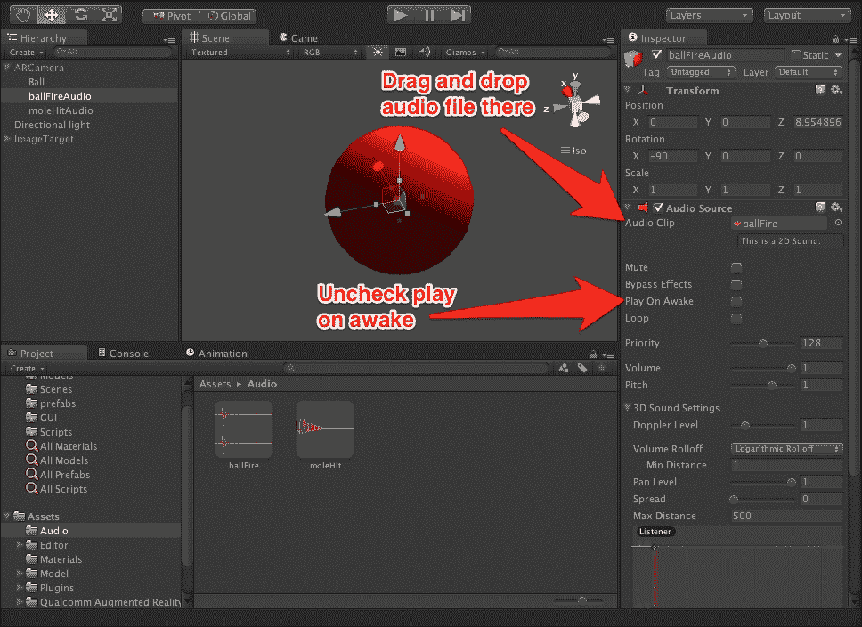

现在声音源已经设置好了，我们可以轻松地从脚本中调用它们，以增加应用程序的沉浸感。

# 编写球枪脚本

我们已经为枪创建了弹射物，我们也为它创建了声音源，但我们还没有让它像球枪一样工作；这就是脚本派上用场的时候了。

我们需要做的第一件事是为我们创建的弹射物创建一个预制体。这是为了能够通过脚本克隆弹射物并向可怜的鼹鼠发射。为此，只需在**Assets**文件夹中创建一个文件夹，并将其命名为`Prefabs`。从**Hierarchy**面板中将**Ball**对象拖放到你刚刚创建的文件夹中。现在我们有一个可以通过代码调用并创建任意数量球的预制体。

我们附加到相机上的球是没有意义的，因为我们将通过代码创建弹射物。所以，在我们已经制作了球的预制体之后，我们不再需要在场景中使用它，但在我们移除它之前，还有另一个步骤。我们需要有一个占位符，从该占位符中生成弹射物。这个占位符应该与场景中现在的球具有相同的位置和旋转。

首先，我们从**GameObject**菜单中添加一个空对象到场景中。现在，通过拖放将该对象附加到**ARCamera**对象上。将那个对象重命名为`BallPlaceHolder`。我们需要`BallPlaceHolder`对象与**Ball**对象具有完全相同的变换。不幸的是，Unity 中没有自动复制两个对象变换的功能，因此我们需要手动复制。点击**Ball**对象，复制该对象的位置和旋转，并将它们插入到`BallPlaceHolder`对象中。然后，删除**Ball**对象，因为我们不再需要它了。

以下截图显示了添加到场景中的**BallPlaceHolder**：

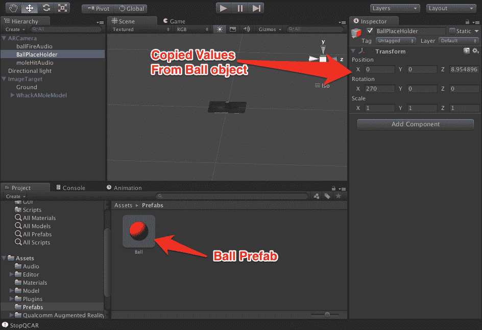

现在，是时候为我们的脚本创建一个文件夹了。在**Assets**中创建一个新的文件夹，并将其重命名为**Scripts**。在**Scripts**文件夹内，从**Assets**菜单导航到**Create** | **C# Script**。将创建的文件命名为`ballGun`。现在，双击它，Unity 将自动为我们打开其 MonoDevelop 编辑器。

以下截图显示了 Unity MonoDevelop 编辑器：

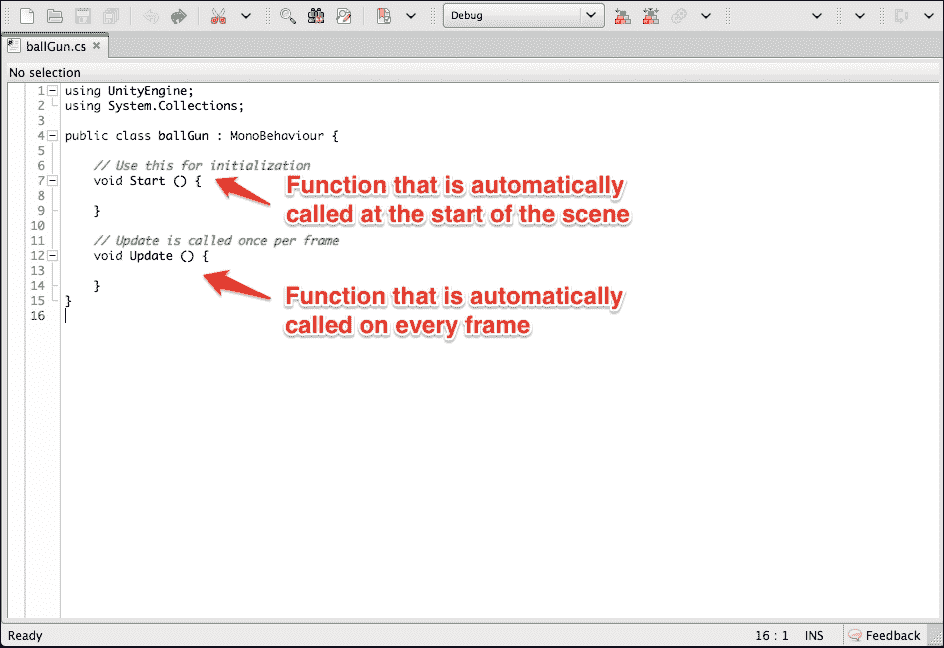

Unity 在 MonoDevelop 编辑器中为我们自动创建了许多东西。首先，它创建了一个以脚本文件名命名的类模板。这就是为什么脚本文件名必须是类名的原因之一。它为我们添加了两个空函数，这对平台上的游戏开发至关重要。

`Start()`函数是一个 Unity 引擎在场景开始时自动调用的函数。它对于变量初始化非常有用，可以将其视为类的构造函数。

`Update()`函数是一个非常重要的函数，Unity 会在游戏中的每一帧自动调用它。这对于跟踪游戏对象状态、维护游戏逻辑以及许多其他用途非常重要。强烈建议不要在`Update()`函数中进行密集计算，因为这会降低游戏的帧率，因为 Unity 不会渲染下一帧，直到游戏中的所有`Update()`函数都完全执行完毕。

现在，让我们看看添加代码后的脚本，看看每个函数都做了什么。以下截图显示了`ballGun.cs`脚本：

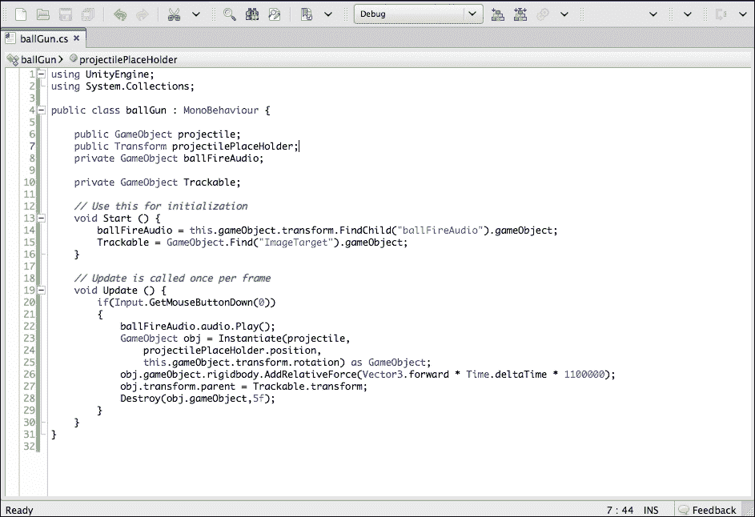

这就是控制球枪行为的脚本的样子。我们将把这个脚本附加到`ARCamera`对象上，并且它会响应用户在屏幕上的任何触摸，直接向用户指向的方向发射球。让我们看看这个脚本中的每个函数都做了什么。

我们首先看到的是脚本中声明的变量。它们的语法与您从 C#语言中期望的类似：

```java
public GameObject projectile;
public Transform projectilePlaceHolder;
private GameObject ballFireAudio;
private Gameobject Trackable;
```

在 Unity 中，变量的`public`或`private`状态非常重要。这是因为`public`变量会出现在编辑器中，并且可以在**检查器**中设置它们的值。这一点特别有用，应该牢记在心。

`projectile`变量是我们将用于链接到**球**预制件的变量。它是`public`的，因为我们将在稍后从编辑器设置其值。`projectile`是`GameObject`类型，它是游戏中任何对象的通用类型。它包含大量相关函数和变量，这些函数和变量经常很有用。wer sadfas

变量`projectilePlaceHolder`是`Transform`类型。它将保存场景中`BallPlaceHolder`对象的变换信息，该对象用于生成弹射物。

对于变量`ballFireAudio`，正如其名称所暗示的，我们将使用它来链接到我们之前创建的音频源对象。

`Trackable`变量将用于链接到`ImageTarget`对象。我们将使用它将生成的弹射物作为其子对象。我们将这样做，以便在`Trackable`从视线中消失时，球能够消失：

```java
void Start() {
   ballFireAudio = this.gameObject.transform.FindChild("
ballFireAudio").gameObject;
   Trackable = GameObject.Find("ImageTarget").gameObject;
}

```

这就是我们的`Start()`函数看起来像什么。在这个函数中，我们初始化了`ballFireAudio`和`Trackable`变量。我们通过从场景中找到`GameObject`并将其附加到变量来实现这一点。注意，我们是通过名称找到`GameObject`的；如果名称不同，相应地更改它，否则变量将无法正确初始化：

```java
void Update () {
   if(Input.GetMouseButtonDown(0))
   {
      ballFireAudio.audio.Play();
      GameObject obj = Instantiate(projectile,
         projectilePlaceHolder.position,
         this.gameObject.transform.rotation) as GameObject;
      obj.gameObject.rigidbody.AddRelativeForce(Vector3.forward * Time.deltaTime * 1100000);
      obj.transform.parent = Trackable.transform;
      Destroy(obj.gameObject,5f);
   }
}
```

这是我们的`Update()`函数，它将在每一帧被调用。它主要监听用户交互；如果用户触摸屏幕或用鼠标点击，就会实例化一个**球体**预制体，并对其施加力以向前推进，同时发出声音效果。重复点击或触摸将产生更多的球体。

`Input.GetMouseButtonDown(0)`的作用是，如果用户点击鼠标或触摸屏幕，则返回`true`。这就是我们如何监听用户是否与屏幕交互。如果是`true`，我们就继续执行游戏逻辑。

我们首先播放附加到游戏对象`ballFireAudio`的音频，以播放球体射击的声音效果。

接下来，我们从附加到投射物变量的预制体**球体**中实例化一个新的克隆。我们将其实例化到变量`obj`中，位置为`projectilePlaceHolder`的变换，旋转为摄像机的旋转，以确保它总是向前发射。

然后我们将相对力应用到实例化对象的`Rigidbody`组件上，以向前发射。方向是`Vector3.forward`，这是对象的正向。我们将其乘以`Time.deltaTime`；我们这样做是为了使力不受帧率的影响（`Time.deltaTime`是上一帧以来的时间）。这样做可以避免由于任何原因帧率下降时球体变慢。然后我们乘以力的功率。注意，力实际上很大；这是因为我们需要球体快速向前发射，并且还需要补偿游戏世界与现实世界之间的比例，正如我们通过重力所看到的那样。

然后我们将实例化对象设置为`ImageTarget`的父对象，以便它能够正确地与图像目标一起工作。

最后，我们延迟 5 秒后销毁对象。我们这样做是因为我们绝对不希望投射物消失，因为这会真正降低应用程序的性能。

1.  现在我们的脚本已经准备好了，我们需要将其附加到**ARCamera**对象。通过将脚本拖动并放置在**ARCamera**对象上完成此操作。脚本组件将出现在**ARCamera**中，我们将会注意到两个公共变量**投射物**和**投射物占位符**在**检查器**中是可见的。

1.  现在，我们需要将**球体**预制体从**预制体**文件夹拖放到**检查器**中的**投射物**变量。我们还需要将**球体占位符**对象从场景拖放到**检查器**中的**投射物占位符**变量。以下展示了附加了`ballGun.cs`脚本的**ARCamera**：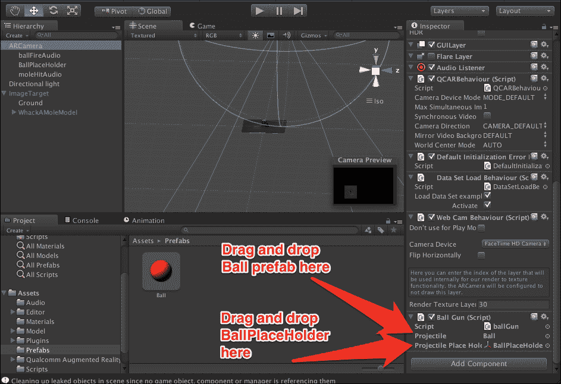

1.  现在我们已经正确地将脚本附加到**ARCamera**对象上，我们可以在**Game**视图中尝试它。点击运行并点击面板。相机将射出球体。以下截图显示了`ballGun.cs`脚本在运行中的样子：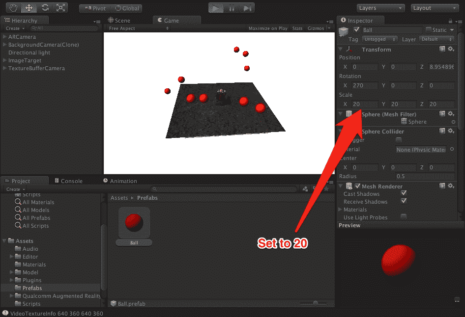

1.  在测试脚本时，我们可能会注意到球体相对于鼹鼠来说有点太小。我们可以通过从**Prefabs**文件夹中的**Ball**预制体方向进行更改。选择它，然后更改(x, y, z)的缩放值到`20`。这是一个很好的例子，说明了预制体在进行更改时的有用性，因为它会自动将更改传播到整个项目中。

# Vuforia 可追踪事件处理

更多的时候，我们需要在可追踪对象被找到时触发某种行为。为此，我们必须了解如何跟踪可追踪事件，例如可追踪对象被找到或丢失。Vuforia 通过提供一个名为`DefaultTrackableEventHandler`的模板脚本，使我们能够轻松地做到这一点。默认情况下，此脚本会附加到任何**ImageTarget**预制体上。现在它应该已经存在于场景中的**ImageTarget**对象中了。

脚本所执行的操作是处理可追踪对象被找到或丢失的事件。当可追踪对象被找到时，它负责渲染 3D 内容，当它丢失时，使其消失。需要注意的是，它并不负责可追踪对象上的视角或**ARCamera**的位置，这部分由另一个脚本处理，这超出了我们的范围。

Vuforia 建议我们使用`DefaultTrackableEventHandler`脚本作为模板来创建自己的可追踪事件处理脚本。这正是我们现在将要做的，通过向脚本中添加一个非常小的函数。

打开名为`DefaultTrackableEventHandler`的脚本，该脚本位于`Qualcomm Augmented reality`文件夹下的`Scripts`文件夹中。它应该看起来类似于以下截图，其中显示了`DefaultTrackableEventHandler.cs`脚本：

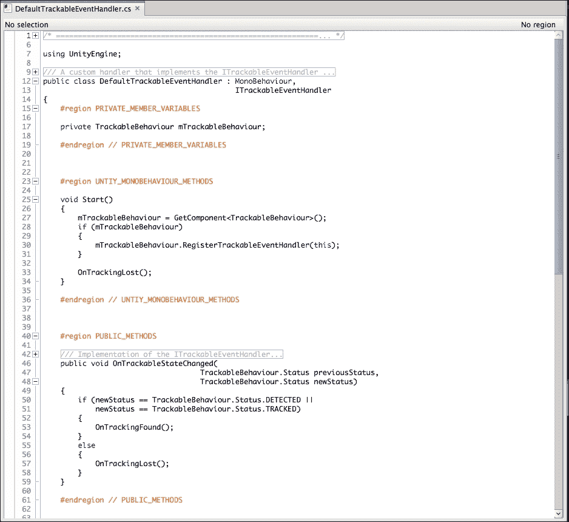

从此脚本中，以下三个函数是重要的：

+   `OnTrackableStateChanged`: 每当可追踪对象的状态发生变化时，无论是被找到还是丢失，都会调用此函数。然后它确定是否被检测到或丢失，并相应地调用事件函数。

+   `OnTrackingFound`: 当可追踪对象被找到时，会调用此函数。它负责渲染`ImageTarget`对象的全部子对象，并开启它们的碰撞器。

+   `OnTrackingLost`: 当可追踪对象丢失时，会调用此函数。它负责关闭`ImageTarget`的所有子对象的渲染，并关闭它们的碰撞器。

这些是脚本中的三个关键函数。我们将保持它们不变，但进行一个修改。我们需要添加一个新函数，该函数返回可追踪对象的状态，告诉我们是否检测到可追踪对象。当我们在稍后看到动画的土拨鼠角色时，这将对我们很有用。

在`Scripts`文件夹中创建一个新的 C#脚本，并将其命名为`MoleTrackableEventHandler`。现在将`DefaultTrackableEventHandler`脚本中的所有代码复制并粘贴到我们刚刚创建的脚本中。重要的是要将类名从`DefaultTrackableEventHandler`更改为`MoleTrackableEventHandler`，否则由于类名与文件名不匹配，Unity 中会出现错误。

修改后，脚本将类似于以下截图，其中显示了`MoleTrackableEventHandler.cs`脚本：

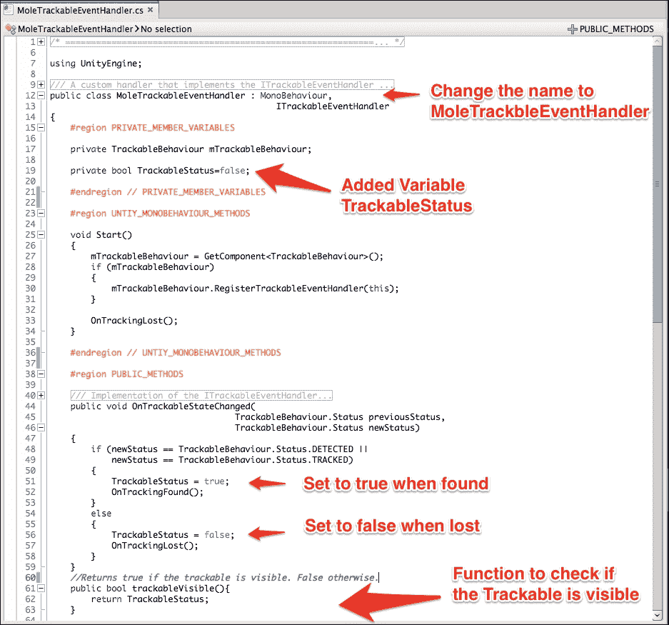

我们添加了变量`TrackableStatus`，我们希望它保存可追踪对象的状态。如果它是可见的，则为`true`，如果不可见，则为`false`。然后我们创建了一个函数，并将其命名为`trackableVisible`，该函数将返回变量`TrackableStatus`。

然后，我们在`OnTrackableStateChanged()`函数中简单地将`TrackableStatus`设置为`true`，当找到时，设置为`false`，当未找到时。

现在，如果我们调用`trackableVisible()`函数；它将有效地告诉我们可追踪对象是否可见。

现在，我们需要将`MoleTrackableEventHandler`附加到场景中的`ImageTarget`对象上。我们现在不需要将`DefaultTrackableEventHandler`附加到`ImageTarget`上，因此我们需要删除该组件或简单地禁用它。

`DefaultTrackabeEventHandler`可以稍后进行自定义，以实现各种效果，例如当找到可追踪对象时播放声音或视频，或控制特定的 GUI 对象以响应可追踪对象。它为我们提供了对 AR 应用行为的很大控制，因此始终记住这一点是有益的。

# 添加粒子预制体

在 Unity 中，**粒子**是一个非常实用的工具，许多开发者都在使用它。使用它，可以创建雾气、灰尘、火焰、爆炸以及各种效果。对资源的影响通常很小，因为粒子使用小的 2D 图像动画来产生所需的效果，因此得名“粒子”。

对于我们的应用，添加当我们用球击打土拨鼠时出现的灰尘粒子将会很有用。尽管学习如何创建粒子超出了本书的范围，但我们将看到我们如何将一个粒子添加到已经制作好的场景中，因为 Unity 商店中有许多可用的免费粒子。

1.  将名为`DustParticles`的包导入到项目中。将我们刚刚导入的预制体添加到场景中。你将自动注意到编辑器中正在模拟尘云。现在，我们只需要适当地将其定位在鼠丘上方，使其看起来像尘土从洞中升起，然后将其设置为 Mole 对象的子对象。不久后，我们将看到如何通过代码调用这个粒子系统并激活它。

1.  将**角色**对象的位置调整到地面以下，因为游戏开始时它们应该在那里。这也会给我们一个很好的想法，看看没有角色时尘土会是什么样子。只需将`Character`在 y 轴上移动，直到它刚好在地面以下且不可见。以下截图显示了场景中添加的尘粒：

Unity 是一个伟大的工具，但像其他所有东西一样，它并不完美。然而，它所缺乏的通常会被一个非常活跃的社区所弥补，他们会为它创建附加组件和脚本。对于 Unity 来说，最有用且免费的脚本之一是 iTween。

**iTween**是一个脚本，允许我们通过脚本轻松地动画化对象。它非常可定制，适合大多数游戏对象动画需求。例如，iTween 可以轻松地用来在游戏中动画化导弹，使其以流畅的方式飞向目标。在我们的案例中，我们将使用 iTween 来动画化老鼠从鼠丘中出来又回去。

iTween 可以从 Unity 的 Asset 商店轻松添加。它是免费的；只需在 Unity Asset 商店中搜索它，它可以通过**窗口**菜单访问，然后下载并导入到项目中。现在，我们可以从代码中轻松访问 iTween 函数。

iTween 的文档可以在[`itween.pixelplacement.com/documentation.php`](http://itween.pixelplacement.com/documentation.php)找到。

# 编写老鼠角色的脚本

现在，iTween 已经设置好了，让我们看看如何编写老鼠角色的脚本以利用 iTween 并正确地动画化角色。在这个阶段，我们希望通过老鼠脚本实现的是让它从鼠丘上下跳动。动画应该从两个范围之间的随机时间开始，以避免行为的重复和可预测性。

让我们看看这个脚本的样子。以下截图显示了`moleAnimator.cs`脚本：


`Start()`函数的前三行相当简单。我们找到并附加了击中老鼠的声音源到`moleHitAudio`，以便我们在脚本中使用。我们找到并附加了尘粒系统作为击中效果。然后我们找到`ImageTarget`对象，并且只使用脚本组件`MoleTrackableEventHandler`。我们这样做是为了能够调用添加的功能，即`trackableVisible`，以检查可追踪对象是否可见。这是在 Unity 中访问其他类函数的一种方式。

`Start()` 函数中的最后一行启动了动画序列；让我们看看它是如何做到的：

```java
iTween.MoveBy(gameObject, iTween.Hash("y", 40, "easeType", "easeInOutQuad", "speed", 20, "delay", Random.Range(0.3f, 5f), "oncomplete", "animComplete_Up");
```

这是启动鼹鼠角色整个动画序列的代码行。`MoveBy()` 是 iTween 类中的一个函数，它允许通过沿着给定轴移动对象来在给定轴上动画化对象。我们首先给它当前的游戏对象，该脚本附加的对象，即鼹鼠角色，然后我们传递 `iTween.Hash` 参数来设置我们想要的动画类型。

`iTween.Hash` 的参数非常重要，但很容易理解。它遵循 `(参数名称字符串，参数值)` 的语法。首先，我们给出我们想要在其实际轴上动画化的轴，在我们的例子中是 y 轴。然后，我们为 `easyType` 设置一个值，它控制动画的减速和加速，使其不会感觉突兀；`easeInOutQuad` 对我们的角色来说是一种完美的自然感觉。我们将动画速度设置为 `20`。现在对于延迟，这是动画开始前的延迟，我们添加一个随机值，使鼹鼠在不同的时间动画化，而不是同时，因为在我们场景的后期阶段我们将有不止一个鼹鼠。`oncomplete` 参数是在动画完成后要调用的函数的名称。因为这一行动画化角色向上并从洞中出来，所以它调用了 `animComplete_up`，这反过来又会将角色动画化回洞中，正如我们接下来将要看到的。

如果我们查看 `animComplete_Up` 函数，我们会看到它只包含一行代码，这行代码执行的操作与 `Start()` 函数在其最后一行代码中执行的操作类似，但方向相反。它将角色动画化回洞中，这是有道理的，因为我们不希望角色从鼹鼠丘上弹跳。注意，`oncomplete` 参数调用了 `animComplete_Down`，这是我们接下来要查看的。

在 `animComplete_Down` 函数中，我们做了两件事。首先，我们通过调用 `trackableVisible()` 函数来检查可追踪对象是否可见，这是 `MoleTrackableEventHandler` 的一个成员。如果目标可见，我们打开 `renderer` 和 `collider` 对象。这使得对象可见并可碰撞。我们这样做是因为当球击中鼹鼠时，我们将使鼹鼠消失，但只有当可追踪对象可见时，我们才应该使其重新出现，否则它将干扰 `ImageTarget` 渲染对象的方式，并且当没有追踪目标时，我们将在相机上看到漂浮的对象。接下来，它将对象动画化回原位，然后 `oncomplete` 依次调用 `animComplete_Up`，形成一个完美的递归循环。

最后一个函数，即 `OnCollisionEnter`，是 Unity 事件，每当两个碰撞体相互碰撞时都会触发。它发送到任何附加了碰撞体的对象。我们使用此事件来检查是否有球击中了鼹鼠。如果击中了鼹鼠，我们就播放击打音效和灰尘粒子。然后我们关闭对象的渲染器使其消失，并关闭碰撞体以避免干扰其他球。

这是将为我们处理鼹鼠行为的脚本。现在我们只需将其附加到 `WhackAMoleModel` 对象内部的 `Character` 对象上，然后播放。我们可以立即看到鼹鼠正在正确且随机地动画化。此外，如果球击中它，会播放音效和灰尘粒子，表示击打正确。

现在我们完成了鼹鼠对象，将其整个预制件放入 `Prefabs` 文件夹中，然后将多个鼹鼠对象添加到场景中，以便有不止一个鼹鼠。添加尽可能多的鼹鼠，但我相信四个就足够了，考虑到可追踪物的大小。

# 遮罩着色器

我们的游戏开发基本完成。我们已经设置了所有对象的行为，并准备部署；但我们还缺少最后一件事。我们可能已经注意到，当鼹鼠钻入地下时，它们仍然可以从侧面看到。当将应用程序部署到 AR 环境中的设备上时，这也会很明显。我们有一个简单的解决方案可以隐藏在 AR 环境中地下钻入的鼹鼠，那就是使用深度遮罩着色器。

1.  将名为 `DepthMask.shader` 的着色器资产添加到章节的资产中。然后，我们想在场景中创建一个与地面平面一样大的立方体，命名为 `mask`，并隐藏其后的所有鼹鼠，如下面的截图所示。下面的截图还显示了添加到场景中的 **Mask** 对象：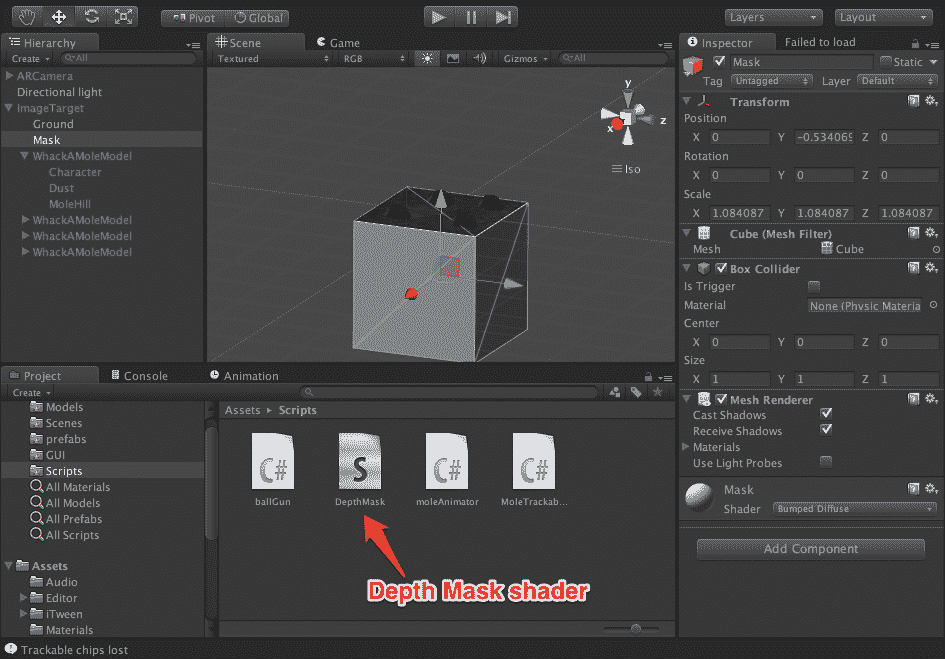

1.  当然，这个对象目前还没有作为遮罩使用，它只是一个普通的立方体。为了给它遮罩属性，我们需要在 **Materials** 文件夹中为其创建一个材质，命名为 `Mask`。因为我们添加了 **DepthMask** 着色器，它应该会自动出现在材质的 **Shader** 下拉列表中。只需从那里选择 **DepthMask** 着色器，然后将材质附加到 **Mask** 对象上。下面的截图显示了激活的 **DepthMask** 着色器：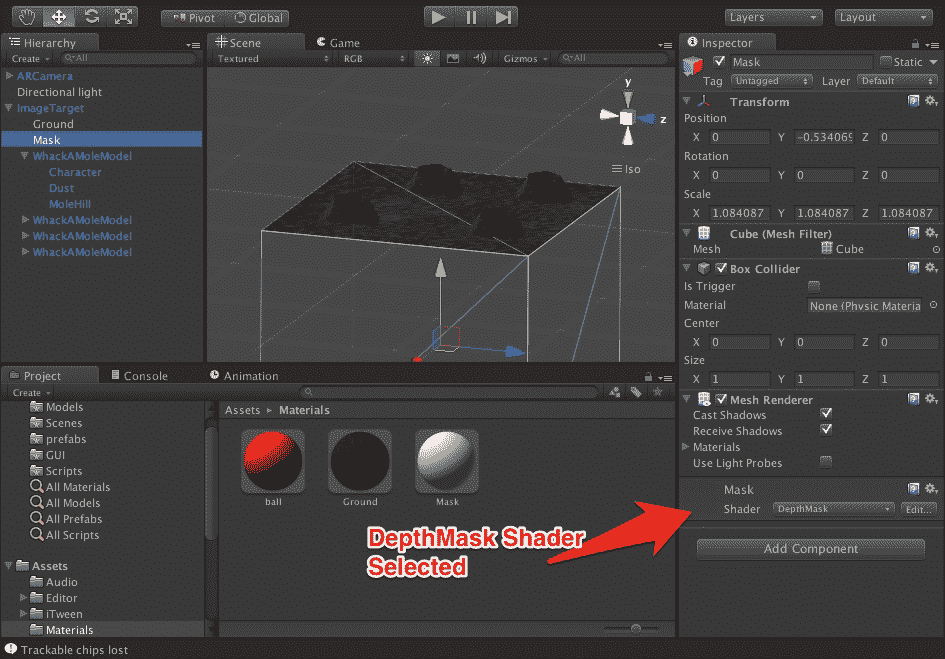

我们立即注意到立方体消失了，但进一步的检查发现，不仅立方体不可见，而且其后的鼹鼠也不可见。这有效地解决了我们的问题，通过隐藏地下鼹鼠。

# 摘要

在本章中，我们详细介绍了在 Unity 中高级 AR 开发的众多内容。我们创建了一个功能完善且有趣的游戏，该游戏利用了 Unity 和 Vuforia 中的许多概念。现在我们所需做的只是将游戏部署到设备上并玩它。也许可以添加一个得分系统，或者也许可以添加有限数量的球来击打鼹鼠。天空是你的极限。尝试各种可能性，并创造一个用户会欣赏的体验。
