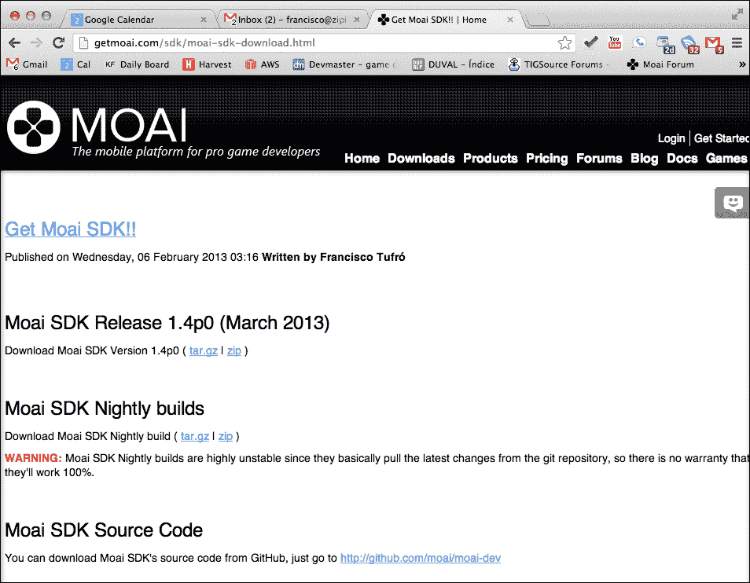
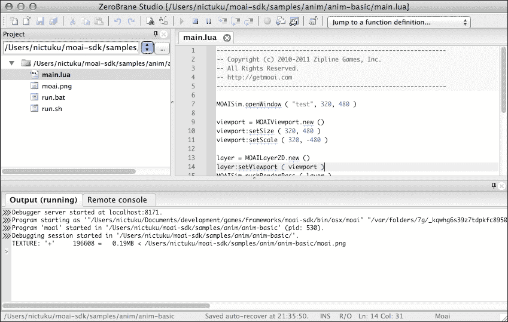
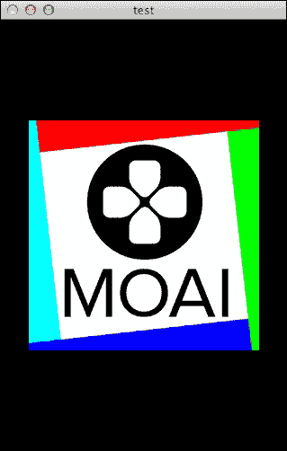

# 第二章。安装 Moai SDK

在我们可以动手之前，我们需要采取一些步骤，以便拥有一个完全工作的环境来使用 Moai SDK 进行开发。

这在不同的平台上可能会有所不同，所以请随意跳转到您喜欢的平台。

我们将介绍如何在 Windows 和 Mac OS X 上安装 Moai SDK；对于 Linux 用户，这个过程更为复杂，我们在这里无法涵盖，但您可以在本章中找到更多关于它的信息。在本章结束时，您应该在自己的系统上安装好一个可工作的 Moai SDK 版本。

# 获取最新稳定构建

访问 [`getmoai.com/sdk/moai-sdk-download.html`](http://getmoai.com/sdk/moai-sdk-download.html)。

您将找到两个下载选项，一个是发布版，另一个是夜间构建。

+   **发布版**：这是 Moai SDK 的稳定版本。它包含了您开始使用 Moai SDK 进行开发所需的所有内容。本书撰写时的当前版本是 1.4p0。

+   **夜间构建**：每晚（或根据您的位置是早上或晚上）都会自动构建整个 Moai SDK 项目。由于它包含了自上次稳定发布以来的所有更改，因此这个构建非常不稳定。如果您需要尚未包含在最新版本中的某些功能，请下载夜间构建，它应该在那里。

对于这些版本中的每一个，都有两种可能的软件包：`.zip` 和 `.tar.gz` 软件包，下载您最喜欢的一种。



# 设置环境

下载 SDK 后，我们需要设置我们的环境。

Moai SDK 可以与任何文本编辑器一起使用，但如果您想要一些高级功能，如调试器，您就需要使用支持 Moai SDK 的 IDE 之一。有很多这样的 IDE，每个都有不同程度的集成。为了获取完整的列表，我建议您访问 Moai 的维基百科上的 *与 Moai 一起工作的工具* [`getmoai.com/wiki/index.php?title=Tools_that_work_with_Moai`](http://getmoai.com/wiki/index.php?title=Tools_that_work_with_Moai)。

在本书中，我们将专注于使用 ZeroBrane Studio，因为它开源（您可以用 Lua 编程它）并且具有许多对我们有用的特性（如语法高亮、Moai SDK 的自动完成、调试和实时编码等）。要安装它，请访问 [`studio.zerobrane.com`](http://studio.zerobrane.com) 并下载适用于您特定平台的最新软件版本。

## Windows

本书假设您已经下载了 ZeroBrane Studio（无论是 zip 文件还是安装程序）并将其安装到 `C:\Program Files\ZeroBraneStudio`。

现在，将 Moai SDK 软件包解压到 `C:\moai-sdk`。

在完成此操作后，我们需要设置 ZeroBrane 以与我们的 Moai SDK 安装一起工作。

1.  在 `C:\Program Files\ZeroBraneStudio\cfg\` 中创建一个名为 `user.lua` 的文件，并添加以下行：

    ```swift
    -- MOAI Path
    path.moai = 'c:/moai-sdk/bin/win32/moai.exe'
    ```

1.  如果您选择在另一个位置安装 Moai SDK，请使用该位置。

1.  为了支持 Moai SDK，您还需要做最后一件事。

1.  导航到**项目** | **Lua 解释器** | **Moai**。

现在您已经准备好了。您可以跳转到**运行示例**部分，看看一切是否正常工作。

## Mac OS X

本书假设您已经下载了 Mac OS X 的 ZeroBrane Studio 并将其安装到`/Applications`。

现在，将 Moai SDK 包解压到`~/moai-sdk`。

1.  在`/Applications/ZeroBraneStudio.app/Contents/ZeroBraneStudio/cfg/`中创建一个名为`user.lua`的文件，并添加以下行：

    ```swift
    -- MOAI Path
    path.moai = '~/moai-sdk/bin/osx/moai'
    ```

1.  如果你选择在其他位置安装 MOAI，请使用该位置。

1.  最后一步是导航到**项目** `|` **Lua 解释器** `|` **Moai**`。

现在您已经准备好了。

下一步是尝试一些示例，看看是否一切正常工作。

## GNU/Linux

很遗憾，当前稳定的 Moai SDK 版本不包括预编译的 GNU/Linux 主机。因此，唯一的选择是从源代码构建自己的主机。为了做到这一点，你需要了解如何编译 C++以及如何处理 Git 仓库（至少要知道如何克隆它们）。

这本书的范围之外，但如果你迷路了，请随时跳转到 Moai 论坛寻求帮助。

只作为一个提示，你需要从[`github.com/moai/moai-dev`](https://github.com/moai/moai-dev)获取源代码，切换到 Linux 分支，并使用*CMake*编译一切。

# 运行示例

为了查看您的安装是否正常工作，我们将从 Moai 的发布版中运行一个示例。

1.  打开 ZeroBrane Studio，在左侧面板（**项目**）中，点击带有省略号（**...**）的按钮，转到`moai-sdk/samples/anim/anim-basic`，然后点击**确定**。

    现在您的项目正在使用 Moai SDK 的示例作为项目根。您将在`moai-sdk/samples/folder`中看到很多如何使用 Moai SDK 的示例。在阅读完本书后，查看它们以了解更高级的主题。

1.  现在按*F6*（或**项目** | **运行**）。

    如果打开了一个窗口并显示 Moai SDK 的标志旋转，太好了！您已经准备好了！

    

您将想要阅读这个示例；特别是看看以下行：

```swift
prop:moveRot ( 360, 1.5 )
```

这一行是使 Moai 标志移动的原因。第一个参数是旋转角度，第二个参数是完成整个运动所需的时间。试试看，改变角度和持续时间，看看会发生什么。

# 概述

在本章中，我们了解到，为了使用 Moai SDK 进行开发，我们需要使用预编译的主机之一，或者从源代码构建一个（在 Linux 开发的情况下这是强制性的，因为还没有预编译的构建）。

我们已经下载了框架的最新版本，安装了它，并运行了一个示例来查看它是否正常工作。

下一章将向您介绍 Moai SDK 背后的基本概念，所以如果您想了解 Moai 的运行时、Action Tree 和节点图，请继续阅读。
