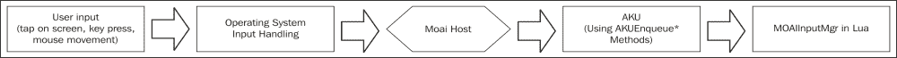
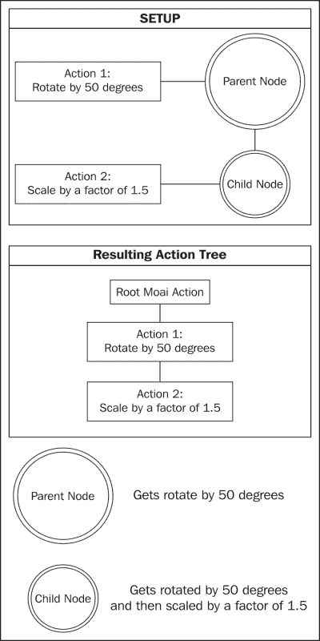

# 第三章. 基本 Moai SDK 概念

每个游戏引擎都有其背后的概念，这些概念定义了其内部工作方式。在本章中，我们将快速浏览 Moai SDK 使用的不同想法，以便更好地理解它。

# Moai SDK 运行时

Moai 的运行时使用两个重要的数据结构，即对象/节点的*依赖图*和*动作树*。作为开发者，你主要会修改这些数据结构（在 Lua 中使用 Moai SDK API）。

Moai 更新循环有三个步骤：

+   处理输入队列

+   处理动作树

+   处理节点图

在 Moai 中，*渲染与游戏循环分离*，因为我们可能希望每个渲染帧有多个更新步骤。

## 输入队列

当你按下一个键、移动鼠标或在 iPhone 屏幕上轻触时，系统会生成一个输入事件，由**主机**传递给 Moai 并放入队列（使用 AKUEnqueue*方法）。在模拟的每个步骤中，Moai 处理所有输入回调，处理输入队列，然后继续游戏循环。

在游戏循环期间发生的所有事件都会在下一个模拟步骤中排队。

## 动作树

节点基本上是所有为你游戏提供信息的对象，例如，子弹的实例在 Moai 中就是一个节点，具体来说是一个可以渲染的节点。

动作负责管理节点随时间的变化。

例如，位置、旋转或缩放的变化将创建一个动画。

动作树的作用是创建动作的层次结构。这样做的主要目的是让动作负责执行子动作。Moai 有一个主根动作，将运行附加到其上的所有动作。

动作是 Moai 中唯一接收时间步的对象。这意味着 Moai 对象的时间相关变化可能只发生在处理动作树时。节点图或渲染过程不应对节点的状态进行任何更改。

## 节点图

因此，正如我们之前所看到的，节点基本上是存在于你的游戏中的对象。这些对象相互连接形成一个图。在每次更新循环步骤中，Moai 处理与前一步状态不同的节点。这是通过一个修改节点的队列来实现的。每当一个动作修改一个节点（或者节点被链接到另一个被修改的节点，或者当一个节点的属性被直接设置时），它就会被安排（连同它连接的节点，等等）并在下一个模拟步骤中处理。

这种行为定义了一个在低级别构建的父/子关系，因此可以轻松创建场景和动画层次结构。

# 渲染

那么，渲染在哪里进行呢？在 Moai SDK 中，渲染与更新循环分离。渲染管理器是一个单例，负责渲染。它维护一个待渲染的对象表，你可以按需修改该表，并且它将渲染表中的所有对象。值得一提的是，子表也会被渲染，因此你可以创建一个待渲染对象的层次结构。

# Moai 主机

Moai SDK 背后的一个关键概念是**主机**。

这是由 Zipline 团队为 Moai SDK 提出的解决方案，基本上表明 Moai SDK 提供了一个 Lua 解释器和对外界的 C++接口。这个接口被称为**AKU**，可以在 Moai SDK 源代码中找到。

无论何时你想为特定平台创建游戏，你的主机负责配置输入并将输入事件发送到 Moai，解决该平台的所有线程问题，并提供所有平台特定的逻辑和 Lua 扩展，以及一个 OpenGL 画布用于渲染。

以这种方式，在 Moai 中构建的游戏有可能部署到所有支持 C++和 OpenGL（好吧，不是所有的 OpenGL，只是其中的一部分，如 OpenGL ES）的平台，而这些是行业标准，几乎没有限制。

Moai SDK 附带 Windows、Mac OS X、iOS、Android 和 Google 的 Native Client 的示例主机。你应该能够修改这些主机，并且通过一些小的调整，让你的游戏在这些主机上运行。

再次强调，你只需使用 Lua 构建一次游戏，就可以让所有这些平台运行。

# Lua 和 C++

Moai 背后的另一个有趣特性是，你可以访问 Lua 和 C++来开发你的游戏。

使用 Lua 设置你的节点和动作后，Moai SDK 使用用 C++编写的本地代码运行模拟。这意味着你得到了两者的最佳结合——Lua 的灵活性和 C++的速度。

所有平台特定的东西（例如，处理智能手机上的加速度计）都应该以本地方式处理，并通过 Lua 扩展或输入事件连接到 Moai SDK（检查主机如何配置 AKU，搜索 AKUSetInputDevice*方法系列）。

这是 Moai SDK 开发的一个关键概念，因为你可以看到，你可以使用 Moai SDK 的库没有限制。这只是一个花时间编写 Lua 扩展的问题，然后 Bam！它就在脚本环境中可用；你可以将库功能与你的现有游戏结合起来。

除了这个之外，还有解释型代码与编译型原生代码的困境。你知道使用 Lua 进行编程比使用 C++ 更有效率，但有时由于性能要求，你就是在 Lua 中也做不了某些事情。（尽管这种情况非常罕见，Lua 还是相当快的，瓶颈通常出现在渲染上，逻辑执行花费的时间非常少）。你总是可以将你的代码移植到 C++（你可以使用性能分析工具来决定是否需要这样做），然后创建一个具有相同 API 的 Lua 扩展，你就不需要修改你代码的其他部分了。

# 摘要

在本章中，我们讨论了 Moai SDK 更新循环的细节，以便理解其内部工作原理。我们考察了更新循环中的三个主要步骤，即输入队列、动作树的处理以及节点图的处理。我们讨论了 Moai 的独立渲染特性、主机的重要性以及将 C++ 和 Lua 世界联系在一起的理念，以及如何明智地利用这一点。

好吧，关于幕后发生的事情我们已经说得够多了。现在去喝杯咖啡吧，因为接下来的一章，我们将最终开始实现我们的第一个游戏，你的好奇心不会让你那时停下来休息。
