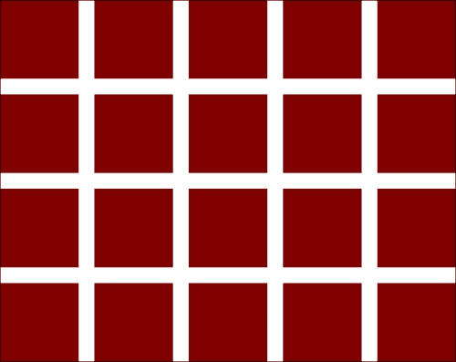
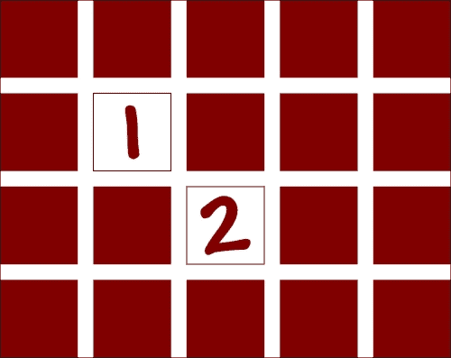
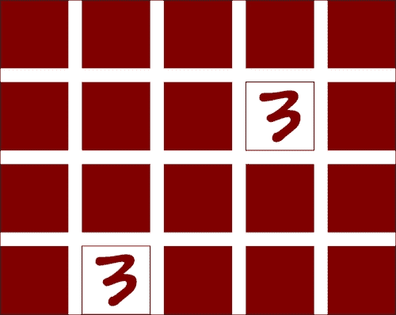
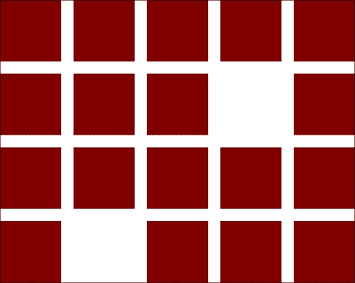
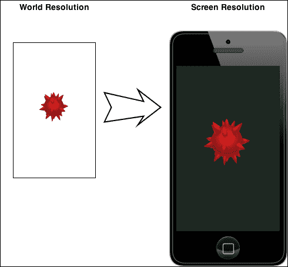

# 第四章.我们的第一个 Moai 游戏

冒险时间！我们将开始使用 Moai SDK 制作我们的第一个游戏，一个简单的类似*注意力集中*的游戏。为此，你需要对 Lua 语法有一定的了解，不需要太花哨，只是基础知识。如果你以前从未使用过 Lua，阅读一些快速介绍材料并在阅读这本书时准备一个语法速查表是个好主意。

# 注意力集中

对于那些不熟悉这个游戏的读者，让我们来描述一下它。

游戏需要一套拼图。拼图的数量必须是偶数。拼图的一面有图案（成对出现，因为我们将会匹配它们），另一面则是平坦的颜色或相同的图像（拼图的背面）。

游戏玩法如下：

1.  将所有拼图面朝下并洗牌。这样你就可以隐藏成对的图案，不知道它们在哪里。

1.  然后，你需要选择两张拼图并翻转它们，以显示图案。

1.  如果它们不同，你必须再次翻转它们并选择另一对。

1.  如果它们相同，你将它们从板上移除，游戏继续进行，但拼图数量减少两张。

当没有拼图剩下时，游戏结束。

我们将实现这个游戏，并增加一个滴答作响的时钟，使事情变得有点更具挑战性。

为了做到这一点，我们将检查 Moai SDK 的所有基本功能以及如何使用它们。

# 项目设置

为了设置项目，我们需要执行几个步骤：

1.  在你的硬盘上某个位置创建一个用于我们项目的文件夹。

1.  之后打开 ZeroBrane Studio 并导航到那个文件夹。

1.  你现在会看到一个空文件夹和一个名为`untitled.lua`的空白文件。

1.  将该文件保存为`main.lua`，这是游戏入口点文件的常用名称。你可以取任何你想要的名称，但我们将使用这个作为标准。

1.  现在我们准备开始。

# 打开窗口

我们首先学习的是如何使用 Moai SDK 打开主游戏窗口。

这是一个相对简单的任务。代码如下：

```swift
MOAISim.openWindow ( "Concentration", 320, 480 )

```

我们在这里所做的是调用`MOAISim.openWindow`类方法，并使用必要的参数，即窗口的`title`（一个字符串）、`width`和`height`。正如你可能已经注意到的，我们使用了 320 x 480，这是 iPhone 3GS（没有 Retina Display）的显示分辨率。

如果你现在运行脚本，你会看到一个窗口打开。所以，这就是我们的主窗口准备好了。但在继续之前，让我们看看 Moai SDK 的一个重要方面。

### 注意

**下载示例代码**

你可以从你购买的所有 Packt 书籍的账户中下载示例代码文件。[`www.packtpub.com`](http://www.packtpub.com)。如果你在其他地方购买了这本书，你可以访问[`www.packtpub.com/support`](http://www.packtpub.com/support)并注册，以便将文件直接通过电子邮件发送给你。

## 分辨率无关性

我们刚刚打开的窗口具有特定的宽度和高度。但是，正如我们所知，不同的设备有不同的分辨率，我们不能仅仅打开一个具有固定宽度和高度的屏幕，因为它在 iPhone 和 iPad 等设备上不会正确运行。

因此，我们将在这里介绍一个概念：**世界分辨率**与**屏幕/窗口分辨率**的比较。

这个想法是，你的游戏将使用世界分辨率进行所有计算和对象放置，然后你将使用一个理解世界分辨率的视口，并将其转换为窗口分辨率。所以，让我们按照以下方式设置我们的脚本：

```swift
WORLD_RESOLUTION_X = 320
WORLD_RESOLUTION_Y = 480

SCREEN_RESOLUTION_X = 2 * WORLD_RESOLUTION_X
SCREEN_RESOLUTION_Y = 2 * WORLD_RESOLUTION_Y

-- Open main screen
MOAISim.openWindow ( "Concentration", SCREEN_RESOLUTION_X, SCREEN_RESOLUTION_Y )

-- Setup viewport
viewport = MOAIViewport.new ()
viewport:setSize ( SCREEN_RESOLUTION_X, SCREEN_RESOLUTION_Y )
viewport:setScale ( WORLD_RESOLUTION_X, WORLD_RESOLUTION_Y )
```

让我们逐行查看前面的代码：

```swift
WORLD_RESOLUTION_X = 320
WORLD_RESOLUTION_Y = 480
```

这些行定义了两个常量，即我们的世界分辨率沿 X 轴和 Y 轴。记住，这些不是屏幕的尺寸，只是我们的世界。

```swift
SCREEN_RESOLUTION_X = 2 * WORLD_RESOLUTION_X
SCREEN_RESOLUTION_Y = 2 * WORLD_RESOLUTION_Y
```

现在我们为屏幕的分辨率定义了`X`和`Y`维度。正如你所见，我们将屏幕的大小设置为世界大小的两倍。我们这样做是为了更好地说明屏幕分辨率与世界分辨率的独立性。在接下来的章节中，我们将看到你在世界中放置的任何东西在屏幕上看起来将是以下的两倍大小：



我们现在需要告诉 Moai 打开一个窗口，这在开发过程中是必需的，为了在我们的游戏设备上创建一个窗口，在设备上它将不会做任何特别的事情。

```swift
MOAISim.openWindow ( "Concentration", SCREEN_RESOLUTION_X, SCREEN_RESOLUTION_Y )
```

这是之前我们看到的那行代码，但现在，我们正在使用我们的`SCREEN_RESOLUTION_X`和`SCREEN_RESOLUTION_Y`常量。请注意，在具有固定尺寸屏幕的设备上，这个方法不会做任何特别的事情，但我们需要它在计算机上运行我们的示例。

```swift
viewport = MOAIViewport.new ()
```

现在，这里有一些新东西（字面上的）。为了处理世界坐标和屏幕坐标之间的转换，我们将使用`MOAIViewport`实例。请注意，你可能有一个任意数量的视口，每个视口使用不同的坐标比例。例如，我们可以使用与窗口相同比例的另一个视口来实现某些特定效果或用户界面（GUI），而该界面不需要缩放。

```swift
viewport:setSize ( SCREEN_RESOLUTION_X, SCREEN_RESOLUTION_Y )
```

现在我们为视口设置大小。这通常与屏幕分辨率相同（在设备上，如果你希望它占据整个屏幕，这必须与屏幕分辨率匹配），但你也可以创建一个更小的视口来显示小地图或其他类似的东西，但请记住，整个大小的概念是它将成为目标分辨率。

```swift
viewport:setScale ( WORLD_RESOLUTION_X, WORLD_RESOLUTION_Y )
```

这就是完成魔法的地方。我们设置了一个比例，使用不同的分辨率。如果你这么想，我们正在做的事情就是告诉视口，无论我们在未来的层上放置什么，都需要从世界坐标（`WORLD_RESOLUTION_X`和`WORLD_RESOLUTION_Y`）拉伸/缩小到另一组坐标（`SCREEN_RESOLUTION_X`和`SCREEN_RESOLUTION_Y`）。

就这样，我们现在拥有了一个分辨率无关的屏幕。只需更改 `SCREEN_RESOLUTION_X` 和/或 `SCREEN_RESOLUTION_Y`，游戏就会相应调整。

# 摘要

因此，我们现在致力于使用 Moai SDK 制作一个 *专注力* 游戏。我们审查了 *专注力* 游戏的规则和目标。我们还用 Moai SDK 编写了我们的第一行代码来打开窗口，并讨论了如何使用世界坐标系统与屏幕坐标系统实现分辨率无关的游戏。

下一章将教你如何在屏幕上显示图像，这是今天游戏开发者最基本的技术。
