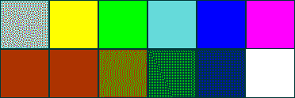
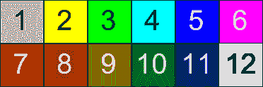

# 第七章. 集中游戏玩法

在简单讨论了资产并设置了我们的 `ResourceManager` 之后，我们将开始构建 *集中* 游戏玩法。我们将讨论输入处理、基本动画和游戏状态。这些都是游戏实现的基础，并且对于使用 Moai SDK 开发的任何大小游戏都将非常有用。

# 网格

我们将要做的第一件事是显示一个瓦片网格，这将是我们玩耍的游乐场。仅为了开始，我们将显示瓦片的背面。

## 瓦片图

游戏开发中常用的一种技术是实现 **瓦片集**。

理念是创建一个包含多个资产的单一图像。

我们将创建一个名为 `tiles.png` 的瓦片集。它由 12 个瓦片组成，11 种不同的颜色（灰色用于瓦片的背面），以及“空瓦片”（白色）。它看起来有点像以下这样：



你应该意识到我们将要做的是创建一个索引如下所示的瓦片图像：



这是将实际图像分成两行和六列的结果。我们将最终拥有十二个 62 x 62 的瓦片。

## 实现

让我们从实现开始：

1.  我们需要创建一个名为 `game.lua` 的文件，它将包含我们游戏玩法的所有代码。

1.  打开它，让我们开始编码。

    ```swift
    module("Game", package.seeall)
    GRID_COLS = 5
    GRID_ROWS = 4
    GRID_TILE_WIDTH = 62
    GRID_TILE_HEIGHT = 62
    BACK_TILE = 1
    ```

1.  这些常量将变得很有用，因为它们定义了网格尺寸（行、列和瓦片大小）。最后一个用于在设置默认网格状态时避免使用魔法数字。正如我们所见，我们将用作瓦片背面的灰色瓦片索引为数字 `1`（因为它在我们瓦片集中是第一个）。

    ```swift
    local resource_definitions = {

      tiles = {
        type = RESOURCE_TYPE_TILED_IMAGE, 
        fileName = 'tiles.png', 
        tileMapSize = {6, 2},
      },

    }
    ```

1.  这现在应该对你来说很熟悉了。为了定义我们的瓦片集，我们将使用我们之前创建的名为 `tiles.png` 的瓦片图像，它有六列和两行。

    ```swift
    function Game:start ()
      -- Do the initial setup
      self:initialize ()

    end
    ```

1.  我们正在创建一个名为 `Game:start()` 的方法，它将负责初始化一切并控制游戏循环。这将在稍后的 `main.lua` 中被调用。现在，我们只会显示初始化时的网格。所以在这里，我们将调用一个名为 `initialize()` 的函数，它将负责所有的实际初始化。我们稍后将在该方法中添加更多代码。

1.  `initialize()` 函数如下：

    ```swift
    function Game:initialize ()

      self.layer = MOAILayer2D.new ()
      self.layer:setViewport ( viewport )
    ```

    1.  我们创建一个层来处理游戏玩法中的所有渲染（包括我们的网格）并配置其视口。

        ```swift
          MOAIRenderMgr.setRenderTable ({ self.layer })
        ```

    1.  然后我们使用该层设置渲染表。

        ```swift
          ResourceDefinitions:setDefinitions (resource_definitions)
        ```

    1.  下一步是使用带有辅助方法 `setDefinitions()` 的 `ResourceDefinitions`。

        ```swift
          self:initializeTiles ()
        ```

    1.  在加载资源定义后，我们调用另一个辅助函数来初始化瓦片。

        ```swift
        end
        ```

    ### 注意

    `setDefinitions()`背后的想法是取一个定义表，并一次性加载所有这些定义，而不是逐个加载。它在前一章中没有创建，但应该很容易实现。只需遍历参数表，并对每个条目调用`setDefinitions()`。请尝试自己实现它。记住，你总是可以下载本书的代码，方法就在那里。

1.  现在我们需要处理`initializeTiles()`：

    ```swift
    function Game:initializeTiles ()

      local grid = MOAIGrid.new ()  
      grid:setSize ( GRID_COLS, GRID_ROWS, 
                     GRID_TILE_WIDTH, GRID_TILE_HEIGHT )
    ```

    1.  首先，我们使用`MOAIGrid`类创建网格。然后我们设置它。我们使用之前定义的网格和瓦片尺寸来配置我们的新`MOAIGrid`。

        ```swift
          grid:setRow ( 1, BACK_TILE, BACK_TILE, 
                           BACK_TILE, BACK_TILE, BACK_TILE )
          grid:setRow ( 2, BACK_TILE, BACK_TILE, 
                           BACK_TILE, BACK_TILE, BACK_TILE )
          grid:setRow ( 3, BACK_TILE, BACK_TILE, 
                           BACK_TILE, BACK_TILE, BACK_TILE )
          grid:setRow ( 4, BACK_TILE, BACK_TILE, 
                           BACK_TILE, BACK_TILE, BACK_TILE ) )
        ```

    1.  现在我们设置实际的网格。我们使用行号作为第一个参数调用`setRow()`方法。（从`1`开始；记住，我们使用 Lua！）以下参数是我们想要显示的每个列的瓦片值。我们将以初始状态在所有网格上显示背面瓦片，这就是为什么我们传递`BACK_TILE`作为瓦片编号的原因。

        ### 小贴士

        好吧，先玩一会儿，改变这些参数的值。（不过第一个参数除外；那是行！）在`2`和`11`之间输入一些数字；你应该会看到灰色海洋上出现一些颜色。

        ```swift
          self.tiles = {}
          self.tiles.grid = grid
          self.tiles.tileset = ResourceManager:get ('tiles')

          self.tiles.prop = MOAIProp2D.new ()
          self.tiles.prop:setDeck ( self.tiles.tileset )
          self.tiles.prop:setGrid ( self.tiles.grid )
        ```

    1.  然后，我们创建一个名为`tiles`的表，并将瓦片集存储在那里，以及一个新的属性。属性的使用基本上与我们之前做的一样；唯一的区别是我们现在使用`setGrid()`来使属性跟随网格的大小和配置。

        ```swift
         self.tiles.prop:setLoc ( - GRID_COLS/2 * GRID_TILE_WIDTH,
                                 - GRID_ROWS/2 * GRID_TILE_HEIGHT )
        ```

    1.  由于网格不会在其元素上居中（它们只是从偏移量绘制它们），我们需要自己居中它们。在这种情况下，`(0,0)`位于属性的左下角（而不是中间）。我们需要偏移它，这就是我们通过调用`setLoc()`方法来做的；我们通过瓦片的宽度的一半（在*x*轴上）和瓦片高度的一半（在*y*轴上）移动它。

        ### 小贴士

        Moai SDK 有一系列处理位置、旋转和缩放的方法。有三个系列，即`set*`方法（强制设置特定值）、`move*`方法（通过在一段时间内应用增量生成动画）和`seek*`方法（通过在一段时间内从实际值到指定值生成动画）。要修改位置，使用`Loc`，旋转使用`Rot`，缩放使用`Scl`。所以，例如，如果你想将`tiles`属性在 10 秒内旋转 30 度，你会调用`self.tiles.prop:moveRot(30, 10)`。

        这些方法还有一些其他内容（比如它们用来插值值的曲线）；你应该在[`getmoai.com/docs/class_m_o_a_i_transform2_d.html`](http://getmoai.com/docs/class_m_o_a_i_transform2_d.html)上查看它们。

        ```swift
          self.layer:insertProp ( self.tiles.prop )
        end
        ```

    1.  我们将属性添加到层中，然后就可以完成了。

1.  剩下的唯一一件事就是从`main.lua`中调用这个函数。在视口定义下方添加以下代码：

    ```swift
      function mainLoop ()
        Game:start ()
      end
      gameThread = MOAICoroutine.new ()
      gameThread:run ( mainLoop )
    ```

我们将在一个单独的 Lua 协程中运行我们的游戏；这样做是为了允许它有一个与主协程流程分离的游戏循环。这将便于处理输入。

这就足够了；如果你现在运行项目，你应该能看到带有所有 20 个背面瓷砖的网格。

# 输入

我们旅程的下一步是添加输入处理。我们必须创建一个名为`input_manager.lua`的文件；它将负责监听输入事件，并在需要时被我们的游戏查询。我们将创建它，使其可以与鼠标设备和触摸屏一起使用。

### 注意

一般而言，所有主机都应该实现它们自己的输入模式。在这本书中，我们不会详细看到这一点，但为了您理解这从何而来，请查看随 Moai SDK 一起提供的宿主。

在`moai-sdk/hosts/src/GlutHost.cpp`中搜索所有对`AKUReserveInputDevice*`和`AKUSetInputDevice*`方法调用的引用。

我们现在将检查最重要的方法；请查看完整的代码以了解一切是如何结合在一起的。

```swift
function InputManager:initialize ()

  if MOAIInputMgr.device.pointer then

  local pointerCallback = function ( x, y )
    previousX, previousY = pointerX, pointerY
    pointerX, pointerY = x, y

    if touchCallbackFunc then
      touchCallbackFunc ( MOAITouchSensor.TOUCH_MOVE, 1,
        pointerX, pointerY, 1 )
    end
  end

  MOAIInputMgr.device.pointer:setCallback ( pointerCallback )

end
```

如您所见，此方法检查我们是否有指针，如果有，它将创建一个回调函数（`pointerCallback`），并将其传递给该指针以更新`x`和`y`位置。它还会与触摸传感器（`MOAITouchSensor`）通信，以便在不是使用鼠标而是触摸屏的情况下执行相同的操作。

此外，另一个重要的方法是`isDown()`，它用于知道我们是否在点击或触摸屏幕。

```swift
function InputManager:isDown ()

  if MOAIInputMgr.device.touch then

    return MOAIInputMgr.device.touch:isDown ()

  elseif MOAIInputMgr.device.pointer then

    return (
      MOAIInputMgr.device.mouseLeft:isDown ()
    )
  end
end
```

此方法正在查询鼠标和触摸传感器，询问我们是否在点击或触摸。我们将在游戏循环中使用此方法来识别输入。请记住，在`main.lua`中的`require 'resource_manager'`语句之后包含此文件。

# 游戏玩法

现在，让我们看看实现游戏玩法所需的元素。首先，我们需要创建游戏状态的所有结构（并初始化它们）。我们将使用另一个网格，这次用来存储数字的随机分布。

## 初始化

1.  在`Game:initialize()`方法的底部添加对辅助函数的调用。

    ```swift
      self:restartGamePlay ()
    ```

1.  还要添加辅助函数。

    ```swift
    function Game:restartGamePlay ()
      self.distributionGrid = MOAIGrid.new ()
      self.distributionGrid:setSize (GRID_COLS, GRID_ROWS)
    ```

    1.  首先，我们创建一个网格，它将持有我们颜色的分布。这个网格也有一个 5 x 4 的维度。请注意，我们现在不需要设置瓷砖大小，因为这个网格不会被渲染。

        ```swift
          local tiles = {
            2, 2, 3, 3, 4, 4, 5, 5, 6, 6, 
            7, 7, 8, 8, 9, 9, 10, 10, 11, 11
          }
        ```

    1.  这个表只是一个临时瓷砖数组；如您所见，我们从`2`开始（记住，`1`是背面瓷砖），每个数字重复两次。这些数字代表我们的瓷砖集中的颜色（或瓷砖偏移量）。

        ```swift
            for x=1, GRID_COLS, 1 do
              for y=1, GRID_ROWS, 1 do
                local random =  math.random ( 1, #tiles )
                local value = tiles[random]
                table.remove ( tiles, random )
                self.distributionGrid:setTile ( x, y, value )
              end
            end
        ```

    1.  下一步我们要做的是遍历所有的网格单元，随机地将其中一个值分配给`tiles`表，并从表中移除它，这样它就不会被选中超过一次。通过这种方式，我们以随机顺序填充了`distributionGrid`中的颜色对。

        ```swift
          self.selectedCells = { nil, nil } 
        end
        ```

    1.  下一步我们需要的是一个地方来存储当前回合中选中的单元格。我们将使用一个名为`selectedCells`的表，并且它将显示两个`nil`单元格，因为我们还没有选择任何东西。

游戏初始化部分到此结束。

## 输入处理

现在我们需要处理用户的输入。

1.  我们需要在`Game:start ()`方法中添加一些代码（在调用`Game:initialize ()`之后）：

    ```swift
     self.wasClicking = false

    ```

    1.  我们想知道在之前的模拟步骤中，用户是否在点击或轻触屏幕。我们将该信息存储在`wasClicking`中。

        ```swift
          while (true) do
            self:processInput ()
            coroutine.yield ()
          end 
        ```

    1.  然后我们添加一个无限循环（注意算法！）来*处理输入*并使用神奇的方法`coroutine.yield()`，该方法将流程委托给主程序，允许`MOAISim`进行另一个模拟步骤。这样，我们避免了无限循环而使游戏冻结。相反，我们完成所有的渲染、动作树和节点图处理；当所有这些都完成时，它回到我们的协程再次处理输入。

        ### 小贴士

        如果你期望你的游戏更新屏幕（渲染）但它没有这样做，那么很可能是你忘记运行`coroutine.yield()`来允许在继续代码之前进行渲染。例如，考虑加载屏幕。

1.  现在我们将处理下一个方法，即实际处理输入的方法。

    ```swift
    function Game:processInput ()
      if InputManager:isDown () and not self.wasClicking then
    ```

    1.  如果玩家现在正在点击，而在之前的模拟步骤中没有点击（为了避免在按住鼠标按钮时多次选择），我们想要选择一个方块。

        ```swift
            x, y = InputManager:position ()
        ```

    1.  我们选择方块的方式是一个相当巧妙的技巧。我们收集表示在窗口坐标系中的鼠标位置。

        ```swift
            worldX, worldY = self.layer:wndToWorld ( x, y )
            modelX, modelY = self.tiles.prop:worldToModel ( worldX, worldY )
        ```

    1.  我们需要将它们转换为模型坐标，通过首先将它们转换为世界坐标（通过层）来完成我们的技巧。在这些转换之后，我们在`modelX`和`modelY`中得到的是从网格左下角开始的像素偏移。

        ```swift
          cellColumn = math.floor ( modelX / GRID_TILE_WIDTH ) + 1
          cellRow = math.floor ( modelY / GRID_TILE_HEIGHT ) + 1
        ```

    1.  如果我们将`modelX`和`modelY`除以单元格的尺寸，我们将得到单元格的列和行索引。这是很棒的*数学魔法*。现在只需要调用一个辅助函数，该函数将处理点击的后果：

        ```swift
            self:choseCell ( cellColumn, cellRow )
          end

          self.wasClicking = InputManager:isDown ()

        end
        ```

    1.  哦！别忘了更新`wasClicking`。我们需要在它上面存储`InputManager:isDown ()`的值，因为我们将在下一个模拟步骤中使用它。

## 选择单元格

现在我们必须实现以下单元格选择方法：

```swift
function Game:choseCell ( column, row )

  if not self.selectedCells[1] then
```

1.  如果之前没有选中任何单元格（第一个是 nil），我们必须选中它。

    ```swift
        if not self:alreadySelectedTile ( column, row ) then
    ```

1.  我们始终需要检查我们点击的单元格是否没有被从游戏中移除。

    ```swift
          self.selectedCells[1] = {column, row}
    ```

1.  我们将选中的单元格的列和行放入`selectedCells`表中。

    ```swift
          self:swapTile ( column, row )
    ```

1.  然后我们交换它以显示其颜色。

    ```swift
        end
      else
    ```

1.  如果之前已经选中了方块，我们继续处理该情况。

    ```swift
        if (self.selectedCells[1][1] == column) and (self.selectedCells[1][2] == row) then
          self.selectedCells[2] = {column, row}
          self:resetTiles ()
    ```

1.  如果玩家点击了相同的方块，我们希望将其换回。将相同的方块设置为第二个选中的单元格（`selectedCells[2]`）并重置它们。

    ```swift
        else

          if not self:alreadySelectedTile ( column, row ) then
    ```

1.  记住检查我们点击的单元格是否没有被从游戏中移除。

    ```swift
            self.selectedCells[2] = {column, row}
            self:swapTile ( column, row )
    ```

1.  同样的逻辑也应用于此处以选择单元格并交换它。（哦，不！代码重复！）

1.  现在是游戏的核心：

    ```swift
            local value1 = self.distributionGrid:getTile (
                             unpack(self.selectedCells[1]) )

            local value2 = self.distributionGrid:getTile (
                             unpack(self.selectedCells[2]) )
    ```

1.  我们收集这两个值并将它们分别存储在 `value1` 和 `value2` 中。这些变量包含用户所选瓷砖的颜色。

    ```swift
            if (value1 == value2) then
              self:removeTiles ()
    ```

1.  如果颜色相同，我们移除瓷砖。

    ```swift
            else
              self:resetTiles ()
    ```

1.  如果它们不同，我们将它们交换回来。就这样。

    ```swift
            end
          end
        end
      end
    end
    ```

在一段美好的 `end` 句尾之后，我们准备实现辅助方法。

## 瓷砖交换

为了交换我们的瓷砖，我们将创建以下 `swapTile ()` 方法：

```swift
function Game:swapTile ( column, row )
  local value = self.distributionGrid:getTile ( column, row )
  self.tiles.grid:setTile ( column, row, value )
end
```

我们在这里做的是从我们的 `distributrionGrid` 中检索颜色值并将其设置到渲染网格中。这真的很神奇；你不爱它吗？

结果是瓷砖的颜色根据我们的 `distributionGrid` 上的分布而改变。

每个分布都是随机的，所以每次你玩的时候都会不同。

## 重置瓷砖

1.  我们需要在 `game.lua` 的顶部添加两个更多常量，用于下一个方法（我们将使用这些常量来避免魔法数字）：

    ```swift
    EMPTY_TILE = 12
    ```

    `EMPTY_TILE` 是我们在所有瓷砖之后剩下的空白空间；我们将用它来移除不在游戏中的瓷砖。这是索引 `12`。

    ```swift
    DELAY_TIME = 0.5
    ```

    `DELAY_TIME` 是我们将用来延迟瓷砖交换回的时间（秒），以便用户可以看到他选择的第二种颜色。（实际上，在完成章节后将其更改为零并看看会发生什么）。

1.  现在，我们创建我们的 `resetTiles ()` 方法：

    ```swift
    function Game:resetTiles ()  
      sleepCoroutine(DELAY_TIME)
    ```

    1.  我们在 `DELAY_TIME` 秒内冻结协程。我们将在以下代码片段中实现 `sleepCoroutine`：

        ```swift
          self.tiles.grid:setTile (
            self.selectedCells[1][1], 
            self.selectedCells[1][2], BACK_TILE )

          self.tiles.grid:setTile (
            self.selectedCells[2][1], 
            self.selectedCells[2][2], BACK_TILE )
        ```

    1.  这个可能看起来有点棘手，但我们所做的是告诉我们的渲染网格，`selectedCells` 中的单元格应该渲染 `BACK_TILE`。我们使用每个选中单元格的坐标并将它们传递给 `setTile` 作为前两个参数。第三个是颜色，所以我们使用 `BACK_TILE`。

        ```swift
          self.selectedCells = {}
        ```

    1.  我们清除选中的单元格以重新开始。

        ```swift
        end
        ```

就这些了。现在我们需要注意移除瓷砖。

## 移除瓷砖

以下方法将用于移除相等的瓷砖并正确地交换用户。

```swift
function Game:removeTiles ()
  sleepCoroutine ( DELAY_TIME )

  self.tiles.grid:setTile ( self.selectedCells[1][1], self.selectedCells[1][2], EMPTY_TILE )
  self.tiles.grid:setTile ( self.selectedCells[2][1], self.selectedCells[2][2], EMPTY_TILE )
```

1.  这与我们在重置瓷砖时所做的非常相似。唯一的区别是，我们在这里使用 `EMPTY_TILE` 常量来使瓷砖消失。

    ```swift
      self.selectedCells = {}
    ```

1.  我们清除选中的单元格以重新开始。

    ```swift
    end
    ```

## 其他辅助方法

还有两个辅助方法待定；一个用于检查瓷砖是否已经被从游戏中移除，另一个用于使协程休眠。所以，它们就在这里：

```swift
function Game:alreadySelectedTile ( column, row )
  return self.tiles.grid:getTile ( column, row ) == EMPTY_TILE
end
```

1.  此方法用于确定我们是否移除了给定的瓷砖。基本上，我们将其颜色值与 `EMPTY_TILE` 进行比较。如果它们相等，则该瓷砖之前已被移除。

1.  现在是奇怪（但极其有用）的一个：

    ```swift
    function sleepCoroutine (time)
      local timer = MOAITimer.new ()
      timer:setSpan ( time )
      timer:start()
      MOAICoroutine.blockOnAction ( timer )
    end
    ```

在这种方法中，我们所做的是冻结给定时间的协程。我们使用`MOAITimer`来实现这一点。这里的魔法在于定时器继承自`MOAIAction`，因此我们可以使用内置的`MOAICoroutine.blockOnAction()`方法，它基本上会等待动作完成，然后继续在当前线程上执行。

### 小贴士

这是一个重要的方法，您很快就会看到。它用于在 Moai SDK 中创建动画序列，当您需要在另一个动作开始之前等待一个动作完成时（例如，按顺序而不是并行执行一个平移和一个旋转）。

好吧，游戏基本上已经准备好可以玩了。显然，您需要添加一些东西才能使其成为可以发布的游戏（例如，胜利条件、一个漂亮的菜单、一个滴答作响的时钟等等），但游戏玩法已经到位，这正是我们所寻找的。

# 摘要

在本章中，我们学习了如何使用网格在屏幕上显示瓦片，以及如何表示游戏数据。我们学习了输入处理的基础知识以及如何实现*专注力*的实际游戏玩法。我们还首次了解了 Moai SDK 如何使用协程。现在是一个休息的好时机，因为接下来的章节内容丰富；我们将构建一个使用 Box2D 进行物理运算的平台游戏原型！
