# 第三章：使用 XAML 进行用户界面设计

在上一章中，我们创建了一个名为 `PassXYZ.Vault` 的新 .NET MAUI 项目。随着我们阅读本书的进展，我们将使用所获得的技术和知识对其进行增强。在上一章中，我们简要了解了 XAML 中用户界面的实现。在本章中，我们将更深入地探讨使用 XAML 创建用户界面。

**可扩展应用程序标记语言 (XAML)** 是一种基于 XML 的语言，用于定义 **Windows Presentation Foundation (WPF)**、**通用 Windows 平台 (UWP)**、Xamarin.Forms 和 .NET MAUI 的用户界面。这些平台中的 XAML 语法相同，但词汇不同。

XAML 允许开发者在基于 XML 的 *标记语言* 中而不是任何 *编程语言* 中定义用户界面。我们可以在代码中编写所有用户界面，但使用 XAML 进行用户界面设计将更加简洁且视觉上更连贯。由于 XAML 不使用编程语言，因此它不能包含代码。这是一个缺点，但也是一个优点，因为它迫使开发者将逻辑与用户界面设计分离。

本章将涵盖以下主题：

+   如何创建 XAML 页面

+   基本 XAML 语法

+   XAML 标记扩展

+   如何使用主-详细信息模式设计用户界面

+   .NET MAUI 应用的本地化

# 技术要求

要测试和调试本章中的源代码，您需要在您的电脑上安装 Visual Studio 2022。请参阅 *第一章*，*开始使用 .NET MAUI* 中的 *开发环境设置* 部分，以获取详细信息。

本章的源代码可在以下 GitHub 仓库中找到：

[`github.com/PacktPublishing/.NET-MAUI-Cross-Platform-Application-Development-Second-edition/tree/2nd/chapter03`](https://github.com/PacktPublishing/.NET-MAUI-Cross-Platform-Application-Development-Second-edition/tree/2nd/chapter03)

要查看本章的源代码，我们可以使用以下命令：

```swift
$ git clone -b 2nd/chapter03 https://github.com/PacktPublishing/.NET-MAUI-Cross-Platform-Application-Development-Second-edition.git PassXYZ.Vault2 
```

要了解更多关于本书中源代码的信息，请参阅 *第二章*，*构建我们的第一个 .NET MAUI 应用* 中的 *管理本书中的源代码* 部分。

# 创建 XAML 页面

在我们深入探讨 XAML 语法之前，让我们首先了解如何在 Visual Studio 中以及通过 **dotnet** 命令行创建 XAML 页面。

要使用 Visual Studio 创建 XAML 页面，请右键单击项目节点，然后选择 **添加 > 新项…**。这将弹出如图 3.1 所示的对话框：

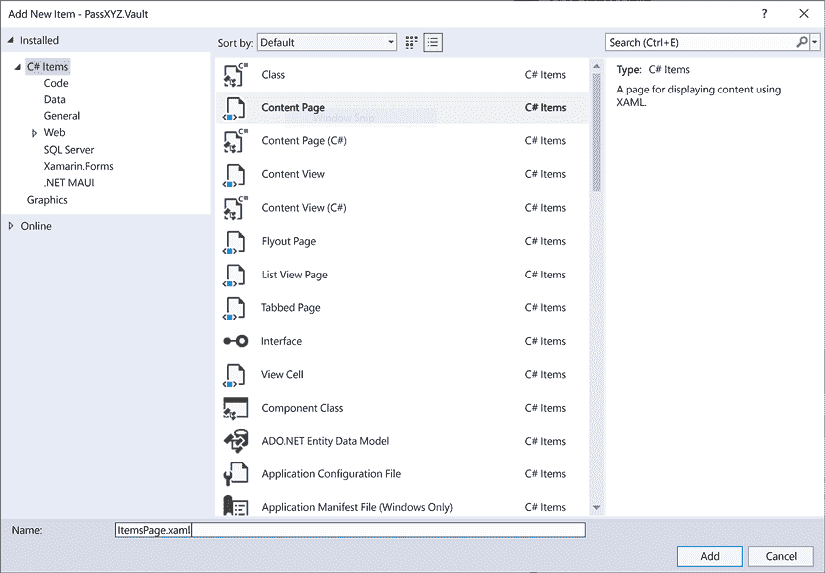

图 3.1：添加 XAML 页面

在此屏幕上，从模板中选择 **内容页面** 并点击 **添加**。此操作将生成一对文件——一个 XAML 文件和一个 C# 后置代码文件。

同样可以使用 `dotnet` 命令实现。为了定位所有 .NET MAUI 模板，我们可以在 PowerShell 控制台中使用以下 `dotnet` 命令：

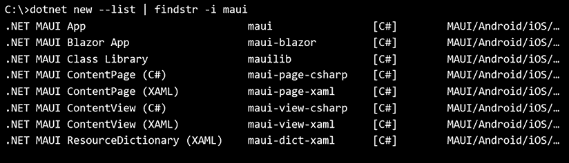

图 3.2：列出模板的 dotnet 命令

从前面的输出中，我们可以观察到 XAML 内容页的短名为 `maui-page-xaml`。我们可以使用以下命令创建一个 XAML 页面：

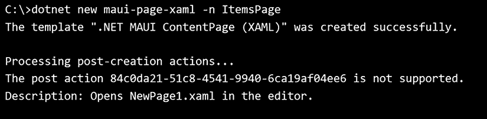

图 3.3：创建 XAML 页面

前一个命令将生成两个名为 `ItemsPage.xaml` 和 `ItemsPage.xaml.cs` 的文件。你可能注意到了关于创建后操作的警告信息。这是一个已知问题，你可以在[`github.com/dotnet/maui/issues/4994`](https://github.com/dotnet/maui/issues/4994)找到更多关于它的信息。

然而，这并不是我们需要担心的事情。

**什么是“后台代码”？**

在 .NET MAUI 中，术语 **后台代码** 指的是与 **用户界面（UI）** 定义文件关联的代码文件，通常是 XAML 文件。后台代码文件包含处理 UI 事件、数据绑定和其他与 UI 相关的应用功能逻辑。后台代码文件是与相关 XAML 文件同名的 C# (.cs) 文件。例如，如果我们有一个 `ItemsPage.xaml` 文件，后台代码文件将被命名为 `ItemsPage.xaml.cs`。

后台代码文件包含一个从 .NET MAUI 基础页面类型继承的类，通常是 `ContentPage`、`NavigationPage` 或 `TabbedPage`。类声明被标记为与 XAML 文件中的类定义匹配的部分类，这允许 XAML UI 定义与其对应的代码无缝集成。

# XAML 语法

由于 XAML 是一种基于 XML 的语言，为了更好地理解它，我们首先需要了解基本的 XML 语法。在 XML 文件中，它以一个 XML 声明或序言开始。XML 或 XAML 文件的内容包括一系列元素。每个元素都可能与其关联一些属性。

让我们以我们在 *第二章* 中创建的项目为例，回顾 `App.xaml`，作为例子：

```swift
<?xml version = "1.0" encoding = "UTF-8" ?>
<Application 
  xmlns="http://schemas.microsoft.com/dotnet/2021/maui"
  xmlns:x="http://schemas.microsoft.com/winfx/2009/xaml"
  xmlns:local="clr-namespace:PassXYZ.Vault"
  x:Class="PassXYZ.Vault.App">
    <Application.Resources>
      <ResourceDictionary.MergedDictionaries>
        <ResourceDictionary Source="…/Colors.xaml" />
        <ResourceDictionary Source="…/Styles.xaml" />
      </ResourceDictionary.MergedDictionaries>
    </Application.Resources>
</Application> 
```

列表 3.1: `App.xaml` ([`epa.ms/App3-1`](https://epa.ms/App3-1))

## XML 声明

在 `App.xaml` 的开头，我们可以看到以下 XML 声明：

```swift
<?xml version = "1.0" encoding = "UTF-8" ?> 
```

这个声明指定了正在使用的 XML 版本和字符编码。在 `App.xaml` 中，使用了 XML 版本 1.0，并将字符编码设置为 UTF-8。

## 元素

在 *Listing 3.1* 中，`App.xaml` 的内容从 `Application` 根元素开始。每个 XML 文档必须包含一个根元素，它包含所有其他元素。元素可以有子元素，也称为嵌套元素，例如 `ResourceDictionary`。

元素由开始标签、内容和结束标签组成，如 `Application` 标签所示：

```swift
<Application>
…
</Application> 
```

开始标签被括号（例如，`<Application>`）包围，结束标签在元素名称之前包含一个反斜杠（例如，`</Application>`）。内容可以是任何文本或嵌套元素。

对于空元素，可以在开始标签的末尾添加一个反斜杠来省略结束标签，如下所示：

```swift
<Application /> 
```

讨论 XML 元素时，我们可能会使用术语 **元素**、**节点** 和 **标签**。**元素**指的是该元素的开始和结束标签一起。**标签**指的是元素的开始或结束标签。**节点**指的是一个元素及其所有内部内容，包括所有子元素。

一个 XAML 文档由许多嵌套元素组成，只有一个顶级元素，称为根元素。在 .NET MAUI 中，根元素通常是 `Application`、`ContentPage`、`Shell` 或 `ResourceDictionary`。

对于每个 XAML 文件，我们通常都有一个对应的 C# 代码隐藏文件。让我们回顾一下 *清单 3.2* 中的代码隐藏文件：

```swift
using PassXYZ.Vault.Services;
using PassXYZ.Vault.Views;
namespace PassXYZ.Vault;
public partial class App : Application                             //(1)
{
  public App() 
  {
    InitializeComponent();                                         //(2)
    MainPage = new AppShell();
  }
} 
```

清单 3.2: `App.xaml.cs` ([`epa.ms/App3-2`](https://epa.ms/App3-2))

在 XAML 中，元素通常代表实际在运行时实例化的 C# 类。XAML 和代码隐藏文件一起定义了一个完整的类。例如，`App.xaml` (*清单 3.1*) 和 `App.xaml.cs` (*清单 3.2*) 定义了 `App` 类，它是 `Application` 的子类。

**(1**) `App` 类的全名是 `PassXYZ.Vault.App`，与使用 `x:Class` 属性在 XAML 文件中定义的相同：

```swift
x:Class="PassXYZ.Vault.App" 
```

**(2**) 在 `App` 类的构造函数中，调用 `InitializeComponent` 方法来加载 XAML 并解析它。此时创建 XAML 文件中定义的 UI 元素。我们可以通过 `x:Name` 属性定义的名称访问这些 UI 元素，正如我们很快将看到的。

## 属性

一个元素可以有多个唯一的属性。属性提供了关于 XML 元素额外信息。XML 属性是一个附加到元素上的名称-值对。在 XAML 中，一个元素代表一个 C# 类，而属性代表这个类的成员：

```swift
<Button x:Name="loginButton" VerticalOptions="Center"
IsEnabled="True" Text="Login"/> 
```

如上所示，为 `Button` 元素定义了四个属性 – `x:Name`、`VerticalOptions`、`IsEnabled` 和 `Text`。要定义一个属性，我们需要使用等号指定属性名称和值。属性值应使用双引号或单引号括起来。例如，`IsEnabled` 是属性名称，`"True"` 是属性值。

在这个例子中，`x:Name` 属性是一个特殊的属性。它并不指向 `Button` 类的成员，而是指向持有 `Button` 类实例的变量。如果没有 `x:Name` 属性，将创建一个匿名的 `Button` 类实例。声明了 `x:Name` 属性后，我们可以通过代码隐藏文件中的 `loginButton` 变量来引用 `Button` 类的实例。

## XML 和 XAML 命名空间

在 XML 或 XAML 中，我们可以像在 C# 中一样声明命名空间。命名空间有助于将元素和属性分组，以避免在不同作用域中使用相同名称时的名称冲突。命名空间可以使用 `xmlns` 属性和以下语法定义：

XAML 命名空间定义有两个组成部分：一个前缀和一个标识符。前缀和标识符可以是任何字符串，这由 XML 1.0 规范中允许的 W3C 命名空间所决定。如果省略前缀，则命名空间成为默认命名空间。

在 *清单 3.1* 中，以下命名空间是默认的：

这个默认命名空间允许我们无需前缀即可引用 .NET MAUI 类，例如 `ContentPage`、`Label` 或 `Button`。

对于命名空间声明，使用前缀 `x`，如下所示：

`xmlns:x` 命名空间声明指定了 XAML 内在的元素和属性。这是我们将在使用 XAML 进行 UI 设计时使用的重要命名空间之一。为了理解其用法，我们可以在后续章节中使用 C# 和 XAML 创建具有相同结构的相同内容页面。

## 使用 XAML 创建一个新的页面

首先，让我们使用 XAML 创建一个新的页面。要创建 XAML 中的内容页面，我们可以使用 `dotnet` 命令，就像我们之前做的那样：

```swift
dotnet new maui-page-xaml -n NewPage1
The template ".NET MAUI ContentPage (XAML)" was created successfully.
Processing post-creation actions...
The post action 84c0da21-51c8-4541-9940-6ca19af04ee6 is not supported.
Description: Opens NewPage1.xaml in the editor. 
```

前面的命令生成了一个 XAML 文件 (`NewPage1.xaml`) 和一个 C# 代码隐藏文件 (`NewPage1.xaml.cs`)。我们可以更新 XAML 文件，如下所示。由于我们未添加任何逻辑，我们可以忽略此示例中的代码隐藏文件 (`NewPage1.xaml.cs`)：

`NewPage1.xaml`

```swift
<ContentPage
  xmlns="http://schemas.microsoft.com/dotnet/2021/maui"
  xmlns:x="http://schemas.microsoft.com/winfx/2009/xaml"
  x:Class="MauiApp1.NewPage1"                                    //(1)
  Title="NewPage1">
  <StackLayout x:Name="layout">                                  //(2)
    <Label Text="Welcome to .NET MAUI!"
      VerticalOptions="Center"
      HorizontalOptions="Center" />
    <BoxView HeightRequest="150" WidthRequest="150"
      HorizontalOptions="Center">
      <BoxView.Color>
        <Color x:FactoryMethod="FromRgba">                      //(3)
          <x:Arguments>                                         //(4)
            <x:Int32>192</x:Int32>                              //(5)
            <x:Int32>75</x:Int32>
            <x:Int32>150</x:Int32>
            <x:Int32>128</x:Int32>
          </x:Arguments>
        </Color>
      </BoxView.Color>
    </BoxView>
  </StackLayout>
</ContentPage> 
```

`NewPage1.xaml.cs`

```swift
namespace MauiApp1;
public partial class NewPage1 : ContentPage {
  public NewPage1() {
    InitializeComponent();
  }
} 
```

为了与刚刚创建的 XAML 版本进行比较，让我们在下一节中仅使用 C# 创建相同的内容页面。然后我们将查看前面代码中编号的行。

### 使用 C# 创建相同的新的页面

要仅使用 C# 代码创建相同的内容页面，请使用以下命令：

```swift
dotnet new maui-page-csharp -n NewPage1
The template ".NET MAUI ContentPage (C#)" was created successfully.
Processing post-creation actions...
The post action 84c0da21-51c8-4541-9940-6ca19af04ee6 is not supported.
Description: Opens NewPage1.cs in the editor. 
```

前面的命令在 `NewPage1.cs` C# 文件中生成一个内容页面。我们可以在 C# 中像这样实现相同的逻辑：

`NewPage1.cs`

```swift
namespace MauiApp1;
public class NewPage1 : ContentPage {                        //[1]
  public NewPage1() {
    var layout = new StackLayout                             //[2]
    {
      Children = {
        new Label { Text = "Welcome to .NET MAUI!" },
        new BoxView {
          HeightRequest = 150,
          WidthRequest = 150,
          HorizontalOptions = LayoutOptions.Center,
          Color = Color.FromRgba(192, 75, 150, 128)          //[3]
        }
      }
    };
    Content = layout;
  }
} 
```

在这里，我们在 XAML 和 C# 中都创建了相同的内容页面 (`NewPage1`) 两次。XAML 不能包含编程逻辑，但它可以用来声明用户界面元素，并将逻辑放在 C# 代码隐藏文件中。在 `NewPage1` 的两个版本中，我们创建了一个包含 `Label` 和 `BoxView` 元素的内容页面。在 XAML 版本中，我们使用了 `xmlns:x` 命名空间中定义的属性来指定 UI 元素：

**(1)** 在 XAML 中创建了一个名为 `NewPage1` 的内容页面。`x:Class` 属性指定了类名——即 `NewPage1`。在 C# 代码隐藏文件中，定义了一个 `NewPage1` 的部分类。在构造函数中，调用 `InitializeComponent` 方法来加载 XAML 中定义的 UI。

**[1]** 我们可以直接使用 C# 并作为 `ContentPage` 的派生类来创建相同的内容页面 `NewPage1`。

我们在内容页面中定义了一个 `StackLayout`，并且用于引用它的变量名在 XAML 和 C# 版本中都是 `layout`：

**(2)** 在 XAML 中，`x:Name` 指定了 `StackLayout` 的变量名。

**[2]** 在 C# 中，我们可以将变量声明为 `layout`。

**(3)** `x:FactoryMethod` 指定了一个可以用来初始化对象的工厂方法。

**[3]** 在 C# 代码中，我们可以直接调用 `Color.FromRgba` 函数，但在 XAML 中我们必须使用 `x:FactoryMethod` 属性来完成同样的操作。

**(4)** `x:Arguments` 用于在 XAML 中调用 `Color.FromRgba` 时指定参数。

**(5)** `x:Int` 用于指定整数参数。对于其他数据类型，我们可以使用 `x:Double`、`xChar` 或 `x:Boolean`。

有关 `xmlns:x` 命名空间的更多信息，请参阅 Microsoft 文档：[`learn.microsoft.com/en-us/dotnet/maui/xaml/namespaces/`](https://learn.microsoft.com/en-us/dotnet/maui/xaml/namespaces/)。

**公共语言运行时 (CLR) 类型可以通过声明带有前缀的 XAML 命名空间在 XAML 中引用。如 *清单 3.1* 所示，我们可以像这样引用我们的 C# 命名空间 `PassXYZ.Vault`：

```swift
xmlns:local="clr-namespace:PassXYZ.Vault" 
```

要声明 CLR 命名空间，我们可以使用 `clr-namespace:` 或 `using:`。如果 CLR 命名空间定义在不同的程序集，则使用 `assembly=` 来指定包含引用 CLR 命名空间的程序集。值是程序集的名称，不带文件扩展名。在我们的例子中，它已被省略，因为 `PassXYZ.Vault` 命名空间位于我们的应用程序代码相同的程序集中。

我们将在本章的后面部分看到更多命名空间的使用。

# XAML 标记扩展

尽管我们可以使用 XAML 元素初始化类实例，并使用 XAML 属性设置类成员，但我们只能将它们设置为 XAML 文档中的预定义常量。

为了通过允许从各种来源设置元素属性来增强 XAML 的功能和灵活性，我们可以使用 XAML 标记扩展。使用 XAML 标记扩展，我们可以将属性设置为在别处定义的值，或者是在运行时由代码处理的结果。

XAML 标记扩展可以指定在大括号中，如下所示：

```swift
<Button Margin="0,10,0,0" Text="Learn more"
        Command="{Binding OpenWebCommand}"
        BackgroundColor="{DynamicResource PrimaryColor}"
        TextColor="White" /> 
```

在前面的代码中，`BackgroundColor` 和 `Command` 属性都已设置为标记扩展。`BackgroundColor` 已设置为 `DynamicResource`，而 `Command` 已设置为在视图模型中定义的 `OpenWebCommand` 方法。

在这里，我们提供了对标记扩展的简要介绍，所以现在不必担心标记扩展的用法。当我们稍后使用它们时，我们将更深入地探讨标记扩展。在下一章，*第四章*，*探索 MVVM 和数据绑定*中，我们将详细说明数据绑定的用法。

请参考以下 Microsoft 文档以获取有关标记扩展的更多信息：[`learn.microsoft.com/en-us/dotnet/maui/xaml/markup-extensions/consume`](https://learn.microsoft.com/en-us/dotnet/maui/xaml/markup-extensions/consume)。

现在我们已经了解了 XAML 的基础知识，我们可以用它来工作于我们的用户界面设计。

# 构建用户界面

在具备基本的 XAML 知识后，让我们从宏观的角度看一下 .NET MAUI 用户界面构建块。随着我们在后续章节中遇到它们，我们将更深入地探讨它们。

页面是顶级用户界面元素，通常占据所有屏幕或窗口。我们在本章开头介绍了如何使用 Visual Studio 模板或 `dotnet` 命令创建页面。每个页面通常至少包含一个布局元素，用于组织页面上的控件设计。页面的例子包括 `ContentPage`、`NavigationPage`、`TabbedPage`、`FlyoutPage` 和 `Shell`。

在内容页面中，我们利用视图（或控件）作为用户界面的构建块。为了将视图组织成组，我们可以使用布局组件作为视图的容器。

## 布局

**布局**是容器组件，有助于在您的应用中组织和排列 UI 元素（或视图）。它们根据特定规则控制 UI 组件的位置、大小和对齐。

布局允许您创建一致且适应不同屏幕尺寸和设备方向的用户界面。例子包括 `StackLayout`、`Grid`、`FlexLayout`、`RelativeLayout` 和 `AbsoluteLayout`。

### StackLayout

`StackLayout` 以一维堆栈的形式组织元素，无论是水平还是垂直。它通常用作父布局，包含其他子布局。默认方向是垂直。然而，我们不应使用嵌套的 `StackLayout` 水平和垂直地生成类似于表格的布局。以下代码展示了不良实践的例子：

```swift
<StackLayout>
    <StackLayout Orientation="Horizontal">
        <Label Text="Name:" />
        <Entry Placeholder="Enter your name" />
    </StackLayout>
    <StackLayout Orientation="Horizontal">
        <Label Text="Age:" />
        <Entry Placeholder="Enter your age" />
    </StackLayout>
    <StackLayout Orientation="Horizontal">
        <Label Text="Address:" />
        <Entry Placeholder="Enter your address" />
    </StackLayout>
</StackLayout> 
```

在前面的代码中，我们使用了一个默认方向为垂直的 `StackLayout` 作为父布局。然后，我们嵌套了多个具有水平方向的 `StackLayout` 控件，以生成数据输入表单。

然而，使用嵌套的 `StackLayout` 创建类似于表格的布局并不优化此类场景，并且可能会导致性能和布局问题。在这种情况下，我们应该使用 `Grid` 控件。

`StackLayout` 是一个常用的布局控件。`StackLayout` 有两种子类型，帮助我们直接水平或垂直设计布局。

#### HorizontalStackLayout

`HorizontalStackLayout` 是一个一维的水平堆栈。例如，我们可以生成如下行：

```swift
 <HorizontalStackLayout>
        <Label Text="Name:" />
        <Entry Placeholder="Enter your name" />
    </HorizontalStackLayout> 
```

#### VerticalStackLayout

`VerticalStackLayout` 是一个一维的垂直堆栈。例如，我们可以在表单提交后显示错误信息，如下所示：

```swift
<VerticalStackLayout>
  <Label Text="The Form Is Invalid" />
  <Button Text="OK"/>
</VerticalStackLayout> 
```

### Grid

`Grid` 以行和列的形式组织元素。我们可以使用 `RowDefinitions` 和 `ColumnDefinitions` 属性来指定行和列。在先前的例子中，我们创建了一个表单，用户可以使用嵌套的 `StackLayout` 输入他们的姓名、年龄和地址。我们可以在 `Grid` 布局中这样做：

```swift
<Grid>
    <Grid.RowDefinitions>
        <RowDefinition Height="50" />
        <RowDefinition Height="50" />
        <RowDefinition Height="50" />
    </Grid.RowDefinitions>
    <Grid.ColumnDefinitions>
        <ColumnDefinition Width="Auto" />
        <ColumnDefinition />
    </Grid.ColumnDefinitions>
    <Label Text="Name:" />
    <Entry Grid.Column="1"
           Placeholder="Enter your name" />
    <Label Grid.Row="1" Text="Age:" />
    <Entry Grid.Row="1" Grid.Column="1"
           Placeholder="Enter your age" />
    <Label Grid.Row="2" Text="Address:" />
    <Entry Grid.Row="2"
           Grid.Column="1"
           Placeholder="Enter your address" />
</Grid> 
```

在前面的例子中，我们创建了一个有两列和三行的 `Grid` 布局。

### FlexLayout

`FlexLayout` 与 `StackLayout` 类似，它将子元素水平或垂直地堆叠显示。区别在于，如果子元素太多无法适应一行或一列，`FlexLayout` 还可以自动换行。例如，我们可以创建一个包含五个标签的 `FlexLayout` 行。如果我们指定 `Direction` 属性为 `Row`，这些标签将显示在一行中。我们还可以指定 `Wrap` 属性，如果行中元素过多，它会导致项目换行到下一行：

```swift
 <FlexLayout Direction="Row" Wrap="Wrap">
            <Label Text="Item 1" Padding="10"/>
            <Label Text="Item 2" Padding="10"/>
            <Label Text="Item 3" Padding="10"/>
            <Label Text="Item 4" Padding="10"/>
            <Label Text="Item 5" Padding="10"/>
        </FlexLayout> 
```

### AbsoluteLayout

`AbsoluteLayout` 是一种布局控制，它允许您根据 X 和 Y 坐标以及宽度和高度定位和调整子元素的大小。它在需要精细控制 UI 元素精确位置和大小的场景中特别有用。

这里是 `AbsoluteLayout` 的常见用例：

+   **重叠 UI 元素**：`AbsoluteLayout` 允许您将元素放置在其他元素之上，这可以创建一些有效的视觉效果或将内容显示在背景图像之上。

+   **自定义控件**：如果您正在开发需要精确控制组件布局的自定义控件，`AbsoluteLayout` 应该是您的首选选择。

+   **复杂的 UI 展示**：您可能需要创建复杂的 UI，这些 UI 不适合标准的网格或堆叠布局。在这种情况下，`AbsoluteLayout` 提供了您所需的控制，以精确地定位项目。

+   **基于父大小的定位**：`AbsoluteLayout` 允许您根据父元素的边界定位子元素。这使得放置元素在特定位置或响应某些事件变得更容易。

+   **动画**：如果您需要动画元素，例如在屏幕上移动它们或调整它们的大小，`AbsoluteLayout` 可以通过直接访问子元素的位置、宽度和高度属性来简化此过程。

通常来说，使用 `AbsoluteLayout` 构建布局有三个好处：

+   **精确控制**：`AbsoluteLayout` 提供了对子元素的位置、大小和层级的控制，这在处理自定义或复杂的 UI 设计时非常有用。

+   **性能**：由于 `AbsoluteLayout` 不需要复杂的计算来排列元素，因此与其他布局类型相比，它可以提供更好的性能，尤其是在处理大量子元素时。

+   **响应式布局**：由于 `AbsoluteLayout` 支持比例值，它可以帮助创建可以适应不同屏幕尺寸和方向的响应式设计。

然而，需要注意的是，在所有地方都使用`AbsoluteLayout`并不推荐。它更适合那些其他布局无法满足所需的设计或功能要求的特定场景。`AbsoluteLayout`的缺点包括难以维护 UI 的响应性以及当父元素或子元素发生变化时可能出现意外行为。相反，当其他布局（例如`Grid`、`StackLayout`或`FlexLayout`）的功能足以满足您的需求时，您应该使用这些布局。

在以下示例中，我们在布局中的（0，0）位置创建了一个`BoxView`控件，其宽度和高度都等于`10`：

```swift
<AbsoluteLayout Margin="20">
    <BoxView Color="Silver"
        AbsoluteLayout.LayoutBounds="0, 0, 10, 10" />
</AbsoluteLayout> 
```

我们已提供了布局控件的概述。有关更详细的信息，请参阅以下 Microsoft 文档：[`learn.microsoft.com/en-us/dotnet/maui/user-interface/layouts/`](https://learn.microsoft.com/en-us/dotnet/maui/user-interface/layouts/)。

## 视图

**视图**（也称为控件）是用户与之交互或显示屏幕上内容的单个 UI 元素。它们被放置在布局中，然后放置在页面上。视图包括基本的 UI 控件，如`Label`、`Button`、`Entry`和`Image`，以及更高级的 UI 控件，如`CollectionView`、`ListView`和`WebView`。

请参阅以下关于.NET MAUI 控件的相关 Microsoft 文档：[`learn.microsoft.com/en-us/dotnet/maui/user-interface/controls/`](https://learn.microsoft.com/en-us/dotnet/maui/user-interface/controls/)。

在本节中，我们将介绍一些在这本书中会频繁使用的控件。

### 标签

`Label`用于显示单行或多行文本。它可以显示具有特定格式的文本，例如颜色、间距、文本装饰，甚至 HTML 文本。要创建一个`Label`，我们可以使用最简单的格式，如下所示：

```swift
<Label Text="Hello world" /> 
```

### 图片

在用户界面设计中，我们通常使用图标来装饰其他控件或显示图像作为背景。`Image`控件可以显示来自本地文件、URI、嵌入资源或流的图像。以下代码展示了如何以最简单的方式创建一个`Image`控件：

```swift
<Image Source="dotnet_bot.png" /> 
```

### 编辑器

在我们的应用程序中，用户需要输入或编辑单行文本或多行文本。为此，我们提供了两个控件：`Editor`和`Entry`。

`Editor`可用于输入或编辑多行文本。以下是一个`Editor`控件的示例：

```swift
<Editor Placeholder="Enter your description here" /> 
```

### 输入框

`Entry`可用于输入或编辑单行文本。为了设计登录页面，我们可以使用`Entry`控件输入用户名和密码。当用户与`Entry`交互时，可以通过`Keyboard`属性自定义键盘的行为。

当用户输入密码时，可以将`IsPassword`属性设置为反映登录页面上的典型行为。以下是一个密码输入的示例：

```swift
<Entry Placeholder="Enter your password" Keyboard="Text"   IsPassword="True" /> 
```

### ListView

在用户界面设计中，一个常见的用例是显示一组数据。在 .NET MAUI 中，可以使用多个控件来显示数据集合，例如 `CollectionView`、`ListView` 和 `CarouselView`。在我们的应用中，我们将使用 `ListView` 来显示密码条目、组和条目的内容。我们将在 *第四章*，*探索 MVVM 和数据绑定* 中介绍 `ListView` 的使用。

在所有这些构建块就绪后，我们可以构建一个内容页面。通常，一个应用程序由多个实现不同功能的页面组成。为了创建一个功能齐全的应用，我们需要在这些页面之间进行导航。

导航指的是在您的应用中在不同页面或视图之间移动的过程，使用户能够与多个屏幕交互并访问一系列功能。导航是应用设计的一个关键方面，因为它决定了用户的旅程以及帮助他们找到所需信息的途径。在 .NET MAUI 中，使用 `NavigationPage`、`TabbedPage`、`Shell` 或必要时自定义导航来处理导航管理。

# 主从 UI 设计

在应用内实现导航有多种方式。在我们的应用导航设计中，我们采用了主从模式。

主从模式是一种广泛使用的用户界面设计方法。在常用应用中可以找到许多它的例子。例如，在 Windows 的邮件应用中，主视图中显示了一封封电子邮件的列表，以及所选电子邮件的详细信息：

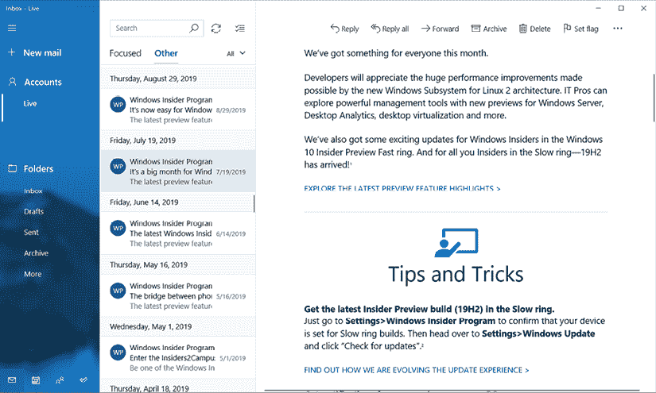

图 3.4：Windows 中的邮件

在 *图 3.4* 中，设计中包含三个面板。左侧面板类似于导航抽屉。当从左侧面板选择一个文件夹时，中间面板会显示一封封电子邮件。当前选中的电子邮件在右侧面板中显示。

**注意**

**导航抽屉**提供了访问目的地和应用功能的方式，例如桌面环境中的菜单。它通常从左侧滑入，并通过在屏幕左上角轻触图标来触发。它显示一个选择列表以进行导航，并在移动和网页用户界面设计中广泛使用。Xamarin.Forms 和 .NET MAUI `Shell` 使用导航抽屉作为它们的高级导航方法。

原始的 KeePass UI 设计，如 *图 3.5* 所示，在主页上也使用了三个面板（左侧、右侧和底部）。左侧面板是一个经典的树形视图，类似于导航抽屉。右侧面板用于显示密码条目列表，而底部面板用于展示条目的详细信息：

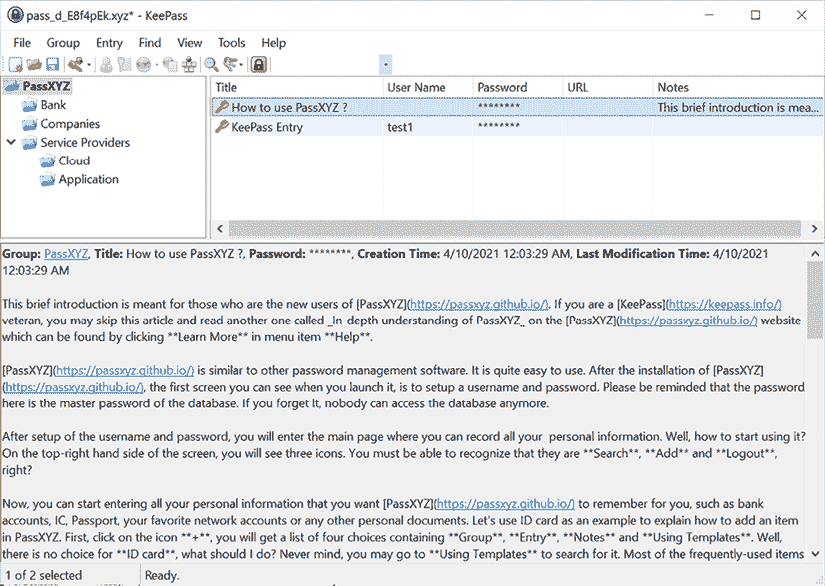

图 3.5：KeePass UI 设计

主从模式在各种设备类型和显示尺寸上都表现良好。

考虑到不同的显示尺寸，可以使用两种流行的模式：

+   并排

+   堆叠

## 并排

当在大屏幕上有足够的水平空间时，并排方法通常是一个明智的选择。*图 3.4* 中的邮件应用和 *图 3.5* 中的 KeePass 应用是很好的例子。在这种模式下，主视图和详细视图可以同时看到。

## 堆叠

在使用移动设备时，屏幕尺寸通常较小，垂直空间大于水平空间。在这种情况下，堆叠方法更为合适。

在堆叠模式下，主视图占据整个屏幕空间。在选择后，详细视图随后占据整个屏幕空间：

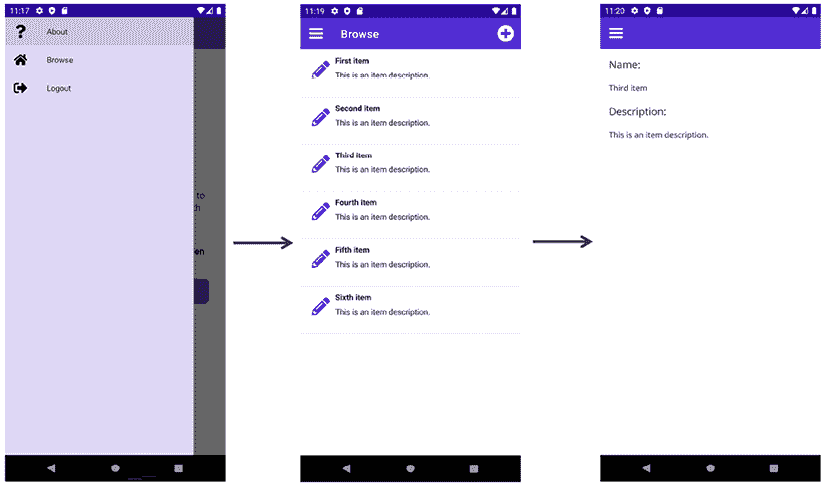

图 3.6: PassXYZ.Vault

在 *图 3.6* 中，我们可以从用户的角度观察应用导航。我们有多个飞出项可供选择：

+   **关于**

+   **浏览**

+   **注销**

选择 **浏览** 后，我们查看主页面 (`ItemsPage`) 上的项目列表。从该页面，如果我们选择一个项目，我们将转到项目的详情页面 (`ItemDetailPage`)。如果我们想选择另一个项目，我们必须返回主页面并再次选择。

我们将在 *第五章*，*使用 .NET MAUI Shell 和 NavigationPage 进行导航* 中讨论飞出项。在本节中，我们将检查 `ItemsPage` 和 `ItemDetailPage` 的实现。然而，在深入具体细节之前，让我们先探讨布局，它们作为用户界面元素的容器。

## 主从 UI 设计中的导航

如 *图 3.6* 所示，我们在导航方案中采用了堆叠的主从模式。有一个飞出菜单来显示页面列表。在这个页面列表中，使用 `ItemsPage` 类型的页面来显示密码条目列表。当用户选择一个条目时，`ItemDetailPage` 会显示密码条目的详细信息。

让我们回顾 `ItemsPage` 和 `ItemDetailPage` 的实现。

### ItemDetailPage

在我们的应用中，`ItemDetailPage` 作为主从模式中的详情页面，显示项目的内容。在 `ItemDetailPage` 中，我们基本上展示了 `Item` 数据模型。虽然现在看起来很简单，但我们将在这本书中逐步增强它：

```swift
using System;
namespace PassXYZ.Vault.Models {
    public class Item {
        public string Id { get; set; }
        public string Text { get; set; }
        public string Description { get; set; }
    }
} 
```

列表 3.3: `Item.cs` ([`epa.ms/Item3-3`](https://epa.ms/Item3-3))

如 *列表 3.3* 所示，`Item` 类包括三个属性：`ID`、`Text` 和 `Description`。`Item` 实例由 `ItemDetailViewModel` 中的 `LoadItemId` 函数加载，如下所示：

```swift
 public async void LoadItemId(string itemId)
  {
    if (itemId == null) { 
      throw new ArgumentNullException(nameof(itemId)); }
    var item = await dataStore.GetItemAsync(itemId);
    if (item == null) { 
      logger.LogDebug("cannot find {itemId}", itemId); 
      return; }
    Id = item.Id;
    Name = item.Name;
    Description = item.Description;
  } 
```

在 `LoadItemId` 中，调用 `IDataStore` 接口的 `GetItemAsync` 方法通过其 ID 获取项目。

在加载项目后，我们可以在 `ItemDetailPage.xaml` 中向用户展示数据，如 *列表 3.4* 所示：

```swift
<?xml version="1.0" encoding="utf-8" ?>
<ContentPage 
  xmlns="http://schemas.microsoft.com/dotnet/2021/maui"
  xmlns:x="http://schemas.microsoft.com/winfx/2009/xaml"
  x:Class="PassXYZ.Vault.Views.ItemDetailPage"
  Title="{Binding Title}">
  <StackLayout Spacing="20" Padding="15">
    <Label Text="Name:" FontSize="Medium" />
    <Label Text="{Binding Name}" FontSize="Small"/>
    <Label Text="Description:" FontSize="Medium" />
    <Label Text="{Binding Description}" FontSize="Small"/>
  </StackLayout>
</ContentPage> 
```

列表 3.4: `ItemDetailPage.xaml` ([`epa.ms/ItemDetailPage3-4`](https://epa.ms/ItemDetailPage3-4))

*列表 3.4* 表示 `ItemDetailPage` 的 XAML 文件。项目详情内容页面包含一个 `StackLayout` 实例和四个 `Label` 实例。

在 `StackLayout` 中，默认方向是 `Vertical`，导致 `Label` 控件在项目详情页上垂直排列（参见图 3.4）。`Name` 和 `Description` 都通过数据绑定与视图模型中的模型数据相关联，这将在下一章中介绍。

### ItemsPage

`ItemsPage` 在我们的应用中充当主从模式的主页，展示用户可以浏览的项目列表。

*清单 3.5* 展示了 `ItemsPage` 的实现。为了显示项目列表，使用了 `ListView` 控件。`ListView` 是一个用于显示可滚动垂直列表的可选择数据项的控件：

```swift
<?xml version="1.0" encoding="utf-8" ?>
<ContentPage 
  xmlns="http://schemas.microsoft.com/dotnet/2021/maui"
  xmlns:x="http://schemas.microsoft.com/winfx/2009/xaml"
  x:Class="PassXYZ.Vault.Views.ItemsPage"                  //(1)
  Title="{Binding Title}"
  xmlns:local="clr-namespace:PassXYZ.Vault.ViewModels"     //(5)
  xmlns:model="clr-namespace:PassXYZ. Vault.Models"        //(6)
  x:DataType="local:ItemsViewModel"                        //(2)
  x:Name="BrowseItemsPage">                                //(3)

  <ContentPage.ToolbarItems...>
  <StackLayout>
    <ListView x:Name="ItemsListView"                       //(4)
      ItemsSource="{Binding Items}"
      VerticalOptions="FillAndExpand"
      HasUnevenRows="False"
      RowHeight="84"
      RefreshCommand="{Binding LoadItemsCommand}"
      IsPullToRefreshEnabled="true"
      IsRefreshing="{Binding IsBusy, Mode=OneWay}"
      CachingStrategy="RetainElement"
      ItemSelected="OnItemSelected">
        <ListView.ItemTemplate>
          <DataTemplate...>
        </ListView.ItemTemplate>
    </ListView>
  </StackLayout>
</ContentPage> 
```

清单 3.5：`ItemsPage.xaml` ([`epa.ms/ItemsPage3-5`](https://epa.ms/ItemsPage3-5))

让我们更详细地检查这段代码：

**(1)** `x:Class`：这用于定义在标记和代码后文件之间共享的部分类名称。`PassXYZ.Vault.Views.ItemsPage` 是在此定义的类名。

**(3)** `x:Name`：虽然 `x:Class` 在 XAML 中定义了类名，但 `x:Name` 定义了实例名称。我们可以在代码后文件中引用 `BrowseItemsPage` 实例名称。

**(2)** `x:DataType`：将 `x:DataType` 设置为在视图模型中定义的适当类型可以启用编译绑定，这可以显著提高性能。此处引用的视图模型是 `ItemsViewModel`。

除了标准命名空间外，我们还定义了另外两个命名空间，这样我们就可以引用视图模型中的对象 **(5)** 和模型 **(6)**。我们将在下一章中讨论视图模型和模型。

**(4)** 我们定义了一个 `ListView` 控件来显示项目列表。`ListView` 控件包含许多属性。当使用 `ListView` 控件时，以下属性必须被定义：

+   `ItemsSource`，是 `IEnumerable` 类型，指定要显示的项目集合。它绑定到在视图模型中定义的 `Items`。

+   `ItemTemplate`，是 `DataTemplate` 类型，指定应用于要显示的项目集合中每个项目的模板。

在 *清单 3.5* 中，`DataTemplate` 被折叠。展开它后，我们将看到以下代码片段。这个默认实现来自 Visual Studio 模板。这个数据模板的外观不够理想，我们将在稍后进行改进：

```swift
<DataTemplate>
    <ViewCell>
        <StackLayout Padding="10" x:DataType="model:Item">
            <Label Text="{Binding Text}"
              LineBreakMode="NoWrap"
              Style="{DynamicResource ListItemTextStyle}"
              FontSize="16" />
            <Label Text="{Binding Description}"
              LineBreakMode="NoWrap"
              Style="{DynamicResource
                  ListItemDetailTextStyle}"
              FontSize="13" />
        </StackLayout>
    </ViewCell>
</DataTemplate> 
```

这个 `DataTemplate` 实现包含一个 `ViewCell`，它由一个包含两个 `Label` 控件的 `StackLayout` 组成，如 *图 3.6* 预览中所示。

`DataTemplate` 实现必须引用一个 `Cell` 类来显示项目。以下是一些内置的单元格：

+   `TextCell`，在单独的行上显示主要和次要文本。

+   `ImageCell`，在单独的行上展示图像以及主要和次要文本。

+   `SwitchCell`，展示了文本和一个可以打开或关闭的开关。

+   `EntryCell`，展示一个标签和可编辑的文本。

+   `ViewCell`，这是一个由 `View` 定义的样式的自定义单元格。当需要完全自定义 `ListView` 中每个项目的外观时，应使用此单元格类型。

通常，`SwitchCell` 和 `EntryCell` 只在 `TableView` 中使用，不能在 `ListView` 中使用。

```swift
Name and Description is not straightforward. In KeePass, an icon is usually attached to the password entry. By using a new data template, we can enhance its appearance, like so:
```

```swift
<DataTemplate>
  <ViewCell>
    <Grid Padding="10" x:DataType="model:Item" >             //(1)
      <Grid.RowDefinitions>                                  //(2)
        <RowDefinition Height="32" />
        <RowDefinition Height="32" />
      </Grid.RowDefinitions>
      <Grid.ColumnDefinitions>
        <ColumnDefinition Width="Auto" />
        <ColumnDefinition Width="Auto" />
      </Grid.ColumnDefinitions>
      <Grid Grid.RowSpan="2" Padding="10">                   //(3)
        <Grid.ColumnDefinitions>
          <ColumnDefinition Width="32" />
        </Grid.ColumnDefinitions>
        <Image Grid.Column="0" Source="icon.png"
          HorizontalOptions="Fill" VerticalOptions="Fill" />
      </Grid>
      <Label Text="{Binding Text}" Grid.Column="1"
        LineBreakMode="NoWrap" MaxLines="1"
        Style="{DynamicResource ListItemTextStyle}"
        FontAttributes="Bold" FontSize="Small" />
      <Label Text="{Binding Description}"
        Grid.Row="1" Grid.Column="1"
        LineBreakMode="TailTruncation" MaxLines="1"
        Style="{DynamicResource ListItemDetailTextStyle}"
        FontSize="Small" />
    </Grid>
  </ViewCell>
</DataTemplate> 
```

让我们更详细地检查这段代码：

**(1)** 为了改善 `ViewCell` 的外观，我们将 `StackLayout` 替换为 `Grid` 作为布局类。`Grid` 是一种布局，它将子项组织成行和列。

**(2)** 由于我们想要显示带有左侧图标的两行，因此我们创建了一个包含两列和两行的网格，如图所示：

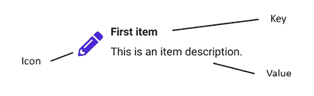

图 3.7：条目或组的布局

我们可以为 `Name` 和 `Description` 使用不同的字体样式，这样用户可以轻松地通过视觉来区分它们。

**(3)** 为了在第一个两列中居中图标，我们将两行合并到一个 `Grid` 控件中。可以通过 `Grid.RowSpan` 属性来合并行。

一个 `Grid` 可以作为一个包含其他子布局的父布局。为了保持图标的具体大小并将其定位在合并单元格的中心，我们可以使用另一个 `Grid` 作为 `Image` 控件的父布局。这个子 `Grid` 只包含一个具有特定大小的行和列。

在 `Image` 控件中，我们可以使用资源中的默认图像（`icon.png`）。一旦我们在下一章介绍我们的模型，就可以进行自定义。

在自定义的 `ViewCell` 中，我们可以显示与相关图标关联的数据键值对。

参考图 3.8 查看改进的预览：

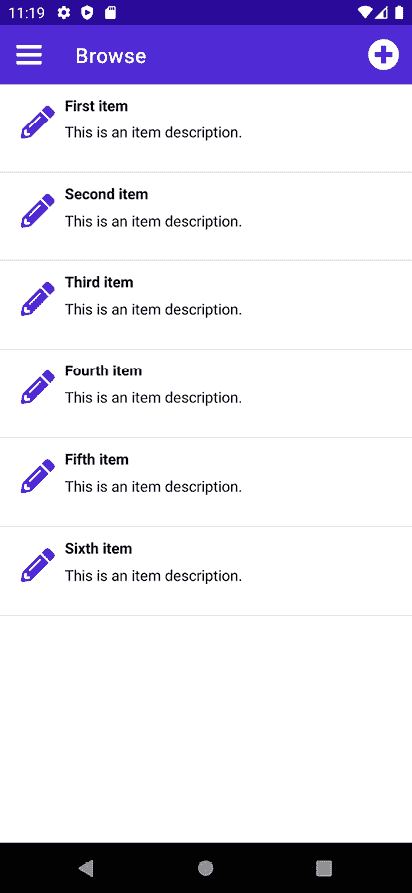

图 3.8：改进的 ItemsPage

通过这些知识，我们已经涵盖了使用 XAML 进行用户界面设计的 fundamentals。用户界面设计中的一个常见挑战是提供对多种语言的支持。在本章的剩余部分，我们将学习如何在 XAML 中设计用户界面时支持多种语言。

# 支持多种语言 - 本地化

为了适应多种语言，我们可以利用 .NET 内置的应用程序本地化机制。在 .NET 中，资源文件可以用于支持本地化，通过将应用程序用户界面所需的所有文本和其他资源集中在一个位置。在 XAML 文件中，我们可以使用 `x:Static` 标记扩展来访问资源文件中定义的字符串。

## 创建 .resx 文件

我们可以为每种支持的语言生成一个资源文件。资源文件是具有 `.resx` 扩展名的 XML 文件，在构建过程中编译成二进制资源文件。要添加资源文件，右键单击项目节点，然后选择 **添加 > 新项... > 资源文件**，如图 3.9 所示：

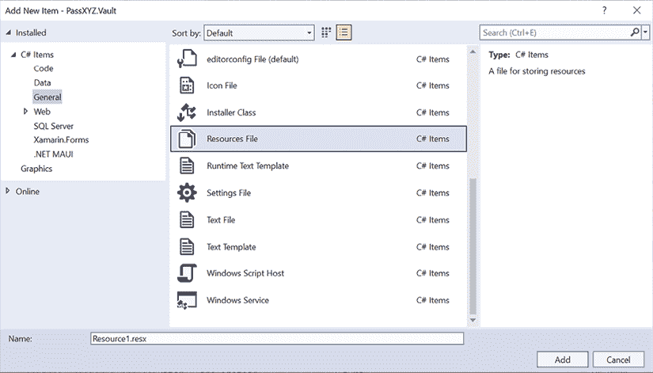

图 3.9：创建资源文件

我们可以在 `Properties` 文件夹中创建 `Resources.resx` 资源文件。

为了支持不同的文化，我们可以在资源文件名中添加包含文化信息的附加资源文件：

+   `Resources.resx`：为默认文化提供的资源文件，我们将将其设置为**en-US**（美国英语）。

+   `Resources.zh-Hans.resx`：为**zh-Hans**文化提供的资源文件，即简体中文。

+   `Resources.zh-Hant.resx`：为**zh-Hant**文化提供的资源文件，即繁体中文。

创建资源文件后，以下`ItemGroup`将被添加到项目文件中：

```swift
<ItemGroup>
  <Compile Update="Properties\Resources.Designer.cs">
    <DesignTime>True</DesignTime>
      <AutoGen>True</AutoGen>
      <DependentUpon>Resources.resx</DependentUpon>
  </Compile>
</ItemGroup>
<ItemGroup>
  <EmbeddedResource Update="Properties\Resources.resx">
    <Generator>ResXFileCodeGenerator</Generator>
    <LastGenOutput>Resources.Designer.cs</LastGenOutput>
  </EmbeddedResource>
</ItemGroup> 
```

要编辑资源文件，请单击资源文件，并在资源编辑器中编辑它，如图**3.10**所示：

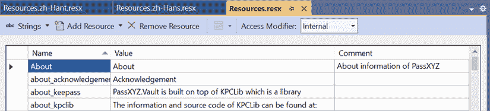

图 3.10：资源编辑器

资源文件包括不同语言的键值对列表：

+   `Name`字段代表可以在 XAML 和 C#文件中引用的字符串名称。

+   `Value`字段包含将根据系统语言设置使用的特定语言的字符串。

+   `Comment`字段被用作键值对的备注。

要指定默认语言，我们需要在项目文件中的`<PropertyGroup>`中设置`NeutralLanguage`的值，如下所示：

```swift
<PropertyGroup>
…
<NeutralLanguage>en-US</NeutralLanguage>
…
</PropertyGroup> 
```

在我们的项目中，我们将使用美国英语作为默认文化，因此将`NeutralLanguage`设置为`en-US`。

## 本地化文本

一旦配置了资源文件，我们就可以在我们的 XAML 文件或 C#文件中使用本地化内容。目前，我们的项目包含五个内容页面。让我们修改`AboutPage`以支持本地化，如图**列表 3.6**所示：

```swift
<?xml version="1.0" encoding="utf-8" ?>
<ContentPage 
  xmlns="http://schemas.microsoft.com/dotnet/2021/maui"
  xmlns:x="http://schemas.microsoft.com/winfx/2009/xaml"
  x:Class="PassXYZ.Vault.Views.AboutPage"
  xmlns:res="clr-namespace:PassXYZ.Vault.Properties"              //(1)
  Title="{Binding Title}">
  <ContentPage.Resources...>
  <ScrollView>
    <StackLayout Margin="20">
      <Grid Padding="10"...>
      <StackLayout Padding="10" >
        <Label HorizontalOptions="Center"
          Text="{x:Static res:Resources.Appname}"                 //(2)
          FontAttributes="Bold" FontSize="22" />
        <Label x:Name="AppVersion" 
          HorizontalOptions="Center"
          FontSize="Small" />
        <Grid HorizontalOptions="Center"...>
        <StackLayout...>
      </StackLayout>
    </StackLayout>
  </ScrollView>
</ContentPage> 
```

**列表 3.6**：`AboutPage.xaml` ([`epa.ms/AboutPage3-6`](https://epa.ms/AboutPage3-6))

文本本地化是通过生成的`Resources`类完成的。这个类的命名基于默认资源文件名。在**图 3.6**的`AboutPage.xaml`中，我们为`Resources`类添加了一个新的命名空间**（1**）：

```swift
xmlns:res ="clr-namespace:PassXYZ.Vault.Properties " 
```

在`Label`控件**（2**）中，为了显示我们的应用程序名称，我们可以使用`x:Static` XAML 标记扩展来引用资源字符串，如下所示：

```swift
 <Label HorizontalOptions="Center"
          Text="{x:Static res:Resources.Appname}"
          FontAttributes="Bold" FontSize="22" /> 
```

在**列表 3.6**中，我们为了简洁起见折叠了大部分源代码。请参考本书 GitHub 仓库的短 URL 来查看完整的源代码。

本地化文本可以在 XAML 和 C#中使用。要在 C#中使用资源字符串，我们可以查看**列表 3.6**中的`Title`属性。`AboutPage`的`Title`属性连接到`AboutViewModel`类中的`Title`属性。让我们看看我们如何在**列表 3.7**中使用资源字符串：

```swift
using System;
using System.Windows.Input;
using CommunityToolkit.Mvvm.ComponentModel;
using CommunityToolkit.Mvvm.Input;
using Microsoft.Maui.Controls;
**using** **PassXYZ.Vault.Properties;**                                   //(1)
namespace PassXYZ.Vault.ViewModels
{
  public partial class AboutViewModel : ObservableObject
  {
    [ObservableProperty]
    private string? title = **Properties.Resources.About**;           //(2)
    [RelayCommand]
private async Task OpenWeb()...
public string GetStoreName()...
    public DateTime GetStoreModifiedTime()...
  }
} 
```

**列表 3.7**：`AboutViewModel.cs` ([`epa.ms/AboutViewModel3-7`](https://epa.ms/AboutViewModel3-7))

如**图 3.7**所示，**(1**) 我们首先添加了`PassXYZ.Vault.Properties`命名空间。**(2**) 我们将资源字符串称为`Properties.Resources.About`。

在我们更新`AboutPage`以支持本地化后，我们可以在支持的语言中进行测试，如图**3.11**所示：

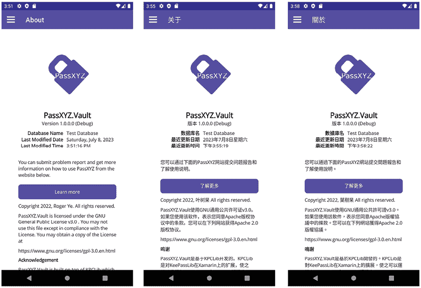

图 3.11：不同语言中的 AboutPage

在 `AboutPage` 中，许多资源字符串被用于本地化。在 *清单 3.6* 和 *清单 3.7* 中，我们折叠了大部分代码；你可以通过这本书的 GitHub 仓库的短网址来在线查看源代码。

**.NET MVVM 社区工具包**

.NET MVVM 社区工具包是一个旨在简化基于 .NET 库的 **模型-视图-视图模型**（**MVVM**）模式应用程序开发过程的辅助工具和工具集。

工具包提供了一系列旨在减少样板代码的功能，包括转换器、辅助工具、行为、命令和服务，旨在促进 MVVM 模式中类之间的通信。

下一章将介绍更多关于 .NET MVVM 社区工具包的详细信息。

# 摘要

在本章中，我们探讨了 XAML 语法，并将我们所获得的知识应用于增强 `ItemsPage` 的外观。我们将在整本书中持续改进其他页面的用户界面。为了支持多语言，我们深入研究了 .NET 本地化，并为 `US-en`、`zh-Hans` 和 `zh-Hant` 语言创建了多个资源文件。此外，我们还发现了如何使用 XAML 标记扩展访问资源文件中的字符串。最后，我们以 `AboutPage` 为例，展示了在 XAML 和 C# 中使用本地化文本的方法。

在下一章中，我们将通过介绍 MVVM 和数据绑定来继续改进我们的应用程序。

# 进一步阅读

+   .NET 多平台应用 UI 文档：[`learn.microsoft.com/en-us/dotnet/maui/`](https://learn.microsoft.com/en-us/dotnet/maui/)

+   XAML - .NET MAUI：[`learn.microsoft.com/en-us/dotnet/maui/xaml/`](https://learn.microsoft.com/en-us/dotnet/maui/xaml/)

+   XAML 标记扩展：[`learn.microsoft.com/en-us/dotnet/maui/xaml/fundamentals/markup-extensions`](https://learn.microsoft.com/en-us/dotnet/maui/xaml/fundamentals/markup-extensions)

+   KeePass – 一个开源密码管理器：[`keepass.info/`](https://keepass.info/)

# 留下评论！

*喜欢这本书吗？通过留下亚马逊评论帮助像你一样的读者。扫描下面的二维码获取 40% 的折扣码。*


**限时优惠*
