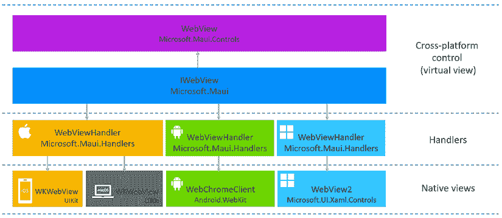

# 第七章：使用平台特定功能

在过去的六章中，我们开发了一个基本的密码管理器应用程序。到目前为止，所有平台特定功能都由 .NET MAUI 管理，使得开发的功能看起来是平台无关的。然而，处理平台特定功能并非总是可以避免的。在本章中，我们将深入探讨这些功能的实现。

我们将探讨如何在支持的平台上利用设备功能。通过应用本章获得的知识，我们将把指纹支持和定制的 Markdown 视图集成到我们的应用程序中。

虽然本章确实涉及了平台特定功能，但其主要焦点不是平台特定编程。深入了解平台特定实现需要针对 Android、iOS、WinUI 等特定编程知识。鉴于这需要相当多的知识，我们不会教您为每个平台编写自己的插件或特定的 UI 控件，而是会考虑创建这些元素所涉及的一些高级概念。为了帮助您熟悉这些概念，我们的重点将放在如何扩展这些功能并将它们集成到我们的应用程序中。

要使用 .NET 进行原生应用程序开发，您需要为每个平台编写一本专门的书籍。您可以参考 *进一步阅读* 部分，了解更多关于使用 Xamarin 进行 Android 和 iOS 原生应用程序开发的信息。

本章将涵盖以下主题：

+   实现平台特定代码

+   .NET MAUI 插件

+   自定义控件

# 技术要求

要测试和调试本章中的源代码，您需要在您的 PC 或 Mac 上安装 Visual Studio 2022。请参阅 *第一章*，*使用 .NET MAUI 入门* 中的 *开发环境设置* 部分，以获取详细信息。

本章的源代码可在以下 GitHub 仓库中找到：[`github.com/PacktPublishing/.NET-MAUI-Cross-Platform-Application-Development-Second-edition/tree/main/2nd/chapter07`](https://github.com/PacktPublishing/.NET-MAUI-Cross-Platform-Application-Development-Second-edition/tree/269e26ce42e9d82430a8c8deeda25ffb80a501d0).

要查看本章的源代码，我们可以使用以下命令：

```swift
$ git clone -b 2nd/chapter07 https://github.com/PacktPublishing/.NET-MAUI-Cross-Platform-Application-Development-Second-edition.git PassXYZ.Vault2 
```

要了解更多关于本书中源代码的信息，请参阅 *第二章*，*构建我们的第一个 .NET MAUI 应用程序* 中的 *管理本书中的源代码* 部分。

# 实现平台特定代码

在.NET MAUI 应用程序开发领域，我们可能会遇到许多需要编写特定平台代码的实例。在本节中，我们将探讨实现此类代码的指南。随后，我们将在本章中探讨两种最常见需要编写特定平台代码的场景。第一种场景涉及访问.NET MAUI API 中不可直接使用的平台功能。第二种场景可能需要创建自定义控件或自定义现有控件。

在深入探讨如何访问平台 API 之前，区分.NET MAUI API 和平台 API 这两个术语非常重要。在*第一章* *开始使用.NET MAUI*中，我们有以下.NET MAUI 应用程序的架构图（*图 7.1*）。


图 7.1: .NET MAUI 架构

由于架构图中的大多数组件都是开源的，我已经为这些组件编号以便讨论。您可以在*进一步阅读*部分引用这些编号，以在 GitHub 上找到相应的源代码：

+   **.NET MAUI API** **(6**) 是.NET MAUI 框架提供的跨平台 API。这些 API 在各个平台之间保持一致性和统一性。

+   **平台 API** **(7)(8)(9)(10**)，另一方面，涉及由底层目标平台（Android、iOS/macOS 和 Windows）提供的特定平台 API。这些 API 允许您访问每个平台特有的本地功能、设备和功能。

通常，要将平台代码集成到.NET MAUI 中，我们可以利用条件编译、接口以及部分类和方法等技术。

## 条件编译

在.NET MAUI 中，可以通过定义针对每个平台的编译器指令来使用条件编译调用特定平台的代码。这些指令允许你在编译过程中根据目标平台包含或省略特定的代码段。

在随后的代码片段中，Android 上的 Markdown 编码有所不同。通过使用条件编译，我们可以独立管理 Android 代码：

```swift
public void DisplayMarkdown(string markdown) 
{
#if !ANDROID
  string markDownTxt = HttpUtility.JavaScriptStringEncode(markdown);
#else
  string markDownTxt = markdown;
#endif
  MainThread.BeginInvokeOnMainThread(async () =>
  {
    await InvokeJsMethodAsync("MarkdownToHtml", markDownTxt);
  });
} 
```

这种模块化方法使得在保持共享代码库的同时，有效地使用特定平台的 API，从而促进了更顺畅的跨平台开发过程。所描述的条件编译方法通常用于简单的实现。然而，如果特定平台的实现涉及更复杂的逻辑，最好利用接口和部分类。这些提供了更结构化的方法，有助于更好地组织和管理代码，尤其是在处理复杂、特定平台的逻辑时。

## 接口、部分类和方法

使用接口、部分类和方法来实现平台特定功能，在构建跨平台应用程序时为开发者提供了许多好处，确保了代码组织的清洁性、可维护性和灵活性。以下是使用这些技术的优势：

+   抽象和模块化：

    +   **接口**：接口提供了一种定义必须由平台特定类实现合约的方法，封装了平台特定代码，同时确保了不同平台实现的一致性。这促进了关注点的清晰分离，并允许模块化代码，使其更容易管理和维护。

    +   **部分类**：部分类允许你将单个类的实现拆分到多个文件中，这在处理平台特定功能时特别有用。每个平台的实现可以分别放入不同的文件中，从而产生更干净、更有组织的代码。

+   代码重用性和可维护性：

    使用接口允许你创建可重用的组件，这些组件可以轻松地插入到不同的平台特定实现中，而无需修改共享代码。这提高了可维护性，因为平台特定代码的变化不会影响应用程序的其他部分，从而减少了错误的可能性并简化了更新。

    部分方法作为部分类中的可选方法实现。它们允许你在共享代码中定义方法签名，而不提供实现。平台特定代码可以在需要时提供实现，否则可以留空。这种方法通过避免不必要的空方法实现，使代码库更干净，并有助于在平台之间保持更一致的结构。

+   灵活性和可测试性：

    接口在实现平台特定功能时提供了灵活性，因为不同的实现可以轻松地交换用于测试目的或支持未来平台。它允许依赖注入，使得在开发和测试期间编写单元测试和模拟平台特定组件变得更加容易。

    为了利用.NET MAUI 不支持的平台功能，我们通常创建称为插件的组件。在接下来的部分中，我们将使用指纹插件作为一个案例研究，通过接口、部分类或抽象类来深入了解.NET MAUI 插件的实现。

# .NET MAUI/Xamarin 插件

为了以跨平台的方式利用平台功能，我们通常创建称为插件的组件。在.NET MAUI 插件（或 Xamarin 插件）中，我们建立跨平台 API 来访问原生平台功能或服务。这些插件使你能够在共享项目中编写平台无关的代码，同时同时在每个平台上（Android、iOS、macOS 和 Windows）利用原生功能。

插件抽象了平台特定的代码，使您能够在共享项目中使用标准化的 API 来访问原生功能。这简化了开发，并帮助您维护一个更整洁、更易于阅读的代码库，遵循**模型-视图-视图模型**（**MVVM**）模式。

虽然我使用了“.NET MAUI 插件”这个术语，但重要的是要注意，它并不仅限于.NET MAUI。实际上，可以开发一个同时被.NET MAUI 和 Xamarin.Forms 使用的插件。通常，插件是一个多目标.NET 项目，开发者可以决定支持的平台数量。本章关于插件的内容也适用于.NET MAUI Blazor 混合应用。我们将在下一章深入探讨.NET MAUI Blazor 混合应用的开发。

由于插件开发可以相当灵活和强大，插件库的兼容性由个别开发者决定。为了标准化社区中的各种插件，让我们在下一节中评估.NET MAUI 或 Xamarin 插件的演变路径。

## .NET MAUI/Xamarin 插件的演变

在以前，为了在没有内置跨平台接口的情况下利用设备功能，我们通常可以找到由社区开发的 Xamarin 插件。由 Xamarin 开发者创建的 Xamarin 插件以跨平台格式打包。然而，这些插件缺乏标准化，可能会导致存在多个针对相同设备功能的插件。

随着 Xamarin 生态系统的发展和成熟，Xamarin.Essentials 被引入作为一种全面、统一的替代方案。通过将流行的插件整合到一个单一的多平台库中，它简化了在 Android、iOS 和 Windows 设备上使用原生 API 的过程。

Xamarin.Essentials 既是一个库也是一个命名空间。在这个命名空间中，我们可以访问硬件接口，例如电池、手电筒、振动、地理位置传感器等。

随着 NET MAUI 的出现，Xamarin.Essentials 经历了进一步的发展，结果在`Microsoft.Maui`命名空间下形成了一系列单独的命名空间，如图 7.2 所示。


图 7.2：Xamarin.Essentials 的演变

在 Xamarin.Essentials 中，所有功能都整合在一个单一的命名空间下，从而形成一个庞大且扁平的库。相比之下，.NET MAUI 通过将功能划分为多个命名空间，采用了更精细的设计，如图 7.1 所示。

| **命名空间** | **描述** |
| --- | --- |
| `Microsoft.Maui.ApplicationModel` | 在这个命名空间中，它包含允许访问平台特定应用程序级信息和活动的 API。这些包括应用操作、应用信息、浏览器、启动器、主线程、地图、权限和版本跟踪等示例。 |
| `Microsoft.Maui.ApplicationModel.Communication` | 在这个命名空间中，我们可以访问各种通信服务，包括联系人、电子邮件、网络、电话拨号器、短信和网页身份验证功能。 |
| `Microsoft.Maui.ApplicationModel.DataTransfer` | 剪贴板和共享 API 可以在这个命名空间中找到。 |
| `Microsoft.Maui.Devices` | 在这个命名空间中，我们有能力访问各种硬件传感器和加速器，包括电池、设备显示、设备信息、设备传感器、手电筒、地理编码、地理位置、触觉反馈和振动。 |
| `Microsoft.Maui.Media` | 我们可以在这个命名空间中访问视频和照片，例如媒体选择器、截图、语音合成或单位转换器。 |
| `Microsoft.Maui.Storage` | 要访问偏好设置或安全存储中的各种本地存储，我们可以使用这个命名空间。在这里，我们可以找到一个跨平台的文件选择器和文件系统辅助工具。 |

表 7.1：Microsoft.Maui 中的设备功能

尽管列表 7.1 中列出的跨平台 API 允许我们访问各种设备功能，但仍有一些平台功能不可用。在这种情况下，我们必须要么实现自己的解决方案，要么利用社区开发的插件。例如，没有可用的跨平台 API 支持指纹功能。为了在我们的应用中集成指纹功能，我们需要依赖社区开发的插件。

由于.NET MAUI API 目前不支持指纹功能，我们将使用一个名为`Plugin.Fingerprint`的开源插件，该插件之前在`PassXYZ.Vault`的 Xamarin 版本中使用过。在本章中，我们将利用相同的插件来促进 PassXYZ.Vault 的.NET MAUI 版本的指纹支持。`Plugin.Fingerprint`是一个可以支持.NET MAUI 和 Xamarin.Forms 的库的例子。

## Plugin.Fingerprint 的介绍

在本次会议中，我们将利用`Plugin.Fingerprint`作为一个案例研究来展示.NET MAUI 插件的实现。您可以在以下 GitHub URL 找到我们将要使用的指纹插件：[`github.com/smstuebe/xamarin-fingerprint`](https://github.com/smstuebe/xamarin-fingerprint)。

要在我们的项目中使用`Plugin.Fingerprint`，我们可以通过以下命令将包添加到项目中：

```swift
dotnet add package Plugin.Fingerprint 
```

为了实现一个插件，通常的做法是首先定义一个接口。这个接口作为访问插件提供的功能的一种方式。

具体实现分为两个组件，跨平台方面和特定平台方面，这些是通过部分类或抽象类实现的。


图 7.3：Plugin.Fingerprint

*图 7.3* 展示了 `Plugin.Fingerprint` 类的类图。很明显，`Plugin.Fingerprint` 建立了一个名为 `IFingerprint` 的接口。一个抽象类 `FingerprintImplementationBase` 执行这个接口的实现。这个抽象类负责跨平台功能，并概述了为特定平台实现指定的抽象方法。每个平台都有一个单独的类 `FingerprintImplementation`，定义了特定平台的实现。在下面的代码块中，我们将检查 `IFingerprint` 的代码：

```swift
using System.Threading;
using System.Threading.Tasks;
namespace Plugin.Fingerprint.Abstractions
{
  public interface IFingerprint
  {
Task<FingerprintAvailability> GetAvailabilityAsync(
  bool allowAlternativeAuthentication = false);
    Task<bool> IsAvailableAsync(bool allowAlternativeAuthentication = false);
    Task<FingerprintAuthenticationResult> AuthenticateAsync(         AuthenticationRequestConfiguration authRequestConfig,         CancellationToken cancellationToken = default);
    Task<AuthenticationType> GetAuthenticationTypeAsync();
  }
} 
```

`IFingerprint` 接口定义了四个方法：

+   `GetAvailabilityAsync` 检查指纹认证的可用性。

+   `IsAvailableAsync` 作为 `GetAvailabilityAsync` 的包装器，提供更简单的访问方式。

+   `AuthenticateAsync` 处理实际的认证，使用指纹数据。

+   `GetAuthenticationTypeAsync` 允许用户检索当前可用的认证类型。

现在，让我们检查实现 `IFingerprint` 接口的 `FingerprintImplementationBase`：

```swift
public abstract class FingerprintImplementationBase : IFingerprint
{
  public async Task<FingerprintAuthenticationResult> 
    **AuthenticateAsync**(
    AuthenticationRequestConfiguration authRequestConfig, 
    CancellationToken cancellationToken = default) {
    if (authRequestConfig is null)
        throw new ArgumentNullException(nameof(authRequestConfig));
    var availability = await GetAvailabilityAsync(
        authRequestConfig.AllowAlternativeAuthentication);
    if (availability != FingerprintAvailability.Available) {
      var status = availability == FingerprintAvailability.Denied ?
        FingerprintAuthenticationResultStatus.Denied :
        FingerprintAuthenticationResultStatus.NotAvailable;
        return new FingerprintAuthenticationResult { 
          Status = status, 
          ErrorMessage = availability.ToString() };
    }
return await NativeAuthenticateAsync(
  authRequestConfig, cancellationToken);
  }
  public async Task<bool> **IsAvailableAsync**(
    bool allowAlternativeAuthentication = false) {
      return await GetAvailabilityAsync
        (allowAlternativeAuthentication) 
        == FingerprintAvailability.Available;
  }
  public abstract Task<FingerprintAvailability> 
    **GetAvailabilityAsync**(
      bool allowAlternativeAuthentication = false);
  public abstract Task<AuthenticationType> 
    **GetAuthenticationTypeAsync**();
  protected abstract Task<FingerprintAuthenticationResult> 
**NativeAuthenticateAsync**(
  AuthenticationRequestConfiguration authRequestConfig, 
  CancellationToken cancellationToken);
} 
```

在 `FingerprintImplementationBase` 类中，`AuthenticateAsync` 方法通过调用 `NativeAuthenticateAsync` 方法实现。后者定义为在平台层实现的抽象方法。

它还定义了 `GetAvailabilityAsync` 和 `GetAuthenticationTypeAsync` 为抽象方法，这些方法随后在平台层实现。

`IsAvailableAsync` 方法简单地调用 `GetAvailabilityAsync` 并比较返回值。

为了实例化 `IFingerprint` 接口，`Plugin.Fingerprint` 使用一个名为 `CrossFingerprint` 的类。这个类利用创建型设计模式，结合懒加载，在运行时生成 `IFingerprint` 接口实例，如下面的代码所示：

```swift
public partial class CrossFingerprint {
  private static Lazy<IFingerprint> _implementation =             //(1)
new Lazy<IFingerprint>(CreateFingerprint, 
  LazyThreadSafetyMode.PublicationOnly);
  public static IFingerprint Current {                            //(2)
    get => _implementation.Value;
    set {
      _implementation = new Lazy<IFingerprint>(() => value);
    }
  }
  static IFingerprint CreateFingerprint() {                       //(3)
#if NETSTANDARD2_0
    throw NotImplementedInReferenceAssembly();
#else
    return new FingerprintImplementation();
#endif
  }
  public static void Dispose() {
    if (_implementation != null && _implementation.IsValueCreated)
    {
      _implementation = new Lazy<IFingerprint>(CreateFingerprint, 
        LazyThreadSafetyMode.PublicationOnly);
    }
  }
  private static Exception NotImplementedInReferenceAssembly() {
      return new NotImplementedException("This functionality is not implemented in the portable version of this assembly. You should reference the NuGet package from your main application project in order to reference the platform-specific implementation.");
  }
} 
```

在 `CrossFingerprint` 中，定义了一个名为 `Current` 的静态属性 **(2**)，可以用来获取 `IFingerprint` 的实例。属性 `Current` 返回一个 `Lazy<IFingerprint>` 对象的值，该对象由变量 `_implementation` **(1**) 指定，实现了懒加载。在 `Lazy<IFingerprint>` 中，使用工厂方法 `CreateFingerprint` **(3**) 创建 `IFingerprint` 实例。

现在我们已经介绍了 `Plugin.Fingerprint`，让我们探索如何使用此插件在我们的应用程序中集成指纹支持。

## 使用 Plugin.Fingerprint 支持指纹功能

要使用 `Plugin.Fingerprint` 集成指纹功能，我们必须首先在我们的项目中配置它，然后再进行任何代码修改。这一步涉及将 NuGet 包 `Plugin.Fingerprint` 添加到我们的项目文件中，具体如下：

```swift
<ItemGroup>
<PackageReference Include="CommunityToolkit.Mvvm" Version="8.2.1" />
<PackageReference Include="EJL.MauiHybridWebView" Version="1.0.0-preview3" />
<PackageReference Include="Microsoft.Extensions.Logging.Debug" Version="7.0.0" />
**<****PackageReference****Include****=****"Plugin.Fingerprint"****Version****=****"3.0.0-beta.1"** **/>**
<PackageReference Include="PassXYZLib" Version="2.1.2" />
</ItemGroup> 
```

目前，请忽略 NuGet 包 `EJL.MauiHybridWebView`。我们将在本章的后面部分深入讨论它。

由于用户必须在每个平台上访问特定于设备的功能，因此在我们的应用程序的相应配置文件中配置所需的权限是至关重要的。

对于 Android 平台，需要在`AndroidManifest.xml`文件中请求特定的权限：

```swift
<uses-permission android:name="android.permission.USE_BIOMETRIC" />
<!-- only if you target android below level 28 -->
<uses-permission android:name="android.permission.USE_FINGERPRINT" /> 
```

对于 iOS 平台，我们需要在`Info.plist`中执行相同的操作，如下所示：

```swift
<key>NSFaceIDUsageDescription</key>
<string>Need your face to unlock secrets!</string> 
```

将指纹功能集成到我们的应用程序中是我们希望实现的目标。通过使用 MVVM 模式，我们最初可以在我们的视图中集成此指纹功能。随后，我们可以在我们的 XAML 页面上使用此功能。

我们的用户将使用指纹认证进行登录，因此我们可以将指纹插件集成到`LoginViewModel`中。用户将通过`LoginPage`进行登录过程。然而，在`LoginPage`中使用指纹认证之前，他们必须首先在我们的应用设置中启用指纹功能。这些设置的实现可以在`SettingsPage`中找到。`IFingerprint`、`LoginViewModel`、`LoginPage`和`SettingsPage`之间的关系如图 7.4 所示：


图 7.4：插件.Fingerprint 集成

由于我们正在使用依赖注入来管理依赖项，因此需要首先在`MauiProgram.cs`中找到的配置中包含`IFingerprint`接口，如下所示：

```swift
builder.Services.AddSingleton(typeof(IFingerprint), CrossFingerprint.Current); 
```

完成上述设置和配置后，现在让我们查看以下提供的`LoginViewModel`代码：

```swift
public partial class LoginViewModel : ObservableObject {
  private LoginService _currentUser;
  ILogger<LoginViewModel> _logger;
  private readonly IFingerprint _fingerprint;
  public LoginViewModel(LoginService user, 
    ILogger<LoginViewModel> logger, IFingerprint fingerprint) {   //(1)
    _currentUser = user;
    _logger = logger;
    _fingerprint = fingerprint;
  }
  ...
  [RelayCommand(CanExecute = nameof(ValidateFingerprintLogin))]
  private async Task FingerprintLogin() {                         //(2)
    var cancel = new CancellationTokenSource();
var dialogConfig = new AuthenticationRequestConfiguration(
  Username,
      Properties.Resources.fingerprint_login_message) {
      CancelTitle = "Cancel fingerprint login",
      FallbackTitle = "Use Password",
      AllowAlternativeAuthentication = true,
    };
var result = await _fingerprint.AuthenticateAsync(
  dialogConfig, cancel.Token);
    if (result.Authenticated) {
      Password = await _currentUser.GetSecurityAsync();
      if (!string.IsNullOrWhiteSpace(Password)) {
          await Login();
      }
      else {
          _logger.LogWarning("GetSecurityAsync() error.");
      }
    }
    else {
        _logger.LogWarning("Failed to login with fingerprint.");
    }
  }
  ...
  public async void CheckFingerprintStatus() {                  //(3)
    _currentUser.Username = Username;
    var password = await _currentUser.GetSecurityAsync();
IsFingerprintIsAvailable = 
  await _fingerprint.IsAvailableAsync();
IsFingerprintEnabled = IsFingerprintIsAvailable &&
  !string.IsNullOrWhiteSpace(password);
  }
  [ObservableProperty]
  private bool isFingerprintEnabled = false;                      //(4)
  [ObservableProperty]
  private bool isFingerprintAvailable = false;                    //(5)
  ...
  public async Task<bool> AuthenticateAsync(string reason,        //(6)
string? cancel = null, string? fallback = null, 
string? tooFast = null) {
    CancellationTokenSource cancelToken;
    cancelToken = new CancellationTokenSource();
var dialogConfig = new AuthenticationRequestConfiguration(
  "Verify your fingerprint", reason) { 
      CancelTitle = cancel,
      FallbackTitle = fallback,
      AllowAlternativeAuthentication = false
    };
    dialogConfig.HelpTexts.MovedTooFast = tooFast;
var result = await _fingerprint.AuthenticateAsync(
  dialogConfig, cancelToken.Token);
    return result.Authenticated;
  }
} 
```

列表 7.1：`LoginViewModel.cs` ([`epa.ms/LoginViewModel7-1`](https://epa.ms/LoginViewModel7-1))

在`LoginViewModel`中，我们通过构造函数依赖注入获取`IFingerprint`接口的实例 **(1**) 并将其保存在成员变量`_fingerprint`中。然后，使用此`IFingerprint`实例来实现指纹状态验证和认证功能。

已实现`CheckFingerprintStatus` **(3**) 函数来评估设备的性能和状态，具体确定设备是否支持指纹识别以及是否为当前用户启用。该函数将更新`IsFingerprintEnabled` **(4**) 和`IsFingerprintAvailable` **(5**) 属性。

要启用指纹认证，`FingerprintLogin` **(2**) 被集成以通过指纹识别执行登录。使用`AuthenticateAsync` **(6**) 函数进行指纹验证；然而，它并不执行登录过程。

在实现视图模型后，我们可以专注于开发用户界面。为了集成指纹功能，用户最初需要激活它。我们为此使用设置页面。当指纹功能启用时，用户可以使用指纹访问系统。此登录功能被集成到`LoginPage`中。

### 指纹设置

请参考图 7.5 中的指纹配置。用户界面设计明显简约，仅使用开关控件来激活或禁用指纹功能。


图 7.5: SettingsPage

`SettingsPage`的用户界面相对简单，这使我们能够跳过讨论其 XAML。相反，我们将专注于检查列表 7.2 中的`SettingsPage`的后台代码文件：

```swift
public partial class SettingsPage : ContentPage {
  private LoginService _currentUser;
  ILogger<LoginViewModel> _logger;
  private readonly LoginViewModel _viewModel;
  public SettingsPage(LoginViewModel viewModel,                    //(1)
    LoginService user, ILogger<LoginViewModel> logger) {
    InitializeComponent();
    BindingContext = _viewModel = viewModel;
    _currentUser = user;
    _logger = logger;
    Title = Properties.Resources.menu_id_settings;
  }
  private void SetFingerprintSwitcher() {
    FingerprintSwitcher.IsEnabled = 
      _viewModel.IsFingerprintAvailable;
    FingerprintSwitcher.On = _viewModel.IsFingerprintEnabled;
    if (_viewModel.IsFingerprintAvailable) {
      FingerprintSwitcher.Text = 
        Properties.Resources.settings_fingerprint_remark;
    }
    else {
      FingerprintSwitcher.Text = 
        Properties.Resources.settings_fingerprint_disabled;
    }
  }
  protected override void OnAppearing() {                         //(2)
    base.OnAppearing();
    …
    try {
      _viewModel.CheckFingerprintStatus();                        //(3)
    }
    catch (Exception ex) {_logger.LogError($"{ex}");}
    SetFingerprintSwitcher();                                      //(4)
  } 
  private async void OnTimerTappedAsync(object sender, 
    System.EventArgs e) ...
  private async void SetResultAsync(bool result) {
    if (result) {
      try {
        await _currentUser.SetSecurityAsync(_currentUser.Password);
        _viewModel.IsFingerprintEnabled = true;
      }
      catch (Exception ex) {
        _logger.LogError(
          "SettingsPage: in SetResultAsync, {ex}", ex);
      }
    }
    else {
      FingerprintSwitcher.Text = "Turn on fingerprint error.";
    }
    SetFingerprintSwitcher();
  }
  private async void OnSwitcherToggledAsync(object sender,         //(5)
    ToggledEventArgs e) {
    if (!_viewModel.IsFingerprintAvailable) { return; }
    if (e.Value) {
      try {
        string data = await _currentUser.GetSecurityAsync();
        if (data == null) {
            var status = await _viewModel.AuthenticateAsync(       //(6)
              Properties.Resources.fingerprint_login_message);
            SetResultAsync(status);
        }
      }
      catch (Exception ex) {_logger.LogError("{ex}", ex); }
    }
    else {
      _ = await _currentUser.DisableSecurityAsync();
    }
  }
} 
```

列表 7.2: `SettingsPage.xaml.cs` ([`epa.ms/SettingsPage7-2`](https://epa.ms/SettingsPage7-2))

在`SettingsPage`中，我们通过依赖注入引入了`LoginViewModel` **(1**) 和`LoginService`。我们重写生命周期方法`OnAppearing` **(2**) 来通过调用`CheckFingerprintStatus` **(3**) 评估指纹支持。

随后，我们执行函数`SetFingerprintSwitcher` **(4**) 来更新 UI。当用户切换开关时，事件处理器`OnSwitcherToggleAsync` **(5**) 被激活。在此事件处理器中，我们通过调用`AuthenticateAsync` **(6**) 验证指纹，并随后在安全存储中保存主密码。如果不使用指纹认证，我们将从安全存储中移除主密码以禁用此功能。

### 使用指纹登录

在`SettingsPage`中激活指纹功能后，用户可以利用指纹登录，如图 7.6 所示。启用指纹功能后，密码字段旁边会出现指纹图标。点击此图标，用户可以访问指纹登录用户界面。


图 7.6: LoginPage

我们可以通过查看以下提供的 XAML 代码来检查此指纹图标的实现：

```swift
<ImageButton x:Name="fpButton" Grid.Row="1" Grid.Column="2" 
    VerticalOptions="End" IsVisible="{Binding IsFingerprintEnabled}"
    Command="{Binding **FingerprintLoginCommand**}" 
    BackgroundColor="White" BorderColor="White"
    HeightRequest="32"  WidthRequest="32" BorderWidth="0">
  <ImageButton.Source>
    <FontImageSource FontFamily="FontAwesomeSolid"
          Glyph="{x:Static styles:FontAwesomeSolid.Fingerprint}"
          Color="{DynamicResource Primary}" />
  </ImageButton.Source>
</ImageButton> 
```

指纹图标被设计为`ImageButton`，只有当通过数据绑定将`IsFingerprintEnabled`设置为 true 时才会可见。点击图标，将触发`FingerprintLoginCommand`。通过利用 MVVM 模式，我们只需将此`ImageButton`添加到 XAML 页面，而其余逻辑则在视图模型中实现。

现在我们已经完成了.NET MAUI/Xamarin 插件的介绍。我们的应用程序指纹支持是通过使用`Plugin.Fingerprint`实现的。在下一节中，我们将探讨另一个案例——创建自定义控件或自定义现有控件。

# 自定义控件

.NET MAUI 控件建立在原生控件的基础上。可能会有这样的情况，我们希望这些原生控件能够表现出定制的行为以满足我们的特定需求。此外，还可能存在我们需要创建自己的控件的情况，尤其是当所需的原生控件在 .NET MAUI 中不可用时。

在本节中，我们将讨论 .NET MAUI 的跨平台控件实现，并使用示例来说明如何通过新功能增强跨平台控件。

在我们的应用程序中，我们可能希望将密码输入作为安全便签来展示，而不是在详情页上的标准密码输入。为了提升用户体验，我们旨在支持 Markdown 文本而不是纯文本。由于 .NET MAUI 目前没有提供 Markdown 视图控件，我们必须创建自己的。我们将使用这个场景作为示例来演示如何扩展现有控件的功能以开发新的控件。

## 处理器概述

在 .NET MAUI 中，处理器在渲染过程中起着至关重要的作用，通过将跨平台视图元素（控件）转换为相应的平台特定原生 UI 组件。处理器的实现方式与 `Plugin.Fingerprint` 实现中采用的方法相似，其中使用特定于控制的接口来区分跨平台视图和原生视图。由于我们计划使用 `WebView` 控件来实现 `MarkdownView`，我们将使用 `WebView` 控件作为示例来解释处理器。

`WebView` 在 .NET MAUI 应用程序中显示网页内容和 HTML。在 .NET MAUI 中，每个支持的平台（iOS、Android、macOS 和 Windows）都有对应于 `WebView` 控件的处理器，将其映射到原生控件。例如，iOS 和 macOS 使用 `WKWebView`，Android 使用 `WebView`，Windows 使用 `WebView2`。



图 7.7: .NET MAUI 处理器

如 *图 7.7* 所示，架构由三层组成：虚拟视图、处理器和原生视图。跨平台控件通过处理器实现的特定于控制的接口与原生视图交互。在 `WebView` 的情况下，它通过 `IWebView` 接口与 `WebViewHandler` 通信。

`IWebView` 接口由 `WebViewHandler` 实现，它使用部分类来分离平台特定的实现，例如：

+   `WebViewHandler.iOS.cs`

+   `WebViewHandler.Android.cs`

+   `WebViewHandler.WinUI.cs`

+   `WebViewHandler.MacCatalyst.cs`

在处理器中，`VirtualView` 属性被定义为对跨平台控制的引用，而 `PlatformView` 属性则指向原生视图。使用属性映射器来建立跨平台控制 API 与原生视图 API 之间的连接。

.NET MAUI 处理程序的实现说明了 .NET MAUI 和 Xamarin.Forms 之间的架构差异。有关 .NET MAUI 处理程序的更多信息，您可以参考 Microsoft 文章“*使用处理程序创建自定义控件*”，该文章位于“进一步阅读”部分。这篇文章提供了关于使用处理程序创建和应用自定义控件的深入见解。

## 使用 HybridWebView

在我们引入处理程序时，我们将研究使用 `WebView` 实现 Markdown 视图的实现。显示 Markdown 文本的常见方法是将它转换为 HTML，然后在 `WebView` 中呈现 HTML 内容。我们的挑战在于将 Markdown 文本转换为 HTML。有一些 .NET 库可以完成这项任务，例如可以在 [`github.com/xoofx/markdig`](https://github.com/xoofx/markdig) 找到的 Markdig。

选择这种方法需要我们在运行时将 Markdown 文本转换为 HTML，然后组装一个 HTML 页面。由于将使用 `WebView`，一个更直接的方法是直接将 Markdown 文本传递给 `WebView`，并允许 `WebView` 使用 JavaScript 库来解释文本。然而，默认的 `WebView` 缺乏足够的 JavaScript 互操作性来支持此过程。作为解决方案，我们将使用由 Eilon Lipton 开发的开源项目 `HybridWebView` 来实现我们的 Markdown 视图，该项目可以在 [`github.com/Eilon/MauiHybridWebView`](https://github.com/Eilon/MauiHybridWebView) 找到。

`HybridWebView` 通过支持更复杂的 JavaScript 互操作性来改进 `WebView`。这种增强允许以下功能：

+   我们可以通过使用 .NET MAUI 原始资源来配置一个 JavaScript 库和资源，将它们打包成类似静态网站的方式。在运行时，我们可以在 `WebView` 中加载它，它类似于 **单页应用**（**SPA**）。有一个示例应用演示了如何将现有的 React 应用程序转换为在 `WebView` 中运行的 .NET MAUI 应用程序。

+   `HybridWebView` 还增强了事件处理，并允许 JavaScript 函数调用 .NET 函数，反之亦然。

在 `HybridWebView` 的帮助下，让我们探讨如何将 `MarkdownView` 集成到我们的应用中。

## 实现 `MarkdownView`

`MarkdownView` 的概念是将我们希望显示的 Markdown 文本直接传递给 `HybridWebView`。这使用了一个 JavaScript 库来渲染文本。为了实现这一点，我们需要一个基于 JavaScript 的 Markdown 解释器。鉴于 Markdown 在众多网络应用中被广泛使用，为此目的有几个 JavaScript 库可用。我们将使用一个紧凑且高效的库，称为 Marked，可以在 [`github.com/markedjs/marked`](https://github.com/markedjs/marked) 找到。

利用 Marked 库非常简单。你可以简单地按如下方式调用它：

```swift
<!doctype html>
<html>
<head>
  <meta charset="utf-8"/>
  <title>Marked in the browser</title>
</head>
<body>
  <div id="content"></div>
  <script src="img/marked.min.js">
  </script>
  <script>
    document.getElementById('content').innerHTML =
      marked.parse('This is rendered by **marked**.');
  </script>
</body>
</html> 
```

我们可以看到，通过将其传递给`marked.parse`函数来实现 Markdown 字符串的显示。

然而，在我们继续之前，我们必须确定将这个 Markdown 字符串传递给`WebView`的适当时机。如果我们简单地从.NET 方面调用一个 JavaScript 函数，HTML 文件中的 JavaScript 函数可能还没有完全准备好。因此，等待 HTML 文件在`WebView`中完全加载是至关重要的。

通过使用 jQuery 库，我们可以获得一个通知.NET 当 HTML 页面准备就绪的事件，如*图 7.8*所示。


图 7.8：HTML 和 JavaScript 资源

如*图 7.8*所示，我们在`Resources`文件夹下的`Raw`目录中创建了一个名为`hybrid_root`的文件夹。在`hybrid_root`文件夹中，我们将 JavaScript 文件存储在`js`文件夹中，将 CSS 文件存储在`styles`文件夹中。

`js`文件夹包含了 Marked 和 jQuery 的本地副本，当显示 Markdown 字符串时，无需进行网络请求。*图 7.8*的左侧显示了`hybrid_app.xhtml`的内容。在这个文件中，我们使用 jQuery 函数`$(document).ready()`在页面加载时向.NET 方面发送一个事件。一旦.NET 方面接收到这个事件，它就可以通过传递一个 Markdown 字符串来调用`MarkdownToHtml`函数。这样，我们就可以使用`MarkdownView`显示任何 Markdown 字符串。

在解释了 HTML 和 JavaScript 的必要准备工作之后，让我们来看看在.NET 方面我们需要实现什么。我们可以从查看*列表 7.3*中的`MarkdownView`实现开始。

```swift
public class MarkdownView : HybridWebView.HybridWebView
{
  public MarkdownView() {
    HybridAssetRoot = "hybrid_root";                               //(1)
    MainFile = "hybrid_app.xhtml";                                  //(2)
  }
    public void DisplayMarkdown(string markdown) {
#if !ANDROID
      string markDownTxt =
        HttpUtility.JavaScriptStringEncode(markdown);              //(3)
#else
      string markDownTxt = markdown;
#endif
      MainThread.BeginInvokeOnMainThread(async () => {             //(4)
        await InvokeJsMethodAsync("MarkdownToHtml", markDownTxt);
      });
    }
} 
```

列表 7.3：`MarkdownView.cs` ([`epa.ms/MarkdownView7-3`](https://epa.ms/MarkdownView7-3))

在`MarkdownView`中，我们必须将网络资源的根设置为`hybrid_root` **(1**)，`hybrid_app.xhtml` **(2**)是需要加载的 HTML 文件。

创建了一个名为`DisplayMarkdown`的函数来展示 Markdown 文本，它将调用 JavaScript 函数`MarkdownToHtml` **(4**)来显示文本。由于 Markdown 文本的编码在 Android、Windows 和 iOS/macOS 之间有所不同，因此对于 Windows 和 iOS/macOS 平台，必须调用字符串编码函数`JavaScriptStringEncode` **(3**)。在实现`MarkdownView`之后，我们可以开发用户界面来渲染 Markdown 文本，如*列表 7.4*所示：

```swift
<?xml version="1.0" encoding="utf-8" ?>
<ContentPage 
  xmlns="http://schemas.microsoft.com/dotnet/2021/maui"
  xmlns:x="http://schemas.microsoft.com/winfx/2009/xaml"
  xmlns:vw="clr-namespace:PassXYZ.Vault.Views"
  x:Class="PassXYZ.Vault.Views.NotesPage"
  Title="{Binding Title}">
  <vw:MarkdownView x:Name="markdownview" 
    RawMessageReceived="OnHybridWebViewRawMessageReceived"
    VerticalOptions="FillAndExpand"/>
</ContentPage> 
```

列表 7.4：`NotesPage.xaml` ([`epa.ms/NotesPage7-4`](https://epa.ms/NotesPage7-4))

在*列表 7.4*中，定义了一个名为`markdownview`的`MarkdownView`。注册了一个事件处理器`OnHybridWebViewRawMessageReceived`，其实现可以在*列表 7.5*中的代码后文件中找到：

```swift
using PassXYZ.Vault.ViewModels;
namespace PassXYZ.Vault.Views;
public partial class NotesPage : ContentPage {
  ItemDetailViewModel _viewModel;
  public NotesPage(ItemDetailViewModel viewModel) {
    InitializeComponent();
    BindingContext = _viewModel = viewModel;
#if DEBUG
    markdownview.EnableWebDevTools = true;
#endif
  }
  protected override void OnAppearing() {                         //(1)
    base.OnAppearing();
    markdownview.Reload(); 
  }
  private void OnHybridWebViewRawMessageReceived(object sender, 
    HybridWebView.HybridWebViewRawMessageReceivedEventArgs e) {
    markdownview.DisplayMarkdown(_viewModel.MarkdownText);        //(2)
  }
} 
```

列表 7.5：`NotesPage.xaml.cs` ([`epa.ms/NotesPage7-5`](https://epa.ms/NotesPage7-5))

在 `NotesPage.xaml.cs` 文件中，我们重写了 `OnAppearing` 函数 **(1)**。此函数确保每次页面加载时都会重新加载 `MarkdownView`。

`OnHybridWebViewRawMessageReceived` 事件处理器是我们调用 `DisplayMarkdown` **(2)** 来展示 Markdown 文本的地方。*图 7.9* 显示了完成后的用户界面。


图 7.9：MarkdownView

随着 `MarkdownView` 的引入，我们获得了扩展现有控件以适应必要的新功能的知识。

# 摘要

在本章中，我们介绍了在 .NET MAUI 项目中实现特定平台代码的指南。在许多情况下，可能需要实现特定平台的代码。无论我们旨在创建插件还是自定义控件，从接口定义开始都是至关重要的。预定义的接口有助于实现跨平台和本地实现的无缝分离。为了实现接口，我们有选择使用抽象类或部分类，这样我们可以将每个平台的实现分散到单独的文件中。

`HybridWebView` 的引入为我们打开了集成或重用 JavaScript 库的大门。通过构建混合解决方案，我们可以利用 .NET 和 JavaScript 生态系统的优势。`HybridWebView` 使开发包含各种 JavaScript 框架的 .NET 解决方案成为可能。

完成了密码管理器应用程序的当前版本后，我们现在已经到达了本书第一部分的结尾。

在 *第二部分* 中，我们将深入探讨 .NET MAUI 中的 Blazor 混合应用程序，这是在 Xamarin.Forms 中不存在的新特性。通过使用 Blazor，我们可以将一些前沿的前端开发方法引入 .NET MAUI 开发。

# 进一步阅读

+   Xamarin 生物识别/指纹插件：[`github.com/smstuebe/xamarin-fingerprint`](https://github.com/smstuebe/xamarin-fingerprint)

+   .NET MAUI HybridWebView：[`github.com/Eilon/MauiHybridWebView`](https://github.com/Eilon/MauiHybridWebView)

+   Marked – Markdown 解析器：[`marked.js.org`](https://marked.js.org)

+   Android 平台上的 Xamarin 移动应用程序开发：[`www.oreilly.com/library/view/xamarin-mobile-application/9781785280375/`](https://www.oreilly.com/library/view/xamarin-mobile-application/9781785280375/)

+   在 macOS 上开始使用 Xamarin 进行开发：使用 Xamarin.iOS 和 Visual Studio for Mac 创建 iOS、watchOS 和 Apple tvOS 应用程序：[`www.oreilly.com/library/view/beginning-xamarin-development/9781484231326/`](https://www.oreilly.com/library/view/beginning-xamarin-development/9781484231326/)

+   .NET MAUI 源代码：[`github.com/dotnet/maui`](https://github.com/dotnet/maui)

+   .NET for Android 源代码 – .NET for Android 和 Xamarin.Android 都是从这个仓库构建的，具有不同的构建配置：[`github.com/xamarin/xamarin-android`](https://github.com/xamarin/xamarin-android)

+   .NET for iOS 源代码 – .NET for iOS 和 Xamarin.iOS 都是从这个仓库构建的，具有不同的构建配置：[`github.com/xamarin/xamarin-macios`](https://github.com/xamarin/xamarin-macios)

+   .NET for Mac 源代码 – .NET for iOS 和.NET for Mac 共享相同的代码库，但具有不同的构建配置：[`github.com/xamarin/xamarin-macios`](https://github.com/xamarin/xamarin-macios)

+   WinUI：[`github.com/microsoft/microsoft-ui-xaml`](https://github.com/microsoft/microsoft-ui-xaml)

+   使用处理程序创建自定义控件：[`learn.microsoft.com/en-us/dotnet/maui/user-interface/handlers/create?view=net-maui-8.0`](https://learn.microsoft.com/en-us/dotnet/maui/user-interface/handlers/create?view=net-maui-8.0)

+   介绍共享类库 – 从单个项目中多目标 Xamarin.Forms 和.NET MAUI：[`egvijayanand.in/2022/05/25/introducing-shared-class-library-multi-target-xamarin-forms-and-dotnet-maui-from-a-single-project/`](https://egvijayanand.in/2022/05/25/introducing-shared-class-library-multi-target-xamarin-forms-and-dotnet-maui-from-a-single-project/)

# 留下评论！

*喜欢这本书吗？通过留下亚马逊评论来帮助像你这样的读者。扫描下面的二维码以获取 40%的折扣码。*


**限时优惠**
