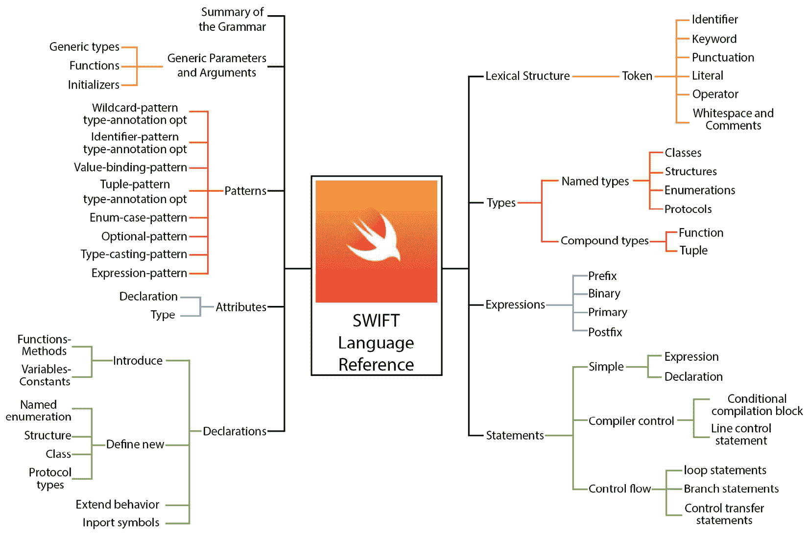
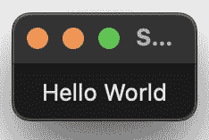
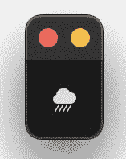
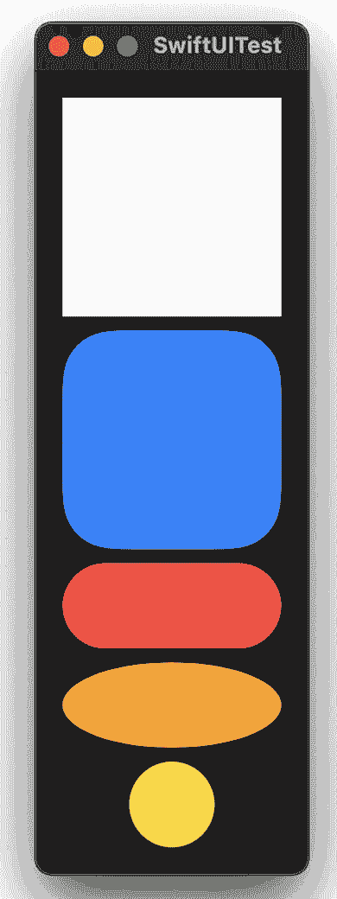
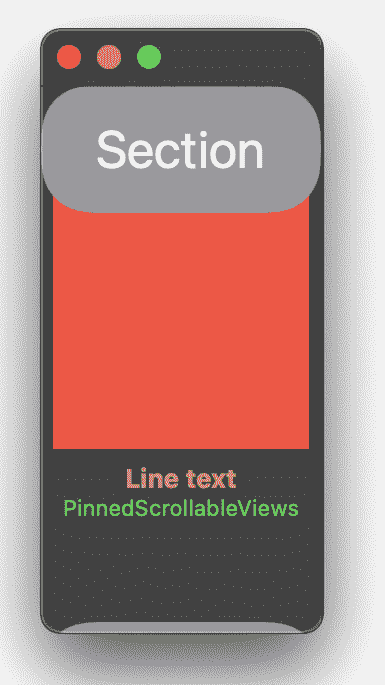
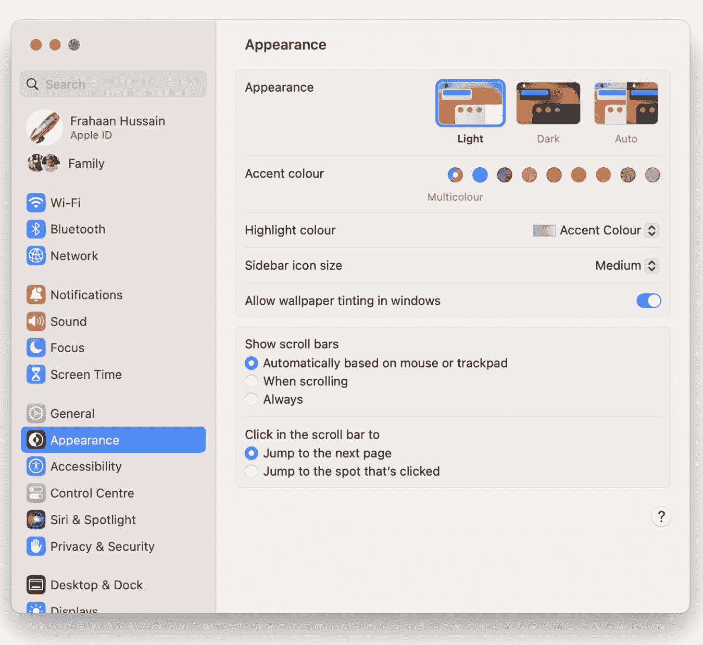
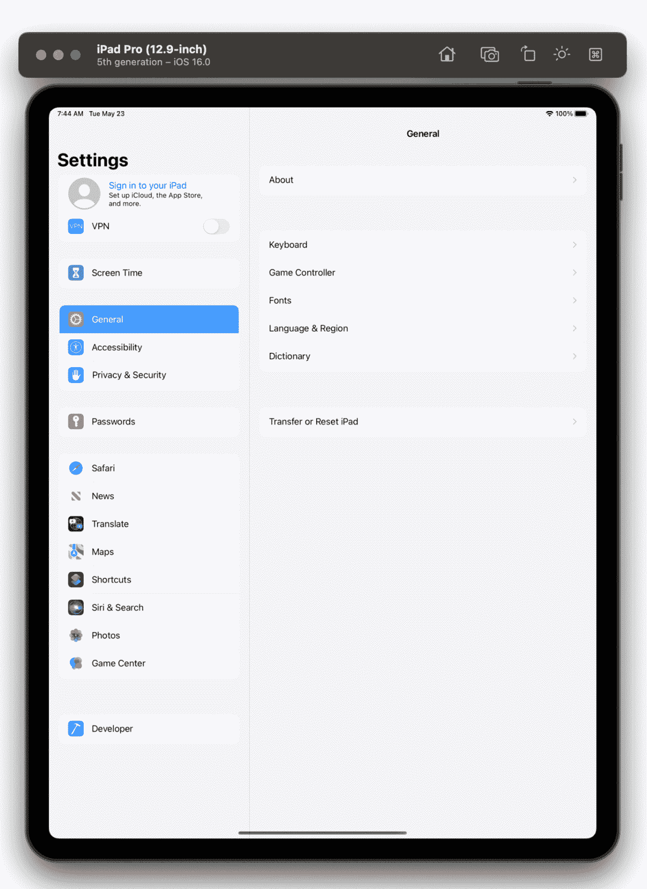
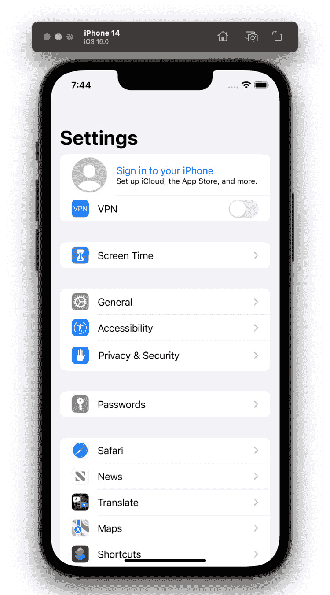

# 第一章：Swift 和 SwiftUI 回顾

首先，我想感谢你阅读我的书，无论是购买、借阅，还是你在亚马逊预览中偷看，我都感谢你。

本章将回顾 Swift 和 SwiftUI。我们将首先介绍为即将到来的项目在整个书中使用的编码标准以及 Swift 和 SwiftUI 的历史。然后，我们将查看完成本书中项目的要求。编码标准可能会对程序员产生很大的分歧，但它们实际上不应该这样。如果你有任何不同意见，请随时在`@SonarSystems`上发推文并告诉我原因。但不要让这一点影响本书以及你可以从中获得的内容。

之后，我们将查看一些具体的 SwiftUI 代码示例以及预览，以结束回顾。我们将查看如何使用视图和控制；这些是应用程序用户界面的视觉构建块。我们将贯穿全书使用它们在屏幕上绘制和组织应用程序的内容。接下来，我们将查看布局和展示，了解我们如何将视图组合在堆栈中，动态创建视图的组和列表，以及定义视图展示和层次结构。希望你喜欢这一章！

如果你有任何问题，欢迎加入我的 Discord：[`discord.gg/7e78FxrgqH`](https://discord.gg/7e78FxrgqH)。

在本章中，我们将涵盖以下主题：

+   什么是 Swift？

+   什么是 SwiftUI？

+   理解和实现视图

+   理解和实现布局

到本章结束时，你将学习 Swift 和 SwiftUI 的历史，以及如何从 SwiftUI 实现基本组件；这将为我们在本书中创建的项目奠定基础。

# 技术要求和标准

本书要求您从 Apple 的 App Store 下载 Xcode 14 或更高版本。

要安装 Xcode，只需在 App Store 中搜索`Xcode`，选择并下载最新版本。打开 Xcode，并遵循任何额外的安装说明。一旦 Xcode 打开并启动，你就可以开始了。

Xcode 的 14 版本具有以下功能/要求：

+   包含 iOS 16、iPadOS 16、macOS 12.3、tvOS 16 和 watchOS 9 的 SDK。

+   支持 iOS 11 或更高版本、tvOS 11 或更高版本和 watchOS 4 或更高版本在设备上的调试。

+   需要 macOS Monterey 12.5 或更高版本的 Mac。

从以下 GitHub 链接下载示例代码：

[`github.com/PacktPublishing/Elevate-SwiftUI-Skills-by-Building-Projects`](https://github.com/PacktPublishing/Elevate-SwiftUI-Skills-by-Building-Projects)

这里是硬件要求：

+   你需要一个 Intel 或 Apple Silicon Mac

+   4GB RAM 或更高

这里是软件要求：

+   macOS 11.3（Big Sur 或更高版本）

+   Xcode 14

+   iOS 16 用于 iPad/iPhone 真实设备测试

+   watchOS 9.0 用于 Watch 真实设备测试

+   tvOS 16.0 用于 Apple TV 真实设备测试

这里有一些额外的要求：

+   Swift 的中级知识

+   对其他面向对象编程语言（如 C++ 或 Objective-C）的中级知识

重要提示

虽然你可以在 Xcode 提供的模拟器中测试应用程序，但强烈建议你在真实设备上测试它们。

# 使用的标准

在本节中，我们将探讨本书中使用的编码标准。保持一致的标准并了解这些标准很重要。

## 我们为什么需要编码标准？

编写好的代码很重要，好的代码不仅仅是运行良好的代码，而是易于维护和阅读的代码。好的代码是一种艺术形式。

在以下章节中，我们将介绍在 Swift 编程语言中使用的标准，这些标准将贯穿整本书。如果你不完全同意这些标准，那也无所谓，但我认为列出这些标准很重要，以防你遇到从未见过的内容，比如 Yoda 条件——你们中有谁使用它们吗？如果是的话，请在 `@SonarSystems` 上给我发推文。

### 缩进

你应该始终缩进你的代码，使其与同一层级的其他代码对齐。使用实际的制表符进行缩进代码。你可以在以下代码片段中看到这一点：

```swift
if ( 10 == counter ){
    print( "Counter is 10" )
    print( "Well done" )
}
else
{ print( "Wrong" ) }
```

这很有帮助，因为你可以很容易地看到代码在层次结构中的位置。Xcode 提供了一个方便的快捷键来缩进代码；只需在键盘上按 *^ + I* 即可。

### 括号风格

当你为结构编写代码时，应该始终使用 Allman 括号（以 *Eric Allman* 命名），即使只有一行（在许多语言中，如 C++，一行代码不需要括号，但为了易于阅读，应该使用它们）。如果你在结构中只有一行代码，将括号和代码放在同一行上。我更喜欢不在结构的第 一行放置开括号。唯一我会将括号放在同一行的情况是，结构中还没有代码；那时，将开括号和闭括号放在同一行，并在它们之间留一个空格。

以下代码片段显示了首选的括号风格：

```swift
if ( 10 == counter ){
    print( "Counter is 10" )
    print( "Well done" )
}
else
{ print( "Wrong" ) }
```

这很有帮助，因为它有助于维护代码，并在试图弄清楚结构开始和结束的地方时提高可读性。这在快速处理大量文件并试图找出问题时特别有用。

### 空格使用

空格和行的使用取决于你在代码中使用的内容。删除任何尾随空格（行尾的空格）。你可以在以下代码片段中看到这一点：

```swift
print( "Well done" )
```

一些编辑器会自动删除尾随空格，但有些不会。这可能会导致合并冲突。你应该与你的同事和开源社区的人协调，了解大家使用的策略，并确保你们都使用相同的策略。

### 逗号和冒号的使用

当使用逗号/冒号时，在逗号/冒号后放置一个空格。你可以在以下示例中看到这一点：

```swift
func Greet( person: String, alreadyGreeted: Bool ) -> String
```

这使得阅读更容易。

### 括号内的空格

在`if`、`else`、`else if`、`for`、`while`和其他控制结构（某些语言可能有其他控制结构，因此只需将这些标准应用于这些结构）的左右括号两侧各放置一个空格。您可以在以下代码片段中看到这一点：

```swift
if ( 10 == counter )
```

这些空格使理解更容易，尤其是在快速浏览时。

### 一元运算符

当在语句中使用一元运算符，如`++`和`–`时，在其后放置一个空格。您可以在以下代码片段中看到这一点：

```swift
for ( i = 0; i < 5; i++ )
```

这些空格使代码保持一致性，并使其更容易浏览。

### 函数的括号空格

在定义函数时，在左右括号内部放置一个空格。您可以在以下代码片段中看到这一点：

```swift
func GetString( id: Int )
```

这些空格使代码保持一致且易于阅读。

### 函数调用间距

调用一个函数也遵循与定义函数完全相同的规则。您可以在以下代码片段中看到这一点：

```swift
Adder( num1: 10, num2: 5 )
```

这样读起来更容易，也更美观。

### 方括号间距

当使用方括号时，在左右括号内部不要使用任何空格。您可以在以下代码片段中看到这一点：

```swift
let vectors : [[Int]] = [[1, 2, 3], [4, 5, 6]]
```

虽然这与括号不同，但这样看起来更好。行长度通常不应超过 80 个字符，但如果有助于可读性，则可以例外。

### 类型转换

当进行类型转换时，始终将类型放在括号内，而不是变量，并在括号内部使用一个空格，但不在关闭括号外部使用空格。您可以在以下代码片段中看到这一点：

```swift
( Int )age
```

这样，它更容易阅读，也更美观。它还使在嵌套时确定变量和类型转换之间的关系更容易。

### 命名约定

本节将介绍本书中使用的命名约定。始终使用有意义的但不要太长的名称。尽可能让代码自我说明，例如，不要使用`scoreForThePlayerForLevel1`这样的名称，而是使用`scorePlayerLevel1`）。

+   `EpicFunction`

+   `epicVariable`

+   **常量** - 所有字母大写

所有属于对象（如类）的变量都应该以下划线开头 - 例如，`_localVariable.`

这很有帮助，因为它使代码保持一致，从而提高效率、可读性和可维护性。它帮助他人更好地理解您的代码。它看起来也很不错。

### Yoda 条件

当比较变量和值时，始终将值与变量进行比较，而不是将变量与值进行比较。您可以在以下代码块中看到这一点：

```swift
if ( 10 == counter )
```

这很有帮助，因为它可以防止您意外地将值分配给变量而不是进行比较，从而得到一个真值，并使 if 语句等于真。

### 注释

这是一个大多数人都不喜欢的领域，很多人会错过或者拖到最后一刻才意识到这需要大量的努力，所以我会建议你在编写代码的过程中随时添加注释。

在代码中注释时，使用 `//` 进行单行注释，使用 `/* */` 进行多行注释（根据你使用的编程语言，注释的方式可能会有所不同），并且所有字母都应该小写。你可以在下面的示例中看到这一点：

```swift
/*    This checks if the counter is 10
    If successful then inform user
*/
if ( 10 == counter )
{
    print( "Counter is 10" )
    // Print congratulation message
    print( "Well done" )
}
```

当试图理解你的代码做了什么时，这很有用，尤其是如果它很复杂，或者你在长时间之后阅读它。当其他人/程序员试图理解你的代码时，这也很有用，因为你的编码方式可能与其他人不同，注释对于帮助他们理解正在发生的事情至关重要。

### 没有魔法数字

魔法数字是一个看起来像是随机放置在代码中且没有任何上下文或明显意义的数字。这就是我们所说的反模式，因为阅读和理解代码变得非常困难，难以维护。代码必须是故意的，而且仅仅通过快速浏览，你就能理解它；这是代码质量的基础。

使用常量和变量。使用 `MAX_COUNT` 而不是像 10 这样的任意数字。你可以在下面的代码片段中看到这一点：

```swift
if ( MAX_COUNT == counter ){
    print( "Counter is 10" )
    print( "Well done" )
}
```

这使得代码库更容易管理和理解。

在本节中，我们探讨了我在编码中使用的标准。我认为解释它们非常重要，不一定是为了说服你使用我选择的标准，而是为了在你看到书中任何似乎与你的正常标准不同之处时有一个参考点。最重要的是，与其他任何与你协作的队友保持标准的一致性。这是最重要的事情；使用的具体标准是次要的，但一致性是首要的。

# 什么是 Swift？

在本节中，我们将介绍 Swift 是什么，它的历史，以及它在宏观层面上的工作方式。如果你是专家，只想阅读关于 SwiftUI 的内容，请随意跳过这一节。

Swift 是由苹果公司和开源社区创建的一种编程语言。它是一种通用、编译和多种模式的编程语言。它于 2014 年发布，作为苹果之前语言 Objective-C 的替代品。由于 Objective-C 自 20 世纪 80 年代初以来几乎保持不变，它缺少了许多现代语言所拥有的功能。因此，Swift 的创建开始了；它席卷了苹果开发者生态系统，成为了一种非常受欢迎的编程语言。全球各地的公司都需要它，并为那些知道如何利用其巨大功能的人提供优厚的报酬。根据以下图表中显示的 PYPL 指数，Swift 是最受欢迎的 10 种语言之一，因此对于任何程序员来说都是必备的：


图 1.1 – 编程语言流行指数（来源：[`www.stackscale.com/wp-content/uploads/2022/09/PYPL-index-popular-programming-languages-2022.jpg`](https://www.stackscale.com/wp-content/uploads/2022/09/PYPL-index-popular-programming-languages-2022.jpg)）

Swift 已被用于创建许多应用程序，包括但不限于以下：

+   LinkedIn

+   Firefox

+   WordPress

+   Wikipedia

+   Lyft

Apple 的 Cocoa 和 Cocoa Touch 框架与 Swift 无缝协作。此外，它还与 Apple 之前的编程语言 Objective-C 无缝协作，Objective-C 已被开发者使用了几十年。这使得它成为最现代且易于使用的语言之一。那些需要等待框架发布/更新以适应所选语言的年代已经过去了；相反，已经有成千上万的 Objective-C 项目存在，可以在等待期间使用。

Swift 是使用 **低级虚拟机** (**LLVM**) 编译器框架构建的，该框架是开源的，自 Xcode 6 版本以来捆绑提供，并于 2014 年发布。它使用 Apple 设备上的 Objective-C 运行时库，因此允许用 C、Objective-C、C++ 和 Swift 编写的代码在单个应用程序中协同工作。以下图示从宏观层面解释了 Swift、LLVM 和不同架构之间编程语言的关系：


图 1.2 – LLVM 和语言关系

（来源：[`miro.medium.com/max/1024/1*VWogVHhCagxopvAKVFjBeA.jpeg`](https://miro.medium.com/max/1024/1*VWogVHhCagxopvAKVFjBeA.jpeg)）

LLVM 使用 Clang 作为前端，Clang 是 C、C++、CUDA 或 Swift 的 swiftc 编译器。然后它将代码转换为 LLVM 使用的格式，进而将其转换为机器代码，机器代码随后在硬件上运行/执行。

如需了解更多关于 LLVM 的信息，请自由使用以下链接：

+   [`llvm.org/`](https://llvm.org/)

+   [`en.wikipedia.org/wiki/LLVM`](https://en.wikipedia.org/wiki/LLVM)

+   [`github.com/llvm/llvm-project`](https://github.com/llvm/llvm-project)

+   [`www.youtube.com/watch?v=BT2Cv-Tjq7Q&ab_channel=Fireship`](https://www.youtube.com/watch?v=BT2Cv-Tjq7Q&ab_channel=Fireship)

+   [`www.youtube.com/watch?v=IR_L1xf4PrU&ab_channel=tanmaybakshi`](https://www.youtube.com/watch?v=IR_L1xf4PrU&ab_channel=tanmaybakshi)

+   [`www.youtube.com/watch?v=ZQds2aGHwDA&ab_channel=LexFridman`](https://www.youtube.com/watch?v=ZQds2aGHwDA&ab_channel=LexFridman)

+   [`www.youtube.com/watch?v=yCd3CzGSte8&ab_channel=LexFridman`](https://www.youtube.com/watch?v=yCd3CzGSte8&ab_channel=LexFridman)

为了从宏观角度理解作为 Swift 开发者可用的功能，请查看以下图表：



图 1.3 – Swift 语言参考

（来源：[`gogeometry.com/software/swift/swift-language-reference-mind-map.jpg`](https://gogeometry.com/software/swift/swift-language-reference-mind-map.jpg)）

上述图表是一个思维导图，展示了 Swift 提供的所有高级功能及其子功能以及它们如何相互关联。

在本节中，我们介绍了 Swift 是什么，它是如何工作的，以及它的流行程度。

# 什么是 SwiftUI？

在本节中，我们将介绍 SwiftUI 是什么，以及我们将利用本书中的哪些功能来创建我们的项目。如果您对 SwiftUI 感到舒适并且只想查看项目，那么请随意跳过本章的其余部分。

SwiftUI 是建立在 Swift 编程语言之上的用户界面框架。它为创建应用程序的用户界面提供了许多组件；以下是对这些组件的宏观列表：

+   视图和控制

+   形状

+   布局容器

+   集合容器

+   呈现容器

除了前面列表中的组件外，SwiftUI 还为我们提供了事件处理器，允许我们的应用程序对点击、手势以及可能从用户那里接收到的所有类型的输入做出反应。该框架提供了从模型到用户与之交互的视图和控制器的数据流管理的工具。

现在，我们将探讨 Swift 的不同核心功能，包括您可以带走、修改并在自己的项目中使用的示例。

## 视图和控制

视图和控制是您应用程序 UI 的基础块。使用视图，我们可以构建您希望为应用程序创建的 UI。其复杂性可以是您想要的任何程度，简单或极其复杂——完全取决于您——我们将在接下来的章节中更详细地探讨这一点。

视图可以是以下任何一种：

+   文本

+   图片

+   形状

+   自定义绘图

+   所有这些的组合

控件使用户能够与适应其使用平台和上下文的 API 进行交互。

## 形状

SwiftUI 中的形状是二维对象，如圆形和矩形。还可以利用自定义路径来设置您自己的形状/结构的参数；我们将在接下来的章节中更详细地探讨形状。

形状提供了添加样式的功能，包括但不限于以下内容：

+   环境感知颜色

+   丰富的渐变

+   前景中的材质效果

+   背景

+   形状的轮廓

## 布局容器

布局负责组织应用 UI 的元素。堆叠和网格用于根据内容或界面尺寸的变化更新和修改其中子视图的位置。布局可以嵌套在彼此之中；这可以做到任意多级，从而允许你创建复杂的布局。还可以设计自定义布局以提供更多灵活性；我们将在稍后更深入地探讨布局容器。

## 收集容器

收集可以用来组装具有复杂功能的动态视图。例如，你可以创建一个允许你滚动浏览大量数据的 List 视图。列表自动提供基本功能，但除此之外，你还可以通过最小配置添加其他功能，如滑动、双击和下拉刷新。

如果只需要简单的网格或堆叠配置，请使用布局容器；我们将通过代码示例进一步说明这些。

## 展示容器

展示容器用于为应用 UI 提供结构。这使用户能够更容易地导航，在应用中跳转。当其复杂性增加且包含更多视图时，这尤其有用。例如，你可以通过`NavigationStack`启用在一系列视图之间前后导航，以及通过`TabView`选择要显示的视图。

在本节中，我们介绍了 SwiftUI 在宏观层面提供的不同功能；我们还讨论了它们的子功能和用途。

# 理解和实现视图

在本节中，我们将探讨视图以及如何在 SwiftUI 中实现它们。我们还将查看如何组合这些视图。

视图是应用用户界面的基本构建块。视图对象在其矩形边界内渲染内容并处理与该内容的任何交互。

在以下各节中，我们将展示每种类型视图的源代码和示例。如果你需要更多信息，请访问苹果的文档[`developer.apple.com/documentation/uikit/views_and_controls`](https://developer.apple.com/documentation/uikit/views_and_controls)。

## 文本视图是什么？

在我们的应用中显示文本是非常常见的，我们通过使用文本视图来实现这一点，它绘制一个字符串。默认情况下，它分配了一个最适合其显示平台的字体；然而，你可以使用`font(_:)`视图修饰符来更改字体。

下面的代码片段显示了实现文本视图所使用的代码：

```swift
var body: some View{
    VStack
    {
        Text( "Hello World" )
    }
    .padding( )
}
```

文本视图被插入到`VStack`中用于填充目的，但这不是必需的。

前面的代码展示了如何通过传递一个字符串来使用 Text 视图简单地显示所需显示的内容。

下图显示了前面代码的输出：



图 1.4 – 文本视图预览

下一节将介绍图片视图及其实现方法。

## 图片视图是什么？

图片视图可以用来在 SwiftUI 布局中渲染图片。图片是提供更多上下文和改善整体用户体验的绝佳方式。图片视图可以从你的包、系统图标、`UIImage`等加载图片，但最常用的方法是加载从你的包和系统图标。

以下代码片段显示了实现图片视图所使用的代码：

```swift
var body: some View{
    VStack
    {
        Image( systemName: "cloud.heavyrain.fill" )
    }
    .padding( )
}
```

在前面的代码中，我们使用系统图标实现了一个图片视图，但你也可以轻松指定自己的图片文件。我们将在本章后面这样做。

在这个例子中，使用了系统图标，但使用你的包和`UIImage`的过程是类似的。

以下图显示了前面代码的输出：



图 1.5 – 图片视图预览

下一节将介绍我们可用的不同形状视图及其使用代码。

## 形状视图是什么？

SwiftUI 为我们提供了五种常用的基本形状。这些形状是矩形、圆角矩形、圆形、椭圆形和胶囊。后三种在行为上非常微妙地不同，这取决于你提供的尺寸。

以下代码展示了如何简单地实现以下任何一种形状：

+   `Rectangle`

+   `RoundedRectangle`

+   `Capsule`

+   `Ellipse`

+   `Circle`

这里是代码片段：

```swift
var body: some View{
    VStack
    {
        Rectangle( )
            .fill( .white )
            .frame( width: 128, height: 128 )
        RoundedRectangle( cornerRadius: 30, style: .continuous )
            .fill( .blue )
            .frame( width: 128, height: 128 )
        Capsule( )
            .fill( .red )
            .frame( width: 128, height: 50 )

        Ellipse( )
            .fill( .orange )
            .frame( width: 128, height: 50 )
        Circle( )
            .fill( .yellow )
            .frame( width: 128, height: 50 )
    }
    .padding( )
}
```

这些形状被插入到`VStack`中以垂直排列，并在它们周围添加了填充。

前面的代码展示了如何实现不同的形状视图以及每个视图所需的参数。

以下图显示了前面代码的输出：



图 1.6 – 形状视图

在下一节中，我们将探讨如何使用我们已覆盖的视图来组合和创建更复杂的视图。

## 自定义和组合视图是什么？

对于所有前端开发者来说，开发过程中最关键的部分之一是实现用户界面（UI）。我们可以通过组合我们迄今为止利用的预制的内置视图来创建一个简单的 UI，但有时这还不够；经常会有开发者需要程序化地绘制自定义视图以满足 UI 需求，如果我们无法绘制这些视图，就会产生问题。我们能够利用 SwiftUI 的力量来创建自定义视图，这些视图实际上是之前我们了解的其他视图的组合。

以下代码展示了如何使用多个视图创建我们自己的自定义视图，该视图显示一个迷你个人资料：

```swift
import SwiftUIstruct Employee
{
    var name: String
    var jobTitle: String
    var emailAddress: String
    var profilePicture: String
}
struct ProfilePicture: View
{
    var imageName: String
    var body: some View
    {
        Image( imageName )
            .resizable( )
            .frame( width: 100, height: 100 )
            .clipShape( Circle( ) )
    }
}
struct EmailAddress: View
{
    var address: String
    var body: some View
    {
        HStack
        {
            Image( systemName: "envelope" )
            Text( address )
        }
    }
}
struct EmployeeDetails: View
{
    var employee: Employee
    var body: some View
    {
        VStack( alignment: .leading )
        {
            Text( employee.name )
                .font( .largeTitle )
                .foregroundColor( .primary )
            Text( employee.jobTitle )
                .foregroundColor( .secondary )
            EmailAddress( address: employee.emailAddress )
        }
    }
}
struct EmployeeView: View
{
    var employee: Employee
    var body: some View
    {
        HStack
        {
            ProfilePicture( imageName: employee.profilePicture )
            EmployeeDetails( employee: employee )
        }
    }
}
struct ContentView: View
{
    let employee = Employee( name: "Frahaan Hussain", jobTitle: "CEO & Founder", emailAddress: "frahaan@hussain.com", profilePicture: "FrahaanHussainIMG" )
    var body: some View
    {
        EmployeeView( employee: employee )
    }
}
struct ContentView_Previews: PreviewProvider
{
    static var previews: some View
    {
        ContentView( )
    }
}
```

前面的代码展示了如何组合视图来创建自定义视图，以及如何组合自定义视图来创建更复杂的视图。这也使得迷你视图可重用。

以下图显示了前面代码的输出：


图 1.7 – 自定义视图（迷你个人资料）

在本节中，我们探讨了如何将前几节中的视图组合起来，以创建可重用和可组合的对象，并创建更复杂的视图。

在下一节中，我们将探讨布局，以帮助我们在应用中组织内容。

# 理解和实现布局

本节将介绍如何使用布局来安排我们的视图，以实现更动态的用户体验。

SwiftUI 布局允许我们作为开发者使用提供的布局工具来安排应用界面的视图。布局告诉 SwiftUI 如何放置一组视图，以及它需要多少空间来完成这项工作以提供所需的布局。

布局可以是以下任何一种，但不仅限于：

+   懒加载堆叠

+   间隔符：

    +   `ScrollViewReader`

+   网格：

    +   `PinnedScrollableViews`

在以下几节中，我们将向您展示每种布局的源代码和示例。

注意

如果您需要更多信息，请访问苹果的文档：[`developer.apple.com/documentation/uikit/view_layout`](https://developer.apple.com/documentation/uikit/view_layout)。

## 什么是懒加载堆叠？

懒加载堆叠是按行排列其子视图的视图，这些行垂直扩展，仅在需要时创建项目。

SwiftUI 提供了两种不同类型的懒加载堆叠，`LazyVStack`和`LazyHStack`。默认情况下，`VStack`和`HStack`会预先加载所有内容，如果您在滚动视图中使用它们，这将会很慢，因为这些视图可以包含大量内容。如果您想以懒加载的方式加载内容，即仅在内容出现在视图中时才加载，而不是在视图通常可见但内容不可见时加载，您应适当使用`LazyVStack`和`LazyHStack`。

根据苹果的解释，懒指的是堆叠视图只有在需要时才创建项目。这意味着这些堆叠视图的性能默认已经进行了优化。

`LazyVStack`和`LazyHStack`仅在 iOS 14.0+、iPadOS 14.0+、macOS 11.0+、Mac Catalyst 14.0+、tvOS 14.0+和 watchOS 7.0+中可用。更多信息可以在以下链接中找到：

+   `LazyVStack` – [`developer.apple.com/documentation/swiftui/lazyvstack`](https://developer.apple.com/documentation/swiftui/lazyvstack)

+   `LazyHStack` – [`developer.apple.com/documentation/swiftui/lazyhstack`](https://developer.apple.com/documentation/swiftui/lazyhstack)

以下代码展示了我们如何使用`LazyVStack`来垂直组织视图，同时在大数据量下保持高效：

```swift
import SwiftUIstruct ContentView: View
{
    var body: some View
    {
        ScrollView
        {
            LazyVStack
            {
                ForEach( 1...1000, id: \.self )
                {
                    value in
                    Text( "Line \( value )" )
                }
            }
        }
        .frame( height: 256 )
    }
}
struct ContentView_Previews: PreviewProvider
{
    static var previews: some View
    {
        ContentView( )
    }
}
```

前面的代码实现了一个包含`1000`个文本视图的`LazyVStack`。文本视图通过循环添加，使其更简单、更高效。

以下图显示了前面代码的输出：


图 1.8 – 懒加载堆叠

在下一节中，我们将探讨间隔符，它们帮助我们分散内容。

## 什么是间隔符？

间隔创建了一个无内容的自适应视图，它可以尽可能多地扩展。例如，当放置在 `HStack` 中时，间隔会水平扩展，允许堆栈扩展，将视图移出堆栈，在堆栈的大小限制内。

在以下代码中，我们实现了文本和间隔：

```swift
import SwiftUIstruct ContentView: View
{
    var body: some View
    {
        Text( "Label 1" )
        Spacer( ).frame( height: 64 )
        Text( "Label 2" )
    }
}
struct ContentView_Previews: PreviewProvider
{
    static var previews: some View
    {
        ContentView( )
    }
}
```

前面的代码使用了一个高度为 `64` 的间隔来分隔两个文本视图。

下图显示了前面代码的输出：


图 1.9 – 间隔预览

在下一节中，我们将探讨 `ScrollViewReader`，它使我们能够移动到任何位置。

## ScrollView 和 ScrollViewReader 是什么？

`ScrollView` 允许用户在可滚动区域内查看内容。用户可以通过执行平台特定的滚动手势来调整内容的可见部分。`ScrollView` 可以水平和垂直滚动，但不支持缩放。如果您想以编程方式将 `ScrollView` 移动到特定位置，您应该在其中添加一个 `ScrollViewReader`。这提供了一个名为 `scrollTo()` 的方法，只需提供其锚点即可移动到父 `ScrollView` 中的任何视图。

所有这些都可以通过几行简单的代码实现。您可以通过以下方式查看此代码：

```swift
import SwiftUIstruct ContentView: View
{
    var body: some View
    {
        let colors: [Color] = [.red, .green, .blue, .white, .yellow]
        ScrollView
        {
            ScrollViewReader
            {
                value in
                Button( "Go to Number 45" )
                {
                    value.scrollTo( 45 )
                }
                .padding( )
                ForEach( 0..<1000 )
                {
                    i in
                    Text( "Example \( i )" )
                        .font( .title )
                        .frame( width: 256, height: 256 )
                        .background( colors[i % colors.count] )
                        .id( i )
                }
            }
        }
        .frame( height: 512 )
    }
}
struct ContentView_Previews: PreviewProvider
{
    static var previews: some View
    {
        ContentView( )
    }
}
```

前面的代码在 `ScrollView` 中实现了 `ScrollViewReader`。在其中，我们添加了一个按钮来滚动到具有 `id` 值为 `45` 的文本视图。我们使用循环显示了 `1000` 个具有唯一 ID 的文本视图。

下图显示了前面代码的输出：


图 1.10 – ScrollViewReader 预览

在下一节中，我们将探讨网格，它允许我们以表格形式组织我们的内容。

## 网格是什么？

当 SwiftUI 首次发布时，它没有内置集合视图。开发者只剩下两个选择——要么自己构建，要么使用第三方解决方案。在 2020 年的 WWDC 上，苹果为 SwiftUI 框架引入了新功能。其中之一是解决网格视图的需求。现在，SwiftUI 提供了两个新的组件，`LazyVGrid` 和 `LazyHGrid`。一个是用于垂直网格，另一个是用于水平网格。

以下代码显示了如何实现两行网格：

```swift
import SwiftUIstruct ContentView: View
{
    let items = 1...50
    let rows =
    [
        GridItem( .fixed( 32 ) ),
        GridItem( .fixed( 32 ) )
    ]
    var body: some View
    {
        ScrollView( .horizontal )
        {
            LazyHGrid( rows: rows, alignment: .center )
            {
                ForEach( items, id: \.self )
                {
                    item in
                    Image(systemName: "\( item ).circle.fill" )
                        .font( .largeTitle )
                }
            }
            .frame( height: 128 )
        }
    }
}
struct ContentView_Previews: PreviewProvider
{
    static var previews: some View
    {
        ContentView( )
    }
}
```

在前面的代码片段中，我们使用循环实现了一个两行图像网格。使用了 `GridItem` 组件；苹果公司表示这些是懒加载网格中行或列的描述。这实际上意味着什么？嗯，它本质上是一种指定我们想要多少列/行的方法，从而设置布局模式。`LazyGrid` 在迭代显示的项目并相应地定位它们时使用这种布局模式。如果您有网页背景，您可以将它想象成响应式网站中的网格系统。

下图显示了前面代码的输出：


图 1.11 – 网格预览

下一节将介绍 `PinnedScrollableViews`，它允许某些视图在页面上的其他视图滚动过它们时保持粘性。

## 什么是 PinnedScrollableView？

SwiftUI 可以在 `ScrollView` 内提供 `PinnedScrollableView`。固定视图是粘性视图，可以应用于头部或底部。

以下代码展示了我们如何将视图固定以提供上下文，当其他视图滚动过它时：

```swift
import SwiftUIstruct MyCell: View
{
    var body: some View
    {
        VStack
        {
            Rectangle( )
                .fill( Color.red )
                .frame( width: 128, height: 128 )
            HStack
            {
                Text( "Line text" )
                    .foregroundColor( .yellow )
                    .font( .headline )
            }
            Text( "PinnedScrollableViews" )
                .foregroundColor( .green )
                .font( .subheadline )
        }
    }
}
struct ContentView: View
{
    var stickyHeaderView: some View
    {
        RoundedRectangle( cornerRadius: 25.0, style: .continuous )
            .fill( Color.gray )
            .frame( maxWidth: .infinity )
            .frame( height: 64 )
            .overlay(
                Text( "Section" )
                    .foregroundColor( Color.white )
                    .font( .largeTitle )
            )
    }
    var body: some View
    {
        NavigationView
        {
            ScrollView
            {
                LazyVStack( alignment: .center, spacing: 50, pinnedViews: [.sectionHeaders], content:
                {
                    ForEach( 0...50, id: \.self )
                    {
                        count in
                        Section( header: stickyHeaderView )
                        {
                            MyCell( )
                        }
                    }
                } )
            }
        }
    }
}
struct ContentView_Previews: PreviewProvider
{
    static var previews: some View
    {
        ContentView( )
    }
}
```

在前面的代码片段中，我们实现了一个粘性视图，它作为其他视图动态移动过它时的部分标题，但当达到另一个部分时，粘性视图会从屏幕上移除，并且它有自己的粘性视图。

以下图显示了前面代码的输出：



图 1.12 – PinnedScrollableViews 预览

在本节中，我们介绍了我们可访问的不同布局。这些布局使我们能够以更令人愉悦的方式组织数据。在下一节中，我们将查看本书中我们将创建的项目不同设备预览。

# 设备预览

我们将克服的许多障碍之一是四个主要苹果产品类别之间的差异。这些类别如下：

+   Mac – iMac、Mac Pro、MacBook、任何运行 macOS 的设备，甚至是 Hackintosh

+   iPad – 迷你、常规、Air、Pro，所有这些

+   iPhone – 迷你、Pro、Pro Max，所有 iPhone

+   Apple Watch – 小型、大型、旧款或新款

你会立即注意到它们越来越小。它们自然有不同的用途；Apple Watch 不能取代 Mac，反之亦然。这就是为什么接下来的八个章节被分成对，每个产品类别一个。我们将揭示我们在创建应用程序时面临的设计决策和限制。让我们看看每个产品类别的设置：

**Mac**



图 1.13 – Mac 设置

**iPad**



图 1.14 – iPad 设置

**iPhone**



图 1.15 – iPhone 设置

**Apple Watch**:


图 1.16 – Apple Watch 设置

乍一看，就可以立即看出它们之间存在差异。这正是我们将在本书剩余部分讨论的差异。下一节将总结本章内容，然后转向我们的第一个项目。

# 概述

在本章中，我们介绍了 Swift 和 SwiftUI 的历史，以及我们在宏观层面提供的功能，以及 Swift 和 SwiftUI 在技术层面的工作原理。然后，我们探讨了 Swift 和 SwiftUI 之间的区别以及提供了哪些功能，并附上了代码示例供您带走并在自己的项目中使用。之后，我们审视了使用 Swift 和 SwiftUI 开发应用程序所需的必要条件。接着，我们审视了本书中使用的编码标准，为任何您不熟悉的编码风格提供了一个参考点。然后，我们探讨了 SwiftUI 提供的视图和控制，用于创建我们自己的用户体验，包括通过组合基础知识创建的自定义视图。最后，我们探讨了如何使用布局来组织这些视图，并检查了设备预览。

在我们接下来的章节中，我们将探讨设计我们的第一个项目，即我们将创建的税务计算器应用程序。
