# 第五章：iPad 项目 – 照片库增强视图

在本章中，我们将致力于在我们的照片库项目中实现增强视图和页面导航功能。在前一章中，我们探讨了照片库的设计及其独特的工作方式，因为它是为大设备开发的。然后，我们将其分解为两个视图和全屏模式。之后，我们实现了第一个视图，即突出视图。为此，我们确定了所需的组件。然后，我们使用 SwiftUI 实现了所有组件。在前一章的结尾，我们只有一个突出视图的精美线框，没有与其他视图的连接。现在，我们将创建增强视图并实现所有功能，以在视图之间提供导航并在突出视图和增强视图之间发送图像元数据。

本章将分为以下部分：

+   `EnhancedView` 设计概述

+   更新 `HighlightView`

+   测试 `EnhancedView`

+   额外任务

到本章结束时，你将创建一个功能齐全的照片库，利用 iPad 的巨大屏幕空间，你可以根据自己的需求进行修改、调整和使用。当本章结束时，我将给你一些练习，以将更高级的功能实现到照片库中。这将很好地过渡到我们的下一个项目，即 Mac App Store。

# 技术要求

本章要求您从 Apple 的 App Store 下载 Xcode 14 或更高版本。

要安装 Xcode，只需在 App Store 中搜索 Xcode，然后选择并下载最新版本。打开 Xcode 并遵循任何额外的安装说明。一旦 Xcode 打开并启动，你就可以开始了。

Xcode 14 版本具有以下功能/要求：

+   包含适用于 iOS 16、iPadOS 16、macOS 12.3、tvOS 16 和 watchOS 9 的 SDK。

+   支持 iOS 11 或更高版本、tvOS 11 或更高版本和 watchOS 4 或更高版本在设备上的调试。

+   需要 Mac 运行 macOS Monterey 12.5 或更高版本。

如需有关技术细节的更多信息，请参阅*第一章*。

本章的代码文件可以在此处找到：

[`github.com/PacktPublishing/Elevate-SwiftUI-Skills-by-Building-Projects/tree/main/Code/Chapter%205%20-%20iPad%20Project%20-%20Photo%20Gallery%20Enhanced%20View`](https://github.com/PacktPublishing/Elevate-SwiftUI-Skills-by-Building-Projects/tree/main/Code/Chapter%205%20-%20iPad%20Project%20-%20Photo%20Gallery%20Enhanced%20View)

在下一节中，我们将探讨 `EnhancedView`。我们将将其分解为我们可以实现的部分。

# 增强视图设计概述

在本节中，我们将实现 `EnhancedView`。如果你还记得，在前一章中，我们讨论了 `EnhancedView` 的设计。以下图示显示了 `EnhancedView` 的竖屏和横屏模式，以供提醒：

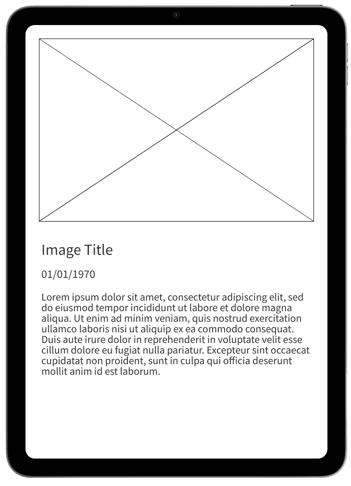

图 5.1 – EnhancedView 线框预览（纵向模式）

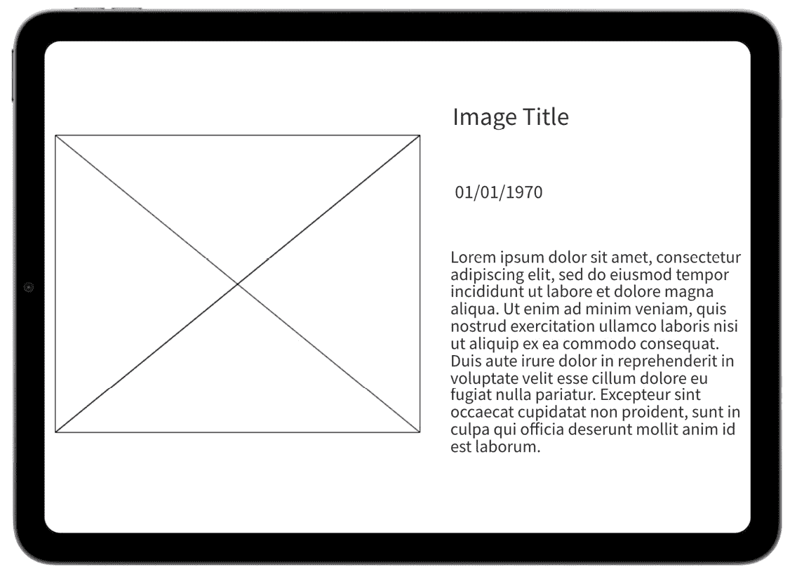

图 5.2 – 横屏模式下的 EnhancedView 线框预览

在我们编写应用程序代码之前，我们将把 `EnhancedView` 分解成构成它的元素。作为一个小任务，看看你是否能弄清楚它们是什么。如果你不知道确切的 UI 组件名称，不要担心；我们将在以下几节中查看这些组件。

重要提示

这些组件在纵向和横向方向上都是相同的。

## 文本组件

`Text` 组件是 SwiftUI 提供的最简单的组件之一。它允许你显示一串字符/数字，这对于标题和信息提供非常有用。我们将用它三次来实现以下功能：

+   图片标题

+   日期

+   图片描述

以下图显示了 `Text` 组件：

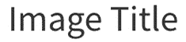

图 5.3 – 图片标题文本组件

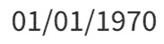

图 5.4 – 图像日期文本组件

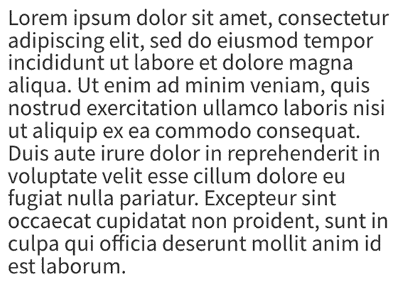

图 5.5 – 图片描述文本组件

## 图像组件

`Image` 组件是 SwiftUI 提供的核心组件之一。它允许你显示一个图像，可以用来提供视觉表示或文本的主体。我们将使用它来显示从 `HighlightView` 中选择的图像的大版本。以下图显示了 `EnhancedView` 中的图像：

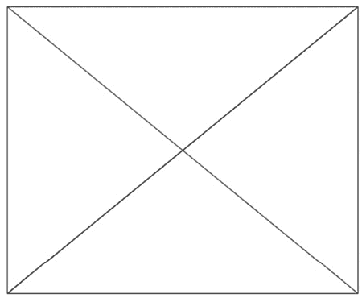

图 5.6 – 图像组件

在下一节中，我们将创建 `EnhancedView` 并使用我们在应用中使用 SwiftUI 讨论过的组件来实现它。

## 添加 EnhancedView 组件

在本节中，我们将添加之前讨论过的组件来创建我们的 `EnhancedView`。然而，我们首先需要创建 `EnhancedView` 文件。这样做很简单；按照以下步骤操作：

1.  现在我们将创建一个新的 SwiftUI 视图用于结果页面。在您的 **项目导航器** 面板内的相册文件夹上右键单击，并选择 **新建文件...**：

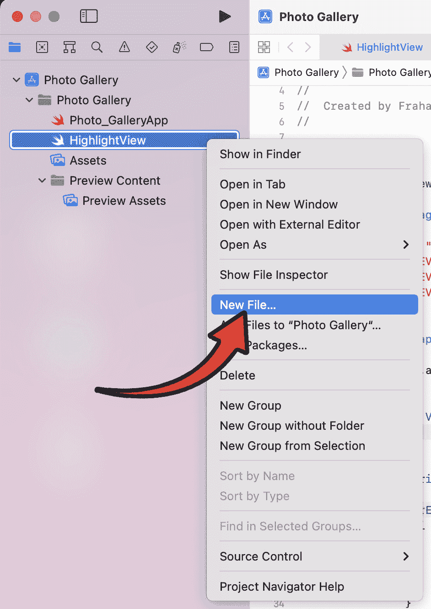

图 5.7 – 选择新建文件

1.  接下来，我们将选择要添加的文件类型，它是一个 **SwiftUI 视图**（选择此选项将提供一个 SwiftUI 模板，这可以节省我们每次重新输入 SwiftUI 文件结构的麻烦）在 **用户界面** 部分：

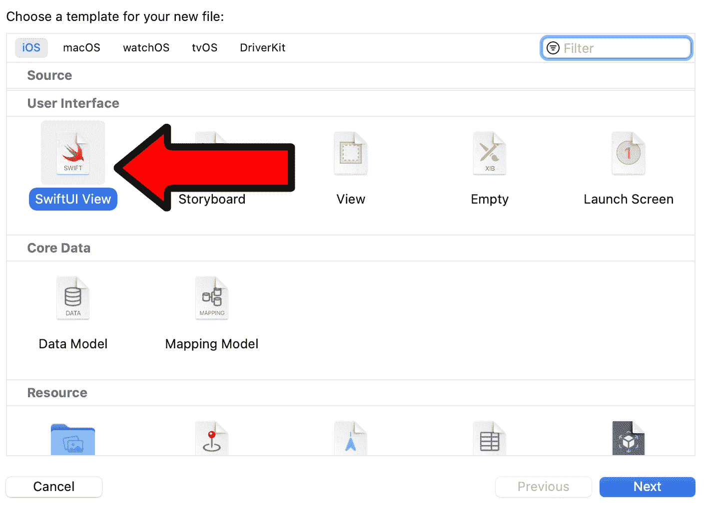

图 5.8 – SwiftUI 视图选择

1.  最后，我们必须重命名我们的 `EnhancedView` 并按 **创建**：

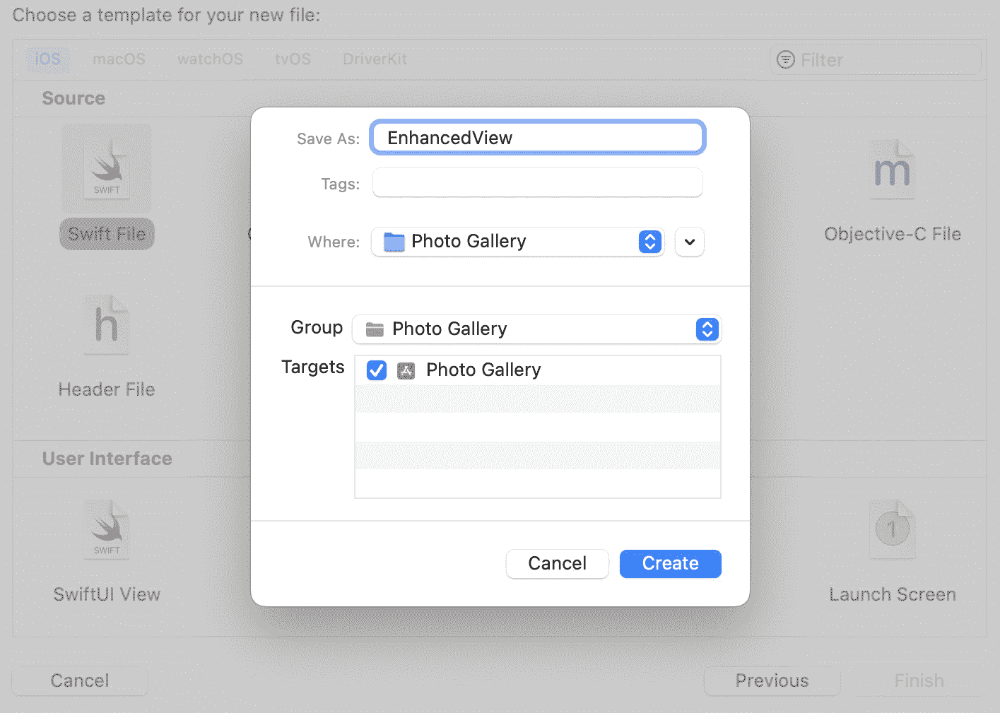

图 5.9 – 命名我们的视图

到目前为止，我们已经查看过线框及其组成的组件。最后，我们创建了我们的 `EnhancedView` 文件。

# 更新 HighlightView

我首先要做的是更新代码以符合我的编码标准；您可以自由地这样做。现在，我们将添加五个状态变量。一个将用于跟踪图像是否被点击，其他四个将用于从`HighlightView`传递数据到`EnhancedView`。像这样在自适应列之后添加代码：

```swift
private let adaptiveColumns =[
    GridItem( .adaptive( minimum: 300 ) )
]
@State private var isClicked: Bool = false
@State private var imageFile: String = ""
@State private var imageName: String = ""
@State private var imageDate: String = ""
@State private var imageDescription: String = ""
```

现在，更新主体以匹配以下代码：

```swift
var body: some View{
    NavigationView
    {
        ScrollView
        {
            LazyVGrid( columns: adaptiveColumns, spacing: 20 )
            {
                ForEach( images.indices )
                { i in
                    NavigationLink( destination: EnhancedView( imageFile: $imageFile, imageName: $imageName, imageDate: $imageDate, imageDescription: $imageDescription ), isActive: $isClicked, label:
                        {
                        Image( images[i] )
                            .resizable( )
                            .scaledToFill( )
                            .frame( width: 300, height: 300 )
                            .onTapGesture {
                                imageFile = images[i]
                                imageName = "FireDEV Podcast"
                                imageDate = "22/09/2022"
                                imageDescription = "Aspiring entrepreneurs and industry professionals alike can learn a lot from a fireside chat with interesting people in the industry. From small indie developers to CEOs of major companies, these chats provide an opportunity to gain insight into the unique stories of success that have led these individuals to their current positions. Through conversations about their experiences and challenges, we can gain valuable knowledge about their successes, failures, and the strategies they used to reach their goals. We can also gain insight into their motivations and the values that drive their decisions. By engaging in a fireside chat with these industry leaders, we can gain a better understanding of the industry and the people within it, and gain valuable knowledge that can help us to reach our own goals."
                                isClicked = true
                            }
                    } )
                }
            }
        }
    }
    .navigationViewStyle( StackNavigationViewStyle( ) )
}
```

我们刚刚添加了很多代码，所以让我们逐一解释：

+   `NavigationView {`: 我们实现了一个导航系统，允许我们导航到`EnhancedView`并返回。仅使用此代码为`NavigationView`将导致分割系统，因此最后我们添加了后续代码以移除分割视图模式。

+   `.navigationViewStyle( StackNavigationViewStyle( ) )`: 与新的`NavigationView`结合使用，我们将每个图像包裹在一个`NavigationLink`中，这使得它可以点击，从而我们可以导航到另一个视图。

+   `NavigationLink( destination: EnhancedView( imageFile: $imageFile, imageName: $imageName, imageDate: $imageDate, imageDescription: $imageDescription ), isActive: $isClicked, label`: 在`NavigationLink`中，我们有几个参数。让我们逐一分析每个参数的作用：

    +   `destination: EnhancedView(`: 设置点击图像时导航到的视图。

    +   `imageFile: $imageFile`: 将之前创建的`imageFile`状态变量传递给`EnhancedView`。这个变量是图像的路径/文件名。这将作为字符串存储。

    +   `imageName: $imageName`: 将`imageName`状态变量传递给`EnhancedView`。这个变量是图像的名称/标题。

    +   `imageDate: $imageDate`: 将之前创建的`imageDate`状态变量传递给`EnhancedView`。这个变量是图像的日期。这可能是指创建日期、编辑日期或其他相关日期。

    +   `imageDescription: $imageDescription`: 将`imageDescription`状态变量传递给`EnhancedView`。这个变量是图像的描述。

+   `isActive: $isClicked`: 跟踪图像是否被点击。如果是，它将导航到`EnhancedView`。

+   `label`: 虽然我们没有使用任何形式的文本作为按钮，但图像将被用作标签，它将作为导航的可点击标签/图像。

下一步是添加图像的可点击功能，允许用户从`HighlightView`导航到`EnhancedView`。更新`NavigationLink`中的图像代码如下：

```swift
Image( images[i] )    .resizable( )
    .scaledToFill( )
    .frame( width: 300, height: 300 )
    .onTapGesture {
        imageFile = images[i]
        imageName = "FireDEV Podcast"
        imageDate = "22/09/2022"
        imageDescription = "Aspiring entrepreneurs and industry professionals alike can learn a lot from a fireside chat with interesting people in the industry. From small indie developers to CEOs of major companies, these chats provide an opportunity to gain insight into the unique stories of success that have led these individuals to their current positions. Through conversations about their experiences and challenges, we can gain valuable knowledge about their successes, failures, and the strategies they used to reach their goals. We can also gain insight into their motivations and the values that drive their decisions. By engaging in a fireside chat with these industry leaders, we can gain a better understanding of the industry and the people within it, and gain valuable knowledge that can help us to reach our own goals."
        isClicked = true
    }
```

我们添加了一个`onTapGesture`函数。这个函数的目的是将图像的元数据分配给之前创建的`@State`变量。所有元数据变量都是硬编码的，除了`imageFile`，它使用一个数组。您可以自由扩展当前数组，使其成为一个多维数据容器，以存储每个图像的独特元数据。最后，我们将`isClicked`设置为`true`；这告诉视图在点击`NavigationLink`时导航到指定的视图，即`EnhancedView`。

所有这些更改将导致以下`HighlightView`的代码：

```swift
import SwiftUIstruct HighlightView: View
{
    private let images: [String] =
    [
        "FireDEV", "FireDEV", "FireDEV", "FireDEV", "FireDEV", "FireDEV", "FireDEV", "FireDEV", "FireDEV", "FireDEV", "FireDEV", "FireDEV", "FireDEV", "FireDEV", "FireDEV", "FireDEV", "FireDEV", "FireDEV", "FireDEV", "FireDEV"
    ]
    private let adaptiveColumns =
    [
        GridItem( .adaptive( minimum: 300 ) )
    ]
    @State private var isClicked: Bool = false
    @State private var imageFile: String = ""
    @State private var imageName: String = ""
    @State private var imageDate: String = ""
    @State private var imageDescription: String = ""
    var body: some View
    {
        NavigationView
        {
            ScrollView
            {
                LazyVGrid( columns: adaptiveColumns, spacing: 20 )
                {
                    ForEach( images.indices )
                    { i in
                        NavigationLink( destination: EnhancedView( imageFile: $imageFile, imageName: $imageName, imageDate: $imageDate, imageDescription: $imageDescription ), isActive: $isClicked, label:
                            {
                            Image( images[i] )
                                .resizable( )
                                .scaledToFill( )
                                .frame( width: 300, height: 300 )
                                .onTapGesture {
                                    imageFile = images[i]
                                    imageName = "FireDEV Podcast"
                                    imageDate = "22/09/2022"
                                    imageDescription = "Aspiring entrepreneurs and industry professionals alike can learn a lot from a fireside chat with interesting people in the industry. From small indie developers to CEOs of major companies, these chats provide an opportunity to gain insight into the unique stories of success that have led these individuals to their current positions. Through conversations about their experiences and challenges, we can gain valuable knowledge about their successes, failures, and the strategies they used to reach their goals. We can also gain insight into their motivations and the values that drive their decisions. By engaging in a fireside chat with these industry leaders, we can gain a better understanding of the industry and the people within it, and gain valuable knowledge that can help us to reach our own goals."
                                    isClicked = true
                                }
                        } )
                    }
                }
            }
        }
        .navigationViewStyle( StackNavigationViewStyle( ) )
    }
}
struct ContentView_Previews: PreviewProvider
{
    static var previews: some View
    {
        HighlightView( )
    }
}
```

这部分内容有很多要理解！在继续之前，请随意再次查看本节。记住，您可以通过 GitHub 仓库在线访问，以便轻松复制和粘贴：[`github.com/PacktPublishing/Elevate-SwiftUI-Skills-by-Building-Projects`](https://github.com/PacktPublishing/Elevate-SwiftUI-Skills-by-Building-Projects)。

## 实现 EnhancedView

首先，我们需要实现处理旋转功能的代码。在`EnhancedView`结构上方添加以下代码：

```swift
struct DeviceRotationViewModifier: ViewModifier{
    let action: ( UIDeviceOrientation ) -> Void
    func body( content: Content ) -> some View
    {
        content
            .onAppear( )
            .onReceive( NotificationCenter.default.publisher( for: UIDevice.orientationDidChangeNotification ) )
                { _ in
                    action( UIDevice.current.orientation )
                }
    }
}
extension View
{
    func onRotate( perform action: @escaping ( UIDeviceOrientation ) -> Void ) -> some View
        {
            self.modifier( DeviceRotationViewModifier( action: action ) )
        }
}
```

我们添加的先前代码允许我们在旋转屏幕时重新渲染内容。这将在检测设备方向时很快被使用。现在，我们可以在`EnhancedView`结构的开始处添加`@Binding`变量，这允许我们传递元数据：

```swift
@Binding var imageFile: String@Binding var imageName: String
@Binding var imageDate: String
@Binding var imageDescription: String
```

现在，我们将添加两个变量，第一个用于检测设备的方向，第二个用于检测设备屏幕尺寸（以像素为单位）。前者将用于确定正确的布局，后者将用于调整组件大小。添加以下代码：

```swift
@State private var orientation = UIDeviceOrientation.unknownlet screenSize: CGRect = UIScreen.main.bounds
```

在主体中，我们将创建一个组，其中包含两个布局，一个用于纵向，一个用于横屏。添加以下代码，我们将讨论正在发生的一切：

```swift
Group{
    if ( orientation.isLandscape )
    {
        LazyHStack
        {
            VStack
            {
                Image( imageFile )
                    .resizable( )
                    .scaledToFit( )
            }.frame( width: screenSize.width * 0.5 )
            VStack
            {
                Text( imageName )
                    .fontWeight(.bold)
                Text( imageDate )
                Text( imageDescription )
            }.frame( width: screenSize.width * 0.5 )
        }
    }
    else
    {
        LazyVStack
        {
            VStack
            {
                Image( imageFile )
                    .resizable( )
                    .scaledToFit( )
            }.frame( height: screenSize.height * 0.5 )
            VStack
            {
                Text( imageName )
                    .fontWeight( .bold )
                Text( imageDate )
                Text( imageDescription )
            }.frame( height: screenSize.height * 0.5 )
        }
    }
}
.onRotate
{ newOrientation in
    orientation = newOrientation
}
```

让我们逐行分析我们刚刚添加的代码。首先，我们检查设备处于哪种方向。默认情况下，我们检查它是否为横屏。如果不是，则必须是纵向，并且我们相应地处理组件大小和位置：

```swift
if ( orientation.isLandscape )
```

接下来，我们创建一个用于存储横屏方向组件的懒加载水平堆叠：

```swift
LazyHStack
```

接下来，我们创建两个垂直堆叠。框架宽度设置为屏幕宽度的一半。这实际上创建了一个等分的分屏设计。如果您想要自定义分割，可以随意修改乘数。在第一个垂直堆叠中，我们放置图片，设置为`resizable`和`scaledToFit`。在第二个垂直堆叠中，我们放置文本元数据，使用简单的`Text`组件：

```swift
VStack{
    Image( imageFile )
        .resizable( )
        .scaledToFit( )
}.frame( width: screenSize.width * 0.5 )
VStack
{
    Text( imageName )
        .fontWeight(.bold)
    Text( imageDate )
    Text( imageDescription )
}.frame( width: screenSize.width * 0.5 )
```

在`else`语句中，我们简单地使用`LazyVStack`，因为它与纵向方向相关。所做的唯一其他更改是调整框架大小：它不再与屏幕宽度相关联，而是与高度相关联。其余部分保持不变。

最后，我们在`Group`组件中添加一个检测器，它简单地检测设备是否已旋转，并更新用于检测绘制模式的`orientation`变量：

```swift
.onRotate{ newOrientation in
    orientation = newOrientation
}
```

剩下的唯一事情是更新`EnhancedView`文件底部的预览提供者。按照以下方式更新代码：

```swift
struct EnhancedView_Previews: PreviewProvider{
    static var previews: some View
    {
        EnhancedView( imageFile: .constant( "" ), imageName: .constant( "" ), imageDate: .constant( "" ), imageDescription: .constant( "" ) )
    }
}
```

上述代码仅为预览传递添加了一组默认参数。我将其留空，因为我使用了模拟器进行测试，但您可以根据需要输入占位符数据，以确保您可以使用预览正确添加文本。

在本节中，我们实现了`EnhancedView`代码。在下一节中，我们将查看结果。请随意修改横屏和竖屏的布局，使其独特。

# 测试 EnhancedView

在本节中，我们最终将测试我们的应用程序。启动它将带我们到`HighlightView`；点击任何图片，它将带您到`EnhancedView`。竖屏模式如下所示：

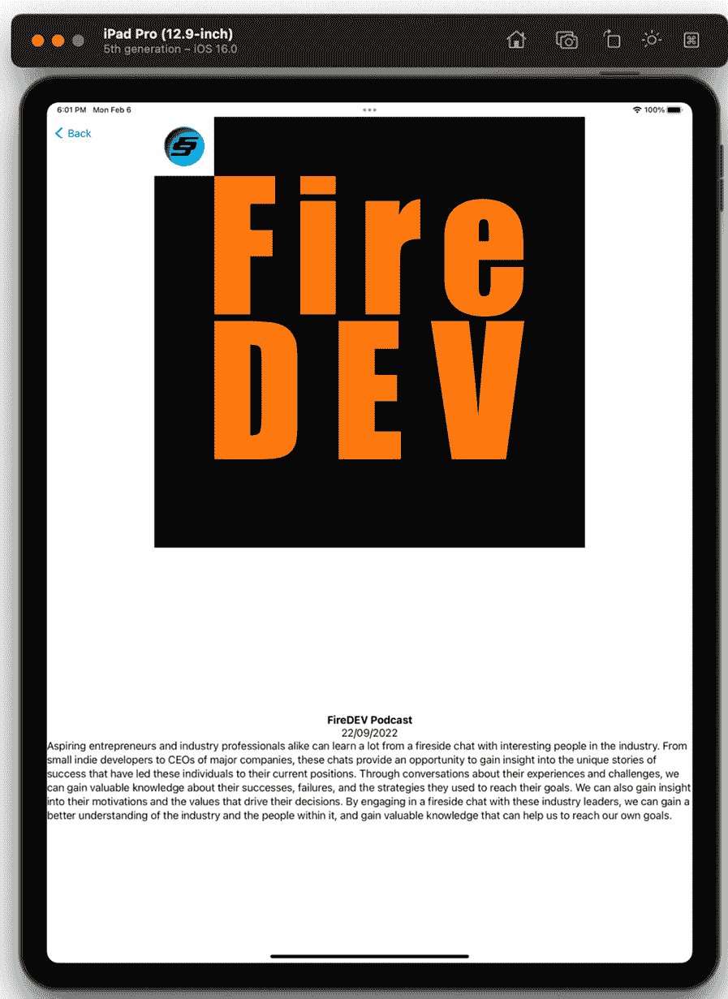

图 5.10 – 竖屏模式

旋转应用程序将产生以下输出：

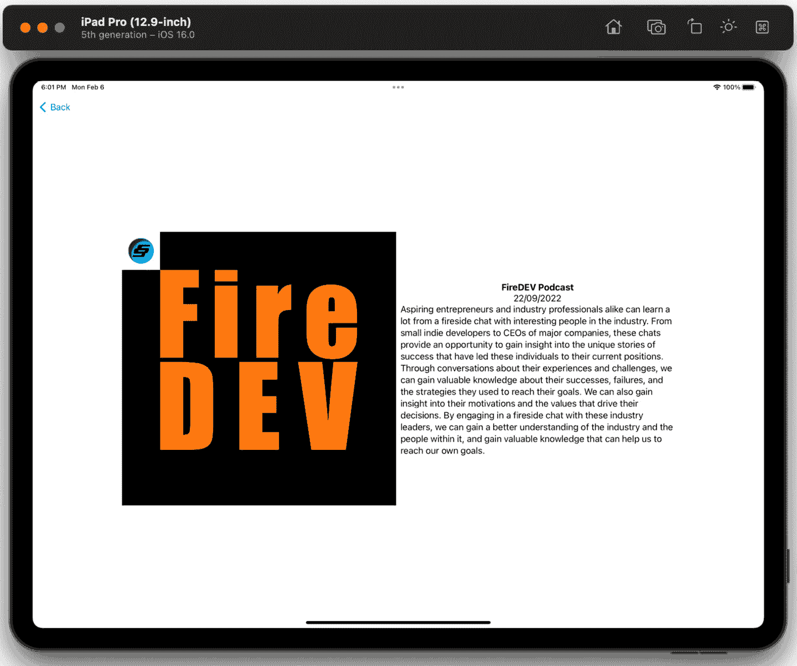

图 5.11 – 横屏模式

现在，我们的应用程序已经完成，并具有一个导航菜单，用于返回到`HighlightView`。

注意

如果您需要旋转模拟器的帮助，请参阅上一章。

# 额外任务

现在应用程序已经完成，以下是一些额外的任务列表，供您完成以增强您的应用程序：

+   使用不同的源数据：

    +   不同的图片

    +   不同的标题

    +   不同的描述

    +   不同的日期

+   从互联网加载图片

+   从互联网加载元数据

+   将支持设备的范围扩展到 iPhone，从而为您提供考虑跨平台设计的机遇

+   无额外信息使图片全屏

+   全屏点击获取更多信息：在全屏模式下单次点击将显示照片的标题

+   收藏夹：不同的图片集

+   一侧面板，显示所有收藏夹名称，在竖屏模式下隐藏，通过按钮激活；在横屏模式下始终可见

+   删除和重命名：允许用户从相册中删除图片并重命名它们

+   分享：分享图片的能力

+   不同的显示模式：列表和网格视图

我们将总结本章所涵盖的内容，但首先，我们将查看实现一些额外任务的代码。

## 全屏模式

为了将全屏模式添加到`EnhancedView`，我们将添加一个新的`@State`变量，称为`isFullScreen`。我们将使用此变量在全屏模式和常规模式之间切换。此外，我们还需要向图片添加`onTapGesture`，以便当图片被点击时，它会切换全屏模式。以下是修改后的代码：

```swift
import SwiftUIstruct EnhancedView: View
{
    @Binding var imageFile: String
    @Binding var imageName: String
    @Binding var imageDate: String
    @Binding var imageDescription: String
    @State private var orientation = UIDeviceOrientation.unknown
    @State private var isFullScreen: Bool = false
    let screenSize: CGRect = UIScreen.main.bounds
    var body: some View
    {
        Group
        {
            if isFullScreen {
                Image(imageFile)
                    .resizable()
                    .scaledToFit()
                    .edgesIgnoringSafeArea(.all)
                    .onTapGesture {
                        self.isFullScreen.toggle()
                    }
            }
            else if orientation.isLandscape {
                LazyHStack
                {
                    VStack
                    {
                        Image(imageFile)
                            .resizable()
                            .scaledToFit()
                            .onTapGesture {
                                self.isFullScreen.toggle()
                            }
                    }.frame(width: screenSize.width * 0.5)
                    VStack
                    {
                        Text(imageName)
                            .fontWeight(.bold)
                        Text(imageDate)
                        Text(imageDescription)
                    }.frame(width: screenSize.width * 0.5)
                }
            }
            else {
                LazyVStack
                {
                    VStack
                    {
                        Image(imageFile)
                            .resizable()
                            .scaledToFit()
                            .onTapGesture {
                                self.isFullScreen.toggle()
                            }
                    }.frame(height: screenSize.height * 0.5)
                    VStack
                    {
                        Text(imageName)
                            .fontWeight(.bold)
                        Text(imageDate)
                        Text(imageDescription)
                    }.frame(height: screenSize.height * 0.5)
                }
            }
        }
    }
}
struct EnhancedView_Previews: PreviewProvider
{
    static var previews: some View
    {
        EnhancedView(imageFile: .constant(""), imageName: .constant(""), imageDate: .constant(""), imageDescription: .constant(""))
    }
}
```

让我们看看这个修改后的代码做了什么：

+   添加一个新的`@State`变量`isFullScreen`，用于跟踪视图是否处于全屏模式。

+   在`Group`的开始处添加一个新的条件，如果`isFullScreen`为`true`，则显示全屏模式的图片。在这个条件下，我们使用`.edgesIgnoringSafeArea(.all)`确保图片占据整个屏幕，并使用`.onTapGesture`在图片被点击时切换`isFullScreen`。

+   通过添加`.onTapGesture`在横屏和竖屏模式下修改现有的`Image`视图，当图片被点击时切换`isFullScreen`。

这导致图片在被点击时占据整个屏幕，再次点击时恢复到原始大小。

## 收藏夹

要添加集合（相册）并显示这些集合名称的侧边栏，我们需要对代码进行几处修改：

1.  创建一个数据结构来表示图片集合。

1.  修改 `HighlightView` 以在横幅模式下在侧边栏中显示集合列表。

1.  显示所选集合的图片。

这就是你可以这样做的方法：

```swift
import SwiftUI// Data structure representing an image collection
struct ImageCollection {
    let name: String
    let images: [String]
}
struct HighlightView: View {
    // Sample data
    private let collections: [ImageCollection] = [
        ImageCollection(name: "Collection 1", images: ["FireDEV", "FireDEV", "FireDEV"]),
        ImageCollection(name: "Collection 2", images: ["FireDEV", "FireDEV", "FireDEV", "FireDEV"]),
        ImageCollection(name: "Collection 3", images: ["FireDEV", "FireDEV"])
    ]
    private let adaptiveColumns = [GridItem(.adaptive(minimum: 300))]
    @State private var isClicked: Bool = false
    @State private var imageFile: String = ""
    @State private var imageName: String = ""
    @State private var imageDate: String = ""
    @State private var imageDescription: String = ""
    @State private var selectedCollection: ImageCollection?
    var body: some View {
        NavigationView {
            GeometryReader { geometry in
                if geometry.size.width > geometry.size.height {
                    // Horizontal mode, show side panel
                    HStack {
                        // Side Panel
                        List(collections, id: \.name) { collection in
                            Button(action: {
                                selectedCollection = collection
                            }) {
                                Text(collection.name)
                            }
                        }
                        .frame(width: geometry.size.width * 0.25)
                        // Images
                        ScrollView {
                            LazyVGrid(columns: adaptiveColumns, spacing: 20) {
                                if let images = selectedCollection?.images {
                                    ForEach(0..<images.count, id: \.self) { i in
                                        Image(images[i])
                                            .resizable()
                                            .scaledToFill()
                                            .frame(width: 300, height: 300)
                                    }
                                }
                            }
                        }
                    }
                } else {
                    // Vertical mode, just show images
                    ScrollView {
                        LazyVGrid(columns: adaptiveColumns, spacing: 20) {
                            if let images = selectedCollection?.images {
                                ForEach(0..<images.count, id: \.self) { i in
                                    Image(images[i])
                                        .resizable()
                                        .scaledToFill()
                                        .frame(width: 300, height: 300)
                                }
                            }
                        }
                    }
                    .onAppear {
                        // Select the first collection by default
                        if selectedCollection == nil {
                            selectedCollection = collections.first
                        }
                    }
                }
            }
        }
        .navigationViewStyle(StackNavigationViewStyle())
    }
}
struct ContentView_Previews: PreviewProvider {
    static var previews: some View {
        HighlightView()
    }
}
```

让我们解释一下这些更改：

+   我们添加了一个名为 `ImageCollection` 的结构体，它代表一个带有名称的图片集合。

+   我们更新了 `collections` 属性，使其成为一个 `ImageCollections` 数组的数组。

+   我们移除了旧的 `images` 数组，因为它现在已经是集合的一部分了。

+   我们使用 `GeometryReader` 来确定视图是在水平模式还是垂直模式。在水平模式下，显示一个包含集合名称列表的侧边栏。

+   在水平模式下，点击侧边栏中的集合名称会更新 `selectedCollection` 状态变量，进而更新侧边栏右侧显示的图片。

+   在垂直模式下，仅显示所选集合的图片。默认情况下，第一个集合被选中。

这段代码演示了如何创建一个自适应布局，在水平模式下显示侧边栏，并根据所选集合调整其内容。

# 摘要

在本章中，我们使用线框图设计了我们的 `EnhancedView`。这些线框图帮助我们分解视图为它们的组件。然后，我们实现了 SwiftUI 组件以匹配线框图中的设计。尽管这些组件在纵向和横向方向上相同，但我们相应地配置了它们的定位和大小。确保每个受支持的定位都符合行业标准，这一点非常重要。我们还更新了 `HighlightView` 以将数据传递给 `EnhancedView`。这些数据用于在 `EnhancedView` 中添加的组件中显示内容。然后，我们介绍了额外的任务供你执行；在继续之前，请随意再次查看本章。我们现在已经完成了第二个应用程序，它现在可供你修改和使用。

在下一章中，我们将开始我们的下一个应用程序，即 Mac 的 App Store。我们将自然地研究其设计，并将其分解以帮助我们理解和实现适用于我们下一个平台的应用程序。
