# 第八章：观看项目 – 健身伴侣设计

在前六章中，我们已经为我们的苹果设备创建了各种应用程序。这些章节教会了我们如何为 iPhone、iPad 和 Mac 设置项目。它们还展示了小屏幕和大屏幕之间的设计差异。在本章中，我们将为 Apple Watch 设计一个健身伴侣应用程序。由于手表屏幕尺寸较小，我们需要简化设计。在开始编码过程之前，我们将评估需求并讨论设计规范。

首先，我们将评估为 Apple Watch 设计健身伴侣应用程序所需的需求。然后，我们将讨论设计规范，这将使我们更好地了解所需的内容以及如何将这些内容整合在一起。接下来将是编码过程，我们将在这两章中构建健身应用程序。本项目将涵盖 SwiftUI 组件的基础。我们将在以下章节中讨论所有这些内容：

+   理解设计规范

+   构建健身应用程序

在本章中，我们将更好地理解我们应用程序的需求和设计。在前几章中，我们在 SwiftUI 组件、设计和 Xcode 导航方面建立的基础将作为下一章的强大起点。请继续关注我们的进展，因为我们将继续在这些基础上构建。

# 技术要求

本章要求您从苹果的 App Store 下载 Xcode 版本 14 或更高版本。

要安装它，只需在 App Store 中搜索 Xcode，然后选择并下载最新版本。打开 Xcode 并遵循任何额外的安装说明。一旦 Xcode 打开并启动，您就可以开始了。

Xcode 14 版本具有以下功能/要求：

+   包含 iOS 16、iPadOS 16、macOS 12.3、tvOS 16 和 watchOS 9 的 SDK。

+   支持 iOS 11 或更高版本、tvOS 11 或更高版本和 watchOS 4 或更高版本在设备上的调试。

+   需要 macOS Monterey 12.5 或更高版本的 Mac。

您可以从以下 GitHub 链接下载示例代码：[`github.com/PacktPublishing/Elevate-SwiftUI-Skills-by-Building-Projects`](https://github.com/PacktPublishing/Elevate-SwiftUI-Skills-by-Building-Projects)

在下一节中，我们将提供我们应用程序设计规范的明确说明，并查看应用程序的外观原型。

# 理解设计规范

本节概述了我们健身伴侣应用程序的设计规范。我们的目标是实现增强用户体验的功能。为了实现这一目标，我们站在用户的角度来确定他们将如何使用应用程序。然后我们将这个过程分解成单个步骤，以确定必要的功能。通过这样做，我们可以确保我们的健身应用程序将易于使用且高效。

在本节中，我们将查看我们健身伴侣应用程序的设计规范，并描述我们将要实现的功能。确定所需功能的最有效方法是站在用户的角度，确定他们将如何使用应用程序，并将其分解为单个步骤。

我们的健身应用程序已经设计了几项功能，以帮助用户实现他们的健身目标。我们相信我们的应用程序将为用户提供无缝且有效的健身体验。

我们希望我们的应用程序拥有的功能如下：

+   当前时间

+   活动/锻炼时间

+   每分钟心率（BPM）

+   总消耗卡路里

+   活动

+   可滑动视图

+   开始新的锻炼

+   暂停锻炼

+   结束锻炼

+   锁定锻炼

+   目标

+   不同的锻炼

在列出理想功能后，确定哪些是必需的至关重要。理解我们产品的最终用途是关键。对我来说，创建这个健身伴侣应用程序的目的是为了提供一个坚实的基础，以便以后添加更高级的功能。我们不会实现前面列表中的所有功能，因为这有利于尝试自己实现它们，作为将所学概念付诸实践的任务。因此，以下是我们将实现的核心功能：

+   当前时间

+   活动/锻炼时间

+   每分钟心率（BPM）

+   总消耗卡路里

+   活动

+   可滑动视图

+   开始新的锻炼图标

+   暂停锻炼图标

+   结束锻炼图标

+   锁定锻炼图标

读完本章和下一章后，你将准备好独立处理剩余的功能。下一节将概述我们应用程序的验收标准，为你提供确保其成功的必要指南。

# 我们应用程序的验收标准

在本节中，我们将概述我们应用程序的强制性要求。这些要求对于最终产品至关重要，并且必须是可衡量的。我们需要确保满足这些要求，以交付一个成功的应用程序。让我们开始吧：

+   当前时间 – 这将显示你的时区实际时间。

+   活动/锻炼时间 – 这将是一个实时计时器，显示当前的锻炼时间。

+   每分钟心率（BPM） – 这个标签将链接到一个变量，以显示用户每分钟的心跳次数。

+   总消耗卡路里 – 这将显示消耗的卡路里，并将链接到卡路里变量。

+   活动 – 这将用于显示当前活动；例如，跑步、游泳、瑜伽等。

+   可滑动视图 – 这将允许我们在单页上有两个独立的屏幕，并根据我们的需求增加。

+   开始新的锻炼 – 一个由图像和文本项组成的按钮将允许用户开始锻炼。

+   暂停锻炼图标 – 这个按钮也将由图像和文本项组成，将用于暂停锻炼。

+   结束锻炼图标 – 另一个按钮，与前面的两个类似，将用于结束锻炼。

+   锁定锻炼图标 – 最后，这个按钮将用于锁定锻炼。

为了确保应用程序的成功，开发测试用例来衡量验收标准至关重要。这些测试用例应模拟最终用户使用应用程序的真实场景和条件。通过这样做，我们可以准确测量应用程序需要达到的性能水平，以便被认为是成功的。因此，创建详细的测试用例或场景是确保应用程序达到预期标准所必需的。

# 我们应用的线框

线框是设计布局的一个基本工具。它提供了布局外观的概述。健身应用当前活动的线框如图所示：

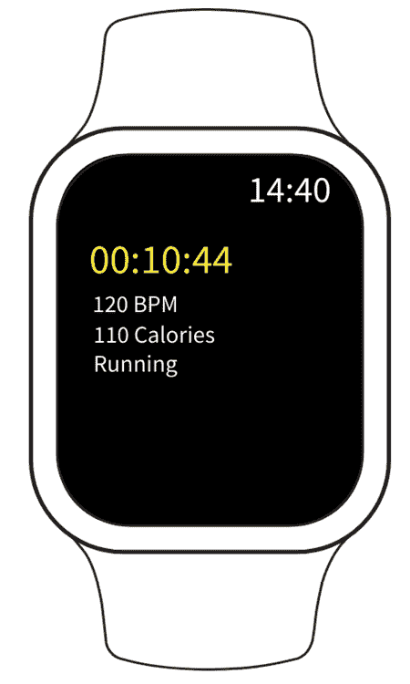

图 8.1 – 我们手表应用的线框

以下图显示了允许你开始、停止和暂停活动的视图线框：

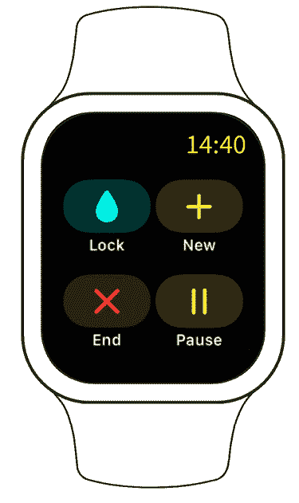

图 8.2 – 活动按钮线框

我们现在已经看到了我们健身应用的线框。这些线框将作为构建我们应用程序 UI 的初始基础。

在下一节中，我们将构建我们应用程序的界面，并验证它是否与我们在线框中创建的设计相匹配。虽然我们将遵循相同的过程，但可能会有细微的差异。我们本章的重点将是初始视图，第二个视图将在下一章中讨论。

# 构建健身应用

我们现在将构建侧边栏的 UI。首先，让我们创建我们的项目。按照以下步骤操作：

1.  打开 Xcode 并选择**创建一个新的** **Xcode 项目**：

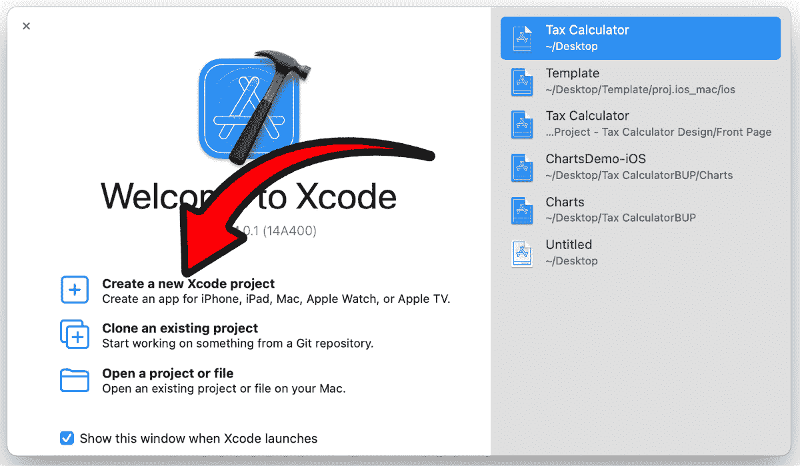

图 8.3 – 创建一个新的 Xcode 项目

1.  现在我们将选择我们应用程序的模板。由于我们正在创建一个 Apple Watch 应用程序，我们将从顶部选择**WatchOS**，然后选择**应用**，并点击**下一步**：

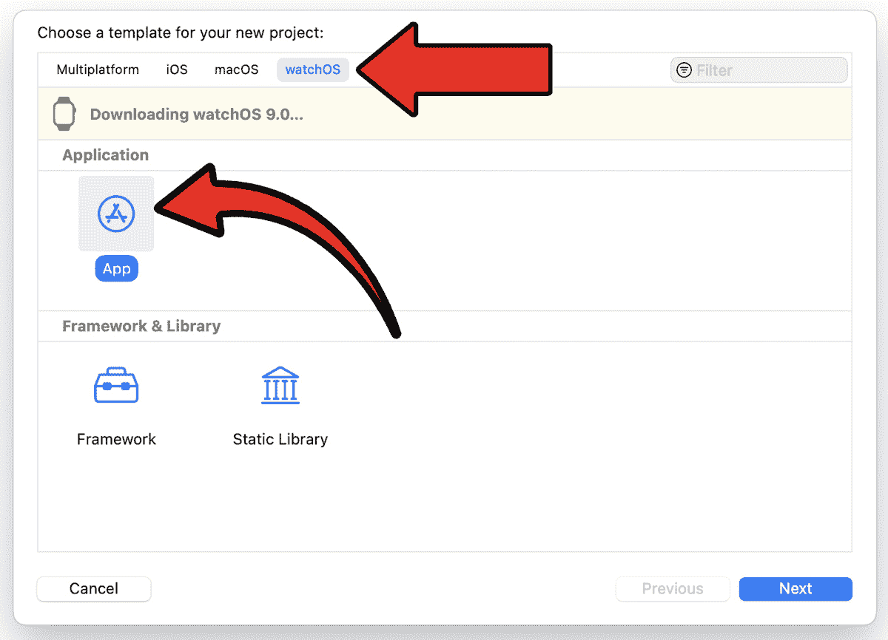

图 8.4 – Xcode 项目模板选择

1.  现在我们将选择我们项目的选项。在这里，只有一个关键的选择/设置。确保**仅查看应用**被选中：

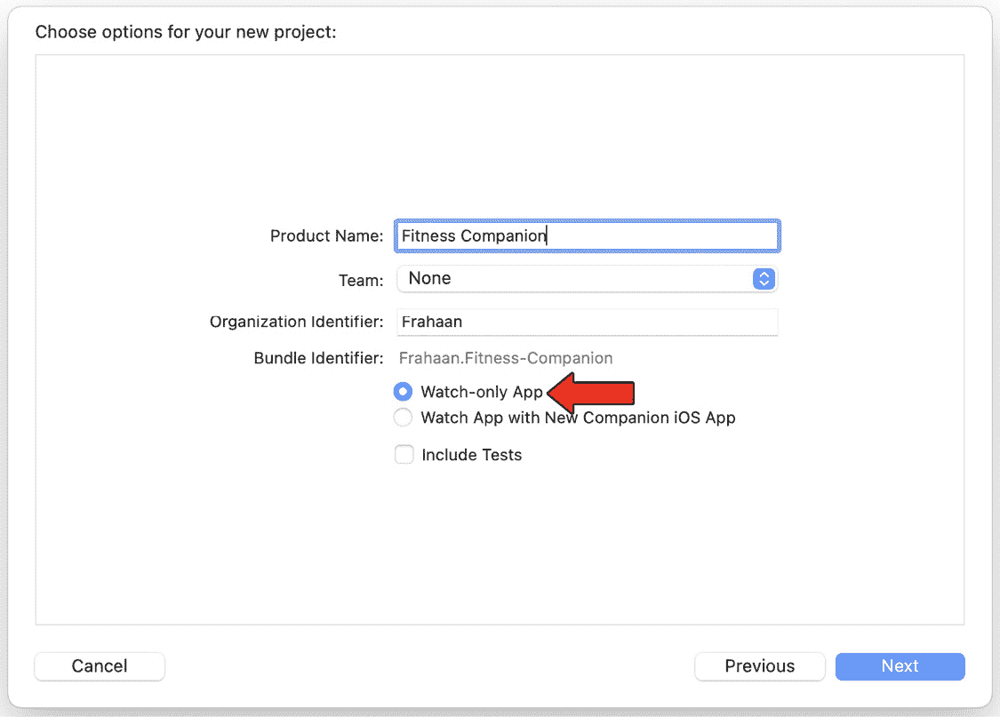

图 8.5 – Xcode 项目选项

1.  一旦你按下**下一步**，你可以选择在哪里创建你的项目，如图所示：

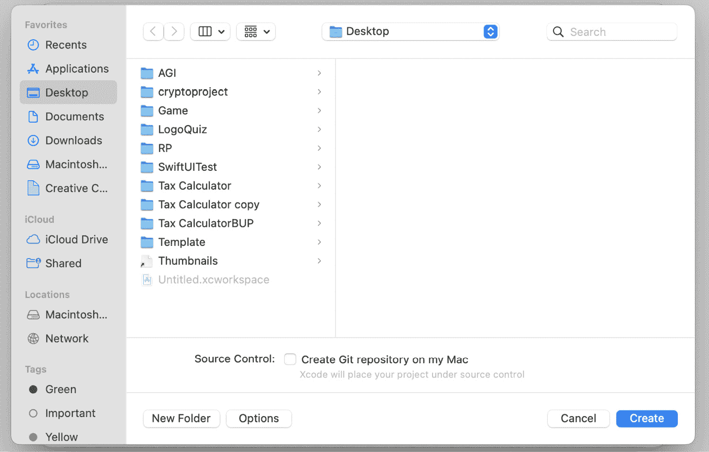

图 8.6 – Xcode 项目保存目录

1.  一旦你找到了你想要创建它的位置，点击右下角的**创建**。Xcode 以其全部荣耀显示了你的项目，如图所示：

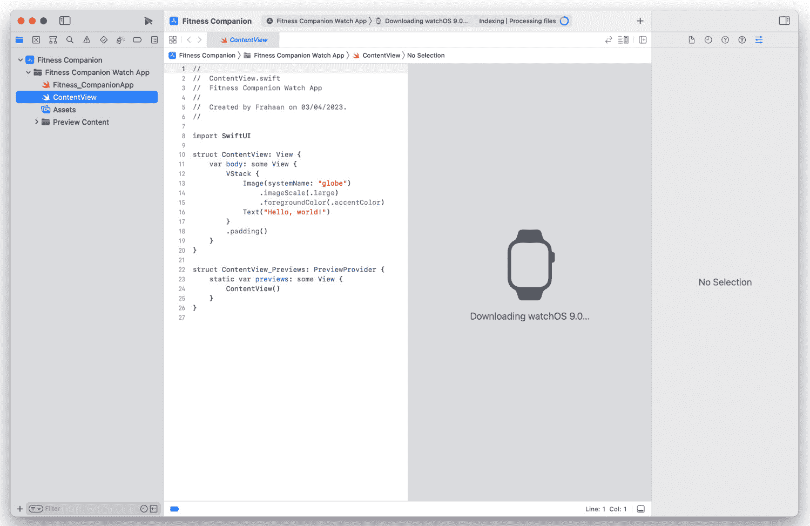

图 8.7 – 新 Xcode 项目概览

在本节中，我们设置了我们的 WatchOS 项目。现在我们已经设置好了，我们将实现健身应用第一页的界面。

## 活动详情

在本节中，我们将实现健身应用的第一个页面，它将代表当前活动的详细信息。作为提醒，请参考*图 8**.1* 来查看其外观。

当前活动屏幕有五个主要元素。作为一个小任务，看看你是否能找出它们是什么。如果你不知道确切的 UI 组件名称，不要担心；我们将在下一节中查看这些组件。

### 文本

文本组件可以显示一串字符、数字，甚至图标，所有这些都可以相互结合使用。对我们来说，它将用于显示以下五个组件：

1.  当前时间：

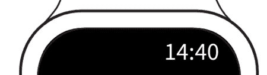

图 8.8 – 当前时间标签

1.  活动运行时间：


图 8.9 – 活动时间标签

1.  每分钟节拍（BPM）：


图 8.10 – BPM 标签

1.  消耗卡路里：


图 8.11 – 卡路里标签

1.  当前活动：


图 8.12 – 当前活动标签

重要提示

要重命名视图，请参考前一章中的*重命名视图*部分以回顾该概念。

在本节中，我们分析了验收标准以及我们的健身伴侣应用的要求。我们还分解了线框图，使我们能够确定应用程序的工作方式和结构。我们将利用这些知识在下一节中进行。

# 实现当前活动 UI

在本节中，我们将使用新设置的项目开始我们的健身手表应用的编码。我们将实现当前活动 UI，它将显示当前活动的信息。

由于我们创建了一个全新的项目，编码标准并不符合我的个人偏好。因此，首先，我将更改标准。请随意花几分钟时间做同样的事情。

如果你直接运行新创建的应用程序，你会注意到我们已经在右上角显示了当前时间，如下面的截图所示：

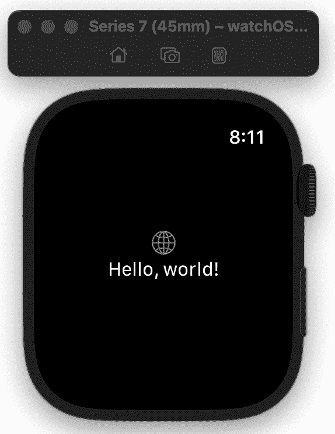

图 8.13 – 默认时间

对我们来说是个好消息，因为时间已经默认设置好了。可能存在你想移除时间的情况，但既然我们不这么做，我们可以继续。现在，我们将继续实现当前活动的文本项。实现剩余的文本项实际上非常简单。从 VStack 中移除所有代码，并添加以下标签：

```swift
var body: some View{
    VStack( )
    {
        Text( "00:10:44" )
        Text( "120 BPM" )
        Text( "110 Calories" )
        Text( "Running" )
    }
    .padding( )
}
```

这将导致以下布局：

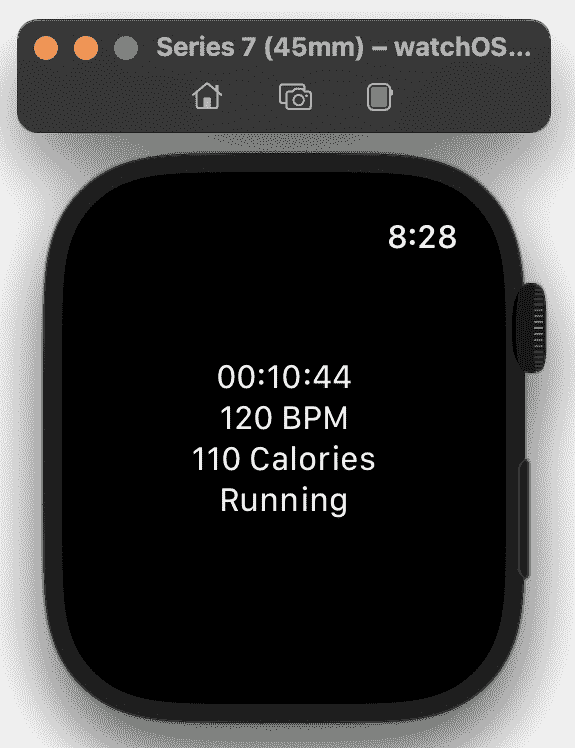

图 8.14 – 添加的文本项

首先，我们将设置 VStack 的对齐方式为左对齐，如下所示：

```swift
VStack( alignment: .leading )
```

尽管所有内容都存在，但它既不动态也不具有样式。首先，我们将使其变得动态。为此，创建五个变量来存储以下内容：

+   时间计数器 – 这将每秒增加一次；它可以修改为更频繁的计数。

+   计时字符串 – 这将使用时间计数器并将其转换为 00:00:00 格式。

+   BPM – 这将存储 BPM 数值。

+   卡路里 – 这将存储锻炼过程中消耗的卡路里数。

+   活动 – 这将通知用户哪个锻炼是活跃的。

以下是相应的代码：

```swift
@State private var counter = 0@State private var timerString = "00:00:00"
@State private var bpm = 120
@State private var calories = 110
@State private var activity = "Running"
```

接下来，我们将创建一个每秒运行一次的计时器：

```swift
let timer = Timer.publish(every: 1, on: .main, in: .common).autoconnect()
```

现在，是时候将这些变量和计时器链接到适当的组件了。首先，向计时器文本组件添加一个`onReceive`事件，如下所示：

```swift
Text( timerString )    .onReceive( timer )
    { time in
        counter += 1
        let hours = counter / 3600
        let minutes = ( counter % 3600 ) / 60
        let seconds = counter % 3600 % 60
        timerString = String( hours ) + ":"
+ String( minutes ) + ":" +
String( seconds )
    }
```

让我们看看我们刚才做了什么。`onReceive`事件将计时器作为参数，用于观察计时器触发的发布事件频率。在每次遍历中，我们将计数器增加一，因此计数器是已过去秒数的数量。然后，我们为小时、分钟和秒创建常量。我们进行一些简单的数学计算，以确定计时器已经运行了多少小时、分钟和秒。最后，我们将`timerString`格式化以显示`小时:分钟:秒`。运行应用程序将显示以下结果：

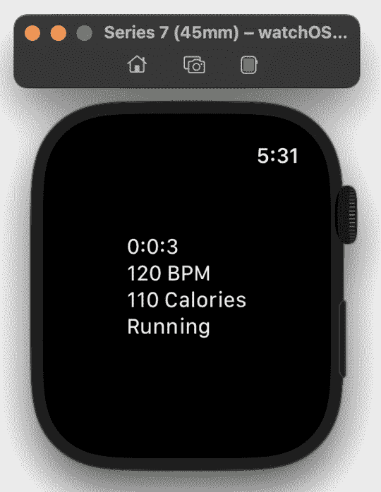

图 8.15 – 动态链接的变量

你可能会注意到，时间目前是以`0:0:0`的格式显示，而不是`00:00:00`。修复这个问题非常简单；我们需要在每个字符串上添加一个格式化器，以便使用两位小数格式化小时、分钟和秒。更新`timerString`如下：

```swift
timerString = String( format: "%02d", hours ) + ":" + String( format: "%02d", minutes ) + ":" + String( format: "%02d", seconds )
```

现在，应用程序将显示如下：

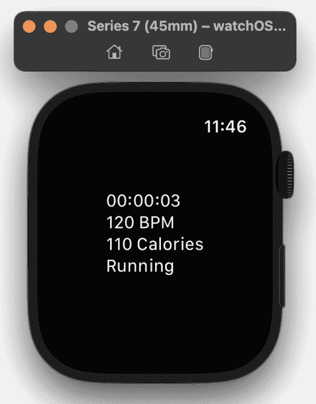

图 8.16 – 格式化的 timerString

现在看起来更好了。BPM、卡路里和当前活动标签都很好；我们只需要修改当前活动时间标签。需要做三件事：将其放大，将颜色改为黄色，并在下方添加一些填充。完成所有这些都很简单。修改当前活动时间文本项，如下所示：

```swift
Text( timerString )    .font( .title2 )
    .foregroundColor( Color.yellow )
    .padding( .bottom )
    .onReceive( timer ) …
```

一旦运行应用程序，我们将看到我们已经完成了本章的代码。


图 8.17 – 当前活动时间样式化

在本节中，我们为我们的健身伴侣应用程序实现了当前活动屏幕。你了解到，尽管 Apple WatchOS 是四个 SDK 中最新的，看起来有些困难，但实际上它和其它的一样简单易用。在下一章中，我们将实现一个滑动视图来添加活动按钮屏幕。

# 摘要

在本章中，我们讨论了我们的健身伴侣应用程序的设计。我们研究了线框图，并将每个元素分解为 SwiftUI 组件。然后，我们将 SwiftUI 组件实现以匹配线框图中的设计，用于当前活动屏幕。我们还研究了构建此应用程序的需求和设计规范，然后将其简化为应用程序将提供的核心功能。

接下来，我们通过创建线框图并将每个元素分解为 SwiftUI 组件来设计我们的健身伴侣应用程序。我们将这些组件实现以匹配当前活动屏幕的线框图设计。我们还审查了构建应用程序的需求和设计规范，并将其简化以专注于它将提供的核心功能。总有一些功能是很好但不可避免地要从首次发布中裁剪掉的，或者许多人称之为 **MVP**（**最小可行产品**）。这正是我们所做的。限制范围以防止其变得过大且失控是至关重要的。

在下一章中，我们将探讨实现健身伴侣应用程序的活动按钮屏幕。
