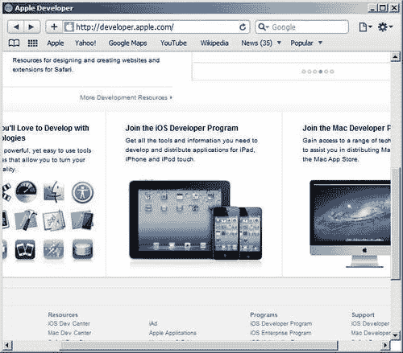
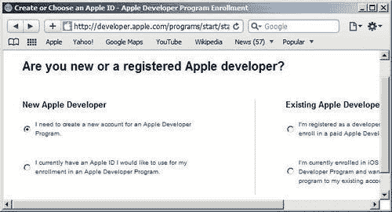
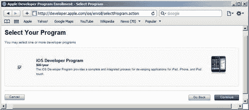
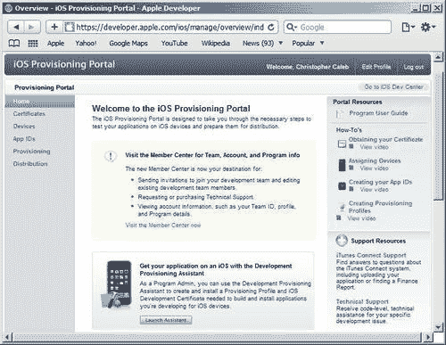
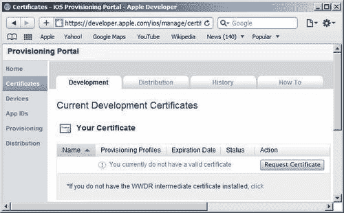
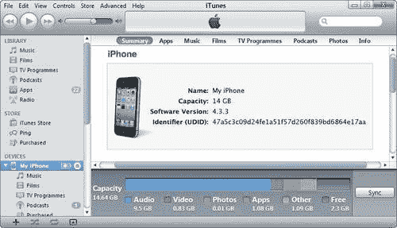
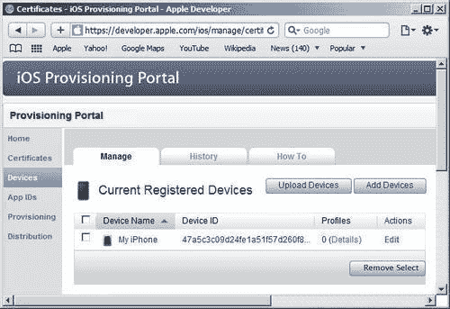
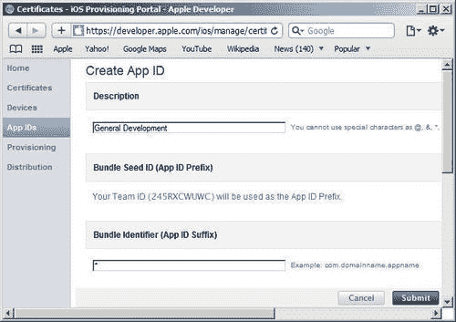

# 第一章. 开始 iOS 应用程序开发

在本章中，我们将涵盖：

+   加入 iOS 开发者计划

+   访问 iOS 配置文件门户

+   使用 Windows 生成证书签名请求

+   使用 Mac OS X 生成证书签名请求

+   获取你的开发证书

+   使用 Windows 创建 P12 证书

+   使用 Mac OS X 创建 P12 证书

+   注册设备

+   创建 App ID

+   创建开发配置文件

+   在你的设备上安装配置文件

# 简介

在编写 iOS 应用程序时，为了在真实设备上进行测试，创建和管理某些文件是必要的。所需的确切文件取决于你目前是在开发还是准备分发。我们将主要关注开发。

到本章结束时，你将创建一个**P12 证书**文件和一个**开发配置文件**，这两个文件都是如果你想要充分利用本书中的菜谱所必需的。在这个过程中，你将了解各种工具的细节，包括 Apple 的**iOS 配置文件门户**，你将在作为 iOS 开发者的时间里广泛使用它。

如果一开始所有内容都不完全明白，请不要担心。如果你遵循每个菜谱中详细说明的步骤，你最终将获得完成本书剩余部分所需的工作文件。

# 加入 iOS 开发者计划

注册为 Apple 开发者并加入 iOS 开发者计划是任何希望编写 iOS 应用程序的人的先决条件。

虽然你可以免费报名参加一个项目，但如果你想将你的应用程序安装到设备上并在**App Store**中分发，你需要支付 99 美元的年度费用以加入标准项目。

使用 iOS SDK 进行开发的开发者可以选择免费项目，并使用 Apple 官方开发工具提供的 iOS 模拟器测试他们的应用程序。不幸的是，使用**Flash Professional**构建的本地 iOS 应用程序在模拟器上无法运行。因此，如果你想完全测试本书中提供的示例，你需要在 iOS 设备上安装它们。

### 注意

在 Flash Professional 中，你可以使用**AIR 调试启动器（ADL）**在桌面上测试你的应用程序；然而，由于不支持 iOS 设备功能，这限制了 ADL 的实用性。

让我们看看注册所需的步骤。

## 准备工作

注册发生在 Apple 开发者网站上。如果你不使用 Apple 的**Safari**浏览器，那么建议你下载并安装它，因为有时在其他浏览器上尝试使用网站上的某些区域时会报告问题。

Safari 是预安装在 Mac OS X 中的默认网络浏览器。使用 Windows 且尚未安装 Safari 的用户可以从[www.apple.com/safari/download](http://www.apple.com/safari/download)下载它。

如果你已经安装了 Safari，请确保你有最新版本。

### 小贴士

在注册过程中，您可以采取几种不同的路径，一旦完成注册，可能无法更改您的一些选择。在提交注册详情和购买开发者计划之前，请仔细思考。您可能首先想通读整个配方，以确保您完全了解所有可用的选项。

## 如何操作...

1.  访问苹果开发者网站[`developer.apple.com`](http://developer.apple.com)。滚动页面，直到您看到如下截图所示的**加入 iOS 开发者计划**链接：

    ### 小贴士

    注意，苹果定期对其各种开发者网站进行修改。因此，本章截图中的项目位置可能在您阅读时略有不同。本章中描述的链接也可能会有所变化。

1.  点击链接。您将被带到**iOS 开发者计划**页面，在该页面的顶部您将找到一个**立即注册**按钮。

1.  点击**立即注册**按钮，进入**注册苹果开发者计划**页面。页面列出了注册所需的三个主要步骤。它们是：

    +   注册为苹果开发者

    +   选择您的计划

    +   完成您的购买

1.  页面底部有一个**继续**按钮，它将开始引导您完成每个步骤。请点击它。

### 注意

在**继续**按钮旁边，您将找到概述注册技术要求的文本。这指的是使用苹果 iOS SDK 的开发者，不适用于使用 Flash Professional 的开发者。请忽略它。

### 注册为苹果开发者

1.  从**您是新手还是已注册的苹果开发者？**页面，您将能够注册为新的苹果开发者。在**新苹果开发者**栏中，点击如下截图所示的**我需要为苹果开发者计划创建新的账户和 Apple ID**单选按钮：

    ### 注意

    如果您目前有一个 Apple ID，则点击栏中的第二个单选按钮。如果您是现有的苹果开发者，则应从**现有苹果开发者**栏中选择相应的单选按钮。

1.  点击**继续**按钮，进入**您是作为个人还是公司注册？**页面。

    提供了两种选项。您可以个人注册或代表公司注册。

    ### 注意

    要作为公司注册，您需要向苹果提供商业文件，并拥有将您的公司绑定到注册过程中向您展示的法律协议的法律权限。

1.  根据您的需求，点击页面底部的**个人**或**公司**按钮。

1.  现在通过执行以下任务来完成您的个人资料：

    +   指定一个期望的 Apple ID 和密码。

    +   设置一些可以用来验证您身份的安全信息。

    +   提交您的个人信息。

    ### 注意

    在提交您的联系信息时，您指定的名称将作为您在 App Store 上分发的任何应用的“卖家”显示。

    不要在名称字段中尝试添加别名或组织名称。这很可能会导致您的 Apple 开发者注册失败，或者当 Apple 最终注意到错误时，您的账户将被暂停。

    如果您希望公司名称作为“卖家”显示，那么请作为公司注册，并向 Apple 提供相关的法律文件以验证您的身份。

    如果您作为个人进行注册，请在**公司/组织**字段中输入您的姓名和姓氏。

1.  仔细阅读显示页面上的信息，并在填写完表格后，点击**继续**按钮，这将带您到**完成您的专业资料**页面。

1.  对于“您使用哪些 Apple 平台进行开发？”字段，请勾选**iOS**复选框。这将显示必须填写的一些附加字段列表。

1.  当您到达**请选择您的应用程序的主要类别**字段时，请确保您点击**商业应用程序**单选按钮。

    ### 注意

    通过选择开发商业应用程序，您在分发应用程序之前必须提供您的银行详细信息；然而，在注册过程中不会要求您提供此信息。如果您计划仅分发免费应用程序，则可以选中**免费应用程序**单选按钮，无需提供银行详细信息。此选项适用于本书中的示例；然而，如果您计划在某个时候销售应用程序，则请坚持选择**商业应用程序**选项。

1.  一旦您已填写表单中所有字段的答案，请点击页面底部的**继续**按钮。

1.  仔细阅读显示的**注册 Apple 开发者协议**。通过勾选复选框并点击页面底部的**我同意**按钮来确认您已阅读。

1.  将验证码发送到您的电子邮件地址。获取该代码并将其输入到**输入发送到您的电子邮件的验证码**页面上的文本字段中。点击**继续**。

    将发送第二封电子邮件以确认您现在已成为注册的 Apple 开发者。

### 注意

邮件还将包含您选择的 Apple ID。请妥善保管此邮件，因为您将需要您的 Apple ID（以及您的密码）来访问 Apple 开发者网站上的某些资源。

### 选择您的计划

在您的网页浏览器中，您将被带到**输入您的账单信息以进行身份验证**页面。

1.  请将您的姓名和姓氏输入得与您的信用卡上显示的完全一致。同时提供您的信用卡账单地址。

1.  点击页面底部的**继续**按钮。

    ### 注意

    在这一点上，你的信用卡详情将被用于身份验证。你不会被要求提供信用卡号码，也不会被收费。

1.  **选择你的计划**页面将出现。如以下截图所示，勾选**iOS 开发者计划**复选框，然后点击页面底部的**继续**按钮：

1.  下一页将允许你查看你的注册信息。请确认你已经选择了**iOS 开发者计划**，并且你的个人详情和账单信息是正确的。如果任何信息有误，请点击页面底部的**返回**按钮，并进行任何必要的修改。

1.  点击**继续**提交你的注册信息到苹果。

1.  **程序许可协议**页面将出现。通过勾选复选框确认你已经阅读过，然后点击页面底部的**我同意**按钮。

### 完成购买

1.  将出现一个购买页面。点击**添加到购物车**继续到你所在国家的在线商店购买你的计划。

1.  将打开一个新的浏览器窗口，并将你带到苹果商店。确认你的 iOS 开发者计划已放入购物车，然后点击页面右侧的**现在结账**按钮购买该项目。

1.  一封激活邮件将在 24 小时内发送给你。当你收到时，请按照指示激活你的 iOS 开发者计划。

## 它是如何工作的...

注册为苹果开发者并激活你的开发者计划使你能够通过苹果的**iOS 开发者中心**网站访问 iOS 配置文件门户。iOS 配置文件门户将引导你完成测试和分发应用到 iOS 设备的必要步骤，并将在本章中用到。

你将使用你设置的 Apple ID 和密码登录到[iOS 开发者中心](http://developer.apple.com/devcenter/ios)。

## 更多内容...

以下是一些额外的信息值得考虑。

### 与多个团队成员协作

如果你选择以公司名义注册，那么你可以添加额外的团队成员到你的账户中，他们可以访问 iOS 开发者计划资源。这将允许，例如，其他团队成员生成和下载构建和部署应用到 iOS 设备所需的开发者文件。

如果你以个人名义注册，那么你将是唯一有权访问计划资源的开发者。生成所有必需的开发者文件和管理测试设备列表将是你的责任。

### iOS SDK、工具和文档

iOS 开发者中心包含丰富的资源。虽然可用的文档和工具旨在针对使用 iOS SDK 的开发者，但你也会发现一些在用 Flash Professional 构建自己的应用时会有帮助的工具。

一个重要的起始文档是[iOS 用户界面指南](http://developer.apple.com/library/ios/#documentation/UserExperience/Conceptual/MobileHIG)。它描述了帮助您创建感觉像是专门为 iOS 设计的应用的指南和原则。

此外，如果您计划在 App Store 上发布您的应用，请阅读[`developer.apple.com/appstore/guidelines.html`](http://developer.apple.com/appstore/guidelines.html)上的**App Store 审查指南**。

如果您在 Mac OS X 上开发，您可能还想下载开发者工具集。虽然本书不会涵盖 Apple 的开发者工具，但请花些时间探索包含在捆绑包中的**Instruments**应用程序，它提供了强大的分析和调试功能，可以帮助您微调您的应用。

一个好的开始是从[iOS 开发者指南](http://developer.apple.com/library/ios/#documentation/DeveloperTools/Conceptual/InstrumentsUserGuide/Introduction)的“仪器用户指南”介绍开始。

# 访问 iOS 配置文件门户

iOS 配置文件门户是一个在线工具，旨在指导您完成在 iOS 设备上测试您的应用并为其在 App Store 上分发做准备所需的步骤。

这就是您将创建和下载用于使用 Flash Professional 构建应用的开发者文件的地方。

让我们一步步了解访问它的步骤。

## 准备工作

您需要一个 Apple ID 来注册 iOS 开发者计划。

如果您还没有这样做，请按照*加入 iOS 开发者计划*食谱中详细说明的步骤进行操作。

## 如何操作...

1.  访问[iOS Dev Center](http://developer.apple.com/devcenter/ios)网站。在页面顶部点击**登录**按钮。

1.  在**使用您的 Apple ID 登录**页面，将您的 Apple ID 和密码输入到文本框中。点击**登录**按钮。

1.  如果操作成功，您将被带回到 iOS Dev Center 的主页，在那里您现在可以访问包括 iOS 配置文件门户在内的您的开发者计划的主要区域。这些链接可以在主页右上角的**iOS 开发者计划**标题下方找到。

1.  点击**iOS 配置文件门户**链接以访问门户的主页，如下面的截图所示：



## 它是如何工作的...

配置文件门户为您提供了开发和分发您的 iOS 应用所需的资源。

对于本书中的示例，您只需关注开发即可。以下是要完成此操作所需的四个主要步骤：

+   获取开发证书

+   注册 iOS 设备进行测试

+   为您的应用创建唯一的 ID

+   创建和下载开发配置文件

这些步骤可以从配置门户页面左侧的链接执行，并在本章的剩余部分进行分解和介绍。

或者，苹果提供了**开发配置助手**，可以用来引导您完成这个过程。然而，配置助手在本书中没有涵盖。

## 更多...

鼓励您花时间探索配置门户，因为它对于 iOS 开发过程至关重要。

以下信息也可能有所帮助。

### 资源

在门户首页的右侧是**资源**部分，您可以在此找到指南、"如何做"视频、文档和用户论坛的链接。

如果您需要进一步了解配置步骤，"如何做"视频是理想的。在**资源**部分的顶部，您还可以找到**程序用户指南**的链接，该指南详细介绍了配置过程。

记住，网站上所有内容都将针对 Mac OS X 用户。如果您使用的是 Windows，那么部分内容可能不适用。

### 添加团队成员

如果您代表公司注册，那么您还可以将其他团队成员添加到您的账户中。

作为原始注册者，您有权访问所有 iOS 配置门户功能，并且可以为邀请的任何成员分配角色。您分配给个人的角色将决定他们获得的权限并规定他们可以执行的任务。

**团队管理**在**成员中心**内处理，您可以从配置门户的首页访问它。只需在门户首页的中心点击**立即访问成员中心**链接即可。

作为个人注册的用户将无法添加团队成员，但将有权访问所有配置门户功能。

要获取团队管理的全面指南，请查看**资源**部分中的**程序用户指南**。

### 分发

准备应用程序提交到 App Store 和分发所需的步骤在本书中没有涵盖。然而，一旦您熟悉了应用程序开发的配置过程，您会发现分发并不太不同。

在配置门户的**资源**部分的**程序用户指南**中提供了有关分发的全面文档。

### 技术支持

作为 iOS 开发者计划的成员，您有权获得**苹果开发者技术支持**团队的支持，在那里您可以从合格的苹果工程师那里获得直接的一对一帮助。

作为您的开发者计划会员，您的会员期间可免费获得两次技术支持。

然而，您应该知道，这种支持主要是针对使用 iOS SDK 的开发者。苹果工程师无法帮助有关 Flash Professional 的问题。

# 使用 Windows 生成证书签名请求

**开发证书**用于识别开发者，以便在 iOS 设备上安装和测试应用程序。没有它，您无法从 Flash Professional 发布原生 iOS 应用程序。您可以从 Apple 的 iOS 配置文件门户获取开发证书，但为此您必须首先生成**证书签名请求（CSR）**文件。

生成 CSR（证书签名请求）的过程取决于您选择的操作系统。

这里涵盖了 Microsoft Windows 的步骤。如果您使用的是 Mac OS X，请参阅*使用 Mac OS X 生成证书签名请求*配方。

## 准备工作

1.  CSR 文件使用**OpenSSL**生成，可以从[www.slproweb.com/products/Win32OpenSSL.html](http://www.slproweb.com/products/Win32OpenSSL.html)下载和安装。您实际上需要从该网站安装两个文件。

1.  首先，滚动到**下载 Win32 OpenSSL**部分，并下载**Visual C++ 2008 Redistributables**安装程序。简单地运行可执行文件，并按照向导完成安装过程。

1.  接下来，下载并运行**Win32 OpenSSL v1.0.0e Light**安装程序。向导将询问您选择 OpenSSL 应安装的位置。请保持默认位置设置为`C:\OpenSSL-Win32`。另外，当提示时，指示安装程序将 OpenSSL 的 DLLs 复制到**Windows 系统目录**。

## 如何操作...

1.  使用管理员权限打开命令提示符窗口。

    ### 注意

    如何以管理员权限运行命令会话取决于您的操作系统选择。

    如果您是 Windows 7 或 Vista 用户，请点击**开始**按钮，在搜索框中键入`cmd`。但是，而不仅仅是按*Enter*，您应该按*Ctrl + Shift + Enter*。将出现一个对话框询问您是否希望程序对您的计算机进行更改。点击**是**按钮。

    如果您使用的是 Windows XP，请确保您已使用管理员账户登录。点击 Windows **开始**按钮，然后选择**运行**。在运行对话框中，键入`cmd`并按*Enter*。

1.  从命令提示符移动到 OpenSSL 的`bin`文件夹，输入以下命令：

    ```swift
    cd C:\OpenSSL-Win32\bin 

    ```

1.  现在通过输入以下内容创建私钥：

    ```swift
    set RANDFILE=.rnd 

    ```

    +   紧接着：

    ```swift
    openssl genrsa -out mykey.key 2048 

    ```

1.  文件`mykey.key`将被输出到 OpenSSL 的`bin`文件夹。

    ### 注意

    即使在命令行上报告错误后，OpenSSL 可能仍然会输出一个文件。如果您发现错误，请检查您的语法，并再次运行命令，因为您的文件可能不可用。

1.  使用您的私钥，您现在可以创建 CSR 文件。为此，需要以下格式的命令：

```swift
openssl req -new -key mykey.key -out CertificateSigningRequest.certSigningRequest -subj "/emailAddress=yourAddress@example.com, CN=John Doe, C=US" 

```

+   在将前面的命令输入到命令行时，您需要做一些更改。将电子邮件地址和证书名称替换为您在 iOS 开发者计划中注册的相同电子邮件地址和名称。另外，如果您居住在美国以外，您需要编辑国家代码。

### 注意

在创建 CSR 时可以使用的国家代码列表可以在 DigiCert 网站上找到，网址为[www.digicert.com/ssl-certificate-country-codes.htm](http://www.digicert.com/ssl-certificate-country-codes.htm)。

+   将创建一个名为`CertificateSigningRequest.certSigningRequest`的 CSR 文件，并将其输出到`bin`文件夹。

## 它是如何工作的...

您现在有一个包含您的个人信息（您的姓名、电子邮件地址和所在国家）的 CSR 文件，它将被用来从 Apple 请求开发证书。

当 CSR 文件创建时，OpenSSL 也创建了一个公钥和私钥。公钥包含在 CSR 文件中，而私钥用于签名请求。

不要删除您的 CSR 文件或私钥，因为它们在本章的后续部分都将被需要。

## 参见

+   *获取您的开发证书*

# 使用 Mac OS X 生成证书签名请求

**开发证书**用于识别开发者，以便在 iOS 设备上安装和测试应用程序。没有它，您无法从 Flash Professional 发布原生 iOS 应用程序。您可以从 Apple 的 iOS 配置文件门户获取开发证书，但为此您必须首先生成一个**证书签名请求（CSR）**文件。

生成 CSR 的过程取决于您选择的操作系统。

这里介绍了 Mac OS X 的步骤。如果您使用的是 Microsoft Windows，请参阅*使用 Windows 生成证书签名请求*配方。

## 如何操作...

按照以下步骤生成 CSR：

1.  从`Applications/Utilities`文件夹中启动**钥匙串访问**应用程序。

1.  打开之后，从**钥匙串访问**（Cmd *+ ,）菜单中选择**偏好设置**。

1.  从**偏好设置**对话框中，点击**证书**选项卡，并确保**在线证书状态协议（OCSP）**和**证书吊销列表（CRL）**都设置为**关闭**。关闭对话框。

1.  在**钥匙串访问**菜单中选择**证书助手** | **从证书颁发机构请求证书**。

1.  在**证书助手**对话框中，您可以输入您的个人信息。在提供的文本字段中，输入您在 iOS 开发者计划中注册的电子邮件地址和姓名。将**CA 电子邮件地址**字段留空，并点击**保存到磁盘**单选按钮。现在点击**继续**。

1.  当被要求时，选择将证书保存到您的桌面。

将创建一个名为`CertificateSigningRequest.certSigningRequest`的 CSR 文件，并将其保存在磁盘上。

## 如何操作...

您现在有一个包含您的个人信息（您的姓名和电子邮件地址）的 CSR 文件，它将被用来从 Apple 请求开发证书。

当 CSR 文件创建时，钥匙串访问应用程序也创建了一个公钥和私钥。公钥包含在 CSR 文件中，而私钥用于签名请求。使用钥匙串访问，您可以在**密钥**类别中看到这两个密钥的列表。

不要删除您的 CSR 文件或私钥，因为它们在本章的后续部分都将需要。

## 相关链接

+   *获取您的开发证书*

# 获取您的开发证书

现在您有了证书签名请求（CSR），可以使用它从苹果公司获取开发证书。这需要将您的 CSR 文件上传到 iOS 配置门户并等待批准。

## 准备工作

如果您还没有生成 CSR 文件，请生成一个。根据您选择的操作系统，请参阅*使用 Windows 生成证书签名请求*或*使用 Mac OS X 生成证书签名请求*以获取更多详细信息。

## 如何操作...

1.  登录到[iOS Dev Center](http://developer.apple.com/devcenter/ios)，然后进入配置门户。

1.  点击门户主页左侧的**证书**链接，进入证书部分。如图所示，确保已选择**开发**选项卡：

1.  现在，点击屏幕最右侧的**请求证书**按钮，这将带您进入**创建 iOS 开发证书**页面。

1.  在页面底部是**浏览**按钮。向下滚动一点，您也会在右侧看到**提交**按钮。

1.  首先，点击**浏览**并导航到您硬盘上的 CSR 文件。

    ### 注意

    如果您在 Windows 上使用 OpenSSL 创建了 CSR 文件，那么您可以在`C:\OpenSSL-Win32\bin\CertificateSigningRequest.certSigningRequest`中找到它。

    如果您是 Mac OS X 用户，那么您应该已经将`CertificateSigningRequest.certSigningRequest`保存在您的桌面上。

1.  选择您的 CSR 文件后，点击**提交**。

1.  您将被带回到**证书**部分，现在将列出证书。其状态最初将被设置为**待发行**，苹果公司将发送一封主题为**证书请求需要您的批准**的电子邮件给您。

    这封电子邮件是为团队环境中的工作人员准备的。如果您已注册为个人，则无需采取任何进一步行动。只需在浏览器中刷新页面，证书的状态将自动更改为**已发行**。

    ### 小贴士

    在证书状态最终更新之前，您可能需要刷新网页几次。

1.  点击**操作**列下的**下载**按钮，并将开发证书保存到您的硬盘上。

1.  您保存证书的位置取决于您选择的操作系统。如果您使用的是 Windows，则将其保存到 OpenSSL 的`bin`文件夹中的`C:\OpenSSL-Win32\bin\developer_identity.cer`。如果您使用的是 Mac OS X，则暂时将`developer_identity.cer`文件保存到您的桌面上。

## 工作原理...

开发证书仅限于应用开发，并且有效期为有限时间。查看配置文件门户的**证书**部分中的**过期日期**列，以了解你的数字证书何时到期。通常证书有效期为一年。

证书过期后，您需要将其撤销，并从配置文件门户请求新的证书。

你现在离能够直接从 Flash Professional 编译 iOS 应用又近了一步。然而，在 Flash 可以为创建的任何 iOS 应用进行数字签名之前，你的开发证书必须转换为 P12 证书文件，我们将在下一道菜谱中介绍。

## 更多内容...

让我们详细说明一些额外的信息，其中一些对于代表公司报名并作为团队成员工作的人来说尤为重要。

### 批准证书签名请求

所有团队成员都可以提出 iOS 开发证书请求。作为原始报名者，你有责任批准或拒绝这些请求。

当团队成员请求开发证书时，您将收到一封主题为**证书请求需要批准**的电子邮件。这与注册为个人时收到的电子邮件相同；然而，在团队环境中工作，您需要通过点击电子邮件中提供的链接采取行动。

链接将在您的默认网络浏览器中打开，带您进入配置文件门户，您可以登录并查看任何等待批准的证书请求。在**证书**页面上，只需找到等待批准的证书请求，然后从**操作**列中选择**接受**或**拒绝**。

对于更多详细信息，请参阅**程序用户指南**，它可以在配置文件门户的**资源**部分找到。

### 团队角色

正如所述，原始报名者有权和责任批准或拒绝开发证书请求。原始报名者可以访问所有配置文件门户功能，并被指定为团队代理。

**团队代理**可以邀请其他人，并分配他们为团队管理员或团队成员的角色。

**团队管理员**可以邀请新的团队管理员和团队成员。此外，他们可以批准或拒绝证书签名请求。

**团队成员**拥有最低权限，必须由团队代理或团队管理员批准任何证书签名请求。

重要的是，所有三种类型的成员都可以在 iOS 设备上测试应用。

从现在起，在团队环境中原始报名者将在此书中被称为团队代理。

对于在团队环境中工作的详细解释，包括成员责任的完整列表，请参阅配置文件门户的**资源**部分中的**程序用户指南**。

### 分发证书

为了在 App Store 上分发您的应用，您需要申请一个分发证书。尽管这些步骤在本书中没有涉及，但它们与获取和使用开发证书的步骤类似。

如需获取更多信息，请参阅**程序用户指南**中的**分发**部分，该部分可在配置门户的**资源**部分找到。

# 使用 Windows 创建 P12 证书

现在您已经从配置门户下载了您的开发证书，最后一步是将它转换为 P12 证书文件。

Flash Professional 将使用此 P12 文件对您创建的任何 iOS 应用进行数字签名。

生成 P12 证书文件的过程取决于您选择的操作系统。

本配方涵盖了 Microsoft Windows 的步骤。如果您使用的是 Mac OS X，请参阅*使用 Mac OS X 创建 P12 证书*配方。

## 准备工作

您需要从 iOS 配置门户创建并下载的开发证书。如果您还没有这样做，请按照*获取您的开发证书*配方中的步骤进行操作。

## 如何操作...

与创建 CSR 时的情况一样，您需要使用 OpenSSL 通过执行以下步骤将您的开发证书转换为 P12 文件：

1.  以管理员身份在 Windows 中打开一个命令会话。

1.  通过在命令提示符中输入以下命令进入 OpenSSL 的`bin`文件夹：

    ```swift
    cd C:\OpenSSL-Win32\bin 

    ```

1.  第一步是将您的开发证书文件转换为 PEM 证书文件，通过输入以下命令行语句：

    ```swift
    openssl x509 -in developer_identity.cer -inform DER -out developer_identity.pem -outform PEM 

    ```

    +   为了使此操作生效，您需要将从配置门户下载的`developer_identity.cer`文件保存到 OpenSSL 的`bin`文件夹中。

1.  现在请使用 PEM 文件和您的私钥，通过输入以下命令生成有效的 P12 文件：

    ```swift
    set RANDFILE=.rnd 

    ```

    +   接着是：

    ```swift
    openssl pkcs12 -export -inkey mykey.key -in developer_identity.pem -out ios_dev.p12 

    ```

1.  在此过程中，OpenSSL 将要求您指定一个导出密码。Flash Professional 在将您的`.swf`文件编译成原生 iOS 应用时会提示您输入此密码，因此请选择一个您不太可能忘记的密码。输入您的密码，并在 OpenSSL 要求您验证时确认它。

    ### 注意

    在输入密码时，可能会看起来命令行没有响应您的按键。请不要担心，您的按键已被记录，但由于安全原因，它们不会被显示在屏幕上。

1.  如果操作成功，将在`bin`文件夹中创建一个`ios_dev.p12`文件。重要的是您要保管好此文件，因为您将需要它来发布本书中的任何示例。

1.  使用 Windows 资源管理器，导航到您的`Documents`文件夹，并在其中创建以下文件夹结构：`packt\flash-ios-cookbook\developer-files\`。从现在起，我们将在此处保存我们的 P12 证书文件。

    ### 注意

    您的`Documents`文件夹的位置取决于您正在运行的 Windows 版本。对于 Windows Vista 和 Windows 7，它可以在以下位置找到：`C:\Users\<username>\Documents\`。如果您使用的是 Windows XP，那么它位于：`C:\Documents and Settings\<username>\My Documents\`。

1.  将`ios_dev.p12`从`C:\OpenSSL-Win32\bin\`复制到您刚刚创建的`developer-files`文件夹中。

## 它是如何工作的...

当您从 Flash Professional 发布 iOS 应用时，您将需要输入您的 P12 证书文件和密码。这两个都用于对您的应用进行数字签名，以便在 iOS 设备上部署和测试。

P12 证书是每次您使用 Flash Professional 进行 iOS 构建时将使用的两个文件中的第一个。

### 小贴士

**无设备测试**

如果您决定使用 AIR Debug Launcher (ADL)进行测试而不是部署到 iOS 设备，则不需要 P12 证书文件。

## 还有更多...

最后，关于证书的一些额外说明。

### 证书过期

当您的开发者证书最终过期时，您需要在将其转换为 P12 文件之前，从 Provisioning Portal 请求一个新的。使用旧证书发布的任何应用将无法在您的 iOS 设备上运行，并且需要使用新的有效 P12 文件重新发布。

如果您不小心删除了现有的 P12 文件，您可以从本食谱中概述的步骤简单地重新创建它。您不需要从 Provisioning Portal 请求新的开发者证书。

# 使用 Mac OS X 创建 P12 证书

现在您已经从 Provisioning Portal 下载了您的开发者证书，最后一步是将它转换为 P12 证书文件。

Flash Professional 将使用此 P12 文件对您创建的任何 iOS 应用进行数字签名。

生成 P12 证书文件的过程取决于您选择的操作系统。

这里涵盖了 Mac OS X 的步骤。如果您使用的是 Microsoft Windows，请参阅*使用 Windows 创建 P12 证书*食谱。

## 准备工作

您需要从 iOS Provisioning Portal 创建并下载的开发者证书。如果您还没有这样做，请按照*获取您的开发者证书*步骤进行操作。

## 如何操作...

执行以下步骤：

1.  从`应用程序/实用工具`文件夹启动**Keychain Access**应用程序。

1.  从下拉菜单中选择**文件** | **导入项目** *(Shift + Cmd + I)*。从文件浏览器中，选择您的证书，位于`桌面/developer_identity.cer`。

1.  您的证书将安装在 Keychain Access 应用程序中。您可以通过点击**证书**类别来确认这一点，您将看到您的**iPhone Developer**证书列出来。

1.  现在，选择 **密钥** 类别，找到与您的证书关联的私钥。您的公钥和私钥都将列出，并使用您创建 CSR 时输入的名称命名。这在上面的屏幕截图中显示：

1.  右键单击私钥并选择 **导出**。当创建 P12 文件时，会出现一个对话框，提示您指定保存文件的路径。选择桌面并点击 **保存**。

    ### 小贴士

    请注意，右键单击私钥而不是公钥。您可以通过查看每个密钥旁边的 **类型** 字段中列出的 **私钥** 来进行检查。

1.  Keychain Access 会要求您指定一个导出密码。Flash Professional 在将您的 `.swf` 文件编译成原生 iOS 应用时，会提示您输入此密码，因此请选择一个您不太可能忘记的密码。输入您的密码，并在 **验证** 字段中重新输入以确认，然后点击 **确定**。

    ### 注意

    Keychain Access 可能还会提示您输入您的 Mac 登录密码。如果是这样，请这样做，并点击 **允许** 以授予 Keychain Access 导出密钥的权限。

    +   如果成功，将创建一个 P12 证书文件并将其保存到您的桌面上。

        重要的是您要保管好这个文件，因为您将需要它来发布本书中的任何示例。

1.  使用 Finder，导航到您的 `Documents` 文件夹，并在其中创建以下文件夹结构：`packt/flash-ios-cookbook/developer-files/`。

1.  将您的 P12 文件复制到这个新位置。从现在起，我们将在这里保存它。

## 它是如何工作的...

当您从 Flash Professional 发布 iOS 应用时，您将需要输入您的 P12 证书文件和密码。这两个都用于对您的应用进行数字签名，允许它在 iOS 设备上部署和测试。

P12 证书是 Flash Professional 每次您制作 iOS 构建时使用的两个文件中的第一个。

### 小贴士

**无设备测试**

如果您决定使用 AIR 调试启动器 (ADL) 进行测试而不是部署到 iOS 设备，则不需要 P12 证书文件。

## 还有更多...

最后，关于证书到期的一些额外说明。

### 证书到期

当您的开发者证书最终到期时，您需要在将其转换为 P12 文件之前，从配置文件门户请求一个新的。使用旧证书发布的任何应用将无法在您的 iOS 设备上运行，并且需要使用新的有效 P12 文件重新发布。

如果您不小心删除了现有的 P12 文件，则可以简单地根据本食谱中概述的步骤重新创建它。您不需要从配置文件门户请求新的开发证书。

# 注册设备

您想要用于测试的任何设备都必须注册。每个 iOS 设备都有一个 **唯一设备标识符 (UDID**)，需要在注册过程中作为注册过程的一部分输入到配置文件门户中。

在这个菜谱中，我们将学习如何定位设备的 UDID 并将其添加到配置门户。

## 准备工作

可以使用 iTunes 获取设备的 UDID。

iTunes 通常预装在 Mac OS X 上。使用 Windows 且尚未安装 iTunes 的用户可以从[www.apple.com/itunes/download](http://www.apple.com/itunes/download)下载它。

如果您已经安装了 iTunes，请确保您有最新版本。

## 如何操作...

按照以下步骤注册您的设备：

1.  启动 iTunes 并通过 USB 连接您的 iOS 设备。片刻之后，设备将出现在 iTunes 的**设备**部分。

1.  点击设备的名称以显示摘要。

1.  在这里，您可以在屏幕顶部附近找到它的 11 位序列号。点击序列号以显示设备的 40 位 UDID，如下面的截图所示。UDID 将替换以下截图中所显示的序列号：

1.  通过从 iTunes 的下拉菜单中选择**编辑** | **复制** *(Ctrl + C 或 Cmd + C)* 来复制 UDID。

1.  登录到[iOS Dev Center](http://developer.apple.com/devcenter/ios)并进入配置门户。

1.  通过点击门户主页左侧的链接进入**设备**部分。确保已选择**管理**标签。从该页面，您将能够管理您想要与您的应用程序一起测试的设备。

1.  点击页面右上角的**添加设备**按钮。您将看到一个**添加设备**页面，您可以在此处输入设备的 UDID 并为识别目的分配一个名称。

    ### 小贴士

    **使用多台设备进行测试**

    如果您计划使用多台设备进行测试，那么尝试为每台设备分配有意义的名称，以帮助区分它们。这对于在大型开发团队工作的组织尤为重要。

1.  添加您的设备 UDID 并为它输入一个名称。完成后，点击页面右下角的**提交**按钮。页面将刷新，如下面的截图所示，您将在屏幕上看到您新注册的设备：

1.  如果您有其他 iOS 设备想要用于测试，请现在添加它们。

## 工作原理...

基本上，配置过程是为了允许您在您拥有的设备上测试您编写的应用程序。

在配置门户上注册设备是朝着实现这一目标迈出的另一步。如果不需要设备注册，那么理论上您可以通过在任意数量的设备上安装应用程序来绕过 App Store 的发行模式。

苹果的限制不仅是为了保护其分发模式，也是为了保护您的开发应用不落入错误的手中，并在未经授权的设备上运行。

## 更多...

注册设备是一个相当简单的过程。然而，还有一些其他选项和场景您应该了解。

### 在团队环境中添加设备

在团队环境中工作，只有团队代理或团队管理员可以添加设备。团队成员没有执行此操作的必要权限。

### 编辑设备名称

如果您对分配给设备的标识符不满意，您可以在稍后更改它。在配置门户中，只需移动到 **设备** 部分，并在 **当前已注册设备** 列表中找到该设备。在右侧的 **操作** 列中，点击该设备的 **编辑** 链接。

### 设备限制

您每年只能向您的开发者计划添加最多 100 台设备。您添加并随后删除的任何设备都将计入该总数，因此在管理您的列表时请仔细考虑。

如果您在年底续订 iOS 开发者计划，您将在添加任何额外设备之前重置您的设备列表。然而，一旦您再次开始添加设备，您选择的任何要删除的设备将再次计入您的设备限制。

### UDID 发送者

App Store 中有一个名为 **UDID 发送者** 的应用，您可能会觉得它很有用。UDID 发送者将提取您的设备的 UDID 并自动将其填充到一封电子邮件中，供您发送。

这对于大型组织尤其有用，因为团队代理或团队管理员可能会收到来自团队成员的大量设备注册请求。

为了让团队管理员不必分别检索每个设备并从 iTunes 中发现其 UDID，他们可以简单地依赖团队成员直接将设备的 ID 发送给他们。

UDID 发送者可以从 iTunes 或 App Store 下载，并且是免费的。

# 创建 App ID

您编写的每个应用都必须分配一个 **App ID**，这是 iOS 使用的唯一标识符。

有两种类型的 App ID：**显式 App ID** 和 **通配符 App ID**。为了简化开发，您可以使用通配符而不是显式 App ID。这消除了为每个应用生成 ID 的需要，并且当您在本书中的示例中进行测试时将特别有用。

让我们创建一个通配符 App ID，它可以在多个应用中使用。

## 如何操作...

执行以下步骤：

1.  登录到 [`developer.apple.com/devcenter/ios`](http://developer.apple.com/devcenter/ios) 上的 iOS 开发中心，并前往配置门户。

1.  通过点击门户主页左侧的链接，移动到 **App IDs** 部分。确保已选择 **管理** 选项卡。从该页面，您可以添加新的 App IDs 并查看您之前创建的任何 App IDs。

1.  在页面右侧，与**App IDs**标题相对的是**新建 App ID**按钮。点击它，您将被带到**创建 App ID**页面。

1.  应为每个新的 App ID 分配一个通用名称。这将在配置文件门户中用于识别该 App ID。在**描述**标题下方直接输入**通用开发**。

1.  现在您可以创建 App ID。在**包标识符**文本框中输入`*`。您的**创建 App ID**页面应该类似于以下截图：

1.  点击页面右下角的**提交**按钮。您将被带回到**App IDs**页面，在那里您将看到您刚刚创建的新 App ID 列在表中。

## 它是如何工作的...

App ID 是一个用于识别应用（或多个应用）的开发者或团队的唯一字符串。

它由两部分组成：一个**包种子 ID**和一个**包标识符**。包种子 ID 是由苹果生成的全球唯一的 10 位前缀。包标识符是由您自己确定的唯一后缀，可以包括通配符符号"*"。

当从 Flash Professional 编译 iOS 应用时，您需要选择与您的应用关联的 App ID 并将其提供给 Flash。尽管您在发布过程中会被要求提交 App ID，但实际上您只需提供 App ID 的包标识符部分。

如果您的包标识符包含通配符字符，那么您需要用任意字符串替换通配符，以唯一地表示您的应用。如果没有使用通配符，那么您必须将包标识符指定为与在配置文件门户中输入的完全一致。

通配符的好处是它允许您创建一个可以用于您开发的任何应用的单一 App ID。这在您阅读本书时尤其有用，因为它消除了为每个配方在配置文件门户中创建唯一 App ID 的需要。

## 更多...

您按照本配方步骤创建的 App ID 是完成本书中提供的示例所必需的。然而，您可能会发现以下附加细节对您自己的个人项目有用。

### 包标识符命名约定

虽然我们使用单个星号来表示包标识符，但苹果推荐的做法是使用反向域名样式。

您应该熟悉这个命名约定，因为它在 ActionScript 中用于命名包，有助于防止命名空间冲突；域名只能由个人或组织拥有。

以域名 `yeahbutisitflash.com` 为例。与其使用单个星号，不如创建一个 App ID，通过以下包标识符在多个应用中使用：`com.yeahbutisitflash.*`。

要使用这个 App ID 从 Flash Professional 发布多个应用，请向 Flash 提供完整的 Bundle Identifier，但将通配符替换为你为每个应用选择的唯一字符串。

例如，如果你正在开发两个单独的测试应用，那么你可以指定给 Flash，第一个应用的 ID 是 `com.yeahbutisitflash.test1`，而另一个的 ID 可以设置为 `com.yeahbutisitflash.test2`。

这两个应用仍在使用配置文件门户中注册的 `com.yeahbutisitflash.*` ID，但每个应用都替换了独特的字符串，以区分彼此。

### 应用分发

准备分发到 App Store 的应用在其 Bundle Identifier 中不能指定通配符。

当你准备好将你的应用提交到 App Store 时，你需要从配置文件门户创建一个新的 App ID，并使用新的 ID 从 Flash Professional 发布你的应用。

例如，你可能在使用相机应用的开发过程中使用了 Bundle Identifier `com.yeahbutisitflash.*`，但在分发时，你必须创建一个新的 App ID，移除通配符，并确保它对该应用是唯一的。以下 Bundle Identifier 就足够了：`com.yeahbutisitflash.camera`。

值得注意的是，在开发过程中，你也不必在 Bundle Identifiers 中使用通配符，但它很有用，因为它允许你快速将多个测试应用部署到你的设备上。如果你使用的不包含通配符的 App ID，那么你将无法部署使用该 App ID 的单独应用到你的设备上，迫使你在配置文件门户中为每个应用注册一个新的 App ID。

### 编辑 App ID

配置文件门户不允许你删除或编辑你创建的任何 App ID。在命名你的 App ID 和分配它们的 Bundle Identifiers 时要小心，因为这些细节以后无法更改。你可以注册的 App ID 数量没有限制，所以如果你犯了错误，你可以在以后创建并添加一个新的。

# 创建开发配置文件

一旦你有了开发证书、至少一个注册的 iOS 设备和一个 App ID，你就可以创建配置文件了。**开发配置文件**是一个文件，它将一个应用（或一组应用）与一个或多个授权的开发者和一组设备关联起来。在你可以在一个设备上测试一个应用之前，你必须首先在该设备上安装一个配置文件。一个设备可以安装多个配置文件。

配置文件是从 iOS 配置文件门户创建的。

本指南将指导你完成创建配置文件的步骤，这将允许你在设备上测试本书的示例。

## 准备工作

为了完成此配方，您需要创建一个开发证书，注册一个 iOS 设备，并拥有一个 App ID。如果您还没有这样做，请先完成以下配方：

+   *获取您的开发证书*

+   *注册设备*

+   *创建 App ID*

## 如何操作...

按照以下步骤创建开发配置文件：

1.  登录到[iOS Dev Center](http://developer.apple.com/devcenter/ios)并转到配置门户。

1.  点击门户主页左侧的**配置**链接。您将被带到配置页面，并选择**开发**选项卡。

1.  点击**开发配置文件**标题右侧的**新建配置文件**按钮。您将被带到**创建 iOS 开发配置文件**页面。

1.  从此页面，您可以通过执行以下步骤生成配置文件：

    +   为配置文件分配一个名称。

    +   将其与开发证书关联。

    +   选择 App ID。

    +   选择一个或多个可用于测试的 iOS 设备。

1.  首先，在**配置文件名称**文本框中输入**Flash iOS Cookbook**。从**证书**字段中，勾选您开发证书旁边的复选框。从**App ID**下拉菜单中，选择您之前创建的**通用开发**App ID。最后，勾选您想要测试此书示例的设备的复选框。如果您已注册多个设备，则可以全部选择。

1.  点击页面右下角的**提交**按钮。

1.  您将被带回到**开发配置文件**页面，您的配置文件将列出，并分配一个**待定**状态。在浏览器中刷新页面将更改配置文件的状态为**活动**。

    ### 小贴士

    在状态最终更新之前，您可能需要刷新您的网页几次。

1.  现在点击**下载**按钮，该按钮位于**操作**列下方。将`Flash_iOS_Cookbook.mobileprovision`文件保存到与您的 P12 证书文件相同的目录。具体路径，请参考*使用 Windows 创建 P12 证书*配方或*使用 Mac OS X 创建 P12 证书*配方。

## 工作原理...

您的开发配置文件已与*创建 App ID*配方中的`General Development` App ID 关联。作为一个通配符 App ID，此配置文件可用于在授权设备上运行和测试本书的任何示例。

配置文件需要在授权设备上安装，并且 Flash Professional 也需要它。为了编译原生 iOS 应用，您不仅需要提供 Flash 您的 P12 证书文件，还需要提供您尝试编译的应用关联的配置文件。

### 小贴士

**无设备测试**

如果您从 ADL 进行测试而不是部署到 iOS 设备，则不需要配置文件。

## 还有更多...

在我们进入最后的配方之前，您可能会发现以下附加信息很有用。

### 配置文件过期

开发配置文件仅限于应用开发，并且仅有效期为三个月。如果在开发过程中配置文件过期，那么您需要从配置文件门户创建一个新的配置文件。请记住，在所有授权设备上安装新配置文件，并使用新配置文件从 Flash 重新构建您的应用。

### 编辑配置文件

与 App ID 不同，配置文件可以从配置文件门户中删除。从配置文件列表中，只需勾选您想要删除的每个配置文件旁边的复选框。然后点击列表底部的**删除所选**按钮。

您还可以编辑现有的配置文件。在**操作**列的右侧，点击配置文件的**编辑**链接。您可以修改与配置文件关联的原始详细信息，甚至可以在对其进行更改之前创建配置文件的副本。

### 其他配置文件类型

实际上可以创建三种类型的配置文件。本书将重点介绍开发配置文件的使用，但配置过程还涵盖了两种分发方法——Ad Hoc 和 App Store。

**Ad Hoc 分发配置文件**用于与最多 100 名其他 iOS 用户共享应用进行测试。另一方面，**App Store 分发配置文件**用于构建和提交应用到 App Store。

在创建 Ad Hoc 或 App Store 分发配置文件时，您需要请求和使用分发证书，而不是开发配置文件所需的发展证书。

更多详细信息，请参阅**程序用户指南**的**分发**部分，该指南可在配置文件门户的**资源**部分找到。

### 与多个团队成员协作

如果您在一个团队环境中工作，您必须是团队代理或团队管理员才能创建配置文件。在创建配置文件时，检查每个应获得构建和测试与配置文件关联的应用程序权限的团队成员的证书旁边的复选框。

# 在您的设备上安装配置文件

现在您已经拥有配置文件，需要将其安装到设备上。这将允许与配置文件关联的任何应用在该设备上进行测试。

在本配方中，我们将使用 iTunes 将配置文件复制到连接的设备上。

## 准备工作

如果您尚未创建配置文件，请在继续之前参考*创建开发配置文件*配方。

## 如何操作...

执行以下步骤：

1.  启动 iTunes 并通过 USB 连接您的 iOS 设备。

1.  短暂片刻后，设备将在 iTunes 的**设备**部分中显示。

1.  从 iTunes 的下拉菜单中选择**文件** | **添加文件到库** *(Ctrl + O | Cmd + O)*。

    ### 注意

    在 Mac OS X 上，下拉菜单选项列出的为**添加到库**，这允许您添加文件和文件夹。在 Windows 上，这分为两个单独的选项：**将文件添加到库**和**将文件夹添加到库**。

1.  导航到您的`Documents`文件夹，并在以下位置选择您的配置文件：`packt\flash-ios-cookbook\developer-files\Flash_iOS_Cookbook.mobileprovision`。配置文件将被添加到 iTunes 中。

1.  在 iTunes 的**设备**部分中，点击您的设备名称。您将看到设备的摘要信息。

1.  点击 iTunes 右下角的**同步**按钮，将配置文件复制到您的设备上。

## 它是如何工作的...

配置文件只会安装在与该配置文件关联的设备上。

在您的 iOS 设备上，您可以通过选择**设置** | **通用** | **配置文件**来确认配置文件已被添加。您应该能够看到配置文件及其到期日期的列表。如果您的设备上没有安装配置文件，则不会提供配置文件选项。

当安装用于测试的应用程序时，应用程序将首先与设备的配置文件列表进行核对。如果找到与该应用程序关联的配置文件，它才会被复制到设备上。

## 更多...

一旦您熟悉了将配置文件添加到设备的过程，您可能还想考虑以下信息。

### 删除配置文件

您可以通过**设置** | **通用** | **配置文件**从您的设备中删除配置文件。通常，您会在配置文件过期时执行此操作。然而，删除配置文件后，您可能会发现它下次与您计算机上的 iTunes 同步时再次出现在您的设备上。

每次您安装的配置文件副本都将保存在您的计算机以及您的设备上。如果您从设备中删除了配置文件，请确保您也从计算机中删除了本地副本。

这是配置文件存储的位置：

+   Windows 7 和 Vista: `C:\Users\<username>\AppData\Roaming\Apple Computer\MobileDevice\Provisioning Profiles\`

+   Windows XP: `C:\Documents and Settings\<username>\AppData\Roaming\Apple Computer\MobileDevice\Provisioning Profiles\`

+   Mac OS X:`<username>/Library/MobileDevice/Provisioning Profiles/`

您可以根据操作系统使用 Windows 资源管理器或 Finder 简单地删除配置文件。

### iPhone 配置实用工具

作为 iTunes 的替代方案，您可能想从 Apple 下载并安装 iPhone 配置实用工具。

它允许您轻松管理配置文件和从连接的设备捕获控制台日志信息。您可以检查配置文件何时即将到期，还可以发现每个已安装的应用程序关联的 App ID。

iPhone 配置工具适用于 Mac OS X 和 Windows，并可从 [www.apple.com/support/iphone/enterprise](http://www.apple.com/support/iphone/enterprise) 下载。
