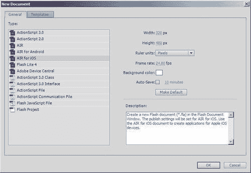
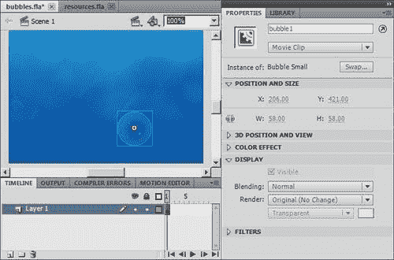

# 第二章：使用 Flash 构建 iOS 应用

在本章中，我们将涵盖：

+   安装 AIR SDK

+   创建一个 AIR for iOS 文档

+   将内容添加到舞台

+   AIR for iOS 常规设置

+   AIR for iOS 部署设置

+   从 Flash Professional 编译

+   使用 iTunes 安装您的应用

# 简介

现在你已经注册了 iOS 开发者计划，并从 iOS 配置文件门户获取了必要的文件，我们可以将注意力转向从 Flash Professional 构建原生 iOS 应用。

本章将介绍设置和编译 iOS 应用所需的基本任务。虽然我们将主要关注配置，但我们将为基本应用打下基础，这些内容将在下一章完成。

但首先，让我们花些时间介绍工具链。

在 Flash Professional CS5 发布时，Adobe 包括了**iPhone 打包器（PFI）**——一个命令行工具，它也被集成到 Flash IDE 中，允许 ActionScript 3.0 项目编译成原生 iOS 应用。

初始支持提供了对 Adobe AIR 2.0 和 Flash Player 10.1 API 的大部分访问权限，并针对 ARMv6 和 ARMv7 iOS 设备。

对于那些不熟悉**Adobe AIR**的人来说，它将 Flash 的功能扩展到浏览器沙盒之外，使开发者能够直接访问 Flash Player 无法访问的桌面计算机和移动设备的特性。

随着**Flash Professional CS5.5**的发布和 AIR 2.6 的引入，为 iOS 开发提供的 API 得到了扩展。Adobe 还进行了重大的性能改进；特别是渲染引擎。然而，对 iOS 3 及更早的 ARMv6 设备的支持已被取消，这意味着如果你使用 CS5.5，将无法针对原始 iPhone、iPhone 3G 或第一代和第二代 iPod touch 进行开发。

PFI 命令行工具也被移除，并由**AIR 开发工具（ADT）**取代。这是有道理的，因为 ADT 是 AIR 开发者传统上用来打包桌面和最近 Android 手机上交付的 AIR 应用的工具。

Adobe 迅速推出了 AIR 2.7，尽管它没有为 iOS 开发提供任何新的 API，但渲染性能再次得到提升，并添加了一个新构建选项，这大大提高了编译时间。

**AIR SDK**的最新主要版本是 3.0，它带来了一系列令人兴奋的新功能、性能增强和错误修复。也许，最显著的新增功能是备受期待的硬件加速 3D API 和能够使用原生代码实现的自定义 ActionScript 库编写功能。

本书涵盖的大多数配方都与 Flash Professional CS5 和 CS5.5 兼容。然而，AIR 2.6 及以上版本提供的新功能是针对 CS5.5 的，并将被明确标注。

使用 Flash 开发 iOS 应用通常被称为 **AIR for iOS**，这是本书中使用的术语。

# 安装 AIR SDK

在我们开始之前，重要的是您要花时间确保您的 Flash Professional 安装是最新的，并且已安装最新的 AIR SDK。

## 准备工作

您需要 Flash Professional CS5 或 CS5.5 才能编译原生 iOS 应用。

您可以从 Adobe 网站下载 Flash Professional CS5.5 的 30 天试用版，网址为 [www.adobe.com/downloads](http://www.adobe.com/downloads)。

## 如何操作...

我们将把这个步骤分成两部分。首先，我们将安装 Flash Professional 所需的任何更新。其次，我们将下载并安装最新的 AIR 运行时和 SDK 版本。

### 更新 Flash Professional

不时地，Adobe 会提供 Flash Professional 的更新。这些更新通常包括错误修复或额外的功能，由于某种原因，这些功能在发布时不可用。

访问 [www.adobe.com/support/flash/downloads.html](http://www.adobe.com/support/flash/downloads.html) 并检查 Flash 版本的更新。

如果您使用的是 Flash Professional CS5，那么您应该特别下载适用于您所选操作系统的以下两个更新：

+   Flash Professional CS5 更新 11.0.2

+   Flash Professional CS5 iOS 更新

### 注意

在应用 iOS 更新之前，必须安装 11.0.2 更新。此外，如果您当前已打开 Flash Professional CS5，则在尝试之前请关闭它。

iOS 更新必须通过将各种文件复制到您的 Flash Professional CS5 安装中手动应用。更新附带文档，您在尝试之前应仔细阅读。

一段详细说明 Flash Professional CS5 更新过程的视频也可用，可在 [www.gotoandlearn.com/play.php?id=133](http://www.gotoandlearn.com/play.php?id=133) 找到。

### 在 AIR SDK 上叠加

建议您在开发计算机上安装 AIR 运行的最新版本。您可以从 [`get.adobe.com/air`](http://get.adobe.com/air) 下载并安装。

此外，如果您使用的是 Flash Professional CS5.5，您还需要最新的 AIR SDK。默认情况下，CS5.5 提供对 AIR 2.6 的支持，但它可以被更新以使用最新版本。如果您想完成本书中涵盖的所有食谱，这是一个必要的步骤。

要实现这一点，您必须下载并手动将最新的 AIR SDK 套叠到您的 Flash Professional CS5.5 安装上。SDK 的下载链接和分步说明可在 [www.yeahbutisitflash.com/?p=2949](http://www.yeahbutisitflash.com/?p=2949) 找到。在继续之前，请仔细遵循这些说明。

不幸的是，如果你使用的是 Flash Professional CS5，你将仅限于使用 AIR 2.0 SDK，因为无法在其上叠加更新的 AIR SDK。不过，不用担心；你仍然可以尝试本书的大多数食谱。对于你不能尝试的食谱，考虑升级到 Flash Professional CS5.5 或从 Adobe 网站下载 30 天试用版。

官方 Adobe AIR 网站可在 [www.adobe.com/products/air.html](http://www.adobe.com/products/air.html) 找到。

## 它是如何工作的...

重要的是，你正在使用最新的 Flash Professional 和 AIR SDK 版本。随着每个新版本的发布，AIR for iOS 在 API 覆盖率和性能方面都得到了加强。

# 创建 AIR for iOS 文档

当你创建一个新的 FLA 文件时，你可以从几种文档类型中选择。

每种文档类型都会配置发布设置、舞台大小和帧率，以最适合你打算创建的内容。你的文档选择将取决于你是否想针对 Flash Player 及其 API，或者利用 AIR 的额外功能。

本食谱将指导你完成创建针对 AIR for iOS 的新 FLA 的必要步骤。我们将使用此 FLA 作为在本章和下一章中创建的简单应用程序的起点。

## 准备工作

确保你的 Flash Professional 版本已应用所有可用更新，并且你正在使用最新的 AIR SDK。如果你还没有这样做，那么在继续之前，请执行 *安装 AIR SDK* 菜单中概述的步骤。

## 如何操作...

按照以下步骤创建你的 FLA：

1.  启动 Flash Professional 并从下拉菜单中选择 **文件** | **新建** *(Ctrl + N* | *Cmd* + *N)*。

1.  **新建文档** 对话框将出现。确保已选择 **常规** 选项卡，并根据你使用的 Flash Professional 版本，点击以下文档类型之一：

    +   CS5: **iPhone OS**

    +   CS5.5: **AIR for iOS**

        **iPhone OS** 和 **AIR for iOS** 指的是完全相同的东西。从现在起，本书将使用 **AIR for iOS** 这个术语。如果你使用的是 Flash CS5，那么在创建新文档时只需选择 iPhone OS 即可。

    ### 注意

    在 CS5.5 中，你将在 **新建文档** 面板的右侧看到所选文档类型的各种属性。注意，当你选择 **AIR for iOS** 时，舞台大小会变为 320x480 像素。这是 iPhone 3GS 竖直方向握持时的标准屏幕尺寸。

1.  点击对话框右下角的 **确定** 按钮，如图所示：

    +   你的 AIR for iOS 文档将被创建。

    ### 注意

    此 FLA 将作为本章和下一章中创建的简单应用程序的起点。

    根据您选择的操作系统，使用 Windows 资源管理器或 Finder 导航到您的`Documents`文件夹中的`packt\flash-ios-cookbook\`。创建一个新的子文件夹并将其命名为`my-first-app`。

1.  从下拉菜单中选择**文件** | **另存为** *(Ctrl + Shift* + *S* | *Shift* + *Cmd* + *S)* 并将您的 FLA 保存到`my-first-app`文件夹中，命名为`bubbles.fla`。

## 它是如何工作的...

每次开始一个新的 AIR for iOS 项目时，您都应该执行我们刚才看到的简单步骤。

Flash 为您创建的文档将设置为利用 ActionScript 3.0 和 AIR API。**舞台**也将设置为有效的 iOS 屏幕大小，并且帧率默认为 24 fps。

## 还有更多...

您可以更改与 iOS 文档关联的许多默认设置。您可能会发现以下设置特别重要。

### 舞台尺寸

默认的 AIR for iOS 文档类型假定您将针对原始 iPhone 和 iPod touch 设备，并且您的应用将使用纵向屏幕方向。

在 Flash CS5.5 中，您将在**新建文档**面板的右侧看到您的文档默认属性。只需更改**宽度**和**高度**字段以针对不同的屏幕分辨率和方向。例如，如果您的应用需要锁定到横向屏幕方向，则将舞台大小设置为 480x320。

如果您使用 Flash CS5，您可以在创建文档后调整舞台尺寸。您可以从**属性**面板进行此操作。

可用的 iOS 屏幕分辨率（纵向模式）包括：

+   320x480—iPhone 3GS，第三代 iPod touch

+   640x960—iPhone 4，iPhone 4S，第四代 iPod touch

+   768x1024—iPad，iPad 2

当使用 Flash CS5 时，不支持 640x960 屏幕分辨率。

对于本书的大多数食谱，它将坚持默认分辨率 320x480，这是所有 iOS 设备都支持的。然而，Retina 和 iPad 显示分辨率在第八章（ch08.html "第八章。屏幕分辨率和方向变化"）中有所介绍。

### 帧率

所有新文档都使用 24 fps 的默认帧率。虽然您可以增加此值，但请注意，由于 CPU 和 GPU 的限制，在旧一代设备上实现更高的帧率可能会有困难。鉴于不同代 iOS 设备之间的性能差异，您应该仔细考虑帧率，尤其是如果您想针对尽可能多的设备的话。

## 参见

+   *AIR for iOS 通用设置*

+   *支持多分辨率*，第八章

# 将内容添加到舞台

使用 Flash 构建 iOS 应用的一个许多优点是能够使用您已经熟悉的创作工具。您仍然可以通过将内容从**库**拖放到舞台上来执行大部分布局，从而实现快速开发。

让我们这样做来构建一个简单的场景。

## 准备工作

本书附带各种图形资源文件，您在完成某些菜谱时应使用这些文件。这将为您节省大量时间和精力，并确保您的最终结果与您遵循的菜谱相匹配。

如果您还没有这样做，请从本书的配套网站上下载代码包。

### 小贴士

**下载示例代码**

您可以从您在 [`www.packtpub.com`](http://www.packtpub.com) 购买的 Packt 书籍的账户中下载所有示例代码文件。如果您在其他地方购买了此书，您可以访问 [`www.PacktPub.com/support`](http://www.PacktPub.com/support) 并注册以将文件直接通过电子邮件发送给您。

您可以在 `chapter2\resources\` 中找到本章使用的资源。此外，您还可以找到本章每个菜谱的完整代码示例。

确保您正在使用前面菜谱中创建的 `bubbles.fla` 文件工作。本章中的每个后续菜谱都将建立在前面菜谱的基础上，随着您的进展，向 `bubbles.fla` 添加更多内容。

## 如何操作...

我们首先将库中的符号复制到您的 FLA 文件中。

1.  选择 **文件** | **打开** *(Ctrl + O* | *Cmd* + *O)* 并浏览到 `chapter2\resources\resources.fla`。点击 **打开** 以加载 FLA 文件。

1.  从 `resources.fla` 复制所有库中的符号，并将它们粘贴到 `bubbles.fla` 的库中。

    您的库现在将包含一组位图和以下五个电影剪辑：**背景，大泡泡，中泡泡，中号泡泡** 和 **小泡泡**。从库中，双击每个电影剪辑符号，仔细查看每个的内容。您会看到每个剪辑都由单个位图图像组成。

1.  将 `Background` 电影剪辑符号从库中拖动到舞台。在 **属性** 面板中，展开 **位置和大小** 部分，并将电影剪辑定位在 (0,0)。如果您使用的是 Flash Professional CS5，那么您还应该展开 **显示** 部分，并勾选 **缓存为位图** 复选框。如果您使用的是 CS5.5，则无需设置此选项，因为这可能会降低此应用的性能。

1.  现在，从库中将三个 `Bubble Small` 实例拖动到舞台。如果您使用的是 Flash CS5，那么在 **属性** 面板中为每个实例勾选 **缓存为位图** 复选框。

1.  使用 **属性** 面板，将实例命名为 `bubble1, bubble2` 和 `bubble3`。同时，将每个实例的位置分别设置为 (206, 421)，(162, 160) 和 (122, 53)。以下截图显示了第一个泡泡实例在舞台上的定位：

1.  将三个 `Bubble Medium` 实例拖动到舞台。对于 Flash CS5，为每个实例勾选 **缓存为位图** 复选框。

1.  将实例命名为`bubble4, bubble5`和`bubble6`。分别设置它们的位置为（162，290），（318，274）和（203，119）。

1.  只需要两个`Bubble Large`实例。再次检查，如果您使用的是 CS5，请从**属性**面板中勾选**缓存为位图**复选框。

1.  分配`bubble7`和`bubble8`的实例名称，并将它们的位置设置为（74，329）和（297，12）。

1.  最后，将**Bubble Huge**放置在舞台上，如果您使用的是 CS5，请确保勾选**缓存为位图**复选框。给它一个实例名称为`bubble9`，并将其部分放置在舞台之外的位置（440，303）。

1.  保存您的 FLA 文件。

## 它是如何工作的...

我们刚刚讲解的内容，即使是只有基础 Flash 理解的人也应该感到熟悉。你只需将各种电影剪辑实例拖放到舞台上，就可以创建一个可以在 iOS 设备上显示的场景。

您可能不熟悉**缓存为位图**的渲染选项。这将在第六章中详细解释；但就目前而言，只需知道当使用 Flash Professional CS5 时，选择此选项将显著提高您应用在特定情况下的图形性能。

注意，在这个菜谱中，所有的图形内容都是以 PNG 格式提供的，而不是矢量格式。这是故意的，因为 iOS 设备可以将位图渲染到屏幕上比 Flash 的矢量内容更快。在适当的情况下，尽量使用位图，但这并不意味着您应该完全忽略 Flash 的矢量渲染器，因为它是 Flash 的许多优点之一。

现在我们已经有了一些视觉内容，我们可以开始配置 Flash 的额外 iOS 特定设置，以便构建和部署您的应用到设备上。

## 相关内容

+   *使用缓存为位图，第六章*

# AIR for iOS 常规设置

在将您的 FLA 编译成原生 iOS 应用之前，Flash 需要一些额外的信息。首先，您需要指定一些一般的 iOS 设置，我们将在下面介绍。

## 准备工作

我们将继续在`bubbles.fla`文件上工作。

## 如何操作...

当从 AIR for iOS 文档工作的时候，Flash Professional 会提供一个额外的设置面板。通过它，您将能够应用一些 iOS 特定的设置，这些设置将在输出原生 iOS 应用时被 Flash 使用。

选择**文件** | **AIR for iOS 设置**以打开面板。确保已选择**常规**选项卡。

### 提示

如果您正在使用 Flash Professional CS5，请选择**文件** | **iPhone OS 设置**。记住，CS5 使用**iPhone OS**这个术语，而 CS5.5 则将其称为**AIR for iOS**。

在**AIR for iOS 设置**面板中，可以为以下字段设置选项：

| 选项 | 描述 |
| --- | --- |
| **输出文件** | 您原生 iOS 应用的文件名 |
| **应用名称** | 您应用的名字 |
| **版本** | 您应用的版本号 |
| **纵横比** | 应用程序的默认屏幕方向 |
| **全屏** | 是否使用全屏或显示顶部状态栏 |
| **自动旋转** | 屏幕方向是否自动随设备旋转 |
| **渲染** | 设置你的应用使用的渲染模式 |
| **设备** | 你要针对的 iOS 设备 |
| **分辨率** | 标准或 Retina 屏幕分辨率支持 |
| **包含的文件** | 与你的应用捆绑在一起的其他资源 |

让我们设置一些这些选项：

+   **输出文件** 和 **应用名称** 字段将默认为你的 FLA 名称。对于本章的示例应用，确保 **输出文件** 设置为 **bubbles.ipa**，并且 **应用名称** 设置为 **Bubbles**。

+   在 **版本** 字段中设置一个值为 **0.1**。

+   气泡应用是为纵向屏幕方向设计的，并将占用你设备屏幕显示的全部。因此，确保将 **纵横比** 字段默认设置为 **纵向**，并检查 **全屏** 复选框。

+   请不要勾选 **自动旋转** 选项。

+   从 **渲染** 字段的下拉框中选择 **GPU**。

+   确保将 **设备** 字段设置为 **iPhone**，并将 **分辨率** 字段设置为 **标准**。在 Flash CS5 中，**分辨率** 字段不可用。

现在点击面板底部的 **确定** 按钮并保存你的 FLA。

## 它是如何工作的...

让我们更详细地检查一下之前做出的某些选择。

当你发布 FLA 文件时，Flash 会生成输出文件 `.ipa`，其中包含你的原生应用。这是你将在设备上安装的文件，通常被称为 IPA。

应用名称是在你的设备主屏幕上显示在应用图标下的名称。仔细考虑应用名称。长度超过 13 个字符的名称将因屏幕空间限制而被截断。

版本号编译到构建的每个应用中，并包含主版本号和次要版本号。当你在设备上安装应用的新版本时，你需要记住增加版本号。如果不这样做，则应用实际上不会覆盖现有版本进行安装。

虽然你的舞台尺寸可能已经暗示了这一点，但你仍然需要通过将 **纵横比** 字段设置为 **纵向** 或 **横向** 来明确声明你应用的纵横比。

渲染模式指定你的应用程序应该使用设备的 **图形处理单元 (GPU)** 还是使用 CPU 进行渲染。在某些情况下，GPU 渲染可以提高你应用的渲染性能。有关 GPU 加速的更多信息，请参阅 第六章。

选择 **设备** 字段告诉 Flash 你要针对哪个设备系列，并决定了你的 IPA 在特定设备上的运行方式。你可以选择 **iPhone、iPad** 或 **iPhone 和 iPad**。

选择**iPhone**将限制你的屏幕大小与 iPhone 的屏幕大小相同。你的 IPA 仍然可以在 iPad 上运行，但应用程序不会尝试利用 iPad 的屏幕分辨率。相反，iPad 将使用 iPhone 的标准 320x480 分辨率运行应用程序，并将图像放大以适应 iPad 的屏幕。选择**iPad**将利用 iPad 的分辨率，并将你的应用程序限制在该设备上。如果你编写了一个可以利用 iPhone 和 iPad 屏幕分辨率的程序，那么你应该选择**iPhone 和 iPad**。

还应注意的是，iPod touch 被视为 iPhone。因此，从**设备**字段中选择**iPhone**或**iPhone 和 iPad**将允许你的`.ipa`文件安装到 iPod touch 上。

AIR 2.6 及以上版本提供了利用在 iPhone 4 和第四代 iPod touch 上引入的**Retina 显示屏**的能力。这将为你提供 640x960 的屏幕分辨率。如果你确实想利用 Retina 显示屏，并且还想支持 320x480 的标准分辨率，那么你需要编写一个可以处理两者的单一应用程序。App Store 不允许你上传两个不同的版本；每个分辨率一个。Flash Professional CS5 不支持 Retina 显示屏支持。

这本书的大部分内容将集中在标准分辨率上，这将确保示例可以在所有 iOS 设备上运行。iPad 和 Retina 显示屏设备都将放大针对标准 320x480 分辨率的 内容。然而，有关 Retina 和 iPad 分辨率的更多详细信息，请参阅第八章。

## 还有更多...

以下是一些你应该考虑的更多选项。

### 添加状态栏

你可以通过取消选择**全屏**复选框来将默认的 iOS 状态栏添加到你的应用程序中。

状态栏消耗 20 个垂直像素（Retina 显示屏上的 40 个像素）并位于屏幕顶部。Flash 将尝试缩小你的应用程序以适应剩余的屏幕高度，并在屏幕两侧留下边框。

有几种方法可以防止这种情况发生。最简单的方法是将舞台高度降低以适应剩余的垂直空间。

或者，保持舞台的尺寸不变，并使用 ActionScript 防止其缩放。这样做的话，你将需要从舞台的顶部或底部牺牲一些像素空间。

在以下示例中，状态栏将覆盖并遮挡舞台顶部的内容：

```swift
stage.scaleMode = StageScaleMode.NO_SCALE;
stage.align = StageAlign.BOTTOM_LEFT;

```

而以下代码片段将舞台直接放置在状态栏下方，裁剪掉舞台底部的内容：

```swift
stage.scaleMode = StageScaleMode.NO_SCALE;
stage.align = StageAlign.TOP_LEFT;

```

在任何情况下，你还需要导入`flash.display.StageScaleMode`和`flash.display.StageAlign`类。

### 注意

状态栏在 iPad 上也消耗 20 个垂直像素。

### 包含文件

在 AIR for iOS 设置面板的底部是 **包含的文件** 列表，其中包含要捆绑到你的 `.ipa` 文件或用于编译的资源。

默认情况下，列表中会出现两个文件：代表你的应用程序的 `.swf` 文件以及一个名为应用程序描述符文件的 XML 文件。应用程序描述符文件包含整个应用程序的属性，包括在 AIR for iOS 设置面板中设置的属性。

可以通过将它们添加到列表中来将附加文件捆绑到你的 IPA 中。我们将在本书的各个部分看到如何做到这一点以及为什么它是有用的。

## 相关内容

+   *包含应用程序启动图像，第三章*

+   *编辑应用程序描述符文件，第三章*

# AIR for iOS 部署设置

我们几乎准备好从 Flash 发布原生 iOS 应用程序了。现在实际上是时候使用你在 第一章，*开始 iOS 应用程序开发*中创建的开发文件了。作为部署过程的一部分，Flash Professional 需要你的 P12 证书文件和你的开发配置文件。没有这些文件，它将无法将你的 FLA 编译成原生 iOS 应用程序。

让我们通过配置 iOS 部署设置的步骤进行说明。

## 准备工作

在尝试此配方之前，你需要创建一个 P12 证书文件和一个开发配置文件。如果你还没有这样做，那么首先完成以下配方：

+   *使用 Windows 创建 P12 证书，第一章*

+   *使用 Mac OS X 创建 P12 证书，第一章*

+   *创建开发配置文件，第一章*

你还应该在 Flash Professional 中设置你的通用 iOS 设置，这在 *AIR for iOS 通用设置* 配方中已有介绍。

## 如何做...

你将再次在 AIR for iOS 设置面板中工作。

1.  通过从 Flash Professional 的下拉菜单中选择 **文件** | **AIR for iOS 设置** 来打开 **AIR for iOS 设置** 面板。

1.  点击设置面板中的 **部署** 选项卡。

    从这里你将能够设置以下内容：

    +   用于数字签名你的应用程序所需的 P12 证书文件

    +   与你的应用程序关联的配置文件

    +   应用 ID

    +   要使用的部署类型

1.  让我们先指定 P12 证书文件。点击 **证书** 字段右侧的 **浏览** 按钮。从文件浏览器中，导航到你的 `Documents` 文件夹中的 `packt\flash-ios-cookbook\developer-files\`。选择 `.p12` 文件，然后点击 **打开**。

1.  在直接位于下方的**密码**字段中，输入与你 P12 证书关联的密码。这是你在第一章中从*使用 Windows 创建 P12 证书*菜谱或*使用 Mac OS X 创建 P12 证书*菜谱中设置的导出密码。

1.  此外，直接在**密码**字段下方勾选**记住本次会话的密码**复选框。

    ### 注意

    **记住本次会话的密码**选项将防止 Flash 在每次发布 FLA 时要求你输入密码。然而，每次重新启动 Flash 时你都需要再次输入密码，因为它仅在会话基础上存储。

1.  现在 Flash Professional 知道要使用哪个证书，你可以指定应用要关联的**配置文件**。

    点击**配置文件**字段右侧的**浏览**按钮，从`developer-files`文件夹中选择`.mobileprovision`文件。

1.  直接位于下方的**应用 ID**字段期望一个唯一的标识符。为此应用输入**bubbles**作为 ID。

1.  最后一步是选择部署类型。

    默认情况下应选择**快速发布以进行设备测试**选项。如果没有选择，请选择它。

1.  点击**确定**并保存你的 FLA。

## 它是如何工作的...

你的 FLA 现在已准备好编译成原生 iOS 应用。实际上，你可以直接从**AIR for iOS 设置**面板发布应用，但我们将在下一个菜谱中再进行发布。

## 更多...

在继续之前，花些时间了解应用 ID 和部署类型设置的作用是值得的。

### 指定应用 ID

你可能记得在第一章中*创建开发配置文件*菜谱中创建并关联应用 ID。

应用 ID 由两部分组成：包种子 ID 和包标识符。Flash Professional 期望你只提供包标识符。

如果你的包标识符包含通配符符号`*`，那么你需要用代表你应用的任意字符串替换该符号。通配符应用 ID 允许你使用相同的配置文件发布多个应用。

与你的配置文件关联的应用 ID 仅是通配符符号，这意味着你需要在 Flash Professional 中的**应用 ID**字段中输入一个完全由你选择的任意字符串。

在这种情况下，分配与应用名称相关的应用 ID 是有意义的，使得`bubbles`成为本章示例应用的合适 ID。

### 部署类型

在 Flash Professional 中，有四种不同的部署类型可供选择：

+   快速发布以进行设备测试

+   快速发布以进行设备调试

+   部署—Ad hoc

+   部署—Apple App Store

在开发时，你只需要从前两个中选择。

从 Flash Professional，**快速发布以进行设备测试** 选项是部署和运行设备上应用的最快途径。但是，如果你想直接从设备调试你的应用，那么你需要选择 **快速发布以进行设备调试**，这将允许你使用 Flash Professional 的远程调试器查看 `trace()` 语句并在断点处暂停你的应用程序。

剩余的部署类型是用于构建准备进行公测或 App Store 提交的应用，你需要拥有一个分发证书。

有关分发详情，请参阅 **程序用户指南** 的 **分发** 部分，该部分可在 iOS 配置文件门户的 **资源** 部分找到。

## 参见

+   *获取你的开发证书，第一章*

+   *创建 App ID，第一章*

+   *创建开发配置文件，第一章*

# 从 Flash Professional 编译

在 iOS 设置成功配置后，你可以继续将你的 FLA 文件编译成原生应用。

## 准备工作

如果你还没有为你的应用配置 iOS 设置，那么在继续之前，请执行以下两个步骤：

+   *AIR for iOS 通用设置*

+   *AIR for iOS 部署设置*

## 如何操作...

将你的 FLA 文件从 Flash Professional 编译成原生 iOS 应用可能需要几分钟，具体取决于你的计算机硬件配置。因此，建议首先使用 **AIR 调试启动器 (ADL**) 发布你的 FLA 文件。这将让你在尝试构建原生 iOS 版本之前快速找到并纠正任何编译错误。

让我们使用 ADL 快速发布 `bubbles.fla`。

1.  从 Flash Professional 的下拉菜单中选择 **控制** | **测试影片** | **在 AIR 调试启动器 (移动)** 中。

1.  如果成功，将发布一个 `.swf` 文件并在 ADL 中运行。你应该能看到本章前面在 *将内容添加到舞台* 菜单中创建的场景。

    ### 注意

    目前，你的 SWF 将只显示一个静态场景，其中包含各种大小的气泡，背景是静态的。随着我们在本章和下一章中添加更多功能，`bubbles.fla` 文件将变得更加动态。

    +   如果有任何编译错误，请纠正它们并重新发布。你可以通过按 *Ctrl + Enter*（在 Mac 上为 *Cmd + Enter*）而不是每次都使用下拉菜单来执行后续发布尝试。

        一旦你确信已经消除了所有编译错误，你就可以发布你的 FLA 文件以在 iOS 设备上部署。

1.  要这样做，只需从 Flash 的下拉菜单中选择 **文件** | **发布** *(Alt + Shift* + *F12* | *Shift* + *Cmd* + *F12)*，编译过程将开始。

### 注意

如果出现 **AIR for iOS 设置** 面板，那么很可能是 Flash 需要再次输入你的证书密码。这可能会发生如果你忘记勾选 **记住此会话的密码** 复选框，或者如果你在关闭 Flash 后重新启动了它。

在任何情况下，输入密码，勾选复选框，然后点击面板底部的**发布**按钮。

如果成功，将输出一个名为 `bubbles.ipa` 的文件到你的 FLA 所在的同一文件夹。

## 它是如何工作的...

`.ipa` 文件是应用的原生 iOS 版本，是你安装到设备上进行测试的文件。

为了将你的应用的 `.swf` 文件交叉编译成 `.ipa` 文件，Flash Professional CS5 会调用 **iPhone 打包器 (PFI)**，而 CS5.5 会调用 **AIR 开发工具 (ADT)**。

编译时间可能会很长，尤其是对于大型项目。

虽然没有真正的替代品可以替代实际的设备测试，但你可能想从 ADL 测试你应用的微小增量更改。这可以节省相当多的时间，但请注意，并非所有 iOS 功能都支持桌面，并将需要在设备上进行测试。

此外，Adobe 在 AIR 2.7 中引入了一个新的构建目标，称为 **解释器模式**，将编译时间从几分钟缩短到几秒钟。这个功能针对的是高级开发者，因为它需要使用命令行。

## 还有更多...

你可能好奇为什么编译 `.ipa` 文件比使用 ADL 发布 `.swf` 文件花费的时间要长得多。以下部分可能有助于你的理解。

### LLVM 编译器基础设施

而不是在运行时被解释，编写了一个编译器将 `.swf` 文件转换为原生 iOS 应用程序。

这是通过使用广泛使用的开源 **低级虚拟机 (LLVM)** 编译器基础设施实现的。Adobe 为 LLVM 创建了一个新的编译器前端，使其能够理解 ActionScript 3.0。然后使用 LLVM 现有的 ARM 后端输出原生 ARM 机器代码，这是 iOS 设备中使用的 CPU 能够理解的。这通常被称为 **提前编译**。

虽然你的应用是用 Flash 编写的，但最终结果是完全原生的 iOS 应用程序。

然而，提前编译的过程相当复杂，并且比简单地从 Flash 发布 `.swf` 文件花费的时间要长得多。

你可以在 [`llvm.org`](http://llvm.org) 上了解更多关于 LLVM 的信息。

# 使用 iTunes 安装你的应用

一旦你将你的 FLA 编译成 `.ipa` 文件，它就可以安装到你的设备上进行测试。有各种应用程序可供使用，其中之一是 iTunes。

让我们看看这是如何操作的。

## 准备工作

你必须已经在你设备上安装了你从 Flash Professional 编译 IPA 时使用的相同的配置文件。

如果您还没有这样做，那么首先执行第一章中详细说明的*在您的设备上安装配置文件*的步骤。

## 如何操作...

1.  启动 iTunes 并通过 USB 连接您的 iOS 设备。

1.  从 iTunes 的下拉菜单中选择**File** | **Add File to Library** *(Ctrl + O* | *Cmd* + *O)*。

    ### 注意

    在 Mac OS X 上，下拉菜单选项列出的为**Add to Library**。

1.  在文件浏览器中，导航到并选择您想要安装的`.ipa`文件。对于这个菜谱，只需找到您之前创建的`bubbles.ipa`文件。您应该能在`Documents`文件夹中的`packt\flash-ios-cookbook\my-first-app\bubbles.ipa`找到它。

1.  `.ipa`文件将在 iTunes 上安装。通过检查您的 iTunes 库中名为**Bubbles**的应用程序来确认这一点。您可以通过单击 iTunes 中**LIBRARY**部分下方的**Apps**类别来查看您的已安装应用程序。

1.  最后一步是将应用程序从您的电脑的 iTunes 库移动到您的设备上。

    在 iTunes 的**DEVICES**部分下方，单击您的设备名称。默认情况下，您将看到设备的摘要信息。摘要信息上方有一行标签。单击**Apps**标签。

1.  从这里，您可以同步您的设备库与电脑上的库。在左侧，您将找到存储在您电脑上的应用程序列表，而在右侧是您设备上安装的应用程序列表。将左侧的列表向下滚动，直到找到**Bubbles**应用程序。如果它尚未被选中，请检查其旁边的复选框。

1.  现在要将应用程序复制到您的设备，请单击 iTunes 右下角底部的**Apply**按钮。

    ### 注意

    从**Apps**标签页，确保选中了**Sync Apps**复选框。如果没有，那么您必须先手动同步您的设备，才能将最新版本的应用程序复制到您的设备上。

1.  在您的设备上找到**Bubbles**应用程序，并通过轻触其图标来启动它。

### 注意

在较旧的 iOS 设备（如第一代和第二代 iPhone 和 iPod touch）上，您可能会发现一些应用程序在首次启动时性能特别缓慢。这通常是由于您的设备在同步到电脑后，在后台更新其库所导致的。

如果您遇到问题，那么在启动应用程序之前，您可能想要等待此更新过程完成。您可以通过从主屏幕选择**音乐**应用程序来检查您的设备库是否正在更新。如果库目前正在更新，您将收到通知并被阻止从您的音乐库中选择。

## 它是如何工作的...

使用 iTunes 复制您的应用程序是一个相当简单的过程，但为了使该过程成功，您创建并从 iOS 配置文件门户获得的开发文件必须一切正常。

如果有问题，那么您的应用程序可能无法复制到您计算机上的 iTunes 库，或者无法安装到您的设备上。如果您遇到这些问题中的任何一个，那么可能是因为以下一个或多个原因：

+   您的配置文件尚未复制到 iTunes 库中。

+   您的配置文件尚未复制到您的设备上。

+   配置文件已过期。

+   该设备尚未与配置文件注册。

+   IPA 使用与设备上不同的配置文件编译。

+   在 Flash 中指定的 App ID 与配置文件的捆绑标识符模式不匹配。

+   您的开发计算机的防火墙可能会干扰您应用程序的安装。如果所有其他方法都失败，请禁用防火墙并重试将应用程序安装到您的设备上。

不幸的是，当应用程序安装失败时，您从 iTunes 收到的错误可能难以理解。如果您确实遇到问题，并且您仍在 iOS 开发中寻找方向，那么删除您的开发文件并再次通过配置过程可能更好。

## 更多...

我们已将我们的第一个应用程序部署到我们的设备上。当您安装和测试应用程序的后续版本时，您应该考虑下一节中提到的配置。

### 更新版本号

每次您制作一个希望在您的设备上测试的新构建时；您还需要从 Flash 的 AIR for iOS 设置面板更新您应用程序的版本号。

如果您忘记这样做，那么在同步时，iTunes 不会将最新版本的应用程序复制到您的设备上；iTunes 只会用版本号更高的应用程序替换现有的应用程序。

然而，每次构建时更新版本号很容易被忽略。为了更快速的开发，您可能希望在安装最新版本之前，从您的设备上删除现有版本的应用程序。

要直接从您的设备中删除应用程序，只需将手指放在图标上几秒钟，然后点击出现在其右上角的对勾。

### iPhone Configuration Utility

作为 iTunes 的替代方案，您可能想要考虑从 Apple 下载并安装 iPhone 配置实用工具。

它允许您从您的设备安装和删除应用程序，并让您查看实际安装的应用程序版本——这是 iTunes 目前无法做到的。

iPhone 配置实用工具适用于 Mac OS X 和 Windows，可以从[www.apple.com/support/iphone/enterprise](http://www.apple.com/support/iphone/enterprise)下载。

### TestFlight

对于团队环境，请查看**TestFlight**。它是一个免费空中平台，用于在开发和测试期间向团队成员分发应用程序。该服务允许 iOS 开发者创建团队，邀请团队成员，添加团队成员的设备，并将他们的最新构建分发给他们。

每次新构建都会通过一封包含安装链接的电子邮件发送给测试人员。点击链接将无线下载并安装构建到设备上。团队成员无需将设备物理连接到计算机即可安装构建。

您可以在[`testflightapp.com.`](http://https://testflightapp.com.)注册 TestFlight。
