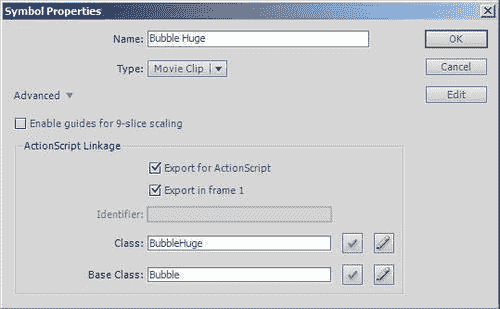
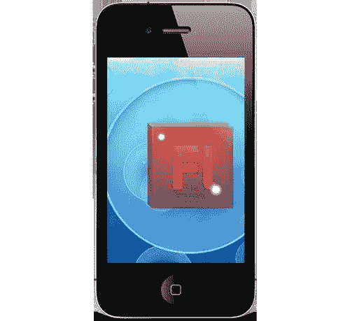
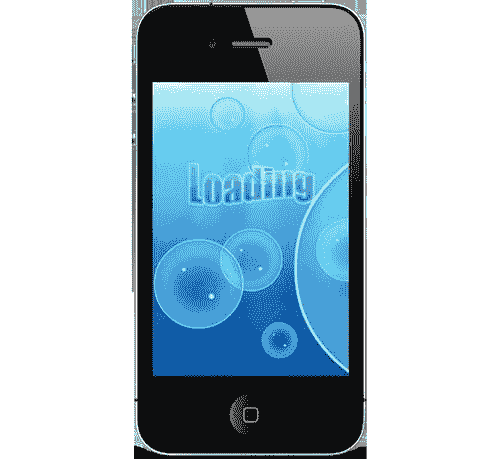
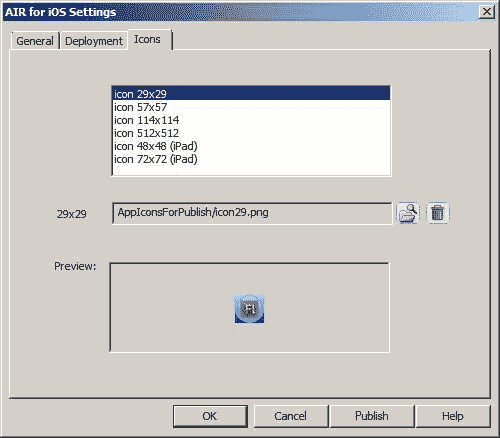
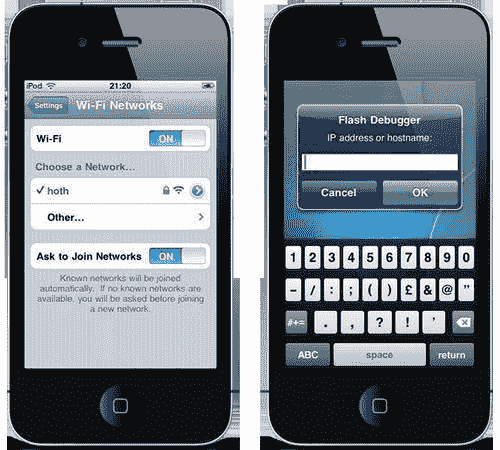

# 第三章。编写您的第一个应用程序

在本章中，我们将介绍：

+   创建基本文档类

+   防止屏幕空闲

+   处理多任务

+   优雅地退出应用程序

+   将类链接到电影剪辑符号

+   使用更新循环

+   包含应用程序启动图像

+   包含图标

+   编辑应用程序描述文件

+   远程调试

# 简介

您现在应该能够从 Flash Professional 编译和部署原生 iOS 应用程序。在本章中，我们将继续上一章的内容，基于我们的 FLA 创建我们的第一个 iOS 应用程序。

虽然与针对桌面计算机相比有一些差异，但使用 Flash 编写 iOS 应用程序的过程对任何 Flash 开发者来说都会感到熟悉。在这个过程中，我们将介绍一些最佳实践，并让您亲身体验使用一些基本的 ActionScript 编写简单应用程序是多么容易。我们还将通过添加默认启动图像和图标图形来为应用程序添加最终修饰。

# 创建基本文档类

虽然您可以直接在时间轴上编写 ActionScript 3.0 代码，但这并不是推荐的做法。相反，您真的应该采用更面向对象的方法，并开发自己的自定义类。这在大型项目中尤为重要。

大多数 ActionScript 开发者应该已经熟悉创建类，但我们将在这里介绍这些步骤以避免疑问。特别是，这个配方将指导您创建一个基本的文档类，该类可以应用于上一章中开始的示例应用程序。

## 准备工作

我们将使用 `bubbles.fla` 的最新版本进行工作，该版本来自 第二章。或者，您也可以从书籍的配套代码包中打开 `chapter3\recipe1\bubbles.fla`。

## 如何操作...

按照以下步骤创建文档类：

1.  首先，请确保您的舞台上的实例没有被选中。然后，从 **属性** 面板中的 **发布** 部分，点击 **类** 字段旁边的铅笔图标。

    将会显示 **创建 ActionScript 3.0 类** 对话框。

1.  在对话框中，您可能被要求选择哪个应用程序用于创建 ActionScript 3.0 类。如果被提示，请选择 **Flash Professional** 单选按钮。

1.  在 **类名** 字段中输入 **Main** 并点击 **确定**。

    将创建一个名为 Main 的骨架类，并在 Flash IDE 的新标签中显示。

1.  通过从 Flash 的下拉菜单中选择 **文件** | **另存为** *(Ctrl + Shift* + *S* | *Shift* + *Cmd* + *S)* 来保存类。当提示时，将文件命名为 `Main.as` 并将其保存在与 `bubbles.fla` 相同的文件夹中。

1.  通过单击其标签返回到 `bubbles.fla`。

    ### 注意

    您创建或打开的每个类都将作为一个标签显示，与任何当前打开的 FLA 文件一起。您可以直接在 Flash Professional 的下拉菜单中找到这些标签。

    +   您现在已经有一个与您的 FLA 相关的文档类。

1.  通过使用 ADL 测试您的 FLA 来确保没有编译错误。您可以通过从 Flash 的下拉菜单中选择**控制** | **测试影片** | **在 AIR 调试启动器（移动）**来完成此操作。或者，如果您之前已从 ADL（移动）测试过，只需按*Ctrl* + *Enter* *(Mac 上的 Cmd + Enter)*即可。

## 它是如何工作的...

文档类为您的应用程序提供了一个主要入口点。您添加到类构造函数中的任何代码在应用程序启动时都会执行，这为您提供了一个理想的位置来执行初始化。

下面是构造函数当前的样子：

```swift
public function Main() {
//constructor code
}

```

如您所见，构造函数目前是空的，但在本章剩余部分将会发生变化。

## 更多内容...

下面是关于类创建的几个更多要点。

### 命名文档类

文档类的名称并不重要。您可以为类选择任何有效的名称；然而，在本书中，我们将遵循为每个新应用程序命名文档类为`Main`的惯例。

### 使用包

由于本章示例的简单性，将所有代码添加到与`bubbles.fla`相同的文件夹中就足够了。当然，对于更复杂的项目，您可能会将类打包到单独的子文件夹中，以防止与第三方编写的类发生命名空间冲突。

### 使用 Flash Builder 进行编辑

一些开发者认为 Flash Professional 的代码管理和编辑功能过于有限。Adobe 通过将 Flash Professional 与 Flash Builder 集成来解决这个问题。

**Flash Builder**是一个功能强大的编码环境，它提供的功能超过了 Flash Professional 所提供的。现在您可以从 Flash Builder 中编辑和编译您的 iOS 项目。

当您在 Flash Professional 中创建类时，您将可以选择是否直接在 Flash Professional 中编辑该类，或者打开并使用 Flash Builder 进行代码编辑。

本书不会涵盖 Flash Builder，但您可以从 Adobe 网站[www.adobe.com/downloads](http://www.adobe.com/downloads)购买或下载试用版。

虽然您可以使用其他第三方 IDE，如 Flash Develop 和 FDT，来编辑您的 ActionScript，但它们不能直接从 Flash Professional 启动。

### 创建其他 ActionScript 3.0 类

可以从 Flash Professional 创建其他自定义 ActionScript 3.0 类。然而，这些类文件是从 Flash Professional 的下拉菜单创建的。

简单地选择**文件** | **新建** *(Ctrl + N* | *Cmd* + *N)*以打开**新建文档**面板。从这里，您可以选择**ActionScript 3.0 类**类型并为类提供名称。

## 参见

+   *将类链接到电影剪辑符号*

# 防止屏幕空闲

为了节省电池寿命，移动设备在最后一次触摸后不久会锁定屏幕。然而，对于用户可能不会经常与屏幕交互的应用程序来说，这可能是不方便的。

对于这种情况的应用，可以禁用屏幕锁定。

## 准备工作

我们将在之前菜谱中创建的骨架文档类中添加代码。如果你还没有这样做，那么在继续之前，请完成*创建基本文档类*菜谱。或者，使用本书的配套代码包，在 Flash Professional 中打开`chapter3\recipe2\bubbles.fla`，并从那里开始工作。

## 如何做...

让我们编写一些 ActionScript 来禁用屏幕锁定：

1.  通过从 Flash Professional 的下拉菜单中选择**文件** | **打开** *(Ctrl + O* | *Cmd* + *O)* 来打开 FLA 文档类。从文件浏览器中选择**Main.as**。

1.  将以下两个导入语句添加到你的类中：

    ```swift
    import flash.display.MovieClip;
     import flash.desktop.NativeApplication;
    import flash.desktop.SystemIdleMode; 

    ```

1.  为了防止屏幕空闲时设备锁定，这两个类都是必需的。

1.  创建一个成员变量，用于存储一个`NativeApplication`对象：

    ```swift
    public class Main extends MovieClip {
    private var application:NativeApplication; 

    ```

1.  在构造函数中，获取一个`NativeApplication`引用并将其存储在你的`application`成员变量中：

    ```swift
    public function Main() {
    application = NativeApplication.nativeApplication; 
    }

    ```

1.  使用`application`变量强制设备的屏幕保持唤醒状态：

    ```swift
    public function Main() {
    application = NativeApplication.nativeApplication;
    application.systemIdleMode = SystemIdleMode.KEEP_AWAKE; 
    }

    ```

1.  保存你的类文件。

1.  通过单击其选项卡来移动到你的 FLA，并通过从下拉菜单中选择**文件** | **AIR for iOS 设置**来打开 AIR for iOS 设置面板。

1.  从设置面板中，确保已选择**常规**选项卡，并将**版本**字段更新为**0.2**。

1.  点击**确定**并保存你的 FLA。

1.  现在，通过使用 ADL 测试你的电影来检查 FLA 中是否存在任何编译时错误。

    一旦你确认没有错误，通过选择**文件** | **发布** *(Alt + Shift + F12 | Shift + Cmd + F12)* 来发布你的 iOS 应用，并使用 iTunes 将生成的.ipa 文件部署到你的设备上。

1.  启动应用。你应该注意到在应用的生命周期内，屏幕不会变暗或锁定。

### 注意

每次你想将新构建部署到设备时，都需要增加应用版本号。如果你启动应用后没有看到任何变化，那么很可能是版本问题。

为了测试目的，将你的 iOS 设备的自动锁定时间设置为最短持续时间。你可以通过在 iOS 设备上选择**设置** | **通用** | **自动锁定**来完成此操作。这将减少你等待确认在应用中禁用自动锁定所需的时间。

## 如何工作...

`NativeApplication`类提供了一个`systemIdleMode`属性，可以设置为允许或防止你的设备屏幕锁定。从`NativeApplication`，你还可以获取应用信息，访问应用级函数，并捕获应用级事件。

在代码示例中，我们将`systemIdleMode`设置为`SystemIdleMode.KEEP_AWAKE`，确保在应用的生命周期内屏幕不会锁定。可以通过将`SystemIdleMode.NORMAL`重新启用来自动锁定。

为了防止过度使用电池，建议谨慎使用`SystemIdleMode.KEEP_AWAKE`。你可能只想在绝对必要时禁用应用程序内的自动锁定。

此外，你可能已经注意到你的代码中没有显式创建`NativeApplication`的实例。`NativeApplication`是一个单例对象，当你的应用程序启动时自动创建。只能存在一个实例，并且通过使用类的静态`nativeApplication`属性来访问。

# 处理多任务

iOS 4 或更高版本支持多任务处理。当用户通过按设备的主按钮退出应用程序时，应用程序会被移动到后台而不是完全关闭。这也可以由多种其他原因引起，例如用户接受来电或应用程序本身启动另一个应用程序。

当用户或其他应用程序再次启动应用程序时，它可以直接从上次离开的地方继续，而不是完全重新加载。这也显著减少了返回应用程序时的启动时间。

当你的应用程序被移动到后台或由操作系统恢复时，会触发事件。本食谱将解释如何监听和捕获这些事件。

## 准备工作

我们将扩展 Bubbles 应用程序，为我们的文档类提供可以处理应用程序移动到后台和恢复的方法。

此食谱是在*防止屏幕闲置*食谱的基础上进行的。

### 注意

AIR 2.0 SDK 不提供对 iOS 多任务处理的支持。如果你使用的是 Flash Professional CS5，则跳过此食谱，转到*优雅退出应用程序*食谱。

## 如何操作...

对你的文档类进行以下更改：

1.  在 Flash Professional CS5.5 中打开`Main.as`。

1.  你将需要使用`Event`类。将其添加到你的导入语句列表中：

    ```swift
    import flash.display.MovieClip;
    import flash.desktop.NativeApplication;
    import flash.desktop.SystemIdleMode;
    import flash.events.Event; 

    ```

1.  在构造函数中，监听`NativeApplication`触发`Event.ACTIVATE`和`Event.DEACTIVATE`：

    ```swift
    public function Main() {
    application = NativeApplication.nativeApplication;
    application.systemIdleMode = SystemIdleMode.KEEP_AWAKE;
    application.addEventListener(Event.ACTIVATE, activate);
    application.addEventListener(Event.DEACTIVATE, deactivate); 
    }

    ```

1.  为每个事件添加处理程序：

    ```swift
    private function deactivate(e:Event):void {
    application.systemIdleMode = SystemIdleMode.NORMAL;
    }
    private function activate(e:Event):void {
    application.systemIdleMode = SystemIdleMode.KEEP_AWAKE;
    }

    ```

1.  返回到你的构造函数并删除以下突出显示的行：

    ```swift
    public function Main() {
    application = NativeApplication.nativeApplication;
    application.systemIdleMode = SystemIdleMode.KEEP_AWAKE; 
    application.addEventListener(Event.ACTIVATE, activate);
    application.addEventListener(Event.DEACTIVATE, deactivate);
    }

    ```

1.  这行代码不再需要，因为它现在由`activate()`方法执行。

1.  保存你的类文件，并通过使用 ADL 测试`bubbles.fla`来检查任何编译时错误（*Ctrl + Enter* | *Cmd* + *Enter*）。

## 它是如何工作的...

当你的应用程序即将被移动到后台时，`NativeApplication`类会触发`Event.DEACTIVATE`事件。或者，当 iOS 恢复你的应用程序或它被启动时，会触发`Event.ACTIVATE`事件。你可以监听并响应这些事件，以便初始化你的应用程序，准备将其移动到后台，或再次激活。

在本食谱的示例中，我们只是利用了在应用程序启动或恢复时禁用自动锁定的机会，并在应用程序挂起时启用自动锁定。

## 更多内容...

你可能会对以下有关 iOS 多任务处理的信息感兴趣。

### 后台处理

iOS 上的大多数后台应用程序实际上是被挂起的。它们仍然在系统内存中，但实际处于暂停状态。这节省了 CPU 资源并增加了设备的电池寿命。

然而，某些类型的应用程序可以在后台继续运行而不是被挂起。这些应用程序被分配有限的 CPU 资源来执行一些特定的任务，例如播放音频或访问基于位置的信息。

在任何情况下，AIR 的 `NativeApplication` 类都会触发 `Event.DEACTIVATE` 事件。

### 应用程序关闭

不要假设您的后台应用程序将保留在内存中。

用户或操作系统本身可能会决定关闭您的应用程序。如果您的应用程序被用户关闭，那么您可能会获得保存其状态和执行任何最终清理代码的机会。

# 从应用程序中优雅地退出

在 iOS 3 设备上按下主页按钮将关闭当前应用程序并将其从内存中移除。在运行 iOS 4 或更高版本的设备上执行相同操作将应用程序置于挂起或后台状态，而不是关闭它。然而，用户可以使用快速应用程序切换器关闭并从内存中移除这些应用程序。此外，当系统内存不足时，iOS 本身可能会决定关闭挂起或后台应用程序。

如果用户决定关闭您的应用程序，那么在它退出之前，您将有机会执行任何必要的维护操作，例如保存状态或释放内存。

## 准备工作

我们将在您的 Bubbles 应用程序的当前版本中添加一些代码，使其能够优雅地退出。或者，从本书的配套代码包中打开 `chapter3\recipe4\bubbles.fla` 并从那里开始工作。

## 如何操作...

让我们监听并处理 Bubbles 应用程序被关闭：

1.  在 Flash Professional 中打开 `Main.as` 文件。

1.  我们将使用 `Event` 类。确保将其添加到您的类的导入语句列表中：

    ```swift
    import flash.display.MovieClip;
    import flash.desktop.NativeApplication;
    import flash.desktop.SystemIdleMode;
    import flash.events.Event; 

    ```

1.  在构造函数中，监听 `NativeApplication` 对象触发的 `Event.EXITING` 事件：

    ```swift
    application.addEventListener(Event.EXITING, exiting);

    ```

1.  添加一个事件处理器，在您的应用程序退出之前执行任何必要的清理操作：

    ```swift
    private function exiting(e:Event):void {
    application.removeEventListener(Event.EXITING, exiting);
    application.systemIdleMode = SystemIdleMode.NORMAL; 
    }

    ```

1.  如果您正在使用 Flash Professional CS5.5 并已完成之前的配方——*处理多任务*——那么请将以下行添加到您的 `exiting()` 事件处理器中：

    ```swift
    private function exiting(e:Event):void {
    application.removeEventListener(Event.ACTIVATE, activate);
    application.removeEventListener(Event.DEACTIVATE, deactivate);
    application.removeEventListener(Event.EXITING, exiting);
    application.systemIdleMode = SystemIdleMode.NORMAL;
    }

    ```

1.  保存您的类文件并检查任何编译时错误。

## 它是如何工作的...

每当您的应用程序即将退出时，`NativeApplication` 类会触发 `EXITING` 事件。通过响应此事件，您可以执行任何必要的清理操作，例如保存状态或释放内存。

您还可能注意到在 `exiting()` 方法中，我们已经利用机会重新启用自动锁定。尽管 iOS 应该在您的应用程序退出时为您启用自动锁定，但明确在代码中这样做是一种良好的实践。

进行其他形式的清理也是良好的实践，例如移除事件监听器，我们也已经这样做。从对象中移除事件监听器很重要，因为不这样做是内存泄漏的常见原因。这适用于应用程序的整个生命周期，而不仅仅是退出时。

## 还有更多...

最后，关于退出序列的更多细节。

### 应用切换器

在 iOS 4 或更高版本上，你必须使用快速应用切换器显式地关闭一个应用。要访问应用切换器，双击主屏幕按钮。要关闭一个应用，点击并按住其图标，直到图标角落出现减号符号。点击减号符号，应用将从后台移除。这将强制`Event.EXITING`从应用中发出，当它正在关闭时。

### 清理工作

除了保存应用程序的状态外，你还应该对`Event.EXITING`事件做出必要的清理响应。你的应用通过完全释放内存来自我清理是很重要的。你应该销毁任何对象，移除你添加的任何剩余的事件监听器，停止任何仍在运行的计时器和时间轴动画，停止所有正在播放的声音，取消任何网络请求，最后关闭任何套接字、文件流或数据库连接。

### 脚本执行时间

确保你的事件处理程序中的代码尽可能快地执行。如果它需要超过几秒钟，iOS 可能会提前终止你的应用程序。如果在保存状态信息到设备的过程中发生这种情况，这可能会特别有害。

为了最大限度地减少超时的可能性，在退出过程中尽量减少保存的数据量。你还应该确保在执行任何其他清理任务之前保存数据。这将增加在执行长时间退出和清理操作时保存应用程序状态的可能性。

# 将类链接到电影剪辑符号

通过创建和将自定义类链接到电影剪辑符号，可以给电影剪辑符号添加额外的行为。通常，该类会监听并响应由电影剪辑发出的事件。其中，`Event.ENTER_FRAME`是最广泛使用的，它提供了一种在每一帧重绘时程序化更新电影剪辑外观的方法。

我们将编写一个自定义类，使我们的示例应用最新版本中的每个气泡向上浮动。

## 如何做到这一点...

让我们编写一个自定义类并将其链接到每个气泡：

1.  在 Flash Professional 中选择**文件** | **新建** *(Ctrl + N* | *Cmd* + *N)*。从**新建文档**面板中，创建一个**ActionScript 3.0 类**并将其命名为**Bubble**。将创建一个骨架类。

1.  将以下代码添加到类中：

    ```swift
    package {
    import flash.display.Sprite;
    import flash.events.Event;
    public class Bubble extends Sprite {
    private var _speed:Number = 1;
    public function Bubble() {
    addEventListener(Event.ENTER_FRAME, enterFrame);
    }
    public function set speed(s:Number):void {
    _speed = s;
    }
    private function enterFrame(e:Event):void {
    y -= _speed;
    if(y < -(height / 2))
    {
    y = stage.stageHeight + (height / 2) + (height * Math.random());
    x = -(width / 2) + ((stage.stageWidth + width) * Math.random());
    }
    }
    }
    }

    ```

1.  将类保存为与`Main.as`相同的文件夹中的`Bubble.as`。通过点击其标签返回到你的 FLA。

1.  现在，你可以将你的`Bubble`类链接到库中每个气泡电影剪辑符号。让我们从**Bubble Huge**开始。

    移动到 **LIBRARY**，右键单击 **Bubble Huge**，然后选择 **Properties**。

1.  在 **Symbol Properties** 对话框的 **Advanced** 部分中勾选 **Export for ActionScript** 复选框。**Class** 字段将包含你的符号名称，但空格将被移除。在 **Base Class** 字段中，将现有文本替换为 **Bubble**，如以下截图所示：

1.  点击面板右上角的 **OK** 按钮。

1.  根据你在 Flash Professional 中的偏好设置，可能会出现一个包含以下文本的警告面板：

    **在类路径中找不到此类的定义，因此将在导出 SWF 文件时自动生成。**

    这是预期的。虽然你已经编写了代表符号基类的代码，但你将依赖 Flash 生成符号实际类的代码。点击 **OK** 按钮。

1.  重复此过程，将 `Bubble` 类链接到以下电影剪辑符号：**Bubble Large, Bubble Medium**, 和 **Bubble Small**。

1.  保存你的 FLA 文件，并使用 ADL 进行测试。你应用中之前静止的气泡现在将向上漂浮屏幕。

## 它是如何工作的...

该类的结构相当传统。其核心是一个事件处理器，每当电影剪辑派发 `Event.ENTER_FRAME` 事件时都会被调用。在处理器内部是控制并更新剪辑的逻辑。

在我们这个例子中，类的 `enterFrame()` 处理器用于在每一帧重绘时更新气泡的位置。如果气泡移出屏幕顶部，那么它将被随机重新定位到屏幕底部，在那里它可以再次开始向上漂浮。

使用名为 `_speed` 的私有成员变量来定义气泡每次在 `Event.ENTER_FRAME` 被派发时移动的像素数。尽管它尚未被使用，但类中添加了一个公共设置器，允许使用 `speed` 属性更改气泡的垂直速度。

虽然在你的演示中不会很明显，但过度使用 `ENTER_FRAME` 事件实际上会降低你 iOS 应用的性能。我们将在下一个菜谱中解决这个问题，并整理演示中气泡的移动。目前，由于所有气泡都以相同的速度移动，深度感已经丢失。

## 还有更多...

你可能已经注意到，你的 `Bubble` 类实际上扩展了 `Sprite` 而不是 `MovieClip`。以下就是原因。

### 扩展精灵

虽然库中的气泡实际上是电影剪辑，但 `Bubble` 类是从 `flash.display.Sprite` 继承，而不是从 `flash.display.MovieClip` 继承。

扩展 `MovieClip` 是完全可以接受的，但考虑到气泡库符号仅使用其时间轴上的单个帧，实际上是不必要的。只有当你打算导航剪辑的时间轴时，才需要扩展 `MovieClip`；否则，`Sprite` 提供的功能就足够了，并且开销更小。

# 使用更新循环

监听事件可能会很昂贵。为了处理程序能够接收一个事件，Flash 必须在内存中创建一个代表该事件的对象。重复分配内存可能会损害应用程序的性能，尤其是当你从大量显示对象中监听 `Event.ENTER_FRAME` 时。

让我们看看如何通过调整示例应用程序的架构来最小化处理多个 `ENTER_FRAME` 事件的影响。我们还将添加一些额外的代码来单独控制每个气泡的速度，使应用程序更加完善。

## 如何做到这一点...

您将需要修改 `Main.as` 和 `Bubble.as` 中的代码：

1.  首先打开 `Bubble.as`。

1.  在构造函数中，删除监听 `Event.ENTER_FRAME:` 的突出显示代码行。

    ```swift
    public function Bubble() {
    addEventListener(Event.ENTER_FRAME, enterFrame); 
    }

    ```

1.  通过将 `enterFrame()` 方法重命名为 `update()` 并删除其 `Event` 参数来更改 `enterFrame()` 方法的签名。同时使其公开访问：

    ```swift
    public function update():void { 
    y -= _speed;
    if(y < -(height / 2))
    {
    y = stage.stageHeight + (height / 2) +
    (height * Math.random());
    x = -(width / 2) +
    ((stage.stageWidth + width) * Math.random());
    }
    }

    ```

1.  删除不再需要的 `Event` 类导入语句：

    ```swift
    import flash.events.Event; 

    ```

1.  保存类并移动到 `Main.as`。

1.  将以下两个成员变量添加到 `Main.as` 中：

    ```swift
    private var bubbles:Array;
    private var speeds:Array;

    ```

1.  在类的构造函数中，填充 `bubbles` 和 `speeds` 数组。`bubbles` 数组将包含放置在 FLA 阶段上的每个气泡实例的引用。`speeds` 数组将包含用于每个气泡实例的垂直速度：

    ```swift
    bubbles = [bubble1, bubble2, bubble3, bubble4, bubble5, bubble6, bubble7, bubble8, bubble9];
    speeds = [1.3, 1.5, 1.8, 2, 2.2, 2.4, 4.5, 5, 8];

    ```

1.  现在仍然在构造函数中，添加一些代码来遍历 `bubbles` 数组，使用 `speeds` 数组中的值设置每个气泡的垂直速度：

    ```swift
    for(var i:uint = 0; i < bubbles.length; i++)
    {
    bubbles[i].speed = speeds[i];
    }

    ```

    ### 注意

    在前面的代码片段中，注意使用 `speed` 属性，该属性是在前面的配方中添加到 `Bubble` 类中的，*将类链接到电影剪辑符号*。

1.  通过在构造函数末尾放置以下语句来监听 `ENTER_FRAME` 事件：

    ```swift
    addEventListener(Event.ENTER_FRAME, update);

    ```

1.  在 `exiting()` 处理程序的末尾添加一行代码来删除 `Event.ENTER_FRAME` 监听器：

    ```swift
    removeEventListener(Event.ENTER_FRAME, update);

    ```

1.  最后，向类添加一个 `Event.ENTER_FRAME` 事件处理程序，该处理程序调用每个气泡实例的 `update()` 方法：

    ```swift
    private function update(e:Event):void {
    for each(var b:Bubble in bubbles)
    {
    b.update();
    }
    }

    ```

1.  保存类。

1.  使用 ADL 测试 `bubbles.fla`。

    ### 注意

    在发布时，您可能会收到类似以下内容的编译错误列表：

    **1120: 访问未定义属性 bubble1**。

    通常这发生在 Flash 没有被指示为每个显示对象实例在舞台中自动声明成员变量时。

    您可以通过勾选 **Advanced ActionScript 3.0 Settings** 面板中的 **Automatically declare stage instances** 复选框来纠正这一点。

    +   现在气泡将以更令人信服的方式移动，最近的气泡比远处的气泡移动得更快。更重要的是，应用程序的架构已经改变，不再需要每帧都监听和处理多个 `ENTER_FRAME` 事件。

    

1.  从 **AIR for iOS 设置** 面板更新应用程序的版本号到 **0.3** 并发布它。

1.  将生成的 `.ipa` 文件部署到您的设备并测试它。

## 它是如何工作的...

我们现在只有一个监听器，它会对每个气泡调用 `update()` 调用，而不是让每个气泡实例都监听和处理自己的 `ENTER_FRAME` 事件。

实际上，文档类中的 `update()` 方法充当应用程序的主循环。每个需要更新的对象都有自己的 `update()` 方法，该方法由文档类的主循环调用。

以下又是主要的更新循环：

```swift
private function update(e:Event):void {
for each(var b:Bubble in bubbles)
{
b.update();
}
}

```

在这个例子中，`bubbles` 数组被用作一个方便的机制来引用需要更新的每个气泡实例。您可以在主循环中看到它的使用。

在您的应用程序中使用集中式更新循环的优势不容忽视。在本章示例应用程序中，性能优势可能并不明显，但对于更复杂的项目，这项技术有助于在尝试实现一致且高帧率时发挥作用，尤其是在旧设备上。

# 包含应用程序启动图像

每个 iOS 应用程序都可以捆绑一个静态启动图像。当应用程序加载时，这将被显示给用户。

让我们在示例应用程序中添加一个启动图像。

## 如何操作...

我们将继续从 **使用更新循环** 的配方开始。如果您还没有完成它，那么您可以从书籍附带代码包中的 `chapter3\recipe7\bubbles.fla` 开始工作。

1.  使用 Windows 资源管理器或 Finder，将 `chapter3\resources\Default.png` 复制到与您的 FLA 相同的文件夹中。

1.  通过从 Flash 的下拉菜单中选择 **文件** | **AIR for iOS 设置** 来重新访问 **AIR for iOS 设置** 面板。

1.  如果它还没有被选中，请点击面板的 **常规** 选项卡。

1.  在面板底部是 **包含的文件** 列表。点击列表上方的 **+** 符号，然后从您的 FLA 根目录中选择 **Default.png**。点击 **确定** 以选择文件。现在您应该在 **包含的文件** 列表中看到 **Default.png**。

1.  将应用程序的 **版本** 字段更改为 **0.4**。

1.  现在，点击 **确定** 以关闭 **AIR for iOS 设置** 面板。

1.  保存 FLA。



发布并部署应用程序的最新版本到您的 iOS 设备。如图所示，当应用程序加载时，您应该看到启动图像。

## 它是如何工作的...

`Default.png` 文件是一个 24 位 320x480 的 PNG 图像，与 Bubbles 应用的初始视觉状态相匹配。此外，图像上还叠加了文本，以通知用户应用正在加载。一旦应用的二进制文件完全加载，iOS 将将其从视图中移除并运行应用。启动图像与你的应用第一帧之间的切换将是无缝的。

重要的是你的文件应命名为 `Default.png`，其中 `D` 为大写，因为 iOS 在加载你的应用时会寻找这个确切的文件名。如果你的图像找不到或未包含，则在应用加载期间将显示一个黑色屏幕。

你还应该确保将 `Default.png` 复制到与你的 FLA 相同的文件夹中。

## 还有更多...

将启动图像添加到你的应用中并不困难，但在支持多个 iOS 设备、屏幕分辨率和方向时，还有其他选项需要考虑。

### 横屏方向

对于为横屏设计的 iPhone 和 iPod touch 应用，你仍然需要嵌入一个 320x480 的 PNG 图像，但确保图像以该方向提供。

### 支持视网膜显示屏

对于具有视网膜显示屏的 iOS 设备，你可以将一个额外的启动图像捆绑到你的 IPA 中，该图像利用了更高的分辨率。只需创建一个 640x960 的 PNG 文件，并将其命名为 `Default@2x.png`。当在支持视网膜显示屏的设备上加载时，将使用 `Default@2x.png` 作为启动图像，而不是 `Default.png`。

### iPad 应用启动图像

与 iPhone 和 iPod touch 不同，在 iPad 上运行的 iOS 应用可以根据其方向选择多个启动图像。这是通过捆绑一系列 PNG 文件并带有方向修饰符字符串的文件名来实现的。

例如，如果用户在应用启动时手持设备为肖像方向，iOS 将寻找一个名为 `Default-Portrait.png` 的 PNG 文件。当手持设备为横屏时，iOS 将尝试显示 `Default-Landscape.png`。`Default-Portrait.png` 的尺寸应为 768x1024，而 `Default-Landscape.png` 应为 1024x768。

通过包含一个名为 `Default-PortraitUpsideDown.png` 的 PNG 文件，甚至可以指定一个颠倒的肖像版本的应用启动图像。如果同时存在 `Default-Portrait.png`，则它将优先使用。

类似地，通过捆绑名为 `Default-LandscapeLeft.png` 和 `Default-LandscapeRight.png` 的图像，可以在设备手持横屏方向时获得额外的控制。如果也存在 `Default-Landscape.png`，则这两个文件都将优先使用。

如果找不到具有方向修饰符的 PNG 文件，则将使用 `Default.png`。

### 通用应用

可以嵌入一系列启动图像，覆盖所有 iOS 设备类型的各种屏幕分辨率和纵横比。例如，考虑一个通用应用程序，它可以利用 iPhone 的标准屏幕分辨率和 Retina 屏幕分辨率，以及 iPad 的纵向和横向方向。嵌入名为 `Default.png, Default@2x.png, Default-Portrait.png` 和 `Default-Landscape.png` 的图像将覆盖这些。

### 使用状态栏

如果你计划在应用程序中包含状态栏，那么就没有必要减小启动图像的大小。状态栏消耗 20 个垂直像素（Retina 显示屏上的 40 个像素）并将简单地放置在图像顶部，当你的应用程序加载时。状态栏在 iPad 上也消耗 20 个垂直像素。

### 打包其他文件

在这个菜谱中，我们通过将其添加到 AIR for iOS 设置面板的**包含文件**列表中，将启动图像与我们的应用程序捆绑在一起。从这个面板中，你还可以包含其他文件或文件夹，这些文件或文件夹将与你的应用程序捆绑在一起，甚至可以在运行时使用 ActionScript 加载。像启动图像一样，要添加的其他文件或文件夹必须存在于 FLA 的根文件夹中。

## 参见

+   *针对设备，第八章*，

# 包含图标

我们的应用程序几乎完成了。最明显的遗漏是图标作品，我们现在将添加。

## 如何操作...

图标是从 AIR for iOS 设置面板中添加的。

1.  移动到**AIR for iOS 设置**面板，并点击**图标**选项卡。

    从这里你可以将各种图标与你的应用程序捆绑在一起。图标类型列在面板顶部。

1.  从列表中点击**图标 29x29**。图标列表下方直接的字段将被重新标记为**29x29**。在此字段右侧有一个浏览图标。点击它，如图下截图所示。浏览到并选择`chapter3\resources\icon29.png`。

1.  将出现一个包含以下信息的对话框：

    **图标必须复制到根内容文件夹的相对文件夹中，以便可以发布。你想继续吗？**

    点击**确定**，将在与 FLA 相同的位置创建一个名为 `AppIconsForPublish` 的子文件夹。你选择的图标将被复制到这个新位置。

1.  现在从列表中选择**图标 57x57**，并浏览到`chapter3\resources\icon57.png`。同样，你会被询问是否希望图标被复制到根内容文件夹的相对文件夹中。点击**确定**按钮。

1.  逐个处理列表中的剩余图标，从 `resources` 文件夹添加适当的 PNG 文件。

1.  一旦添加了图标，点击面板的**常规**选项卡，并将**版本**字段更新为**0.5**。

1.  点击**确定**以退出**AIR for iOS 设置**面板。

发布并部署应用程序的最新版本到你的设备。现在你的应用程序应该由 iTunes 和设备上的图标表示。

## 工作原理...

所有图标艺术作品都应创建并保存为 24 位 PNG 格式。不要在你的艺术作品中添加反射光泽、圆角或阴影，因为这些将由 iOS 应用。另外，考虑到你添加的最大图标是 512x512 像素，至少在这个尺寸设计你的原始图标艺术作品是有意义的；你不想需要放大一个较小的版本。

你实际上可以在你的应用中包含六个图标。以下是每个图标的描述：

+   29x29—iPhone 3GS 的 Spotlight 搜索结果图标

+   48x48—iPad 的 Spotlight 搜索结果图标

+   57x57—iPhone 4/4S 的 Spotlight 搜索结果图标和 iPhone 3GS 的主屏幕图标

+   72x72—iPad 的主屏幕图标

+   114x114—iPhone 4/4S 的主屏幕图标

+   512x512—iTunes 图标

### 注意

Flash Professional CS5 不支持 Retina 显示屏分辨率，因此不允许包含 iPhone 4/4S 主屏幕的 114x114 像素图标。将使用 57x57 像素的图标代替。

iPhone 3GS 的图标也适用于第三代 iPod touch，而 iPhone 4/4S 的图标适用于第四代 iPod touch。

尽管 Bubbles 应用只使用了标准的 320x480 分辨率，但这并不会阻止你为更高分辨率的屏幕（如 iPhone 4/4S 和 iPad）捆绑替代图标。

此外，iTunes 图标仅用于开发目的。当将你的最终应用提交到 App Store 时，你需要单独提交一个 512x512 像素的图标作为 JPEG 文件。它不包括在最终的`.ipa`文件中。虽然你应该确保 iTunes 图标可以被识别为你的应用程序图标，但使其外观更加丰富和详细是完全可接受的。此外，视觉效果，如反射光泽，不会添加到这个图标中。

至于你的图标艺术作品的设计，苹果的**iOS 人类界面指南**强调了在创建一个可以立即识别的图标时，强大视觉设计的重要性。你的图标必须以某种方式传达你的应用程序的目的。还请避免使用文本，并记住你的图标将在各种尺寸下被查看。在设计时使用矢量格式是明智的，因为这将在输出每个所需的位图版本之前允许图标进行缩放而不损失保真度。

# 编辑应用程序描述文件

与你的 FLA 一起提供的还有应用程序描述文件。这是一个 XML 文件，包含发布 AIR 应用程序时使用的设置。此文件还包含描述你的 iOS 应用程序的属性，包括在 AIR for iOS 设置面板中设置的属性。应用程序描述文件可以编辑，以进行无法直接从 Flash Professional 的各种设置面板中设置的更改。

让我们修改应用程序描述文件，以移除 iOS 应用于 Bubbles 应用图标的反射光泽。

## 准备中

对于这个配方，从您当前的 Bubbles 应用版本开始工作，或者使用随附代码包中提供的 FLA，位于 `chapter3\recipe9\bubbles.fla`。

当您从 AIR for iOS 设置面板进行更改时，Flash Professional 会写入应用描述符文件。如果您打开了 AIR for iOS 设置面板，请在尝试从外部文本编辑器编辑应用描述符文件之前关闭它。

## 如何操作...

您也可以在 Flash 中打开并编辑应用描述符文件，这正是我们将要做的：

1.  选择 **文件** | **打开** *(Ctrl + O* | *Cmd* + *O)* 并选择 **bubbles-app.xml**。

1.  将 XML 文件向下滚动，直到找到以下 XML 片段：

    ```swift
    <iPhone>
    <InfoAdditions>
    <![CDATA[<key>UIDeviceFamily</key> <array><string>1</string></array>]]>
    </InfoAdditions>

    ```

1.  `CDATA` 节点是您可以添加额外的 iOS 设置信息的地方。请继续在 XML 中添加以下键值对：

    ```swift
    <iPhone>
    <InfoAdditions>
    <![CDATA[<key>UIDeviceFamily</key> <array><string>1</string></array>
     <key>UIPrerenderedIcon</key><true/>]]> 
    </InfoAdditions>

    ```

1.  保存文件。

1.  移动到您的 FLA，并从 **AIR for iOS 设置** 面板更新其 **版本** 字段为 **0.6**。

发布 FLA 并将新的 `.ipa` 文件部署到您的设备上。您的应用主屏幕图标不再应用反射光泽。

## 它是如何工作的...

应用描述符文件使用输出 SWF 的名称命名，并采用以下格式：`<swf_name>-app.xml`。默认情况下，输出 SWF 名称与 FLA 的名称相同。

所有 iOS 特定设置都可以在 XML 文件的 `<iPhone>` 节点中找到。在 `<iPhone>` 节点中是 `<infoAdditions>` 节，您可以通过添加键值对来设置任何自定义 iOS 设置。这些键值对应放置在 `CDATA` 标签内。

在配方过程中，您添加了以下键值对以禁用图标的反射光泽：

```swift
<key>UIPrerenderedIcon</key><true/>

```

您也可以通过将值更改为 `<false/>` 或简单地完全删除键值对来重新启用光泽。在继续之前，请将值改回并重新编译您的应用。除非您有很好的理由，否则您真的应该保持默认的反射光泽启用。

虽然您将这些 iOS 特定设置应用到应用描述符文件中，但它仅针对 AIR 应用程序，并且不被 iOS 所理解。相反，当您发布 FLA 时，Flash 会生成一个配置文件并将其包含在您的 IPA 中，iOS 可以理解这个配置文件。这被称为 **信息属性列表** 文件，按照惯例命名为 `Info.plist`，其中包含许多用于描述您的应用的属性，包括您设置的任何自定义属性。

您可以通过访问苹果的 iOS 开发者库了解有关信息属性列表和可以设置的属性更多信息：[`developer.apple.com/library/ios/#documentation/general/Reference/InfoPlistKeyReference/Articles/AboutInformationPropertyListFiles.html`](http://developer.apple.com/library/ios/#documentation/general/Reference/InfoPlistKeyReference/Articles/AboutInformationPropertyListFiles.html)。

## 还有更多...

尽管我们只使用了应用程序描述符文件来移除图标的反光光泽，但还有许多更多的配置选项。另一个常用的选项，已经在本章和上一章中提到过，是状态栏及其外观。

### 状态栏样式

在 iPhone 和 iPod touch 上，可以更改状态栏的外观；iPad 上无法更改状态栏，它始终为黑色。虽然你可以在应用程序中指定是否显示状态栏，但 Flash 没有提供任何控制外观的选项。如果你决定使用状态栏，你可以将`UIStatusBarStyle`键添加到应用程序描述符文件中，以设置 iOS 支持以下三种样式之一：

+   `UIStatusBarStyleDefault` — 默认灰色状态栏

+   `UIStatusBarStyleBlackOpaque` — 不透明的黑色状态栏

+   `UIStatusBarStyleTranslucent` — 具有透明度为 50%的黑色状态栏

要选择不透明的黑色状态栏，请将以下键值对添加到应用程序描述符文件中：

```swift
<key>UIStatusBarStyle</key>
<string>UIStatusBarStyleBlackOpaque</string>

```

尝试使用`UIStatusBarStyleBlackOpaque`和`UIStatusBarStyleTranslucent`。你的选项有限，但它们可以在某些默认状态栏与设计不匹配的应用程序中派上用场。如果你想使用默认状态栏，则无需在应用程序描述符文件中显式添加键值对。

## 参见

+   *指定持久的 Wi-Fi 连接，第十三章*

+   *声明设备功能，第十三章*

# 远程调试

调试是开发过程中的一个关键方面。Flash Professional 允许你将设备上的调试信息直接发送到 Flash IDE 进行检查。

在完成示例 Bubbles 应用程序后，我们将通过学习如何使用 Flash Professional 的远程调试器部署调试构建并从中接收跟踪数据来结束本章。

## 准备工作

我们将在本课程和上一章中创建的 Bubbles 应用程序的文档类中添加一行 ActionScript。或者，从本书的配套代码包中，在 Flash Professional 中打开`chapter3\recipe10\bubbles.fla`，并从那里开始工作。

## 如何操作...

调试过程分为两个主要步骤：

+   创建调试构建

+   连接到远程调试器

让我们首先创建一个包含单个跟踪语句的调试构建。

### 创建调试构建

按照以下步骤操作：

1.  如果你还没有这样做，请通过从 Flash Professional 的下拉菜单中选择**文件** | **打开** *(Ctrl + O* | *Cmd* + *O)* 来打开文档类。从文件浏览器中，选择`Main.as`。

1.  在类的构造函数开头添加一个简单的`trace()`语句：

    ```swift
    public function Main() {
    trace("Inside the constructor."); 

    ```

1.  保存你的更改，并点击其标签返回到 FLA。

1.  通过从下拉菜单中选择**文件** | **AIR for iOS 设置**来打开 AIR for iOS 设置面板。

1.  在设置面板中，确保已选择**常规**选项卡，并将**版本**字段更新为**0.7**。现在转到**部署**选项卡，并在**iOS 部署类型**部分选择**设备调试的快速发布**。

1.  点击**确定**并保存您的 FLA。

1.  现在通过选择**文件** | **发布**（Alt + *Shift* + *F12* | *Shift* + *Cmd* + *F12)*来发布您的 FLA 以供 iOS 使用，并在您的设备上安装 IPA。

### 连接到远程调试器

在启动应用程序之前，您需要执行以下操作，以便从它接收调试信息：

1.  将您的设备连接到 Wi-Fi 网络。

1.  获取您的开发计算机的 IP 地址。

1.  从 Flash IDE 开始远程调试会话。

让我们详细说明这些步骤：

1.  远程调试通过 Wi-Fi 进行。通过从设备主屏幕选择**设置** | **Wi-Fi**来验证您的设备是否连接到与您的开发计算机相同的网络。如果不是，请从**选择网络**部分选择正确的网络。这将在下一页的屏幕截图中显示。

1.  您还需要知道您从 Flash Professional 运行的计算机的 IP 地址。如果您使用 Microsoft Windows，请打开命令提示符窗口并输入以下内容：

    ```swift
    ipconfig

    ```

    +   网络配置详细信息将输出到命令窗口。您的计算机的 IP 地址由四个由点分隔的数字组成，您可以通过在输出中查找**IPv4 地址**来找到它。以下是一个示例：

    ```swift
    IPv4 Address. . . . . . . . . . . : 192.168.0.4 

    ```

    +   对于使用 Mac OS X 的用户，从苹果菜单中选择系统偏好设置。在系统偏好设置窗口中，点击网络部分中的网络图标。您的 IP 地址将在网络窗口的**状态**标题下显示。

        现在我们已准备好执行远程调试。

1.  首先，通过从下拉菜单中选择**调试** | **开始远程调试会话** | **ActionScript 3.0**来激活 Flash 的远程调试器。这将使 IDE 切换到其**调试**工作区，并向**输出**窗口发送以下消息：

    ```swift
    Waiting for Player to connect... 

    ```

1.  实际上，Flash IDE 现在已准备好接收来自调试应用程序的调试信息，并等待最多两分钟以等待应用程序连接到它。

    ### 注意

    如果调试工作区中尚未打开，请通过从 Flash 的下拉菜单中选择**窗口** | **输出（F2）**来打开**输出**窗口。

1.  现在，回到您的设备主屏幕并启动应用程序。

1.  应用程序将尝试自动连接到 Flash IDE。如果失败，将出现一个类似于前面屏幕截图的**Flash 调试器**对话框，要求您输入应连接到的计算机的 IP 地址。如果提示，请输入您的开发计算机的 IP 地址，然后点击**确定**以连接。

1.  连接成功后，应用的 `.swf` 文件名将被发送到 Flash IDE 的 **输出** 窗口，随后是执行的所有 `trace()` 语句。对于这个示例，以下内容将被输出：

    ```swift
    [SWF] bubbles.swf - 327469 bytes after decompression
    Inside the constructor. 

    ```

1.  如你所见，来自构造函数的 `trace()` 语句的消息已经发送到输出窗口。

1.  现在，通过从 Flash Professional 的下拉菜单中选择 **调试** | **结束调试会话** *(Alt + F12)* 来终止调试会话。Flash IDE 将返回到你之前使用的工位。

## 它是如何工作的...

远程调试对于识别和修复错误非常有价值，并且应该为经验丰富的 Flash 开发者所熟悉。使用 `trace()` 语句，你可以将应用的信息发送到 Flash IDE 的 **输出** 窗口。

在调试时，请记住从 **AIR for iOS 设置** 面板中选择 **快速发布以进行设备调试** 部署类型。同样重要的是，你的测试设备和开发计算机连接到相同的网络。尽管你的设备可能通过 USB 线缆连接到你的计算机，但远程调试仅适用于通过 Wi-Fi 的 AIR for iOS 应用程序。

本示例专注于 `trace()` 语句，但远程调试 iOS 支持包括断点控制、代码单步执行和变量监控在内的其他功能。不幸的是，这些高级调试功能超出了本书的范围。然而，Adobe Flash 开发者中心提供了对 ActionScript 3.0 调试器的全面介绍，网址为 [www.adobe.com/devnet/flash/articles/as3_debugger.html](http://www.adobe.com/devnet/flash/articles/as3_debugger.html)。

## 还有更多...

希望如此，你的应用将成功连接到远程调试会话。然而，如果你在连接时遇到问题，请继续阅读。

### 远程连接尝试

你的应用的调试版本默认会尝试连接到你的开发计算机的 IP 地址。如果连接尝试失败，你将被要求手动输入正确的 IP 地址。不幸的是，使用较旧版本的 AIR 发布的应用可能需要等待长达一分钟才会放弃并提示输入 IP 地址，这在快速部署和测试新的调试版本时几乎是不理想的。

在这段时间内，屏幕将保持空白，如果你的 iOS 设备未被操作，最终可能会自动锁定。如果设备锁定，你可能会错过应用对正确 IP 地址的提示，这会导致你的调试会话超时。

为了防止这种情况发生，请考虑通过从主屏幕选择 **设置** | **通用** | **自动锁定** 来增加你的 iOS 设备的自动锁定时间。

使用 Flash Professional CS5.5 和最新版本的 AIR 的用户不太可能遇到如此长时间的超时。
