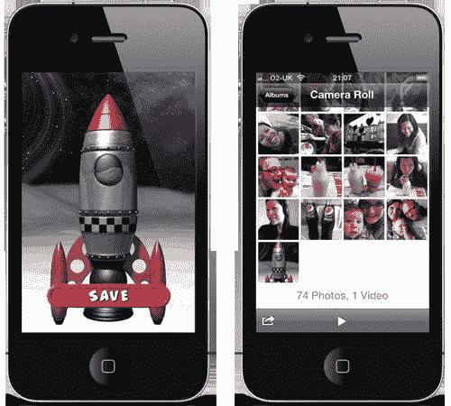
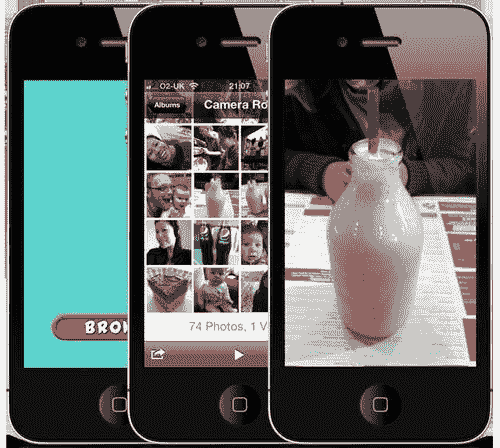

# 第十章。相机和麦克风支持

在本章中，我们将介绍：

+   保存到相机胶卷

+   从相机胶卷读取

+   使用默认相机应用进行捕获

+   使用内置相机

+   录制麦克风音频

+   播放录制的音频

# 简介

相机和麦克风可能是 iOS 设备中内置的最受欢迎的两个传感器。实际上，iPhone 用户在打电话时每天都会依赖麦克风。使用 Apple 的 FaceTime 的人依赖于麦克风和相机来保持联系。当然，每个人都会时不时地拍照或拍摄视频。

开发者正在发现越来越复杂的传感器用途，这些用途远远超出了 Apple 预装应用程序的功能。图像和语音识别、增强现实、语言翻译和语音扭曲只是其中的一小部分。

Adobe 在 AIR 2.6 中引入了对相机和麦克风的支持，允许 Flash 开发者在其应用程序中利用这两个传感器。虽然您可以使用 Flash Professional CS5.5 完成本章的所有食谱，但使用 Flash Professional CS5 的用户将仅限于第一个食谱，*保存到相机胶卷*。

# 保存到相机胶卷

许多 iOS 应用程序允许用户将图像保存到相机胶卷。绘图工具和头像创建者是流行的例子，用户可以轻松地从设备的原生照片库中向朋友和家人展示他们的创作。

这个食谱将向您展示如何将舞台的快照保存到设备的相机胶卷。

## 准备工作

从本书的配套代码包中，将 `chapter10\recipe1\recipe.fla` 打开到 Flash Professional 中。

您将在舞台上找到两个位图和一个动画剪辑。这些位图已被合成为背景图像，我们将将其保存到相机胶卷。动画剪辑代表一个按钮，当按下时将启动保存操作。

按钮动画剪辑的实例名称为 `saveBtn`，其库符号链接到一个名为 `Button` 的类。这个类是在 第四章 的 *处理用户交互* 食谱中引入的。

好的，让我们编写一些代码。

## 如何操作...

我们将使用 AIR 的 `CameraRoll` 类来完成这个食谱。

1.  创建一个文档类并命名为 `Main`。

1.  添加以下导入语句和一个类型为 `CameraRoll:` 的成员变量：

    ```swift
    package {
    import flash.display.BitmapData; 
    import flash.display.MovieClip;
     import flash.events.Event;
    import flash.events.MouseEvent;
    import flash.media.CameraRoll; 
    public class Main extends MovieClip {
    private var cameraRoll:CameraRoll; 
    public function Main() {
    // constructor code
    }
    }
    }

    ```

1.  在构造函数中，创建一个 `CameraRoll` 对象并监听它分发 `Event.COMPLETE`。同时监听从 `saveBtn` 动画剪辑分发的 `MouseEvent.MOUSE_UP`：

    ```swift
    public function Main() {
     cameraRoll = new CameraRoll();
    cameraRoll.addEventListener(Event.COMPLETE, saved);
    saveBtn.addEventListener(MouseEvent.MOUSE_UP, pressed); 
    }

    ```

1.  当按下保存按钮时，我们将把舞台的位图图像添加到相机胶卷。为了防止按钮出现在捕获的位图图像中，我们首先将其隐藏。添加一个 `pressed()` 事件处理程序：

    ```swift
    private function pressed(e:MouseEvent):void {
    saveBtn.visible = false;
    var bitmapData:BitmapData = new BitmapData(
    stage.stageWidth, stage.stageHeight, false);
    bitmapData.draw(stage);
    if(CameraRoll.supportsAddBitmapData)
    {
    cameraRoll.addBitmapData(bitmapData);
    }
    }

    ```

1.  一旦位图成功添加到相机胶卷，我们将再次使按钮可见。为此编写一个 `saved()` 事件处理程序：

    ```swift
    private function saved(e:Event):void {
    saveBtn.visible = true;
    }

    ```

1.  保存类，并在提示时将文件命名为 `Main.as`。

1.  返回到您的 FLA。

1.  发布应用并将其部署到您的设备上。

1.  启动应用并按**保存**按钮。转到照片应用，您将看到您的图片已保存到相册中，如下面的截图所示：



## 它是如何工作的...

`CameraRoll` 类允许访问设备的照片库，属于 `flash.media` 包。

调用 `CameraRoll.addBitmapData()` 方法会将指定的位图保存到设备上。在保存成功后，会分发 `Event.COMPLETE` 事件。

对于这个菜谱，我们创建并传递了一个 `BitmapData` 对象到 `addBitmapData()` 方法。`BitmapData` 对象包含了一个由调用 `BitmapData.draw()` 方法并传递 `stage` 属性给它创建的舞台位图表示。

静态属性 `CameraRoll.supportsAddBitmapData` 也被使用了。它决定了是否支持将位图数据保存到目标平台的设备相册中。尽管这个属性对所有 iOS 设备都返回 `true`，但在编写跨平台代码时进行检查是明智的。

## 还有更多...

在保存到相册时，以下信息将对您有所帮助。

### 处理保存失败

不要假设位图总是会成功保存到相册中。例如，设备可能没有足够的存储空间。

当无法添加位图时，`CameraRoll` 对象将分发 `ErrorEvent.ERROR`。查询 `ErrorEvent` 对象的 `text` 属性可以检索与错误相关的消息。

您的代码应该监听此事件并处理任何添加位图数据失败的尝试。在 Adobe Community Help 中搜索 `flash.media.CameraRoll` 以获取可能的错误列表。

### 保存特定显示对象

尽管我们在这个菜谱中抓取了整个舞台，但您也可以创建任何显示对象的位图图像并将其添加到相册中。只需创建一个 `BitmapData` 对象并调用它的 `draw()` 方法，将您的目标显示对象作为参数传递。`BitmapData` 对象的尺寸应与您的显示对象相匹配。

### 视频和相册

目前，AIR SDK 不提供将视频内容添加到相册的支持。

## 参见

+   *从相册读取*

# 从相册读取

根据您使用的 AIR SDK 版本，您可能可以从设备的相册中加载图片。AIR for iOS 通过启动原生照片应用并允许用户选择图片来简化这一过程。然后，图片可以被加载并添加到您的显示列表中。

让我们看看如何编写一个简单的应用程序，该程序可以加载从相册中选择的图片。

这里介绍的方法仅适用于使用 Flash Professional CS5.5 的用户。Flash Professional CS5 使用的 AIR 2.0 SDK 没有提供从相册加载图片的 API。

## 准备工作

已提供一个 FLA 作为此菜谱的起点。从本书的配套代码包中，打开 `chapter10\recipe2\recipe.fla` 到 Flash Professional CS5.5。

在舞台上可以找到一个实例名为 `browseBtn` 的动画剪辑。该剪辑的库符号链接到一个名为 `Button` 的类，该类在第四章的 *处理用户交互* 菜谱中介绍。



让我们编写一些代码，以便在按下 `browseBtn` 动画剪辑后让用户浏览并从相册中加载图片。

## 如何操作...

我们将使用几个类，包括 `CameraRoll, Loader` 和 `MediaPromise`。

1.  创建一个文档类，并将其命名为 `Main`。

1.  导入所需的类并添加两个成员变量——一个为 `CameraRoll` 类型，另一个为 `Loader` 类型：

    ```swift
    package {
     import flash.display.Loader; 
    import flash.display.MovieClip;
     import flash.events.Event;
    import flash.events.MediaEvent;
    import flash.events.MouseEvent;
    import flash.media.CameraRoll;
    import flash.media.MediaPromise; 
    public class Main extends MovieClip {
     private var cameraRoll:CameraRoll;
    private var loader:Loader; 
    public function Main() {
    // constructor code
    }
    }
    }

    ```

1.  实例化一个 `CameraRoll` 对象，并监听它分发 `MediaEvent.SELECT` 和 `Event.CANCEL` 事件。同时，监听 `browseBtn` 动画剪辑被按下：

    ```swift
    public function Main() {
     cameraRoll = new CameraRoll();
    cameraRoll.addEventListener(MediaEvent.SELECT,
    photoSelected);
    cameraRoll.addEventListener(Event.CANCEL, cancelled);
    browseBtn.addEventListener(MouseEvent.MOUSE_UP,
    buttonPressed); 
    }

    ```

1.  当按下 `browseBtn` 动画剪辑时，我们将将其从视图中隐藏，并启动原生的照片应用。添加以下方法来处理此操作：

    ```swift
    private function buttonPressed(e:MouseEvent):void {
    browseBtn.visible = false;
    if(CameraRoll.supportsBrowseForImage)
    {
    cameraRoll.browseForImage();
    }
    }

    ```

1.  如果用户从照片应用中取消，我们将再次使 `browseBtn` 动画剪辑可见：

    ```swift
    private function cancelled(e:Event):void {
    browseBtn.visible = true;
    }

    ```

1.  如果用户做出选择，则我们将创建一个 `Loader` 对象并开始加载照片。添加 `photoSelected()` 方法来处理此操作：

    ```swift
    private function photoSelected(e:MediaEvent):void {
    var photoPromise:MediaPromise = e.data;
    loader = new Loader();
    loader.contentLoaderInfo.addEventListener(Event.COMPLETE,
    photoLoaded);
    loader.loadFilePromise(photoPromise);
    }

    ```

1.  最后，编写 `photoLoaded()` 事件处理程序，当照片的图像成功加载时将被调用。此方法将在将图像添加到显示列表之前调整图像大小和方向：

    ```swift
    private function photoLoaded(e:Event):void {
    var mc:Loader = e.currentTarget.loader as Loader;
    var scale:Number;
    if(mc.width > mc.height)
    {
    scale = stage.stageHeight / mc.width;
    mc.scaleX = scale;
    mc.scaleY = scale;
    mc.x = stage.stageWidth;
    mc.rotation = 90;
    addChild(mc);
    }
    else
    {
    scale = stage.stageWidth / mc.width;
    mc.scaleX = scale;
    mc.scaleY = scale;
    addChild(mc);
    }
    }

    ```

1.  保存类并在提示时将文件命名为 `Main.as`。

1.  然后，返回到您的 FLA 并保存它。

1.  发布 FLA 并将生成的 `.ipa` 文件部署到您的设备。

1.  启动应用程序，点击 **BROWSE** 按钮，然后从相册中选择一张图片。您的应用程序将加载并显示该图片。

## 它是如何工作的...

`flash.media.CameraRoll` 类允许访问设备的照片库。

它的 `browseForImage()` 方法打开原生的照片应用，允许用户从设备的相册中选择一张图片。在此点，您的应用程序将失去焦点并在后台等待。

当用户做出选择时，您的应用程序将重新获得焦点，并且 `CameraRoll` 对象将分发 `MediaEvent.SELECT` 事件。然而，如果用户从照片应用中取消，则将分发 `Event.CANCEL` 事件。

在此菜谱中，当用户按下 **BROWSE** 按钮时调用 `browseForImage()` 方法。然而，在调用之前，将检查静态 `CameraRoll.supportsBrowseForImage` 属性。这决定了目标平台是否支持浏览图片。尽管该属性对所有 iOS 设备返回 `true`，但在针对多个平台时很有用。

一旦用户选择了图像，`photoSelected()` 事件处理器就会被调用，并将一个 `MediaEvent` 对象传递给它。从 `MediaEvent` 对象中，我们通过查询其 `data` 属性来检索有关所选图像的信息。这返回一个 `MediaPromise` 对象，我们将其传递给 `Loader` 对象的 `loadFilePromise()` 方法以实际加载图像。一旦完成，`Loader` 对象将派发 `Event.COMPLETE` 事件。

`photoLoaded()` 处理器捕获 `Loader` 对象的 `COMPLETE` 事件并在屏幕上显示实际图像。保存到相册的图像分辨率可能远高于舞台尺寸，可以是纵向或横向。`photoLoaded()` 方法将图像缩放到适合舞台大小，如果它具有横向宽高比，则将其旋转 90 度。

### 小贴士

`MediaPromise` 类还提供了一个 `file` 属性，可以用来获取所选相册图像的 URL。虽然这个属性在某些平台（如 Android）上是有效的，但在 iOS 上它始终返回 `null`。在编写跨平台代码时，使用 `Loader.loadFilePromise()` 而不是尝试获取并传递 URL 到 `Loader.load()`。

你可以从 Adobe 社区帮助中获取有关 `flash.media.CameraRoll` 和 `flash.media.MediaPromise` 的更多信息。

## 更多信息...

当将照片保存到设备时，iOS 会将额外的元数据嵌入到图片中。根据你正在编写的应用程序，以下信息可能有用。

### 解析 Exif 数据

在 iOS 设备上拍摄的照片遵循 **可交换图像文件 (Exif**) 格式，并可以包含缩略图数据和附加信息的标签。这些标签可以描述从与图像关联的 GPS 坐标到其方向等任何内容。

虽然 AIR SDK 并不直接提供对这些标签的支持，但有一些第三方解析器可用。请参阅 [`code.shichiseki.jp/as3/ExifInfo`](http://code.shichiseki.jp/as3/ExifInfo) 和 [www.mxml.it/index.php/2010/01/04/reading-exif-data-with-actionscript-30](http://www.mxml.it/index.php/2010/01/04/reading-exif-data-with-actionscript-30)。此外，Exif 规范可以在 [www.exif.org/exif2-2.pdf](http://www.exif.org/exif2-2.pdf) 找到。

## 相关内容

+   *保存到相册*

# 使用默认相机应用捕获

大多数 iOS 设备都内置了相机。较新的型号有两个——一个安装在后面，另一个安装在前面。用户可以使用预装的相机应用拍摄照片和录制视频。第三方应用程序也可以使用相机，许多应用程序只是简单地启动默认的相机应用来完成这个目的。一旦用户完成相机操作，第三方应用就能访问所拍摄的照片或视频。

AIR 2.6 及以上版本提供了`CameraUI`类，使其能够启动并使用默认的相机应用。本教程将向您展示如何从 Flash Professional CS5.5 中完成此操作。AIR 2.0 和 Flash CS5 不提供相机支持。

## 准备工作

您需要一个具有相机的设备。第四代 iPod touch、iPad 2 以及所有型号的 iPhone 都配备了相机。

从本书的配套代码包中，将`chapter10\recipe3\recipe.fla`文件打开到 Flash Professional CS5.5 中。

您将在舞台上找到一个名为`captureBtn`的电影剪辑和一个名为`output`的动态文本字段。按钮剪辑的库符号链接到一个名为`Button`的类，该类在第四章的*处理用户交互*教程中介绍过。第四章。

我们将创建一个简单的应用，当按钮被按下时启动默认的相机应用，允许用户捕获照片。

## 如何操作...

让我们编写完成此操作的 ActionScript 代码。

1.  创建一个名为`Main`的文档类。

1.  导入此教程所需的各个类，并创建一个类型为`CameraUI`的成员变量：

    ```swift
    package {
    import flash.display.MovieClip;
     import flash.events.Event;
    import flash.events.MediaEvent;
    import flash.events.MouseEvent;
    import flash.media.CameraUI;
    import flash.media.MediaPromise;
    import flash.media.MediaType; 
    public class Main extends MovieClip {
    private var camera:CameraUI;
    public function Main() {
    // constructor code
    }
    }
    }

    ```

1.  在构造函数中，实例化一个`CameraUI`对象，并监听它触发`MediaEvent.COMPLETE`和`Event.CANCEL`事件。同时，监听用户按下`captureBtn`电影剪辑：

    ```swift
    public function Main() {
     camera = new CameraUI();
    camera.addEventListener(MediaEvent.COMPLETE, captured);
    camera.addEventListener(Event.CANCEL, cancelled);
    captureBtn.addEventListener(MouseEvent.MOUSE_UP, pressed);
    } 

    ```

1.  当按钮被按下时，我们将启动相机应用，允许用户拍照。为此添加一个`pressed()`事件处理程序：

    ```swift
    private function pressed(e:MouseEvent):void {
    if(CameraUI.isSupported)
    {
    camera.launch(MediaType.IMAGE);
    }
    }

    ```

1.  当用户从相机应用返回时，我们将检查照片是否成功获取，并将确认信息写入`output`文本字段。通过在您的类中添加一个`captured()`方法来处理此操作：

    ```swift
    private function captured(e:MediaEvent):void {
    var mediaPromise:MediaPromise = e.data;
    if(mediaPromise != null)
    {
    output.text = "Photo captured.";
    }
    }

    ```

1.  用户可以从默认的相机应用中取消操作，丢弃他们可能已经拍摄的照片。为此添加一个事件处理程序，在`output`文本字段中说明操作已取消：

    ```swift
    private function cancelled(e:Event):void {
    output.text = "Cancelled.";
    }

    ```

1.  保存类并在提示时将文件命名为`Main.as`。

1.  返回到您的 FLA 文件并保存它。

1.  将 IPA 部署到您的设备后，发布应用并启动它。

1.  点击**CAPTURE**按钮以启动默认的相机应用。拍照后，点击**Use**按钮。将显示一条消息，确认照片已成功捕获，现在可以通过您的应用访问。

## 工作原理...

`flash.media.CameraUI`类允许访问默认的相机应用。调用其`launch()`方法将打开相机应用，并允许用户捕获图片或视频。在此阶段，您的应用将失去焦点并等待在后台。一旦用户完成，您的应用将重新获得焦点，`CameraUI`对象将触发`MediaEvent.COMPLETE`事件。如果用户取消相机应用，则将触发`Event.CANCEL`事件。

在调用`launch()`时，您必须传递由`flash.media.MediaType`定义的常量，指定您是想拍照还是拍摄视频。在本教程中，我们传递了`MediaType.IMAGE`。

通过`COMPLETE`事件的`MediaEvent`对象的`data`属性访问捕获的媒体。该属性是`MediaPromise`类的一个实例，可以用来加载图像甚至访问其数据。

注意在`pressed()`事件处理程序中使用静态`isSupported`属性。它确定当前运行您的应用程序的设备是否支持访问默认相机应用程序。

您可以从 Adobe 社区帮助中获取有关`flash.media.CameraUI`和`flash.media.MediaPromise`的更多信息。

## 还有更多...

以下信息将有助于完善您的理解。

### 处理错误

如果默认相机应用程序已经在使用中，`CameraUI`对象将派发一个错误。您可以通过监听`flash.events.ErrorEvent.ERROR`来捕获此事件。查询`ErrorEvent`对象的`errorID`和`text`属性以了解更多关于错误的信息。

### 显示捕获的图像

我们并没有走那么远，实际上加载并显示使用默认相机应用程序拍摄的照片。这可以通过创建一个`Loader`对象并将照片的`MediaPromise`对象传递给加载器的`loadFilePromise()`方法来实现。有关更多详细信息，请参阅前面的配方，*从相机胶卷读取*。

### 将捕获的图像保存到相机胶卷

与一些其他移动操作系统不同，iOS 实际上并不在相机胶卷中存储捕获的照片。如果您想让照片出现在相机胶卷中，您需要手动添加它。这可以通过使用`Loader`对象来加载您的`MediaPromise`对象的二进制数据，然后使用`CameraRoll`实例将其位图数据写入相机胶卷来实现。

请参阅本章前面部分的*从相机胶卷读取*和*保存到相机胶卷*配方。

### 捕获视频

虽然我们使用默认相机应用程序捕获了一张照片，但只需简单的代码更改就可以拍摄视频。您可以在以下代码片段中看到这一点，其中`MediaType.VIDEO`被传递到`CameraUI`对象的`launch()`方法中：

```swift
camera.launch(MediaType.VIDEO);

```

在使用从 AIR 启动的默认相机应用程序时，用户无法在照片和相机模式之间切换。您只能在任何时候使用相机应用程序捕获单一媒体类型。

查看第十二章的*播放本地 H.264 视频*配方，了解如何播放您捕获的视频。第十二章。

### 读取捕获的数据

也可以直接访问代表从相机捕获的图像或视频的二进制数据。这对于可能需要直接将媒体写入设备文件系统、上传数据到服务器或以某种方式解析或修改数据的应用程序非常有用。`MediaPromise`对象提供了一个`open()`方法，可以用来访问数据。然后你可以将其读入一个`ByteArray`对象中。

要在这个配方示例中实现这一点，请添加以下成员变量：

```swift
private var dataSource:IDataInput;
private var eventSource:IEventDispatcher;

```

在`captured()`事件处理器的末尾添加以下代码片段：

```swift
dataSource = mediaPromise.open();
eventSource = dataSource as IEventDispatcher;
eventSource.addEventListener(Event.COMPLETE, dataCaptured);

```

现在编写一个事件处理程序，将数据复制到`ByteArray`对象中：

```swift
private function dataCaptured(e:Event):void {
var mediaBytes:ByteArray = new ByteArray();
dataSource.readBytes(mediaBytes);
}

```

还需包含以下导入语句：

```swift
import flash.events.IEventDispatcher;
import flash.utils.ByteArray;
import flash.utils.IDataInput;

```

您现在可以在`dataCaptured()`方法中访问媒体的二进制数据。

## 参见

+   *保存到相册*

+   *从相册读取*

+   *使用内置摄像头*

# 使用内置摄像头

虽然启动和使用默认的摄像头应用为用户提供了一个他们熟悉的原生摄像头体验，但这可能不适合所有类型的应用。除了`CameraUI`之外，AIR 还提供了`Camera`类，该类接收设备内置摄像头捕获的视频数据，允许您直接在您的应用中显示。

在这个配方中，您将学习如何使用 Flash Professional CS5.5 从摄像头接收视频流并在您的应用中显示它。`Camera`类在 Flash CS5 和 AIR 2.0 for iOS 中不受支持。

## 准备工作

您需要一个带有摄像头的设备。第四代 iPod touch、iPad 2 以及所有型号的 iPhone 都配备了摄像头。

从书籍的配套代码包中，将`chapter10\recipe4\recipe.fla`文件打开到 Flash Professional CS5.5 中。

阶段已设置了一个景观宽高比，并且这一设置也反映在 FLA 的 iOS 设置中。

## 如何做到这一点...

按照以下步骤从摄像头接收视频并在舞台上显示：

1.  创建一个文档类并命名为`Main`。

1.  声明两个成员变量——一个类型为`Camera`，另一个类型为`Video`：

    ```swift
    package {
    import flash.display.MovieClip;
     import flash.media.Camera;
    import flash.media.Video; 
    public class Main extends MovieClip {
    private var camera:Camera; 
    private var video:Video; 
    public function Main() {
    // constructor code
    }
    }
    }

    ```

1.  在构造函数中，获取设备默认摄像头的引用并将其附加到一个`Video`对象上。同时，将`Video`对象添加到舞台上，以便用户可以查看视频数据：

    ```swift
    public function Main() {
     if(Camera.names.length > 0)
    {
    camera = Camera.getCamera();
    camera.setMode(stage.stageWidth, stage.stageHeight,
    stage.frameRate);
    video = new Video(camera.width, camera.height);
    video.attachCamera(camera);
    addChild(video);
    } 
    }

    ```

1.  将类保存为`Main.as`。然后返回到您的 FLA 并保存它。

1.  发布 FLA 并在您的设备上测试它。

1.  将设备保持为横屏方向。后置摄像头的视频将被渲染到屏幕上。

## 它是如何工作的...

`flash.media.Camera`类是一个单例，这意味着只能存在一个实例。为了保证这一点，该类没有公共构造函数。相反，通过调用`Camera`类的`getCamera()`静态方法来获取对摄像头的访问，该方法为您返回一个可以与之工作的`Camera`实例。

一旦获取到`Camera`实例，就可以指定摄像头要使用的捕获模式。这是通过调用`setMode()`方法并传递一个宽度、高度和目标帧率来完成的。对于这个配方，我们传递了舞台的尺寸和帧率。如果摄像头无法满足指定的要求，它将使用最接近的模式。

为了显示从摄像头流出的实时视频，它必须附加到一个`Video`对象上。`flash.media.Video`类继承自`DisplayObject`，允许任何`Video`对象被添加到显示列表中。首先创建一个`Video`对象，并将宽度高度传递给其构造函数——我们将其尺寸设置为与摄像头使用的尺寸相匹配。然后调用`attachCamera()`，为`Video`对象提供访问`Camera`对象视频流的权限。最后，通过调用`addChild()`将`Video`对象添加到显示列表中。

在尝试连接到摄像头之前，你应该首先检查是否有一个摄像头可用。`Camera.names`静态属性返回一个可用摄像头的数组。我们在文档类构造函数的开始处检查了数组的长度是否大于`0`，然后才继续。或者，你可以检查`Camera.getCamera()`返回的是否为`null`。

关于摄像头支持的更多信息，请在 Adobe Community Help 中搜索`flash.media.Camera`和`flash.media.Video`。

## 更多内容...

让我们看看从摄像头捕获实时视频时的一些附加选项。

### 肖像模式

在 iOS 上，`Camera`对象以横向模式捕获视频。如果你的应用程序使用的是纵向宽高比，那么你需要交换摄像头的捕获尺寸，并且旋转和重新定位`Video`对象。为此，你需要对以下构造函数进行以下更改：

```swift
camera = Camera.getCamera();
 camera.setMode(stage.stageHeight, stage.stageWidth,
stage.frameRate); 
video = new Video(camera.width, camera.height);
video.attachCamera(camera);
video.rotation = 90;
video.x += stage.stageWidth; 

```

记得更改舞台的尺寸并更新 AIR for iOS 设置以使用纵向宽高比。由于对`Video`对象应用了旋转，捕获纵向视频时会有性能损失。尽可能使用横向模式来处理使用摄像头的应用程序。

### 选择摄像头

`Camera.getCamera()`静态方法默认连接到后置摄像头。对于支持多个摄像头的设备，你可以通过传递一个字符串来指定摄像头，该字符串表示`Camera.names`指定的数组中的零基于索引位置。例如，以下代码使用了 iPhone 4/4S 的前置摄像头：

```swift
camera = Camera.getCamera("1");

```

在进行此调用时，传递字符串而不是整数是很重要的。

在 iOS 上，任何时刻只能有一个摄像头处于活动状态。如果你连接到第二个摄像头，则之前摄像头的连接将被断开。

### 获取位图图像

从摄像头的实时视频流中捕获位图图像是可能的。以下代码从视频的当前帧中提取位图数据，并将其存储在`Bitmap`对象中：

```swift
var bd:BitmapData = new BitmapData(video.width, video.height,
false);
bd.draw(video);
var b:Bitmap = new Bitmap(bd);

```

如你所见，`BitmapData`对象的尺寸被设置为与视频相匹配。然后当前帧被绘制到`BitmapData`对象中，该对象用于创建实际的位图。

### 实时流

对于这个食谱，我们只是在本地上使用了相机的视频流。然而，通过使用 `NetConnection` 和 `NetStream` 类，可以将视频流传输到 Flash 媒体服务器，在那里它可以被广播到其他客户端。这对于实时视频聊天应用或其他协作项目来说非常理想。

这两个类都属于 `flash.net` 包。更多详细信息可在 Adobe 社区帮助中找到。

### 使用舞台

使用 Flash IDE 而不是 ActionScript 也可以在舞台上放置和调整 `视频` 对象的大小。只需在 **库** 面板中右键单击，然后从上下文菜单中选择 **新建视频**。在出现的 **视频属性** 面板中，点击 **视频（ActionScript 控制）** 单选按钮，然后点击 **确定**。视频剪辑将出现在库中，您可以将其拖动到舞台上，并为其指定一个实例名称。

## 相关内容

+   *保存到相机胶卷*

+   *使用默认相机应用捕获*

# 录制麦克风音频

AIR 提供了一个 API，允许应用程序连接到内置麦克风。可以获取麦克风的原始数据，将其记录以供以后使用，在接收时进行处理，或者将其路由到设备的扬声器。

本食谱将向您展示如何使用 `Microphone` 和 `ByteArray` 类来捕获和录制音频。您需要 Flash Professional CS5.5，因为 CS5 和 AIR 2.0 不支持 iOS 的麦克风访问。

## 准备工作

虽然 iOS 家族的所有最新型号都内置了麦克风，但旧一代的 iPod touch 没有。然而，第二代和第三代设备确实提供了对外部麦克风的兼容性，这可以用于本食谱。

从本书的配套代码包中，将 `chapter10\recipe5\recipe.fla` 打开到 Flash Professional CS5.5。

在舞台上，您将找到一个名为 `output` 的动态文本字段和三个电影剪辑。其中两个电影剪辑代表按钮，分别命名为 `recordBtn` 和 `stopBtn`。`stopBtn` 剪辑位于 `recordBtn` 剪辑的直接后方，但位于自己的时间轴层上，以便于访问。第三个电影剪辑名为 `micStatus`，覆盖了整个背景。它用于指示何时正在录音。

`recordBtn` 和 `stopBtn` 的库符号链接到一个名为 `Button` 的基类。这个类是在第四章（第四章. 将 Flash 项目移植到 iOS）的 *处理用户交互* 食谱中引入的。

当用户点击 `recordBtn` 电影剪辑时，我们将添加 ActionScript 以开始从麦克风录制数据。当按下 `stopBtn` 时，音频捕获将结束。为了向用户提供正在录制的反馈，我们将 `micStatus` 电影剪辑的 `播放头` 移动到帧 `2`。文本字段将用于输出音频成功录制的确认信息。

此配方将专注于麦克风音频的录制。我们将在下一个配方中介绍音频的播放。

## 如何做到这一点...

现在让我们编写这个 ActionScript。按照以下步骤操作：

1.  创建一个文档类并将其命名为`Main`。

1.  导入此配方所需的各个类，并创建两个成员变量——一个用于引用设备的麦克风，另一个用于存储从它捕获的数据：

    ```swift
    package {
    import flash.display.MovieClip;
     import flash.events.MouseEvent;
    import flash.events.SampleDataEvent;
    import flash.media.Microphone;
    import flash.utils.ByteArray; 
    public class Main extends MovieClip {
    private var mic:Microphone;
    private var soundData:ByteArray; 
    public function Main() {
    // constructor code
    }
    }
    }

    ```

1.  在构造函数中，设置电影剪辑并创建与设备麦克风的连接：

    ```swift
    public function Main() {
     micStatus.gotoAndStop(1);
    recordBtn.visible = true;
    stopBtn.visible = false;
    recordBtn.addEventListener(MouseEvent.MOUSE_UP,
    pressedRecordBtn);
    stopBtn.addEventListener(MouseEvent.MOUSE_UP,
    pressedStopBtn);
    mic = Microphone.getMicrophone();
    if(!Microphone.isSupported || mic == null)
    {
    recordBtn.visible = false;
    } 
    }

    ```

1.  为每个被按下的按钮添加一个处理程序：

    ```swift
    private function pressedRecordBtn(e:MouseEvent):void {
    startRecording();
    }
    microphone audiorecordingprivate function pressedStopBtn(e:MouseEvent):void {
    stopRecording();
    }

    ```

1.  接下来添加一个设置麦克风并开始监听实时音频数据的方法。我们还将实例化一个名为`soundData`的`ByteArray`对象，它将用于存储捕获的数据：

    ```swift
    private function startRecording():void {
    micStatus.gotoAndStop(2);
    recordBtn.visible = false;
    stopBtn.visible = true;
    soundData = new ByteArray();
    mic.gain = 100;
    mic.rate = 44;
    mic.addEventListener(SampleDataEvent.SAMPLE_DATA,
    sampleData);
    }

    ```

1.  添加一个事件处理程序，每当从麦克风获取音频数据时都会被调用。我们将最多写入 2 MB 的音频数据到我们的`ByteArray`对象中，以供以后使用：

    ```swift
    private function sampleData(e:SampleDataEvent):void {
    while(e.data.bytesAvailable)
    {
    var sample:Number = e.data.readFloat();
    soundData.writeFloat(sample);
    }
    if(soundData.length > 2097152)
    {
    stopRecording();
    }
    }

    ```

1.  最后添加一个方法，用于停止监听来自麦克风的实时音频数据。记录的总字节数将写入`output`文本字段：

    ```swift
    private function stopRecording():void {
    micStatus.gotoAndStop(1);
    stopBtn.visible = false;
    mic.removeEventListener(SampleDataEvent.SAMPLE_DATA,
    sampleData);
    output.text = (soundData.length + " bytes recorded");
    }

    ```

1.  保存类并将其文件命名为`Main.as`。

1.  返回到你的 FLA 文件并保存它。

1.  发布 FLA 文件并将生成的`.ipa`文件部署到你的设备上。

1.  启动应用，点击**RECORD**按钮并开始对着麦克风说话。当你完成时，点击**STOP**按钮。

记录的音频数据量（以字节为单位）将写入屏幕。

## 它是如何工作的...

`flash.media.Microphone`类提供了麦克风支持。要连接到设备的麦克风，调用静态`Microphone.getMicrophone()`方法，它将返回一个新的`Microphone`实例。如果找不到麦克风，则返回`null`。

以下代码片段是我们文档类构造函数中进行的调用：

```swift
mic = Microphone.getMicrophone();

```

一旦你有一个`Microphone`对象，你可以调整将要接收的音频数据。我们通过在`startRecording()`方法中设置`Microphone`对象的增益和采样率来完成此操作。

增益用于增强麦克风的信号，并使用`gain`属性设置。使用`100`的值以最大化其响度。

采样率决定了捕获的音频质量，由`rate`属性指定。较高的采样率产生更清晰的音频，但需要 CPU 更多的处理，并需要更多的空间来存储。我们将`rate`属性设置为`44`，指定实际的采样频率为 44 kHz。换句话说，我们将每秒从麦克风捕获 44,100 次声音！这是允许的最高采样率，并记录最清晰的声音。

要实际开始从麦克风捕获音频，请向 `Microphone` 对象添加一个 `SampleDataEvent.SAMPLE_DATA` 监听器。随着麦克风音频缓冲区的填充，`SAMPLE_DATA` 事件会持续派发。我们在设置增益和采样率后立即在 `startRecording()` 方法中添加了 `SAMPLE_DATA` 事件监听器：

```swift
mic.gain = 100;
mic.rate = 44;
mic.addEventListener(SampleDataEvent.SAMPLE_DATA, sampleData);

```

每个 `SampleDataEvent` 对象都有一个 `data` 属性，它是一个包含从麦克风当前采样的音频的 `ByteArray`。录制音频就是一个简单地将这个临时数据复制到一个更持久的 `ByteArray` 对象的过程。您可以在 `SampleData()` 事件处理程序中看到此代码，其中使用循环提取采样数据并将其写入 `soundData` 成员变量：

```swift
while(e.data.bytesAvailable)
{
var sample:Number = e.data.readFloat();
soundData.writeFloat(sample);
}

```

每个样本都由一个浮点值表示。因此，循环从音频缓冲区中读取一个浮点数并将其写入 `soundData` 成员变量。这个过程会一直持续到 `SampleDataEvent` 对象中的数据为空。

为了防止应用完全耗尽设备的内存，`sampleData()` 处理程序会检查 `soundData` 成员变量的大小。如果它的大小超过 2 MB（2,097,152 字节），则停止录制并将录制的字节数写入 `output` 文本字段。

通过从 `Microphone` 对象中移除 `SAMPLE_DATA` 事件监听器来停止音频捕获。查看 `stopRecording()` 方法以了解这一点。

关于音频捕获的更多信息，请在 Adobe Community Help 中搜索 `flash.media.Microphone`、`flash.events.SampleDataEvent` 和 `flash.utils.ByteArray`。

## 还有更多...

在从麦克风录制时，您还有以下一些额外的选项。

### 麦克风活动

您可以通过查询 `Microphone` 对象的 `activityLevel` 属性来确定麦克风检测到的声音量。这将返回一个从 `0` 到 `100` 的值，当没有检测到声音时返回 `0`。

使用 `setSilenceLevel()` 方法也可以指定一个活动水平阈值，在音频被麦克风接受之前必须达到这个阈值。传递给参数的活动水平越高，音频源必须越响亮才能被检测到。此方法还接受一个可选的第二个参数，该参数指定在认为声音停止之前必须经过的毫秒数的不活动时间。

例如，将以下内容添加到您的 `startRecording()` 方法中：

```swift
mic.setSilenceLevel(50, 2000);
mic.addEventListener(ActivityEvent.ACTIVITY, activityChanged);

```

现在添加以下事件处理程序：

```swift
private function activityChanged(e:ActivityEvent):void {
output.text = "activating: " + e.activating + ", " +
"activity level: " + mic.activityLevel;
if(e.activating == false)
{
stopRecording();
}
}

```

最后，添加以下导入语句：

```swift
import flash.events.ActivityEvent;

```

在您的设备上测试这些更改。您的应用将不会派发 `SAMPLE_DATA` 事件，直到麦克风的静音水平被超过。此外，一旦激活，如果静音持续超过两秒钟，麦克风将再次停用。

### 实时流

在本配方中，麦克风音频数据仅被本地使用。但是，使用`NetConnection`和`NetStream`类，可以将数据传输到 Flash Media Server 以广播给其他客户端。有关详细信息，请访问 Adobe 社区帮助，搜索这两个类，它们属于`flash.net`包。

## 参见

+   *播放录制的音频*

# 播放录制的音频

在捕获麦克风的原始音频数据后，您需要一种播放它的方法。本配方将向您展示如何将数据发送到您的设备扬声器。

## 准备工作

如果您已经完成了**录音麦克风音频**配方，那么您可以从中编写的代码开始工作。或者，从本书的配套代码包中打开`chapter10\recipe6\recipe.fla`，并将其作为起点使用。

目前，FLA 将从麦克风录制音频并将其存储在名为`soundData`的成员变量中，该变量是`ByteArray`类型。我们将添加代码，在用户完成录音后播放音频。

## 如何操作...

需要以下更改来读取和播放录制的音频：

1.  打开`Main.as`。

1.  导入以下三个类：

    ```swift
    import flash.display.MovieClip;
    import flash.events.Event; 
    import flash.events.MouseEvent;
    import flash.events.SampleDataEvent;
    import flash.media.Microphone;
    import flash.media.Sound;
    import flash.media.SoundChannel; 
    import flash.utils.ByteArray;

    ```

1.  还需添加一个`Sound`和`SoundChannel`成员变量：

    ```swift
    private var mic:Microphone;
    private var soundData:ByteArray;
    private var sound:Sound;
    private var channel:SoundChannel; 

    ```

1.  `stopRecording()`方法需要调用以启动录制的音频播放。在方法末尾添加以下行：

    ```swift
    private function stopRecording():void {
    micStatus.gotoAndStop(1);
    stopBtn.visible = false;
    mic.removeEventListener(SampleDataEvent.SAMPLE_DATA,
    sampleData);
    playRecording(); 
    }

    ```

1.  现在编写`playRecording()`方法，它将启动音频播放：

    ```swift
    private function playRecording():void {
    soundData.position = 0;
    sound = new Sound();
    sound.addEventListener(SampleDataEvent.SAMPLE_DATA,
    playSampleData);
    channel = sound.play();
    channel.addEventListener(Event.SOUND_COMPLETE,
    playbackComplete);

    ```

1.  添加一个方法，该方法定期从`soundData`对象中提取数据以进行播放：

    ```swift
    private function playSampleData(e:SampleDataEvent):void {
    for(var i:int=0; i<8192 && soundData.bytesAvailable>0; i++)
    {
    var sample:Number = soundData.readFloat();
    e.data.writeFloat(sample);
    e.data.writeFloat(sample);
    }
    }

    ```

1.  最后，在音频播放完成后重置按钮电影剪辑：

    ```swift
    private function playbackComplete(e:Event):void {
    recordBtn.visible = true;
    stopBtn.visible = false;
    }

    ```

1.  保存对类的更改。

1.  发布 FLA 并在您的设备上测试它。

1.  开始录制一些音频，完成后，轻触**停止**按钮。

录制的音频将通过您的设备扬声器播放。如果您什么也听不到，请增加扬声器的音量并再次尝试。

## 它是如何工作的...

`Sound`和`SoundChannel`类都用于音频播放。

我们创建一个`Sound`对象，并向它添加一个`SAMPLE_DATA`事件监听器。当`Sound`对象没有更多音频数据可播放时，将触发此事件：

```swift
sound = new Sound();
sound.addEventListener(SampleDataEvent.SAMPLE_DATA,
playSampleData);

```

还调用了对象的`play()`方法，该方法返回一个`SoundChannel`实例，允许监控播放。我们监听`SoundChannel`对象触发`SOUND_COMPLETE`以确定音频播放何时结束：

```swift
channel = sound.play();
channel.addEventListener(Event.SOUND_COMPLETE,
playbackComplete);

```

初始时，`Sound`对象不包含任何音频数据。整个录音的数据由`soundData`成员变量持有，该变量是`ByteArray`类型。由于`Sound`对象没有音频数据可播放，它立即触发一个`SAMPLE_DATA`事件，该事件由`playSampleData()`处理程序捕获。

在`playSampleData()`中，我们从`soundData`成员变量中提取一些音频数据并将其馈送到`Sound`对象。这为`Sound`对象提供了足够的数据以开始播放音频。每次其缓冲区变低时，它将派发另一个`SAMPLE_DATA`事件，我们将提供更多数据。这个过程会一直持续到整个录音播放完毕。

以下是从`playSampleData()`处理程序中提取的代码，该处理程序负责将数据写入`Sound`对象的缓冲区：

```swift
for(var i:int=0; i<8192 && soundData.bytesAvailable>0; i++)
{
var sample:Number = soundData.readFloat();
e.data.writeFloat(sample);
e.data.writeFloat(sample);
}

```

`Sound`对象的缓冲区通过`SampleDataEvent`参数的`data`属性来访问。因此，我们从`soundData`成员变量中取一个样本并将其写入`data`属性的`ByteArray`。使用`readFloat()`方法从`soundData`中读取样本，而使用`writeFloat()`将相同的样本写入`Sound`对象的缓冲区——每个样本由一个浮点值表示。

然而，我们不仅仅是将单个样本写入缓冲区——它很快就会再次清空。相反，我们抓住机会写入 8192 个立体声样本，为对象提供 64 KB 的音频数据。通常，你一次可以写入 2048 到 8192 个立体声样本。然而，如果你尝试写入超过 64 KB 的数据到缓冲区，将会抛出一个运行时异常。

要创建立体声样本，我们将每个记录的样本写入`Sound`对象两次：

```swift
e.data.writeFloat(sample);
e.data.writeFloat(sample);

```

当麦克风记录单声道数据时，你的设备能够进行立体声输出。因此，当将音频数据写入`Sound`对象时，你需要将样本写入左右两个通道。`writeFloat()`的第一个调用将样本发送到左通道，而第二个调用将样本发送到右通道。

更多信息，请在 Adobe 社区帮助中搜索`flash.media.Sound`和`flash.media.SoundChannel`。

## 还有更多...

与麦克风音频播放相关的一些最终信息。

### 处理较低的采样率

`Sound`类使用 44 kHz 的采样率。如果麦克风捕获的音频来自不同的频率，那么在将其馈送到`Sound`对象之前，你需要将其从较低的速率提升到 44 kHz。

例如，如果`Microphone`对象的`rate`属性在录制时被设置为 22 kHz 的频率，那么你需要在`playSampleData()`中的播放循环中进行调整，如下所示：

```swift
for(var i:int=0; i<4096 && soundData.bytesAvailable>0; i++)
{
var sample:Number = soundData.readFloat();
e.data.writeFloat(sample);
e.data.writeFloat(sample);
e.data.writeFloat(sample);
e.data.writeFloat(sample);
}

```

实际上，相同的样本被写入每个通道两次，这会将 22 kHz 的录音提升到 44 kHz。请注意，与之前的 8192 次迭代相比，这里执行了 4096 次循环迭代。这是为了确保写入到`Sound`对象缓冲区的音频数据不超过 64 KB，这是它的上限。

这里提供的示例相对简单，不推荐用于大多数采样率。更彻底的方法是通过插值现有样本来生成缺失的数据。在大多数情况下，您可能希望避免在实时中重新采样音频，因为这可能会很耗费计算资源。

关于采样率转换的更多详细信息可以在维基百科上找到：[`en.wikipedia.org/wiki/Sample_rate_conversion`](http://en.wikipedia.org/wiki/Sample_rate_conversion)。此外，还可以查看 SoundTouch AS3 库，它允许使用 ActionScript 3.0 进行实时音频处理：[`github.com/also/soundtouch-as3`](http://https://github.com/also/soundtouch-as3).

### 保存捕获的数据

这和之前的配方只是简单地将记录的音频数据保存在内存中。然而，您的应用程序可能需要记录持久化。使用 `flash.filesystem` 包中提供的类，您可以将二进制数据写入您的设备，并在以后读取它。

以下代码片段将我们的录音保存到设备上：

```swift
var stream:FileStream = new FileStream();
var file:File = File.documentsDirectory.resolvePath("audio.dat");
stream.open(file, FileMode.WRITE);
stream.writeBytes(soundData);
stream.close();

```

获取数据同样简单：

```swift
soundData = new ByteArray();
var stream:FileStream = new FileStream();
var file:File = File.documentsDirectory.resolvePath("audio.dat");
stream.open(file, FileMode.READ);
stream.readBytes(soundData);

```

写入文件系统的数据只能由放置它的应用程序访问。当应用程序被卸载时，任何属于它的数据都将被删除。

### 导出为 WAV 或 MP3

对于这个和之前的配方，我们只是处理从麦克风捕获的原始 PCM 数据。然而，您可能希望将数据保存为常见的音频格式，如 MP3 和 WAV。不幸的是，AIR 不提供导出这些格式的 API。相反，您将需要依赖第三方库。

WAV 编码由 `WAVWriter` 类提供，该类可在以下位置找到：[`code.google.com/p/ghostcat/source/browse/trunk/ghostcatfp10/src/ghostcat/media/WAVWriter.as?spec=svn424&r=424`](http://code.google.com/p/ghostcat/source/browse/trunk/ghostcatfp10/src/ghostcat/media/WAVWriter.as?spec=svn424&r=424).

使用 Shine 库可以实现 MP3 编码：[`github.com/kikko/Shine-MP3-Encoder-on-AS3-Alchemy`](http://https://github.com/kikko/Shine-MP3-Encoder-on-AS3-Alchemy).

## 参见

+   *录制麦克风音频*

+   *控制音频播放，第十二章*

+   *引用应用程序的常用目录，第十三章*

+   *写入文件，第十三章*
