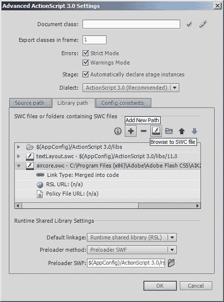
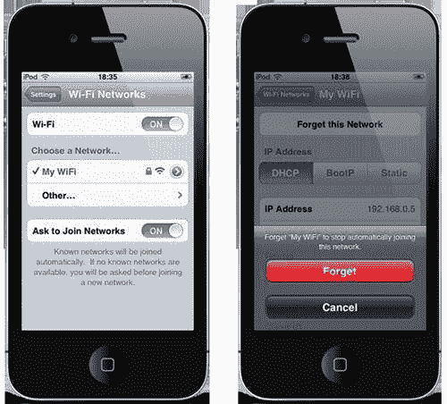
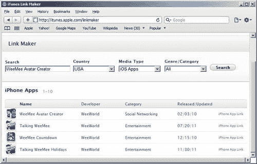

# 第十三章. 连接性、持久性和 URI 方案

在本章中，我们将涵盖：

+   监控互联网连接

+   指定持久的 Wi-Fi 连接

+   引用应用的公共目录

+   编写文件

+   读取文件

+   启动系统应用

+   启动 App Store

+   启动地图应用

+   声明设备功能

# 简介

在本书的整个过程中，我们已经覆盖了很多内容，但有一些我们触及的话题值得更多关注。在本章中，我们将通过探索应用描述符文件的一些额外用途，花时间了解如何访问设备的文件系统，以及如何从 Flash 打开原生 iOS 应用来整理这些悬而未决的问题。

# 监控互联网连接

对于移动应用来说，在某个时刻连接到互联网是一种常见现象。对于许多人来说，这将是简单的任务，例如提交用户的分数或发布到社交网络网站。更复杂的应用可能试图从各种来源聚合数据，甚至从 Flash 媒体服务器流式传输视频。

在尝试发送或接收数据之前检查设备是否具有活跃的互联网连接是一种良好的做法。如果找不到活跃的连接，则应用可以相应地调整。例如，一个游戏可能会隐藏其在线排行榜并移除上传分数的任何设施。

此菜谱将向您展示如何使用 AIR 的 `URLMonitor` 类在调用之前检查 URL 的可用性。

## 准备工作

已提供了一个 FLA 作为起点。

从本书的配套代码包中，将 `chapter13\recipe1\recipe.fla` 打开到 Flash Professional。

一个名为 `output` 的动态文本字段覆盖了舞台。我们将编写一些动作脚本以检查互联网连接并在文本字段中显示结果。

## 如何操作...

`URLMonitor` 类属于 `air.net` 包，并在 AIR 运行时中未定义。相反，该类包含在 `aircore.swc` 文件中，在使用之前必须将其静态链接到您的 FLA。

### 链接 SWC 文件

在编写此菜谱的动作脚本之前，让我们将 `aircore.swc` 链接到 FLA。

1.  从 Flash Professional 的下拉菜单中选择 **文件** | **动作脚本设置**。这将打开动作脚本 3.0 设置面板，您可以在其中添加 SWC。

1.  选择 **库路径** 选项卡。点击 **添加新路径** 图标，它由一个 **+** 符号表示。

1.  现在点击 **浏览到 SWC 文件** 图标，并从您的 Flash 安装文件夹中选择 `aircore.swc`。其位置取决于您使用的 Flash Professional 版本。对于 CS5，浏览到：`Adobe Flash CS5\AIK2.5\frameworks\libs\air\aircore.swc`。如果您使用的是 CS5.5，它位于：`Adobe Flash CS5.5\AIR2.6\frameworks\libs\air\aircore.swc`。

    ### 注意

    在 Microsoft Windows 上，你的 Flash Professional 安装可以在`C:\Program Files (x86)\Adobe`找到。在 32 位 Windows 版本上，路径将是`C:\Program Files\Adobe`。

    如果你正在使用 Mac OS X，那么你的 Flash 安装可以在以下位置找到：`Macintosh HD/Applications`。

    

1.  SWC 将被添加到在发布应用程序时使用的库列表中。通过单击其路径左侧的图标展开 SWC 文件的条目，并确保其**链接类型**选项设置为**合并到代码**。

1.  点击**确定**以关闭面板。

### 检查连接性

将`aircore.swc`链接到你的 FLA 文件后，你现在可以使用`URLMonitor`类提供的 API。好的，现在让我们编写一些 ActionScript 代码。

1.  创建一个文档类，并将其命名为`Main`。

1.  添加以下三个导入语句，以及一个`URLMonitor`成员变量：

    ```swift
    package {
     import air.net.URLMonitor; 
    import flash.display.MovieClip;
     import flash.events.StatusEvent;
    import flash.net.URLRequest; 
    public class Main extends MovieClip {
    private var monitor:URLMonitor; 
    public function Main() {
    // constructor code
    }
    }
    }

    ```

1.  创建一个检查特定 HTTP 请求可用性的`URLMonitor`实例，并监听其`dispatching` `StatusEvent.STATUS`：

    ```swift
    public function Main() {
     var request:URLRequest = new URLRequest(
    "http://www.yeahbutisitflash.com");
    monitor = new URLMonitor(request);
    monitor.addEventListener(StatusEvent.STATUS, statusUpdated);
    monitor.start(); 
    }

    ```

1.  为`URLMonitor`对象的`STATUS`事件编写一个处理程序：

    ```swift
    private function statusUpdated(e:StatusEvent):void {
    if(monitor.available)
    {
    output.text = "Internet connection available.";
    }
    else
    {
    output.text = "Internet connection unavailable.";
    }
    }

    ```

1.  将该类保存为`Main.as`，然后返回到你的 FLA 文件。

1.  发布 FLA 文件并在你的设备上测试应用程序。以下文本应显示在屏幕上：

    **互联网连接可用**。

1.  尝试将你的文档类更改为监控一个不存在的 URL。重新发布并测试你的应用程序。这次你将收到以下消息：

    **互联网连接不可用**。

## 它是如何工作的...

`URLMonitor`类监控并检测指定 URL 的 HTTP 或 HTTPS 连接变化。

其构造函数接受一个`URLRequest`作为参数，其中包含要探测的 URL。在创建`URLMonitor`对象后，调用其`start()`方法开始监控。

当确定 URL 的可用性时，`URLMonitor`对象将派发`StatusEvent.STATUS`。你可以查询`StatusEvent`对象的`available`属性以确定是否可以建立到 URL 的连接。

监控将持续进行，直到调用`URLMonitor.stop()`方法。也可以通过检查`URLMonitor.running`属性来确定是否正在进行监控。

如需更多信息，请在 Adobe 社区帮助中搜索`air.net.URLMonitor`。

## 还有更多...

这里有一些额外的细节。

### 监控套接字

`air.net.SocketMonitor`类与`URLMonitor`类似，但检测指定端口的主机连接变化。这对于需要套接字服务器连接的应用程序，如多人游戏，非常有用。

`SocketMonitor`类的构造函数期望传入要监控的主机名和端口号：

```swift
monitor = new SocketMonitor("www.example.com", 6667);

```

一旦实例化，`SocketMonitor`对象的使用方式与`URLMonitor`相同。

### 轮询间隔

`URLMonitor`和`SocketMonitor`都提供了一个`pollInterval`属性，可以用来指定一个以毫秒为单位的间隔，用于定期轮询服务器。

默认情况下，其值为 `0`，这意味着在调用 `start()` 后，服务器将立即轮询，之后仅在网络状态改变时才会轮询。

## 相关内容

+   *指定持久的 Wi-Fi 连接*

# 指定持久的 Wi-Fi 连接

虽然许多应用程序定期连接到互联网，但也有一些，如聊天客户端和多用户游戏，需要持续连接。如果没有持续连接，这类应用程序可能会变得毫无用处。通过编辑其应用程序描述符文件，您可以指定您的应用程序需要连接到 Wi-Fi 网络的持续连接。

让我们看看如何做这件事。

## 准备工作

从本书的配套代码包中，将 `chapter13\recipe2\recipe.fla` 打开到 Flash Professional 中，并从这里开始工作。其文档类包含上一个示例中的代码，*监控互联网连接性*。如果您没有尝试过这个示例，请不要担心，因为理解它不是必需的。

## 如何操作...

您可以从外部文本编辑器或从 Flash Professional 中编辑您的应用程序描述符文件。我们将使用 Flash Professional。

1.  通过从 Flash Professional 的下拉菜单中选择 **文件** | **打开** *(Ctrl + O* | *Cmd* + *O)* 打开应用程序描述符文件。从文件浏览器中，选择 `recipe-app.xml`。

1.  将文件向下滚动，直到找到以下 XML 片段：

    ```swift
    <iPhone>
    <InfoAdditions>
    <![CDATA[<key>UIDeviceFamily</key>
    <array><string>1</string></array>]]>
    </InfoAdditions>

    ```

1.  在 `CDATA` 节点中，将以下键值对添加到 XML 中：

    ```swift
    <iPhone>
    <InfoAdditions>
    <![CDATA[<key>UIDeviceFamily</key>
    <array><string>1</string></array>
    <key>UIRequiresPersistentWiFi</key><true/>]]> 
    </InfoAdditions>

    ```

1.  保存文件。

1.  现在发布 FLA，并将生成的 `.ipa` 文件安装到您的设备上。

1.  在启动应用程序之前，停止您的设备自动连接到您的 Wi-Fi 网络。从您的设备设置中，选择 **Wi-Fi**，然后点击网络名称右侧的图标。这样做将带您进入该网络的设置页面。从这里，按 **忘记此网络** 按钮，然后按 **忘记**。

1.  现在返回到设备的主屏幕并启动您的应用程序。iOS 会注意到应用程序需要持久的 Wi-Fi 连接，并将显示一个原生对话框，要求您 **选择无线网络**。从列表中选择您的网络，并在提示时输入其密码。

    初始时，您的应用程序将报告以下内容：

    **互联网连接不可用**。

    但在短暂的瞬间后，它将检测到您的网络连接，并将状态更新如下：

    **互联网连接可用**。

## 它是如何工作的...

您的 FLA 应用描述符是一个包含 iOS 特定设置的 XML 文件。在 `<iPhone>` 节点中是 `<infoAdditions>` 节点，您可以在其中设置不能在 Flash 中设置的自定义键值对。这些用于描述应用程序或当应用程序启动时直接使用。

对于这个示例，我们使用了以下键值对来提醒用户当找不到持久的 Wi-Fi 连接时：

```swift
<key>UIRequiresPersistentWiFi</key><true/>

```

当应用启动时，它会检测这个键的存在，因此会检查设备是否连接到活动的 Wi-Fi 网络。如果没有，它将执行搜索并显示一个网络选择对话框，其中包含用户可以选择的活跃 Wi-Fi 热点列表。或者，如果设备处于飞行模式，则显示一个对话框通知用户这一点。

Wi-Fi 硬件可能会消耗大量电力。为了节省电池，iOS 会自动在 30 分钟后关闭其 Wi-Fi 硬件。如果你的应用使用了 `UIRequiresPersistentWiFi` 键，那么 Wi-Fi 硬件将保持开启状态，直到应用保持活跃。如果设备的屏幕锁定，那么应用将被视为不活跃，Wi-Fi 连接可能会丢失。

你可以通过将其值设置为 `<false/>` 来关闭 `UIRequiresPersistentWiFi` 键。或者，也可以从应用程序描述符文件中删除整个条目。

## 相关内容

+   *编辑应用程序描述符文件，第三章*

# 引用应用程序的常用目录

iOS 应用位于其自己的目录中，并可以访问包含在其内部的常用子目录。

这个菜谱将向你展示如何引用这些目录中的每一个。

## 准备工作

我们将使用书中附带代码包中的 `chapter13\recipe3\recipe.fla` 作为起点。将其打开到 Flash Professional 中。

在舞台上可以找到一个名为 `output` 的动态文本字段。我们将使用这个文本字段来显示应用程序每个常用目录的本地文件路径。

## 如何操作...

执行以下步骤：

1.  创建一个新的文档类，并将其命名为 `Main`。

1.  导入 `File` 类：

    ```swift
    import flash.display.MovieClip;
    import flash.filesystem.File; 

    ```

1.  在构造函数中，将每个目录的本地路径写入 `output` 文本字段：

    ```swift
    public function Main(){
    output.text = "Application Directory:\n" + File.applicationDirectory.nativePath + "\n\nApplication Storage Directory:\n" + File.applicationStorageDirectory.nativePath + "\n\nDocuments Directory:\n" + File.documentsDirectory.nativePath + "\n\nUser Directory:\n" + File.userDirectory.nativePath; 
    }

    ```

1.  保存类，并在提示时将文件命名为 `Main.as`。

1.  最后，发布 FLA 文件并在你的设备上测试它。所有四个目录的路径将在屏幕上显示。

## 工作原理...

存储应用的目录被称为 **应用程序主页**，其路径类似于：`/var/mobile/Applications/97C9F144-E97A-40BB-A4CD-82FF31CA2A3C`。路径末尾的字符串是一个唯一标识应用程序的 ID，并在安装期间用于命名主目录。

`flash.filesystem.File` 类提供了几个常量，可用于引用应用程序主页及其各种子目录。这些常量允许你以平台无关的方式访问目录，从而消除了记住长串本地路径的需要。它们是：

+   `File.userDirectory:` 应用程序主页目录

+   `File.applicationDirectory:` 一个只读目录，包含应用程序的二进制文件以及与之捆绑的任何文件，例如默认启动屏幕

+   `File.applicationStorageDirectory:` 任何本地共享对象数据都存储在这里

+   `File.documentsDirectory:` 任何应用程序特定的数据都可以写入并从这个目录中检索

在这四个中，`applicationDirectory` 和 `documentsDirectory` 可能是使用最频繁的两个。虽然您不能向应用程序目录写入，但您可以从中读取，甚至可以将文件从其中复制到其他位置。

文档目录对于状态管理很有用，允许存储应用程序所需的数据文件。这些文件可以是任何东西，从简单的偏好文件到用户创建的图像。此目录的内容由 iTunes 备份。

如果您希望临时存储文件，则应用程序主目录中提供了一个 `tmp` 子目录。要引用未作为常量提供的文件夹，请使用 `File` 类的 `resolvePath()` 方法修改现有的 `File` 对象。例如：

```swift
var tmpDir:File = File.userDirectory.resolvePath("tmp");

```

还提供了一个 `nativePath` 属性，允许您从 `File` 对象引用中检索目录的本地路径：

```swift
var nativePath:String = File.applicationDirectory.nativePath;

```

当使用期望本地路径而不是 `File` 对象的 API 时，这很有用。

更多信息，请在 Adobe Community Help 中搜索 `flash.filesystem.File`。

## 更多内容...

在使用 `File` 类和目录时，还有一些其他选项。

### 创建目录

除了引用现有目录外，`File` 类还允许您使用其 `createDirectory()` 方法创建目录。以下两行代码在应用程序的 Documents 目录中创建了一个名为 `images` 的目录：

```swift
var dir:File = File.documentsDirectory.resolvePath("images");
dir.createDirectory();

```

您也可以使用 `deleteDirectory()` 或 `deleteDirectoryAsync()` 删除目录。在异步删除目录时，监听 `Event.COMPLETE` 事件。

## 参见

+   *写入文件*

+   *读取文件*

# 写入文件

AIR 提供了一个文件系统 API，可以用于将任何类型的文件写入设备。

让我们看看如何写入包含简单偏好数据的文本文件，例如，可能被游戏使用。

## 准备工作

已提供一个 FLA 作为本菜谱的起点。

从本书的配套支持文件中，将 `chapter13\recipe4\recipe.fla` 打开到 Flash Professional。

阶段上有一个名为 `output` 的动态文本字段。我们将向设备写入一些偏好数据，并使用文本字段来指示数据已被写入。

## 如何操作...

`flash.filesystem` 包包含提供文件系统访问的类。让我们利用其中的一些类将数据写入设备。

1.  创建一个名为 `Main` 的文档类。

1.  导入以下类：

    ```swift
    import flash.display.MovieClip;
    import flash.events.Event;
     import flash.events.IOErrorEvent;
    import flash.filesystem.File;
    import flash.filesystem.FileMode;
    import flash.filesystem.FileStream; 

    ```

1.  添加一个 `File` 和 `FileStream` 成员变量：

    ```swift
    private var file:File;
    private var stream:FileStream;

    ```

1.  创建一个将偏好数据写入设备的方法，并在构造函数中调用它：

    ```swift
    public function Main() {
    savePreferences();
    }
    private function savePreferences():void {
    file = File.documentsDirectory.resolvePath("prefs.txt");
    stream = new FileStream();
    stream.addEventListener(IOErrorEvent.IO_ERROR, ioError);
    stream.addEventListener(Event.CLOSE, fileSaved);
    stream.openAsync(file, FileMode.WRITE);
    stream.writeUTFBytes(
    "music_vol=0.5&sound_vol=0.7&difficulty=easy");
    stream.close();
    }

    ```

1.  添加一个处理程序，如果写入偏好数据时发生错误，则会调用它：

    ```swift
    private function ioError(e:IOErrorEvent):void {
    output.appendText(e.errorID + ": " + e.text);
    }

    ```

1.  添加第二个处理程序，一旦文件已成功写入设备文件系统，则会调用它：

    ```swift
    private function fileSaved(e:Event):void {
    output.appendText("File Saved\n");
    }

    ```

1.  保存类文件，并在提示时将其命名为 `Main.as`。

1.  在您的设备上发布 FLA 并进行测试。偏好文件将被写入，屏幕上将显示以下文本：

    **文件已保存**

## 它是如何工作的...

此配方利用了`flash.filesystem.File`和`flash.filesystem.FileStream`类将数据写入设备的文件系统。数据通过一系列写入应用程序文档目录的文本文件中的名称-值对表示。

在向文件写入时，必须首先使用`File`类获取表示它的引用——即使对于尚未创建的文件也是如此。除了表示文件外，`File`类还可以用来表示目录。通过使用`File.resolvePath()`，可以进一步细化目录引用，以指向相对于它的文件或子目录。

以下行代码展示了为偏好文件创建的`File`对象：

```swift
file = File.documentsDirectory.resolvePath("prefs.txt");

```

下一步是实例化一个`FileStream`对象，并使用`openAsync()`方法对其进行初始化以进行写入：

```swift
stream = new FileStream();
stream.openAsync(file, FileMode.WRITE);

```

如您所见，`File`对象被传递给`openAsync()`。作为第二个参数，还传递了`FileMode.WRITE`常量，表示数据将被写入文件。如果指定的文件不存在，则`openAsync()`将创建它。如果它已经存在，则其内容将被清除。

`FileStream`类在写入数据时触发各种事件。如果它无法创建或找到文件，则触发`IOErrorEvent.IO_ERROR`事件，一旦它已将数据写入文件，则触发`Event.CLOSE`事件。应添加对这两个事件的监听器：

```swift
stream = new FileStream();
stream.addEventListener(IOErrorEvent.IO_ERROR, ioError);
stream.addEventListener(Event.CLOSE, fileSaved); 
stream.openAsync(file, FileMode.WRITE);

```

文件打开用于写入后，调用`writeUTFBytes()`实际上将文本写入文件：

```swift
stream.writeUTFBytes(
"music_vol=0.5&sound_vol=0.7&difficulty=easy");

```

最后一步是关闭`FileStream`对象，以防止更多数据被写入：

```swift
stream.close();

```

重要的是要理解，在您调用`close()`方法时，文件不一定已经完全写入。当向设备写入大量数据时，可能需要一些时间。如果是这种情况，则`FileStream`对象将延迟关闭文件，直到所有数据都写入完毕。一旦完成，`FileStream`对象将触发`Event.CLOSE`事件。

虽然您可以在应用程序主目录内的任何位置写入文件，但由于沙盒限制，您不能在目录外写入。

您可以从 Adobe 社区帮助中获取有关`flash.filesystem.FileStream, flash.filesystem.File`和`flash.filesystem.FileMode`类的更多信息。

## 还有更多...

这里有一些更详细的说明，这些说明在向设备的本地文件系统写入时可能很有用。

### 处理数据格式

`FileStream`类提供了许多用于写入数据的方法。您选择的方法取决于您希望使用的数据格式。

例如，当处理文本时，您有`writeUTF(), writeUTFBytes()`和`writeMultiByte()`方法可用。如果您选择使用字节数组，则还有`writeByte()`和`writeBytes()`方法。您甚至可以使用`writeBoolean(), writeDouble(), writeFloat(), writeInt()`和`writeShort()`来写入原始数据。

### 同步写入

本食谱使用了`openAsync()`，这意味着数据可以异步写入设备。异步操作在后台进行，允许您的 ActionScript 代码继续执行，而不是在操作完成之前被阻塞。

作为`openAsync()`的替代方案，`FileStream`类还提供了`open()`，它允许以同步方式处理数据。尽管执行将在操作完成之前被阻塞，但同步工作更直接，因为您不需要注册事件。在以下代码片段中，您可以看到`savePreferences()`方法的替代版本，它以同步方式写入数据：

```swift
private function savePreferences():void {
file = File.documentsDirectory.resolvePath("prefs.txt");
stream = new FileStream();
stream.open(file, FileMode.WRITE);
stream.writeUTFBytes(
"music_vol=0.5&sound_vol=0.7&difficulty=easy");
stream.close();
output.appendText("File Saved\n");
}

```

### 注意

本书中的示例在写入设备文件系统时，都是同步进行的，以帮助保持对当前任务的关注。

### 监控进度

当异步写入文件时，`FileStream`对象将定期触发`OutputProgressEvent.OUTPUT_PROGRESS`事件。从该事件对象中，您可以通过检查其`bytesPending`和`bytesTotal`属性来监控写入操作的进度。`bytesPending`属性指定了还需要写入的字节数，而`bytesTotal`表示到目前为止已写入的字节数。

### 持久化

写入文件系统允许您将应用程序的状态保存到设备上。当应用重新启动时，它可以使用这些保存的数据从上次离开的地方继续。

作为 AIR 文件系统 API 的替代方案，您还可以使用 Flash 的`SharedObject`类来管理状态。此外，可以使用在 AIR 3.0 中引入的`EncryptedLocalStore`类存储少量私有数据。有关加密本地存储的详细信息，请参阅 Adobe 社区帮助。

另一个选项是将您的数据存储在本地 SQLite 数据库中，并使用 ActionScript 来访问它。苹果本身在 iOS 设备上使用 SQLite 数据库来存储信息，例如联系人。

关系型数据库理论和 SQLite API 不在此书的范围之内。然而，您可以从 Adobe 社区帮助或访问 SQLite 网站获取更多关于此主题的信息：[sqlite.org](http://sqlite.org)。

## 参见

+   *保存应用程序状态，第四章*

+   *引用应用程序的常见目录*

+   *读取文件*

# 读取文件

AIR 提供了一个文件系统 API，可以用来从设备读取任何类型的文件。

在本食谱中，我们将看到如何加载之前写入设备上的文件。

## 准备工作

如果您还没有这样做，请在继续之前完成*写入文件*食谱。

您可以继续使用在该食谱中编写的代码。或者，从本书的配套代码包中，将`chapter13\recipe5\recipe.fla`打开到 Flash Professional 中，并从那里开始工作。

## 如何操作...

让我们更新 FLA 的文档类，以加载并显示写入到设备上的首选项。

1.  打开文档类。

1.  添加一个将加载首选项数据的方法：

    ```swift
    private function loadPreferences():void {
    file = File.documentsDirectory.resolvePath("prefs.txt");
    stream = new FileStream();
    stream.addEventListener(IOErrorEvent.IO_ERROR, ioError);
    stream.addEventListener(Event.COMPLETE, fileLoaded);
    stream.openAsync(file, FileMode.READ);
    }

    ```

1.  修改类的 `fileSaved()` 处理程序，使其调用前面的方法：

    ```swift
    private function fileSaved(e:Event):void {
    output.appendText("File Saved\n");
    loadPreferences(); 
    }

    ```

1.  当文件已加载时，将分派一个 `COMPLETE` 事件。添加一个处理程序来解析和显示文件的偏好数据：

    ```swift
    private function fileLoaded(e:Event):void {
    var prefs:String = stream.readUTFBytes(stream.bytesAvailable);
    stream.close();
    var vars:URLVariables = new URLVariables(prefs);
    output.appendText(
    "File Loaded\n" +
    "music volume: " + vars.music_vol + "\n" + "sound volume: " + vars.sound_vol + "\n" + "difficulty: " + vars.difficulty + "\n"
    );
    }

    ```

1.  `fileLoaded()` 处理程序使用 Flash 的 `URLVariables` 类来解码首选项数据。将 `URLVariables` 添加到文档类的导入语句列表中：

    ```swift
    import flash.net.URLVariables;

    ```

1.  保存 `Main.as`。

1.  发布 FLA 并在您的设备上测试它。

应用程序将首先将首选项数据写入文件系统，然后再将其加载回并显示在屏幕上的首选项。

## 它是如何工作的...

从设备文件系统读取数据所需的步骤几乎与写入数据相同。

首先创建一个 `File` 对象，它引用目标文件：

```swift
file = File.documentsDirectory.resolvePath("prefs.txt");

```

然后使用 `openAsync()` 方法实例化并初始化 `FileStream` 对象。当正在读取文件而不是写入文件时，将 `FileMode.READ` 作为方法的第二个参数传递：

```swift
stream = new FileStream();
stream.openAsync(file, FileMode.READ);

```

当写入文件时，`FileSystem.close()` 在 `openAsync()` 后立即调用，但在读取时，不应调用它，直到获取文件的全部数据。这可以通过监听 `FileStream` 对象分派 `Event.COMPLETE` 来确定。

要实际获取数据，需要使用 `FileSystem` 类的读取方法之一。对于此配方，使用了 `readUTFBytes()`，并将从文件缓冲区读取的字节数传递给它：

```swift
var prefs:String = stream.readUTFBytes(stream.bytesAvailable);
stream.close();

```

在调用 `readUTFBytes()` 时使用了 `FileStream` 类的只读 `bytesAvailable` 属性。此属性表示文件完全加载后的大小。注意，文件流在读取数据后关闭，因为不再需要它。

## 更多...

您会发现 AIR 的文件系统 API 对于许多 iOS 项目非常有价值。在我们离开这个主题之前，这里有一些最终的信息要带在身边。

### 处理数据格式

`FileStream` 类提供了许多从文件读取数据的方法。您选择的方法取决于您正在读取的数据格式。

例如，当处理文本时，有 `readUTF(), readUTFBytes(),` 和 `readMultiBytes()` 方法可用。如果文件包含字节数组，则可以使用 `readByte()` 和 `readBytes()` 方法。可以使用 `readBoolean(), readDouble(), readFloat(), readInt()`, 和 `readShort()` 获取原始类型。

### 同步读取

与之前的配方一样，使用了 `openAsync()`，这意味着文件是异步处理的。以下代码使用 `open()` 方法来同步读取此配方的首选项文件：

```swift
private function loadPreferences():void {
file = File.documentsDirectory.resolvePath("prefs.txt");
stream = new FileStream();
stream.open(file, FileMode.READ);
var prefs:String = stream.readUTFBytes(stream.bytesAvailable);
stream.close();
}

```

### 注意

本书中的示例从设备文件系统读取数据，这样做是为了同步，以帮助保持对当前任务的关注。

### 监控进度

当异步读取文件时，`FileStream`对象将定期派发`ProgressEvent.PROGRESS`事件。从该事件对象中，你可以通过检查其`bytesLoaded`和`bytesTotal`属性来监控读取进度。`bytesLoaded`属性指定已加载的字节数，而`bytesTotal`表示如果文件成功加载，将加载的字节数。

### 删除文件

你可以使用`File`类的`deleteFile()`或`deleteFileAsync()`方法删除文件。在异步删除时，监听`Event.COMPLETE`事件。

### 其他文件模式

还有两种其他文件模式可用：`FileMode.APPEND`和`FileMode.UPDATE`。

追加模式始终将数据写入文件末尾，这意味着现有文件的数据将被添加而不是被破坏。

更新模式允许你使用单个文件流从文件中读取和写入。为了成功管理这一点，`FileStream`类提供了`position`属性，可以用来确定和设置文件中的当前位置。每次写入或读取一个字节时，`position`属性都会增加。也可以通过设置此属性来移动到文件中的任何位置。这样做后，下一次读取或写入操作将从该位置开始。

## 参见

+   *引用应用程序的常用目录*

+   *写入文件*

# 启动系统应用程序

有时你可能希望你的应用程序提供 iOS 系统应用程序已经提供的功能。为了保证一致和熟悉的使用体验，可以启动某些系统应用程序，而不是在应用程序内部执行任务。为了启用此功能，iOS 支持各种 URI 方案，可以用来启动特定的应用程序。

在本食谱中，你将学习如何使用`mailto` URI 方案从邮件应用程序打开和发送电子邮件。

## 准备工作

从本书的配套代码包中，将`chapter13\recipe6\recipe.fla`加载到 Flash Professional 中，并将其作为起点使用。

在其舞台上有一个名为`mailBtn`的按钮。当按下时，它将启动设备的邮件应用程序并为用户预填充一封电子邮件以便发送。

让我们编写实现这一功能的 ActionScript 代码。

## 如何实现...

我们将使用 Flash 的`navigateToURL()`函数和`URLRequest`类来启动邮件应用程序。

1.  创建一个文档类，并将其命名为`Main`。

1.  导入以下内容：

    ```swift
    import flash.display.MovieClip;
     import flash.events.MouseEvent;
    import flash.net.navigateToURL;
    import flash.net.URLRequest; 

    ```

1.  在构造函数中，监听按钮被按下：

    ```swift
    public function Main() {
    mailBtn.addEventListener(MouseEvent.MOUSE_UP, sendMail); 
    }

    ```

1.  创建一个方法，用于启动邮件应用程序并编写电子邮件。在其中，初始化表示收件人电子邮件地址、主题标题和电子邮件正文的字符串：

    ```swift
    private function sendMail(e:MouseEvent):void {
    var address:String = "someone@somewhere.com";
    var subject:String = "Flash iOS Apps Cookbook";
    var body:String = "Sent from the Mail application.";
    }

    ```

1.  在此代码中，将某人`@somewhere.com`替换为你希望的目标电子邮件地址。出于测试目的，请使用你自己的地址。

1.  在`sendMail()`方法中保持，构建一个使用`mailto` URI 方案的 URL：

    ```swift
    private function sendMail(e:MouseEvent):void {
    var address:String = "someone@somewhere.com";
    var subject:String = "Flash iOS Apps Cookbook";
    var body:String = "Sent from the Mail application.";
    var url:String = "mailto:" + address + "?subject=" + subject + "&body=" + body;
    var request:URLRequest = new URLRequest(url); 
    }

    ```

1.  最后，通过将 URL 传递给 Flash 的`navigateToURL()`函数来启动邮件应用：

    ```swift
    private function sendMail(e:MouseEvent):void {
    var address:String = "someone@somewhere.com";
    var subject:String = "Flash iOS Apps Cookbook";
    var body:String = "Sent from the Mail application.";
    var url:String = "mailto:" + address + "?subject=" + subject + "&body=" + body;
    var request:URLRequest = new URLRequest(url);
    navigateToURL(request); 
    }

    ```

1.  保存类文件，并在提示时将其命名为`Main.as`。

1.  发布 FLA 并在您的设备上测试应用。点击按钮将打开邮件应用，并包含预先填充的电子邮件。

## 它是如何工作的...

`mailto` URI 用于启动邮件应用并撰写电子邮件。URI 必须正确构建和格式化，以便邮件应用能够理解它。一旦构建完成，将请求传递给 Flash 的`navigateToURL()`包级函数以实际启动应用。

至少，必须在`mailto` URI 中指定收件人的电子邮件地址：

```swift
mailto:someone@somewhere.com

```

您还可以通过在 URI 中添加查询字符串参数来预先填充电子邮件中的字段。例如，以下预先填充了电子邮件的主题和正文字段：

```swift
mailto:someone@somewhere.com?subject=Test&body=This is a test

```

支持的查询字符串参数如下：

+   `subject:` 电子邮件的主题字段

+   `body:` 电子邮件的主体

+   `to:` 允许在“收件人”字段中添加多个收件人

+   `cc:` 允许将收件人添加到抄送字段

+   `bcc:` 允许将收件人添加到密件抄送字段

当在字段中添加多个收件人时，使用逗号分隔每个地址。

电子邮件的主体可以指定为纯文本或 HTML。以下是一个使用 HTML 的示例：

```swift
mailto:someone@somewhere.com?body=<a href='http://www.yeahbutisitflash.com'>Yeah But Is It Flash?</a>

```

`mailto`规范禁止在 URI 中选择电子邮件账户。当多个账户与设备关联时，始终使用默认账户。附件也不受支持。

在 iOS 4 或更高版本上启动系统应用会强制当前应用进入后台。在 iOS 4 之前的设备上，当前应用将完全关闭。因此，在打开系统应用之前存储您应用的状态是明智的。当用户完成使用系统应用后，他们将从设备的主屏幕或快速应用切换器重新启动您的应用。

## 还有更多...

我们已经介绍了`mailto` URI 方案，现在让我们看看可以通过`navigateToURL()`打开的几个其他应用。

### 拨打电话号码

`tel` URI 方案可用于启动 iPhone 的电话应用并拨打指定的号码。以下示例显示了`tel` URI 的格式非常简单：

```swift
tel:1-408-555-5555

```

大多数有效的电话号码都被接受，但为了防止恶意行为，包含`*`或`#`字符的 URI 不被接受。当使用`tel` URI 方案时，电话号码必须在 URI 中指定。

### 发送短信消息

可以使用`sms` URI 方案打开 iPhone 的消息应用。可以包含一个可选的电话号码，表示要创建新的短信消息：

```swift
sms:1-408-555-1212

```

如果省略电话号码，则消息应用将打开，但不会为用户创建要发送的消息。

无法预先填充文本消息或指定多个收件人。

### 播放 YouTube 视频

`navigateToURL()` 函数可以用来启动本地的 YouTube 应用。没有特定的 URI 方案；相反，使用一个针对 YouTube 服务器的 URL。

简单地构造一个包含您想播放的视频 ID 的 URL。该 URL 应采用以下格式：`http://www.youtube.com/watch?v=ID`。您可以通过访问 YouTube 网站，并从浏览器的地址栏中提取视频 ID 来获取视频的 ID。

这里是一个可以传递给 `navigateToURL()` 的示例 URL：

```swift
http://www.youtube.com/watch?v=awNMSiGzuRk

```

### HTML 中的 URI 方案

URI 方案也可以嵌入到 HTML 页面中的链接。这允许用户在 `StageWebView` 对象内启动系统应用。例如，以下 HTML 链接将启动一个电话呼叫：

```swift
<a href="tel:1-408-555-5555">Call us now!</a>

```

关于 `StageWebView` 类的更多信息，请参阅第十一章。

## 参见

+   *优雅地退出应用，第三章*

+   *在 Safari 中打开网页，第十一章*

+   *启动 App Store*

+   *启动 Maps 应用*

# 启动 App Store

出版商经常在他们最新的发布中推广他们的旧作品，在 App Store 中为他们的每个产品提供直接链接。这不仅使购买过程对用户来说极其简单，而且也鼓励冲动购买。

您可以直接从您的 AIR for iOS 应用中启动 App Store，通过传递特定的 iTunes URL 到 Flash 的 `navigateToURL()` 函数。让我们看看如何做到这一点。

## 准备工作

已提供 FLA 文件作为本菜谱的起点。

从本书的配套代码包中，将 `chapter13\recipe7\recipe.fla` 打开到 Flash Professional 中。在其舞台上有名为 `storeBtn` 的按钮。

让我们编写一些 ActionScript 代码，当按下此按钮时启动 App Store。

## 如何操作...

我们将打开 WeeWorld 的 WeeMee Avatar Creator 应用的 App Store 页面。首先，我们将获取应用页面的 URL，然后我们将编写实际的代码来从我们的应用中链接到它。

### 获取应用的 URL

构造 URL 格式比较复杂。为了简化过程，苹果创建了在线链接制作工具。

1.  访问其网页：[`itunes.apple.com/linkmaker`](http://itunes.apple.com/linkmaker)。

1.  通过填写页面字段来定义搜索。在**搜索**字段中输入**WeeMee Avatar Creator**，将国家设置为**USA**，并从**媒体类型**下拉菜单中选择**iOS Apps**。

1.  点击页面右侧的**搜索**按钮以启动搜索。将生成一个匹配列表，并显示在页面底部。

1.  在**iPhone Apps**部分查找**WeeMee Avatar Creator**，然后在其条目的右侧点击**iPhone App 链接**。将出现一个包含应用详细信息的对话框。

1.  从对话框中复制**直接链接**URL。

### 从 ActionScript 链接到应用程序

现在我们将编写启动 App Store 页面的 ActionScript。

1.  在 Flash Professional 中创建一个新的文档类，并将其命名为`Main`。

1.  添加所需的导入语句，并监听`storeBtn`被按下：

    ```swift
    package {
    import flash.display.MovieClip;
     import flash.events.MouseEvent;
    import flash.net.navigateToURL;
    import flash.net.URLRequest; 
    public class Main extends MovieClip {
    public function Main() {
    storeBtn.addEventListener(MouseEvent.MOUSE_UP, openAppStore);
    }
    }
    }

    ```

1.  为按钮添加事件处理程序，并在其中使用从链接制作工具获取的 URL 打开 App Store：

    ```swift
    private function openAppStore(e:MouseEvent):void {
    var url:String = "http://itunes.apple.com/us/app/weemee-avatar-creator/id352506978?mt=8&uo=4";
    var request:URLRequest = new URLRequest(url);
    navigateToURL(request);
    }

    ```

1.  现在保存文档类的文件，并在提示时将其命名为`Main.as`。

1.  在您的设备上发布并测试应用程序。轻触按钮以在 App Store 应用程序中打开 WeeMee 头像创建器的条目。

## 它是如何工作的...

将一个应用的合法 iTunes URL 传递给 Flash 的`navigateToURL()`包级函数将打开该应用的 App Store 应用程序。特定应用的 URL 可以从苹果的链接制作在线工具中检索。

不仅可以从您的应用程序中打开 App Store，链接制作工具还可以创建指向 iTunes Store 和 iBookstore 内容的链接。只需对相关内容进行搜索，然后获取其 URL。

不同的商店也可以从`StageWebView`对象内的 HTML 链接中启动。链接制作工具在**直接链接**URL 的同一对话框中提供所需的 HTML。您可以从**带有链接的 HTML**文本框中复制它。

## 参见

+   *在应用程序内渲染网页，第十一章*

+   *启动系统应用程序*

+   *启动地图应用程序*

# 启动地图应用程序

由于 iOS 具有位置感知功能，因此地图是 iOS 的一个基本组成部分。本机地图应用程序允许您找到您当前的位置，搜索附近的兴趣点，并获得逐个转弯的指示。许多开发人员通过直接从自己的应用程序中打开地图来利用地图，为用户提供一致的经验。

让我们看看如何做到这一点。

## 准备工作

从书籍的配套代码包中，将`chapter13\recipe8\recipe.fla`打开到 Flash Professional 中。

在其舞台上有按钮，实例名为`mapBtn`。当按下此按钮时，我们将添加代码以显示 Adobe 总部的位置。

## 如何做到这一点...

我们将使用 Flash 的`URLRequest`类和`navigateToURL()`函数来打开地图应用程序。

1.  创建一个文档类，并将其命名为`Main`。

1.  导入此菜谱所需的类，并监听按钮被按下：

    ```swift
    package {
    import flash.display.MovieClip;
     import flash.events.MouseEvent;
    import flash.net.navigateToURL;
    import flash.net.URLRequest; 
    public class Main extends MovieClip {
    public function Main() {
    mapBtn.addEventListener(MouseEvent.MOUSE_UP, openMaps); 
    }
    }
    }

    ```

1.  最后，为按钮添加事件处理程序，并在其中打开 Adobe 总部的地图应用程序：

    ```swift
    private function openMaps(e:MouseEvent):void {
    var addr:String = "Adobe Systems Inc, 345 Park Avenue, " +
    "San Jose, CA";
    var url:String = "http://maps.google.com/maps?q=" + addr;
    var request:URLRequest = new URLRequest(url);
    navigateToURL(request);
    }

    ```

1.  保存类，并在提示时将其文件命名为`Main.as`。

1.  在您的设备上发布并测试应用程序。轻触按钮。本机地图应用程序将打开，并显示 Adobe 总部的位置。

## 它是如何工作的...

如果您的应用程序包含地址或位置信息，您可以将这些信息转发到地图应用程序。为此，构造一个 URL 并将其传递给 Flash 的`navigateToURL()`包级函数。该 URL 应针对 Google Maps 服务器并包含一个或多个 Google Maps 参数。

对于这个菜谱，使用了 Google Maps 查询参数来映射 Adobe 总部的位置：

```swift
http://maps.google.com/maps?q=Adobe Systems Inc, 345 Park Avenue, San Jose, CA

```

地图应用程序支持许多 Google Maps 参数，但并非全部。以下是一个支持参数的列表：

| 参数 | 描述 |
| --- | --- |
| `q` | 查询参数。其值被视为已输入到 Google Maps 网页上的查询框中。 |
| `near` | 可以用作查询的位置部分。 |
| `ll` | 地图中心点的纬度和经度。 |
| `sll` | 商业搜索应进行的纬度和经度。 |
| `spn` | 大约的纬度和经度跨度。缩放级别将进行调整以适应。 |
| `sspn` | 屏幕跨度。缩放级别将进行调整以适应。 |
| `t` | 要显示的地图类型。可以选择 m 表示地图，k 表示卫星，或 h 表示混合。 |
| `z` | 地图的缩放级别，范围从 1 到 20。 |
| `saddr` | 生成方向时使用的源地址。 |
| `daddr` | 生成方向时使用的目标地址。 |
| `latlng` | Google 用于识别商业的自定义 ID 格式。 |
| `cid` | Google 用于识别商业的另一种自定义 ID 格式。 |

启动地图应用程序会将当前应用程序在 iOS 4 或更高版本上置于后台。在 iOS 4 之前的设备上，当前应用程序将完全关闭。因此，在打开地图之前存储应用程序的状态是明智的。当用户完成地图应用程序的使用后，他们将从设备的首页或快速应用程序切换器重新启动您的应用程序。

访问 [`mapki.com/wiki/Google_Map_Parameters`](http://mapki.com/wiki/Google_Map_Parameters) 了解每个 Google Maps 参数的详细描述。

## 还有更多...

这里是地图应用程序的一些其他常见用途。

### 生成方向

您可以指示地图应用程序在两个地址之间生成方向。以下 ActionScript 代码片段使用 Google Maps 的 `saddr` 和 `daddr` 参数生成 Adobe 和苹果公司总部的驾驶方向：

```swift
var saddr:String = "Adobe Systems, 345 Park Avenue, San Jose";
var daddr:String = "Apple, 1 Infinite Loop, Cupertino";
var url:String = "http://maps.google.com/maps?" + "saddr=" + saddr + "&daddr=" + daddr;
var request:URLRequest = new URLRequest(url);
navigateToURL(request);

```

### 映射您的当前位置

您还可以显示用户的当前位置。这可以通过使用 AIR 的 `Geolocation` 类确定他们的近似位置，并将该信息传递给地图应用程序来实现。

以下 ActionScript 从 `GeolocationEvent` 对象中获取纬度和经度，并构建 Google Maps URL：

```swift
private function geoUpdated(e:GeolocationEvent):void {
var lat:Number = e.latitude;
var lon:Number = e.longitude;
var url:String = "http://maps.google.com/maps?" + "ll=" + lat + "," + lon;
var request:URLRequest = new URLRequest(url);
navigateToURL(request);
}

```

`ll` 属性用于指定位置的纬度和经度。两个值之间用逗号分隔。

## 相关内容

+   *确定您的当前位置，第九章*

+   *启动系统应用程序*

+   *启动 App Store*

# 声明设备功能

iOS 设备的硬件和软件功能各不相同。例如，一些设备具有内置摄像头，而另一些则没有。确保您的应用程序只能下载并安装在其兼容的设备上非常重要。为此，可以为您的应用程序显式设置所需的功能。

您不能直接从 Flash Professional 指定这些功能。相反，您需要编辑 FLA 的应用程序描述符文件。让我们看看如何为一个需要原生消息应用程序和内置 GPS 接收器的应用程序执行此操作。

## 准备工作

从书籍的配套代码包中打开 `chapter13\recipe9\recipe.fla` 并从那里开始工作。FLA 的舞台是空的，但其 AIR for iOS 设置已经应用，让您准备好发布。

## 如何操作...

让我们在 Flash Professional 内部编辑您的应用程序描述符文件。

1.  从 Flash Professional 中选择 **文件** | **打开** 并选择 `recipe-app.xml`。

1.  将文件向下滚动，直到找到以下 XML 片段：

    ```swift
    <iPhone>
    <InfoAdditions>
    <![CDATA[<key>UIDeviceFamily</key>
    <array><string>1</string></array>]]>
    </InfoAdditions>

    ```

1.  在 `CDATA` 节点中，将以下键值对添加到 XML 中：

    ```swift
    <iPhone>
    <InfoAdditions>
    <![CDATA[<key>UIDeviceFamily</key>
    <array><string>1</string></array>
     <key>UIRequiredDeviceCapabilities</key>
    <array>
    <string>sms</string>
    <string>gps</string>
    </array>]]> 
    </InfoAdditions>

    ```

1.  保存文件。

1.  发布 FLA。如果您有一部缺少原生消息应用程序或 GPS 的 iOS 设备，那么尝试安装 `.ipa` 文件。您将收到类似于以下错误消息的信息：

    **应用程序 "c13 r9" 未安装，因为它与此设备不兼容。**

## 工作原理...

您的 FLA 应用程序描述符是一个包含 iOS 特定设置的 XML 文件。在 `<iPhone>` 节点内是 `<infoAdditions>` 节点，您可以在其中设置不能在 Flash 中设置的定制键值对。这些键值对用于描述应用程序或当应用程序启动时直接使用。

`UIRequiredDeviceCapabilities` 键用于指定应用程序所需的功能。如果设备缺少这些功能，则应用程序将无法安装。

每个功能都应该列在 `<array>` 节点内：

```swift
<key>UIRequiredDeviceCapabilities</key>
<array>
<string>sms</string>
<string>gps</string>
</array>

```

此示例 XML 片段显示了 `sms` 和 `gps` 功能的列表。`sms` 功能规定您的应用程序需要消息应用程序的存在，而 `gps` 则表示设备应包含 GPS 硬件。

可以使用 `UIRequiredDeviceCapabilities` 键指定以下功能：

| 功能 | 描述 |
| --- | --- |
| `telephony` | 应用程序需要电话应用程序的存在。 |
| `wifi` | 应用程序将访问设备的网络功能。 |
| `sms` | 应用程序需要消息应用程序的存在。 |
| `still-camera` | 捕获照片需要摄像头。 |
| `auto-focus-camera` | 捕获照片需要具备自动对焦功能的摄像头。 |
| `front-facing-camera` | 应用程序需要前置摄像头。 |
| `camera-flash` | 拍照或拍摄视频需要摄像头闪光灯。 |
| `video-camera` | 设备上需要具备视频功能的摄像头。 |
| `accelerometer` | 需要访问加速度计。 |
| `location-services` | 应用程序将尝试获取设备的当前位置。 |
| `gps` | 设备应包含用于位置跟踪的 GPS 硬件。 |
| `microphone` | 应用程序需要内置麦克风。 |

应用程序描述文件中列出的功能也被 App Store 用于防止用户下载无法运行的应用。

请注意官方 Apple 文档，随着 iOS 每个新版本的发布，设备功能列表也在增长：[`developer.apple.com/library/ios/#documentation/general/Reference/InfoPlistKeyReference/Articles/iPhoneOSKeys.html`](http://developer.apple.com/library/ios/#documentation/general/Reference/InfoPlistKeyReference/Articles/iPhoneOSKeys.html).

当然，您能否利用任何新功能也将取决于 AIR 的未来版本或您决定使用的任何原生扩展。

## 还有更多...

最后关于设备功能的话。

### 已弃用对 ARMv6 设备的支持

使用 AIR 2.6 及以上版本发布的应用程序不支持较旧的 ARMv6 iOS 设备。为了防止旧 iOS 设备的用户下载和安装这些应用程序，AIR 自动在应用程序描述文件中包含`armv7`和`opengles-2`功能。

您不需要明确将这些两个功能添加到应用程序描述文件中。

## 参见

+   *编辑应用程序描述文件，第三章*
