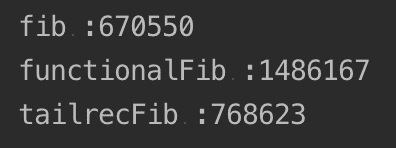
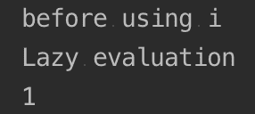
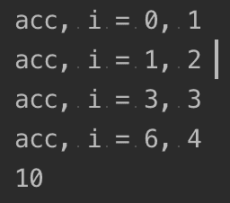
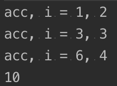

# 第二章：函数式编程入门

函数式编程在过去五年中在软件行业中引起了巨大波澜，每个人都想搭上这趟车。函数式编程的历史要悠久得多，始于 20 世纪 50 年代，**Lisp**被认为是第一种编程语言（或者至少是第一个引入函数式特性的语言），它仍然以**Common Lisp**的形式存在，以及其他方言，如**Scheme**和**Clojure**。

在本章中，我们将涵盖以下主题：

+   什么是函数式编程？

+   基本概念

+   函数式集合

+   实现函数式列表

# 什么是函数式编程？

**函数式编程**是一种范式（一种组织程序的风格）。本质上，重点是使用表达式转换数据（理想情况下，这些表达式不应有副作用）。其名称“函数式”基于数学函数的概念（而不是子程序、方法或过程）。数学函数定义了一组输入和输出之间的关系。每个输入只有一个输出。例如，给定一个函数，*f(x) = X²; f(5)* 总是 *25*。

在编程语言中，为了保证调用带有参数的函数总是返回相同的值，需要避免访问可变状态：

```java
fun f(x: Long) : Long { 
   return x * x // no access to external state
}
```

`f` 函数不访问任何外部状态；因此，调用 *f(5)* 总是返回 *25*：

```java
fun main(args: Array<String>) {
    var i = 0

    fun g(x: Long): Long {
       return x * i // accessing mutable state
    }

    println(g(1)) //0
    i++
    println(g(1)) //1
    i++
    println(g(1)) //2
}
```

另一方面，`g` 函数依赖于可变状态，并且对于相同的输入返回不同的值。

现在，在现实生活中的程序（一个**内容管理系统**（**CMS**）、购物车或聊天程序）中，状态会发生变化。因此，在函数式编程风格中，状态管理必须是明确和谨慎的。在后面的章节中，我们将介绍在函数式编程中管理状态变化的技术。

函数式编程风格将为我们提供以下好处：

+   **代码易于阅读和测试**：不依赖于外部可变状态的功能更容易推理和证明

+   **状态和副作用是精心规划的**：将状态管理限制在我们代码的个体和特定位置，使得维护和重构变得容易

+   **并发性变得更安全且更自然**：没有可变状态意味着并发代码在你的代码周围需要更少或没有锁

# 基本概念

函数式编程由几个定义良好的概念组成。以下是对这些概念的简要介绍，稍后将在下一章中深入探讨每个概念。

# 一等和高级函数

函数式编程最基础的概念是**一等函数**。支持一等函数的编程语言会将函数视为任何其他类型；这样的语言将允许你使用函数作为变量、参数、返回值、泛化类型等。说到参数和返回值，使用或返回其他函数的函数是**高阶函数**。

Kotlin 支持这两个概念。

让我们尝试一个简单的函数（在 Kotlin 的文档中这种函数被称为 lambda）：

```java
val capitalize = { str: String -> str.capitalize() }

fun main(args: Array<String>) {
   println(capitalize("hello world!"))
}
```

`capitalize`lambda 函数的类型是`(String) -> String`；换句话说，`capitalize`将接受`String`并返回另一个`String`——在这种情况下，一个首字母大写的`String`。

作为 lambda 函数，`capitalize`可以用带参数的括号（或者完全没有参数，具体取决于情况）来执行。

但`(String) -> String`类型意味着什么呢？

`(String) -> String`是一个快捷方式（有些人可能称之为语法糖），它是`Function1<String, String>`的简称，`Function1<P1, R>`是在 Kotlin 标准库中定义的一个接口。`Function1<P1, R>`有一个标记为操作符的方法`invoke(P1): R`（我们稍后会介绍操作符）。

Kotlin 的编译器可以在编译时将快捷语法转换为完整的函数对象（实际上，编译器还会应用更多的优化），如下所示：

```java
val capitalize = { str: String -> str.capitalize() }
```

它等同于以下代码：

```java
val capitalize = object : Function1<String, String> {
   override fun invoke(p1: String): String {
      return p1.capitalize()
   }
}
```

正如你所见，`capitalize`值的主体位于`invoke`方法内部。

在 Kotlin 中，lambda 函数也可以用作其他函数的参数。

让我们看看以下示例：

```java
fun transform(str:String, fn: (String) -> String): String {
   return fn(str)
}
```

`transform(String, (String) -> String)`函数接受一个`String`并对其应用一个 lambda 函数。

从所有目的来看，我们可以泛化`transform`：

```java
fun <T> transform(t: T, fn: (T) -> T): T {
   return fn(t)
}
```

使用`transform`非常简单。看看下面的代码片段：

```java
fun main(args: Array<String>) {
    println(transform("kotlin", capitalize))
}
```

我们可以直接传递`capitalize`作为参数，真是太棒了。

调用`transform`函数的方式有很多。让我们再试几个：

```java
fun reverse(str: String): String {
   return str.reversed()
}

fun main(args: Array<String>) {
    println(transform("kotlin", ::reverse))
}
```

`reverse`是一个函数；我们可以使用双冒号（`::`）来传递它的引用，如下所示：

```java
object MyUtils {
   fun doNothing(str: String): String {
      return str
   }
}

fun main(args: Array<String>) {
    println(transform("kotlin", MyUtils::doNothing))
}
```

`doNothing`是一个对象方法，在这种情况下，我们在`MyUtils`对象名称后使用`::`：

```java
class Transformer {
   fun upperCased(str: String): String {
      return str.toUpperCase()
   }

   companion object {
      fun lowerCased(str: String): String {
         return str.toLowerCase()
      }
   }
}

fun main(args: Array<String>) {
    val transformer = Transformer()

    println(transform("kotlin", transformer::upperCased))

    println(transform("kotlin", Transformer.Companion::lowerCased))
}
```

我们也可以传递实例或伴生对象的引用。但最常见的情况可能是直接传递一个 lambda 表达式：

```java
fun main(args: Array<String>) {
    println(transform("kotlin", { str -> str.substring(0..1) }))
}
```

使用`it`隐式参数的简短版本如下：

```java
fun main(args: Array<String>) {
    println(transform("kotlin", { it.substring(0..1) }))
}
```

`it`是一个隐式参数（你不需要显式声明它），它可以用作只有一个参数的 lambda 表达式。

虽然使用`it`在所有情况下都很诱人，但一旦你开始使用连续或嵌套的 lambda，它们可能会很难阅读。要谨慎使用，并且当它清楚类型时（没有打趣的意思）。

如果一个函数将 lambda 作为最后一个参数接收，lambda 可以放在括号之外传递：

```java
fun main(args: Array<String>) {
    println(transform("kotlin") { str -> str.substring(0..1) })
}
```

这个特性为使用 Kotlin 创建**领域特定语言**（**DSL**）打开了可能性。

你知道**Ruby**中的`unless`流程控制语句吗？`unless`是一个在条件为`false`时执行代码块的控制语句；它有点像否定`if`条件，但没有`else`子句。

让我们通过执行以下代码片段来为 Kotlin 创建一个版本：

```java
fun unless(condition: Boolean, block: () -> Unit){
   if (!condition) block()
}

fun main(args: Array<String>) {
    val securityCheck = false // some interesting code here

    unless(securityCheck) {
        println("You can't access this website")
    }
}

```

`unless` 接收一个布尔条件作为参数，并以 lambda `() -> Unit`（无参数和无返回值）的形式阻塞执行。当 `unless` 执行时，它看起来就像 Kotlin 的任何其他控制流结构。

现在，类型别名可以与函数混合使用，以替换简单的接口。以下是一个例子，来自 第一章，*Kotlin – 数据类型、对象和类*：

```java
interface Machine<T> {
   fun process(product: T)
}

fun <T> useMachine(t: T, machine: Machine<T>) {
   machine.process(t)
}

class PrintMachine<T> : Machine<T> {
   override fun process(t: T) {
      println(t)
   }
}

fun main(args: Array<String>) {
    useMachine(5, PrintMachine())

    useMachine(5, object : Machine<Int> {
       override fun process(t: Int) {
          println(t)
       }
    })
}
```

它可以用类型别名替换，并使用所有函数的语法特性：

```java
typealias Machine<T> = (T) -> Unit

fun <T> useMachine(t: T, machine: Machine<T>) {
   machine(t)
}

class PrintMachine<T>: Machine<T> {
   override fun invoke(p1: T) {
      println(p1)
   }
} 

fun main(args: Array<String>) {
    useMachine(5, PrintMachine())

    useMachine(5, ::println)

    useMachine(5) { i ->
        println(i)
    }
}
```

# 纯函数

**纯函数** 没有副作用，也没有内存或 I/O。纯函数有许多属性，包括引用透明性、缓存（记忆化）以及其他（我们将在下一章中介绍这些功能）。

在 Kotlin 中可以编写纯函数，但编译器不会像其他语言那样强制执行。是否创建纯函数以享受其好处取决于你。因为 Kotlin 不强制执行纯函数，所以许多程序员说 Kotlin 不是一个真正的函数式编程工具，也许他们是对的。是的，Kotlin 不强制执行纯函数式编程，这为你提供了极大的灵活性，包括如果你愿意，可以以纯函数式风格编写代码。

# 递归函数

**递归函数** 是调用自身的函数，具有某种停止执行的条件。在 Kotlin 中，递归函数维护一个栈，但可以使用 `tailrec` 修饰符进行优化。

让我们看一个例子，一个 `阶乘` 函数的实现。

首先，让我们看看一个典型的命令式实现，以下代码片段中的循环和状态变化：

```java
fun factorial(n: Long): Long {
   var result = 1L
   for (i in 1..n) {
      result *= i
   }
   return result
}
```

这没有什么特别之处，也不特别优雅。现在，让我们看看一个递归实现，没有循环，也没有状态变化：

```java
fun functionalFactorial(n: Long): Long {
   fun go(n: Long, acc: Long): Long {
      return if (n <= 0) {
         acc
      } else {
         go(n - 1, n * acc)
      }
   }

   return go(n, 1)
} 
```

我们使用一个内部递归函数；`go` 函数在达到条件之前调用自身。正如你所看到的，我们是从最后一个 `n` 值开始的，并在每次递归迭代中减少它。

优化后的实现类似，但带有 `tailrec` 修饰符：

```java
fun tailrecFactorial(n: Long): Long {
   tailrec fun go(n: Long, acc: Long): Long {
      return if (n <= 0) {
         acc
      } else {
         go(n - 1, n * acc)
      }
   }

   return go(n, 1)
}
```

要测试哪个实现更快，我们可以编写一个简陋的分析函数：

```java
fun executionTime(body: () -> Unit): Long {
   val startTime = System.nanoTime()
   body()
   val endTime = System.nanoTime()
   return endTime - startTime
}
```

对于我们的目的，`executionTime` 函数是可行的，但任何严肃的生产代码都应该使用适当的分析工具进行性能分析，例如 **Java Microbenchmark Harness**（**JMH**）：

```java
fun main(args: Array<String>) {
    println("factorial :" + executionTime { factorial(20) })
    println("functionalFactorial :" + executionTime { functionalFactorial(20) })
    println("tailrecFactorial :" + executionTime { tailrecFactorial(20) })
}
```

以下是前面代码的输出：


`tailrec` 优化的版本甚至比正常的命令式版本更快。但 `tailrec` 不是一个魔法咒语，可以使你的代码运行得更快。一般来说，`tailrec` 优化的代码将比未优化的版本运行得更快，但并不总是能打败好的旧命令式代码。

让我们探索一个斐波那契数列的实现，从一个命令式实现开始如下：

```java
fun fib(n: Long): Long {
   return when (n) {
      0L -> 0
      1L -> 1
      else -> {
         var a = 0L
         var b = 1L
         var c = 0L
         for (i in 2..n) {
            c = a + b
            a = b
            b = c
         }
         c
      }
   }
}
```

现在，让我们看看一个函数式递归实现：

```java
fun functionalFib(n: Long): Long {
   fun go(n: Long, prev: Long, cur: Long): Long {
      return if (n == 0L) {
         prev
      } else {
         go(n - 1, cur, prev + cur)
      }
   }

   return go(n, 0, 1)
}
```

现在，让我们检查其对应的 `tailrec` 版本，如下所示：

```java
fun tailrecFib(n: Long): Long {
   tailrec fun go(n: Long, prev: Long, cur: Long): Long {
      return if (n == 0L) {
         prev
      } else {
         go(n - 1, cur, prev + cur)
      }
   }

   return go(n, 0, 1)
}

```

然后，再次，让我们用 `executionTime` 来查看其分析：

```java
fun main(args: Array<String>) {
    println("fib :" + executionTime { fib(93) })
    println("functionalFib :" + executionTime { functionalFib(93) })
    println("tailrecFib :" + executionTime { tailrecFib(93) })
}
```

输出将类似于以下内容：



`tailrec` 实现比递归版本快得多，但不如正常命令式实现快。

# 懒加载

一些函数式语言提供了 `lazy`（非严格）评估模式。Kotlin 默认使用 *贪婪（严格）评估*。

Kotlin 本身不提供对懒加载的原生支持，但作为 Kotlin 标准库的一部分，以及一个名为 **委托属性** 的语言特性（我们将在未来的章节中详细讨论）：

```java
fun main(args: Array<String>) {
    val i by lazy {
        println("Lazy evaluation")
        1
    }

    println("before using i")
    println(i)
}
```

输出将类似于以下截图：



在 `by` 保留字之后，`lazy()` 高阶函数接收一个 `(() -> T)` 初始化 lambda 函数，该函数将在第一次访问 `i` 时执行。

但也可以使用正常的 lambda 函数来处理一些懒加载用例：

```java
fun main(args: Array<String>) {
    val size = listOf(2 + 1, 3 * 2, 1 / 0, 5 - 4).size
}
```

如果我们尝试执行这个表达式，它将抛出一个 `ArithmeticException` 异常，因为我们正在除以零：

```java
fun main(args: Array<String>) {
    val size = listOf({ 2 + 1 }, { 3 * 2 }, { 1 / 0 }, { 5 - 4 }).size
}
```

执行这个没有问题。出问题的代码没有被执行，实际上使其成为一个 `lazy` 评估。

# 功能集合

**函数式集合** 是那些通过高阶函数提供与其元素交互方式的集合。函数式集合具有名为 `filter`、`map` 和 `fold` 等常见操作；这些名称是通过约定（类似于设计模式）定义的，并在多个库和语言中实现。

不要与纯函数式数据结构混淆——这是在纯函数式语言中实现的数据结构。纯函数式数据结构是不可变的，并使用 `lazy` 评估和其他函数式技术。

函数式集合可以是，但不一定是纯函数式数据结构。我们已经讨论了算法的命令式实现可以比函数式实现更快。

Kotlin 随带一个优秀的函数式集合库。让我们看看它：

```java
val numbers: List<Int> = listOf(1, 2, 3, 4)
```

我们的价值 `numbers` 是一个 `List<Int>` 类型的值。现在，让我们按照以下方式打印其成员：

```java
fun main(args: Array<String>) {
    for(i in numbers) {
       println("i = $i")
    }
}
```

到目前为止，一切顺利，但它看起来并不太像函数式。

不必再担心；Kotlin 集合包括许多接收 lambda 来操作其成员的函数。我们可以用 lambda 替换这个循环，如下所示：

```java
fun main(args: Array<String>) {
    numbers.forEach { i -> println("i = $i") }
}
```

现在，让我们在以下代码中转换我们的集合：

```java
val numbers: List<Int> = listOf(1, 2, 3, 4)

fun main(args: Array<String>) {
    val numbersTwice: List<Int> = listOf()

    for (i in numbers) {
       numbersTwice.add(i * 2) //Compilation error: Unresolved reference: add 
    }
}
```

这段代码无法编译；`numberTwice` 没有提供 `add(T)` 方法。`List<T>` 是一个不可变列表；一旦初始化，它就可以被修改。要向列表中添加元素，它必须具有不同的类型——在我们的例子中是 `MutableList<T>`：

```java
val numbers: List<Int> = listOf(1, 2, 3, 4)

fun main(args: Array<String>) {
    val numbersTwice: MutableList<Int> = mutableListOf()

    for (i in numbers) {
        numbersTwice.add(i * 2) //Nice!
    }
}
```

`MutableList<T>` 扩展了 `List<T>`；它添加了修改集合本身的方法，例如 `add(T)`、`remove(T)`、`clear` 以及其他方法。

Kotlin 的所有主要集合类型（`List<T>`, `Set<T>`, 和 `Map<K, V>`）都有可变子类型（`MutableList<T>`, `MutableSet<T>`, 和 `MutableMap<K, V>`）。

但我们可以将这个转换替换为以下代码中的单行表达式：

```java
val numbers: List<Int> = listOf(1, 2, 3, 4)

fun main(args: Array<String>) {
    val numbersTwice: List<Int> = numbers.map { i -> i * 2 }
}
```

`map` 操作允许你转换（技术上是对值进行映射）。这段代码有很多优点，并且更加简洁，现在 `numbersTwice` 的值是一个 `List<Int>` 列表，而不是 `MutableList<T>` 列表。

让我们再举几个例子。我们可以使用循环来计算数字的所有元素之和：

```java
val numbers: List<Int> = listOf(1, 2, 3, 4)

fun main(args: Array<String>) {
    var sum = 0

    for (i in numbers) {
       sum += i
    }

    println(sum)    
}
```

这可以简化为只有一行，使用不可变的 `sum` 值如下：

```java
val numbers: List<Int> = listOf(1, 2, 3, 4)

fun main(args: Array<String>) {
    val sum = numbers.sum()

    println(sum)    
}
```

很好，但不是很吸引人，所以让我们提高难度：

```java
val numbers: List<Int> = listOf(1, 2, 3, 4)

fun main(args: Array<String>) {
    val sum = numbers.fold(0) { acc, i -> acc + i }

    println(sum)
}
```

`fold` 方法遍历一个集合，保持一个累加器值。`fold` 接收一个 `T` 值作为初始值；在第一次迭代中，这个初始值将是累加器，后续迭代将使用 lambda 的返回值作为下一个累加器值：

```java
val numbers: List<Int> = listOf(1, 2, 3, 4)

fun main(args: Array<String>) {
    val sum = numbers.fold(0) { acc, i ->
        println("acc, i = $acc, $i")
        acc + i
    }

    println(sum)
}
```

输出将类似于以下截图：



与 `fold` 类似，`reduce` 遍历一个集合，有一个累加器但没有初始值：

```java
val numbers: List<Int> = listOf(1, 2, 3, 4)

fun main(args: Array<String>) {
    val sum = numbers.reduce { acc, i ->
        println("acc, i = $acc, $i")
        acc + i
    }

    println(sum)
}
```

输出将类似于以下截图：



`fold` 和 `reduce` 有对应的 `foldRight` 和 `reduceRight`，它们从最后一个项目开始迭代到第一个项目。

# 实现一个函数式列表

在前两章学到的所有知识的基础上，我们可以实现一个纯函数式列表：

```java
sealed class FunList<out T> {
   object Nil : FunList<Nothing>()

   data class Cons<out T>(val head: T, val tail: FunList<T>) : FunList<T>()
}
```

`FunList` 类是一个密封类；只有两个可能的子类存在——`Nil`，一个空列表（在其他书中你可以看到它被定义为 `Null` 或 `Empty`）和 `Cons`（一个结构，名称来自 Lisp，它包含两个值）。

`T` 类型被标记为 `out`；这是为了变异性，我们将在未来的章节中介绍变异性。

`Nil` 是一个对象（我们不需要 `Nil` 的不同实例）扩展 `FunList<Nothing>`（记住 `Nothing` 是 Kotlin 类型层次结构的底部）。

`Cons` 值包含两个值——`head`，一个单独的 `T`，和 `tail`，一个 `FunList<T>`；因此，它可以是一个 `Nil` 值或另一个 `Cons`。

让我们创建一个列表实例如下：

```java
import com.packtpub.functionalkotlin.chapter02.FunList.Cons
import com.packtpub.functionalkotlin.chapter02.FunList.Nil

fun main(args: Array<String>) {
    val numbers = Cons(1, Cons(2, Cons(3, Cons(4, Nil))))
}
```

它是函数式的，但不是很易读。我们可以创建一个更好的初始化函数：

```java
import com.packtpub.functionalkotlin.chapter02.FunList.Cons
import com.packtpub.functionalkotlin.chapter02.FunList.Nil

fun intListOf(vararg numbers: Int): FunList<Int> {
   return if (numbers.isEmpty()) {
      Nil
   } else {
      Cons(numbers.first(), intListOf(*numbers.drop(1).toTypedArray().toIntArray()))
   }
}
```

这里有很多新东西。参数 `numbers` 被标记为 `vararg`，这意味着我们可以用尽可能多的参数调用这个函数。从所有目的来看，`numbers` 是一个 `IntArray` 值（一种特殊的数组类型）。如果 `numbers` 为空，我们可以返回 `Nil`。如果不为空，我们可以提取第一个元素作为我们的 `head` 值，并递归调用 `intListOf` 来获取 `tail` 值。为了提取 `tail` 值，我们使用 `drop` 方法并将结果转换为 `IntArray` 值。但我们不能直接将任何数组作为 `vararg` 传递；因此，我们必须使用展开（`*`）运算符来逐个传递数组的每个成员。

现在，我们可以创建我们的 `FunList<Int>` 值：

```java
fun main(args: Array<String>) {
    val numbers = intListOf(1, 2, 3, 4)    
}
```

让我们按照以下方式实现 `forEach`：

```java
sealed class FunList<out T> {
   object Nil : FunList<Nothing>()

   data class Cons<out T>(val head: T, val tail: FunList<T>) : FunList<T>()

   fun forEach(f: (T) -> Unit) {
      tailrec fun go(list: FunList<T>, f: (T) -> Unit) {
         when (list) {
            is Cons -> {
               f(list.head)
               go(list.tail, f)
            }
            is Nil -> Unit//Do nothing
         }
      }

      go(this, f)
   }

}
```

`forEach` 的实现类似于我们在递归部分中的阶乘和斐波那契函数的例子，包括 `tailrec`。

从技术上来说，`FunList` 是一个 **代数数据类型**（**ADT**）。`FunList` 可以是 `Nil` 或 `Cons`，除此之外没有其他可能。Kotlin 的编译器可以使用这些信息来检查当 `FunList` 类型用作 `when` 控制结构中的参数时，两个值是否都被评估：

```java
fun main(args: Array<String>) {
    val numbers = intListOf(1, 2, 3, 4)

    numbers.forEach { i -> println("i = $i") }
}
```

实现 `fold` 将类似于以下代码：

```java
sealed class FunList<out T> {

  /*Previous code here*/

   fun <R> fold(init: R, f: (R, T) -> R): R {
      tailrec fun go(list: FunList<T>, init: R, f: (R, T) -> R): R = when (list) {
         is Cons -> go(list.tail, f(init, list.head), f)
         is Nil -> init
      }

      return go(this, init, f)
   }
}

```

你注意到这些函数实现起来非常简单吗？让我们看看下面的代码：

```java
fun main(args: Array<String>) {
    val numbers = intListOf(1, 2, 3, 4)

    val sum = numbers.fold(0) { acc, i -> acc + i}
}
```

那么，Kotlin 的列表和我们的函数式列表之间来一场小比赛如何？

```java
fun main(args: Array<String>) {
    val funList = intListOf(1, 2, 3, 4)
    val list = listOf(1, 2, 3, 4)

    println("fold on funList : ${executionTime { funList.fold(0) { acc, i -> acc + i } }}")
    println("fold on list : ${executionTime { list.fold(0) { acc, i -> acc + i } }}")
}
```

输出将类似于以下截图：


哎呀！我们的实现速度慢了 10 倍。别担心，Kotlin 的实现是一个高度优化的命令式解决方案，而我们的只是为了学习和娱乐（当然，是字面意义上的娱乐）。

那么 `map` 呢？要在函数式编程中实现 `map`，我们需要先实现其他函数。让我们从 `reverse` 开始。

`reverse` 是一个返回反转顺序列表的函数：

```java
sealed class FunList<out T> {

    /*previous code*/

    fun reverse(): FunList<T> = fold(Nil as FunList<T>) { acc, i -> Cons(i, acc) }
}

```

我们可以在每次迭代中重用 `fold` 并构建一个新的 `Cons` 值，使用 `acc` 值作为 `tail`。这是函数式编程的一个大优点——重用现有函数。

现在，我们可以实现 `foldRight`：

```java
sealed class FunList<out T> {

    /*previous code*/

  fun <R> foldRight(init: R, f: (R, T) -> R): R {
   return this.reverse().fold(init, f)
  }
}
```

再次强调，我们正在重用现有函数。现在是时候实现我们的 `map` 函数了。在这个阶段，我们重用现有函数并不令人惊讶：

```java
sealed class FunList<out T> {

 /*previous code*

 fun <R> map(f:(T) -> R): FunList<R> {
   return foldRight(Nil as FunList<R>){ tail, head -> Cons(f(head), tail) }
 }
}
```

`foldRight` 是我们所需要的全部。正如你所见，我们可以使用函数和其他基本概念作为构建块来实现一个完整的列表。这就是函数式编程的全部内容。

# 概述

在本章中，我们介绍了函数式编程的基础，包括高阶函数、纯函数、递归函数和惰性求值。我们还介绍了函数式集合，并使用函数式编程风格实现了一个函数式集合。

在下一章中，我们将介绍函数式编程的基础——不可变性。
