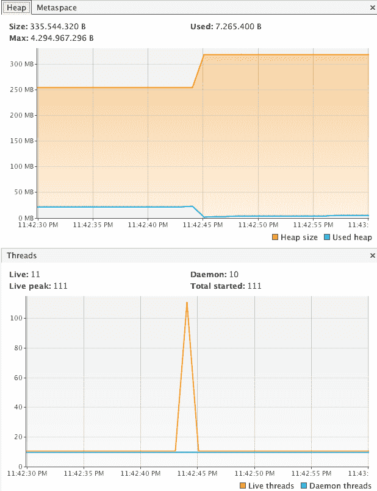
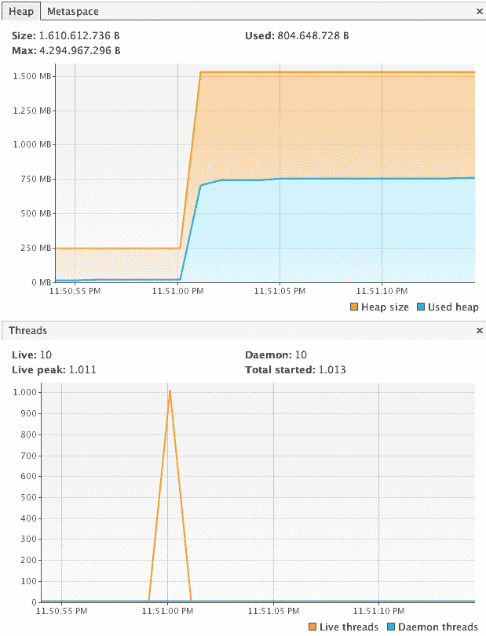
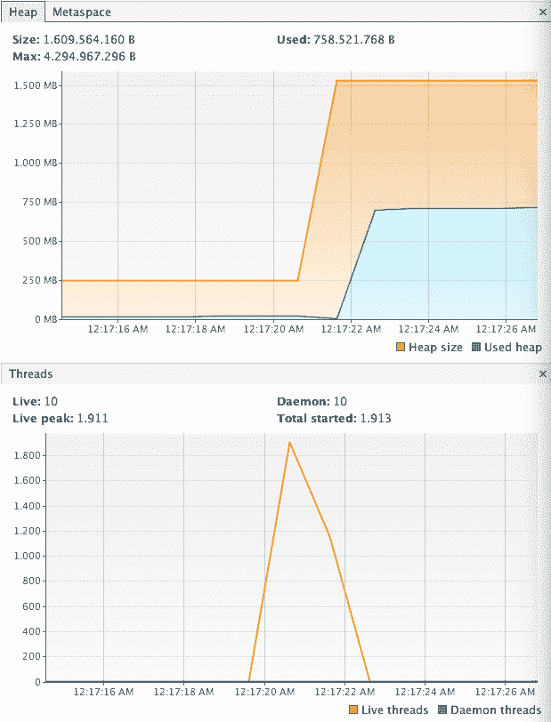
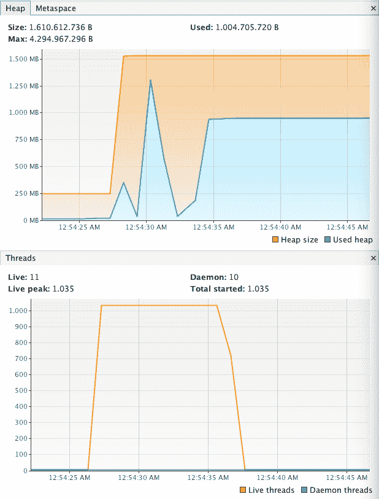
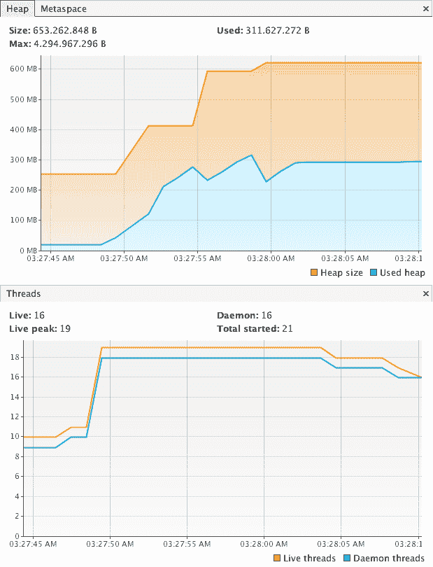

# 第七章：使用协程进行异步编程

今天的软件开发格局使得异步处理成为最重要的主题之一。处理器和核心数量的不断增长以及对外部服务的巨大消耗（近年来随着微服务架构的采用而增长）是我们应该关注并努力采用良好异步方法的因素之一。

Kotlin 对协程的实现是构建异步应用程序的优秀工具。

在本章中，我们将涵盖以下主题：

+   协程

+   替代方法

+   异步处理

+   通道和演员

# 协程简介

让我们从没有协程的简单例子开始：

```java
import kotlin.concurrent.thread

fun main(args: Array<String>) {
   thread {
      Thread.sleep(1000)
      println("World!")
   }
   print("Hello ")
   Thread.sleep(2000)
}
```

`thread` 函数在不同的线程中执行一段代码。在代码块内部，我们使用 `Thread.sleep` 模拟一个昂贵的 I/O 计算（例如通过 HTTP 从微服务访问数据）。`Thread.sleep` 将阻塞当前线程，直到传递的参数指定的毫秒数。在这个例子中，我们不等待计算完成，而是继续做其他事情；当其他计算正在执行时，我们打印另一条消息，`"Hello"`。最后，我们等待两秒钟，直到计算完成。

这段代码并不美观，我们可以做得更好：

```java
fun main(args: Array<String>) {
   val computation = thread {
      Thread.sleep(1000)
      println("World!")
   }
   print("Hello ")
   computation.join()
}
```

在这个版本中，我们有一个名为 `computation` 的线程引用；在最后，我们等待 `join()` 方法完成。这比仅仅等待固定的时间更聪明，因为现实生活中的计算可能具有不同的执行时间。

# 理解 JVM 线程

线程是 JVM（以及其他平台）上异步并发应用程序的构建块。大多数情况下，JVM 线程由硬件线程（如处理器内部的内核）支持。硬件线程可以支持多个软件线程（JVM 线程是一种软件线程），但在任何给定时间只能执行一个软件线程。

操作系统（或 JVM）决定在每个硬件线程上执行哪个软件线程，并在活动线程之间快速切换，从而给人一种似乎有多个软件线程同时执行的感觉，但实际上活跃的软件线程数量与硬件线程数量相同。但是，在大多数情况下，认为所有软件线程都在同时执行是有用的。

JVM 中的线程非常快且响应迅速，但它们也有代价。每个 `Thread` 在创建、销毁（当垃圾回收时）和上下文切换（当线程成为执行线程或停止执行时存储和恢复线程状态的过程）时都会消耗 CPU 时间和内存。由于这种成本相对较高，JVM 应用程序不能有大量的线程。

在典型的开发机器上，一个 JVM 应用程序可以轻松地处理 100 个线程：

```java
fun main(args: Array<String>) {
   val threads = List(100){
      thread {
         Thread.sleep(1000)
         print('.')
      }
   }
   threads.forEach(Thread::join)
}
```

如果您使用任何外部应用程序来监控 JVM 应用程序，例如 VisualVM 或 JConsole（以及其他），您将看到如下图形：



我们可以将线程数增加到 1,000，如下面的截图所示：



内存容量正在以较快的速度增长，达到 1.5 GB 以上。

我们能否将线程数增加到 10,000？请看以下截图：


答案是明确的否定；当应用程序因`OutOfMemoryError`而死亡时，创建了大约 2,020 个线程（此应用程序使用默认设置运行；这些设置可以在启动时更改）。

让我们尝试 1,900，这是一个安全的执行量的合理估计：



是的，我们可以运行 1,900 个并发线程。

在现代 JVM 应用程序中，创建和销毁线程被视为一种不良做法；相反，我们使用`Executor`，这是一个抽象，允许我们管理和重用线程，从而降低创建和销毁的成本：

```java
import java.util.concurrent.Executors
import java.util.concurrent.TimeUnit

fun main(args: Array<String>){
   val executor = Executors.newFixedThreadPool(1024)
   repeat(10000){
      executor.submit {
         Thread.sleep(1000)
         print('.')
      }
   }
   executor.shutdown() 
}
```

我们创建了一个`executor`值，其内部有一个最多 1,024 个线程的线程池。然后，我们提交 10,000 个任务；最后，我们关闭`Executor`。当我们关闭`Executor`时，它不能接受新的任务并执行所有挂起的任务，如下所示：



有许多选项可以微调和玩耍，例如`Executor`的线程数和池的类型或其实际实现。

关于 JVM 线程的理论远比本书所能涵盖的多。如果您想阅读和学习更多关于线程和并发的知识，我们推荐经典书籍《Java 并发实践（2006）》由 Dough Lea、David Holmes、Joseph Bower、Joshua Block、Tim Peierls 和 Brian Goetz 所著，由 Addison-Wesley Professional 出版。我们还推荐 Venkat Subramanian 所著的《Programming Concurrency on the JVM（2011）》由 Pragmatic Bookshelf 出版，以及 Douglas Schmidt 所著的《Java Concurrency LiveLessons（2015）》视频，由 Addison-Wesley Professional 提供。最后但同样重要的是，我们建议 Javier Fernández Gonzáles 所著的《Java Concurrency》系列书籍和视频，由 Packt 出版。

# 嗨，协程世界！

现在，让我们用协程重写我们的`Hello World`应用程序。

但是，嘿！什么是协程？基本上，协程是一个非常轻量级的线程，它运行一段代码，具有类似的生命周期，但可以带有返回值或异常完成。技术上讲，协程是可挂起计算的一个实例，这种计算可能会挂起。协程不绑定到特定的线程，可以在一个`Thread`中挂起并在另一个中恢复执行：

```java
import kotlinx.coroutines.experimental.delay
import kotlinx.coroutines.experimental.launch
import kotlinx.coroutines.experimental.runBlocking

fun main(args: Array<String>) = runBlocking {
    launch {
        delay(1000)
        println("World")
    }
    print("Hello ")
    delay(2000)
}
```

这里有一些需要讨论的内容：

+   `runBlocking`：此函数创建一个协程并阻塞当前`Thread`，直到协程完成，返回其结果值（在这种情况下为`Unit`）。

+   `launch`: 这个函数创建一个新的协程而不阻塞当前 `Thread`，并返回 `Job`（在此处忽略）。

+   `delay`: 这个函数是一个挂起函数（稍后会有更多介绍），它延迟当前协程的执行而不阻塞当前线程。

+   `suspend`: 一个挂起函数是一个可能挂起协程执行而不阻塞当前 `Thread` 的函数；因此，挂起函数必须在协程内部调用——它不能从普通代码中调用。该函数必须带有 `suspend` 修饰符。因此，`delay` 可以在 `runBlocking` 和 `launch` 中调用，这两个函数（以及其他函数）将挂起 lambda 作为最后一个参数——挂起 lambda 是一个带有 `suspend` 修饰符的 lambda。

让我们在继续之前总结一下我们现在所知道的内容，以及一些其他概念：

| **概念** | **描述** |
| --- | --- |
| **协程** | 一个非常轻的线程，可以返回一个值，并且可以挂起和恢复。 |
| **挂起函数** | 一个带有 `suspend` 修饰符的函数。它可以挂起协程而不阻塞线程。挂起函数必须在协程内部调用，例如 `delay`。 |
| **挂起 lambda** | 一个带有 `suspend` 修饰符的 lambda 函数。它可以挂起协程而不阻塞线程。 |
| **协程构建器** | 一个接受一个挂起 lambda 的函数，创建一个协程，可能返回一个结果，例如 `runBlocking`。 |
| **挂起点** | 调用挂起函数的点。 |
| **延续** | 在挂起点处挂起的协程的状态，它代表了挂起点之后其执行剩余部分的状态。 |

让我们回到正事上来。

正如我们之前讨论的，计算可能具有不同的执行时间。因此，`delay` 在我们的 `Hello World` 示例中并不理想：

```java
fun main(args: Array<String>) = runBlocking {
   val job = launch {
      delay(1000)
      println("World")
   }
   print("Hello ")
   job.join()
}
```

就像我们的线程示例一样，我们获取由 `launch` 创建的作业的引用，并使用挂起函数 `join` 在最后挂起它。

到目前为止，一切顺利。但协程真的这么轻吗？我们能拥有 10,000 个协程吗？

让我们通过执行以下代码片段来试一试：

```java
fun main(args: Array<String>) = runBlocking {
      val jobs = List(10000) {
         launch {
            delay(1000)
            print('.')
         }
      }
      jobs.forEach { job -> job.join() }
   }
}
```

哦，确实如此！它工作了：


它们比 `Executor` 解决方案快得多，内存少得多，线程少得多（仅有大约七个线程），而且最重要的是，它们非常容易阅读。

让我们用一百万个协程来试试：



不到 2,000 个线程需要超过 1.5 GB 的内存。一百万个协程需要不到 700 MB 的内存——我的论点就此结束。结论是协程非常非常轻。

# 在现实生活中使用协程

微基准测试非常有趣，它们让我们了解了 Kotlin 协程的强大之处，但它们并不代表真实场景。

让我们介绍我们的真实场景：

```java
enum class Gender {
   MALE, FEMALE;

   companion object {
      fun valueOfIgnoreCase(name: String): Gender = valueOf(name.toUpperCase())
   }
}

typealias UserId = Int

data class User(val id: UserId, val firstName: String, val lastName: String, val gender: Gender)

data class Fact(val id: Int, val value: String, val user: User? = null)

interface UserService {
   fun getFact(id: UserId): Fact
}
```

我们的 `UserService` 接口只有一个方法——`getFact` 将返回有关我们用户的 Chuck Norris 风格的事实，该用户由用户 ID 标识。

实现应该首先在本地数据库中检查用户；如果用户不在数据库中，它应该从**RandomUser API**服务（[`randomuser.me/documentation`](https://randomuser.me/documentation)）获取它，然后存储以供将来使用。一旦服务有了用户，它应该再次在数据库中检查与该用户相关的信息；如果信息不在数据库中，它应该从**Internet Chuck Norris Database API**服务（[`www.icndb.com/api/`](http://www.icndb.com/api/)）获取，并将其存储在数据库中。一旦服务有了信息，就可以返回。服务必须尝试减少外部调用（数据库、API 服务）的数量，而不使用缓存。

现在，让我们介绍其他接口，HTTP 客户端——`UserClient`和`FactClient`：

```java
interface UserClient {
   fun getUser(id: UserId): User
}

interface FactClient {
   fun getFact(user: User): Fact
}
```

我们将使用`http4k`（[`www.http4k.org/`](https://www.http4k.org/)）实现客户端的 HTTP 通信，并使用 Kotson（[`github.com/SalomonBrys/Kotson`](https://github.com/SalomonBrys/Kotson)）进行 JSON 处理。这两个库都是为 Kotlin 设计的，但任何其他库都应该工作得很好：

```java
import com.github.salomonbrys.kotson.*
import com.google.gson.GsonBuilder
import org.http4k.client.ApacheClient

abstract class WebClient {
   protected val apacheClient = ApacheClient()

   protected val gson = GsonBuilder()
         .registerTypeAdapter<User> {
            deserialize { des ->
               val json = des.json
               User(json["info"]["seed"].int,
                     json["results"][0]["name"]["first"].string.capitalize(),
                     json["results"][0]["name"]["last"].string.capitalize(),
                     Gender.valueOfIgnoreCase(json["results"][0]["gender"].string))

            }
         }
         .registerTypeAdapter<Fact> {
            deserialize { des ->
               val json = des.json
               Fact(json["value"]["id"].int,
                     json["value"]["joke"].string)
            }
         }.create()!!
}
```

两个客户端都将扩展一个包含`http4k ApacheClient`和用 Kotson DSL 配置的`Gson`值的公共父类：

```java
import org.http4k.core.Method
import org.http4k.core.Request

class Http4KUserClient : WebClient(), UserClient {
   override fun getUser(id: UserId): User {
      return gson.fromJson(apacheClient(Request(Method.GET, "https://randomuser.me/api")
            .query("seed", id.toString()))
            .bodyString())
   }
}
```

`Http4KUserClient`非常简单，这两个库都很容易使用，我们将大量代码移动到父类：

```java
class Http4KFactClient : WebClient(), FactClient {
   override fun getFact(user: User): Fact {
      return gson.fromJson<Fact>(apacheClient(Request(Method.GET, "http://api.icndb.com/jokes/random")
            .query("firstName", user.firstName)
            .query("lastName", user.lastName))
            .bodyString())
            .copy(user = user)
   }
}
```

`Http4KFactClient`使用`copy`方法在`Fact`实例中设置用户值。

这些类实现得非常好，但为了测试我们算法的实际性能，我们将模拟这些接口：

```java
class MockUserClient : UserClient {
   override fun getUser(id: UserId): User {
      println("MockUserClient.getUser")
      Thread.sleep(500)
      return User(id, "Foo", "Bar", Gender.FEMALE)
   }
}

class MockFactClient : FactClient {
   override fun getFact(user: User): Fact {
      println("MockFactClient.getFact")
      Thread.sleep(500)
      return Fact(Random().nextInt(), "FACT ${user.firstName}, ${user.lastName}", user)
   }
}
```

看一下以下数据库存储库，`UserRepository`和`FactRepository`：

```java
interface UserRepository {
   fun getUserById(id: UserId): User?
   fun insertUser(user: User)
}

interface FactRepository {
   fun getFactByUserId(id: UserId): Fact?
   fun insertFact(fact: Fact)
}
```

对于我们的存储库，我们将使用 Spring 5 的`JdbcTemplate`。Spring 5 提供了对 Kotlin 的支持，包括用于简化 Kotlin 使用的扩展函数（你可以在任何应用程序中使用`JdbcTemplate`，它不需要是 Spring 应用程序）：

```java
import org.springframework.dao.EmptyResultDataAccessException
import org.springframework.jdbc.core.JdbcTemplate

abstract class JdbcRepository(protected val template: JdbcTemplate) {
   protected fun <T> toNullable(block: () -> T): T? {
      return try {
         block()
      } catch (_: EmptyResultDataAccessException) {
         null
      }
   }
}
```

与客户端一样，两个存储库也将有一个父类——在这种情况下，有一个将`EmptyResultDataAccessException`（Spring 表示不存在的记录的方式）转换为可空——符合 Kotlin 语法的函数；

两个实现都很直接，如下所示：

```java
import org.springframework.jdbc.core.queryForObject

class JdbcUserRepository(template: JdbcTemplate) : JdbcRepository(template), UserRepository {
   override fun getUserById(id: UserId): User? {
      return toNullable {
         template.queryForObject("select * from USERS where id = ?", id) { resultSet, _ ->
            with(resultSet) {
               User(getInt("ID"),
                     getString("FIRST_NAME"),
                     getString("LAST_NAME"),
                     Gender.valueOfIgnoreCase(getString("GENDER")))
            }
         }
      }
   }

   override fun insertUser(user: User) {
      template.update("INSERT INTO USERS VALUES (?,?,?,?)",
            user.id,
            user.firstName,
            user.lastName,
            user.gender.name)
   }
}

class JdbcFactRepository(template: JdbcTemplate) : JdbcRepository(template), FactRepository {
   override fun getFactByUserId(id: Int): Fact? {
      return toNullable {
         template.queryForObject("select * from USERS as U inner join FACTS as F on U.ID = F.USER where U.ID = ?", id) { resultSet, _ ->
            with(resultSet) {
               Fact(getInt(5),
                     getString(6),
                     User(getInt(1),
                           getString(2),
                           getString(3),
                           Gender.valueOfIgnoreCase(getString(4))))
            }
         }
      }
   }

   override fun insertFact(fact: Fact) {
      template.update("INSERT INTO FACTS VALUES (?,?,?)", fact.id, fact.value, fact.user?.id)
   }
}
```

对于我们的数据库，我们使用的是 H2 内存数据库，但任何数据库都可以工作（你可以使这个应用程序与一些不同的持久化机制一起工作，例如 NoSQL 数据库或任何缓存）：

```java
fun initJdbcTemplate(): JdbcTemplate {
   return JdbcTemplate(JdbcDataSource()
         .apply {
            setUrl("jdbc:h2:mem:facts_app;DB_CLOSE_DELAY=-1;DB_CLOSE_ON_EXIT=false")
         })
         .apply {
            execute("CREATE TABLE USERS (ID INT AUTO_INCREMENT PRIMARY KEY, FIRST_NAME VARCHAR(64) NOT NULL, LAST_NAME VARCHAR(64) NOT NULL, GENDER VARCHAR(8) NOT NULL);")
            execute("CREATE TABLE FACTS (ID INT AUTO_INCREMENT PRIMARY KEY, VALUE_ TEXT NOT NULL, USER INT NOT NULL,  FOREIGN KEY (USER) REFERENCES USERS(ID) ON DELETE RESTRICT)")
         }
}
```

函数`initJdbcTemplate`使用 H2 `DataSource`创建`JdbcTemplate`，一旦准备就绪，它就在`apply`扩展函数内部创建表。`apply`扩展函数用于配置属性和调用初始化代码，并返回相同的值：

```java
public inline fun <T> T.apply(block: T.() -> Unit): T {
    block()
    return this
}
```

与客户端一样，为了测试，我们将使用模拟：

```java
class MockUserRepository : UserRepository {
   private val users = hashMapOf<UserId, User>()

   override fun getUserById(id: UserId): User? {
      println("MockUserRepository.getUserById")
      Thread.sleep(200)
      return users[id]
   }

   override fun insertUser(user: User) {
      println("MockUserRepository.insertUser")
      Thread.sleep(200)
      users[user.id] = user
   }
}

class MockFactRepository : FactRepository {

   private val facts = hashMapOf<UserId, Fact>()

   override fun getFactByUserId(id: UserId): Fact? {
      println("MockFactRepository.getFactByUserId")
      Thread.sleep(200)
      return facts[id]
   }

   override fun insertFact(fact: Fact) {
      println("MockFactRepository.insertFact")
      Thread.sleep(200)
      facts[fact.user?.id ?: 0] = fact
   }

}
```

使用这些模拟，我们的最坏情况场景大约是 1,600 毫秒：

+   `UserRepository.getUserById = 200ms ~`

+   `UserClient.getUser = 500ms ~`

+   `UserRepository = 200ms ~`

+   `FactClient.getFact = 500ms ~`

+   `FactRepository.insertRepository = 200ms ~`

现在，我们将使用不同的异步风格实现`UserService`，包括一个同步实现，这是我们的基础。

# 同步实现

同步代码易于编写，可预测，且易于测试，但在某些情况下，它并没有以最佳方式使用系统资源：

```java
class SynchronousUserService(private val userClient: UserClient,
                      private val factClient: FactClient,
                      private val userRepository: UserRepository,
                      private val factRepository: FactRepository) : UserService {

   override fun getFact(id: UserId): Fact {
      val user = userRepository.getUserById(id)
      return if (user == null) {
         val userFromService = userClient.getUser(id)
         userRepository.insertUser(userFromService)
         getFact(userFromService)
      } else {
         factRepository.getFactByUserId(id) ?: getFact(user)
      }
   }

   private fun getFact(user: User): Fact {
      val fact = factClient.getFact(user)
      factRepository.insertFact(fact)
      return fact
   }
}
```

这里没有什么花哨的，只是你正常的、老套的代码：

```java
fun main(args: Array<String>) {

   fun execute(userService: UserService, id: Int) {
         val (fact, time) = inTime {
            userService.getFact(id)
         }
         println("fact = $fact")
         println("time = $time ms.")
      }

   val userClient = MockUserClient()
   val factClient = MockFactClient()
   val userRepository = MockUserRepository()
   val factRepository = MockFactRepository()

   val userService = SynchronousUserService(userClient,
         factClient,
         userRepository,
         factRepository)

   execute(userService, 1)
   execute(userService, 2)
   execute(userService, 1)
   execute(userService, 2)
   execute(userService, 3)
   execute(userService, 4)
   execute(userService, 5)
   execute(userService, 10)
   execute(userService, 100)   

}
```

我们执行`UserService.getFact`方法 10 次以预热 JVM（JVM 优化使得应用程序在一段时间后运行得更快）。不用说，执行时间是 1,600 毫秒，这里没有惊喜。

# 回调

异步代码的一种流行风格是在单独的线程中执行代码，当上述线程完成其执行时调用`callback`函数。回调风格的一个缺点是我们的异步函数现在需要一个额外的参数。在 Kotlin 的 lambda 支持下，回调风格在 Kotlin 中很容易编写。

对于我们的回调实现，我们需要为我们的客户端和仓库提供适配器：

```java
import kotlin.concurrent.thread

class CallbackUserClient(private val client: UserClient) {
   fun getUser(id: Int, callback: (User) -> Unit) {
      thread {
         callback(client.getUser(id))
      }
   }
}

class CallbackFactClient(private val client: FactClient) {
   fun get(user: User, callback: (Fact) -> Unit) {
      thread {
         callback(client.getFact(user))
      }
   }
}

class CallbackUserRepository(private val userRepository: UserRepository) {
   fun getUserById(id: UserId, callback: (User?) -> Unit) {
      thread {
         callback(userRepository.getUserById(id))
      }
   }

   fun insertUser(user: User, callback: () -> Unit) {
      thread {
         userRepository.insertUser(user)
         callback()
      }

   }
}

class CallbackFactRepository(private val factRepository: FactRepository) {
   fun getFactByUserId(id: Int, callback: (Fact?) -> Unit) {
      thread {
         callback(factRepository.getFactByUserId(id))
      }
   }

   fun insertFact(fact: Fact, callback: () -> Unit) {
      thread {
         factRepository.insertFact(fact)
         callback()
      }
   }
}
```

这些适配器在单独的线程中执行我们的代码，并在完成后调用回调，lambda：

```java
class CallbackUserService(private val userClient: CallbackUserClient,
                    private val factClient: CallbackFactClient,
                    private val userRepository: CallbackUserRepository,
                    private val factRepository: CallbackFactRepository) : UserService {

   override fun getFact(id: UserId): Fact {
      var aux: Fact? = null
      userRepository.getUserById(id) { user ->
         if (user == null) {
            userClient.getUser(id) { userFromClient ->
               userRepository.insertUser(userFromClient) {}
               factClient.get(userFromClient) { fact ->
                  factRepository.insertFact(fact) {}
                  aux = fact
               }

            }
         } else {
            factRepository.getFactByUserId(id) { fact ->
               if (fact == null) {
                  factClient.get(user) { factFromClient ->
                     factRepository.insertFact(factFromClient) {}
                     aux = factFromClient
                  }
               } else {
                  aux = fact
               }
            }
         }
      }
      while (aux == null) {
         Thread.sleep(2)
      }
      return aux!!
   }
}
```

回调风格往往非常晦涩难懂；当多个回调嵌套时，情况更糟（在社区中亲切地称为回调地狱）。结尾的`while`循环中使用`Thread.sleep`看起来非常笨拙。它的执行速度也非常快，耗时 1,200 毫秒，但创建了大量的线程，内存消耗与之相匹配。

每个函数调用创建一个线程的回调实现将很快在生产场景中消耗掉应用程序的所有资源；因此，它应该基于某种`Executor`实现或类似的东西。

# Java 未来

由于回调风格难以维护，近年来出现了其他风格。其中一种风格是未来。**未来**是指可能在将来完成的计算。当我们调用`Future.get`方法时，它将获取其结果，但我们也会阻塞线程：

```java
import java.util.concurrent.ExecutorService
import java.util.concurrent.Executors

class FutureUserService(private val userClient: UserClient,
                  private val factClient: FactClient,
                  private val userRepository: UserRepository,
                  private val factRepository: FactRepository) : UserService {
   override fun getFact(id: UserId): Fact {

      val executor = Executors.newFixedThreadPool(2)

      val user = executor.submit<User?> { userRepository.getUserById(id) }.get()
      return if (user == null) {
         val userFromService = executor.submit<User> { userClient.getUser(id) }.get()
         executor.submit { userRepository.insertUser(userFromService) }
         getFact(userFromService, executor)
      } else {
         executor.submit<Fact> {
            factRepository.getFactByUserId(id) ?: getFact(user, executor)
         }.get()
      }.also {
         executor.shutdown()
      }
   }

   private fun getFact(user: User, executor: ExecutorService): Fact {
      val fact = executor.submit<Fact> { factClient.getFact(user) }.get()
      executor.submit { factRepository.insertFact(fact) }
      return fact
   }
}
```

使用未来的实现与我们的同步实现非常相似，但到处都是那些奇怪的`submit`和`get`函数。我们还有一个需要关注的`Executor`。总时间大约是 1,200 毫秒，创建了大量的线程，比回调示例中的更多。一个可能的选项是每个实例或全局地有一个`Executor`，但在这种情况下，我们还需要有某种方式来管理其生命周期。

# Kovenant 中的承诺

编写异步代码的另一种选择是使用承诺。**承诺**与未来类似（在许多框架中，未来和承诺是同义的），因为它代表了一个可能在将来完成的计算。我们有一个阻塞方法来获取其结果，但我们也可以以回调风格对其结果做出反应。

**Kovenant** ([`kovenant.komponents.nl/`](http://kovenant.komponents.nl/)) 是 Kotlin 中对承诺的实现：

```java
import nl.komponents.kovenant.Promise
import nl.komponents.kovenant.task
import nl.komponents.kovenant.then

class PromiseUserService(private val userClient: UserClient,
                   private val factClient: FactClient,
                   private val userRepository: UserRepository,
                   private val factRepository: FactRepository) : UserService {

   override fun getFact(id: UserId): Fact {

      return (task {
         userRepository.getUserById(id)
      } then { user ->
         if (user == null) {
            task {
               userClient.getUser(id)
            } success  { userFromService ->
               userRepository.insertUser(userFromService)
            } then { userFromService ->
               getFact(userFromService).get()
            }
         } else {
            task { factRepository.getFactByUserId(id) ?: getFact(user).get() }
         }
      }).get().get()
   }

   private fun getFact(user: User): Promise<Fact, Exception> = task {
      factClient.getFact(user)
   } success  { fact ->
      factRepository.insertFact(fact)
   }
}
```

函数 `task` 创建 `Promise<T, Exception>`（在我们之前的其他实现中未涉及）。我们可以以几种方式与 `Promise<T, Exception>` 交互：

+   `get(): T`：这会阻塞当前线程并返回 promise 的结果。

+   `then(bind: (T) -> R): Promise<R, Exception>`：这与函数式集合上的 `map` 类似；它返回一个具有新类型的新 `Promise` 值。

+   `success(callback: (T) -> Unit): Promise<T, Exception>`：这是在 `Promise` 执行成功时的回调。它对于副作用很有用。

+   `fail(callback: (Exception) -> Unit): Promise<T, Exception>`：这是在失败时的回调，类似于 `catch` 块。

+   `always(callback: () -> Unit): Promise<T, Exception>`：这总是执行，就像 `finally` 块一样。

代码一开始看起来很难理解，但一旦习惯了 promise 习惯用法，阅读起来就很容易。此外，请注意，promise 是一个未来，因此你可以编写类似于我们未来示例的代码，但不需要与 `Executors` 打扰。Java 8 包含一种名为 `CompletableFuture<T>` 的新类型未来，它可以被视为一个 promise。

首次执行（Kovenant 初始化阶段）的执行时间约为 1,350 毫秒，然后稳定在 1,200 毫秒左右。在默认配置下，Kovenant 尽可能使用尽可能多的线程，导致内存使用量很高，但 Kovenant 可以微调以使用更少的线程。

# 协程

现在，让我们用协程重新整理我们的示例：

```java
import kotlinx.coroutines.experimental.Deferred
import kotlinx.coroutines.experimental.async
import kotlinx.coroutines.experimental.launch
import kotlinx.coroutines.experimental.runBlocking

class CoroutineUserService(private val userClient: UserClient,
                     private val factClient: FactClient,
                     private val userRepository: UserRepository,
                     private val factRepository: FactRepository) : UserService {
   override fun getFact(id: UserId): Fact = runBlocking {
      val user = async { userRepository.getUserById(id) }.await()
      if (user == null) {
         val userFromService = async { userClient.getUser(id) }.await()
         launch { userRepository.insertUser(userFromService) }
         getFact(userFromService)
      } else {
         async { factRepository.getFactByUserId(id) ?: getFact(user) }.await()
      }
   }

   private suspend fun getFact(user: User):Fact {
      val fact: Deferred<Fact> = async { factClient.getFact(user) }
      launch { factRepository.insertFact(fact.await()) }
      return fact.await()
   }
}
```

我们代码的简洁性比我们的 `Future` 示例更接近，几乎接近我们的同步代码。我们在上一节中介绍了 `runBlocking` 和 `launch`，但在这里引入了一个新的协程构建器，`async`。

`async` 协程构建器接收一段代码块并异步执行它，返回 `Deferred<T>`。`Deferred` 是一个带有 `await` 方法的 `Future`，它会在协程完成前阻塞协程但不会阻塞线程；`Deferred` 还从 `Job` 继承，因此继承了所有它的方法，例如 `join`。

协程代码感觉自然，当我们使用异步代码时又很明确，但由于资源消耗低，我们可以在代码中使用尽可能多的协程；例如，`CoroutineUserService` 比其他任何实现使用的线程和内存都少一半。

现在我们有了所有实现，我们可以比较代码复杂度和资源消耗：

|  | **代码复杂度** | **资源消耗** |
| --- | --- | --- |
| **同步** | 代码复杂度非常低。 | 资源消耗非常低，但性能较慢。 |
| **回调** | 需要非常高的适配器；预期会有重复；嵌套回调难以阅读；并且有各种技巧。 | 资源消耗很高。使用共享 `Executor` 可以提高效率，但会增加代码复杂度。 |
| **Futures** | 代码复杂度中等。`Executors` 和 `get()` 很吵，但仍然可读。 | 资源消耗高，但可以通过不同的 `Executor` 实现和共享执行器进行微调，但这会增加代码复杂度。 |
| **承诺** | 使用承诺风格（`then`、`success`）时，代码复杂度中等。使用 futures 风格（`get`），它可以像协程一样流畅，而不会影响性能。 | 资源消耗非常高，具有顶级性能，但可以通过不更改代码的方式进行微调。 |
| **协程** | 代码复杂度低；与同步风格相同的大小，具有显式的异步操作块。 | 资源消耗低，具有出色的性能。 |

总体而言，协程是明显的赢家，Kovenant 的承诺紧随其后。

# 协程上下文

协程总是在上下文中运行。所有协程构建器默认指定上下文，并且该上下文可以通过协程体内的 `coroutineContext` 值访问：

```java
import kotlinx.coroutines.experimental.*

fun main(args: Array<String>) = runBlocking {
   println("run blocking coroutineContext = $coroutineContext")
   println("coroutineContext[Job] = ${coroutineContext[Job]}")
   println(Thread.currentThread().name)
   println("-----")

   val jobs = listOf(
         launch {
            println("launch coroutineContext = $coroutineContext")
            println("coroutineContext[Job] = ${coroutineContext[Job]}")
            println(Thread.currentThread().name)
            println("-----")
         },
         async {
            println("async coroutineContext = $coroutineContext")
            println("coroutineContext[Job] = ${coroutineContext[Job]}")
            println(Thread.currentThread().name)
            println("-----")
         },
         launch(CommonPool) {
            println("common launch coroutineContext = $coroutineContext")
            println("coroutineContext[Job] = ${coroutineContext[Job]}")
            println(Thread.currentThread().name)
            println("-----")
         },
         launch(coroutineContext) {
            println("inherit launch coroutineContext = $coroutineContext")
            println("coroutineContext[Job] = ${coroutineContext[Job]}")
            println(Thread.currentThread().name)
            println("-----")
         }
   )

   jobs.forEach { job ->
      println("job = $job")
      job.join()
   }
}
```

每个协程上下文还包括 `CoroutineDispatcher`，它决定了协程在哪个线程上运行。例如，`async` 和 `launch` 这样的协程构建器默认使用 `DefaultDispatcher` 分派器（在当前协程版本 0.2.1 中，`DefaultDispatcher` 等于 `CommonPool`；然而，这种行为在未来可能会改变）。

协程上下文还可以持有值；例如，你可以通过使用 `coroutineContext[Job]` 来恢复协程的工作。

协程上下文可以用来控制其子协程。我们的 100 万个协程示例可以被重新设计，以便将所有子协程连接起来：

```java
fun main(args: Array<String>) = runBlocking {

   val job = launch {
      repeat(1_000_000) {
         launch(coroutineContext) {
            delay(1000)
            print('.')
         }
      }
   }

   job.join()
}
```

而不是每个百万个协程都有自己的上下文，我们可以设置一个共享的协程上下文，它实际上来自外部的 `launch` 协程上下文。当我们连接外部的 `launch` 作业时，它也会连接所有其协程子作业。

# 通道

两个协程之间通信（或者协程与外部世界通信，如 `async`）的一种方式是通过 `Deferred<T>`：

```java
import kotlinx.coroutines.experimental.delay
import kotlinx.coroutines.experimental.launch
import kotlinx.coroutines.experimental.runBlocking

fun main(args: Array<String>) = runBlocking {
    val result = CompletableDeferred<String>()

   val world = launch {
      delay(500)
      result.complete("World (from another coroutine)")
   }

   val hello =launch {
      println("Hello ${result.await()}")
   }

   hello.join()
   world.join()
}
```

对于单个值，延迟调用（Deferreds）是可行的，但有时我们希望发送一个序列或流。在这种情况下，我们可以使用 `Channel`。`Channel` 类似于 `BlockingQueue`，但使用的是挂起操作而不是阻塞操作，而且 `Channel` 可以被 `close`：

```java
import kotlinx.coroutines.experimental.channels.*

fun main(args: Array<String>) = runBlocking<Unit> {
   val channel = Channel<String>()

   val world = launch {
      delay(500)
      channel.send("World (from another coroutine using a channel)")
   }

   val hello = launch {
      println("Hello ${channel.receive()}")
   }

   hello.join()
   world.join()
}
```

让我们用通道的方式编写我们的 100 万个协程示例，如下所示：

```java
fun main(args: Array<String>) = runBlocking<Unit> {

   val channel = Channel<Char>()

   val jobs = List(1_000_000) {
      launch {
         delay(1000)
         channel.send('.')
      }
   }

   repeat(1_000_000) {
      print(channel.receive())
   }

   jobs.forEach { job -> job.join() }
}
```

当然，这不是通道的预期用途。通常，单个协程（或多个）向通道发送消息：

```java
fun main(args: Array<String>) = runBlocking<Unit> {

   val channel = Channel<Char>()

   val sender = launch {
      repeat(1000) {
         delay(10)
         channel.send('.')
         delay(10)
         channel.send(',')
      }
      channel.close()
   }

   for (msg in channel) {
      print(msg)
   }

   sender.join()

}
```

通道本身就是一个迭代器，因此它可以在 `for` 循环中使用。

编写此代码的一个更简单的方法是使用 `produce` 构建器，如下所示：

```java
fun dotsAndCommas(size: Int) = produce {
   repeat(size) {
      delay(10)
      send('.')
      delay(10)
      send(',')
   }
}

fun main(args: Array<String>) = runBlocking<Unit> {
   val channel = dotsAndCommas(1000)

   for (msg in channel) {
      print(msg)
   }
}
```

`produce` 构建器返回 `ReceiveChannel<T>`，这是一种仅用于接收的通道类型。`Channel<T>` 同时扩展了 `SendChannel<T>` 和 `ReceiveChannel<T>` 这两种类型。

# 通道管道

当我们有通道时，我们可以有相关的模式，例如管道。一个 **pipeline** 是一系列连接消费者和生产者的通道，类似于 Unix 管道或 **企业集成模式**（**EIP**）。

让我们使用 EIPs 编写自己的销售系统。首先，让我们看看模型：

```java
data class Quote(val value: Double, val client: String, val item: String, val quantity: Int)

data class Bill(val value: Double, val client: String)

data class PickingOrder(val item: String, val quantity: Int)
```

现在，让我们看看模式：

```java
import kotlinx.coroutines.experimental.CoroutineContext

fun calculatePriceTransformer(coroutineContext: CoroutineContext, quoteChannel: ReceiveChannel<Quote>) = produce(coroutineContext) {
   for (quote in quoteChannel) {
      send(Bill(quote.value * quote.quantity, quote.client) to PickingOrder(quote.item, quote.quantity))
   }
}
```

`calculatePriceTransformer` 函数从通道接收报价并将其转换为 `Pair<Bill, PickingOrder>`：

```java
fun cheapBillFilter(coroutineContext: CoroutineContext, billChannel: ReceiveChannel<Pair<Bill, PickingOrder>>) = produce(coroutineContext) {
   billChannel.consumeEach { (bill, order) ->
      if (bill.value >= 100) {
         send(bill to order)
      } else {
         println("Discarded bill $bill")
      }
   }
}
```

`cheapBillFilter` 函数很好地过滤了低于 `100` 的 `bill` 值：

```java
suspend fun splitter(filteredChannel: ReceiveChannel<Pair<Bill, PickingOrder>>,
                accountingChannel: SendChannel<Bill>,
                warehouseChannel: SendChannel<PickingOrder>) = launch {
   filteredChannel.consumeEach { (bill, order) ->
      accountingChannel.send(bill)
      warehouseChannel.send(order)
   }
}
```

`splitter` 将 `Pair<Bill, PickingOrder>` 分割成各自的通道：

```java
suspend fun accountingEndpoint(accountingChannel: ReceiveChannel<Bill>) = launch {
   accountingChannel.consumeEach { bill ->
      println("Processing bill = $bill")
   }
}

suspend fun warehouseEndpoint(warehouseChannel: ReceiveChannel<PickingOrder>) = launch {
   warehouseChannel.consumeEach { order ->
      println("Processing order = $order")
   }
}
```

`accountingEndpoint` 和 `warehouseEndpoint` 都通过打印处理它们各自的消息，但在实际场景中，我们可以将这些消息存储到数据库中，发送电子邮件或使用 **JMS**、**AMQP** 或 **Kafka** 向其他系统发送消息：

```java
fun main(args: Array<String>) = runBlocking {

   val quoteChannel = Channel<Quote>()
   val accountingChannel = Channel<Bill>()
   val warehouseChannel = Channel<PickingOrder>()

   val transformerChannel = calculatePriceTransformer(coroutineContext, quoteChannel)

   val filteredChannel = cheapBillFilter(coroutineContext, transformerChannel)

   splitter(filteredChannel, accountingChannel, warehouseChannel)

   warehouseEndpoint(warehouseChannel)

   accountingEndpoint(accountingChannel)

   launch(coroutineContext) {
      quoteChannel.send(Quote(20.0, "Foo", "Shoes", 1))
      quoteChannel.send(Quote(20.0, "Bar", "Shoes", 200))
      quoteChannel.send(Quote(2000.0, "Foo", "Motorbike", 1))
   }

   delay(1000)
   coroutineContext.cancelChildren()
}
```

`main` 方法组装我们的销售系统并对其进行测试。

可以使用协程通道实现许多其他通道消息模式，例如扇入、扇出和 `actors`。我们将在下一节中介绍 `actors`。

# 管理可变状态

当我们处理异步代码时，主要关注点（以及噩梦的来源）是如何处理可变状态。我们在第三章不可变性 - 它很重要中介绍了如何使用函数式风格减少可变状态。但有时使用函数式不可变风格是不可能的。协程为此问题提供了一些替代方案。

在以下示例中，我们将使用几个协程来更新一个计数器：

```java
import kotlin.system.measureTimeMillis

suspend fun repeatInParallel(times: Int, block: suspend () -> Unit) {
   val job = launch {
      repeat(times) {
         launch(coroutineContext) {
            block()
         }
      }
   }
   job.join()
}

fun main(args: Array<String>) = runBlocking {
   var counter = 0

   val time = measureTimeMillis {
      repeatInParallel(1_000_000) {
         counter++
      }
   }
   println("counter = $counter")
   println("time = $time")
}
```

对于较小的数字，`counter` 是正确的，但一旦我们开始增加大小，我们就会看到奇怪的数字。

现在，我们可以看看协程为我们提供的替代方案。

# 切换上下文

我们的第一种选择是使用不同的上下文来更新操作：

```java
import kotlinx.coroutines.experimental.*

fun main(args: Array<String>) = runBlocking {
   var counter = 0

   val counterContext = newSingleThreadContext("CounterContext")

   val time = measureTimeMillis {
      repeatInParallel(1_000_000) {
         withContext(counterContext) {
            counter++
         }
      }
   }
   println("counter = $counter")
   println("time = $time")
}
```

`withContext` 函数在特定的协程上下文中执行一个块——在这种情况下，是单线程的。切换上下文是一种强大的技术，它让我们能够以细粒度的方式操纵代码的运行方式。

# 线程安全结构

从 Java 5 开始，我们可以访问一些原子线程安全的结构，这些结构在协程中仍然很有用：

```java
import java.util.concurrent.atomic.AtomicInteger

fun main(args: Array<String>) = runBlocking {
   val counter = AtomicInteger(0)

   val time = measureTimeMillis {
      repeatInParallel(1_000_000) {
         counter.incrementAndGet()
      }
   }
   println("counter = ${counter.get()}")
   println("time = $time")
}
```

`AtomicInteger` 给我们许多线程安全的原子操作。还有更多线程安全的结构，如其他原子原语和并发集合。

# 互斥锁

一个 `Mutex`（互斥锁）对象允许多个协程访问相同的资源，但不能同时访问：

```java
import kotilnx.coroutines.experimental.sync.Mutex
import kotlinx.coroutines.experimental.sync.withLock

fun main(args: Array<String>) = runBlocking {
   val mutex = Mutex()
   var counter = 0

   val time = measureTimeMillis {
      repeatInParallel(1_000_000) {
         mutex.withLock {
            counter++
         }
      }
   }
   println("counter = $counter")
   println("time = $time")
}
```

`Mutex` 对象的工作方式与同步控制结构类似，但它不是阻塞线程，而是阻塞协程。

# Actors

`actor` 是一种与其它 `actor` 和外部世界通过消息交互的对象。一个 `actor` 对象可以有一个私有的内部可变状态，该状态可以通过消息修改和访问，但不能直接访问。由于它们一致的编程模型，演员在近年来越来越受欢迎，并在多百万用户的应用程序中成功进行了测试，例如用 **Erlang** 编写的 **WhatsApp**，这种语言使演员成为焦点：

```java
import kotlinx.coroutines.experimental.channels.actor

sealed class CounterMsg
object IncCounter : CounterMsg()
class GetCounter(val response: CompletableDeferred<Int>) : CounterMsg()

fun counterActor(start:Int) = actor<CounterMsg> {
   var counter = start
   for (msg in channel) {
      when (msg) {
         is IncCounter -> counter++
         is GetCounter -> msg.response.complete(counter)
      }
   }
}

```

要编写一个 `actor`，首先，我们需要定义我们想要发送哪些消息。在这里，我们创建了两个消息，`IncCounter` 和 `GetCounter`。`GetCounter` 有一个 `CompletableDeferred<Int>` 值，这将让我们知道 `actor` 外部的计数器值。

我们可以使用 `actor<CounterMsg>` 构建器来创建 `actor`。在我们的 `actor` 协程内部，我们可以访问 `channel` 属性，即 `ReceiveChannel<CounterMsg>`，以接收消息并对它们做出反应。`counterActor(Int)` 函数将返回 `SendChannel<CounterMsg>`；因此，我们只能调用 `send(CounterMsg)` 和 `close()` 这两个函数：

```java
fun main(args: Array<String>) = runBlocking {
   val counterActor = counterActor(0)

   val time = measureTimeMillis {
      repeatInParallel(1_000_000) {
         counterActor.send(IncCounter)
      }
   }

   val counter = CompletableDeferred<Int>()
   counterActor.send(GetCounter(counter))
   println("counter = ${counter.await()}")
   println("time = $time")
}
```

最初，演员（Actors）可能难以理解，但一旦你理解了，`actor` 模型对于创建复杂和强大的系统来说非常直接。

在本书的示例代码中，你可以找到一个使用 `actors` 实现的 `UserService` 示例。你可以在网上观看它：[`github.com/MarioAriasC/FunctionalKotlin/blob/master/Chapter07/src/main/kotlin/com/packtpub/functionalkotlin/chapter07/facts.kt#L377`](https://github.com/MarioAriasC/FunctionalKotlin/blob/master/Chapter07/src/main/kotlin/com/packtpub/functionalkotlin/chapter07/facts.kt#L377)。

# 摘要

协程显示出改变我们思考异步代码和执行方式的高潜力。在本章中，我们介绍了如何编写协程以及如何使用协程上下文和通道。我们还全面探讨了如何处理异步共享可变状态。

在我们下一章中，我们将学习函数式集合及其操作。
