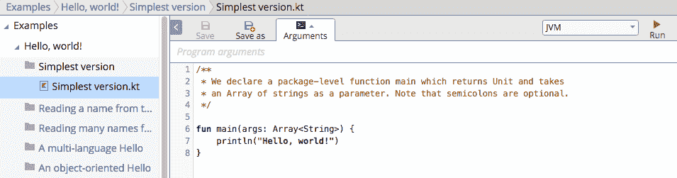
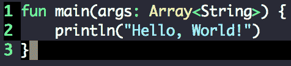
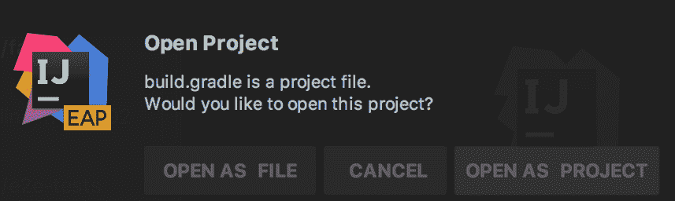
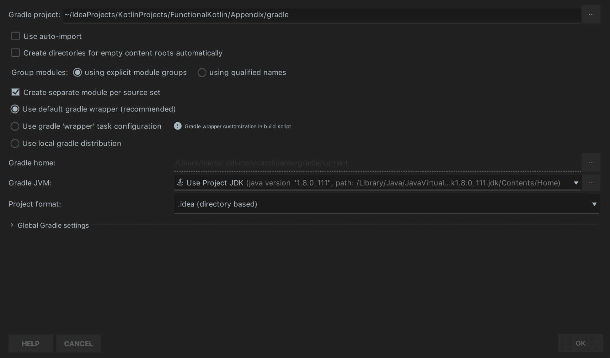
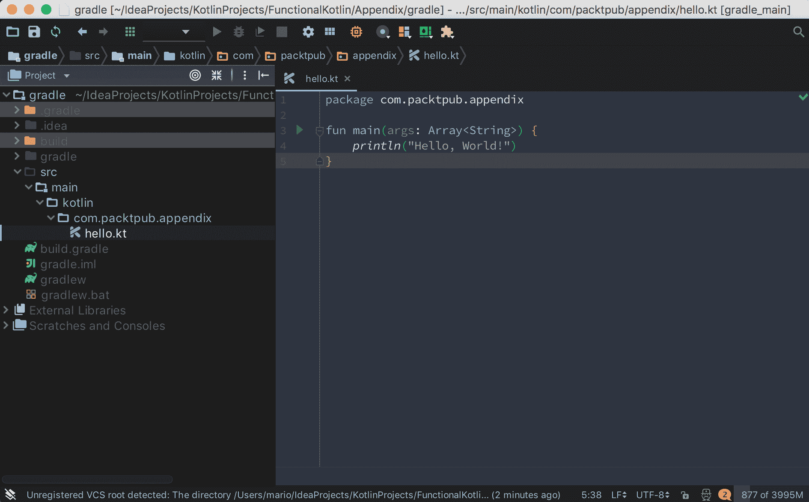
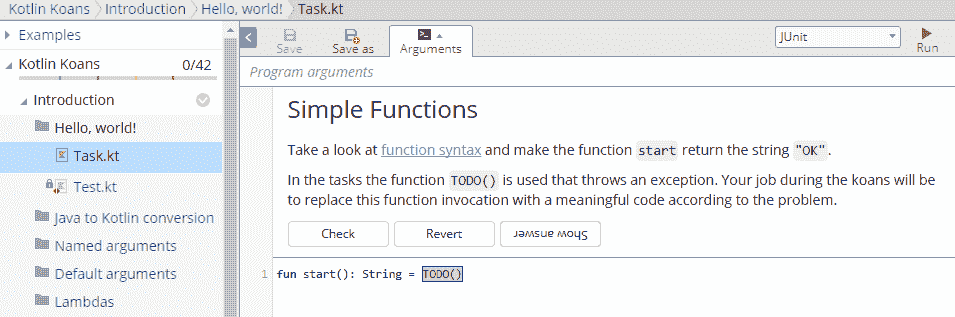

# 第十四章：Kotlin 快速入门

本书旨在为已经熟悉 Kotlin 工作方式的人编写。但如果你对这个语言完全陌生，不用担心，我们为你提供了阅读、理解和充分利用本书所需的一切。

在本附录中，我们将涵盖以下主题：

+   使用 Kotlin 的不同方式

+   Kotlin 的基本控制结构

+   其他资源

# 编写和运行 Kotlin

我们将涵盖一套全面的选项来编写和运行 Kotlin，从最简单的到最专业的。

# Kotlin 在线

没有需要安装的，只需打开 Kotlin ([`try.kotlinlang.org/`](https://try.kotlinlang.org/))。Kotlin 在线包含了编写和运行简单 Kotlin 程序所需的一切，包括 JVM 和 JavaScript 编译选项。如果你有账户，你甚至可以创建和保存你的程序：



# 在你的控制台中

对于任何严肃且打算用于生产代码的内容，在线选项并不是最佳选择。让我们来探讨如何在你的机器上安装它。

# 安装 SDKMAN

安装 Kotlin 最便捷的选项是使用 SDKMAN，这是一个用于安装和更新 JVM 工具的工具。

使用以下命令安装 SDKMAN（如果你还没有安装）：

```java
$ curl -s "https://get.sdkman.io" | bash
```

一旦 SDKMAN 安装完成，我们就可以使用它来安装 Kotlin 并保持其更新，以及其他工具，如 Gradle 和 Maven。

# 通过 SDKMAN 安装 Kotlin

要通过 SDKMAN 安装 Kotlin，你只需输入以下内容：

```java
$ sdk install kotlin
```

现在我们已经在我们的控制台中有了 Kotlin 命令。

# Kotlin 的 REPL

要与 Kotlin 的 REPL 互动，你可以输入以下内容：

```java
$ kotlinc
```

现在你可以输入并执行 Kotlin 表达式：

```java
$ kotlinc
Welcome to Kotlin version 1.2.21 (JRE 1.8.0_111-b14)
Type :help for help, :quit for quit
>>> println("Hello, World!")
Hello, World!
>>> 
```

要退出 Kotlin 的 REPL，你可以输入`:quit`

# 编译和执行 Kotlin 文件

支持 Kotlin 的编辑器有多个——Micro、Vim、NeoVim、Atom 和 VS Code。

我首选使用的编辑器是 Micro，([`micro-editor.github.io/index.html`](https://micro-editor.github.io/index.html))。它是一个快速且易于使用的编辑器（有点像超强大的 Nano）：



在你喜欢的编辑器中，创建一个名为`hello.kt`的文件，并输入以下代码：

```java
fun main(args: Array<String>) {
    println("Hello, World!")
}
```

现在在你的控制台中，使用以下命令编译你的程序：

```java
$ kotlinc hello.kt
```

要执行它，请在你的控制台中输入以下内容：

```java
$ kotlin HelloKt
```

# 使用 Gradle

对于任何超过几个文件的任何项目，构建工具都成为必需品。构建工具为你提供了一种实用方式来编译、管理库以及打包和执行应用程序。Gradle ([`docs.gradle.org/current/release-notes.html`](https://docs.gradle.org/current/release-notes.html)) 是一个支持多种语言的构建工具，包括 Kotlin。

# 通过 SDKMAN 安装 Gradle

要通过 SDKMAN 安装 Gradle，你只需输入以下内容：

```java
sdk install gradle
```

现在我们已经在我们的控制台中有了`gradle`命令。

# 创建可分发的 Gradle 命令

虽然 Gradle 是一个伟大的工具，但共享依赖于 Gradle 构建的代码并不容易。我们开源项目的潜在用户可能没有安装 Gradle，甚至可能没有我们相同的 Gradle 版本。幸运的是，Gradle 提供了一种创建可分发 Gradle 工具或命令的方法。

在一个新、干净的目录中，在您的控制台输入以下内容：

```java
$ gradle wrapper
```

此命令创建了一个可执行的 `gradlew` 脚本。第一次运行此命令时，它会下载所有必要的 Gradle 文件，然后成为一个可重复执行的命令。

# 创建 Gradle 项目文件

为了 Gradle 能够工作，我们必须有一个 `build.gradle` 文件。在这个文件中，我们将为 Gradle 设置不同的选项和设置，以便其使用和运行。

对于我们的基本 `Hello World` 程序，我们的文件必须看起来像这样：

```java
group 'com.packtpub'
version '1.0'

buildscript {
    ext.kotlin_version = '1.2.21'

    repositories {
        mavenCentral()
    }
    dependencies {
        classpath "org.jetbrains.kotlin:kotlin-gradle-plugin:$kotlin_version"
    }
}

apply plugin: 'kotlin'
apply plugin: 'application'

mainClassName = 'com.packtpub.appendix.HelloKt'

defaultTasks 'run'

repositories {
    mavenCentral()
}

dependencies {
    compile "org.jetbrains.kotlin:kotlin-stdlib-jdk8:$kotlin_version"
}

compileKotlin {
    kotlinOptions.jvmTarget = "1.8"
}

compileTestKotlin {
    kotlinOptions.jvmTarget = "1.8"
}

```

通常，在 `build.gradle` 文件中，我们定义一些插件（Gradle 插件定义了对语言和框架的支持），存储库以下载依赖项，依赖项本身，以及其他选项。

在此文件中，我们定义了两个插件——一个用于 Kotlin，另一个用于将我们的项目定义为具有起始点或主类的应用程序。

# 创建我们的 Hello World 代码

Gradle 默认搜索 Kotlin 文件的目录位置是 `src/main/kotlin`。我们将 `hello.kt` 文件放置在 `src/main/kotlin/com/packtpub/appendix` 目录中：

```java
package com.packtpub.appendix

fun main(args: Array<String>) {
    println("Hello, World!")
}
```

现在我们可以使用以下命令一次性编译和运行：

```java
$ ./gradlew
```

由于我们已定义默认任务为 `run` 且主类为 `com.packtpub.appendix.HelloKt`，只需运行 `./gradlew` 就可以构建并运行我们的程序。

# 使用 IntelliJ IDEA 或 Android Studio

IntelliJ IDEA 和 Android Studio（它基于 IntelliJ IDEA 的开源版本）是 Kotlin（以及其他语言，如 Java、Scala、Groovy 等）的出色 IDE。两者都提供自动完成、格式化和对 Gradle 和 Maven 的支持。

这两个 IDE 都有很好的文档，你可以在它们的网站上了解更多关于 Kotlin 的支持信息：

+   IntelliJ IDEA ([`kotlinlang.org/docs/tutorials/getting-started.html`](http://kotlinlang.org/docs/tutorials/getting-started.html))

+   Android Studio ([`developer.android.com/kotlin/get-started.html`](https://developer.android.com/kotlin/get-started.html))

# 使用 IntelliJ IDEA 导入 Gradle 文件

我们可以在 IntelliJ IDEA 中导入我们的 Gradle 项目。一旦启动 IDEA，我们就可以打开我们的 `build.gradle` 文件：


将会弹出一个对话框，询问您是否想将其作为文件或项目打开。点击“打开为项目”：



如果您已安装 JDK 并在 IntelliJ IDEA 中设置，只需点击“确定”。如果您没有配置 JDK，那么请进行配置（IntelliJ IDEA 将引导您完成配置）然后继续点击“确定”：



现在，我们可以使用 IntelliJ IDEA 的所有功能来编辑和我们的项目：



你可以用同样的方式打开这本书中的所有示例代码。

# 基本 Kotlin 语法

对于有 C 风格语法（如 C、Java、Scala、Groovy 和 TypeScript）经验的开发者来说，Kotlin 语法看起来很熟悉。

# 通用特性

各种 Kotlin 功能在 JVM 语言中都很常见。如果你有 Java 的经验，你会觉得 Kotlin 很亲切。

# 包

包是一组文件（通常定义在同一个目录中），用于定义逻辑单元，例如控制器和存储库。

要设置特定包中的文件，请在第一行使用 `package` 关键字：

```java
package com.packt.functionalkotlin
```

理想情况下，包 `com.packt.functionalkotlin` 内的文件应该位于目录 `com/packt/functionalkotlin` 中。这使文件更容易找到，但在 Kotlin 中不是强制性的。

# 字符串连接和插值

Kotlin 中的字符串连接使用加号（`+`）运算符：

```java
val temperature = 12

println("Current temperature: " + temperature + " Celsius degrees")
```

字符串插值是进行复杂连接的简单方法：

```java
val temperature = 12

println("Current temperature: $temperature Celsius degrees")
```

使用符号美元（`$`）让你可以在字符串内部使用简单值：

```java
val temperature = 12

println("Temperature for tonight: ${temperature - 4} Celsius degrees")
```

对于比仅仅使用值更复杂的情况，你可以使用带有大括号的美元符号（`${... }`）：

# 注释

单行注释使用双斜杠（`//`）：

```java
// This is a single line comment

println("Hello, World!") // This is a single line comment too, after valid code
```

块注释使用斜杠和星号来打开块（`/*`）以及星号和斜杠来关闭（`*/`）：

```java
/*
This is a multi-line comment,
Roses are red
... and I forgot the rest

*/

println(/*block comments can be inside valid code*/ "Hello, World!")
```

# 控制结构

Kotlin 有四种基本的控制结构——`if`、`when`、`for` 和 `while`。

# if 表达式

Kotlin 中的 `if` 看起来与任何其他 C 风格语言完全一样：

```java
if (2 > 1) { //Boolean expression
    println("2 is greater than 1")
} else {
    println("This never gonna happen")
}
```

在 Kotlin 中，`if`（以及 `when`）是一个表达式。这意味着 `if` 语句会返回一个值：

```java
val message = if (2 > 1) {
    "2 is greater than 1"
} else {
    "This never gonna happen"
}

println(message)
```

Kotlin 没有三元表达式，但可以用单行写一个 `if` 表达式：

```java
println(if(2 > 1) "2 is greater than 1" else "This never gonna happen")
```

# when 表达式

与其他 C 风格语言不同，Kotlin 没有使用 `switch` 语句，但有一个更加灵活的 `when` 表达式：

```java
val x: Int = /*Some unknown value here*/

when (x) {
    0 -> println("x is zero")
    1, 2 -> println("x is 1 or 2")
    in 3..5 -> println("x is between 3 and 5")
    else -> println("x is bigger than 5... or maybe is negative...")
}
```

`when` 是表达式：

```java
val message = when {
    2 > 1 -> "2 is greater than 1"
    else -> "This never gonna happen"
}

println(message)
```

它们也可以用来替换 `if` 表达式：

# for 循环

`for` 循环可以遍历任何提供迭代器的对象（例如，集合和范围）：

```java
for(i in 1..10) { // range
    println("i = $i")
}
```

# while 和 do 循环

`while` 和 `do` 循环是标准的 C 风格循环：

```java
var i = 1

while (i <= 10) {
    println("i = $i")
    i++
}

do {
    i--
    println("i = $i")
} while (i > 0)
```

现在你已经拥有了所有基本的部分，你就有了一切阅读和理解这本书内容所需的东西。

# 进一步学习

如果你想要提升你的 Kotlin 知识和理解，前进的最佳方式是尝试 Kotlin Koans。

Kotlin Koans 是一个教程，它将引导你在几天内从初学者逐步成为一名非常熟练的 Kotlin 程序员，而且更好的是，它是免费的。

你可以在 [`try.kotlinlang.org/#/Kotlin%20Koans/Introduction/Hello,%20world!/Task.kt`](https://try.kotlinlang.org/#/Kotlin%20Koans/Introduction/Hello,%20world!/Task.kt) 尝试 Kotlin Koans：


