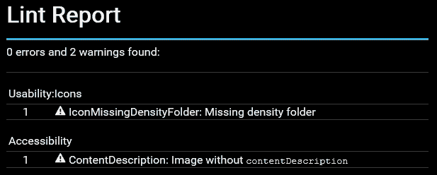
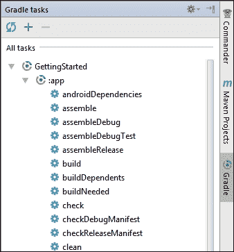
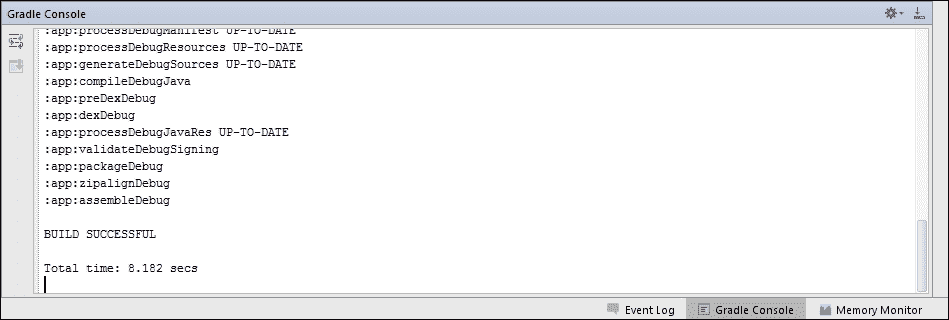
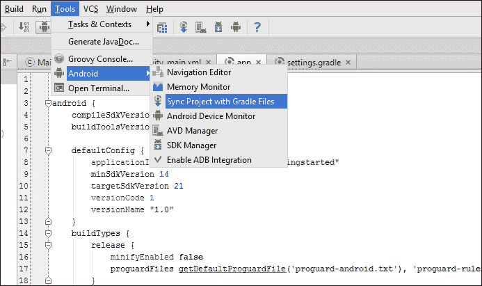
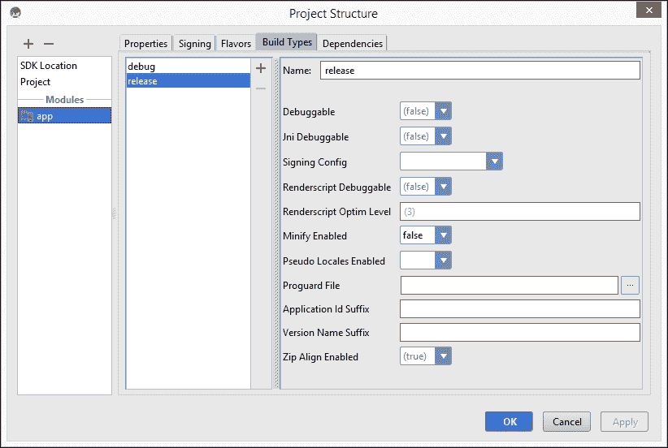

# 第二章. 基本构建自定义

我们一开始是查看 Gradle 的用途，创建和转换 Android 项目。现在，是时候更好地理解构建文件，查看一些有用的任务，并探索 Gradle 和 Android 插件的潜力。

在本章中，我们将探讨以下主题：

+   理解 Gradle 文件

+   开始使用构建任务

+   自定义构建

# 理解 Gradle 文件

当使用 Android Studio 创建新项目时，默认会生成三个 Gradle 文件。其中两个文件，`settings.gradle`和`build.gradle`，最终位于项目的顶层。另一个`build.gradle`文件在 Android 应用程序模块中创建。这就是 Gradle 文件在项目中的放置方式：

```java
MyApp
├── build.gradle
├── settings.gradle
└── app
    └── build.gradle
```

这三个文件各自有其用途，我们将在接下来的章节中进一步探讨。

## 设置文件

对于仅包含 Android 应用程序的新项目，`settings.gradle`看起来像这样：

```java
include ':app'
```

设置文件在初始化阶段执行，并定义了哪些模块应包含在构建中。在这个例子中，`app`模块被包含在内。单模块项目不一定需要设置文件，但多模块项目则需要；否则，Gradle 不知道要包含哪些模块。

在幕后，Gradle 为每个设置文件创建一个`Settings`对象，并从该对象调用必要的方法。您不需要了解`Settings`类的详细信息，但了解这一点是好的。

### 注意

对`Settings`类的完整解释超出了本书的范围。如果您想了解更多信息，可以在 Gradle 文档中找到大量信息（[`gradle.org/docs/current/dsl/org.gradle.api.initialization.Settings.html`](https://gradle.org/docs/current/dsl/org.gradle.api.initialization.Settings.html)）。

## 顶层构建文件

顶层`build.gradle`文件是您可以配置需要应用于项目中所有模块的选项的地方。它默认包含两个块：

```java
buildscript {
    repositories {
        jcenter()
    }
    dependencies {
        classpath 'com.android.tools.build:gradle:1.2.3'
    }
}

allprojects {
    repositories {
        jcenter()
    }
}
```

`buildscript` 块是实际构建配置的地方。我们曾在第一章中简要介绍了这一点，即*使用 Gradle 和 Android Studio 入门*。`repositories` 块配置了 JCenter 作为仓库。在这种情况下，仓库意味着依赖项的来源，换句话说，是一个我们可以用于我们的应用程序和库的可下载库的列表。JCenter 是一个知名的 Maven 仓库。

`dependencies` 块用于配置构建过程的依赖项。这意味着您不应该在顶层构建文件中包含您需要用于您的应用程序或库的依赖项。默认定义的唯一依赖项是 Gradle 的 Android 插件。这对于每个 Android 模块都是必需的，因为正是这个插件使得执行 Android 相关任务成为可能。

`allprojects`块可以用来定义需要应用于所有模块的属性。您甚至可以在`allprojects`块中创建任务。这些任务随后将在所有模块中可用。

### 注意

一旦使用`allprojects`，模块就会与项目耦合。这意味着可能无法在没有主项目构建文件的情况下单独构建模块。一开始可能看起来不是问题，但后来您可能决定将内部库分离成自己的项目，那时您将需要重构您的构建文件。

## 模块构建文件

模块级别的`build.gradle`文件包含仅适用于 Android 应用程序模块的选项。它还可以覆盖顶级`build.gradle`文件中的任何选项。模块构建文件看起来是这样的：

```java
apply plugin: 'com.android.application'

android {
    compileSdkVersion 22
    buildToolsVersion "22.0.1"

    defaultConfig {
        applicationId "com.gradleforandroid.gettingstarted"
        minSdkVersion 14
        targetSdkVersion 22
        versionCode 1
        versionName "1.0"
    }
    buildTypes {
        release {
            minifyEnabled false
            proguardFiles getDefaultProguardFile('proguard-android.txt'), 'proguard-rules.pro'
        }
    }
}

dependencies {
    compile fileTree(dir: 'libs', include: ['*.jar'])
    compile 'com.android.support:appcompat-v7:22.2.0'
}
```

我们将详细探讨三个主要部分。

### 插件

第一行应用 Android 应用程序插件，该插件在顶级构建文件中配置为依赖项，我们之前已经讨论过。Android 插件由谷歌的 Android Tools 团队编写和维护，提供构建、测试和打包 Android 应用程序和库所需的所有任务。

### Android

构建文件的最大部分是`android`块。此块包含整个 Android 特定配置，通过我们之前应用的 Android 插件提供。

只需的属性是`compileSdkVersion`和`buildToolsVersion`：

+   第一个，`compileSdkVersion`，是您想要用于编译应用程序的 Android API 版本

+   第二个，`buildToolsVersion`，是构建工具和编译器的版本

构建工具包含命令行实用工具，例如 aapt、zipalign、dx 和 renderscript；这些工具用于生成构成您应用程序的各种中间文件。您可以通过 SDK 管理器下载构建工具。

`defaultConfig`块配置应用程序的核心属性。此块中的属性将覆盖`AndroidManifest.xml`清单文件中的相应条目：

```java
defaultConfig {
    applicationId "com.gradleforandroid.gettingstarted"
    minSdkVersion 14
    targetSdkVersion 22
    versionCode 1
    versionName "1.0"
}
```

此块中的第一个属性是`applicationId`。它覆盖了清单文件中的包名，但`applicationId`和包名之间有一些区别。在 Gradle 被用作默认 Android 构建系统之前，`AndroidManifest.xml`中的包名有两个用途：它作为应用的唯一标识符，并且用作 R 资源类中的包名。Gradle 使得创建不同版本的应用变得更容易，使用构建变体。例如，制作免费版和付费版非常容易。这两个版本需要具有不同的标识符，以便在 Google Play Store 上作为不同的应用出现，并且可以同时安装。然而，源代码和生成的 R 类必须始终保留相同的包名。否则，所有源文件都需要根据你构建的版本进行更改。这就是为什么 Android 工具团队已经解耦了这两个不同的包名用法。在清单文件中定义的包名继续在你的源代码和 R 类中使用，而设备和 Google Play 用作唯一标识符的包名现在被称为*应用程序 ID*。随着我们开始尝试不同的构建类型，这个应用程序 ID 将变得更有趣。

`defaultConfig`中的下一个两个属性是`minSdkVersion`和`targetSdkVersion`。这两个属性看起来应该很熟悉，因为它们始终在`<uses-sdk>`元素中作为清单的一部分被定义。`minSdkVersion`设置用于配置运行应用所需的最小 API 级别。`targetSdkVersion`设置通知系统该应用已在特定的 Android 版本上进行了测试，并且操作系统不需要启用任何向前兼容的行为。这与我们之前看到的`compileSdkVersion`没有关系。

`versionCode`和`versionName`在清单文件中也具有相同的功能，并为你的应用定义了一个版本号和一个用户友好的版本名称。

构建文件中的所有值都将覆盖清单文件中的值。因此，如果你在`build.gradle`中定义了它们，就不需要在清单文件中定义它们。如果构建文件不包含值，则将使用清单值作为后备。

`buildTypes`块是定义如何构建和打包你的应用不同构建类型的部分。我们将在第四章*创建构建变体*中详细探讨构建类型。

### 依赖项

`dependencies` 块是标准 Gradle 配置的一部分（这就是为什么它放在 `android` 块之外），并定义了一个应用程序或库的所有依赖项。默认情况下，一个新的 Android 应用程序依赖于 `libs` 目录中的所有 JAR 文件。根据你在新项目向导中选择的选项，它可能还依赖于 `AppCompat` 库。我们将在第三章管理依赖项中讨论依赖项。

# 开始使用任务

要了解项目上可用的任务，你可以运行 `gradlew tasks`，这将打印出所有可用任务的列表。在一个新创建的 Android 项目中，这包括 Android 任务、构建任务、构建设置任务、帮助任务、安装任务、验证任务和其他任务。如果你想看到任务及其依赖项，你可以运行 `gradlew tasks --all`。可以进行任务的干运行，这将打印出运行特定任务时执行的所有步骤。这种干运行实际上不会执行这些步骤，因此这是一种安全的方式来查看运行特定任务时可以期待发生什么。你可以通过添加参数 `-m` 或 `--dry-run` 来进行干运行。

## 基础任务

Gradle 的 Android 插件使用了 Java 基础插件，该插件又使用了基础插件。这些添加了标准生命周期任务和一些常见的约定属性。基础插件定义了 `assemble` 和 `clean` 任务，Java 基础插件定义了 `check` 和 `build` 任务。这些任务在基础插件中没有实现，也不执行任何操作；它们用于定义插件约定，这些插件添加了实际执行工作的任务。

这些任务的约定是：

+   `assemble` 组装项目的输出（s）

+   `clean` 清理项目的输出

+   `check` 运行所有检查，通常是单元测试和仪器测试

+   `build` 运行 `assemble` 和 `check`

Java 基础插件还添加了源集的概念。Android 插件基于这些约定构建，因此暴露了经验丰富的 Gradle 用户习惯看到的任务。在这些基础任务之上，Android 插件还添加了许多特定于 Android 的任务。

## Android 任务

Android 插件扩展了基础任务并实现了它们的行为。这就是在 Android 环境中任务所做的事情：

+   `assemble` 为每个构建类型创建一个 APK

+   `clean` 删除所有构建工件，例如 APK 文件

+   `check` 执行 Lint 检查，如果 Lint 检测到问题则可以终止构建

+   `build` 运行 `assemble` 和 `check`

默认情况下，`assemble` 任务依赖于 `assembleDebug` 和 `assembleRelease`，如果你添加了更多构建类型，则还有更多任务。这意味着运行 `assemble` 将触发每个构建类型的构建。

除了扩展这些任务外，Android 插件还添加了一些新的任务。这些是最重要的新任务：

+   `connectedCheck` 在连接的设备或模拟器上运行测试

+   `deviceCheck` 是其他插件在远程设备上运行测试的占位符任务

+   `installDebug` 和 `installRelease` 将特定版本安装到连接的设备或模拟器

+   所有 `install` 任务都有对应的 `uninstall` 任务

`build` 任务依赖于 `check`，但不依赖于 `connectedCheck` 或 `deviceCheck`。这是为了确保常规检查不需要连接的设备或正在运行的模拟器。运行检查任务会生成一个包含所有警告和错误的 Lint 报告，其中包含详细说明和相关文档的链接。此报告可以在 `app/build/outputs` 中找到，并称为 `lint-results.html`。它看起来像这样：



当您构建发布版本时，Lint 会检查可能导致应用程序崩溃的致命问题。如果找到任何问题，它将中止构建并将错误打印到命令行界面。Lint 还会在 `app/build/outputs` 目录中生成一个名为 `lint-results-release-fatal.html` 的报告。如果您有多个问题，查看 HTML 报告比在命令行界面中来回滚动更愉快。提供的链接也非常有用，因为它们会带您到问题的详细解释。

## Android Studio 内部

您不一定要从命令行界面运行 Gradle 任务。Android Studio 有一个包含所有可用任务的工具窗口。此工具窗口称为 **Gradle**，看起来像这样：



从此工具窗口，您可以通过双击其名称来运行任务。您可以在 **Gradle 控制台** 工具窗口中跟踪任何正在运行的任务的进度。如果您找不到这些工具窗口，您可以在 **视图** 菜单下的 **工具窗口** 中打开它们。这是 Gradle 控制台工具窗口的外观：



您还可以在 Android Studio 内部的命令行界面中运行任务，因此如果您喜欢，可以在 IDE 内完成所有与应用程序相关的操作。要运行命令，您需要打开 **终端** 工具窗口。这是一个完整的终端，因此您可以从它运行任何命令。您可能需要首先导航到项目的顶层，以便使用 Gradle 包装器。

### 小贴士

**更改 Android Studio 终端**

您可以在 Android Studio 内部配置终端以使用不同的 shell。例如，在 Microsoft Windows 上，默认情况下终端是命令提示符。如果您更喜欢使用 Git Bash（或任何其他 shell），请打开 Android Studio 设置（在 `文件` 和 `设置` 之下）并查找 **终端**。在那里您可以更改 shell 路径。对于 Microsoft Windows 上的 Git Bash，它看起来像这样：`C:\Program Files (x86)\Git\bin\sh.exe --login -i`。

# 自定义构建

有很多种方法可以自定义构建过程，当你正在 Android Studio 中编辑构建文件时，建议始终与 Gradle 文件同步项目，无论你正在自定义什么。当你开始添加依赖项或 `BuildConfig` 字段时，这尤其重要，我们很快就会讨论这个问题。

当你编辑 `settings.gradle` 或 `build.gradle` 时，Android Studio 将在编辑器中显示一条消息，并且可以通过导航到 **工具** | **Android** | **与 Gradle 文件同步项目** 或工具栏中的相应按钮来在任何时候触发同步。



在底层，Android Studio 同步实际上运行 `generateDebugSources` 任务来生成所有必要的类，基于构建文件中的配置。

## 操作清单条目

我们已经看到，可以直接从构建文件而不是在清单文件中配置 `applicationId`、`minSdkVersion`、`targetSdkVersion`、`versionCode` 和 `versionName`。还有一些其他属性可以操作：

+   `testApplicationId` 是仪器测试 APK 的应用程序 ID

+   `testInstrumentationRunner` 是用于运行测试的 JUnit 测试运行器的名称（参见第六章，*运行测试*）

+   `signingConfig`（参见第四章，*创建构建变体*）

+   `proguardFile` 和 `proguardFiles`（参见第九章，*高级构建自定义*）

### 在 Android Studio 内部

除了在构建文件中手动进行更改外，你还可以在 Android Studio 的 **项目结构** 对话框中更改基本设置。你可以从 **文件** 菜单打开对话框，它允许你编辑项目范围的设置和每个模块的设置。对于每个 Android 模块，你可以更改标准的 Android 插件属性和所有清单属性。在下面的屏幕截图中，你可以看到在 **项目结构** 对话框中应用程序模块发布版本的属性：



注意，如果你在 **项目结构** 对话框中进行了任何更改，Android Studio 将将更改写入 Gradle 构建配置文件。

## BuildConfig 和资源

自 SDK 工具版本 17 以来，构建工具生成一个名为 `BuildConfig` 的类，其中包含一个根据构建类型设置的 `DEBUG` 常量。如果你只想在调试时运行某些代码，例如日志记录，这很有用。通过 Gradle 可以扩展该文件，以便你可以拥有在调试和发布中包含不同值的常量。

这些常量对于切换功能或设置服务器 URL 等很有用：

```java
android {
    buildTypes {
        debug {
            buildConfigField "String", "API_URL", "\"http://test.example.com/api\""
            buildConfigField "boolean", "LOG_HTTP_CALLS", "true"
        }

        release {
            buildConfigField "String", "API_URL", "\"http://example.com/api\""
            buildConfigField "boolean", "LOG_HTTP_CALLS", "false"
        }
    }
}
```

字符串值周围需要转义的双引号，以便将其生成为一个实际的字符串。在添加 `buildConfigField` 行之后，就可以在真实的 Java 代码中使用 `BuildConfig.API_URL` 和 `BuildConfig.LOG_HTTP`。

最近，Android 工具团队也添加了以类似方式配置资源的功能：

```java
android {
    buildTypes {
        debug {
            resValue "string", "app_name", "Example DEBUG"
        }

        release {
            resValue "string", "app_name", "Example"
        }
    }
}
```

在这里不需要转义的双引号，因为资源值默认总是用 `value=""` 包裹。

## 项目级设置

如果你在一个项目中有一个以上的 Android 模块，将设置应用到所有模块而不必手动更改每个模块的构建文件可能很有用。我们已经在生成的顶层构建文件中看到了如何使用 `allprojects` 块来定义仓库，你也可以使用相同的策略来应用 Android 特定的设置：

```java
allprojects {
    apply plugin: 'com.android.application'

    android {
        compileSdkVersion 22
        buildToolsVersion "22.0.1"
    }
}
```

但是，这仅在你所有的模块都是 Android 应用项目时才有效，因为你需要应用 Android 插件来访问 Android 特定的设置。实现此行为更好的方法是，在顶层构建文件中定义值，然后在模块中应用它们。在 Gradle 中，可以在 `Project` 对象上添加额外的临时属性。这意味着任何 `build.gradle` 文件都可以定义额外的属性，这通常发生在 `ext` 块中。

你可以在顶层构建文件中添加一个带有自定义属性的 `ext` 块：

```java
ext {
    compileSdkVersion = 22
    buildToolsVersion = "22.0.1"
}
```

这使得在模块级构建文件中使用 `rootProject` 来使用属性成为可能：

```java
android {
    compileSdkVersion rootProject.ext.compileSdkVersion
    buildToolsVersion rootProject.ext.buildToolsVersion
}
```

## 项目属性

之前示例中的 `ext` 块是定义额外属性的一种方式。你可以使用属性来动态地自定义构建过程，我们将在第七章创建任务和插件中开始编写自定义任务时使用它们。定义属性有几种方法，但我们只会查看最常用的三种：

+   `ext` 块

+   `gradle.properties` 文件

+   `-P` 命令行参数

下面是一个包含这三种添加额外属性方式的 `build.gradle` 文件示例：

```java
ext {
  local = 'Hello from build.gradle'
}

task printProperties << {
  println local        // Local extra property
  println propertiesFile        // Property from file
  if (project.hasProperty('cmd')) {
    println cmd        // Command line property
  }
}
```

这是伴随的 `gradle.properties` 文件（在同一文件夹中）：

```java
propertiesFile = Hello from gradle.properties
```

### 注意

在示例中，我们创建了一个新的任务。我们将在第七章创建任务和插件中查看任务并解释语法，*创建任务和插件*。

如果你使用命令行参数运行 `printProperties` 任务，输出将看起来像这样：

```java
$ gradlew printProperties -Pcmd='Hello from the command line'
:printProperties
Hello from build.gradle
Hello from gradle.properties
Hello from the command line

```

多亏了自定义属性，改变构建配置就像更改单个属性一样简单，甚至只需添加一个命令行参数即可。

### 注意

可以在顶层构建文件和模块构建文件中定义属性。如果模块定义了一个在顶层文件中已经存在的属性，它将简单地覆盖它。

## 默认任务

如果你运行 Gradle 而没有指定任务，它将运行`help`任务，该任务会打印有关如何使用 Gradle 的一些信息。这是因为帮助任务被设置为默认任务。可以覆盖默认任务，并在每次执行 Gradle 而不明确指定任务时运行一个非常常见的任务，甚至多个任务。

要指定默认任务，请将此行添加到顶级`build.gradle`文件中：

```java
defaultTasks 'clean', 'assembleDebug'
```

现在，当你不带任何参数运行 Gradle 包装器时，它将运行`clean`和`assembleDebug`。通过运行`tasks`任务并过滤输出，很容易看到哪些任务被设置为默认任务。

```java
$ gradlew tasks | grep "Default tasks"
Default tasks: clean, assembleDebug

```

# 摘要

在本章中，我们详细研究了 Android Studio 自动生成的不同 Gradle 文件。你现在可以自己创建构建文件，并添加所有必需的字段以及配置关键属性。

我们从基本的构建任务开始，学习了 Android 插件如何在基础插件的基础上构建，并扩展了新的 Android 特定任务。我们还看到了如何从命令行界面和 Android Studio 内部运行构建任务。

在本章的最后部分，我们探讨了影响构建输出的一些方法，以及配置构建过程本身部分的方法。

在过去的几年里，Android 开发者生态系统得到了巨大的发展，许多有趣的库都变得可供每个人使用。在下一章中，我们将探讨几种向项目添加依赖项的方法，以便我们可以利用这些丰富的资源。
